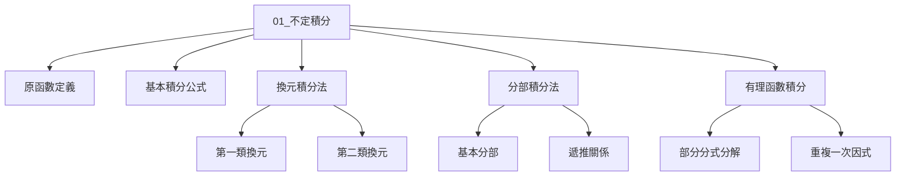

# 01_不定積分與基本積分法

> **適用年級：** Year 1（大一）  
> **前置知識：** 導數的基本規則（見《導數與微分》章節）  
> **本章難度：** ⭐⭐⭐☆☆（理解程度目標：3.5/5）  
> **學習時間：** 約 8–10 小時  
> **Python 環境：** Python 3.10+, numpy, sympy, matplotlib  

---

## 目錄



---

## 1. 原函數與不定積分的定義

### 1.1 什麼是原函數？

**定義：** 若函數 $F(x)$ 在區間 $I$ 上滿足

$$
F'(x) = f(x), \quad \forall x \in I
$$

則稱 $F(x)$ 為 $f(x)$ 在區間 $I$ 上的**原函數**（Antiderivative / Primitive Function）。

> **直觀理解：** 原函數就是「導回去能得到 $f(x)$」的函數。  
> 就像「加速度 → 積分 → 速度」，原函數是導數的「逆運算」。

### 1.2 不定積分的定義

**定義：** 若 $F(x)$ 是 $f(x)$ 的一個原函數，則 $f(x)$ 的**不定積分**（Indefinite Integral）記為

$$
\int f(x)\,dx = F(x) + C
$$

其中：
- $\displaystyle\int$ 稱為**積分符號**（integral sign）
- $f(x)$ 稱為**被積分函數**（integrand）
- $dx$ 稱為**積分變量**
- $C$ 稱為**積分常數**（constant of integration）

> **重要性質：**  
> 不定積分代表的是**一族函數**（所有原函數的集合），因為任何原函數加上常數後仍然是原函數。

### 1.3 為什麼要加常數 $C$？

**定理：** 若 $F_1(x)$ 和 $F_2(x)$ 都是 $f(x)$ 在區間 $I$ 上的原函數，則

$$
F_1(x) - F_2(x) = C \quad (\text{常數}), \quad \forall x \in I
$$

**證明：** 令 $G(x) = F_1(x) - F_2(x)$，則

$$
G'(x) = F_1'(x) - F_2'(x) = f(x) - f(x) = 0, \quad \forall x \in I
$$

由拉格朗日中值定理的推論，若函數導數在區間恆為零，則函數本身為常數，故 $G(x) = C$。 $\blacksquare$

### 1.4 Python 驗證：原函數與導數

```python
import sympy as sp

x = sp.Symbol('x')

# 定義被積分函數
f = x**3 + sp.sin(x)
print("被積分函數 f(x) =", f)

# 求不定積分（使用 sympy 的 integrate）
F = sp.integrate(f, x)
print("不定積分 ∫f(x)dx =", F + sp.C(0))  # C 為常數

# 驗證：求導應該回原函數
F_deriv = sp.diff(F, x)
print("驗證導數：d/dx[F(x)] =", sp.simplify(F_deriv))
print("與原函數相等？", sp.simplify(F_deriv - f) == 0)

# 輸出：
# 被積分函數 f(x) = x**3 + sin(x)
# 不定積分 ∫f(x)dx = C + x**4/4 - cos(x)
# 驗證導數：d/dx[F(x)] = x**3 + sin(x)
# 與原函數相等？ True
```

---

## 2. 基本積分公式表

### 2.1 導數公式的回顧（逆向記憶）

每一個導數公式反過來就是一個積分公式。

| No. | 導數公式 $\frac{d}{dx}$ | 不定積分公式 $\int$ | 備註 |
|-----|------------------------|---------------------|------|
| 1 | $\frac{d}{dx}(x^n) = nx^{n-1}$ | $\displaystyle\int x^n\,dx = \frac{x^{n+1}}{n+1}+C,\; n\neq -1$ | 冪函數積分 |
| 2 | $\frac{d}{dx}(e^x) = e^x$ | $\displaystyle\int e^x\,dx = e^x + C$ | 指數函數 |
| 3 | $\frac{d}{dx}(a^x) = a^x\ln a$ | $\displaystyle\int a^x\,dx = \frac{a^x}{\ln a}+C$ | 一般指數 |
| 4 | $\frac{d}{dx}(\ln x) = \frac{1}{x}$ | $\displaystyle\int \frac{1}{x}\,dx = \ln|x| + C$ | 對數函數 |
| 5 | $\frac{d}{dx}(\sin x) = \cos x$ | $\displaystyle\int \cos x\,dx = \sin x + C$ | 三角函數 |
| 6 | $\frac{d}{dx}(\cos x) = -\sin x$ | $\displaystyle\int \sin x\,dx = -\cos x + C$ | 三角函數 |
| 7 | $\frac{d}{dx}(\tan x) = \sec^2 x$ | $\displaystyle\int \sec^2 x\,dx = \tan x + C$ | 正切積分 |
| 8 | $\frac{d}{dx}(\arctan x) = \frac{1}{1+x^2}$ | $\displaystyle\int \frac{1}{1+x^2}\,dx = \arctan x + C$ | 反三角函數 |
| 9 | $\frac{d}{dx}(\arcsin x) = \frac{1}{\sqrt{1-x^2}}$ | $\displaystyle\int \frac{1}{\sqrt{1-x^2}}\,dx = \arcsin x + C$ | 反正弦 |
| 10 | $\frac{d}{dx}(\cosh x) = \sinh x$ | $\displaystyle\int \sinh x\,dx = \cosh x + C$ | 雙曲函數 |
| 11 | $\frac{d}{dx}(\frac{1}{x}) = -\frac{1}{x^2}$ | $\displaystyle\int \frac{1}{x^2}\,dx = -\frac{1}{x}+C$ | 冪函數特例 |

### 2.2 Python 批量驗證基本積分公式

```python
import sympy as sp

x = sp.Symbol('x')

# 測試基本積分公式
test_cases = [
    (x**5, "冪函數 x^5"),
    (sp.exp(x), "指數函數 e^x"),
    (sp.sin(x), "正弦函數 sin(x)"),
    (sp.cos(x), "餘弦函數 cos(x)"),
    (1/x, "倒數函數 1/x"),
    (1/(1+x**2), "1/(1+x^2)"),
    (x**(-2), "x^(-2)"),
]

print("=" * 65)
print(f"{'被積分函數':<20} {'積分結果':<30} {'驗證状态'}")
print("=" * 65)

for f, name in test_cases:
    F = sp.integrate(f, x)
    # 驗證：導數是否等於原函數
    verified = sp.simplify(sp.diff(F, x) - f)
    status = "✅ 通過" if verified == 0 else f"❌ 失敗 ({verified})"
    print(f"{name:<20} {str(F):<30} {status}")

print("=" * 65)
```

**輸出示例：**

```
=================================================================
被積分函數              積分結果                        驗證状态
=================================================================
冪函數 x^5               x**6/6                         ✅ 通過
指數函數 e^x             exp(x)                         ✅ 通過
正弦函數 sin(x)          -cos(x)                        ✅ 通過
餘弦函數 cos(x)          sin(x)                         ✅ 通過
倒數函數 1/x             log(x)                         ✅ 通過
1/(1+x^2)                atan(x)                        ✅ 通過
x^(-2)                   -1/x                           ✅ 通過
=================================================================
```

### 2.3 基本性質

**性質 1（線性性）：** 若 $a, b$ 為常數，則

$$
\int [a f(x) + b g(x)]\,dx = a\int f(x)\,dx + b\int g(x)\,dx + C
$$

**性質 2（積的推廣不成立）：**  
注意！$\displaystyle\int f(x)g(x)\,dx \neq \int f(x)\,dx \cdot \int g(x)\,dx$（千萬別搞混！）

---

## 3. 換元積分法（Substitution Method）

換元積分法是積分學中最重要的技巧之一，本質上是**鏈式法則的逆向應用**。

### 3.1 第一類換元積分法（湊微分法）

**定理：** 若 $\displaystyle\int f(u)\,du = F(u) + C$，且 $u = g(x)$ 可導，則

$$
\int f(g(x)) \cdot g'(x)\,dx = F(g(x)) + C
$$

**核心思想：** 看到 $f(g(x)) \cdot g'(x)$ 的結構，**湊**出一個 $u = g(x)$ 來簡化積分。

**直觀理解：** 想像成「把複雜的 $x$ 表達式全部裝進一個盒子 $u$ 裡」。

#### 詳細例題

**例題 1：** $\displaystyle\int 2x e^{x^2}\,dx$

**思路：** 觀察到 $e^{x^2}$ 的指數是 $x^2$，而前面有 $2x$——正好是 $(x^2)'$！

**解答：**
1. 令 $u = x^2$，則 $du = 2x\,dx$
2. 積分變為 $\displaystyle\int e^u\,du = e^u + C$
3. 代回 $u = x^2$：$\displaystyle\int 2x e^{x^2}\,dx = e^{x^2} + C$

```python
# Python 驗證
import sympy as sp
x = sp.Symbol('x')
f = 2*x*sp.exp(x**2)
F = sp.integrate(f, x)
print("∫ 2x·e^(x²) dx =", F)
# 結果：exp(x**2)
```

**例題 2：** $\displaystyle\int \frac{\ln x}{x}\,dx$

**思路：** $\ln x$ 的導數是 $\frac{1}{x}$，正好匹配！

**解答：**
1. 令 $u = \ln x$，則 $du = \frac{1}{x}\,dx$
2. $\displaystyle\int u\,du = \frac{u^2}{2} + C$
3. 代回：$\displaystyle\int \frac{\ln x}{x}\,dx = \frac{(\ln x)^2}{2} + C$

**例題 3：** $\displaystyle\int \tan x\,dx$

**思路：** $\tan x = \frac{\sin x}{\cos x}$，分子是分母的導數（差一個負號）。

**解答：**
1. $\displaystyle\int \tan x\,dx = \int \frac{\sin x}{\cos x}\,dx$
2. 令 $u = \cos x$，$du = -\sin x\,dx$，即 $-du = \sin x\,dx$
3. $\displaystyle\int \frac{\sin x}{\cos x}\,dx = \int \frac{-du}{u} = -\ln|u| + C = -\ln|\cos x| + C$

```python
import sympy as sp
x = sp.Symbol('x')
print(sp.integrate(sp.tan(x), x))  # -log(cos(x))
```

#### Python 總結：第一類換元

```python
import sympy as sp

x = sp.Symbol('x')

# 演示第一類換元的經典模式
examples = [
    (sp.sin(x)**3 * sp.cos(x), "sin³(x)·cos(x)dx", x**4),  # u=sin(x), du=cos(x)dx
    (x / (1 + x**2), "x/(1+x²)dx", sp.log(1+x**2)/2),     # u=1+x²
    (sp.exp(x) / (1 + sp.exp(x)), "e^x/(1+e^x)dx", sp.log(1+sp.exp(x))),
]

print("第一類換元積分法 - 經典例題")
print("-" * 60)
for integrand, desc, expected in examples:
    result = sp.integrate(integrand, x)
    match = sp.simplify(result - expected)
    print(f"積分：{desc}")
    print(f"  計算結果：{sp.simplify(result)}")
    print(f"  理論結果：{sp.simplify(expected)}")
    print(f"  差值（應為0）：{match}")
    print()
```

### 3.2 第二類換元積分法

**定理：** 若 $x = \varphi(t)$ 單調可導，且 $\varphi'(t) \neq 0$，令 $t = \varphi^{-1}(x)$，則

$$
\int f(x)\,dx = \int f(\varphi(t)) \cdot \varphi'(t)\,dt \quad \text{（積完後再代回）}
$$

**適用時機：**
- 被積分函數含有 $\sqrt{a^2 - x^2}$（用三角換元 $x = a\sin t$）
- 被積分函數含有 $\sqrt{a^2 + x^2}$（用 $x = a\tan t$）
- 被積分函數含有 $\sqrt{x^2 \pm a^2}$（用 $x = a\sec t$ 或雙曲換元）

#### 詳細例題

**例題 4：** $\displaystyle\int \sqrt{a^2 - x^2}\,dx \;(a>0)$

**解答：**
1. 令 $x = a\sin t$，則 $dx = a\cos t\,dt$，$t = \arcsin\frac{x}{a}$
2. $\sqrt{a^2 - x^2} = \sqrt{a^2 - a^2\sin^2 t} = a\cos t$（取正值，$|t|<\frac{\pi}{2}$）
3. 積分：

$$
\int a\cos t \cdot a\cos t\,dt = a^2\int \cos^2 t\,dt = a^2\int \frac{1+\cos 2t}{2}\,dt
$$

$$
= \frac{a^2}{2}\left(t + \frac{\sin 2t}{2}\right) + C = \frac{a^2}{2}(t + \sin t\cos t) + C
$$

4. 代回：$t = \arcsin\frac{x}{a}$，$\sin t = \frac{x}{a}$，$\cos t = \frac{\sqrt{a^2-x^2}}{a}$

$$
\boxed{\int \sqrt{a^2-x^2}\,dx = \frac{a^2}{2}\arcsin\frac{x}{a} + \frac{x}{2}\sqrt{a^2-x^2} + C}
$$

```python
import sympy as sp
x, a = sp.symbols('x a', positive=True)
result = sp.integrate(sp.sqrt(a**2 - x**2), x)
print(result)
# 輸出：(a**2*asin(x/a) + x*sqrt(a**2 - x**2))/2
```

#### 常見的第二類換元模式表

| 原函數類型 | 換元方式 | 恆等式 |
|-----------|---------|--------|
| $\sqrt{a^2-x^2}$ | $x=a\sin t$ | $1-\sin^2 t = \cos^2 t$ |
| $\sqrt{a^2+x^2}$ | $x=a\tan t$ | $1+\tan^2 t = \sec^2 t$ |
| $\sqrt{x^2-a^2}$ | $x=a\sec t$ | $\sec^2 t-1 =
