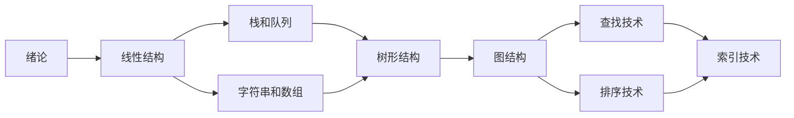
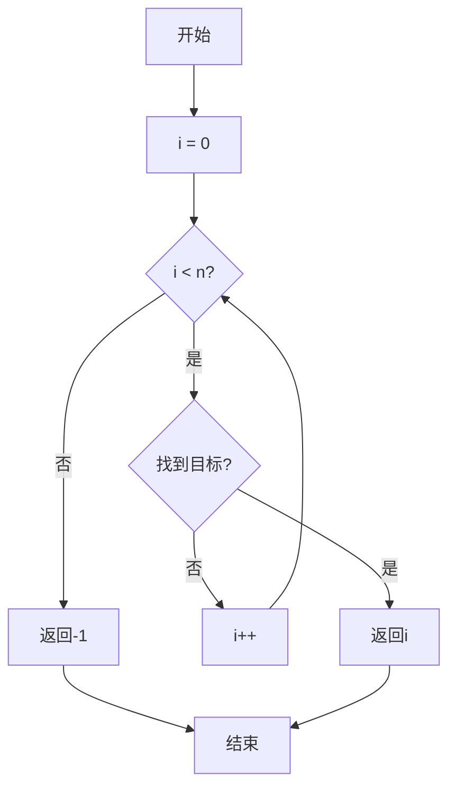
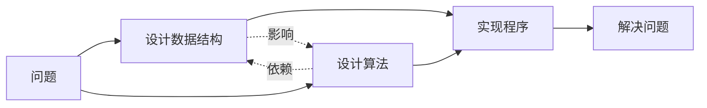
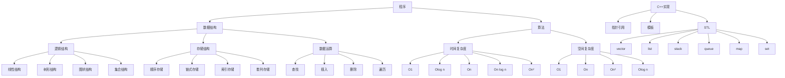

# 第1章：绪论

> 本章学习目标：
> - 理解数据结构的基本概念和重要性
> - 掌握算法的复杂度分析方法
> - 了解数据结构与算法的关系
> - 掌握C++中数据结构的实现基础

---

## 1.1 数据结构在程序设计中的作用

### 1.1.1 为什么需要数据结构

**程序设计的核心问题**：
计算机程序不仅仅是对数据进行处理，更重要的是如何有效地组织和存储数据。数据结构研究的就是数据的组织方式和存储方法，它是计算机科学的基础。

**经典公式**：
> **程序 = 数据结构 + 算法** —— Niklaus Wirth（1984年图灵奖得主）

**数据结构的重要性**：
1. **提高程序效率**：合理的数据结构可以显著提高程序的运行速度
2. **优化内存使用**：好的数据结构可以减少内存消耗
3. **增强程序可读性**：清晰的数据结构使代码更易理解和维护
4. **解决复杂问题**：许多复杂问题需要通过特定的数据结构来建模和求解

### 1.1.2 实际应用示例

**示例1：学生信息管理系统**

```cpp
// 不好的设计：使用多个独立的数组
int student_ids[1000];
string student_names[1000];
int student_ages[1000];
double student_scores[1000];
// 问题：数据之间没有关联，容易出错，难以维护

// 好的设计：使用结构体+数组
struct Student {
    int id;
    string name;
    int age;
    double score;
};

Student students[1000];
// 优点：数据相关联，结构清晰，易于管理
```

**示例2：图书检索系统**

- 如果图书馆的书籍随机存放，查找一本书需要O(n)时间
- 如果按照书名排序存放，可以使用二分查找，查找时间降为O(log n)
- 如果使用哈希表或索引系统，查找时间可达O(1)

**示例3：社交网络中的好友关系**

```cpp
// 使用邻接表存储好友关系
class SocialNetwork {
private:
    struct Node {
        int friend_id;
        Node* next;
    };

    vector<Node*> friends_list;  // 每个用户的好友列表

public:
    void add_friend(int user_id, int friend_id) {
        // 添加好友关系的操作
    }

    vector<int> get_friends(int user_id) {
        // 获取某用户的所有好友
    }
};
```

---

## 1.2 本书讨论的主要内容

### 1.2.1 数据结构分类

本书将讨论以下主要的数据结构类型：

1. **线性结构**
   - 线性表（顺序表、链表）
   - 栈和队列
   - 字符串

2. **树形结构**
   - 二叉树
   - 哈夫曼树
   - 树和森林

3. **图结构**
   - 有向图和无向图
   - 最小生成树
   - 最短路径

4. **查找和排序结构**
   - 查找表（二叉排序树、平衡树、散列表）
   - 排序算法
   - 索引技术

### 1.2.2 学习路径



### 1.2.3 实践建议

1. **理论与实践结合**：每个数据结构都要亲自实现
2. **注重复杂度分析**：理解每种操作的效率
3. **多练习编程**：通过编写代码加深理解
4. **应用导向**：思考数据结构在实际问题中的应用

---

## 1.3 数据结构的基本概念

### 1.3.1 数据结构

**定义**：
数据结构（Data Structure）是指相互之间存在一种或多种特定关系的数据元素的集合。

**核心概念**：

1. **数据（Data）**
   - 定义：是对客观事物的符号表示
   - 示例：数字、字符、图像、声音等
   - 特点：能够被计算机识别、存储和处理

2. **数据元素（Data Element）**
   - 定义：是数据的基本单位，在计算机程序中通常作为一个整体进行考虑和处理
   - 示例：学生记录、图书记录、产品信息
   - 特点：由若干数据项组成

3. **数据项（Data Item）**
   - 定义：是数据不可分割的最小单位
   - 示例：学生的姓名、学号、年龄、成绩
   - 特点：具有独立的含义

**三者关系**：
```
数据（整体）
  └── 数据元素（基本单位）
        └── 数据项（最小单位）
```

**示例**：
```cpp
// 学生信息管理系统
struct Student {  // 数据元素
    int id;       // 数据项
    string name;  // 数据项
    int age;      // 数据项
    double score; // 数据项
};

Student class_2024[50];  // 数据（50个学生记录的集合）
```

### 1.3.2 数据结构的三个要素

数据结构包含三个核心要素：逻辑结构、存储结构和数据运算。

#### 1. 逻辑结构（Logical Structure）

逻辑结构是指数据元素之间的逻辑关系，独立于计算机的存储。

**分类**：

```
逻辑结构
  ├── 线性结构
  │     └── 数据元素之间存在一对一的关系
  │     如：线性表、栈、队列、字符串
  │
  ├── 非线性结构
  │     ├── 树形结构
  │     │     └── 数据元素之间存在一对多的关系
  │     │     如：树、二叉树
  │     │
  │     └── 图状结构
  │           └── 数据元素之间存在多对多的关系
  │           如：有向图、无向图
  │
  └── 集合结构
        └── 数据元素之间没有特定的关系
        如：数学集合、并查集
```

**代码示例**：

```cpp
// 线性结构示例：数组
int linear_array[5] = {1, 2, 3, 4, 5};
// 关系：arr[i] 和 arr[i+1] 是相邻的

// 树形结构示例：二叉树
struct TreeNode {
    int value;
    TreeNode* left;   // 左孩子
    TreeNode* right;  // 右孩子
};
// 关系：一个节点最多有两个孩子节点

// 图结构示例：邻接表
struct GraphNode {
    int id;
    vector<GraphNode*> neighbors;  // 多个邻居
};
// 关系：一个节点可以有多个相邻节点
```

#### 2. 存储结构（Storage Structure）

存储结构是指数据在计算机中的存储方式，也称为物理结构。

**四种基本存储方式**：

| 存储方式     | 特点          | 优点          | 缺点         | 典型应用   |
| -------- | ----------- | ----------- | ---------- | ------ |
| **顺序存储** | 使用连续的内存空间   | 随机访问效率高     | 插入删除需要移动元素 | 数组、顺序表 |
| **链式存储** | 使用指针连接非连续空间 | 插入删除方便      | 不能随机访问     | 链表、树、图 |
| **索引存储** | 建立索引表提高查找效率 | 查找速度快       | 需要额外存储索引   | 数据库索引  |
| **散列存储** | 通过散列函数确定位置  | 查找、插入、删除都很快 | 可能发生冲突     | 散列表    |

**代码对比**：

```cpp
// 顺序存储：数组
int arr[5] = {10, 20, 30, 40, 50};
int value = arr[2];  // O(1) 随机访问

// 链式存储：链表
struct Node {
    int data;
    Node* next;
};

Node* head = new Node{10, nullptr};
head->next = new Node{20, nullptr};
head->next->next = new Node{30, nullptr};
// 访问第3个元素需要遍历 O(n)
```

#### 3. 数据运算（Data Operations）

数据运算是指对数据进行的各种操作。

**常见运算类型**：

1. **创建和销毁**
   - 创建数据结构
   - 销毁数据结构

2. **查询操作**
   - 查找特定元素
   - 获取元素数量
   - 判断是否为空

3. **修改操作**
   - 插入元素
   - 删除元素
   - 更新元素

4. **遍历操作**
   - 按某种顺序访问所有元素

**代码示例**：

```cpp
template <typename T>
class List {
public:
    // 创建
    List();

    // 销毁
    ~List();

    // 查询
    bool isEmpty() const;
    int size() const;
    T get(int index) const;

    // 修改
    void insert(int index, const T& value);
    void remove(int index);
    void update(int index, const T& value);

    // 遍历
    void traverse() const;
};
```

### 1.3.3 抽象数据类型（ADT）

**定义**：
抽象数据类型（Abstract Data Type，ADT）是指一个数学模型以及定义在该模型上的一组操作。它将数据和操作封装在一起，隐藏了实现细节。

**ADT的三个组成部分**：

1. **数据对象（Data Object）**
   - 定义数据的类型和范围

2. **数据关系（Data Relationship）**
   - 描述数据元素之间的关系

3. **基本操作（Basic Operations）**
   - 定义对数据可以进行的操作

**ADT示例：栈（Stack）**

```cpp
// ADT定义
ADT Stack {
    数据对象：D = {a_i | a_i ∈ ElemSet, i=1,2,...,n, n≥0}
    数据关系：R = {<a_i-1, a_i> | a_i-1, a_i ∈ D, i=2,...,n}
              约定a_n端为栈顶，a_1端为栈底
    基本操作：
        InitStack(&S)      // 初始化栈
        DestroyStack(&S)   // 销毁栈
        ClearStack(&S)     // 清空栈
        StackEmpty(S)      // 判断栈是否为空
        StackLength(S)     // 返回栈的长度
        GetTop(S, &e)      // 获取栈顶元素
        Push(&S, e)        // 入栈
        Pop(&S, &e)        // 出栈
}
```

**C++实现**：

```cpp
template <typename T>
class Stack {
private:
    vector<T> data;  // 使用vector作为底层容器

public:
    // 初始化
    Stack() = default;

    // 判断是否为空
    bool isEmpty() const {
        return data.empty();
    }

    // 获取栈的长度
    size_t size() const {
        return data.size();
    }

    // 获取栈顶元素
    T& top() {
        if (isEmpty()) {
            throw out_of_range("Stack is empty");
        }
        return data.back();
    }

    const T& top() const {
        if (isEmpty()) {
            throw out_of_range("Stack is empty");
        }
        return data.back();
    }

    // 入栈
    void push(const T& value) {
        data.push_back(value);
    }

    void push(T&& value) {
        data.push_back(std::move(value));
    }

    // 出栈
    void pop() {
        if (isEmpty()) {
            throw out_of_range("Stack is empty");
        }
        data.pop_back();
    }

    // 清空栈
    void clear() {
        data.clear();
    }
};
```

**ADT的优越性**：

1. **封装性**：隐藏实现细节，只暴露接口
2. **可维护性**：修改实现不影响使用
3. **可重用性**：可以在不同场景下使用
4. **安全性**：通过接口保护数据不被非法访问

---

## 1.4 算法及算法分析

### 1.4.1 算法及其描述方法

**算法定义**：
算法是解决特定问题的一系列明确步骤，是一个有穷规则的集合。

**算法的五个特征**：

1. **有穷性（Finiteness）**
   - 算法必须在有限步骤内终止
   - 不能无限循环
   - 示例：计算1+2+3+...+n是一个有穷过程

2. **确定性（Definiteness）**
   - 每个步骤必须有明确的定义
   - 不能有歧义
   - 示例："计算较大的数"有歧义，"计算max(a,b)"是确定的

3. **输入（Input）**
   - 算法有零个或多个输入
   - 输入来自特定对象的集合
   - 示例：排序算法需要输入一个数组

4. **输出（Output）**
   - 算法产生一个或多个输出
   - 输出是与输入有特定关系的量
   - 示例：排序算法输出排序后的数组

5. **可行性（Effectiveness）**
   - 算法中的每一步都是可行的
   - 可以通过有限次基本运算完成
   - 示例：除以0是不可行的

**算法描述方法**：

1. **自然语言**
   ```
   描述：在数组中查找目标值
   步骤：
   1. 从数组的第一个元素开始
   2. 逐个比较每个元素与目标值
   3. 如果找到，返回索引
   4. 如果遍历完都没找到，返回-1
   ```

2. **伪代码**
   ```
   FUNCTION linear_search(arr, target):
       FOR i FROM 0 TO arr.length - 1:
           IF arr[i] == target:
               RETURN i
       RETURN -1
   END FUNCTION
   ```

3. **流程图**



4. **程序代码**
   ```cpp
   int linear_search(int arr[], int n, int target) {
       for (int i = 0; i < n; ++i) {
           if (arr[i] == target) {
               return i;
           }
       }
       return -1;
   }
   ```

### 1.4.2 算法设计的要求

一个好的算法应该满足以下要求：

#### 1. 正确性（Correctness）

算法应当满足以下四个层次的正确性要求：

- **无语法错误**：代码能够编译通过
- **对于几组输入数据能得到满足要求的结果**：能够处理正常情况
- **对于精心选择的、典型且苛刻的几组输入数据能得到满足要求的结果**：能够处理边界情况
- **对于一切合法的输入数据都能得到满足要求的结果**：完全正确

**示例**：

```cpp
// 有问题的阶乘函数
int factorial(int n) {
    int result = 1;
    for (int i = 1; i <= n; ++i) {
        result *= i;
    }
    return result;
}

// 正确性检查：
// factorial(0) = ?  应该返回1，实际返回1 ✓
// factorial(5) = ?  应该返回120，实际返回120 ✓
// factorial(-1) = ?  应该报错，实际返回1 ✗
```

#### 2. 可读性（Readability）

算法应该易于理解和交流。

**提高可读性的方法**：

```cpp
// 不好：命名不清晰，没有注释
int f(int n) {
    int r = 1;
    for (int i = 1; i <= n; i++) r *= i;
    return r;
}

// 好：命名清晰，有注释
/**
 * 计算n的阶乘
 * @param n 非负整数
 * @return n的阶乘值
 * @throws invalid_argument 如果n为负数
 */
int factorial(int n) {
    if (n < 0) {
        throw invalid_argument("n must be non-negative");
    }

    int result = 1;
    for (int i = 1; i <= n; ++i) {
        result *= i;
    }
    return result;
}
```

#### 3. 健壮性（Robustness）

算法应该能够处理异常情况。

```cpp
// 不健壮：没有边界检查
int get_element(int arr[], int n, int index) {
    return arr[index];  // 可能越界
}

// 健壮：有边界检查
int get_element(int arr[], int n, int index) {
    if (index < 0 || index >= n) {
        throw out_of_range("Index out of range");
    }
    return arr[index];
}
```

#### 4. 效率与低存储量需求（Efficiency）

算法的时间和空间复杂度应该尽可能低。

---

## 1.5 算法复杂度分析

### 1.5.1 时间复杂度（Time Complexity）

**定义**：
时间复杂度是指算法执行时间随问题规模增长而增长的量级，通常用大O符号表示。
通常计算的是最坏情况的复杂度。

**大O符号的定义**：
如果存在正常数c和n0，使得对于所有n ≥ n0，都有T(n) ≤ c·f(n)，则称T(n) = O(f(n))。

**常见时间复杂度**：

| 复杂度 | 名称 | 示例 | 增长速度 |
|--------|------|------|----------|
| O(1) | 常数时间 | 数组访问 | 最快 |
| O(log n) | 对数时间 | 二分查找 | 很快 |
| O(n) | 线性时间 | 简单查找 | 较快 |
| O(n log n) | 线性对数时间 | 归并排序 | 中等 |
| O(n²) | 平方时间 | 冒泡排序 | 较慢 |
| O(2ⁿ) | 指数时间 | 递归斐波那契 | 很慢 |
| O(n!) | 阶乘时间 | 全排列 | 最慢 |

**时间复杂度增长曲线**：


$$O(1) < O(logn) < O(n) < O(n log n) < O(n²) < O(2ⁿ) < O(n!)$$


- 时间复杂度并不仅仅体现在肉眼可见的 `for` 或 `while` 循环中。
- **关注隐藏成本**：代码中的每一行操作（特别是函数调用或数据结构操作）都可能包含“隐藏的时间复杂度”，不能简单视为 O(1)O(1) 。
- **掌握底层原理**：要准确评估这些隐藏成本，必须深入了解编程语言中常用数据结构（如数组、链表、哈希表等）的**底层实现原理**。这是进行精准复杂度分析的前提和基础。

**示例分析**：

#### 示例1：常数时间 O(1)

```cpp
int sum(int a, int b) {
    return a + b;  // 执行次数固定
}

int get_first(int arr[], int n) {
    return arr[0];  // 无论n多大，只访问一次
}
```

#### 示例2：线性时间 O(n)

```cpp
int sum_array(int arr[], int n) {
    int sum = 0;
    for (int i = 0; i < n; ++i) {  // 循环n次
        sum += arr[i];
    }
    return sum;
}

// 分析：
// - 循环执行n次
// - 每次循环执行固定次数的操作
// - 总时间复杂度：O(n)
```

#### 示例3：平方时间 O(n²)

```cpp
void bubble_sort(int arr[], int n) {
    for (int i = 0; i < n - 1; ++i) {          // 外层循环n-1次
        for (int j = 0; j < n - 1 - i; ++j) {  // 内层循环n-1-i次
            if (arr[j] > arr[j + 1]) {
                swap(arr[j], arr[j + 1]);
            }
        }
    }
}

// 分析：
// - 外层循环：n-1次
// - 内层循环：n-1 + n-2 + ... + 1 = n(n-1)/2次
// - 总比较次数：n(n-1)/2 ≈ n²/2
// - 时间复杂度：O(n²)
```

#### 示例4：对数时间 O(log n)

```cpp
int binary_search(int arr[], int n, int target) {
    int left = 0, right = n - 1;

    while (left <= right) {
        int mid = left + (right - left) / 2;

        if (arr[mid] == target) {
            return mid;
        } else if (arr[mid] < target) {
            left = mid + 1;   // 搜索范围减半
        } else {
            right = mid - 1;  // 搜索范围减半
        }
    }

    return -1;
}

// 分析：
// - 每次循环，搜索范围减半
// - n → n/2 → n/4 → ... → 1
// - 循环次数 = log₂n
// - 时间复杂度：O(log n)
```

#### 示例5：复杂嵌套循环

```cpp
void example(int n) {
    for (int i = 0; i < n; ++i) {        // O(n)
        for (int j = 0; j < n; ++j) {    // O(n)
            std::cout << i * j;
        }
    }
    // 总复杂度：O(n × n) = O(n²)

    for (int k = 0; k < n; ++k) {        // O(n)
        for (int m = 0; m < n; ++m) {    // O(n)
            for (int p = 0; p < n; ++p) { // O(n)
                std::cout << k * m * p;
            }
        }
    }
    // 总复杂度：O(n × n × n) = O(n³)

    for (int i = 0; i < n; ++i) {        // O(n)
        for (int j = 1; j < n; j *= 2) { // O(log n)
            std::cout << i * j;
        }
    }
    // 总复杂度：O(n × log n) = O(n log n)
}
```

### 1.5.2 空间复杂度（Space Complexity）

**定义**：
空间复杂度是指算法在运行过程中临时占用存储空间的大小，通常用大O符号表示。

**常见空间复杂度**：

| 复杂度 | 名称 | 示例 |
|--------|------|------|
| O(1) | 常数空间 | 只使用固定数量的变量 |
| O(n) | 线性空间 | 使用与输入规模成正比的空间 |
| O(n²) | 平方空间 | 使用n×n的矩阵 |
| O(log n) | 对数空间 | 递归调用栈 |
| O(n!) | 阶乘空间 | 存储所有排列 |

**示例分析**：

#### 示例1：常数空间 O(1)

```cpp
int sum(int a, int b) {
    int result = a + b;  // 只使用固定数量的变量
    return result;
}

void reverse(int arr[], int n) {
    int left = 0, right = n - 1;
    while (left < right) {
        swap(arr[left], arr[right]);  // 原地交换
        ++left;
        --right;
    }
    // 只使用了left和right两个变量
    // 空间复杂度：O(1)
}
```

#### 示例2：线性空间 O(n)

```cpp
int* copy_array(int arr[], int n) {
    int* new_arr = new int[n];  // 分配n个元素的空间
    for (int i = 0; i < n; ++i) {
        new_arr[i] = arr[i];
    }
    return new_arr;
    // 空间复杂度：O(n)
}

void fibonacci(int n) {
    vector<int> fib(n);  // 分配n个元素的空间
    fib[0] = 0;
    fib[1] = 1;
    for (int i = 2; i < n; ++i) {
        fib[i] = fib[i-1] + fib[i-2];
    }
    // 空间复杂度：O(n)
}
```

#### 示例3：递归空间复杂度

```cpp
// 递归斐波那契
int fibonacci_recursive(int n) {
    if (n <= 1) return n;
    return fibonacci_recursive(n - 1) + fibonacci_recursive(n - 2);
}

// 分析：
// - 递归深度最大为n
// - 每次递归调用需要保存栈帧
// - 空间复杂度：O(n)

// 优化：使用迭代
int fibonacci_iterative(int n) {
    if (n <= 1) return n;

    int a = 0, b = 1, c;
    for (int i = 2; i <= n; ++i) {
        c = a + b;
        a = b;
        b = c;
    }
    return b;
    // 空间复杂度：O(1)
}
```

#### 示例4：递归的深度分析

```cpp
// 快速排序
void quick_sort(int arr[], int left, int right) {
    if (left >= right) return;

    int pivot = partition(arr, left, right);
    quick_sort(arr, left, pivot - 1);
    quick_sort(arr, pivot + 1, right);
}

// 分析：
// - 最好情况（每次正好平分）：递归深度log₂n
// - 最坏情况（已排序）：递归深度n
// - 平均情况：递归深度O(log n)
// - 空间复杂度：O(log n) ~ O(n)
```

### 1.5.3 最好、最坏和平均情况

**三种情况对比**：

| 情况 | 说明 | 分析难度 | 实际意义 |
|------|------|----------|----------|
| **最好情况（Best Case）** | 算法执行的最优情况 | 容易 | 给出性能下界 |
| **最坏情况（Worst Case）** | 算法执行的最差情况 | 容易 | 给出性能保证 |
| **平均情况（Average Case）** | 算法的期望性能 | 困难 | 反映真实性能 |

**示例：快速排序**

```cpp
int partition(int arr[], int left, int right) {
    int pivot = arr[right];  // 选择最右元素作为基准
    int i = left - 1;

    for (int j = left; j < right; ++j) {
        if (arr[j] <= pivot) {
            ++i;
            swap(arr[i], arr[j]);
        }
    }
    swap(arr[i + 1], arr[right]);
    return i + 1;
}

void quick_sort(int arr[], int left, int right) {
    if (left >= right) return;

    int pivot = partition(arr, left, right);
    quick_sort(arr, left, pivot - 1);
    quick_sort(arr, pivot + 1, right);
}
```

| 情况 | 条件 | 每次划分结果 | 时间复杂度 |
|------|------|--------------|-----------|
| 最好 | 每次选择的基准正好平分数组 | 左右两边元素数量相等 | O(n log n) |
| 最坏 | 数组已排序或逆序 | 一边为空，一边为n-1个元素 | O(n²) |
| 平均 | 随机输入 | 左右两边大致相等 | O(n log n) |

**示例：线性查找**

```cpp
int linear_search(int arr[], int n, int target) {
    for (int i = 0; i < n; ++i) {
        if (arr[i] == target) {
            return i;
        }
    }
    return -1;
}
```

| 情况 | 条件 | 比较次数 | 时间复杂度 |
|------|------|----------|-----------|
| 最好 | 目标在第一个位置 | 1次 | O(1) |
| 最坏 | 目标在最后位置或不存在 | n次 | O(n) |
| 平均 | 目标在任意位置的概率相同 | n/2次 | O(n) |

**平均情况分析**：

假设目标在数组中任意位置的概率相同（1/n），则平均比较次数为：


$$平均次数 = \frac{(1 + 2 + 3 + ... + n)}{n} = \frac{n\times(n+1)}{2n} = \frac{(n+1)}{2} ≈ \frac{n}{2}$$


因此，线性查找的平均时间复杂度为O(n)。

---

## 1.6 数据结构与算法的关系

### 1.6.1 程序 = 数据结构 + 算法

**经典公式**：
> **程序 = 数据结构 + 算法** —— Niklaus Wirth

**解释**：
- **数据结构**：程序处理的对象和它们之间的关系
- **算法**：处理这些对象的方法和步骤
- **程序**：数据结构 + 算法的有机结合

**关系图**：



### 1.6.2 数据结构对算法效率的影响

不同的数据结构会显著影响算法的效率。

**示例1：查找操作**

**问题**：在数据集合中查找特定元素

| 数据结构 | 查找方式 | 时间复杂度 | 空间复杂度 |
|----------|----------|-----------|-----------|
| 无序数组 | 线性查找 | O(n) | O(1) |
| 有序数组 | 二分查找 | O(log n) | O(1) |
| 链表 | 线性查找 | O(n) | O(n) |
| 二叉搜索树 | 树搜索 | O(log n) 平均 | O(n) |
| 哈希表 | 哈希查找 | O(1) 平均 | O(n) |

**代码对比**：

```cpp
// 方法1：使用无序数组
class Search_Array {
private:
    vector<int> data;

public:
    void insert(int value) {
        data.push_back(value);  // O(1)
    }

    bool search(int target) {
        for (int value : data) {
            if (value == target) {
                return true;
            }
        }
        return false;  // O(n)
    }
};

// 方法2：使用有序数组
class Search_SortedArray {
private:
    vector<int> data;

public:
    void insert(int value) {
        data.insert(lower_bound(data.begin(), data.end(), value), value);
        // O(n) 需要移动元素
    }

    bool search(int target) {
        return binary_search(data.begin(), data.end(), target);
        // O(log n)
    }
};

// 方法3：使用哈希表
class Search_HashTable {
private:
    unordered_set<int> data;

public:
    void insert(int value) {
        data.insert(value);  // O(1) 平均
    }

    bool search(int target) {
        return data.find(target) != data.end();
        // O(1) 平均
    }
};
```

**示例2：访问第i个元素**

```cpp
// 数组：随机访问
class ArrayList {
private:
    int* data;
    int size;

public:
    int get(int index) {
        return data[index];  // O(1) 直接索引访问
    }
};

// 链表：顺序访问
class LinkedList {
private:
    struct Node {
        int data;
        Node* next;
    };
    Node* head;
    int size;

public:
    int get(int index) {
        Node* current = head;
        for (int i = 0; i < index; ++i) {
            current = current->next;  // O(n) 需要遍历
        }
        return current->data;
    }
};
```

### 1.6.3 算法对数据结构的要求

某些算法对数据结构有特定的要求。

**示例1：快速排序**

快速排序需要随机访问能力，因此适合使用数组或vector。

```cpp
// 使用数组实现快速排序
void quick_sort(int arr[], int left, int right) {
    if (left >= right) return;

    int pivot = partition(arr, left, right);  // 需要随机访问
    quick_sort(arr, left, pivot - 1);
    quick_sort(arr, pivot + 1, right);
}

// 在链表上实现快速排序会更复杂，且效率较低
```

**示例2：Dijkstra最短路径算法**

需要频繁更新和查找最小距离，优先使用优先队列（堆）。

```cpp
void dijkstra(int graph[V][V], int src) {
    priority_queue<pair<int, int>, vector<pair<int, int>>,
                   greater<pair<int, int>>> pq;  // 最小堆

    vector<int> dist(V, INT_MAX);
    pq.push({0, src});
    dist[src] = 0;

    while (!pq.empty()) {
        int u = pq.top().second;
        pq.pop();

        for (int v = 0; v < V; ++v) {
            if (graph[u][v] && dist[u] != INT_MAX &&
                dist[u] + graph[u][v] < dist[v]) {
                dist[v] = dist[u] + graph[u][v];
                pq.push({dist[v], v});  // O(log n)
            }
        }
    }
    // 时间复杂度：O((V+E) log V)
}
```

---

## 1.7 C++中的数据结构实现基础

### 1.7.1 指针与引用

**指针（Pointer）**：
指针是存储变量地址的变量。

```cpp
void pointer_example() {
    int a = 10;
    int* ptr = &a;      // ptr指向a的地址

    std::cout << a;     // 输出：10
    std::cout << *ptr;  // 输出：10（解引用）
    std::cout << ptr;   // 输出：a的地址

    *ptr = 20;          // 通过指针修改a的值
    std::cout << a;     // 输出：20

    int* ptr2 = nullptr;  // 空指针
}
```

**引用（Reference）**：
引用是变量的别名，必须在定义时初始化。

```cpp
void reference_example() {
    int a = 10;
    int& ref = a;       // ref是a的引用

    std::cout << a;     // 输出：10
    std::cout << ref;   // 输出：10

    ref = 20;           // 通过引用修改a的值
    std::cout << a;     // 输出：20
}
```

**指针 vs 引用**：

| 特性 | 指针 | 引用 |
|------|------|------|
| 可空性 | 可以为nullptr | 必须初始化，不可为空 |
| 重新赋值 | 可以指向其他对象 | 一旦绑定，不可改变 |
| 语法 | 需要解引用(*) | 直接使用 |
| 内存 | 占用内存（存储地址） | 通常不占用额外内存 |
| 适用场景 | 动态内存管理、数据结构 | 函数参数、返回值 |

**在数据结构中的应用**：

```cpp
// 链表节点使用指针
struct ListNode {
    int data;
    ListNode* next;  // 指向下一个节点
};

// 使用引用避免拷贝
void swap(int& a, int& b) {
    int temp = a;
    a = b;
    b = temp;
}

// 返回引用
class Array {
private:
    int* data;
    int size;

public:
    int& operator[](int index) {
        return data[index];  // 返回引用，可以修改
    }
};
```

### 1.7.2 模板（Template）

模板是C++的泛型编程工具，允许编写与类型无关的代码。

**函数模板**：

```cpp
template <typename T>
T max_value(T a, T b) {
    return (a > b) ? a : b;
}

template <typename T>
void swap(T& a, T& b) {
    T temp = a;
    a = b;
    b = temp;
}

// 使用
int main() {
    int i1 = 10, i2 = 20;
    double d1 = 3.14, d2 = 2.71;

    std::cout << max_value(i1, i2);    // 输出：20
    std::cout << max_value(d1, d2);    // 输出：3.14

    swap(i1, i2);
    std::cout << i1;  // 输出：20
}
```

**类模板**：

```cpp
template <typename T>
class Stack {
private:
    vector<T> data;

public:
    void push(const T& value) {
        data.push_back(value);
    }

    T& top() {
        return data.back();
    }

    void pop() {
        data.pop_back();
    }

    bool empty() const {
        return data.empty();
    }
};

// 使用
int main() {
    Stack<int> int_stack;
    int_stack.push(10);
    int_stack.push(20);
    std::cout << int_stack.top();  // 输出：20

    Stack<string> str_stack;
    str_stack.push("Hello");
    str_stack.push("World");
    std::cout << str_stack.top();  // 输出：World
}
```

**模板特化**：

```cpp
// 通用模板
template <typename T>
class Vector {
private:
    T* data;
    int size;

public:
    void sort() {
        // 通用排序算法
        std::sort(data, data + size);
    }
};

// bool类型特化
template <>
class Vector<bool> {
private:
    unsigned char* data;
    int size;

public:
    void sort() {
        // 特化排序算法，针对bool优化
        // ...
    }
};
```

### 1.7.3 STL（标准模板库）

STL是C++标准库的一部分，提供了丰富的数据结构和算法。

**常用容器**：

| 容器 | 描述 | 头文件 | 访问方式 | 插入/删除 |
|------|------|--------|----------|-----------|
| **vector** | 动态数组 | `<vector>` | 随机O(1) | 末尾O(1)，其他O(n) |
| **deque** | 双端队列 | `<deque>` | 随机O(1) | 两端O(1) |
| **list** | 双向链表 | `<list>` | 顺序O(n) | 任意位置O(1) |
| **stack** | 栈 | `<stack>` | 仅栈顶 | 栈顶O(1) |
| **queue** | 队列 | `<queue>` | 仅队首队尾 | 队首队尾O(1) |
| **set** | 集合（有序） | `<set>` | O(log n) | O(log n) |
| **unordered_set** | 集合（无序） | `<unordered_set>` | O(1)平均 | O(1)平均 |
| **map** | 映射（有序） | `<map>` | O(log n) | O(log n) |
| **unordered_map** | 映射（无序） | `<unordered_map>` | O(1)平均 | O(1)平均 |

**vector示例**：

```cpp
#include <vector>
#include <iostream>
#include <algorithm>

int main() {
    // 创建vector
    std::vector<int> vec;

    // 添加元素
    vec.push_back(10);
    vec.push_back(20);
    vec.push_back(30);

    // 访问元素
    std::cout << vec[0];           // 输出：10
    std::cout << vec.at(1);        // 输出：20（带边界检查）

    // 修改元素
    vec[2] = 40;
    std::cout << vec[2];           // 输出：40

    // 遍历
    for (int i = 0; i < vec.size(); ++i) {
        std::cout << vec[i] << " ";
    }

    // 范围for循环（C++11）
    for (const auto& elem : vec) {
        std::cout << elem << " ";
    }

    // 迭代器遍历
    for (auto it = vec.begin(); it != vec.end(); ++it) {
        std::cout << *it << " ";
    }

    // 获取大小
    std::cout << vec.size();      // 输出：3

    // 检查是否为空
    std::cout << vec.empty();     // 输出：0（false）

    // 删除元素
    vec.pop_back();               // 删除最后一个元素
    vec.erase(vec.begin());       // 删除第一个元素
    vec.clear();                  // 清空所有元素

    // 初始化列表
    std::vector<int> vec2 = {1, 2, 3, 4, 5};

    // 预分配空间
    std::vector<int> vec3;
    vec3.reserve(100);            // 预留100个元素的空间

    // 排序
    std::sort(vec2.begin(), vec2.end());

    return 0;
}
```

**map示例**：

```cpp
#include <map>
#include <string>
#include <iostream>

int main() {
    // 创建map
    std::map<std::string, int> scores;

    // 插入元素
    scores["Alice"] = 95;
    scores["Bob"] = 87;
    scores["Charlie"] = 92;

    // 访问元素
    std::cout << scores["Alice"];  // 输出：95

    // 查找元素
    auto it = scores.find("Bob");
    if (it != scores.end()) {
        std::cout << it->second;   // 输出：87
    }

    // 修改元素
    scores["Charlie"] = 96;

    // 删除元素
    scores.erase("Alice");

    // 遍历
    for (const auto& pair : scores) {
        std::cout << pair.first << ": " << pair.second << std::endl;
    }

    // 获取大小
    std::cout << scores.size();    // 输出：2

    // 检查是否为空
    std::cout << scores.empty();   // 输出：0（false）

    return 0;
}
```

**STL算法**：

```cpp
#include <algorithm>
#include <vector>
#include <iostream>

int main() {
    std::vector<int> vec = {5, 2, 8, 1, 9, 3};

    // 排序
    std::sort(vec.begin(), vec.end());
    // vec: {1, 2, 3, 5, 8, 9}

    // 查找
    auto it = std::find(vec.begin(), vec.end(), 5);
    if (it != vec.end()) {
        std::cout << "Found: " << *it;
    }

    // 二分查找（需要有序）
    bool found = std::binary_search(vec.begin(), vec.end(), 8);

    // 统计
    int count = std::count(vec.begin(), vec.end(), 5);

    // 逆序
    std::reverse(vec.begin(), vec.end());

    // 最大值/最小值
    auto max_it = std::max_element(vec.begin(), vec.end());
    auto min_it = std::min_element(vec.begin(), vec.end());

    // 累加
    int sum = std::accumulate(vec.begin(), vec.end(), 0);

    return 0;
}
```

---

## 1.8 本章总结

### 1.8.1 核心要点

1. **数据结构是计算机存储、组织数据的方式**
   - 逻辑结构：数据元素之间的逻辑关系（线性、树形、图状）
   - 存储结构：数据在计算机中的存储方式（顺序、链式、索引、散列）
   - 数据运算：对数据进行的操作（查找、插入、删除、遍历）

2. **算法是解决问题的步骤和方法**
   - 五个特征：有穷性、确定性、输入、输出、可行性
   - 设计要求：正确性、可读性、健壮性、效率
   - 描述方法：自然语言、伪代码、流程图、程序代码

3. **复杂度分析是评估算法效率的重要工具**
   - 时间复杂度：衡量算法运行时间
   - 空间复杂度：衡量算法内存使用
   - 常见复杂度：O(1)、O(log n)、O(n)、O(n log n)、O(n²)
   - 三种情况：最好、最坏、平均

4. **数据结构与算法密不可分**
   - 程序 = 数据结构 + 算法
   - 数据结构影响算法效率
   - 算法对数据结构有特定要求

5. **C++提供了强大的工具实现数据结构**
   - 指针和引用：灵活的内存管理
   - 模板：泛型编程
   - STL：标准模板库

### 1.8.2 知识图谱



### 1.8.3 相关章节

- [[第2章：线性表]] - 学习最基础的线性数据结构
- [[第3章：栈和队列]] - 学习受限的线性结构
- [[第5章：树和二叉树]] - 学习树形结构
- [[第6章：图]] - 学习图结构
- [[附录B：C++语言基本语法]] - 复习C++基础知识

### 1.8.4 参考资料

- 《数据结构（C++版）》第1章
- 《算法导论》第1章
- Niklaus Wirth的《算法+数据结构=程序》
- C++ Reference (cppreference.com)

---

## 1.9 练习题

### 基础练习

| 题号 | 题目 | 难度 | 核心知识点 | 状态 |
|------|------|------|-----------|------|
| 1 | 什么是数据结构？列出其三个要素 | 简单 | 数据结构基本概念 | ⏳ |
| 2 | 算法的五个特征是什么？ | 简单 | 算法特征 | ⏳ |
| 3 | 分析以下代码的时间复杂度 | 简单 | 时间复杂度分析 | ⏳ |
| 4 | 什么是ADT？举例说明 | 简单 | 抽象数据类型 | ⏳ |

**代码分析题3**：
```cpp
void example(int n) {
    for (int i = 0; i < n; ++i) {
        for (int j = 0; j < n; j *= 2) {
            std::cout << i << j;
        }
    }
}
```

**答案**：
- 外层循环执行n次
- 内层循环：j从1开始，每次乘以2，直到大于等于n
- 内层循环次数 = log₂n
- 总时间复杂度 = O(n × log n) = **O(n log n)**

### 进阶练习

| 题号 | 题目 | 难度 | 核心知识点 | 状态 |
|------|------|------|-----------|------|
| 1 | 比较数组和链表在不同操作下的时间复杂度 | 中等 | 数据结构对比 | ⏳ |
| 2 | 设计一个ADT表示复数，并实现其基本操作 | 中等 | ADT设计 | ⏳ |
| 3 | 分析递归斐波那契数列的时间和空间复杂度 | 中等 | 复杂度分析 | ⏳ |
| 4 | 为什么快速排序在链表上效率较低？ | 中等 | 算法与数据结构关系 | ⏳ |

**复数ADT设计**：
```cpp
class Complex {
private:
    double real;    // 实部
    double imag;    // 虚部

public:
    Complex(double r = 0, double i = 0) : real(r), imag(i) {}

    // 加法
    Complex operator+(const Complex& other) const {
        return Complex(real + other.real, imag + other.imag);
    }

    // 减法
    Complex operator-(const Complex& other) const {
        return Complex(real - other.real, imag - other.imag);
    }

    // 乘法
    Complex operator*(const Complex& other) const {
        return Complex(
            real * other.real - imag * other.imag,
            real * other.imag + imag * other.real
        );
    }

    // 获取模
    double modulus() const {
        return std::sqrt(real * real + imag * imag);
    }

    // 输出
    friend std::ostream& operator<<(std::ostream& os, const Complex& c) {
        os << c.real;
        if (c.imag >= 0) {
            os << "+";
        }
        os << c.imag << "i";
        return os;
    }
};
```

### 挑战练习

| 题号 | 题目 | 难度 | 核心知识点 | 状态 |
|------|------|------|-----------|------|
| 1 | 设计一个时间复杂度为O(1)的数据结构，支持插入、删除、获取随机元素 | 困难 | 综合应用 | ⏳ |
| 2 | 分析以下算法的时间复杂度，并优化它 | 困难 | 复杂度分析与优化 | ⏳ |

**算法优化题2**：
```cpp
// 优化前：O(n²)
int sum_of_pairs(int arr[], int n) {
    int sum = 0;
    for (int i = 0; i < n; ++i) {
        for (int j = i + 1; j < n; ++j) {
            sum += arr[i] * arr[j];
        }
    }
    return sum;
}

// 优化思路：
// sum_of_pairs = (Σarr[i])² - Σarr[i]² / 2
// 时间复杂度：O(n)

int sum_of_pairs_optimized(int arr[], int n) {
    int sum = 0;
    int sum_of_squares = 0;

    for (int i = 0; i < n; ++i) {
        sum += arr[i];
        sum_of_squares += arr[i] * arr[i];
    }

    return (sum * sum - sum_of_squares) / 2;
}
```

---

## 1.10 思考题

1. **为什么说"程序 = 数据结构 + 算法"？**
   - 提示：从程序的本质、数据结构的作用、算法的作用等方面思考

2. **在实际项目中，如何权衡时间和空间复杂度？**
   - 提示：考虑硬件限制、用户需求、性能优化等因素

3. **为什么现代编程语言都提供了丰富的标准库容器？**
   - 提示：从代码复用、开发效率、性能优化等角度思考

4. **数据结构的发展趋势是什么？**
   - 提示：考虑大数据、云计算、人工智能等新技术的影响

5. **如何评估一个数据结构的优劣？**
   - 提示：从时间复杂度、空间复杂度、实现难度、适用场景等方面评估

---

## 1.11 思想火花

> **好算法是反复努力和重新修正的结果**

算法设计不是一蹴而就的，而是需要反复的思考、实现、测试和优化。

**示例：斐波那契数列的不同实现**

**版本1：递归实现（简单但效率低）**
```cpp
int fibonacci(int n) {
    if (n <= 1) return n;
    return fibonacci(n - 1) + fibonacci(n - 2);
}
// 时间复杂度：O(2ⁿ)
// 空间复杂度：O(n)
```

**版本2：记忆化递归（优化）**
```cpp
int memo[100] = {0};

int fibonacci_memo(int n) {
    if (n <= 1) return n;
    if (memo[n] != 0) return memo[n];
    return memo[n] = fibonacci_memo(n - 1) + fibonacci_memo(n - 2);
}
// 时间复杂度：O(n)
// 空间复杂度：O(n)
```

**版本3：迭代实现（更优）**
```cpp
int fibonacci_iterative(int n) {
    if (n <= 1) return n;

    int a = 0, b = 1, c;
    for (int i = 2; i <= n; ++i) {
        c = a + b;
        a = b;
        b = c;
    }
    return b;
}
// 时间复杂度：O(n)
// 空间复杂度：O(1)
```

**版本4：矩阵快速幂（最优）**
```cpp
void matrix_multiply(int a[2][2], int b[2][2], int result[2][2]) {
    for (int i = 0; i < 2; ++i) {
        for (int j = 0; j < 2; ++j) {
            result[i][j] = a[i][0] * b[0][j] + a[i][1] * b[1][j];
        }
    }
}

void matrix_power(int mat[2][2], int power, int result[2][2]) {
    // 使用快速幂算法
    // 时间复杂度：O(log n)
}

int fibonacci_matrix(int n) {
    // 使用矩阵快速幂计算斐波那契数列
    // 时间复杂度：O(log n)
    // 空间复杂度：O(1)
}
```

**启示**：
1. 从简单的实现开始，确保正确性
2. 分析性能瓶颈，寻找优化机会
3. 尝试不同的算法和数据结构
4. 测试和验证优化效果

---

## 1.12 习题与练习（来自新教材）

### 1.12.1 选择题

**1. 数据的逻辑结构是指（ ）**
A. 数据元素之间的逻辑关系
B. 数据项之间的逻辑关系
C. 数据项和数据项之间存在某种关系
D. 数据的存储结构是数据的逻辑结构的机内实现

**答案**：A

**解析**：逻辑结构是指数据元素之间的逻辑关系，独立于计算机的存储方式。

---

**2. 算法指的是（ ）**
A. 解决问题的计算方法
B. 数据处理
C. 解决问题的步骤序列
D. 程序设计

**答案**：A

**解析**：算法是解决特定问题的一系列明确步骤，是一个有穷规则的集合。

---

**3. 下面（ ）不是算法所必须具备的特性。**
A. 有穷性
B. 确切性
C. 高效性
D. 可行性

**答案**：C

**解析**：算法必须具备五个特征：有穷性、确定性、输入、输出、可行性。高效性是算法设计的追求目标，但不是必须具备的特性。

---

**4. 算法的时间复杂度取决于（ ）**
A. 问题的规模
B. 待处理数据的初态
C. A和B
D. 算法的实现方式

**答案**：C

**解析**：算法的时间复杂度既取决于问题的规模，也可能取决于待处理数据的初态（如快速排序的最坏情况和最好情况）。

---

**5. 某算法的时间复杂度为O(n²)，表明该算法的（ ）**
A. 问题规模是n²
B. 执行时间等于n²
C. 执行时间与n²成正比
D. 问题规模与n²成正比

**答案**：C

**解析**：时间复杂度O(n²)表示算法的执行时间与n²成正比，是一个量级的概念。

---

### 1.12.2 解答题

**1. 解释下列术语：数据、数据元素、数据项、数据对象。**

**答案**：
- **数据**：是对客观事物的符号表示，是所有能输入到计算机中并被计算机程序处理的符号的总称。
- **数据元素**：是数据的基本单位，在计算机程序中通常作为一个整体进行考虑和处理。
- **数据项**：是数据不可分割的最小单位，是数据元素的最小组成单位。
- **数据对象**：是性质相同的数据元素的集合，是数据的一个子集。

**示例**：
```
数据：学生信息管理系统
数据元素：一个学生记录
数据项：学号、姓名、年龄、成绩
数据对象：所有学生记录的集合
```

---

**2. 设数据结构D = {d₁, d₂, ..., dₙ}，数据元素之间存在关系R = {<dᵢ₋₁, dᵢ> | dᵢ₋₁, dᵢ ∈ D, i = 2, 3, ..., n}，说明该数据结构属于何种结构。**

**答案**：
该数据结构属于**线性结构**。

**解析**：
- 关系R表示每个元素dᵢ（i > 1）只有一个前驱dᵢ₋₁
- 除第一个元素d₁外，每个元素只有一个前驱
- 除最后一个元素dₙ外，每个元素只有一个后继
- 这符合线性结构的定义

---

**3. 为整数定义一个抽象数据类型，包含整数的常用运算，每个运算对应一个基本操作。**

**答案**：

```cpp
ADT Integer {
    数据对象：D = {n | n ∈ Z, Z为整数集合}
    数据关系：R = { | n₁, n₂ ∈ D, n₁ ≠ n₂}
    
    基本操作：
        InitInteger(&n)           // 初始化整数为0
        SetValue(&n, value)       // 设置整数值
        GetValue(n)               // 获取整数值
        Add(n1, n2)               // 加法
        Subtract(n1, n2)          // 减法
        Multiply(n1, n2)          // 乘法
        Divide(n1, n2)            // 除法
        Modulo(n1, n2)            // 取模
        IsEqual(n1, n2)           // 判断相等
        IsGreaterThan(n1, n2)     // 判断大于
        Abs(n)                    // 绝对值
        IsEven(n)                 // 判断偶数
        IsOdd(n)                  // 判断奇数
}
```

---

**4. 有两个算法A和B，求解同一问题。算法A的时间复杂度为O(n)，算法B的时间复杂度为O(n²)。根据算法的时间复杂度分析比较这两种算法的优劣。**

**答案**：
从时间复杂度来看，**算法A优于算法B**。

**分析**：
- 当n较小时，两个算法的执行时间可能相差不大
- 当n增大时，算法B的执行时间增长速度远快于算法A
- 例如，当n=1000时：
  - 算法A执行时间 ∝ 1000
  - 算法B执行时间 ∝ 1,000,000
  - 算法B比算法A慢约1000倍

**结论**：在大规模数据处理时，算法A明显优于算法B。但在实际应用中，还需要考虑空间复杂度、实现难度、常数因子等因素。

---

### 1.12.3 算法设计题

**题目1：找出整型数组A[n]中的最大值和次最大值**

**要求**：
- 分别用伪代码和C++语言描述算法
- 分析时间复杂度

**伪代码**：
```
FUNCTION find_max_and_second_max(A, n):
    IF n < 2 THEN
        RETURN error
    
    // 初始化最大值和次最大值
    IF A[0] > A[1] THEN
        max = A[0]
        second_max = A[1]
    ELSE
        max = A[1]
        second_max = A[0]
    END IF
    
    // 遍历剩余元素
    FOR i FROM 2 TO n-1:
        IF A[i] > max THEN
            second_max = max
            max = A[i]
        ELSE IF A[i] > second_max THEN
            second_max = A[i]
        END IF
    END FOR
    
    RETURN (max, second_max)
END FUNCTION
```

**C++实现**：
```cpp
#include <utility>
#include <stdexcept>
#include <climits>

std::pair<int, int> find_max_and_second_max(int A[], int n) {
    if (n < 2) {
        throw std::invalid_argument("数组长度至少为2");
    }
    
    // 初始化最大值和次最大值
    int max_val, second_max;
    
    if (A[0] > A[1]) {
        max_val = A[0];
        second_max = A[1];
    } else {
        max_val = A[1];
        second_max = A[0];
    }
    
    // 遍历剩余元素
    for (int i = 2; i < n; ++i) {
        if (A[i] > max_val) {
            second_max = max_val;
            max_val = A[i];
        } else if (A[i] > second_max) {
            second_max = A[i];
        }
    }
    
    return {max_val, second_max};
}

// 测试代码
#include <iostream>

int main() {
    int arr[] = {3, 7, 2, 9, 5, 1, 8};
    int n = sizeof(arr) / sizeof(arr[0]);
    
    auto result = find_max_and_second_max(arr, n);
    std::cout << "最大值: " << result.first << std::endl;
    std::cout << "次最大值: " << result.second << std::endl;
    
    return 0;
}
```

**时间复杂度分析**：
- 外层循环执行n-2次
- 每次循环内部最多执行2次比较
- 总比较次数：2(n-2) = O(n)
- **时间复杂度：O(n)**

---

**题目2：判断给定字符串是否是回文**

**要求**：
- 正读和反读均相同的字符串称为回文
- 例如："abcba"或"abba"是回文，而"abcda"不是回文
- 分别用伪代码和C++语言描述算法
- 分析时间复杂度

**伪代码**：
```
FUNCTION is_palindrome(s):
    left = 0
    right = LENGTH(s) - 1
    
    WHILE left < right:
        IF s[left] != s[right] THEN
            RETURN false
        END IF
        left = left + 1
        right = right - 1
    END WHILE
    
    RETURN true
END FUNCTION
```

**C++实现**：
```cpp
#include <string>

bool is_palindrome(const std::string& s) {
    int left = 0;
    int right = s.length() - 1;
    
    while (left < right) {
        if (s[left] != s[right]) {
            return false;
        }
        ++left;
        --right;
    }
    
    return true;
}

// 测试代码
#include <iostream>

int main() {
    std::string str1 = "abcba";
    std::string str2 = "abba";
    std::string str3 = "abcda";
    
    std::cout << "\"" << str1 << "\" 是回文吗？"
              << (is_palindrome(str1) ? "是" : "否") << std::endl;
    std::cout << "\"" << str2 << "\" 是回文吗？"
              << (is_palindrome(str2) ? "是" : "否") << std::endl;
    std::cout << "\"" << str3 << "\" 是回文吗？"
              << (is_palindrome(str3) ? "是" : "否") << std::endl;
    
    return 0;
}
```

**时间复杂度分析**：
- 最多执行n/2次循环（n为字符串长度）
- 每次循环执行固定次数的操作
- **时间复杂度：O(n)**

---

**题目3：重新排列数组元素**

**要求**：
- 设数组A[n]中有n个整数
- 将数组中所有奇数放在左边，所有偶数放在右边
- 要求算法的时间复杂度为O(n)

**伪代码**：
```
FUNCTION rearrange_array(A, n):
    left = 0
    right = n - 1
    
    WHILE left < right:
        // 从左向右找第一个偶数
        WHILE left < right AND A[left] % 2 != 0:
            left = left + 1
        
        // 从右向左找第一个奇数
        WHILE left < right AND A[right] % 2 == 0:
            right = right - 1
        
        // 交换
        IF left < right:
            SWAP(A[left], A[right])
            left = left + 1
            right = right - 1
        END IF
    END WHILE
END FUNCTION
```

**C++实现**：
```cpp
#include <algorithm>

void rearrange_array(int A[], int n) {
    int left = 0;
    int right = n - 1;
    
    while (left < right) {
        // 从左向右找第一个偶数
        while (left < right && A[left] % 2 != 0) {
            ++left;
        }
        
        // 从右向左找第一个奇数
        while (left < right && A[right] % 2 == 0) {
            --right;
        }
        
        // 交换
        if (left < right) {
            std::swap(A[left], A[right]);
            ++left;
            --right;
        }
    }
}

// 测试代码
#include <iostream>

void print_array(int arr[], int n) {
    for (int i = 0; i < n; ++i) {
        std::cout << arr[i] << " ";
    }
    std::cout << std::endl;
}

int main() {
    int arr[] = {1, 2, 3, 4, 5, 6, 7, 8, 9, 10};
    int n = sizeof(arr) / sizeof(arr[0]);
    
    std::cout << "原始数组: ";
    print_array(arr, n);
    
    rearrange_array(arr, n);
    
    std::cout << "重排后数组: ";
    print_array(arr, n);
    
    return 0;
}
```

**时间复杂度分析**：
- left指针从左向右移动，right指针从右向左移动
- 最多移动n/2次
- 每次循环内部操作次数固定
- **时间复杂度：O(n)**

**输出示例**：
```
原始数组: 1 2 3 4 5 6 7 8 9 10 
重排后数组: 1 9 3 7 5 6 8 4 10 2 
```

---

**题目4：过桥问题（经典算法问题）**

**问题描述**：
有4个人打算过桥，这个桥每次最多只能有两个人同时通过。他们都在桥的某一端，并且是在晚上，过桥需要一只手电筒，而他们只有一只手电筒。这就意味着两个人过桥后必须有一个人将手电筒带回来。每个人走路的速度是不同的：
- 甲过桥要用1分钟
- 乙过桥要用2分钟
- 丙过桥要用5分钟
- 丁过桥要用10分钟

**规则**：
- 两个人过桥的时间等于其中较慢那个人的速度
- 问：他们全部过桥最少要用多长时间？

**解题思路**：

这是一个经典的贪心算法问题。有两种策略：

**策略1：每次让最快的人陪同**
1. 甲和乙过桥（2分钟），甲回来（1分钟）→ 3分钟
2. 甲和丙过桥（5分钟），甲回来（1分钟）→ 6分钟
3. 甲和丁过桥（10分钟），甲回来（1分钟）→ 11分钟
4. 甲和乙过桥（2分钟）→ 2分钟
**总时间：3 + 6 + 11 + 2 = 22分钟**

**策略2：让两个最慢的人一起过桥**
1. 甲和乙过桥（2分钟），甲回来（1分钟）→ 3分钟
2. 丙和丁过桥（10分钟），乙回来（2分钟）→ 12分钟
3. 甲和乙过桥（2分钟）→ 2分钟
**总时间：3 + 12 + 2 = 17分钟**

**最优解**：使用策略2，总时间为17分钟。

**C++实现**：

```cpp
#include <vector>
#include <algorithm>
#include <numeric>
#include <iostream>
#include <climits>

int bridge_crossing(std::vector<int>& times) {
    int total_time = 0;
    int n = times.size();
    
    std::sort(times.begin(), times.end());
    
    while (n > 3) {
        // 策略2：让两个最慢的人一起过桥
        // 最快的人陪同
        int strategy1 = times[0] + 2 * times[1] + times[n - 1];
        // 两个最慢的人一起
        int strategy2 = 2 * times[0] + times[n - 2] + times[n - 1];
        
        total_time += std::min(strategy1, strategy2);
        n -= 2;
    }
    
    // 剩余1-3人
    if (n == 3) {
        total_time += times[0] + times[1] + times[2];
    } else if (n == 2) {
        total_time += times[1];
    } else if (n == 1) {
        total_time += times[0];
    }
    
    return total_time;
}

int main() {
    std::vector<int> times = {1, 2, 5, 10};
    
    std::cout << "过桥时间: ";
    for (int t : times) {
        std::cout << t << " ";
    }
    std::cout << "分钟" << std::endl;
    
    int min_time = bridge_crossing(times);
    std::cout << "最少需要: " << min_time << " 分钟" << std::endl;
    
    return 0;
}
```

**输出**：
```
过桥时间: 1 2 5 10 分钟
最少需要: 17 分钟
```

**时间复杂度分析**：
- 排序：O(n log n)
- 主循环：O(n)
- **总时间复杂度：O(n log n)**

---

### 1.12.4 实验题

**实验1：实现栈的基本操作**

**题目**：
设计一个栈的ADT，包含初始化、入栈、出栈、取栈顶元素、判断栈是否为空等基本操作，并用不同的栈实例进行测试。

**C++实现**：

```cpp
#include <vector>
#include <stdexcept>
#include <iostream>

template <typename T>
class Stack {
private:
    std::vector<T> data;

public:
    // 初始化
    Stack() = default;
    
    // 判断栈是否为空
    bool isEmpty() const {
        return data.empty();
    }
    
    // 获取栈的长度
    size_t size() const {
        return data.size();
    }
    
    // 入栈
    void push(const T& value) {
        data.push_back(value);
    }
    
    // 出栈
    void pop() {
        if (isEmpty()) {
            throw std::runtime_error("Stack is empty");
        }
        data.pop_back();
    }
    
    // 取栈顶元素
    T& top() {
        if (isEmpty()) {
            throw std::runtime_error("Stack is empty");
        }
        return data.back();
    }
    
    const T& top() const {
        if (isEmpty()) {
            throw std::runtime_error("Stack is empty");
        }
        return data.back();
    }
    
    // 清空栈
    void clear() {
        data.clear();
    }
};

// 测试代码
int main() {
    Stack<int> int_stack;
    Stack<std::string> str_stack;
    
    // 测试整数栈
    std::cout << "=== 整数栈测试 ===" << std::endl;
    int_stack.push(10);
    int_stack.push(20);
    int_stack.push(30);
    
    std::cout << "栈大小: " << int_stack.size() << std::endl;
    std::cout << "栈顶元素: " << int_stack.top() << std::endl;
    
    int_stack.pop();
    std::cout << "出栈后栈顶元素: " << int_stack.top() << std::endl;
    
    // 测试字符串栈
    std::cout << "\n=== 字符串栈测试 ===" << std::endl;
    str_stack.push("Hello");
    str_stack.push("World");
    str_stack.push("Data Structures");
    
    std::cout << "栈大小: " << str_stack.size() << std::endl;
    std::cout << "栈顶元素: " << str_stack.top() << std::endl;
    
    while (!str_stack.isEmpty()) {
        std::cout << "出栈: " << str_stack.top() << std::endl;
        str_stack.pop();
    }
    
    return 0;
}
```

---

**实验2：设计结点的存储结构**

**题目**：
某商店的仓库中，对电视机按其价格从低到高建立一个单链表，设计结点的存储结构。

**C++实现**：

```cpp
#include <iostream>
#include <string>

// 电视机结点
struct TVNode {
    int id;              // 电视机编号
    std::string brand;   // 品牌
    std::string model;   // 型号
    double price;        // 价格
    int stock;           // 库存量
    TVNode* next;        // 指向下一个结点的指针
    
    // 构造函数
    TVNode(int i, const std::string& b, const std::string& m, 
           double p, int s, TVNode* n = nullptr)
        : id(i), brand(b), model(m), price(p), stock(s), next(n) {}
};

// 电视机单链表
class TVList {
private:
    TVNode* head;
    int size;
    
public:
    // 构造函数
    TVList() : head(nullptr), size(0) {}
    
    // 析构函数
    ~TVList() {
        clear();
    }
    
    // 按价格升序插入
    void insert(int id, const std::string& brand, const std::string& model,
                double price, int stock) {
        TVNode* new_node = new TVNode(id, brand, model, price, stock);
        
        // 空链表或新结点价格最小
        if (head == nullptr || price < head->price) {
            new_node->next = head;
            head = new_node;
        } else {
            TVNode* current = head;
            // 找到合适的插入位置
            while (current->next != nullptr && current->next->price <= price) {
                current = current->next;
            }
            new_node->next = current->next;
            current->next = new_node;
        }
        ++size;
    }
    
    // 按价格删除
    bool remove_by_price(double price) {
        if (head == nullptr) return false;
        
        TVNode* prev = nullptr;
        TVNode* current = head;
        
        while (current != nullptr && current->price != price) {
            prev = current;
            current = current->next;
        }
        
        if (current == nullptr) return false;
        
        if (prev == nullptr) {
            head = current->next;
        } else {
            prev->next = current->next;
        }
        
        delete current;
        --size;
        return true;
    }
    
    // 按价格查找
    TVNode* find_by_price(double price) {
        TVNode* current = head;
        while (current != nullptr) {
            if (current->price == price) {
                return current;
            }
            current = current->next;
        }
        return nullptr;
    }
    
    // 显示所有电视机
    void display() const {
        TVNode* current = head;
        std::cout << "电视机库存列表（按价格排序）：" << std::endl;
        std::cout << "编号\t品牌\t\t型号\t\t价格\t库存" << std::endl;
        std::cout << "------------------------------------------------" << std::endl;
        
        while (current != nullptr) {
            std::cout << current->id << "\t"
                      << current->brand << "\t\t"
                      << current->model << "\t\t"
                      << current->price << "\t"
                      << current->stock << std::endl;
            current = current->next;
        }
    }
    
    // 获取列表大小
    int get_size() const {
        return size;
    }
    
    // 清空链表
    void clear() {
        TVNode* current = head;
        while (current != nullptr) {
            TVNode* temp = current;
            current = current->next;
            delete temp;
        }
        head = nullptr;
        size = 0;
    }
};

// 测试代码
int main() {
    TVList tv_list;
    
    // 插入电视机（会自动按价格排序）
    tv_list.insert(1, "索尼", "X90J", 5999, 10);
    tv_list.insert(2, "三星", "Q80T", 4999, 15);
    tv_list.insert(3, "LG", "CX", 7999, 8);
    tv_list.insert(4, "海信", "U7H", 3999, 20);
    tv_list.insert(5, "TCL", "C825", 6999, 12);
    
    // 显示列表
    tv_list.display();
    
    std::cout << "\n总库存量: " << tv_list.get_size() << " 台" << std::endl;
    
    // 查找价格4999的电视机
    TVNode* found = tv_list.find_by_price(4999);
    if (found != nullptr) {
        std::cout << "\n找到电视机: " << found->brand << " " 
                  << found->model << ", 价格: " << found->price 
                  << ", 库存: " << found->stock << std::endl;
    }
    
    // 删除价格3999的电视机
    tv_list.remove_by_price(3999);
    std::cout << "\n删除价格3999的电视机后：" << std::endl;
    tv_list.display();
    
    return 0;
}
```

**输出示例**：
```
电视机库存列表（按价格排序）：
编号  品牌      型号      价格    库存
------------------------------------------------
4     海信      U7H      3999    20
2     三星      Q80T     4999    15
1     索尼      X90J     5999    10
5     TCL       C825     6999    12
3     LG        CX       7999    8

总库存量: 5 台

找到电视机: 三星 Q80T, 价格: 4999, 库存: 15

删除价格3999的电视机后：
电视机库存列表（按价格排序）：
编号  品牌      型号      价格    库存
------------------------------------------------
2     三星      Q80T     4999    15
1     索尼      X90J     5999    10
5     TCL       C825     6999    12
3     LG        CX       7999    8
```

---

### 1.12.5 思想火花

> **好程序要能识别和处理各种输入**

在实际应用中，程序需要能够处理各种可能的输入情况，包括正常输入、边界情况和异常输入。

**示例：输入验证的重要性**

```cpp
// 不好的实现：没有输入验证
int divide(int a, int b) {
    return a / b;  // 如果b=0，会抛出异常
}

// 好的实现：有输入验证
int divide(int a, int b) {
    if (b == 0) {
        throw std::invalid_argument("除数不能为零");
    }
    return a / b;
}

// 更好的实现：提供默认值
int divide_safe(int a, int b, int default_value = 0) {
    return (b != 0) ? (a / b) : default_value;
}
```

**输入验证的最佳实践**：

1. **验证输入的有效性**
   ```cpp
   bool is_valid_age(int age) {
       return age >= 0 && age <= 150;
   }
   ```

2. **处理边界情况**
   ```cpp
   int get_element(int arr[], int n, int index) {
       if (index < 0 || index >= n) {
           throw std::out_of_range("索引越界");
       }
       return arr[index];
   }
   ```

3. **提供友好的错误信息**
   ```cpp
   bool parse_number(const std::string& str, int& result) {
       try {
           result = std::stoi(str);
           return true;
       } catch (const std::exception& e) {
           std::cerr << "错误: '" << str << "' 不是有效的数字" << std::endl;
           return false;
       }
   }
   ```

4. **使用断言进行调试**
   ```cpp
   #include <cassert>
   
   int factorial(int n) {
       assert(n >= 0);  // 调试时的断言
       if (n < 0) {
           throw std::invalid_argument("n必须为非负数");
       }
       // ...
   }
   ```

5. **日志记录**
   ```cpp
   #include <iostream>
   
   void process_data(int data) {
       std::cout << "处理数据: " << data << std::endl;
       try {
           // 处理逻辑
           std::cout << "处理成功" << std::endl;
       } catch (const std::exception& e) {
           std::cerr << "处理失败: " << e.what() << std::endl;
       }
   }
   ```

**结论**：
编写健壮的程序需要考虑各种可能的输入情况，并进行适当的验证和处理。这不仅能提高程序的稳定性，还能提供更好的用户体验。
5. 在简洁性和效率之间找到平衡

---

## 1.13 选择题补充（来自额外资料）

以下选择题来自《数据结构与算法分析》补充习题，用于巩固基本概念和理论。

### 1.13.1 算法的特性

**题目1**：算法应该具有确定性、可行性和有穷性，其中有穷性是指（   A   ）

A. 算法在有穷的时间内终止       B. 输入是有穷的

C. 输出是有穷的                 D. 描述步骤是有穷的

**解析**：
- **有穷性**：算法必须在有限步骤内结束，不能无限循环
- 这是算法的基本特性之一，保证算法能够产生结果
- 即使对于无限输入集，算法也必须在有限时间内处理完毕

---

**题目2**：可以用（  D    ）定义一个完整的数据结构。

A. 数据元素    B. 数据对象    C. 数据关系     D. 抽象数据类型

**解析**：
- **抽象数据类型（ADT）**：包含数据对象、数据关系和数据操作三部分
- 数据元素：数据的基本单位
- 数据对象：具有相同性质的数据元素的集合
- 数据关系：数据元素之间的逻辑关系
- 完整的数据结构定义需要包含逻辑结构和操作的抽象

---

**题目3**：下面（  C  ）不是算法所必须具备的特性。

A. 有穷性    B. 确定性    C. 高效性     D. 可行性

**解析**：
- **有穷性**：算法必须在有限时间内结束
- **确定性**：每一步指令都有确切的含义
- **可行性**：每一步操作都能在有限时间内完成
- **高效性**：虽然希望算法高效，但不是算法必须具备的特性

---

### 1.13.2 时间复杂度分析

**题目4**：分析以下程序段，并用大O记号表示其执行时间。（   C   ）

```cpp
y = 0
while((y+1)*(y+1) < n)
    y = y + 1
```

A. O(n)    B. O(n²)    C. O(n¹/²)    D. O(1)

**解析**：
- 循环条件：(y+1)² < n，即 y < √n - 1
- 循环次数约等于 √n
- **时间复杂度：O(√n)**

---

**题目5**：请给出以下程序片段的时间复杂度（   B   ）

```cpp
i = 1
j = 0
while(i + j <= n)
    if(i > j) j++
    else i++
```

A. O(1)     B. O(n)     C. O(n²)    D. O(log₂n)

**解析**：
- 每次循环 i 或 j 增大 1
- i + j 的值每次增加 1
- 循环条件 i + j ≤ n，最多执行 n 次
- **时间复杂度：O(n)**

---

**题目6**：设n为偶数，对于以下程序段，语句"y = y + i*j"的执行次数是（  B  ）。

```cpp
for(i = 1; i <= n; i++)
    if(2*i <= n)
        for(j = 2*i; j <= n; j++)
            y = y + i*j
```

A. n²     B. n²/4     C. n/2    D. n²/2

**解析**：
- 外层循环：i从1到n
- 条件2*i ≤ n，即 i ≤ n/2
- 内层循环：j从2*i到n
- 执行次数 = Σ(i=1 to n/2) (n - 2*i + 1)
           = n/2 * (n+1) - 2 * Σ(i=1 to n/2) i
           = n/2 * (n+1) - 2 * (n/2)(n/2+1)/2
           = n(n+1)/2 - n(n+2)/4
           ≈ n²/4

---

### 1.13.3 数据结构的基本概念

**题目7**：对于数据结构的描述，下列说法不正确的是（  A   ）

A. 相同的逻辑结构对应的存储结构也必相同

B. 数据结构由逻辑结构、存储结构和基本操作三方面组成

C. 对数据结构基本操作的实现与存储结构有关

D. 数据的存储结构是数据的逻辑结构的机内表示

**解析**：
- **选项A错误**：相同的逻辑结构可以对应不同的存储结构
  - 例如：线性表可以顺序存储（数组）或链式存储（链表）
- **选项B正确**：数据结构的三要素
- **选项C正确**：存储结构决定了操作的实现方式
- **选项D正确**：存储结构是逻辑结构在计算机中的映射

---

**题目8**：顺序存储结构中的数据元素之间的逻辑关系是由（  C  ）表示的。

A. 线性结构   B. 非线性结构   C. 存储位置   D. 指针

**解析**：
- **顺序存储**：逻辑相邻的元素物理位置也相邻
- 逻辑关系通过元素的**存储位置**隐含表示
- 不需要额外的指针存储关系
- 例如：数组中元素 i 和 i+1 物理相邻

---

### 1.13.4 有序表合并

**题目9**：合并两个长度分别为m和n的有序表，最坏情况下需要比较（  D  ）次。

A. m + n      B. m*n-1     C. m*n/2    D. m + n - 1

**解析**：
- 使用归并算法合并两个有序表
- 每次比较将一个元素放入结果
- 最坏情况：当m和n相差不大时
- 最多比较 m + n - 1 次
- 例如：[1,3,5] 和 [2,4,6] 需要比较 5 次

---

### 1.13.5 递归算法

**题目10**：下列关于递归算法，说法不正确的是（  C  ）

A. 递归算法将需要解决的问题可以转化为一个或多个子问题来求解

B. 递归调用的次数一定是有限的

C. 任何非递归形式的算法都可以转换为递归方法实现

D. 递归算法必须有结束递归的条件来终止递归

**解析**：
- **选项A正确**：递归的基本思想
- **选项B正确**：递归必须有终止条件，否则会无限递归
- **选项C错误**：不是所有算法都适合递归实现
  - 例如：某些尾递归可以用迭代代替，更节省空间
- **选项D正确**：递归终止条件（基本情况）是必需的

---

### 1.13.6 习题总结

**关键概念**：
1. **算法的五个特性**：有穷性、确定性、可行性、输入、输出
2. **时间复杂度**：O(1)、O(log n)、O(n)、O(n log n)、O(n²)、O(2ⁿ)
3. **数据结构三要素**：逻辑结构、存储结构、数据操作
4. **存储方式**：顺序存储 vs 链式存储
5. **递归**：必须有终止条件，将问题分解为子问题

**时间复杂度分析技巧**：
- 单层循环：O(n)
- 嵌套循环：O(n²)
- 二分查找：O(log n)
- 递归树深度：O(log n) 或 O(n)

---

**PDF参考页码**：第14-32页
**创建时间**：2026年3月5日
**最后更新**：2026年3月5日
**预计学习时间**：2-3小时
**相关代码文件**：见各章节代码示例