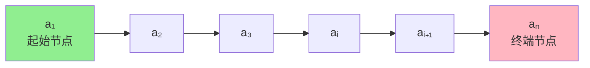
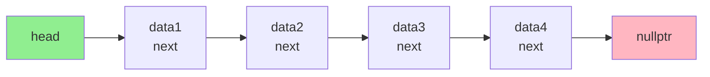
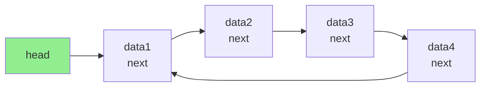
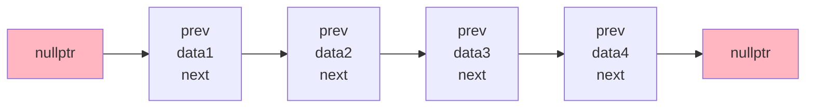
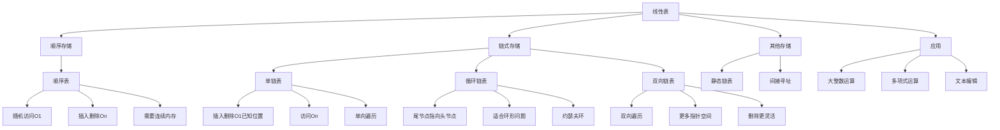

# 第2章：线性表

> 本章学习目标：
> - 理解线性表的定义和特点
> - 掌握顺序表的实现方法及其操作的时间复杂度
> - 掌握单链表、循环链表和双向链表的实现方法
> - 理解顺序表与链表的优缺点及应用场景
> - 能够解决与线性表相关的实际问题

---

## 2.1 线性表的逻辑结构

### 2.1.1 线性表的定义

**定义**：
线性表（Linear List）是具有相同特性的数据元素的一个有限序列。序列中所含元素的个数叫做线性表的长度，用n表示（n ≥ 0）。当n=0时，表示线性表是一个空表。

**数学表示**：
```
线性表 L = (a₁, a₂, ..., aᵢ, ..., aₙ)
```
其中：
- a₁ 称为**起始节点**（first node）
- aₙ 称为**终端节点**（terminal node）
- 对于任意相邻的两个元素 aᵢ 和 aᵢ₊₁，称 aᵢ 是 aᵢ₊₁ 的**前驱**（predecessor），aᵢ₊₁ 是 aᵢ 的**后继**（successor）

**线性表的逻辑特征**：

1. **有且仅有一个起始节点**，它没有前驱，只有一个后继
2. **有且仅有一个终端节点**，它没有后继，只有一个前驱
3. **其余节点都有且仅有一个前驱和一个后继**
4. 各数据元素在线性表中的**位置只取决于它们的序号**，之间的相对位置是线性的

**结构图示**：



**示例**：

| 示例 | 数据元素类型 | 线性表实例 |
|------|-------------|-----------|
| 英文字母表 | 字符 | (A, B, C, D, ..., Z) |
| 星期 | 字符串 | (星期一, 星期二, ..., 星期日) |
| 学生成绩 | 结构体 | (学生1, 学生2, ..., 学生n) |
| 整数序列 | 整数 | (34, 91, 23, 78, 56) |

**C++示例**：

```cpp
// 示例1：简单类型线性表
vector<int> numbers = {1, 2, 3, 4, 5};
// 长度：5
// 起始节点：1
// 终端节点：5

// 示例2：结构体线性表
struct Student {
    int id;
    string name;
    double score;
};

vector<Student> students = {
    {1001, "张三", 95.5},
    {1002, "李四", 88.0},
    {1003, "王五", 92.5}
};
// 长度：3
// 起始节点：张三
// 终端节点：王五
```

### 2.1.2 线性表的抽象数据类型定义

**ADT定义**：

```cpp
ADT List {
    数据对象：D = {aᵢ | aᵢ ∈ ElemSet, i = 1, 2, ..., n, n ≥ 0}
    数据关系：R = {<aᵢ₋₁, aᵢ> | aᵢ₋₁, aᵢ ∈ D, i = 2, 3, ..., n}
              每个元素最多有一个前驱和一个后继

    基本操作：
        InitList(&L)        // 初始化线性表
        DestroyList(&L)     // 销毁线性表
        ClearList(&L)       // 清空线性表
        ListEmpty(L)        // 判断线性表是否为空
        ListLength(L)       // 返回线性表的长度
        GetElem(L, i, &e)   // 获取第i个元素的值
        LocateElem(L, e)    // 查找值为e的元素位置
        PriorElem(L, cur_e, &pre_e)  // 获取前驱元素
        NextElem(L, cur_e, &next_e)  // 获取后继元素
        ListInsert(&L, i, e) // 在第i个位置插入元素e
        ListDelete(&L, i, &e)     // 删除第i个位置的元素
        ListTraverse(L, visit())   // 遍历线性表
}
```

**C++接口定义**：

```cpp
#include <iostream>
#include <stdexcept>

template <typename T>
class IList {
public:
    // 析构函数
    virtual ~IList() = default;

    // 基本操作
    virtual void clear() = 0;                              // 清空线性表
    virtual bool isEmpty() const = 0;                      // 判断是否为空
    virtual int size() const = 0;                          // 返回长度
    virtual T get(int index) const = 0;                    // 获取第i个元素
    virtual int indexOf(const T& element) const = 0;       // 查找元素位置
    virtual void insert(int index, const T& element) = 0;  // 插入元素
    virtual void remove(int index) = 0;                    // 删除元素
    virtual void display() const = 0;                      // 遍历输出

    // 扩展操作
    virtual T getFirst() const { return get(0); }          // 获取第一个元素
    virtual T getLast() const { return get(size() - 1); }  // 获取最后一个元素
    virtual void append(const T& element) { insert(size(), element); }  // 在末尾添加
};
```

**接口使用示例**：

```cpp
int main() {
    IList<int>* list = nullptr;  // 多态使用

    // 这里可以使用顺序表或链表实现
    // list = new ArrayList<int>();
    // list = new LinkedList<int>();

    list->append(10);
    list->append(20);
    list->append(30);

    std::cout << "长度: " << list->size() << std::endl;
    std::cout << "第一个元素: " << list->getFirst() << std::endl;
    std::cout << "最后一个元素: " << list->getLast() << std::endl;

    list->insert(1, 15);  // 在位置1插入15
    list->display();      // 输出: 10 15 20 30

    list->remove(2);      // 删除位置2的元素
    list->display();      // 输出: 10 15 30

    delete list;
    return 0;
}
```

---

## 2.2 线性表的顺序存储结构及实现

### 2.2.1 线性表的顺序存储结构——顺序表

**定义**：
顺序表（Sequential List）是用一段**地址连续的存储单元**依次存储线性表的数据元素。

**内存布局**：

```
内存地址：
|--------|
|  1000  | ← a₁ [0]
|--------|
|  1004  | ← a₂ [1]
|--------|
|  1008  | ← a₃ [2]
|--------|
|  1012  | ← a₄ [3]
|--------|
|  1016  | ← a₅ [4]
|--------|
   ...
```

**特点**：

| 特性 | 说明 |
|------|------|
| **随机访问** | 可以通过下标直接访问任意元素，时间复杂度O(1) |
| **内存连续** | 需要一段连续的内存空间 |
| **存储密度** | 存储密度为1，只存储数据本身 |
| **容量固定** | 需要预先分配空间，容量有限 |
| **插入删除** | 需要移动大量元素，时间复杂度O(n) |

**地址计算公式**：

假设：
- 数据元素类型为ElemType，每个元素占用sizeof(ElemType)字节
- 起始地址为LOC(a₁)
- 第i个元素的地址为LOC(aᵢ)

则：
```
LOC(aᵢ) = LOC(a₁) + (i - 1) × sizeof(ElemType)
```

**代码示例**：

```cpp
#include <iostream>
#include <stdexcept>

// 计算地址
template <typename T>
void calculate_address() {
    T arr[5] = {1, 2, 3, 4, 5};

    std::cout << "sizeof(T) = " << sizeof(T) << " 字节" << std::endl;
    std::cout << "起始地址: " << &arr[0] << std::endl;
    std::cout << "第1个元素地址: " << &arr[0] << ", 值: " << arr[0] << std::endl;
    std::cout << "第2个元素地址: " << &arr[1] << ", 值: " << arr[1] << std::endl;
    std::cout << "第3个元素地址: " << &arr[2] << ", 值: " << arr[2] << std::endl;

    // 验证地址计算公式
    // LOC(a₂) = LOC(a₁) + sizeof(T)
    // LOC(a₃) = LOC(a₁) + 2 × sizeof(T)
}
```

### 2.2.2 顺序表的实现

#### 2.2.2.1 顺序表的基本结构

```cpp
#include <iostream>
#include <stdexcept>
#include <algorithm>

template <typename T>
class ArrayList : public IList<T> {
private:
    T* data;           // 存储数据的动态数组
    int capacity;      // 当前容量
    int length;        // 当前长度

    // 扩容函数
    void resize(int newCapacity) {
        T* newData = new T[newCapacity];
        for (int i = 0; i < length; ++i) {
            newData[i] = data[i];
        }
        delete[] data;
        data = newData;
        capacity = newCapacity;
        std::cout << "扩容至: " << newCapacity << std::endl;
    }

public:
    // 构造函数 - 指定初始容量
    explicit ArrayList(int initialCapacity = 10) {
        if (initialCapacity <= 0) {
            throw std::invalid_argument("容量必须大于0");
        }
        data = new T[initialCapacity];
        capacity = initialCapacity;
        length = 0;
        std::cout << "构造顺序表，初始容量: " << capacity << std::endl;
    }

    // 析构函数
    ~ArrayList() {
        delete[] data;
        std::cout << "销毁顺序表" << std::endl;
    }

    // 拷贝构造函数
    ArrayList(const ArrayList& other) {
        capacity = other.capacity;
        length = other.length;
        data = new T[capacity];
        for (int i = 0; i < length; ++i) {
            data[i] = other.data[i];
        }
    }

    // 拷贝赋值运算符
    ArrayList& operator=(const ArrayList& other) {
        if (this != &other) {
            delete[] data;
            capacity = other.capacity;
            length = other.length;
            data = new T[capacity];
            for (int i = 0; i < length; ++i) {
                data[i] = other.data[i];
            }
        }
        return *this;
    }

    // 移动构造函数 (C++11)
    ArrayList(ArrayList&& other) noexcept
        : data(other.data), capacity(other.capacity), length(other.length) {
        other.data = nullptr;
        other.capacity = 0;
        other.length = 0;
    }

    // 移动赋值运算符 (C++11)
    ArrayList& operator=(ArrayList&& other) noexcept {
        if (this != &other) {
            delete[] data;
            data = other.data;
            capacity = other.capacity;
            length = other.length;
            other.data = nullptr;
            other.capacity = 0;
            other.length = 0;
        }
        return *this;
    }
```

#### 2.2.2.2 顺序表的基本操作实现

```cpp
    // 清空线性表
    void clear() override {
        length = 0;
        std::cout << "清空顺序表" << std::endl;
    }

    // 判断是否为空
    bool isEmpty() const override {
        return length == 0;
    }

    // 返回长度
    int size() const override {
        return length;
    }

    // 获取第i个元素 - O(1)
    T get(int index) const override {
        if (index < 0 || index >= length) {
            throw std::out_of_range("索引越界");
        }
        return data[index];
    }

    // 使用[]运算符重载
    T& operator[](int index) {
        if (index < 0 || index >= length) {
            throw std::out_of_range("索引越界");
        }
        return data[index];
    }

    const T& operator[](int index) const {
        if (index < 0 || index >= length) {
            throw std::out_of_range("索引越界");
        }
        return data[index];
    }

    // 查找元素位置 - O(n)
    int indexOf(const T& element) const override {
        for (int i = 0; i < length; ++i) {
            if (data[i] == element) {
                return i;
            }
        }
        return -1;  // 未找到
    }

    // 插入元素 - O(n)
    void insert(int index, const T& element) override {
        if (index < 0 || index > length) {
            throw std::out_of_range("插入位置越界");
        }

        // 检查是否需要扩容
        if (length >= capacity) {
            resize(capacity * 2);  // 扩容为原来的2倍
        }

        // 将index及之后的元素后移
        for (int i = length; i > index; --i) {
            data[i] = data[i - 1];
        }

        data[index] = element;
        ++length;
    }

    // 删除元素 - O(n)
    void remove(int index) override {
        if (index < 0 || index >= length) {
            throw std::out_of_range("删除位置越界");
        }

        // 将index之后的元素前移
        for (int i = index; i < length - 1; ++i) {
            data[i] = data[i + 1];
        }

        --length;

        // 可选：当长度远小于容量时，缩容
        if (length > 0 && length < capacity / 4) {
            resize(capacity / 2);
        }
    }

    // 遍历输出
    void display() const override {
        std::cout << "[";
        for (int i = 0; i < length; ++i) {
            std::cout << data[i];
            if (i < length - 1) {
                std::cout << ", ";
            }
        }
        std::cout << "]" << std::endl;
    }

    // 获取当前容量
    int getCapacity() const {
        return capacity;
    }

    // 批量插入
    void insertRange(int index, const T* elements, int count) {
        if (index < 0 || index > length) {
            throw std::out_of_range("插入位置越界");
        }

        // 确保容量足够
        while (length + count > capacity) {
            resize(capacity * 2);
        }

        // 后移元素
        for (int i = length - 1; i >= index; --i) {
            data[i + count] = data[i];
        }

        // 插入新元素
        for (int i = 0; i < count; ++i) {
            data[index + i] = elements[i];
        }

        length += count;
    }

    // 反转顺序表
    void reverse() {
        for (int i = 0; i < length / 2; ++i) {
            std::swap(data[i], data[length - 1 - i]);
        }
    }

    // 排序
    void sort(bool ascending = true) {
        if (ascending) {
            std::sort(data, data + length);
        } else {
            std::sort(data, data + length, std::greater<T>());
        }
    }
};
```

#### 2.2.2.3 顺序表使用示例

```cpp
int main() {
    std::cout << "=== 顺序表示例 ===" << std::endl;

    // 创建顺序表
    ArrayList<int> list(5);  // 初始容量为5

    // 添加元素
    std::cout << "\n--- 添加元素 ---" << std::endl;
    list.append(10);
    list.append(20);
    list.append(30);
    list.display();  // 输出: [10, 20, 30]

    // 插入元素
    std::cout << "\n--- 插入元素 ---" << std::endl;
    list.insert(1, 15);  // 在位置1插入15
    list.display();  // 输出: [10, 15, 20, 30]

    // 访问元素
    std::cout << "\n--- 访问元素 ---" << std::endl;
    std::cout << "第0个元素: " << list.get(0) << std::endl;    // 输出: 10
    std::cout << "第2个元素: " << list[2] << std::endl;       // 输出: 20
    std::cout << "查找15的位置: " << list.indexOf(15) << std::endl;  // 输出: 1

    // 删除元素
    std::cout << "\n--- 删除元素 ---" << std::endl;
    list.remove(1);  // 删除位置1的元素
    list.display();  // 输出: [10, 20, 30]

    // 测试扩容
    std::cout << "\n--- 测试扩容 ---" << std::endl;
    std::cout << "当前容量: " << list.getCapacity() << std::endl;
    for (int i = 0; i < 10; ++i) {
        list.append(i * 10);
    }
    std::cout << "扩容后容量: " << list.getCapacity() << std::endl;
    list.display();

    // 反转
    std::cout << "\n--- 反转 ---" << std::endl;
    list.reverse();
    list.display();

    // 排序
    std::cout << "\n--- 排序 ---" << std::endl;
    list.sort(true);
    list.display();

    // 清空
    std::cout << "\n--- 清空 ---" << std::endl;
    list.clear();
    std::cout << "是否为空: " << (list.isEmpty() ? "是" : "否") << std::endl;
    std::cout << "长度: " << list.size() << std::endl;

    return 0;
}
```

#### 2.2.2.4 顺序表操作的时间复杂度分析

| 操作 | 时间复杂度 | 说明 |
|------|-----------|------|
| **get(i)** | O(1) | 随机访问，直接通过下标获取 |
| **insert(i, e)** | O(n) | 需要移动n-i个元素 |
| **remove(i)** | O(n) | 需要移动n-i-1个元素 |
| **indexOf(e)** | O(n) | 需要遍历整个表 |
| **clear()** | O(1) | 只需要将长度设为0 |
| **isEmpty()** | O(1) | 直接判断长度 |
| **size()** | O(1) | 直接返回长度 |
| **resize()** | O(n) | 需要复制所有元素到新数组 |

**空间复杂度分析**：
- **基本空间**：O(n)，n为顺序表的容量
- **额外空间**：O(1)，插入删除操作只需要常数级额外空间
- **扩容时**：O(n)，需要分配新数组并复制元素

**插入操作详细分析**：

```cpp
void insert(int index, const T& element) {
    // 时间复杂度分析：
    // 1. 边界检查：O(1)
    // 2. 扩容检查：O(1)（最坏情况O(n)）
    // 3. 元素后移：O(n-index)，平均情况下O(n/2)
    // 4. 插入元素：O(1)
    // 5. 更新长度：O(1)
    // 总时间复杂度：O(n)

    for (int i = length; i > index; --i) {
        data[i] = data[i - 1];  // 需要移动n-index个元素
    }
}
```

**删除操作详细分析**：

```cpp
void remove(int index) {
    // 时间复杂度分析：
    // 1. 边界检查：O(1)
    // 2. 元素前移：O(n-index-1)，平均情况下O(n/2)
    // 3. 更新长度：O(1)
    // 4. 缩容检查：O(1)（最坏情况O(n)）
    // 总时间复杂度：O(n)

    for (int i = index; i < length - 1; ++i) {
        data[i] = data[i + 1];  // 需要移动n-index-1个元素
    }
}
```

---

## 2.3 线性表的链接存储结构及实现

### 2.3.1 单链表

#### 2.3.1.1 单链表的定义和特点

**定义**：
单链表（Singly Linked List）是通过**指针**串联起来的线性表，每个节点包含数据域和指针域。指针域存储指向下一个节点的指针。

**节点结构**：

```
┌──────┬──────┐
│ data │ next │
└──────┴──────┘
  数据域 指针域
```

**链表结构图示**：



**特点**：

| 特性 | 说明 |
|------|------|
| **非连续存储** | 节点可以分散在内存的任意位置 |
| **动态分配** | 可以根据需要动态申请内存 |
| **插入删除** | 只需要修改指针，时间复杂度O(1) |
| **访问元素** | 需要从头遍历，时间复杂度O(n) |
| **存储密度** | 存储密度<1，需要额外的指针空间 |
| **无需预分配** | 不需要预先分配固定大小的空间 |

#### 2.3.1.2 单链表的实现

```cpp
#include <iostream>
#include <stdexcept>
#include <memory>

// 链表节点结构
template <typename T>
struct ListNode {
    T data;              // 数据域
    ListNode* next;      // 指针域

    // 构造函数
    ListNode(const T& value, ListNode* ptr = nullptr)
        : data(value), next(ptr) {}

    ListNode(T&& value, ListNode* ptr = nullptr)
        : data(std::move(value)), next(ptr) {}
};

// 单链表类
template <typename T>
class LinkedList : public IList<T> {
private:
    ListNode<T>* head;   // 头指针
    ListNode<T>* tail;   // 尾指针
    int length;          // 链表长度

public:
    // 构造函数
    LinkedList() : head(nullptr), tail(nullptr), length(0) {
        std::cout << "构造空链表" << std::endl;
    }

    // 析构函数
    ~LinkedList() {
        clear();
        std::cout << "销毁链表" << std::endl;
    }

    // 拷贝构造函数
    LinkedList(const LinkedList& other) : head(nullptr), tail(nullptr), length(0) {
        ListNode<T>* current = other.head;
        while (current != nullptr) {
            append(current->data);
            current = current->next;
        }
    }

    // 拷贝赋值运算符
    LinkedList& operator=(const LinkedList& other) {
        if (this != &other) {
            clear();
            ListNode<T>* current = other.head;
            while (current != nullptr) {
                append(current->data);
                current = current->next;
            }
        }
        return *this;
    }

    // 移动构造函数 (C++11)
    LinkedList(LinkedList&& other) noexcept
        : head(other.head), tail(other.tail), length(other.length) {
        other.head = nullptr;
        other.tail = nullptr;
        other.length = 0;
    }

    // 移动赋值运算符 (C++11)
    LinkedList& operator=(LinkedList&& other) noexcept {
        if (this != &other) {
            clear();
            head = other.head;
            tail = other.tail;
            length = other.length;
            other.head = nullptr;
            other.tail = nullptr;
            other.length = 0;
        }
        return *this;
    }
```

#### 2.3.1.3 单链表的基本操作实现

```cpp
    // 清空链表
    void clear() override {
        ListNode<T>* current = head;
        while (current != nullptr) {
            ListNode<T>* next = current->next;
            delete current;
            current = next;
        }
        head = nullptr;
        tail = nullptr;
        length = 0;
    }

    // 判断是否为空
    bool isEmpty() const override {
        return head == nullptr;
    }

    // 返回长度
    int size() const override {
        return length;
    }

    // 获取第i个元素 - O(n)
    T get(int index) const override {
        if (index < 0 || index >= length) {
            throw std::out_of_range("索引越界");
        }

        ListNode<T>* current = head;
        for (int i = 0; i < index; ++i) {
            current = current->next;
        }
        return current->data;
    }

    // 查找元素位置 - O(n)
    int indexOf(const T& element) const override {
        ListNode<T>* current = head;
        int index = 0;
        while (current != nullptr) {
            if (current->data == element) {
                return index;
            }
            current = current->next;
            ++index;
        }
        return -1;  // 未找到
    }

    // 在头部插入元素 - O(1)
    void insertFirst(const T& element) {
        ListNode<T>* newNode = new ListNode<T>(element, head);
        head = newNode;
        if (tail == nullptr) {
            tail = newNode;
        }
        ++length;
    }

    // 在尾部插入元素 - O(1)
    void append(const T& element) {
        ListNode<T>* newNode = new ListNode<T>(element);

        if (tail == nullptr) {
            head = newNode;
            tail = newNode;
        } else {
            tail->next = newNode;
            tail = newNode;
        }
        ++length;
    }

    // 在指定位置插入元素 - O(n)
    void insert(int index, const T& element) override {
        if (index < 0 || index > length) {
            throw std::out_of_range("插入位置越界");
        }

        if (index == 0) {
            insertFirst(element);
        } else if (index == length) {
            append(element);
        } else {
            ListNode<T>* current = head;
            for (int i = 0; i < index - 1; ++i) {
                current = current->next;
            }
            ListNode<T>* newNode = new ListNode<T>(element, current->next);
            current->next = newNode;
            ++length;
        }
    }

    // 删除头部元素 - O(1)
    void removeFirst() {
        if (head == nullptr) {
            throw std::runtime_error("链表为空");
        }

        ListNode<T>* temp = head;
        head = head->next;
        delete temp;

        if (head == nullptr) {
            tail = nullptr;
        }
        --length;
    }

    // 删除指定位置的元素 - O(n)
    void remove(int index) override {
        if (index < 0 || index >= length) {
            throw std::out_of_range("删除位置越界");
        }

        if (index == 0) {
            removeFirst();
        } else {
            ListNode<T>* current = head;
            for (int i = 0; i < index - 1; ++i) {
                current = current->next;
            }

            ListNode<T>* temp = current->next;
            current->next = temp->next;

            if (temp == tail) {
                tail = current;
            }

            delete temp;
            --length;
        }
    }

    // 删除指定值的第一个元素
    bool removeValue(const T& element) {
        if (head == nullptr) {
            return false;
        }

        // 删除头节点
        if (head->data == element) {
            removeFirst();
            return true;
        }

        // 查找要删除的节点
        ListNode<T>* current = head;
        while (current->next != nullptr && current->next->data != element) {
            current = current->next;
        }

        if (current->next != nullptr) {
            ListNode<T>* temp = current->next;
            current->next = temp->next;

            if (temp == tail) {
                tail = current;
            }

            delete temp;
            --length;
            return true;
        }

        return false;
    }

    // 遍历输出
    void display() const override {
        std::cout << "[";
        ListNode<T>* current = head;
        while (current != nullptr) {
            std::cout << current->data;
            if (current->next != nullptr) {
                std::cout << " -> ";
            }
            current = current->next;
        }
        std::cout << "]" << std::endl;
    }

    // 反转链表 - O(n)
    void reverse() {
        ListNode<T>* prev = nullptr;
        ListNode<T>* current = head;
        ListNode<T>* next = nullptr;

        tail = head;  // 原来的头节点变成尾节点

        while (current != nullptr) {
            next = current->next;
            current->next = prev;
            prev = current;
            current = next;
        }

        head = prev;
    }

    // 获取头节点
    T getFirst() const {
        if (head == nullptr) {
            throw std::runtime_error("链表为空");
        }
        return head->data;
    }

    // 获取尾节点
    T getLast() const {
        if (tail == nullptr) {
            throw std::runtime_error("链表为空");
        }
        return tail->data;
    }
};
```

#### 2.3.1.4 单链表使用示例

```cpp
int main() {
    std::cout << "=== 单链表示例 ===" << std::endl;

    // 创建链表
    LinkedList<int> list;

    // 添加元素
    std::cout << "\n--- 添加元素 ---" << std::endl;
    list.append(10);
    list.append(20);
    list.append(30);
    list.display();  // 输出: [10 -> 20 -> 30]

    // 在头部插入
    std::cout << "\n--- 头部插入 ---" << std::endl;
    list.insertFirst(5);
    list.display();  // 输出: [5 -> 10 -> 20 -> 30]

    // 在中间插入
    std::cout << "\n--- 中间插入 ---" << std::endl;
    list.insert(2, 15);
    list.display();  // 输出: [5 -> 10 -> 15 -> 20 -> 30]

    // 访问元素
    std::cout << "\n--- 访问元素 ---" << std::endl;
    std::cout << "第0个元素: " << list.get(0) << std::endl;       // 输出: 5
    std::cout << "第3个元素: " << list.get(3) << std::endl;       // 输出: 20
    std::cout << "查找15的位置: " << list.indexOf(15) << std::endl; // 输出: 2

    // 删除元素
    std::cout << "\n--- 删除元素 ---" << std::endl;
    list.remove(2);  // 删除位置2的元素
    list.display();  // 输出: [5 -> 10 -> 20 -> 30]

    list.removeFirst();  // 删除头部元素
    list.display();      // 输出: [10 -> 20 -> 30]

    list.removeValue(20);  // 删除值为20的元素
    list.display();        // 输出: [10 -> 30]

    // 反转链表
    std::cout << "\n--- 反转链表 ---" << std::endl;
    list.append(40);
    list.append(50);
    list.display();    // 输出: [10 -> 30 -> 40 -> 50]
    list.reverse();
    list.display();    // 输出: [50 -> 40 -> 30 -> 10]

    // 清空
    std::cout << "\n--- 清空 ---" << std::endl;
    list.clear();
    std::cout << "是否为空: " << (list.isEmpty() ? "是" : "否") << std::endl;
    std::cout << "长度: " << list.size() << std::endl;

    return 0;
}
```

#### 2.3.1.5 单链表操作的时间复杂度分析

| 操作 | 时间复杂度 | 说明 |
|------|-----------|------|
| **get(i)** | O(n) | 需要从头遍历到第i个节点 |
| **insertFirst(e)** | O(1) | 直接修改头指针 |
| **append(e)** | O(1) | 直接修改尾指针 |
| **insert(i, e)** | O(n) | 需要先找到第i-1个节点 |
| **removeFirst()** | O(1) | 直接修改头指针 |
| **remove(i)** | O(n) | 需要先找到第i-1个节点 |
| **indexOf(e)** | O(n) | 需要遍历整个链表 |
| **clear()** | O(n) | 需要删除所有节点 |
| **isEmpty()** | O(1) | 直接判断头指针 |
| **size()** | O(1) | 直接返回长度 |
| **reverse()** | O(n) | 需要遍历整个链表 |

**空间复杂度分析**：
- **基本空间**：O(n)，n为链表节点数
- **额外空间**：O(1)，插入删除操作只需要常数级额外空间

#### 2.3.1.6 单链表的高级操作

**1. 查找中间节点（快慢指针法）**

```cpp
// 查找中间节点 - O(n)
ListNode<T>* findMiddle() const {
    if (head == nullptr) {
        return nullptr;
    }

    ListNode<T>* slow = head;
    ListNode<T>* fast = head;

    while (fast != nullptr && fast->next != nullptr) {
        slow = slow->next;          // 慢指针每次走一步
        fast = fast->next->next;    // 快指针每次走两步
    }

    return slow;
}

// 使用示例
ListNode<int>* middle = list.findMiddle();
if (middle != nullptr) {
    std::cout << "中间节点: " << middle->data << std::endl;
}
```

**2. 检测环（Floyd判圈算法）**

```cpp
// 检测链表是否有环 - O(n)
bool hasCycle() const {
    if (head == nullptr || head->next == nullptr) {
        return false;
    }

    ListNode<T>* slow = head;
    ListNode<T>* fast = head;

    while (fast != nullptr && fast->next != nullptr) {
        slow = slow->next;
        fast = fast->next->next;

        if (slow == fast) {
            return true;  // 相遇，说明有环
        }
    }

    return false;  // fast到达nullptr，说明无环
}
```

**3. 合并两个有序链表**

```cpp
// 合并两个有序链表 - O(n+m)
static LinkedList<T> mergeSortedLists(const LinkedList<T>& list1, const LinkedList<T>& list2) {
    LinkedList<T> result;
    ListNode<T>* p1 = list1.head;
    ListNode<T>* p2 = list2.head;

    while (p1 != nullptr && p2 != nullptr) {
        if (p1->data <= p2->data) {
            result.append(p1->data);
            p1 = p1->next;
        } else {
            result.append(p2->data);
            p2 = p2->next;
        }
    }

    // 处理剩余节点
    while (p1 != nullptr) {
        result.append(p1->data);
        p1 = p1->next;
    }

    while (p2 != nullptr) {
        result.append(p2->data);
        p2 = p2->next;
    }

    return result;
}

// 使用示例
LinkedList<int> list1;
list1.append(1);
list1.append(3);
list1.append(5);

LinkedList<int> list2;
list2.append(2);
list2.append(4);
list2.append(6);

LinkedList<int> merged = LinkedList<int>::mergeSortedLists(list1, list2);
merged.display();  // 输出: [1 -> 2 -> 3 -> 4 -> 5 -> 6]
```

### 2.3.2 循环链表

#### 2.3.2.1 循环链表的定义

**定义**：
循环链表（Circular Linked List）是一种特殊的链表，其尾节点的指针指向头节点，形成一个环。

**结构图示**：



**特点**：

| 特性 | 说明 |
|------|------|
| **无nullptr** | 尾节点指向头节点，没有nullptr |
| **循环访问** | 可以从任意节点开始遍历整个链表 |
| **适合环形问题** | 适合解决约瑟夫环等环形问题 |
| **判空条件** | head == nullptr |
| **遍历终止** | 需要记录起始位置或遍历n次 |

#### 2.3.2.2 循环链表的实现

```cpp
#include <iostream>
#include <stdexcept>

template <typename T>
class CircularLinkedList {
private:
    struct Node {
        T data;
        Node* next;

        Node(const T& value, Node* ptr = nullptr)
            : data(value), next(ptr) {}
    };

    Node* head;
    Node* tail;
    int length;

public:
    // 构造函数
    CircularLinkedList() : head(nullptr), tail(nullptr), length(0) {}

    // 析构函数
    ~CircularLinkedList() {
        clear();
    }

    // 判断是否为空
    bool isEmpty() const {
        return head == nullptr;
    }

    // 返回长度
    int size() const {
        return length;
    }

    // 插入元素
    void append(const T& element) {
        Node* newNode = new Node(element);

        if (head == nullptr) {
            head = newNode;
            tail = newNode;
            newNode->next = head;  // 指向自己
        } else {
            tail->next = newNode;
            newNode->next = head;
            tail = newNode;
        }
        ++length;
    }

    // 遍历输出
    void display() const {
        if (head == nullptr) {
            std::cout << "[]" << std::endl;
            return;
        }

        std::cout << "[";
        Node* current = head;
        do {
            std::cout << current->data;
            if (current != tail) {
                std::cout << " -> ";
            }
            current = current->next;
        } while (current != head);
        std::cout << " -> (循环)" << "]" << std::endl;
    }

    // 约瑟夫环问题
    static T josephus(int n, int k) {
        // 创建n个人的循环链表
        CircularLinkedList<int> circle;
        for (int i = 1; i <= n; ++i) {
            circle.append(i);
        }

        Node* current = circle.head;
        Node* prev = circle.tail;

        while (circle.length > 1) {
            // 数k-1个人
            for (int i = 0; i < k - 1; ++i) {
                prev = current;
                current = current->next;
            }

            // 删除当前节点
            Node* temp = current;
            prev->next = current->next;
            current = current->next;

            if (temp == circle.head) {
                circle.head = current;
            }
            if (temp == circle.tail) {
                circle.tail = prev;
            }

            delete temp;
            --circle.length;
        }

        T survivor = circle.head->data;
        return survivor;
    }

    // 清空链表
    void clear() {
        if (head == nullptr) {
            return;
        }

        Node* current = head;
        do {
            Node* next = current->next;
            delete current;
            current = next;
        } while (current != head);

        head = nullptr;
        tail = nullptr;
        length = 0;
    }
};
```

#### 2.3.2.3 循环链表使用示例

```cpp
int main() {
    std::cout << "=== 循环链表示例 ===" << std::endl;

    // 创建循环链表
    CircularLinkedList<int> circle;

    // 添加元素
    circle.append(1);
    circle.append(2);
    circle.append(3);
    circle.append(4);
    circle.append(5);

    // 遍历输出
    std::cout << "\n循环链表: ";
    circle.display();

    // 约瑟夫环问题
    std::cout << "\n--- 约瑟夫环问题 ---" << std::endl;
    int n = 7;  // 7个人
    int k = 3;  // 数到3的人出局

    std::cout << "问题描述: " << n << "个人围成一圈，从第1个人开始报数，"
              << "数到" << k << "的人出局，求最后剩下的人。" << std::endl;

    int survivor = CircularLinkedList<int>::josephus(n, k);
    std::cout << "最后剩下的人: " << survivor << std::endl;

    return 0;
}
```

### 2.3.3 双向链表

#### 2.3.3.1 双向链表的定义

**定义**：
双向链表（Doubly Linked List）的每个节点包含两个指针：一个指向前驱节点，一个指向后继节点。

**节点结构**：

```
┌──────┬──────┬──────┐
│ prev │ data │ next │
└──────┴──────┴──────┘
前驱指针 数据域 后继指针
```

**链表结构图示**：



**特点**：

| 特性 | 说明 |
|------|------|
| **双向遍历** | 可以向前或向后遍历 |
| **插入删除** | 更灵活，可以O(1)时间删除已知节点 |
| **空间开销** | 每个节点多一个指针，空间开销更大 |
| **实现复杂** | 需要维护两个指针关系 |

#### 2.3.3.2 双向链表的实现

```cpp
#include <iostream>
#include <stdexcept>

template <typename T>
class DoublyLinkedList {
private:
    struct Node {
        T data;
        Node* prev;
        Node* next;

        Node(const T& value, Node* p = nullptr, Node* n = nullptr)
            : data(value), prev(p), next(n) {}
    };

    Node* head;
    Node* tail;
    int length;

public:
    // 构造函数
    DoublyLinkedList() : head(nullptr), tail(nullptr), length(0) {}

    // 析构函数
    ~DoublyLinkedList() {
        clear();
    }

    // 判断是否为空
    bool isEmpty() const {
        return head == nullptr;
    }

    // 返回长度
    int size() const {
        return length;
    }

    // 在头部插入 - O(1)
    void insertFirst(const T& element) {
        Node* newNode = new Node(element, nullptr, head);

        if (head == nullptr) {
            head = newNode;
            tail = newNode;
        } else {
            head->prev = newNode;
            head = newNode;
        }
        ++length;
    }

    // 在尾部插入 - O(1)
    void append(const T& element) {
        Node* newNode = new Node(element, tail, nullptr);

        if (tail == nullptr) {
            head = newNode;
            tail = newNode;
        } else {
            tail->next = newNode;
            tail = newNode;
        }
        ++length;
    }

    // 在指定位置插入 - O(n)
    void insert(int index, const T& element) {
        if (index < 0 || index > length) {
            throw std::out_of_range("插入位置越界");
        }

        if (index == 0) {
            insertFirst(element);
        } else if (index == length) {
            append(element);
        } else {
            // 优化：从离目标更近的一端开始
            Node* current;
            if (index < length / 2) {
                current = head;
                for (int i = 0; i < index; ++i) {
                    current = current->next;
                }
            } else {
                current = tail;
                for (int i = length - 1; i > index; --i) {
                    current = current->prev;
                }
            }

            Node* newNode = new Node(element, current->prev, current);
            current->prev->next = newNode;
            current->prev = newNode;
            ++length;
        }
    }

    // 删除头部 - O(1)
    void removeFirst() {
        if (head == nullptr) {
            throw std::runtime_error("链表为空");
        }

        Node* temp = head;
        head = head->next;

        if (head != nullptr) {
            head->prev = nullptr;
        } else {
            tail = nullptr;
        }

        delete temp;
        --length;
    }

    // 删除尾部 - O(1)
    void removeLast() {
        if (tail == nullptr) {
            throw std::runtime_error("链表为空");
        }

        Node* temp = tail;
        tail = tail->prev;

        if (tail != nullptr) {
            tail->next = nullptr;
        } else {
            head = nullptr;
        }

        delete temp;
        --length;
    }

    // 删除指定位置 - O(n)
    void remove(int index) {
        if (index < 0 || index >= length) {
            throw std::out_of_range("删除位置越界");
        }

        if (index == 0) {
            removeFirst();
        } else if (index == length - 1) {
            removeLast();
        } else {
            Node* current;
            if (index < length / 2) {
                current = head;
                for (int i = 0; i < index; ++i) {
                    current = current->next;
                }
            } else {
                current = tail;
                for (int i = length - 1; i > index; --i) {
                    current = current->prev;
                }
            }

            current->prev->next = current->next;
            current->next->prev = current->prev;
            delete current;
            --length;
        }
    }

    // 遍历输出
    void display() const {
        std::cout << "[";
        Node* current = head;
        while (current != nullptr) {
            std::cout << current->data;
            if (current->next != nullptr) {
                std::cout << " <-> ";
            }
            current = current->next;
        }
        std::cout << "]" << std::endl;
    }

    // 反向遍历
    void displayReverse() const {
        std::cout << "[";
        Node* current = tail;
        while (current != nullptr) {
            std::cout << current->data;
            if (current->prev != nullptr) {
                std::cout << " <-> ";
            }
            current = current->prev;
        }
        std::cout << "]" << std::endl;
    }

    // 清空链表
    void clear() {
        Node* current = head;
        while (current != nullptr) {
            Node* next = current->next;
            delete current;
            current = next;
        }
        head = nullptr;
        tail = nullptr;
        length = 0;
    }
};
```

#### 2.3.3.3 双向链表使用示例

```cpp
int main() {
    std::cout << "=== 双向链表示例 ===" << std::endl;

    // 创建双向链表
    DoublyLinkedList<int> list;

    // 添加元素
    list.append(10);
    list.append(20);
    list.append(30);
    list.append(40);

    std::cout << "正向遍历: ";
    list.display();  // 输出: [10 <-> 20 <-> 30 <-> 40]

    std::cout << "反向遍历: ";
    list.displayReverse();  // 输出: [40 <-> 30 <-> 20 <-> 10]

    // 在头部插入
    list.insertFirst(5);
    std::cout << "头部插入5后: ";
    list.display();  // 输出: [5 <-> 10 <-> 20 <-> 30 <-> 40]

    // 在中间插入
    list.insert(3, 25);
    std::cout << "位置3插入25后: ";
    list.display();  // 输出: [5 <-> 10 <-> 20 <-> 25 <-> 30 <-> 40]

    // 删除尾部
    list.removeLast();
    std::cout << "删除尾部后: ";
    list.display();  // 输出: [5 <-> 10 <-> 20 <-> 25 <-> 30]

    // 删除头部
    list.removeFirst();
    std::cout << "删除头部后: ";
    list.display();  // 输出: [10 <-> 20 <-> 25 <-> 30]

    return 0;
}
```

---

## 2.4 顺序表和链表的比较

### 2.4.1 时间性能比较

| 操作 | 顺序表 | 单链表 | 双向链表 |
|------|--------|--------|----------|
| **访问第i个元素** | O(1) | O(n) | O(n) 优化后O(n/2) |
| **头部插入** | O(n) | O(1) | O(1) |
| **尾部插入** | O(1)（如果容量足够） | O(1)（有尾指针） | O(1) |
| **中间插入** | O(n) | O(n) | O(n) |
| **头部删除** | O(n) | O(1) | O(1) |
| **尾部删除** | O(1) | O(1)（有尾指针） | O(1) |
| **中间删除** | O(n) | O(n) | O(n) |
| **查找元素** | O(n) | O(n) | O(n) |
| **反转** | O(n) | O(n) | O(n) |

**详细对比**：

```cpp
// 示例：在中间位置插入10000次
void performance_test() {
    const int N = 10000;
    const int INSERT_POS = 1000;

    // 顺序表测试
    ArrayList<int> seqList(N * 2);
    auto start1 = std::chrono::high_resolution_clock::now();
    for (int i = 0; i < N; ++i) {
        seqList.insert(INSERT_POS, i);
    }
    auto end1 = std::chrono::high_resolution_clock::now();

    // 链表测试
    LinkedList<int> linkList;
    for (int i = 0; i < INSERT_POS; ++i) {
        linkList.append(i);
    }
    auto start2 = std::chrono::high_resolution_clock::now();
    for (int i = 0; i < N; ++i) {
        linkList.insert(INSERT_POS, i + INSERT_POS);
    }
    auto end2 = std::chrono::high_resolution_clock::now();

    std::cout << "顺序表插入时间: "
              << std::chrono::duration_cast<std::chrono::milliseconds>(end1 - start1).count()
              << "ms" << std::endl;
    std::cout << "链表插入时间: "
              << std::chrono::duration_cast<std::chrono::milliseconds>(end2 - start2).count()
              << "ms" << std::endl;
}
```

### 2.4.2 空间性能比较

| 方面 | 顺序表 | 链表 |
|------|--------|------|
| **存储密度** | 1（只存储数据） | <1（数据+指针） |
| **内存分配** | 连续，需要整块内存 | 非连续，可利用碎片内存 |
| **容量管理** | 预分配，可能浪费 | 动态分配，按需申请 |
| **扩容成本** | 需要复制所有元素 | 只需要分配新节点 |
| **额外空间** | 可能需要预留空间 | 每个节点需要指针空间 |

**存储密度计算**：

```cpp
// 假设：
// - 指针大小：8字节（64位系统）
// - int大小：4字节

// 顺序表存储密度
// 存储密度 = 数据大小 / 总大小 = 4 / 4 = 1 (100%)

// 链表存储密度
// 存储密度 = 数据大小 / (数据大小 + 指针大小)
//           = 4 / (4 + 8) = 4 / 12 ≈ 0.33 (33%)

// 对于int类型：
// 顺序表：每个元素占用4字节
// 链表：每个元素占用12字节（4字节数据 + 8字节指针）

// 对于结构体：
struct Student {
    int id;       // 4字节
    string name;  // 动态分配
    double score; // 8字节
};
// 顺序表：约16字节 + name的堆内存
// 链表：约24字节 + name的堆内存 + 8字节指针
```

### 2.4.3 综合对比表格

| 特性 | 顺序表 | 单链表 | 双向链表 |
|------|--------|--------|----------|
| **随机访问** | ✅ O(1) | ❌ O(n) | ❌ O(n) |
| **插入删除** | ❌ O(n) | ✅ O(1)（已知位置） | ✅ O(1)（已知节点） |
| **内存连续** | ✅ 需要 | ❌ 不需要 | ❌ 不需要 |
| **存储密度** | ✅ 1 | ❌ <1 | ❌ <1 |
| **动态扩容** | ❌ 需要扩容 | ✅ 灵活 | ✅ 灵活 |
| **实现难度** | 简单 | 中等 | 较复杂 |
| **缓存友好** | ✅ 高 | ❌ 低 | ❌ 低 |
| **双向遍历** | ✅ 支持 | ❌ 不支持 | ✅ 支持 |

### 2.4.4 选择建议

**选择顺序表的场景**：

1. ✅ 需要频繁随机访问元素
2. ✅ 知道数据规模，内存充足
3. ✅ 插入删除操作较少
4. ✅ 需要缓存友好的数据结构
5. ✅ 存储简单的数据类型（如int、double）

**示例**：
```cpp
// 学生成绩管理系统
class StudentManager {
private:
    ArrayList<Student> students;  // 使用顺序表

public:
    // 查找第i个学生 - O(1)
    Student getStudent(int index) {
        return students.get(index);
    }

    // 按学号查找 - O(n)
    Student findByID(int id) {
        for (int i = 0; i < students.size(); ++i) {
            if (students[i].id == id) {
                return students[i];
            }
        }
        throw std::runtime_error("学生不存在");
    }

    // 计算平均分 - O(n)
    double calculateAverage() {
        double sum = 0;
        for (int i = 0; i < students.size(); ++i) {
            sum += students[i].score;
        }
        return sum / students.size();
    }
};
```

**选择链表的场景**：

1. ✅ 需要频繁插入删除
2. ✅ 不知道数据规模，内存有限
3. ✅ 数据规模变化很大
4. ✅ 需要实现队列、栈等数据结构
5. ✅ 存储复杂的数据结构

**示例**：
```cpp
// 文本编辑器的撤销功能
class TextEditor {
private:
    struct EditAction {
        string description;
        string oldContent;
        string newContent;
    };

    LinkedList<EditAction> undoStack;  // 使用链表

public:
    // 执行编辑 - O(1)
    void executeEdit(const string& description, const string& newContent) {
        EditAction action{description, currentContent, newContent};
        undoStack.insertFirst(action);
        currentContent = newContent;
    }

    // 撤销编辑 - O(1)
    void undo() {
        if (!undoStack.isEmpty()) {
            EditAction action = undoStack.getFirst();
            undoStack.removeFirst();
            currentContent = action.oldContent;
        }
    }
};
```

---

## 2.5 线性表的其他存储方法

### 2.5.1 静态链表

**定义**：
静态链表（Static Linked List）是用数组实现的链表，每个数组元素包含数据和下一个元素的索引。

**节点结构**：

```cpp
struct StaticListNode {
    T data;        // 数据域
    int next;      // 下一个节点的索引
};
```

**结构图示**：

```
数组:
Index:  0     1     2     3     4     5
      ┌─────┬─────┬─────┬─────┬─────┬─────┐
Data  │ 10  │ 20  │ 30  │ 40  │ 50  │     │
      ├─────┼─────┼─────┼─────┼─────┼─────┤
Next  │  1  │  3  │  5  │  4  │ -1  │     │
      └─────┴─────┴─────┴─────┴─────┴─────┘

head = 0
tail = 4
```

**实现**：

```cpp
template <typename T, int MAX_SIZE>
class StaticLinkedList {
private:
    struct Node {
        T data;
        int next;
    };

    Node array[MAX_SIZE];
    int head;
    int tail;
    int length;
    int freeListHead;  // 空闲链表的头

public:
    StaticLinkedList() : head(-1), tail(-1), length(0), freeListHead(0) {
        // 初始化空闲链表
        for (int i = 0; i < MAX_SIZE - 1; ++i) {
            array[i].next = i + 1;
        }
        array[MAX_SIZE - 1].next = -1;
    }

    // 分配节点
    int allocateNode() {
        if (freeListHead == -1) {
            throw std::runtime_error("内存已满");
        }
        int index = freeListHead;
        freeListHead = array[freeListHead].next;
        return index;
    }

    // 释放节点
    void freeNode(int index) {
        array[index].next = freeListHead;
        freeListHead = index;
    }

    // 插入元素
    void append(const T& element) {
        int newIndex = allocateNode();
        array[newIndex].data = element;
        array[newIndex].next = -1;

        if (head == -1) {
            head = newIndex;
        } else {
            array[tail].next = newIndex;
        }
        tail = newIndex;
        ++length;
    }

    // 遍历输出
    void display() const {
        std::cout << "[";
        int current = head;
        while (current != -1) {
            std::cout << array[current].data;
            if (array[current].next != -1) {
                std::cout << " -> ";
            }
            current = array[current].next;
        }
        std::cout << "]" << std::endl;
    }
};
```

**优缺点**：

| 优点 | 缺点 |
|------|------|
| 不需要指针操作 | 容量固定 |
| 可以利用数组下标访问 | 不如动态链表灵活 |
| 适合不支持指针的语言 | 内存利用率低 |

### 2.5.2 间接寻址

**定义**：
间接寻址（Indirect Addressing）是将数据存储在动态分配的内存中，而用数组存储指向这些数据的指针。

**结构图示**：

```
数组（指针数组）:
Index:  0     1     2     3     4
      ┌─────┬─────┬─────┬─────┬─────┐
Ptr   │  ●──│  ●──│  ●──│  ●──│  ●──│
      └──┬──┴──┬──┴──┬──┴──┬──┴──┬──┘
         │     │     │     │     │
         ▼     ▼     ▼     ▼     ▼
       ┌───┐ ┌───┐ ┌───┐ ┌───┐ ┌───┐
       │ 10│ │ 20│ │ 30│ │ 40│ │ 50│
       └───┘ └───┘ └───┘ └───┘ └───┘
```

**实现**：

```cpp
template <typename T>
class IndirectList {
private:
    T** pointers;  // 指针数组
    int capacity;
    int length;

public:
    explicit IndirectList(int initialCapacity = 10) {
        capacity = initialCapacity;
        length = 0;
        pointers = new T*[capacity];
    }

    ~IndirectList() {
        clear();
        delete[] pointers;
    }

    // 插入元素
    void append(const T& element) {
        if (length >= capacity) {
            resize(capacity * 2);
        }
        pointers[length] = new T(element);
        ++length;
    }

    // 访问元素 - O(1)
    T get(int index) const {
        if (index < 0 || index >= length) {
            throw std::out_of_range("索引越界");
        }
        return *pointers[index];
    }

    // 插入元素 - O(n)
    void insert(int index, const T& element) {
        if (index < 0 || index > length) {
            throw std::out_of_range("插入位置越界");
        }

        if (length >= capacity) {
            resize(capacity * 2);
        }

        // 移动指针
        for (int i = length; i > index; --i) {
            pointers[i] = pointers[i - 1];
        }

        pointers[index] = new T(element);
        ++length;
    }

    // 删除元素 - O(n)
    void remove(int index) {
        if (index < 0 || index >= length) {
            throw std::out_of_range("删除位置越界");
        }

        delete pointers[index];

        // 移动指针
        for (int i = index; i < length - 1; ++i) {
            pointers[i] = pointers[i + 1];
        }

        --length;
    }

    // 清空
    void clear() {
        for (int i = 0; i < length; ++i) {
            delete pointers[i];
        }
        length = 0;
    }

private:
    void resize(int newCapacity) {
        T** newPointers = new T*[newCapacity];
        for (int i = 0; i < length; ++i) {
            newPointers[i] = pointers[i];
        }
        delete[] pointers;
        pointers = newPointers;
        capacity = newCapacity;
    }
};
```

**优缺点**：

| 优点 | 缺点 |
|------|------|
| 保持O(1)随机访问 | 每个元素需要额外的指针空间 |
| 插入删除只需要移动指针 | 内存分配更复杂 |
| 可以处理大型对象 | 指针数组也需要连续内存 |

---

## 2.6 应用举例

### 2.6.1 顺序表的应用举例——大整数求和

**问题**：
计算两个大整数（超出普通整数范围）的和。

**解决方案**：
使用顺序表存储大整数的每一位，然后从低位到高位逐位相加。

**实现**：

```cpp
#include <iostream>
#include <vector>
#include <algorithm>

class BigInt {
private:
    ArrayList<int> digits;  // 存储数字，低位在前

public:
    // 构造函数：从字符串构造
    BigInt(const string& num) {
        for (int i = num.size() - 1; i >= 0; --i) {
            if (isdigit(num[i])) {
                digits.append(num[i] - '0');
            }
        }
    }

    // 构造函数：从整数构造
    BigInt(int num) {
        if (num == 0) {
            digits.append(0);
            return;
        }

        while (num > 0) {
            digits.append(num % 10);
            num /= 10;
        }
    }

    // 大整数加法
    BigInt operator+(const BigInt& other) const {
        BigInt result;
        result.digits.clear();

        int carry = 0;
        int i = 0, j = 0;

        while (i < digits.size() || j < other.digits.size() || carry > 0) {
            int sum = carry;

            if (i < digits.size()) {
                sum += digits.get(i);
                ++i;
            }

            if (j < other.digits.size()) {
                sum += other.digits.get(j);
                ++j;
            }

            result.digits.append(sum % 10);
            carry = sum / 10;
        }

        return result;
    }

    // 输出
    string toString() const {
        string result;
        for (int i = digits.size() - 1; i >= 0; --i) {
            result += std::to_string(digits.get(i));
        }
        return result;
    }
};

int main() {
    BigInt num1("12345678901234567890");
    BigInt num2("98765432109876543210");

    BigInt sum = num1 + num2;

    std::cout << num1.toString() << " + " << num2.toString() << " = "
              << sum.toString() << std::endl;

    // 输出: 12345678901234567890 + 98765432109876543210 = 111111111011111111100

    return 0;
}
```

### 2.6.2 单链表的应用举例——一元多项式求和

**问题**：
实现两个一元多项式的加法运算。

**解决方案**：
使用单链表存储多项式的每一项，按照指数从高到低或从低到高排列，然后进行合并。

**实现**：

```cpp
#include <iostream>
#include <cmath>

// 多项式项
struct Term {
    double coef;   // 系数
    int exp;       // 指数
    Term* next;

    Term(double c, int e, Term* n = nullptr)
        : coef(c), exp(e), next(n) {}
};

// 一元多项式类
class Polynomial {
private:
    Term* head;

public:
    Polynomial() : head(nullptr) {}

    // 添加项（保持指数递减）
    void addTerm(double coef, int exp) {
        if (coef == 0) return;

        Term* newNode = new Term(coef, exp);

        // 空链表或新项指数最大
        if (head == nullptr || exp > head->exp) {
            newNode->next = head;
            head = newNode;
            return;
        }

        Term* current = head;
        Term* prev = nullptr;

        // 找到插入位置
        while (current != nullptr && exp < current->exp) {
            prev = current;
            current = current->next;
        }

        // 合并同类项
        if (current != nullptr && exp == current->exp) {
            current->coef += coef;
            delete newNode;

            // 系数为0，删除该项
            if (current->coef == 0) {
                if (prev == nullptr) {
                    head = current->next;
                } else {
                    prev->next = current->next;
                }
                delete current;
            }
        } else {
            // 插入新项
            prev->next = newNode;
            newNode->next = current;
        }
    }

    // 多项式加法
    Polynomial operator+(const Polynomial& other) const {
        Polynomial result;

        Term* p1 = head;
        Term* p2 = other.head;

        while (p1 != nullptr || p2 != nullptr) {
            if (p1 == nullptr) {
                result.addTerm(p2->coef, p2->exp);
                p2 = p2->next;
            } else if (p2 == nullptr) {
                result.addTerm(p1->coef, p1->exp);
                p1 = p1->next;
            } else if (p1->exp > p2->exp) {
                result.addTerm(p1->coef, p1->exp);
                p1 = p1->next;
            } else if (p1->exp < p2->exp) {
                result.addTerm(p2->coef, p2->exp);
                p2 = p2->next;
            } else {
                result.addTerm(p1->coef + p2->coef, p1->exp);
                p1 = p1->next;
                p2 = p2->next;
            }
        }

        return result;
    }

    // 计算多项式的值
    double evaluate(double x) const {
        double result = 0;
        Term* current = head;

        while (current != nullptr) {
            result += current->coef * std::pow(x, current->exp);
            current = current->next;
        }

        return result;
    }

    // 输出多项式
    void display() const {
        if (head == nullptr) {
            std::cout << "0" << std::endl;
            return;
        }

        Term* current = head;
        bool first = true;

        while (current != nullptr) {
            if (!first) {
                if (current->coef >= 0) {
                    std::cout << " + ";
                } else {
                    std::cout << " - ";
                }
            }

            double absCoef = std::abs(current->coef);

            if (current->exp == 0) {
                std::cout << absCoef;
            } else if (current->exp == 1) {
                if (absCoef != 1) {
                    std::cout << absCoef << "x";
                } else {
                    std::cout << "x";
                }
            } else {
                if (absCoef != 1) {
                    std::cout << absCoef << "x^" << current->exp;
                } else {
                    std::cout << "x^" << current->exp;
                }
            }

            current = current->next;
            first = false;
        }

        std::cout << std::endl;
    }

    // 析构函数
    ~Polynomial() {
        Term* current = head;
        while (current != nullptr) {
            Term* next = current->next;
            delete current;
            current = next;
        }
    }
};

int main() {
    // 创建多项式1: 3x^4 - 2x^2 + 5x - 1
    Polynomial p1;
    p1.addTerm(3, 4);
    p1.addTerm(-2, 2);
    p1.addTerm(5, 1);
    p1.addTerm(-1, 0);

    // 创建多项式2: 2x^4 + 3x^3 - 5x + 2
    Polynomial p2;
    p2.addTerm(2, 4);
    p2.addTerm(3, 3);
    p2.addTerm(-5, 1);
    p2.addTerm(2, 0);

    std::cout << "多项式1: ";
    p1.display();  // 输出: 3x^4 - 2x^2 + 5x - 1

    std::cout << "多项式2: ";
    p2.display();  // 输出: 2x^4 + 3x^3 - 5x + 2

    // 多项式加法
    Polynomial sum = p1 + p2;
    std::cout << "和: ";
    sum.display();  // 输出: 5x^4 + 3x^3 - 2x^2 + 1

    // 计算多项式在x=2时的值
    std::cout << "多项式1在x=2时的值: " << p1.evaluate(2) << std::endl;
    std::cout << "多项式2在x=2时的值: " << p2.evaluate(2) << std::endl;
    std::cout << "和在x=2时的值: " << sum.evaluate(2) << std::endl;

    return 0;
}
```

---

## 2.7 常见问题和陷阱

### 2.7.1 顺序表的常见问题

**问题1：忘记扩容**

```cpp
// 错误示例
void bad_insert(ArrayList<int>& list, int index, int value) {
    // 没有检查容量，可能越界
    list.data[index] = value;  // 危险！
}

// 正确示例
void good_insert(ArrayList<int>& list, int index, int value) {
    if (list.size() >= list.getCapacity()) {
        // 扩容
    }
    // 插入操作
}
```

**问题2：删除操作导致内存泄漏**

```cpp
// 错误示例
void bad_remove(ArrayList<string>& list, int index) {
    list[index] = "";  // 只是清空，没有真正删除
}

// 正确示例
void good_remove(ArrayList<string>& list, int index) {
    list.remove(index);  // 正确删除
}
```

**问题3：频繁扩容导致性能下降**

```cpp
// 错误示例：每次插入都扩容
void bad_append(ArrayList<int>& list, int value) {
    list.resize(list.size() + 1);  // 每次都扩容，O(n²)
    list.append(value);
}

// 正确示例：指数级扩容
void good_append(ArrayList<int>& list, int value) {
    if (list.size() >= list.getCapacity()) {
        list.resize(list.getCapacity() * 2);  // 翻倍扩容
    }
    list.append(value);
}
```

### 2.7.2 链表的常见问题

**问题1：忘记更新尾指针**

```cpp
// 错误示例
void bad_append(LinkedList<int>& list, int value) {
    // 只更新了头指针，没有更新尾指针
    ListNode<int>* newNode = new ListNode<int>(value, list.head);
    list.head = newNode;  // 错误！
}

// 正确示例
void good_append(LinkedList<int>& list, int value) {
    ListNode<int>* newNode = new ListNode<int>(value);
    if (list.isEmpty()) {
        list.head = newNode;
        list.tail = newNode;
    } else {
        list.tail->next = newNode;
        list.tail = newNode;
    }
}
```

**问题2：删除节点时丢失指针**

```cpp
// 错误示例
void bad_remove(LinkedList<int>& list, int index) {
    ListNode<int>* current = list.head;
    for (int i = 0; i < index; ++i) {
        current = current->next;
    }
    delete current;  // 错误！丢失了前驱指针
}

// 正确示例
void good_remove(LinkedList<int>& list, int index) {
    ListNode<int>* current = list.head;
    ListNode<int>* prev = nullptr;

    for (int i = 0; i < index; ++i) {
        prev = current;
        current = current->next;
    }

    if (prev == nullptr) {
        list.head = current->next;
    } else {
        prev->next = current->next;
    }

    delete current;
}
```

**问题3：内存泄漏**

```cpp
// 错误示例：析构函数没有释放内存
class BadLinkedList {
    ListNode<int>* head;
    // 没有析构函数！
};

// 正确示例
class GoodLinkedList {
    ListNode<int>* head;

    ~GoodLinkedList() {
        ListNode<int>* current = head;
        while (current != nullptr) {
            ListNode<int>* next = current->next;
            delete current;
            current = next;
        }
    }
};
```

**问题4：空指针解引用**

```cpp
// 错误示例
int bad_get_first(LinkedList<int>& list) {
    return list.head->data;  // 可能空指针！
}

// 正确示例
int good_get_first(LinkedList<int>& list) {
    if (list.isEmpty()) {
        throw std::runtime_error("链表为空");
    }
    return list.head->data;
}
```

---

## 2.8 LeetCode相关题目

### 2.8.1 基础题目

#### 1. 删除链表的倒数第N个节点（LeetCode 19）

**题目描述**：
给你一个链表，删除链表的倒数第 n 个节点，并且返回链表的头节点。

**解题思路**：
使用快慢指针，快指针先走n步，然后快慢指针同时移动，直到快指针到达末尾。

```cpp
/**
 * Definition for singly-linked list.
 * struct ListNode {
 *     int val;
 *     ListNode *next;
 *     ListNode() : val(0), next(nullptr) {}
 *     ListNode(int x) : val(x), next(nullptr) {}
 *     ListNode(int x, ListNode *next) : val(x), next(next) {}
 * };
 */
class Solution {
public:
    ListNode* removeNthFromEnd(ListNode* head, int n) {
        // 创建虚拟头节点，处理删除头节点的情况
        ListNode* dummy = new ListNode(0, head);
        ListNode* fast = dummy;
        ListNode* slow = dummy;

        // 快指针先走n+1步
        for (int i = 0; i <= n; ++i) {
            fast = fast->next;
        }

        // 快慢指针同时移动
        while (fast != nullptr) {
            fast = fast->next;
            slow = slow->next;
        }

        // 删除节点
        ListNode* toDelete = slow->next;
        slow->next = slow->next->next;
        delete toDelete;

        ListNode* result = dummy->next;
        delete dummy;
        return result;
    }
};

// 时间复杂度：O(n)
// 空间复杂度：O(1)
```

#### 2. 合并两个有序链表（LeetCode 21）

**题目描述**：
将两个升序链表合并为一个新的升序链表并返回。

**解题思路**：
使用双指针，比较两个链表当前节点的大小，将较小的节点加入结果链表。

```cpp
class Solution {
public:
    ListNode* mergeTwoLists(ListNode* list1, ListNode* list2) {
        // 创建虚拟头节点
        ListNode* dummy = new ListNode();
        ListNode* current = dummy;

        // 遍历两个链表
        while (list1 != nullptr && list2 != nullptr) {
            if (list1->val <= list2->val) {
                current->next = list1;
                list1 = list1->next;
            } else {
                current->next = list2;
                list2 = list2->next;
            }
            current = current->next;
        }

        // 连接剩余节点
        current->next = (list1 != nullptr) ? list1 : list2;

        ListNode* result = dummy->next;
        delete dummy;
        return result;
    }
};

// 时间复杂度：O(n + m)
// 空间复杂度：O(1)
```

#### 3. 反转链表（LeetCode 206）

**题目描述**：
给你单链表的头节点 head ，请你反转链表，并返回反转后的链表。

**解题思路**：
使用三个指针：prev、current、next，依次反转指针方向。

```cpp
class Solution {
public:
    ListNode* reverseList(ListNode* head) {
        ListNode* prev = nullptr;
        ListNode* current = head;

        while (current != nullptr) {
            ListNode* next = current->next;  // 保存下一个节点
            current->next = prev;            // 反转指针
            prev = current;                  // 前移
            current = next;                  // 前移
        }

        return prev;  // prev现在指向新的头节点
    }
};

// 时间复杂度：O(n)
// 空间复杂度：O(1)
```

### 2.8.2 进阶题目

#### 4. 环形链表（LeetCode 141）

**题目描述**：
给定一个链表，判断链表中是否有环。

**解题思路**：
使用快慢指针，快指针每次走两步，慢指针每次走一步。如果有环，它们一定会相遇。

```cpp
class Solution {
public:
    bool hasCycle(ListNode *head) {
        if (head == nullptr || head->next == nullptr) {
            return false;
        }

        ListNode* slow = head;
        ListNode* fast = head;

        while (fast != nullptr && fast->next != nullptr) {
            slow = slow->next;          // 慢指针走一步
            fast = fast->next->next;    // 快指针走两步

            if (slow == fast) {
                return true;  // 相遇，有环
            }
        }

        return false;  // fast到达nullptr，无环
    }
};

// 时间复杂度：O(n)
// 空间复杂度：O(1)
```

#### 5. 环形链表II（LeetCode 142）

**题目描述**：
给定一个链表，返回链表开始入环的第一个节点。如果链表无环，则返回null。

**解题思路**：
1. 先用快慢指针判断是否有环
2. 如果有环，让一个指针回到头节点，另一个指针留在相遇点
3. 两个指针同时以相同速度移动，再次相遇的节点就是环的入口

```cpp
class Solution {
public:
    ListNode *detectCycle(ListNode *head) {
        if (head == nullptr || head->next == nullptr) {
            return nullptr;
        }

        ListNode* slow = head;
        ListNode* fast = head;

        // 第一步：判断是否有环
        while (fast != nullptr && fast->next != nullptr) {
            slow = slow->next;
            fast = fast->next->next;

            if (slow == fast) {
                // 第二步：找到环的入口
                slow = head;
                while (slow != fast) {
                    slow = slow->next;
                    fast = fast->next;
                }
                return slow;
            }
        }

        return nullptr;
    }
};

// 时间复杂度：O(n)
// 空间复杂度：O(1)
```

### 2.8.3 挑战题目

#### 6. K个一组翻转链表（LeetCode 25）

**题目描述**：
给你链表的头节点 head ，每 k 个节点一组进行翻转，请你返回修改后的链表。

**解题思路**：
1. 先计算链表长度
2. 每k个节点一组进行翻转
3. 使用递归或迭代处理剩余部分

```cpp
class Solution {
public:
    ListNode* reverseKGroup(ListNode* head, int k) {
        // 计算链表长度
        int length = 0;
        ListNode* current = head;
        while (current != nullptr) {
            ++length;
            current = current->next;
        }

        // 创建虚拟头节点
        ListNode* dummy = new ListNode(0, head);
        ListNode* prev = dummy;

        for (int i = 0; i + k <= length; i += k) {
            ListNode* groupStart = prev->next;
            ListNode* groupEnd = prev;

            // 找到当前组的最后一个节点
            for (int j = 0; j < k; ++j) {
                groupEnd = groupEnd->next;
            }

            ListNode* nextGroup = groupEnd->next;

            // 反转当前组
            reverseList(groupStart, groupEnd);

            // 连接前后组
            prev->next = groupEnd;
            groupStart->next = nextGroup;

            prev = groupStart;
        }

        ListNode* result = dummy->next;
        delete dummy;
        return result;
    }

private:
    void reverseList(ListNode* start, ListNode* end) {
        ListNode* prev = nullptr;
        ListNode* current = start;
        ListNode* tail = end->next;

        while (current != tail) {
            ListNode* next = current->next;
            current->next = prev != nullptr ? prev : tail;
            prev = current;
            current = next;
        }
    }
};

// 时间复杂度：O(n)
// 空间复杂度：O(1)
```

---

## 2.9 本章总结

### 2.9.1 核心要点

1. **线性表是最基本的数据结构**
   - 定义：具有相同特性的数据元素的有限序列
   - 特点：有且仅有一个起始节点和一个终端节点
   - 逻辑结构：线性关系

2. **顺序表和链表是线性表的两种主要实现方式**
   - 顺序表：使用连续内存，随机访问快，插入删除慢
   - 链表：使用非连续内存，插入删除快，访问慢

3. **链表有多种变体**
   - 单链表：只有一个指针域
   - 循环链表：尾节点指向头节点
   - 双向链表：有两个指针域，可以双向遍历

4. **选择合适的数据结构很重要**
   - 根据应用场景选择顺序表或链表
   - 考虑时间复杂度、空间复杂度、实现难度等因素

5. **线性表有广泛的应用**
   - 大整数运算
   - 多项式运算
   - 文本编辑
   - 撤销/重做功能

### 2.9.2 知识图谱



### 2.9.3 相关章节

- [[第1章：绪论]] - 学习数据结构的基本概念
- [[第3章：栈和队列]] - 学习受限的线性结构
- [[第4章：字符串和多维数组]] - 学习特殊的线性结构
- [[第7章：查找技术]] - 学习线性表的查找方法
- [[第8章：排序技术]] - 学习线性表的排序方法

### 2.9.4 参考资料

- 《数据结构（C++版）》第2章
- 《算法导论》第10章：基本数据结构
- LeetCode：链表相关题目
- C++ Reference (cppreference.com)

---

## 2.10 练习题

### 基础练习

| 题号 | 题目 | 难度 | 核心知识点 | 状态 |
|------|------|------|-----------|------|
| 1 | 实现顺序表的插入和删除操作 | 简单 | 顺序表 | ⏳ |
| 2 | 实现单链表的插入和删除操作 | 简单 | 单链表 | ⏳ |
| 3 | 比较顺序表和链表在不同操作下的时间复杂度 | 简单 | 复杂度分析 | ⏳ |
| 4 | 实现双向链表的基本操作 | 简单 | 双向链表 | ⏳ |

**代码示例1：顺序表插入**

```cpp
// 实现顺序表的插入操作
void insert(ArrayList<int>& list, int index, int value) {
    // 1. 检查索引是否合法
    if (index < 0 || index > list.size()) {
        throw std::out_of_range("索引越界");
    }

    // 2. 检查是否需要扩容
    if (list.size() >= list.getCapacity()) {
        list.resize(list.getCapacity() * 2);
    }

    // 3. 将index及之后的元素后移
    for (int i = list.size(); i > index; --i) {
        list[i] = list[i - 1];
    }

    // 4. 在index位置插入新元素
    list[index] = value;

    // 5. 更新长度
    // list.incrementLength();
}
```

### 进阶练习

| 题号 | 题目 | 难度 | 核心知识点 | 状态 |
|------|------|------|-----------|------|
| 1 | 实现两个有序链表的合并 | 中等 | 链表合并 | ⏳ |
| 2 | 检测链表是否有环 | 中等 | 快慢指针 | ⏳ |
| 3 | 实现链表的反转 | 中等 | 链表操作 | ⏳ |
| 4 | 实现大整数的加法运算 | 中等 | 顺序表应用 | ⏳ |

**代码示例1：合并有序链表**

```cpp
// 合并两个有序链表
ListNode<int>* mergeSortedLists(ListNode<int>* list1, ListNode<int>* list2) {
    ListNode<int>* dummy = new ListNode<int>(0);
    ListNode<int>* current = dummy;

    while (list1 != nullptr && list2 != nullptr) {
        if (list1->data <= list2->data) {
            current->next = list1;
            list1 = list1->next;
        } else {
            current->next = list2;
            list2 = list2->next;
        }
        current = current->next;
    }

    current->next = (list1 != nullptr) ? list1 : list2;

    ListNode<int>* result = dummy->next;
    delete dummy;
    return result;
}
```

### 挑战练习

| 题号 | 题目 | 难度 | 核心知识点 | 状态 |
|------|------|------|-----------|------|
| 1 | K个一组翻转链表 | 困难 | 链表操作 | ⏳ |
| 2 | 实现LRU缓存 | 困难 | 双向链表+哈希表 | ⏳ |
| 3 | 判断链表是否回文 | 困难 | 链表+栈 | ⏳ |

**代码示例1：判断链表是否回文**

```cpp
// 判断链表是否回文
bool isPalindrome(ListNode<int>* head) {
    if (head == nullptr || head->next == nullptr) {
        return true;
    }

    // 1. 使用快慢指针找到中间节点
    ListNode<int>* slow = head;
    ListNode<int>* fast = head;

    while (fast != nullptr && fast->next != nullptr) {
        slow = slow->next;
        fast = fast->next->next;
    }

    // 2. 反转后半部分链表
    ListNode<int>* prev = nullptr;
    ListNode<int>* current = slow;

    while (current != nullptr) {
        ListNode<int>* next = current->next;
        current->next = prev;
        prev = current;
        current = next;
    }

    // 3. 比较前后两部分
    ListNode<int>* left = head;
    ListNode<int>* right = prev;  // 翻转后的头节点

    bool result = true;
    while (right != nullptr) {
        if (left->data != right->data) {
            result = false;
            break;
        }
        left = left->next;
        right = right->next;
    }

    // 4. 恢复链表（可选）
    // 反转回去...

    return result;
}
```

---

## 2.11 思考题

1. **为什么在实际项目中，往往使用std::vector和std::list而不是自己实现顺序表和链表？**
   - 提示：从代码复用、性能优化、维护成本等角度思考

2. **在什么情况下，链表的插入删除操作时间复杂度不是O(1)？**
   - 提示：考虑不知道前驱节点的情况

3. **如何优化双向链表的遍历操作，使其在查找中间元素时更快？**
   - 提示：考虑跳表的思想

4. **为什么约瑟夫环问题更适合使用循环链表而不是顺序表？**
   - 提示：从时间复杂度和操作便利性角度分析

5. **在多线程环境下，如何安全地操作链表？**
   - 提示：考虑线程同步、锁、无锁数据结构等问题

---

## 2.12 思想火花

> **好的数据结构设计需要平衡多个因素**

在设计数据结构时，我们经常需要在多个因素之间做出权衡：

**示例：顺序表 vs 链表的权衡**

| 场景 | 推荐选择 | 原因 |
|------|----------|------|
| 学生成绩管理 | 顺序表 | 需要频繁随机访问，数据规模相对固定 |
| 文本编辑器 | 链表 | 需要频繁插入删除，数据规模不确定 |
| 图像处理 | 顺序表 | 需要快速访问像素值，缓存友好 |
| 实时游戏 | 顺序表 | 缓存友好，访问速度快 |
| 撤销/重做 | 链表 | 插入删除操作频繁 |

**权衡的艺术**：

```cpp
// 混合策略：根据数据规模自动选择
template <typename T>
class HybridList {
private:
    static const int THRESHOLD = 1000;  // 阈值

    ArrayList<T> seqList;  // 小数据量用顺序表
    LinkedList<T> linkList;  // 大数据量用链表

    bool useSequential;

public:
    HybridList() : useSequential(true) {}

    void append(const T& element) {
        if (useSequential) {
            seqList.append(element);

            // 数据量超过阈值，切换到链表
            if (seqList.size() > THRESHOLD) {
                switchToLinkedList();
            }
        } else {
            linkList.append(element);
        }
    }

private:
    void switchToLinkedList() {
        // 将顺序表的数据迁移到链表
        for (int i = 0; i < seqList.size(); ++i) {
            linkList.append(seqList.get(i));
        }
        useSequential = false;
    }
};
```

**启示**：
1. 没有完美的数据结构，只有最适合的数据结构
2. 需要根据具体应用场景做出选择
3. 可以采用混合策略，结合多种数据结构的优点
4. 性能测试是验证设计的重要手段

---

## 2.13 习题与练习（来自新教材）

### 2.13.1 选择题

**1. 链表不具有的特点是（ ）**
A. 插入删除不需要移动元素
B. 不必事先估计存储空间
C. 可随机访问任一元素
D. 所需空间与线性表长度成正比

**答案**：C

**解析**：
- A ✓：链表插入删除只需修改指针，不需要移动元素
- B ✓：链表是动态分配内存，不需要事先估计存储空间
- C ✗：链表不能随机访问，必须从头遍历到目标位置
- D ✓：链表每个节点都需要存储数据和指针，空间与长度成正比

---

**2. 在单链表中，已知指针p指向某结点，若要在p之后插入一个由s指向的结点，则需要执行的语句序列是（ ）**
A. p->next = s; s->next = p->next;
B. s->next = p->next; p->next = s;
C. p->next = s->next; p->next = s;
D. s->next = p; p->next = s;

**答案**：B

**解析**：
```cpp
// 正确的插入顺序
s->next = p->next;  // 先将s的next指向p原来的后继
p->next = s;        // 再将p的next指向s
```

如果顺序相反，会丢失p原来的后继结点。

---

**3. 非空的循环单链表head的尾结点（由p指向）满足（ ）**
A. p->next == nullptr
B. p == nullptr
C. p->next == head
D. p == head

**答案**：C

**解析**：循环链表的尾结点的next指针指向头结点，因此p->next == head。

---

**4. 线性表若采用链式存储结构时，要求内存中可用存储单元的地址（ ）**
A. 必须是连续的
B. 部分地址必须是连续的
C. 一定是不连续的
D. 连续或不连续都可以

**答案**：D

**解析**：链式存储结构通过指针连接各个结点，结点可以存储在内存的任意位置，不需要连续的存储空间。

---

**5. 在一个单链表中，已知q所指结点是p所指结点的直接前驱，若在p、q之间插入s结点，则执行操作（ ）**
A. s->next = p->next; p->next = s;
B. q->next = s; s->next = p;
C. p->next = s; s->next = q;
D. p->next = s; s->next = p;

**答案**：B

**解析**：
```cpp
// 正确的插入顺序
q->next = s;    // 先将q的next指向s
s->next = p;    // 再将s的next指向p
```

这样s就插入到了q和p之间。

---

**6. 设一个链表最常用的操作是在表尾插入和删除元素，则采用（ ）存储方式最节省时间。**
A. 单链表
B. 带头指针的单循环链表
C. 带尾指针的单循环链表
D. 双链表

**答案**：C

**解析**：
- A：单链表需要遍历到表尾，时间复杂度O(n)
- B：带头指针的单循环链表需要遍历到表尾，时间复杂度O(n)
- C：带尾指针的单循环链表可以直接通过尾指针访问表尾，时间复杂度O(1)
- D：双链表虽然可以双向访问，但如果没有尾指针，仍需遍历到表尾

---

**7. 某线性表中最常用的操作是在最后一个元素之后插入一个元素和删除第一个元素，则采用（ ）存储方式最节省时间。**
A. 单链表
B. 仅有头指针的单循环链表
C. 双链表
D. 仅有尾指针的单循环链表

**答案**：C

**解析**：
- A：单链表插入到表尾O(n)，删除表头O(1)
- B：仅有头指针的单循环链表插入到表尾O(n)，删除表头O(1)
- C：双链表插入到表尾O(1)（如果有尾指针），删除表头O(1)
- D：仅有尾指针的单循环链表插入到表尾O(1)，删除表头O(n)

**最佳选择**：双链表且同时维护头尾指针。

---

**8. 在双向循环链表中，在p所指的结点之后插入s所指的结点，其操作是（ ）**
A. p->next = s; s->prior = p; p->next->prior = s; s->next = p->next;
B. s->prior = p; s->next = p->next; p->next->prior = s; p->next = s;
C. p->next->prior = s; s->next = p->next; p->next = s; s->prior = p;
D. s->prior = p; s->next = p->next; p->next = s; p->next->prior = s;

**答案**：B

**解析**：
```cpp
// 正确的插入顺序
s->prior = p;              // 1. 设置s的前驱
s->next = p->next;         // 2. 设置s的后继
p->next->prior = s;        // 3. 设置原p的后继的前驱
p->next = s;               // 4. 设置p的后继
```

---

### 2.13.2 解答题

**1. 什么是线性表？线性表的主要特点是什么？**

**答案**：

**线性表的定义**：
线性表（Linear List）是具有相同特性的数据元素的一个有限序列。序列中所含元素的个数叫做线性表的长度，用n表示（n ≥ 0）。当n=0时，表示线性表是一个空表。

**主要特点**：

1. **有且仅有一个起始节点**（第一个元素），它没有前驱，只有一个后继
2. **有且仅有一个终端节点**（最后一个元素），它没有后继，只有一个前驱
3. **其余节点都有且仅有一个前驱和一个后继**
4. **各数据元素在线性表中的位置只取决于它们的序号**，之间的相对位置是线性的

**数学表示**：
```
线性表 L = (a₁, a₂, ..., aᵢ, ..., aₙ)
```

其中：
- a₁ 称为**起始节点**
- aₙ 称为**终端节点**
- 对于任意相邻的两个元素 aᵢ 和 aᵢ₊₁，称 aᵢ 是 aᵢ₊₁ 的**前驱**，aᵢ₊₁ 是 aᵢ 的**后继**

---

**2. 举例说明对于相同的逻辑结构在不同的存储方式下，基本操作的效率不同。**

**答案**：

以线性表的查找和插入操作为例，对比顺序表和链表的效率。

**示例场景**：在一个长度为n的线性表中，执行以下操作：
1. 查找第i个元素
2. 在第i个位置插入一个元素

**效率对比**：

| 操作 | 顺序表 | 链表 |
|------|--------|------|
| 查找第i个元素 | O(1) 随机访问 | O(n) 需要遍历 |
| 在第i个位置插入 | O(n) 需要移动元素 | O(n) 需要遍历，但插入本身O(1) |
| 在表头插入 | O(n) 需要移动所有元素 | O(1) 直接插入 |
| 在表尾插入 | O(1) 直接追加 | O(n) 需要遍历（无尾指针）或O(1)（有尾指针） |

**代码对比**：

```cpp
// 顺序表实现
class ArrayList {
private:
    int* data;
    int size;
    int capacity;

public:
    // 查找第i个元素：O(1)
    int get(int i) {
        return data[i];  // 直接索引访问
    }

    // 在第i个位置插入：O(n)
    void insert(int i, int value) {
        // 移动元素
        for (int j = size; j > i; --j) {
            data[j] = data[j - 1];
        }
        data[i] = value;
        size++;
    }
};

// 链表实现
class LinkedList {
private:
    struct Node {
        int data;
        Node* next;
    };
    Node* head;
    int size;

public:
    // 查找第i个元素：O(n)
    int get(int i) {
        Node* current = head;
        for (int j = 0; j < i; ++j) {
            current = current->next;
        }
        return current->data;
    }

    // 在第i个位置插入：O(n)（查找）+ O(1)（插入）
    void insert(int i, int value) {
        Node* current = head;
        for (int j = 0; j < i - 1; ++j) {
            current = current->next;
        }
        Node* newNode = new Node{value, current->next};
        current->next = newNode;
        size++;
    }
};
```

**结论**：
- 顺序表适合**频繁随机访问**的场景
- 链表适合**频繁插入删除**的场景
- 选择哪种存储方式取决于实际应用中操作的频率和类型

---

**3. 设线性表中有n个元素，请为这个线性表设计一个合适的存储结构。需要多少存储空间？(不考虑头结点)**

**答案**：

这个问题的答案取决于具体的操作需求和元素类型。下面分情况讨论：

**情况1：元素为基本类型（如int），且主要操作是随机访问**

**选择**：顺序表（数组）

**存储空间**：
```
总空间 = n × sizeof(int)
       = n × 4 字节（假设int为4字节）
       = 4n 字节
```

**实现**：
```cpp
struct SequentialList {
    int data[n];  // 连续存储n个整数
    int length;
};
```

**适用场景**：
- 需要频繁随机访问
- 数据规模相对固定
- 对缓存友好（连续存储）

---

**情况2：元素为复杂类型（如结构体），且主要操作是插入删除**

**选择**：链表

**存储空间**：
```cpp
struct Element {
    int id;
    string name;
    double score;
    // 假设总共24字节
};

struct Node {
    Element data;     // 24字节
    Node* next;      // 8字节（64位系统）
};
// 每个节点占用 32 字节

总空间 = n × (sizeof(Element) + sizeof(Node*))
       = n × (24 + 8)
       = 32n 字节
```

**实现**：
```cpp
struct ListNode {
    Element data;
    ListNode* next;
};

class LinkedList {
private:
    ListNode* head;
    int size;
};
```

**适用场景**：
- 需要频繁插入删除
- 数据规模不确定
- 元素类型较复杂

---

**情况3：元素为基本类型，且主要在表头表尾操作**

**选择**：循环链表（带尾指针）

**存储空间**：
```
总空间 = n × (sizeof(int) + sizeof(Node*))
       = n × (4 + 8)
       = 12n 字节
```

**实现**：
```cpp
struct CircularNode {
    int data;
    CircularNode* next;
};

class CircularLinkedList {
private:
    CircularNode* tail;  // 尾指针，可以直接访问表尾
    int size;
};
```

**适用场景**：
- 需要在表头表尾频繁操作
- 实现队列等数据结构
- 循环处理数据

---

**情况4：需要在两个方向上遍历，且频繁在任意位置插入删除**

**选择**：双向链表

**存储空间**：
```cpp
struct DoubleNode {
    int data;
    DoubleNode* prior;   // 前驱指针
    DoubleNode* next;    // 后继指针
};
// 每个节点占用 20 字节

总空间 = n × (sizeof(int) + sizeof(DoubleNode*) × 2)
       = n × (4 + 8 + 8)
       = 20n 字节
```

**实现**：
```cpp
struct DoublyNode {
    int data;
    DoublyNode* prior;
    DoublyNode* next;
};

class DoublyLinkedList {
private:
    DoublyNode* head;
    DoublyNode* tail;
    int size;
};
```

**适用场景**：
- 需要双向遍历
- 需要在任意位置快速插入删除
- 实现复杂的数据结构（如文本编辑器）

---

**存储空间对比总结**：

| 存储方式 | 每个元素的空间 | 额外空间 | 总空间（n个元素） | 空间利用率 |
|----------|---------------|----------|------------------|-----------|
| 顺序表 | 4字节 | 0 | 4n | 100% |
| 单链表 | 4字节 | 8字节 | 12n | 33.3% |
| 双向链表 | 4字节 | 16字节 | 20n | 20% |

**结论**：
- 顺序表空间利用率最高，但插入删除效率低
- 链表空间利用率较低，但插入删除效率高
- 选择存储结构时需要权衡时间和空间效率

---

### 2.13.3 算法设计题

**题目1：判断序列B是否是序列A的子序列**

**问题描述**：
设线性表A = (a₁, a₂, ..., aₙ)，线性表B = (b₁, b₂, ..., bₘ)，且m ≤ n。设计算法判断序列B是否是序列A的子序列。

**子序列定义**：
序列B是序列A的子序列，当且仅当存在索引i₁ < i₂ < ... < iₘ，使得A[i₁] = b₁, A[i₂] = b₂, ..., A[iₘ] = bₘ。

**算法思路**：
使用双指针法，同时遍历两个序列，匹配成功则移动两个指针，匹配失败则只移动A的指针。

**伪代码**：
```
FUNCTION is_subsequence(A, n, B, m):
    IF m > n THEN
        RETURN false
    
    i = 0  // A的索引
    j = 0  // B的索引
    
    WHILE i < n AND j < m:
        IF A[i] == B[j] THEN
            i = i + 1
            j = j + 1
        ELSE
            i = i + 1
        END IF
    END WHILE
    
    IF j == m THEN
        RETURN true
    ELSE
        RETURN false
    END IF
END FUNCTION
```

**C++实现**：

```cpp
#include <vector>

bool is_subsequence(const std::vector<int>& A, const std::vector<int>& B) {
    int n = A.size();
    int m = B.size();
    
    if (m > n) {
        return false;
    }
    
    int i = 0;  // A的索引
    int j = 0;  // B的索引
    
    while (i < n && j < m) {
        if (A[i] == B[j]) {
            i++;
            j++;
        } else {
            i++;
        }
    }
    
    return j == m;
}

// 测试代码
#include <iostream>

void test_subsequence(const std::vector<int>& A, const std::vector<int>& B) {
    std::cout << "序列A: ";
    for (int x : A) std::cout << x << " ";
    std::cout << std::endl;
    
    std::cout << "序列B: ";
    for (int x : B) std::cout << x << " ";
    std::cout << std::endl;
    
    if (is_subsequence(A, B)) {
        std::cout << "结果: B是A的子序列" << std::endl;
    } else {
        std::cout << "结果: B不是A的子序列" << std::endl;
    }
    std::cout << std::endl;
}

int main() {
    // 测试用例1：B是A的子序列
    std::vector<int> A1 = {1, 2, 3, 4, 5, 6, 7};
    std::vector<int> B1 = {2, 4, 6};
    test_subsequence(A1, B1);
    
    // 测试用例2：B不是A的子序列
    std::vector<int> A2 = {1, 2, 3, 4, 5, 6, 7};
    std::vector<int> B2 = {2, 5, 4};
    test_subsequence(A2, B2);
    
    // 测试用例3：B是A的子序列（连续）
    std::vector<int> A3 = {1, 2, 3, 4, 5, 6, 7};
    std::vector<int> B3 = {3, 4, 5};
    test_subsequence(A3, B3);
    
    // 测试用例4：B是A的子序列（全部）
    std::vector<int> A4 = {1, 2, 3};
    std::vector<int> B4 = {1, 2, 3};
    test_subsequence(A4, B4);
    
    return 0;
}
```

**输出示例**：
```
序列A: 1 2 3 4 5 6 7 
序列B: 2 4 6 
结果: B是A的子序列

序列A: 1 2 3 4 5 6 7 
序列B: 2 5 4 
结果: B不是A的子序列

序列A: 1 2 3 4 5 6 7 
序列B: 3 4 5 
结果: B是A的子序列

序列A: 1 2 3 
序列B: 1 2 3 
结果: B是A的子序列
```

**时间复杂度分析**：
- 最坏情况：遍历完整个A序列
- 时间复杂度：O(n)

**空间复杂度分析**：
- 只使用了常数级别的额外空间
- 空间复杂度：O(1)

---

**题目2：判断带头结点的双循环链表是否对称**

**问题描述**：
设计算法判断带头结点的双循环链表是否对称。对称是指从前往后读和从后往前读得到的序列相同。

**算法思路**：
1. 使用两个指针，一个从头开始向后遍历，一个从尾开始向前遍历
2. 同时比较两个指针指向的值
3. 如果遇到不匹配，返回false
4. 如果两个指针相遇或交叉，返回true

**伪代码**：
```
FUNCTION is_symmetric(head):
    IF head == NULL OR head->next == head THEN
        RETURN true
    
    front = head->next          // 前指针，指向第一个元素
    back = head->prior          // 后指针，指向最后一个元素
    
    WHILE front != back AND front->prior != back:
        IF front->data != back->data THEN
            RETURN false
        END IF
        front = front->next
        back = back->prior
    END WHILE
    
    RETURN true
END FUNCTION
```

**C++实现**：

```cpp
#include <iostream>

// 双循环链表结点
struct DoublyNode {
    int data;
    DoublyNode* prior;
    DoublyNode* next;
    
    DoublyNode(int val) : data(val), prior(nullptr), next(nullptr) {}
};

// 创建双循环链表
DoublyNode* create_doubly_circular_list(const std::vector<int>& values) {
    DoublyNode* head = new DoublyNode(0);  // 头结点
    DoublyNode* tail = head;
    
    for (int val : values) {
        DoublyNode* newNode = new DoublyNode(val);
        tail->next = newNode;
        newNode->prior = tail;
        tail = newNode;
    }
    
    // 形成循环
    tail->next = head;
    head->prior = tail;
    
    return head;
}

// 判断是否对称
bool is_symmetric(DoublyNode* head) {
    if (head == nullptr || head->next == head) {
        return true;  // 空链表或只有头结点，视为对称
    }
    
    DoublyNode* front = head->next;   // 第一个元素
    DoublyNode* back = head->prior;   // 最后一个元素
    
    while (front != back && front->prior != back) {
        if (front->data != back->data) {
            return false;
        }
        front = front->next;
        back = back->prior;
    }
    
    return true;
}

// 打印链表
void print_list(DoublyNode* head) {
    if (head == nullptr || head->next == head) {
        std::cout << "空链表" << std::endl;
        return;
    }
    
    DoublyNode* current = head->next;
    while (current != head) {
        std::cout << current->data << " ";
        current = current->next;
    }
    std::cout << std::endl;
}

// 释放链表
void free_list(DoublyNode* head) {
    if (head == nullptr) return;
    
    DoublyNode* current = head->next;
    while (current != head) {
        DoublyNode* temp = current;
        current = current->next;
        delete temp;
    }
    delete head;
}

// 测试代码
int main() {
    // 测试用例1：对称链表
    std::cout << "=== 测试用例1：对称链表 ===" << std::endl;
    std::vector<int> values1 = {1, 2, 3, 2, 1};
    DoublyNode* list1 = create_doubly_circular_list(values1);
    std::cout << "链表: ";
    print_list(list1);
    std::cout << "是否对称: " << (is_symmetric(list1) ? "是" : "否") << std::endl;
    free_list(list1);
    std::cout << std::endl;
    
    // 测试用例2：不对称链表
    std::cout << "=== 测试用例2：不对称链表 ===" << std::endl;
    std::vector<int> values2 = {1, 2, 3, 4, 5};
    DoublyNode* list2 = create_doubly_circular_list(values2);
    std::cout << "链表: ";
    print_list(list2);
    std::cout << "是否对称: " << (is_symmetric(list2) ? "是" : "否") << std::endl;
    free_list(list2);
    std::cout << std::endl;
    
    // 测试用例3：空链表
    std::cout << "=== 测试用例3：空链表 ===" << std::endl;
    std::vector<int> values3;
    DoublyNode* list3 = create_doubly_circular_list(values3);
    std::cout << "链表: ";
    print_list(list3);
    std::cout << "是否对称: " << (is_symmetric(list3) ? "是" : "否") << std::endl;
    free_list(list3);
    std::cout << std::endl;
    
    // 测试用例4：单个元素
    std::cout << "=== 测试用例4：单个元素 ===" << std::endl;
    std::vector<int> values4 = {1};
    DoublyNode* list4 = create_doubly_circular_list(values4);
    std::cout << "链表: ";
    print_list(list4);
    std::cout << "是否对称: " << (is_symmetric(list4) ? "是" : "否") << std::endl;
    free_list(list4);
    
    return 0;
}
```

**输出示例**：
```
=== 测试用例1：对称链表 ===
链表: 1 2 3 2 1 
是否对称: 是

=== 测试用例2：不对称链表 ===
链表: 1 2 3 4 5 
是否对称: 否

=== 测试用例3：空链表 ===
链表: 空链表
是否对称: 是

=== 测试用例4：单个元素 ===
链表: 1 
是否对称: 是
```

**时间复杂度分析**：
- 最多遍历一半的链表
- 时间复杂度：O(n)

**空间复杂度分析**：
- 只使用了两个指针
- 空间复杂度：O(1)

---

### 2.13.4 实验题

**实验1：实现线性表的基本操作**

**题目**：
实现线性表的ADT，包含初始化、插入、删除、查找、遍历等基本操作，并用不同的线性表实例进行测试。

**C++实现**：

```cpp
#include <iostream>
#include <stdexcept>
#include <vector>

// 线性表接口
template <typename T>
class IList {
public:
    virtual ~IList() = default;
    
    virtual void clear() = 0;
    virtual bool isEmpty() const = 0;
    virtual int size() const = 0;
    virtual T get(int index) const = 0;
    virtual void insert(int index, const T& element) = 0;
    void remove(int index) = 0;
    virtual int indexOf(const T& element) const = 0;
    virtual void display() const = 0;
};

// 顺序表实现
template <typename T>
class ArrayList : public IList<T> {
private:
    std::vector<T> data;
    
public:
    ArrayList() = default;
    
    void clear() override {
        data.clear();
    }
    
    bool isEmpty() const override {
        return data.empty();
    }
    
    int size() const override {
        return data.size();
    }
    
    T get(int index) const override {
        if (index < 0 || index >= size()) {
            throw std::out_of_range("索引越界");
        }
        return data[index];
    }
    
    void insert(int index, const T& element) override {
        if (index < 0 || index > size()) {
            throw std::out_of_range("插入位置越界");
        }
        data.insert(data.begin() + index, element);
    }
    
    void remove(int index) override {
        if (index < 0 || index >= size()) {
            throw std::out_of_range("删除位置越界");
        }
        data.erase(data.begin() + index);
    }
    
    int indexOf(const T& element) const override {
        for (int i = 0; i < size(); ++i) {
            if (data[i] == element) {
                return i;
            }
        }
        return -1;
    }
    
    void display() const override {
        std::cout << "[";
        for (int i = 0; i < size(); ++i) {
            std::cout << data[i];
            if (i < size() - 1) {
                std::cout << ", ";
            }
        }
        std::cout << "]" << std::endl;
    }
};

// 单链表实现
template <typename T>
struct ListNode {
    T data;
    ListNode* next;
    
    ListNode(const T& val, ListNode* n = nullptr) 
        : data(val), next(n) {}
};

template <typename T>
class LinkedList : public IList<T> {
private:
    ListNode<T>* head;
    int length;
    
public:
    LinkedList() : head(nullptr), length(0) {}
    
    ~LinkedList() {
        clear();
    }
    
    void clear() override {
        ListNode<T>* current = head;
        while (current != nullptr) {
            ListNode<T>* temp = current;
            current = current->next;
            delete temp;
        }
        head = nullptr;
        length = 0;
    }
    
    bool isEmpty() const override {
        return head == nullptr;
    }
    
    int size() const override {
        return length;
    }
    
    T get(int index) const override {
        if (index < 0 || index >= length) {
            throw std::out_of_range("索引越界");
        }
        
        ListNode<T>* current = head;
        for (int i = 0; i < index; ++i) {
            current = current->next;
        }
        return current->data;
    }
    
    void insert(int index, const T& element) override {
        if (index < 0 || index > length) {
            throw std::out_of_range("插入位置越界");
        }
        
        ListNode<T>* newNode = new ListNode<T>(element);
        
        if (index == 0) {
            newNode->next = head;
            head = newNode;
        } else {
            ListNode<T>* current = head;
            for (int i = 0; i < index - 1; ++i) {
                current = current->next;
            }
            newNode->next = current->next;
            current->next = newNode;
        }
        ++length;
    }
    
    void remove(int index) override {
        if (index < 0 || index >= length) {
            throw std::out_of_range("删除位置越界");
        }
        
        if (index == 0) {
            ListNode<T>* temp = head;
            head = head->next;
            delete temp;
        } else {
            ListNode<T>* current = head;
            for (int i = 0; i < index - 1; ++i) {
                current = current->next;
            }
            ListNode<T>* temp = current->next;
            current->next = temp->next;
            delete temp;
        }
        --length;
    }
    
    int indexOf(const T& element) const override {
        ListNode<T>* current = head;
        int index = 0;
        
        while (current != nullptr) {
            if (current->data == element) {
                return index;
            }
            current = current->next;
            ++index;
        }
        return -1;
    }
    
    void display() const override {
        std::cout << "[";
        ListNode<T>* current = head;
        while (current != nullptr) {
            std::cout << current->data;
            if (current->next != nullptr) {
                std::cout << " -> ";
            }
            current = current->next;
        }
        std::cout << "]" << std::endl;
    }
};

// 测试代码
void test_linear_list(IList<int>* list, const std::string& name) {
    std::cout << "=== 测试 " << name << " ===" << std::endl;
    
    // 插入元素
    std::cout << "插入元素: ";
    list->insert(0, 10);
    list->insert(1, 20);
    list->insert(2, 30);
    list->insert(1, 15);
    list->display();
    
    // 获取元素
    std::cout << "获取第2个元素: " << list->get(2) << std::endl;
    
    // 查找元素
    std::cout << "查找20的位置: " << list->indexOf(20) << std::endl;
    
    // 删除元素
    std::cout << "删除第1个元素: ";
    list->remove(1);
    list->display();
    
    // 判断是否为空
    std::cout << "是否为空: " << (list->isEmpty() ? "是" : "否") << std::endl;
    
    // 获取长度
    std::cout << "长度: " << list->size() << std::endl;
    
    // 清空
    list->clear();
    std::cout << "清空后长度: " << list->size() << std::endl;
    std::cout << std::endl;
}

int main() {
    // 测试顺序表
    ArrayList<int> arrayList;
    test_linear_list(&arrayList, "顺序表");
    
    // 测试单链表
    LinkedList<int> linkedList;
    test_linear_list(&linkedList, "单链表");
    
    return 0;
}
```

**输出示例**：
```
=== 测试 顺序表 ===
插入元素: [10, 15, 20, 30]
获取第2个元素: 20
查找20的位置: 2
删除第1个元素: [10, 20, 30]
是否为空: 否
长度: 3
清空后长度: 0

=== 测试 单链表 ===
插入元素: [10 -> 15 -> 20 -> 30]
获取第2个元素: 20
查找20的位置: 2
删除第1个元素: [10 -> 20 -> 30]
是否为空: 否
长度: 3
清空后长度: 0
```

---

**实验2：设计电视机的单链表（已在1.12.4中实现）**

参见本章1.12.4节中的实验题2：设计电视机结点的存储结构，某商店的仓库中，对电视机按其价格从低到高建立一个单链表。

---

## 2.14 选择题补充（来自额外资料）

以下选择题来自《数据结构与算法分析》补充习题，用于巩固线性表的基本概念和操作。

### 2.14.1 链表基本操作

**题目1**：在单链表中删除指针p所指结点的后继结点，则执行（  A  ）。

A. p->next = p->next->next

B. p->next = p->next

C. p = p->next->next

D. p = p->next; p->next = p->next->next;

**解析**：
```cpp
// 删除p的后继结点
p->next = p->next->next;  // 跳过p的后继结点
```

注意：需要先保存要删除的结点，再释放内存，避免内存泄漏。

---

**题目2**：若要在O(1)的时间内实现两个循环单链表的首尾相接，则两个循环单链表应各设一个指针，分别指向（  B  ）。

A. 各自的头结点            B. 各自的尾结点

C. 各自的第一个元素结点    D. 一个表的头结点，一个表的尾结点

**解析**：
- 如果都指向尾结点，可以直接将尾结点连接，时间复杂度O(1)
- 如果指向头结点，需要遍历找到尾结点，时间复杂度O(n)

**实现代码**：
```cpp
struct Node {
    int data;
    Node* next;
};

// 两个循环单链表的首尾相接
void connectCircularLists(Node* tail1, Node* tail2) {
    if (tail1 == nullptr || tail2 == nullptr) return;
    
    // 保存第一个链表的头
    Node* head1 = tail1->next;
    
    // 连接两个链表
    tail1->next = tail2->next;  // tail1的next指向list2的头
    tail2->next = head1;        // tail2的next指向list1的头
}
```

---

### 2.14.2 存储方式选择

**题目3**：若某线性表中最常用的操作是取第i个元素和找第i个元素的前驱，则采用（  A  ）存储方法最节省时间。

A. 顺序表     B. 单链表    C. 双链表    D. 循环单链表

**解析**：
- **取第i个元素**：顺序表O(1)，链表O(n)
- **找第i个元素的前驱**：顺序表O(1)，单链表O(n)，双链表O(1)
- 综合考虑：顺序表最优

---

**题目4**：设线性表有n个元素，以下操作中，（  A  ）在顺序表上实现比在链表上实现的效率更高。

A. 输出第i(1≤i≤n)个元素值

B. 交换第1个和第2个元素的值

C. 顺序输出所有n个元素

D. 查找与给定值相等的元素在表中的位置

**解析**：
| 操作 | 顺序表 | 链表 | 更高 |
|------|--------|------|------|
| 输出第i个元素 | O(1) | O(n) | 顺序表 ✓ |
| 交换前两个元素 | O(1) | O(1) | 相同 |
| 顺序输出所有元素 | O(n) | O(n) | 相同 |
| 查找元素 | O(n) | O(n) | 相同 |

---

**题目5**：若链表中最常用的操作是在最后一个结点之后插入一个结点和删除最后一个结点，则采用（  B  ）存储方法最节省运算时间。

A. 单链表          B. 循环双链表

C. 循环单链表      D. 带尾指针的循环单链表

**解析**：
| 存储方式 | 插入到表尾 | 删除表尾 |
|----------|-----------|---------|
| 单链表 | O(n) | O(n) |
| 循环单链表 | O(n) | O(n) |
| 带尾指针的循环单链表 | O(1) | O(n) |
| **循环双链表** | **O(1)** | **O(1)** ✓ |

---

### 2.14.3 循环链表特性

**题目6**：循环单链表的主要优点是（  B  ）

A. 不再需要头指针

B. 从表中任一结点出发都能够扫描到整个链表

C. 已知某个结点的位置后，能够容易找到它的直接前驱

D. 在进行插入、删除操作时，能更好地保证链表不断开

**解析**：
- 选项A错误：循环单链表仍需要头指针（或尾指针）
- 选项B正确：循环链表的尾结点指向头结点，可以从任一结点遍历
- 选项C错误：单链表只能向后遍历，不能直接找到前驱
- 选项D错误：这是链表的通用特性，不是循环链表特有的

---

**题目7**：非空的循环单链表L的尾结点p满足（  C   ）。

A. p->next = NULL       B. p = NULL

C. p->next = L           D. p = L

**解析**：
```
循环单链表结构：
L -> [a1] -> [a2] -> ... -> [an] -> L (循环)
                       ↑
                       p (尾结点)
```

尾结点的next指针指向头结点L，因此 p->next == L。

---

### 2.14.4 链表连接

**题目8**：将长度为n的单链表链接在长度为m的单链表之后的算法，其时间复杂度是（  C  ）。

A. O(1)    B. O(n)      C. O(m)      D. O(m + n)

**解析**：
- 需要遍历第一个链表找到尾结点：O(m)
- 将尾结点的next指向第二个链表的头：O(1)
- **总时间复杂度：O(m)**

**实现代码**：
```cpp
struct Node {
    int data;
    Node* next;
};

// 连接两个单链表
Node* concatenate(Node* head1, Node* head2) {
    if (head1 == nullptr) return head2;
    if (head2 == nullptr) return head1;
    
    // 找到第一个链表的尾结点
    Node* tail = head1;
    while (tail->next != nullptr) {
        tail = tail->next;
    }
    
    // 连接
    tail->next = head2;
    
    return head1;
}
```

---

### 2.14.5 循环链表删除操作

**题目9**：假设在长度大于1的循环单链表中，即无头结点也无头指针，s为指向链表中某个结点的指针，试补充完整以下算法，实现删除结点s的前驱结点。

```cpp
void del(Node *s) {
    Node *p = s, *r = NULL;
    while(p->next->next != s)
        p = p->next;
    ______【1】______
    ______【2】______
    free(r);
}
```

**答案**：
- 【1】 r = p->next;
- 【2】 p->next = s;

**解析**：
```
循环链表结构（无头结点）：
[s] -> [a] -> [b] -> [c] -> [d] -> [s] (循环)
  ↑                            ↑
 目标要删除                  当前指针s
```

算法思路：
1. 从s开始遍历，找到s的前驱结点的前驱p
2. r = p->next  (r就是要删除的s的前驱)
3. p->next = s  (跳过r，直接指向s)
4. 释放r

---

### 2.14.6 习题总结

**关键概念**：
1. **单链表删除后继**：p->next = p->next->next
2. **循环链表首尾相接**：通过尾指针实现O(1)时间复杂度
3. **存储方式选择**：
   - 频繁随机访问：顺序表
   - 频繁插入删除：链表
   - 频繁在表尾操作：带尾指针的循环链表
   - 频繁在表尾插入删除：循环双链表
4. **循环链表特性**：尾结点的next指向头结点
5. **链表连接**：需要遍历找到尾结点，时间复杂度O(m)

**操作复杂度对比**：

| 操作 | 顺序表 | 单链表 | 双链表 | 循环单链表 | 循环双链表 |
|------|--------|--------|--------|-----------|-----------|
| 随机访问 | O(1) | O(n) | O(n) | O(n) | O(n) |
| 表头插入 | O(n) | O(1) | O(1) | O(1) | O(1) |
| 表尾插入 | O(1) | O(n) | O(n) | O(1) | O(1) |
| 表尾删除 | O(1) | O(n) | O(1) | O(n) | O(1) |
| 按值查找 | O(n) | O(n) | O(n) | O(n) | O(n) |

---

**PDF参考页码**：第34-66页
**创建时间**：2026年3月5日
**最后更新**：2026年3月5日
**预计学习时间**：4-5小时