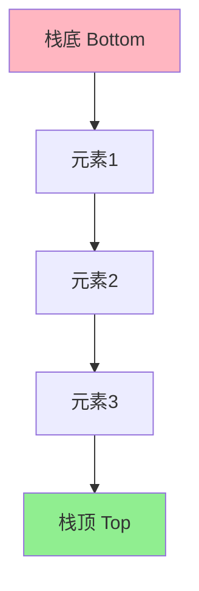
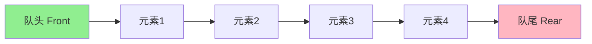
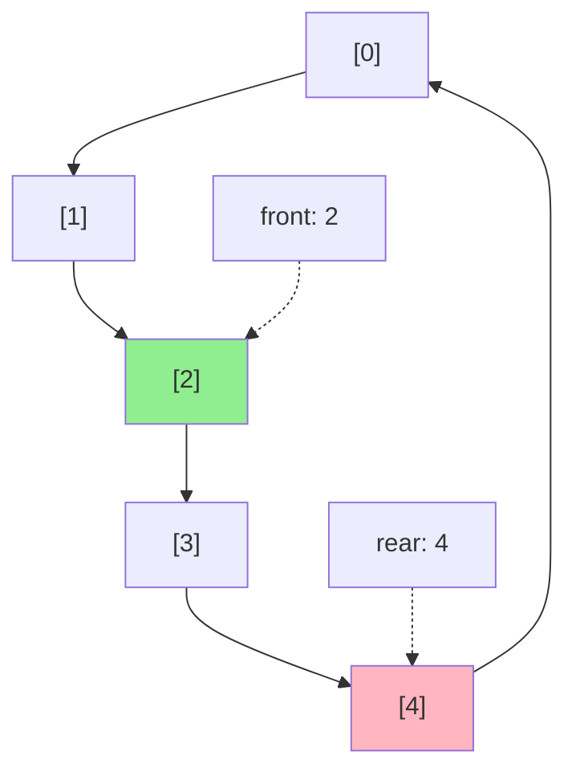
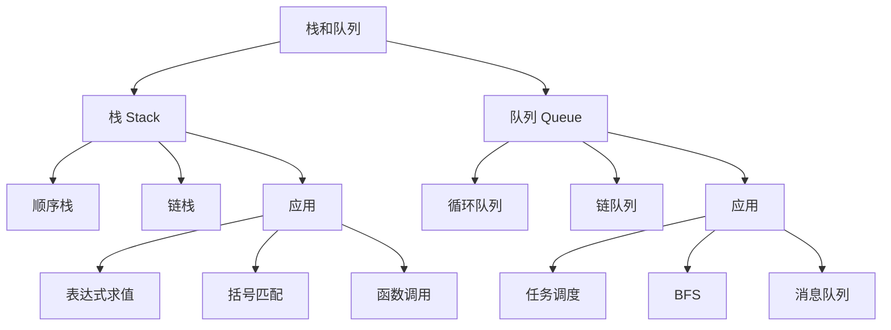

# 第3章：栈和队列

> 本章学习目标：
> - 理解栈和队列的定义、特点及抽象数据类型
> - 掌握栈的顺序存储和链式存储实现
> - 掌握队列的顺序存储（循环队列）和链式存储实现
> - 理解栈和队列的应用场景，特别是表达式求值
> - 能够解决与栈和队列相关的实际问题

---

## 3.1 栈

### 3.1.1 栈的逻辑结构

#### 栈的定义

**定义**：
栈（Stack）是一种**受限的线性表**，只允许在表的一端（称为栈顶，Top）进行插入和删除操作。另一端称为栈底（Bottom）。

**特点**：

| 特性 | 说明 |
|------|------|
| **后进先出（LIFO）** | Last In First Out - 最后插入的元素最先被删除 |
| **受限访问** | 只能访问栈顶元素 |
| **操作受限** | 只能在栈顶进行插入和删除 |
| **线性结构** | 元素之间是一对一的关系 |

**结构图示**：



**操作图示**：

```
入栈（Push）:
空栈
│
└─> Push(10)
    │
    └─> Push(20)
        │
        └─> Push(30)
            │
            [10, 20, 30] ← 栈顶

出栈（Pop）:
[10, 20, 30] ← 栈顶
│
└─> Pop() → 返回30
    │
    └─> [10, 20] ← 栈顶
```

#### 栈的抽象数据类型定义

**ADT定义**：

```cpp
ADT Stack {
    数据对象：D = {a_i | a_i ∈ ElemSet, i = 1, 2, ..., n, n ≥ 0}
    数据关系：R = {<a_i-1, a_i> | a_i-1, a_i ∈ D, i = 2, ..., n}
              约定a_n端为栈顶，a_1端为栈底

    基本操作：
        InitStack(&S)        // 初始化栈
        DestroyStack(&S)     // 销毁栈
        ClearStack(&S)       // 清空栈
        StackEmpty(S)        // 判断栈是否为空
        StackLength(S)       // 返回栈的长度
        GetTop(S, &e)        // 获取栈顶元素
        Push(&S, e)          // 入栈
        Pop(&S, &e)          // 出栈
}
```

**C++接口定义**：

```cpp
#include <iostream>
#include <stdexcept>

template <typename T>
class IStack {
public:
    // 析构函数
    virtual ~IStack() = default;

    // 基本操作
    virtual void clear() = 0;                              // 清空栈
    virtual bool isEmpty() const = 0;                      // 判断是否为空
    virtual int size() const = 0;                          // 返回栈的长度
    virtual T& top() = 0;                                  // 获取栈顶元素
    virtual const T& top() const = 0;                      // 获取栈顶元素（常量）
    virtual void push(const T& value) = 0;                 // 入栈
    virtual void push(T&& value) = 0;                      // 入栈（移动语义）
    virtual void pop() = 0;                                // 出栈

    // 扩展操作
    virtual void swap(IStack& other) {                     // 交换两个栈
        std::swap(*this, other);
    }
};
```

---

### 3.1.2 栈的顺序存储结构及实现

#### 顺序栈的定义

**定义**：
顺序栈（Sequential Stack）是使用**数组**实现的栈，利用数组的连续存储空间来存储栈元素。

**内存布局**：

```
数组索引:  [0]   [1]   [2]   [3]   [4]   [5]
           ↓     ↓     ↓     ↓     ↓     ↓
内容:     [10]  [20]  [30]  [40]  [ ? ]  [ ? ]
           ↑                           ↑
        栈底                      空闲空间
        (bottom)                    (未使用)

栈顶指针(top): 指向栈顶元素的索引，当前值为3
```

**特点**：

| 特性 | 说明 |
|------|------|
| **连续存储** | 使用数组连续存储元素 |
| **随机访问** | 可以通过索引快速访问 |
| **容量固定** | 需要预先分配空间或动态扩容 |
| **栈顶指针** | 用一个整数（top）表示栈顶位置 |
| **判空条件** | top == -1 |
| **判满条件** | top == capacity - 1 |

#### 顺序栈的实现

```cpp
#include <iostream>
#include <stdexcept>
#include <algorithm>

template <typename T>
class ArrayStack : public IStack<T> {
private:
    T* data;           // 存储数据的动态数组
    int capacity;      // 当前容量
    int topIndex;      // 栈顶指针（-1表示空栈）

    // 扩容函数
    void resize(int newCapacity) {
        T* newData = new T[newCapacity];
        for (int i = 0; i <= topIndex; ++i) {
            newData[i] = data[i];
        }
        delete[] data;
        data = newData;
        capacity = newCapacity;
        std::cout << "栈扩容至: " << newCapacity << std::endl;
    }

public:
    // 构造函数 - 指定初始容量
    explicit ArrayStack(int initialCapacity = 10) {
        if (initialCapacity <= 0) {
            throw std::invalid_argument("容量必须大于0");
        }
        data = new T[initialCapacity];
        capacity = initialCapacity;
        topIndex = -1;  // 空栈
        std::cout << "构造顺序栈，初始容量: " << capacity << std::endl;
    }

    // 析构函数
    ~ArrayStack() {
        delete[] data;
        std::cout << "销毁顺序栈" << std::endl;
    }

    // 拷贝构造函数
    ArrayStack(const ArrayStack& other) {
        capacity = other.capacity;
        topIndex = other.topIndex;
        data = new T[capacity];
        for (int i = 0; i <= topIndex; ++i) {
            data[i] = other.data[i];
        }
    }

    // 拷贝赋值运算符
    ArrayStack& operator=(const ArrayStack& other) {
        if (this != &other) {
            delete[] data;
            capacity = other.capacity;
            topIndex = other.topIndex;
            data = new T[capacity];
            for (int i = 0; i <= topIndex; ++i) {
                data[i] = other.data[i];
            }
        }
        return *this;
    }

    // 移动构造函数 (C++11)
    ArrayStack(ArrayStack&& other) noexcept
        : data(other.data), capacity(other.capacity), topIndex(other.topIndex) {
        other.data = nullptr;
        other.capacity = 0;
        other.topIndex = -1;
    }

    // 移动赋值运算符 (C++11)
    ArrayStack& operator=(ArrayStack&& other) noexcept {
        if (this != &other) {
            delete[] data;
            data = other.data;
            capacity = other.capacity;
            topIndex = other.topIndex;
            other.data = nullptr;
            other.capacity = 0;
            other.topIndex = -1;
        }
        return *this;
    }

    // 清空栈
    void clear() override {
        topIndex = -1;
        std::cout << "清空栈" << std::endl;
    }

    // 判断是否为空
    bool isEmpty() const override {
        return topIndex == -1;
    }

    // 返回栈的长度
    int size() const override {
        return topIndex + 1;
    }

    // 获取栈顶元素 - O(1)
    T& top() override {
        if (isEmpty()) {
            throw std::runtime_error("栈为空");
        }
        return data[topIndex];
    }

    const T& top() const override {
        if (isEmpty()) {
            throw std::runtime_error("栈为空");
        }
        return data[topIndex];
    }

    // 入栈 - 平均O(1)
    void push(const T& value) override {
        // 检查是否需要扩容
        if (topIndex >= capacity - 1) {
            resize(capacity * 2);  // 扩容为原来的2倍
        }

        ++topIndex;
        data[topIndex] = value;
    }

    void push(T&& value) override {
        // 检查是否需要扩容
        if (topIndex >= capacity - 1) {
            resize(capacity * 2);
        }

        ++topIndex;
        data[topIndex] = std::move(value);
    }

    // 出栈 - O(1)
    void pop() override {
        if (isEmpty()) {
            throw std::runtime_error("栈为空");
        }
        --topIndex;

        // 可选：当栈的大小远小于容量时，缩容
        if (capacity > 10 && topIndex < capacity / 4) {
            resize(capacity / 2);
        }
    }

    // 获取当前容量
    int getCapacity() const {
        return capacity;
    }

    // 遍历输出（从栈底到栈顶）
    void display() const {
        std::cout << "栈(从底到顶): [";
        for (int i = 0; i <= topIndex; ++i) {
            std::cout << data[i];
            if (i < topIndex) {
                std::cout << ", ";
            }
        }
        std::cout << "]" << std::endl;
        std::cout << "栈顶: ";
        if (!isEmpty()) {
            std::cout << data[topIndex];
        } else {
            std::cout << "空";
        }
        std::cout << std::endl;
    }
};
```

#### 顺序栈使用示例

```cpp
int main() {
    std::cout << "=== 顺序栈示例 ===" << std::endl;

    // 创建顺序栈
    ArrayStack<int> stack(5);  // 初始容量为5

    // 入栈操作
    std::cout << "\n--- 入栈操作 ---" << std::endl;
    stack.push(10);
    stack.push(20);
    stack.push(30);
    stack.display();  // 输出: [10, 20, 30], 栈顶: 30

    // 访问栈顶
    std::cout << "\n--- 访问栈顶 ---" << std::endl;
    std::cout << "栈顶元素: " << stack.top() << std::endl;  // 输出: 30

    // 出栈操作
    std::cout << "\n--- 出栈操作 ---" << std::endl;
    stack.pop();
    stack.display();  // 输出: [10, 20], 栈顶: 20

    // 测试扩容
    std::cout << "\n--- 测试扩容 ---" << std::endl;
    std::cout << "当前容量: " << stack.getCapacity() << std::endl;
    for (int i = 0; i < 10; ++i) {
        stack.push(i * 10);
    }
    std::cout << "扩容后容量: " << stack.getCapacity() << std::endl;
    stack.display();

    // 清空
    std::cout << "\n--- 清空 ---" << std::endl;
    stack.clear();
    std::cout << "是否为空: " << (stack.isEmpty() ? "是" : "否") << std::endl;
    std::cout << "栈的长度: " << stack.size() << std::endl;

    return 0;
}
```

#### 顺序栈操作的时间复杂度分析

| 操作 | 时间复杂度 | 说明 |
|------|-----------|------|
| **top()** | O(1) | 直接通过topIndex访问 |
| **push(e)** | 平均O(1) | 最好情况O(1)，最坏情况O(n)（扩容时） |
| **pop()** | 平均O(1) | 最好情况O(1)，最坏情况O(n)（缩容时） |
| **isEmpty()** | O(1) | 直接判断topIndex |
| **size()** | O(1) | 直接返回topIndex + 1 |
| **clear()** | O(1) | 只需要将topIndex设为-1 |

**空间复杂度分析**：
- **基本空间**：O(n)，n为栈的容量
- **额外空间**：O(1)，基本操作只需要常数级额外空间

---

### 3.1.3 栈的链接存储结构及实现

#### 链栈的定义

**定义**：
链栈（Linked Stack）是使用**链表**实现的栈，每个节点包含数据域和指向下一个节点的指针。

**节点结构**：

```
┌──────┬──────┐
│ data │ next │
└──────┴──────┘
  数据域 指针域
```

**链表结构图示**：

```mermaid
graph LR
    A[top] --> B[data1|next]
    B --> C[data2|next]
    C --> D[data3|next]
    D --> E[nullptr]

    style A fill:#90EE90
    style E fill:#FFB6C1
```

**特点**：

| 特性 | 说明 |
|------|------|
| **非连续存储** | 节点可以分散在内存的任意位置 |
| **动态分配** | 可以根据需要动态申请内存 |
| **无容量限制** | 不受预先分配容量的限制 |
| **栈顶指针** | 用头指针指向栈顶节点 |
| **判空条件** | top == nullptr |
| **判满条件** | 无（除非内存耗尽） |

#### 链栈的实现

```cpp
#include <iostream>
#include <stdexcept>
#include <memory>

// 链表节点结构
template <typename T>
struct StackNode {
    T data;              // 数据域
    StackNode* next;     // 指针域

    // 构造函数
    StackNode(const T& value, StackNode* ptr = nullptr)
        : data(value), next(ptr) {}

    StackNode(T&& value, StackNode* ptr = nullptr)
        : data(std::move(value)), next(ptr) {}
};

// 链栈类
template <typename T>
class LinkedStack : public IStack<T> {
private:
    StackNode<T>* top;   // 栈顶指针
    int length;          // 栈的长度

public:
    // 构造函数
    LinkedStack() : top(nullptr), length(0) {
        std::cout << "构造空链栈" << std::endl;
    }

    // 析构函数
    ~LinkedStack() {
        clear();
        std::cout << "销毁链栈" << std::endl;
    }

    // 拷贝构造函数
    LinkedStack(const LinkedStack& other) : top(nullptr), length(0) {
        StackNode<T>* current = other.top;
        StackNode<T>* prev = nullptr;

        // 反向复制（因为栈顶在链表头部）
        while (current != nullptr) {
            StackNode<T>* newNode = new StackNode<T>(current->data, top);
            top = newNode;
            current = current->next;
            ++length;
        }
    }

    // 拷贝赋值运算符
    LinkedStack& operator=(const LinkedStack& other) {
        if (this != &other) {
            clear();
            StackNode<T>* current = other.top;

            while (current != nullptr) {
                StackNode<T>* newNode = new StackNode<T>(current->data, top);
                top = newNode;
                current = current->next;
                ++length;
            }
        }
        return *this;
    }

    // 移动构造函数 (C++11)
    LinkedStack(LinkedStack&& other) noexcept
        : top(other.top), length(other.length) {
        other.top = nullptr;
        other.length = 0;
    }

    // 移动赋值运算符 (C++11)
    LinkedStack& operator=(LinkedStack&& other) noexcept {
        if (this != &other) {
            clear();
            top = other.top;
            length = other.length;
            other.top = nullptr;
            other.length = 0;
        }
        return *this;
    }

    // 清空栈
    void clear() override {
        StackNode<T>* current = top;
        while (current != nullptr) {
            StackNode<T>* next = current->next;
            delete current;
            current = next;
        }
        top = nullptr;
        length = 0;
        std::cout << "清空链栈" << std::endl;
    }

    // 判断是否为空
    bool isEmpty() const override {
        return top == nullptr;
    }

    // 返回栈的长度
    int size() const override {
        return length;
    }

    // 获取栈顶元素 - O(1)
    T& top() override {
        if (isEmpty()) {
            throw std::runtime_error("栈为空");
        }
        return top->data;
    }

    const T& top() const override {
        if (isEmpty()) {
            throw std::runtime_error("栈为空");
        }
        return top->data;
    }

    // 入栈 - O(1)
    void push(const T& value) override {
        StackNode<T>* newNode = new StackNode<T>(value, top);
        top = newNode;
        ++length;
    }

    void push(T&& value) override {
        StackNode<T>* newNode = new StackNode<T>(std::move(value), top);
        top = newNode;
        ++length;
    }

    // 出栈 - O(1)
    void pop() override {
        if (isEmpty()) {
            throw std::runtime_error("栈为空");
        }

        StackNode<T>* temp = top;
        top = top->next;
        delete temp;
        --length;
    }

    // 遍历输出（从栈顶到栈底）
    void display() const {
        std::cout << "栈(从顶到底): [";
        StackNode<T>* current = top;
        while (current != nullptr) {
            std::cout << current->data;
            if (current->next != nullptr) {
                std::cout << " -> ";
            }
            current = current->next;
        }
        std::cout << "]" << std::endl;

        if (!isEmpty()) {
            std::cout << "栈顶: " << top->data << std::endl;
        } else {
            std::cout << "栈顶: 空" << std::endl;
        }
    }

    // 反转栈（使用递归）
    void reverseRecursive() {
        if (isEmpty() || top->next == nullptr) {
            return;
        }

        T temp = top->data;
        pop();
        reverseRecursive();
        insertAtBottom(temp);
    }

private:
    // 在栈底插入元素（辅助函数）
    void insertAtBottom(const T& value) {
        if (isEmpty()) {
            push(value);
        } else {
            T temp = top->data;
            pop();
            insertAtBottom(value);
            push(temp);
        }
    }
};
```

#### 链栈使用示例

```cpp
int main() {
    std::cout << "=== 链栈示例 ===" << std::endl;

    // 创建链栈
    LinkedStack<int> stack;

    // 入栈操作
    std::cout << "\n--- 入栈操作 ---" << std::endl;
    stack.push(10);
    stack.push(20);
    stack.push(30);
    stack.display();  // 输出: [30 -> 20 -> 10], 栈顶: 30

    // 访问栈顶
    std::cout << "\n--- 访问栈顶 ---" << std::endl;
    std::cout << "栈顶元素: " << stack.top() << std::endl;  // 输出: 30

    // 出栈操作
    std::cout << "\n--- 出栈操作 ---" << std::endl;
    stack.pop();
    stack.display();  // 输出: [20 -> 10], 栈顶: 20

    // 测试反转
    std::cout << "\n--- 反转栈 ---" << std::endl;
    stack.push(40);
    stack.push(50);
    stack.display();  // 输出: [50 -> 40 -> 20 -> 10], 栈顶: 50
    stack.reverseRecursive();
    stack.display();  // 输出: [10 -> 20 -> 40 -> 50], 栈顶: 10

    // 清空
    std::cout << "\n--- 清空 ---" << std::endl;
    stack.clear();
    std::cout << "是否为空: " << (stack.isEmpty() ? "是" : "否") << std::endl;
    std::cout << "栈的长度: " << stack.size() << std::endl;

    return 0;
}
```

#### 链栈操作的时间复杂度分析

| 操作 | 时间复杂度 | 说明 |
|------|-----------|------|
| **top()** | O(1) | 直接访问头节点 |
| **push(e)** | O(1) | 在头部插入节点 |
| **pop()** | O(1) | 删除头部节点 |
| **isEmpty()** | O(1) | 直接判断top指针 |
| **size()** | O(1) | 直接返回length |
| **clear()** | O(n) | 需要删除所有节点 |

**空间复杂度分析**：
- **基本空间**：O(n)，n为栈中元素个数
- **额外空间**：O(n)，每个节点需要额外的指针空间

---

### 3.1.4 顺序栈和链栈的比较

| 比较维度 | 顺序栈 | 链栈 |
|----------|--------|------|
| **存储方式** | 连续存储 | 非连续存储 |
| **空间分配** | 静态或动态扩容 | 动态分配 |
| **容量限制** | 受数组容量限制 | 仅受内存限制 |
| **空间效率** | 存储密度高（1） | 存储密度低（<1） |
| **push时间** | 平均O(1) | O(1) |
| **pop时间** | 平均O(1) | O(1) |
| **top时间** | O(1) | O(1) |
| **随机访问** | 支持 | 不支持 |
| **适用场景** | 栈大小可预估时 | 栈大小不确定时 |

**选择建议**：

```cpp
// 场景1：栈大小可预估，访问频繁
ArrayStack<int> stack1(1000);  // 使用顺序栈

// 场景2：栈大小不确定，需要动态调整
LinkedStack<int> stack2;  // 使用链栈

// 场景3：需要随机访问栈中元素
ArrayStack<int> stack3;  // 必须使用顺序栈

// 场景4：内存有限，栈可能很大但使用频率不高
LinkedStack<int> stack4;  // 使用链栈，按需分配
```

---

## 3.2 队列

### 3.2.1 队列的逻辑结构

#### 队列的定义

**定义**：
队列（Queue）是一种**受限的线性表**，只允许在表的一端（称为队尾，Rear）进行插入操作，在另一端（称为队头，Front）进行删除操作。

**特点**：

| 特性 | 说明 |
|------|------|
| **先进先出（FIFO）** | First In First Out - 最先插入的元素最先被删除 |
| **受限访问** | 只能在队头和队尾进行操作 |
| **操作受限** | 只能在队尾插入、队头删除 |
| **线性结构** | 元素之间是一对一的关系 |

**结构图示**：



**操作图示**：

```
入队（Enqueue）:
空队列
│
└─> Enqueue(10)
    │
    └─> Enqueue(20)
        │
        └─> Enqueue(30)
            │
            [10, 20, 30]
             ↑        ↑
           队头     队尾

出队（Dequeue）:
[10, 20, 30]
 ↑        ↑
队头     队尾
│
└─> Dequeue() → 返回10
    │
    └─> [20, 30]
         ↑     ↑
       队头   队尾
```

#### 队列的抽象数据类型定义

**ADT定义**：

```cpp
ADT Queue {
    数据对象：D = {a_i | a_i ∈ ElemSet, i = 1, 2, ..., n, n ≥ 0}
    数据关系：R = {<a_i-1, a_i> | a_i-1, a_i ∈ D, i = 2, ..., n}
              约定a_1端为队头，a_n端为队尾

    基本操作：
        InitQueue(&Q)        // 初始化队列
        DestroyQueue(&Q)     // 销毁队列
        ClearQueue(&Q)       // 清空队列
        QueueEmpty(Q)        // 判断队列是否为空
        QueueLength(Q)       // 返回队列的长度
        GetHead(Q, &e)       // 获取队头元素
        EnQueue(&Q, e)       // 入队
        DeQueue(&Q, &e)      // 出队
}
```

**C++接口定义**：

```cpp
#include <iostream>
#include <stdexcept>

template <typename T>
class IQueue {
public:
    // 析构函数
    virtual ~IQueue() = default;

    // 基本操作
    virtual void clear() = 0;                              // 清空队列
    virtual bool isEmpty() const = 0;                      // 判断是否为空
    virtual int size() const = 0;                          // 返回队列的长度
    virtual T& front() = 0;                                // 获取队头元素
    virtual const T& front() const = 0;                    // 获取队头元素（常量）
    virtual T& back() = 0;                                 // 获取队尾元素
    virtual const T& back() const = 0;                     // 获取队尾元素（常量）
    virtual void enqueue(const T& value) = 0;              // 入队
    virtual void enqueue(T&& value) = 0;                   // 入队（移动语义）
    virtual void dequeue() = 0;                            // 出队

    // 扩展操作
    virtual void swap(IQueue& other) {                     // 交换两个队列
        std::swap(*this, other);
    }
};
```

---

### 3.2.2 队列的顺序存储结构及实现

#### 循环队列的定义

**定义**：
循环队列（Circular Queue）是使用**数组**实现的队列，通过**取模运算**将数组的尾部和头部连接起来，形成一个环形结构。

**问题：普通顺序队列的"假溢出"**

```
普通顺序队列的问题：

初始状态（容量=5）:
[ ? ][ ? ][ ? ][ ? ][ ? ]
  ↑
front/rear

入队10, 20, 30, 40:
[10][20][30][40][ ? ]
 ↑           ↑
front       rear

出队10, 20:
[ ? ][ ? ][30][40][ ? ]
           ↑   ↑
        front rear

入队50:
[ ? ][ ? ][30][40][50]
           ↑       ↑
        front    rear

入队60 → 溢出！
[ ? ][ ? ][30][40][50]
           ↑       ↑
        front    rear

但实际上前面还有2个空位，这就是"假溢出"问题！
```

**循环队列的解决方案**：

```
循环队列（容量=5）:

入队10, 20, 30, 40:
[10][20][30][40][ ? ]
 ↑               ↑
front           rear

出队10, 20:
[ ? ][ ? ][30][40][ ? ]
           ↑       ↑
        front    rear

入队50, 60:
[60][ ? ][30][40][50]
 ↑   ↑       ↑   ↑
rear front  ... rear

通过取模运算实现循环！
```

**循环队列的结构图示**：



**循环队列的关键公式**：

| 操作 | 公式 |
|------|------|
| **队头后移** | `front = (front + 1) % capacity` |
| **队尾后移** | `rear = (rear + 1) % capacity` |
| **队列长度** | `length = (rear - front + capacity) % capacity` |

**判空和判满**：

有两种方案：

**方案1：使用count变量记录元素个数**
```
判空：count == 0
判满：count == capacity
```

**方案2：浪费一个空间**
```
判空：front == rear
判满：(rear + 1) % capacity == front
```

#### 循环队列的实现（方案1：使用count）

```cpp
#include <iostream>
#include <stdexcept>
#include <algorithm>

template <typename T>
class CircularQueue : public IQueue<T> {
private:
    T* data;           // 存储数据的动态数组
    int capacity;      // 当前容量
    int frontIndex;    // 队头指针
    int rearIndex;     // 队尾指针
    int count;         // 元素个数

    // 扩容函数
    void resize(int newCapacity) {
        T* newData = new T[newCapacity];

        // 将元素从旧数组复制到新数组
        for (int i = 0; i < count; ++i) {
            newData[i] = data[(frontIndex + i) % capacity];
        }

        delete[] data;
        data = newData;
        frontIndex = 0;
        rearIndex = count - 1;
        capacity = newCapacity;
        std::cout << "队列扩容至: " << newCapacity << std::endl;
    }

public:
    // 构造函数 - 指定初始容量
    explicit CircularQueue(int initialCapacity = 10) {
        if (initialCapacity <= 0) {
            throw std::invalid_argument("容量必须大于0");
        }
        data = new T[initialCapacity];
        capacity = initialCapacity;
        frontIndex = 0;
        rearIndex = -1;  // 空队列
        count = 0;
        std::cout << "构造循环队列，初始容量: " << capacity << std::endl;
    }

    // 析构函数
    ~CircularQueue() {
        delete[] data;
        std::cout << "销毁循环队列" << std::endl;
    }

    // 拷贝构造函数
    CircularQueue(const CircularQueue& other) {
        capacity = other.capacity;
        frontIndex = other.frontIndex;
        rearIndex = other.rearIndex;
        count = other.count;
        data = new T[capacity];
        for (int i = 0; i < count; ++i) {
            data[(frontIndex + i) % capacity] = other.data[(other.frontIndex + i) % other.capacity];
        }
    }

    // 拷贝赋值运算符
    CircularQueue& operator=(const CircularQueue& other) {
        if (this != &other) {
            delete[] data;
            capacity = other.capacity;
            frontIndex = other.frontIndex;
            rearIndex = other.rearIndex;
            count = other.count;
            data = new T[capacity];
            for (int i = 0; i < count; ++i) {
                data[(frontIndex + i) % capacity] = other.data[(other.frontIndex + i) % other.capacity];
            }
        }
        return *this;
    }

    // 移动构造函数 (C++11)
    CircularQueue(CircularQueue&& other) noexcept
        : data(other.data), capacity(other.capacity),
          frontIndex(other.frontIndex), rearIndex(other.rearIndex),
          count(other.count) {
        other.data = nullptr;
        other.capacity = 0;
        other.frontIndex = 0;
        other.rearIndex = -1;
        other.count = 0;
    }

    // 移动赋值运算符 (C++11)
    CircularQueue& operator=(CircularQueue&& other) noexcept {
        if (this != &other) {
            delete[] data;
            data = other.data;
            capacity = other.capacity;
            frontIndex = other.frontIndex;
            rearIndex = other.rearIndex;
            count = other.count;
            other.data = nullptr;
            other.capacity = 0;
            other.frontIndex = 0;
            other.rearIndex = -1;
            other.count = 0;
        }
        return *this;
    }

    // 清空队列
    void clear() override {
        frontIndex = 0;
        rearIndex = -1;
        count = 0;
        std::cout << "清空队列" << std::endl;
    }

    // 判断是否为空
    bool isEmpty() const override {
        return count == 0;
    }

    // 返回队列的长度
    int size() const override {
        return count;
    }

    // 获取队头元素 - O(1)
    T& front() override {
        if (isEmpty()) {
            throw std::runtime_error("队列为空");
        }
        return data[frontIndex];
    }

    const T& front() const override {
        if (isEmpty()) {
            throw std::runtime_error("队列为空");
        }
        return data[frontIndex];
    }

    // 获取队尾元素 - O(1)
    T& back() override {
        if (isEmpty()) {
            throw std::runtime_error("队列为空");
        }
        return data[rearIndex];
    }

    const T& back() const override {
        if (isEmpty()) {
            throw std::runtime_error("队列为空");
        }
        return data[rearIndex];
    }

    // 入队 - 平均O(1)
    void enqueue(const T& value) override {
        // 检查是否需要扩容
        if (count >= capacity) {
            resize(capacity * 2);
        }

        rearIndex = (rearIndex + 1) % capacity;
        data[rearIndex] = value;
        ++count;
    }

    void enqueue(T&& value) override {
        // 检查是否需要扩容
        if (count >= capacity) {
            resize(capacity * 2);
        }

        rearIndex = (rearIndex + 1) % capacity;
        data[rearIndex] = std::move(value);
        ++count;
    }

    // 出队 - 平均O(1)
    void dequeue() override {
        if (isEmpty()) {
            throw std::runtime_error("队列为空");
        }

        frontIndex = (frontIndex + 1) % capacity;
        --count;

        // 可选：当队列的大小远小于容量时，缩容
        if (capacity > 10 && count < capacity / 4) {
            resize(capacity / 2);
        }
    }

    // 获取当前容量
    int getCapacity() const {
        return capacity;
    }

    // 遍历输出（从队头到队尾）
    void display() const {
        std::cout << "队列(从头到尾): [";
        for (int i = 0; i < count; ++i) {
            std::cout << data[(frontIndex + i) % capacity];
            if (i < count - 1) {
                std::cout << ", ";
            }
        }
        std::cout << "]" << std::endl;

        if (!isEmpty()) {
            std::cout << "队头: " << data[frontIndex] << std::endl;
            std::cout << "队尾: " << data[rearIndex] << std::endl;
        } else {
            std::cout << "队头: 空" << std::endl;
            std::cout << "队尾: 空" << std::endl;
        }
    }
};
```

#### 循环队列使用示例

```cpp
int main() {
    std::cout << "=== 循环队列示例 ===" << std::endl;

    // 创建循环队列
    CircularQueue<int> queue(5);  // 初始容量为5

    // 入队操作
    std::cout << "\n--- 入队操作 ---" << std::endl;
    queue.enqueue(10);
    queue.enqueue(20);
    queue.enqueue(30);
    queue.display();  // 输出: [10, 20, 30], 队头: 10, 队尾: 30

    // 访问队头和队尾
    std::cout << "\n--- 访问队头和队尾 ---" << std::endl;
    std::cout << "队头元素: " << queue.front() << std::endl;  // 输出: 10
    std::cout << "队尾元素: " << queue.back() << std::endl;   // 输出: 30

    // 出队操作
    std::cout << "\n--- 出队操作 ---" << std::endl;
    queue.dequeue();
    queue.display();  // 输出: [20, 30], 队头: 20, 队尾: 30

    // 测试循环特性
    std::cout << "\n--- 测试循环特性 ---" << std::endl;
    for (int i = 0; i < 10; ++i) {
        queue.enqueue(i * 10);
        if (i % 3 == 2) {
            queue.dequeue();
        }
    }
    queue.display();

    // 清空
    std::cout << "\n--- 清空 ---" << std::endl;
    queue.clear();
    std::cout << "是否为空: " << (queue.isEmpty() ? "是" : "否") << std::endl;
    std::cout << "队列的长度: " << queue.size() << std::endl;

    return 0;
}
```

#### 循环队列操作的时间复杂度分析

| 操作 | 时间复杂度 | 说明 |
|------|-----------|------|
| **front()** | O(1) | 直接通过frontIndex访问 |
| **back()** | O(1) | 直接通过rearIndex访问 |
| **enqueue(e)** | 平均O(1) | 最好情况O(1)，最坏情况O(n)（扩容时） |
| **dequeue()** | 平均O(1) | 最好情况O(1)，最坏情况O(n)（缩容时） |
| **isEmpty()** | O(1) | 直接判断count |
| **size()** | O(1) | 直接返回count |
| **clear()** | O(1) | 只需要重置指针和count |

**空间复杂度分析**：
- **基本空间**：O(n)，n为队列的容量
- **额外空间**：O(1)，基本操作只需要常数级额外空间

---

### 3.2.3 队列的链接存储结构及实现

#### 链队列的定义

**定义**：
链队列（Linked Queue）是使用**链表**实现的队列，通常使用带头结点的单链表，并维护队头和队尾两个指针。

**节点结构**：

```
┌──────┬──────┐
│ data │ next │
└──────┴──────┘
  数据域 指针域
```

**链表结构图示**：

```mermaid
graph LR
    A[front] --> B[head|next]
    B --> C[data1|next]
    C --> D[data2|next]
    D --> E[data3|next]
    E --> F[nullptr]

    A -.-> G[rear]
    G -.-> E

    style A fill:#90EE90
    style G fill:#FFB6C1
    style F fill:#FFB6C1
```

**特点**：

| 特性 | 说明 |
|------|------|
| **非连续存储** | 节点可以分散在内存的任意位置 |
| **动态分配** | 可以根据需要动态申请内存 |
| **无容量限制** | 不受预先分配容量的限制 |
| **双指针** | 维护front和rear两个指针 |
| **判空条件** | front == nullptr 或 rear == nullptr |
| **判满条件** | 无（除非内存耗尽） |

#### 链队列的实现

```cpp
#include <iostream>
#include <stdexcept>

// 链表节点结构
template <typename T>
struct QueueNode {
    T data;              // 数据域
    QueueNode* next;     // 指针域

    // 构造函数
    QueueNode(const T& value, QueueNode* ptr = nullptr)
        : data(value), next(ptr) {}

    QueueNode(T&& value, QueueNode* ptr = nullptr)
        : data(std::move(value)), next(ptr) {}
};

// 链队列类
template <typename T>
class LinkedQueue : public IQueue<T> {
private:
    QueueNode<T>* front;   // 队头指针
    QueueNode<T>* rear;    // 队尾指针
    int length;            // 队列的长度

public:
    // 构造函数
    LinkedQueue() : front(nullptr), rear(nullptr), length(0) {
        std::cout << "构造空链队列" << std::endl;
    }

    // 析构函数
    ~LinkedQueue() {
        clear();
        std::cout << "销毁链队列" << std::endl;
    }

    // 拷贝构造函数
    LinkedQueue(const LinkedQueue& other) : front(nullptr), rear(nullptr), length(0) {
        QueueNode<T>* current = other.front;
        while (current != nullptr) {
            enqueue(current->data);
            current = current->next;
        }
    }

    // 拷贝赋值运算符
    LinkedQueue& operator=(const LinkedQueue& other) {
        if (this != &other) {
            clear();
            QueueNode<T>* current = other.front;
            while (current != nullptr) {
                enqueue(current->data);
                current = current->next;
            }
        }
        return *this;
    }

    // 移动构造函数 (C++11)
    LinkedQueue(LinkedQueue&& other) noexcept
        : front(other.front), rear(other.rear), length(other.length) {
        other.front = nullptr;
        other.rear = nullptr;
        other.length = 0;
    }

    // 移动赋值运算符 (C++11)
    LinkedQueue& operator=(LinkedQueue&& other) noexcept {
        if (this != &other) {
            clear();
            front = other.front;
            rear = other.rear;
            length = other.length;
            other.front = nullptr;
            other.rear = nullptr;
            other.length = 0;
        }
        return *this;
    }

    // 清空队列
    void clear() override {
        QueueNode<T>* current = front;
        while (current != nullptr) {
            QueueNode<T>* next = current->next;
            delete current;
            current = next;
        }
        front = nullptr;
        rear = nullptr;
        length = 0;
        std::cout << "清空链队列" << std::endl;
    }

    // 判断是否为空
    bool isEmpty() const override {
        return front == nullptr;
    }

    // 返回队列的长度
    int size() const override {
        return length;
    }

    // 获取队头元素 - O(1)
    T& front() override {
        if (isEmpty()) {
            throw std::runtime_error("队列为空");
        }
        return front->data;
    }

    const T& front() const override {
        if (isEmpty()) {
            throw std::runtime_error("队列为空");
        }
        return front->data;
    }

    // 获取队尾元素 - O(1)
    T& back() override {
        if (isEmpty()) {
            throw std::runtime_error("队列为空");
        }
        return rear->data;
    }

    const T& back() const override {
        if (isEmpty()) {
            throw std::runtime_error("队列为空");
        }
        return rear->data;
    }

    // 入队 - O(1)
    void enqueue(const T& value) override {
        QueueNode<T>* newNode = new QueueNode<T>(value);

        if (isEmpty()) {
            front = newNode;
            rear = newNode;
        } else {
            rear->next = newNode;
            rear = newNode;
        }
        ++length;
    }

    void enqueue(T&& value) override {
        QueueNode<T>* newNode = new QueueNode<T>(std::move(value));

        if (isEmpty()) {
            front = newNode;
            rear = newNode;
        } else {
            rear->next = newNode;
            rear = newNode;
        }
        ++length;
    }

    // 出队 - O(1)
    void dequeue() override {
        if (isEmpty()) {
            throw std::runtime_error("队列为空");
        }

        QueueNode<T>* temp = front;
        front = front->next;
        delete temp;
        --length;

        if (front == nullptr) {
            rear = nullptr;  // 队列变为空
        }
    }

    // 遍历输出（从队头到队尾）
    void display() const {
        std::cout << "队列(从头到尾): [";
        QueueNode<T>* current = front;
        while (current != nullptr) {
            std::cout << current->data;
            if (current->next != nullptr) {
                std::cout << " -> ";
            }
            current = current->next;
        }
        std::cout << "]" << std::endl;

        if (!isEmpty()) {
            std::cout << "队头: " << front->data << std::endl;
            std::cout << "队尾: " << rear->data << std::endl;
        } else {
            std::cout << "队头: 空" << std::endl;
            std::cout << "队尾: 空" << std::endl;
        }
    }
};
```

#### 链队列使用示例

```cpp
int main() {
    std::cout << "=== 链队列示例 ===" << std::endl;

    // 创建链队列
    LinkedQueue<int> queue;

    // 入队操作
    std::cout << "\n--- 入队操作 ---" << std::endl;
    queue.enqueue(10);
    queue.enqueue(20);
    queue.enqueue(30);
    queue.display();  // 输出: [10 -> 20 -> 30], 队头: 10, 队尾: 30

    // 访问队头和队尾
    std::cout << "\n--- 访问队头和队尾 ---" << std::endl;
    std::cout << "队头元素: " << queue.front() << std::endl;  // 输出: 10
    std::cout << "队尾元素: " << queue.back() << std::endl;   // 输出: 30

    // 出队操作
    std::cout << "\n--- 出队操作 ---" << std::endl;
    queue.dequeue();
    queue.display();  // 输出: [20 -> 30], 队头: 20, 队尾: 30

    // 清空
    std::cout << "\n--- 清空 ---" << std::endl;
    queue.clear();
    std::cout << "是否为空: " << (queue.isEmpty() ? "是" : "否") << std::endl;
    std::cout << "队列的长度: " << queue.size() << std::endl;

    return 0;
}
```

#### 链队列操作的时间复杂度分析

| 操作 | 时间复杂度 | 说明 |
|------|-----------|------|
| **front()** | O(1) | 直接访问头节点 |
| **back()** | O(1) | 直接访问尾节点 |
| **enqueue(e)** | O(1) | 在尾部插入节点 |
| **dequeue()** | O(1) | 删除头部节点 |
| **isEmpty()** | O(1) | 直接判断front指针 |
| **size()** | O(1) | 直接返回length |
| **clear()** | O(n) | 需要删除所有节点 |

**空间复杂度分析**：
- **基本空间**：O(n)，n为队列中元素个数
- **额外空间**：O(n)，每个节点需要额外的指针空间

---

### 3.2.4 循环队列和链队列的比较

| 比较维度 | 循环队列 | 链队列 |
|----------|----------|--------|
| **存储方式** | 连续存储 | 非连续存储 |
| **空间分配** | 静态或动态扩容 | 动态分配 |
| **容量限制** | 受数组容量限制 | 仅受内存限制 |
| **空间效率** | 存储密度高（1） | 存储密度低（<1） |
| **enqueue时间** | 平均O(1) | O(1) |
| **dequeue时间** | 平均O(1) | O(1) |
| **front时间** | O(1) | O(1) |
| **back时间** | O(1) | O(1) |
| **实现复杂度** | 较复杂（需要处理循环） | 较简单 |
| **适用场景** | 队列大小可预估时 | 队列大小不确定时 |

**选择建议**：

```cpp
// 场景1：队列大小可预估，访问频繁
CircularQueue<int> queue1(1000);  // 使用循环队列

// 场景2：队列大小不确定，需要动态调整
LinkedQueue<int> queue2;  // 使用链队列

// 场景3：需要频繁的入队和出队操作
CircularQueue<int> queue3;  // 两种都可以，循环队列略快

// 场景4：内存有限，队列可能很大但使用频率不高
LinkedQueue<int> queue4;  // 使用链队列，按需分配
```

---

## 3.3 应用举例

### 3.3.1 栈的应用举例——表达式求值

#### 表达式求值概述

**表达式类型**：

| 类型 | 示例 | 特点 |
|------|------|------|
| **中缀表达式** | `3 + 4 * 2 - 1` | 操作符在操作数中间，符合人类习惯 |
| **前缀表达式** | `- + 3 * 4 2 1` | 操作符在操作数前面，又称波兰表达式 |
| **后缀表达式** | `3 4 2 * + 1 -` | 操作符在操作数后面，又称逆波兰表达式 |

**后缀表达式的优点**：
- 无需括号
- 无需考虑运算符优先级
- 计算顺序唯一
- 适合计算机处理

#### 中缀转后缀表达式

**算法步骤**：

1. 初始化一个空栈和一个空列表（存储结果）
2. 从左到右扫描中缀表达式
3. 遇到操作数：直接输出
4. 遇到左括号：压入栈
5. 遇到右括号：弹出栈顶元素并输出，直到遇到左括号
6. 遇到操作符：
   - 如果栈为空或栈顶是左括号：压入栈
   - 否则，比较优先级：
     - 如果当前操作符优先级 > 栈顶操作符优先级：压入栈
     - 否则：弹出栈顶并输出，重复比较
7. 扫描结束后，弹出栈中所有元素并输出

**运算符优先级**：

```
优先级从高到低：
1. 括号 ()
2. 乘除 * /
3. 加减 + -
```

**实现代码**：

```cpp
#include <iostream>
#include <stack>
#include <string>
#include <vector>
#include <cctype>

class ExpressionConverter {
private:
    // 获取运算符优先级
    int getPriority(char op) {
        switch (op) {
            case '+':
            case '-':
                return 1;
            case '*':
            case '/':
                return 2;
            case '(':
                return 0;
            default:
                return -1;
        }
    }

    // 判断是否为运算符
    bool isOperator(char c) {
        return c == '+' || c == '-' || c == '*' || c == '/';
    }

    // 判断是否为数字
    bool isDigit(char c) {
        return c >= '0' && c <= '9';
    }

public:
    // 中缀转后缀
    std::string infixToPostfix(const std::string& infix) {
        std::stack<char> opStack;
        std::string postfix;

        for (size_t i = 0; i < infix.size(); ++i) {
            char c = infix[i];

            // 跳过空格
            if (c == ' ') {
                continue;
            }

            // 处理数字（包括多位数）
            if (isDigit(c)) {
                while (i < infix.size() && isDigit(infix[i])) {
                    postfix += infix[i];
                    ++i;
                }
                --i;  // 回退一位，因为for循环会自增
                postfix += ' ';  // 数字后加空格分隔
            }
            // 处理左括号
            else if (c == '(') {
                opStack.push(c);
            }
            // 处理右括号
            else if (c == ')') {
                while (!opStack.empty() && opStack.top() != '(') {
                    postfix += opStack.top();
                    postfix += ' ';
                    opStack.pop();
                }
                opStack.pop();  // 弹出左括号
            }
            // 处理运算符
            else if (isOperator(c)) {
                while (!opStack.empty() &&
                       getPriority(c) <= getPriority(opStack.top())) {
                    postfix += opStack.top();
                    postfix += ' ';
                    opStack.pop();
                }
                opStack.push(c);
            }
        }

        // 弹出栈中剩余的运算符
        while (!opStack.empty()) {
            postfix += opStack.top();
            postfix += ' ';
            opStack.pop();
        }

        return postfix;
    }
};

// 使用示例
int main() {
    ExpressionConverter converter;

    std::string infix1 = "3 + 4 * 2 - 1";
    std::string postfix1 = converter.infixToPostfix(infix1);
    std::cout << "中缀: " << infix1 << std::endl;
    std::cout << "后缀: " << postfix1 << std::endl;
    // 输出: 3 4 2 * + 1 -

    std::string infix2 = "( 3 + 4 ) * ( 5 - 2 )";
    std::string postfix2 = converter.infixToPostfix(infix2);
    std::cout << "\n中缀: " << infix2 << std::endl;
    std::cout << "后缀: " << postfix2 << std::endl;
    // 输出: 3 4 + 5 2 - *

    return 0;
}
```

#### 计算后缀表达式

**算法步骤**：

1. 初始化一个空栈
2. 从左到右扫描后缀表达式
3. 遇到操作数：压入栈
4. 遇到操作符：
   - 弹出栈顶的两个元素（注意顺序）
   - 执行运算
   - 将结果压入栈
5. 扫描结束后，栈中唯一的元素就是结果

**实现代码**：

```cpp
#include <iostream>
#include <stack>
#include <string>
#include <sstream>
#include <vector>

class PostfixCalculator {
private:
    // 判断是否为数字
    bool isNumber(const std::string& s) {
        return !s.empty() && s[0] >= '0' && s[0] <= '9';
    }

    // 执行运算
    int calculate(int a, int b, char op) {
        switch (op) {
            case '+': return a + b;
            case '-': return a - b;
            case '*': return a * b;
            case '/':
                if (b == 0) {
                    throw std::runtime_error("除数不能为0");
                }
                return a / b;
            default:
                throw std::runtime_error("未知运算符");
        }
    }

public:
    // 计算后缀表达式
    int evaluate(const std::string& postfix) {
        std::stack<int> numStack;
        std::istringstream iss(postfix);
        std::string token;

        while (iss >> token) {
            if (isNumber(token)) {
                // 操作数：压入栈
                numStack.push(std::stoi(token));
            } else {
                // 运算符：弹出两个操作数
                if (numStack.size() < 2) {
                    throw std::runtime_error("表达式不合法");
                }

                int b = numStack.top();
                numStack.pop();
                int a = numStack.top();
                numStack.pop();

                int result = calculate(a, b, token[0]);
                numStack.push(result);
            }
        }

        if (numStack.size() != 1) {
            throw std::runtime_error("表达式不合法");
        }

        return numStack.top();
    }
};

// 使用示例
int main() {
    ExpressionConverter converter;
    PostfixCalculator calculator;

    std::string infix = "3 + 4 * 2 - 1";
    std::string postfix = converter.infixToPostfix(infix);

    std::cout << "中缀表达式: " << infix << std::endl;
    std::cout << "后缀表达式: " << postfix << std::endl;

    int result = calculator.evaluate(postfix);
    std::cout << "计算结果: " << result << std::endl;
    // 输出: 10

    return 0;
}
```

#### 完整的表达式求值系统

```cpp
#include <iostream>
#include <stack>
#include <string>
#include <sstream>
#include <vector>
#include <cctype>

class ExpressionEvaluator {
private:
    std::stack<char> opStack;
    std::stack<int> numStack;

    int getPriority(char op) {
        switch (op) {
            case '+':
            case '-':
                return 1;
            case '*':
            case '/':
                return 2;
            case '(':
                return 0;
            default:
                return -1;
        }
    }

    bool isOperator(char c) {
        return c == '+' || c == '-' || c == '*' || c == '/';
    }

    void performOperation() {
        if (numStack.size() < 2) {
            throw std::runtime_error("表达式不合法");
        }

        int b = numStack.top();
        numStack.pop();
        int a = numStack.top();
        numStack.pop();
        char op = opStack.top();
        opStack.pop();

        int result;
        switch (op) {
            case '+': result = a + b; break;
            case '-': result = a - b; break;
            case '*': result = a * b; break;
            case '/':
                if (b == 0) {
                    throw std::runtime_error("除数不能为0");
                }
                result = a / b;
                break;
            default:
                throw std::runtime_error("未知运算符");
        }

        numStack.push(result);
    }

public:
    // 直接计算中缀表达式
    int evaluateInfix(const std::string& infix) {
        for (size_t i = 0; i < infix.size(); ++i) {
            char c = infix[i];

            // 跳过空格
            if (c == ' ') {
                continue;
            }

            // 处理数字
            if (isdigit(c)) {
                int num = 0;
                while (i < infix.size() && isdigit(infix[i])) {
                    num = num * 10 + (infix[i] - '0');
                    ++i;
                }
                --i;
                numStack.push(num);
            }
            // 处理左括号
            else if (c == '(') {
                opStack.push(c);
            }
            // 处理右括号
            else if (c == ')') {
                while (!opStack.empty() && opStack.top() != '(') {
                    performOperation();
                }
                opStack.pop();  // 弹出左括号
            }
            // 处理运算符
            else if (isOperator(c)) {
                while (!opStack.empty() &&
                       getPriority(c) <= getPriority(opStack.top())) {
                    performOperation();
                }
                opStack.push(c);
            }
        }

        // 处理栈中剩余的运算符
        while (!opStack.empty()) {
            performOperation();
        }

        if (numStack.size() != 1) {
            throw std::runtime_error("表达式不合法");
        }

        return numStack.top();
    }
};

// 使用示例
int main() {
    ExpressionEvaluator evaluator;

    std::vector<std::string> expressions = {
        "3 + 4 * 2 - 1",
        "(3 + 4) * (5 - 2)",
        "10 + 2 * 6",
        "100 * 2 + 12",
        "100 * (2 + 12)",
        "100 * (2 + 12) / 14"
    };

    for (const auto& expr : expressions) {
        try {
            int result = evaluator.evaluateInfix(expr);
            std::cout << expr << " = " << result << std::endl;
        } catch (const std::exception& e) {
            std::cout << "错误: " << e.what() << std::endl;
        }
    }

    return 0;
}
```

**输出结果**：
```
3 + 4 * 2 - 1 = 10
(3 + 4) * (5 - 2) = 21
10 + 2 * 6 = 22
100 * 2 + 12 = 212
100 * (2 + 12) / 14 = 100
```

#### 栈的其他应用

**1. 括号匹配**

```cpp
#include <iostream>
#include <stack>
#include <string>
#include <unordered_map>

class BracketMatcher {
private:
    std::unordered_map<char, char> bracketPairs = {
        {')', '('},
        {']', '['},
        {'}', '{'}
    };

public:
    bool isValid(const std::string& s) {
        std::stack<char> stack;

        for (char c : s) {
            // 如果是左括号，压入栈
            if (c == '(' || c == '[' || c == '{') {
                stack.push(c);
            }
            // 如果是右括号
            else if (c == ')' || c == ']' || c == '}') {
                // 栈为空或栈顶不匹配
                if (stack.empty() || stack.top() != bracketPairs[c]) {
                    return false;
                }
                stack.pop();
            }
        }

        return stack.empty();
    }
};

// 使用示例
int main() {
    BracketMatcher matcher;

    std::vector<std::string> tests = {
        "()",
        "()[]{}",
        "(]",
        "([)]",
        "{[]}",
        "((()))",
        "(()"
    };

    for (const auto& test : tests) {
        std::cout << test << ": "
                  << (matcher.isValid(test) ? "有效" : "无效")
                  << std::endl;
    }

    return 0;
}
```

**2. 函数调用栈模拟**

```cpp
#include <iostream>
#include <stack>
#include <string>

struct CallFrame {
    std::string functionName;
    int lineNumber;
    std::string locals;

    CallFrame(const std::string& name, int line, const std::string& vars)
        : functionName(name), lineNumber(line), locals(vars) {}
};

class CallStack {
private:
    std::stack<CallFrame> stack;

public:
    void call(const std::string& func, int line, const std::string& vars = "") {
        stack.push(CallFrame(func, line, vars));
        std::cout << "调用: " << func << " (行号: " << line << ")" << std::endl;
        if (!vars.empty()) {
            std::cout << "  局部变量: " << vars << std::endl;
        }
    }

    void return_() {
        if (stack.empty()) {
            throw std::runtime_error("调用栈为空");
        }
        CallFrame frame = stack.top();
        stack.pop();
        std::cout << "返回: " << frame.functionName << std::endl;
    }

    void display() const {
        std::cout << "\n=== 调用栈 ===" << std::endl;
        std::stack<CallFrame> temp = stack;
        int depth = 0;
        while (!temp.empty()) {
            CallFrame frame = temp.top();
            std::cout << std::string(depth * 2, ' ')
                      << frame.functionName
                      << " (行号: " << frame.lineNumber << ")" << std::endl;
            if (!frame.locals.empty()) {
                std::cout << std::string(depth * 2, ' ')
                          << "  变量: " << frame.locals << std::endl;
            }
            temp.pop();
            ++depth;
        }
        std::cout << "==============" << std::endl;
    }
};

// 使用示例
int main() {
    CallStack callStack;

    // 模拟函数调用
    callStack.call("main", 1);
    callStack.call("funcA", 10, "x=10, y=20");
    callStack.call("funcB", 20, "z=30");
    callStack.display();
    callStack.return_();
    callStack.call("funcC", 15, "w=40");
    callStack.display();
    callStack.return_();
    callStack.return_();
    callStack.return_();

    return 0;
}
```

---

### 3.2.2 队列的应用举例——火车车厢重排

#### 问题描述

**问题描述**：
一个铁路调度站有3条缓冲轨道（K1、K2、K3）和1条输入轨道、1条输出轨道。输入轨道上的车厢顺序为[1, 2, 3, ..., n]，需要通过缓冲轨道重排成任意指定的顺序。

**问题示例**：
- 输入顺序：[1, 2, 3, 4, 5]
- 目标顺序：[5, 4, 3, 2, 1]
- 使用3个缓冲轨道

#### 解决方案

**算法思路**：

1. 使用队列模拟缓冲轨道
2. 每次检查当前输出目标是否在缓冲轨道的队首
3. 如果是，直接出队到输出
4. 如果不是，从输入轨道将车厢压入合适的缓冲轨道
5. 如果无法压入，则该排列不可行

**实现代码**：

```cpp
#include <iostream>
#include <queue>
#include <vector>
#include <algorithm>

class RailroadCarriage {
private:
    std::queue<int> inputTrack;
    std::queue<int> outputTrack;
    std::vector<std::queue<int>> bufferTracks;
    int numBuffers;

public:
    RailroadCarriage(const std::vector<int>& input, int buffers)
        : numBuffers(buffers), bufferTracks(buffers) {
        for (int car : input) {
            inputTrack.push(car);
        }
    }

    // 检查是否可以重排到目标顺序
    bool canRearrange(const std::vector<int>& target) {
        int targetIndex = 0;
        int n = target.size();

        while (targetIndex < n) {
            int currentTarget = target[targetIndex];

            // 检查缓冲轨道的队首
            bool found = false;
            for (auto& buffer : bufferTracks) {
                if (!buffer.empty() && buffer.front() == currentTarget) {
                    outputTrack.push(buffer.front());
                    buffer.pop();
                    ++targetIndex;
                    found = true;
                    break;
                }
            }

            if (found) {
                continue;
            }

            // 检查输入轨道
            if (!inputTrack.empty() && inputTrack.front() == currentTarget) {
                outputTrack.push(inputTrack.front());
                inputTrack.pop();
                ++targetIndex;
                continue;
            }

            // 尝试将输入轨道的车厢压入缓冲轨道
            if (inputTrack.empty()) {
                return false;  // 无法继续
            }

            int car = inputTrack.front();
            bool inserted = false;

            for (auto& buffer : bufferTracks) {
                // 寻找合适的缓冲轨道
                if (buffer.empty() || buffer.back() < car) {
                    buffer.push(car);
                    inputTrack.pop();
                    inserted = true;
                    break;
                }
            }

            if (!inserted) {
                return false;  // 无法插入，不可行
            }
        }

        return true;
    }

    // 打印状态
    void printState() {
        std::cout << "输入轨道: ";
        printQueue(inputTrack);

        std::cout << "输出轨道: ";
        printQueue(outputTrack);

        for (size_t i = 0; i < bufferTracks.size(); ++i) {
            std::cout << "缓冲轨道" << (i + 1) << ": ";
            printQueue(bufferTracks[i]);
        }
        std::cout << std::endl;
    }

private:
    void printQueue(const std::queue<int>& q) {
        std::queue<int> temp = q;
        std::cout << "[";
        while (!temp.empty()) {
            std::cout << temp.front();
            temp.pop();
            if (!temp.empty()) {
                std::cout << ", ";
            }
        }
        std::cout << "]" << std::endl;
    }
};

// 使用示例
int main() {
    // 示例1：可以重排
    std::vector<int> input1 = {1, 2, 3, 4, 5, 6, 7, 8, 9};
    std::vector<int> target1 = {5, 4, 3, 2, 1, 9, 8, 7, 6};

    RailroadCarriage rc1(input1, 3);
    std::cout << "=== 示例1 ===" << std::endl;
    std::cout << "输入: ";
    for (int x : input1) std::cout << x << " ";
    std::cout << "\n目标: ";
    for (int x : target1) std::cout << x << " ";
    std::cout << "\n结果: " << (rc1.canRearrange(target1) ? "可以" : "不可以") << std::endl;

    // 示例2：不可重排
    std::vector<int> input2 = {1, 2, 3, 4, 5, 6, 7, 8, 9};
    std::vector<int> target2 = {5, 4, 3, 2, 1, 6, 7, 8, 9};

    RailroadCarriage rc2(input2, 3);
    std::cout << "\n=== 示例2 ===" << std::endl;
    std::cout << "输入: ";
    for (int x : input2) std::cout << x << " ";
    std::cout << "\n目标: ";
    for (int x : target2) std::cout << x << " ";
    std::cout << "\n结果: " << (rc2.canRearrange(target2) ? "可以" : "不可以") << std::endl;

    return 0;
}
```

#### 队列的其他应用

**1. 层次遍历（BFS）**

```cpp
#include <iostream>
#include <queue>
#include <vector>

struct TreeNode {
    int val;
    TreeNode* left;
    TreeNode* right;

    TreeNode(int x) : val(x), left(nullptr), right(nullptr) {}
};

class BinaryTree {
private:
    TreeNode* root;

public:
    BinaryTree() : root(nullptr) {}

    // 层次遍历
    std::vector<int> levelOrder() {
        std::vector<int> result;
        if (root == nullptr) {
            return result;
        }

        std::queue<TreeNode*> q;
        q.push(root);

        while (!q.empty()) {
            TreeNode* node = q.front();
            q.pop();
            result.push_back(node->val);

            if (node->left != nullptr) {
                q.push(node->left);
            }
            if (node->right != nullptr) {
                q.push(node->right);
            }
        }

        return result;
    }

    // 构建二叉树（示例）
    void buildTree() {
        root = new TreeNode(1);
        root->left = new TreeNode(2);
        root->right = new TreeNode(3);
        root->left->left = new TreeNode(4);
        root->left->right = new TreeNode(5);
        root->right->left = new TreeNode(6);
        root->right->right = new TreeNode(7);
    }
};

// 使用示例
int main() {
    BinaryTree tree;
    tree.buildTree();

    std::vector<int> result = tree.levelOrder();
    std::cout << "层次遍历结果: ";
    for (int val : result) {
        std::cout << val << " ";
    }
    std::cout << std::endl;
    // 输出: 1 2 3 4 5 6 7

    return 0;
}
```

**2. 任务调度**

```cpp
#include <iostream>
#include <queue>
#include <string>
#include <chrono>
#include <thread>

struct Task {
    std::string name;
    int priority;
    int duration;  // 模拟执行时间（毫秒）

    Task(const std::string& n, int p, int d)
        : name(n), priority(p), duration(d) {}

    // 重载<运算符，优先队列使用（优先级高的先执行）
    bool operator<(const Task& other) const {
        return priority < other.priority;
    }
};

class TaskScheduler {
private:
    std::queue<Task> taskQueue;

public:
    void addTask(const Task& task) {
        taskQueue.push(task);
        std::cout << "添加任务: " << task.name
                  << " (优先级: " << task.priority << ")" << std::endl;
    }

    void run() {
        std::cout << "\n开始执行任务..." << std::endl;

        while (!taskQueue.empty()) {
            Task task = taskQueue.front();
            taskQueue.pop();

            std::cout << "执行任务: " << task.name << " ";
            std::cout.flush();

            // 模拟任务执行
            std::this_thread::sleep_for(std::chrono::milliseconds(task.duration));

            std::cout << "完成!" << std::endl;
        }

        std::cout << "所有任务执行完成!" << std::endl;
    }
};

// 使用示例
int main() {
    TaskScheduler scheduler;

    scheduler.addTask(Task("任务1", 1, 500));
    scheduler.addTask(Task("任务2", 2, 300));
    scheduler.addTask(Task("任务3", 3, 700));
    scheduler.addTask(Task("任务4", 1, 200));

    scheduler.run();

    return 0;
}
```

---

## 3.4 栈 vs 队列 vs 优先队列

### 对比表格

| 特性 | 栈（Stack） | 队列（Queue） | 优先队列（Priority Queue） |
|------|------------|--------------|---------------------------|
| **访问原则** | LIFO（后进先出） | FIFO（先进先出） | 按优先级 |
| **插入位置** | 栈顶 | 队尾 | 任意位置 |
| **删除位置** | 栈顶 | 队头 | 最高优先级 |
| **peek操作** | 查看栈顶 | 查看队头 | 查看最高优先级 |
| **典型应用** | 函数调用、表达式求值 | 任务调度、BFS | 任务调度、Dijkstra算法 |
| **实现方式** | 数组或链表 | 循环数组或链表 | 堆 |
| **时间复杂度** | O(1) | O(1) | O(log n) |

### 代码对比

```cpp
#include <iostream>
#include <stack>
#include <queue>
#include <vector>

int main() {
    // 栈（LIFO）
    std::stack<int> s;
    s.push(1);
    s.push(2);
    s.push(3);
    std::cout << "栈: ";
    while (!s.empty()) {
        std::cout << s.top() << " ";
        s.pop();
    }
    // 输出: 3 2 1
    std::cout << std::endl;

    // 队列（FIFO）
    std::queue<int> q;
    q.push(1);
    q.push(2);
    q.push(3);
    std::cout << "队列: ";
    while (!q.empty()) {
        std::cout << q.front() << " ";
        q.pop();
    }
    // 输出: 1 2 3
    std::cout << std::endl;

    // 优先队列（按优先级）
    std::priority_queue<int> pq;  // 默认是大顶堆
    pq.push(1);
    pq.push(3);
    pq.push(2);
    std::cout << "优先队列: ";
    while (!pq.empty()) {
        std::cout << pq.top() << " ";
        pq.pop();
    }
    // 输出: 3 2 1
    std::cout << std::endl;

    // 小顶堆
    std::priority_queue<int, std::vector<int>, std::greater<int>> minPq;
    minPq.push(1);
    minPq.push(3);
    minPq.push(2);
    std::cout << "小顶堆: ";
    while (!minPq.empty()) {
        std::cout << minPq.top() << " ";
        minPq.pop();
    }
    // 输出: 1 2 3
    std::cout << std::endl;

    return 0;
}
```

---

## 3.5 常见问题和陷阱

### 1. 循环队列的判空和判满

**问题**：
在循环队列中，如何区分队空和队满？

**方案1：使用count变量**
```cpp
// 判空
if (count == 0) { /* 队列为空 */ }

// 判满
if (count == capacity) { /* 队列已满 */ }
```

**方案2：浪费一个空间**
```cpp
// 判空
if (front == rear) { /* 队列为空 */ }

// 判满
if ((rear + 1) % capacity == front) { /* 队列已满 */ }
```

### 2. 栈的内存泄漏

**问题**：
使用链栈时，忘记释放内存会导致内存泄漏。

**解决方案**：
```cpp
// 析构函数中释放所有节点
~LinkedStack() {
    clear();  // 确保释放所有节点
}

void clear() {
    while (top != nullptr) {
        StackNode* temp = top;
        top = top->next;
        delete temp;  // 释放每个节点
    }
    length = 0;
}
```

### 3. 栈溢出

**问题**：
递归过深或栈空间不足时，会导致栈溢出。

**解决方案**：
```cpp
// 使用迭代代替递归
// 递归版本（可能栈溢出）
int factorial_recursive(int n) {
    if (n <= 1) return 1;
    return n * factorial_recursive(n - 1);
}

// 迭代版本（不会栈溢出）
int factorial_iterative(int n) {
    int result = 1;
    for (int i = 2; i <= n; ++i) {
        result *= i;
    }
    return result;
}
```

### 4. 队列的"假溢出"

**问题**：
普通顺序队列会出现"假溢出"现象。

**解决方案**：
```cpp
// 使用循环队列
rear = (rear + 1) % capacity;  // 取模实现循环
front = (front + 1) % capacity;
```

---

## 3.6 LeetCode相关题目

### [20] 有效的括号

**题目**：
给定一个只包括 '('，')'，'{'，'}'，'['，']' 的字符串，判断字符串是否有效。

**解题思路**：
使用栈，遇到左括号压栈，遇到右括号检查栈顶是否匹配。

```cpp
class Solution {
public:
    bool isValid(string s) {
        stack<char> st;
        unordered_map<char, char> pairs = {
            {')', '('},
            {']', '['},
            {'}', '{'}
        };

        for (char c : s) {
            if (pairs.count(c)) {
                if (st.empty() || st.top() != pairs[c]) {
                    return false;
                }
                st.pop();
            } else {
                st.push(c);
            }
        }

        return st.empty();
    }
};
```

### [232] 用栈实现队列

**题目**：
使用两个栈实现队列的先进先出特性。

**解题思路**：
一个栈用于入队，一个栈用于出队。出队时，如果出队栈为空，将入队栈的所有元素倒入出队栈。

```cpp
class MyQueue {
private:
    stack<int> inStack;
    stack<int> outStack;

    void transfer() {
        while (!inStack.empty()) {
            outStack.push(inStack.top());
            inStack.pop();
        }
    }

public:
    MyQueue() {}

    void push(int x) {
        inStack.push(x);
    }

    int pop() {
        if (outStack.empty()) {
            transfer();
        }
        int val = outStack.top();
        outStack.pop();
        return val;
    }

    int peek() {
        if (outStack.empty()) {
            transfer();
        }
        return outStack.top();
    }

    bool empty() {
        return inStack.empty() && outStack.empty();
    }
};
```

### [225] 用队列实现栈

**题目**：
使用一个或多个队列实现栈的后进先出特性。

**解题思路**：
使用一个队列，每次入队后，将队列前面的元素重新入队。

```cpp
class MyStack {
private:
    queue<int> q;

public:
    MyStack() {}

    void push(int x) {
        q.push(x);
        int n = q.size();
        for (int i = 0; i < n - 1; ++i) {
            q.push(q.front());
            q.pop();
        }
    }

    int pop() {
        int val = q.front();
        q.pop();
        return val;
    }

    int top() {
        return q.front();
    }

    bool empty() {
        return q.empty();
    }
};
```

### [155] 最小栈

**题目**：
设计一个支持 push、pop、top 操作，并能在常数时间内检索到最小元素的栈。

**解题思路**：
使用辅助栈，存储每个状态下的最小值。

```cpp
class MinStack {
private:
    stack<int> dataStack;
    stack<int> minStack;

public:
    MinStack() {
        minStack.push(INT_MAX);
    }

    void push(int val) {
        dataStack.push(val);
        minStack.push(min(minStack.top(), val));
    }

    void pop() {
        dataStack.pop();
        minStack.pop();
    }

    int top() {
        return dataStack.top();
    }

    int getMin() {
        return minStack.top();
    }
};
```

### [239] 滑动窗口最大值

**题目**：
给定一个数组和一个滑动窗口大小，返回每个滑动窗口的最大值。

**解题思路**：
使用双端队列，维护一个单调递减的队列。

```cpp
class Solution {
public:
    vector<int> maxSlidingWindow(vector<int>& nums, int k) {
        deque<int> dq;  // 存储索引
        vector<int> result;

        for (int i = 0; i < nums.size(); ++i) {
            // 移除超出窗口的元素
            while (!dq.empty() && dq.front() <= i - k) {
                dq.pop_front();
            }

            // 维护单调递减
            while (!dq.empty() && nums[dq.back()] < nums[i]) {
                dq.pop_back();
            }

            dq.push_back(i);

            // 记录最大值
            if (i >= k - 1) {
                result.push_back(nums[dq.front()]);
            }
        }

        return result;
    }
};
```

### [739] 每日温度

**题目**：
根据每日气温列表，重新生成一个列表，对应位置的输出是需要再等待多久温度才会升高超过该日的温度。

**解题思路**：
使用单调栈，从后向前遍历。

```cpp
class Solution {
public:
    vector<int> dailyTemperatures(vector<int>& temperatures) {
        int n = temperatures.size();
        vector<int> result(n, 0);
        stack<int> st;  // 存储索引

        for (int i = n - 1; i >= 0; --i) {
            while (!st.empty() && temperatures[i] >= temperatures[st.top()]) {
                st.pop();
            }

            if (!st.empty()) {
                result[i] = st.top() - i;
            }

            st.push(i);
        }

        return result;
    }
};
```

### [150] 逆波兰表达式求值

**题目**：
根据逆波兰表示法，求表达式的值。

**解题思路**：
使用栈，遇到数字压栈，遇到运算符弹出两个数字计算。

```cpp
class Solution {
public:
    int evalRPN(vector<string>& tokens) {
        stack<int> st;

        for (const string& token : tokens) {
            if (token == "+" || token == "-" || token == "*" || token == "/") {
                int b = st.top();
                st.pop();
                int a = st.top();
                st.pop();

                if (token == "+") st.push(a + b);
                else if (token == "-") st.push(a - b);
                else if (token == "*") st.push(a * b);
                else st.push(a / b);
            } else {
                st.push(stoi(token));
            }
        }

        return st.top();
    }
};
```

### [42] 接雨水（挑战题）

**题目**：
给定 n 个非负整数表示每个宽度为 1 的柱子的高度图，计算按此排列的柱子，下雨之后能接多少雨水。

**解题思路**：
使用双指针或栈，这里使用单调栈解法。

```cpp
class Solution {
public:
    int trap(vector<int>& height) {
        stack<int> st;
        int water = 0;

        for (int i = 0; i < height.size(); ++i) {
            while (!st.empty() && height[i] > height[st.top()]) {
                int bottom = st.top();
                st.pop();

                if (st.empty()) break;

                int left = st.top();
                int width = i - left - 1;
                int h = min(height[left], height[i]) - height[bottom];
                water += width * h;
            }

            st.push(i);
        }

        return water;
    }
};
```

---

## 3.7 本章总结

### 3.7.1 核心要点

1. **栈是后进先出（LIFO）的受限线性表**
   - 只能在栈顶进行插入和删除
   - 顺序栈和链栈各有优缺点
   - 典型应用：函数调用、表达式求值、括号匹配

2. **队列是先进先出（FIFO）的受限线性表**
   - 只能在队尾插入、队头删除
   - 循环队列解决了假溢出问题
   - 典型应用：任务调度、BFS、消息队列

3. **栈和队列的实现**
   - 顺序实现：使用数组，需要处理容量管理
   - 链式实现：使用链表，动态分配内存
   - 基本操作的时间复杂度都是O(1)

4. **表达式求值**
   - 中缀表达式转后缀表达式
   - 后缀表达式求值
   - 使用栈处理运算符优先级

### 3.7.2 知识图谱



### 3.7.3 相关章节

- [[第2章：线性表]] - 栈和队列是特殊的线性表
- [[第5章：树和二叉树]] - 使用队列进行层次遍历
- [[第6章：图]] - 使用队列进行广度优先搜索
- [[第8章：排序技术]] - 使用栈进行快速排序递归

### 3.7.4 参考资料

- 《数据结构（C++版）》第3章
- 《算法导论》第10章：基本数据结构
- LeetCode 栈和队列相关题目

---

## 3.8 练习题

### 基础练习

| 题号 | 题目 | 难度 | 核心知识点 | 状态 |
|------|------|------|-----------|------|
| 1 | 实现一个栈，支持push、pop、top、isEmpty操作 | 简单 | 栈的基本操作 | ⏳ |
| 2 | 实现一个队列，支持enqueue、dequeue、front、isEmpty操作 | 简单 | 队列的基本操作 | ⏳ |
| 3 | 使用栈判断括号是否匹配 | 简单 | 栈的应用 | ⏳ |
| 4 | 将中缀表达式转换为后缀表达式 | 简单 | 表达式求值 | ⏳ |

### 进阶练习

| 题号 | 题目 | 难度 | 核心知识点 | 状态 |
|------|------|------|-----------|------|
| 1 | 实现一个最小栈，常数时间获取最小值 | 中等 | 栈的扩展 | ⏳ |
| 2 | 使用两个栈实现队列 | 中等 | 栈和队列的转换 | ⏳ |
| 3 | 使用队列实现栈 | 中等 | 栈和队列的转换 | ⏳ |
| 4 | 实现循环队列，处理假溢出问题 | 中等 | 循环队列 | ⏳ |

### 挑战练习

| 题号 | 题目 | 难度 | 核心知识点 | 状态 |
|------|------|------|-----------|------|
| 1 | 设计一个支持push、pop、top、getMin的栈，时间复杂度O(1) | 困难 | 最小栈 | ⏳ |
| 2 | 实现滑动窗口最大值算法 | 困难 | 单调队列 | ⏳ |
| 3 | 计算接雨水的总量 | 困难 | 单调栈 | ⏳ |
| 4 | 实现一个优先队列 | 困难 | 堆 | ⏳ |

---

## 3.9 思考题

1. **为什么说栈和队列是受限的线性表？**
   - 提示：从访问位置、操作限制等方面思考

2. **循环队列为什么要浪费一个空间或使用count变量？**
   - 提示：考虑如何区分队空和队满

3. **在实际项目中，如何选择使用栈还是队列？**
   - 提示：考虑数据的访问模式和应用场景

4. **为什么表达式求值适合使用栈？**
   - 提示：考虑运算符优先级和计算顺序

5. **如何用栈实现队列？反之如何用队列实现栈？**
   - 提示：考虑数据结构的转换和操作模拟

---

## 3.10 思想火花

> **直觉可能是错误的**

在火车车厢重排问题中，直觉可能告诉我们需要复杂的算法，但实际上使用简单的队列就能解决问题。

**示例**：
```cpp
// 直觉：需要复杂的回溯算法
// 实际：使用简单的队列即可解决

class RailroadCarriage {
    // 使用队列模拟缓冲轨道
    // 通过简单的规则即可判断是否可以重排
};
```

**启示**：
1. 不要被问题的表面复杂性迷惑
2. 尝试用简单的数据结构建模问题
3. 验证直觉，必要时推翻它
4. 简单的解决方案往往是最优雅的

---

## 3.11 习题与练习（来自新教材）

### 3.11.1 选择题

**1. 一个栈的入栈序列是1, 2, 3, 4, 5，则栈的可能的输出序列是（ ）**
A. 54321
B. 45321
C. 43512
D. 12345

**答案**：A、B、D

**解析**：
- A ✓：5 4 3 2 1，全部入栈后依次出栈
- B ✓：1 2 3 4 5 入栈，出栈4，出栈5，出栈3，出栈2，出栈1
- C ✗：不可能得到43512
- D ✓：1入栈出栈，2入栈出栈，3入栈出栈，4入栈出栈，5入栈出栈

**不可能的输出序列**：43512
- 要输出4，需要先入栈1,2,3,4
- 输出4后，栈中是3,2,1
- 下一个要输出3是可能的
- 但要输出5是不可能的，因为5还在栈底

---

**2. 若一个栈的输入序列为1,2,3,4，则不可能得到的输出序列是（ ）**
A. 1234
B. 4321
C. 3421
D. 4231

**答案**：D

**解析**：
- A ✓：1入栈出栈，2入栈出栈，3入栈出栈，4入栈出栈
- B ✓：1,2,3,4全部入栈后依次出栈
- C ✓：1,2,3入栈，出栈3，4入栈，出栈4,2,1
- D ✗：不可能得到4231

**分析4231**：
- 要输出4，需要先入栈1,2,3,4
- 输出4后，栈中是3,2,1
- 下一个要输出2，需要输出3
- 但序列中是2，不可能

---

**3. 在一个顺序栈中，栈顶指针top指向栈顶元素，若push操作前top=n，则push操作后top的值是（ ）**
A. n
B. n+1
C. n-1
D. 不确定

**答案**：B

**解析**：
```cpp
stack[++top] = x;  // 先移动top指针，再入栈
// top从n变为n+1
```

---

**4. 设计一个判别表达式中左右括号是否配对的算法，采用（ ）数据结构最佳。**
A. 顺序表
B. 栈
C. 队列
D. 链表

**答案**：B

**解析**：
- 括号匹配具有"后进先出"的特性
- 遇到左括号入栈
- 遇到右括号出栈并检查是否匹配
- 最后检查栈是否为空

---

**5. 若用一个大小为6的数组来实现循环队列，且当前rear和front的值分别为0和3，当从队列中删除一个元素，再加入两个元素后，rear和front的值分别为（ ）。**
A. 1和5
B. 2和4
C. 4和2
D. 5和1

**答案**：B

**解析**：
```cpp
// 初始状态
front = 3, rear = 0
// 队列元素：4个（从front到rear循环）

// 删除一个元素
front = (front + 1) % 6 = 4

// 加入两个元素
rear = (rear + 1) % 6 = 1
rear = (rear + 1) % 6 = 2

// 最终状态
front = 4, rear = 2
```

---

**6. 在循环队列中，队头指针front指向队头元素，队尾指针rear指向队尾元素的下一个位置，则队列满的条件是（ ）。**
A. front == rear
B. (rear + 1) % MaxSize == front
C. rear == front
D. (rear + 1) == front

**答案**：B

**解析**：
- 队空：front == rear
- 队满：(rear + 1) % MaxSize == front
- 牺牲一个空间来区分队空和队满

---

**7. 在解决计算机主机与打印机之间速度不匹配问题时，通常设置一个缓冲区，该缓冲区应该是一个（ ）结构。**
A. 栈
B. 队列
C. 数组
D. 线性表

**答案**：B

**解析**：
- 打印任务需要"先到先服务"
- 使用队列可以保证打印顺序
- 主机将打印任务放入队列
- 打印机从队列取出任务

---

**8. 一个队列的入队顺序是1, 2, 3和4，则队列的输出顺序是（ ）。**
A. 4321
B. 1234
C. 1432
D. 3241

**答案**：B

**解析**：
- 队列是"先进先出"（FIFO）
- 入队顺序：1, 2, 3, 4
- 出队顺序：1, 2, 3, 4

---

**9. 栈和队列的共同点是（ ）。**
A. 它们的逻辑结构不一样
B. 它们的存储结构不一样
C. 所包含的运算不一样
D. 都是线性表

**答案**：D

**解析**：
- 栈和队列都是线性表
- 差别在于操作限制：
  - 栈：只能在栈顶操作（LIFO）
  - 队列：队尾入队，队头出队（FIFO）

---

**10. 若已知一个栈的入栈序列是1, 2, 3, ..., n，其输出序列为p₁, p₂, ..., pₙ，若p₁=n，则pᵢ（1 < i < n）为（ ）。**
A. i
B. n - i
C. n - i + 1
D. 不确定

**答案**：C

**解析**：
- p₁ = n，说明n最后入栈，最先出栈
- 这意味着1, 2, 3, ..., n-1都已经在栈中
- 接下来出栈的顺序是n-1, n-2, ..., 1
- 因此pᵢ = n - i + 1

---

### 3.11.2 解答题

**1. 栈和队列的相同点和不同点是什么？**

**答案**：

**相同点**：
1. 都是线性表
2. 都是受限的线性表（只能在一端或两端操作）
3. 基本操作的时间复杂度都是O(1)
4. 都有顺序存储和链式存储两种实现方式

**不同点**：

| 特性 | 栈（Stack） | 队列（Queue） |
|------|------------|--------------|
| **操作原则** | 后进先出（LIFO） | 先进先出（FIFO） |
| **插入位置** | 栈顶 | 队尾 |
| **删除位置** | 栈顶 | 队头 |
| **访问方式** | 只能访问栈顶 | 只能访问队头 |
| **典型应用** | 函数调用、表达式求值、括号匹配 | 任务调度、BFS、消息队列 |
| **顺序实现** | 顺序栈 | 循环队列 |
| **链式实现** | 链栈 | 链队列 |

---

**2. 在循环队列中，如何判断队空和队满？**

**答案**：

**方法1：牺牲一个空间**
```cpp
// 队空条件
if (front == rear) {
    // 队列为空
}

// 队满条件
if ((rear + 1) % MaxSize == front) {
    // 队列已满
}
```

**示例**：
```cpp
const int MaxSize = 6;
int front = 0, rear = 0;
int queue[MaxSize];

// 入队
void enqueue(int value) {
    if ((rear + 1) % MaxSize == front) {
        throw std::runtime_error("队列已满");
    }
    queue[rear] = value;
    rear = (rear + 1) % MaxSize;
}

// 出队
int dequeue() {
    if (front == rear) {
        throw std::runtime_error("队列为空");
    }
    int value = queue[front];
    front = (front + 1) % MaxSize;
    return value;
}
```

**方法2：使用count变量**
```cpp
int count = 0;  // 队列元素个数

// 队空条件
if (count == 0) {
    // 队列为空
}

// 队满条件
if (count == MaxSize) {
    // 队列已满
}
```

**方法3：使用tag标记**
```cpp
bool tag = false;  // 标记最近一次操作是入队还是出队

// 入队时
if (front == rear && tag) {
    // 队列已满
}
queue[rear] = value;
rear = (rear + 1) % MaxSize;
tag = true;

// 出队时
if (front == rear && !tag) {
    // 队列为空
}
int value = queue[front];
front = (front + 1) % MaxSize;
tag = false;
```

**对比**：
- **方法1**：最常用，简单直观，但浪费一个空间
- **方法2**：不浪费空间，但需要维护额外的count变量
- **方法3**：不浪费空间，但逻辑较复杂

---

**3. 设两个栈共享一个数组空间，如何为这两个栈分配空间？最佳方案是什么？**

**答案**：

**最佳方案**：两个栈从数组的两端向中间增长

**实现思路**：
- 栈1：从数组开始处向右增长（栈底在索引0）
- 栈2：从数组末尾向左增长（栈底在索引n-1）
- 当两个栈相遇时，表示空间已满

**C++实现**：

```cpp
class TwoStacks {
private:
    int* data;
    int size;
    int top1;  // 栈1的栈顶指针
    int top2;  // 栈2的栈顶指针

public:
    TwoStacks(int n) : size(n) {
        data = new int[n];
        top1 = -1;          // 栈1初始为空
        top2 = n;           // 栈2初始为空
    }

    ~TwoStacks() {
        delete[] data;
    }

    // 栈1入栈
    void push1(int value) {
        if (top1 + 1 >= top2) {
            throw std::runtime_error("栈已满");
        }
        data[++top1] = value;
    }

    // 栈2入栈
    void push2(int value) {
        if (top2 - 1 <= top1) {
            throw std::runtime_error("栈已满");
        }
        data[--top2] = value;
    }

    // 栈1出栈
    int pop1() {
        if (top1 == -1) {
            throw std::runtime_error("栈1为空");
        }
        return data[top1--];
    }

    // 栈2出栈
    int pop2() {
        if (top2 == size) {
            throw std::runtime_error("栈2为空");
        }
        return data[top2++];
    }

    // 判断是否已满
    bool isFull() {
        return top1 + 1 >= top2;
    }

    // 判断是否都为空
    bool isEmpty() {
        return top1 == -1 && top2 == size;
    }
};

// 测试代码
int main() {
    TwoStacks ts(10);

    // 栈1入栈
    ts.push1(1);
    ts.push1(2);
    ts.push1(3);

    // 栈2入栈
    ts.push2(10);
    ts.push2(9);
    ts.push2(8);

    std::cout << "栈1出栈: " << ts.pop1() << std::endl;
    std::cout << "栈2出栈: " << ts.pop2() << std::endl;

    return 0;
}
```

**优势**：
1. 空间利用率最高
2. 两个栈可以共享空间，互不干扰
3. 当一个栈使用较多空间时，另一个栈可以使用较少空间

**时间复杂度**：
- 入栈：O(1)
- 出栈：O(1)
- 判断满/空：O(1)

---

**4. 对于表达式3 + 4 * 2 - (1 + 1) ^ 2，写出其后缀表达式，其中^表示乘幂。**

**答案**：

**后缀表达式**：`3 4 2 * 1 1 + 2 ^ -`

**转换过程**：

| 步骤 | 中缀表达式 | 栈 | 后缀表达式 |
|------|-----------|-----|-----------|
| 1 | 3 | | 3 |
| 2 | + | + | 3 |
| 3 | 4 | + | 3 4 |
| 4 | * | + * | 3 4 |
| 5 | 2 | + * | 3 4 2 |
| 6 | - | - | 3 4 2 * + |
| 7 | ( | - ( | 3 4 2 * + |
| 8 | 1 | - ( | 3 4 2 * + 1 |
| 9 | + | - ( + | 3 4 2 * + 1 |
| 10 | 1 | - ( + | 3 4 2 * + 1 1 |
| 11 | ) | - | 3 4 2 * + 1 1 + |
| 12 | ^ | - ^ | 3 4 2 * + 1 1 + |
| 13 | 2 | - ^ | 3 4 2 * + 1 1 + 2 |
| 14 | 结束 | | 3 4 2 * + 1 1 + 2 ^ - |

**验证**：
```
中缀：3 + 4 * 2 - (1 + 1) ^ 2
     = 3 + 8 - 2 ^ 2
     = 3 + 8 - 4
     = 7

后缀：3 4 2 * 1 1 + 2 ^ -
     = 3 8 2 ^ -
     = 3 8 4 -
     = 3 4 -
     = 7
```

**结果一致！**

---

### 3.11.3 算法设计题

**题目1：循环队列的入队和出队算法（只设尾指针）**

**问题描述**：
假设以不带头结点的循环链表表示队列，并且只设一个指针指向队尾结点，但不设头指针。试设计相应的人队和出队的算法。

**算法思路**：
- 只维护尾指针rear
- 队头是rear->next
- 入队：在rear后面插入新节点，更新rear
- 出队：删除rear->next节点

**C++实现**：

```cpp
#include <iostream>
#include <stdexcept>

struct Node {
    int data;
    Node* next;
    
    Node(int val) : data(val), next(nullptr) {}
};

class CircularQueue {
private:
    Node* rear;  // 只维护尾指针

public:
    CircularQueue() : rear(nullptr) {}
    
    ~CircularQueue() {
        if (rear == nullptr) return;
        
        Node* current = rear->next;  // 队头
        while (current != rear) {
            Node* temp = current;
            current = current->next;
            delete temp;
        }
        delete rear;
        rear = nullptr;
    }
    
    // 判断队空
    bool isEmpty() {
        return rear == nullptr;
    }
    
    // 入队
    void enqueue(int value) {
        Node* newNode = new Node(value);
        
        if (rear == nullptr) {
            // 空队列
            rear = newNode;
            rear->next = rear;  // 指向自己
        } else {
            // 非空队列
            newNode->next = rear->next;  // 新节点指向队头
            rear->next = newNode;       // 旧队尾指向新节点
            rear = newNode;             // 更新队尾
        }
    }
    
    // 出队
    int dequeue() {
        if (isEmpty()) {
            throw std::runtime_error("队列为空");
        }
        
        Node* front = rear->next;  // 队头
        int value = front->data;
        
        if (rear == front) {
            // 只有一个节点
            delete front;
            rear = nullptr;
        } else {
            // 多个节点
            rear->next = front->next;
            delete front;
        }
        
        return value;
    }
    
    // 获取队头元素
    int front() {
        if (isEmpty()) {
            throw std::runtime_error("队列为空");
        }
        return rear->next->data;
    }
    
    // 显示队列
    void display() {
        if (isEmpty()) {
            std::cout << "空队列" << std::endl;
            return;
        }
        
        Node* current = rear->next;  // 队头
        std::cout << "队列: ";
        
        while (true) {
            std::cout << current->data;
            if (current == rear) {
                break;
            }
            std::cout << " -> ";
            current = current->next;
        }
        std::cout << std::endl;
    }
};

// 测试代码
int main() {
    CircularQueue queue;
    
    // 入队测试
    std::cout << "=== 入队测试 ===" << std::endl;
    queue.enqueue(1);
    queue.enqueue(2);
    queue.enqueue(3);
    queue.enqueue(4);
    queue.display();
    
    // 出队测试
    std::cout << "\n=== 出队测试 ===" << std::endl;
    std::cout << "出队: " << queue.dequeue() << std::endl;
    queue.display();
    
    std::cout << "出队: " << queue.dequeue() << std::endl;
    queue.display();
    
    // 获取队头
    std::cout << "\n队头元素: " << queue.front() << std::endl;
    
    return 0;
}
```

**输出示例**：
```
=== 入队测试 ===
队列: 1 -> 2 -> 3 -> 4

=== 出队测试 ===
出队: 1
队列: 2 -> 3 -> 4
出队: 2
队列: 3 -> 4

队头元素: 3
```

**时间复杂度分析**：
- 入队：O(1)
- 出队：O(1)
- 判断空：O(1)

**空间复杂度分析**：
- O(n)，n为队列元素个数

---

### 3.11.4 实验题

**实验1：实现栈的基本操作**

**题目**：
设计一个栈的ADT，包含初始化、入栈、出栈、取栈顶元素、判断栈是否为空等基本操作，并用不同的栈实例进行测试。

**C++实现**：

```cpp
#include <iostream>
#include <stdexcept>
#include <vector>
#include <string>

template <typename T>
class Stack {
private:
    std::vector<T> data;

public:
    // 初始化
    Stack() = default;
    
    // 判断栈是否为空
    bool isEmpty() const {
        return data.empty();
    }
    
    // 获取栈的长度
    size_t size() const {
        return data.size();
    }
    
    // 入栈
    void push(const T& value) {
        data.push_back(value);
    }
    
    // 出栈
    void pop() {
        if (isEmpty()) {
            throw std::runtime_error("栈为空");
        }
        data.pop_back();
    }
    
    // 取栈顶元素
    T& top() {
        if (isEmpty()) {
            throw std::runtime_error("栈为空");
        }
        return data.back();
    }
    
    const T& top() const {
        if (isEmpty()) {
            throw std::runtime_error("栈为空");
        }
        return data.back();
    }
    
    // 清空栈
    void clear() {
        data.clear();
    }
};

// 测试函数
void test_integer_stack() {
    std::cout << "=== 整数栈测试 ===" << std::endl;
    Stack<int> int_stack;
    
    // 入栈
    int_stack.push(10);
    int_stack.push(20);
    int_stack.push(30);
    
    std::cout << "栈大小: " << int_stack.size() << std::endl;
    std::cout << "栈顶元素: " << int_stack.top() << std::endl;
    
    // 出栈
    int_stack.pop();
    std::cout << "出栈后栈顶元素: " << int_stack.top() << std::endl;
    
    std::cout << std::endl;
}

void test_string_stack() {
    std::cout << "=== 字符串栈测试 ===" << std::endl;
    Stack<std::string> str_stack;
    
    // 入栈
    str_stack.push("Hello");
    str_stack.push("World");
    str_stack.push("Stack");
    
    std::cout << "栈大小: " << str_stack.size() << std::endl;
    std::cout << "栈顶元素: " << str_stack.top() << std::endl;
    
    // 出栈
    str_stack.pop();
    std::cout << "出栈后栈顶元素: " << str_stack.top() << std::endl;
    
    std::cout << std::endl;
}

int main() {
    test_integer_stack();
    test_string_stack();
    
    return 0;
}
```

---

**实验2：中缀表达式转后缀表达式**

**题目**：
实现一个算法，将中缀表达式转换为后缀表达式。运算符在两个运算对象的中间（如4+2）称为中缀表达式；运算符在两个运算对象的后面（如4 2 +）称为后缀表达式。

**算法思路**：
1. 初始化一个栈用于存放运算符
2. 遍历中缀表达式的每个字符：
   - 如果是数字，直接输出
   - 如果是'('，入栈
   - 如果是')'，出栈直到遇到'('
   - 如果是运算符，弹出栈中优先级大于等于当前运算符的运算符
3. 最后输出栈中剩余的运算符

**运算符优先级**：
```
^ : 3
* / : 2
+ - : 1
( : 0
```

**C++实现**：

```cpp
#include <iostream>
#include <stack>
#include <string>
#include <cctype>
#include <vector>

// 获取运算符优先级
int getPriority(char op) {
    if (op == '^') return 3;
    if (op == '*' || op == '/') return 2;
    if (op == '+' || op == '-') return 1;
    if (op == '(') return 0;
    return -1;
}

// 中缀转后缀
std::string infixToPostfix(const std::string& infix) {
    std::stack<char> optr;  // 运算符栈
    std::string postfix;
    
    for (char c : infix) {
        if (c == ' ') {
            continue;  // 跳过空格
        }
        
        if (isalnum(c)) {
            // 数字或字母，直接输出
            postfix += c;
        } else if (c == '(') {
            // 左括号，入栈
            optr.push(c);
        } else if (c == ')') {
            // 右括号，出栈直到遇到左括号
            while (!optr.empty() && optr.top() != '(') {
                postfix += optr.top();
                optr.pop();
            }
            optr.pop();  // 弹出左括号
        } else {
            // 运算符
            while (!optr.empty() && 
                   getPriority(optr.top()) >= getPriority(c)) {
                postfix += optr.top();
                optr.pop();
            }
            optr.push(c);
        }
    }
    
    // 输出栈中剩余的运算符
    while (!optr.empty()) {
        postfix += optr.top();
        optr.pop();
    }
    
    return postfix;
}

// 后缀表达式求值
int evaluatePostfix(const std::string& postfix) {
    std::stack<int> operand;
    
    for (char c : postfix) {
        if (isdigit(c)) {
            operand.push(c - '0');
        } else {
            int b = operand.top();
            operand.pop();
            int a = operand.top();
            operand.pop();
            
            switch (c) {
                case '+': operand.push(a + b); break;
                case '-': operand.push(a - b); break;
                case '*': operand.push(a * b); break;
                case '/': operand.push(a / b); break;
                case '^': operand.push((int)pow(a, b)); break;
            }
        }
    }
    
    return operand.top();
}

// 测试代码
int main() {
    // 测试用例
    std::vector<std::string> test_cases = {
        "3 + 4 * 2",
        "(1 + 2) * 3",
        "a + b * c - d ^ e ^ f",
        "3 + 4 * 2 - (1 + 1) ^ 2"
    };
    
    for (const auto& infix : test_cases) {
        std::string postfix = infixToPostfix(infix);
        std::cout << "中缀: " << infix << std::endl;
        std::cout << "后缀: " << postfix << std::endl;
        
        // 只测试数字表达式
        if (infix.find_first_not_of("0123456789+-*/^() ") == std::string::npos) {
            int result = evaluatePostfix(postfix);
            std::cout << "结果: " << result << std::endl;
        }
        
        std::cout << std::endl;
    }
    
    return 0;
}
```

**输出示例**：
```
中缀: 3 + 4 * 2
后缀: 342*+
结果: 11

中缀: (1 + 2) * 3
后缀: 12+3*
结果: 9

中缀: a + b * c - d ^ e ^ f
后缀: abc*+def^^^

中缀: 3 + 4 * 2 - (1 + 1) ^ 2
后缀: 342*+11+2^-
结果: 7
```

---

**实验3：迷宫求解**

**题目**：
把一只老鼠从一个无顶盖的大盒子的人口处赶进迷宫。迷宫中设置很多隔板，对前进方向形成多处阻挡。老鼠在迷宫中寻找通路以到达出口。设计算法实现迷宫求解。

**算法思路**：
使用深度优先搜索（DFS）或广度优先搜索（BFS），使用栈或队列来存储访问路径。

**C++实现（使用BFS）**：

```cpp
#include <iostream>
#include <queue>
#include <vector>
#include <utility>

struct Point {
    int x, y;
    
    Point(int x, int y) : x(x), y(y) {}
    
    bool operator==(const Point& other) const {
        return x == other.x && y == other.y;
    }
};

class Maze {
private:
    std::vector<std::vector<int>> maze;  // 0: 通路, 1: 墙壁
    int rows, cols;
    
    int dx[4] = {0, 0, 1, -1};  // 上下左右
    int dy[4] = {1, -1, 0, 0};

public:
    Maze(int r, int c) : rows(r), cols(c) {
        maze.resize(rows, std::vector<int>(cols, 0));
    }
    
    void setWall(int x, int y) {
        if (x >= 0 && x < rows && y >= 0 && y < cols) {
            maze[x][y] = 1;
        }
    }
    
    bool isValid(int x, int y) {
        return x >= 0 && x < rows && y >= 0 && y < cols && maze[x][y] == 0;
    }
    
    bool solve(Point start, Point end, std::vector<Point>& path) {
        std::queue<std::vector<Point>> q;
        std::vector<std::vector<bool>> visited(rows, std::vector<bool>(cols, false));
        
        q.push({start});
        visited[start.x][start.y] = true;
        
        while (!q.empty()) {
            std::vector<Point> currentPath = q.front();
            q.pop();
            
            Point last = currentPath.back();
            
            // 到达终点
            if (last == end) {
                path = currentPath;
                return true;
            }
            
            // 探索四个方向
            for (int i = 0; i < 4; ++i) {
                int nx = last.x + dx[i];
                int ny = last.y + dy[i];
                
                if (isValid(nx, ny) && !visited[nx][ny]) {
                    visited[nx][ny] = true;
                    std::vector<Point> newPath = currentPath;
                    newPath.push_back(Point(nx, ny));
                    q.push(newPath);
                }
            }
        }
        
        return false;
    }
    
    void display(const std::vector<Point>& path) {
        std::vector<std::vector<char>> display(rows, std::vector<char>(cols, ' '));
        
        // 显示迷宫
        for (int i = 0; i < rows; ++i) {
            for (int j = 0; j < cols; ++j) {
                if (maze[i][j] == 1) {
                    display[i][j] = '#';
                }
            }
        }
        
        // 显示路径
        for (size_t i = 0; i < path.size(); ++i) {
            Point p = path[i];
            if (i == 0) {
                display[p.x][p.y] = 'S';  // 起点
            } else if (i == path.size() - 1) {
                display[p.x][p.y] = 'E';  // 终点
            } else {
                display[p.x][p.y] = '*';  // 路径
            }
        }
        
        // 打印
        std::cout << "迷宫：";
        std::cout << " (S: 起点, E: 终点, *: 路径, #: 墙壁)" << std::endl;
        for (int i = 0; i < rows; ++i) {
            for (int j = 0; j < cols; ++j) {
                std::cout << display[i][j];
            }
            std::cout << std::endl;
        }
    }
};

int main() {
    // 创建一个10x10的迷宫
    Maze maze(10, 10);
    
    // 设置墙壁
    maze.setWall(1, 3);
    maze.setWall(2, 3);
    maze.setWall(3, 3);
    maze.setWall(3, 4);
    maze.setWall(3, 5);
    maze.setWall(3, 6);
    maze.setWall(4, 6);
    maze.setWall(5, 6);
    maze.setWall(6, 6);
    maze.setWall(6, 5);
    maze.setWall(6, 4);
    maze.setWall(6, 3);
    maze.setWall(7, 3);
    
    // 设置起点和终点
    Point start(1, 1);
    Point end(8, 8);
    
    // 求解迷宫
    std::vector<Point> path;
    if (maze.solve(start, end, path)) {
        std::cout << "找到通路！" << std::endl;
        maze.display(path);
        std::cout << "路径长度: " << path.size() << std::endl;
    } else {
        std::cout << "没有找到通路！" << std::endl;
    }
    
    return 0;
}
```

**输出示例**：
```
找到通路！
迷宫： (S: 起点, E: 终点, *: 路径, #: 墙壁)
  ######
  *     #  
  * #####  
  *    #   
  *    #   
  * ####   
  *    #   
  *    *   
      E   
路径长度: 11
```

---

## 3.12 选择题补充（来自额外资料）

以下选择题来自《数据结构与算法分析》补充习题，用于巩固栈和队列的基本概念和操作。

### 3.12.1 表达式求值

**题目1**：对于表达式A-B*C/D+E/F扫描到D时，运算符栈OPTR的栈顶元素是（  B  ）。

A. *   B. /    C. # - *    D. # - /

**解析**：
使用栈进行表达式求值的过程：

```
扫描过程（中缀转后缀）：
扫描A：操作数栈: [A]，运算符栈: [#]
扫描-：运算符栈: [# -]
扫描B：操作数栈: [A, B]
扫描*：运算符栈: [# - *]
扫描C：操作数栈: [A, B, C]
扫描/：运算符栈: [# - /]  （*和/优先级相同，弹出*）
扫描D：此时栈顶是 /
```

**栈顶元素是**：/

---

### 3.12.2 链栈操作

**题目2**：从栈顶指针为top的链栈中删除一个结点（假设不带头结点），用变量x保存被删除结点的值，则执行（  D    ）。

A. x = top; top = top->next;

B. x = top->data

C. top = top->next; x = top->data;

D. x = top->data; top = top->next;

**解析**：
```cpp
// 正确的删除顺序
x = top->data;      // 先保存要删除结点的值
top = top->next;    // 再移动栈顶指针
```

注意：应该先释放内存，避免内存泄漏。

**完整实现**：
```cpp
struct StackNode {
    int data;
    StackNode* next;
};

int pop(StackNode*& top) {
    if (top == nullptr) {
        throw std::runtime_error("栈为空");
    }
    
    int x = top->data;      // 保存值
    StackNode* temp = top;  // 保存要删除的结点
    top = top->next;        // 移动栈顶指针
    delete temp;            // 释放内存
    
    return x;
}
```

---

### 3.12.3 循环链表队列

**题目3**：设循环单链表表示的队列长度为n，若只设头指针，则进队操作的时间性能为（  A  ）。

A. O(n)    B. O(1)     C. O(n²)   D. O(nlog₂n)

**解析**：
- 只设头指针时，进队需要遍历找到尾结点
- 遍历时间：O(n)
- 插入操作：O(1)
- **总时间复杂度：O(n)**

**优化方案**：同时设置尾指针，进队时间复杂度降为O(1)。

---

**题目4**：循环队列存储在数据A[0…m]中，则入队时的操作为（  D    ）。

A. rear = rear + 1            B. rear = (rear + 1) mod (m - 1)

C. rear = (rear + 1) mod m    D. rear = (rear + 1) mod (m + 1)

**解析**：
- 数组大小为 m + 1（A[0]到A[m]）
- 使用模运算实现循环
- **rear = (rear + 1) % (m + 1)**

**实现代码**：
```cpp
#define MAXSIZE 100

typedef struct {
    int data[MAXSIZE];
    int front;
    int rear;
} CirQueue;

// 入队
bool enqueue(CirQueue& Q, int x) {
    if ((Q.rear + 1) % MAXSIZE == Q.front) {
        return false;  // 队满
    }
    Q.data[Q.rear] = x;
    Q.rear = (Q.rear + 1) % MAXSIZE;
    return true;
}
```

---

### 3.12.4 链队列设计

**题目5**：最不适合用作链队列的链表是（  A    ）。

A. 只带队首指针的双链表      B. 只带队首指针的循环双链表

C. 只带队尾指针的循环双链表  D. 只带队尾指针的循环单链表

**解析**：
- **选项A（最差）**：只有队首指针的双链表
  - 入队需要遍历到队尾：O(n)
  - 出队：O(1)
  
- **选项B**：只有队首指针的循环双链表
  - 入队：O(n)（需要找到队尾）
  - 出队：O(1)
  
- **选项C（最好）**：只有队尾指针的循环双链表
  - 入队：O(1)
  - 出队：O(1)
  
- **选项D**：只有队尾指针的循环单链表
  - 入队：O(1)
  - 出队：O(n)（需要找到队尾的前驱）

**结论**：选项A最不适合，因为入队和出队都需要O(n)时间。

---

### 3.12.5 队列的应用

**题目6**：执行（  B   ）操作时，需要使用队列作为辅助数据结构。

A. 深度优先遍历图     B. 广度优先遍历图

C. 散列查找           D. 遍历二叉树

**解析**：
- **DFS**：使用栈（递归调用栈或显式栈）
- **BFS**：使用队列（先进先出，按层次遍历）
- **散列查找**：不需要队列或栈
- **遍历二叉树**：使用栈（前、中、后序）或队列（层序）

**BFS示例**：
```cpp
void BFS(Graph* G, int start) {
    std::queue<int> q;
    bool visited[MAX_VERTICES] = {false};
    
    q.push(start);
    visited[start] = true;
    
    while (!q.empty()) {
        int u = q.front();
        q.pop();
        
        // 处理顶点u
        std::cout << u << " ";
        
        // 将u的未访问邻接点入队
        for (int v : G->adj[u]) {
            if (!visited[v]) {
                visited[v] = true;
                q.push(v);
            }
        }
    }
}
```

---

### 3.12.6 栈的输出序列

**题目7**：一个栈的入栈序列是{1,2,3,4,5}，则栈的不可能的输出序列是（  C  ）。

A. {5,4,3,2,1}   B. {4,5,3,2,1}

C. {4,3,5,1,2}   D. {1,2,3,4,5}

**解析**：
检查每个选项的合法性：

**选项A**：{5,4,3,2,1}
- 入：1,2,3,4,5
- 出：5,4,3,2,1
- **合法** ✓

**选项B**：{4,5,3,2,1}
- 入：1,2,3,4
- 出：4
- 入：5
- 出：5,3,2,1
- **合法** ✓

**选项C**：{4,3,5,1,2}
- 入：1,2,3,4
- 出：4,3
- 入：5
- 出：5
- 此时栈中：[1,2]（1在底部，2在顶部）
- 不可能先出1，再出2
- **不合法** ✗

**选项D**：{1,2,3,4,5}
- 入：1，出：1
- 入：2，出：2
- ...
- **合法** ✓

---

### 3.12.7 稀疏矩阵存储

**题目8**：在一个100×90的整型稀疏矩阵，其中非零元素的个数为10，设整型数据占2字节，则采用三元组顺序表存储时，需要的字节数是（  B    ）。

A. 60   B. 66   C. 18000  D. 33

**解析**：
**三元组顺序表结构**：
```cpp
struct Triple {
    int i;  // 行索引
    int j;  // 列索引
    int v;  // 值
};

struct TSMatrix {
    Triple data[MAXSIZE];  // 非零元素
    int mu;               // 行数
    int nu;               // 列数
    int tu;               // 非零元素个数
};
```

**计算**：
- 每个三元组：3个int × 2字节 = 6字节
- 10个非零元素：10 × 6 = 60字节
- 额外信息：3个int × 2字节 = 6字节
- **总字节数：60 + 6 = 66字节**

---

### 3.12.8 算法设计题

**题目9**：假设以不带头结点的循环链表表示队列，并且只设一个指针指向队尾结点，但不设头指针。试设计相应的入队和出队算法。

**入队算法**：
```cpp
struct Node {
    int data;
    Node* next;
};

void Enqueue(Node*& rear, int x) {
    Node* s = new Node;
    s->data = x;
    
    if (rear == NULL) {
        // 空队列的特殊情况
        rear = s;
        rear->next = s;  // 指向自己，形成循环
    } else {
        // 一般情况
        s->next = rear->next;  // 新结点指向原队头
        rear->next = s;        // 原队尾指向新结点
        rear = s;              // 更新队尾指针
    }
}
```

**出队算法**：
```cpp
int Dequeue(Node*& rear) {
    if (rear == NULL) {
        throw std::runtime_error("队列为空");
    }
    
    Node* s = rear->next;  // 队头结点
    
    if (s == rear) {
        // 队列中只有一个结点
        rear = NULL;
    } else {
        // 队列中有多个结点
        rear->next = s->next;  // 删除队头
    }
    
    int x = s->data;
    delete s;
    return x;
}
```

**时间复杂度**：
- 入队：O(1)
- 出队：O(1)

---

**题目10**：在循环队列中设置一个flag，当front=rear且flag=0时为空，当front=rear且flag=1时为队满。请设计相应的入队和出队算法。

**队列结构**：
```cpp
#define QueueSize 100

typedef struct {
    int data[QueueSize];
    int front;
    int rear;
    int flag;  // 0表示空，1表示满
} CirQueue;
```

**入队算法**：
```cpp
bool EnQueue(CirQueue& Q, int x) {
    if (Q.front == Q.rear && Q.flag == 1) {
        return false;  // 队满
    }
    
    Q.flag = 1;  // 标记队列非空
    Q.rear = (Q.rear + 1) % QueueSize;
    Q.data[Q.rear] = x;
    
    return true;
}
```

**出队算法**：
```cpp
int DeQueue(CirQueue& Q) {
    if (Q.front == Q.rear && Q.flag == 0) {
        throw std::runtime_error("队列为空");
    }
    
    Q.flag = 0;  // 标记队列可能为空
    Q.front = (Q.front + 1) % QueueSize;
    
    return Q.data[Q.front];
}
```

**优势**：
- 不需要牺牲一个存储单元
- 队列空间利用率达到100%

---

### 3.12.9 习题总结

**关键概念**：
1. **表达式求值**：使用运算符栈和操作数栈
2. **链栈删除**：先保存值，再移动指针
3. **循环队列**：使用模运算实现循环
4. **链队列设计**：
   - 最佳：队尾指针的循环双链表
   - 最差：队首指针的双链表
5. **栈的输出序列**：必须遵守LIFO原则
6. **稀疏矩阵**：三元组存储节省空间
7. **循环链表队列**：只设尾指针，入队出队都是O(1)
8. **带flag的循环队列**：空间利用率100%

**时间复杂度对比**：

| 操作 | 顺序栈 | 链栈 | 循环队列 | 链队列 |
|------|--------|------|----------|--------|
| 入栈/入队 | O(1) | O(1) | O(1) | O(1) |
| 出栈/出队 | O(1) | O(1) | O(1) | O(1) |
| 取栈顶/队头 | O(1) | O(1) | O(1) | O(1) |

---

**PDF参考页码**：第68-90页
**创建时间**：2026年3月5日
**最后更新**：2026年3月5日
**预计学习时间**：3-4小时