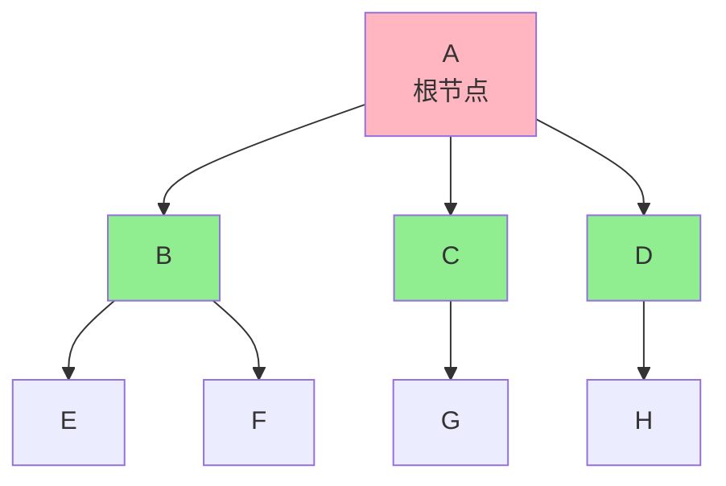
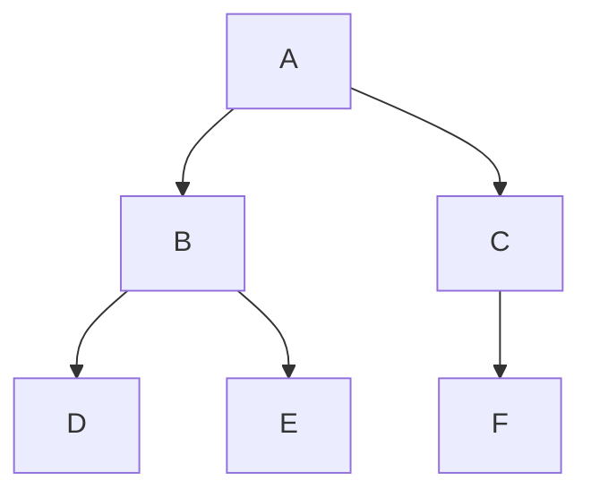
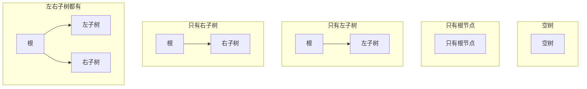
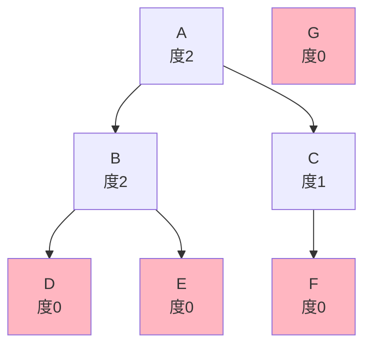
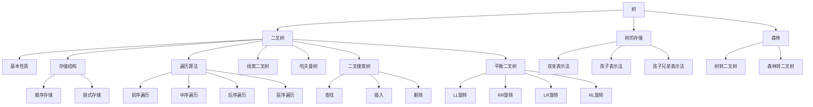

# 第5章：树和二叉树

> 本章学习目标：
> - 理解树的基本概念、术语和性质
> - 掌握二叉树的定义、性质和存储结构
> - 掌握二叉树的遍历算法（递归和非递归）
> - 理解线索二叉树的原理和应用
> - 掌握树和森林与二叉树的转换
> - 掌握哈夫曼树的构造和应用
> - 掌握二叉搜索树和平衡二叉树的实现
> - 能够解决与树相关的实际问题

---

## 5.1 树的定义和基本术语

### 5.1.1 树的定义

**定义**：
树（Tree）是n（n ≥ 0）个节点的有限集合。当n = 0时，称为空树；当n > 0时：
1. 有且仅有一个特定的称为**根**（Root）的节点
2. 其余的节点可分为m（m ≥ 0）个互不相交的有限集合T₁、T₂、...、Tₘ，其中每个集合本身又是一棵树，并称为根的**子树**（Subtree）

**递归定义的特点**：
- 树是递归定义的数据结构
- 树中所有子树也是树
- 树的子树之间互不相交

**树的示例**：



### 5.1.2 树的基本术语

#### 节点相关术语

| 术语 | 定义 | 示例（以上图） |
|------|------|----------------|
| **根节点** | 树中唯一没有前驱的节点 | A |
| **叶子节点** | 没有后继的节点（度为0） | E, F, G, H |
| **内部节点** | 度不为0的节点（非叶子节点） | A, B, C, D |
| **双亲/父节点** | 若某节点有子树，则该节点是其子树的根的双亲 | A是B、C、D的双亲 |
| **孩子/子节点** | 节点的子树的根称为该节点的孩子 | B、C、D是A的孩子 |
| **兄弟节点** | 同一双亲的孩子互为兄弟 | B、C、D互为兄弟 |
| **堂兄弟** | 双亲在同一层的节点 | E和G、H |
| **祖先** | 从根到该节点所经分支上的所有节点 | A、B是E的祖先 |
| **子孙** | 以某节点为根的子树中的任一节点 | E、F是B的子孙 |

#### 度相关术语

| 术语 | 定义 | 示例（以上图） |
|------|------|----------------|
| **节点的度** | 节点拥有的子树个数 | A的度为3，B的度为2 |
| **树的度** | 树内各节点度的最大值 | 该树的度为3 |
| **叶子节点** | 度为0的节点 | E、F、G、H |

#### 层次和深度相关术语

| 术语 | 定义 | 示例（以上图） |
|------|------|----------------|
| **节点的层次** | 从根开始定义，根为第1层，根的孩子为第2层... | A为第1层，B为第2层 |
| **树的深度/高度** | 树中节点的最大层次 | 该树的深度为3 |
| **节点的高度** | 从该节点到叶子节点的最长路径 | A的高度为3，B的高度为2 |

#### 其他术语

| 术语 | 定义 |
|------|------|
| **有序树** | 树中各节点的子树从左到右是有次序的，不能交换 |
| **无序树** | 树中各节点的子树没有次序，可以交换 |
| **森林** | m（m ≥ 0）棵互不相交的树的集合 |
| **路径** | 树中两个节点之间所经过的节点序列 |
| **路径长度** | 路径上边的数目 |

### 5.1.3 树的表示方法

#### 1. 树形图表示法



#### 2. 凹入表示法

```
A
├── B
│   ├── D
│   └── E
└── C
    └── F
```

#### 3. 括号表示法

```
A(B(D, E), C(F))
```

#### 4. 广义表表示法

```
(A (B (D, E) (C (F))))
```

### 5.1.4 树的抽象数据类型定义

**ADT定义**：

```cpp
ADT Tree {
    数据对象：D = {a_i | a_i ∈ ElemSet, i = 1, 2, ..., n, n ≥ 0}
    数据关系：R = {<a_i-1, a_i> | a_i-1是a_i的双亲，i = 2, 3, ..., n}

    基本操作：
        InitTree(&T)         // 初始化树
        DestroyTree(&T)      // 销毁树
        CreateTree(&T, definition)  // 构造树
        ClearTree(&T)        // 清空树
        TreeEmpty(T)         // 判断树是否为空
        TreeDepth(T)         // 返回树的深度
        Root(T)              // 返回树的根
        Value(T, cur_e)      // 返回cur_e的值
        Assign(T, cur_e, value)  // 给cur_e赋值value
        Parent(T, cur_e)     // 返回cur_e的双亲
        LeftChild(T, cur_e)  // 返回cur_e的左孩子
        RightSibling(T, cur_e)  // 返回cur_e的右兄弟
        InsertChild(&T, p, i, c)  // 插入c作为T中p节点的第i棵子树
        DeleteChild(&T, p, i)     // 删除T中p节点的第i棵子树
        TraverseTree(T, visit())  // 遍历树
}
```

**C++接口定义**：

```cpp
#include <iostream>
#include <vector>
#include <stdexcept>
#include <memory>

template <typename T>
class ITree {
public:
    // 析构函数
    virtual ~ITree() = default;

    // 基本操作
    virtual void clear() = 0;                              // 清空树
    virtual bool isEmpty() const = 0;                      // 判断是否为空
    virtual int size() const = 0;                          // 返回节点数
    virtual int depth() const = 0;                         // 返回树的深度
    virtual T getRoot() const = 0;                         // 获取根节点
    virtual T getParent(const T& element) const = 0;       // 获取父节点
    virtual std::vector<T> getChildren(const T& element) const = 0;  // 获取子节点
    virtual bool insert(const T& parent, const T& child) = 0;  // 插入节点
    virtual bool remove(const T& element) = 0;             // 删除节点
    virtual void traverse() const = 0;                     // 遍历树
};
```

---

## 5.2 二叉树

### 5.2.1 二叉树的定义

**定义**：
二叉树（Binary Tree）是n（n ≥ 0）个节点的有限集合，该集合或者为空集（称为空二叉树），或者由一个根节点和两棵互不相交的、分别称为根节点的左子树和右子树的二叉树组成。

**二叉树的特点**：

| 特点 | 说明 |
|------|------|
| **每个节点最多有两个子树** | 即二叉树中不存在度大于2的节点 |
| **子树有左右之分** | 即使某节点只有一棵子树，也要区分是左子树还是右子树 |
| **有序树** | 左子树和右子树的次序不能颠倒 |
| **递归定义** | 左子树和右子树也是二叉树 |

**二叉树的基本形态**：



**注意**：二叉树不是树的特殊情况！
- 树的子树没有左右之分
- 二叉树的子树有严格的左右之分
- 度为2的有序树不等于二叉树

### 5.2.2 二叉树的性质

#### 性质1：二叉树的叶子节点数和度为2的节点数的关系

**性质**：
在二叉树的第i层上至多有2^(i-1)个节点（i ≥ 1）。

**证明**：
- 第1层：2^(1-1) = 1个节点 ✓
- 第2层：2^(2-1) = 2个节点 ✓
- 第3层：2^(3-1) = 4个节点 ✓
- ...
- 第i层：2^(i-1)个节点

#### 性质2：深度为k的二叉树的最大节点数

**性质**：
深度为k的二叉树至多有2^k - 1个节点（k ≥ 1）。

**证明**：
最大节点数 = Σ(2^(i-1)) for i = 1 to k
= 2^0 + 2^1 + 2^2 + ... + 2^(k-1)
= 2^k - 1

**示例**：
- 深度为1：2^1 - 1 = 1个节点
- 深度为2：2^2 - 1 = 3个节点
- 深度为3：2^3 - 1 = 7个节点

#### 性质3：叶子节点数和度为2的节点数的关系

**性质**：
对任何一棵二叉树T，如果其终端节点数为n₀，度为2的节点数为n₂，则n₀ = n₂ + 1。

**证明**：
设度为1的节点数为n₁，则总节点数n = n₀ + n₁ + n₂

从分支数来看：
- 度为0的节点贡献0个分支
- 度为1的节点贡献1个分支
- 度为2的节点贡献2个分支
- 总分支数 = n₁ + 2n₂

另一方面，除根节点外，每个节点有且仅有一个分支指向它，所以：
总分支数 = n - 1

因此：n₁ + 2n₂ = n - 1
= (n₀ + n₁ + n₂) - 1
= n₀ + n₁ + n₂ - 1

化简得：n₂ = n₀ - 1
即：n₀ = n₂ + 1 ✓

**示例验证**：



- n₀（叶子节点）= 4（D、E、F、G）
- n₂（度为2的节点）= 2（A、B）
- 验证：4 = 2 + 1 ✓

#### 性质4：完全二叉树的性质

**完全二叉树**：
深度为k的、有n个节点的二叉树，当且仅当其每一个节点都与深度为k的满二叉树中编号从1至n的节点一一对应时，称为完全二叉树。

**满二叉树**：
深度为k且含有2^k - 1个节点的二叉树。

**性质4**：
具有n个节点的完全二叉树的深度为⌊log₂n⌋ + 1。

**证明**：
设深度为k，则：
2^(k-1) ≤ n < 2^k

取对数得：
k - 1 ≤ log₂n < k

即：k = ⌊log₂n⌋ + 1

#### 性质5：完全二叉树的节点编号关系

**性质**：
如果对一棵有n个节点的完全二叉树（其深度为⌊log₂n⌋ + 1）的节点按层序编号（从第1层到第⌊log₂n⌋ + 1层，每层从左到右），则对任一节点i（1 ≤ i ≤ n）：

1. 如果i = 1，则节点i是二叉树的根，无双亲；如果i > 1，则其双亲是节点⌊i/2⌋
2. 如果2i > n，则节点i无左孩子（节点i为叶子节点）；否则其左孩子是节点2i
3. 如果2i + 1 > n，则节点i无右孩子；否则其右孩子是节点2i + 1

**示例**：

```
完全二叉树（n=7）：

        1
       / \
      2   3
     / \ / \
    4  5 6  7

验证：
- 节点1：无双亲，左孩子2，右孩子3
- 节点2：双亲⌊2/2⌋=1，左孩子4，右孩子5
- 节点3：双亲⌊3/2⌋=1，左孩子6，右孩子7
- 节点4：双亲⌊4/2⌋=2，2×4=8>7无左孩子，无右孩子
- 节点5：双亲⌊5/2⌋=2，无孩子
- 节点6：双亲⌊6/2⌋=3，无孩子
- 节点7：双亲⌊7/2⌋=3，无孩子
```

**应用**：这个性质是二叉树顺序存储的基础！

### 5.2.3 二叉树的存储结构

#### 1. 顺序存储结构

**原理**：
利用性质5，用一组连续的存储单元存储二叉树的节点，按照完全二叉树的编号方式进行存储。

**存储方式**：

```
二叉树：
        A
       / \
      B   C
     /   / \
    D   E   F

顺序存储：
索引:  [0]  [1]  [2]  [3]  [4]  [5]
内容:  [A]  [B]  [C]  [D]  [E]  [F]

节点关系：
- 节点i的左孩子：2i + 1
- 节点i的右孩子：2i + 2
- 节点i的双亲：(i - 1) / 2
```

**实现**：

```cpp
#include <iostream>
#include <vector>
#include <stdexcept>
#include <optional>

template <typename T>
class ArrayBinaryTree {
private:
    std::vector<std::optional<T>> data;  // 使用optional表示空节点

public:
    // 构造函数
    ArrayBinaryTree(int capacity = 10) {
        data.resize(capacity);
    }

    // 设置根节点
    void setRoot(const T& value) {
        if (data.empty()) {
            data.resize(1);
        }
        data[0] = value;
    }

    // 设置左孩子
    void setLeftChild(int parentIndex, const T& value) {
        int leftIndex = 2 * parentIndex + 1;
        ensureCapacity(leftIndex);
        data[leftIndex] = value;
    }

    // 设置右孩子
    void setRightChild(int parentIndex, const T& value) {
        int rightIndex = 2 * parentIndex + 2;
        ensureCapacity(rightIndex);
        data[rightIndex] = value;
    }

    // 获取左孩子
    std::optional<T> getLeftChild(int parentIndex) const {
        int leftIndex = 2 * parentIndex + 1;
        if (leftIndex >= data.size()) {
            return std::nullopt;
        }
        return data[leftIndex];
    }

    // 获取右孩子
    std::optional<T> getRightChild(int parentIndex) const {
        int rightIndex = 2 * parentIndex + 2;
        if (rightIndex >= data.size()) {
            return std::nullopt;
        }
        return data[rightIndex];
    }

    // 获取双亲
    std::optional<T> getParent(int childIndex) const {
        if (childIndex == 0) {
            return std::nullopt;  // 根节点没有双亲
        }
        int parentIndex = (childIndex - 1) / 2;
        return data[parentIndex];
    }

    // 层序遍历
    void levelOrder() const {
        for (const auto& node : data) {
            if (node.has_value()) {
                std::cout << node.value() << " ";
            } else {
                std::cout << "null ";
            }
        }
        std::cout << std::endl;
    }

private:
    // 确保容量足够
    void ensureCapacity(int index) {
        if (index >= data.size()) {
            data.resize(index + 1);
        }
    }
};

// 使用示例
int main() {
    ArrayBinaryTree<char> tree;

    tree.setRoot('A');
    tree.setLeftChild(0, 'B');
    tree.setRightChild(0, 'C');
    tree.setLeftChild(1, 'D');
    tree.setLeftChild(2, 'E');
    tree.setRightChild(2, 'F');

    std::cout << "层序遍历: ";
    tree.levelOrder();  // 输出: A B C D E F

    std::cout << "A的左孩子: " << tree.getLeftChild(0).value_or(' ') << std::endl;  // B
    std::cout << "A的右孩子: " << tree.getRightChild(0).value_or(' ') << std::endl;  // C
    std::cout << "B的双亲: " << tree.getParent(1).value_or(' ') << std::endl;  // A

    return 0;
}
```

**优缺点**：

| 优点 | 缺点 |
|------|------|
| 实现简单 | 空间浪费大（特别是斜树） |
| 可以通过下标直接访问节点 | 插入删除可能需要大量移动 |
| 适合完全二叉树 | 不适合一般二叉树 |

#### 2. 链式存储结构

**原理**：
使用链表存储二叉树，每个节点包含数据域和两个指针域（左孩子指针和右孩子指针）。

**节点结构**：

```
┌──────┬──────┬──────┐
│ lchild │ data │ rchild │
└──────┴──────┴──────┘
左指针  数据域  右指针
```

**实现**：

```cpp
#include <iostream>
#include <vector>
#include <memory>
#include <stack>
#include <queue>

// 二叉树节点
template <typename T>
struct BinaryTreeNode {
    T data;
    std::shared_ptr<BinaryTreeNode> left;
    std::shared_ptr<BinaryTreeNode> right;

    BinaryTreeNode(const T& value)
        : data(value), left(nullptr), right(nullptr) {}

    BinaryTreeNode(T&& value)
        : data(std::move(value)), left(nullptr), right(nullptr) {}
};

// 二叉树类
template <typename T>
class BinaryTree {
private:
    std::shared_ptr<BinaryTreeNode<T>> root;
    int nodeCount;

    // 递归辅助函数
    int depthHelper(std::shared_ptr<BinaryTreeNode<T>> node) const {
        if (node == nullptr) return 0;
        return 1 + std::max(depthHelper(node->left), depthHelper(node->right));
    }

    int nodeCountHelper(std::shared_ptr<BinaryTreeNode<T>> node) const {
        if (node == nullptr) return 0;
        return 1 + nodeCountHelper(node->left) + nodeCountHelper(node->right);
    }

    void preOrderHelper(std::shared_ptr<BinaryTreeNode<T>> node, std::vector<T>& result) const {
        if (node == nullptr) return;
        result.push_back(node->data);
        preOrderHelper(node->left, result);
        preOrderHelper(node->right, result);
    }

    void inOrderHelper(std::shared_ptr<BinaryTreeNode<T>> node, std::vector<T>& result) const {
        if (node == nullptr) return;
        inOrderHelper(node->left, result);
        result.push_back(node->data);
        inOrderHelper(node->right, result);
    }

    void postOrderHelper(std::shared_ptr<BinaryTreeNode<T>> node, std::vector<T>& result) const {
        if (node == nullptr) return;
        postOrderHelper(node->left, result);
        postOrderHelper(node->right, result);
        result.push_back(node->data);
    }

public:
    // 构造函数
    BinaryTree() : root(nullptr), nodeCount(0) {}

    // 析构函数
    ~BinaryTree() {
        clear();
    }

    // 清空树
    void clear() {
        root = nullptr;
        nodeCount = 0;
    }

    // 判断是否为空
    bool isEmpty() const {
        return root == nullptr;
    }

    // 返回节点数
    int size() const {
        return nodeCountHelper(root);
    }

    // 返回深度
    int depth() const {
        return depthHelper(root);
    }

    // 获取根节点
    std::shared_ptr<BinaryTreeNode<T>> getRoot() const {
        return root;
    }

    // 设置根节点
    void setRoot(const T& value) {
        root = std::make_shared<BinaryTreeNode<T>>(value);
        nodeCount = 1;
    }

    // 插入左孩子
    bool insertLeft(std::shared_ptr<BinaryTreeNode<T>> parent, const T& value) {
        if (parent == nullptr) return false;
        if (parent->left != nullptr) return false;  // 左孩子已存在

        parent->left = std::make_shared<BinaryTreeNode<T>>(value);
        nodeCount++;
        return true;
    }

    // 插入右孩子
    bool insertRight(std::shared_ptr<BinaryTreeNode<T>> parent, const T& value) {
        if (parent == nullptr) return false;
        if (parent->right != nullptr) return false;  // 右孩子已存在

        parent->right = std::make_shared<BinaryTreeNode<T>>(value);
        nodeCount++;
        return true;
    }

    // 前序遍历（递归）
    std::vector<T> preOrder() const {
        std::vector<T> result;
        preOrderHelper(root, result);
        return result;
    }

    // 中序遍历（递归）
    std::vector<T> inOrder() const {
        std::vector<T> result;
        inOrderHelper(root, result);
        return result;
    }

    // 后序遍历（递归）
    std::vector<T> postOrder() const {
        std::vector<T> result;
        postOrderHelper(root, result);
        return result;
    }

    // 前序遍历（非递归）
    std::vector<T> preOrderIterative() const {
        std::vector<T> result;
        if (root == nullptr) return result;

        std::stack<std::shared_ptr<BinaryTreeNode<T>>> stack;
        stack.push(root);

        while (!stack.empty()) {
            auto node = stack.top();
            stack.pop();
            result.push_back(node->data);

            // 先压右孩子，再压左孩子（保证左孩子先被访问）
            if (node->right) stack.push(node->right);
            if (node->left) stack.push(node->left);
        }

        return result;
    }

    // 中序遍历（非递归）
    std::vector<T> inOrderIterative() const {
        std::vector<T> result;
        std::stack<std::shared_ptr<BinaryTreeNode<T>>> stack;
        auto current = root;

        while (current != nullptr || !stack.empty()) {
            // 遍历到最左边
            while (current != nullptr) {
                stack.push(current);
                current = current->left;
            }

            // 访问节点
            current = stack.top();
            stack.pop();
            result.push_back(current->data);

            // 转向右子树
            current = current->right;
        }

        return result;
    }

    // 后序遍历（非递归）
    std::vector<T> postOrderIterative() const {
        std::vector<T> result;
        if (root == nullptr) return result;

        std::stack<std::shared_ptr<BinaryTreeNode<T>>> stack;
        std::stack<std::shared_ptr<BinaryTreeNode<T>>> output;
        stack.push(root);

        while (!stack.empty()) {
            auto node = stack.top();
            stack.pop();
            output.push(node);

            // 先压左孩子，再压右孩子
            if (node->left) stack.push(node->left);
            if (node->right) stack.push(node->right);
        }

        // 反转输出
        while (!output.empty()) {
            result.push_back(output.top()->data);
            output.pop();
        }

        return result;
    }

    // 层序遍历（BFS）
    std::vector<T> levelOrder() const {
        std::vector<T> result;
        if (root == nullptr) return result;

        std::queue<std::shared_ptr<BinaryTreeNode<T>>> queue;
        queue.push(root);

        while (!queue.empty()) {
            auto node = queue.front();
            queue.pop();
            result.push_back(node->data);

            if (node->left) queue.push(node->left);
            if (node->right) queue.push(node->right);
        }

        return result;
    }

    // 打印树形结构
    void printTree() const {
        printTreeHelper(root, 0);
    }

private:
    void printTreeHelper(std::shared_ptr<BinaryTreeNode<T>> node, int depth) const {
        if (node == nullptr) return;

        // 打印右子树
        printTreeHelper(node->right, depth + 1);

        // 打印当前节点
        for (int i = 0; i < depth; ++i) {
            std::cout << "    ";
        }
        std::cout << node->data << std::endl;

        // 打印左子树
        printTreeHelper(node->left, depth + 1);
    }
};

// 使用示例
int main() {
    BinaryTree<char> tree;

    // 构建二叉树
    /*
            A
           / \
          B   C
         /   / \
        D   E   F
    */
    tree.setRoot('A');
    auto root = tree.getRoot();
    tree.insertLeft(root, 'B');
    tree.insertRight(root, 'C');
    tree.insertLeft(root->left, 'D');
    tree.insertLeft(root->right, 'E');
    tree.insertRight(root->right, 'F');

    // 输出树形结构
    std::cout << "树形结构:" << std::endl;
    tree.printTree();

    // 遍历
    std::cout << "\n前序遍历（递归）: ";
    for (auto val : tree.preOrder()) {
        std::cout << val << " ";
    }
    // 输出: A B D C E F

    std::cout << "\n中序遍历（递归）: ";
    for (auto val : tree.inOrder()) {
        std::cout << val << " ";
    }
    // 输出: D B A E C F

    std::cout << "\n后序遍历（递归）: ";
    for (auto val : tree.postOrder()) {
        std::cout << val << " ";
    }
    // 输出: D B E F C A

    std::cout << "\n层序遍历: ";
    for (auto val : tree.levelOrder()) {
        std::cout << val << " ";
    }
    // 输出: A B C D E F

    std::cout << "\n\n树的深度: " << tree.depth() << std::endl;  // 3
    std::cout << "节点数: " << tree.size() << std::endl;  // 6

    return 0;
}
```

**优缺点**：

| 优点 | 缺点 |
|------|------|
| 空间利用率高 | 不能随机访问 |
| 插入删除方便 | 需要额外的指针空间 |
| 适合各种形态的二叉树 | 实现相对复杂 |

### 5.2.4 二叉树的遍历

#### 遍历的定义

**定义**：
遍历（Traversal）是指按照某种规则访问树中的每个节点，且每个节点仅被访问一次。

**四种遍历方式**：

| 遍历方式 | 访问顺序 | 应用场景 |
|----------|----------|----------|
| **前序遍历** | 根 → 左 → 右 | 复制树、计算表达式前缀 |
| **中序遍历** | 左 → 根 → 右 | 排序二叉树、计算表达式中缀 |
| **后序遍历** | 左 → 右 → 根 | 删除树、计算表达式后缀 |
| **层序遍历** | 从上到下，从左到右 | 广度优先搜索、按层处理 |

#### 遍历示例

**示例树**：

```
        A
       / \
      B   C
     / \   \
    D   E   F
```

**前序遍历**：A → B → D → E → C → F
**中序遍历**：D → B → E → A → C → F
**后序遍历**：D → E → B → F → C → A
**层序遍历**：A → B → C → D → E → F

#### 遍历算法的递归实现

**前序遍历**：

```cpp
void preOrder(TreeNode* root) {
    if (root == nullptr) return;

    visit(root);           // 访问根节点
    preOrder(root->left);  // 遍历左子树
    preOrder(root->right); // 遍历右子树
}
```

**中序遍历**：

```cpp
void inOrder(TreeNode* root) {
    if (root == nullptr) return;

    inOrder(root->left);   // 遍历左子树
    visit(root);           // 访问根节点
    inOrder(root->right);  // 遍历右子树
}
```

**后序遍历**：

```cpp
void postOrder(TreeNode* root) {
    if (root == nullptr) return;

    postOrder(root->left);  // 遍历左子树
    postOrder(root->right); // 遍历右子树
    visit(root);            // 访问根节点
}
```

#### 遍历算法的非递归实现

**前序遍历（非递归）**：

```cpp
std::vector<int> preOrderIterative(TreeNode* root) {
    std::vector<int> result;
    if (root == nullptr) return result;

    std::stack<TreeNode*> stack;
    stack.push(root);

    while (!stack.empty()) {
        TreeNode* node = stack.top();
        stack.pop();
        result.push_back(node->val);

        // 先压右孩子，再压左孩子（保证左孩子先被访问）
        if (node->right) stack.push(node->right);
        if (node->left) stack.push(node->left);
    }

    return result;
}
```

**中序遍历（非递归）**：

```cpp
std::vector<int> inOrderIterative(TreeNode* root) {
    std::vector<int> result;
    std::stack<TreeNode*> stack;
    TreeNode* current = root;

    while (current != nullptr || !stack.empty()) {
        // 遍历到最左边
        while (current != nullptr) {
            stack.push(current);
            current = current->left;
        }

        // 访问节点
        current = stack.top();
        stack.pop();
        result.push_back(current->val);

        // 转向右子树
        current = current->right;
    }

    return result;
}
```

**后序遍历（非递归）- 方法1：双栈法**：

```cpp
std::vector<int> postOrderIterative(TreeNode* root) {
    std::vector<int> result;
    if (root == nullptr) return result;

    std::stack<TreeNode*> stack;
    std::stack<TreeNode*> output;
    stack.push(root);

    while (!stack.empty()) {
        TreeNode* node = stack.top();
        stack.pop();
        output.push(node);

        // 先压左孩子，再压右孩子
        if (node->left) stack.push(node->left);
        if (node->right) stack.push(node->right);
    }

    // 反转输出
    while (!output.empty()) {
        result.push_back(output.top()->val);
        output.pop();
    }

    return result;
}
```

**后序遍历（非递归）- 方法2：单栈法**：

```cpp
std::vector<int> postOrderIterative(TreeNode* root) {
    std::vector<int> result;
    if (root == nullptr) return result;

    std::stack<TreeNode*> stack;
    TreeNode* lastVisited = nullptr;
    TreeNode* current = root;

    while (current != nullptr || !stack.empty()) {
        // 遍历到最左边
        while (current != nullptr) {
            stack.push(current);
            current = current->left;
        }

        current = stack.top();

        // 如果右子树为空或已经访问过，则访问当前节点
        if (current->right == nullptr || current->right == lastVisited) {
            result.push_back(current->val);
            lastVisited = current;
            stack.pop();
            current = nullptr;  // 重要：避免重复遍历左子树
        } else {
            // 转向右子树
            current = current->right;
        }
    }

    return result;
}
```

**层序遍历（BFS）**：

```cpp
std::vector<std::vector<int>> levelOrder(TreeNode* root) {
    std::vector<std::vector<int>> result;
    if (root == nullptr) return result;

    std::queue<TreeNode*> queue;
    queue.push(root);

    while (!queue.empty()) {
        int levelSize = queue.size();
        std::vector<int> currentLevel;

        for (int i = 0; i < levelSize; ++i) {
            TreeNode* node = queue.front();
            queue.pop();
            currentLevel.push_back(node->val);

            if (node->left) queue.push(node->left);
            if (node->right) queue.push(node->right);
        }

        result.push_back(currentLevel);
    }

    return result;
}
```

#### 遍历算法的时间复杂度和空间复杂度

| 遍历方式 | 时间复杂度 | 空间复杂度（递归） | 空间复杂度（非递归） |
|----------|-----------|-------------------|-------------------|
| 前序遍历 | O(n) | O(h) | O(h) |
| 中序遍历 | O(n) | O(h) | O(h) |
| 后序遍历 | O(n) | O(h) | O(h) |
| 层序遍历 | O(n) | - | O(w) |

其中：
- n = 节点数
- h = 树的高度
- w = 树的最大宽度

#### 已知前序和中序，恢复二叉树

**原理**：
- 前序遍历的第一个元素是根节点
- 在中序遍历中找到根节点的位置，左侧是左子树，右侧是右子树
- 递归构建左子树和右子树

**代码实现**：

```cpp
TreeNode* buildTree(std::vector<int>& preorder, std::vector<int>& inorder) {
    return buildTreeHelper(preorder, 0, preorder.size() - 1,
                          inorder, 0, inorder.size() - 1);
}

TreeNode* buildTreeHelper(std::vector<int>& preorder, int preStart, int preEnd,
                         std::vector<int>& inorder, int inStart, int inEnd) {
    if (preStart > preEnd || inStart > inEnd) {
        return nullptr;
    }

    // 前序遍历的第一个元素是根节点
    int rootValue = preorder[preStart];
    TreeNode* root = new TreeNode(rootValue);

    // 在中序遍历中找到根节点的位置
    int inRoot = 0;
    for (int i = inStart; i <= inEnd; ++i) {
        if (inorder[i] == rootValue) {
            inRoot = i;
            break;
        }
    }

    // 计算左子树的节点数
    int leftSubtreeSize = inRoot - inStart;

    // 递归构建左子树和右子树
    root->left = buildTreeHelper(preorder, preStart + 1, preStart + leftSubtreeSize,
                                inorder, inStart, inRoot - 1);
    root->right = buildTreeHelper(preorder, preStart + leftSubtreeSize + 1, preEnd,
                                 inorder, inRoot + 1, inEnd);

    return root;
}
```

**时间复杂度**：O(n²)（最坏情况，每次都要遍历中序数组找根）
**空间复杂度**：O(n)（递归栈空间）

**优化**：使用哈希表存储中序遍历的值和索引，将查找时间优化为O(1)。

```cpp
std::unordered_map<int, int> inorderMap;

TreeNode* buildTreeOptimized(std::vector<int>& preorder, std::vector<int>& inorder) {
    // 构建哈希表
    for (int i = 0; i < inorder.size(); ++i) {
        inorderMap[inorder[i]] = i;
    }

    return buildTreeHelperOptimized(preorder, 0, preorder.size() - 1, 0);
}

TreeNode* buildTreeHelperOptimized(std::vector<int>& preorder, int preStart, int preEnd, int inStart) {
    if (preStart > preEnd) {
        return nullptr;
    }

    int rootValue = preorder[preStart];
    TreeNode* root = new TreeNode(rootValue);

    int inRoot = inorderMap[rootValue];
    int leftSubtreeSize = inRoot - inStart;

    root->left = buildTreeHelperOptimized(preorder, preStart + 1, preStart + leftSubtreeSize, inStart);
    root->right = buildTreeHelperOptimized(preorder, preStart + leftSubtreeSize + 1, preEnd, inRoot + 1);

    return root;
}
```

**优化后的时间复杂度**：O(n)
**优化后的空间复杂度**：O(n)

---

## 5.3 线索二叉树

### 5.3.1 线索二叉树的定义

**问题**：
普通二叉树的n个节点中，有n+1个空指针域（n个节点，每个节点2个指针域，共2n个指针域，其中n-1个用于连接，剩下n+1个空指针）。

**思路**：
利用这些空指针域，存储某种遍历顺序下的前驱和后继信息。

**定义**：
线索二叉树（Threaded Binary Tree）是在二叉树的节点中增加两个标志域：
- ltag：左标志，0表示left指向左孩子，1表示left指向前驱
- rtag：右标志，0表示right指向右孩子，1表示right指向后继

### 5.3.2 线索二叉树的节点结构

**节点结构**：

```
┌──────┬──────┬──────┬──────┬──────┐
│ ltag │ left │ data │ right│ rtag │
└──────┴──────┴──────┴──────┴──────┘
 左标志 左指针  数据域  右指针  右标志
```

**标志域的含义**：

| ltag | left的含义 | rtag | right的含义 |
|------|-----------|------|------------|
| 0 | 指向左孩子 | 0 | 指向右孩子 |
| 1 | 指向前驱 | 1 | 指向后继 |

### 5.3.3 线索二叉树的实现

```cpp
#include <iostream>
#include <memory>

// 线索二叉树节点
template <typename T>
struct ThreadedTreeNode {
    T data;
    std::shared_ptr<ThreadedTreeNode> left;
    std::shared_ptr<ThreadedTreeNode> right;
    bool ltag;  // 0: left指向左孩子, 1: left指向前驱
    bool rtag;  // 0: right指向右孩子, 1: right指向后继

    ThreadedTreeNode(const T& value)
        : data(value), left(nullptr), right(nullptr), ltag(0), rtag(0) {}
};

// 线索二叉树类
template <typename T>
class ThreadedBinaryTree {
private:
    std::shared_ptr<ThreadedTreeNode<T>> root;

    // 中序线索化辅助函数
    void inOrderThreadingHelper(std::shared_ptr<ThreadedTreeNode<T>>& node,
                               std::shared_ptr<ThreadedTreeNode<T>>& prev) {
        if (node == nullptr) return;

        // 递归线索化左子树
        inOrderThreadingHelper(node->left, prev);

        // 处理当前节点
        if (node->left == nullptr) {
            node->left = prev;
            node->ltag = 1;
        }

        if (prev != nullptr && prev->right == nullptr) {
            prev->right = node;
            prev->rtag = 1;
        }

        prev = node;

        // 递归线索化右子树
        inOrderThreadingHelper(node->right, prev);
    }

public:
    // 构造函数
    ThreadedBinaryTree() : root(nullptr) {}

    // 设置根节点
    void setRoot(const T& value) {
        root = std::make_shared<ThreadedTreeNode<T>>(value);
    }

    // 中序线索化
    void inOrderThreading() {
        std::shared_ptr<ThreadedTreeNode<T>> prev = nullptr;
        inOrderThreadingHelper(root, prev);
    }

    // 中序遍历线索二叉树（非递归）
    std::vector<T> inOrderTraversal() {
        std::vector<T> result;
        auto current = root;

        while (current != nullptr) {
            // 找到最左边的节点
            while (current != nullptr && current->ltag == 0) {
                current = current->left;
            }

            // 访问当前节点
            result.push_back(current->data);

            // 通过线索访问后继
            while (current != nullptr && current->rtag == 1) {
                current = current->right;
                if (current != nullptr) {
                    result.push_back(current->data);
                }
            }

            // 转向右子树
            if (current != nullptr) {
                current = current->right;
            }
        }

        return result;
    }

    // 找到前驱
    std::shared_ptr<ThreadedTreeNode<T>> findPredecessor(std::shared_ptr<ThreadedTreeNode<T>> node) {
        if (node == nullptr) return nullptr;

        // 如果左指针是线索
        if (node->ltag == 1) {
            return node->left;
        }

        // 否则找到左子树的最右节点
        auto current = node->left;
        while (current != nullptr && current->rtag == 0) {
            current = current->right;
        }
        return current;
    }

    // 找到后继
    std::shared_ptr<ThreadedTreeNode<T>> findSuccessor(std::shared_ptr<ThreadedTreeNode<T>> node) {
        if (node == nullptr) return nullptr;

        // 如果右指针是线索
        if (node->rtag == 1) {
            return node->right;
        }

        // 否则找到右子树的最左节点
        auto current = node->right;
        while (current != nullptr && current->ltag == 0) {
            current = current->left;
        }
        return current;
    }
};

// 使用示例
int main() {
    ThreadedBinaryTree<char> tree;

    // 构建二叉树
    /*
            A
           / \
          B   C
         / \   \
        D   E   F
    */
    tree.setRoot('A');
    auto root = tree.getRoot();
    // 这里需要实现插入节点的函数...

    // 中序线索化
    tree.inOrderThreading();

    // 中序遍历
    std::cout << "中序遍历: ";
    for (auto val : tree.inOrderTraversal()) {
        std::cout << val << " ";
    }
    // 输出: D B E A C F

    return 0;
}
```

### 5.3.4 线索二叉树的优缺点

| 优点 | 缺点 |
|------|------|
| 不需要递归或栈即可遍历 | 插入和删除更复杂 |
| 可以快速找到前驱和后继 | 需要额外的标志位 |
| 空间利用率更高 | 线索化需要额外时间 |

---

## 5.4 树和森林

### 5.4.1 树的存储结构

#### 1. 双亲表示法

**原理**：
用一组连续空间存储树的节点，同时在每个节点中附设一个指示器指示其双亲节点在链表中的位置。

**节点结构**：

```
┌──────┬──────┐
│ data │ parent│
└──────┴──────┘
 数据域  双亲位置
```

**实现**：

```cpp
#include <iostream>
#include <vector>

template <typename T>
struct PTreeNode {
    T data;
    int parent;  // 双亲的位置，-1表示根节点
};

template <typename T>
class ParentTree {
private:
    std::vector<PTreeNode<T>> nodes;
    int nodeCount;

public:
    ParentTree(int maxSize = 100) : nodeCount(0) {
        nodes.resize(maxSize);
    }

    // 初始化树
    void initTree(const T& rootValue) {
        if (nodeCount >= nodes.size()) {
            throw std::runtime_error("树已满");
        }
        nodes[0].data = rootValue;
        nodes[0].parent = -1;  // 根节点没有双亲
        nodeCount = 1;
    }

    // 插入节点
    bool insertNode(const T& value, int parentIndex) {
        if (nodeCount >= nodes.size()) {
            return false;
        }
        if (parentIndex < 0 || parentIndex >= nodeCount) {
            return false;
        }

        nodes[nodeCount].data = value;
        nodes[nodeCount].parent = parentIndex;
        nodeCount++;
        return true;
    }

    // 查找双亲
    int findParent(int index) {
        if (index < 0 || index >= nodeCount) {
            return -1;
        }
        return nodes[index].parent;
    }

    // 打印树
    void printTree() {
        std::cout << "索引\t数据\t双亲" << std::endl;
        for (int i = 0; i < nodeCount; ++i) {
            std::cout << i << "\t" << nodes[i].data << "\t";
            if (nodes[i].parent == -1) {
                std::cout << "根" << std::endl;
            } else {
                std::cout << nodes[i].parent << std::endl;
            }
        }
    }
};

// 使用示例
int main() {
    ParentTree<char> tree;

    tree.initTree('A');  // 根节点
    tree.insertNode('B', 0);  // B的双亲是A
    tree.insertNode('C', 0);  // C的双亲是A
    tree.insertNode('D', 1);  // D的双亲是B
    tree.insertNode('E', 1);  // E的双亲是B
    tree.insertNode('F', 2);  // F的双亲是C

    tree.printTree();

    return 0;
}
```

**输出**：
```
索引    数据    双亲
0       A       根
1       B       0
2       C       0
3       D       1
4       E       1
5       F       2
```

#### 2. 孩子表示法

**原理**：
把每个节点的孩子节点排列起来，以单链表作为存储结构，则n个节点有n个孩子链表。

**实现**：

```cpp
#include <iostream>
#include <vector>

template <typename T>
struct ChildNode {
    int childIndex;
    ChildNode* next;

    ChildNode(int index) : childIndex(index), next(nullptr) {}
};

template <typename T>
struct CTreeNode {
    T data;
    ChildNode<T>* firstChild;  // 第一个孩子
};

template <typename T>
class ChildTree {
private:
    std::vector<CTreeNode<T>> nodes;
    int nodeCount;

public:
    ChildTree(int maxSize = 100) : nodeCount(0) {
        nodes.resize(maxSize);
    }

    ~ChildTree() {
        for (int i = 0; i < nodeCount; ++i) {
            ChildNode<T>* current = nodes[i].firstChild;
            while (current != nullptr) {
                ChildNode<T>* temp = current;
                current = current->next;
                delete temp;
            }
        }
    }

    // 初始化树
    void initTree(const T& rootValue) {
        if (nodeCount >= nodes.size()) {
            throw std::runtime_error("树已满");
        }
        nodes[0].data = rootValue;
        nodes[0].firstChild = nullptr;
        nodeCount = 1;
    }

    // 插入节点
    bool insertNode(const T& value, int parentIndex) {
        if (nodeCount >= nodes.size()) {
            return false;
        }
        if (parentIndex < 0 || parentIndex >= nodeCount) {
            return false;
        }

        nodes[nodeCount].data = value;
        nodes[nodeCount].firstChild = nullptr;

        // 在双亲的孩子链表中添加新节点
        ChildNode<T>* newChild = new ChildNode<T>(nodeCount);
        newChild->next = nodes[parentIndex].firstChild;
        nodes[parentIndex].firstChild = newChild;

        nodeCount++;
        return true;
    }

    // 获取节点的孩子
    std::vector<int> getChildren(int index) {
        std::vector<int> children;
        if (index < 0 || index >= nodeCount) {
            return children;
        }

        ChildNode<T>* current = nodes[index].firstChild;
        while (current != nullptr) {
            children.push_back(current->childIndex);
            current = current->next;
        }

        return children;
    }

    // 打印树
    void printTree() {
        for (int i = 0; i < nodeCount; ++i) {
            std::cout << nodes[i].data << " 的孩子: ";
            auto children = getChildren(i);
            for (int childIndex : children) {
                std::cout << nodes[childIndex].data << " ";
            }
            std::cout << std::endl;
        }
    }
};

// 使用示例
int main() {
    ChildTree<char> tree;

    tree.initTree('A');  // 根节点
    tree.insertNode('B', 0);
    tree.insertNode('C', 0);
    tree.insertNode('D', 1);
    tree.insertNode('E', 1);
    tree.insertNode('F', 2);

    tree.printTree();

    return 0;
}
```

**输出**：
```
A 的孩子: C B
B 的孩子: E D
C 的孩子: F
D 的孩子:
E 的孩子:
F 的孩子:
```

#### 3. 孩子兄弟表示法（二叉链表表示法）

**原理**：
使用二叉链表表示树，每个节点包含两个指针：
- firstChild：指向第一个孩子
- nextSibling：指向下一个兄弟

**节点结构**：

```
┌─────────────┬──────────────┐
│ firstChild  │   data       │ nextSibling
└─────────────┴──────────────┘
    第一个孩子      数据域      下一个兄弟
```

**实现**：

```cpp
#include <iostream>
#include <memory>

template <typename T>
struct CSTreeNode {
    T data;
    std::shared_ptr<CSTreeNode> firstChild;
    std::shared_ptr<CSTreeNode> nextSibling;

    CSTreeNode(const T& value)
        : data(value), firstChild(nullptr), nextSibling(nullptr) {}
};

template <typename T>
class CSTree {
private:
    std::shared_ptr<CSTreeNode<T>> root;

public:
    CSTree() : root(nullptr) {}

    // 设置根节点
    void setRoot(const T& value) {
        root = std::make_shared<CSTreeNode<T>>(value);
    }

    // 添加孩子
    bool addChild(std::shared_ptr<CSTreeNode<T>> parent, const T& value) {
        if (parent == nullptr) return false;

        auto newChild = std::make_shared<CSTreeNode<T>>(value);

        // 如果没有孩子，设置为第一个孩子
        if (parent->firstChild == nullptr) {
            parent->firstChild = newChild;
        } else {
            // 否则添加到最后一个兄弟
            auto sibling = parent->firstChild;
            while (sibling->nextSibling != nullptr) {
                sibling = sibling->nextSibling;
            }
            sibling->nextSibling = newChild;
        }

        return true;
    }

    // 先根遍历
    void preOrder(std::shared_ptr<CSTreeNode<T>> node) {
        if (node == nullptr) return;

        std::cout << node->data << " ";
        preOrder(node->firstChild);
        preOrder(node->nextSibling);
    }

    // 后根遍历
    void postOrder(std::shared_ptr<CSTreeNode<T>> node) {
        if (node == nullptr) return;

        postOrder(node->firstChild);
        std::cout << node->data << " ";
        postOrder(node->nextSibling);
    }

    // 获取根节点
    std::shared_ptr<CSTreeNode<T>> getRoot() {
        return root;
    }
};

// 使用示例
int main() {
    CSTree<char> tree;

    tree.setRoot('A');
    auto root = tree.getRoot();

    tree.addChild(root, 'B');
    tree.addChild(root, 'C');
    tree.addChild(root, 'D');

    auto b = root->firstChild;
    tree.addChild(b, 'E');
    tree.addChild(b, 'F');

    auto c = b->nextSibling;
    tree.addChild(c, 'G');

    std::cout << "先根遍历: ";
    tree.preOrder(root);  // 输出: A B E F C G D

    std::cout << "\n后根遍历: ";
    tree.postOrder(root);  // 输出: E F B G C D A

    return 0;
}
```

### 5.4.2 树转换为二叉树

**转换规则**：

1. 加线：在所有兄弟节点之间加一条连线
2. 抹线：对每个节点，只保留其与第一个孩子的连线，删除与其他孩子的连线
3. 旋转：以树根为轴心，将树顺时针旋转45度

**示例**：

```
原始树：
        A
      / | \
     B  C  D
    /|\    |
   E F G   H

转换为二叉树：
        A
       /
      B
     / \
    E   C
     \   \
      F   D
       \ /
        G H
```

**规律**：
- 二叉树的左孩子 = 原树的第一个孩子
- 二叉树的右孩子 = 原树的下一个兄弟

### 5.4.3 森林转换为二叉树

**转换规则**：

1. 将森林中的每棵树转换为二叉树
2. 将第一棵树的根作为二叉树的根
3. 将第一棵树的根的右指针指向第二棵树的根
4. 将第二棵树的根的右指针指向第三棵树的根
5. 以此类推

**示例**：

```
森林：
  树1:    A
        / | \
       B  C  D

  树2:    E
        / \
       F   G

转换为二叉树：
        A
       /
      B
     / \
    E   C
   / \   \
  F   G   D
```

### 5.4.4 二叉树转换为树和森林

**二叉树转换为树**：
- 左孩子 = 原树的第一个孩子
- 右孩子 = 原树的下一个兄弟

**二叉树转换为森林**：
- 从根节点开始，沿着右链分离出多棵树
- 每棵树按照"二叉树转换为树"的规则转换

---

## 5.5 哈夫曼树及其应用

### 5.5.1 哈夫曼树的定义

**基本概念**：

| 术语 | 定义 |
|------|------|
| **路径** | 从树中一个节点到另一个节点之间的分支 |
| **路径长度** | 路径上的分支数目 |
| **树的路径长度** | 从树根到每个节点的路径长度之和 |
| **权** | 节点的某种度量（如频率、重要性等） |
| **带权路径长度** | 节点到根的路径长度与该节点权的乘积 |
| **树的带权路径长度（WPL）** | 所有叶子节点的带权路径长度之和 |
| **哈夫曼树** | WPL最小的二叉树 |

**WPL计算公式**：
```
WPL = Σ(w_i × l_i)
其中：
- w_i 是第i个叶子节点的权值
- l_i 是第i个叶子节点的路径长度
```

**示例**：

```
二叉树1：
        (5)
       /   \
     (3)   (2)
    /  \
  (1)  (1)

WPL = 3×2 + 2×2 + 1×2 + 1×2 = 12

二叉树2：
          (5)
        /     \
      (2)     (3)
     /  \    /
   (1)  (1) (2)
            /
          (1)

WPL = 2×2 + 2×2 + 1×3 + 1×3 + 1×2 = 14

二叉树2不是最优的！
```

### 5.5.2 哈夫曼树的构造算法

**算法步骤**：

1. 将n个权值构造为n棵只有一个根节点的二叉树，形成一个森林
2. 在森林中选取两棵根节点权值最小的树，作为左右子树构造一棵新的二叉树
3. 将新二叉树的根节点权值设为左右子树根节点权值之和
4. 从森林中删除选取的两棵树，将新树加入森林
5. 重复步骤2-4，直到森林中只剩下一棵树

**时间复杂度**：O(n log n)（使用优先队列优化）

**示例**：

**构造权值为{5, 3, 7, 2, 8}的哈夫曼树**：

```
步骤1：初始化
森林：{5}, {3}, {7}, {2}, {8}

步骤2：选取最小的两个 {2} 和 {3}
      (5)
      (7)
      (8)
       (2)
         \
         (5)
       /   \
     (2)   (3)

步骤3：选取最小的两个 {5} 和 {5}
      (7)
      (8)
           (10)
         /    \
       (5)    (5)
             /   \
           (2)   (3)

步骤4：选取最小的两个 {7} 和 {8}
             (10)
           /    \
         (5)    (5)
               /   \
             (2)   (3)

      (15)
     /    \
   (7)    (8)

步骤5：选取最小的两个 {10} 和 {15}
              (25)
            /    \
         (10)   (15)
        /   \  /   \
      (5)  (5)(7)  (8)
          /   \
        (2)  (3)

最终哈夫曼树：
              (25)
            /    \
         (10)   (15)
        /   \  /   \
      (5)  (5)(7)  (8)
          /   \
        (2)  (3)

WPL = 2×3 + 3×3 + 5×2 + 7×2 + 8×2 = 6 + 9 + 10 + 14 + 16 = 55
```

### 5.5.3 哈夫曼编码

**定义**：
哈夫曼编码是一种基于哈夫曼树的前缀编码，广泛应用于数据压缩。

**特点**：
- 没有编码是另一个编码的前缀（前缀编码）
- 频率高的字符编码短，频率低的字符编码长
- 平均编码长度最短

**编码规则**：
- 左分支编码为0
- 右分支编码为1
- 从根到叶子节点的路径即为该字符的编码

**示例**：

**字符频率：A=5, B=3, C=7, D=2, E=8**

```
哈夫曼树：
              (25)
            /    \
         (10)   (15)
        /   \  /   \
      (5)  (5)(7)  (8)
          /   \
        (2)  (3)
        D    B
              A     C     E

编码：
A: 00
B: 011
C: 10
D: 0100
E: 11
```

**编码示例**：
- "ACE" → "001011"
- "BAD" → "011000100"

### 5.5.4 哈夫曼树的实现

```cpp
#include <iostream>
#include <queue>
#include <unordered_map>
#include <vector>
#include <memory>

// 哈夫曼树节点
struct HuffmanNode {
    char character;           // 字符
    int frequency;           // 频率
    std::shared_ptr<HuffmanNode> left;
    std::shared_ptr<HuffmanNode> right;

    HuffmanNode(char ch, int freq)
        : character(ch), frequency(freq), left(nullptr), right(nullptr) {}

    // 用于优先队列的比较函数
    bool operator>(const HuffmanNode& other) const {
        return frequency > other.frequency;
    }
};

// 优先队列比较器
struct CompareNode {
    bool operator()(std::shared_ptr<HuffmanNode> a, std::shared_ptr<HuffmanNode> b) {
        return a->frequency > b->frequency;
    }
};

// 哈夫曼树类
class HuffmanTree {
private:
    std::shared_ptr<HuffmanNode> root;
    std::unordered_map<char, std::string> codeTable;

    // 生成编码表
    void generateCodes(std::shared_ptr<HuffmanNode> node, std::string code) {
        if (node == nullptr) return;

        // 叶子节点
        if (node->left == nullptr && node->right == nullptr) {
            codeTable[node->character] = code;
            return;
        }

        // 左子树编码加0
        generateCodes(node->left, code + "0");

        // 右子树编码加1
        generateCodes(node->right, code + "1");
    }

public:
    // 构造哈夫曼树
    HuffmanTree(const std::unordered_map<char, int>& frequencyMap) {
        // 使用最小优先队列
        std::priority_queue<std::shared_ptr<HuffmanNode>,
                          std::vector<std::shared_ptr<HuffmanNode>>,
                          CompareNode> minHeap;

        // 将每个字符创建为单独的节点
        for (const auto& pair : frequencyMap) {
            auto node = std::make_shared<HuffmanNode>(pair.first, pair.second);
            minHeap.push(node);
        }

        // 构造哈夫曼树
        while (minHeap.size() > 1) {
            // 取出频率最小的两个节点
            auto left = minHeap.top();
            minHeap.pop();

            auto right = minHeap.top();
            minHeap.pop();

            // 创建新节点，频率为两子节点频率之和
            auto newNode = std::make_shared<HuffmanNode>('\0', left->frequency + right->frequency);
            newNode->left = left;
            newNode->right = right;

            // 将新节点加入优先队列
            minHeap.push(newNode);
        }

        // 最后剩下的节点就是根节点
        root = minHeap.top();

        // 生成编码表
        generateCodes(root, "");
    }

    // 编码字符串
    std::string encode(const std::string& text) {
        std::string encoded;
        for (char ch : text) {
            if (codeTable.find(ch) != codeTable.end()) {
                encoded += codeTable[ch];
            }
        }
        return encoded;
    }

    // 解码字符串
    std::string decode(const std::string& encoded) {
        std::string decoded;
        auto current = root;

        for (char bit : encoded) {
            if (bit == '0') {
                current = current->left;
            } else {
                current = current->right;
            }

            // 到达叶子节点
            if (current->left == nullptr && current->right == nullptr) {
                decoded += current->character;
                current = root;
            }
        }

        return decoded;
    }

    // 打印编码表
    void printCodeTable() {
        std::cout << "字符\t频率\t编码" << std::endl;
        printCodeTableHelper(root, "");
    }

    void printCodeTableHelper(std::shared_ptr<HuffmanNode> node, std::string code) {
        if (node == nullptr) return;

        if (node->left == nullptr && node->right == nullptr) {
            std::cout << node->character << "\t" << node->frequency << "\t" << code << std::endl;
            return;
        }

        printCodeTableHelper(node->left, code + "0");
        printCodeTableHelper(node->right, code + "1");
    }

    // 获取编码表
    const std::unordered_map<char, std::string>& getCodeTable() const {
        return codeTable;
    }
};

// 使用示例
int main() {
    // 统计字符频率
    std::string text = "ABACDEAAB";
    std::unordered_map<char, int> frequencyMap;

    for (char ch : text) {
        frequencyMap[ch]++;
    }

    std::cout << "字符频率统计:" << std::endl;
    for (const auto& pair : frequencyMap) {
        std::cout << pair.first << ": " << pair.second << std::endl;
    }

    // 构造哈夫曼树
    HuffmanTree huffmanTree(frequencyMap);

    // 打印编码表
    std::cout << "\n哈夫曼编码表:" << std::endl;
    huffmanTree.printCodeTable();

    // 编码
    std::string encoded = huffmanTree.encode(text);
    std::cout << "\n原始文本: " << text << std::endl;
    std::cout << "编码结果: " << encoded << std::endl;
    std::cout << "原始长度: " << text.length() * 8 << " bits" << std::endl;
    std::cout << "编码长度: " << encoded.length() << " bits" << std::endl;

    // 解码
    std::string decoded = huffmanTree.decode(encoded);
    std::cout << "\n解码结果: " << decoded << std::endl;

    return 0;
}
```

**输出示例**：
```
字符频率统计:
A: 5
B: 2
C: 1
D: 1
E: 1

哈夫曼编码表:
C   1   100
D   1   101
E   1   110
B   2   111
A   5   0

原始文本: ABACDEAAB
编码结果: 0111010011011000111
原始长度: 72 bits
编码长度: 19 bits

解码结果: ABACDEAAB
```

### 5.5.5 哈夫曼编码的应用

1. **文件压缩**：ZIP、GZIP等压缩算法
2. **JPEG图像压缩**：JPEG使用改进的哈夫曼编码
3. **网络传输**：减少数据传输量
4. **密码学**：作为加密的一部分

---

## 5.6 二叉搜索树（BST）

### 5.6.1 二叉搜索树的定义

**定义**：
二叉搜索树（Binary Search Tree，BST）是一种特殊的二叉树，它满足以下性质：

1. **左子树上所有节点的值均小于根节点的值**
2. **右子树上所有节点的值均大于根节点的值**
3. **左子树和右子树本身也是二叉搜索树**

**示例**：

```
BST示例：
        8
       / \
      3   10
     / \    \
    1   6    14
       / \   /
      4   7 13

验证：
- 左子树{1,3,4,6,7}的所有值 < 8 ✓
- 右子树{10,13,14}的所有值 > 8 ✓
- 左子树本身是BST ✓
- 右子树本身是BST ✓
```

**不是BST的示例**：

```
        5
       / \
      3   7
       \
        6

错误：6在5的左子树中，但6 > 5，违反BST性质！
```

### 5.6.2 二叉搜索树的实现

```cpp
#include <iostream>
#include <memory>
#include <algorithm>

// BST节点
template <typename T>
struct BSTNode {
    T data;
    std::shared_ptr<BSTNode<T>> left;
    std::shared_ptr<BSTNode<T>> right;

    BSTNode(const T& value)
        : data(value), left(nullptr), right(nullptr) {}

    BSTNode(T&& value)
        : data(std::move(value)), left(nullptr), right(nullptr) {}
};

// 二叉搜索树类
template <typename T>
class BinarySearchTree {
private:
    std::shared_ptr<BSTNode<T>> root;
    int nodeCount;

public:
    BinarySearchTree() : root(nullptr), nodeCount(0) {}

    ~BinarySearchTree() {
        clear();
    }

    // 判断是否为空
    bool isEmpty() const {
        return root == nullptr;
    }

    // 返回节点数
    int size() const {
        return nodeCount;
    }

    // 返回根节点
    std::shared_ptr<BSTNode<T>> getRoot() const {
        return root;
    }

    // 插入节点
    bool insert(const T& value) {
        if (root == nullptr) {
            root = std::make_shared<BSTNode<T>>(value);
            nodeCount++;
            return true;
        }
        return insertHelper(root, value);
    }

    // 查找节点
    std::shared_ptr<BSTNode<T>> search(const T& value) const {
        return searchHelper(root, value);
    }

    // 删除节点
    bool remove(const T& value) {
        std::shared_ptr<BSTNode<T>> dummy = std::make_shared<BSTNode<T>>(T());
        dummy->left = root;
        bool result = removeHelper(dummy, root, value);
        root = dummy->left;
        if (result) {
            nodeCount--;
        }
        return result;
    }

    // 获取最小值
    T getMin() const {
        if (root == nullptr) {
            throw std::runtime_error("树为空");
        }
        auto node = root;
        while (node->left != nullptr) {
            node = node->left;
        }
        return node->data;
    }

    // 获取最大值
    T getMax() const {
        if (root == nullptr) {
            throw std::runtime_error("树为空");
        }
        auto node = root;
        while (node->right != nullptr) {
            node = node->right;
        }
        return node->data;
    }

    // 中序遍历（得到有序序列）
    std::vector<T> inOrder() const {
        std::vector<T> result;
        inOrderHelper(root, result);
        return result;
    }

    // 验证是否为BST
    bool isValidBST() const {
        return isValidBSTHelper(root, std::numeric_limits<T>::lowest(),
                                std::numeric_limits<T>::max());
    }

    // 清空树
    void clear() {
        root = nullptr;
        nodeCount = 0;
    }

private:
    // 插入辅助函数
    bool insertHelper(std::shared_ptr<BSTNode<T>>& node, const T& value) {
        if (node == nullptr) {
            node = std::make_shared<BSTNode<T>>(value);
            nodeCount++;
            return true;
        }

        if (value < node->data) {
            return insertHelper(node->left, value);
        } else if (value > node->data) {
            return insertHelper(node->right, value);
        } else {
            // 值已存在，不插入
            return false;
        }
    }

    // 查找辅助函数
    std::shared_ptr<BSTNode<T>> searchHelper(std::shared_ptr<BSTNode<T>> node, const T& value) const {
        if (node == nullptr || node->data == value) {
            return node;
        }

        if (value < node->data) {
            return searchHelper(node->left, value);
        } else {
            return searchHelper(node->right, value);
        }
    }

    // 删除辅助函数
    bool removeHelper(std::shared_ptr<BSTNode<T>> parent,
                      std::shared_ptr<BSTNode<T>>& node, const T& value) {
        if (node == nullptr) {
            return false;
        }

        if (value < node->data) {
            return removeHelper(node, node->left, value);
        } else if (value > node->data) {
            return removeHelper(node, node->right, value);
        } else {
            // 找到要删除的节点
            if (node->left == nullptr && node->right == nullptr) {
                // 情况1：叶子节点
                node = nullptr;
            } else if (node->left == nullptr) {
                // 情况2：只有右孩子
                node = node->right;
            } else if (node->right == nullptr) {
                // 情况3：只有左孩子
                node = node->left;
            } else {
                // 情况4：有两个孩子
                // 找到右子树的最小节点
                auto minNode = findMin(node->right);
                node->data = minNode->data;
                // 删除右子树的最小节点
                return removeHelper(node, node->right, minNode->data);
            }
            return true;
        }
    }

    // 查找最小节点
    std::shared_ptr<BSTNode<T>> findMin(std::shared_ptr<BSTNode<T>> node) const {
        while (node->left != nullptr) {
            node = node->left;
        }
        return node;
    }

    // 中序遍历辅助函数
    void inOrderHelper(std::shared_ptr<BSTNode<T>> node, std::vector<T>& result) const {
        if (node == nullptr) return;
        inOrderHelper(node->left, result);
        result.push_back(node->data);
        inOrderHelper(node->right, result);
    }

    // 验证BST辅助函数
    bool isValidBSTHelper(std::shared_ptr<BSTNode<T>> node,
                          T minVal, T maxVal) const {
        if (node == nullptr) return true;

        if (node->data <= minVal || node->data >= maxVal) {
            return false;
        }

        return isValidBSTHelper(node->left, minVal, node->data) &&
               isValidBSTHelper(node->right, node->data, maxVal);
    }
};

// 使用示例
int main() {
    BinarySearchTree<int> bst;

    // 插入节点
    bst.insert(8);
    bst.insert(3);
    bst.insert(10);
    bst.insert(1);
    bst.insert(6);
    bst.insert(14);
    bst.insert(4);
    bst.insert(7);
    bst.insert(13);

    // 中序遍历（应该得到有序序列）
    std::cout << "中序遍历: ";
    for (auto val : bst.inOrder()) {
        std::cout << val << " ";
    }
    // 输出: 1 3 4 6 7 8 10 13 14

    // 查找节点
    std::cout << "\n\n查找6: " << (bst.search(6) != nullptr ? "找到" : "未找到");
    std::cout << "\n查找5: " << (bst.search(5) != nullptr ? "找到" : "未找到");

    // 获取最小值和最大值
    std::cout << "\n\n最小值: " << bst.getMin();  // 1
    std::cout << "\n最大值: " << bst.getMax();  // 14

    // 删除节点
    std::cout << "\n\n删除节点6";
    bst.remove(6);

    std::cout << "\n中序遍历: ";
    for (auto val : bst.inOrder()) {
        std::cout << val << " ";
    }
    // 输出: 1 3 4 7 8 10 13 14

    // 验证是否为BST
    std::cout << "\n\n是否为BST: " << (bst.isValidBST() ? "是" : "否");

    // 节点数
    std::cout << "\n节点数: " << bst.size();

    return 0;
}
```

### 5.6.3 BST操作的时间复杂度

| 操作 | 平均情况 | 最坏情况 |
|------|----------|----------|
| 查找 | O(log n) | O(n) |
| 插入 | O(log n) | O(n) |
| 删除 | O(log n) | O(n) |
| 获取最小/最大值 | O(log n) | O(n) |
| 验证BST | O(n) | O(n) |

**说明**：
- 平均情况：树比较平衡，高度为O(log n)
- 最坏情况：树退化成链表，高度为O(n)

### 5.6.4 BST的平衡问题

**问题**：
在插入有序数据时，BST会退化成链表，导致操作效率降低。

**示例**：

```
插入顺序：1, 2, 3, 4, 5

BST退化成链表：
1
 \
  2
   \
    3
     \
      4
       \
        5

此时：
- 查找5需要5次比较
- 时间复杂度：O(n)
```

**解决方案**：
使用平衡二叉树（如AVL树、红黑树）来保持树的平衡。

---

## 5.7 平衡二叉树（AVL）

### 5.7.1 AVL树的定义

**定义**：
AVL树是一种自平衡的二叉搜索树，它满足：
1. 是二叉搜索树
2. 任何节点的两个子树的高度差的绝对值不超过1
3. 每个节点存储平衡因子（Balance Factor）

**平衡因子（BF）**：
```
BF = 左子树高度 - 右子树高度

BF的取值范围：{-1, 0, 1}
```

**示例**：

```
AVL树：
        8 (BF=0)
       / \
      4   10 (BF=0)
     / \    \
    2   6    14 (BF=-1)
       /     /
      5     12
     (BF=0)

验证：
- 节点8：左高3，右高3，BF=0 ✓
- 节点4：左高2，右高2，BF=0 ✓
- 节点10：左高0，右高1，BF=-1 ✓
- 节点2：左高0，右高0，BF=0 ✓
- 节点6：左高1，右高0，BF=1 ✓
- 节点14：左高1，右高0，BF=1 ✓
- 节点5：左高0，右高0，BF=0 ✓
- 节点12：左高0，右高0，BF=0 ✓
```

### 5.7.2 AVL树的旋转操作

当插入或删除节点导致某个节点的平衡因子绝对值大于1时，需要进行旋转操作来恢复平衡。

#### 1. LL型旋转（右单旋转）

**场景**：
在某个节点的左孩子的左子树上插入节点，导致该节点失衡。

**图示**：

```
旋转前：
      A (BF=2)
     /
    B (BF=1)
   /
  C

旋转后：
    B (BF=0)
   / \
  C   A (BF=0)
```

**代码实现**：

```cpp
std::shared_ptr<AVLNode<T>> rightRotate(std::shared_ptr<AVLNode<T>> y) {
    auto x = y->left;
    auto T2 = x->right;

    // 旋转
    x->right = y;
    y->left = T2;

    // 更新高度
    y->height = std::max(getHeight(y->left), getHeight(y->right)) + 1;
    x->height = std::max(getHeight(x->left), getHeight(x->right)) + 1;

    return x;
}
```

#### 2. RR型旋转（左单旋转）

**场景**：
在某个节点的右孩子的右子树上插入节点，导致该节点失衡。

**图示**：

```
旋转前：
  A (BF=-2)
   \
    B (BF=-1)
     \
      C

旋转后：
    B (BF=0)
   / \
  A   C (BF=0)
```

**代码实现**：

```cpp
std::shared_ptr<AVLNode<T>> leftRotate(std::shared_ptr<AVLNode<T>> x) {
    auto y = x->right;
    auto T2 = y->left;

    // 旋转
    y->left = x;
    x->right = T2;

    // 更新高度
    x->height = std::max(getHeight(x->left), getHeight(x->right)) + 1;
    y->height = std::max(getHeight(y->left), getHeight(y->right)) + 1;

    return y;
}
```

#### 3. LR型旋转（先左后右双旋转）

**场景**：
在某个节点的左孩子的右子树上插入节点，导致该节点失衡。

**图示**：

```
旋转前：
      A (BF=2)
     /
    B (BF=-1)
     \
      C

第一次旋转（左旋转B）：
      A (BF=2)
     /
    C (BF=1)
   /
  B

第二次旋转（右旋转A）：
    C (BF=0)
   / \
  B   A (BF=0)
```

**代码实现**：

```cpp
std::shared_ptr<AVLNode<T>> lrRotate(std::shared_ptr<AVLNode<T>> node) {
    node->left = leftRotate(node->left);
    return rightRotate(node);
}
```

#### 4. RL型旋转（先右后左双旋转）

**场景**：
在某个节点的右孩子的左子树上插入节点，导致该节点失衡。

**图示**：

```
旋转前：
  A (BF=-2)
   \
    B (BF=1)
   /
  C

第一次旋转（右旋转B）：
  A (BF=-2)
   \
    C (BF=-1)
     \
      B

第二次旋转（左旋转A）：
    C (BF=0)
   / \
  A   B (BF=0)
```

**代码实现**：

```cpp
std::shared_ptr<AVLNode<T>> rlRotate(std::shared_ptr<AVLNode<T>> node) {
    node->right = rightRotate(node->right);
    return leftRotate(node);
}
```

### 5.7.3 AVL树的实现

```cpp
#include <iostream>
#include <memory>
#include <algorithm>
#include <vector>

// AVL树节点
template <typename T>
struct AVLNode {
    T data;
    std::shared_ptr<AVLNode<T>> left;
    std::shared_ptr<AVLNode<T>> right;
    int height;  // 节点高度

    AVLNode(const T& value)
        : data(value), left(nullptr), right(nullptr), height(1) {}

    AVLNode(T&& value)
        : data(std::move(value)), left(nullptr), right(nullptr), height(1) {}
};

// AVL树类
template <typename T>
class AVLTree {
private:
    std::shared_ptr<AVLNode<T>> root;
    int nodeCount;

    // 获取节点高度
    int getHeight(std::shared_ptr<AVLNode<T>> node) const {
        if (node == nullptr) return 0;
        return node->height;
    }

    // 获取平衡因子
    int getBalanceFactor(std::shared_ptr<AVLNode<T>> node) const {
        if (node == nullptr) return 0;
        return getHeight(node->left) - getHeight(node->right);
    }

    // 更新节点高度
    void updateHeight(std::shared_ptr<AVLNode<T>> node) {
        if (node != nullptr) {
            node->height = std::max(getHeight(node->left), getHeight(node->right)) + 1;
        }
    }

    // 右旋转（LL型）
    std::shared_ptr<AVLNode<T>> rightRotate(std::shared_ptr<AVLNode<T>> y) {
        auto x = y->left;
        auto T2 = x->right;

        // 旋转
        x->right = y;
        y->left = T2;

        // 更新高度
        updateHeight(y);
        updateHeight(x);

        return x;
    }

    // 左旋转（RR型）
    std::shared_ptr<AVLNode<T>> leftRotate(std::shared_ptr<AVLNode<T>> x) {
        auto y = x->right;
        auto T2 = y->left;

        // 旋转
        y->left = x;
        x->right = T2;

        // 更新高度
        updateHeight(x);
        updateHeight(y);

        return y;
    }

    // 插入辅助函数
    std::shared_ptr<AVLNode<T>> insertHelper(std::shared_ptr<AVLNode<T>> node, const T& value) {
        // 普通BST插入
        if (node == nullptr) {
            nodeCount++;
            return std::make_shared<AVLNode<T>>(value);
        }

        if (value < node->data) {
            node->left = insertHelper(node->left, value);
        } else if (value > node->data) {
            node->right = insertHelper(node->right, value);
        } else {
            // 值已存在，不插入
            return node;
        }

        // 更新高度
        updateHeight(node);

        // 检查平衡因子
        int balance = getBalanceFactor(node);

        // LL型
        if (balance > 1 && value < node->left->data) {
            return rightRotate(node);
        }

        // RR型
        if (balance < -1 && value > node->right->data) {
            return leftRotate(node);
        }

        // LR型
        if (balance > 1 && value > node->left->data) {
            node->left = leftRotate(node->left);
            return rightRotate(node);
        }

        // RL型
        if (balance < -1 && value < node->right->data) {
            node->right = rightRotate(node->right);
            return leftRotate(node);
        }

        return node;
    }

    // 删除辅助函数
    std::shared_ptr<AVLNode<T>> removeHelper(std::shared_ptr<AVLNode<T>> node, const T& value) {
        if (node == nullptr) {
            return nullptr;
        }

        // 普通BST删除
        if (value < node->data) {
            node->left = removeHelper(node->left, value);
        } else if (value > node->data) {
            node->right = removeHelper(node->right, value);
        } else {
            // 找到要删除的节点
            if (node->left == nullptr && node->right == nullptr) {
                node = nullptr;
                nodeCount--;
            } else if (node->left == nullptr) {
                node = node->right;
                nodeCount--;
            } else if (node->right == nullptr) {
                node = node->left;
                nodeCount--;
            } else {
                // 找到右子树的最小节点
                auto minNode = findMin(node->right);
                node->data = minNode->data;
                node->right = removeHelper(node->right, minNode->data);
            }
        }

        if (node == nullptr) {
            return nullptr;
        }

        // 更新高度
        updateHeight(node);

        // 检查平衡因子
        int balance = getBalanceFactor(node);

        // LL型
        if (balance > 1 && getBalanceFactor(node->left) >= 0) {
            return rightRotate(node);
        }

        // LR型
        if (balance > 1 && getBalanceFactor(node->left) < 0) {
            node->left = leftRotate(node->left);
            return rightRotate(node);
        }

        // RR型
        if (balance < -1 && getBalanceFactor(node->right) <= 0) {
            return leftRotate(node);
        }

        // RL型
        if (balance < -1 && getBalanceFactor(node->right) > 0) {
            node->right = rightRotate(node->right);
            return leftRotate(node);
        }

        return node;
    }

    // 查找最小节点
    std::shared_ptr<AVLNode<T>> findMin(std::shared_ptr<AVLNode<T>> node) const {
        while (node->left != nullptr) {
            node = node->left;
        }
        return node;
    }

    // 中序遍历辅助函数
    void inOrderHelper(std::shared_ptr<AVLNode<T>> node, std::vector<T>& result) const {
        if (node == nullptr) return;
        inOrderHelper(node->left, result);
        result.push_back(node->data);
        inOrderHelper(node->right, result);
    }

    // 打印树形结构辅助函数
    void printTreeHelper(std::shared_ptr<AVLNode<T>> node, int depth) const {
        if (node == nullptr) return;

        printTreeHelper(node->right, depth + 1);

        for (int i = 0; i < depth; ++i) {
            std::cout << "    ";
        }
        std::cout << node->data << " (BF=" << getBalanceFactor(node) << ")" << std::endl;

        printTreeHelper(node->left, depth + 1);
    }

public:
    AVLTree() : root(nullptr), nodeCount(0) {}

    ~AVLTree() {
        clear();
    }

    // 判断是否为空
    bool isEmpty() const {
        return root == nullptr;
    }

    // 返回节点数
    int size() const {
        return nodeCount;
    }

    // 返回树的高度
    int height() const {
        return getHeight(root);
    }

    // 插入节点
    void insert(const T& value) {
        root = insertHelper(root, value);
    }

    // 删除节点
    void remove(const T& value) {
        root = removeHelper(root, value);
    }

    // 查找节点
    bool search(const T& value) const {
        auto node = root;
        while (node != nullptr) {
            if (value < node->data) {
                node = node->left;
            } else if (value > node->data) {
                node = node->right;
            } else {
                return true;
            }
        }
        return false;
    }

    // 中序遍历
    std::vector<T> inOrder() const {
        std::vector<T> result;
        inOrderHelper(root, result);
        return result;
    }

    // 验证是否为AVL树
    bool isAVLTree() const {
        return isAVLTreeHelper(root);
    }

    // 打印树形结构
    void printTree() const {
        printTreeHelper(root, 0);
    }

    // 清空树
    void clear() {
        root = nullptr;
        nodeCount = 0;
    }

private:
    // 验证AVL树辅助函数
    bool isAVLTreeHelper(std::shared_ptr<AVLNode<T>> node) const {
        if (node == nullptr) return true;

        int balance = getBalanceFactor(node);
        if (balance < -1 || balance > 1) {
            return false;
        }

        return isAVLTreeHelper(node->left) && isAVLTreeHelper(node->right);
    }
};

// 使用示例
int main() {
    AVLTree<int> avl;

    // 插入节点
    std::cout << "插入节点: ";
    for (int i = 1; i <= 10; ++i) {
        avl.insert(i);
        std::cout << i << " ";
    }

    // 打印树形结构
    std::cout << "\n\nAVL树结构:" << std::endl;
    avl.printTree();

    // 中序遍历
    std::cout << "\n中序遍历: ";
    for (auto val : avl.inOrder()) {
        std::cout << val << " ";
    }

    // 树的高度
    std::cout << "\n\n树的高度: " << avl.height();  // 应该为4（log₂10 ≈ 3.32）

    // 节点数
    std::cout << "\n节点数: " << avl.size();

    // 验证是否为AVL树
    std::cout << "\n是否为AVL树: " << (avl.isAVLTree() ? "是" : "否");

    // 删除节点
    std::cout << "\n\n删除节点5";
    avl.remove(5);

    std::cout << "\n\n删除后的AVL树结构:" << std::endl;
    avl.printTree();

    // 查找节点
    std::cout << "\n查找7: " << (avl.search(7) ? "找到" : "未找到");
    std::cout << "\n查找5: " << (avl.search(5) ? "找到" : "未找到");

    return 0;
}
```

### 5.7.4 AVL树的时间复杂度

| 操作 | 时间复杂度 | 说明 |
|------|-----------|------|
| 查找 | O(log n) | 树的高度保持为O(log n) |
| 插入 | O(log n) | 最多进行O(log n)次旋转 |
| 删除 | O(log n) | 最多进行O(log n)次旋转 |
| 验证AVL | O(n) | 需要遍历所有节点 |

### 5.7.5 AVL树 vs BST

| 比较维度 | BST | AVL树 |
|----------|-----|-------|
| 查找时间 | 平均O(log n)，最坏O(n) | O(log n) |
| 插入时间 | 平均O(log n)，最坏O(n) | O(log n) |
| 删除时间 | 平均O(log n)，最坏O(n) | O(log n) |
| 空间复杂度 | O(n) | O(n) |
| 是否自平衡 | 否 | 是 |
| 适用场景 | 数据不频繁变动 | 频繁查找、插入、删除 |

---

## 5.8 LeetCode相关题目

### 5.8.1 基础题目

#### 1. 二叉树的最大深度（LeetCode 104）

**题目**：
给定一个二叉树，找出其最大深度。

**代码**：

```cpp
int maxDepth(TreeNode* root) {
    if (root == nullptr) return 0;
    return 1 + std::max(maxDepth(root->left), maxDepth(root->right));
}
```

**时间复杂度**：O(n)
**空间复杂度**：O(h)，h为树的高度

#### 2. 验证二叉搜索树（LeetCode 98）

**题目**：
判断一个二叉树是否是有效的二叉搜索树。

**代码**：

```cpp
bool isValidBST(TreeNode* root) {
    return isValidBSTHelper(root, LONG_MIN, LONG_MAX);
}

bool isValidBSTHelper(TreeNode* node, long long minVal, long long maxVal) {
    if (node == nullptr) return true;

    if (node->val <= minVal || node->val >= maxVal) {
        return false;
    }

    return isValidBSTHelper(node->left, minVal, node->val) &&
           isValidBSTHelper(node->right, node->val, maxVal);
}
```

**时间复杂度**：O(n)
**空间复杂度**：O(h)

#### 3. 对称二叉树（LeetCode 101）

**题目**：
给定一个二叉树，检查它是否是镜像对称的。

**代码**：

```cpp
bool isSymmetric(TreeNode* root) {
    if (root == nullptr) return true;
    return isSymmetricHelper(root->left, root->right);
}

bool isSymmetricHelper(TreeNode* left, TreeNode* right) {
    if (left == nullptr && right == nullptr) return true;
    if (left == nullptr || right == nullptr) return false;

    return (left->val == right->val) &&
           isSymmetricHelper(left->left, right->right) &&
           isSymmetricHelper(left->right, right->left);
}
```

**时间复杂度**：O(n)
**空间复杂度**：O(h)

#### 4. 二叉树的层序遍历（LeetCode 102）

**题目**：
给你一个二叉树，请你返回其按层序遍历得到的节点值。

**代码**：

```cpp
vector<vector<int>> levelOrder(TreeNode* root) {
    vector<vector<int>> result;
    if (root == nullptr) return result;

    queue<TreeNode*> q;
    q.push(root);

    while (!q.empty()) {
        int levelSize = q.size();
        vector<int> currentLevel;

        for (int i = 0; i < levelSize; ++i) {
            TreeNode* node = q.front();
            q.pop();
            currentLevel.push_back(node->val);

            if (node->left) q.push(node->left);
            if (node->right) q.push(node->right);
        }

        result.push_back(currentLevel);
    }

    return result;
}
```

**时间复杂度**：O(n)
**空间复杂度**：O(w)，w为树的最大宽度

#### 5. 二叉树的前序遍历（LeetCode 144）

**题目**：
给你二叉树的根节点，返回它节点值的前序遍历。

**代码**：

```cpp
vector<int> preorderTraversal(TreeNode* root) {
    vector<int> result;
    preorderHelper(root, result);
    return result;
}

void preorderHelper(TreeNode* node, vector<int>& result) {
    if (node == nullptr) return;
    result.push_back(node->val);
    preorderHelper(node->left, result);
    preorderHelper(node->right, result);
}
```

**非递归版本**：

```cpp
vector<int> preorderTraversal(TreeNode* root) {
    vector<int> result;
    if (root == nullptr) return result;

    stack<TreeNode*> s;
    s.push(root);

    while (!s.empty()) {
        TreeNode* node = s.top();
        s.pop();
        result.push_back(node->val);

        if (node->right) s.push(node->right);
        if (node->left) s.push(node->left);
    }

    return result;
}
```

**时间复杂度**：O(n)
**空间复杂度**：O(h)

### 5.8.2 进阶题目

#### 6. 从前序与中序遍历序列构造二叉树（LeetCode 105）

**题目**：
根据一棵树的前序遍历与中序遍历构造二叉树。

**代码**：

```cpp
TreeNode* buildTree(vector<int>& preorder, vector<int>& inorder) {
    unordered_map<int, int> inorderMap;
    for (int i = 0; i < inorder.size(); ++i) {
        inorderMap[inorder[i]] = i;
    }
    return buildTreeHelper(preorder, 0, preorder.size() - 1, 0, inorderMap);
}

TreeNode* buildTreeHelper(vector<int>& preorder, int preStart, int preEnd,
                         int inStart, unordered_map<int, int>& inorderMap) {
    if (preStart > preEnd) return nullptr;

    int rootValue = preorder[preStart];
    TreeNode* root = new TreeNode(rootValue);

    int inRoot = inorderMap[rootValue];
    int leftSubtreeSize = inRoot - inStart;

    root->left = buildTreeHelper(preorder, preStart + 1, preStart + leftSubtreeSize,
                                inStart, inorderMap);
    root->right = buildTreeHelper(preorder, preStart + leftSubtreeSize + 1, preEnd,
                                 inRoot + 1, inorderMap);

    return root;
}
```

**时间复杂度**：O(n)
**空间复杂度**：O(n)

#### 7. 二叉树的最近公共祖先（LeetCode 236）

**题目**：
给定一个二叉树，找到该树中两个指定节点p和q的最近公共祖先。

**代码**：

```cpp
TreeNode* lowestCommonAncestor(TreeNode* root, TreeNode* p, TreeNode* q) {
    if (root == nullptr || root == p || root == q) {
        return root;
    }

    TreeNode* left = lowestCommonAncestor(root->left, p, q);
    TreeNode* right = lowestCommonAncestor(root->right, p, q);

    if (left != nullptr && right != nullptr) {
        return root;
    }

    return left != nullptr ? left : right;
}
```

**时间复杂度**：O(n)
**空间复杂度**：O(h)

#### 8. 二叉树的右视图（LeetCode 199）

**题目**：
给定一棵二叉树，想象自己站在它的右侧，按照从顶部到底部的顺序，返回从右侧所能看到的节点值。

**代码**：

```cpp
vector<int> rightSideView(TreeNode* root) {
    vector<int> result;
    if (root == nullptr) return result;

    queue<TreeNode*> q;
    q.push(root);

    while (!q.empty()) {
        int levelSize = q.size();

        for (int i = 0; i < levelSize; ++i) {
            TreeNode* node = q.front();
            q.pop();

            if (i == levelSize - 1) {
                result.push_back(node->val);
            }

            if (node->left) q.push(node->left);
            if (node->right) q.push(node->right);
        }
    }

    return result;
}
```

**时间复杂度**：O(n)
**空间复杂度**：O(w)

#### 9. 二叉树展开为链表（LeetCode 114）

**题目**：
给你二叉树的根节点，请你将它展开为一个单链表。

**代码**：

```cpp
void flatten(TreeNode* root) {
    if (root == nullptr) return;

    flatten(root->left);
    flatten(root->right);

    TreeNode* temp = root->right;
    root->right = root->left;
    root->left = nullptr;

    TreeNode* current = root;
    while (current->right != nullptr) {
        current = current->right;
    }
    current->right = temp;
}
```

**时间复杂度**：O(n)
**空间复杂度**：O(h)

#### 10. 路径总和（LeetCode 112）

**题目**：
给你二叉树的根节点root和一个表示目标和的整数targetSum，判断该树中是否存在根节点到叶子节点的路径，这条路径上所有节点值相加等于目标和。

**代码**：

```cpp
bool hasPathSum(TreeNode* root, int targetSum) {
    if (root == nullptr) return false;

    if (root->left == nullptr && root->right == nullptr) {
        return targetSum == root->val;
    }

    return hasPathSum(root->left, targetSum - root->val) ||
           hasPathSum(root->right, targetSum - root->val);
}
```

**时间复杂度**：O(n)
**空间复杂度**：O(h)

### 5.8.3 挑战题目

#### 11. 二叉树中的最大路径和（LeetCode 124）

**题目**：
路径被定义为一条从树中任意节点出发，沿父节点-子节点连接，达到任意节点的序列。同一个节点在一条路径序列中至多出现一次。该路径至少包含一个节点，且不一定经过根节点。路径和是路径中各节点值的总和。给你一个二叉树的根节点root，返回其最大路径和。

**代码**：

```cpp
int maxPathSum(TreeNode* root) {
    int maxSum = INT_MIN;
    maxPathSumHelper(root, maxSum);
    return maxSum;
}

int maxPathSumHelper(TreeNode* node, int& maxSum) {
    if (node == nullptr) return 0;

    int leftGain = std::max(maxPathSumHelper(node->left, maxSum), 0);
    int rightGain = std::max(maxPathSumHelper(node->right, maxSum), 0);

    int newPath = node->val + leftGain + rightGain;
    maxSum = std::max(maxSum, newPath);

    return node->val + std::max(leftGain, rightGain);
}
```

**时间复杂度**：O(n)
**空间复杂度**：O(h)

#### 12. 序列化与反序列化二叉树（LeetCode 297）

**题目**：
设计一个算法来序列化和反序列化二叉树。

**代码**：

```cpp
class Codec {
public:
    // 序列化
    string serialize(TreeNode* root) {
        if (root == nullptr) return "#";
        return to_string(root->val) + "," + serialize(root->left) + "," + serialize(root->right);
    }

    // 反序列化
    TreeNode* deserialize(string data) {
        return deserializeHelper(split(data));
    }

private:
    vector<string> split(const string& s) {
        vector<string> tokens;
        stringstream ss(s);
        string token;
        while (getline(ss, token, ',')) {
            tokens.push_back(token);
        }
        return tokens;
    }

    TreeNode* deserializeHelper(vector<string>& tokens) {
        if (tokens.empty()) return nullptr;

        string val = tokens[0];
        tokens.erase(tokens.begin());

        if (val == "#") return nullptr;

        TreeNode* root = new TreeNode(stoi(val));
        root->left = deserializeHelper(tokens);
        root->right = deserializeHelper(tokens);

        return root;
    }
};
```

**时间复杂度**：O(n)
**空间复杂度**：O(n)

---

## 5.9 练习题

### 基础练习

| 题号 | 题目 | 难度 | 核心知识点 | 状态 |
|------|------|------|-----------|------|
| 1 | 计算二叉树的节点数 | 简单 | 递归遍历 | ⏳ |
| 2 | 计算二叉树的叶子节点数 | 简单 | 递归遍历 | ⏳ |
| 3 | 判断两棵二叉树是否相同 | 简单 | 树的比较 | ⏳ |
| 4 | 求二叉树的镜像 | 简单 | 树的变换 | ⏳ |

**代码示例1：计算二叉树的节点数**

```cpp
int countNodes(TreeNode* root) {
    if (root == nullptr) return 0;
    return 1 + countNodes(root->left) + countNodes(root->right);
}
```

**代码示例2：计算二叉树的叶子节点数**

```cpp
int countLeaves(TreeNode* root) {
    if (root == nullptr) return 0;
    if (root->left == nullptr && root->right == nullptr) return 1;
    return countLeaves(root->left) + countLeaves(root->right);
}
```

**代码示例3：判断两棵二叉树是否相同**

```cpp
bool isSameTree(TreeNode* p, TreeNode* q) {
    if (p == nullptr && q == nullptr) return true;
    if (p == nullptr || q == nullptr) return false;
    return (p->val == q->val) &&
           isSameTree(p->left, q->left) &&
           isSameTree(p->right, q->right);
}
```

**代码示例4：求二叉树的镜像**

```cpp
TreeNode* mirrorTree(TreeNode* root) {
    if (root == nullptr) return nullptr;

    TreeNode* left = mirrorTree(root->left);
    TreeNode* right = mirrorTree(root->right);

    root->left = right;
    root->right = left;

    return root;
}
```

### 进阶练习

| 题号 | 题目 | 难度 | 核心知识点 | 状态 |
|------|------|------|-----------|------|
| 1 | 实现二叉搜索树的插入和删除 | 中等 | BST操作 | ⏳ |
| 2 | 实现AVL树的旋转操作 | 中等 | AVL树平衡 | ⏳ |
| 3 | 构造哈夫曼树并实现编码 | 中等 | 哈夫曼树 | ⏳ |
| 4 | 实现二叉树的层序遍历（分层输出） | 中等 | BFS遍历 | ⏳ |

**代码示例1：实现二叉搜索树的插入和删除**

参见前面的BST实现部分。

**代码示例2：实现AVL树的旋转操作**

参见前面的AVL树实现部分。

**代码示例3：构造哈夫曼树并实现编码**

参见前面的哈夫曼树实现部分。

**代码示例4：实现二叉树的层序遍历（分层输出）**

```cpp
vector<vector<int>> levelOrder(TreeNode* root) {
    vector<vector<int>> result;
    if (root == nullptr) return result;

    queue<TreeNode*> q;
    q.push(root);

    while (!q.empty()) {
        int levelSize = q.size();
        vector<int> currentLevel;

        for (int i = 0; i < levelSize; ++i) {
            TreeNode* node = q.front();
            q.pop();
            currentLevel.push_back(node->val);

            if (node->left) q.push(node->left);
            if (node->right) q.push(node->right);
        }

        result.push_back(currentLevel);
    }

    return result;
}
```

### 挑战练习

| 题号 | 题目 | 难度 | 核心知识点 | 状态 |
|------|------|------|-----------|------|
| 1 | 实现红黑树 | 困难 | 平衡树 | ⏳ |
| 2 | 实现B树 | 困难 | 多路搜索树 | ⏳ |
| 3 | 实现后缀表达式求值 | 困难 | 二叉树应用 | ⏳ |

**代码示例1：实现红黑树**

```cpp
// 红黑树节点颜色
enum Color { RED, BLACK };

// 红黑树节点
template <typename T>
struct RBNode {
    T data;
    Color color;
    std::shared_ptr<RBNode> left;
    std::shared_ptr<RBNode> right;
    std::shared_ptr<RBNode> parent;

    RBNode(const T& value, Color c = RED)
        : data(value), color(c), left(nullptr), right(nullptr), parent(nullptr) {}
};

// 红黑树类
template <typename T>
class RedBlackTree {
private:
    std::shared_ptr<RBNode<T>> root;
    std::shared_ptr<RBNode<T>> nil;  // 哨兵节点

    // 左旋转
    void leftRotate(std::shared_ptr<RBNode<T>> x) {
        auto y = x->right;
        x->right = y->left;

        if (y->left != nil) {
            y->left->parent = x;
        }

        y->parent = x->parent;

        if (x->parent == nil) {
            root = y;
        } else if (x == x->parent->left) {
            x->parent->left = y;
        } else {
            x->parent->right = y;
        }

        y->left = x;
        x->parent = y;
    }

    // 右旋转
    void rightRotate(std::shared_ptr<RBNode<T>> y) {
        auto x = y->left;
        y->left = x->right;

        if (x->right != nil) {
            x->right->parent = y;
        }

        x->parent = y->parent;

        if (y->parent == nil) {
            root = x;
        } else if (y == y->parent->right) {
            y->parent->right = x;
        } else {
            y->parent->left = x;
        }

        x->right = y;
        y->parent = x;
    }

    // 插入修复
    void insertFixup(std::shared_ptr<RBNode<T>> z) {
        while (z->parent->color == RED) {
            if (z->parent == z->parent->parent->left) {
                auto y = z->parent->parent->right;

                if (y->color == RED) {
                    z->parent->color = BLACK;
                    y->color = BLACK;
                    z->parent->parent->color = RED;
                    z = z->parent->parent;
                } else {
                    if (z == z->parent->right) {
                        z = z->parent;
                        leftRotate(z);
                    }

                    z->parent->color = BLACK;
                    z->parent->parent->color = RED;
                    rightRotate(z->parent->parent);
                }
            } else {
                auto y = z->parent->parent->left;

                if (y->color == RED) {
                    z->parent->color = BLACK;
                    y->color = BLACK;
                    z->parent->parent->color = RED;
                    z = z->parent->parent;
                } else {
                    if (z == z->parent->left) {
                        z = z->parent;
                        rightRotate(z);
                    }

                    z->parent->color = BLACK;
                    z->parent->parent->color = RED;
                    leftRotate(z->parent->parent);
                }
            }
        }

        root->color = BLACK;
    }

public:
    RedBlackTree() {
        nil = std::make_shared<RBNode<T>>(T(), BLACK);
        root = nil;
    }

    // 插入节点
    void insert(const T& value) {
        auto z = std::make_shared<RBNode<T>>(value, RED);
        z->left = nil;
        z->right = nil;
        z->parent = nil;

        std::shared_ptr<RBNode<T>> y = nil;
        std::shared_ptr<RBNode<T>> x = root;

        while (x != nil) {
            y = x;
            if (z->data < x->data) {
                x = x->left;
            } else {
                x = x->right;
            }
        }

        z->parent = y;

        if (y == nil) {
            root = z;
        } else if (z->data < y->data) {
            y->left = z;
        } else {
            y->right = z;
        }

        insertFixup(z);
    }

    // 中序遍历
    std::vector<T> inOrder() const {
        std::vector<T> result;
        inOrderHelper(root, nil, result);
        return result;
    }

private:
    void inOrderHelper(std::shared_ptr<RBNode<T>> node,
                      std::shared_ptr<RBNode<T>> nil,
                      std::vector<T>& result) const {
        if (node == nil) return;
        inOrderHelper(node->left, nil, result);
        result.push_back(node->data);
        inOrderHelper(node->right, nil, result);
    }
};
```

---

## 5.10 本章总结

### 5.10.1 核心要点

1. **树的基本概念**
   - 树是n个节点的有限集合
   - 树的术语：根、叶子、双亲、孩子、兄弟、祖先、子孙
   - 树的度、深度、层次
   - 树的表示方法：树形图、凹入法、括号法

2. **二叉树**
   - 二叉树是每个节点最多有两个子树的树
   - 二叉树的5个性质
   - 二叉树的存储：顺序存储、链式存储
   - 二叉树的遍历：前序、中序、后序、层序

3. **线索二叉树**
   - 利用空指针域存储前驱和后继
   - 可以不使用递归或栈进行遍历

4. **树和森林**
   - 树的存储：双亲表示法、孩子表示法、孩子兄弟表示法
   - 树和森林与二叉树的转换

5. **哈夫曼树**
   - WPL最小的二叉树
   - 哈夫曼编码的应用

6. **二叉搜索树**
   - 左子树 < 根 < 右子树
   - 查找、插入、删除操作
   - 平均O(log n)，最坏O(n)

7. **平衡二叉树（AVL）**
   - 平衡因子的绝对值不超过1
   - 四种旋转操作：LL、RR、LR、RL
   - 查找、插入、删除都是O(log n)

### 5.10.2 知识图谱



### 5.10.3 相关章节

- [[第1章：绪论]] - 了解数据结构的基本概念
- [[第2章：线性表]] - 学习线性结构
- [[第3章：栈和队列]] - 学习受限线性结构
- [[第4章：字符串和多维数组]] - 学习其他线性结构
- [[第6章：图]] - 学习图结构
- [[第7章：查找技术]] - 学习各种查找技术
- [[第8章：排序技术]] - 学习各种排序算法

### 5.10.4 参考资料

- 《数据结构（C++版）》第5章
- 《算法导论》第12章
- 《数据结构与算法分析》第4章
- LeetCode题目：144, 94, 145, 102, 104, 98, 101, 105, 236, 124
- GeeksforGeeks - Binary Tree Data Structure

---

## 5.11 思想火花

> **树的递归之美**

树结构的递归特性使得许多算法变得简洁而优雅。无论是遍历、查找、还是构建，递归都是处理树问题的强大工具。

**递归的三个要素**：

1. **终止条件**：何时停止递归
2. **递归步骤**：如何缩小问题规模
3. **结果合成**：如何组合子问题的结果

**示例：计算二叉树的高度**

```cpp
// 递归版本（简洁优雅）
int height(TreeNode* root) {
    if (root == nullptr) return 0;  // 终止条件
    return 1 + std::max(height(root->left), height(root->right));  // 递归步骤 + 结果合成
}

// 非递归版本（需要额外的空间）
int heightIterative(TreeNode* root) {
    if (root == nullptr) return 0;

    queue<TreeNode*> q;
    q.push(root);
    int height = 0;

    while (!q.empty()) {
        int levelSize = q.size();

        for (int i = 0; i < levelSize; ++i) {
            TreeNode* node = q.front();
            q.pop();

            if (node->left) q.push(node->left);
            if (node->right) q.push(node->right);
        }

        height++;
    }

    return height;
}
```

**启示**：
- 递归是处理树结构的自然方式
- 理解递归需要"相信递归"
- 非递归实现往往需要额外数据结构（栈、队列）
- 在实际应用中，根据场景选择合适的方法

---

## 5.12 常见应用场景

### 5.12.1 文件系统

```
C:/
├── Program Files/
│   ├── Microsoft Office/
│   └── Adobe/
├── Users/
│   ├── Documents/
│   └── Pictures/
└── Windows/
    ├── System32/
    └── Fonts/
```

**应用**：使用树结构组织文件和文件夹，支持高效的查找和遍历。

### 5.12.2 HTML DOM

```
<html>
  <head>
    <title>示例</title>
  </head>
  <body>
    <div>
      <p>段落1</p>
      <p>段落2</p>
    </div>
  </body>
</html>
```

**应用**：DOM树表示HTML文档结构，支持高效的元素查找和修改。

### 5.12.3 组织架构

```
CEO
├── CTO
│   ├── 前端团队
│   └── 后端团队
├── CFO
│   ├── 财务部
│   └── 审计部
└── COO
    ├── 运营部
    └── 市场部
```

**应用**：使用树结构表示组织架构，支持权限管理和信息传递。

### 5.12.4 决策树

```
是否下雨？
├── 是 → 带伞
└── 否
    ├── 温度 > 30 → 戴墨镜
    └── 温度 ≤ 30 → 无需准备
```

**应用**：决策树用于分类和预测，广泛应用于机器学习。

### 5.12.5 语法树

```
表达式: a + b * c

        +
       / \
      a   *
         / \
        b   c
```

**应用**：编译器使用语法树进行代码分析和优化。

---

## 5.13 算法对比表格

### 5.13.1 二叉树存储结构对比

| 存储方式 | 优点 | 缺点 | 适用场景 |
|----------|------|------|----------|
| **顺序存储** | 实现简单，随机访问 | 空间浪费大，不适合斜树 | 完全二叉树、堆 |
| **链式存储** | 空间利用率高，灵活 | 不能随机访问，需要额外指针 | 一般二叉树 |

### 5.13.2 二叉树遍历对比

| 遍历方式 | 访问顺序 | 递归时间复杂度 | 非递归时间复杂度 | 应用场景 |
|----------|----------|---------------|-----------------|----------|
| **前序遍历** | 根→左→右 | O(n) | O(n) | 复制树、表达式前缀 |
| **中序遍历** | 左→根→右 | O(n) | O(n) | BST排序、表达式中缀 |
| **后序遍历** | 左→右→根 | O(n) | O(n) | 删除树、表达式后缀 |
| **层序遍历** | 从上到下、从左到右 | - | O(n) | BFS、分层处理 |

### 5.13.3 BST vs AVL对比

| 特性 | BST | AVL |
|------|-----|-----|
| 查找时间 | 平均O(log n)，最坏O(n) | O(log n) |
| 插入时间 | 平均O(log n)，最坏O(n) | O(log n) |
| 删除时间 | 平均O(log n)，最坏O(n) | O(log n) |
| 空间复杂度 | O(n) | O(n) |
| 是否自平衡 | 否 | 是 |
| 实现复杂度 | 简单 | 复杂 |
| 适用场景 | 数据不频繁变动 | 频繁查找、插入、删除 |

### 5.13.4 旋转操作对比

| 旋转类型 | 触发条件 | 旋转方式 | 示例 |
|----------|----------|----------|------|
| **LL型** | BF=2，左孩子BF=1 | 右单旋转 | A→B→C（直线） |
| **RR型** | BF=-2，右孩子BF=-1 | 左单旋转 | A←B←C（直线） |
| **LR型** | BF=2，左孩子BF=-1 | 先左后右双旋转 | A←B→C（折线） |
| **RL型** | BF=-2，右孩子BF=1 | 先右后左双旋转 | A→B←C（折线） |

---

## 5.14 调试技巧

### 5.14.1 可视化树结构

```cpp
void printTree(TreeNode* root) {
    printTreeHelper(root, 0);
}

void printTreeHelper(TreeNode* node, int depth) {
    if (node == nullptr) return;

    printTreeHelper(node->right, depth + 1);

    for (int i = 0; i < depth; ++i) {
        std::cout << "    ";
    }
    std::cout << node->val << std::endl;

    printTreeHelper(node->left, depth + 1);
}
```

### 5.14.2 验证BST

```cpp
bool isValidBST(TreeNode* root) {
    return isValidBSTHelper(root, LONG_MIN, LONG_MAX);
}

bool isValidBSTHelper(TreeNode* node, long long minVal, long long maxVal) {
    if (node == nullptr) return true;

    if (node->val <= minVal || node->val >= maxVal) {
        std::cout << "违反BST性质: " << node->val << std::endl;
        return false;
    }

    return isValidBSTHelper(node->left, minVal, node->val) &&
           isValidBSTHelper(node->right, node->val, maxVal);
}
```

### 5.14.3 检查平衡

```cpp
bool isBalanced(TreeNode* root) {
    return checkBalance(root) != -1;
}

int checkBalance(TreeNode* node) {
    if (node == nullptr) return 0;

    int leftHeight = checkBalance(node->left);
    if (leftHeight == -1) return -1;

    int rightHeight = checkBalance(node->right);
    if (rightHeight == -1) return -1;

    if (std::abs(leftHeight - rightHeight) > 1) {
        std::cout << "不平衡: " << node->val << std::endl;
        return -1;
    }

    return std::max(leftHeight, rightHeight) + 1;
}
```

---

## 5.15 性能优化建议

### 5.15.1 减少递归深度

对于深度很大的树，考虑使用非递归实现以避免栈溢出。

```cpp
// 递归版本（可能栈溢出）
void inOrder(TreeNode* root) {
    if (root == nullptr) return;
    inOrder(root->left);
    visit(root);
    inOrder(root->right);
}

// 非递归版本（避免栈溢出）
void inOrderIterative(TreeNode* root) {
    stack<TreeNode*> s;
    TreeNode* current = root;

    while (current != nullptr || !s.empty()) {
        while (current != nullptr) {
            s.push(current);
            current = current->left;
        }

        current = s.top();
        s.pop();
        visit(current);

        current = current->right;
    }
}
```

### 5.15.2 使用智能指针管理内存

使用`std::shared_ptr`或`std::unique_ptr`自动管理内存，避免内存泄漏。

```cpp
// 使用智能指针
struct TreeNode {
    int val;
    shared_ptr<TreeNode> left;
    shared_ptr<TreeNode> right;
    TreeNode(int x) : val(x), left(nullptr), right(nullptr) {}
};
```

### 5.15.3 缓存计算结果

对于重复计算的操作，使用哈希表缓存结果。

```cpp
unordered_map<TreeNode*, int> heightCache;

int getHeight(TreeNode* node) {
    if (node == nullptr) return 0;

    if (heightCache.find(node) != heightCache.end()) {
        return heightCache[node];
    }

    int height = 1 + max(getHeight(node->left), getHeight(node->right));
    heightCache[node] = height;
    return height;
}
```

---

## 5.16 习题与练习（来自新教材）

### 5.16.1 算法设计题

**题目1：求二叉树的深度**

**问题描述**：
设计算法求二叉树的深度。

**算法思路**：
- 空树的深度为0
- 非空树的深度 = max(左子树深度, 右子树深度) + 1

**C++实现**：

```cpp
#include <iostream>
#include <algorithm>

struct TreeNode {
    int val;
    TreeNode* left;
    TreeNode* right;
    
    TreeNode(int x) : val(x), left(nullptr), right(nullptr) {}
};

// 递归版本
int getDepthRecursive(TreeNode* root) {
    if (root == nullptr) {
        return 0;
    }
    return 1 + std::max(getDepthRecursive(root->left), getDepthRecursive(root->right));
}

// 非递归版本（使用层序遍历）
int getDepthIterative(TreeNode* root) {
    if (root == nullptr) {
        return 0;
    }
    
    std::queue<TreeNode*> q;
    q.push(root);
    int depth = 0;
    
    while (!q.empty()) {
        int levelSize = q.size();
        
        for (int i = 0; i < levelSize; ++i) {
            TreeNode* node = q.front();
            q.pop();
            
            if (node->left) q.push(node->left);
            if (node->right) q.push(node->right);
        }
        
        depth++;
    }
    
    return depth;
}

// 创建二叉树
TreeNode* createSampleTree() {
    /*
            1
           / \
          2   3
         / \
        4   5
           / \
          6   7
    */
    TreeNode* root = new TreeNode(1);
    root->left = new TreeNode(2);
    root->right = new TreeNode(3);
    root->left->left = new TreeNode(4);
    root->left->right = new TreeNode(5);
    root->left->right->left = new TreeNode(6);
    root->left->right->right = new TreeNode(7);
    
    return root;
}

// 测试代码
int main() {
    TreeNode* root = createSampleTree();
    
    std::cout << "递归算法求深度: " << getDepthRecursive(root) << std::endl;
    std::cout << "非递归算法求深度: " << getDepthIterative(root) << std::endl;
    
    return 0;
}
```

**输出**：
```
递归算法求深度: 4
非递归算法求深度: 4
```

**时间复杂度**：
- 递归版本：O(n)
- 非递归版本：O(n)

**空间复杂度**：
- 递归版本：O(h)，h为树的高度
- 非递归版本：O(w)，w为树的最大宽度

---

**题目2：统计二叉树的结点个数**

**问题描述**：
统计二叉树的结点个数。

**C++实现**：

```cpp
#include <iostream>

struct TreeNode {
    int val;
    TreeNode* left;
    TreeNode* right;
    
    TreeNode(int x) : val(x), left(nullptr), right(nullptr) {}
};

// 递归版本
int countNodesRecursive(TreeNode* root) {
    if (root == nullptr) {
        return 0;
    }
    return 1 + countNodesRecursive(root->left) + countNodesRecursive(root->right);
}

// 非递归版本（使用层序遍历）
int countNodesIterative(TreeNode* root) {
    if (root == nullptr) {
        return 0;
    }
    
    std::queue<TreeNode*> q;
    q.push(root);
    int count = 0;
    
    while (!q.empty()) {
        TreeNode* node = q.front();
        q.pop();
        count++;
        
        if (node->left) q.push(node->left);
        if (node->right) q.push(node->right);
    }
    
    return count;
}

// 测试代码
int main() {
    TreeNode* root = createSampleTree();
    
    std::cout << "递归算法统计结点: " << countNodesRecursive(root) << std::endl;
    std::cout << "非递归算法统计结点: " << countNodesIterative(root) << std::endl;
    
    return 0;
}
```

**输出**：
```
递归算法统计结点: 7
非递归算法统计结点: 7
```

---

### 5.16.2 实验题

**实验1：扩展二叉树类**

**题目**：
请上机实现5.5.2节二叉链表类的使用范例，增加统计结点个数、计算二叉树的深度等成员函数，并用不同的二叉树实例进行测试。

**C++实现**：

```cpp
#include <iostream>
#include <queue>
#include <stack>
#include <vector>
#include <algorithm>

class BinaryTree {
private:
    struct TreeNode {
        int data;
        TreeNode* left;
        TreeNode* right;
        
        TreeNode(int val) : data(val), left(nullptr), right(nullptr) {}
    };
    
    TreeNode* root;
    
    // 递归辅助函数
    int countNodesHelper(TreeNode* node) {
        if (node == nullptr) return 0;
        return 1 + countNodesHelper(node->left) + countNodesHelper(node->right);
    }
    
    int getDepthHelper(TreeNode* node) {
        if (node == nullptr) return 0;
        return 1 + std::max(getDepthHelper(node->left), getDepthHelper(node->right));
    }
    
    void preOrderHelper(TreeNode* node, std::vector<int>& result) {
        if (node == nullptr) return;
        result.push_back(node->data);
        preOrderHelper(node->left, result);
        preOrderHelper(node->right, result);
    }
    
    void inOrderHelper(TreeNode* node, std::vector<int>& result) {
        if (node == nullptr) return;
        inOrderHelper(node->left, result);
        result.push_back(node->data);
        inOrderHelper(node->right, result);
    }
    
    void postOrderHelper(TreeNode* node, std::vector<int>& result) {
        if (node == nullptr) return;
        postOrderHelper(node->left, result);
        postOrderHelper(node->right, result);
        result.push_back(node->data);
    }
    
    void destroyTree(TreeNode* node) {
        if (node == nullptr) return;
        destroyTree(node->left);
        destroyTree(node->right);
        delete node;
    }

public:
    BinaryTree() : root(nullptr) {}
    
    ~BinaryTree() {
        destroyTree(root);
    }
    
    // 创建示例二叉树
    void createSampleTree() {
        /*
                1
               / \
              2   3
             / \
            4   5
               / \
              6   7
        */
        root = new TreeNode(1);
        root->left = new TreeNode(2);
        root->right = new TreeNode(3);
        root->left->left = new TreeNode(4);
        root->left->right = new TreeNode(5);
        root->left->right->left = new TreeNode(6);
        root->left->right->right = new TreeNode(7);
    }
    
    // 创建空二叉树
    void createEmptyTree() {
        root = nullptr;
    }
    
    // 统计结点个数
    int countNodes() {
        return countNodesHelper(root);
    }
    
    // 计算二叉树的深度
    int getDepth() {
        return getDepthHelper(root);
    }
    
    // 计算叶子结点个数
    int countLeaves() {
        if (root == nullptr) return 0;
        
        std::queue<TreeNode*> q;
        q.push(root);
        int count = 0;
        
        while (!q.empty()) {
            TreeNode* node = q.front();
            q.pop();
            
            if (node->left == nullptr && node->right == nullptr) {
                count++;
            } else {
                if (node->left) q.push(node->left);
                if (node->right) q.push(node->right);
            }
        }
        
        return count;
    }
    
    // 前序遍历
    std::vector<int> preOrder() {
        std::vector<int> result;
        preOrderHelper(root, result);
        return result;
    }
    
    // 中序遍历
    std::vector<int> inOrder() {
        std::vector<int> result;
        inOrderHelper(root, result);
        return result;
    }
    
    // 后序遍历
    std::vector<int> postOrder() {
        std::vector<int> result;
        postOrderHelper(root, result);
        return result;
    }
    
    // 层序遍历
    std::vector<int> levelOrder() {
        std::vector<int> result;
        if (root == nullptr) return result;
        
        std::queue<TreeNode*> q;
        q.push(root);
        
        while (!q.empty()) {
            TreeNode* node = q.front();
            q.pop();
            result.push_back(node->data);
            
            if (node->left) q.push(node->left);
            if (node->right) q.push(node->right);
        }
        
        return result;
    }
    
    // 打印树结构
    void printTree() {
        if (root == nullptr) {
            std::cout << "空树" << std::endl;
            return;
        }
        
        std::queue<TreeNode*> q;
        q.push(root);
        int level = 0;
        
        while (!q.empty()) {
            int levelSize = q.size();
            
            std::cout << "第" << level << "层: ";
            for (int i = 0; i < levelSize; ++i) {
                TreeNode* node = q.front();
                q.pop();
                std::cout << node->data;
                if (i < levelSize - 1) {
                    std::cout << " -> ";
                }
                
                if (node->left) q.push(node->left);
                if (node->right) q.push(node->right);
            }
            std::cout << std::endl;
            level++;
        }
    }
    
    // 验证二叉树属性
    void validateTree() {
        std::cout << "=== 二叉树属性验证 ===" << std::endl;
        std::cout << "结点总数: " << countNodes() << std::endl;
        std::cout << "树的深度: " << getDepth() << std::endl;
        std::cout << "叶子结点数: " << countLeaves() << std::endl;
        std::cout << std::endl;
        
        std::cout << "前序遍历: ";
        auto pre = preOrder();
        for (int val : pre) std::cout << val << " ";
        std::cout << std::endl;
        
        std::cout << "中序遍历: ";
        auto in = inOrder();
        for (int val : in) std::cout << val << " ";
        std::cout << std::endl;
        
        std::cout << "后序遍历: ";
        auto post = postOrder();
        for (int val : post) std::cout << val << " ";
        std::cout << std::endl;
        
        std::cout << "层序遍历: ";
        auto level = levelOrder();
        for (int val : level) std::cout << val << " ";
        std::cout << std::endl;
        std::cout << std::endl;
    }
};

// 测试代码
int main() {
    BinaryTree tree;
    
    std::cout << "=== 测试1: 示例二叉树 ===" << std::endl;
    tree.createSampleTree();
    tree.printTree();
    tree.validateTree();
    
    std::cout << "\n=== 测试2: 空二叉树 ===" << std::endl;
    BinaryTree emptyTree;
    emptyTree.createEmptyTree();
    emptyTree.validateTree();
    
    return 0;
}
```

**输出示例**：
```
=== 测试1: 示例二叉树 ===
第0层: 1
第1层: 2 -> 3
第2层: 4 -> 5
第3层: 6 -> 7

=== 二叉树属性验证 ===
结点总数: 7
树的深度: 4
叶子结点数: 3

前序遍历: 1 2 4 5 6 7 3 
中序遍历: 4 2 6 5 7 1 3 
后序遍历: 4 6 7 5 2 1 3 
层序遍历: 1 2 3 4 5 6 7 

=== 测试2: 空二叉树 ===
=== 二叉树属性验证 ===
结点总数: 0
树的深度: 0
叶子结点数: 0

前序遍历: 
中序遍历: 
后序遍历: 
层序遍历: 
```

---

**实验2：小球下落问题**

**题目**：
一棵深度为h的满二叉树从1开始进行层序编号，每个分支有两个子节点，代表一个小球可以从该节点滚落。假设小球从根节点开始下落，每次等概率选择左子树或右子树。问：小球下落到第k层第j个节点的概率是多少？

**算法思路**：
- 对于满二叉树，每个节点到第k层第j个节点的路径是唯一的
- 路径长度为k-1（从根节点到第k层）
- 每次选择左右分支的概率都是1/2
- 下落到该节点的概率 = (1/2)^(k-1)

**C++实现**：

```cpp
#include <iostream>
#include <cmath>

// 计算小球下落到指定节点的概率
double calculateProbability(int h, int k, int j) {
    // 验证参数有效性
    if (k < 1 || k > h) {
        throw std::invalid_argument("k必须在1到h之间");
    }
    
    int maxNodesInLevel = 1 << (k - 1);  // 第k层最多有2^(k-1)个节点
    
    if (j < 1 || j > maxNodesInLevel) {
        throw std::invalid_argument("j必须在该层节点范围内");
    }
    
    // 概率 = (1/2)^(k-1)
    return std::pow(0.5, k - 1);
}

// 计算小球下落到某一层的任意节点的概率（所有节点概率相同）
double calculateProbabilityForLevel(int h, int k) {
    if (k < 1 || k > h) {
        throw std::invalid_argument("k必须在1到h之间");
    }
    
    return calculateProbability(h, k, 1);  // 任意节点概率相同
}

// 测试代码
int main() {
    int h = 5;  // 树的深度
    
    std::cout << "满二叉树深度: " << h << std::endl;
    std::cout << "=== 小球下落概率计算 ===" << std::endl;
    
    // 计算不同层和节点的概率
    for (int k = 1; k <= h; ++k) {
        int maxNodes = 1 << (k - 1);
        double prob = calculateProbability(h, k, 1);
        
        std::cout << "第" << k << "层:" << std::endl;
        std::cout << "  节点数: " << maxNodes << std::endl;
        std::cout << "  下落到任意节点的概率: " << prob << std::endl;
        std::cout << "  下落到第1个节点的概率: " << prob << std::endl;
        std::cout << std::endl;
    }
    
    // 验证：所有概率之和应该等于1
    std::cout << "=== 概率验证 ===" << std::endl;
    double totalProb = 0;
    
    for (int k = 1; k <= h; ++k) {
        int maxNodes = 1 << (k - 1);
        double levelProb = calculateProbability(h, k, 1) * maxNodes;
        totalProb += levelProb;
    }
    
    std::cout << "所有层概率之和: " << totalProb << std::endl;
    std::cout << "应该等于: 1" << std::endl;
    
    return 0;
}
```

**输出示例**：
```
满二叉树深度: 5
=== 小球下落概率计算 ===
第1层:
  节点数: 1
  下落到任意节点的概率: 1
  下落到第1个节点的概率: 1

第2层:
  节点数: 2
  下落到任意节点的概率: 0.5
  下落到第1个节点的概率: 0.5

第3层:
  节点数: 4
  下落到任意节点的概率: 0.25
  下落到第1个节点的概率: 0.25

第4层:
  节点数: 8
  下落到任意节点的概率: 0.125
  下落到第1个节点的概率: 0.125

第5层:
  节点数: 16
  下落到任意节点的概率: 0.0625
  下落到第1个节点的概率: 0.0625

=== 概率验证 ===
所有层概率之和: 1
应该等于: 1
```

**概率计算公式**：
```
P(下落到第k层第j个节点) = (1/2)^(k-1)

P(下落到第k层任意节点) = (1/2)^(k-1)

验证：Σ (每层节点数 × 节点概率) = 1
```

---

## 5.17 选择题补充（来自额外资料）

以下选择题和简答题来自《数据结构与算法分析》补充习题，用于巩固树和二叉树的基本概念和算法。

### 5.17.1 树的基本性质

**题目1**：假设一棵度为3的树中有50个结点，则其最小高度应为（  C  ）。

A. 3    B. 4   C. 5   D. 6

**解析**：

**树的性质**：
- 度为k的树，每个结点最多有k个孩子
- 最小高度时，每层尽可能多的结点

**计算过程**：
```
第0层：1个结点（根）
第1层：3个结点
第2层：3² = 9个结点
第3层：3³ = 27个结点
第4层：3⁴ = 81个结点

累计：1 + 3 + 9 + 27 = 40个结点（第4层）
还需要：50 - 40 = 10个结点，需要第5层

最小高度 = 5
```

**正确答案**：C

---

**题目2**：对于一棵具有n个结点的树，树中所有结点的度数之和为（  C  ）。

A. n    B. n-2    C. n-1    D. n+1

**解析**：

**重要性质**：
- 树中所有结点的度数之和 = 边数
- 树的边数 = 结点数 - 1
- 因此，所有结点的度数之和 = n - 1

**示例**：
```
树结构：
    A
   / \
  B   C
     / \
    D   E

结点度数：
A: 2
B: 0
C: 2
D: 0
E: 0

度数之和：2 + 0 + 2 + 0 + 0 = 4
结点数：5
n - 1 = 4 ✓
```

**正确答案**：C

---

### 5.17.2 二叉树的性质

**题目3**：设二叉树有2n个结点，则对于m < n，不可能存在（  C  ）的结点。

A. n个度为0    B. 2m个度为0

C. 2m个度为1   D. 2m个度为2

**解析**：

**二叉树的性质**：
- 度为0的结点数 n₀，度为1的结点数 n₁，度为2的结点数 n₂
- n₀ = n₂ + 1
- 总结点数 n = n₀ + n₁ + n₂

**分析**：
```
n₀ = n₂ + 1
n = n₀ + n₁ + n₂ = (n₂ + 1) + n₁ + n₂ = 2n₂ + 1 + n₁

对于2n个结点：
2n = 2n₂ + 1 + n₁
n₁ = 2n - 2n₂ - 1

因此，n₁必须是奇数，不可能为偶数2m（m < n）
```

**正确答案**：C

---

**题目4**：一棵二叉树的前序遍历序列为ABCDEFG，它的中序遍历序列可能是（  B  ）。

A. CABDEFG      B. BCDAEFG     C. DACEFBG      D. ADBCFEG

**解析**：

**分析各个选项**：

**选项A**：CABDEFG
- 前序：A B C D E F G
- 中序：C A B D E F G
- 根：A
- A的左子树：C（中序在A之前）
- A的右子树：B D E F G（中序在A之后）
- 但前序A之后是B，不是C，矛盾 ✗

**选项B**：BCDAEFG
- 前序：A B C D E F G
- 中序：B C D A E F G
- 根：A
- A的左子树：B C D（中序在A之前）
- A的右子树：E F G（中序在A之后）
- 可能 ✓

**选项C**：DACEFBG
- 前序：A B C D E F G
- 中序：D A C E F B G
- 根：A
- A的左子树：D（中序在A之前）
- A的右子树：C E F B G（中序在A之后）
- 但前序A之后是B，B应该在右子树中，但中序B在最后，矛盾 ✗

**选项D**：ADBCFEG
- 前序：A B C D E F G
- 中序：A D B C F E G
- 根：A
- A的左子树：无（中序A之前无元素）
- A的右子树：D B C F E G（中序在A之后）
- 但前序A之后是B，B应该在右子树中，矛盾 ✗

**正确答案**：B

---

### 5.17.3 树、森林和二叉树的关系

**题目5**：讨论树、森林和二叉树的关系，目的是（  B  ）。

A. 借助二叉树上的运算方法实现对树的一些运算

B. 将树、森林按二叉树的存储方式进行存储并利用二叉树的算法解决树的相关问题

C. 将树、森林转换为二叉树

D. 体现一种技巧，没有实际意义

**解析**：

**转换目的**：
- **存储优化**：树和森林可以转换为二叉树，使用更高效的存储方式
- **算法复用**：二叉树的算法（遍历、查找等）可以应用于树和森林
- **统一处理**：将树、森林、二叉树统一为二叉树处理

**正确答案**：B

---

**题目6**：设F是一个森林，B是由F转换得到的二叉树。若F中有n个非终端结点，则B中右指针域为空的结点有（  C  ）个。

A. n-1    B. n      C. n+1      D. n+2

**解析**：

**转换规则（左孩子右兄弟）**：
- 森林中每个结点的第一个孩子 → 二叉树中的左孩子
- 森林中每个结点的下一个兄弟 → 二叉树中的右孩子

**右指针为空的情况**：
1. 森林中每个非终端结点的最后一个孩子（在二叉树中没有右兄弟）
2. 二叉树的根结点（在森林中没有兄弟）

**计算**：
- n个非终端结点，每个非终端结点的最后一个孩子在二叉树中右指针为空
- 共n个
- 根结点右指针也为空
- **总计：n + 1个**

**正确答案**：C

---

### 5.17.4 树的广义表表示

**题目7（填空题）**：假定一棵树的广义表表示为A(C, D(E, F, G), H(I, J))，则该树的度为_________。

**答案**：**3**

**解析**：

**广义表表示**：
```
A(C, D(E, F, G), H(I, J))
```

**解析结构**：
```
树结构：
        A
      / | \
     C  D  H
       /|\/ \
      E F G I J
```

**各结点的度**：
- A: 3（C, D, H）
- C: 0
- D: 3（E, F, G）
- E: 0
- F: 0
- G: 0
- H: 2（I, J）
- I: 0
- J: 0

**树的度**：树中各结点的度的最大值 = max(3, 0, 3, 0, 0, 0, 2, 0, 0) = **3**

---

### 5.17.5 构造二叉树

**题目8（简答题）**：已知一棵二叉树的前序遍历序列和中序遍历序列分别为ABCDEFGH和CDBAFEHG，试构造该二叉树。

**解答**：

**构造过程**：

1. **确定根结点**：
   - 前序第一个元素：A
   - A是根结点

2. **确定左子树**：
   - 中序：CDB | A | FEHG
   - A的左子树：CDB（中序中A左侧的元素）
   - A的右子树：FEHG（中序中A右侧的元素）

3. **递归构造左子树**：
   - 左子树前序：BCD
   - 左子树中序：CDB
   - 根：B
   - B的左子树：C
   - B的右子树：D

4. **递归构造右子树**：
   - 右子树前序：EFGH
   - 右子树中序：FEHG
   - 根：E
   - E的左子树：F
   - E的右子树：HG
     - H的左子树：无
     - H的右子树：G

**最终二叉树结构**：
```
        A
       / \
      B   E
     / \ / \
    C  D F  H
            \
             G
```

**验证**：
- 前序：A B C D E F H G ✓
- 中序：C D B A F E H G ✓

---

### 5.17.6 哈夫曼编码

**题目9（简答题）**：假设用于通信的电文取自字符集{a, b, c, d, e, f, g}，每个字符在电文中出现的频率分别为{0.31, 0.16, 0.10, 0.08, 0.11, 0.20, 0.04}。请为这7个字符设计哈夫曼编码，使用哈夫曼编码比使用等长编码会使电文总长度压缩多少。

**解答**：

**构建哈夫曼树**：

1. **排序**（按频率升序）：
   - g: 0.04
   - d: 0.08
   - c: 0.10
   - e: 0.11
   - b: 0.16
   - f: 0.20
   - a: 0.31

2. **构建过程**：
   ```
   步骤1: 合并g(0.04)和d(0.08) → 新结点(0.12)
   步骤2: 合并新结点(0.12)和c(0.10) → 新结点(0.22)
   步骤3: 合并e(0.11)和b(0.16) → 新结点(0.27)
   步骤4: 合并新结点(0.22)和f(0.20) → 新结点(0.42)
   步骤5: 合并新结点(0.27)和a(0.31) → 新结点(0.58)
   步骤6: 合并新结点(0.42)和新结点(0.58) → 根(1.00)
   ```

3. **哈夫曼编码**：
   - a: 11
   - b: 010
   - c: 001
   - d: 0000
   - e: 011
   - f: 10
   - g: 0001

**计算压缩比**：

假设电文长度为100个字符：

- **等长编码**：7个字符需要3位二进制
  - 总长度：100 × 3 = 300位

- **哈夫曼编码**：
  ```
  a: 31个 × 2位 = 62位
  b: 16个 × 3位 = 48位
  c: 10个 × 3位 = 30位
  d: 8个 × 4位 = 32位
  e: 11个 × 3位 = 33位
  f: 20个 × 2位 = 40位
  g: 4个 × 4位 = 16位
  
  总长度：62 + 48 + 30 + 32 + 33 + 40 + 16 = 261位
  ```

- **压缩比**：
  ```
  压缩比 = (300 - 261) / 300 = 39 / 300 = 13%
  ```

**结论**：使用哈夫曼编码比等长编码压缩了13%。

---

### 5.17.7 复制二叉树

**题目10（算法设计）**：请编写算法CopyTree(BiNode *root)，复制一棵二叉树。

**解答**：

**算法思路**：
- 递归复制二叉树
- 先复制根结点
- 再递归复制左子树和右子树

**C++实现**：
```cpp
#include <iostream>

struct BiNode {
    int data;
    BiNode* left;
    BiNode* right;
    
    BiNode(int val) : data(val), left(nullptr), right(nullptr) {}
};

// 复制二叉树
BiNode* CopyTree(BiNode* root) {
    if (root == nullptr) {
        return nullptr;  // 空树
    }
    
    // 创建新结点
    BiNode* newNode = new BiNode(root->data);
    
    // 递归复制左子树
    newNode->left = CopyTree(root->left);
    
    // 递归复制右子树
    newNode->right = CopyTree(root->right);
    
    return newNode;
}

// 先序遍历（用于验证）
void PreOrder(BiNode* root) {
    if (root == nullptr) return;
    std::cout << root->data << " ";
    PreOrder(root->left);
    PreOrder(root->right);
}

// 测试代码
int main() {
    // 创建原树
    BiNode* root = new BiNode(1);
    root->left = new BiNode(2);
    root->right = new BiNode(3);
    root->left->left = new BiNode(4);
    root->left->right = new BiNode(5);
    
    std::cout << "原树先序遍历: ";
    PreOrder(root);
    std::cout << std::endl;
    
    // 复制树
    BiNode* newRoot = CopyTree(root);
    
    std::cout << "新树先序遍历: ";
    PreOrder(newRoot);
    std::cout << std::endl;
    
    return 0;
}
```

**输出**：
```
原树先序遍历: 1 2 4 5 3 
新树先序遍历: 1 2 4 5 3 
```

**时间复杂度**：O(n)，n为二叉树的结点数
**空间复杂度**：O(n)，递归栈空间

---

### 5.17.8 习题总结

**关键概念**：
1. **树的度数之和**：所有结点的度数之和 = n - 1
2. **二叉树的性质**：
   - n₀ = n₂ + 1
   - n₁必须是奇数
3. **树、森林和二叉树的转换**：
   - 目的：统一存储和算法
   - 规则：左孩子右兄弟
4. **右指针为空的结点数**：n + 1（n为非终端结点数）
5. **树的度**：各结点度的最大值
6. **哈夫曼编码**：
   - 构建哈夫曼树
   - 计算压缩比
7. **复制二叉树**：递归实现，先复制根，再复制左右子树

---

**PDF参考页码**：第112-153页
**创建时间**：2026年3月5日
**最后更新**：2026年3月5日
**预计学习时间**：6-8小时