# 第6章：图

> 本章学习目标：
> - 理解图的基本概念、术语和性质
> - 掌握图的多种存储结构（邻接矩阵、邻接表、十字链表、邻接多重表）
> - 掌握图的遍历算法（深度优先搜索、广度优先搜索）
> - 掌握最小生成树算法（Prim、Kruskal）
> - 掌握最短路径算法（Dijkstra、Floyd、Bellman-Ford）
> - 掌握拓扑排序算法
> - 掌握关键路径算法
> - 能够解决与图相关的实际问题

---

## 6.1 图的定义和基本术语

### 6.1.1 图的定义

**定义**：
图（Graph）是由一个**顶点集**（Vertex Set）和一个**边集**（Edge Set）组成的。顶点之间通过边相连，用来表示事物之间的关系。

**数学表示**：
```
G = (V, E)
```
其中：
- V：顶点的有穷非空集合
- E：边的集合（可以是空集合）

**图的分类**：

```
图（Graph）
  ├── 有向图（Directed Graph）
  │     └── 边有方向，用 <v, w> 表示
  │
  └── 无向图（Undirected Graph）
        └── 边无方向，用 (v, w) 表示
```

**示例对比**：

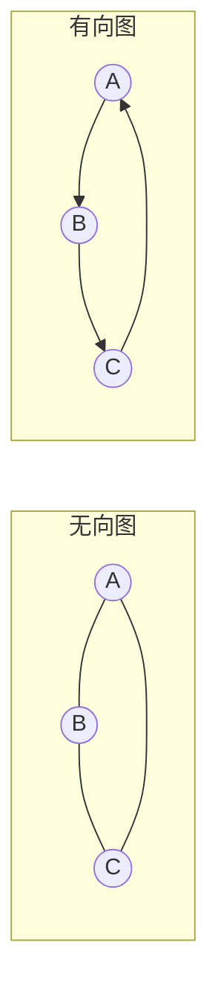

### 6.1.2 图的基本术语

#### 顶点相关术语

| 术语 | 定义 | 示例 |
|------|------|------|
| **顶点（Vertex）** | 图中的数据元素 | A, B, C |
| **边（Edge）** | 顶点之间的关系 | (A, B), <A, B> |
| **邻接（Adjacent）** | 两个顶点之间有边相连 | A与B邻接 |
| **关联（Incident）** | 边与顶点的关系 | 边(A, B)关联顶点A和B |

#### 度相关术语

| 术语 | 定义 | 无向图 | 有向图 |
|------|------|--------|--------|
| **度（Degree）** | 与顶点相连的边数 | 度 = 3 | - |
| **入度（In-degree）** | 指向该顶点的边数 | - | 入度 = 2 |
| **出度（Out-degree）** | 从该顶点出发的边数 | - | 出度 = 1 |
| **度数定理** | 所有顶点的度数之和 = 2 × 边数 | Σdeg(v) = 2\|E\| | Σdeg(v) = \|E\| |

**度数示例**：

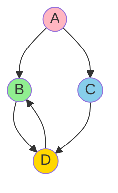

- A的出度：2，入度：0
- B的出度：1，入度：2
- C的出度：1，入度：1
- D的出度：1，入度：2

#### 路径相关术语

| 术语 | 定义 | 示例 |
|------|------|------|
| **路径（Path）** | 从一个顶点到另一个顶点的顶点序列 | A → B → C |
| **路径长度** | 路径上边的数量 | 长度 = 2 |
| **简单路径** | 顶点不重复的路径 | A → B → C |
| **回路/环（Cycle）** | 起点和终点相同的路径 | A → B → C → A |
| **简单回路** | 除起点外顶点不重复的回路 | A → B → C → A |

#### 连通性相关术语

| 术语 | 定义 | 适用类型 |
|------|------|----------|
| **连通** | 两个顶点之间有路径 | 无向图 |
| **连通图** | 任意两个顶点都连通 | 无向图 |
| **连通分量** | 极大连通子图 | 无向图 |
| **强连通** | 两个顶点之间双向可达 | 有向图 |
| **强连通图** | 任意两个顶点都双向可达 | 有向图 |
| **强连通分量** | 极大强连通子图 | 有向图 |

**连通性示例**：

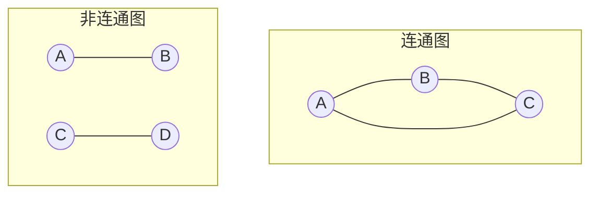

#### 子图相关术语

| 术语 | 定义 |
|------|------|
| **子图（Subgraph）** | 顶点集和边集都是原图的子集 |
| **生成子图（Spanning Subgraph）** | 包含原图所有顶点的子图 |
| **生成树（Spanning Tree）** | 连通图的极小连通生成子图 |

### 6.1.3 图的性质

**性质1：握手定理**

对于无向图：
```
Σ deg(v) = 2 × |E|
```
即所有顶点的度数之和等于边数的2倍。

**证明**：每条边关联两个顶点，对度数贡献2。

**性质2：有向图的度数定理**

对于有向图：
```
Σ in_degree(v) = Σ out_degree(v) = |E|
```

**性质3：简单图的边数上限**

- 无向简单图（n个顶点）：
```
|E| ≤ n(n-1)/2
```

- 有向简单图（n个顶点）：
```
|E| ≤ n(n-1)
```

**性质4：图的表示**

图可以用邻接矩阵或邻接表表示：
- 邻接矩阵：O(n²)空间，适合稠密图
- 邻接表：O(n+e)空间，适合稀疏图

---

## 6.2 图的存储结构

### 6.2.1 邻接矩阵（Adjacency Matrix）

#### 定义和特点

**定义**：
邻接矩阵是用一个二维数组存储图中顶点之间的关系。矩阵的第i行第j列表示顶点i和顶点j之间是否有边。

**特点**：

| 特性 | 说明 |
|------|------|
| **空间复杂度** | O(n²)，n为顶点数 |
| **适用场景** | 稠密图 |
| **优点** | 判断两点是否有边O(1)，易于实现 |
| **缺点** | 空间浪费大，不适合稀疏图 |

**邻接矩阵示例**：

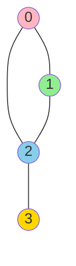

对应邻接矩阵：
```
    0   1   2   3
0 [ 0   1   1   0 ]
1 [ 1   0   1   0 ]
2 [ 1   1   0   1 ]
3 [ 0   0   1   0 ]
```

#### C++实现

```cpp
#include <iostream>
#include <vector>
#include <stdexcept>
#include <queue>
#include <stack>
#include <climits>
#include <algorithm>

using namespace std;

template <typename T>
class GraphMatrix {
private:
    vector<vector<int>> matrix;      // 邻接矩阵
    vector<T> vertices;               // 顶点数据
    bool isDirected;                  // 是否为有向图
    int vertexCount;                  // 顶点数量

public:
    /**
     * 构造函数
     * @param capacity 初始容量
     * @param directed 是否为有向图
     */
    GraphMatrix(int capacity, bool directed = false)
        : vertexCount(0), isDirected(directed) {
        matrix.assign(capacity, vector<int>(capacity, 0));
        vertices.resize(capacity);
    }

    /**
     * 添加顶点
     * @param vertex 顶点数据
     */
    void addVertex(const T& vertex) {
        if (vertexCount >= vertices.size()) {
            throw runtime_error("图已满");
        }
        vertices[vertexCount++] = vertex;
    }

    /**
     * 添加边
     * @param from 起始顶点索引
     * @param to 目标顶点索引
     * @param weight 边的权值（默认为1）
     */
    void addEdge(int from, int to, int weight = 1) {
        if (from < 0 || from >= vertexCount || to < 0 || to >= vertexCount) {
            throw out_of_range("顶点索引越界");
        }

        matrix[from][to] = weight;
        if (!isDirected) {
            matrix[to][from] = weight;
        }
    }

    /**
     * 删除边
     * @param from 起始顶点索引
     * @param to 目标顶点索引
     */
    void removeEdge(int from, int to) {
        if (from < 0 || from >= vertexCount || to < 0 || to >= vertexCount) {
            throw out_of_range("顶点索引越界");
        }

        matrix[from][to] = 0;
        if (!isDirected) {
            matrix[to][from] = 0;
        }
    }

    /**
     * 判断两个顶点之间是否有边
     * @param from 起始顶点索引
     * @param to 目标顶点索引
     * @return 是否有边
     */
    bool hasEdge(int from, int to) const {
        if (from < 0 || from >= vertexCount || to < 0 || to >= vertexCount) {
            return false;
        }
        return matrix[from][to] != 0;
    }

    /**
     * 获取边的权值
     * @param from 起始顶点索引
     * @param to 目标顶点索引
     * @return 边的权值
     */
    int getEdgeWeight(int from, int to) const {
        if (from < 0 || from >= vertexCount || to < 0 || to >= vertexCount) {
            throw out_of_range("顶点索引越界");
        }
        return matrix[from][to];
    }

    /**
     * 获取顶点的度（无向图）或出度（有向图）
     * @param vertex 顶点索引
     * @return 度数
     */
    int getDegree(int vertex) const {
        if (vertex < 0 || vertex >= vertexCount) {
            throw out_of_range("顶点索引越界");
        }

        int degree = 0;
        for (int i = 0; i < vertexCount; ++i) {
            if (matrix[vertex][i] != 0) {
                ++degree;
            }
        }
        return degree;
    }

    /**
     * 获取顶点的入度（有向图）
     * @param vertex 顶点索引
     * @return 入度
     */
    int getInDegree(int vertex) const {
        if (vertex < 0 || vertex >= vertexCount) {
            throw out_of_range("顶点索引越界");
        }

        int inDegree = 0;
        for (int i = 0; i < vertexCount; ++i) {
            if (matrix[i][vertex] != 0) {
                ++inDegree;
            }
        }
        return inDegree;
    }

    /**
     * 获取顶点的出度（有向图）
     * @param vertex 顶点索引
     * @return 出度
     */
    int getOutDegree(int vertex) const {
        return getDegree(vertex);
    }

    /**
     * 获取顶点的所有邻接顶点
     * @param vertex 顶点索引
     * @return 邻接顶点索引列表
     */
    vector<int> getNeighbors(int vertex) const {
        if (vertex < 0 || vertex >= vertexCount) {
            throw out_of_range("顶点索引越界");
        }

        vector<int> neighbors;
        for (int i = 0; i < vertexCount; ++i) {
            if (matrix[vertex][i] != 0) {
                neighbors.push_back(i);
            }
        }
        return neighbors;
    }

    /**
     * 打印邻接矩阵
     */
    void printMatrix() const {
        cout << "邻接矩阵：" << endl;
        cout << "    ";
        for (int i = 0; i < vertexCount; ++i) {
            cout << vertices[i] << " ";
        }
        cout << endl;

        for (int i = 0; i < vertexCount; ++i) {
            cout << vertices[i] << ": ";
            for (int j = 0; j < vertexCount; ++j) {
                cout << matrix[i][j] << " ";
            }
            cout << endl;
        }
    }

    /**
     * 获取顶点数量
     */
    int getVertexCount() const {
        return vertexCount;
    }

    /**
     * 获取边数量
     */
    int getEdgeCount() const {
        int count = 0;
        for (int i = 0; i < vertexCount; ++i) {
            for (int j = 0; j < vertexCount; ++j) {
                if (matrix[i][j] != 0) {
                    ++count;
                }
            }
        }
        return isDirected ? count : count / 2;
    }

    /**
     * 判断图是否为空
     */
    bool isEmpty() const {
        return vertexCount == 0;
    }

    /**
     * 清空图
     */
    void clear() {
        for (auto& row : matrix) {
            fill(row.begin(), row.end(), 0);
        }
        vertexCount = 0;
    }
};
```

#### 使用示例

```cpp
void graph_matrix_example() {
    cout << "=== 邻接矩阵示例 ===" << endl;

    // 创建无向图
    GraphMatrix<char> graph(4, false);

    // 添加顶点
    graph.addVertex('A');
    graph.addVertex('B');
    graph.addVertex('C');
    graph.addVertex('D');

    // 添加边
    graph.addEdge(0, 1);  // A-B
    graph.addEdge(0, 2);  // A-C
    graph.addEdge(1, 2);  // B-C
    graph.addEdge(2, 3);  // C-D

    // 打印邻接矩阵
    graph.printMatrix();

    // 获取信息
    cout << "\n顶点数量: " << graph.getVertexCount() << endl;
    cout << "边数量: " << graph.getEdgeCount() << endl;
    cout << "顶点A的度: " << graph.getDegree(0) << endl;
    cout << "顶点B的度: " << graph.getDegree(1) << endl;
    cout << "顶点C的度: " << graph.getDegree(2) << endl;
    cout << "顶点D的度: " << graph.getDegree(3) << endl;

    // 获取邻接顶点
    cout << "\n顶点A的邻接顶点: ";
    auto neighbors = graph.getNeighbors(0);
    for (int neighbor : neighbors) {
        cout << neighbor << " ";
    }
    cout << endl;

    // 判断是否有边
    cout << "A和B之间是否有边: " << (graph.hasEdge(0, 1) ? "是" : "否") << endl;
    cout << "A和D之间是否有边: " << (graph.hasEdge(0, 3) ? "是" : "否") << endl;
}
```

### 6.2.2 邻接表（Adjacency List）

#### 定义和特点

**定义**：
邻接表是为图中每个顶点建立一个单链表，第i个链表中的节点表示与顶点i相邻的顶点。

**特点**：

| 特性 | 说明 |
|------|------|
| **空间复杂度** | O(n+e)，n为顶点数，e为边数 |
| **适用场景** | 稀疏图 |
| **优点** | 空间效率高，适合稀疏图 |
| **缺点** | 判断两点是否有边需要O(n) |

**邻接表示例**：


对应邻接表：
```
0: [1, 2]
1: [0, 2]
2: [0, 1, 3]
3: [2]
```

#### C++实现

```cpp
#include <iostream>
#include <vector>
#include <list>
#include <stdexcept>
#include <queue>
#include <stack>
#include <climits>
#include <algorithm>

using namespace std;

template <typename T>
struct EdgeNode {
    int to;           // 目标顶点索引
    int weight;       // 边的权值
    EdgeNode* next;   // 下一个边节点

    EdgeNode(int t, int w = 1, EdgeNode* n = nullptr)
        : to(t), weight(w), next(n) {}
};

template <typename T>
class GraphList {
private:
    struct VertexNode {
        T data;           // 顶点数据
        EdgeNode<T>* firstEdge;  // 第一条边
        int degree;        // 度数

        VertexNode(const T& d = T()) : data(d), firstEdge(nullptr), degree(0) {}
    };

    vector<VertexNode> vertices;  // 顶点数组
    bool isDirected;              // 是否为有向图
    int vertexCount;              // 顶点数量
    int edgeCount;                // 边数量

public:
    /**
     * 构造函数
     * @param capacity 初始容量
     * @param directed 是否为有向图
     */
    GraphList(int capacity, bool directed = false)
        : isDirected(directed), vertexCount(0), edgeCount(0) {
        vertices.resize(capacity);
    }

    /**
     * 析构函数
     */
    ~GraphList() {
        clear();
    }

    /**
     * 添加顶点
     * @param vertex 顶点数据
     */
    void addVertex(const T& vertex) {
        if (vertexCount >= vertices.size()) {
            vertices.resize(vertices.size() * 2);
        }
        vertices[vertexCount].data = vertex;
        vertices[vertexCount].firstEdge = nullptr;
        vertices[vertexCount].degree = 0;
        ++vertexCount;
    }

    /**
     * 添加边
     * @param from 起始顶点索引
     * @param to 目标顶点索引
     * @param weight 边的权值（默认为1）
     */
    void addEdge(int from, int to, int weight = 1) {
        if (from < 0 || from >= vertexCount || to < 0 || to >= vertexCount) {
            throw out_of_range("顶点索引越界");
        }

        // 检查边是否已存在
        EdgeNode<T>* current = vertices[from].firstEdge;
        while (current != nullptr) {
            if (current->to == to) {
                return;  // 边已存在
            }
            current = current->next;
        }

        // 添加新边
        EdgeNode<T>* newNode = new EdgeNode<T>(to, weight, vertices[from].firstEdge);
        vertices[from].firstEdge = newNode;
        ++vertices[from].degree;
        ++edgeCount;

        // 如果是无向图，添加反向边
        if (!isDirected) {
            EdgeNode<T>* reverseNode = new EdgeNode<T>(from, weight, vertices[to].firstEdge);
            vertices[to].firstEdge = reverseNode;
            ++vertices[to].degree;
        }
    }

    /**
     * 删除边
     * @param from 起始顶点索引
     * @param to 目标顶点索引
     */
    void removeEdge(int from, int to) {
        if (from < 0 || from >= vertexCount || to < 0 || to >= vertexCount) {
            throw out_of_range("顶点索引越界");
        }

        EdgeNode<T>* prev = nullptr;
        EdgeNode<T>* current = vertices[from].firstEdge;

        while (current != nullptr && current->to != to) {
            prev = current;
            current = current->next;
        }

        if (current != nullptr) {
            if (prev == nullptr) {
                vertices[from].firstEdge = current->next;
            } else {
                prev->next = current->next;
            }
            delete current;
            --vertices[from].degree;
            --edgeCount;
        }

        // 如果是无向图，删除反向边
        if (!isDirected) {
            prev = nullptr;
            current = vertices[to].firstEdge;

            while (current != nullptr && current->to != from) {
                prev = current;
                current = current->next;
            }

            if (current != nullptr) {
                if (prev == nullptr) {
                    vertices[to].firstEdge = current->next;
                } else {
                    prev->next = current->next;
                }
                delete current;
                --vertices[to].degree;
            }
        }
    }

    /**
     * 判断两个顶点之间是否有边
     * @param from 起始顶点索引
     * @param to 目标顶点索引
     * @return 是否有边
     */
    bool hasEdge(int from, int to) const {
        if (from < 0 || from >= vertexCount || to < 0 || to >= vertexCount) {
            return false;
        }

        EdgeNode<T>* current = vertices[from].firstEdge;
        while (current != nullptr) {
            if (current->to == to) {
                return true;
            }
            current = current->next;
        }
        return false;
    }

    /**
     * 获取边的权值
     * @param from 起始顶点索引
     * @param to 目标顶点索引
     * @return 边的权值
     */
    int getEdgeWeight(int from, int to) const {
        if (from < 0 || from >= vertexCount || to < 0 || to >= vertexCount) {
            throw out_of_range("顶点索引越界");
        }

        EdgeNode<T>* current = vertices[from].firstEdge;
        while (current != nullptr) {
            if (current->to == to) {
                return current->weight;
            }
            current = current->next;
        }
        return 0;
    }

    /**
     * 获取顶点的度（无向图）或出度（有向图）
     * @param vertex 顶点索引
     * @return 度数
     */
    int getDegree(int vertex) const {
        if (vertex < 0 || vertex >= vertexCount) {
            throw out_of_range("顶点索引越界");
        }
        return vertices[vertex].degree;
    }

    /**
     * 获取顶点的入度（有向图）
     * @param vertex 顶点索引
     * @return 入度
     */
    int getInDegree(int vertex) const {
        if (vertex < 0 || vertex >= vertexCount) {
            throw out_of_range("顶点索引越界");
        }

        int inDegree = 0;
        for (int i = 0; i < vertexCount; ++i) {
            EdgeNode<T>* current = vertices[i].firstEdge;
            while (current != nullptr) {
                if (current->to == vertex) {
                    ++inDegree;
                }
                current = current->next;
            }
        }
        return inDegree;
    }

    /**
     * 获取顶点的所有邻接顶点
     * @param vertex 顶点索引
     * @return 邻接顶点索引列表
     */
    vector<int> getNeighbors(int vertex) const {
        if (vertex < 0 || vertex >= vertexCount) {
            throw out_of_range("顶点索引越界");
        }

        vector<int> neighbors;
        EdgeNode<T>* current = vertices[vertex].firstEdge;
        while (current != nullptr) {
            neighbors.push_back(current->to);
            current = current->next;
        }
        return neighbors;
    }

    /**
     * 打印邻接表
     */
    void printList() const {
        cout << "邻接表：" << endl;
        for (int i = 0; i < vertexCount; ++i) {
            cout << vertices[i].data << ": ";
            EdgeNode<T>* current = vertices[i].firstEdge;
            while (current != nullptr) {
                cout << vertices[current->to].data;
                if (current->weight != 1) {
                    cout << "(" << current->weight << ")";
                }
                cout << " -> ";
                current = current->next;
            }
            cout << "nullptr" << endl;
        }
    }

    /**
     * 获取顶点数量
     */
    int getVertexCount() const {
        return vertexCount;
    }

    /**
     * 获取边数量
     */
    int getEdgeCount() const {
        return isDirected ? edgeCount : edgeCount / 2;
    }

    /**
     * 判断图是否为空
     */
    bool isEmpty() const {
        return vertexCount == 0;
    }

    /**
     * 清空图
     */
    void clear() {
        for (int i = 0; i < vertexCount; ++i) {
            EdgeNode<T>* current = vertices[i].firstEdge;
            while (current != nullptr) {
                EdgeNode<T>* temp = current;
                current = current->next;
                delete temp;
            }
            vertices[i].firstEdge = nullptr;
            vertices[i].degree = 0;
        }
        vertexCount = 0;
        edgeCount = 0;
    }
};
```

#### 使用示例

```cpp
void graph_list_example() {
    cout << "=== 邻接表示例 ===" << endl;

    // 创建无向图
    GraphList<char> graph(4, false);

    // 添加顶点
    graph.addVertex('A');
    graph.addVertex('B');
    graph.addVertex('C');
    graph.addVertex('D');

    // 添加边
    graph.addEdge(0, 1);  // A-B
    graph.addEdge(0, 2);  // A-C
    graph.addEdge(1, 2);  // B-C
    graph.addEdge(2, 3);  // C-D

    // 打印邻接表
    graph.printList();

    // 获取信息
    cout << "\n顶点数量: " << graph.getVertexCount() << endl;
    cout << "边数量: " << graph.getEdgeCount() << endl;
    cout << "顶点A的度: " << graph.getDegree(0) << endl;
    cout << "顶点B的度: " << graph.getDegree(1) << endl;
    cout << "顶点C的度: " << graph.getDegree(2) << endl;
    cout << "顶点D的度: " << graph.getDegree(3) << endl;

    // 获取邻接顶点
    cout << "\n顶点A的邻接顶点: ";
    auto neighbors = graph.getNeighbors(0);
    for (int neighbor : neighbors) {
        cout << neighbor << " ";
    }
    cout << endl;

    // 判断是否有边
    cout << "A和B之间是否有边: " << (graph.hasEdge(0, 1) ? "是" : "否") << endl;
    cout << "A和D之间是否有边: " << (graph.hasEdge(0, 3) ? "是" : "否") << endl;
}
```

### 6.2.3 十字链表（Orthogonal List）

#### 定义和特点

**定义**：
十字链表是有向图的一种链式存储结构，它结合了邻接表和逆邻接表的特点，可以同时处理入边和出边。

**特点**：

| 特性 | 说明 |
|------|------|
| **空间复杂度** | O(n+e) |
| **适用场景** | 有向图，需要频繁处理入边和出边 |
| **优点** | 可以高效地处理入边和出边 |
| **缺点** | 实现复杂，不适合无向图 |

**节点结构**：

```cpp
// 顶点节点
struct VertexNode {
    VertexType data;      // 顶点数据
    EdgeNode* firstIn;    // 第一条入边
    EdgeNode* firstOut;   // 第一条出边
};

// 边节点
struct EdgeNode {
    int tail;             // 弧尾顶点索引
    int head;             // 弧头顶点索引
    int weight;           // 权值
    EdgeNode* tailLink;   // 尾链（指向同一弧尾的下一条边）
    EdgeNode* headLink;   // 头链（指向同一弧头的下一条边）
};
```

#### C++实现

```cpp
#include <iostream>
#include <vector>
#include <stdexcept>

using namespace std;

template <typename T>
class OrthogonalList {
private:
    struct EdgeNode {
        int tail;             // 弧尾顶点索引
        int head;             // 弧头顶点索引
        int weight;           // 权值
        EdgeNode* tailLink;   // 尾链
        EdgeNode* headLink;   // 头链

        EdgeNode(int t, int h, int w = 1)
            : tail(t), head(h), weight(w), tailLink(nullptr), headLink(nullptr) {}
    };

    struct VertexNode {
        T data;              // 顶点数据
        EdgeNode* firstIn;   // 第一条入边
        EdgeNode* firstOut;  // 第一条出边

        VertexNode(const T& d = T()) : data(d), firstIn(nullptr), firstOut(nullptr) {}
    };

    vector<VertexNode> vertices;  // 顶点数组
    int vertexCount;              // 顶点数量
    int edgeCount;                // 边数量

public:
    /**
     * 构造函数
     * @param capacity 初始容量
     */
    OrthogonalList(int capacity) : vertexCount(0), edgeCount(0) {
        vertices.resize(capacity);
    }

    /**
     * 析构函数
     */
    ~OrthogonalList() {
        clear();
    }

    /**
     * 添加顶点
     * @param vertex 顶点数据
     */
    void addVertex(const T& vertex) {
        if (vertexCount >= vertices.size()) {
            vertices.resize(vertices.size() * 2);
        }
        vertices[vertexCount].data = vertex;
        vertices[vertexCount].firstIn = nullptr;
        vertices[vertexCount].firstOut = nullptr;
        ++vertexCount;
    }

    /**
     * 添加边
     * @param from 起始顶点索引
     * @param to 目标顶点索引
     * @param weight 边的权值
     */
    void addEdge(int from, int to, int weight = 1) {
        if (from < 0 || from >= vertexCount || to < 0 || to >= vertexCount) {
            throw out_of_range("顶点索引越界");
        }

        // 检查边是否已存在
        EdgeNode* current = vertices[from].firstOut;
        while (current != nullptr) {
            if (current->head == to) {
                return;  // 边已存在
            }
            current = current->tailLink;
        }

        // 创建新边
        EdgeNode* newEdge = new EdgeNode(from, to, weight);

        // 插入到出边链表
        newEdge->tailLink = vertices[from].firstOut;
        vertices[from].firstOut = newEdge;

        // 插入到入边链表
        newEdge->headLink = vertices[to].firstIn;
        vertices[to].firstIn = newEdge;

        ++edgeCount;
    }

    /**
     * 获取顶点的出度
     * @param vertex 顶点索引
     * @return 出度
     */
    int getOutDegree(int vertex) const {
        if (vertex < 0 || vertex >= vertexCount) {
            throw out_of_range("顶点索引越界");
        }

        int count = 0;
        EdgeNode* current = vertices[vertex].firstOut;
        while (current != nullptr) {
            ++count;
            current = current->tailLink;
        }
        return count;
    }

    /**
     * 获取顶点的入度
     * @param vertex 顶点索引
     * @return 入度
     */
    int getInDegree(int vertex) const {
        if (vertex < 0 || vertex >= vertexCount) {
            throw out_of_range("顶点索引越界");
        }

        int count = 0;
        EdgeNode* current = vertices[vertex].firstIn;
        while (current != nullptr) {
            ++count;
            current = current->headLink;
        }
        return count;
    }

    /**
     * 打印十字链表
     */
    void printList() const {
        cout << "十字链表：" << endl;
        for (int i = 0; i < vertexCount; ++i) {
            cout << vertices[i].data << " (入度: " << getInDegree(i)
                 << ", 出度: " << getOutDegree(i) << ")" << endl;

            cout << "  出边: ";
            EdgeNode* current = vertices[i].firstOut;
            while (current != nullptr) {
                cout << vertices[current->head].data;
                if (current->weight != 1) {
                    cout << "(" << current->weight << ")";
                }
                cout << " ";
                current = current->tailLink;
            }
            cout << endl;

            cout << "  入边: ";
            current = vertices[i].firstIn;
            while (current != nullptr) {
                cout << vertices[current->tail].data;
                if (current->weight != 1) {
                    cout << "(" << current->weight << ")";
                }
                cout << " ";
                current = current->headLink;
            }
            cout << endl;
        }
    }

    /**
     * 获取顶点数量
     */
    int getVertexCount() const {
        return vertexCount;
    }

    /**
     * 获取边数量
     */
    int getEdgeCount() const {
        return edgeCount;
    }

    /**
     * 清空图
     */
    void clear() {
        // 删除所有边节点
        for (int i = 0; i < vertexCount; ++i) {
            EdgeNode* current = vertices[i].firstOut;
            while (current != nullptr) {
                EdgeNode* temp = current;
                current = current->tailLink;
                delete temp;
            }
            vertices[i].firstOut = nullptr;
            vertices[i].firstIn = nullptr;
        }
        vertexCount = 0;
        edgeCount = 0;
    }
};
```

### 6.2.4 邻接多重表（Adjacency Multilist）

#### 定义和特点

**定义**：
邻接多重表是无向图的一种链式存储结构，它解决了邻接表中无向图的边被重复存储的问题。

**特点**：

| 特性 | 说明 |
|------|------|
| **空间复杂度** | O(n+e) |
| **适用场景** | 无向图，需要频繁操作边 |
| **优点** | 每条边只存储一次，便于边的操作 |
| **缺点** | 实现复杂 |

**节点结构**：

```cpp
// 顶点节点
struct VertexNode {
    VertexType data;      // 顶点数据
    EdgeNode* firstEdge;  // 第一条边
};

// 边节点
struct EdgeNode {
    int ivex;             // 顶点1的索引
    int jvex;             // 顶点2的索引
    EdgeNode* ilink;      // 指向顶点1的下一条边
    EdgeNode* jlink;      // 指向顶点2的下一条边
    int weight;           // 权值
    bool visited;         // 访问标记
};
```

#### C++实现

```cpp
#include <iostream>
#include <vector>
#include <stdexcept>

using namespace std;

template <typename T>
class AdjacencyMultilist {
private:
    struct EdgeNode {
        int ivex;             // 顶点1的索引
        int jvex;             // 顶点2的索引
        EdgeNode* ilink;      // 指向顶点1的下一条边
        EdgeNode* jlink;      // 指向顶点2的下一条边
        int weight;           // 权值
        bool visited;         // 访问标记

        EdgeNode(int i, int j, int w = 1)
            : ivex(i), jvex(j), weight(w), ilink(nullptr), jlink(nullptr), visited(false) {}
    };

    struct VertexNode {
        T data;              // 顶点数据
        EdgeNode* firstEdge;  // 第一条边

        VertexNode(const T& d = T()) : data(d), firstEdge(nullptr) {}
    };

    vector<VertexNode> vertices;  // 顶点数组
    int vertexCount;              // 顶点数量
    int edgeCount;                // 边数量

public:
    /**
     * 构造函数
     * @param capacity 初始容量
     */
    AdjacencyMultilist(int capacity) : vertexCount(0), edgeCount(0) {
        vertices.resize(capacity);
    }

    /**
     * 析构函数
     */
    ~AdjacencyMultilist() {
        clear();
    }

    /**
     * 添加顶点
     * @param vertex 顶点数据
     */
    void addVertex(const T& vertex) {
        if (vertexCount >= vertices.size()) {
            vertices.resize(vertices.size() * 2);
        }
        vertices[vertexCount].data = vertex;
        vertices[vertexCount].firstEdge = nullptr;
        ++vertexCount;
    }

    /**
     * 添加边
     * @param v1 顶点1的索引
     * @param v2 顶点2的索引
     * @param weight 边的权值
     */
    void addEdge(int v1, int v2, int weight = 1) {
        if (v1 < 0 || v1 >= vertexCount || v2 < 0 || v2 >= vertexCount) {
            throw out_of_range("顶点索引越界");
        }

        // 检查边是否已存在
        EdgeNode* current = vertices[v1].firstEdge;
        while (current != nullptr) {
            int otherVex = (current->ivex == v1) ? current->jvex : current->ivex;
            if (otherVex == v2) {
                return;  // 边已存在
            }
            current = (current->ivex == v1) ? current->ilink : current->jlink;
        }

        // 创建新边
        EdgeNode* newEdge = new EdgeNode(v1, v2, weight);

        // 插入到v1的边链表
        newEdge->ilink = vertices[v1].firstEdge;
        vertices[v1].firstEdge = newEdge;

        // 插入到v2的边链表
        newEdge->jlink = vertices[v2].firstEdge;
        vertices[v2].firstEdge = newEdge;

        ++edgeCount;
    }

    /**
     * 获取顶点的度
     * @param vertex 顶点索引
     * @return 度数
     */
    int getDegree(int vertex) const {
        if (vertex < 0 || vertex >= vertexCount) {
            throw out_of_range("顶点索引越界");
        }

        int count = 0;
        EdgeNode* current = vertices[vertex].firstEdge;
        while (current != nullptr) {
            ++count;
            current = (current->ivex == vertex) ? current->ilink : current->jlink;
        }
        return count;
    }

    /**
     * 打印邻接多重表
     */
    void printList() const {
        cout << "邻接多重表：" << endl;
        for (int i = 0; i < vertexCount; ++i) {
            cout << vertices[i].data << " (度: " << getDegree(i) << "): ";

            EdgeNode* current = vertices[i].firstEdge;
            while (current != nullptr) {
                int otherVex = (current->ivex == i) ? current->jvex : current->ivex;
                cout << vertices[otherVex].data;
                if (current->weight != 1) {
                    cout << "(" << current->weight << ")";
                }
                cout << " ";
                current = (current->ivex == i) ? current->ilink : current->jlink;
            }
            cout << endl;
        }
    }

    /**
     * 获取顶点数量
     */
    int getVertexCount() const {
        return vertexCount;
    }

    /**
     * 获取边数量
     */
    int getEdgeCount() const {
        return edgeCount;
    }

    /**
     * 清空图
     */
    void clear() {
        // 删除所有边节点（需要去重）
        vector<EdgeNode*> allEdges;

        for (int i = 0; i < vertexCount; ++i) {
            EdgeNode* current = vertices[i].firstEdge;
            while (current != nullptr) {
                if (current->ivex == i) {  // 只处理ivex的边，避免重复删除
                    allEdges.push_back(current);
                }
                current = (current->ivex == i) ? current->ilink : current->jlink;
            }
            vertices[i].firstEdge = nullptr;
        }

        for (EdgeNode* edge : allEdges) {
            delete edge;
        }

        vertexCount = 0;
        edgeCount = 0;
    }
};
```

### 6.2.5 存储结构对比

| 存储结构 | 空间复杂度 | 判断边是否存在 | 获取邻接点 | 适用场景 |
|----------|-----------|---------------|-----------|----------|
| **邻接矩阵** | O(n²) | O(1) | O(n) | 稠密图 |
| **邻接表** | O(n+e) | O(n) | O(degree) | 稀疏图 |
| **十字链表** | O(n+e) | O(n) | O(degree) | 有向图，需要处理入边和出边 |
| **邻接多重表** | O(n+e) | O(n) | O(degree) | 无向图，需要频繁操作边 |

**选择建议**：

```cpp
// 稠密图（边数接近n²）→ 邻接矩阵
if (edgeCount > vertexCount * vertexCount / 4) {
    use_adjacency_matrix();
}

// 稀疏图（边数远小于n²）→ 邻接表
else {
    use_adjacency_list();
}

// 有向图，需要频繁处理入边和出边 → 十字链表
if (isDirected && needBothInAndOutEdges) {
    use_orthogonal_list();
}

// 无向图，需要频繁操作边 → 邻接多重表
if (!isDirected && needFrequentEdgeOperations) {
    use_adjacency_multilist();
}
```

---

## 6.3 图的遍历

### 6.3.1 深度优先搜索（DFS）

#### 算法原理

**定义**：
深度优先搜索（Depth-First Search，DFS）是一种用于遍历或搜索树或图的算法。该算法会尽可能深地搜索树的分支。

**算法思想**：
1. 访问起始顶点
2. 递归地访问其未访问的邻接顶点
3. 回溯到上一个顶点，继续访问其他未访问的邻接顶点

**算法流程图**：

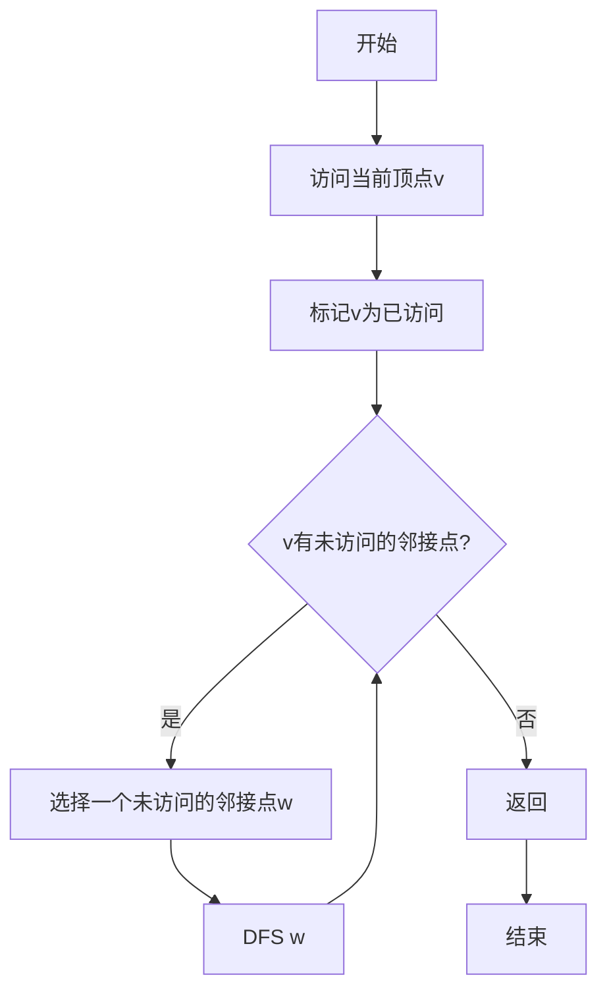

#### C++实现（递归）

```cpp
#include <iostream>
#include <vector>
#include <stack>
#include <unordered_set>

using namespace std;

template <typename T>
class GraphDFS {
private:
    struct EdgeNode {
        int to;
        int weight;
        EdgeNode* next;

        EdgeNode(int t, int w = 1, EdgeNode* n = nullptr)
            : to(t), weight(w), next(n) {}
    };

    struct VertexNode {
        T data;
        EdgeNode* firstEdge;

        VertexNode(const T& d = T()) : data(d), firstEdge(nullptr) {}
    };

    vector<VertexNode> vertices;
    bool isDirected;
    int vertexCount;
    vector<bool> visited;  // 访问标记数组

public:
    GraphDFS(int capacity, bool directed = false)
        : isDirected(directed), vertexCount(0) {
        vertices.resize(capacity);
    }

    void addVertex(const T& vertex) {
        if (vertexCount >= vertices.size()) {
            vertices.resize(vertices.size() * 2);
        }
        vertices[vertexCount].data = vertex;
        vertices[vertexCount].firstEdge = nullptr;
        ++vertexCount;
    }

    void addEdge(int from, int to, int weight = 1) {
        if (from < 0 || from >= vertexCount || to < 0 || to >= vertexCount) {
            throw out_of_range("顶点索引越界");
        }

        EdgeNode* newNode = new EdgeNode(to, weight, vertices[from].firstEdge);
        vertices[from].firstEdge = newNode;

        if (!isDirected) {
            EdgeNode* reverseNode = new EdgeNode(from, weight, vertices[to].firstEdge);
            vertices[to].firstEdge = reverseNode;
        }
    }

    /**
     * 深度优先搜索（递归实现）
     * @param start 起始顶点索引
     */
    void DFS_Recursive(int start) {
        // 初始化访问标记
        visited.assign(vertexCount, false);

        cout << "DFS遍历序列（递归）: ";
        DFS(start);
        cout << endl;
    }

    /**
     * DFS递归辅助函数
     * @param v 当前顶点索引
     */
    void DFS(int v) {
        // 访问当前顶点
        visited[v] = true;
        cout << vertices[v].data << " ";

        // 访问所有未访问的邻接顶点
        EdgeNode* current = vertices[v].firstEdge;
        while (current != nullptr) {
            if (!visited[current->to]) {
                DFS(current->to);
            }
            current = current->next;
        }
    }

    /**
     * 深度优先搜索（非递归实现）
     * @param start 起始顶点索引
     */
    void DFS_Iterative(int start) {
        // 初始化访问标记
        visited.assign(vertexCount, false);

        cout << "DFS遍历序列（迭代）: ";

        // 使用栈
        stack<int> stk;
        stk.push(start);
        visited[start] = true;

        while (!stk.empty()) {
            int v = stk.top();
            stk.pop();

            cout << vertices[v].data << " ";

            // 将所有未访问的邻接顶点入栈
            EdgeNode* current = vertices[v].firstEdge;
            while (current != nullptr) {
                if (!visited[current->to]) {
                    visited[current->to] = true;
                    stk.push(current->to);
                }
                current = current->next;
            }
        }

        cout << endl;
    }

    /**
     * 对所有连通分量进行DFS
     */
    void DFS_AllComponents() {
        // 初始化访问标记
        visited.assign(vertexCount, false);

        cout << "DFS遍历所有连通分量: " << endl;
        int componentCount = 0;

        for (int i = 0; i < vertexCount; ++i) {
            if (!visited[i]) {
                cout << "连通分量 " << ++componentCount << ": ";
                DFS(i);
                cout << endl;
            }
        }

        cout << "共有 " << componentCount << " 个连通分量" << endl;
    }

    /**
     * 检测图中是否有环（有向图）
     * @return 是否有环
     */
    bool hasCycle() {
        vector<bool> onStack(vertexCount, false);
        vector<bool> vis(vertexCount, false);

        for (int i = 0; i < vertexCount; ++i) {
            if (!vis[i]) {
                if (hasCycleUtil(i, vis, onStack)) {
                    return true;
                }
            }
        }
        return false;
    }

    /**
     * 检测环的辅助函数
     */
    bool hasCycleUtil(int v, vector<bool>& vis, vector<bool>& onStack) {
        if (!vis[v]) {
            vis[v] = true;
            onStack[v] = true;

            EdgeNode* current = vertices[v].firstEdge;
            while (current != nullptr) {
                if (!vis[current->to]) {
                    if (hasCycleUtil(current->to, vis, onStack)) {
                        return true;
                    }
                } else if (onStack[current->to]) {
                    return true;
                }
                current = current->next;
            }
        }

        onStack[v] = false;
        return false;
    }
};
```

#### DFS示例

```cpp
void dfs_example() {
    cout << "=== DFS示例 ===" << endl;

    // 创建无向图
    GraphDFS<char> graph(5, false);

    // 添加顶点
    graph.addVertex('A');
    graph.addVertex('B');
    graph.addVertex('C');
    graph.addVertex('D');
    graph.addVertex('E');

    // 添加边
    graph.addEdge(0, 1);  // A-B
    graph.addEdge(0, 2);  // A-C
    graph.addEdge(1, 3);  // B-D
    graph.addEdge(2, 3);  // C-D
    graph.addEdge(3, 4);  // D-E

    // DFS遍历（递归）
    graph.DFS_Recursive(0);

    // DFS遍历（迭代）
    graph.DFS_Iterative(0);

    // 创建非连通图
    cout << "\n=== 非连通图DFS示例 ===" << endl;
    GraphDFS<char> graph2(6, false);

    graph2.addVertex('A');
    graph2.addVertex('B');
    graph2.addVertex('C');
    graph2.addVertex('D');
    graph2.addVertex('E');
    graph2.addVertex('F');

    graph2.addEdge(0, 1);  // A-B
    graph2.addEdge(1, 2);  // B-C

    graph2.addEdge(3, 4);  // D-E
    graph2.addEdge(4, 5);  // E-F

    graph2.DFS_AllComponents();
}
```

### 6.3.2 广度优先搜索（BFS）

#### 算法原理

**定义**：
广度优先搜索（Breadth-First Search，BFS）是一种用于遍历或搜索树或图的算法。该算法从起始顶点开始，先访问所有邻接顶点，然后再访问这些邻接顶点的邻接顶点。

**算法思想**：
1. 访问起始顶点，将其入队
2. 从队列中取出一个顶点，访问其所有未访问的邻接顶点
3. 将这些邻接顶点入队
4. 重复步骤2-3，直到队列为空

**算法流程图**：

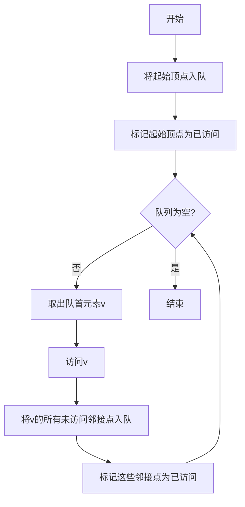

#### C++实现

```cpp
#include <iostream>
#include <vector>
#include <queue>

using namespace std;

template <typename T>
class GraphBFS {
private:
    struct EdgeNode {
        int to;
        int weight;
        EdgeNode* next;

        EdgeNode(int t, int w = 1, EdgeNode* n = nullptr)
            : to(t), weight(w), next(n) {}
    };

    struct VertexNode {
        T data;
        EdgeNode* firstEdge;

        VertexNode(const T& d = T()) : data(d), firstEdge(nullptr) {}
    };

    vector<VertexNode> vertices;
    bool isDirected;
    int vertexCount;
    vector<bool> visited;  // 访问标记数组

public:
    GraphBFS(int capacity, bool directed = false)
        : isDirected(directed), vertexCount(0) {
        vertices.resize(capacity);
    }

    void addVertex(const T& vertex) {
        if (vertexCount >= vertices.size()) {
            vertices.resize(vertices.size() * 2);
        }
        vertices[vertexCount].data = vertex;
        vertices[vertexCount].firstEdge = nullptr;
        ++vertexCount;
    }

    void addEdge(int from, int to, int weight = 1) {
        if (from < 0 || from >= vertexCount || to < 0 || to >= vertexCount) {
            throw out_of_range("顶点索引越界");
        }

        EdgeNode* newNode = new EdgeNode(to, weight, vertices[from].firstEdge);
        vertices[from].firstEdge = newNode;

        if (!isDirected) {
            EdgeNode* reverseNode = new EdgeNode(from, weight, vertices[to].firstEdge);
            vertices[to].firstEdge = reverseNode;
        }
    }

    /**
     * 广度优先搜索
     * @param start 起始顶点索引
     */
    void BFS(int start) {
        // 初始化访问标记
        visited.assign(vertexCount, false);

        cout << "BFS遍历序列: ";

        // 使用队列
        queue<int> q;
        q.push(start);
        visited[start] = true;

        while (!q.empty()) {
            int v = q.front();
            q.pop();

            cout << vertices[v].data << " ";

            // 将所有未访问的邻接顶点入队
            EdgeNode* current = vertices[v].firstEdge;
            while (current != nullptr) {
                if (!visited[current->to]) {
                    visited[current->to] = true;
                    q.push(current->to);
                }
                current = current->next;
            }
        }

        cout << endl;
    }

    /**
     * 计算从起始顶点到其他所有顶点的最短路径（无权图）
     * @param start 起始顶点索引
     */
    void shortestPathUnweighted(int start) {
        // 初始化
        visited.assign(vertexCount, false);
        vector<int> distance(vertexCount, -1);  // 距离数组
        vector<int> parent(vertexCount, -1);    // 前驱数组

        queue<int> q;
        q.push(start);
        visited[start] = true;
        distance[start] = 0;

        while (!q.empty()) {
            int v = q.front();
            q.pop();

            EdgeNode* current = vertices[v].firstEdge;
            while (current != nullptr) {
                if (!visited[current->to]) {
                    visited[current->to] = true;
                    distance[current->to] = distance[v] + 1;
                    parent[current->to] = v;
                    q.push(current->to);
                }
                current = current->next;
            }
        }

        // 输出结果
        cout << "从 " << vertices[start].data << " 到各顶点的最短路径：" << endl;
        for (int i = 0; i < vertexCount; ++i) {
            if (distance[i] != -1) {
                cout << vertices[start].data << " -> " << vertices[i].data
                     << ": 距离 = " << distance[i];

                // 输出路径
                cout << ", 路径: ";
                printPath(parent, i);
                cout << endl;
            } else {
                cout << vertices[start].data << " -> " << vertices[i].data
                     << ": 不可达" << endl;
            }
        }
    }

    /**
     * 打印路径
     */
    void printPath(const vector<int>& parent, int v) {
        if (parent[v] == -1) {
            cout << vertices[v].data;
        } else {
            printPath(parent, parent[v]);
            cout << " -> " << vertices[v].data;
        }
    }

    /**
     * 对所有连通分量进行BFS
     */
    void BFS_AllComponents() {
        // 初始化访问标记
        visited.assign(vertexCount, false);

        cout << "BFS遍历所有连通分量: " << endl;
        int componentCount = 0;

        for (int i = 0; i < vertexCount; ++i) {
            if (!visited[i]) {
                cout << "连通分量 " << ++componentCount << ": ";

                queue<int> q;
                q.push(i);
                visited[i] = true;

                while (!q.empty()) {
                    int v = q.front();
                    q.pop();

                    cout << vertices[v].data << " ";

                    EdgeNode* current = vertices[v].firstEdge;
                    while (current != nullptr) {
                        if (!visited[current->to]) {
                            visited[current->to] = true;
                            q.push(current->to);
                        }
                        current = current->next;
                    }
                }

                cout << endl;
            }
        }

        cout << "共有 " << componentCount << " 个连通分量" << endl;
    }
};
```

#### BFS示例

```cpp
void bfs_example() {
    cout << "=== BFS示例 ===" << endl;

    // 创建无向图
    GraphBFS<char> graph(5, false);

    // 添加顶点
    graph.addVertex('A');
    graph.addVertex('B');
    graph.addVertex('C');
    graph.addVertex('D');
    graph.addVertex('E');

    // 添加边
    graph.addEdge(0, 1);  // A-B
    graph.addEdge(0, 2);  // A-C
    graph.addEdge(1, 3);  // B-D
    graph.addEdge(2, 3);  // C-D
    graph.addEdge(3, 4);  // D-E

    // BFS遍历
    graph.BFS(0);

    // 最短路径
    graph.shortestPathUnweighted(0);
}
```

### 6.3.3 DFS vs BFS对比

| 特性 | DFS | BFS |
|------|-----|-----|
| **数据结构** | 栈（递归调用栈） | 队列 |
| **访问顺序** | 深度优先，一条路走到黑 | 广度优先，逐层访问 |
| **空间复杂度** | O(h)，h为树的高度 | O(w)，w为树的宽度 |
| **最短路径** | 不保证找到最短路径 | 保证找到最短路径（无权图） |
| **适用场景** | 拓扑排序、查找连通分量、检测环 | 最短路径、层次遍历、最小生成树 |

**代码对比**：

```cpp
// DFS使用栈
void DFS(int start) {
    stack<int> stk;
    stk.push(start);
    visited[start] = true;

    while (!stk.empty()) {
        int v = stk.top();
        stk.pop();
        visit(v);

        for (int neighbor : getNeighbors(v)) {
            if (!visited[neighbor]) {
                visited[neighbor] = true;
                stk.push(neighbor);
            }
        }
    }
}

// BFS使用队列
void BFS(int start) {
    queue<int> q;
    q.push(start);
    visited[start] = true;

    while (!q.empty()) {
        int v = q.front();
        q.pop();
        visit(v);

        for (int neighbor : getNeighbors(v)) {
            if (!visited[neighbor]) {
                visited[neighbor] = true;
                q.push(neighbor);
            }
        }
    }
}
```

---

## 6.4 最小生成树

### 6.4.1 最小生成树的概念

**定义**：
最小生成树（Minimum Spanning Tree，MST）是一个连通图的生成树，其所有边的权值之和最小。

**性质**：

1. **唯一性**：如果图中所有边的权值互不相同，则最小生成树唯一
2. **割性质**：对于图的任意割，最小生成树包含该割中权值最小的边
3. **环性质**：对于图中的任意环，最小生成树不包含该环中权值最大的边

**应用场景**：
- 电路设计
- 通信网络建设
- 交通网络规划

### 6.4.2 Prim算法

#### 算法原理

**算法思想**：
1. 从任意一个顶点开始
2. 每次选择一个与当前生成树相连的、权值最小的边
3. 将该边和对应的顶点加入生成树
4. 重复步骤2-3，直到所有顶点都在生成树中

**算法流程图**：

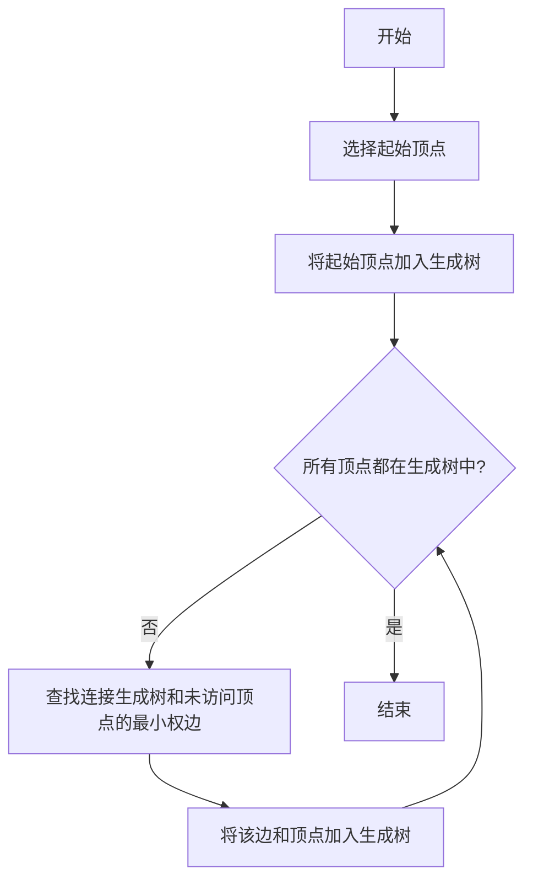

#### C++实现（优先队列优化）

```cpp
#include <iostream>
#include <vector>
#include <queue>
#include <climits>

using namespace std;

template <typename T>
class PrimMST {
private:
    struct Edge {
        int to;
        int weight;

        Edge(int t, int w) : to(t), weight(w) {}

        // 优先队列需要的大于运算符（小顶堆）
        bool operator>(const Edge& other) const {
            return weight > other.weight;
        }
    };

    vector<vector<pair<int, int>>> adjList;  // 邻接表: {vertex, weight}
    vector<T> vertices;
    int vertexCount;

public:
    PrimMST(int capacity) : vertexCount(0) {
        adjList.resize(capacity);
        vertices.resize(capacity);
    }

    void addVertex(const T& vertex) {
        if (vertexCount >= vertices.size()) {
            adjList.resize(adjList.size() * 2);
            vertices.resize(vertices.size() * 2);
        }
        vertices[vertexCount] = vertex;
        ++vertexCount;
    }

    void addEdge(int from, int to, int weight) {
        if (from < 0 || from >= vertexCount || to < 0 || to >= vertexCount) {
            throw out_of_range("顶点索引越界");
        }

        adjList[from].push_back({to, weight});
        adjList[to].push_back({from, weight});
    }

    /**
     * Prim算法求最小生成树
     * @param start 起始顶点索引
     * @return 最小生成树的边列表和总权值
     */
    pair<vector<pair<int, int>>, int> prim(int start) {
        vector<bool> inMST(vertexCount, false);  // 是否在MST中
        vector<int> key(vertexCount, INT_MAX);   // 到MST的最小距离
        vector<int> parent(vertexCount, -1);     // 前驱顶点

        // 使用优先队列（小顶堆）
        priority_queue<Edge, vector<Edge>, greater<Edge>> pq;

        // 从起始顶点开始
        key[start] = 0;
        pq.push(Edge(start, 0));

        while (!pq.empty()) {
            int u = pq.top().to;
            pq.pop();

            // 如果已经在MST中，跳过
            if (inMST[u]) {
                continue;
            }

            // 将顶点加入MST
            inMST[u] = true;

            // 更新邻接顶点的key值
            for (const auto& edge : adjList[u]) {
                int v = edge.first;
                int weight = edge.second;

                if (!inMST[v] && weight < key[v]) {
                    key[v] = weight;
                    parent[v] = u;
                    pq.push(Edge(v, key[v]));
                }
            }
        }

        // 构建最小生成树的边列表
        vector<pair<int, int>> mstEdges;
        int totalWeight = 0;

        for (int i = 0; i < vertexCount; ++i) {
            if (parent[i] != -1) {
                mstEdges.push_back({parent[i], i});
                totalWeight += key[i];
            }
        }

        return {mstEdges, totalWeight};
    }

    /**
     * 打印最小生成树
     */
    void printMST(int start) {
        auto [mstEdges, totalWeight] = prim(start);

        cout << "最小生成树（Prim算法）：" << endl;
        cout << "总权值: " << totalWeight << endl;
        cout << "边：" << endl;

        for (const auto& edge : mstEdges) {
            cout << vertices[edge.first] << " - " << vertices[edge.second]
                 << " (权值: " << getEdgeWeight(edge.first, edge.second) << ")" << endl;
        }
    }

    int getEdgeWeight(int from, int to) {
        for (const auto& edge : adjList[from]) {
            if (edge.first == to) {
                return edge.second;
            }
        }
        return -1;
    }
};
```

#### Prim算法示例

```cpp
void prim_example() {
    cout << "=== Prim算法示例 ===" << endl;

    PrimMST<char> graph(5);

    // 添加顶点
    graph.addVertex('A');
    graph.addVertex('B');
    graph.addVertex('C');
    graph.addVertex('D');
    graph.addVertex('E');

    // 添加边（带权值）
    graph.addEdge(0, 1, 2);  // A-B: 2
    graph.addEdge(0, 3, 6);  // A-D: 6
    graph.addEdge(1, 2, 3);  // B-C: 3
    graph.addEdge(1, 3, 8);  // B-D: 8
    graph.addEdge(1, 4, 5);  // B-E: 5
    graph.addEdge(2, 4, 7);  // C-E: 7
    graph.addEdge(3, 4, 9);  // D-E: 9

    // 计算最小生成树
    graph.printMST(0);
}
```

#### 复杂度分析

| 实现方式 | 时间复杂度 | 空间复杂度 |
|----------|-----------|-----------|
| **数组实现** | O(n²) | O(n) |
| **二叉堆实现** | O((n+e) log n) | O(n+e) |
| **斐波那契堆实现** | O(n log n + e) | O(n+e) |

### 6.4.3 Kruskal算法

#### 算法原理

**算法思想**：
1. 将所有边按权值从小到大排序
2. 从最小的边开始，依次检查是否与已选边形成环
3. 如果不形成环，则将该边加入最小生成树
4. 重复步骤2-3，直到选出n-1条边（n为顶点数）

**算法流程图**：

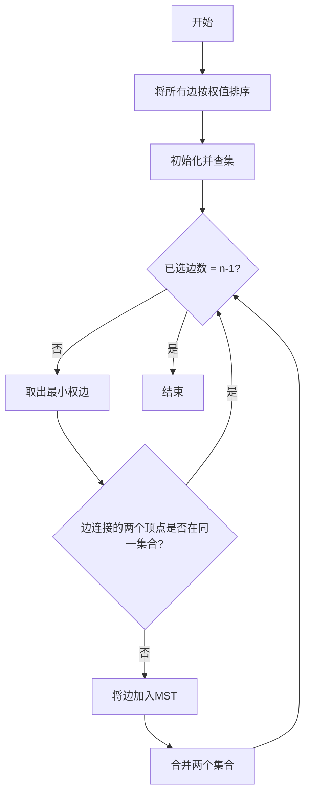

#### C++实现（并查集优化）

```cpp
#include <iostream>
#include <vector>
#include <algorithm>

using namespace std;

// 并查集（Union-Find）数据结构
class UnionFind {
private:
    vector<int> parent;  // 父节点数组
    vector<int> rank;    // 秩数组（用于优化）

public:
    UnionFind(int n) {
        parent.resize(n);
        rank.resize(n, 0);

        // 初始化：每个元素的父节点是自己
        for (int i = 0; i < n; ++i) {
            parent[i] = i;
        }
    }

    /**
     * 查找根节点（带路径压缩）
     * @param x 元素索引
     * @return 根节点索引
     */
    int find(int x) {
        if (parent[x] != x) {
            parent[x] = find(parent[x]);  // 路径压缩
        }
        return parent[x];
    }

    /**
     * 合并两个集合（按秩合并）
     * @param x 元素1的索引
     * @param y 元素2的索引
     * @return 是否合并成功
     */
    bool unionSets(int x, int y) {
        int rootX = find(x);
        int rootY = find(y);

        if (rootX == rootY) {
            return false;  // 已经在同一集合中
        }

        // 按秩合并
        if (rank[rootX] < rank[rootY]) {
            parent[rootX] = rootY;
        } else if (rank[rootX] > rank[rootY]) {
            parent[rootY] = rootX;
        } else {
            parent[rootY] = rootX;
            rank[rootX]++;
        }

        return true;
    }

    /**
     * 判断两个元素是否在同一集合
     */
    bool isConnected(int x, int y) {
        return find(x) == find(y);
    }
};

template <typename T>
class KruskalMST {
private:
    struct Edge {
        int from;
        int to;
        int weight;

        Edge(int f, int t, int w) : from(f), to(t), weight(w) {}

        // 排序需要的小于运算符
        bool operator<(const Edge& other) const {
            return weight < other.weight;
        }
    };

    vector<Edge> edges;  // 边列表
    vector<T> vertices;
    int vertexCount;

public:
    KruskalMST(int capacity) : vertexCount(0) {
        vertices.resize(capacity);
    }

    void addVertex(const T& vertex) {
        if (vertexCount >= vertices.size()) {
            vertices.resize(vertices.size() * 2);
        }
        vertices[vertexCount] = vertex;
        ++vertexCount;
    }

    void addEdge(int from, int to, int weight) {
        if (from < 0 || from >= vertexCount || to < 0 || to >= vertexCount) {
            throw out_of_range("顶点索引越界");
        }

        edges.push_back(Edge(from, to, weight));
    }

    /**
     * Kruskal算法求最小生成树
     * @return 最小生成树的边列表和总权值
     */
    pair<vector<Edge>, int> kruskal() {
        // 按权值排序边
        sort(edges.begin(), edges.end());

        // 初始化并查集
        UnionFind uf(vertexCount);

        vector<Edge> mstEdges;
        int totalWeight = 0;

        // 选择边
        for (const Edge& edge : edges) {
            // 如果边连接的两个顶点不在同一集合
            if (uf.unionSets(edge.from, edge.to)) {
                mstEdges.push_back(edge);
                totalWeight += edge.weight;

                // 如果已经选择了n-1条边，结束
                if (mstEdges.size() == vertexCount - 1) {
                    break;
                }
            }
        }

        return {mstEdges, totalWeight};
    }

    /**
     * 打印最小生成树
     */
    void printMST() {
        auto [mstEdges, totalWeight] = kruskal();

        cout << "最小生成树（Kruskal算法）：" << endl;
        cout << "总权值: " << totalWeight << endl;
        cout << "边：" << endl;

        for (const Edge& edge : mstEdges) {
            cout << vertices[edge.from] << " - " << vertices[edge.to]
                 << " (权值: " << edge.weight << ")" << endl;
        }

        if (mstEdges.size() < vertexCount - 1) {
            cout << "警告：图不连通，无法生成完整的最小生成树" << endl;
        }
    }
};
```

#### Kruskal算法示例

```cpp
void kruskal_example() {
    cout << "=== Kruskal算法示例 ===" << endl;

    KruskalMST<char> graph(5);

    // 添加顶点
    graph.addVertex('A');
    graph.addVertex('B');
    graph.addVertex('C');
    graph.addVertex('D');
    graph.addVertex('E');

    // 添加边（带权值）
    graph.addEdge(0, 1, 2);  // A-B: 2
    graph.addEdge(0, 3, 6);  // A-D: 6
    graph.addEdge(1, 2, 3);  // B-C: 3
    graph.addEdge(1, 3, 8);  // B-D: 8
    graph.addEdge(1, 4, 5);  // B-E: 5
    graph.addEdge(2, 4, 7);  // C-E: 7
    graph.addEdge(3, 4, 9);  // D-E: 9

    // 计算最小生成树
    graph.printMST();
}
```

#### 复杂度分析

| 操作 | 时间复杂度 | 说明 |
|------|-----------|------|
| **排序边** | O(e log e) | e为边数 |
| **并查集操作** | O(e α(n)) | α(n)为反阿克曼函数，近似O(1) |
| **总时间复杂度** | O(e log e) | 主要取决于排序 |
| **空间复杂度** | O(n+e) | 存储边和并查集 |

### 6.4.4 Prim vs Kruskal对比

| 特性 | Prim算法 | Kruskal算法 |
|------|----------|-------------|
| **策略** | 顶点驱动 | 边驱动 |
| **数据结构** | 优先队列 | 并查集 + 排序 |
| **时间复杂度** | O((n+e) log n) | O(e log e) |
| **适用场景** | 稠密图 | 稀疏图 |
| **实现难度** | 中等 | 较难（需要并查集） |

**选择建议**：

```cpp
// 稠密图（边数接近n²）→ Prim算法
if (edgeCount > vertexCount * vertexCount / 4) {
    use_prim_algorithm();
}

// 稀疏图（边数远小于n²）→ Kruskal算法
else {
    use_kruskal_algorithm();
}
```

---

## 6.5 最短路径

### 6.5.1 最短路径的概念

**定义**：
最短路径问题是指在一个加权图中，找出两个顶点之间路径权值之和最小的路径。

**分类**：
1. **单源最短路径**：从一个顶点到其他所有顶点的最短路径
2. **多源最短路径**：任意两个顶点之间的最短路径

**应用场景**：
- GPS导航
- 网络路由
- 社交网络关系分析

### 6.5.2 Dijkstra算法

#### 算法原理

**算法思想**：
1. 初始化：起始顶点到自己的距离为0，到其他顶点的距离为无穷大
2. 选择未访问顶点中距离最小的顶点
3. 更新该顶点所有邻接顶点的距离
4. 标记该顶点为已访问
5. 重复步骤2-4，直到所有顶点都被访问

**算法流程图**：

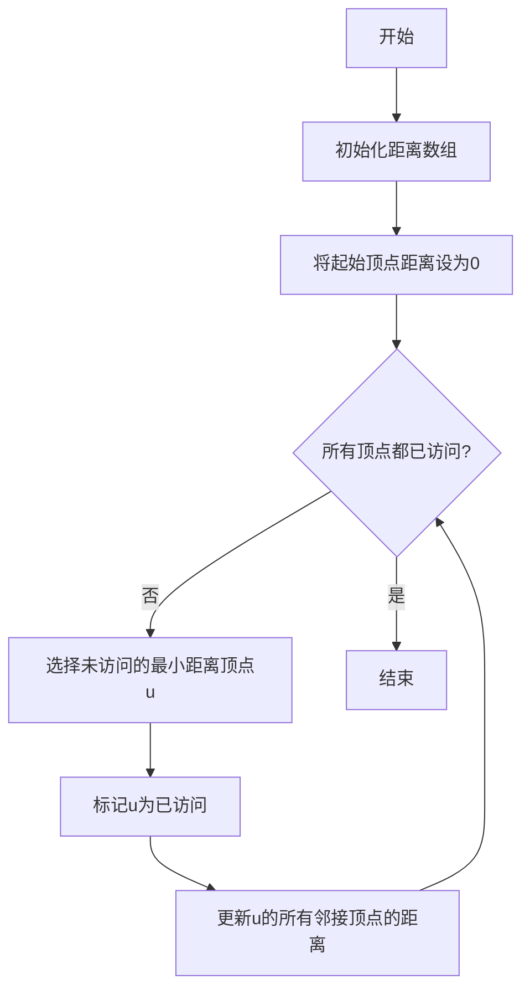

#### C++实现（优先队列优化）

```cpp
#include <iostream>
#include <vector>
#include <queue>
#include <climits>

using namespace std;

template <typename T>
class Dijkstra {
private:
    struct Edge {
        int to;
        int weight;

        Edge(int t, int w) : to(t), weight(w) {}
    };

    vector<vector<Edge>> adjList;
    vector<T> vertices;
    int vertexCount;

public:
    Dijkstra(int capacity) : vertexCount(0) {
        adjList.resize(capacity);
        vertices.resize(capacity);
    }

    void addVertex(const T& vertex) {
        if (vertexCount >= vertices.size()) {
            adjList.resize(adjList.size() * 2);
            vertices.resize(vertices.size() * 2);
        }
        vertices[vertexCount] = vertex;
        ++vertexCount;
    }

    void addEdge(int from, int to, int weight) {
        if (from < 0 || from >= vertexCount || to < 0 || to >= vertexCount) {
            throw out_of_range("顶点索引越界");
        }

        adjList[from].push_back(Edge(to, weight));
    }

    /**
     * Dijkstra算法求单源最短路径
     * @param start 起始顶点索引
     * @return 距离数组和前驱数组
     */
    pair<vector<int>, vector<int>> dijkstra(int start) {
        vector<int> distance(vertexCount, INT_MAX);
        vector<int> parent(vertexCount, -1);
        vector<bool> visited(vertexCount, false);

        // 优先队列：{距离, 顶点}
        priority_queue<pair<int, int>, vector<pair<int, int>>, greater<pair<int, int>>> pq;

        distance[start] = 0;
        pq.push({0, start});

        while (!pq.empty()) {
            int u = pq.top().second;
            int dist = pq.top().first;
            pq.pop();

            // 如果已经访问过，跳过
            if (visited[u]) {
                continue;
            }

            visited[u] = true;

            // 更新邻接顶点的距离
            for (const Edge& edge : adjList[u]) {
                int v = edge.to;
                int weight = edge.weight;

                if (!visited[v] && distance[u] != INT_MAX &&
                    distance[u] + weight < distance[v]) {
                    distance[v] = distance[u] + weight;
                    parent[v] = u;
                    pq.push({distance[v], v});
                }
            }
        }

        return {distance, parent};
    }

    /**
     * 打印最短路径
     * @param start 起始顶点索引
     */
    void printShortestPaths(int start) {
        auto [distance, parent] = dijkstra(start);

        cout << "从 " << vertices[start] << " 到各顶点的最短路径：" << endl;

        for (int i = 0; i < vertexCount; ++i) {
            cout << vertices[start] << " -> " << vertices[i] << ": ";

            if (distance[i] == INT_MAX) {
                cout << "不可达" << endl;
            } else {
                cout << "距离 = " << distance[i] << ", 路径: ";
                printPath(parent, i);
                cout << endl;
            }
        }
    }

    /**
     * 打印路径
     */
    void printPath(const vector<int>& parent, int v) {
        if (parent[v] == -1) {
            cout << vertices[v];
        } else {
            printPath(parent, parent[v]);
            cout << " -> " << vertices[v];
        }
    }
};
```

#### Dijkstra算法示例

```cpp
void dijkstra_example() {
    cout << "=== Dijkstra算法示例 ===" << endl;

    Dijkstra<char> graph(6);

    // 添加顶点
    graph.addVertex('A');
    graph.addVertex('B');
    graph.addVertex('C');
    graph.addVertex('D');
    graph.addVertex('E');
    graph.addVertex('F');

    // 添加边（有向带权图）
    graph.addEdge(0, 1, 4);  // A -> B: 4
    graph.addEdge(0, 2, 2);  // A -> C: 2
    graph.addEdge(1, 2, 1);  // B -> C: 1
    graph.addEdge(1, 3, 5);  // B -> D: 5
    graph.addEdge(2, 3, 8);  // C -> D: 8
    graph.addEdge(2, 4, 10); // C -> E: 10
    graph.addEdge(3, 4, 2);  // D -> E: 2
    graph.addEdge(3, 5, 6);  // D -> F: 6
    graph.addEdge(4, 5, 3);  // E -> F: 3

    // 计算最短路径
    graph.printShortestPaths(0);
}
```

#### 复杂度分析

| 实现方式 | 时间复杂度 | 空间复杂度 |
|----------|-----------|-----------|
| **数组实现** | O(n²) | O(n) |
| **二叉堆实现** | O((n+e) log n) | O(n+e) |
| **斐波那契堆实现** | O(n log n + e) | O(n+e) |

#### 局限性

Dijkstra算法不能处理负权边。如果图中存在负权边，需要使用Bellman-Ford算法。

### 6.5.3 Floyd-Warshall算法

#### 算法原理

**算法思想**：
Floyd-Warshall算法用于求解所有顶点对之间的最短路径。它使用动态规划，通过逐步考虑中间顶点来更新最短路径。

**状态转移方程**：
```
dist[i][j] = min(dist[i][j], dist[i][k] + dist[k][j])
```
其中k为中间顶点。

#### C++实现

```cpp
#include <iostream>
#include <vector>
#include <climits>

using namespace std;

template <typename T>
class FloydWarshall {
private:
    vector<vector<int>> dist;  // 距离矩阵
    vector<vector<int>> next;  // 路径矩阵
    vector<T> vertices;
    int vertexCount;

public:
    FloydWarshall(int capacity) : vertexCount(0) {
        vertices.resize(capacity);
        dist.assign(capacity, vector<int>(capacity, INT_MAX));
        next.assign(capacity, vector<int>(capacity, -1));
    }

    void addVertex(const T& vertex) {
        if (vertexCount >= vertices.size()) {
            int newSize = vertices.size() * 2;
            vertices.resize(newSize);
            dist.resize(newSize, vector<int>(newSize, INT_MAX));
            next.resize(newSize, vector<int>(newSize, -1));
        }

        vertices[vertexCount] = vertex;
        dist[vertexCount][vertexCount] = 0;  // 自己到自己的距离为0
        ++vertexCount;
    }

    void addEdge(int from, int to, int weight) {
        if (from < 0 || from >= vertexCount || to < 0 || to >= vertexCount) {
            throw out_of_range("顶点索引越界");
        }

        dist[from][to] = weight;
        next[from][to] = to;
    }

    /**
     * Floyd-Warshall算法
     */
    void floydWarshall() {
        // 三重循环
        for (int k = 0; k < vertexCount; ++k) {
            for (int i = 0; i < vertexCount; ++i) {
                for (int j = 0; j < vertexCount; ++j) {
                    // 如果通过k可以缩短i到j的距离
                    if (dist[i][k] != INT_MAX && dist[k][j] != INT_MAX &&
                        dist[i][k] + dist[k][j] < dist[i][j]) {
                        dist[i][j] = dist[i][k] + dist[k][j];
                        next[i][j] = next[i][k];
                    }
                }
            }
        }
    }

    /**
     * 打印所有顶点对之间的最短路径
     */
    void printAllShortestPaths() {
        floydWarshall();

        cout << "所有顶点对之间的最短路径：" << endl;

        for (int i = 0; i < vertexCount; ++i) {
            for (int j = 0; j < vertexCount; ++j) {
                if (i != j) {
                    cout << vertices[i] << " -> " << vertices[j] << ": ";

                    if (dist[i][j] == INT_MAX) {
                        cout << "不可达" << endl;
                    } else {
                        cout << "距离 = " << dist[i][j] << ", 路径: ";
                        printPath(i, j);
                        cout << endl;
                    }
                }
            }
        }
    }

    /**
     * 打印路径
     */
    void printPath(int from, int to) {
        if (next[from][to] == -1) {
            cout << "无路径";
            return;
        }

        cout << vertices[from];
        int current = from;

        while (current != to) {
            current = next[current][to];
            cout << " -> " << vertices[current];
        }
    }

    /**
     * 获取两点之间的距离
     */
    int getDistance(int from, int to) {
        return dist[from][to];
    }
};
```

#### Floyd-Warshall算法示例

```cpp
void floyd_warshall_example() {
    cout << "=== Floyd-Warshall算法示例 ===" << endl;

    FloydWarshall<char> graph(4);

    // 添加顶点
    graph.addVertex('A');
    graph.addVertex('B');
    graph.addVertex('C');
    graph.addVertex('D');

    // 添加边（有向带权图）
    graph.addEdge(0, 1, 3);  // A -> B: 3
    graph.addEdge(0, 2, 6);  // A -> C: 6
    graph.addEdge(0, 3, 15); // A -> D: 15
    graph.addEdge(1, 2, -2); // B -> C: -2
    graph.addEdge(2, 3, 2);  // C -> D: 2

    // 计算所有最短路径
    graph.printAllShortestPaths();
}
```

#### 复杂度分析

| 复杂度类型 | 值 | 说明 |
|-----------|-----|------|
| **时间复杂度** | O(n³) | 三重循环 |
| **空间复杂度** | O(n²) | 存储距离矩阵和路径矩阵 |

### 6.5.4 Bellman-Ford算法

#### 算法原理

**算法思想**：
Bellman-Ford算法可以处理带负权边的图，并能检测负权环。它通过松弛操作逐步更新最短路径。

**算法步骤**：
1. 初始化：起始顶点到自己的距离为0，到其他顶点的距离为无穷大
2. 进行n-1次松弛操作
3. 检查是否存在负权环

#### C++实现

```cpp
#include <iostream>
#include <vector>
#include <climits>

using namespace std;

template <typename T>
class BellmanFord {
private:
    struct Edge {
        int from;
        int to;
        int weight;

        Edge(int f, int t, int w) : from(f), to(t), weight(w) {}
    };

    vector<Edge> edges;
    vector<T> vertices;
    int vertexCount;

public:
    BellmanFord(int capacity) : vertexCount(0) {
        vertices.resize(capacity);
    }

    void addVertex(const T& vertex) {
        if (vertexCount >= vertices.size()) {
            vertices.resize(vertices.size() * 2);
        }
        vertices[vertexCount] = vertex;
        ++vertexCount;
    }

    void addEdge(int from, int to, int weight) {
        if (from < 0 || from >= vertexCount || to < 0 || to >= vertexCount) {
            throw out_of_range("顶点索引越界");
        }

        edges.push_back(Edge(from, to, weight));
    }

    /**
     * Bellman-Ford算法
     * @param start 起始顶点索引
     * @return 是否成功（是否有负权环）
     */
    bool bellmanFord(int start) {
        vector<int> distance(vertexCount, INT_MAX);
        vector<int> parent(vertexCount, -1);

        distance[start] = 0;

        // 松弛n-1次
        for (int i = 0; i < vertexCount - 1; ++i) {
            for (const Edge& edge : edges) {
                if (distance[edge.from] != INT_MAX &&
                    distance[edge.from] + edge.weight < distance[edge.to]) {
                    distance[edge.to] = distance[edge.from] + edge.weight;
                    parent[edge.to] = edge.from;
                }
            }
        }

        // 检查负权环
        for (const Edge& edge : edges) {
            if (distance[edge.from] != INT_MAX &&
                distance[edge.from] + edge.weight < distance[edge.to]) {
                cout << "警告：图中存在负权环！" << endl;
                return false;
            }
        }

        // 打印结果
        cout << "从 " << vertices[start] << " 到各顶点的最短路径：" << endl;

        for (int i = 0; i < vertexCount; ++i) {
            cout << vertices[start] << " -> " << vertices[i] << ": ";

            if (distance[i] == INT_MAX) {
                cout << "不可达" << endl;
            } else {
                cout << "距离 = " << distance[i] << ", 路径: ";
                printPath(parent, i);
                cout << endl;
            }
        }

        return true;
    }

    /**
     * 打印路径
     */
    void printPath(const vector<int>& parent, int v) {
        if (parent[v] == -1) {
            cout << vertices[v];
        } else {
            printPath(parent, parent[v]);
            cout << " -> " << vertices[v];
        }
    }
};
```

#### Bellman-Ford算法示例

```cpp
void bellman_ford_example() {
    cout << "=== Bellman-Ford算法示例 ===" << endl;

    BellmanFord<char> graph(5);

    // 添加顶点
    graph.addVertex('A');
    graph.addVertex('B');
    graph.addVertex('C');
    graph.addVertex('D');
    graph.addVertex('E');

    // 添加边（有向带权图，包含负权边）
    graph.addEdge(0, 1, 6);  // A -> B: 6
    graph.addEdge(0, 3, 7);  // A -> D: 7
    graph.addEdge(1, 2, 5);  // B -> C: 5
    graph.addEdge(1, 3, 8);  // B -> D: 8
    graph.addEdge(1, 4, -4); // B -> E: -4
    graph.addEdge(2, 1, -2); // C -> B: -2
    graph.addEdge(3, 2, -3); // D -> C: -3
    graph.addEdge(3, 4, 9);  // D -> E: 9
    graph.addEdge(4, 0, 2);  // E -> A: 2
    graph.addEdge(4, 2, 7);  // E -> C: 7

    // 计算最短路径
    graph.bellmanFord(0);
}
```

#### 复杂度分析

| 复杂度类型 | 值 | 说明 |
|-----------|-----|------|
| **时间复杂度** | O(n·e) | n为顶点数，e为边数 |
| **空间复杂度** | O(n+e) | 存储边和距离数组 |

### 6.5.5 最短路径算法对比

| 算法 | 适用场景 | 时间复杂度 | 是否支持负权边 | 是否支持负权环 |
|------|----------|-----------|---------------|---------------|
| **Dijkstra** | 非负权图 | O((n+e) log n) | 否 | 否 |
| **Floyd-Warshall** | 所有顶点对 | O(n³) | 是 | 否 |
| **Bellman-Ford** | 带负权边 | O(n·e) | 是 | 可检测 |

**选择建议**：

```cpp
// 非负权图，单源最短路径 → Dijkstra
if (!hasNegativeEdges && singleSource) {
    use_dijkstra();
}

// 非负权图，多源最短路径 → Floyd-Warshall
if (!hasNegativeEdges && allPairs) {
    use_floyd_warshall();
}

// 带负权边 → Bellman-Ford
if (hasNegativeEdges) {
    use_bellman_ford();
}
```

---

## 6.6 拓扑排序

### 6.6.1 拓扑排序的概念

**定义**：
拓扑排序是对有向无环图（DAG）的所有顶点进行排序，使得对于图中的每一条有向边(u, v)，顶点u在排序中都出现在顶点v之前。

**应用场景**：
- 课程安排
- 任务调度
- 编译依赖关系

**示例**：

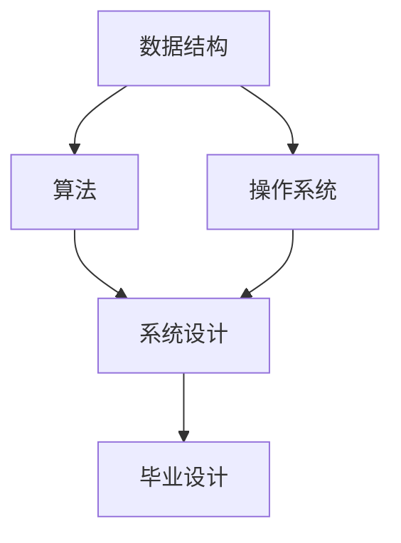

可能的拓扑排序：
- 数据结构 → 算法 → 操作系统 → 系统设计 → 毕业设计
- 数据结构 → 操作系统 → 算法 → 系统设计 → 毕业设计

### 6.6.2 Kahn算法

#### 算法原理

**算法思想**：
1. 计算所有顶点的入度
2. 将入度为0的顶点入队
3. 从队列中取出顶点，输出
4. 将该顶点的所有邻接顶点的入度减1
5. 如果邻接顶点的入度变为0，将其入队
6. 重复步骤3-5，直到队列为空

#### C++实现

```cpp
#include <iostream>
#include <vector>
#include <queue>

using namespace std;

template <typename T>
class TopologicalSort {
private:
    vector<vector<int>> adjList;
    vector<T> vertices;
    int vertexCount;

public:
    TopologicalSort(int capacity) : vertexCount(0) {
        adjList.resize(capacity);
        vertices.resize(capacity);
    }

    void addVertex(const T& vertex) {
        if (vertexCount >= vertices.size()) {
            adjList.resize(adjList.size() * 2);
            vertices.resize(vertices.size() * 2);
        }
        vertices[vertexCount] = vertex;
        ++vertexCount;
    }

    void addEdge(int from, int to) {
        if (from < 0 || from >= vertexCount || to < 0 || to >= vertexCount) {
            throw out_of_range("顶点索引越界");
        }

        adjList[from].push_back(to);
    }

    /**
     * Kahn算法求拓扑排序
     * @return 拓扑排序结果和是否成功
     */
    pair<vector<int>, bool> kahn() {
        vector<int> inDegree(vertexCount, 0);

        // 计算入度
        for (int u = 0; u < vertexCount; ++u) {
            for (int v : adjList[u]) {
                ++inDegree[v];
            }
        }

        // 入度为0的顶点入队
        queue<int> q;
        for (int i = 0; i < vertexCount; ++i) {
            if (inDegree[i] == 0) {
                q.push(i);
            }
        }

        vector<int> result;
        int count = 0;

        while (!q.empty()) {
            int u = q.front();
            q.pop();

            result.push_back(u);
            ++count;

            // 减少邻接顶点的入度
            for (int v : adjList[u]) {
                --inDegree[v];
                if (inDegree[v] == 0) {
                    q.push(v);
                }
            }
        }

        // 如果count不等于vertexCount，说明有环
        bool success = (count == vertexCount);
        return {result, success};
    }

    /**
     * 打印拓扑排序
     */
    void printTopologicalSort() {
        auto [result, success] = kahn();

        if (success) {
            cout << "拓扑排序结果：";
            for (int v : result) {
                cout << vertices[v] << " ";
            }
            cout << endl;
        } else {
            cout << "警告：图中存在环，无法进行拓扑排序！" << endl;
        }
    }

    /**
     * 检测图中是否有环
     */
    bool hasCycle() {
        auto [result, success] = kahn();
        return !success;
    }
};
```

#### Kahn算法示例

```cpp
void topological_sort_example() {
    cout << "=== 拓扑排序示例 ===" << endl;

    TopologicalSort<string> graph(6);

    // 添加顶点
    graph.addVertex("数据结构");
    graph.addVertex("算法");
    graph.addVertex("操作系统");
    graph.addVertex("系统设计");
    graph.addVertex("毕业设计");
    graph.addVertex("数据库");

    // 添加边
    graph.addEdge(0, 1);  // 数据结构 → 算法
    graph.addEdge(0, 2);  // 数据结构 → 操作系统
    graph.addEdge(1, 3);  // 算法 → 系统设计
    graph.addEdge(2, 3);  // 操作系统 → 系统设计
    graph.addEdge(3, 4);  // 系统设计 → 毕业设计
    graph.addEdge(0, 5);  // 数据结构 → 数据库

    // 拓扑排序
    graph.printTopologicalSort();
}
```

### 6.6.3 基于DFS的拓扑排序

#### 算法原理

**算法思想**：
1. 对每个未访问的顶点进行DFS
2. 在DFS过程中，当一个顶点的所有邻接顶点都被访问后，将该顶点加入结果列表的头部
3. 最后得到的列表就是拓扑排序的结果

#### C++实现

```cpp
/**
 * 基于DFS的拓扑排序
 * @return 拓扑排序结果和是否成功
 */
pair<vector<int>, bool> dfsTopologicalSort() {
    vector<bool> visited(vertexCount, false);
    vector<bool> onStack(vertexCount, false);
    vector<int> result;

    for (int i = 0; i < vertexCount; ++i) {
        if (!visited[i]) {
            if (!dfsUtil(i, visited, onStack, result)) {
                return {result, false};  // 存在环
            }
        }
    }

    reverse(result.begin(), result.end());
    return {result, true};
}

/**
 * DFS辅助函数
 */
bool dfsUtil(int v, vector<bool>& visited, vector<bool>& onStack, vector<int>& result) {
    visited[v] = true;
    onStack[v] = true;

    for (int neighbor : adjList[v]) {
        if (!visited[neighbor]) {
            if (!dfsUtil(neighbor, visited, onStack, result)) {
                return false;
            }
        } else if (onStack[neighbor]) {
            return false;  // 存在环
        }
    }

    onStack[v] = false;
    result.push_back(v);
    return true;
}
```

### 6.6.4 复杂度分析

| 算法 | 时间复杂度 | 空间复杂度 |
|------|-----------|-----------|
| **Kahn算法** | O(n+e) | O(n) |
| **DFS算法** | O(n+e) | O(n) |

---

## 6.7 关键路径

### 6.7.1 关键路径的概念

**定义**：
关键路径（Critical Path）是有向无环图中从源点到汇点的最长路径。关键路径上的活动称为关键活动，它们的延迟会直接影响整个项目的完成时间。

**相关概念**：
- **最早开始时间（ES）**：活动最早可以开始的时间
- **最晚开始时间（LS）**：活动最晚必须开始的时间
- **最早完成时间（EF）**：活动最早可以完成的时间
- **最晚完成时间（LF）**：活动最晚必须完成的时间
- **活动时间余量（Slack）**：LS - ES 或 LF - EF

**应用场景**：
- 项目管理
- 工程规划
- 资源调度

### 6.7.2 关键路径算法

#### C++实现

```cpp
#include <iostream>
#include <vector>
#include <queue>
#include <algorithm>

using namespace std;

template <typename T>
class CriticalPath {
private:
    struct Edge {
        int to;
        int weight;

        Edge(int t, int w) : to(t), weight(w) {}
    };

    vector<vector<Edge>> adjList;
    vector<vector<Edge>> reverseAdjList;  // 反向邻接表
    vector<T> vertices;
    int vertexCount;

public:
    CriticalPath(int capacity) : vertexCount(0) {
        adjList.resize(capacity);
        reverseAdjList.resize(capacity);
        vertices.resize(capacity);
    }

    void addVertex(const T& vertex) {
        if (vertexCount >= vertices.size()) {
            int newSize = vertices.size() * 2;
            adjList.resize(newSize);
            reverseAdjList.resize(newSize);
            vertices.resize(newSize);
        }
        vertices[vertexCount] = vertex;
        ++vertexCount;
    }

    void addEdge(int from, int to, int weight) {
        if (from < 0 || from >= vertexCount || to < 0 || to >= vertexCount) {
            throw out_of_range("顶点索引越界");
        }

        adjList[from].push_back(Edge(to, weight));
        reverseAdjList[to].push_back(Edge(from, weight));
    }

    /**
     * 计算关键路径
     */
    void findCriticalPath() {
        // 计算入度
        vector<int> inDegree(vertexCount, 0);
        for (int u = 0; u < vertexCount; ++u) {
            for (const Edge& edge : adjList[u]) {
                ++inDegree[edge.to];
            }
        }

        // 拓扑排序
        vector<int> topoOrder;
        queue<int> q;
        for (int i = 0; i < vertexCount; ++i) {
            if (inDegree[i] == 0) {
                q.push(i);
            }
        }

        while (!q.empty()) {
            int u = q.front();
            q.pop();
            topoOrder.push_back(u);

            for (const Edge& edge : adjList[u]) {
                --inDegree[edge.to];
                if (inDegree[edge.to] == 0) {
                    q.push(edge.to);
                }
            }
        }

        // 计算最早开始时间（正推）
        vector<int> earliest(vertexCount, 0);
        for (int u : topoOrder) {
            for (const Edge& edge : adjList[u]) {
                if (earliest[u] + edge.weight > earliest[edge.to]) {
                    earliest[edge.to] = earliest[u] + edge.weight;
                }
            }
        }

        // 计算最晚开始时间（逆推）
        int projectDuration = *max_element(earliest.begin(), earliest.end());
        vector<int> latest(vertexCount, projectDuration);

        for (auto it = topoOrder.rbegin(); it != topoOrder.rend(); ++it) {
            int u = *it;
            for (const Edge& edge : reverseAdjList[u]) {
                if (latest[edge.to] - edge.weight < latest[u]) {
                    latest[u] = latest[edge.to] - edge.weight;
                }
            }
        }

        // 计算时间余量
        vector<int> slack(vertexCount);
        for (int i = 0; i < vertexCount; ++i) {
            slack[i] = latest[i] - earliest[i];
        }

        // 输出结果
        cout << "关键路径分析：" << endl;
        cout << "项目总工期: " << projectDuration << endl << endl;

        cout << "顶点\t最早开始\t最晚开始\t时间余量\t是否关键" << endl;
        cout << "------------------------------------------------" << endl;

        for (int i = 0; i < vertexCount; ++i) {
            cout << vertices[i] << "\t"
                 << earliest[i] << "\t\t"
                 << latest[i] << "\t\t"
                 << slack[i] << "\t\t";

            if (slack[i] == 0) {
                cout << "是";
            } else {
                cout << "否";
            }
            cout << endl;
        }

        // 输出关键路径
        cout << "\n关键路径: ";
        printCriticalPath(earliest, latest, topoOrder);
        cout << endl;
    }

    /**
     * 打印关键路径
     */
    void printCriticalPath(const vector<int>& earliest, const vector<int>& latest,
                          const vector<int>& topoOrder) {
        for (int i = 0; i < vertexCount; ++i) {
            if (earliest[i] == latest[i]) {
                bool isCritical = true;
                for (const Edge& edge : adjList[i]) {
                    if (earliest[edge.to] != latest[edge.to]) {
                        isCritical = false;
                        break;
                    }
                }
                if (isCritical) {
                    cout << vertices[i] << " ";
                }
            }
        }
    }
};
```

#### 关键路径示例

```cpp
void critical_path_example() {
    cout << "=== 关键路径示例 ===" << endl;

    CriticalPath<string> graph(9);

    // 添加顶点
    graph.addVertex("开始");
    graph.addVertex("需求分析");
    graph.addVertex("系统设计");
    graph.addVertex("编码");
    graph.addVertex("测试");
    graph.addVertex("部署");
    graph.addVertex("文档");
    graph.addVertex("培训");
    graph.addVertex("结束");

    // 添加边（活动）
    graph.addEdge(0, 1, 3);  // 开始 → 需求分析: 3天
    graph.addEdge(1, 2, 4);  // 需求分析 → 系统设计: 4天
    graph.addEdge(2, 3, 8);  // 系统设计 → 编码: 8天
    graph.addEdge(3, 4, 5);  // 编码 → 测试: 5天
    graph.addEdge(4, 5, 2);  // 测试 → 部署: 2天
    graph.addEdge(5, 8, 1);  // 部署 → 结束: 1天
    graph.addEdge(2, 6, 6);  // 系统设计 → 文档: 6天
    graph.addEdge(6, 8, 1);  // 文档 → 结束: 1天
    graph.addEdge(4, 7, 3);  // 测试 → 培训: 3天
    graph.addEdge(7, 8, 2);  // 培训 → 结束: 2天

    // 计算关键路径
    graph.findCriticalPath();
}
```

### 6.7.3 复杂度分析

| 复杂度类型 | 值 | 说明 |
|-----------|-----|------|
| **时间复杂度** | O(n+e) | 拓扑排序 + 正推 + 逆推 |
| **空间复杂度** | O(n+e) | 存储邻接表和时间数组 |

---

## 6.8 图的应用实例

### 6.8.1 社交网络分析

```cpp
/**
 * 社交网络分析类
 */
class SocialNetwork {
private:
    vector<vector<int>> friends;  // 好友关系
    vector<string> users;
    int userCount;

public:
    SocialNetwork(int capacity) : userCount(0) {
        friends.resize(capacity);
        users.resize(capacity);
    }

    void addUser(const string& name) {
        if (userCount >= users.size()) {
            friends.resize(friends.size() * 2);
            users.resize(users.size() * 2);
        }
        users[userCount] = name;
        ++userCount;
    }

    void addFriendship(int user1, int user2) {
        friends[user1].push_back(user2);
        friends[user2].push_back(user1);
    }

    /**
     * 计算共同好友数量
     */
    int commonFriends(int user1, int user2) {
        vector<bool> friendsOfUser1(userCount, false);

        for (int friendId : friends[user1]) {
            friendsOfUser1[friendId] = true;
        }

        int count = 0;
        for (int friendId : friends[user2]) {
            if (friendsOfUser1[friendId]) {
                ++count;
            }
        }

        return count;
    }

    /**
     * 推荐好友（基于共同好友）
     */
    vector<int> recommendFriends(int userId, int topK = 5) {
        vector<pair<int, int>> recommendations;  // {用户ID, 共同好友数}

        for (int i = 0; i < userCount; ++i) {
            if (i != userId && find(friends[userId].begin(),
                                   friends[userId].end(), i) == friends[userId].end()) {
                int common = commonFriends(userId, i);
                if (common > 0) {
                    recommendations.push_back({i, common});
                }
            }
        }

        // 按共同好友数排序
        sort(recommendations.begin(), recommendations.end(),
             [](const auto& a, const auto& b) {
                 return a.second > b.second;
             });

        // 返回前topK个推荐
        vector<int> result;
        for (int i = 0; i < min(topK, (int)recommendations.size()); ++i) {
            result.push_back(recommendations[i].first);
        }

        return result;
    }

    /**
     * 计算用户的影响力（好友数量）
     */
    int calculateInfluence(int userId) {
        return friends[userId].size();
    }
};
```

### 6.8.2 网页排名（PageRank简化版）

```cpp
/**
 * PageRank简化实现
 */
class PageRank {
private:
    vector<vector<int>> links;  // 网页链接
    vector<double> rank;        // PageRank值
    int pageCount;

public:
    PageRank(int capacity) : pageCount(0) {
        links.resize(capacity);
        rank.resize(capacity, 1.0);
    }

    void addPage() {
        if (pageCount >= links.size()) {
            links.resize(links.size() * 2);
            rank.resize(rank.size() * 2, 1.0);
        }
        ++pageCount;
    }

    void addLink(int from, int to) {
        links[from].push_back(to);
    }

    /**
     * 计算PageRank值
     * @param iterations 迭代次数
     * @param dampingFactor 阻尼因子（通常为0.85）
     */
    void calculatePageRank(int iterations = 100, double dampingFactor = 0.85) {
        int n = pageCount;
        vector<double> newRank(n);

        for (int iter = 0; iter < iterations; ++iter) {
            for (int i = 0; i < n; ++i) {
                newRank[i] = (1 - dampingFactor) / n;  // 随机跳转部分

                // 计算从其他网页来的贡献
                for (int j = 0; j < n; ++j) {
                    int outDegree = links[j].size();
                    if (outDegree > 0) {
                        for (int link : links[j]) {
                            if (link == i) {
                                newRank[i] += dampingFactor * rank[j] / outDegree;
                            }
                        }
                    }
                }
            }

            // 更新PageRank值
            rank = newRank;
        }
    }

    /**
     * 获取PageRank值
     */
    double getRank(int pageId) {
        return rank[pageId];
    }

    /**
     * 打印PageRank排名
     */
    void printRanking() {
        vector<pair<int, double>> ranking;
        for (int i = 0; i < pageCount; ++i) {
            ranking.push_back({i, rank[i]});
        }

        sort(ranking.begin(), ranking.end(),
             [](const auto& a, const auto& b) {
                 return a.second > b.second;
             });

        cout << "PageRank排名：" << endl;
        for (int i = 0; i < ranking.size(); ++i) {
            cout << i + 1 << ". 网页" << ranking[i].first
                 << ": " << ranking[i].second << endl;
        }
    }
};
```

---

## 6.9 图算法复杂度总结

### 6.9.1 时间复杂度对比

| 算法 | 时间复杂度 | 适用场景 |
|------|-----------|----------|
| **DFS** | O(n+e) | 连通性检测、拓扑排序 |
| **BFS** | O(n+e) | 最短路径（无权图）、层次遍历 |
| **Prim算法** | O((n+e) log n) | 最小生成树（稠密图） |
| **Kruskal算法** | O(e log e) | 最小生成树（稀疏图） |
| **Dijkstra算法** | O((n+e) log n) | 最短路径（非负权图） |
| **Floyd-Warshall算法** | O(n³) | 所有顶点对最短路径 |
| **Bellman-Ford算法** | O(n·e) | 最短路径（带负权边） |
| **Kahn算法** | O(n+e) | 拓扑排序 |
| **关键路径算法** | O(n+e) | 关键路径分析 |

### 6.9.2 空间复杂度对比

| 算法 | 空间复杂度 | 说明 |
|------|-----------|------|
| **邻接矩阵** | O(n²) | 适合稠密图 |
| **邻接表** | O(n+e) | 适合稀疏图 |
| **DFS** | O(n) | 递归栈或显式栈 |
| **BFS** | O(n) | 队列 |
| **Dijkstra算法** | O(n+e) | 优先队列 |
| **Floyd-Warshall算法** | O(n²) | 距离矩阵 |
| **Bellman-Ford算法** | O(n+e) | 边列表和距离数组 |

---

## 6.10 LeetCode题目

### 6.10.1 基础题目

| 题号 | 题目名称 | 难度 | 核心知识点 | 状态 |
|------|----------|------|-----------|------|
| 200 | 岛屿数量 | 中等 | DFS/BFS | ⏳ |
| 207 | 课程表 | 中等 | 拓扑排序 | ⏳ |
| 133 | 克隆图 | 中等 | DFS/BFS | ⏳ |
| 417 | 太平洋大西洋水流问题 | 中等 | DFS/BFS | ⏳ |
| 733 | 图像渲染 | 简单 | DFS/BFS | ⏳ |
| 547 | 省份数量 | 中等 | DFS/BFS/并查集 | ⏳ |

#### 200. 岛屿数量

```cpp
/**
 * LeetCode 200. 岛屿数量
 * 给你一个由 '1'（陆地）和 '0'（水）组成的的二维网格，请你计算网格中岛屿的数量。
 */
class Solution {
private:
    int rows, cols;

    void dfs(vector<vector<char>>& grid, int i, int j) {
        // 边界检查
        if (i < 0 || i >= rows || j < 0 || j >= cols) {
            return;
        }

        // 如果不是陆地，返回
        if (grid[i][j] != '1') {
            return;
        }

        // 标记为已访问
        grid[i][j] = '0';

        // 递归访问四个方向
        dfs(grid, i + 1, j);  // 下
        dfs(grid, i - 1, j);  // 上
        dfs(grid, i, j + 1);  // 右
        dfs(grid, i, j - 1);  // 左
    }

public:
    int numIslands(vector<vector<char>>& grid) {
        rows = grid.size();
        if (rows == 0) return 0;
        cols = grid[0].size();

        int count = 0;
        for (int i = 0; i < rows; ++i) {
            for (int j = 0; j < cols; ++j) {
                if (grid[i][j] == '1') {
                    ++count;
                    dfs(grid, i, j);
                }
            }
        }

        return count;
    }
};
```

#### 207. 课程表

```cpp
/**
 * LeetCode 207. 课程表
 * 你这个学期必须选修 numCourses 门课程，记为 0 到 numCourses-1。
 * 在选修某些课程之前需要一些先修课程。先修课程按数组 prerequisites 给出。
 * 判断是否可能完成所有课程的学习？
 */
class Solution {
public:
    bool canFinish(int numCourses, vector<vector<int>>& prerequisites) {
        // 构建邻接表
        vector<vector<int>> adjList(numCourses);
        vector<int> inDegree(numCourses, 0);

        for (const auto& prereq : prerequisites) {
            int course = prereq[0];
            int prereqCourse = prereq[1];
            adjList[prereqCourse].push_back(course);
            ++inDegree[course];
        }

        // Kahn算法
        queue<int> q;
        for (int i = 0; i < numCourses; ++i) {
            if (inDegree[i] == 0) {
                q.push(i);
            }
        }

        int count = 0;
        while (!q.empty()) {
            int course = q.front();
            q.pop();
            ++count;

            for (int nextCourse : adjList[course]) {
                --inDegree[nextCourse];
                if (inDegree[nextCourse] == 0) {
                    q.push(nextCourse);
                }
            }
        }

        return count == numCourses;
    }
};
```

#### 133. 克隆图

```cpp
/**
 * LeetCode 133. 克隆图
 * 给你无向连通图中一个节点的引用，请你返回该图的深拷贝（克隆）。
 */
class Solution {
private:
    unordered_map<Node*, Node*> visited;

public:
    Node* cloneGraph(Node* node) {
        if (node == nullptr) {
            return nullptr;
        }

        // 如果已经访问过，直接返回克隆节点
        if (visited.find(node) != visited.end()) {
            return visited[node];
        }

        // 克隆节点
        Node* clonedNode = new Node(node->val);
        visited[node] = clonedNode;

        // 克隆所有邻居
        for (Node* neighbor : node->neighbors) {
            clonedNode->neighbors.push_back(cloneGraph(neighbor));
        }

        return clonedNode;
    }
};
```

### 6.10.2 中级题目

| 题号 | 题目名称 | 难度 | 核心知识点 | 状态 |
|------|----------|------|-----------|------|
| 210 | 课程表 II | 中等 | 拓扑排序 | ⏳ |
| 399 | 除法求值 | 中等 | DFS/BFS | ⏳ |
| 695 | 岛屿的最大面积 | 中等 | DFS/BFS | ⏳ |
| 332 | 重新安排行程 | 困难 | DFS/欧拉路径 | ⏳ |
| 994 | 腐烂的橘子 | 中等 | BFS | ⏳ |
| 785 | 判断二分图 | 中等 | BFS/DFS | ⏳ |

#### 210. 课程表 II

```cpp
/**
 * LeetCode 210. 课程表 II
 * 现在你总共有 numCourses 门课需要选，记为 0 到 numCourses-1。
 * 给定一个数组 prerequisites ，其中 prerequisites[i] = [ai, bi] ，
 * 表示在选修课程 ai 前必须先选修 bi 。
 * 返回你为了学完所有课程所安排的学习顺序。
 */
class Solution {
public:
    vector<int> findOrder(int numCourses, vector<vector<int>>& prerequisites) {
        // 构建邻接表
        vector<vector<int>> adjList(numCourses);
        vector<int> inDegree(numCourses, 0);

        for (const auto& prereq : prerequisites) {
            int course = prereq[0];
            int prereqCourse = prereq[1];
            adjList[prereqCourse].push_back(course);
            ++inDegree[course];
        }

        // Kahn算法
        queue<int> q;
        for (int i = 0; i < numCourses; ++i) {
            if (inDegree[i] == 0) {
                q.push(i);
            }
        }

        vector<int> result;
        while (!q.empty()) {
            int course = q.front();
            q.pop();
            result.push_back(course);

            for (int nextCourse : adjList[course]) {
                --inDegree[nextCourse];
                if (inDegree[nextCourse] == 0) {
                    q.push(nextCourse);
                }
            }
        }

        // 如果结果长度不等于课程数，说明有环
        if (result.size() != numCourses) {
            return {};
        }

        return result;
    }
};
```

#### 399. 除法求值

```cpp
/**
 * LeetCode 399. 除法求值
 * 给你一个变量对数组 equations 和一个实数数组 values 作为已知条件，
 * 其中 equations[i] = [Ai, Bi] 和 values[i] 共同表示等式 Ai / Bi = values[i]。
 * 然后给出一组问题 queries，请根据已知条件返回每个问题的答案。
 */
class Solution {
private:
    unordered_map<string, unordered_map<string, double>> graph;

    void buildGraph(const vector<vector<string>>& equations,
                   const vector<double>& values) {
        for (int i = 0; i < equations.size(); ++i) {
            const string& u = equations[i][0];
            const string& v = equations[i][1];
            double value = values[i];

            graph[u][v] = value;
            graph[v][u] = 1.0 / value;
        }
    }

    double bfs(const string& start, const string& end) {
        if (graph.find(start) == graph.end() ||
            graph.find(end) == graph.end()) {
            return -1.0;
        }

        if (start == end) {
            return 1.0;
        }

        queue<pair<string, double>> q;
        unordered_set<string> visited;

        q.push({start, 1.0});
        visited.insert(start);

        while (!q.empty()) {
            auto [current, value] = q.front();
            q.pop();

            for (const auto& [neighbor, weight] : graph[current]) {
                if (neighbor == end) {
                    return value * weight;
                }

                if (visited.find(neighbor) == visited.end()) {
                    visited.insert(neighbor);
                    q.push({neighbor, value * weight});
                }
            }
        }

        return -1.0;
    }

public:
    vector<double> calcEquation(vector<vector<string>>& equations,
                               vector<double>& values,
                               vector<vector<string>>& queries) {
        buildGraph(equations, values);

        vector<double> result;
        for (const auto& query : queries) {
            result.push_back(bfs(query[0], query[1]));
        }

        return result;
    }
};
```

### 6.10.3 高级题目

| 题号 | 题目名称 | 难度 | 核心知识点 | 状态 |
|------|----------|------|-----------|------|
| 1584 | 连接所有点的最小费用 | 中等 | 最小生成树 | ⏳ |
| 743 | 网络延迟时间 | 中等 | Dijkstra | ⏳ |
| 1514 | 概率最大的路径 | 中等 | Dijkstra | ⏳ |
| 323 | 无向图中连通分量的数目 | 中等 | DFS/BFS/并查集 | ⏳ |
| 684 | 冗余连接 | 中等 | 并查集 | ⏳ |
| 1202. 交换字符串中的元素 | 中等 | 并查集 | ⏳ |

#### 1584. 连接所有点的最小费用

```cpp
/**
 * LeetCode 1584. 连接所有点的最小费用
 * 给你一个points 数组，表示 2D 平面上的一些点，其中 points[i] = [xi, yi]。
 * 连接点 [xi, yi] 和点 [xj, yj] 的费用为它们之间的曼哈顿距离。
 * 返回连接所有点的最小费用。
 */
class Solution {
private:
    class UnionFind {
    private:
        vector<int> parent;
        vector<int> rank;

    public:
        UnionFind(int n) {
            parent.resize(n);
            rank.resize(n, 0);
            for (int i = 0; i < n; ++i) {
                parent[i] = i;
            }
        }

        int find(int x) {
            if (parent[x] != x) {
                parent[x] = find(parent[x]);
            }
            return parent[x];
        }

        bool unionSets(int x, int y) {
            int rootX = find(x);
            int rootY = find(y);

            if (rootX == rootY) {
                return false;
            }

            if (rank[rootX] < rank[rootY]) {
                parent[rootX] = rootY;
            } else if (rank[rootX] > rank[rootY]) {
                parent[rootY] = rootX;
            } else {
                parent[rootY] = rootX;
                rank[rootX]++;
            }

            return true;
        }
    };

public:
    int minCostConnectPoints(vector<vector<int>>& points) {
        int n = points.size();

        // 构建所有边
        vector<vector<int>> edges;
        for (int i = 0; i < n; ++i) {
            for (int j = i + 1; j < n; ++j) {
                int cost = abs(points[i][0] - points[j][0]) +
                          abs(points[i][1] - points[j][1]);
                edges.push_back({cost, i, j});
            }
        }

        // 按权值排序
        sort(edges.begin(), edges.end());

        // Kruskal算法
        UnionFind uf(n);
        int totalCost = 0;
        int edgeCount = 0;

        for (const auto& edge : edges) {
            int cost = edge[0];
            int u = edge[1];
            int v = edge[2];

            if (uf.unionSets(u, v)) {
                totalCost += cost;
                ++edgeCount;

                if (edgeCount == n - 1) {
                    break;
                }
            }
        }

        return totalCost;
    }
};
```

#### 743. 网络延迟时间

```cpp
/**
 * LeetCode 743. 网络延迟时间
 * 有 n 个网络节点，标记为 1 到 n。
 * 给你列表 times，表示信号经过有向边的传递时间。
 * times[i] = (ui, vi, wi)，其中 ui 是源节点，vi 是目标节点，wi 是一个信号从源节点传递到目标节点的时间。
 * 从某个节点 K 发出一个信号。需要多久才能使所有节点都收到信号？
 */
class Solution {
public:
    int networkDelayTime(vector<vector<int>>& times, int n, int k) {
        // 构建邻接表
        vector<vector<pair<int, int>>> adjList(n + 1);
        for (const auto& time : times) {
            int u = time[0];
            int v = time[1];
            int w = time[2];
            adjList[u].push_back({v, w});
        }

        // Dijkstra算法
        vector<int> distance(n + 1, INT_MAX);
        distance[k] = 0;

        priority_queue<pair<int, int>, vector<pair<int, int>>,
                      greater<pair<int, int>>> pq;
        pq.push({0, k});

        while (!pq.empty()) {
            auto [dist, u] = pq.top();
            pq.pop();

            if (dist > distance[u]) {
                continue;
            }

            for (const auto& [v, w] : adjList[u]) {
                if (distance[u] + w < distance[v]) {
                    distance[v] = distance[u] + w;
                    pq.push({distance[v], v});
                }
            }
        }

        // 计算最大延迟时间
        int maxDelay = 0;
        for (int i = 1; i <= n; ++i) {
            if (distance[i] == INT_MAX) {
                return -1;  // 有节点无法到达
            }
            maxDelay = max(maxDelay, distance[i]);
        }

        return maxDelay;
    }
};
```

---

## 6.11 本章总结

### 6.11.1 核心要点

1. **图的基本概念**
   - 图由顶点和边组成
   - 分为有向图和无向图
   - 度、路径、连通性等重要概念

2. **图的存储结构**
   - 邻接矩阵：适合稠密图，O(n²)空间
   - 邻接表：适合稀疏图，O(n+e)空间
   - 十字链表：有向图，处理入边和出边
   - 邻接多重表：无向图，操作边

3. **图的遍历**
   - DFS：深度优先，使用栈
   - BFS：广度优先，使用队列

4. **最小生成树**
   - Prim算法：顶点驱动，适合稠密图
   - Kruskal算法：边驱动，适合稀疏图

5. **最短路径**
   - Dijkstra算法：非负权图，单源最短路径
   - Floyd-Warshall算法：所有顶点对最短路径
   - Bellman-Ford算法：带负权边

6. **拓扑排序**
   - Kahn算法：基于入度
   - DFS算法：基于深度优先搜索

7. **关键路径**
   - 计算最早开始时间和最晚开始时间
   - 识别关键活动和关键路径

### 6.11.2 知识图谱

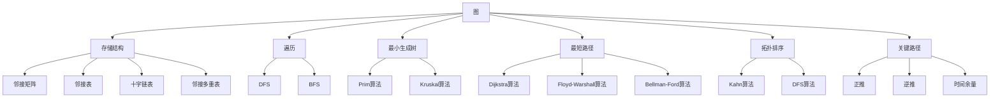

### 6.11.3 相关章节

- [[第2章：线性表]] - 理解基础的线性结构
- [[第5章：树和二叉树]] - 理解树形结构
- [[第7章：查找技术]] - 学习查找算法
- [[第8章：排序技术]] - 学习排序算法

### 6.11.4 参考资料

- 《数据结构（C++版）》第6章
- 《算法导论》第22-25章
- LeetCode图算法题目
- C++ Reference (cppreference.com)

---

## 6.12 练习题

### 基础练习

| 题号 | 题目 | 难度 | 核心知识点 | 状态 |
|------|------|------|-----------|------|
| 1 | 什么是图的度？如何计算无向图和有向图的度？ | 简单 | 图的基本概念 | ⏳ |
| 2 | 邻接矩阵和邻接表各有何优缺点？ | 简单 | 图的存储结构 | ⏳ |
| 3 | 实现DFS和BFS算法 | 中等 | 图的遍历 | ⏳ |
| 4 | 什么是生成树？什么是最小生成树？ | 简单 | 最小生成树 | ⏳ |

**答案**：

**题3 DFS实现**：
```cpp
void DFS(int v) {
    visited[v] = true;
    cout << vertices[v] << " ";

    for (int neighbor : getNeighbors(v)) {
        if (!visited[neighbor]) {
            DFS(neighbor);
        }
    }
}
```

**题4 答案**：
- 生成树：连通图的生成子图，包含所有顶点且没有环
- 最小生成树：所有边权值之和最小的生成树

### 进阶练习

| 题号 | 题目 | 难度 | 核心知识点 | 状态 |
|------|------|------|-----------|------|
| 1 | 实现Prim算法并分析其时间复杂度 | 中等 | 最小生成树 | ⏳ |
| 2 | 实现Dijkstra算法并处理优先队列优化 | 中等 | 最短路径 | ⏳ |
| 3 | 使用Kahn算法实现拓扑排序 | 中等 | 拓扑排序 | ⏳ |
| 4 | 比较Prim和Kruskal算法的适用场景 | 中等 | 最小生成树 | ⏳ |

**题4 答案**：
- Prim算法：适合稠密图，时间复杂度O((n+e) log n)
- Kruskal算法：适合稀疏图，时间复杂度O(e log e)

### 挑战练习

| 题号 | 题目 | 难度 | 核心知识点 | 状态 |
|------|------|------|-----------|------|
| 1 | 实现Floyd-Warshall算法并检测负权环 | 困难 | 最短路径 | ⏳ |
| 2 | 实现Bellman-Ford算法并检测负权环 | 困难 | 最短路径 | ⏳ |
| 3 | 实现关键路径算法并输出关键活动 | 困难 | 关键路径 | ⏳ |
| 4 | 设计一个社交网络推荐系统 | 困难 | 综合应用 | ⏳ |

---

## 6.13 思考题

1. **为什么Dijkstra算法不能处理负权边？**
   - 提示：考虑贪心策略的局限性

2. **如何检测图中是否存在环？**
   - 提示：可以使用DFS、并查集或拓扑排序

3. **在有向图中，如何判断两个顶点是否强连通？**
   - 提示：考虑Kosaraju算法或Tarjan算法

4. **为什么Floyd-Warshall算法的时间复杂度是O(n³)？**
   - 提示：分析三重循环的作用

5. **在实际应用中，如何选择合适的图算法？**
   - 提示：考虑图的类型、边的权值、问题需求等因素

---

## 6.14 思想火花

> **图是现实世界的抽象**

图不仅仅是一种数据结构，更是现实世界中复杂关系的抽象模型。

**现实世界中的图**：

1. **社交网络**
   - 顶点：用户
   - 边：好友关系
   - 应用：推荐系统、影响力分析

2. **交通网络**
   - 顶点：城市或站点
   - 边：道路或航线
   - 应用：导航、路径规划

3. **互联网**
   - 顶点：网页
   - 边：超链接
   - 应用：搜索引擎、PageRank

4. **生物网络**
   - 顶点：蛋白质或基因
   - 边：相互作用
   - 应用：疾病研究、药物发现

**启示**：
- 图算法是解决复杂问题的强大工具
- 理解图的本质有助于更好地应用图算法
- 现实世界的许多问题都可以建模为图问题

---

## 6.15 习题与练习（来自新教材）

### 6.15.1 算法设计题

**题目1：无向图邻接矩阵转换为邻接表**

**问题描述**：
设计算法，将一个无向图的邻接矩阵转换为邻接表。

**算法思路**：
- 遍历邻接矩阵的上三角（避免重复添加边）
- 当发现边时，在邻接表中添加两个方向的连接（无向图）

**C++实现**：

```cpp
#include <iostream>
#include <vector>
#include <list>

class GraphConverter {
private:
    // 邻接矩阵表示
    std::vector<std::vector<int>> adjMatrix;
    int vertexCount;
    
public:
    GraphConverter(int n) : vertexCount(n) {
        adjMatrix.resize(n, std::vector<int>(n, 0));
    }
    
    // 添加边（无向图）
    void addEdge(int u, int v, int weight = 1) {
        if (u >= 0 && u < vertexCount && v >= 0 && v < vertexCount) {
            adjMatrix[u][v] = weight;
            adjMatrix[v][u] = weight;
        }
    }
    
    // 邻接矩阵转换为邻接表
    std::vector<std::list<std::pair<int, int>>> matrixToAdjList() {
        std::vector<std::list<std::pair<int, int>>> adjList(vertexCount);
        
        for (int i = 0; i < vertexCount; ++i) {
            for (int j = i + 1; j < vertexCount; ++j) {  // 只遍历上三角
                if (adjMatrix[i][j] > 0) {
                    // 无向图添加两个方向的边
                    adjList[i].push_back({j, adjMatrix[i][j]});
                    adjList[j].push_back({i, adjMatrix[j][i]});
                }
            }
        }
        
        return adjList;
    }
    
    // 打印邻接矩阵
    void printMatrix() {
        std::cout << "邻接矩阵：" << std::endl;
        for (int i = 0; i < vertexCount; ++i) {
            for (int j = 0; j < vertexCount; ++j) {
                std::cout << adjMatrix[i][j] << " ";
            }
            std::cout << std::endl;
        }
    }
    
    // 打印邻接表
    void printAdjList(const std::vector<std::list<std::pair<int, int>>>& adjList) {
        std::cout << "邻接表：" << std::endl;
        for (int i = 0; i < vertexCount; ++i) {
            std::cout << "顶点" << i << " -> ";
            for (const auto& edge : adjList[i]) {
                std::cout << "(" << edge.first << ", " << edge.second << ") ";
            }
            std::cout << std::endl;
        }
    }
};

int main() {
    GraphConverter graph(5);
    
    // 添加边
    graph.addEdge(0, 1, 10);
    graph.addEdge(0, 4, 20);
    graph.addEdge(1, 2, 30);
    graph.addEdge(1, 3, 40);
    graph.addEdge(2, 3, 50);
    graph.addEdge(3, 4, 60);
    
    // 打印邻接矩阵
    graph.printMatrix();
    
    // 转换并打印邻接表
    auto adjList = graph.matrixToAdjList();
    graph.printAdjList(adjList);
    
    return 0;
}
```

**输出**：
```
邻接矩阵：
0 10 0 0 20 
10 0 30 40 0 
0 30 0 50 0 
0 40 50 0 60 
20 0 0 60 0 
邻接表：
顶点0 -> (1, 10) (4, 20) 
顶点1 -> (0, 10) (2, 30) (3, 40) 
顶点2 -> (1, 30) (3, 50) 
顶点3 -> (1, 40) (2, 50) (4, 60) 
顶点4 -> (0, 20) (3, 60) 
```

**时间复杂度**：O(n²)

**空间复杂度**：O(n + e)

---

**题目2：求有向图中每个顶点的人度**

**问题描述**：
设有向图G采用邻接表存储，设计算法求图G中每个顶点的人度。

**算法思路**：
- 遍历邻接表，统计每个顶点作为目标顶点出现的次数
- 使用数组存储每个顶点的人度

**C++实现**：

```cpp
#include <iostream>
#include <vector>
#include <list>

class DirectedGraph {
private:
    std::vector<std::list<int>> adjList;
    int vertexCount;
    
public:
    DirectedGraph(int n) : vertexCount(n) {
        adjList.resize(n);
    }
    
    // 添加有向边
    void addEdge(int u, int v) {
        if (u >= 0 && u < vertexCount && v >= 0 && v < vertexCount) {
            adjList[u].push_back(v);
        }
    }
    
    // 计算每个顶点的人度
    std::vector<int> calculateInDegree() {
        std::vector<int> inDegree(vertexCount, 0);
        
        // 遍历邻接表
        for (int u = 0; u < vertexCount; ++u) {
            for (int v : adjList[u]) {
                inDegree[v]++;
            }
        }
        
        return inDegree;
    }
    
    // 打印邻接表
    void printAdjList() {
        std::cout << "邻接表：" << std::endl;
        for (int i = 0; i < vertexCount; ++i) {
            std::cout << "顶点" << i << " -> ";
            for (int neighbor : adjList[i]) {
                std::cout << neighbor << " ";
            }
            std::cout << std::endl;
        }
    }
    
    // 打印入度
    void printInDegree(const std::vector<int>& inDegree) {
        std::cout << "\n各顶点入度：" << std::endl;
        for (int i = 0; i < vertexCount; ++i) {
            std::cout << "顶点" << i << "的入度: " << inDegree[i] << std::endl;
        }
    }
};

int main() {
    DirectedGraph graph(6);
    
    // 添加有向边
    graph.addEdge(0, 1);
    graph.addEdge(0, 2);
    graph.addEdge(1, 3);
    graph.addEdge(2, 3);
    graph.addEdge(3, 4);
    graph.addEdge(3, 5);
    graph.addEdge(4, 5);
    
    // 打印邻接表
    graph.printAdjList();
    
    // 计算并打印入度
    auto inDegree = graph.calculateInDegree();
    graph.printInDegree(inDegree);
    
    return 0;
}
```

**输出**：
```
邻接表：
顶点0 -> 1 2 
顶点1 -> 3 
顶点2 -> 3 
顶点3 -> 4 5 
顶点4 -> 5 
顶点5 -> 

各顶点入度：
顶点0的入度: 0
顶点1的入度: 1
顶点2的入度: 1
顶点3的入度: 2
顶点4的入度: 1
顶点5的入度: 2
```

**时间复杂度**：O(n + e)

**空间复杂度**：O(n)

---

**题目3：判断有向图中是否存在环**

**问题描述**：
假设以邻接矩阵作为图的存储结构，编写算法判别给定的有向图中是否存在环。

**算法思路**：
- 使用DFS深度优先搜索
- 维护访问状态数组：0-未访问，1-正在访问，2-已访问
- 如果遇到正在访问的顶点，则存在环

**C++实现**：

```cpp
#include <iostream>
#include <vector>

class CycleDetector {
private:
    std::vector<std::vector<int>> adjMatrix;
    int vertexCount;
    std::vector<int> visited;  // 0-未访问，1-正在访问，2-已访问
    
    bool dfs(int u) {
        visited[u] = 1;  // 标记为正在访问
        
        for (int v = 0; v < vertexCount; ++v) {
            if (adjMatrix[u][v] > 0) {
                if (visited[v] == 1) {
                    return true;  // 发现环
                } else if (visited[v] == 0) {
                    if (dfs(v)) {
                        return true;
                    }
                }
            }
        }
        
        visited[u] = 2;  // 标记为已访问
        return false;
    }
    
public:
    CycleDetector(int n) : vertexCount(n) {
        adjMatrix.resize(n, std::vector<int>(n, 0));
        visited.resize(n, 0);
    }
    
    void addEdge(int u, int v) {
        if (u >= 0 && u < vertexCount && v >= 0 && v < vertexCount) {
            adjMatrix[u][v] = 1;
        }
    }
    
    bool hasCycle() {
        // 重置访问状态
        std::fill(visited.begin(), visited.end(), 0);
        
        // 对每个未访问的顶点进行DFS
        for (int i = 0; i < vertexCount; ++i) {
            if (visited[i] == 0) {
                if (dfs(i)) {
                    return true;
                }
            }
        }
        
        return false;
    }
};

int main() {
    // 测试1：无环图
    std::cout << "测试1：无环图" << std::endl;
    CycleGraph graph1(4);
    graph1.addEdge(0, 1);
    graph1.addEdge(1, 2);
    graph1.addEdge(2, 3);
    std::cout << "是否存在环: " << (graph1.hasCycle() ? "是" : "否") << std::endl;
    
    // 测试2：有环图
    std::cout << "\n测试2：有环图" << std::endl;
    CycleGraph graph2(4);
    graph2.addEdge(0, 1);
    graph2.addEdge(1, 2);
    graph2.addEdge(2, 3);
    graph2.addEdge(3, 1);  // 添加一条回边，形成环
    std::cout << "是否存在环: " << (graph2.hasCycle() ? "是" : "否") << std::endl;
    
    return 0;
}
```

**输出**：
```
测试1：无环图
是否存在环: 否

测试2：有环图
是否存在环: 是
```

**时间复杂度**：O(n²)

**空间复杂度**：O(n)

---

### 6.15.2 实验题

**实验1：扩展图类**

**题目**：
用邻接表存储图，实现图的基本操作，并增加求顶点的度、求某顶点的所有邻接点、增加一个顶点、删除一条边等成员函数。

**C++实现**：

```cpp
#include <iostream>
#include <vector>
#include <list>
#include <unordered_set>
#include <queue>

class ExtendedGraph {
private:
    struct Edge {
        int to;
        int weight;
        
        Edge(int t, int w = 1) : to(t), weight(w) {}
    };
    
    std::vector<std::list<Edge>> adjList;
    bool isDirected;
    
public:
    ExtendedGraph(int vertexCount = 0, bool directed = false) 
        : isDirected(directed) {
        adjList.resize(vertexCount);
    }
    
    // 添加顶点
    void addVertex() {
        adjList.push_back(std::list<Edge>());
    }
    
    // 添加边
    void addEdge(int u, int v, int weight = 1) {
        if (u >= 0 && u < adjList.size() && v >= 0 && v < adjList.size()) {
            adjList[u].push_back(Edge(v, weight));
            if (!isDirected) {
                adjList[v].push_back(Edge(u, weight));
            }
        }
    }
    
    // 删除边
    void removeEdge(int u, int v) {
        if (u >= 0 && u < adjList.size() && v >= 0 && v < adjList.size()) {
            adjList[u].remove_if([v](const Edge& e) { return e.to == v; });
            if (!isDirected) {
                adjList[v].remove_if([u](const Edge& e) { return e.to == u; });
            }
        }
    }
    
    // 求顶点的度
    int getDegree(int vertex) {
        if (vertex < 0 || vertex >= adjList.size()) {
            return -1;  // 无效顶点
        }
        
        int degree = adjList[vertex].size();
        
        if (isDirected) {
            // 对于有向图，度 = 出度 + 入度
            for (int i = 0; i < adjList.size(); ++i) {
                if (i != vertex) {
                    for (const Edge& e : adjList[i]) {
                        if (e.to == vertex) {
                            degree++;
                        }
                    }
                }
            }
        }
        
        return degree;
    }
    
    // 求出度（有向图）
    int getOutDegree(int vertex) {
        if (!isDirected || vertex < 0 || vertex >= adjList.size()) {
            return -1;
        }
        return adjList[vertex].size();
    }
    
    // 求入度（有向图）
    int getInDegree(int vertex) {
        if (!isDirected || vertex < 0 || vertex >= adjList.size()) {
            return -1;
        }
        
        int inDegree = 0;
        for (int i = 0; i < adjList.size(); ++i) {
            if (i != vertex) {
                for (const Edge& e : adjList[i]) {
                    if (e.to == vertex) {
                        inDegree++;
                    }
                }
            }
        }
        return inDegree;
    }
    
    // 获取顶点的所有邻接点
    std::vector<int> getNeighbors(int vertex) {
        std::vector<int> neighbors;
        if (vertex >= 0 && vertex < adjList.size()) {
            for (const Edge& e : adjList[vertex]) {
                neighbors.push_back(e.to);
            }
        }
        return neighbors;
    }
    
    // 深度优先搜索
    std::vector<int> DFS(int start) {
        std::vector<int> result;
        std::vector<bool> visited(adjList.size(), false);
        DFSHelper(start, visited, result);
        return result;
    }
    
    // 广度优先搜索
    std::vector<int> BFS(int start) {
        std::vector<int> result;
        std::vector<bool> visited(adjList.size(), false);
        std::queue<int> q;
        
        visited[start] = true;
        q.push(start);
        
        while (!q.empty()) {
            int u = q.front();
            q.pop();
            result.push_back(u);
            
            for (const Edge& e : adjList[u]) {
                if (!visited[e.to]) {
                    visited[e.to] = true;
                    q.push(e.to);
                }
            }
        }
        
        return result;
    }
    
    // 判断是否有环
    bool hasCycle() {
        std::vector<int> visited(adjList.size(), 0);
        
        for (int i = 0; i < adjList.size(); ++i) {
            if (visited[i] == 0) {
                if (dfsCycle(i, visited, -1)) {
                    return true;
                }
            }
        }
        return false;
    }
    
    // 打印图
    void printGraph() {
        std::cout << "图结构（" << (isDirected ? "有向" : "无向") << "）：" << std::endl;
        for (int i = 0; i < adjList.size(); ++i) {
            std::cout << "顶点" << i << " -> ";
            for (const Edge& e : adjList[i]) {
                std::cout << e.to << "(" << e.weight << ") ";
            }
            std::cout << std::endl;
        }
    }
    
private:
    void DFSHelper(int u, std::vector<bool>& visited, std::vector<int>& result) {
        visited[u] = true;
        result.push_back(u);
        
        for (const Edge& e : adjList[u]) {
            if (!visited[e.to]) {
                DFSHelper(e.to, visited, result);
            }
        }
    }
    
    bool dfsCycle(int u, std::vector<int>& visited, int parent) {
        visited[u] = 1;
        
        for (const Edge& e : adjList[u]) {
            int v = e.to;
            if (visited[v] == 1) {
                if (!isDirected && v == parent) {
                    continue;  // 对于无向图，忽略父节点
                }
                return true;  // 发现环
            } else if (visited[v] == 0) {
                if (dfsCycle(v, visited, u)) {
                    return true;
                }
            }
        }
        
        visited[u] = 2;
        return false;
    }
};

// 测试代码
int main() {
    // 创建无向图
    ExtendedGraph graph(5, false);
    
    // 添加边
    graph.addEdge(0, 1);
    graph.addEdge(0, 4);
    graph.addEdge(1, 2);
    graph.addEdge(1, 3);
    graph.addEdge(2, 3);
    graph.addEdge(3, 4);
    
    // 打印图
    graph.printGraph();
    
    // 测试各种操作
    std::cout << "\n=== 图操作测试 ===" << std::endl;
    
    std::cout << "顶点1的度: " << graph.getDegree(1) << std::endl;
    std::cout << "顶点1的邻接点: ";
    auto neighbors = graph.getNeighbors(1);
    for (int n : neighbors) {
        std::cout << n << " ";
    }
    std::cout << std::endl;
    
    std::cout << "从顶点0的DFS遍历: ";
    auto dfs = graph.DFS(0);
    for (int v : dfs) std::cout << v << " ";
    std::cout << std::endl;
    
    std::cout << "从顶点0的BFS遍历: ";
    auto bfs = graph.BFS(0);
    for (int v : bfs) std::cout << v << " ";
    std::cout << std::endl;
    
    std::cout << "是否存在环: " << (graph.hasCycle() ? "是" : "否") << std::endl;
    
    // 添加新顶点
    std::cout << "\n=== 添加新顶点 ===" << std::endl;
    graph.addVertex();
    std::cout << "当前顶点数: " << 6 << std::endl;
    
    // 删除边
    std::cout << "\n=== 删除边(1, 3) ===" << std::endl;
    graph.removeEdge(1, 3);
    graph.printGraph();
    
    return 0;
}
```

**输出示例**：
```
图结构（无向）：
顶点0 -> 1(1) 4(1) 
顶点1 -> 0(1) 2(1) 3(1) 
顶点2 -> 1(1) 3(1) 
顶点3 -> 1(1) 2(1) 4(1) 
顶点4 -> 0(1) 3(1) 

=== 图操作测试 ===
顶点1的度: 3
顶点1的邻接点: 0 2 3 
从顶点0的DFS遍历: 0 1 2 3 4 
从顶点0的BFS遍历: 0 1 4 2 3 
是否存在环: 否

=== 添加新顶点 ===
当前顶点数: 6

=== 删除边(1, 3) ===
图结构（无向）：
顶点0 -> 1(1) 4(1) 
顶点1 -> 0(1) 2(1) 
顶点2 -> 1(1) 3(1) 
顶点3 -> 2(1) 4(1) 
顶点4 -> 0(1) 3(1) 
```

---

**实验2：求哈密顿回路**

**题目**：
一个包含n个顶点的图中，哈密顿回路是从某个顶点出发，经过所有其他顶点恰好一次，最后回到出发顶点的路径。设计求哈密顿回路的算法。

**算法思路**：
- 使用回溯法
- 维护当前路径和已访问顶点集合
- 尝试添加未访问的邻接点到路径
- 当路径包含所有顶点且回到起点时，找到哈密顿回路

**C++实现**：

```cpp
#include <iostream>
#include <vector>
#include <list>
#include <algorithm>

class HamiltonianCycle {
private:
    std::vector<std::list<int>> adjList;
    int vertexCount;
    std::vector<int> path;
    std::vector<bool> visited;
    
    bool isSafe(int v, int pos) {
        // 检查当前顶点是否是最后一个顶点的邻接点
        if (adjList[path[pos - 1]].empty()) {
            return false;
        }
        
        bool isNeighbor = false;
        for (int neighbor : adjList[path[pos - 1]]) {
            if (neighbor == v) {
                isNeighbor = true;
                break;
            }
        }
        
        if (!isNeighbor) {
            return false;
        }
        
        // 检查顶点是否已被访问
        if (visited[v]) {
            return false;
        }
        
        return true;
    }
    
    bool hamCycleUtil(int pos) {
        // 所有顶点都已包含在路径中
        if (pos == vertexCount) {
            // 检查最后一个顶点是否与第一个顶点相连
            for (int neighbor : adjList[path[pos - 1]]) {
                if (neighbor == path[0]) {
                    return true;
                }
            }
            return false;
        }
        
        // 尝试不同的顶点作为下一个候选
        for (int v = 1; v < vertexCount; ++v) {
            if (isSafe(v, pos)) {
                path[pos] = v;
                visited[v] = true;
                
                if (hamCycleUtil(pos + 1)) {
                    return true;
                }
                
                // 回溯
                path[pos] = -1;
                visited[v] = false;
            }
        }
        
        return false;
    }
    
public:
    HamiltonianCycle(int n) : vertexCount(n) {
        adjList.resize(n);
        path.resize(n, -1);
        visited.resize(n, false);
    }
    
    void addEdge(int u, int v) {
        if (u >= 0 && u < vertexCount && v >= 0 && v < vertexCount) {
            adjList[u].push_back(v);
            adjList[v].push_back(u);  // 无向图
        }
    }
    
    bool findHamiltonianCycle() {
        path[0] = 0;  // 从顶点0开始
        visited[0] = true;
        
        if (hamCycleUtil(1)) {
            path.push_back(path[0]);  // 添加回到起点的边
            return true;
        }
        
        return false;
    }
    
    void printCycle() {
        std::cout << "哈密顿回路: ";
        for (int v : path) {
            std::cout << v;
            if (v != path.back()) {
                std::cout << " -> ";
            }
        }
        std::cout << std::endl;
    }
};

int main() {
    // 测试1：存在哈密顿回路的图
    std::cout << "=== 测试1：存在哈密顿回路 ===" << std::endl;
    HamiltonianCycle graph1(5);
    
    graph1.addEdge(0, 1);
    graph1.addEdge(0, 3);
    graph1.addEdge(1, 2);
    graph1.addEdge(1, 3);
    graph1.addEdge(1, 4);
    graph1.addEdge(2, 4);
    graph1.addEdge(3, 4);
    
    if (graph1.findHamiltonianCycle()) {
        graph1.printCycle();
    } else {
        std::cout << "不存在哈密顿回路" << std::endl;
    }
    
    // 测试2：不存在哈密顿回路的图
    std::cout << "\n=== 测试2：不存在哈密顿回路 ===" << std::endl;
    HamiltonianCycle graph2(4);
    
    graph2.addEdge(0, 1);
    graph2.addEdge(1, 2);
    graph2.addEdge(2, 3);
    // 缺少连接形成回路的边
    
    if (graph2.findHamiltonianCycle()) {
        graph2.printCycle();
    } else {
        std::cout << "不存在哈密顿回路" << std::endl;
    }
    
    return 0;
}
```

**输出示例**：
```
=== 测试1：存在哈密顿回路 ===
哈密顿回路: 0 -> 1 -> 2 -> 4 -> 3 -> 0

=== 测试2：不存在哈密顿回路 ===
不存在哈密顿回路
```

**时间复杂度**：O(n! × n)

**空间复杂度**：O(n)

---

## 6.16 选择题补充（来自额外资料）

以下选择题和简答题来自《数据结构与算法分析》补充习题，用于巩固图的基本概念和算法。

### 6.16.1 最小生成树算法

**题目1**：图采用邻接表存储，求最小生成树Prim算法的时间复杂度为（  C  ）。

A. O(n)   B. O(n+e)    C. O(n²)    D. O(n³)

**解析**：

**Prim算法的时间复杂度**：
- **邻接矩阵**：O(n²)
  - 每次选择一个顶点加入集合，需要遍历所有顶点找最小权值边
  - 共执行n次，每次O(n)
  - 总时间复杂度：O(n²)

- **邻接表**：O(n²)（如果不使用优先队列优化）
  - 每次选择一个顶点加入集合，需要遍历所有顶点找最小权值边
  - 总时间复杂度：O(n²)

- **邻接表 + 优先队列**：O((n+e)log n)
  - 使用最小堆优化选择过程
  - 每次提取最小值：O(log n)
  - 更新邻接点的权值：O(log n)
  - 总时间复杂度：O((n+e)log n)

**正确答案**：C（未优化版本）

---

### 6.16.2 图的连通分量

**题目2**：下面（  A  ）方法可以用于求无向图的连通分量。

A. 遍历    B. 拓扑排序    C. Dijkstra算法    D. Prim算法

**解析**：

**求连通分量的方法**：
- **DFS/BFS遍历**：从每个未访问的顶点开始遍历，每次遍历得到一个连通分量
- **并查集**：通过合并集合的方式

**其他选项**：
- **拓扑排序**：用于有向无环图
- **Dijkstra算法**：用于求最短路径
- **Prim算法**：用于求最小生成树

**正确答案**：A

---

### 6.16.3 非连通无向图的顶点数

**题目3**：G是一个非连通无向图，共有28条边，则该图至少有（  D  ）个顶点。

A. 6   B. 7    C. 8    D. 9

**解析**：

**思路**：
- 非连通图至少有两个连通分量
- 要使顶点数最少，需要让边数尽可能多
- 完全图的边数最多

**计算**：
```
假设有两个连通分量，分别有n₁和n₂个顶点
n₁ + n₂ = n（总顶点数）
n₁(n₁-1)/2 + n₂(n₂-1)/2 = 28（总边数）

当n₁ = 5, n₂ = 4时：
n₁(n₁-1)/2 = 5×4/2 = 10
n₂(n₂-1)/2 = 4×3/2 = 6
总边数：10 + 6 = 16 < 28

当n₁ = 6, n₂ = 3时：
n₁(n₁-1)/2 = 6×5/2 = 15
n₂(n₂-1)/2 = 3×2/2 = 3
总边数：15 + 3 = 18 < 28

当n₁ = 7, n₂ = 2时：
n₁(n₁-1)/2 = 7×6/2 = 21
n₂(n₂-1)/2 = 2×1/2 = 1
总边数：21 + 1 = 22 < 28

当n₁ = 8, n₂ = 1时：
n₁(n₁-1)/2 = 8×7/2 = 28
n₂(n₂-1)/2 = 1×0/2 = 0
总边数：28 + 0 = 28 ✓

总顶点数：8 + 1 = 9
```

**正确答案**：D

---

### 6.16.4 邻接表删除操作

**题目4**：假设一个有向图具有n个顶点e条边，则该有向图采用邻接表存储，则删除与顶点i相关联的所有边的时间复杂度是（ C  ）。

A. O(n)    B. O(e)     C. O(n+e)    D. O(n*e)

**解析**：

**删除操作**：
1. **删除顶点i的所有出边**：需要遍历顶点i的邻接表
   - 时间复杂度：O(出度)

2. **删除顶点i的所有入边**：需要遍历所有顶点的邻接表
   - 时间复杂度：O(n + e)

**总时间复杂度**：O(n + e)

**正确答案**：C

---

### 6.16.5 拓扑排序

**题目5**：下列说法中，正确的是（  A  ）

A. 在拓扑排序算法中，暂存入度为0的顶点可以用栈，也可以用队列

B. AOV网的拓扑序列是唯一的

C. 若有向图的邻接矩阵中对角线以下元素均为0，则一定存在唯一的拓扑序列

D. 若一个有向图存在拓扑序列，则该图一定是强连通图

**解析**：

**选项A正确**：
- 拓扑排序中，入度为0的顶点可以用栈或队列存储
- 栈：后进先出，可能产生不同的拓扑序列
- 队列：先进先出，可能产生不同的拓扑序列

**选项B错误**：
- AOV网的拓扑序列不唯一
- 可能存在多个拓扑序列

**选项C错误**：
- 邻接矩阵对角线以下元素均为0，说明是DAG
- 但拓扑序列不一定唯一

**选项D错误**：
- 存在拓扑序列说明是有向无环图（DAG）
- DAG不一定是强连通图

**正确答案**：A

---

### 6.16.6 Kruskal算法

**题目6**：Kruskal算法的时间复杂度为（  D  ），适合于求（  E  ）的最小生成树。

A. O(nlog₂n)   B. O(n+e)    C. O(n³)    D. O(elog₂e)

E. 稀疏图   F. 稠密图   G. 连通图   H. 有向图

**解析**：

**Kruskal算法的时间复杂度**：
- 排序边：O(e log e)
- 并查集操作：O(e α(n))，α(n)是反阿克曼函数，接近常数
- **总时间复杂度：O(e log e)**

**适用场景**：
- **稀疏图**：e << n²
- 稠密图更适合Prim算法

**正确答案**：D, E

---

### 6.16.7 邻接表的空间复杂度

**题目7**：用邻接表存储图所用的空间大小（  A  ）

A. 与图的顶点数和边数都有关    B. 只与图的边数有关系

C. 只与图的顶点数有关          D. 与边数的平方有关

**解析**：

**邻接表的空间复杂度**：
- 顶点表：O(n)
- 边表：O(e)
- **总空间复杂度：O(n + e)**

**正确答案**：A

---

### 6.16.8 习题总结

**关键概念**：
1. **Prim算法时间复杂度**：
   - 邻接矩阵：O(n²)
   - 邻接表：O(n²)（未优化）或 O((n+e)log n)（优化）
2. **求连通分量**：DFS/BFS遍历
3. **非连通图的最少顶点数**：考虑完全图的边数
4. **邻接表删除操作**：O(n + e)
5. **拓扑排序**：
   - 入度为0的顶点可以用栈或队列
   - 拓扑序列不唯一
6. **Kruskal算法**：
   - 时间复杂度：O(e log e)
   - 适合稀疏图
7. **邻接表空间复杂度**：O(n + e)

---

**PDF参考页码**：第156-198页
**创建时间**：2026年3月5日
**最后更新**：2026年3月5日
**预计学习时间**：8-10小时