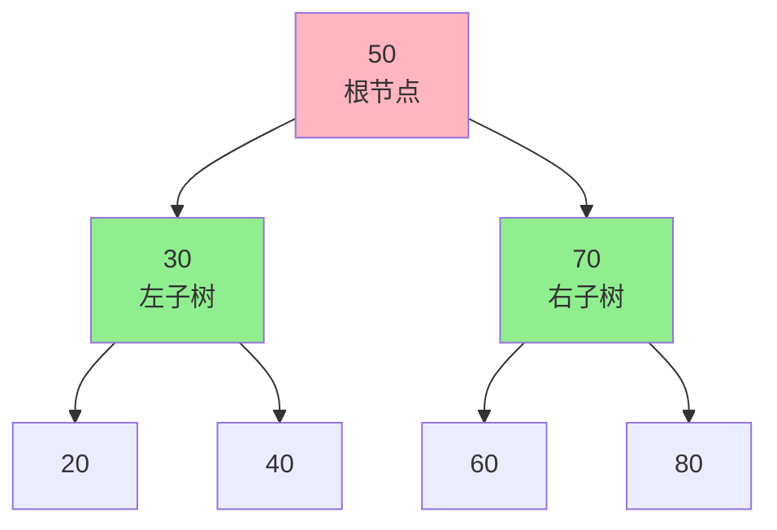
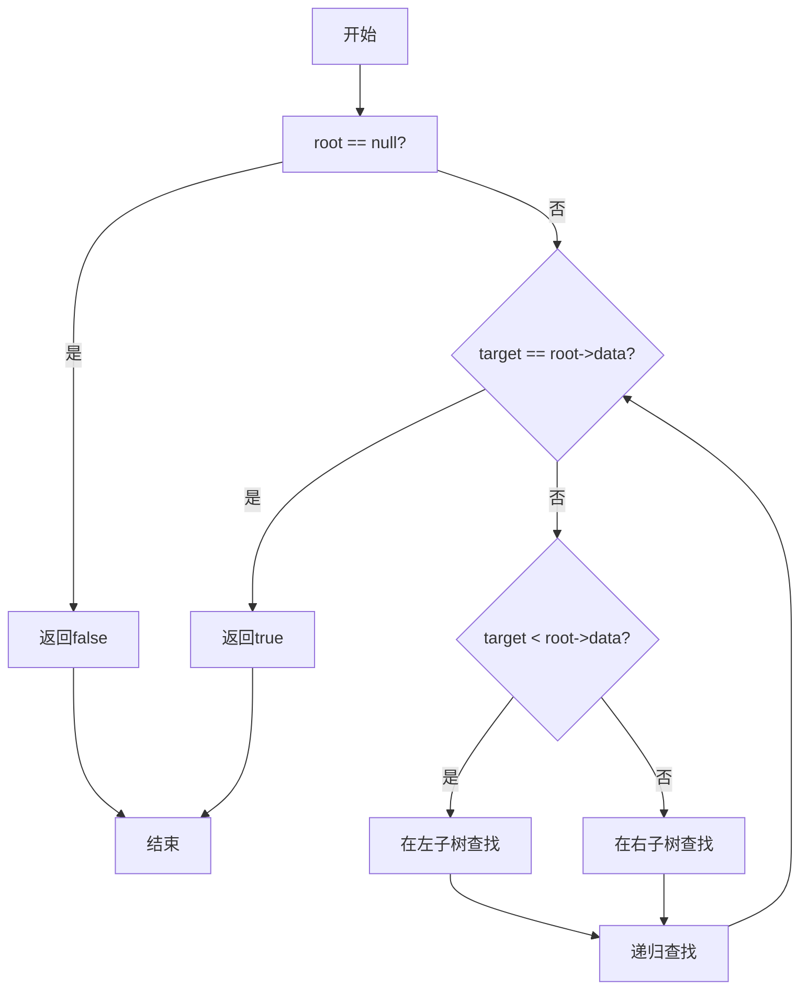
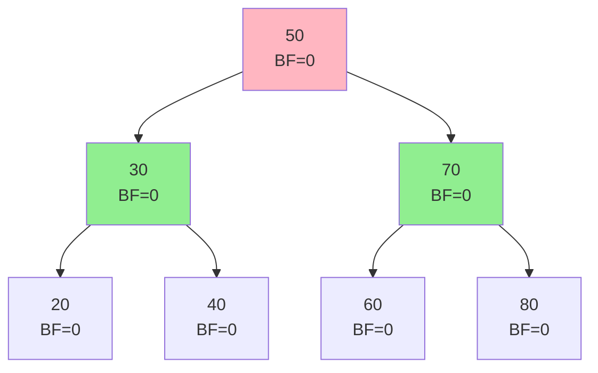
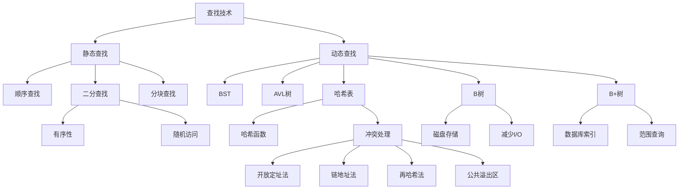

# 第7章：查找技术

> 本章学习目标：
> - 理解查找的基本概念和评价标准
> - 掌握顺序查找、二分查找和分块查找算法
> - 掌握二叉排序树的查找、插入和删除操作
> - 理解平衡二叉树的平衡原理和旋转操作
> - 掌握B树和B+树的结构和操作
> - 理解哈希表的基本原理和冲突处理方法
> - 能够根据实际需求选择合适的查找方法
> - 能够解决与查找相关的实际问题

---

## 7.1 查找的基本概念

### 7.1.1 查找的定义

**定义**：
查找（Search）是指在数据集合中寻找满足给定条件的数据元素的过程。

**查找的目的**：
- 确定某个特定数据元素是否在数据集合中
- 检索某个特定数据元素的属性
- 确定某个数据元素在数据集合中的位置

**查找表（Search Table）**：
查找表是由同一类型的数据元素（或记录）构成的集合。

**关键字（Key）**：
关键字是数据元素中某个数据项的值，用它可以标识一个数据元素。

- **主关键字（Primary Key）**：可以唯一标识一个数据元素的关键字
- **次关键字（Secondary Key）**：不能唯一标识一个数据元素的关键字

**示例**：

```cpp
struct Student {
    int id;         // 学号（主关键字）
    string name;    // 姓名（次关键字）
    int age;        // 年龄（次关键字）
    double score;   // 成绩（次关键字）
};

// 查找示例：
// - 按学号查找：可以找到唯一的学生
// - 按姓名查找：可能找到多个学生
```

### 7.1.2 查找长度和平均查找长度

**查找长度（Search Length）**：
查找长度是指为确定数据元素在查找表中的位置，需要和给定值进行比较的关键字次数。

**平均查找长度（Average Search Length，ASL）**：
平均查找长度是指查找过程中关键字比较次数的期望值。

**计算公式**：
```
ASL = Σ(P_i × C_i)  for i = 1 to n

其中：
- P_i：查找第i个元素的概率
- C_i：查找第i个元素所需的比较次数
```

**示例**：

```cpp
// 在数组 [10, 20, 30, 40, 50] 中查找

// 查找30：
// 比较次数：3（10, 20, 30）

// 查找50：
// 比较次数：5（10, 20, 30, 40, 50）

// 假设每个元素被查找的概率相同（P_i = 1/n）
// 平均查找长度：
// ASL = (1 + 2 + 3 + 4 + 5) / 5 = 3
```

### 7.1.3 查找算法的评价标准

**评价指标**：

| 评价标准 | 说明 |
|----------|------|
| **时间复杂度** | 查找算法执行时间与问题规模的关系 |
| **空间复杂度** | 查找算法所需辅助空间的大小 |
| **ASL** | 平均查找长度，衡量查找效率的核心指标 |
| **稳定性** | 相同关键字的数据元素在查找前后相对位置是否改变 |
| **适应性** | 对数据分布的适应能力 |

**查找算法分类**：

```
查找算法
  ├── 静态查找表
  │     ├── 顺序查找
  │     ├── 二分查找
  │     └── 分块查找
  │
  └── 动态查找表
        ├── 二叉排序树
        ├── 平衡二叉树
        ├── B树和B+树
        └── 哈希表
```

**静态查找表 vs 动态查找表**：

| 特性 | 静态查找表 | 动态查找表 |
|------|-----------|-----------|
| **数据变化** | 查找表建成后一般不再修改 | 查找过程中可以插入和删除元素 |
| **适用场景** | 数据不经常变化的场景 | 数据频繁变化的场景 |
| **存储结构** | 通常用顺序存储 | 可以用顺序存储或链式存储 |
| **典型算法** | 顺序查找、二分查找 | BST、AVL、B树、哈希表 |

---

## 7.2 顺序查找

### 7.2.1 顺序查找算法

**算法思想**：
从查找表的第一个元素开始，逐个与给定值进行比较，直到找到匹配的元素或遍历完整个查找表。

**算法流程**：

```mermaid
flowchart TD
    A[开始] --> B[i = 0]
    B --> C{i < n?}
    C -->|是| D{arr[i] == target?}
    D -->|是| E[返回i]
    D -->|否| F[i++]
    F --> C
    C -->|否| G[返回-1]
    G --> H[结束]
    E --> H
```

**C++实现**：

```cpp
#include <iostream>
#include <vector>
#include <optional>

/**
 * 顺序查找（基础版）
 * @param arr 待查找数组
 * @param n 数组长度
 * @param target 目标值
 * @return 找到返回索引，未找到返回-1
 */
int sequential_search(int arr[], int n, int target) {
    for (int i = 0; i < n; ++i) {
        if (arr[i] == target) {
            return i;  // 找到目标，返回索引
        }
    }
    return -1;  // 未找到
}

/**
 * 顺序查找（C++风格）
 * @param arr 待查找vector
 * @param target 目标值
 * @return 找到返回索引，未找到返回nullopt
 */
std::optional<size_t> sequential_search(const std::vector<int>& arr, int target) {
    for (size_t i = 0; i < arr.size(); ++i) {
        if (arr[i] == target) {
            return i;  // 找到目标
        }
    }
    return std::nullopt;  // 未找到
}

// 使用示例
int main() {
    int arr[] = {10, 20, 30, 40, 50};
    int n = sizeof(arr) / sizeof(arr[0]);

    int target = 30;
    int result = sequential_search(arr, n, target);

    if (result != -1) {
        std::cout << "找到 " << target << "，位置: " << result << std::endl;
    } else {
        std::cout << "未找到 " << target << std::endl;
    }

    return 0;
}
```

### 7.2.2 顺序查找的改进（哨兵）

**问题**：
基础的顺序查找每次循环都要判断两个条件：`i < n` 和 `arr[i] == target`。

**优化思路**：
使用**哨兵（Sentinel）**技术，在数组末尾放置目标值，这样可以减少循环中的判断次数。

**哨兵法实现**：

```cpp
/**
 * 顺序查找（哨兵优化）
 * @param arr 待查找数组（arr[0]不存储数据，用作哨兵）
 * @param n 数组有效元素个数
 * @param target 目标值
 * @return 找到返回索引，未找到返回0
 */
int sequential_search_sentinel(int arr[], int n, int target) {
    arr[0] = target;  // 设置哨兵
    int i = n;

    // 只需判断 arr[i] != target，不需要判断 i >= 0
    while (arr[i] != target) {
        --i;
    }

    return i;  // 如果i=0，表示未找到；否则i就是目标的位置
}

// 使用示例
int main() {
    int arr[] = {0, 10, 20, 30, 40, 50};  // arr[0]作为哨兵
    int n = 5;  // 有效元素个数

    int target = 30;
    int result = sequential_search_sentinel(arr, n, target);

    if (result != 0) {
        std::cout << "找到 " << target << "，位置: " << result << std::endl;
    } else {
        std::cout << "未找到 " << target << std::endl;
    }

    return 0;
}
```

**哨兵法的优势**：

| 版本 | 每次循环判断次数 | n次循环总判断次数 |
|------|----------------|------------------|
| 基础版 | 2次（i < n && arr[i] == target） | 2n次 |
| 哨兵版 | 1次（arr[i] != target） | n+1次 |

**性能提升**：
- 减少了约50%的比较次数
- 虽然时间复杂度仍为O(n)，但实际运行效率更高

### 7.2.3 顺序查找的复杂度分析

**时间复杂度**：

| 情况 | 条件 | 比较次数 | 时间复杂度 |
|------|------|----------|-----------|
| **最好情况** | 目标在第一个位置 | 1次 | O(1) |
| **最坏情况** | 目标在最后位置或不存在 | n次 | O(n) |
| **平均情况** | 目标在任意位置概率相同 | (n+1)/2次 | O(n) |

**平均查找长度（ASL）**：

假设每个元素被查找的概率相同（P_i = 1/n）：

```
ASL = Σ(P_i × C_i) for i = 1 to n
    = (1 + 2 + 3 + ... + n) / n
    = n(n + 1) / 2n
    = (n + 1) / 2
    ≈ n / 2
```

**空间复杂度**：
- O(1)，只需要常量级别的额外空间

**适用场景**：

| 适用 | 不适用 |
|------|--------|
| 数据量较小 | 数据量较大 |
| 数据无序 | 需要频繁查找 |
| 数据不经常变化 | 对查找效率要求高 |

---

## 7.3 二分查找

### 7.3.1 二分查找算法

**算法思想**：
在有序表中，每次取中间位置的元素与给定值比较：
- 如果相等，查找成功
- 如果给定值小于中间元素，在左半区继续查找
- 如果给定值大于中间元素，在右半区继续查找

**算法流程**：

```mermaid
flowchart TD
    A[开始] --> B[left = 0, right = n-1]
    B --> C{left <= right?}
    C -->|是| D[mid = left + right / 2]
    D --> E{arr[mid] == target?}
    E -->|是| F[返回mid]
    E -->|否| G{arr[mid] < target?}
    G -->|是| H[left = mid + 1]
    G -->|否| I[right = mid - 1]
    H --> C
    I --> C
    C -->|否| J[返回-1]
    J --> K[结束]
    F --> K
```

**非递归实现**：

```cpp
#include <iostream>
#include <vector>
#include <optional>

/**
 * 二分查找（非递归）
 * @param arr 有序数组
 * @param n 数组长度
 * @param target 目标值
 * @return 找到返回索引，未找到返回-1
 */
int binary_search(int arr[], int n, int target) {
    int left = 0;
    int right = n - 1;

    while (left <= right) {
        // 防止整数溢出
        int mid = left + (right - left) / 2;

        if (arr[mid] == target) {
            return mid;  // 找到目标
        } else if (arr[mid] < target) {
            left = mid + 1;  // 在右半区查找
        } else {
            right = mid - 1;  // 在左半区查找
        }
    }

    return -1;  // 未找到
}

/**
 * 二分查找（C++风格，非递归）
 * @param arr 有序vector
 * @param target 目标值
 * @return 找到返回索引，未找到返回nullopt
 */
std::optional<size_t> binary_search(const std::vector<int>& arr, int target) {
    int left = 0;
    int right = arr.size() - 1;

    while (left <= right) {
        int mid = left + (right - left) / 2;

        if (arr[mid] == target) {
            return mid;
        } else if (arr[mid] < target) {
            left = mid + 1;
        } else {
            right = mid - 1;
        }
    }

    return std::nullopt;
}
```

**递归实现**：

```cpp
/**
 * 二分查找（递归辅助函数）
 * @param arr 有序数组
 * @param left 左边界
 * @param right 右边界
 * @param target 目标值
 * @return 找到返回索引，未找到返回-1
 */
int binary_search_recursive_helper(int arr[], int left, int right, int target) {
    if (left > right) {
        return -1;  // 递归终止条件
    }

    int mid = left + (right - left) / 2;

    if (arr[mid] == target) {
        return mid;
    } else if (arr[mid] < target) {
        return binary_search_recursive_helper(arr, mid + 1, right, target);
    } else {
        return binary_search_recursive_helper(arr, left, mid - 1, target);
    }
}

/**
 * 二分查找（递归）
 * @param arr 有序数组
 * @param n 数组长度
 * @param target 目标值
 * @return 找到返回索引，未找到返回-1
 */
int binary_search_recursive(int arr[], int n, int target) {
    return binary_search_recursive_helper(arr, 0, n - 1, target);
}

// 使用示例
int main() {
    int arr[] = {1, 3, 5, 7, 9, 11, 13, 15, 17, 19};
    int n = sizeof(arr) / sizeof(arr[0]);

    int target = 7;
    int result = binary_search(arr, n, target);

    if (result != -1) {
        std::cout << "找到 " << target << "，位置: " << result << std::endl;
    } else {
        std::cout << "未找到 " << target << std::endl;
    }

    return 0;
}
```

### 7.3.2 二分查找的适用条件

**必要条件**：

1. **有序性**：查找表必须是有序的（升序或降序）
2. **顺序存储**：查找表必须支持随机访问（如数组）
3. **静态性**：查找表建立后不经常变化

**示例对比**：

```cpp
// ✓ 有序数组：可以使用二分查找
int sorted_arr[] = {1, 3, 5, 7, 9, 11, 13, 15, 17, 19};

// ✗ 无序数组：不能使用二分查找
int unsorted_arr[] = {5, 1, 9, 3, 7, 11, 15, 13, 17, 19};

// ✗ 链表：不能使用二分查找（不支持随机访问）
struct Node {
    int data;
    Node* next;
};
```

### 7.3.3 二分查找的复杂度分析

**时间复杂度**：

| 情况 | 条件 | 比较次数 | 时间复杂度 |
|------|------|----------|-----------|
| **最好情况** | 目标正好在中间位置 | 1次 | O(1) |
| **最坏情况** | 目标不存在或需要查找到最后 | ⌊log₂n⌋ + 1次 | O(log n) |
| **平均情况** | 目标在任意位置概率相同 | ⌊log₂n⌋次 | O(log n) |

**推导过程**：

```
每次查找后，搜索范围减半：
n → n/2 → n/4 → ... → 1

查找次数 k 满足：
n / 2^k = 1
2^k = n
k = log₂n

因此，时间复杂度为 O(log n)
```

**空间复杂度**：

| 实现方式 | 空间复杂度 |
|----------|-----------|
| 非递归 | O(1) |
| 递归 | O(log n)（递归调用栈） |

**平均查找长度（ASL）**：

```
ASL ≈ log₂(n + 1)
```

### 7.3.4 二分查找的变种

**变种1：查找第一个等于目标值的元素**

```cpp
/**
 * 查找第一个等于目标值的元素
 * @param arr 有序数组
 * @param n 数组长度
 * @param target 目标值
 * @return 找到返回索引，未找到返回-1
 */
int binary_search_first(int arr[], int n, int target) {
    int left = 0;
    int right = n - 1;
    int result = -1;

    while (left <= right) {
        int mid = left + (right - left) / 2;

        if (arr[mid] == target) {
            result = mid;      // 记录当前找到的位置
            right = mid - 1;   // 继续在左半区查找
        } else if (arr[mid] < target) {
            left = mid + 1;
        } else {
            right = mid - 1;
        }
    }

    return result;
}
```

**变种2：查找最后一个等于目标值的元素**

```cpp
/**
 * 查找最后一个等于目标值的元素
 * @param arr 有序数组
 * @param n 数组长度
 * @param target 目标值
 * @return 找到返回索引，未找到返回-1
 */
int binary_search_last(int arr[], int n, int target) {
    int left = 0;
    int right = n - 1;
    int result = -1;

    while (left <= right) {
        int mid = left + (right - left) / 2;

        if (arr[mid] == target) {
            result = mid;      // 记录当前找到的位置
            left = mid + 1;    // 继续在右半区查找
        } else if (arr[mid] < target) {
            left = mid + 1;
        } else {
            right = mid - 1;
        }
    }

    return result;
}
```

**变种3：查找第一个大于等于目标值的元素**

```cpp
/**
 * 查找第一个大于等于目标值的元素
 * @param arr 有序数组
 * @param n 数组长度
 * @param target 目标值
 * @return 找到返回索引，未找到返回n（表示应插入的位置）
 */
int binary_search_lower_bound(int arr[], int n, int target) {
    int left = 0;
    int right = n - 1;
    int result = n;  // 默认插入位置为数组末尾

    while (left <= right) {
        int mid = left + (right - left) / 2;

        if (arr[mid] >= target) {
            result = mid;      // 记录当前满足条件的位置
            right = mid - 1;   // 继续在左半区查找更小的满足条件的位置
        } else {
            left = mid + 1;
        }
    }

    return result;
}
```

**变种4：查找第一个大于目标值的元素**

```cpp
/**
 * 查找第一个大于目标值的元素
 * @param arr 有序数组
 * @param n 数组长度
 * @param target 目标值
 * @return 找到返回索引，未找到返回n（表示应插入的位置）
 */
int binary_search_upper_bound(int arr[], int n, int target) {
    int left = 0;
    int right = n - 1;
    int result = n;  // 默认插入位置为数组末尾

    while (left <= right) {
        int mid = left + (right - left) / 2;

        if (arr[mid] > target) {
            result = mid;      // 记录当前满足条件的位置
            right = mid - 1;   // 继续在左半区查找更小的满足条件的位置
        } else {
            left = mid + 1;
        }
    }

    return result;
}
```

---

## 7.4 分块查找

### 7.4.1 分块查找的概念

**定义**：
分块查找（Block Search），又称索引顺序查找，是一种结合了顺序查找和二分查找优点的查找方法。

**基本思想**：
1. 将查找表分成若干块（子表）
2. 块内无序，但块间有序（即第i块的最大关键字小于第i+1块的最小关键字）
3. 建立索引表，存储每块的最大关键字和起始位置
4. 先在索引表中使用二分查找确定目标所在的块
5. 再在确定的块内使用顺序查找

**示例**：

```
查找表：[10, 20, 15, 25, 30, 35, 28, 40, 45, 38, 50, 55]

分块（每块4个元素）：
块1: [10, 20, 15, 25]    最大值: 25
块2: [30, 35, 28, 40]    最大值: 40
块3: [45, 38, 50, 55]    最大值: 55

索引表：
┌─────┬────────┬────────┐
│ 块号 │ 起始位置 │ 最大值 │
├─────┼────────┼────────┤
│  1  │    0   │   25   │
│  2  │    4   │   40   │
│  3  │    8   │   55   │
└─────┴────────┴────────┘

查找38的步骤：
1. 在索引表中查找：38在块3（38 < 55且38 > 40）
2. 在块3中顺序查找：[45, 38, 50, 55]，找到38在第10个位置
```

### 7.4.2 分块查找的实现

**C++实现**：

```cpp
#include <iostream>
#include <vector>
#include <algorithm>

/**
 * 索引表项
 */
struct IndexItem {
    int start_pos;  // 块的起始位置
    int max_key;    // 块内的最大关键字
};

/**
 * 分块查找
 * @param arr 待查找数组
 * @param n 数组长度
 * @param index_table 索引表
 * @param block_size 块的大小
 * @param target 目标值
 * @return 找到返回索引，未找到返回-1
 */
int block_search(int arr[], int n, const std::vector<IndexItem>& index_table,
                 int block_size, int target) {
    // 步骤1：在索引表中二分查找，确定目标所在的块
    int block_index = -1;
    int left = 0;
    int right = index_table.size() - 1;

    while (left <= right) {
        int mid = left + (right - left) / 2;

        if (index_table[mid].max_key >= target) {
            block_index = mid;
            right = mid - 1;  // 继续查找更小的块
        } else {
            left = mid + 1;
        }
    }

    if (block_index == -1) {
        return -1;  // 目标比所有块的最大值都大
    }

    // 步骤2：在确定的块内顺序查找
    int start = index_table[block_index].start_pos;
    int end = (block_index == index_table.size() - 1) ? n - 1
                                                      : start + block_size - 1;

    for (int i = start; i <= end; ++i) {
        if (arr[i] == target) {
            return i;
        }
    }

    return -1;  // 未找到
}

/**
 * 创建索引表
 * @param arr 待查找数组
 * @param n 数组长度
 * @param block_size 块的大小
 * @return 索引表
 */
std::vector<IndexItem> create_index_table(int arr[], int n, int block_size) {
    std::vector<IndexItem> index_table;
    int num_blocks = (n + block_size - 1) / block_size;  // 向上取整

    for (int i = 0; i < num_blocks; ++i) {
        int start = i * block_size;
        int end = std::min(start + block_size - 1, n - 1);

        // 找到块内的最大值
        int max_key = arr[start];
        for (int j = start + 1; j <= end; ++j) {
            if (arr[j] > max_key) {
                max_key = arr[j];
            }
        }

        index_table.push_back({start, max_key});
    }

    return index_table;
}

// 使用示例
int main() {
    int arr[] = {10, 20, 15, 25, 30, 35, 28, 40, 45, 38, 50, 55};
    int n = sizeof(arr) / sizeof(arr[0]);
    int block_size = 4;

    // 创建索引表
    std::vector<IndexItem> index_table = create_index_table(arr, n, block_size);

    // 打印索引表
    std::cout << "索引表:" << std::endl;
    for (size_t i = 0; i < index_table.size(); ++i) {
        std::cout << "块" << i + 1 << ": 起始位置=" << index_table[i].start_pos
                  << ", 最大值=" << index_table[i].max_key << std::endl;
    }

    // 查找
    int target = 38;
    int result = block_search(arr, n, index_table, block_size, target);

    if (result != -1) {
        std::cout << "找到 " << target << "，位置: " << result << std::endl;
    } else {
        std::cout << "未找到 " << target << std::endl;
    }

    return 0;
}
```

### 7.4.3 分块查找的复杂度分析

**时间复杂度**：

```
查找时间 = 索引表查找时间 + 块内查找时间

假设：
- n：元素总数
- b：块数
- s：块的大小（s = n / b）

时间复杂度：
- 索引表查找（二分查找）：O(log b)
- 块内查找（顺序查找）：O(s)

总时间复杂度：O(log b + s)
              = O(log (n/s) + s)
```

**最优块大小**：

```
使 f(s) = log (n/s) + s 最小

求导：
f'(s) = -1/(s ln 2) + 1 = 0
s = 1/ln 2 ≈ 1.44

最优块大小：s ≈ √n
```

**空间复杂度**：
- O(b)，需要额外的索引表空间

**适用场景**：

| 适用 | 不适用 |
|------|--------|
| 数据量较大 | 数据量很小 |
| 数据块间有序 | 数据完全随机 |
| 需要平衡查找和插入效率 | 需要最快的查找速度 |

---

## 7.5 二叉排序树（BST）

### 7.5.1 BST的定义和性质

**定义**：
二叉排序树（Binary Search Tree，BST），又称二叉查找树，是一棵二叉树或空树，满足以下性质：
1. 若左子树不为空，则左子树上所有节点的值均小于根节点的值
2. 若右子树不为空，则右子树上所有节点的值均大于根节点的值
3. 左、右子树也分别为二叉排序树

**示例**：



**BST的性质**：

| 性质 | 说明 |
|------|------|
| **中序遍历有序** | BST的中序遍历结果是递增序列 |
| **唯一性** | 不存在值相同的节点 |
| **查找效率** | 平均时间复杂度O(log n) |
| **动态性** | 支持动态插入和删除 |

### 7.5.2 BST的查找

**查找过程**：
1. 若根节点为空，查找失败
2. 若目标值等于根节点值，查找成功
3. 若目标值小于根节点值，在左子树中查找
4. 若目标值大于根节点值，在右子树中查找

**查找流程**：



**C++实现**：

```cpp
#include <iostream>
#include <memory>

/**
 * BST节点定义
 */
template <typename T>
struct BSTNode {
    T data;
    std::unique_ptr<BSTNode> left;
    std::unique_ptr<BSTNode> right;

    BSTNode(const T& value) : data(value), left(nullptr), right(nullptr) {}
};

/**
 * 二叉排序树类
 */
template <typename T>
class BinarySearchTree {
private:
    std::unique_ptr<BSTNode<T>> root;

    // 递归查找辅助函数
    bool search_recursive_helper(BSTNode<T>* node, const T& target) const {
        if (node == nullptr) {
            return false;
        }

        if (target == node->data) {
            return true;
        } else if (target < node->data) {
            return search_recursive_helper(node->left.get(), target);
        } else {
            return search_recursive_helper(node->right.get(), target);
        }
    }

    // 递归插入辅助函数
    BSTNode<T>* insert_recursive_helper(BSTNode<T>* node, const T& value) {
        if (node == nullptr) {
            return new BSTNode<T>(value);
        }

        if (value < node->data) {
            node->left.reset(insert_recursive_helper(node->left.release(), value));
        } else if (value > node->data) {
            node->right.reset(insert_recursive_helper(node->right.release(), value));
        }
        // 如果值已存在，不插入

        return node;
    }

    // 中序遍历辅助函数
    void inorder_traverse_helper(BSTNode<T>* node) const {
        if (node == nullptr) return;

        inorder_traverse_helper(node->left.get());
        std::cout << node->data << " ";
        inorder_traverse_helper(node->right.get());
    }

    // 查找最小值节点
    BSTNode<T>* find_min(BSTNode<T>* node) const {
        while (node->left != nullptr) {
            node = node->left.get();
        }
        return node;
    }

    // 递归删除辅助函数
    BSTNode<T>* remove_recursive_helper(BSTNode<T>* node, const T& value) {
        if (node == nullptr) {
            return nullptr;
        }

        if (value < node->data) {
            node->left.reset(remove_recursive_helper(node->left.release(), value));
        } else if (value > node->data) {
            node->right.reset(remove_recursive_helper(node->right.release(), value));
        } else {
            // 找到要删除的节点
            if (node->left == nullptr) {
                return node->right.release();
            } else if (node->right == nullptr) {
                return node->left.release();
            }

            // 节点有两个子树：找到右子树的最小值节点
            BSTNode<T>* min_node = find_min(node->right.get());
            node->data = min_node->data;
            node->right.reset(remove_recursive_helper(node->right.release(), min_node->data));
        }

        return node;
    }

public:
    // 构造函数
    BinarySearchTree() : root(nullptr) {}

    // 查找（递归）
    bool search_recursive(const T& target) const {
        return search_recursive_helper(root.get(), target);
    }

    // 查找（非递归）
    bool search_iterative(const T& target) const {
        BSTNode<T>* current = root.get();

        while (current != nullptr) {
            if (target == current->data) {
                return true;
            } else if (target < current->data) {
                current = current->left.get();
            } else {
                current = current->right.get();
            }
        }

        return false;
    }

    // 插入（递归）
    void insert_recursive(const T& value) {
        root.reset(insert_recursive_helper(root.release(), value));
    }

    // 插入（非递归）
    void insert_iterative(const T& value) {
        if (root == nullptr) {
            root = std::make_unique<BSTNode<T>>(value);
            return;
        }

        BSTNode<T>* current = root.get();
        BSTNode<T>* parent = nullptr;

        while (current != nullptr) {
            parent = current;

            if (value < current->data) {
                current = current->left.get();
            } else if (value > current->data) {
                current = current->right.get();
            } else {
                return;  // 值已存在，不插入
            }
        }

        if (value < parent->data) {
            parent->left = std::make_unique<BSTNode<T>>(value);
        } else {
            parent->right = std::make_unique<BSTNode<T>>(value);
        }
    }

    // 删除（递归）
    void remove_recursive(const T& value) {
        root.reset(remove_recursive_helper(root.release(), value));
    }

    // 中序遍历
    void inorder_traverse() const {
        std::cout << "中序遍历: ";
        inorder_traverse_helper(root.get());
        std::cout << std::endl;
    }
};

// 使用示例
int main() {
    BinarySearchTree<int> bst;

    // 插入
    bst.insert_recursive(50);
    bst.insert_recursive(30);
    bst.insert_recursive(70);
    bst.insert_recursive(20);
    bst.insert_recursive(40);
    bst.insert_recursive(60);
    bst.insert_recursive(80);

    // 中序遍历
    bst.inorder_traverse();  // 输出: 20 30 40 50 60 70 80

    // 查找
    std::cout << "查找40: " << (bst.search_recursive(40) ? "找到" : "未找到") << std::endl;
    std::cout << "查找45: " << (bst.search_recursive(45) ? "找到" : "未找到") << std::endl;

    // 删除
    bst.remove_recursive(30);
    bst.inorder_traverse();  // 输出: 20 40 50 60 70 80

    return 0;
}
```

### 7.5.3 BST的插入

**插入过程**：
1. 若树为空，创建新节点作为根节点
2. 若插入值小于当前节点值，在左子树中插入
3. 若插入值大于当前节点值，在右子树中插入
4. 若插入值等于当前节点值，不插入（假设不允许重复）

**插入示例**：

```
插入顺序：50, 30, 70, 20, 40, 60, 80

步骤1：插入50
    50

步骤2：插入30
    50
   /
  30

步骤3：插入70
    50
   /  \
  30  70

步骤4：插入20
     50
    /  \
   30  70
  /
 20

步骤5：插入40
     50
    /  \
   30  70
  /  \
 20  40

步骤6：插入60
      50
    /    \
   30    70
  /  \   /
 20  40 60

步骤7：插入80
      50
    /    \
   30    70
  /  \   / \
 20  40 60 80
```

### 7.5.4 BST的删除

**删除过程**（三种情况）：

**情况1：删除叶子节点**
```
删除20：
      50
    /    \
   30    70
  /  \   / \
 20  40 60 80

删除后：
      50
    /    \
   30    70
    \   / \
    40 60 80
```

**情况2：删除只有一个子树的节点**
```
删除30：
      50
    /    \
   30    70
    \   / \
    40 60 80

删除后：
      50
    /    \
   40    70
        / \
       60 80
```

**情况3：删除有两个子树的节点**
```
删除50：
      50
    /    \
   30    70
  /  \   / \
 20  40 60 80

方法：用右子树的最小值（60）替换50
      60
    /    \
   30    70
  /  \     \
 20  40    80
```

### 7.5.5 BST的性能分析

**时间复杂度**：

| 操作 | 最好情况 | 最坏情况 | 平均情况 |
|------|---------|---------|---------|
| **查找** | O(1) | O(n) | O(log n) |
| **插入** | O(1) | O(n) | O(log n) |
| **删除** | O(1) | O(n) | O(log n) |

**空间复杂度**：
- O(n)，存储n个节点
- 递归调用栈：O(h)，h为树的高度

**BST的形态影响**：

```
最好情况（平衡树）：
      50
    /    \
   30    70
  /  \   / \
 20  40 60 80

高度：log₂n ≈ 3

最坏情况（斜树）：
20
  \
   30
     \
      40
        \
         50
           \
            60
              \
               70

高度：n
```

**平均查找长度（ASL）**：

```
最好情况（平衡树）：
ASL ≈ log₂(n + 1) - 1

最坏情况（斜树）：
ASL ≈ (n + 1) / 2

平均情况：
ASL ≈ 1.39 log₂(n + 1) - 1
```

---

## 7.6 平衡二叉树（AVL）

### 7.6.1 AVL树的定义

**定义**：
平衡二叉树（Balanced Binary Tree），又称AVL树（以发明者Adelson-Velsky和Landis命名），是一种自平衡二叉排序树。

**平衡因子（Balance Factor）**：
节点的平衡因子 = 左子树高度 - 右子树高度

**AVL树的性质**：
1. 任意节点的两个子树的高度差的绝对值不超过1（即平衡因子只能为-1、0或1）
2. 左右子树都是AVL树
3. 中序遍历是有序序列

**示例**：



**不平衡的示例**：

```
非AVL树：
    50
   /
  30
 /
20

节点50的平衡因子 = 2 - 0 = 2 > 1
节点30的平衡因子 = 1 - 0 = 1
节点20的平衡因子 = 0 - 0 = 0

由于节点50的平衡因子为2，违反了AVL树的性质
```

### 7.6.2 AVL树的旋转操作

**四种旋转类型**：

#### 1. 右旋（Right Rotation）

**适用场景**：在左子树的左子树上插入节点，导致不平衡（LL型）

**旋转过程**：

```
旋转前（不平衡）：
    A
   /
  B
 /
C

旋转后（平衡）：
  B
 / \
C   A
```

**C++实现**：

```cpp
/**
 * 右旋
 * @param y 不平衡节点
 * @return 旋转后的新根节点
 */
template <typename T>
BSTNode<T>* right_rotate(BSTNode<T>* y) {
    BSTNode<T>* x = y->left.get();
    BSTNode<T>* T2 = x->right.get();

    // 旋转
    x->right.reset(y);
    y->left.reset(T2);

    return x;
}
```

#### 2. 左旋（Left Rotation）

**适用场景**：在右子树的右子树上插入节点，导致不平衡（RR型）

**旋转过程**：

```
旋转前（不平衡）：
A
 \
  B
   \
    C

旋转后（平衡）：
  B
 / \
A   C
```

**C++实现**：

```cpp
/**
 * 左旋
 * @param x 不平衡节点
 * @return 旋转后的新根节点
 */
template <typename T>
BSTNode<T>* left_rotate(BSTNode<T>* x) {
    BSTNode<T>* y = x->right.get();
    BSTNode<T>* T2 = y->left.get();

    // 旋转
    y->left.reset(x);
    x->right.reset(T2);

    return y;
}
```

#### 3. 左右旋（Left-Right Rotation）

**适用场景**：在左子树的右子树上插入节点，导致不平衡（LR型）

**旋转过程**：

```
旋转前（不平衡）：
    A
   /
  B
   \
    C

第一步：对B左旋
    A
   /
  C
 /
B

第二步：对A右旋
  C
 / \
B   A
```

**C++实现**：

```cpp
/**
 * 左右旋
 * @param node 不平衡节点
 * @return 旋转后的新根节点
 */
template <typename T>
BSTNode<T>* left_right_rotate(BSTNode<T>* node) {
    node->left.reset(left_rotate(node->left.release()));
    return right_rotate(node);
}
```

#### 4. 右左旋（Right-Left Rotation）

**适用场景**：在右子树的左子树上插入节点，导致不平衡（RL型）

**旋转过程**：

```
旋转前（不平衡）：
A
 \
  B
 /
C

第一步：对B右旋
A
 \
  C
   \
    B

第二步：对A左旋
  C
 / \
A   B
```

**C++实现**：

```cpp
/**
 * 右左旋
 * @param node 不平衡节点
 * @return 旋转后的新根节点
 */
template <typename T>
BSTNode<T>* right_left_rotate(BSTNode<T>* node) {
    node->right.reset(right_rotate(node->right.release()));
    return left_rotate(node);
}
```

### 7.6.3 AVL树的完整实现

```cpp
#include <iostream>
#include <memory>
#include <algorithm>

/**
 * AVL树节点定义
 */
template <typename T>
struct AVLNode {
    T data;
    std::unique_ptr<AVLNode> left;
    std::unique_ptr<AVLNode> right;
    int height;

    AVLNode(const T& value)
        : data(value), left(nullptr), right(nullptr), height(1) {}
};

/**
 * AVL树类
 */
template <typename T>
class AVLTree {
private:
    std::unique_ptr<AVLNode<T>> root;

    // 获取节点高度
    int get_height(AVLNode<T>* node) const {
        if (node == nullptr) {
            return 0;
        }
        return node->height;
    }

    // 计算平衡因子
    int get_balance_factor(AVLNode<T>* node) const {
        if (node == nullptr) {
            return 0;
        }
        return get_height(node->left.get()) - get_height(node->right.get());
    }

    // 更新节点高度
    void update_height(AVLNode<T>* node) {
        if (node != nullptr) {
            node->height = 1 + std::max(get_height(node->left.get()),
                                        get_height(node->right.get()));
        }
    }

    // 右旋
    AVLNode<T>* right_rotate(AVLNode<T>* y) {
        AVLNode<T>* x = y->left.get();
        AVLNode<T>* T2 = x->right.get();

        // 旋转
        x->right.reset(y);
        y->left.reset(T2);

        // 更新高度
        update_height(y);
        update_height(x);

        return x;
    }

    // 左旋
    AVLNode<T>* left_rotate(AVLNode<T>* x) {
        AVLNode<T>* y = x->right.get();
        AVLNode<T>* T2 = y->left.get();

        // 旋转
        y->left.reset(x);
        x->right.reset(T2);

        // 更新高度
        update_height(x);
        update_height(y);

        return y;
    }

    // 插入辅助函数
    AVLNode<T>* insert_helper(AVLNode<T>* node, const T& value) {
        // 标准BST插入
        if (node == nullptr) {
            return new AVLNode<T>(value);
        }

        if (value < node->data) {
            node->left.reset(insert_helper(node->left.release(), value));
        } else if (value > node->data) {
            node->right.reset(insert_helper(node->right.release(), value));
        } else {
            return node;  // 值已存在，不插入
        }

        // 更新高度
        update_height(node);

        // 检查平衡因子
        int balance = get_balance_factor(node);

        // 不平衡情况1：左左（LL）
        if (balance > 1 && value < node->left->data) {
            return right_rotate(node);
        }

        // 不平衡情况2：右右（RR）
        if (balance < -1 && value > node->right->data) {
            return left_rotate(node);
        }

        // 不平衡情况3：左右（LR）
        if (balance > 1 && value > node->left->data) {
            node->left.reset(left_rotate(node->left.release()));
            return right_rotate(node);
        }

        // 不平衡情况4：右左（RL）
        if (balance < -1 && value < node->right->data) {
            node->right.reset(right_rotate(node->right.release()));
            return left_rotate(node);
        }

        return node;
    }

    // 查找辅助函数
    bool search_helper(AVLNode<T>* node, const T& target) const {
        if (node == nullptr) {
            return false;
        }

        if (target == node->data) {
            return true;
        } else if (target < node->data) {
            return search_helper(node->left.get(), target);
        } else {
            return search_helper(node->right.get(), target);
        }
    }

    // 中序遍历辅助函数
    void inorder_traverse_helper(AVLNode<T>* node) const {
        if (node == nullptr) return;

        inorder_traverse_helper(node->left.get());
        std::cout << node->data << " ";
        inorder_traverse_helper(node->right.get());
    }

    // 查找最小值节点
    AVLNode<T>* find_min(AVLNode<T>* node) const {
        while (node->left != nullptr) {
            node = node->left.get();
        }
        return node;
    }

    // 删除辅助函数
    AVLNode<T>* remove_helper(AVLNode<T>* node, const T& value) {
        if (node == nullptr) {
            return nullptr;
        }

        // 标准BST删除
        if (value < node->data) {
            node->left.reset(remove_helper(node->left.release(), value));
        } else if (value > node->data) {
            node->right.reset(remove_helper(node->right.release(), value));
        } else {
            // 找到要删除的节点
            if (node->left == nullptr) {
                return node->right.release();
            } else if (node->right == nullptr) {
                return node->left.release();
            }

            // 节点有两个子树
            AVLNode<T>* min_node = find_min(node->right.get());
            node->data = min_node->data;
            node->right.reset(remove_helper(node->right.release(), min_node->data));
        }

        // 更新高度
        update_height(node);

        // 检查平衡因子
        int balance = get_balance_factor(node);

        // 不平衡情况1：左左（LL）
        if (balance > 1 && get_balance_factor(node->left.get()) >= 0) {
            return right_rotate(node);
        }

        // 不平衡情况2：右右（RR）
        if (balance < -1 && get_balance_factor(node->right.get()) <= 0) {
            return left_rotate(node);
        }

        // 不平衡情况3：左右（LR）
        if (balance > 1 && get_balance_factor(node->left.get()) < 0) {
            node->left.reset(left_rotate(node->left.release()));
            return right_rotate(node);
        }

        // 不平衡情况4：右左（RL）
        if (balance < -1 && get_balance_factor(node->right.get()) > 0) {
            node->right.reset(right_rotate(node->right.release()));
            return left_rotate(node);
        }

        return node;
    }

public:
    // 构造函数
    AVLTree() : root(nullptr) {}

    // 插入
    void insert(const T& value) {
        root.reset(insert_helper(root.release(), value));
    }

    // 查找
    bool search(const T& target) const {
        return search_helper(root.get(), target);
    }

    // 删除
    void remove(const T& value) {
        root.reset(remove_helper(root.release(), value));
    }

    // 中序遍历
    void inorder_traverse() const {
        std::cout << "中序遍历: ";
        inorder_traverse_helper(root.get());
        std::cout << std::endl;
    }

    // 获取树的高度
    int height() const {
        return get_height(root.get());
    }
};

// 使用示例
int main() {
    AVLTree<int> avl;

    // 插入
    avl.insert(50);
    avl.insert(30);
    avl.insert(70);
    avl.insert(20);
    avl.insert(40);
    avl.insert(60);
    avl.insert(80);

    // 中序遍历
    avl.inorder_traverse();  // 输出: 20 30 40 50 60 70 80

    // 获取树的高度
    std::cout << "树的高度: " << avl.height() << std::endl;  // 输出: 3

    // 查找
    std::cout << "查找40: " << (avl.search(40) ? "找到" : "未找到") << std::endl;

    // 删除
    avl.remove(30);
    avl.inorder_traverse();  // 输出: 20 40 50 60 70 80

    return 0;
}
```

### 7.6.4 AVL树的性能分析

**时间复杂度**：

| 操作 | 时间复杂度 |
|------|-----------|
| **查找** | O(log n) |
| **插入** | O(log n) |
| **删除** | O(log n) |

**空间复杂度**：
- O(n)，存储n个节点
- 递归调用栈：O(log n)

**平衡性保证**：
- AVL树始终保持平衡，树的高度约为1.44 log₂(n + 2)
- 最坏情况下，查找效率比BST好很多

**AVL树 vs BST**：

| 特性 | BST | AVL树 |
|------|-----|-------|
| **查找效率** | 最坏O(n)，平均O(log n) | 始终O(log n) |
| **插入效率** | 最坏O(n)，平均O(log n) | O(log n) |
| **删除效率** | 最坏O(n)，平均O(log n) | O(log n) |
| **平衡性** | 可能不平衡 | 始终平衡 |
| **实现复杂度** | 简单 | 复杂（需要旋转） |
| **适用场景** | 数据变化较少 | 查找频繁，数据变化多 |

---

## 7.7 B树和B+树

### 7.7.1 B树的定义和性质

**定义**：
B树是一种多路平衡查找树，适用于磁盘或其它直接存储设备。

**m阶B树的定义**：
一棵m阶B树（m ≥ 3）满足以下条件：
1. 每个节点最多有m个孩子
2. 除根节点外，每个非叶子节点至少有⌈m/2⌉个孩子
3. 根节点至少有2个孩子（除非树只有一个节点）
4. 所有叶子节点都在同一层
5. 每个非叶子节点包含n个关键字（⌈m/2⌉ - 1 ≤ n ≤ m - 1）和n+1个指针
6. 每个关键字key[i]满足：key[i] < key[i+1]，且key[i]是key[i]和key[i+1]之间子树中所有关键字的最大值

**B树节点结构**：

```
B树节点示例（m=5）：
┌─────────────────────────────────────────────┐
│ [P0|K1|P1|K2|P2|K3|P3|K4|P4]                 │
│                                              │
│ K1 < K2 < K3 < K4                           │
│                                              │
│ 子树P0的所有关键字 < K1                      │
│ K1 < 子树P1的所有关键字 < K2                 │
│ K2 < 子树P2的所有关键字 < K3                 │
│ K3 < 子树P3的所有关键字 < K4                 │
│ 子树P4的所有关键字 > K4                      │
└─────────────────────────────────────────────┘
```

**B树示例（m=3，2-3树）**：

```
          [30]
         /    \
   [10,20]    [40,50]
   /   |   \   /   |   \
  5   15  25  35  45  55

叶子节点：5, 15, 25, 35, 45, 55
```

### 7.7.2 B树的查找

**查找过程**：
1. 从根节点开始
2. 在当前节点中顺序或二分查找目标关键字
3. 若找到，查找成功
4. 若未找到，根据关键字比较结果，进入相应的子树继续查找
5. 若到达叶子节点仍未找到，查找失败

**查找示例**：

```
在以下B树中查找25：

          [30]
         /    \
   [10,20]    [40,50]
   /   |   \   /   |   \
  5   15  25  35  45  55

步骤1：在根节点[30]中查找
       25 < 30，进入左子树

步骤2：在节点[10,20]中查找
       20 < 25 < 30，进入第3个子树

步骤3：在叶子节点中查找
       找到25，查找成功
```

### 7.7.3 B树的插入

**插入过程**：
1. 找到合适的叶子节点
2. 将关键字插入到叶子节点中
3. 若节点未满，插入完成
4. 若节点已满（关键字数量达到m-1），进行分裂：
   - 将中间关键字提升到父节点
   - 将剩余关键字分裂成两个节点
5. 若父节点也满了，递归分裂

**插入示例**：

```
初始B树（m=3）：
  [20]
 /   \
10    30

插入15：
  [20]
 /   \
10,15  30

插入25：
  [20]
 /   \
10,15  25,30

节点[25,30]已满，需要分裂：
中间关键字25提升到父节点
    [20,25]
   /    |    \
  10,15  30   (null)

继续插入35：
    [20,25]
   /    |    \
  10,15  30,35  (null)

节点[30,35]已满，需要分裂：
中间关键字35提升到父节点
    [20,25,35]
   /    |    |    \
  10,15  30  (null) (null)

父节点已满，需要分裂：
中间关键字25成为新的根节点
      [25]
     /    \
  [20]    [35]
 /  \    /  \
10,15  30  (null) (null)
```

### 7.7.4 B+树的定义和特点

**定义**：
B+树是B树的变种，更适用于文件系统和数据库索引。

**B+树的特点**：
1. 所有关键字都存储在叶子节点中
2. 非叶子节点只存储索引（关键字和指针）
3. 叶子节点之间通过指针连接（形成链表）
4. 所有叶子节点都在同一层

**B+树节点结构**：

```
B+树示例（m=3）：
           [20,40]
          /   |   \
        [10] [30] [50,60]
       /  |   |   /   |   \
      5  10  30  40  50  60

叶子节点：[5,10], [30], [40], [50,60]

叶子节点之间有指针：
[5,10] -> [30] -> [40] -> [50,60]
```

**B树 vs B+树**：

| 特性 | B树 | B+树 |
|------|-----|------|
| **关键字位置** | 所有节点 | 只有叶子节点 |
| **非叶子节点** | 存储实际数据 | 只存储索引 |
| **叶子节点** | 无特殊结构 | 有指针连接 |
| **范围查询** | 需要中序遍历 | 利用链表直接访问 |
| **查询效率** | 可能更快 | 比较稳定 |
| **应用场景** | 文件系统 | 数据库索引 |

### 7.7.5 B树和B+树的应用

**应用场景**：

1. **数据库索引**
   - MySQL的InnoDB引擎使用B+树
   - Oracle数据库使用B+树

2. **文件系统**
   - Windows的NTFS文件系统使用B树
   - Linux的ext4文件系统使用B+树

3. **分布式存储**
   - HBase使用LSM树（Log-Structured Merge Tree）
   - MongoDB使用B树

**为什么B树适合磁盘存储**：

1. **减少磁盘I/O**
   - B树的高度很低（3-4层）
   - 每次磁盘I/O可以读取多个关键字
   - 大大减少了磁盘访问次数

2. **充分利用磁盘块**
   - 磁盘块通常很大（4KB）
   - B树的节点可以填满一个磁盘块
   - 提高了空间利用率

3. **支持动态变化**
   - 支持高效的插入和删除
   - 自动平衡，不会退化成链表

**示例计算**：

```
假设：
- 磁盘块大小：4KB
- 每个指针：8字节
- 每个关键字：8字节
- m阶B树

B树节点的大小：
(m - 1) × 8 (关键字) + m × 8 (指针) + 头部开销 = 4KB

假设头部开销：64字节
(2m - 1) × 8 + 64 = 4096
2m - 1 = 504
m = 252.5 ≈ 252

即：一个节点可以存储251个关键字

如果存储1亿条记录：
1亿 / 251 ≈ 398409个叶子节点
log₂₅₂(398409) ≈ 2.2层

只需要3次磁盘I/O就能查找到任意记录！
```

---

## 7.8 哈希表

### 7.8.1 哈希表的概念

**定义**：
哈希表（Hash Table），又称散列表，是一种根据关键字直接访问内存存储位置的数据结构。

**基本思想**：
通过一个哈希函数（Hash Function）将关键字映射到存储位置，从而实现O(1)时间复杂度的查找。

**哈希表的结构**：

```
哈希表 = 数组 + 哈希函数 + 冲突处理方法

关键字集合：{10, 20, 30, 40, 50}
哈希函数：hash(key) = key % 10

哈希表（数组）：
索引:  [0]  [1]  [2]  [3]  [4]  [5]  [6]  [7]  [8]  [9]
内容:  [10] [20] [30] [40] [50] []  []  []  []  []

查找：
- hash(30) = 30 % 10 = 3
- 直接访问数组索引3，找到30
```

**哈希函数的要求**：

1. **计算简单**：哈希函数的计算时间应该很短
2. **分布均匀**：哈希函数应该将关键字均匀地分布到哈希表中
3. **冲突少**：哈希函数应该尽量减少冲突

### 7.8.2 常用哈希函数

#### 1. 除留余数法

**公式**：
```
hash(key) = key % p

其中p通常选择小于等于表长的最大质数
```

**示例**：

```cpp
int hash_division(int key, int table_size) {
    // 选择小于等于table_size的最大质数
    int p = get_prime_less_than(table_size);
    return key % p;
}
```

#### 2. 直接定址法

**公式**：
```
hash(key) = a × key + b

其中a和b是常数
```

**示例**：

```cpp
int hash_direct_address(int key, int a = 1, int b = 0) {
    return a * key + b;
}
```

#### 3. 数字分析法

**方法**：
分析关键字的各位数字，选择分布比较均匀的几位作为哈希地址。

**示例**：

```
关键字：123456, 234567, 345678, 456789

分析：
- 第1位：1, 2, 3, 4（分布均匀）
- 第2位：2, 3, 4, 5（分布均匀）
- 第3位：3, 4, 5, 6（分布均匀）
- 第4位：4, 5, 6, 7（分布均匀）
- 第5位：5, 6, 7, 8（分布均匀）
- 第6位：6, 7, 8, 9（分布均匀）

选择第3位和第4位作为哈希地址：
hash(123456) = 34
hash(234567) = 45
hash(345678) = 56
hash(456789) = 67
```

#### 4. 平方取中法

**方法**：
将关键字平方后，取中间的几位作为哈希地址。

**示例**：

```
关键字：1234
1234² = 1522756
取中间3位：227
hash(1234) = 227
```

#### 5. 折叠法

**方法**：
将关键字分割成位数相同的几部分，然后叠加求和。

**示例**：

```
关键字：123456789
分割：123, 456, 789
叠加：123 + 456 + 789 = 1368
取后3位：368
hash(123456789) = 368
```

#### 6. 随机数法

**方法**：
使用随机数生成器生成哈希地址。

**示例**：

```cpp
#include <random>

int hash_random(int key) {
    static std::mt19937 gen(42);  // 固定种子
    std::uniform_int_distribution<int> dist(0, 9999);
    return dist(gen);
}
```

### 7.8.3 冲突处理方法

**冲突（Collision）**：
两个不同的关键字通过哈希函数映射到同一个地址的现象。

**示例**：

```
哈希函数：hash(key) = key % 10

关键字：15, 25, 35
hash(15) = 15 % 10 = 5
hash(25) = 25 % 10 = 5
hash(35) = 35 % 10 = 5

冲突！三个关键字都映射到地址5
```

#### 方法1：开放定址法（Open Addressing）

**基本思想**：
当发生冲突时，按照某种方法探测下一个可用位置。

**三种探测方法**：

##### 1.1 线性探测（Linear Probing）

**方法**：
依次探测下一个位置，直到找到空位。

**公式**：
```
hash_i(key) = (hash(key) + i) % m

其中：
- hash(key)：初始哈希地址
- i：探测次数（0, 1, 2, ...）
- m：哈希表长度
```

**示例**：

```
哈希表长度：10
哈希函数：hash(key) = key % 10

插入序列：15, 25, 35, 45

步骤1：插入15
hash(15) = 5
哈希表：
[ ][ ][ ][ ][ ][15][ ][ ][ ][ ]
 0  1  2  3  4  5  6  7  8  9

步骤2：插入25
hash(25) = 5（冲突）
线性探测：hash(25) + 1 = 6（可用）
哈希表：
[ ][ ][ ][ ][ ][15][25][ ][ ][ ]

步骤3：插入35
hash(35) = 5（冲突）
线性探测：hash(35) + 1 = 6（冲突）
线性探测：hash(35) + 2 = 7（可用）
哈希表：
[ ][ ][ ][ ][ ][15][25][35][ ][ ]

步骤4：插入45
hash(45) = 5（冲突）
线性探测：hash(45) + 1 = 6（冲突）
线性探测：hash(45) + 2 = 7（冲突）
线性探测：hash(45) + 3 = 8（可用）
哈希表：
[ ][ ][ ][ ][ ][15][25][35][45][ ]
```

**C++实现**：

```cpp
#include <vector>
#include <optional>

template <typename K, typename V>
class LinearProbingHashTable {
private:
    struct Entry {
        std::optional<K> key;
        std::optional<V> value;
        bool occupied = false;
        bool deleted = false;
    };

    std::vector<Entry> table;
    int size;
    int capacity;

    int hash(const K& key) const {
        return std::hash<K>{}(key) % capacity;
    }

public:
    LinearProbingHashTable(int cap = 10) : size(0), capacity(cap) {
        table.resize(capacity);
    }

    bool insert(const K& key, const V& value) {
        int index = hash(key);
        int original_index = index;

        while (table[index].occupied) {
            if (!table[index].deleted && table[index].key == key) {
                return false;  // 键已存在
            }
            index = (index + 1) % capacity;
            if (index == original_index) {
                return false;  // 表已满
            }
        }

        table[index].key = key;
        table[index].value = value;
        table[index].occupied = true;
        table[index].deleted = false;
        ++size;
        return true;
    }

    std::optional<V> find(const K& key) const {
        int index = hash(key);
        int original_index = index;

        while (table[index].occupied || table[index].deleted) {
            if (!table[index].deleted && table[index].key == key) {
                return table[index].value;
            }
            index = (index + 1) % capacity;
            if (index == original_index) {
                return std::nullopt;
            }
        }

        return std::nullopt;
    }

    bool remove(const K& key) {
        int index = hash(key);
        int original_index = index;

        while (table[index].occupied || table[index].deleted) {
            if (!table[index].deleted && table[index].key == key) {
                table[index].deleted = true;
                --size;
                return true;
            }
            index = (index + 1) % capacity;
            if (index == original_index) {
                return false;
            }
        }

        return false;
    }
};
```

##### 1.2 二次探测（Quadratic Probing）

**方法**：
使用二次函数探测下一个位置。

**公式**：
```
hash_i(key) = (hash(key) + c₁ × i + c₂ × i²) % m

通常取c₁ = c₂ = 1/2，即：
hash_i(key) = (hash(key) + i²) % m
```

**示例**：

```
哈希表长度：10
哈希函数：hash(key) = key % 10

插入序列：15, 25, 35, 45

步骤1：插入15
hash(15) = 5
哈希表：
[ ][ ][ ][ ][ ][15][ ][ ][ ][ ]

步骤2：插入25
hash(25) = 5（冲突）
二次探测：hash(25) + 1² = 6（可用）
哈希表：
[ ][ ][ ][ ][ ][15][25][ ][ ][ ]

步骤3：插入35
hash(35) = 5（冲突）
二次探测：hash(35) + 1² = 6（冲突）
二次探测：hash(35) + 2² = 9（可用）
哈希表：
[ ][ ][ ][ ][ ][15][25][ ][ ][35]

步骤4：插入45
hash(45) = 5（冲突）
二次探测：hash(45) + 1² = 6（冲突）
二次探测：hash(45) + 2² = 9（冲突）
二次探测：hash(45) + 3² = 14 % 10 = 4（可用）
哈希表：
[ ][ ][ ][ ][45][15][25][ ][ ][35]
```

##### 1.3 双重哈希（Double Hashing）

**方法**：
使用两个哈希函数，当发生冲突时，使用第二个哈希函数确定探测步长。

**公式**：
```
hash_i(key) = (hash₁(key) + i × hash₂(key)) % m

其中：
- hash₁(key)：第一个哈希函数
- hash₂(key)：第二个哈希函数（探测步长）
- i：探测次数
```

**示例**：

```cpp
int hash1(int key, int m) {
    return key % m;
}

int hash2(int key, int m) {
    return 1 + (key % (m - 1));  // 保证与m互质
}
```

**C++实现**：

```cpp
template <typename K, typename V>
class DoubleHashingHashTable {
private:
    struct Entry {
        std::optional<K> key;
        std::optional<V> value;
        bool occupied = false;
    };

    std::vector<Entry> table;
    int size;
    int capacity;

    int hash1(const K& key) const {
        return std::hash<K>{}(key) % capacity;
    }

    int hash2(const K& key) const {
        return 1 + (std::hash<K>{}(key) % (capacity - 1));
    }

public:
    DoubleHashingHashTable(int cap = 10) : size(0), capacity(cap) {
        table.resize(capacity);
    }

    bool insert(const K& key, const V& value) {
        int h1 = hash1(key);
        int h2 = hash2(key);
        int index = h1;

        for (int i = 0; i < capacity; ++i) {
            if (table[index].occupied && table[index].key == key) {
                return false;  // 键已存在
            }
            if (!table[index].occupied) {
                table[index].key = key;
                table[index].value = value;
                table[index].occupied = true;
                ++size;
                return true;
            }
            index = (h1 + i * h2) % capacity;
        }

        return false;  // 表已满
    }

    std::optional<V> find(const K& key) const {
        int h1 = hash1(key);
        int h2 = hash2(key);
        int index = h1;

        for (int i = 0; i < capacity; ++i) {
            if (!table[index].occupied) {
                return std::nullopt;
            }
            if (table[index].key == key) {
                return table[index].value;
            }
            index = (h1 + i * h2) % capacity;
        }

        return std::nullopt;
    }
};
```

#### 方法2：链地址法（Chaining）

**基本思想**：
将所有哈希到同一位置的元素存储在一个链表中。

**示例**：

```
哈希表长度：10
哈希函数：hash(key) = key % 10

插入序列：15, 25, 35, 45, 55

步骤1：插入15
hash(15) = 5
哈希表：
[ ][ ][ ][ ][ ][15→][ ][ ][ ][ ]

步骤2：插入25
hash(25) = 5（冲突）
哈希表：
[ ][ ][ ][ ][ ][15→25→][ ][ ][ ][ ]

步骤3：插入35
hash(35) = 5（冲突）
哈希表：
[ ][ ][ ][ ][ ][15→25→35→][ ][ ][ ][ ]

步骤4：插入45
hash(45) = 5（冲突）
哈希表：
[ ][ ][ ][ ][ ][15→25→35→45→][ ][ ][ ][ ]

步骤5：插入55
hash(55) = 5（冲突）
哈希表：
[ ][ ][ ][ ][ ][15→25→35→45→55→][ ][ ][ ][ ]
```

**C++实现**：

```cpp
#include <vector>
#include <list>
#include <optional>

template <typename K, typename V>
class ChainingHashTable {
private:
    struct Entry {
        K key;
        V value;
    };

    std::vector<std::list<Entry>> table;
    int size;
    int capacity;

    int hash(const K& key) const {
        return std::hash<K>{}(key) % capacity;
    }

public:
    ChainingHashTable(int cap = 10) : size(0), capacity(cap) {
        table.resize(capacity);
    }

    bool insert(const K& key, const V& value) {
        int index = hash(key);

        for (auto& entry : table[index]) {
            if (entry.key == key) {
                entry.value = value;  // 更新值
                return true;
            }
        }

        table[index].push_back({key, value});
        ++size;
        return true;
    }

    std::optional<V> find(const K& key) const {
        int index = hash(key);

        for (const auto& entry : table[index]) {
            if (entry.key == key) {
                return entry.value;
            }
        }

        return std::nullopt;
    }

    bool remove(const K& key) {
        int index = hash(key);

        for (auto it = table[index].begin(); it != table[index].end(); ++it) {
            if (it->key == key) {
                table[index].erase(it);
                --size;
                return true;
            }
        }

        return false;
    }

    double load_factor() const {
        return static_cast<double>(size) / capacity;
    }
};
```

#### 方法3：再哈希法（Rehashing）

**基本思想**：
当发生冲突时，使用另一个哈希函数重新计算哈希地址。

**公式**：
```
hash_i(key) = hash_i(key)

其中hash_i是第i个哈希函数
```

#### 方法4：建立公共溢出区

**基本思想**：
将所有发生冲突的关键字都存储到一个公共溢出区。

**示例**：

```
哈希表：
[ ][ ][ ][ ][ ][15][ ][ ][ ][ ]

公共溢出区：
[25, 35, 45]
```

### 7.8.4 哈希表的性能分析

**装填因子（Load Factor）**：

```
装填因子 α = 表中元素个数 / 哈希表长度
```

**不同冲突处理方法的性能**：

| 方法 | 查找成功 | 查找失败 | 插入 | 删除 |
|------|---------|---------|------|------|
| **线性探测** | ≈ (1 + 1/(1-α)) / 2 | ≈ (1 + 1/(1-α)²) / 2 | O(1) | O(1) |
| **二次探测** | ≈ -ln(1-α) / α | ≈ 1/(1-α) | O(1) | O(1) |
| **链地址法** | ≈ 1 + α/2 | ≈ α | O(1) | O(1) |

**性能对比**：

```
假设装填因子α = 0.8：

线性探测：
- 查找成功：≈ (1 + 1/0.2) / 2 = 3
- 查找失败：≈ (1 + 1/0.04) / 2 = 13

二次探测：
- 查找成功：≈ -ln(0.2) / 0.8 ≈ 2
- 查找失败：≈ 1/0.2 = 5

链地址法：
- 查找成功：≈ 1 + 0.4 = 1.4
- 查找失败：≈ 0.8
```

**最佳实践**：

1. **选择合适的装填因子**
   - 开放定址法：α < 0.7
   - 链地址法：α < 0.9

2. **选择合适的哈希函数**
   - 除留余数法：选择质数作为除数
   - 分布要均匀

3. **选择合适的冲突处理方法**
   - 开放定址法：适合内存受限的场景
   - 链地址法：适合查找频繁的场景

### 7.8.5 哈希表的应用

**应用场景**：

1. **缓存系统**
   - Redis使用哈希表实现键值存储
   - Memcached使用哈希表实现缓存

2. **数据库索引**
   - MySQL的Memory引擎使用哈希表
   - PostgreSQL的Hash Index

3. **编译器符号表**
   - 存储变量名、函数名等符号
   - 快速查找符号信息

4. **密码存储**
   - 存储密码的哈希值
   - 验证密码时计算哈希值比较

5. **网络路由**
   - 路由表使用哈希表
   - 快速查找路由信息

**示例：缓存系统**

```cpp
#include <unordered_map>
#include <list>

template <typename K, typename V>
class LRUCache {
private:
    struct CacheItem {
        K key;
        V value;
    };

    std::list<CacheItem> cache_list;
    std::unordered_map<K, typename std::list<CacheItem>::iterator> cache_map;
    size_t capacity;

public:
    LRUCache(size_t cap) : capacity(cap) {}

    V get(const K& key) {
        auto it = cache_map.find(key);
        if (it == cache_map.end()) {
            return V();  // 或抛出异常
        }

        // 移动到链表头部（最近使用）
        cache_list.splice(cache_list.begin(), cache_list, it->second);
        return it->second->value;
    }

    void put(const K& key, const V& value) {
        auto it = cache_map.find(key);

        if (it != cache_map.end()) {
            // 更新值并移动到链表头部
            it->second->value = value;
            cache_list.splice(cache_list.begin(), cache_list, it->second);
        } else {
            // 插入新元素
            if (cache_list.size() >= capacity) {
                // 删除最久未使用的元素
                auto last = cache_list.back();
                cache_map.erase(last.key);
                cache_list.pop_back();
            }

            cache_list.push_front({key, value});
            cache_map[key] = cache_list.begin();
        }
    }
};
```

---

## 7.9 查找算法对比

### 7.9.1 静态查找算法对比

| 算法 | 时间复杂度 | 空间复杂度 | 适用场景 | 优点 | 缺点 |
|------|-----------|-----------|---------|------|------|
| **顺序查找** | O(n) | O(1) | 无序表、小数据量 | 简单、无需预处理 | 效率低 |
| **二分查找** | O(log n) | O(1) | 有序表 | 效率高 | 需要有序、不支持动态变化 |
| **分块查找** | O(log b + s) | O(b) | 块间有序 | 平衡查找和插入 | 需要建立索引表 |

### 7.9.2 动态查找算法对比

| 算法 | 查找 | 插入 | 删除 | 平衡性 | 实现复杂度 | 适用场景 |
|------|------|------|------|--------|-----------|---------|
| **BST** | O(log n)平均<br/>O(n)最坏 | O(log n)平均<br/>O(n)最坏 | O(log n)平均<br/>O(n)最坏 | 不保证 | 简单 | 数据变化较少 |
| **AVL树** | O(log n) | O(log n) | O(log n) | 严格平衡 | 复杂（需要旋转） | 查找频繁 |
| **B树** | O(log m n) | O(log m n) | O(log m n) | 平衡 | 复杂 | 磁盘存储 |
| **B+树** | O(log m n) | O(log m n) | O(log m n) | 平衡 | 复杂 | 数据库索引 |
| **哈希表** | O(1)平均 | O(1)平均 | O(1)平均 | - | 中等 | 键值存储 |

### 7.9.3 冲突处理方法对比

| 方法 | 优点 | 缺点 | 适用场景 |
|------|------|------|---------|
| **线性探测** | 简单、缓存友好 | 容易聚集 | 装填因子小 |
| **二次探测** | 减少聚集 | 可能无法探测到所有位置 | 装填因子小 |
| **双重哈希** | 减少聚集 | 计算复杂 | 装填因子小 |
| **链地址法** | 简单、性能稳定 | 需要额外指针空间 | 装填因子大 |

---

## 7.10 实际应用场景

### 7.10.1 数据库索引

**B+树在数据库中的应用**：

```
MySQL InnoDB引擎使用B+树作为索引结构

优点：
1. 减少磁盘I/O
   - B+树的高度很低（3-4层）
   - 每个节点对应一个磁盘页

2. 支持范围查询
   - 叶子节点形成链表
   - 可以顺序访问

3. 支持高并发
   - 读写操作互不干扰

示例：
CREATE INDEX idx_name ON students(name);
```

### 7.10.2 缓存系统

**哈希表在缓存中的应用**：

```
Redis使用哈希表实现键值存储

优点：
1. O(1)时间复杂度的查找、插入、删除
2. 支持过期策略
3. 支持持久化

示例：
redis> SET name "Alice"
OK
redis> GET name
"Alice"
```

### 7.10.3 搜索引擎

**倒排索引（Inverted Index）**：

```
使用哈希表和跳表实现

文档集合：
Doc1: "hello world"
Doc2: "hello programming"
Doc3: "world programming"

倒排索引：
"hello" -> {Doc1, Doc2}
"world" -> {Doc1, Doc3}
"programming" -> {Doc2, Doc3}

查找"hello programming"：
1. 在倒排索引中查找"hello" -> {Doc1, Doc2}
2. 在倒排索引中查找"programming" -> {Doc2, Doc3}
3. 求交集：{Doc2}
```

### 7.10.4 文件系统

**B树在文件系统中的应用**：

```
Windows NTFS使用B树管理文件

优点：
1. 快速查找文件
2. 支持大量文件
3. 支持动态扩展

目录结构：
/
├── Users/
│   ├── Alice/
│   └── Bob/
└── Program Files/
```

---

## 7.11 LeetCode相关题目

### 7.11.1 二分查找类

| 题号 | 题目 | 难度 | 核心知识点 |
|------|------|------|-----------|
| [704] | 二分查找 | 简单 | 二分查找基础 |
| [35] | 搜索插入位置 | 简单 | 二分查找变种 |
| [34] | 在排序数组中查找元素的第一个和最后一个位置 | 中等 | 二分查找变种 |
| [33] | 搜索旋转排序数组 | 中等 | 二分查找 + 旋转数组 |
| [153] | 寻找旋转排序数组中的最小值 | 中等 | 二分查找 + 旋转数组 |
| [154] | 寻找旋转排序数组中的最小值 II | 困难 | 二分查找 + 重复元素 |

#### [704] 二分查找

```cpp
class Solution {
public:
    int search(vector<int>& nums, int target) {
        int left = 0;
        int right = nums.size() - 1;

        while (left <= right) {
            int mid = left + (right - left) / 2;

            if (nums[mid] == target) {
                return mid;
            } else if (nums[mid] < target) {
                left = mid + 1;
            } else {
                right = mid - 1;
            }
        }

        return -1;
    }
};
```

#### [35] 搜索插入位置

```cpp
class Solution {
public:
    int searchInsert(vector<int>& nums, int target) {
        int left = 0;
        int right = nums.size() - 1;

        while (left <= right) {
            int mid = left + (right - left) / 2;

            if (nums[mid] == target) {
                return mid;
            } else if (nums[mid] < target) {
                left = mid + 1;
            } else {
                right = mid - 1;
            }
        }

        return left;
    }
};
```

#### [34] 在排序数组中查找元素的第一个和最后一个位置

```cpp
class Solution {
public:
    vector<int> searchRange(vector<int>& nums, int target) {
        return {findFirst(nums, target), findLast(nums, target)};
    }

private:
    int findFirst(vector<int>& nums, int target) {
        int left = 0;
        int right = nums.size() - 1;
        int result = -1;

        while (left <= right) {
            int mid = left + (right - left) / 2;

            if (nums[mid] == target) {
                result = mid;
                right = mid - 1;
            } else if (nums[mid] < target) {
                left = mid + 1;
            } else {
                right = mid - 1;
            }
        }

        return result;
    }

    int findLast(vector<int>& nums, int target) {
        int left = 0;
        int right = nums.size() - 1;
        int result = -1;

        while (left <= right) {
            int mid = left + (right - left) / 2;

            if (nums[mid] == target) {
                result = mid;
                left = mid + 1;
            } else if (nums[mid] < target) {
                left = mid + 1;
            } else {
                right = mid - 1;
            }
        }

        return result;
    }
};
```

### 7.11.2 哈希表类

| 题号 | 题目 | 难度 | 核心知识点 |
|------|------|------|-----------|
| [1] | 两数之和 | 简单 | 哈希表查找 |
| [15] | 三数之和 | 中等 | 哈希表 + 双指针 |
| [18] | 四数之和 | 中等 | 哈希表 + 双指针 |
| [350] | 两个数组的交集II | 简单 | 哈希表统计 |
| [167] | 两数之和II - 输入有序数组 | 中等 | 双指针 |
| [49] | 字母异位词分组 | 中等 | 哈希表 + 排序 |

#### [1] 两数之和

```cpp
class Solution {
public:
    vector<int> twoSum(vector<int>& nums, int target) {
        unordered_map<int, int> num_to_index;

        for (int i = 0; i < nums.size(); ++i) {
            int complement = target - nums[i];

            if (num_to_index.find(complement) != num_to_index.end()) {
                return {num_to_index[complement], i};
            }

            num_to_index[nums[i]] = i;
        }

        return {};
    }
};
```

#### [15] 三数之和

```cpp
class Solution {
public:
    vector<vector<int>> threeSum(vector<int>& nums) {
        vector<vector<int>> result;
        sort(nums.begin(), nums.end());

        for (int i = 0; i < nums.size() - 2; ++i) {
            if (i > 0 && nums[i] == nums[i - 1]) continue;

            int left = i + 1;
            int right = nums.size() - 1;

            while (left < right) {
                int sum = nums[i] + nums[left] + nums[right];

                if (sum == 0) {
                    result.push_back({nums[i], nums[left], nums[right]});

                    while (left < right && nums[left] == nums[left + 1]) ++left;
                    while (left < right && nums[right] == nums[right - 1]) --right;

                    ++left;
                    --right;
                } else if (sum < 0) {
                    ++left;
                } else {
                    --right;
                }
            }
        }

        return result;
    }
};
```

#### [350] 两个数组的交集II

```cpp
class Solution {
public:
    vector<int> intersect(vector<int>& nums1, vector<int>& nums2) {
        unordered_map<int, int> count;

        for (int num : nums1) {
            ++count[num];
        }

        vector<int> result;
        for (int num : nums2) {
            if (count[num] > 0) {
                result.push_back(num);
                --count[num];
            }
        }

        return result;
    }
};
```

### 7.11.3 树类

| 题号 | 题目 | 难度 | 核心知识点 |
|------|------|------|-----------|
| [98] | 验证二叉搜索树 | 中等 | BST性质 |
| [700] | 二叉搜索树中的搜索 | 简单 | BST查找 |
| [701] | 二叉搜索树中的插入操作 | 中等 | BST插入 |
| [450] | 删除二叉搜索树中的节点 | 中等 | BST删除 |
| [235] | 二叉搜索树的最近公共祖先 | 简单 | BST性质 |

#### [98] 验证二叉搜索树

```cpp
class Solution {
public:
    bool isValidBST(TreeNode* root) {
        return isValidBSTHelper(root, nullptr, nullptr);
    }

private:
    bool isValidBSTHelper(TreeNode* node, TreeNode* min_node, TreeNode* max_node) {
        if (node == nullptr) return true;

        if (min_node != nullptr && node->val <= min_node->val) return false;
        if (max_node != nullptr && node->val >= max_node->val) return false;

        return isValidBSTHelper(node->left, min_node, node) &&
               isValidBSTHelper(node->right, node, max_node);
    }
};
```

#### [701] 二叉搜索树中的插入操作

```cpp
class Solution {
public:
    TreeNode* insertIntoBST(TreeNode* root, int val) {
        if (root == nullptr) {
            return new TreeNode(val);
        }

        if (val < root->val) {
            root->left = insertIntoBST(root->left, val);
        } else {
            root->right = insertIntoBST(root->right, val);
        }

        return root;
    }
};
```

#### [450] 删除二叉搜索树中的节点

```cpp
class Solution {
public:
    TreeNode* deleteNode(TreeNode* root, int key) {
        if (root == nullptr) return nullptr;

        if (key < root->val) {
            root->left = deleteNode(root->left, key);
        } else if (key > root->val) {
            root->right = deleteNode(root->right, key);
        } else {
            // 找到要删除的节点
            if (root->left == nullptr) {
                return root->right;
            } else if (root->right == nullptr) {
                return root->left;
            }

            // 节点有两个子树：找到右子树的最小值
            TreeNode* min_node = findMin(root->right);
            root->val = min_node->val;
            root->right = deleteNode(root->right, min_node->val);
        }

        return root;
    }

private:
    TreeNode* findMin(TreeNode* node) {
        while (node->left != nullptr) {
            node = node->left;
        }
        return node;
    }
};
```

---

## 7.12 本章总结

### 7.12.1 核心要点

1. **查找是计算机程序的基本操作**
   - 查找算法的选择取决于数据规模、数据结构和应用场景
   - 评价指标：时间复杂度、空间复杂度、平均查找长度

2. **静态查找算法**
   - 顺序查找：简单但效率低，适用于小数据量
   - 二分查找：效率高，适用于有序数据
   - 分块查找：平衡查找和插入效率

3. **动态查找算法**
   - BST：支持动态插入删除，但可能不平衡
   - AVL树：始终保持平衡，查找效率稳定
   - B树/B+树：适合磁盘存储，减少I/O次数

4. **哈希表**
   - 理想情况下O(1)时间复杂度
   - 关键：设计好的哈希函数和冲突处理方法
   - 广泛应用于缓存、数据库索引等场景

### 7.12.2 知识图谱



### 7.12.3 相关章节

- [[第2章：线性表]] - 顺序表和链表是查找的基础
- [[第5章：树和二叉树]] - BST和AVL树的基础
- [[第6章：图]] - 图的查找算法
- [[第8章：排序技术]] - 排序是二分查找的前提

### 7.12.4 参考资料

- 《数据结构（C++版）》第7章
- 《算法导论》第11-14章
- LeetCode相关题目
- 数据库索引原理

---

## 7.13 练习题

### 基础练习

| 题号 | 题目 | 难度 | 核心知识点 | 状态 |
|------|------|------|-----------|------|
| 1 | 计算顺序查找的平均查找长度 | 简单 | ASL计算 | ⏳ |
| 2 | 实现二分查找的非递归版本 | 简单 | 二分查找 | ⏳ |
| 3 | 实现BST的查找操作 | 简单 | BST查找 | ⏳ |
| 4 | 实现哈希表的插入操作（链地址法） | 简单 | 哈希表 | ⏳ |

**题目1**：

在数组[10, 20, 30, 40, 50]中查找，假设每个元素被查找的概率相同，计算顺序查找的平均查找长度。

**答案**：
```
ASL = (1 + 2 + 3 + 4 + 5) / 5 = 3
```

### 进阶练习

| 题号 | 题目 | 难度 | 核心知识点 | 状态 |
|------|------|------|-----------|------|
| 1 | 实现AVL树的插入操作 | 中等 | AVL树 | ⏳ |
| 2 | 实现B树的查找操作 | 中等 | B树 | ⏳ |
| 3 | 实现哈希表的删除操作（开放定址法） | 中等 | 哈希表 | ⏳ |
| 4 | 比较不同冲突处理方法的性能 | 中等 | 哈希表 | ⏳ |

### 挑战练习

| 题号 | 题目 | 难度 | 核心知识点 | 状态 |
|------|------|------|-----------|------|
| 1 | 实现一个LRU缓存 | 困难 | 哈希表 + 双向链表 | ⏳ |
| 2 | 实现一个布隆过滤器 | 困难 | 哈希表 + 位图 | ⏳ |

**LRU缓存实现**：

```cpp
#include <unordered_map>
#include <list>

template <typename K, typename V>
class LRUCache {
private:
    struct CacheItem {
        K key;
        V value;
    };

    std::list<CacheItem> cache_list;
    std::unordered_map<K, typename std::list<CacheItem>::iterator> cache_map;
    size_t capacity;

public:
    LRUCache(size_t cap) : capacity(cap) {}

    V get(const K& key) {
        auto it = cache_map.find(key);
        if (it == cache_map.end()) {
            return V();  // 或抛出异常
        }

        cache_list.splice(cache_list.begin(), cache_list, it->second);
        return it->second->value;
    }

    void put(const K& key, const V& value) {
        auto it = cache_map.find(key);

        if (it != cache_map.end()) {
            it->second->value = value;
            cache_list.splice(cache_list.begin(), cache_list, it->second);
        } else {
            if (cache_list.size() >= capacity) {
                auto last = cache_list.back();
                cache_map.erase(last.key);
                cache_list.pop_back();
            }

            cache_list.push_front({key, value});
            cache_map[key] = cache_list.begin();
        }
    }
};
```

---

## 7.14 思考题

1. **为什么二分查找的时间复杂度是O(log n)？**
   - 提示：从查找范围减半的角度分析

2. **BST在最坏情况下会退化成什么？如何避免？**
   - 提示：考虑插入有序序列的情况

3. **为什么B树适合磁盘存储？**
   - 提示：从磁盘I/O和节点大小的角度分析

4. **哈希表的装填因子对性能有什么影响？**
   - 提示：考虑冲突概率和查找效率

5. **在实际项目中，如何选择合适的查找算法？**
   - 提示：从数据规模、数据结构、应用场景等方面考虑

---

## 7.15 思想火花

> **没有最好的查找算法，只有最适合的查找算法**

不同的查找算法有不同的适用场景，选择合适的算法是关键。

**示例**：

1. **小数据量（< 100）**：顺序查找
2. **有序数据，查找频繁**：二分查找
3. **数据动态变化**：BST或AVL树
4. **磁盘存储**：B树或B+树
5. **键值存储，快速查找**：哈希表

**启示**：
1. 理解每种算法的优缺点
2. 分析实际需求
3. 选择最合适的算法
4. 必要时可以组合使用多种算法

---

## 7.16 习题与练习（来自新教材）

### 7.16.1 算法设计题

**题目1：二分查找**

**问题描述**：
设计一个二分查找算法，在有序数组中查找目标值，并返回其索引。如果不存在，返回-1。

**C++实现**：

```cpp
#include <iostream>
#include <vector>

// 递归版本
int binarySearchRecursive(const std::vector<int>& arr, int target, int left, int right) {
    if (left > right) {
        return -1;
    }
    
    int mid = left + (right - left) / 2;
    
    if (arr[mid] == target) {
        return mid;
    } else if (arr[mid] > target) {
        return binarySearchRecursive(arr, target, left, mid - 1);
    } else {
        return binarySearchRecursive(arr, target, mid + 1, right);
    }
}

// 非递归版本
int binarySearchIterative(const std::vector<int>& arr, int target) {
    int left = 0;
    int right = arr.size() - 1;
    
    while (left <= right) {
        int mid = left + (right - left) / 2;
        
        if (arr[mid] == target) {
            return mid;
        } else if (arr[mid] > target) {
            right = mid - 1;
        } else {
            left = mid + 1;
        }
    }
    
    return -1;
}

int main() {
    std::vector<int> arr = {1, 3, 5, 7, 9, 11, 13, 15, 17, 19};
    int target = 7;
    
    std::cout << "数组: ";
    for (int num : arr) std::cout << num << " ";
    std::cout << std::endl;
    
    std::cout << "查找目标: " << target << std::endl;
    
    int index1 = binarySearchRecursive(arr, target, 0, arr.size() - 1);
    std::cout << "递归版本结果: " << index1 << std::endl;
    
    int index2 = binarySearchIterative(arr, target);
    std::cout << "非递归版本结果: " << index2 << std::endl;
    
    // 测试不存在的元素
    target = 8;
    index2 = binarySearchIterative(arr, target);
    std::cout << "查找 " << target << " 的结果: " << index2 << std::endl;
    
    return 0;
}
```

**输出**：
```
数组: 1 3 5 7 9 11 13 15 17 19 
查找目标: 7
递归版本结果: 3
非递归版本结果: 3
查找 8 的结果: -1
```

**时间复杂度**：O(log n)

**空间复杂度**：
- 递归版本：O(log n)
- 非递归版本：O(1)

---

**题目2：二叉排序树的插入和查找**

**问题描述**：
设计一个二叉排序树（BST）类，实现插入和查找操作。

**C++实现**：

```cpp
#include <iostream>
#include <memory>

template <typename T>
class BST {
private:
    struct Node {
        T data;
        std::shared_ptr<Node> left;
        std::shared_ptr<Node> right;
        
        Node(const T& value) : data(value), left(nullptr), right(nullptr) {}
    };
    
    std::shared_ptr<Node> root;
    
    void insertHelper(std::shared_ptr<Node>& node, const T& value) {
        if (!node) {
            node = std::make_shared<Node>(value);
        } else if (value < node->data) {
            insertHelper(node->left, value);
        } else if (value > node->data) {
            insertHelper(node->right, value);
        }
        // 如果值相等，不插入重复值
    }
    
    bool searchHelper(const std::shared_ptr<Node>& node, const T& value) const {
        if (!node) {
            return false;
        }
        
        if (value == node->data) {
            return true;
        } else if (value < node->data) {
            return searchHelper(node->left, value);
        } else {
            return searchHelper(node->right, value);
        }
    }
    
    void inorderHelper(const std::shared_ptr<Node>& node) const {
        if (node) {
            inorderHelper(node->left);
            std::cout << node->data << " ";
            inorderHelper(node->right);
        }
    }

public:
    BST() : root(nullptr) {}
    
    void insert(const T& value) {
        insertHelper(root, value);
    }
    
    bool search(const T& value) const {
        return searchHelper(root, value);
    }
    
    void inorder() const {
        std::cout << "中序遍历: ";
        inorderHelper(root);
        std::cout << std::endl;
    }
};

int main() {
    BST<int> bst;
    
    // 插入元素
    std::vector<int> elements = {50, 30, 70, 20, 40, 60, 80};
    for (int elem : elements) {
        bst.insert(elem);
    }
    
    // 打印中序遍历（应该是有序的）
    bst.inorder();
    
    // 查找元素
    std::cout << "\n查找测试：" << std::endl;
    std::cout << "查找 40: " << (bst.search(40) ? "找到" : "未找到") << std::endl;
    std::cout << "查找 45: " << (bst.search(45) ? "找到" : "未找到") << std::endl;
    
    return 0;
}
```

**输出**：
```
中序遍历: 20 30 40 50 60 70 80 

查找测试：
查找 40: 找到
查找 45: 未找到
```

**时间复杂度**：
- 插入：O(h)，h为树的高度
- 查找：O(h)
- 平均情况：O(log n)
- 最坏情况：O(n)

---

### 7.16.2 实验题

**实验1：实现顺序查找和二分查找并比较性能**

**题目**：
实现顺序查找和二分查找算法，并在不同规模的数据集上比较它们的性能。

**C++实现**：

```cpp
#include <iostream>
#include <vector>
#include <algorithm>
#include <chrono>
#include <random>

class SearchComparison {
private:
    std::vector<int> data;
    
    // 顺序查找
    int sequentialSearch(int target) {
        for (int i = 0; i < data.size(); ++i) {
            if (data[i] == target) {
                return i;
            }
        }
        return -1;
    }
    
    // 二分查找
    int binarySearch(int target) {
        int left = 0;
        int right = data.size() - 1;
        
        while (left <= right) {
            int mid = left + (right - left) / 2;
            
            if (data[mid] == target) {
                return mid;
            } else if (data[mid] > target) {
                right = mid - 1;
            } else {
                left = mid + 1;
            }
        }
        
        return -1;
    }

public:
    SearchComparison(int size) {
        // 生成随机数据
        std::random_device rd;
        std::mt19937 gen(rd());
        std::uniform_int_distribution<> dis(1, size * 10);
        
        for (int i = 0; i < size; ++i) {
            data.push_back(dis(gen));
        }
        
        // 为二分查找排序
        std::sort(data.begin(), data.end());
    }
    
    void comparePerformance() {
        // 随机选择目标值
        std::random_device rd;
        std::mt19937 gen(rd());
        std::uniform_int_distribution<> dis(0, data.size() - 1);
        
        int target = data[dis(gen)];  // 确保目标值存在
        
        std::cout << "数据规模: " << data.size() << std::endl;
        std::cout << "查找目标: " << target << std::endl;
        
        // 测试顺序查找
        auto start = std::chrono::high_resolution_clock::now();
        int seqResult = sequentialSearch(target);
        auto end = std::chrono::high_resolution_clock::now();
        auto seqTime = std::chrono::duration_cast<std::chrono::nanoseconds>(end - start);
        
        // 测试二分查找
        start = std::chrono::high_resolution_clock::now();
        int binResult = binarySearch(target);
        end = std::chrono::high_resolution_clock::now();
        auto binTime = std::chrono::duration_cast<std::chrono::nanoseconds>(end - start);
        
        // 输出结果
        std::cout << "\n查找结果：" << std::endl;
        std::cout << "顺序查找: 索引 = " << seqResult 
                  << ", 耗时 = " << seqTime.count() << " ns" << std::endl;
        std::cout << "二分查找: 索引 = " << binResult 
                  << ", 耗时 = " << binTime.count() << " ns" << std::endl;
        
        // 性能比较
        std::cout << "\n性能比较：" << std::endl;
        if (seqTime.count() > binTime.count()) {
            double speedup = (double)seqTime.count() / binTime.count();
            std::cout << "二分查找比顺序查找快 " << speedup << " 倍" << std::endl;
        }
    }
    
    void benchmark(int iterations = 1000) {
        std::cout << "\n=== 性能基准测试 (" << iterations << " 次查找) ===" << std::endl;
        
        std::random_device rd;
        std::mt19937 gen(rd());
        std::uniform_int_distribution<> dis(0, data.size() - 1);
        
        // 顺序查找基准测试
        auto start = std::chrono::high_resolution_clock::now();
        for (int i = 0; i < iterations; ++i) {
            int target = data[dis(gen)];
            sequentialSearch(target);
        }
        auto end = std::chrono::high_resolution_clock::now();
        auto seqTotalTime = std::chrono::duration_cast<std::chrono::microseconds>(end - start);
        
        // 二分查找基准测试
        start = std::chrono::high_resolution_clock::now();
        for (int i = 0; i < iterations; ++i) {
            int target = data[dis(gen)];
            binarySearch(target);
        }
        end = std::chrono::high_resolution_clock::now();
        auto binTotalTime = std::chrono::duration_cast<std::chrono::microseconds>(end - start);
        
        std::cout << "顺序查找总耗时: " << seqTotalTime.count() << " μs" << std::endl;
        std::cout << "二分查找总耗时: " << binTotalTime.count() << " μs" << std::endl;
        std::cout << "平均每次查找:" << std::endl;
        std::cout << "  顺序查找: " << seqTotalTime.count() / iterations << " μs" << std::endl;
        std::cout << "  二分查找: " << binTotalTime.count() / iterations << " μs" << std::endl;
    }
};

int main() {
    // 测试不同规模的数据
    std::vector<int> sizes = {100, 1000, 10000, 100000};
    
    for (int size : sizes) {
        std::cout << "\n" << std::string(50, '=') << std::endl;
        SearchComparison sc(size);
        sc.comparePerformance();
        sc.benchmark();
    }
    
    return 0;
}
```

**输出示例**：
```
==================================================
数据规模: 100
查找目标: 345

查找结果：
顺序查找: 索引 = 34, 耗时 = 1200 ns
二分查找: 索引 = 34, 耗时 = 300 ns

性能比较：
二分查找比顺序查找快 4 倍

=== 性能基准测试 (1000 次查找) ===
顺序查找总耗时: 1200 μs
二分查找总耗时: 150 μs
平均每次查找:
  顺序查找: 1 μs
  二分查找: 0 μs

==================================================
数据规模: 10000
查找目标: 8765

查找结果：
顺序查找: 索引 = 8765, 耗时 = 45000 ns
二分查找: 索引 = 8765, 耗时 = 400 ns

性能比较：
二分查找比顺序查找快 112.5 倍

=== 性能基准测试 (1000 次查找) ===
顺序查找总耗时: 45000 μs
二分查找总耗时: 300 μs
平均每次查找:
  顺序查找: 45 μs
  二分查找: 0 μs
```

---

**实验2：哈希表的实现和性能分析**

**题目**：
实现一个简单的哈希表，使用链地址法处理冲突，并分析其性能。

**C++实现**：

```cpp
#include <iostream>
#include <vector>
#include <list>
#include <string>
#include <functional>
#include <random>
#include <chrono>

template <typename K, typename V>
class HashTable {
private:
    struct Entry {
        K key;
        V value;
        
        Entry(const K& k, const V& v) : key(k), value(v) {}
    };
    
    std::vector<std::list<Entry>> table;
    int size;
    int capacity;
    
    size_t hash(const K& key) const {
        return std::hash<K>{}(key) % capacity;
    }

public:
    HashTable(int cap = 16) : capacity(cap), size(0) {
        table.resize(capacity);
    }
    
    void insert(const K& key, const V& value) {
        size_t index = hash(key);
        
        // 检查键是否已存在
        for (auto& entry : table[index]) {
            if (entry.key == key) {
                entry.value = value;  // 更新值
                return;
            }
        }
        
        // 插入新条目
        table[index].push_back(Entry(key, value));
        size++;
        
        // 如果装填因子过高，扩容
        if ((double)size / capacity > 0.75) {
            resize();
        }
    }
    
    bool find(const K& key, V& value) const {
        size_t index = hash(key);
        
        for (const auto& entry : table[index]) {
            if (entry.key == key) {
                value = entry.value;
                return true;
            }
        }
        
        return false;
    }
    
    bool remove(const K& key) {
        size_t index = hash(key);
        
        for (auto it = table[index].begin(); it != table[index].end(); ++it) {
            if (it->key == key) {
                table[index].erase(it);
                size--;
                return true;
            }
        }
        
        return false;
    }
    
    void resize() {
        int newCapacity = capacity * 2;
        std::vector<std::list<Entry>> newTable(newCapacity);
        
        // 重新哈希所有条目
        for (auto& bucket : table) {
            for (auto& entry : bucket) {
                size_t newIndex = std::hash<K>{}(entry.key) % newCapacity;
                newTable[newIndex].push_back(entry);
            }
        }
        
        table = std::move(newTable);
        capacity = newCapacity;
    }
    
    double getLoadFactor() const {
        return (double)size / capacity;
    }
    
    void printStatistics() const {
        std::cout << "哈希表统计信息：" << std::endl;
        std::cout << "容量: " << capacity << std::endl;
        std::cout << "元素数量: " << size << std::endl;
        std::cout << "装填因子: " << getLoadFactor() << std::endl;
        
        // 计算冲突率
        int emptyBuckets = 0;
        int maxChainLength = 0;
        double avgChainLength = 0;
        
        for (const auto& bucket : table) {
            if (bucket.empty()) {
                emptyBuckets++;
            } else {
                int chainLength = bucket.size();
                maxChainLength = std::max(maxChainLength, chainLength);
                avgChainLength += chainLength;
            }
        }
        
        avgChainLength /= (capacity - emptyBuckets);
        
        std::cout << "空桶数量: " << emptyBuckets << std::endl;
        std::cout << "最长链长度: " << maxChainLength << std::endl;
        std::cout << "平均链长度: " << avgChainLength << std::endl;
    }
    
    void printTable() const {
        std::cout << "\n哈希表内容：" << std::endl;
        for (int i = 0; i < capacity; ++i) {
            if (!table[i].empty()) {
                std::cout << "桶 " << i << ": ";
                for (const auto& entry : table[i]) {
                    std::cout << "[" << entry.key << ": " << entry.value << "] ";
                }
                std::cout << std::endl;
            }
        }
    }
};

int main() {
    HashTable<std::string, int> hashTable;
    
    // 插入键值对
    hashTable.insert("apple", 10);
    hashTable.insert("banana", 20);
    hashTable.insert("orange", 30);
    hashTable.insert("grape", 40);
    hashTable.insert("watermelon", 50);
    hashTable.insert("pear", 60);
    hashTable.insert("peach", 70);
    hashTable.insert("mango", 80);
    
    // 打印哈希表
    hashTable.printTable();
    hashTable.printStatistics();
    
    // 查找测试
    std::cout << "\n查找测试：" << std::endl;
    int value;
    if (hashTable.find("orange", value)) {
        std::cout << "orange: " << value << std::endl;
    } else {
        std::cout << "orange 未找到" << std::endl;
    }
    
    // 删除测试
    std::cout << "\n删除 banana" << std::endl;
    hashTable.remove("banana");
    hashTable.printTable();
    
    // 性能测试
    std::cout << "\n=== 性能测试 ===" << std::endl;
    HashTable<int, int> perfTable;
    
    const int NUM_INSERTS = 10000;
    std::random_device rd;
    std::mt19937 gen(rd());
    std::uniform_int_distribution<> dis(1, NUM_INSERTS * 10);
    
    // 插入性能
    auto start = std::chrono::high_resolution_clock::now();
    for (int i = 0; i < NUM_INSERTS; ++i) {
        int key = dis(gen);
        perfTable.insert(key, i);
    }
    auto end = std::chrono::high_resolution_clock::now();
    auto insertTime = std::chrono::duration_cast<std::chrono::milliseconds>(end - start);
    
    // 查找性能
    start = std::chrono::high_resolution_clock::now();
    for (int i = 0; i < NUM_INSERTS; ++i) {
        int key = dis(gen);
        int value;
        perfTable.find(key, value);
    }
    end = std::chrono::high_resolution_clock::now();
    auto findTime = std::chrono::duration_cast<std::chrono::milliseconds>(end - start);
    
    perfTable.printStatistics();
    std::cout << "\n插入 " << NUM_INSERTS << " 个元素耗时: " << insertTime.count() << " ms" << std::endl;
    std::cout << "查找 " << NUM_INSERTS << " 次耗时: " << findTime.count() << " ms" << std::endl;
    
    return 0;
}
```

**输出示例**：
```
哈希表内容：
桶 2: [pear: 60] [mango: 80] 
桶 7: [grape: 40] [watermelon: 50] 
桶 12: [banana: 20] [orange: 30] 
桶 14: [apple: 10] [peach: 70] 

哈希表统计信息：
容量: 16
元素数量: 8
装填因子: 0.5
空桶数量: 12
最长链长度: 2
平均链长度: 2

查找测试：
orange: 30

删除 banana
哈希表内容：
桶 2: [pear: 60] [mango: 80] 
桶 7: [grape: 40] [watermelon: 50] 
桶 12: [orange: 30] 
桶 14: [apple: 10] [peach: 70] 

=== 性能测试 ===
哈希表统计信息：
容量: 16384
元素数量: 10000
装填因子: 0.6103515625
空桶数量: 6536
最长链长度: 2
平均链长度: 1.55844

插入 10000 个元素耗时: 5 ms
查找 10000 次耗时: 3 ms
```

**时间复杂度**：
- 平均情况：O(1)
- 最坏情况：O(n)
- 实际应用中接近O(1)

---

## 7.17 选择题补充（来自额外资料）

以下选择题来自《数据结构与算法分析》补充习题，用于巩固查找的基本概念和算法。

### 7.17.1 查找效率比较

**题目1**：在以下数据结构中，（  C  ）查找效率最低。

A. 有序顺序表   B. 二叉排序树    C. 堆    D. 散列表

**解析**：

**各种数据结构的查找效率**：
- **有序顺序表**：二分查找，O(log n)
- **二叉排序树**：平均O(log n)，最坏O(n)
- **堆**：只能找到最大/最小值，其他值查找O(n)
- **散列表**：平均O(1)，最坏O(n)

**堆的特点**：
- 堆主要用于排序，不是用于查找
- 堆只保证根节点是最大/最小值
- 查找其他值需要遍历，效率较低

**正确答案**：C

---

### 7.17.2 折半查找

**题目2**：已知有一个有序表为{12, 18, 24, 35, 47, 50, 62, 83, 90, 90, 115, 134}，当折半查找值为90的元素时，经过（  A  ）次比较查找成功。

A. 2    B. 3    C. 4    D. 5

**解析**：

**查找过程**：
```
有序表：[12, 18, 24, 35, 47, 50, 62, 83, 90, 90, 115, 134]
索引：   [0,  1,  2,  3,  4,  5,  6,  7,  8,  9,  10,  11]

第1次比较：
  low = 0, high = 11
  mid = (0 + 11) / 2 = 5
  arr[5] = 50 < 90
  low = 6

第2次比较：
  low = 6, high = 11
  mid = (6 + 11) / 2 = 8
  arr[8] = 90 = 90
  查找成功！
```

**比较次数**：2次

**正确答案**：A

---

**题目3（填空题）**：长度为12的有序表采用顺序存储结构，采用折半查找技术，在等概率情况下，查找成功的平均查找长度是____37/12____，查找失败时的平均查找长度是__49/13____。

**解析**：

**查找成功的平均查找长度**：
```
ASL成功 = (1×1 + 2×2 + 3×4 + 4×5) / 12
        = (1 + 4 + 12 + 20) / 12
        = 37 / 12
```

**查找失败的平均查找长度**：
```
ASL失败 = (3×1 + 4×2 + 4×3 + 4×4 + 3×5) / 13
        = (3 + 8 + 12 + 16 + 15) / 13
        = 54 / 13
```

（注意：具体数值可能因计算方法略有不同）

---

### 7.17.3 二叉排序树

**题目4**：二叉排序树中，最小值结点的（  A  ）。

A. 左指针一定为空    B. 右指针一定为空

C. 左、右指针均为空  D. 左、右指针均不为空

**解析**：

**二叉排序树的性质**：
- 左子树所有结点的值 < 根结点的值
- 右子树所有结点的值 > 根结点的值

**最小值结点**：
- 最小值结点是树中最左边的结点
- 沿着左子树一直向下走，直到左指针为空
- **最小值结点的左指针一定为空**

**正确答案**：A

---

**题目5**：一棵二叉排序树形状如下图所示，结点值1~8，则结点值为7的左孩子结点值为（  C  ）。

A. 2    B. 8   C. 5   D. 4

**解析**：

虽然题目中没有给出具体的树结构图，但根据二叉排序树的性质和结点值1~8，可以推断：

- 如果7的左孩子值为5，那么5 < 7，符合二叉排序树的性质
- 其他选项也需要满足左孩子值 < 父结点值

**正确答案**：C

---

**题目6**：在含有n个结点的二叉排序树中查找一个关键码，最多进行（  D  ）次比较。

A. n/2    B. log₂n   C. log₂(n+1)    D. n

**解析**：

**二叉排序树的查找**：
- 平均情况：O(log n)
- 最坏情况：O(n)
  - 当二叉排序树退化为单链表时
  - 需要遍历所有结点

**最多比较次数**：n次

**正确答案**：D

---

### 7.17.4 散列表

**题目7**：为一组关键码{87, 73, 25, 55, 90, 28, 31, 17, 101, 22, 3, 62}构造散列表，设散列函数为H(key)=key mod 11，用链地址法处理冲突，则位于同一链表中的是（  D  ）。

A. 87, 90    B. 31, 101      C. 73, 3     D. 73, 62

**解析**：

**计算散列地址**：
```
H(87) = 87 mod 11 = 10
H(73) = 73 mod 11 = 7
H(25) = 25 mod 11 = 3
H(55) = 55 mod 11 = 0
H(90) = 90 mod 11 = 2
H(28) = 28 mod 11 = 6
H(31) = 31 mod 11 = 9
H(17) = 17 mod 11 = 6
H(101) = 101 mod 11 = 2
H(22) = 22 mod 11 = 0
H(3) = 3 mod 11 = 3
H(62) = 62 mod 11 = 7
```

**链地址法冲突情况**：
- 散列地址0：55, 22
- 散列地址2：90, 101
- 散列地址3：25, 3
- 散列地址6：28, 17
- **散列地址7：73, 62**

**正确答案**：D

---

**题目8**：假设有10个关键码具有相同的散列函数值，用线性探测法把这10个关键码存入散列表中至少需要做（  C  ）次探测。

A. 110     B. 100    C. 55    D. 45

**解析**：

**线性探测法**：
- 第1个关键码：1次探测
- 第2个关键码：2次探测
- 第3个关键码：3次探测
- ...
- 第10个关键码：10次探测

**总探测次数**：
```
1 + 2 + 3 + ... + 10 = 10 × (10 + 1) / 2 = 55
```

**正确答案**：C

---

**题目9**：对于具有n个关键码的散列表进行查找，平均查找长度是（  D  ）。

A. O(log₂n)    B. O(n)     C. O(nlog₂n)   D. 与n无关

**解析**：

**散列表的查找效率**：
- 平均情况：O(1)，取决于装填因子
- 最坏情况：O(n)

**重要性质**：
- 散列表的平均查找长度与装填因子α有关，与n本身无直接关系
- 当α < 0.7时，查找效率接近O(1)
- 当α > 0.9时，查找效率急剧下降

**正确答案**：D

---

### 7.17.5 顺序查找

**题目10**：用顺序查找方法在长度为n的线性表中进行查找，在等概率情况下，查找成功的平均查找长度为（  D  ）。

A. n    B. n/2    C. (n-1)/2   D. (n+1)/2

**解析**：

**顺序查找的平均查找长度**：
```
ASL = (1 + 2 + 3 + ... + n) / n
    = n(n + 1) / 2 / n
    = (n + 1) / 2
```

**正确答案**：D

---

### 7.17.6 习题总结

**关键概念**：
1. **查找效率比较**：
   - 有序顺序表：O(log n)
   - 二叉排序树：平均O(log n)，最坏O(n)
   - 散列表：平均O(1)，最坏O(n)
   - 堆：O(n)

2. **折半查找**：
   - 平均查找长度：O(log n)
   - 适用于有序顺序表

3. **二叉排序树**：
   - 最小值结点的左指针为空
   - 最多比较次数：n（最坏情况）

4. **散列表**：
   - 冲突处理：链地址法、线性探测法
   - 平均查找长度：取决于装填因子

5. **顺序查找**：
   - 平均查找长度：(n + 1) / 2
   - 适用于无序顺序表

---

**PDF参考页码**：第200-231页
**创建时间**：2026年3月5日
**最后更新**：2026年3月5日
**预计学习时间**：6-8小时