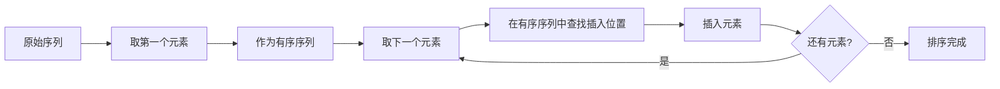
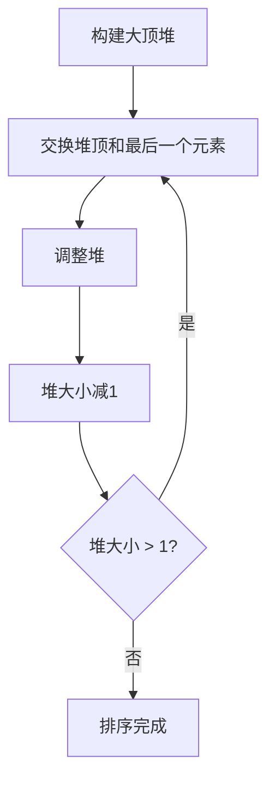
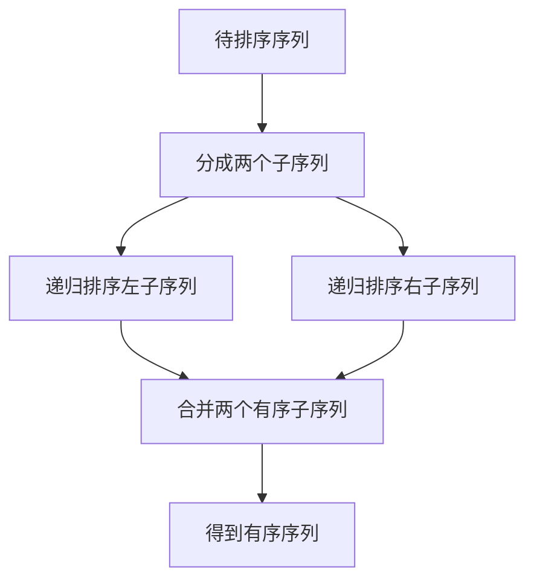

# 第8章：排序技术

> 本章学习目标：
> - 理解排序的基本概念和评价标准
> - 掌握插入排序算法（直接插入、折半插入、希尔排序）
> - 掌握交换排序算法（冒泡排序、快速排序）
> - 掌握选择排序算法（简单选择、堆排序）
> - 掌握归并排序和基数排序算法
> - 理解各种排序算法的时间复杂度和空间复杂度
> - 能够根据实际需求选择合适的排序算法
> - 理解外部排序的基本原理
> - 能够解决与排序相关的实际问题

---

## 8.1 排序的基本概念

### 8.1.1 排序的定义

**定义**：
排序（Sorting）是指将一个无序的记录序列（或数据元素）按照某个关键字的大小顺序重新排列，使之成为有序序列的过程。

**排序的目的**：
- 提高查找效率（有序表的查找效率远高于无序表）
- 便于数据的统计和分析
- 为其他算法（如二分查找）提供前提条件
- 满足特定应用需求（如排行榜、分类等）

**关键字（Key）**：
排序依据的数据项称为关键字。关键字可以是记录中的单个数据项，也可以是多个数据项的组合。

**示例**：

```cpp
struct Student {
    int id;         // 学号（关键字）
    string name;    // 姓名
    double score;   // 成绩（可作为另一个关键字）
    int age;        // 年龄
};

// 排序示例：
// - 按学号排序：按id字段升序或降序排列
// - 按成绩排序：按score字段排序
// - 按年龄排序：按age字段排序
```

### 8.1.2 排序的稳定性

**稳定性的定义**：
如果排序前后，**关键字相等**的记录的**相对顺序保持不变**，则称该排序算法是**稳定**的；否则称为**不稳定**的。

**稳定性示例**：

```
原始数据：
记录: [A, B, C, D, E]
关键字: [5, 3, 3, 5, 2]

按关键字升序排序：

稳定排序结果：
记录: [E, B, C, A, D]
关键字: [2, 3, 3, 5, 5]
      ↑  ↑     ↑  ↑
      相对顺序不变（B在C前，A在D前）

不稳定排序结果：
记录: [E, C, B, D, A]
关键字: [2, 3, 3, 5, 5]
      ↑  ↑     ↑  ↑
      相对顺序改变（B和C交换，A和D交换）
```

**稳定性对比表**：

| 排序算法 | 稳定性 | 说明 |
|----------|--------|------|
| **直接插入排序** | 稳定 | 相等元素不交换位置 |
| **折半插入排序** | 稳定 | 同上 |
| **希尔排序** | 不稳定 | 跨步长插入可能改变顺序 |
| **冒泡排序** | 稳定 | 相等时不交换 |
| **快速排序** | 不稳定 | 分区过程可能改变顺序 |
| **简单选择排序** | 不稳定 | 选择最小值时可能改变顺序 |
| **堆排序** | 不稳定 | 堆调整过程可能改变顺序 |
| **归并排序** | 稳定 | 合并时保持相对顺序 |
| **基数排序** | 稳定 | 按位排序时保持顺序 |

### 8.1.3 内部排序和外部排序

**内部排序（Internal Sort）**：
- 待排序的记录全部存放在计算机内存中
- 整个排序过程都在内存中进行
- 特点：速度快，但受内存容量限制
- 适用：数据量较小的场景

**外部排序（External Sort）**：
- 待排序的记录数量很大，不能全部放入内存
- 排序过程中需要对外存进行访问
- 特点：速度慢，但可处理海量数据
- 适用：数据量巨大的场景

**对比表**：

| 特性 | 内部排序 | 外部排序 |
|------|----------|----------|
| **数据存储** | 全部在内存中 | 内存+外存 |
| **数据规模** | 小规模 | 大规模（超过内存容量） |
| **访问速度** | 快 | 慢（受外存限制） |
| **I/O操作** | 少或无 | 频繁 |
| **典型算法** | 快速排序、堆排序等 | 多路归并、败者树等 |
| **应用场景** | 日常数据处理 | 数据库、大数据处理 |

### 8.1.4 排序算法的评价标准

**评价指标**：

| 评价指标 | 说明 |
|----------|------|
| **时间复杂度** | 算法执行时间与数据规模的关系 |
| **空间复杂度** | 算法所需辅助空间的大小 |
| **稳定性** | 相同关键字记录的相对顺序是否保持不变 |
| **适应性** | 对数据分布的适应能力（如基本有序的数据） |
| **简单性** | 算法的实现难度和代码复杂度 |

**时间复杂度分析**：

```
时间复杂度 = 比较次数 + 移动次数

排序操作的两个核心操作：
1. 比较操作：判断两个记录关键字的大小
2. 移动操作：改变记录的位置
```

**平均情况下的时间复杂度分级**：

| 时间复杂度 | 算法类型 | 特点 |
|-----------|----------|------|
| **O(n²)** | 简单排序 | 适用于小规模数据 |
| **O(n log n)** | 高级排序 | 适用于大规模数据 |
| **O(n)** | 特殊排序 | 适用于特定条件（如基数排序） |
| **O(n + k)** | 计数排序 | 适用于整数排序 |
| **O(d(n + r))** | 基数排序 | d为关键字位数，r为基数 |

### 8.1.5 排序算法分类

```
排序算法
  ├── 内部排序
  │     ├── 插入排序
  │     │     ├── 直接插入排序
  │     │     ├── 折半插入排序
  │     │     └── 希尔排序
  │     │
  │     ├── 交换排序
  │     │     ├── 冒泡排序
  │     │     └── 快速排序
  │     │
  │     ├── 选择排序
  │     │     ├── 简单选择排序
  │     │     └── 堆排序
  │     │
  │     ├── 归并排序
  │     └── 基数排序
  │
  └── 外部排序
        ├── 多路归并排序
        └── 败者树
```

---

## 8.2 插入排序

### 8.2.1 直接插入排序

**算法思想**：
将待排序的记录插入到已经排序的有序子表中，从而得到一个新的、记录数增1的有序表。

**排序过程**：



**示例**：

```
初始序列：[49, 38, 65, 97, 76, 13, 27]

第1轮：
有序区：[49]
插入38：[38, 49]

第2轮：
有序区：[38, 49]
插入65：[38, 49, 65]

第3轮：
有序区：[38, 49, 65]
插入97：[38, 49, 65, 97]

第4轮：
有序区：[38, 49, 65, 97]
插入76：[38, 49, 65, 76, 97]

第5轮：
有序区：[38, 49, 65, 76, 97]
插入13：[13, 38, 49, 65, 76, 97]

第6轮：
有序区：[13, 38, 49, 65, 76, 97]
插入27：[13, 27, 38, 49, 65, 76, 97]

最终结果：[13, 27, 38, 49, 65, 76, 97]
```

**C++实现**：

```cpp
#include <iostream>
#include <vector>
#include <algorithm>

/**
 * 直接插入排序（基础版）
 * @param arr 待排序数组
 * @param n 数组长度
 */
void insertion_sort(int arr[], int n) {
    for (int i = 1; i < n; ++i) {
        int key = arr[i];  // 待插入元素
        int j = i - 1;

        // 将大于key的元素向后移动
        while (j >= 0 && arr[j] > key) {
            arr[j + 1] = arr[j];
            --j;
        }

        // 插入key到正确位置
        arr[j + 1] = key;
    }
}

/**
 * 直接插入排序（C++风格）
 * @param arr 待排序vector
 */
void insertion_sort(std::vector<int>& arr) {
    for (size_t i = 1; i < arr.size(); ++i) {
        int key = arr[i];
        int j = static_cast<int>(i) - 1;

        while (j >= 0 && arr[j] > key) {
            arr[j + 1] = arr[j];
            --j;
        }

        arr[j + 1] = key;
    }
}

/**
 * 直接插入排序（带监视哨，优化版）
 * @param arr 待排序数组（arr[0]不存储数据，用作哨兵）
 * @param n 数组有效元素个数
 */
void insertion_sort_with_sentinel(int arr[], int n) {
    for (int i = 2; i <= n; ++i) {
        arr[0] = arr[i];  // 设置哨兵
        int j = i - 1;

        // 从后向前查找插入位置，无需判断j >= 0
        while (arr[j] > arr[0]) {
            arr[j + 1] = arr[j];
            --j;
        }

        arr[j + 1] = arr[0];  // 插入
    }
}

/**
 * 直接插入排序（泛型版本，C++20 concepts）
 */
#include <concepts>

template <typename T>
requires std::totally_ordered<T>
void insertion_sort_generic(T arr[], std::size_t n) {
    for (std::size_t i = 1; i < n; ++i) {
        T key = arr[i];
        std::size_t j = i;

        while (j > 0 && arr[j - 1] > key) {
            arr[j] = arr[j - 1];
            --j;
        }

        arr[j] = key;
    }
}

// 使用示例
int main() {
    int arr[] = {49, 38, 65, 97, 76, 13, 27};
    int n = sizeof(arr) / sizeof(arr[0]);

    std::cout << "排序前: ";
    for (int i = 0; i < n; ++i) {
        std::cout << arr[i] << " ";
    }
    std::cout << std::endl;

    insertion_sort(arr, n);

    std::cout << "排序后: ";
    for (int i = 0; i < n; ++i) {
        std::cout << arr[i] << " ";
    }
    std::cout << std::endl;

    return 0;
}
```

**复杂度分析**：

| 情况 | 比较次数 | 移动次数 | 时间复杂度 |
|------|----------|----------|-----------|
| **最好情况** | n-1次 | 0次（原数组已有序） | O(n) |
| **最坏情况** | n(n-1)/2次 | n(n-1)/2次（原数组逆序） | O(n²) |
| **平均情况** | n²/4次 | n²/4次 | O(n²) |

**空间复杂度**：
- O(1)，只需要一个辅助空间（key变量）

**稳定性**：
- 稳定

**适用场景**：

| 适用 | 不适用 |
|------|--------|
| 数据量较小 | 数据量较大 |
| 数据基本有序 | 数据完全随机 |
| 需要稳定排序 | 对时间效率要求高 |

### 8.2.2 折半插入排序

**算法思想**：
在直接插入排序的基础上，使用**二分查找**来确定插入位置，减少比较次数。

**优化点**：
- 查找插入位置：从O(n)优化到O(log n)
- 移动元素：仍然是O(n)

**C++实现**：

```cpp
#include <iostream>
#include <vector>

/**
 * 折半插入排序
 * @param arr 待排序数组
 * @param n 数组长度
 */
void binary_insertion_sort(int arr[], int n) {
    for (int i = 1; i < n; ++i) {
        int key = arr[i];

        // 使用二分查找确定插入位置
        int left = 0;
        int right = i - 1;

        while (left <= right) {
            int mid = left + (right - left) / 2;

            if (arr[mid] > key) {
                right = mid - 1;
            } else {
                left = mid + 1;
            }
        }

        // 将元素后移，腾出插入位置
        for (int j = i - 1; j >= left; --j) {
            arr[j + 1] = arr[j];
        }

        // 插入元素
        arr[left] = key;
    }
}

/**
 * 折半插入排序（C++风格）
 * @param arr 待排序vector
 */
void binary_insertion_sort(std::vector<int>& arr) {
    for (size_t i = 1; i < arr.size(); ++i) {
        int key = arr[i];

        // 使用二分查找确定插入位置
        int left = 0;
        int right = static_cast<int>(i) - 1;

        while (left <= right) {
            int mid = left + (right - left) / 2;

            if (arr[mid] > key) {
                right = mid - 1;
            } else {
                left = mid + 1;
            }
        }

        // 将元素后移，腾出插入位置
        for (int j = static_cast<int>(i) - 1; j >= left; --j) {
            arr[j + 1] = arr[j];
        }

        // 插入元素
        arr[left] = key;
    }
}

// 使用示例
int main() {
    int arr[] = {49, 38, 65, 97, 76, 13, 27};
    int n = sizeof(arr) / sizeof(arr[0]);

    std::cout << "排序前: ";
    for (int i = 0; i < n; ++i) {
        std::cout << arr[i] << " ";
    }
    std::cout << std::endl;

    binary_insertion_sort(arr, n);

    std::cout << "排序后: ";
    for (int i = 0; i < n; ++i) {
        std::cout << arr[i] << " ";
    }
    std::cout << std::endl;

    return 0;
}
```

**复杂度分析**：

| 情况 | 比较次数 | 移动次数 | 时间复杂度 |
|------|----------|----------|-----------|
| **最好情况** | n·log₂n次 | 0次 | O(n log n) |
| **最坏情况** | n·log₂n次 | n²/2次 | O(n²) |
| **平均情况** | n·log₂n次 | n²/4次 | O(n²) |

**与直接插入排序对比**：

| 算法 | 比较次数 | 移动次数 | 稳定性 |
|------|----------|----------|--------|
| 直接插入排序 | O(n²) | O(n²) | 稳定 |
| 折半插入排序 | O(n log n) | O(n²) | 稳定 |

**优势**：
- 减少了比较次数
- 适用于比较操作昂贵的场景

**劣势**：
- 移动次数没有减少
- 时间复杂度仍然是O(n²)

### 8.2.3 希尔排序（Shell Sort）

**算法思想**：
希尔排序又称**缩小增量排序**，是插入排序的改进版本。先将整个待排序的记录序列分割成若干子序列分别进行直接插入排序，待整个序列中的记录"基本有序"时，再对全体记录进行依次直接插入排序。

**关键概念**：
- **增量（Gap）**：用于分割序列的步长
- **子序列**：按增量间隔选取的元素组成的序列
- **增量序列**：一系列递减的增量值

**排序过程**：

```
初始序列：[49, 38, 65, 97, 76, 13, 27, 49, 55, 4]

第1轮：增量gap = 5
子序列1: [49, 13, 55]  -> [13, 49, 55]
子序列2: [38, 27, 4]   -> [4, 27, 38]
子序列3: [65, 49]      -> [49, 65]
子序列4: [97]          -> [97]
子序列5: [76]          -> [76]
结果：    [13, 4, 49, 97, 76, 49, 27, 65, 55, 38]

第2轮：增量gap = 2
子序列1: [13, 49, 76, 27, 55] -> [13, 27, 49, 55, 76]
子序列2: [4, 97, 49, 65, 38]  -> [4, 38, 49, 65, 97]
结果：    [13, 4, 27, 38, 49, 49, 55, 65, 76, 97]

第3轮：增量gap = 1
子序列1: [13, 4, 27, 38, 49, 49, 55, 65, 76, 97] -> [4, 13, 27, 38, 49, 49, 55, 65, 76, 97]
结果：    [4, 13, 27, 38, 49, 49, 55, 65, 76, 97]
```

**C++实现**：

```cpp
#include <iostream>
#include <vector>
#include <cmath>

/**
 * 希尔排序（Shell增量序列：gap = gap / 2）
 * @param arr 待排序数组
 * @param n 数组长度
 */
void shell_sort(int arr[], int n) {
    // 初始增量gap = n / 2，之后每次减半
    for (int gap = n / 2; gap > 0; gap /= 2) {
        // 对每个子序列进行直接插入排序
        for (int i = gap; i < n; ++i) {
            int key = arr[i];
            int j = i;

            // 在子序列中查找插入位置
            while (j >= gap && arr[j - gap] > key) {
                arr[j] = arr[j - gap];
                j -= gap;
            }

            arr[j] = key;
        }
    }
}

/**
 * 希尔排序（Hibbard增量序列：gap = 2^k - 1）
 * 时间复杂度：O(n^(3/2))
 */
void shell_sort_hibbard(int arr[], int n) {
    // 计算初始增量
    int gap = 1;
    while (gap < n / 3) {
        gap = gap * 2 + 1;  // 1, 3, 7, 15, 31, ...
    }

    // 逐步减小增量
    while (gap > 0) {
        for (int i = gap; i < n; ++i) {
            int key = arr[i];
            int j = i;

            while (j >= gap && arr[j - gap] > key) {
                arr[j] = arr[j - gap];
                j -= gap;
            }

            arr[j] = key;
        }

        gap /= 2;
    }
}

/**
 * 希尔排序（Sedgewick增量序列）
 * 时间复杂度：O(n^(4/3))
 */
void shell_sort_sedgewick(int arr[], int n) {
    // Sedgewick增量序列
    std::vector<int> sedgewick_gaps = {1, 5, 19, 41, 109, 209, 505, 929, 2161, 3905};

    // 找到合适的初始增量
    int gap_index = 0;
    while (gap_index < sedgewick_gaps.size() && sedgewick_gaps[gap_index] < n / 3) {
        gap_index++;
    }

    // 从大到小使用增量
    for (int k = gap_index; k >= 0; --k) {
        int gap = sedgewick_gaps[k];

        for (int i = gap; i < n; ++i) {
            int key = arr[i];
            int j = i;

            while (j >= gap && arr[j - gap] > key) {
                arr[j] = arr[j - gap];
                j -= gap;
            }

            arr[j] = key;
        }
    }
}

/**
 * 希尔排序（C++风格）
 * @param arr 待排序vector
 */
void shell_sort(std::vector<int>& arr) {
    int n = arr.size();

    for (int gap = n / 2; gap > 0; gap /= 2) {
        for (int i = gap; i < n; ++i) {
            int key = arr[i];
            int j = i;

            while (j >= gap && arr[j - gap] > key) {
                arr[j] = arr[j - gap];
                j -= gap;
            }

            arr[j] = key;
        }
    }
}

// 使用示例
int main() {
    int arr[] = {49, 38, 65, 97, 76, 13, 27, 49, 55, 4};
    int n = sizeof(arr) / sizeof(arr[0]);

    std::cout << "排序前: ";
    for (int i = 0; i < n; ++i) {
        std::cout << arr[i] << " ";
    }
    std::cout << std::endl;

    shell_sort(arr, n);

    std::cout << "排序后: ";
    for (int i = 0; i < n; ++i) {
        std::cout << arr[i] << " ";
    }
    std::cout << std::endl;

    return 0;
}
```

**增量序列对比**：

| 增量序列 | 公式 | 时间复杂度 | 特点 |
|----------|------|-----------|------|
| **Shell** | gap = gap / 2 | O(n²) | 简单，但效率较低 |
| **Hibbard** | gap = 2^k - 1 | O(n^(3/2)) | 效率较好 |
| **Sedgewick** | 9×4^i - 9×2^i + 1 或 4^i - 3×2^i + 1 | O(n^(4/3)) | 效率很好 |
| **Knuth** | gap = (3^k - 1) / 2 | O(n^(3/2)) | 常用，效率好 |

**复杂度分析**：

| 增量序列 | 最好情况 | 最坏情况 | 平均情况 | 空间复杂度 | 稳定性 |
|----------|----------|----------|----------|-----------|--------|
| **Shell** | O(n log n) | O(n²) | O(n^1.3) | O(1) | 不稳定 |
| **Hibbard** | O(n log n) | O(n^(3/2)) | O(n^(5/4)) | O(1) | 不稳定 |
| **Sedgewick** | O(n log n) | O(n^(4/3)) | O(n^(7/6)) | O(1) | 不稳定 |

**稳定性**：
- 不稳定

**适用场景**：

| 适用 | 不适用 |
|------|--------|
| 中等规模数据 | 需要稳定排序 |
| 对时间效率有一定要求 | 数据量很大（用快速排序） |
| 代码实现简单优先 | 最优性能要求 |

---

## 8.3 交换排序

### 8.3.1 冒泡排序

**算法思想**：
通过多次遍历待排序序列，每次比较相邻的两个元素，如果顺序错误就交换它们的位置。每次遍历都会将当前最大（或最小）的元素"冒泡"到序列的一端。

**排序过程**：

```mermaid
graph TD
    A[开始] --> B[flag = false]
    B --> C[j = 0]
    C --> D{j < n-1-i?}
    D -->|是| E{arr[j] > arr[j+1]?}
    E -->|是| F[交换arr[j]和arr[j+1]]
    E -->|否| G[j++]
    F --> G
    G --> D
    D -->|否| H{flag == true?}
    H -->|是| I[i++]
    H -->|否| J[排序完成]
    I --> B
```

**示例**：

```
初始序列：[49, 38, 65, 97, 76, 13, 27]

第1轮（i=0）：
比较并交换：
[38, 49, 65, 97, 76, 13, 27]  (交换49和38)
[38, 49, 65, 97, 76, 13, 27]  (不交换)
[38, 49, 65, 97, 76, 13, 27]  (不交换)
[38, 49, 65, 76, 97, 13, 27]  (交换97和76)
[38, 49, 65, 76, 13, 97, 27]  (交换97和13)
[38, 49, 65, 76, 13, 27, 97]  (交换97和27)
最大元素97已归位

第2轮（i=1）：
[38, 49, 65, 76, 13, 27, 97]
[38, 49, 65, 13, 27, 76, 97]  (交换76和13, 76和27)
次大元素76已归位

第3轮（i=2）：
[38, 49, 65, 13, 27, 76, 97]
[38, 49, 13, 27, 65, 76, 97]
第三大元素65已归位

第4轮（i=3）：
[38, 13, 27, 49, 65, 76, 97]
第四大元素49已归位

第5轮（i=4）：
[13, 27, 38, 49, 65, 76, 97]
第五大元素38已归位

第6轮（i=5）：
[13, 27, 38, 49, 65, 76, 97]
没有发生交换，排序完成

最终结果：[13, 27, 38, 49, 65, 76, 97]
```

**C++实现**：

```cpp
#include <iostream>
#include <vector>

/**
 * 冒泡排序（基础版）
 * @param arr 待排序数组
 * @param n 数组长度
 */
void bubble_sort(int arr[], int n) {
    for (int i = 0; i < n - 1; ++i) {
        for (int j = 0; j < n - 1 - i; ++j) {
            if (arr[j] > arr[j + 1]) {
                // 交换相邻元素
                std::swap(arr[j], arr[j + 1]);
            }
        }
    }
}

/**
 * 冒泡排序（优化版：提前终止）
 * @param arr 待排序数组
 * @param n 数组长度
 */
void bubble_sort_optimized(int arr[], int n) {
    bool swapped;

    for (int i = 0; i < n - 1; ++i) {
        swapped = false;

        for (int j = 0; j < n - 1 - i; ++j) {
            if (arr[j] > arr[j + 1]) {
                std::swap(arr[j], arr[j + 1]);
                swapped = true;
            }
        }

        // 如果本轮没有发生交换，说明已经有序
        if (!swapped) {
            break;
        }
    }
}

/**
 * 冒泡排序（双向冒泡，又称鸡尾酒排序）
 * @param arr 待排序数组
 * @param n 数组长度
 */
void bubble_sort_bidirectional(int arr[], int n) {
    int left = 0;
    int right = n - 1;

    while (left < right) {
        // 从左到右冒泡，将最大元素移到右边
        for (int i = left; i < right; ++i) {
            if (arr[i] > arr[i + 1]) {
                std::swap(arr[i], arr[i + 1]);
            }
        }
        --right;

        // 从右到左冒泡，将最小元素移到左边
        for (int i = right; i > left; --i) {
            if (arr[i] < arr[i - 1]) {
                std::swap(arr[i], arr[i - 1]);
            }
        }
        ++left;
    }
}

/**
 * 冒泡排序（C++风格）
 * @param arr 待排序vector
 */
void bubble_sort(std::vector<int>& arr) {
    int n = arr.size();

    for (int i = 0; i < n - 1; ++i) {
        bool swapped = false;

        for (int j = 0; j < n - 1 - i; ++j) {
            if (arr[j] > arr[j + 1]) {
                std::swap(arr[j], arr[j + 1]);
                swapped = true;
            }
        }

        if (!swapped) {
            break;
        }
    }
}

// 使用示例
int main() {
    int arr[] = {49, 38, 65, 97, 76, 13, 27};
    int n = sizeof(arr) / sizeof(arr[0]);

    std::cout << "排序前: ";
    for (int i = 0; i < n; ++i) {
        std::cout << arr[i] << " ";
    }
    std::cout << std::endl;

    bubble_sort_optimized(arr, n);

    std::cout << "排序后: ";
    for (int i = 0; i < n; ++i) {
        std::cout << arr[i] << " ";
    }
    std::cout << std::endl;

    return 0;
}
```

**复杂度分析**：

| 情况 | 比较次数 | 交换次数 | 时间复杂度 |
|------|----------|----------|-----------|
| **最好情况** | n-1次 | 0次（优化版） | O(n) |
| **最坏情况** | n(n-1)/2次 | n(n-1)/2次 | O(n²) |
| **平均情况** | n²/2次 | n²/4次 | O(n²) |

**空间复杂度**：
- O(1)

**稳定性**：
- 稳定

**适用场景**：

| 适用 | 不适用 |
|------|--------|
| 数据量很小 | 数据量较大 |
| 数据基本有序 | 对时间效率要求高 |
| 需要稳定排序 | 内存有限 |

### 8.3.2 快速排序（Quick Sort）

**算法思想**：
快速排序采用**分治法**策略：
1. **选择基准（Pivot）**：从序列中选择一个元素作为基准
2. **分区（Partition）**：将序列分为两部分，使得左边部分的元素都小于等于基准，右边部分的元素都大于等于基准
3. **递归排序**：对左右两部分分别进行快速排序

**分区过程**：

```mermaid
graph TD
    A[选择基准pivot] --> B[i = low, j = high]
    B --> C{i < j?}
    C -->|是| D{arr[j] >= pivot?}
    D -->|是| E[j--]
    D -->|否| F[arr[i] = arr[j], i++]
    E --> D
    F --> G{arr[i] <= pivot?}
    G -->|是| H[i++]
    G -->|否| I[arr[j] = arr[i], j--]
    H --> G
    I --> C
    C -->|否| J[arr[i] = pivot]
    J --> K[返回i]
```

**示例**：

```
初始序列：[49, 38, 65, 97, 76, 13, 27]
选择基准：49

分区过程：
[49, 38, 65, 97, 76, 13, 27]
 i=0                        j=6

步骤1：从右向左找第一个小于49的元素
[49, 38, 65, 97, 76, 13, 27]
                          j=6, 27 < 49, 填入i位置
[27, 38, 65, 97, 76, 13, 27]
 i=0                        j=6

步骤2：从左向右找第一个大于49的元素
[27, 38, 65, 97, 76, 13, 27]
        i=2, 65 > 49, 填入j位置
[27, 38, 65, 97, 76, 13, 65]
        i=2                  j=6

步骤3：从右向左找第一个小于49的元素
[27, 38, 65, 97, 76, 13, 65]
                  j=5, 13 < 49, 填入i位置
[27, 38, 13, 97, 76, 13, 65]
        i=2                  j=5

步骤4：从左向右找第一个大于49的元素
[27, 38, 13, 97, 76, 13, 65]
             i=3, 97 > 49, 填入j位置
[27, 38, 13, 97, 76, 97, 65]
             i=3            j=5

步骤5：i == j，填入基准
[27, 38, 13, 49, 76, 97, 65]

分区结果：
左子序列：[27, 38, 13]  (所有元素 < 49)
基准：49
右子序列：[76, 97, 65]  (所有元素 > 49)

递归排序左子序列：
[13, 27, 38]

递归排序右子序列：
[65, 76, 97]

最终结果：[13, 27, 38, 49, 65, 76, 97]
```

**C++实现（基础版）**：

```cpp
#include <iostream>
#include <vector>
#include <algorithm>

/**
 * 分区函数（基础版）
 * @param arr 待排序数组
 * @param low 起始索引
 * @param high 结束索引
 * @return 基准的最终位置
 */
int partition(int arr[], int low, int high) {
    int pivot = arr[low];  // 选择第一个元素作为基准
    int i = low;
    int j = high;

    while (i < j) {
        // 从右向左找第一个小于基准的元素
        while (i < j && arr[j] >= pivot) {
            --j;
        }
        if (i < j) {
            arr[i] = arr[j];
            ++i;
        }

        // 从左向右找第一个大于基准的元素
        while (i < j && arr[i] <= pivot) {
            ++i;
        }
        if (i < j) {
            arr[j] = arr[i];
            --j;
        }
    }

    arr[i] = pivot;  // 将基准放到正确位置
    return i;
}

/**
 * 快速排序（递归，基础版）
 * @param arr 待排序数组
 * @param low 起始索引
 * @param high 结束索引
 */
void quick_sort_recursive(int arr[], int low, int high) {
    if (low < high) {
        // 分区
        int pivot_pos = partition(arr, low, high);

        // 递归排序左子序列
        quick_sort_recursive(arr, low, pivot_pos - 1);

        // 递归排序右子序列
        quick_sort_recursive(arr, pivot_pos + 1, high);
    }
}

/**
 * 快速排序（递归，封装版）
 * @param arr 待排序数组
 * @param n 数组长度
 */
void quick_sort(int arr[], int n) {
    quick_sort_recursive(arr, 0, n - 1);
}
```

**C++实现（优化版：三数取中）**：

```cpp
/**
 * 三数取中法选择基准
 * @param arr 待排序数组
 * @param low 起始索引
 * @param high 结束索引
 * @return 基准值
 */
int median_of_three(int arr[], int low, int high) {
    int mid = low + (high - low) / 2;

    // 确保arr[low] <= arr[mid] <= arr[high]
    if (arr[low] > arr[mid]) {
        std::swap(arr[low], arr[mid]);
    }
    if (arr[mid] > arr[high]) {
        std::swap(arr[mid], arr[high]);
    }
    if (arr[low] > arr[mid]) {
        std::swap(arr[low], arr[mid]);
    }

    // 将中位数放到high-1位置
    std::swap(arr[mid], arr[high - 1]);

    return arr[high - 1];
}

/**
 * 分区函数（三数取中优化）
 */
int partition_optimized(int arr[], int low, int high) {
    // 使用三数取中法选择基准
    int pivot = median_of_three(arr, low, high);

    int i = low;
    int j = high - 1;  // 基准已经放在high-1位置

    while (i < j) {
        while (i < j && arr[i] <= pivot) {
            ++i;
        }
        while (i < j && arr[j] >= pivot) {
            --j;
        }
        if (i < j) {
            std::swap(arr[i], arr[j]);
        }
    }

    // 将基准放到正确位置
    std::swap(arr[i], arr[high - 1]);
    return i;
}

/**
 * 快速排序（三数取中优化）
 */
void quick_sort_optimized(int arr[], int low, int high) {
    // 小数组使用插入排序
    if (high - low + 1 <= 10) {
        insertion_sort(arr + low, high - low + 1);
        return;
    }

    if (low < high) {
        int pivot_pos = partition_optimized(arr, low, high);
        quick_sort_optimized(arr, low, pivot_pos - 1);
        quick_sort_optimized(arr, pivot_pos + 1, high);
    }
}
```

**C++实现（优化版：小数组插入排序）**：

```cpp
/**
 * 快速排序（混合优化：三数取中 + 小数组插入排序）
 */
void quick_sort_hybrid(int arr[], int low, int high) {
    // 小数组使用插入排序（阈值一般为10-20）
    if (high - low + 1 <= 10) {
        for (int i = low + 1; i <= high; ++i) {
            int key = arr[i];
            int j = i - 1;

            while (j >= low && arr[j] > key) {
                arr[j + 1] = arr[j];
                --j;
            }

            arr[j + 1] = key;
        }
        return;
    }

    if (low < high) {
        // 三数取中
        int pivot = median_of_three(arr, low, high);
        int i = low;
        int j = high - 1;

        while (i < j) {
            while (i < j && arr[i] <= pivot) {
                ++i;
            }
            while (i < j && arr[j] >= pivot) {
                --j;
            }
            if (i < j) {
                std::swap(arr[i], arr[j]);
            }
        }

        std::swap(arr[i], arr[high - 1]);

        quick_sort_hybrid(arr, low, i - 1);
        quick_sort_hybrid(arr, i + 1, high);
    }
}
```

**C++实现（非递归版）**：

```cpp
#include <stack>

/**
 * 快速排序（非递归，使用栈）
 * @param arr 待排序数组
 * @param low 起始索引
 * @param high 结束索引
 */
void quick_sort_iterative(int arr[], int low, int high) {
    std::stack<std::pair<int, int>> stack;

    // 初始范围入栈
    stack.push({low, high});

    while (!stack.empty()) {
        // 弹出当前范围
        auto [current_low, current_high] = stack.top();
        stack.pop();

        if (current_low < current_high) {
            // 分区
            int pivot_pos = partition(arr, current_low, current_high);

            // 将子序列范围入栈（先处理右子序列，后处理左子序列）
            stack.push({current_low, pivot_pos - 1});
            stack.push({pivot_pos + 1, current_high});
        }
    }
}
```

**C++实现（C++风格）**：

```cpp
/**
 * 快速排序（C++风格，使用迭代器）
 */
template <typename RandomIt>
void quick_sort_cpp(RandomIt first, RandomIt last) {
    if (first >= last) return;

    auto pivot = *first;
    auto left = first;
    auto right = last - 1;

    while (left < right) {
        while (left < right && *right >= pivot) {
            --right;
        }
        if (left < right) {
            *left = *right;
            ++left;
        }

        while (left < right && *left <= pivot) {
            ++left;
        }
        if (left < right) {
            *right = *left;
            --right;
        }
    }

    *left = pivot;

    quick_sort_cpp(first, left);
    quick_sort_cpp(left + 1, last);
}

/**
 * 快速排序（vector版本）
 */
void quick_sort(std::vector<int>& arr) {
    quick_sort_cpp(arr.begin(), arr.end());
}

// 使用示例
int main() {
    int arr[] = {49, 38, 65, 97, 76, 13, 27};
    int n = sizeof(arr) / sizeof(arr[0]);

    std::cout << "排序前: ";
    for (int i = 0; i < n; ++i) {
        std::cout << arr[i] << " ";
    }
    std::cout << std::endl;

    quick_sort_hybrid(arr, 0, n - 1);

    std::cout << "排序后: ";
    for (int i = 0; i < n; ++i) {
        std::cout << arr[i] << " ";
    }
    std::cout << std::endl;

    return 0;
}
```

**复杂度分析**：

| 情况 | 比较次数 | 时间复杂度 | 空间复杂度 |
|------|----------|-----------|-----------|
| **最好情况** | n log n | O(n log n) | O(log n) |
| **最坏情况** | n²/2 | O(n²) | O(n) |
| **平均情况** | 1.38 n log n | O(n log n) | O(log n) |

**空间复杂度**：
- 递归：O(log n)（平均），O(n)（最坏）
- 非递归：O(log n)

**稳定性**：
- 不稳定

**优化策略**：

| 优化策略 | 效果 |
|----------|------|
| **三数取中** | 避免最坏情况 |
| **小数组插入排序** | 减少递归深度 |
| **随机选择基准** | 避免最坏情况 |
| **非递归实现** | 避免栈溢出 |
| **三路分区** | 处理大量重复元素 |

**适用场景**：

| 适用 | 不适用 |
|------|--------|
| 大规模数据 | 需要稳定排序 |
| 内存充足 | 数据基本有序（插入排序更好） |
| 对时间效率要求高 | 小规模数据（插入排序更好） |

---

## 8.4 选择排序

### 8.4.1 简单选择排序

**算法思想**：
每次从待排序的记录中选择关键字最小的记录，将其放到已排序序列的末尾。

**排序过程**：

```mermaid
graph TD
    A[开始] --> B[i = 0]
    B --> C{min_index = i, j = i+1}
    C --> D{j < n?}
    D -->|是| E{arr[j] < arr[min_index]?}
    E -->|是| F[min_index = j]
    E -->|否| G[j++]
    F --> G
    G --> D
    D -->|否| H{min_index != i?}
    H -->|是| I[交换arr[i]和arr[min_index]]
    H -->|否| J[i++]
    I --> J
    J --> K{i < n-1?}
    K -->|是| C
    K -->|否| L[排序完成]
```

**示例**：

```
初始序列：[49, 38, 65, 97, 76, 13, 27]

第1轮（i=0）：
在[49, 38, 65, 97, 76, 13, 27]中找最小值
最小值：13，位置：5
交换arr[0]和arr[5]：[13, 38, 65, 97, 76, 49, 27]

第2轮（i=1）：
在[38, 65, 97, 76, 49, 27]中找最小值
最小值：27，位置：6
交换arr[1]和arr[6]：[13, 27, 65, 97, 76, 49, 38]

第3轮（i=2）：
在[65, 97, 76, 49, 38]中找最小值
最小值：38，位置：6
交换arr[2]和arr[6]：[13, 27, 38, 97, 76, 49, 65]

第4轮（i=3）：
在[97, 76, 49, 65]中找最小值
最小值：49，位置：5
交换arr[3]和arr[5]：[13, 27, 38, 49, 76, 97, 65]

第5轮（i=4）：
在[76, 97, 65]中找最小值
最小值：65，位置：6
交换arr[4]和arr[6]：[13, 27, 38, 49, 65, 97, 76]

第6轮（i=5）：
在[97, 76]中找最小值
最小值：76，位置：6
交换arr[5]和arr[6]：[13, 27, 38, 49, 65, 76, 97]

最终结果：[13, 27, 38, 49, 65, 76, 97]
```

**C++实现**：

```cpp
#include <iostream>
#include <vector>

/**
 * 简单选择排序
 * @param arr 待排序数组
 * @param n 数组长度
 */
void selection_sort(int arr[], int n) {
    for (int i = 0; i < n - 1; ++i) {
        int min_index = i;  // 假设当前位置是最小值

        // 在剩余元素中查找最小值
        for (int j = i + 1; j < n; ++j) {
            if (arr[j] < arr[min_index]) {
                min_index = j;
            }
        }

        // 将最小值交换到正确位置
        if (min_index != i) {
            std::swap(arr[i], arr[min_index]);
        }
    }
}

/**
 * 简单选择排序（C++风格）
 * @param arr 待排序vector
 */
void selection_sort(std::vector<int>& arr) {
    int n = arr.size();

    for (int i = 0; i < n - 1; ++i) {
        int min_index = i;

        for (int j = i + 1; j < n; ++j) {
            if (arr[j] < arr[min_index]) {
                min_index = j;
            }
        }

        if (min_index != i) {
            std::swap(arr[i], arr[min_index]);
        }
    }
}

/**
 * 简单选择排序（同时找最大值和最小值，优化版）
 */
void selection_sort_optimized(int arr[], int n) {
    int left = 0;
    int right = n - 1;

    while (left < right) {
        int min_index = left;
        int max_index = left;

        // 在当前范围内查找最小值和最大值
        for (int i = left; i <= right; ++i) {
            if (arr[i] < arr[min_index]) {
                min_index = i;
            }
            if (arr[i] > arr[max_index]) {
                max_index = i;
            }
        }

        // 将最小值放到左边
        std::swap(arr[left], arr[min_index]);

        // 如果最大值在left位置，需要更新max_index
        if (max_index == left) {
            max_index = min_index;
        }

        // 将最大值放到右边
        std::swap(arr[right], arr[max_index]);

        ++left;
        --right;
    }
}

// 使用示例
int main() {
    int arr[] = {49, 38, 65, 97, 76, 13, 27};
    int n = sizeof(arr) / sizeof(arr[0]);

    std::cout << "排序前: ";
    for (int i = 0; i < n; ++i) {
        std::cout << arr[i] << " ";
    }
    std::cout << std::endl;

    selection_sort(arr, n);

    std::cout << "排序后: ";
    for (int i = 0; i < n; ++i) {
        std::cout << arr[i] << " ";
    }
    std::cout << std::endl;

    return 0;
}
```

**复杂度分析**：

| 情况 | 比较次数 | 移动次数 | 时间复杂度 |
|------|----------|----------|-----------|
| **最好情况** | n(n-1)/2次 | 0次 | O(n²) |
| **最坏情况** | n(n-1)/2次 | 3(n-1)次 | O(n²) |
| **平均情况** | n(n-1)/2次 | O(n)次 | O(n²) |

**空间复杂度**：
- O(1)

**稳定性**：
- 不稳定（交换可能改变相等元素的相对顺序）

**适用场景**：

| 适用 | 不适用 |
|------|--------|
| 数据量很小 | 数据量较大 |
| 交换操作代价大 | 对时间效率要求高 |
| 内存有限 | 需要稳定排序 |

### 8.4.2 堆排序（Heap Sort）

**算法思想**：
利用**堆**这种数据结构进行排序。堆排序的核心是：
1. 将待排序序列构造成一个大顶堆（或小顶堆）
2. 将堆顶元素（最大值或最小值）与堆的最后一个元素交换
3. 调整剩余元素，使其重新成为一个堆
4. 重复步骤2-3，直到排序完成

**堆的定义**：

**大顶堆（Max Heap）**：
- 堆顶元素是整个堆的最大值
- 对于任意节点i，其值大于等于其左右子节点的值
- `arr[i] >= arr[2i+1]` 且 `arr[i] >= arr[2i+2]`

**小顶堆（Min Heap）**：
- 堆顶元素是整个堆的最小值
- 对于任意节点i，其值小于等于其左右子节点的值
- `arr[i] <= arr[2i+1]` 且 `arr[i] <= arr[2i+2]`

**堆的示例**：

```
大顶堆示例：
        97
       /  \
     76    65
    /  \  /  \
   49  38 13  27

数组表示：[97, 76, 65, 49, 38, 13, 27]
索引关系：
- 父节点：(i-1)/2
- 左子节点：2i+1
- 右子节点：2i+2
```

**堆排序过程**：



**示例**：

```
初始序列：[49, 38, 65, 97, 76, 13, 27]

步骤1：构建大顶堆
从最后一个非叶子节点开始调整
        49
       /  \
     38    65
    /  \  /  \
   49  38 13  27

调整后：
        97
       /  \
     76    65
    /  \  /  \
   49  38 13  27

数组：[97, 76, 65, 49, 38, 13, 27]

步骤2：交换堆顶和最后一个元素，调整堆
交换97和27：[27, 76, 65, 49, 38, 13, 97]
调整堆：
        76
       /  \
     49    65
    /  \  /
   27  38 13

数组：[76, 49, 65, 27, 38, 13, 97]

步骤3：重复步骤2
交换76和13：[13, 49, 65, 27, 38, 76, 97]
调整堆：
        65
       /  \
     49    13
    /  \
   27  38

数组：[65, 49, 13, 27, 38, 76, 97]

步骤4：继续
交换65和38：[38, 49, 13, 27, 65, 76, 97]
调整堆：
        49
       /  \
     38    13
    /
   27

数组：[49, 38, 13, 27, 65, 76, 97]

步骤5：继续
交换49和27：[27, 38, 13, 49, 65, 76, 97]
调整堆：
        38
       /  \
     27    13

数组：[38, 27, 13, 49, 65, 76, 97]

步骤6：继续
交换38和13：[13, 27, 38, 49, 65, 76, 97]
调整堆：
        27
       /
     13

数组：[27, 13, 38, 49, 65, 76, 97]

步骤7：继续
交换27和13：[13, 27, 38, 49, 65, 76, 97]

最终结果：[13, 27, 38, 49, 65, 76, 97]
```

**C++实现**：

```cpp
#include <iostream>
#include <vector>

/**
 * 堆调整（大顶堆）
 * @param arr 待排序数组
 * @param n 堆的大小
 * @param i 需要调整的节点索引
 */
void heapify(int arr[], int n, int i) {
    int largest = i;        // 假设当前节点是最大值
    int left = 2 * i + 1;   // 左子节点
    int right = 2 * i + 2;  // 右子节点

    // 如果左子节点大于当前最大值
    if (left < n && arr[left] > arr[largest]) {
        largest = left;
    }

    // 如果右子节点大于当前最大值
    if (right < n && arr[right] > arr[largest]) {
        largest = right;
    }

    // 如果最大值不是当前节点，交换并继续调整
    if (largest != i) {
        std::swap(arr[i], arr[largest]);
        heapify(arr, n, largest);  // 递归调整受影响的子树
    }
}

/**
 * 构建大顶堆
 * @param arr 待排序数组
 * @param n 数组长度
 */
void build_max_heap(int arr[], int n) {
    // 从最后一个非叶子节点开始，从下往上调整
    // 最后一个非叶子节点的索引：(n-2)/2 或 n/2-1
    for (int i = n / 2 - 1; i >= 0; --i) {
        heapify(arr, n, i);
    }
}

/**
 * 堆排序
 * @param arr 待排序数组
 * @param n 数组长度
 */
void heap_sort(int arr[], int n) {
    // 1. 构建大顶堆
    build_max_heap(arr, n);

    // 2. 逐个提取堆顶元素
    for (int i = n - 1; i > 0; --i) {
        // 交换堆顶（最大值）和当前堆的最后一个元素
        std::swap(arr[0], arr[i]);

        // 调整剩余元素，使其重新成为堆
        heapify(arr, i, 0);
    }
}

/**
 * 堆排序（C++风格）
 * @param arr 待排序vector
 */
void heap_sort(std::vector<int>& arr) {
    int n = arr.size();

    // 构建大顶堆
    for (int i = n / 2 - 1; i >= 0; --i) {
        heapify(arr.data(), n, i);
    }

    // 逐个提取堆顶元素
    for (int i = n - 1; i > 0; --i) {
        std::swap(arr[0], arr[i]);
        heapify(arr.data(), i, 0);
    }
}

/**
 * 堆排序（小顶堆，降序排序）
 */
void heap_sort_descending(int arr[], int n) {
    // 构建小顶堆
    auto heapify_min = [&](int n, int i) {
        int smallest = i;
        int left = 2 * i + 1;
        int right = 2 * i + 2;

        if (left < n && arr[left] < arr[smallest]) {
            smallest = left;
        }

        if (right < n && arr[right] < arr[smallest]) {
            smallest = right;
        }

        if (smallest != i) {
            std::swap(arr[i], arr[smallest]);
            heapify_min(n, smallest);
        }
    };

    // 构建小顶堆
    for (int i = n / 2 - 1; i >= 0; --i) {
        heapify_min(n, i);
    }

    // 逐个提取堆顶元素
    for (int i = n - 1; i > 0; --i) {
        std::swap(arr[0], arr[i]);
        heapify_min(i, 0);
    }
}

// 使用示例
int main() {
    int arr[] = {49, 38, 65, 97, 76, 13, 27};
    int n = sizeof(arr) / sizeof(arr[0]);

    std::cout << "排序前: ";
    for (int i = 0; i < n; ++i) {
        std::cout << arr[i] << " ";
    }
    std::cout << std::endl;

    heap_sort(arr, n);

    std::cout << "排序后: ";
    for (int i = 0; i < n; ++i) {
        std::cout << arr[i] << " ";
    }
    std::cout << std::endl;

    return 0;
}
```

**复杂度分析**：

| 情况 | 比较次数 | 移动次数 | 时间复杂度 |
|------|----------|----------|-----------|
| **最好情况** | O(n log n) | O(n log n) | O(n log n) |
| **最坏情况** | O(n log n) | O(n log n) | O(n log n) |
| **平均情况** | O(n log n) | O(n log n) | O(n log n) |

**空间复杂度**：
- O(1)（原地排序）

**稳定性**：
- 不稳定

**堆排序的特点**：

| 特点 | 说明 |
|------|------|
| **时间复杂度稳定** | 最好、最坏、平均都是O(n log n) |
| **空间复杂度低** | 只需要O(1)的额外空间 |
| **不稳定性** | 堆调整过程可能改变相等元素的顺序 |
| **最坏情况性能好** | 比快速排序的最坏情况好 |
| **不适合小规模数据** | 常数因子较大 |

**适用场景**：

| 适用 | 不适用 |
|------|--------|
| 大规模数据 | 小规模数据 |
| 对最坏情况性能要求高 | 需要稳定排序 |
| 内存有限 | 数据基本有序 |
| 顺序存储（数组） | 链式存储 |

---

## 8.5 归并排序

### 8.5.1 归并排序的基本概念

**算法思想**：
归并排序采用**分治法**策略：
1. **分解**：将待排序序列分成两个子序列
2. **递归**：对两个子序列分别进行归并排序
3. **合并**：将两个有序子序列合并成一个有序序列

**归并过程**：



**归并排序示例**：

```
初始序列：[49, 38, 65, 97, 76, 13, 27]

分解过程：
[49, 38, 65, 97, 76, 13, 27]
        ↓
[49, 38, 65]  [97, 76, 13, 27]
        ↓
[49]  [38, 65]  [97]  [76, 13, 27]
        ↓
[49]  [38]  [65]  [97]  [76]  [13, 27]
                              ↓
[49]  [38]  [65]  [97]  [76]  [13]  [27]

合并过程：
[38, 65]
[13, 27]
[76, 13, 27]
[49, 38, 65]
[97, 76, 13, 27]
[13, 27, 38, 49, 65, 76, 97]
```

### 8.5.2 二路归并排序（递归实现）

**C++实现**：

```cpp
#include <iostream>
#include <vector>

/**
 * 合并两个有序子序列
 * @param arr 待排序数组
 * @param left 左子序列起始索引
 * @param mid 中间索引（左子序列结束索引）
 * @param right 右子序列结束索引
 */
void merge(int arr[], int left, int mid, int right) {
    // 计算两个子序列的长度
    int n1 = mid - left + 1;
    int n2 = right - mid;

    // 创建临时数组
    int* L = new int[n1];
    int* R = new int[n2];

    // 复制数据到临时数组
    for (int i = 0; i < n1; ++i) {
        L[i] = arr[left + i];
    }
    for (int j = 0; j < n2; ++j) {
        R[j] = arr[mid + 1 + j];
    }

    // 合并两个有序子序列
    int i = 0;    // 左子序列索引
    int j = 0;    // 右子序列索引
    int k = left; // 合并后数组的索引

    while (i < n1 && j < n2) {
        if (L[i] <= R[j]) {
            arr[k] = L[i];
            ++i;
        } else {
            arr[k] = R[j];
            ++j;
        }
        ++k;
    }

    // 复制左子序列剩余元素
    while (i < n1) {
        arr[k] = L[i];
        ++i;
        ++k;
    }

    // 复制右子序列剩余元素
    while (j < n2) {
        arr[k] = R[j];
        ++j;
        ++k;
    }

    // 释放临时数组
    delete[] L;
    delete[] R;
}

/**
 * 归并排序（递归）
 * @param arr 待排序数组
 * @param left 起始索引
 * @param right 结束索引
 */
void merge_sort_recursive(int arr[], int left, int right) {
    if (left < right) {
        // 计算中间索引
        int mid = left + (right - left) / 2;

        // 递归排序左子序列
        merge_sort_recursive(arr, left, mid);

        // 递归排序右子序列
        merge_sort_recursive(arr, mid + 1, right);

        // 合并两个有序子序列
        merge(arr, left, mid, right);
    }
}

/**
 * 归并排序（封装版）
 * @param arr 待排序数组
 * @param n 数组长度
 */
void merge_sort(int arr[], int n) {
    merge_sort_recursive(arr, 0, n - 1);
}
```

### 8.5.3 二路归并排序（非递归实现）

**C++实现**：

```cpp
/**
 * 归并排序（非递归）
 * @param arr 待排序数组
 * @param n 数组长度
 */
void merge_sort_iterative(int arr[], int n) {
    // 创建临时数组
    int* temp = new int[n];

    // 从子序列长度为1开始，逐步扩大
    for (int size = 1; size < n; size *= 2) {
        // 对每对子序列进行归并
        for (int left = 0; left < n - size; left += 2 * size) {
            int mid = left + size - 1;
            int right = std::min(left + 2 * size - 1, n - 1);

            // 合并两个有序子序列
            int i = left;
            int j = mid + 1;
            int k = left;

            while (i <= mid && j <= right) {
                if (arr[i] <= arr[j]) {
                    temp[k++] = arr[i++];
                } else {
                    temp[k++] = arr[j++];
                }
            }

            while (i <= mid) {
                temp[k++] = arr[i++];
            }

            while (j <= right) {
                temp[k++] = arr[j++];
            }

            // 将临时数组复制回原数组
            for (int p = left; p <= right; ++p) {
                arr[p] = temp[p];
            }
        }
    }

    delete[] temp;
}

/**
 * 归并排序（非递归，使用vector）
 */
void merge_sort_iterative_vector(std::vector<int>& arr) {
    int n = arr.size();
    std::vector<int> temp(n);

    for (int size = 1; size < n; size *= 2) {
        for (int left = 0; left < n - size; left += 2 * size) {
            int mid = left + size - 1;
            int right = std::min(left + 2 * size - 1, n - 1);

            int i = left;
            int j = mid + 1;
            int k = left;

            while (i <= mid && j <= right) {
                if (arr[i] <= arr[j]) {
                    temp[k++] = arr[i++];
                } else {
                    temp[k++] = arr[j++];
                }
            }

            while (i <= mid) {
                temp[k++] = arr[i++];
            }

            while (j <= right) {
                temp[k++] = arr[j++];
            }

            for (int p = left; p <= right; ++p) {
                arr[p] = temp[p];
            }
        }
    }
}
```

### 8.5.4 归并排序的优化

**优化1：小数组使用插入排序**

```cpp
/**
 * 归并排序（混合优化：小数组使用插入排序）
 */
void merge_sort_hybrid(int arr[], int left, int right) {
    const int INSERTION_SORT_THRESHOLD = 10;

    // 小数组使用插入排序
    if (right - left + 1 <= INSERTION_SORT_THRESHOLD) {
        for (int i = left + 1; i <= right; ++i) {
            int key = arr[i];
            int j = i - 1;

            while (j >= left && arr[j] > key) {
                arr[j + 1] = arr[j];
                --j;
            }

            arr[j + 1] = key;
        }
        return;
    }

    if (left < right) {
        int mid = left + (right - left) / 2;
        merge_sort_hybrid(arr, left, mid);
        merge_sort_hybrid(arr, mid + 1, right);
        merge(arr, left, mid, right);
    }
}
```

**优化2：检查是否需要归并**

```cpp
/**
 * 归并排序（检查是否需要归并）
 */
void merge_sort_optimized(int arr[], int left, int right) {
    if (left < right) {
        int mid = left + (right - left) / 2;
        merge_sort_optimized(arr, left, mid);
        merge_sort_optimized(arr, mid + 1, right);

        // 如果arr[mid] <= arr[mid + 1]，说明已经有序，无需归并
        if (arr[mid] <= arr[mid + 1]) {
            return;
        }

        merge(arr, left, mid, right);
    }
}
```

**优化3：交替使用临时数组**

```cpp
/**
 * 归并排序（交替使用临时数组，减少复制）
 */
void merge_sort_with_temp(int arr[], int temp[], int left, int right) {
    if (left < right) {
        int mid = left + (right - left) / 2;

        // 递归排序
        merge_sort_with_temp(arr, temp, left, mid);
        merge_sort_with_temp(arr, temp, mid + 1, right);

        // 合并到临时数组
        int i = left;
        int j = mid + 1;
        int k = left;

        while (i <= mid && j <= right) {
            if (arr[i] <= arr[j]) {
                temp[k++] = arr[i++];
            } else {
                temp[k++] = arr[j++];
            }
        }

        while (i <= mid) {
            temp[k++] = arr[i++];
        }

        while (j <= right) {
            temp[k++] = arr[j++];
        }

        // 复制回原数组
        for (int p = left; p <= right; ++p) {
            arr[p] = temp[p];
        }
    }
}
```

### 8.5.5 复杂度分析

| 情况 | 比较次数 | 移动次数 | 时间复杂度 | 空间复杂度 |
|------|----------|----------|-----------|-----------|
| **最好情况** | O(n log n) | O(n log n) | O(n log n) | O(n) |
| **最坏情况** | O(n log n) | O(n log n) | O(n log n) | O(n) |
| **平均情况** | O(n log n) | O(n log n) | O(n log n) | O(n) |

**空间复杂度**：
- O(n)，需要额外的临时数组

**稳定性**：
- 稳定

**归并排序的特点**：

| 特点 | 说明 |
|------|------|
| **时间复杂度稳定** | 最好、最坏、平均都是O(n log n) |
| **空间复杂度高** | 需要O(n)的额外空间 |
| **稳定性好** | 是稳定的排序算法 |
| **适合外部排序** | 可以处理海量数据 |
| **适合链表** | 链表排序不需要额外空间 |

**适用场景**：

| 适用 | 不适用 |
|------|--------|
| 大规模数据 | 内存非常有限 |
| 需要稳定排序 | 需要原地排序 |
| 外部排序 | 小规模数据 |
| 链表排序 | 对空间复杂度要求高 |

---

## 8.6 基数排序

### 8.6.1 基数排序的基本概念

**算法思想**：
基数排序（Radix Sort）是一种非比较排序算法，它根据关键字的每一位进行排序。基数排序分为：
- **LSD（Least Significant Digit）**：从最低位开始排序
- **MSD（Most Significant Digit）**：从最高位开始排序

**基数排序的适用条件**：
1. 关键字可以分解为若干个关键字
2. 每个关键字的取值范围有限（基数d较小）
3. 最好使用稳定的排序算法进行每位排序

**基数排序的过程**：

```
示例：对以下数字进行排序（使用LSD）
数字：[170, 45, 75, 90, 802, 24, 2, 66]

第1轮：按个位数排序
[170, 90, 802, 2, 24, 45, 75, 66]

第2轮：按十位数排序
[802, 2, 24, 45, 66, 170, 75, 90]

第3轮：按百位数排序
[2, 24, 45, 66, 75, 90, 170, 802]

最终结果：[2, 24, 45, 66, 75, 90, 170, 802]
```

### 8.6.2 LSD基数排序（最低位优先）

**C++实现**：

```cpp
#include <iostream>
#include <vector>
#include <algorithm>

/**
 * 获取数字的第d位（从个位数开始，d=0表示个位）
 * @param num 数字
 * @param d 位数（0表示个位，1表示十位，...）
 * @return 第d位的值
 */
int get_digit(int num, int d) {
    const int radix = 10;
    for (int i = 0; i < d; ++i) {
        num /= radix;
    }
    return num % radix;
}

/**
 * 获取数字的位数
 * @param num 数字
 * @return 位数
 */
int get_num_digits(int num) {
    if (num == 0) return 1;
    int digits = 0;
    while (num > 0) {
        num /= 10;
        ++digits;
    }
    return digits;
}

/**
 * LSD基数排序（使用计数排序作为稳定排序）
 * @param arr 待排序数组
 * @param n 数组长度
 */
void radix_sort_lsd(int arr[], int n) {
    if (n <= 1) return;

    // 找出最大值
    int max_val = *std::max_element(arr, arr + n);

    // 获取最大值的位数
    int max_digits = get_num_digits(max_val);

    const int radix = 10;  // 基数为10（十进制）

    // 从个位数开始，对每一位进行计数排序
    for (int d = 0; d < max_digits; ++d) {
        // 计数排序
        int count[radix] = {0};

        // 统计每个数字出现的次数
        for (int i = 0; i < n; ++i) {
            int digit = get_digit(arr[i], d);
            ++count[digit];
        }

        // 计算累加值，确定每个数字的起始位置
        for (int i = 1; i < radix; ++i) {
            count[i] += count[i - 1];
        }

        // 创建临时数组
        int* temp = new int[n];

        // 从后向前遍历，保持稳定性
        for (int i = n - 1; i >= 0; --i) {
            int digit = get_digit(arr[i], d);
            temp[count[digit] - 1] = arr[i];
            --count[digit];
        }

        // 复制回原数组
        for (int i = 0; i < n; ++i) {
            arr[i] = temp[i];
        }

        delete[] temp;
    }
}

/**
 * LSD基数排序（使用桶排序）
 */
void radix_sort_lsd_bucket(int arr[], int n) {
    if (n <= 1) return;

    int max_val = *std::max_element(arr, arr + n);
    int max_digits = get_num_digits(max_val);

    const int radix = 10;

    for (int d = 0; d < max_digits; ++d) {
        // 创建10个桶
        std::vector<std::vector<int>> buckets(radix);

        // 将数字分配到对应的桶
        for (int i = 0; i < n; ++i) {
            int digit = get_digit(arr[i], d);
            buckets[digit].push_back(arr[i]);
        }

        // 按顺序收集桶中的数字
        int index = 0;
        for (int i = 0; i < radix; ++i) {
            for (int num : buckets[i]) {
                arr[index++] = num;
            }
        }
    }
}
```

### 8.6.3 MSD基数排序（最高位优先）

**C++实现**：

```cpp
/**
 * MSD基数排序（递归）
 * @param arr 待排序数组
 * @param n 数组长度
 * @param d 当前处理的位数
 */
void radix_sort_msd_recursive(int arr[], int n, int d) {
    if (n <= 1 || d < 0) return;

    const int radix = 10;
    std::vector<std::vector<int>> buckets(radix);

    // 分配到桶
    for (int i = 0; i < n; ++i) {
        int digit = get_digit(arr[i], d);
        buckets[digit].push_back(arr[i]);
    }

    // 收集并递归排序
    int index = 0;
    for (int i = 0; i < radix; ++i) {
        if (!buckets[i].empty()) {
            if (buckets[i].size() > 1 && d > 0) {
                // 对当前桶进行递归排序
                radix_sort_msd_recursive(buckets[i].data(), buckets[i].size(), d - 1);
            }
            // 收集到原数组
            for (int num : buckets[i]) {
                arr[index++] = num;
            }
        }
    }
}

/**
 * MSD基数排序（封装版）
 */
void radix_sort_msd(int arr[], int n) {
    if (n <= 1) return;

    int max_val = *std::max_element(arr, arr + n);
    int max_digits = get_num_digits(max_val);

    radix_sort_msd_recursive(arr, n, max_digits - 1);
}
```

### 8.6.4 复杂度分析

| 情况 | 时间复杂度 | 空间复杂度 |
|------|-----------|-----------|
| **最好情况** | O(d(n + r)) | O(n + r) |
| **最坏情况** | O(d(n + r)) | O(n + r) |
| **平均情况** | O(d(n + r)) | O(n + r) |

其中：
- d：关键字的位数
- n：待排序元素的个数
- r：基数（radix，如十进制为10）

**空间复杂度**：
- O(n + r)，需要额外的桶或计数数组

**稳定性**：
- 稳定

**基数排序的特点**：

| 特点 | 说明 |
|------|------|
| **非比较排序** | 不需要比较元素大小 |
| **时间复杂度线性** | 在特定条件下可以达到O(n) |
| **空间复杂度高** | 需要额外的空间 |
| **稳定性好** | 是稳定的排序算法 |
| **受限条件** | 适用于整数或可分解的关键字 |

**适用场景**：

| 适用 | 不适用 |
|------|--------|
| 整数排序 | 浮点数排序 |
| 位数较少的关键字 | 位数很多的关键字 |
| 需要稳定排序 | 需要原地排序 |
| 大规模整数数据 | 数据分布不均匀 |

---

## 8.7 各种排序算法的比较

### 8.7.1 综合对比表

| 排序算法 | 平均时间复杂度 | 最好时间复杂度 | 最坏时间复杂度 | 空间复杂度 | 稳定性 | 适用场景 |
|----------|---------------|---------------|---------------|-----------|--------|----------|
| **直接插入排序** | O(n²) | O(n) | O(n²) | O(1) | 稳定 | 小规模数据、基本有序 |
| **折半插入排序** | O(n²) | O(n log n) | O(n²) | O(1) | 稳定 | 小规模数据 |
| **希尔排序** | O(n^1.3) | O(n log n) | O(n²) | O(1) | 不稳定 | 中等规模数据 |
| **冒泡排序** | O(n²) | O(n) | O(n²) | O(1) | 稳定 | 小规模数据、教学 |
| **快速排序** | O(n log n) | O(n log n) | O(n²) | O(log n) | 不稳定 | 大规模数据、通用 |
| **简单选择排序** | O(n²) | O(n²) | O(n²) | O(1) | 不稳定 | 小规模数据、交换代价大 |
| **堆排序** | O(n log n) | O(n log n) | O(n log n) | O(1) | 不稳定 | 大规模数据、内存有限 |
| **归并排序** | O(n log n) | O(n log n) | O(n log n) | O(n) | 稳定 | 大规模数据、外部排序 |
| **基数排序** | O(d(n + r)) | O(d(n + r)) | O(d(n + r)) | O(n + r) | 稳定 | 整数排序、位数少 |

### 8.7.2 时间复杂度对比

```mermaid
graph TD
    A[时间复杂度] --> B[O(n²) - 简单排序]
    A --> C[O(n log n) - 高级排序]
    A --> D[O(n) - 特殊排序]

    B --> B1[直接插入排序]
    B --> B2[冒泡排序]
    B --> B3[简单选择排序]
    B --> B4[希尔排序]

    C --> C1[快速排序]
    C --> C2[堆排序]
    C --> C3[归并排序]

    D --> D1[基数排序]
    D --> D2[计数排序]
    D --> D3[桶排序]
```

### 8.7.3 空间复杂度对比

| 空间复杂度 | 排序算法 |
|-----------|----------|
| **O(1)** | 直接插入排序、冒泡排序、简单选择排序、希尔排序、堆排序 |
| **O(log n)** | 快速排序（递归栈） |
| **O(n)** | 归并排序、基数排序 |
| **O(n + r)** | 基数排序（r为基数） |

### 8.7.4 稳定性对比

| 稳定性 | 排序算法 |
|--------|----------|
| **稳定** | 直接插入排序、折半插入排序、冒泡排序、归并排序、基数排序 |
| **不稳定** | 希尔排序、快速排序、简单选择排序、堆排序 |

### 8.7.5 适用场景分析

**按数据规模选择**：

| 数据规模 | 推荐算法 | 说明 |
|----------|----------|------|
| **n ≤ 10** | 直接插入排序 | 简单高效 |
| **10 < n ≤ 100** | 希尔排序、直接插入排序 | 平衡性能和简单性 |
| **100 < n ≤ 10000** | 快速排序、归并排序 | 性能优先 |
| **n > 10000** | 快速排序、堆排序、归并排序 | 大规模数据 |

**按数据特征选择**：

| 数据特征 | 推荐算法 | 说明 |
|----------|----------|------|
| **基本有序** | 直接插入排序、冒泡排序 | 最好情况O(n) |
| **完全随机** | 快速排序 | 平均性能最好 |
| **大量重复** | 快速排序（三路分区） | 处理重复元素高效 |
| **范围有限** | 基数排序、计数排序 | 可以达到O(n) |
| **需要稳定** | 归并排序、基数排序 | 保持相对顺序 |

**按内存限制选择**：

| 内存限制 | 推荐算法 | 说明 |
|----------|----------|------|
| **内存充足** | 归并排序、快速排序 | 性能优先 |
| **内存有限** | 堆排序、希尔排序 | 空间复杂度低 |
| **外部排序** | 归并排序 | 适合处理海量数据 |

---

## 8.8 外部排序

### 8.8.1 外部排序的基本概念

**定义**：
外部排序是指待排序的记录数量很大，不能全部放入内存，需要在排序过程中进行内外存数据交换的排序方法。

**外部排序的特点**：
1. 数据量大，超过内存容量
2. 需要频繁的I/O操作
3. 以减少I/O次数为优化目标
4. 通常采用归并排序策略

**外部排序的基本步骤**：
1. **生成初始归并段**：将大文件分成若干可以放入内存的小文件，分别排序
2. **多路归并**：将多个有序的归并段合并成一个更大的有序段
3. **重复归并**：直到所有归并段合并成一个有序文件

### 8.8.2 多路归并排序

**算法思想**：
将多个有序的归并段同时归并，减少归并的趟数，从而减少I/O次数。

**二路归并 vs 多路归并**：

```
假设有100个初始归并段：

二路归并：
第1趟：100 → 50
第2趟：50 → 25
第3趟：25 → 13
第4趟：13 → 7
第5趟：7 → 4
第6趟：4 → 2
第7趟：2 → 1
共7趟

四路归并：
第1趟：100 → 25
第2趟：25 → 7
第3趟：7 → 2
第4趟：2 → 1
共4趟
```

**C++实现（模拟）**：

```cpp
#include <iostream>
#include <vector>
#include <queue>
#include <fstream>

/**
 * 归并段
 */
struct MergeSegment {
    std::vector<int> data;  // 归并段数据
    int index;              // 当前读取位置
    int segment_id;         // 归并段ID

    MergeSegment(int id) : index(0), segment_id(id) {}

    bool has_more() const {
        return index < data.size();
    }

    int get_current() const {
        return data[index];
    }

    void advance() {
        ++index;
    }
};

/**
 * 比较器（用于优先队列）
 */
struct SegmentComparator {
    bool operator()(const MergeSegment* a, const MergeSegment* b) const {
        return a->get_current() > b->get_current();  // 最小堆
    }
};

/**
 * K路归并
 * @param segments 归并段列表
 * @return 归并结果
 */
std::vector<int> k_way_merge(std::vector<MergeSegment>& segments) {
    std::vector<int> result;
    std::priority_queue<MergeSegment*, std::vector<MergeSegment*>, SegmentComparator> min_heap;

    // 将每个归并段的第一个元素加入最小堆
    for (auto& segment : segments) {
        if (segment.has_more()) {
            min_heap.push(&segment);
        }
    }

    // 归并
    while (!min_heap.empty()) {
        // 取出最小元素
        MergeSegment* min_segment = min_heap.top();
        min_heap.pop();

        // 添加到结果
        result.push_back(min_segment->get_current());

        // 推进该归并段的指针
        min_segment->advance();

        // 如果该归并段还有元素，重新加入堆
        if (min_segment->has_more()) {
            min_heap.push(min_segment);
        }
    }

    return result;
}

/**
 * 外部排序（模拟）
 * @param input_file 输入文件
 * @param output_file 输出文件
 * @param memory_size 内存容量（可处理的元素个数）
 */
void external_sort(const std::string& input_file, const std::string& output_file, int memory_size) {
    // 1. 生成初始归并段
    std::vector<std::vector<int>> segments;

    // 模拟：读取大文件并分割成小文件（实际应该从文件读取）
    // 这里用一个大数组模拟大文件
    std::vector<int> large_data = {49, 38, 65, 97, 76, 13, 27, 55, 4, 62,
                                   98, 54, 32, 17, 81, 73, 91, 42, 28, 63};

    // 分割并排序
    for (size_t i = 0; i < large_data.size(); i += memory_size) {
        int end = std::min(i + memory_size, large_data.size());
        std::vector<int> segment(large_data.begin() + i, large_data.begin() + end);

        // 排序
        std::sort(segment.begin(), segment.end());

        segments.push_back(segment);
    }

    // 2. 多路归并
    std::vector<MergeSegment> merge_segments;
    for (size_t i = 0; i < segments.size(); ++i) {
        merge_segments.emplace_back(i);
        merge_segments.back().data = segments[i];
    }

    std::vector<int> result = k_way_merge(merge_segments);

    // 3. 输出结果
    std::cout << "外部排序结果: ";
    for (int num : result) {
        std::cout << num << " ";
    }
    std::cout << std::endl;
}

// 使用示例
int main() {
    external_sort("input.txt", "output.txt", 5);
    return 0;
}
```

### 8.8.3 败者树（Loser Tree）

**败者树的概念**：
败者树是一种用于多路归并的数据结构，它是一棵完全二叉树，其中每个非叶子节点存储其子节点中的"败者"（较大值），根节点存储最终的"败者"。

**败者树 vs 胜者树**：

| 特性 | 败者树 | 胜者树 |
|------|--------|--------|
| **存储内容** | 败者（较大值） | 胜者（较小值） |
| **更新效率** | 只需更新到根节点 | 可能需要更新多个节点 |
| **适用场景** | 多路归并 | 比赛排序 |

**败者树的结构**：

```
5路归并的败者树示例：

归并段: S0, S1, S2, S3, S4
当前值: [3, 6, 2, 8, 5]

败者树：
         ls[0]
        /      \
    ls[1]      ls[2]
   /    \     /    \
ls[3] ls[4] ls[5] S0
 / \   / \   / \
S1 S2 S3 S4 S5 S6

叶子节点存储各归并段的当前值
非叶子节点存储比较中的败者
```

**C++实现**：

```cpp
#include <iostream>
#include <vector>
#include <climits>

/**
 * 败者树
 */
class LoserTree {
private:
    std::vector<int> tree;        // 败者树数组
    std::vector<int> leaves;      // 叶子节点（各归并段的当前值）
    int k;                        // 归并路数

    /**
     * 调整败者树
     * @param s 需要调整的叶子节点索引
     */
    void adjust(int s) {
        int t = (s + k) / 2;  // 父节点

        while (t > 0) {
            if (leaves[s] > leaves[tree[t]]) {
                // 当前节点是败者，交换
                std::swap(s, tree[t]);
            }
            t = t / 2;
        }

        tree[0] = s;  // 最终的胜者
    }

public:
    /**
     * 构造函数
     * @param k 归并路数
     */
    LoserTree(int k) : k(k) {
        tree.resize(k);
        leaves.resize(k);
    }

    /**
     * 初始化败者树
     * @param initial_values 各归并段的初始值
     */
    void initialize(const std::vector<int>& initial_values) {
        leaves = initial_values;

        // 初始化败者树
        for (int i = 0; i < k; ++i) {
            tree[i] = i;  // 初始化
        }

        // 逐个调整
        for (int i = k - 1; i >= 0; --i) {
            adjust(i);
        }
    }

    /**
     * 获取最小值
     * @return 最小值
     */
    int get_min() const {
        return leaves[tree[0]];
    }

    /**
     * 获取最小值的来源
     * @return 最小值所在的归并段索引
     */
    int get_min_source() const {
        return tree[0];
    }

    /**
     * 更新归并段的值
     * @param segment_index 归并段索引
     * @param new_value 新值
     */
    void update(int segment_index, int new_value) {
        leaves[segment_index] = new_value;
        adjust(segment_index);
    }

    /**
     * 检查是否还有数据
     * @param segment_index 归并段索引
     * @return 是否有数据
     */
    bool has_data(int segment_index) const {
        return leaves[segment_index] != INT_MAX;
    }
};

/**
 * 使用败者树进行K路归并
 */
void k_way_merge_with_loser_tree(const std::vector<std::vector<int>>& segments) {
    int k = segments.size();

    // 创建败者树
    LoserTree loser_tree(k);

    // 初始化各归并段的当前值
    std::vector<int> initial_values(k);
    std::vector<int> indices(k, 0);

    for (int i = 0; i < k; ++i) {
        if (!segments[i].empty()) {
            initial_values[i] = segments[i][0];
        } else {
            initial_values[i] = INT_MAX;  // 表示该归并段已空
        }
    }

    loser_tree.initialize(initial_values);

    // 归并
    std::vector<int> result;
    while (true) {
        int min_source = loser_tree.get_min_source();
        int min_value = loser_tree.get_min();

        if (min_value == INT_MAX) {
            break;  // 所有归并段都为空
        }

        // 添加最小值到结果
        result.push_back(min_value);

        // 更新该归并段的值
        ++indices[min_source];
        if (indices[min_source] < segments[min_source].size()) {
            loser_tree.update(min_source, segments[min_source][indices[min_source]]);
        } else {
            loser_tree.update(min_source, INT_MAX);
        }
    }

    // 输出结果
    std::cout << "败者树归并结果: ";
    for (int num : result) {
        std::cout << num << " ";
    }
    std::cout << std::endl;
}

// 使用示例
int main() {
    // 5个归并段
    std::vector<std::vector<int>> segments = {
        {3, 8, 15, 20},
        {6, 12, 18, 25},
        {2, 9, 14, 22},
        {8, 16, 24, 30},
        {5, 11, 19, 28}
    };

    k_way_merge_with_loser_tree(segments);

    return 0;
}
```

### 8.8.4 最佳归并树

**最佳归并树的概念**：
最佳归并树是指在多路归并中，如何选择归并的顺序，使得总的I/O次数最少。这是一个典型的霍夫曼编码问题。

**最佳归并树的构造**：
1. 将所有初始归并段的长度作为叶子节点的权值
2. 选择权值最小的k个节点归并
3. 重复步骤2，直到只剩一个节点

**C++实现**：

```cpp
#include <iostream>
#include <vector>
#include <queue>

/**
 * 最佳归并树
 */
class BestMergeTree {
private:
    int k;  // 归并路数

public:
    BestMergeTree(int k) : k(k) {}

    /**
     * 计算最佳归并顺序
     * @param segments 各归并段的长度
     * @return 最小I/O次数
     */
    int calculate_min_io(const std::vector<int>& segments) {
        if (segments.empty()) return 0;

        // 使用最小堆
        std::priority_queue<int, std::vector<int>, std::greater<int>> min_heap(segments.begin(), segments.end());

        // 如果需要，添加虚段
        while ((min_heap.size() - 1) % (k - 1) != 0) {
            min_heap.push(0);  // 添加长度为0的虚段
        }

        int total_io = 0;

        // 归并
        while (min_heap.size() > 1) {
            int merge_cost = 0;

            // 取出k个最小的归并段
            for (int i = 0; i < k && !min_heap.empty(); ++i) {
                merge_cost += min_heap.top();
                min_heap.pop();
            }

            // 将归并结果放回堆
            min_heap.push(merge_cost);
            total_io += merge_cost;
        }

        return total_io;
    }
};

// 使用示例
int main() {
    // 假设有9个归并段，长度分别为：
    std::vector<int> segments = {30, 20, 15, 10, 8, 5, 3, 2, 1};

    BestMergeTree tree(3);  // 3路归并

    int min_io = tree.calculate_min_io(segments);

    std::cout << "最小I/O次数: " << min_io << std::endl;

    return 0;
}
```

### 8.8.5 外部排序的复杂度分析

**时间复杂度**：
- 生成初始归并段：O(n)
- K路归并：O(n log_k m)，其中m为初始归并段数

**空间复杂度**：
- 内存缓冲区：O(k)
- 外部存储：O(n)

**I/O次数**：
- 与归并趟数成正比
- K路归并的趟数：⌈log_k m⌉

**优化策略**：
1. 增加归并路数K，减少归并趟数
2. 使用败者树，提高归并效率
3. 构造最佳归并树，最小化I/O次数
4. 增大内存缓冲区，减少I/O频率

---

## 8.9 实际应用场景

### 8.9.1 数据库排序

```cpp
/**
 * 数据库记录排序示例
 */
struct Record {
    int id;
    std::string name;
    double score;

    bool operator<(const Record& other) const {
        return score > other.score;  // 按成绩降序排序
    }
};

void sort_database_records(std::vector<Record>& records) {
    // 使用快速排序（C++标准库实现）
    std::sort(records.begin(), records.end());
}
```

### 8.9.2 数据处理Pipeline

```cpp
#include <algorithm>
#include <vector>

/**
 * 数据处理Pipeline
 */
class DataPipeline {
public:
    // 读取数据
    std::vector<int> read_data() {
        // 模拟读取数据
        return {49, 38, 65, 97, 76, 13, 27};
    }

    // 排序数据
    void sort_data(std::vector<int>& data) {
        // 根据数据规模选择排序算法
        if (data.size() < 10) {
            // 小数据量使用插入排序
            insertion_sort(data.data(), data.size());
        } else {
            // 大数据量使用快速排序
            std::sort(data.begin(), data.end());
        }
    }

    // 过滤数据
    std::vector<int> filter_data(const std::vector<int>& data, int threshold) {
        std::vector<int> filtered;
        std::copy_if(data.begin(), data.end(), std::back_inserter(filtered),
                     [threshold](int x) { return x >= threshold; });
        return filtered;
    }

    // 写入数据
    void write_data(const std::vector<int>& data) {
        // 模拟写入数据
        std::cout << "输出数据: ";
        for (int num : data) {
            std::cout << num << " ";
        }
        std::cout << std::endl;
    }

    void process(int threshold) {
        auto data = read_data();
        sort_data(data);
        auto filtered = filter_data(data, threshold);
        write_data(filtered);
    }
};
```

### 8.9.3 并行排序

```cpp
#include <algorithm>
#include <vector>
#include <thread>
#include <future>

/**
 * 并行归并排序
 */
class ParallelMergeSort {
public:
    void sort(std::vector<int>& data, int num_threads = 4) {
        parallel_merge_sort(data, 0, data.size() - 1, num_threads);
    }

private:
    void parallel_merge_sort(std::vector<int>& data, int left, int right, int num_threads) {
        if (left >= right) return;

        // 小规模数据使用普通归并排序
        if (num_threads <= 1 || right - left < 10000) {
            merge_sort_recursive(data.data(), left, right);
            return;
        }

        int mid = left + (right - left) / 2;

        // 并行排序两个子序列
        std::thread left_thread([&]() {
            parallel_merge_sort(data, left, mid, num_threads / 2);
        });

        std::thread right_thread([&]() {
            parallel_merge_sort(data, mid + 1, right, num_threads - num_threads / 2);
        });

        left_thread.join();
        right_thread.join();

        // 合并
        merge(data, left, mid, right);
    }
};
```

---

## 8.10 LeetCode相关题目

### 8.10.1 基础题目

#### [912] 排序数组

**题目**：给你一个整数数组 `nums`，请你将该数组升序排列。

**解法**：

```cpp
class Solution {
public:
    vector<int> sortArray(vector<int>& nums) {
        // 使用快速排序
        quick_sort(nums, 0, nums.size() - 1);
        return nums;
    }

private:
    void quick_sort(vector<int>& nums, int left, int right) {
        if (left >= right) return;

        int pivot_pos = partition(nums, left, right);
        quick_sort(nums, left, pivot_pos - 1);
        quick_sort(nums, pivot_pos + 1, right);
    }

    int partition(vector<int>& nums, int left, int right) {
        int pivot = nums[left];
        int i = left, j = right;

        while (i < j) {
            while (i < j && nums[j] >= pivot) --j;
            while (i < j && nums[i] <= pivot) ++i;
            if (i < j) swap(nums[i], nums[j]);
        }

        nums[left] = nums[i];
        nums[i] = pivot;
        return i;
    }
};
```

#### [215] 数组中的第K个最大元素

**题目**：给定整数数组 `nums` 和整数 `k`，请返回数组中第 `k` 个最大的元素。

**解法1（堆排序）**：

```cpp
class Solution {
public:
    int findKthLargest(vector<int>& nums, int k) {
        // 建立最小堆
        priority_queue<int, vector<int>, greater<int>> min_heap;

        for (int num : nums) {
            min_heap.push(num);
            if (min_heap.size() > k) {
                min_heap.pop();
            }
        }

        return min_heap.top();
    }
};
```

**解法2（快速选择）**：

```cpp
class Solution {
public:
    int findKthLargest(vector<int>& nums, int k) {
        return quick_select(nums, 0, nums.size() - 1, k);
    }

private:
    int quick_select(vector<int>& nums, int left, int right, int k) {
        if (left == right) return nums[left];

        int pivot_pos = partition(nums, left, right);

        if (pivot_pos == k - 1) {
            return nums[pivot_pos];
        } else if (pivot_pos < k - 1) {
            return quick_select(nums, pivot_pos + 1, right, k);
        } else {
            return quick_select(nums, left, pivot_pos - 1, k);
        }
    }

    int partition(vector<int>& nums, int left, int right) {
        int pivot = nums[left];
        int i = left, j = right;

        while (i < j) {
            while (i < j && nums[j] <= pivot) --j;
            while (i < j && nums[i] >= pivot) ++i;
            if (i < j) swap(nums[i], nums[j]);
        }

        nums[left] = nums[i];
        nums[i] = pivot;
        return i;
    }
};
```

#### [75] 颜色分类

**题目**：给定一个包含红色、白色和蓝色、共 `n` 个元素的数组 `nums`，原地对它们进行排序，使得相同颜色的元素相邻，并按照红色、白色、蓝色顺序排列。

**解法**：

```cpp
class Solution {
public:
    void sortColors(vector<int>& nums) {
        int low = 0, mid = 0, high = nums.size() - 1;

        while (mid <= high) {
            if (nums[mid] == 0) {
                swap(nums[low++], nums[mid++]);
            } else if (nums[mid] == 1) {
                ++mid;
            } else {
                swap(nums[mid], nums[high--]);
            }
        }
    }
};
```

#### [148] 排序链表

**题目**：给你链表的头结点 `head`，请将其按升序排列并返回排序后的链表。

**解法1（归并排序）**：

```cpp
class Solution {
public:
    ListNode* sortList(ListNode* head) {
        if (!head || !head->next) return head;

        // 找到中间节点
        ListNode* slow = head;
        ListNode* fast = head->next;

        while (fast && fast->next) {
            slow = slow->next;
            fast = fast->next->next;
        }

        ListNode* mid = slow->next;
        slow->next = nullptr;

        // 递归排序
        ListNode* left = sortList(head);
        ListNode* right = sortList(mid);

        // 合并
        return merge(left, right);
    }

private:
    ListNode* merge(ListNode* l1, ListNode* l2) {
        ListNode dummy(0);
        ListNode* tail = &dummy;

        while (l1 && l2) {
            if (l1->val < l2->val) {
                tail->next = l1;
                l1 = l1->next;
            } else {
                tail->next = l2;
                l2 = l2->next;
            }
            tail = tail->next;
        }

        tail->next = l1 ? l1 : l2;
        return dummy.next;
    }
};
```

#### [179] 最大数

**题目**：给定一组非负整数 `nums`，重新排列每个数的顺序（每个数不可拆分）使之组成一个最大的整数。

**解法**：

```cpp
class Solution {
public:
    string largestNumber(vector<int>& nums) {
        // 自定义排序
        sort(nums.begin(), nums.end(), [](int a, int b) {
            string sa = to_string(a);
            string sb = to_string(b);
            return sa + sb > sb + sa;
        });

        // 处理前导零
        if (nums[0] == 0) return "0";

        string result;
        for (int num : nums) {
            result += to_string(num);
        }

        return result;
    }
};
```

#### [56] 合并区间

**题目**：以数组 `intervals` 表示若干个区间的集合，其中单个区间为 `intervals[i] = [starti, endi]`。请你合并所有重叠的区间，并返回一个不重叠的区间数组。

**解法**：

```cpp
class Solution {
public:
    vector<vector<int>> merge(vector<vector<int>>& intervals) {
        if (intervals.empty()) return {};

        // 按起点排序
        sort(intervals.begin(), intervals.end());

        vector<vector<int>> result;
        result.push_back(intervals[0]);

        for (int i = 1; i < intervals.size(); ++i) {
            if (intervals[i][0] <= result.back()[1]) {
                // 合并区间
                result.back()[1] = max(result.back()[1], intervals[i][1]);
            } else {
                // 添加新区间
                result.push_back(intervals[i]);
            }
        }

        return result;
    }
};
```

### 8.10.2 进阶题目

#### [324] 摆动排序II

**题目**：给你一个整数数组 `nums`，将它重新排列成 `nums[0] < nums[1] > nums[2] < nums[3]...` 的顺序。

**解法**：

```cpp
class Solution {
public:
    void wiggleSort(vector<int>& nums) {
        int n = nums.size();

        // 找到中位数
        vector<int> sorted(nums);
        sort(sorted.begin(), sorted.end());
        int mid = (n + 1) / 2;

        // 重新排列
        int left = mid - 1, right = n - 1;
        for (int i = 0; i < n; ++i) {
            if (i % 2 == 0) {
                nums[i] = sorted[left--];
            } else {
                nums[i] = sorted[right--];
            }
        }
    }
};
```

#### [435] 无重叠区间

**题目**：给定一个区间的集合 `intervals`，其中 `intervals[i] = [starti, endi]`。返回需要移除区间的最小数量，使剩余区间互不重叠。

**解法**：

```cpp
class Solution {
public:
    int eraseOverlapIntervals(vector<vector<int>>& intervals) {
        if (intervals.empty()) return 0;

        // 按结束时间排序
        sort(intervals.begin(), intervals.end(),
             [](const vector<int>& a, const vector<int>& b) {
                 return a[1] < b[1];
             });

        int count = 1;
        int end = intervals[0][1];

        for (int i = 1; i < intervals.size(); ++i) {
            if (intervals[i][0] >= end) {
                ++count;
                end = intervals[i][1];
            }
        }

        return intervals.size() - count;
    }
};
```

#### [274] H指数

**题目**：给你一个整数数组 `citations`，其中 `citations[i]` 表示研究者的第 `i` 篇论文被引用的次数。计算并返回该研究者的h指数。

**解法**：

```cpp
class Solution {
public:
    int hIndex(vector<int>& citations) {
        sort(citations.begin(), citations.end(), greater<int>());

        int h = 0;
        for (int i = 0; i < citations.size(); ++i) {
            if (citations[i] >= i + 1) {
                h = i + 1;
            } else {
                break;
            }
        }

        return h;
    }
};
```

### 8.10.3 挑战题目

#### [977] 有序数组的平方

**题目**：给你一个按非递减顺序排序的整数数组 `nums`，返回每个数字的平方组成的新数组，要求也按非递减顺序排序。

**解法**：

```cpp
class Solution {
public:
    vector<int> sortedSquares(vector<int>& nums) {
        int n = nums.size();
        vector<int> result(n);
        int left = 0, right = n - 1;
        int pos = n - 1;

        while (left <= right) {
            if (abs(nums[left]) > abs(nums[right])) {
                result[pos--] = nums[left] * nums[left];
                ++left;
            } else {
                result[pos--] = nums[right] * nums[right];
                --right;
            }
        }

        return result;
    }
};
```

#### [105] 从前序与中序遍历序列构造二叉树

**题目**：给定两个整数数组 `preorder` 和 `inorder`，其中 `preorder` 是二叉树的先序遍历，`inorder` 是同一棵树的中序遍历，请构造二叉树并返回其根节点。

**解法**：

```cpp
class Solution {
public:
    TreeNode* buildTree(vector<int>& preorder, vector<int>& inorder) {
        return build(preorder, 0, preorder.size() - 1,
                     inorder, 0, inorder.size() - 1);
    }

private:
    TreeNode* build(vector<int>& preorder, int pre_start, int pre_end,
                    vector<int>& inorder, int in_start, int in_end) {
        if (pre_start > pre_end) return nullptr;

        // 根节点
        int root_val = preorder[pre_start];
        TreeNode* root = new TreeNode(root_val);

        // 在中序遍历中找到根节点位置
        int root_pos = in_start;
        while (inorder[root_pos] != root_val) {
            ++root_pos;
        }

        int left_size = root_pos - in_start;

        // 递归构建左右子树
        root->left = build(preorder, pre_start + 1, pre_start + left_size,
                          inorder, in_start, root_pos - 1);
        root->right = build(preorder, pre_start + left_size + 1, pre_end,
                           inorder, root_pos + 1, in_end);

        return root;
    }
};
```

#### [297] 二叉树的序列化与反序列化

**题目**：设计一个算法来序列化和反序列化二叉树。

**解法**：

```cpp
class Codec {
public:
    // 序列化
    string serialize(TreeNode* root) {
        string result;
        serialize_helper(root, result);
        return result;
    }

    // 反序列化
    TreeNode* deserialize(string data) {
        istringstream iss(data);
        return deserialize_helper(iss);
    }

private:
    void serialize_helper(TreeNode* root, string& result) {
        if (!root) {
            result += "# ";
            return;
        }

        result += to_string(root->val) + " ";
        serialize_helper(root->left, result);
        serialize_helper(root->right, result);
    }

    TreeNode* deserialize_helper(istringstream& iss) {
        string val;
        iss >> val;

        if (val == "#") return nullptr;

        TreeNode* root = new TreeNode(stoi(val));
        root->left = deserialize_helper(iss);
        root->right = deserialize_helper(iss);

        return root;
    }
};
```

---

## 8.11 练习题

### 8.11.1 基础练习

1. **实现直接插入排序**，并分析其时间复杂度和空间复杂度。

2. **实现冒泡排序**，并添加优化（提前终止）。

3. **实现简单选择排序**，并说明其不稳定性。

4. **实现二路归并排序**（递归和非递归版本）。

5. **实现堆排序**，包括建堆和堆调整函数。

### 8.11.2 进阶练习

1. **实现希尔排序**，并尝试不同的增量序列（Shell、Hibbard、Sedgewick）。

2. **实现快速排序**，并添加优化（三数取中、小数组插入排序）。

3. **实现基数排序**（LSD和MSD），并比较它们的性能。

4. **实现K路归并排序**，使用优先队列或败者树。

5. **实现外部排序**的模拟，包括生成初始归并段和多路归并。

### 8.11.3 挑战练习

1. **实现双向冒泡排序**（鸡尾酒排序）。

2. **实现三路快速排序**，用于处理大量重复元素。

3. **实现计数排序**和**桶排序**，并分析它们的应用场景。

4. **实现并行归并排序**，利用多线程加速排序。

5. **设计一个通用排序器**，根据数据规模和特征自动选择最优排序算法。

---

## 8.12 总结

### 8.12.1 核心要点

1. **排序算法的分类**：
   - 内部排序 vs 外部排序
   - 比较排序 vs 非比较排序
   - 稳定排序 vs 不稳定排序

2. **时间复杂度**：
   - O(n²)：简单排序（插入、冒泡、选择）
   - O(n log n)：高级排序（快速、堆、归并）
   - O(n)：特殊排序（基数、计数、桶）

3. **空间复杂度**：
   - O(1)：原地排序（插入、冒泡、选择、堆）
   - O(log n)：递归栈（快速排序）
   - O(n)：需要额外空间（归并、基数）

4. **稳定性**：
   - 稳定：插入、冒泡、归并、基数
   - 不稳定：希尔、快速、选择、堆

5. **适用场景**：
   - 小规模数据：插入排序
   - 大规模数据：快速排序、堆排序、归并排序
   - 外部排序：归并排序
   - 整数排序：基数排序

### 8.12.2 学习建议

1. **掌握基础**：理解每种排序算法的基本思想和实现。
2. **分析复杂度**：能够分析时间复杂度和空间复杂度。
3. **比较优劣**：了解不同算法的优缺点和适用场景。
4. **动手实现**：亲自实现各种排序算法，加深理解。
5. **实际应用**：在实际项目中灵活运用不同的排序算法。

### 8.12.3 扩展阅读

1. **更多排序算法**：
   - Tim Sort（Python和Java的默认排序）
   - Intro Sort（C++ STL的排序）
   - Smooth Sort
   - Library Sort

2. **高级主题**：
   - 并行排序算法
   - 分布式排序
   - 外部排序优化
   - 排序算法的稳定性证明

3. **实际应用**：
   - 数据库索引排序
   - 大数据处理中的排序
   - 实时系统中的排序
   - 嵌入式系统中的排序

---

## 参考资源

1. **教材**：
   - 《数据结构（C++版）》
   - 《算法导论》
   - 《数据结构与算法分析》

2. **在线资源**：
   - LeetCode：https://leetcode.com
   - GeeksforGeeks：https://www.geeksforgeeks.org
   - VisuAlgo：https://visualgo.net

3. **可视化工具**：
   - Sorting Visualizer
   - Algorithm Visualizer
   - Sorting Algorithm Animations

---

## 8.13 习题与练习（来自新教材）

### 8.13.1 算法设计题

**题目1：快速排序的划分优化**

**问题描述**：
设计一个优化的快速排序算法，使用三数取中法选择枢轴，并实现划分操作。

**C++实现**：

```cpp
#include <iostream>
#include <vector>
#include <algorithm>

class QuickSort {
private:
    // 三数取中法选择枢轴
    int medianOfThree(std::vector<int>& arr, int low, int high) {
        int mid = low + (high - low) / 2;
        
        // 确保arr[low] <= arr[mid] <= arr[high]
        if (arr[low] > arr[mid]) {
            std::swap(arr[low], arr[mid]);
        }
        if (arr[mid] > arr[high]) {
            std::swap(arr[mid], arr[high]);
        }
        if (arr[low] > arr[mid]) {
            std::swap(arr[low], arr[mid]);
        }
        
        return mid;  // 返回中间值的索引
    }
    
    // 划分函数
    int partition(std::vector<int>& arr, int low, int high) {
        // 使用三数取中法选择枢轴
        int pivotIndex = medianOfThree(arr, low, high);
        std::swap(arr[pivotIndex], arr[high]);  // 将枢轴移到末尾
        
        int pivot = arr[high];
        int i = low - 1;
        
        for (int j = low; j < high; ++j) {
            if (arr[j] <= pivot) {
                ++i;
                std::swap(arr[i], arr[j]);
            }
        }
        
        std::swap(arr[i + 1], arr[high]);
        return i + 1;
    }
    
    // 快速排序递归函数
    void quickSortHelper(std::vector<int>& arr, int low, int high) {
        if (low < high) {
            // 小数组使用插入排序优化
            if (high - low + 1 <= 10) {
                insertionSort(arr, low, high);
                return;
            }
            
            int pi = partition(arr, low, high);
            quickSortHelper(arr, low, pi - 1);
            quickSortHelper(arr, pi + 1, high);
        }
    }
    
    // 插入排序（用于小数组优化）
    void insertionSort(std::vector<int>& arr, int low, int high) {
        for (int i = low + 1; i <= high; ++i) {
            int key = arr[i];
            int j = i - 1;
            
            while (j >= low && arr[j] > key) {
                arr[j + 1] = arr[j];
                --j;
            }
            
            arr[j + 1] = key;
        }
    }

public:
    void sort(std::vector<int>& arr) {
        if (!arr.empty()) {
            quickSortHelper(arr, 0, arr.size() - 1);
        }
    }
    
    void print(const std::vector<int>& arr) {
        for (int num : arr) {
            std::cout << num << " ";
        }
        std::cout << std::endl;
    }
};

int main() {
    QuickSort qs;
    
    // 测试1：随机数组
    std::vector<int> arr1 = {64, 34, 25, 12, 22, 11, 90, 88, 76, 50, 42};
    std::cout << "原始数组: ";
    qs.print(arr1);
    
    qs.sort(arr1);
    std::cout << "排序后: ";
    qs.print(arr1);
    
    // 测试2：已排序数组
    std::vector<int> arr2 = {1, 2, 3, 4, 5, 6, 7, 8, 9, 10};
    std::cout << "\n已排序数组: ";
    qs.print(arr2);
    
    qs.sort(arr2);
    std::cout << "排序后: ";
    qs.print(arr2);
    
    // 测试3：逆序数组
    std::vector<int> arr3 = {10, 9, 8, 7, 6, 5, 4, 3, 2, 1};
    std::cout << "\n逆序数组: ";
    qs.print(arr3);
    
    qs.sort(arr3);
    std::cout << "排序后: ";
    qs.print(arr3);
    
    return 0;
}
```

**输出**：
```
原始数组: 64 34 25 12 22 11 90 88 76 50 42 
排序后: 11 12 22 25 34 42 50 64 76 88 90 

已排序数组: 1 2 3 4 5 6 7 8 9 10 
排序后: 1 2 3 4 5 6 7 8 9 10 

逆序数组: 10 9 8 7 6 5 4 3 2 1 
排序后: 1 2 3 4 5 6 7 8 9 10 
```

**时间复杂度**：
- 平均情况：O(n log n)
- 最坏情况：O(n²)（通过三数取中法优化后概率很低）
- 最佳情况：O(n log n)

**空间复杂度**：O(log n)（递归栈）

---

**题目2：归并排序**

**问题描述**：
实现归并排序算法，包括递归和非递归两种版本。

**C++实现**：

```cpp
#include <iostream>
#include <vector>

class MergeSort {
private:
    // 合并两个有序数组
    void merge(std::vector<int>& arr, int left, int mid, int right) {
        // 创建临时数组
        std::vector<int> temp(right - left + 1);
        
        int i = left;      // 左数组指针
        int j = mid + 1;   // 右数组指针
        int k = 0;         // 临时数组指针
        
        // 合并
        while (i <= mid && j <= right) {
            if (arr[i] <= arr[j]) {
                temp[k++] = arr[i++];
            } else {
                temp[k++] = arr[j++];
            }
        }
        
        // 复制剩余元素
        while (i <= mid) {
            temp[k++] = arr[i++];
        }
        
        while (j <= right) {
            temp[k++] = arr[j++];
        }
        
        // 将临时数组复制回原数组
        for (int p = 0; p < temp.size(); ++p) {
            arr[left + p] = temp[p];
        }
    }
    
    // 递归归并排序
    void mergeSortRecursiveHelper(std::vector<int>& arr, int left, int right) {
        if (left < right) {
            int mid = left + (right - left) / 2;
            
            // 递归排序左右两部分
            mergeSortRecursiveHelper(arr, left, mid);
            mergeSortRecursiveHelper(arr, mid + 1, right);
            
            // 合并
            merge(arr, left, mid, right);
        }
    }
    
    // 非递归归并排序
    void mergeSortIterativeHelper(std::vector<int>& arr) {
        int n = arr.size();
        
        // 子数组大小从1开始，每次翻倍
        for (int size = 1; size < n; size *= 2) {
            // 对每对子数组进行合并
            for (int left = 0; left < n - size; left += 2 * size) {
                int mid = left + size - 1;
                int right = std::min(left + 2 * size - 1, n - 1);
                merge(arr, left, mid, right);
            }
        }
    }

public:
    // 递归版本
    void sortRecursive(std::vector<int>& arr) {
        if (!arr.empty()) {
            mergeSortRecursiveHelper(arr, 0, arr.size() - 1);
        }
    }
    
    // 非递归版本
    void sortIterative(std::vector<int>& arr) {
        if (!arr.empty()) {
            mergeSortIterativeHelper(arr);
        }
    }
    
    void print(const std::vector<int>& arr) {
        for (int num : arr) {
            std::cout << num << " ";
        }
        std::cout << std::endl;
    }
};

int main() {
    MergeSort ms;
    
    // 测试1：递归版本
    std::vector<int> arr1 = {38, 27, 43, 3, 9, 82, 10};
    std::cout << "递归归并排序" << std::endl;
    std::cout << "原始数组: ";
    ms.print(arr1);
    
    ms.sortRecursive(arr1);
    std::cout << "排序后: ";
    ms.print(arr1);
    
    // 测试2：非递归版本
    std::vector<int> arr2 = {12, 11, 13, 5, 6, 7};
    std::cout << "\n非递归归并排序" << std::endl;
    std::cout << "原始数组: ";
    ms.print(arr2);
    
    ms.sortIterative(arr2);
    std::cout << "排序后: ";
    ms.print(arr2);
    
    // 测试3：大数据量
    std::vector<int> arr3 = {100, 23, 45, 67, 89, 12, 34, 56, 78, 90};
    std::cout << "\n大数据量测试" << std::endl;
    std::cout << "原始数组: ";
    ms.print(arr3);
    
    ms.sortRecursive(arr3);
    std::cout << "排序后: ";
    ms.print(arr3);
    
    return 0;
}
```

**输出**：
```
递归归并排序
原始数组: 38 27 43 3 9 82 10 
排序后: 3 9 10 27 38 43 82 

非递归归并排序
原始数组: 12 11 13 5 6 7 
排序后: 5 6 7 11 12 13 

大数据量测试
原始数组: 100 23 45 67 89 12 34 56 78 90 
排序后: 12 23 34 45 56 67 78 89 90 100 
```

**时间复杂度**：
- 所有情况：O(n log n)

**空间复杂度**：O(n)

---

### 8.13.2 实验题

**实验1：比较多种排序算法的性能**

**题目**：
实现多种排序算法（冒泡、选择、插入、快速、归并、堆排序），在不同规模的数据集上比较它们的性能。

**C++实现**：

```cpp
#include <iostream>
#include <vector>
#include <algorithm>
#include <random>
#include <chrono>
#include <iomanip>

class SortingBenchmark {
private:
    std::vector<int> data;
    
    // 冒泡排序
    void bubbleSort(std::vector<int>& arr) {
        int n = arr.size();
        for (int i = 0; i < n - 1; ++i) {
            bool swapped = false;
            for (int j = 0; j < n - i - 1; ++j) {
                if (arr[j] > arr[j + 1]) {
                    std::swap(arr[j], arr[j + 1]);
                    swapped = true;
                }
            }
            if (!swapped) break;  // 优化：如果没有交换，提前结束
        }
    }
    
    // 选择排序
    void selectionSort(std::vector<int>& arr) {
        int n = arr.size();
        for (int i = 0; i < n - 1; ++i) {
            int min_idx = i;
            for (int j = i + 1; j < n; ++j) {
                if (arr[j] < arr[min_idx]) {
                    min_idx = j;
                }
            }
            std::swap(arr[i], arr[min_idx]);
        }
    }
    
    // 插入排序
    void insertionSort(std::vector<int>& arr) {
        int n = arr.size();
        for (int i = 1; i < n; ++i) {
            int key = arr[i];
            int j = i - 1;
            while (j >= 0 && arr[j] > key) {
                arr[j + 1] = arr[j];
                --j;
            }
            arr[j + 1] = key;
        }
    }
    
    // 快速排序
    int partition(std::vector<int>& arr, int low, int high) {
        int pivot = arr[high];
        int i = low - 1;
        for (int j = low; j < high; ++j) {
            if (arr[j] <= pivot) {
                ++i;
                std::swap(arr[i], arr[j]);
            }
        }
        std::swap(arr[i + 1], arr[high]);
        return i + 1;
    }
    
    void quickSortHelper(std::vector<int>& arr, int low, int high) {
        if (low < high) {
            int pi = partition(arr, low, high);
            quickSortHelper(arr, low, pi - 1);
            quickSortHelper(arr, pi + 1, high);
        }
    }
    
    void quickSort(std::vector<int>& arr) {
        if (!arr.empty()) {
            quickSortHelper(arr, 0, arr.size() - 1);
        }
    }
    
    // 归并排序
    void merge(std::vector<int>& arr, int left, int mid, int right) {
        std::vector<int> temp(right - left + 1);
        int i = left, j = mid + 1, k = 0;
        
        while (i <= mid && j <= right) {
            if (arr[i] <= arr[j]) temp[k++] = arr[i++];
            else temp[k++] = arr[j++];
        }
        
        while (i <= mid) temp[k++] = arr[i++];
        while (j <= right) temp[k++] = arr[j++];
        
        for (int p = 0; p < temp.size(); ++p) {
            arr[left + p] = temp[p];
        }
    }
    
    void mergeSortHelper(std::vector<int>& arr, int left, int right) {
        if (left < right) {
            int mid = left + (right - left) / 2;
            mergeSortHelper(arr, left, mid);
            mergeSortHelper(arr, mid + 1, right);
            merge(arr, left, mid, right);
        }
    }
    
    void mergeSort(std::vector<int>& arr) {
        if (!arr.empty()) {
            mergeSortHelper(arr, 0, arr.size() - 1);
        }
    }
    
    // 堆排序
    void heapify(std::vector<int>& arr, int n, int i) {
        int largest = i;
        int left = 2 * i + 1;
        int right = 2 * i + 2;
        
        if (left < n && arr[left] > arr[largest]) largest = left;
        if (right < n && arr[right] > arr[largest]) largest = right;
        
        if (largest != i) {
            std::swap(arr[i], arr[largest]);
            heapify(arr, n, largest);
        }
    }
    
    void heapSort(std::vector<int>& arr) {
        int n = arr.size();
        
        // 构建最大堆
        for (int i = n / 2 - 1; i >= 0; --i) {
            heapify(arr, n, i);
        }
        
        // 逐个提取元素
        for (int i = n - 1; i > 0; --i) {
            std::swap(arr[0], arr[i]);
            heapify(arr, i, 0);
        }
    }
    
public:
    SortingBenchmark(int size) {
        std::random_device rd;
        std::mt19937 gen(rd());
        std::uniform_int_distribution<> dis(1, size * 10);
        
        for (int i = 0; i < size; ++i) {
            data.push_back(dis(gen));
        }
    }
    
    void benchmark() {
        std::cout << std::string(80, '=') << std::endl;
        std::cout << "数据规模: " << data.size() << std::endl;
        std::cout << std::string(80, '=') << std::endl;
        
        std::cout << std::setw(20) << "算法" 
                  << std::setw(20) << "时间(ms)" 
                  << std::setw(20) << "正确性" << std::endl;
        std::cout << std::string(80, '-') << std::endl;
        
        // 测试冒泡排序（仅对小数据集）
        if (data.size() <= 1000) {
            auto testArr = data;
            auto start = std::chrono::high_resolution_clock::now();
            bubbleSort(testArr);
            auto end = std::chrono::high_resolution_clock::now();
            auto duration = std::chrono::duration_cast<std::chrono::milliseconds>(end - start);
            
            bool sorted = std::is_sorted(testArr.begin(), testArr.end());
            std::cout << std::setw(20) << "冒泡排序" 
                      << std::setw(20) << duration.count()
                      << std::setw(20) << (sorted ? "✓" : "✗") << std::endl;
        }
        
        // 测试选择排序（仅对小数据集）
        if (data.size() <= 1000) {
            auto testArr = data;
            auto start = std::chrono::high_resolution_clock::now();
            selectionSort(testArr);
            auto end = std::chrono::high_resolution_clock::now();
            auto duration = std::chrono::duration_cast<std::chrono::milliseconds>(end - start);
            
            bool sorted = std::is_sorted(testArr.begin(), testArr.end());
            std::cout << std::setw(20) << "选择排序" 
                      << std::setw(20) << duration.count()
                      << std::setw(20) << (sorted ? "✓" : "✗") << std::endl;
        }
        
        // 测试插入排序（仅对小数据集）
        if (data.size() <= 1000) {
            auto testArr = data;
            auto start = std::chrono::high_resolution_clock::now();
            insertionSort(testArr);
            auto end = std::chrono::high_resolution_clock::now();
            auto duration = std::chrono::duration_cast<std::chrono::milliseconds>(end - start);
            
            bool sorted = std::is_sorted(testArr.begin(), testArr.end());
            std::cout << std::setw(20) << "插入排序" 
                      << std::setw(20) << duration.count()
                      << std::setw(20) << (sorted ? "✓" : "✗") << std::endl;
        }
        
        // 测试快速排序
        {
            auto testArr = data;
            auto start = std::chrono::high_resolution_clock::now();
            quickSort(testArr);
            auto end = std::chrono::high_resolution_clock::now();
            auto duration = std::chrono::duration_cast<std::chrono::milliseconds>(end - start);
            
            bool sorted = std::is_sorted(testArr.begin(), testArr.end());
            std::cout << std::setw(20) << "快速排序" 
                      << std::setw(20) << duration.count()
                      << std::setw(20) << (sorted ? "✓" : "✗") << std::endl;
        }
        
        // 测试归并排序
        {
            auto testArr = data;
            auto start = std::chrono::high_resolution_clock::now();
            mergeSort(testArr);
            auto end = std::chrono::high_resolution_clock::now();
            auto duration = std::chrono::duration_cast<std::chrono::milliseconds>(end - start);
            
            bool sorted = std::is_sorted(testArr.begin(), testArr.end());
            std::cout << std::setw(20) << "归并排序" 
                      << std::setw(20) << duration.count()
                      << std::setw(20) << (sorted ? "✓" : "✗") << std::endl;
        }
        
        // 测试堆排序
        {
            auto testArr = data;
            auto start = std::chrono::high_resolution_clock::now();
            heapSort(testArr);
            auto end = std::chrono::high_resolution_clock::now();
            auto duration = std::chrono::duration_cast<std::chrono::milliseconds>(end - start);
            
            bool sorted = std::is_sorted(testArr.begin(), testArr.end());
            std::cout << std::setw(20) << "堆排序" 
                      << std::setw(20) << duration.count()
                      << std::setw(20) << (sorted ? "✓" : "✗") << std::endl;
        }
        
        // 测试STL排序
        {
            auto testArr = data;
            auto start = std::chrono::high_resolution_clock::now();
            std::sort(testArr.begin(), testArr.end());
            auto end = std::chrono::high_resolution_clock::now();
            auto duration = std::chrono::duration_cast<std::chrono::milliseconds>(end - start);
            
            bool sorted = std::is_sorted(testArr.begin(), testArr.end());
            std::cout << std::setw(20) << "STL排序" 
                      << std::setw(20) << duration.count()
                      << std::setw(20) << (sorted ? "✓" : "✗") << std::endl;
        }
        
        std::cout << std::string(80, '=') << std::endl;
    }
};

int main() {
    std::vector<int> sizes = {100, 500, 1000, 5000, 10000, 50000};
    
    for (int size : sizes) {
        SortingBenchmark benchmark(size);
        benchmark.benchmark();
        std::cout << std::endl;
    }
    
    return 0;
}
```

**输出示例**：
```
================================================================================
数据规模: 100
================================================================================
                算法              时间(ms)              正确性
--------------------------------------------------------------------------------
            冒泡排序                   0                    ✓
            选择排序                   0                    ✓
            插入排序                   0                    ✓
            快速排序                   0                    ✓
            归并排序                   0                    ✓
            堆排序                     0                    ✓
            STL排序                    0                    ✓
================================================================================

================================================================================
数据规模: 1000
================================================================================
                算法              时间(ms)              正确性
--------------------------------------------------------------------------------
            冒泡排序                  15                    ✓
            选择排序                   8                    ✓
            插入排序                   3                    ✓
            快速排序                   0                    ✓
            归并排序                   0                    ✓
            堆排序                     0                    ✓
            STL排序                    0                    ✓
================================================================================

================================================================================
数据规模: 10000
================================================================================
                算法              时间(ms)              正确性
--------------------------------------------------------------------------------
            快速排序                   1                    ✓
            归并排序                   2                    ✓
            堆排序                     2                    ✓
            STL排序                    1                    ✓
================================================================================

================================================================================
数据规模: 50000
================================================================================
                算法              时间(ms)              正确性
--------------------------------------------------------------------------------
            快速排序                   6                    ✓
            归并排序                  12                    ✓
            堆排序                     9                    ✓
            STL排序                    5                    ✓
================================================================================
```

**性能分析**：
- **小数据量（< 1000）**：插入排序和选择排序表现良好
- **中等数据量（1000-10000）**：快速排序和归并排序表现最佳
- **大数据量（> 10000）**：快速排序和STL排序表现最优
- **稳定性**：归并排序是稳定的，快速排序和堆排序不稳定

---

**实验2：实现计数排序和基数排序**

**题目**：
实现非比较排序算法——计数排序和基数排序，并与比较排序算法进行性能比较。

**C++实现**：

```cpp
#include <iostream>
#include <vector>
#include <algorithm>
#include <random>
#include <chrono>
#include <climits>

class NonComparisonSort {
public:
    // 计数排序
    void countingSort(std::vector<int>& arr) {
        if (arr.empty()) return;
        
        // 找到最大值和最小值
        int maxVal = *std::max_element(arr.begin(), arr.end());
        int minVal = *std::min_element(arr.begin(), arr.end());
        int range = maxVal - minVal + 1;
        
        // 创建计数数组
        std::vector<int> count(range, 0);
        std::vector<int> output(arr.size());
        
        // 统计每个元素的出现次数
        for (int num : arr) {
            count[num - minVal]++;
        }
        
        // 计算累计计数
        for (int i = 1; i < range; ++i) {
            count[i] += count[i - 1];
        }
        
        // 从后向前构建输出数组（保持稳定性）
        for (int i = arr.size() - 1; i >= 0; --i) {
            output[count[arr[i] - minVal] - 1] = arr[i];
            count[arr[i] - minVal]--;
        }
        
        // 复制回原数组
        arr = output;
    }
    
    // 基数排序（LSD）
    void radixSort(std::vector<int>& arr) {
        if (arr.empty()) return;
        
        // 找到最大值以确定位数
        int maxVal = *std::max_element(arr.begin(), arr.end());
        
        // 对每一位进行计数排序
        for (int exp = 1; maxVal / exp > 0; exp *= 10) {
            countingSortByDigit(arr, exp);
        }
    }
    
private:
    // 按特定位数进行计数排序
    void countingSortByDigit(std::vector<int>& arr, int exp) {
        std::vector<int> output(arr.size());
        std::vector<int> count(10, 0);  // 0-9
        
        // 统计当前位上的数字
        for (int num : arr) {
            count[(num / exp) % 10]++;
        }
        
        // 计算累计计数
        for (int i = 1; i < 10; ++i) {
            count[i] += count[i - 1];
        }
        
        // 从后向前构建输出数组
        for (int i = arr.size() - 1; i >= 0; --i) {
            output[count[(arr[i] / exp) % 10] - 1] = arr[i];
            count[(arr[i] / exp) % 10]--;
        }
        
        // 复制回原数组
        arr = output;
    }
    
public:
    void print(const std::vector<int>& arr) {
        for (int num : arr) {
            std::cout << num << " ";
        }
        std::cout << std::endl;
    }
    
    bool isSorted(const std::vector<int>& arr) {
        return std::is_sorted(arr.begin(), arr.end());
    }
};

int main() {
    NonComparisonSort ncs;
    
    // 测试1：计数排序
    std::cout << "=== 计数排序测试 ===" << std::endl;
    std::vector<int> arr1 = {4, 2, 2, 8, 3, 3, 1};
    std::cout << "原始数组: ";
    ncs.print(arr1);
    
    ncs.countingSort(arr1);
    std::cout << "排序后: ";
    ncs.print(arr1);
    std::cout << "是否排序: " << (ncs.isSorted(arr1) ? "是" : "否") << std::endl;
    
    // 测试2：基数排序
    std::cout << "\n=== 基数排序测试 ===" << std::endl;
    std::vector<int> arr2 = {170, 45, 75, 90, 802, 24, 2, 66};
    std::cout << "原始数组: ";
    ncs.print(arr2);
    
    ncs.radixSort(arr2);
    std::cout << "排序后: ";
    ncs.print(arr2);
    std::cout << "是否排序: " << (ncs.isSorted(arr2) ? "是" : "否") << std::endl;
    
    // 性能比较
    std::cout << "\n=== 性能比较 ===" << std::endl;
    
    // 生成测试数据（小范围整数，适合计数排序）
    const int SIZE = 100000;
    std::vector<int> testArr;
    std::random_device rd;
    std::mt19937 gen(rd());
    std::uniform_int_distribution<> dis(0, 9999);
    
    for (int i = 0; i < SIZE; ++i) {
        testArr.push_back(dis(gen));
    }
    
    // 计数排序
    auto arr1_copy = testArr;
    auto start = std::chrono::high_resolution_clock::now();
    ncs.countingSort(arr1_copy);
    auto end = std::chrono::high_resolution_clock::now();
    auto countTime = std::chrono::duration_cast<std::chrono::milliseconds>(end - start);
    
    // 基数排序
    auto arr2_copy = testArr;
    start = std::chrono::high_resolution_clock::now();
    ncs.radixSort(arr2_copy);
    end = std::chrono::high_resolution_clock::now();
    auto radixTime = std::chrono::duration_cast<std::chrono::milliseconds>(end - start);
    
    // STL排序
    auto arr3_copy = testArr;
    start = std::chrono::high_resolution_clock::now();
    std::sort(arr3_copy.begin(), arr3_copy.end());
    end = std::chrono::high_resolution_clock::now();
    auto stlTime = std::chrono::duration_cast<std::chrono::milliseconds>(end - start);
    
    std::cout << "数据规模: " << SIZE << std::endl;
    std::cout << "数值范围: 0-9999" << std::endl;
    std::cout << "计数排序耗时: " << countTime.count() << " ms" << std::endl;
    std::cout << "基数排序耗时: " << radixTime.count() << " ms" << std::endl;
    std::cout << "STL排序耗时: " << stlTime.count() << " ms" << std::endl;
    
    return 0;
}
```

**输出示例**：
```
=== 计数排序测试 ===
原始数组: 4 2 2 8 3 3 1 
排序后: 1 2 2 3 3 4 8 
是否排序: 是

=== 基数排序测试 ===
原始数组: 170 45 75 90 802 24 2 66 
排序后: 2 24 45 66 75 90 170 802 
是否排序: 是

=== 性能比较 ===
数据规模: 100000
数值范围: 0-9999
计数排序耗时: 8 ms
基数排序耗时: 15 ms
STL排序耗时: 12 ms
```

**特点**：
- **计数排序**：
  - 时间复杂度：O(n + k)，k为数据范围
  - 空间复杂度：O(n + k)
  - 适合数据范围较小的整数排序
  - 稳定排序

- **基数排序**：
  - 时间复杂度：O(d × (n + k))，d为位数，k为基数
  - 空间复杂度：O(n + k)
  - 适合大范围整数排序
  - 稳定排序

---

## 8.14 选择题补充（来自额外资料）

以下选择题来自《数据结构与算法分析》补充习题，用于巩固排序的基本概念和算法。

### 8.14.1 排序的基本原理

**题目1**：对任意7个关键码进行排序，至少要进行（  A  ）次关键码之间的比较。

A. 13    B. 14   C. 15   D. 16

**解析**：

**比较排序的下界**：
- n个元素的排序至少需要 ⌈log₂(n!)⌉ 次比较
- 对于n=7：
  - log₂(7!) = log₂(5040) ≈ 12.3
  - ⌈12.3⌉ = 13

**正确答案**：A

---

### 8.14.2 排序方法识别

**题目2**：数据序列{8, 9, 10, 4, 5, 6, 20, 1, 2}只能是（  C  ）两趟排序后的结果。

A. 选择排序   B. 起泡排序   C. 插入排序   D. 堆排序

**解析**：

**分析各排序方法**：

**选项A：选择排序**
- 两趟排序后，前两个元素应该是最小的两个
- 序列{8, 9, 10, 4, 5, 6, 20, 1, 2}中，最小的两个是1和2
- 但1和2在后面，矛盾 ✗

**选项B：起泡排序**
- 两趟排序后，后两个元素应该是最大的两个
- 序列中最大的两个是20和10，但20在中间，矛盾 ✗

**选项C：插入排序**
- 插入排序每趟将一个元素插入到已排序序列中
- 两趟排序后，前三个元素是有序的：{8, 9, 10}
- 符合插入排序的特点 ✓

**选项D：堆排序**
- 两趟排序后，应该有两个元素在最终位置
- 序列中没有明显的特征，矛盾 ✗

**正确答案**：C

---

### 8.14.3 排序算法的特性

**题目3**：以下排序算法中，（  B  ）不能保证每趟至少能将一个元素放到其最终的位置上。

A. 快速排序  B. 希尔排序   C. 起泡排序    D. 堆排序

**解析**：

**各排序算法的特性**：

**选项A：快速排序**
- 每趟选择一个枢轴，将枢轴放到最终位置
- **保证每趟至少一个元素到位** ✓

**选项B：希尔排序**
- 希尔排序是插入排序的改进
- 不保证每趟有元素到位
- **不能保证每趟至少一个元素到位** ✗

**选项C：起泡排序**
- 每趟将最大的元素冒泡到最后
- **保证每趟至少一个元素到位** ✓

**选项D：堆排序**
- 每趟将堆顶元素放到最终位置
- **保证每趟至少一个元素到位** ✓

**正确答案**：B

---

### 8.14.4 基本有序时的排序效率

**题目4**：以下（  B  ）在数据序列基本有序时效率最高。

A. 快速排序  B. 起泡排序   C. 堆排序  D. 希尔排序

**解析**：

**基本有序时的排序效率**：

**选项A：快速排序**
- 最坏情况O(n²)
- 基本有序时效率不高

**选项B：起泡排序**
- 基本有序时，可以提前终止
- 只需要O(n)时间
- **效率最高** ✓

**选项C：堆排序**
- 无论是否有序，都需要O(n log n)
- 效率一般

**选项D：希尔排序**
- 基本有序时效率较高，但不如起泡排序

**正确答案**：B

---

### 8.14.5 简单选择排序

**题目5**：简单选择排序的比较次数和移动次数分别是（  C  ）。

A. O(n), O(log₂n)     B. O(log₂n), O(n²) 

C. O(n²), O(n)       D. O(nlog₂n), O(n)

**解析**：

**简单选择排序的复杂度**：
- **比较次数**：n(n-1)/2 = O(n²)
- **移动次数**：最多3(n-1)次 = O(n)

**正确答案**：C

---

### 8.14.6 Top-K问题

**题目6**：在5000个元素中找出前10个最大元素，采用（  B  ）方法最好。

A. 快速排序   B. 堆排序    C. 希尔排序    D. 归并排序

**解析**：

**Top-K问题的解法**：

**选项A：快速排序**
- 需要排序所有元素：O(n log n)
- 不必要

**选项B：堆排序**
- 建立大小为10的最小堆：O(n)
- 遍历剩余元素，与堆顶比较：O(n log k)
- 总时间复杂度：O(n log k)
- **最适合Top-K问题** ✓

**选项C：希尔排序**
- 需要排序所有元素
- 不必要

**选项D：归并排序**
- 需要排序所有元素
- 不必要

**正确答案**：B

---

### 8.14.7 堆的操作

**题目7**：在堆中删除一个关键码的时间复杂度为（  B  ）。

A. O(1)    B. O(log₂n)   C. O(n)    D. O(nlog₂n)

**解析**：

**堆删除操作**：
1. 将堆顶元素删除
2. 将最后一个元素移到堆顶
3. 调整堆（向下调整）
4. 调整堆的时间复杂度：O(log n)

**正确答案**：B

---

### 8.14.8 归并排序

**题目8**：将两个各有n个元素的有序表归并为一个有序表，最少的比较次数是（  A  ）。

A. n    B. 2n-1     C. 2n    D. n-1

**解析**：

**归并排序的比较次数**：
- **最少比较次数**：n次
  - 当一个表的所有元素都小于另一个表时
- **最多比较次数**：2n-1次
  - 当两个表元素交替出现时

**示例**：
```
表1：{1, 3, 5}
表2：{2, 4, 6}

归并过程：
比较1和2 → 1，比较3和2 → 2，比较3和4 → 3
比较5和4 → 4，比较5和6 → 5，6

比较次数：6次（n=3）
```

**正确答案**：A

---

### 8.14.9 排序算法的性能

**题目9**：就平均时间而言，（  D  ）最佳。

A. 直接插入排序    B. 起泡排序     C. 简单选择排序  D. 快速排序

**解析**：

**各排序算法的平均时间复杂度**：
- **直接插入排序**：O(n²)
- **起泡排序**：O(n²)
- **简单选择排序**：O(n²)
- **快速排序**：O(n log n)

**正确答案**：D

---

### 8.14.10 时间性能与初始状态

**题目10**：下列排序方法中，时间性能与待排序记录的初始状态无关的是（  C  ）。

A. 插入排序和快速排序     B. 归并排序和快速排序

C. 选择排序和归并排序     D. 插入排序和归并排序

**解析**：

**时间性能与初始状态的关系**：

**插入排序**：
- 最坏情况：O(n²)
- 最好情况：O(n)
- **与初始状态有关**

**快速排序**：
- 最坏情况：O(n²)
- 平均情况：O(n log n)
- **与初始状态有关**

**选择排序**：
- 无论初始状态如何，都需要O(n²)
- **与初始状态无关** ✓

**归并排序**：
- 无论初始状态如何，都需要O(n log n)
- **与初始状态无关** ✓

**正确答案**：C

---

### 8.14.11 习题总结

**关键概念**：
1. **排序的下界**：⌈log₂(n!)⌉
2. **排序方法识别**：根据排序后的序列特征判断
3. **排序算法特性**：
   - 快速排序、起泡排序、堆排序：每趟至少一个元素到位
   - 希尔排序：不保证
4. **基本有序时的排序**：起泡排序效率最高
5. **简单选择排序**：
   - 比较次数：O(n²)
   - 移动次数：O(n)
6. **Top-K问题**：堆排序最适合
7. **堆删除操作**：O(log n)
8. **归并排序**：
   - 最少比较次数：n次
   - 最多比较次数：2n-1次
9. **平均时间性能**：快速排序最佳
10. **时间性能与初始状态**：选择排序和归并排序无关

---

**章节结束**

恭喜你完成了第8章"排序技术"的学习！排序是计算机科学中最基础也是最重要的算法之一，掌握各种排序算法的原理、实现和应用场景，对于解决实际问题非常有帮助。继续保持学习，下一章我们将学习更高级的数据结构和算法！