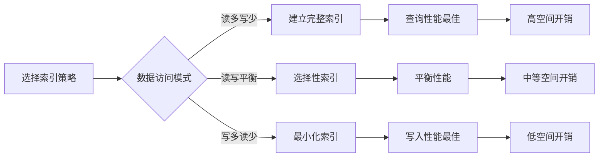
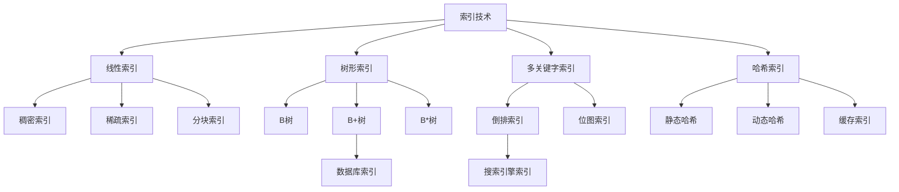

# 第9章：索引技术

> 本章学习目标：
> - 理解索引的基本概念和作用
> - 掌握线性索引技术（稠密索引、稀疏索引、分块索引）
> - 掌握树形索引技术（B树、B+树、B*树）
> - 理解多关键字索引（倒排索引）的原理和应用
> - 掌握索引的性能分析方法
> - 了解索引技术在实际系统中的应用
> - 能够根据场景选择合适的索引结构
> - 能够实现基本的索引算法

---

## 9.1 索引的基本概念

### 9.1.1 索引的定义

**定义**：
索引（Index）是数据组织的一种方式，通过创建额外的数据结构来提高数据检索效率。索引就像书的目录，能够快速定位到数据的位置，而不需要遍历所有数据。

**索引的核心思想**：
> **用空间换时间**：通过额外的存储空间来换取更快的查询速度

**索引的必要性**：

```cpp
// 场景1：无索引的顺序查找
// 时间复杂度：O(n)
int linear_search(int arr[], int n, int target) {
    for (int i = 0; i < n; ++i) {
        if (arr[i] == target) {
            return i;
        }
    }
    return -1;
}

// 场景2：使用索引的二分查找
// 时间复杂度：O(log n)
int binary_search(int arr[], int n, int target) {
    int left = 0, right = n - 1;
    while (left <= right) {
        int mid = left + (right - left) / 2;
        if (arr[mid] == target) {
            return mid;
        } else if (arr[mid] < target) {
            left = mid + 1;
        } else {
            right = mid - 1;
        }
    }
    return -1;
}
```

**实际应用示例**：

| 应用场景 | 数据量 | 无索引查找时间 | 有索引查找时间 | 索引类型 |
|----------|--------|----------------|----------------|----------|
| **图书馆** | 100万本书 | 数小时 | 秒级 | 分类索引 |
| **数据库** | 1亿条记录 | 数天 | 毫秒级 | B+树索引 |
| **搜索引擎** | 1000亿网页 | 不可行 | 毫秒级 | 倒排索引 |
| **文件系统** | 100万个文件 | 分钟级 | 秒级 | 目录索引 |

### 9.1.2 索引的分类

**按数据结构分类**：

```
索引
├── 线性索引
│   ├── 稠密索引（Dense Index）
│   ├── 稀疏索引（Sparse Index）
│   └── 分块索引（Block Index）
│
├── 树形索引
│   ├── B树（B-Tree）
│   ├── B+树（B+ Tree）
│   └── B*树（B* Tree）
│
├── 多关键字索引
│   ├── 倒排索引（Inverted Index）
│   └── 位图索引（Bitmap Index）
│
└── 哈希索引
    ├── 静态哈希
    └── 动态哈希（可扩展哈希）
```

**按存储位置分类**：

| 类型 | 特点 | 优点 | 缺点 | 应用场景 |
|------|------|------|------|----------|
| **主索引** | 基于主键建立 | 唯一、稳定 | 一个表只能有一个 | 主键查询 |
| **辅助索引** | 基于非主键建立 | 可以有多个 | 需要额外空间 | 条件查询 |
| **聚集索引** | 数据按索引顺序存储 | 范围查询快 | 插入慢 | 主键、时间序列 |
| **非聚集索引** | 数据和索引分离 | 插入快 | 需要回表查询 | 辅助索引 |

### 9.1.3 索引的性能指标

**主要性能指标**：

```cpp
struct IndexMetrics {
    // 1. 查询时间复杂度（Search Time Complexity）
    //    - 最好情况（Best Case）
    //    - 最坏情况（Worst Case）
    //    - 平均情况（Average Case）
    double search_time_best;
    double search_time_worst;
    double search_time_avg;

    // 2. 插入时间复杂度（Insert Time Complexity）
    double insert_time;

    // 3. 删除时间复杂度（Delete Time Complexity）
    double delete_time;

    // 4. 空间复杂度（Space Complexity）
    //    - 索引占用空间
    //    - 额外开销比例
    size_t index_space;
    double overhead_ratio;

    // 5. 更新成本（Update Cost）
    //    - 索引维护成本
    double update_cost;

    // 6. 缓存命中率（Cache Hit Rate）
    double cache_hit_rate;
};
```

**性能对比表**：

| 索引类型 | 查询时间 | 插入时间 | 删除时间 | 空间开销 | 适用场景 |
|----------|----------|----------|----------|----------|----------|
| **稠密索引** | O(log n) | O(n) | O(n) | 高 | 静态数据 |
| **稀疏索引** | O(log n + m) | O(log n) | O(log n) | 中 | 大数据集 |
| **分块索引** | O(√n) | O(√n) | O(√n) | 低 | 简单场景 |
| **B树** | O(log n) | O(log n) | O(log n) | 中 | 通用场景 |
| **B+树** | O(log n) | O(log n) | O(log n) | 中 | 数据库 |
| **倒排索引** | O(k) | O(k) | O(k) | 高 | 搜索引擎 |

### 9.1.4 索引的权衡

**空间-时间权衡（Space-Time Tradeoff）**：



**决策矩阵**：

| 场景 | 推荐索引 | 理由 |
|------|----------|------|
| 频繁查询，很少更新 | B+树、倒排索引 | 查询性能优先 |
| 频繁更新，偶尔查询 | 最小化索引或无索引 | 更新性能优先 |
| 范围查询 | B+树（聚集索引） | 范围查询效率高 |
| 精确匹配查询 | 哈希索引、B树 | 精确查找快 |
| 全文检索 | 倒排索引 | 专为文本设计 |
| 内存数据库 | 哈希索引 | 内存访问快 |

---

## 9.2 线性索引

### 9.2.1 稠密索引（Dense Index）

**定义**：
稠密索引是指为数据文件中的**每一条记录**都建立一个索引项。索引项包含键值和记录地址。

**索引项结构**：

```cpp
// 索引项
struct IndexEntry {
    int key;           // 键值（排序关键字）
    int record_ptr;    // 记录指针（指向数据文件中的记录）

    // 比较运算符（用于排序）
    bool operator<(const IndexEntry& other) const {
        return key < other.key;
    }

    bool operator==(const IndexEntry& other) const {
        return key == other.key;
    }
};

// 稠密索引
class DenseIndex {
private:
    vector<IndexEntry> index;  // 索引表
    string data_file;          // 数据文件名

public:
    DenseIndex(const string& filename) : data_file(filename) {
        load_data();
    }

    // 加载数据并构建索引
    void load_data() {
        // 从数据文件读取记录
        // 为每条记录创建索引项
        // 对索引进行排序
    }

    // 查找
    int search(int key) {
        // 二分查找
        int left = 0, right = index.size() - 1;
        while (left <= right) {
            int mid = left + (right - left) / 2;
            if (index[mid].key == key) {
                return index[mid].record_ptr;  // 返回记录指针
            } else if (index[mid].key < key) {
                left = mid + 1;
            } else {
                right = mid - 1;
            }
        }
        return -1;  // 未找到
    }

    // 插入
    void insert(int key, int record_ptr) {
        // 1. 在数据文件中插入记录
        // 2. 创建索引项
        IndexEntry entry{key, record_ptr};

        // 3. 在索引表中找到插入位置（二分查找）
        auto it = lower_bound(index.begin(), index.end(), entry);

        // 4. 插入索引项（需要移动后续索引项）
        index.insert(it, entry);
    }

    // 删除
    void remove(int key) {
        // 1. 在索引表中查找
        IndexEntry entry{key, 0};
        auto it = lower_bound(index.begin(), index.end(), entry);

        // 2. 如果找到
        if (it != index.end() && it->key == key) {
            // 3. 删除数据文件中的记录
            // delete_record(it->record_ptr);

            // 4. 删除索引项（需要移动后续索引项）
            index.erase(it);
        }
    }

    // 获取索引大小
    size_t size() const {
        return index.size();
    }
};
```

**复杂度分析**：

| 操作 | 时间复杂度 | 空间复杂度 | 说明 |
|------|-----------|-----------|------|
| **查找** | O(log n) | O(1) | 二分查找 |
| **插入** | O(n) | O(1) | 需要移动索引项 |
| **删除** | O(n) | O(1) | 需要移动索引项 |
| **构建** | O(n log n) | O(n) | 排序索引表 |

**优点**：
1. 查找速度快（O(log n)）
2. 支持范围查询
3. 实现简单

**缺点**：
1. 索引空间开销大（与数据量成正比）
2. 插入和删除效率低（需要移动索引项）
3. 适合静态数据，不适合频繁更新的数据

**适用场景**：
- 数据量相对较小
- 查询频繁，更新较少
- 需要支持范围查询

### 9.2.2 稀疏索引（Sparse Index）

**定义**：
稀疏索引只为数据文件中的**部分记录**建立索引项，通常每隔若干条记录建立一次索引。

**索引项结构**：

```cpp
// 稀疏索引
class SparseIndex {
private:
    vector<IndexEntry> index;  // 索引表
    int block_size;            // 块大小（每块包含的记录数）
    string data_file;          // 数据文件名

public:
    SparseIndex(const string& filename, int bs) : data_file(filename), block_size(bs) {
        build_index();
    }

    // 构建稀疏索引
    void build_index() {
        // 假设从数据文件读取记录
        // 每隔block_size条记录创建一个索引项
        for (int i = 0; i < 1000; i += block_size) {
            IndexEntry entry{i, i};  // 使用记录ID作为键值
            index.push_back(entry);
        }
    }

    // 查找
    int search(int key) {
        // 1. 在稀疏索引中查找（二分查找）
        int left = 0, right = index.size() - 1;
        int pos = 0;

        while (left <= right) {
            int mid = left + (right - left) / 2;
            if (index[mid].key <= key) {
                pos = mid;
                left = mid + 1;
            } else {
                right = mid - 1;
            }
        }

        // 2. 找到key所在的块
        int block_start = index[pos].key;

        // 3. 在块内线性查找
        for (int i = block_start; i < block_start + block_size; ++i) {
            if (i == key) {
                return i;  // 找到记录
            }
        }

        return -1;  // 未找到
    }

    // 插入
    void insert(int key, int record_ptr) {
        // 1. 找到key应该插入的块
        // 2. 在块内插入记录
        // 3. 如果块满了，可能需要创建新的索引项

        // 简化实现：重新构建索引
        // 在实际应用中，可以使用更高效的策略
    }

    // 获取索引大小
    size_t size() const {
        return index.size();
    }
};
```

**复杂度分析**：

| 操作 | 时间复杂度 | 空间复杂度 | 说明 |
|------|-----------|-----------|------|
| **查找** | O(log n + m) | O(1) | m为块大小 |
| **插入** | O(m) | O(1) | 在块内插入 |
| **删除** | O(m) | O(1) | 在块内删除 |
| **构建** | O(n) | O(n/m) | 索引项数量为n/m |

**优点**：
1. 索引空间开销小（是稠密索引的1/m）
2. 适合大数据集
3. 插入和删除相对高效

**缺点**：
1. 查找速度稍慢（需要在块内线性查找）
2. 块大小的选择影响性能
3. 范围查询效率降低

**适用场景**：
- 数据量很大
- 需要控制索引空间
- 块内记录数量适中

**块大小选择**：

```cpp
// 块大小选择策略
int choose_block_size(int total_records, int block_size_options[]) {
    // 考虑因素：
    // 1. 磁盘I/O效率（块大小应该与磁盘块大小匹配）
    // 2. 内存大小（索引应该能放入内存）
    // 3. 查询模式（块内查找次数）

    // 经验公式：
    // optimal_block_size = sqrt(disk_block_size * memory_size)

    // 简化实现：返回一个合理的默认值
    return 100;  // 每块100条记录
}
```

### 9.2.3 分块索引（Block Index）

**定义**：
分块索引是将数据分成若干块，每块内部无序，但块之间有序（前一块的最大值小于后一块的最小值）。为每块建立一个索引项。

**数据结构**：

```cpp
// 分块索引
class BlockIndex {
private:
    struct Block {
        int start;      // 块的起始位置
        int end;        // 块的结束位置
        int max_key;    // 块内最大键值
        int min_key;    // 块内最小键值
    };

    vector<Block> blocks;  // 块索引表
    int block_size;        // 每块的最大记录数
    vector<int> data;      // 数据文件（模拟）

public:
    BlockIndex(int bs) : block_size(bs) {
        build_blocks();
    }

    // 构建块索引
    void build_blocks() {
        // 假设数据已分块
        // 每块内部无序，但块之间有序

        // 示例：创建3个块
        blocks = {
            {0, 3, 50, 10},   // 块0：位置0-3，键值范围[10, 50]
            {4, 7, 90, 60},   // 块1：位置4-7，键值范围[60, 90]
            {8, 11, 130, 100} // 块2：位置8-11，键值范围[100, 130]
        };
    }

    // 查找
    int search(int key) {
        // 1. 确定key可能在哪个块
        int block_num = -1;
        for (size_t i = 0; i < blocks.size(); ++i) {
            if (key >= blocks[i].min_key && key <= blocks[i].max_key) {
                block_num = i;
                break;
            }
        }

        if (block_num == -1) {
            return -1;  // 不在任何块中
        }

        // 2. 在块内线性查找
        const Block& block = blocks[block_num];
        for (int i = block.start; i <= block.end; ++i) {
            if (data[i] == key) {
                return i;  // 找到记录
            }
        }

        return -1;  // 未找到
    }

    // 插入
    void insert(int key) {
        // 1. 找到key应该插入的块
        int block_num = -1;
        for (size_t i = 0; i < blocks.size(); ++i) {
            if (key <= blocks[i].max_key) {
                block_num = i;
                break;
            }
        }

        if (block_num == -1) {
            // 插入到最后一个块
            block_num = blocks.size() - 1;
        }

        // 2. 在块内插入
        Block& block = blocks[block_num];
        if (block.end - block.start + 1 < block_size) {
            // 块未满，直接插入
            data.push_back(key);
            block.end++;
            // 更新min_key和max_key
            block.min_key = min(block.min_key, key);
            block.max_key = max(block.max_key, key);
        } else {
            // 块已满，需要重新分块
            reorganize_blocks();
        }
    }

    // 重新组织块
    void reorganize_blocks() {
        // 将所有数据取出，重新分块
        // 确保块之间有序
        // 重建索引
    }

    // 获取块数量
    size_t block_count() const {
        return blocks.size();
    }
};
```

**复杂度分析**：

| 操作 | 时间复杂度 | 空间复杂度 | 说明 |
|------|-----------|-----------|------|
| **查找** | O(√n) | O(1) | n/m个块，每块m条记录 |
| **插入** | O(√n) | O(1) | 找块+块内插入 |
| **删除** | O(√n) | O(1) | 找块+块内删除 |
| **构建** | O(n) | O(√n) | 分块+建立索引 |

**最优块大小**：

```
设总记录数为n，块大小为m，则：
- 块数量：n/m
- 查找时间：O(n/m + m) = O(n/m + m)

要使查找时间最小：
n/m = m
m² = n
m = √n

因此，最优块大小为√n
```

**优点**：
1. 实现简单
2. 插入和删除相对容易
3. 适合中等规模数据

**缺点**：
1. 查找效率不如B树
2. 块满时需要重新组织
3. 不适合大数据集

**适用场景**：
- 中等规模数据
- 数据更新较多
- 实现简单优先

### 9.2.4 线性索引对比

**对比表**：

| 特性 | 稠密索引 | 稀疏索引 | 分块索引 |
|------|----------|----------|----------|
| **索引项数量** | n | n/m | n/m |
| **查找时间** | O(log n) | O(log n + m) | O(√n) |
| **插入时间** | O(n) | O(m) | O(√n) |
| **删除时间** | O(n) | O(m) | O(√n) |
| **空间开销** | 高 | 中 | 低 |
| **实现复杂度** | 简单 | 中等 | 简单 |
| **适用场景** | 静态数据 | 大数据集 | 中等数据 |

**选择建议**：

```cpp
// 索引选择策略
enum class IndexType {
    DENSE,    // 稠密索引
    SPARSE,   // 稀疏索引
    BLOCK     // 分块索引
};

IndexType choose_index_type(int record_count, int update_frequency) {
    // 小数据量，更新少 → 稠密索引
    if (record_count < 10000 && update_frequency < 100) {
        return IndexType::DENSE;
    }

    // 大数据量 → 稀疏索引
    if (record_count > 100000) {
        return IndexType::SPARSE;
    }

    // 中等数据量 → 分块索引
    return IndexType::BLOCK;
}
```

---

## 9.3 树形索引

### 9.3.1 B树（B-Tree）

**定义**：
B树是一种平衡的多路搜索树，专门为磁盘或直接存储设备设计，能够有效减少磁盘I/O次数。

**B树的特性**：

1. **阶数（Order）**：每个节点最多有m个孩子，称为m阶B树
2. **节点结构**：
   - 内部节点：有[k₁, k₂, ..., kₙ]和[p₀, p₁, ..., pₙ]
   - 其中：⌈m/2⌉ ≤ n ≤ m-1
3. **叶子节点**：都在同一层
4. **平衡性**：所有叶子节点都在同一层

**B树节点结构**：

```cpp
// B树节点
template <typename K, typename V, int M>
class BTreeNode {
public:
    int n;                          // 当前存储的键值数量
    K keys[M - 1];                  // 键值数组（最多M-1个）
    V values[M - 1];                // 值数组
    BTreeNode* children[M];         // 孩子指针数组（最多M个）
    bool leaf;                      // 是否为叶子节点

    BTreeNode(bool is_leaf = false) : n(0), leaf(is_leaf) {
        for (int i = 0; i < M; ++i) {
            children[i] = nullptr;
        }
    }

    // 在节点中查找键值
    int find_key(K key) {
        int idx = 0;
        while (idx < n && keys[idx] < key) {
            idx++;
        }
        return idx;
    }
};

// B树
template <typename K, typename V, int M = 3>
class BTree {
private:
    BTreeNode<K, V, M>* root;       // 根节点
    int min_keys;                   // 最小键值数量

    // 分裂节点
    void split_child(BTreeNode<K, V, M>* parent, int idx) {
        BTreeNode<K, V, M>* child = parent->children[idx];
        BTreeNode<K, V, M>* new_node = new BTreeNode<K, V, M>(child->leaf);

        // 中间键值上移到父节点
        int mid = (M - 1) / 2;
        K mid_key = child->keys[mid];
        V mid_value = child->values[mid];

        // 将中间键值之后的键值移动到新节点
        new_node->n = (M - 1) - mid - 1;
        for (int i = 0; i < new_node->n; ++i) {
            new_node->keys[i] = child->keys[mid + 1 + i];
            new_node->values[i] = child->values[mid + 1 + i];
        }

        // 如果不是叶子节点，移动孩子指针
        if (!child->leaf) {
            for (int i = 0; i <= new_node->n; ++i) {
                new_node->children[i] = child->children[mid + 1 + i];
            }
        }

        child->n = mid;

        // 在父节点中插入中间键值
        for (int i = parent->n; i > idx; --i) {
            parent->keys[i] = parent->keys[i - 1];
            parent->values[i] = parent->values[i - 1];
            parent->children[i + 1] = parent->children[i];
        }

        parent->keys[idx] = mid_key;
        parent->values[idx] = mid_value;
        parent->children[idx + 1] = new_node;
        parent->n++;
    }

    // 在非满节点中插入键值
    void insert_non_full(BTreeNode<K, V, M>* node, K key, V value) {
        int idx = node->n - 1;

        // 如果是叶子节点，直接插入
        if (node->leaf) {
            // 找到插入位置
            while (idx >= 0 && node->keys[idx] > key) {
                node->keys[idx + 1] = node->keys[idx];
                node->values[idx + 1] = node->values[idx];
                idx--;
            }

            // 插入键值
            node->keys[idx + 1] = key;
            node->values[idx + 1] = value;
            node->n++;
        } else {
            // 找到合适的孩子
            while (idx >= 0 && node->keys[idx] > key) {
                idx--;
            }
            idx++;

            // 如果孩子已满，先分裂
            if (node->children[idx]->n == M - 1) {
                split_child(node, idx);

                // 确定插入位置
                if (node->keys[idx] < key) {
                    idx++;
                }
            }

            // 递归插入
            insert_non_full(node->children[idx], key, value);
        }
    }

    // 删除键值（简化版）
    void remove(BTreeNode<K, V, M>* node, K key) {
        int idx = node->find_key(key);

        // 情况1：键值在当前节点
        if (idx < node->n && node->keys[idx] == key) {
            if (node->leaf) {
                // 情况1a：叶子节点，直接删除
                for (int i = idx; i < node->n - 1; ++i) {
                    node->keys[i] = node->keys[i + 1];
                    node->values[i] = node->values[i + 1];
                }
                node->n--;
            } else {
                // 情况1b：内部节点，需要处理
                // 实现较复杂，此处省略
            }
        } else {
            // 情况2：键值在子树中
            if (node->leaf) {
                // 键值不存在
                return;
            }

            // 递归删除
            remove(node->children[idx], key);
        }
    }

    // 查找键值
    V search(BTreeNode<K, V, M>* node, K key) {
        if (node == nullptr) {
            throw runtime_error("Key not found");
        }

        // 在节点中查找
        int idx = 0;
        while (idx < node->n && node->keys[idx] < key) {
            idx++;
        }

        // 找到键值
        if (idx < node->n && node->keys[idx] == key) {
            return node->values[idx];
        }

        // 如果是叶子节点，键值不存在
        if (node->leaf) {
            throw runtime_error("Key not found");
        }

        // 递归搜索子树
        return search(node->children[idx], key);
    }

    // 释放树
    void destroy(BTreeNode<K, V, M>* node) {
        if (node == nullptr) return;

        if (!node->leaf) {
            for (int i = 0; i <= node->n; ++i) {
                destroy(node->children[i]);
            }
        }

        delete node;
    }

public:
    BTree() : root(nullptr), min_keys((M - 1) / 2) {}

    ~BTree() {
        destroy(root);
    }

    // 插入键值
    void insert(K key, V value) {
        // 如果树为空，创建根节点
        if (root == nullptr) {
            root = new BTreeNode<K, V, M>(true);
            root->keys[0] = key;
            root->values[0] = value;
            root->n = 1;
            return;
        }

        // 如果根节点已满，分裂根节点
        if (root->n == M - 1) {
            BTreeNode<K, V, M>* new_root = new BTreeNode<K, V, M>(false);
            new_root->children[0] = root;
            split_child(new_root, 0);
            root = new_root;
        }

        // 插入键值
        insert_non_full(root, key, value);
    }

    // 查找键值
    V search(K key) {
        return search(root, key);
    }

    // 删除键值
    void remove(K key) {
        remove(root, key);

        // 如果根节点变空，调整树
        if (root != nullptr && root->n == 0) {
            BTreeNode<K, V, M>* temp = root;
            if (root->leaf) {
                root = nullptr;
            } else {
                root = root->children[0];
            }
            delete temp;
        }
    }

    // 判断键值是否存在
    bool contains(K key) {
        try {
            search(key);
            return true;
        } catch (...) {
            return false;
        }
    }
};
```

**B树示例（3阶B树）**：

```
插入顺序：10, 20, 5, 6, 12, 30, 7, 17

步骤1：插入10
[10]

步骤2：插入20
[10, 20]

步骤3：插入5（节点已满，分裂）
      [10]
     /    \
   [5]   [20]

步骤4：插入6
      [10]
     /    \
   [5,6]  [20]

步骤5：插入12
      [10]
     /    \
  [5,6]  [12,20]

步骤6：插入30（节点[12,20]已满，分裂）
      [10, 20]
     /    |    \
   [5,6] [12]  [30]

步骤7：插入7
      [10, 20]
     /    |    \
  [5,6,7] [12] [30]

步骤8：插入17
      [10, 20]
     /    |    \
 [5,6,7] [12,17] [30]
```

**复杂度分析**：

| 操作 | 时间复杂度 | 空间复杂度 | I/O次数 |
|------|-----------|-----------|---------|
| **查找** | O(logₘ n) | O(1) | O(logₘ n) |
| **插入** | O(logₘ n) | O(logₘ n) | O(logₘ n) |
| **删除** | O(logₘ n) | O(logₘ n) | O(logₘ n) |

其中：
- m为B树的阶数
- n为键值数量
- logₘ n表示以m为底的对数

**优点**：
1. 适合磁盘存储，减少I/O次数
2. 保持平衡，查找效率稳定
3. 支持动态更新
4. 适合大数据集

**缺点**：
1. 实现复杂
2. 内存开销较大
3. 不如B+树适合范围查询

**适用场景**：
- 数据库索引
- 文件系统
- 大数据集的快速查找

### 9.3.2 B+树（B+ Tree）

**定义**：
B+树是B树的变种，是现代数据库系统中最常用的索引结构。

**B+树与B树的区别**：

| 特性 | B树 | B+树 |
|------|-----|------|
| **数据存储** | 所有节点都存储数据 | 只有叶子节点存储数据 |
| **键值重复** | 不重复 | 内部节点的键值在叶子节点重复 |
| **叶子节点** | 不相连 | 通过指针相连（形成链表） |
| **范围查询** | 效率低 | 效率高（遍历叶子链表） |
| **扇出** | 较低 | 较高（内部节点只存键值） |

**B+树节点结构**：

```cpp
// B+树内部节点
template <typename K, int M>
class BPlusTreeNode {
public:
    bool is_leaf;                  // 是否为叶子节点
    int n;                         // 当前键值数量
    K keys[M - 1];                 // 键值数组
    BPlusTreeNode* children[M];    // 孩子指针数组
    BPlusTreeNode* next;           // 下一个叶子节点（仅叶子节点）

    BPlusTreeNode(bool leaf = false) : is_leaf(leaf), n(0), next(nullptr) {
        for (int i = 0; i < M; ++i) {
            children[i] = nullptr;
        }
    }
};

// B+树
template <typename K, typename V, int M = 3>
class BPlusTree {
private:
    struct DataNode {
        K key;
        V value;
        DataNode* next;
    };

    BPlusTreeNode<K, M>* root;     // 根节点
    DataNode* data_head;           // 数据链表头

    // 分裂内部节点
    void split_internal(BPlusTreeNode<K, M>* parent, int idx) {
        BPlusTreeNode<K, M>* child = parent->children[idx];
        BPlusTreeNode<K, M>* new_node = new BPlusTreeNode<K, M>(false);

        // 中间键值上移到父节点
        int mid = (M - 1) / 2;
        K mid_key = child->keys[mid];

        // 将后半部分键值移动到新节点
        new_node->n = child->n - mid - 1;
        for (int i = 0; i < new_node->n; ++i) {
            new_node->keys[i] = child->keys[mid + 1 + i];
            new_node->children[i] = child->children[mid + 1 + i];
        }
        new_node->children[new_node->n] = child->children[child->n];

        // 更新原节点
        child->n = mid;

        // 在父节点中插入
        for (int i = parent->n; i > idx; --i) {
            parent->keys[i] = parent->keys[i - 1];
            parent->children[i + 1] = parent->children[i];
        }
        parent->keys[idx] = mid_key;
        parent->children[idx + 1] = new_node;
        parent->n++;
    }

    // 在非满内部节点中插入键值
    void insert_internal(BPlusTreeNode<K, M>* node, K key, BPlusTreeNode<K, M>* right_child) {
        int idx = node->n - 1;

        // 找到插入位置
        while (idx >= 0 && node->keys[idx] > key) {
            node->keys[idx + 1] = node->keys[idx];
            node->children[idx + 2] = node->children[idx + 1];
            idx--;
        }

        // 插入键值和孩子指针
        node->keys[idx + 1] = key;
        node->children[idx + 2] = right_child;
        node->n++;
    }

    // 在叶子节点中插入键值
    bool insert_leaf(BPlusTreeNode<K, M>* node, K key, V value) {
        int idx = node->n - 1;

        // 检查键值是否已存在
        while (idx >= 0 && node->keys[idx] >= key) {
            if (node->keys[idx] == key) {
                // 键值已存在，更新值
                return false;
            }
            idx--;
        }

        // 插入键值
        idx++;
        for (int i = node->n; i > idx; --i) {
            node->keys[i] = node->keys[i - 1];
        }
        node->keys[idx] = key;
        node->n++;

        return true;
    }

    // 查找键值
    V search(BPlusTreeNode<K, M>* node, K key) {
        if (node == nullptr) {
            throw runtime_error("Key not found");
        }

        int idx = 0;
        while (idx < node->n && node->keys[idx] < key) {
            idx++;
        }

        if (node->is_leaf) {
            if (idx < node->n && node->keys[idx] == key) {
                // 返回对应的值（简化实现）
                return V{};  // 实际应该从数据链表中获取
            }
            throw runtime_error("Key not found");
        } else {
            return search(node->children[idx], key);
        }
    }

    // 范围查询
    vector<V> range_search(K low, K high) {
        vector<V> result;

        // 1. 找到low键值的位置
        BPlusTreeNode<K, M>* node = root;
        while (node != nullptr && !node->is_leaf) {
            int idx = 0;
            while (idx < node->n && node->keys[idx] < low) {
                idx++;
            }
            node = node->children[idx];
        }

        // 2. 从叶子节点开始遍历
        while (node != nullptr) {
            for (int i = 0; i < node->n; ++i) {
                if (node->keys[i] >= low && node->keys[i] <= high) {
                    // 添加到结果（简化实现）
                    // result.push_back(get_value(node->keys[i]));
                }
                if (node->keys[i] > high) {
                    return result;
                }
            }
            node = node->next;  // 移动到下一个叶子节点
        }

        return result;
    }

public:
    BPlusTree() : root(nullptr), data_head(nullptr) {}

    // 插入键值
    void insert(K key, V value) {
        // 简化实现
        if (root == nullptr) {
            root = new BPlusTreeNode<K, M>(true);
            root->keys[0] = key;
            root->n = 1;
            return;
        }

        // 完整实现需要处理节点分裂等复杂情况
        // 此处省略详细实现
    }

    // 查找键值
    V search(K key) {
        return search(root, key);
    }

    // 范围查询
    vector<V> range_search(K low, K high) {
        return range_search(low, high);
    }

    // 判断键值是否存在
    bool contains(K key) {
        try {
            search(key);
            return true;
        } catch (...) {
            return false;
        }
    }
};
```

**B+树示例（3阶B+树）**：

```
插入顺序：10, 20, 5, 6, 12, 30, 7, 17

最终B+树结构：

内部节点（只存键值）：
      [10, 20]
     /    |    \
   [5,6,7] [12,17] [30]

叶子节点（存数据+指针）：
   [5,6,7] → [10] → [12,17] → [20] → [30]
    ↑                                   ↑
    |                                   |
  data_head                          data_tail
```

**复杂度分析**：

| 操作 | 时间复杂度 | 空间复杂度 | I/O次数 |
|------|-----------|-----------|---------|
| **查找** | O(logₘ n) | O(1) | O(logₘ n) |
| **插入** | O(logₘ n) | O(logₘ n) | O(logₘ n) |
| **删除** | O(logₘ n) | O(logₘ n) | O(logₘ n) |
| **范围查询** | O(k + logₘ n) | O(k) | O(k + logₘ n) |

其中：
- m为B+树的阶数
- n为键值数量
- k为返回的结果数量

**优点**：
1. 范围查询效率高（遍历叶子链表）
2. 扇出更大，树的高度更低
3. 查询性能稳定
4. 适合数据库索引

**缺点**：
1. 实现比B树更复杂
2. 删除操作较复杂
3. 需要额外的叶子链表指针

**适用场景**：
- 数据库主索引
- 文件系统目录
- 需要范围查询的场景

### 9.3.3 B*树（B* Tree）

**定义**：
B*树是B+树的变种，通过增加内部节点的最小孩子数量来提高空间利用率。

**B*树的特性**：

1. **最小孩子数量**：内部节点至少有⌈2m/3⌉个孩子（B+树是⌈m/2⌉）
2. **空间利用率**：更高（约66% vs 50%）
3. **节点分裂**：延迟分裂，优先尝试重新分配

**B*树与B+树对比**：

| 特性 | B+树 | B*树 |
|------|------|------|
| **最小孩子数** | ⌈m/2⌉ | ⌈2m/3⌉ |
| **空间利用率** | 约50% | 约66% |
| **节点分裂** | 立即分裂 | 延迟分裂 |
| **实现复杂度** | 中等 | 较高 |
| **性能** | 好 | 更好 |

**B*树的核心改进**：

```cpp
// B*树节点（简化版）
template <typename K, int M>
class BStarTreeNode {
public:
    bool is_leaf;
    int n;
    K keys[M - 1];
    BStarTreeNode* children[M];
    BStarTreeNode* next;  // 叶子节点链表

    BStarTreeNode(bool leaf = false) : is_leaf(leaf), n(0), next(nullptr) {
        for (int i = 0; i < M; ++i) {
            children[i] = nullptr;
        }
    }

    // 获取最小孩子数量
    static int min_children() {
        return (2 * M + 2) / 3;  // ⌈2m/3⌉
    }
};

// B*树
template <typename K, typename V, int M = 3>
class BStarTree {
private:
    BStarTreeNode<K, M>* root;

    // 尝试重新分配键值（而不是立即分裂）
    bool redistribute(BStarTreeNode<K, M>* parent, int idx) {
        BStarTreeNode<K, M>* left = parent->children[idx];
        BStarTreeNode<K, M>* right = parent->children[idx + 1];

        // 检查是否可以重新分配
        if (left->n > 1 && right->n > 1) {
            // 从左节点移动一个键值到右节点
            // 或者从右节点移动一个键值到左节点
            return true;
        }

        return false;
    }

    // 分裂节点（B*树的分裂策略更复杂）
    void split_node(BStarTreeNode<K, M>* parent, int idx) {
        // B*树分裂时，可能涉及两个兄弟节点
        // 实现比B+树更复杂
    }

public:
    BStarTree() : root(nullptr) {}

    // 插入键值
    void insert(K key, V value) {
        // 实现与B+树类似，但分裂策略不同
        // 首先尝试重新分配，失败时才分裂
    }

    // 查找键值
    V search(K key) {
        // 与B+树类似
        return V{};
    }
};
```

**优点**：
1. 空间利用率更高
2. 树的高度更低
3. 查询性能更好

**缺点**：
1. 实现最复杂
2. 插入和删除操作更复杂
3. 实际应用较少

**适用场景**：
- 对空间利用率要求极高的场景
- 大规模数据存储系统

### 9.3.4 树形索引对比

**对比表**：

| 特性 | B树 | B+树 | B*树 |
|------|-----|------|------|
| **数据存储** | 所有节点 | 仅叶子 | 仅叶子 |
| **范围查询** | 较差 | 优秀 | 优秀 |
| **空间利用率** | 约50% | 约50% | 约66% |
| **实现复杂度** | 中等 | 中等 | 较高 |
| **查询性能** | 好 | 优秀 | 优秀 |
| **应用场景** | 文件系统 | 数据库 | 特殊场景 |

**选择建议**：

```cpp
// 树形索引选择策略
enum class TreeIndexType {
    B_TREE,    // B树
    B_PLUS_TREE,  // B+树
    B_STAR_TREE   // B*树
};

TreeIndexType choose_tree_index(bool need_range_query, bool space_critical) {
    if (need_range_query) {
        if (space_critical) {
            return TreeIndexType::B_STAR_TREE;
        } else {
            return TreeIndexType::B_PLUS_TREE;
        }
    } else {
        return TreeIndexType::B_TREE;
    }
}
```

---

## 9.4 多关键字索引

### 9.4.1 倒排索引（Inverted Index）

**定义**：
倒排索引是搜索引擎的核心数据结构，用于快速查找包含特定关键词的文档。

**基本概念**：

```
正向索引（文档 → 关键词）：
文档1 → {数据结构, 算法, C++}
文档2 → {算法, Java, Python}
文档3 → {数据结构, Python}

倒排索引（关键词 → 文档）：
数据结构 → {文档1, 文档3}
算法 → {文档1, 文档2}
C++ → {文档1}
Java → {文档2}
Python → {文档2, 文档3}
```

**倒排索引结构**：

```cpp
// 文档ID
using DocID = int;

// 词项（Term）
using Term = string;

// 倒排列表（Posting List）
struct Posting {
    DocID doc_id;        // 文档ID
    int frequency;       // 词频（该词在文档中出现的次数）
    vector<int> positions;  // 位置列表（词在文档中的位置）

    Posting(DocID id, int freq = 1) : doc_id(id), frequency(freq) {}

    bool operator<(const Posting& other) const {
        return doc_id < other.doc_id;
    }
};

// 倒排索引
class InvertedIndex {
private:
    // 词项 → 倒排列表的映射
    unordered_map<Term, vector<Posting>> index;

    // 文档信息
    struct Document {
        DocID id;
        string title;
        string content;
        int length;  // 文档长度
    };

    vector<Document> documents;

    // 文本预处理
    vector<Term> tokenize(const string& text) {
        vector<Term> terms;
        string current;

        for (char c : text) {
            if (isalnum(c)) {
                current += tolower(c);
            } else if (!current.empty()) {
                terms.push_back(current);
                current.clear();
            }
        }

        if (!current.empty()) {
            terms.push_back(current);
        }

        return terms;
    }

    // 停用词过滤
    bool is_stop_word(const Term& term) {
        static const unordered_set<Term> stop_words = {
            "the", "a", "an", "and", "or", "but", "in", "on", "at", "to", "for"
        };
        return stop_words.find(term) != stop_words.end();
    }

public:
    // 添加文档
    void add_document(DocID doc_id, const string& title, const string& content) {
        Document doc{doc_id, title, content, static_cast<int>(content.size())};
        documents.push_back(doc);

        // 处理标题
        auto title_terms = tokenize(title);
        process_terms(doc_id, title_terms, true);

        // 处理内容
        auto content_terms = tokenize(content);
        process_terms(doc_id, content_terms, false);
    }

    // 处理词项
    void process_terms(DocID doc_id, const vector<Term>& terms, bool is_title) {
        unordered_map<Term, int> term_counts;

        // 统计词频
        for (const auto& term : terms) {
            if (!is_stop_word(term)) {
                term_counts[term]++;
            }
        }

        // 更新倒排索引
        for (const auto& [term, count] : term_counts) {
            // 权重：标题中的词权重更高
            int weight = is_title ? count * 2 : count;
            index[term].emplace_back(doc_id, weight);
        }
    }

    // 单词查询
    vector<DocID> search(const Term& query) {
        auto it = index.find(query);
        if (it != index.end()) {
            vector<DocID> results;
            for (const auto& posting : it->second) {
                results.push_back(posting.doc_id);
            }
            return results;
        }
        return {};
    }

    // AND查询（包含所有查询词的文档）
    vector<DocID> search_and(const vector<Term>& queries) {
        if (queries.empty()) {
            return {};
        }

        // 获取第一个查询词的结果
        vector<DocID> result = search(queries[0]);

        // 与其他查询词取交集
        for (size_t i = 1; i < queries.size(); ++i) {
            vector<DocID> temp = search(queries[i]);
            result = intersect(result, temp);
        }

        return result;
    }

    // OR查询（包含任一查询词的文档）
    vector<DocID> search_or(const vector<Term>& queries) {
        unordered_set<DocID> result;

        for (const auto& query : queries) {
            auto docs = search(query);
            result.insert(docs.begin(), docs.end());
        }

        return vector<DocID>(result.begin(), result.end());
    }

    // NOT查询（不包含查询词的文档）
    vector<DocID> search_not(const Term& query) {
        auto excluded = search(query);
        unordered_set<DocID> excluded_set(excluded.begin(), excluded.end());

        vector<DocID> result;
        for (const auto& doc : documents) {
            if (excluded_set.find(doc.id) == excluded_set.end()) {
                result.push_back(doc.id);
            }
        }

        return result;
    }

    // 短语查询（词序和距离）
    vector<DocID> search_phrase(const vector<Term>& phrase) {
        if (phrase.empty()) {
            return {};
        }

        // 获取第一个词的结果
        auto first_postings = index[phrase[0]];
        vector<DocID> result;

        for (const auto& posting : first_postings) {
            bool match = true;

            // 检查后续词是否连续出现
            for (size_t i = 1; i < phrase.size(); ++i) {
                auto it = index.find(phrase[i]);
                if (it == index.end()) {
                    match = false;
                    break;
                }

                // 查找该文档中是否存在该词
                bool found = false;
                for (const auto& p : it->second) {
                    if (p.doc_id == posting.doc_id) {
                        found = true;
                        break;
                    }
                }

                if (!found) {
                    match = false;
                    break;
                }
            }

            if (match) {
                result.push_back(posting.doc_id);
            }
        }

        return result;
    }

    // 两个有序列表的交集（用于AND查询）
    vector<DocID> intersect(const vector<DocID>& a, const vector<DocID>& b) {
        vector<DocID> result;
        size_t i = 0, j = 0;

        while (i < a.size() && j < b.size()) {
            if (a[i] == b[j]) {
                result.push_back(a[i]);
                i++;
                j++;
            } else if (a[i] < b[j]) {
                i++;
            } else {
                j++;
            }
        }

        return result;
    }

    // 获取文档信息
    Document get_document(DocID doc_id) {
        for (const auto& doc : documents) {
            if (doc.id == doc_id) {
                return doc;
            }
        }
        throw runtime_error("Document not found");
    }

    // 获取索引统计信息
    struct IndexStats {
        size_t total_documents;
        size_t total_terms;
        size_t total_postings;
        double avg_postings_per_term;
    };

    IndexStats get_stats() const {
        IndexStats stats;
        stats.total_documents = documents.size();
        stats.total_terms = index.size();

        size_t total_postings = 0;
        for (const auto& [term, postings] : index) {
            total_postings += postings.size();
        }

        stats.total_postings = total_postings;
        stats.avg_postings_per_term = stats.total_terms > 0
            ? static_cast<double>(total_postings) / stats.total_terms
            : 0.0;

        return stats;
    }
};
```

**倒排索引示例**：

```cpp
int main() {
    InvertedIndex index;

    // 添加文档
    index.add_document(1, "数据结构入门", "学习数据结构和算法");
    index.add_document(2, "算法设计", "掌握算法设计技巧");
    index.add_document(3, "C++编程", "使用C++实现数据结构");

    // 单词查询
    auto docs1 = index.search("数据结构");
    cout << "包含'数据结构'的文档: ";
    for (auto doc_id : docs1) {
        cout << doc_id << " ";
    }
    cout << endl;  // 输出：1 3

    // AND查询
    auto docs2 = index.search_and({"数据结构", "C++"});
    cout << "同时包含'数据结构'和'C++'的文档: ";
    for (auto doc_id : docs2) {
        cout << doc_id << " ";
    }
    cout << endl;  // 输出：3

    // OR查询
    auto docs3 = index.search_or({"数据结构", "算法"});
    cout << "包含'数据结构'或'算法'的文档: ";
    for (auto doc_id : docs3) {
        cout << doc_id << " ";
    }
    cout << endl;  // 输出：1 2 3

    // NOT查询
    auto docs4 = index.search_not("C++");
    cout << "不包含'C++'的文档: ";
    for (auto doc_id : docs4) {
        cout << doc_id << " ";
    }
    cout << endl;  // 输出：1 2

    // 获取统计信息
    auto stats = index.get_stats();
    cout << "文档总数: " << stats.total_documents << endl;
    cout << "词项总数: " << stats.total_terms << endl;
    cout << "平均每个词项的倒排列表长度: " << stats.avg_postings_per_term << endl;

    return 0;
}
```

**复杂度分析**：

| 操作 | 时间复杂度 | 空间复杂度 |
|------|-----------|-----------|
| **添加文档** | O(k) | O(k) |
| **单词查询** | O(1) 平均 | O(1) |
| **AND查询** | O(k + l) | O(1) |
| **OR查询** | O(k + l) | O(1) |
| **短语查询** | O(k × m) | O(1) |

其中：
- k为查询词的倒排列表长度
- l为另一个查询词的倒排列表长度
- m为短语中的词数

**优点**：
1. 查询速度快
2. 支持复杂的布尔查询
3. 支持短语查询
4. 适合大规模文本检索

**缺点**：
1. 索引空间开销大
2. 更新成本高
3. 需要预处理（分词、去停用词等）

**适用场景**：
- 搜索引擎
- 文档检索系统
- 大规模文本数据库

### 9.4.2 位图索引（Bitmap Index）

**定义**：
位图索引使用位图来表示属性值与记录之间的关系，每个属性值对应一个位图。

**位图索引结构**：

```cpp
// 位图索引
class BitmapIndex {
private:
    // 属性值 → 位图的映射
    unordered_map<string, vector<bool>> bitmaps;

    // 记录数量
    size_t num_records;

public:
    BitmapIndex(size_t n) : num_records(n) {}

    // 设置记录的属性值
    void set_value(size_t record_id, const string& attribute, bool value) {
        if (record_id >= num_records) {
            throw out_of_range("Record ID out of range");
        }

        // 确保位图存在
        if (bitmaps.find(attribute) == bitmaps.end()) {
            bitmaps[attribute] = vector<bool>(num_records, false);
        }

        // 设置位
        bitmaps[attribute][record_id] = value;
    }

    // 查询具有特定属性值的记录
    vector<size_t> query(const string& attribute) {
        vector<size_t> results;

        auto it = bitmaps.find(attribute);
        if (it != bitmaps.end()) {
            const auto& bitmap = it->second;
            for (size_t i = 0; i < bitmap.size(); ++i) {
                if (bitmap[i]) {
                    results.push_back(i);
                }
            }
        }

        return results;
    }

    // AND查询
    vector<size_t> query_and(const vector<string>& attributes) {
        if (attributes.empty()) {
            return {};
        }

        vector<size_t> results = query(attributes[0]);

        for (size_t i = 1; i < attributes.size(); ++i) {
            auto temp = query(attributes[i]);
            results = intersect(results, temp);
        }

        return results;
    }

    // OR查询
    vector<size_t> query_or(const vector<string>& attributes) {
        vector<size_t> results;

        for (const auto& attribute : attributes) {
            auto temp = query(attribute);
            results.insert(results.end(), temp.begin(), temp.end());
        }

        // 去重
        sort(results.begin(), results.end());
        results.erase(unique(results.begin(), results.end()), results.end());

        return results;
    }

    // NOT查询
    vector<size_t> query_not(const string& attribute) {
        vector<size_t> results;

        auto it = bitmaps.find(attribute);
        if (it != bitmaps.end()) {
            const auto& bitmap = it->second;
            for (size_t i = 0; i < bitmap.size(); ++i) {
                if (!bitmap[i]) {
                    results.push_back(i);
                }
            }
        }

        return results;
    }

private:
    // 两个列表的交集
    vector<size_t> intersect(const vector<size_t>& a, const vector<size_t>& b) {
        vector<size_t> result;
        size_t i = 0, j = 0;

        while (i < a.size() && j < b.size()) {
            if (a[i] == b[j]) {
                result.push_back(a[i]);
                i++;
                j++;
            } else if (a[i] < b[j]) {
                i++;
            } else {
                j++;
            }
        }

        return result;
    }
};
```

**位图索引示例**：

```cpp
int main() {
    BitmapIndex index(5);  // 5条记录

    // 设置性别属性
    index.set_value(0, "male", true);
    index.set_value(1, "male", true);
    index.set_value(2, "female", true);
    index.set_value(3, "female", true);
    index.set_value(4, "male", true);

    // 设置年龄属性（简化为布尔）
    index.set_value(0, "age<30", true);
    index.set_value(1, "age>=30", true);
    index.set_value(2, "age<30", true);
    index.set_value(3, "age<30", true);
    index.set_value(4, "age>=30", true);

    // 查询所有男性
    auto males = index.query("male");
    cout << "男性记录ID: ";
    for (auto id : males) {
        cout << id << " ";
    }
    cout << endl;  // 输出：0 1 4

    // 查询年龄小于30的男性
    auto young_males = index.query_and({"male", "age<30"});
    cout << "年龄小于30的男性记录ID: ";
    for (auto id : young_males) {
        cout << id << " ";
    }
    cout << endl;  // 输出：0

    return 0;
}
```

**复杂度分析**：

| 操作 | 时间复杂度 | 空间复杂度 |
|------|-----------|-----------|
| **设置值** | O(1) | O(1) |
| **查询** | O(n) | O(1) |
| **AND查询** | O(kn) | O(1) |
| **OR查询** | O(kn) | O(1) |

其中：
- n为记录数量
- k为查询的属性数量

**优点**：
1. 位运算速度快
2. 支持高效的组合查询
3. 适合低基数属性（取值少的属性）
4. 并行处理效率高

**缺点**：
1. 对于高基数属性，位图空间开销大
2. 更新成本较高
3. 不适合数值范围查询

**适用场景**：
- 数据仓库
- OLAP（联机分析处理）
- 低基数属性查询
- 组合条件查询

---

## 9.5 索引的性能分析

### 9.5.1 索引性能评估指标

**主要性能指标**：

```cpp
struct IndexPerformanceMetrics {
    // 1. 查询性能
    double avg_query_time;       // 平均查询时间（毫秒）
    double p95_query_time;       // 95分位查询时间
    double p99_query_time;       // 99分位查询时间
    size_t queries_per_second;   // 每秒查询数（QPS）

    // 2. 更新性能
    double avg_insert_time;      // 平均插入时间（毫秒）
    double avg_delete_time;      // 平均删除时间（毫秒）
    size_t updates_per_second;   // 每秒更新数

    // 3. 空间效率
    size_t index_size;           // 索引大小（字节）
    size_t data_size;            // 数据大小（字节）
    double space_overhead;       // 空间开销比例

    // 4. 缓存性能
    double cache_hit_rate;       // 缓存命中率
    size_t memory_usage;         // 内存使用量（字节）

    // 5. 并发性能
    size_t concurrent_queries;   // 并发查询数
    double throughput;           // 吞吐量（操作/秒）

    // 生成性能报告
    string generate_report() const {
        stringstream ss;
        ss << "Index Performance Report\n";
        ss << "========================\n";
        ss << "Query Performance:\n";
        ss << "  Average Query Time: " << avg_query_time << " ms\n";
        ss << "  P95 Query Time: " << p95_query_time << " ms\n";
        ss << "  P99 Query Time: " << p99_query_time << " ms\n";
        ss << "  QPS: " << queries_per_second << "\n";
        ss << "Update Performance:\n";
        ss << "  Average Insert Time: " << avg_insert_time << " ms\n";
        ss << "  Average Delete Time: " << avg_delete_time << " ms\n";
        ss << "  Updates/sec: " << updates_per_second << "\n";
        ss << "Space Efficiency:\n";
        ss << "  Index Size: " << index_size << " bytes\n";
        ss << "  Data Size: " << data_size << " bytes\n";
        ss << "  Space Overhead: " << (space_overhead * 100) << "%\n";
        ss << "Cache Performance:\n";
        ss << "  Cache Hit Rate: " << (cache_hit_rate * 100) << "%\n";
        ss << "  Memory Usage: " << memory_usage << " bytes\n";
        return ss.str();
    }
};
```

### 9.5.2 B+树性能分析

**B+树高度计算**：

```cpp
// 计算B+树的高度
template <int M>
int calculate_bplus_tree_height(size_t num_records, size_t record_size, size_t block_size) {
    // 假设：
    // - 每个块可以存储 block_size / record_size 条记录
    // - 每个内部节点可以存储 M 个键值

    // 叶子节点数量
    size_t records_per_leaf = block_size / record_size;
    size_t num_leaves = (num_records + records_per_leaf - 1) / records_per_leaf;

    // 计算高度
    int height = 1;  // 叶子层
    size_t nodes = num_leaves;

    while (nodes > 1) {
        nodes = (nodes + M - 1) / M;  // 向上取整
        height++;
    }

    return height;
}

// 示例
void example_height_calculation() {
    // 参数
    size_t num_records = 1000000;     // 100万条记录
    size_t record_size = 100;         // 每条记录100字节
    size_t block_size = 4096;         // 块大小4KB
    int M = 100;                      // B+树阶数

    // 计算高度
    int height = calculate_bplus_tree_height<M>(num_records, record_size, block_size);

    cout << "Number of records: " << num_records << endl;
    cout << "B+ tree height: " << height << endl;
    cout << "Maximum I/O operations: " << height + 1 << endl;

    // 输出：
    // Number of records: 1000000
    // B+ tree height: 3
    // Maximum I/O operations: 4
}
```

**B+树查询性能模型**：

```cpp
// B+树查询时间模型
class BPlusTreePerformanceModel {
private:
    int M;                      // B+树阶数
    size_t block_size;          // 块大小
    double disk_seek_time;      // 磁盘寻道时间（毫秒）
    double disk_transfer_time;  // 磁盘传输时间（毫秒）
    double cpu_time;            // CPU处理时间（毫秒）

public:
    BPlusTreePerformanceModel(int m, size_t bs, double seek, double transfer, double cpu)
        : M(m), block_size(bs), disk_seek_time(seek), disk_transfer_time(transfer), cpu_time(cpu) {}

    // 计算查询时间
    double calculate_query_time(size_t num_records) {
        // 1. 计算树高
        int height = 0;
        size_t records_per_block = block_size / 100;  // 假设每条记录100字节
        size_t leaves = (num_records + records_per_block - 1) / records_per_block;
        size_t nodes = leaves;

        while (nodes > 1) {
            nodes = (nodes + M - 1) / M;
            height++;
        }

        // 2. 查询需要访问 height+1 个块
        int blocks_to_access = height + 1;

        // 3. 计算时间
        double total_time = 0;
        total_time += blocks_to_access * (disk_seek_time + disk_transfer_time);  // I/O时间
        total_time += height * cpu_time;  // CPU处理时间

        return total_time;
    }

    // 计算索引大小
    size_t calculate_index_size(size_t num_records, size_t key_size, size_t ptr_size) {
        // 1. 叶子节点大小
        size_t keys_per_leaf = (block_size - sizeof(void*)) / (key_size + ptr_size);
        size_t num_leaves = (num_records + keys_per_leaf - 1) / keys_per_leaf;
        size_t leaf_size = num_leaves * block_size;

        // 2. 内部节点大小
        size_t keys_per_internal = (block_size - sizeof(void*)) / (key_size + ptr_size);
        size_t num_internal = num_leaves / keys_per_internal;
        size_t internal_size = num_internal * block_size;

        return leaf_size + internal_size;
    }
};
```

### 9.5.3 倒排索引性能分析

**倒排索引查询性能**：

```cpp
// 倒排索引性能模型
class InvertedIndexPerformanceModel {
private:
    size_t num_documents;       // 文档总数
    size_t avg_doc_length;      // 平均文档长度
    size_t vocabulary_size;     // 词汇表大小
    double avg_postings_length; // 平均倒排列表长度

public:
    InvertedIndexPerformanceModel(size_t docs, size_t avg_len, size_t vocab, double avg_postings)
        : num_documents(docs), avg_doc_length(avg_len), vocabulary_size(vocab), avg_postings_length(avg_postings) {}

    // 单词查询时间
    double single_term_query_time() {
        // 时间 = 查找词项 + 遍历倒排列表
        return 0.01 + avg_postings_length * 0.001;  // 毫秒
    }

    // AND查询时间
    double and_query_time(size_t num_terms) {
        // 时间 = 查找词项 + 合并倒排列表
        return num_terms * 0.01 + num_terms * avg_postings_length * 0.001;
    }

    // OR查询时间
    double or_query_time(size_t num_terms) {
        // 时间 = 查找词项 + 合并倒排列表
        return num_terms * 0.01 + num_terms * avg_postings_length * 0.001;
    }

    // 短语查询时间
    double phrase_query_time(size_t phrase_length) {
        // 时间 = 查找词项 + 检查位置
        return phrase_length * 0.01 + phrase_length * avg_postings_length * 0.002;
    }

    // 索引大小
    size_t calculate_index_size() {
        // 索引大小 = 词汇表大小 + 倒排列表大小
        // 简化模型：每个词项平均有avg_postings_length个倒排项
        return vocabulary_size * 20 + vocabulary_size * avg_postings_length * 8;  // 字节
    }
};

// 示例
void example_inverted_index_performance() {
    InvertedIndexPerformanceModel model(
        1000000,        // 100万文档
        1000,           // 平均文档长度1000词
        500000,         // 50万词汇
        100             // 平均倒排列表长度100
    );

    cout << "Single term query time: " << model.single_term_query_time() << " ms" << endl;
    cout << "AND query time (2 terms): " << model.and_query_time(2) << " ms" << endl;
    cout << "OR query time (2 terms): " << model.or_query_time(2) << " ms" << endl;
    cout << "Phrase query time (3 words): " << model.phrase_query_time(3) << " ms" << endl;
    cout << "Index size: " << model.calculate_index_size() << " bytes" << endl;
}
```

### 9.5.4 索引选择策略

**基于工作负载的索引选择**：

```cpp
// 工作负载分析
struct Workload {
    size_t read_queries;       // 读查询次数
    size_t write_operations;   // 写操作次数
    size_t range_queries;      // 范围查询次数
    size_t point_queries;      // 点查询次数
    double avg_query_latency;  // 平均查询延迟要求（毫秒）
};

// 索引推荐
class IndexRecommender {
public:
    static string recommend_index(const Workload& workload) {
        // 计算读写比例
        double read_write_ratio = static_cast<double>(workload.read_queries) / workload.write_operations;

        // 计算查询类型比例
        double range_ratio = static_cast<double>(workload.range_queries) / workload.read_queries;
        double point_ratio = static_cast<double>(workload.point_queries) / workload.read_queries;

        // 决策逻辑
        if (read_write_ratio > 10) {
            // 读密集型
            if (range_ratio > 0.3) {
                return "B+ Tree Index (optimal for range queries)";
            } else if (point_ratio > 0.7) {
                return "Hash Index (optimal for point queries)";
            } else {
                return "B+ Tree Index (balanced for mixed queries)";
            }
        } else if (read_write_ratio < 2) {
            // 写密集型
            return "Minimal Index or LSM Tree (optimize for writes)";
        } else {
            // 读写平衡
            return "B+ Tree Index (balanced performance)";
        }
    }
};
```

---

## 9.6 索引的实际应用

### 9.6.1 数据库索引

**MySQL的InnoDB引擎（B+树索引）**：

```cpp
// 模拟MySQL InnoDB的B+树索引
class InnoDBIndex {
private:
    // 聚簇索引（主键索引）
    struct ClusteredIndex {
        int primary_key;
        string row_data;  // 整行数据
    };

    // 辅助索引
    struct SecondaryIndex {
        int index_key;
        int primary_key;  // 指向聚簇索引
    };

    BPlusTree<int, ClusteredIndex, 100> clustered_idx;
    BPlusTree<int, SecondaryIndex, 100> secondary_idx;

public:
    // 插入记录
    void insert(int primary_key, const string& data, int index_key) {
        // 1. 插入到聚簇索引
        clustered_idx.insert(primary_key, {primary_key, data});

        // 2. 插入到辅助索引
        secondary_idx.insert(index_key, {index_key, primary_key});
    }

    // 通过主键查询（直接查询聚簇索引）
    string select_by_primary_key(int primary_key) {
        auto result = clustered_idx.search(primary_key);
        return result.row_data;
    }

    // 通过辅助键查询（需要回表）
    string select_by_secondary_key(int index_key) {
        // 1. 在辅助索引中查找
        auto sec_result = secondary_idx.search(index_key);

        // 2. 回表查询聚簇索引
        auto cluster_result = clustered_idx.search(sec_result.primary_key);

        return cluster_result.row_data;
    }

    // 范围查询
    vector<string> select_range(int start_key, int end_key) {
        vector<string> results;
        auto range_results = clustered_idx.range_search(start_key, end_key);

        for (const auto& item : range_results) {
            results.push_back(item.row_data);
        }

        return results;
    }
};
```

**覆盖索引（Covering Index）**：

```cpp
// 覆盖索引示例
class CoveringIndexExample {
private:
    // 用户表
    struct User {
        int id;
        string name;
        int age;
        string email;
    };

    // 覆盖索引（包含name和age）
    struct CoveringIndexEntry {
        int id;
        string name;
        int age;
    };

    BPlusTree<int, CoveringIndexEntry, 100> covering_index;

public:
    // 查询用户的name和age（不需要回表）
    vector<pair<string, int>> select_name_and_age(int start_id, int end_id) {
        vector<pair<string, int>> results;
        auto range_results = covering_index.range_search(start_id, end_id);

        for (const auto& entry : range_results) {
            results.push_back({entry.name, entry.age});
        }

        return results;  // 不需要访问主表
    }
};
```

### 9.6.2 搜索引擎索引

**Elasticsearch的倒排索引**：

```cpp
// 模拟Elasticsearch的倒排索引
class ElasticsearchIndex {
private:
    // 文档
    struct Document {
        string _id;
        unordered_map<string, string> _source;  // 文档字段
    };

    // 倒排索引
    InvertedIndex inverted_index;

    // 分词器
    vector<string> analyzer(const string& text) {
        vector<string> tokens;
        // 简化实现：按空格分词
        stringstream ss(text);
        string token;
        while (ss >> token) {
            tokens.push_back(token);
        }
        return tokens;
    }

public:
    // 索引文档
    void index(const string& id, const unordered_map<string, string>& fields) {
        Document doc{id, fields};

        // 为每个字段建立索引
        for (const auto& [field_name, field_value] : fields) {
            auto tokens = analyzer(field_value);

            // 为每个词项建立索引
            for (const auto& token : tokens) {
                // 使用 "字段名:词项" 作为索引键
                string index_key = field_name + ":" + token;
                inverted_index.add_document(std::stoi(id), index_key, field_value);
            }
        }
    }

    // 搜索文档
    vector<string> search(const string& field, const string& query) {
        auto tokens = analyzer(query);
        vector<int> doc_ids;

        if (tokens.size() == 1) {
            // 单词查询
            string index_key = field + ":" + tokens[0];
            doc_ids = inverted_index.search(index_key);
        } else {
            // AND查询
            vector<string> index_keys;
            for (const auto& token : tokens) {
                index_keys.push_back(field + ":" + token);
            }
            doc_ids = inverted_index.search_and(index_keys);
        }

        // 转换为文档ID字符串
        vector<string> result_ids;
        for (auto id : doc_ids) {
            result_ids.push_back(to_string(id));
        }

        return result_ids;
    }
};
```

### 9.6.3 缓存索引

**LRU Cache（最近最少使用）**：

```cpp
// LRU Cache实现
template <typename K, typename V>
class LRUCache {
private:
    struct CacheNode {
        K key;
        V value;
        shared_ptr<CacheNode> prev;
        shared_ptr<CacheNode> next;
    };

    int capacity;
    unordered_map<K, shared_ptr<CacheNode>> cache;
    shared_ptr<CacheNode> head;
    shared_ptr<CacheNode> tail;

    // 将节点移动到头部（表示最近使用）
    void move_to_head(shared_ptr<CacheNode> node) {
        // 移除节点
        node->prev->next = node->next;
        node->next->prev = node->prev;

        // 插入到头部
        node->next = head->next;
        node->prev = head;
        head->next->prev = node;
        head->next = node;
    }

    // 删除尾部节点（最久未使用）
    void remove_tail() {
        auto node = tail->prev;
        node->prev->next = tail;
        tail->prev = node->prev;
        cache.erase(node->key);
    }

public:
    LRUCache(int cap) : capacity(cap) {
        head = make_shared<CacheNode>();
        tail = make_shared<CacheNode>();
        head->next = tail;
        tail->prev = head;
    }

    // 获取值
    V get(K key) {
        auto it = cache.find(key);
        if (it == cache.end()) {
            throw runtime_error("Key not found");
        }

        // 移动到头部
        move_to_head(it->second);

        return it->second->value;
    }

    // 设置值
    void put(K key, V value) {
        auto it = cache.find(key);

        if (it != cache.end()) {
            // 更新值
            it->second->value = value;
            // 移动到头部
            move_to_head(it->second);
        } else {
            // 创建新节点
            auto node = make_shared<CacheNode>();
            node->key = key;
            node->value = value;

            // 插入到头部
            node->next = head->next;
            node->prev = head;
            head->next->prev = node;
            head->next = node;

            cache[key] = node;

            // 检查容量
            if (cache.size() > capacity) {
                remove_tail();
            }
        }
    }

    // 获取当前大小
    size_t size() const {
        return cache.size();
    }
};
```

**LFU Cache（最不经常使用）**：

```cpp
// LFU Cache实现
template <typename K, typename V>
class LFUCache {
private:
    int capacity;
    int min_freq;
    unordered_map<K, pair<V, int>> cache;  // key -> {value, frequency}
    unordered_map<int, list<K>> freq_map;   // frequency -> key list

public:
    LFUCache(int cap) : capacity(cap), min_freq(0) {}

    // 获取值
    V get(K key) {
        auto it = cache.find(key);
        if (it == cache.end()) {
            throw runtime_error("Key not found");
        }

        // 更新频率
        int freq = it->second.second;
        freq_map[freq].remove(key);
        if (freq_map[freq].empty() && min_freq == freq) {
            min_freq++;
        }
        freq_map[freq + 1].push_front(key);

        it->second.second++;

        return it->second.first;
    }

    // 设置值
    void put(K key, V value) {
        if (capacity <= 0) return;

        auto it = cache.find(key);

        if (it != cache.end()) {
            // 更新值
            it->second.first = value;
            // 更新频率
            int freq = it->second.second;
            freq_map[freq].remove(key);
            if (freq_map[freq].empty() && min_freq == freq) {
                min_freq++;
            }
            freq_map[freq + 1].push_front(key);
            it->second.second++;
        } else {
            // 检查容量
            if (cache.size() >= capacity) {
                // 删除最少使用的键
                K evict_key = freq_map[min_freq].back();
                freq_map[min_freq].pop_back();
                cache.erase(evict_key);
            }

            // 插入新键
            cache[key] = {value, 1};
            freq_map[1].push_front(key);
            min_freq = 1;
        }
    }

    // 获取当前大小
    size_t size() const {
        return cache.size();
    }
};
```

### 9.6.4 文件系统索引

**文件系统的目录索引**：

```cpp
// 文件系统目录索引
class FileSystemIndex {
private:
    // 文件/目录项
    struct FSEntry {
        string name;
        bool is_directory;
        size_t size;
        time_t modified_time;
        int inode;  // 索引节点号
    };

    // 目录索引（B+树）
    BPlusTree<string, FSEntry, 100> directory_index;

    // 索引节点表
    unordered_map<int, FSEntry> inode_table;

public:
    // 创建文件
    void create_file(const string& path, const string& name, size_t size) {
        int inode = inode_table.size();
        FSEntry entry{name, false, size, time(nullptr), inode};

        // 添加到目录索引
        directory_index.insert(path + "/" + name, entry);

        // 添加到索引节点表
        inode_table[inode] = entry;
    }

    // 创建目录
    void create_directory(const string& path, const string& name) {
        int inode = inode_table.size();
        FSEntry entry{name, true, 0, time(nullptr), inode};

        // 添加到目录索引
        directory_index.insert(path + "/" + name, entry);

        // 添加到索引节点表
        inode_table[inode] = entry;
    }

    // 查找文件
    FSEntry find_file(const string& path, const string& name) {
        try {
            return directory_index.search(path + "/" + name);
        } catch (...) {
            throw runtime_error("File not found");
        }
    }

    // 列出目录内容
    vector<FSEntry> list_directory(const string& path) {
        vector<FSEntry> entries;
        // 简化实现：需要范围查询
        // 实际文件系统会有更复杂的实现
        return entries;
    }

    // 删除文件
    void delete_file(const string& path, const string& name) {
        auto entry = find_file(path, name);
        directory_index.remove(path + "/" + name);
        inode_table.erase(entry.inode);
    }
};
```

---

## 9.7 本章总结

### 9.7.1 核心要点

1. **索引是用空间换时间的策略**
   - 通过额外的数据结构提高查询效率
   - 需要权衡空间开销和查询性能

2. **线性索引适合简单场景**
   - 稠密索引：查询快，空间大，适合静态数据
   - 稀疏索引：平衡性能和空间，适合大数据集
   - 分块索引：实现简单，适合中等数据

3. **树形索引适合动态场景**
   - B树：通用性强，适合磁盘存储
   - B+树：范围查询优秀，数据库首选
   - B*树：空间利用率最高，实现复杂

4. **倒排索引是搜索引擎的核心**
   - 支持高效的文本检索
   - 支持复杂的布尔查询
   - 适合大规模文档检索

5. **索引选择需要考虑工作负载**
   - 读密集型：B+树、倒排索引
   - 写密集型：LSM树、最小化索引
   - 混合型：根据查询类型选择

### 9.7.2 知识图谱



### 9.7.3 相关章节

- [[第5章：树和二叉树]] - 树形结构基础
- [[第6章：图]] - 图结构
- [[第7章：查找技术]] - 查找算法
- [[第8章：排序技术]] - 排序算法

### 9.7.4 参考资料

- 《数据结构（C++版）》第9章
- 《数据库系统概念》
- 《搜索引擎原理与技术》
- MySQL官方文档
- Elasticsearch官方文档

---

## 9.8 LeetCode相关题目

### 基础题目（1-4）

| 题号 | 题目 | 难度 | 核心知识点 | 状态 |
|------|------|------|-----------|------|
| 706 | 设计哈希映射 | 简单 | 哈希索引 | ⏳ |
| 35 | 搜索插入位置 | 简单 | 二分查找、稠密索引 | ⏳ |
| 208 | 实现 Trie（前缀树） | 中等 | 树形索引 | ⏳ |
| 211 | 添加与搜索单词 | 中等 | Trie索引 | ⏳ |

### 进阶题目（5-8）

| 题号 | 题目 | 难度 | 核心知识点 | 状态 |
|------|------|------|-----------|------|
| 146 | LRU缓存机制 | 中等 | LRU缓存索引 | ⏳ |
| 460 | LFU缓存 | 困难 | LFU缓存索引 | ⏳ |
| 380 | O(1)时间插入、删除和获取随机元素 | 中等 | 哈希+数组索引 | ⏳ |
| 381 | O(1)时间插入、删除和获取随机元素-允许重复 | 困难 | 哈希+数组索引 | ⏳ |

### 挑战题目（9-10）

| 题号 | 题目 | 难度 | 核心知识点 | 状态 |
|------|------|------|-----------|------|
| 127 | 单词接龙 | 困难 | BFS+倒排索引 | ⏳ |
| 212 | 单词搜索 II | 困难 | Trie+DFS | ⏳ |

**题目解析（部分）**：

#### 146. LRU缓存机制

```cpp
class LRUCache {
private:
    int capacity;
    list<pair<int, int>> cache;  // {key, value}
    unordered_map<int, list<pair<int, int>>::iterator> index;  // key -> iterator

public:
    LRUCache(int cap) : capacity(cap) {}

    int get(int key) {
        auto it = index.find(key);
        if (it == index.end()) return -1;

        // 移动到前面
        cache.splice(cache.begin(), cache, it->second);
        return it->second->second;
    }

    void put(int key, int value) {
        auto it = index.find(key);
        if (it != index.end()) {
            // 更新值
            it->second->second = value;
            cache.splice(cache.begin(), cache, it->second);
        } else {
            if (cache.size() >= capacity) {
                // 删除最久未使用的
                auto last = cache.back();
                index.erase(last.first);
                cache.pop_back();
            }
            cache.emplace_front(key, value);
            index[key] = cache.begin();
        }
    }
};
```

#### 460. LFU缓存

```cpp
class LFUCache {
private:
    int capacity;
    int min_freq;
    unordered_map<int, pair<int, int>> cache;  // key -> {value, freq}
    unordered_map<int, list<int>> freq_map;    // freq -> key list
    unordered_map<int, list<int>::iterator> key_iter;  // key -> iterator

public:
    LFUCache(int cap) : capacity(cap), min_freq(0) {}

    int get(int key) {
        if (capacity == 0) return -1;
        auto it = cache.find(key);
        if (it == cache.end()) return -1;

        // 更新频率
        int freq = it->second.second;
        freq_map[freq].erase(key_iter[key]);
        if (freq_map[freq].empty() && min_freq == freq) min_freq++;
        freq_map[freq + 1].push_front(key);
        key_iter[key] = freq_map[freq + 1].begin();

        it->second.second++;
        return it->second.first;
    }

    void put(int key, int value) {
        if (capacity == 0) return;
        auto it = cache.find(key);
        if (it != cache.end()) {
            it->second.first = value;
            get(key);  // 更新频率
        } else {
            if (cache.size() >= capacity) {
                // 删除最少使用的
                int evict = freq_map[min_freq].back();
                freq_map[min_freq].pop_back();
                cache.erase(evict);
                key_iter.erase(evict);
            }
            cache[key] = {value, 1};
            freq_map[1].push_front(key);
            key_iter[key] = freq_map[1].begin();
            min_freq = 1;
        }
    }
};
```

---

## 9.9 练习题

### 基础练习

| 题号 | 题目 | 难度 | 核心知识点 | 状态 |
|------|------|------|-----------|------|
| 1 | 实现稠密索引的查找、插入、删除操作 | 简单 | 稠密索引 | ⏳ |
| 2 | 实现稀疏索引的查找操作 | 简单 | 稀疏索引 | ⏳ |
| 3 | 计算B+树的最大高度 | 简单 | B+树 | ⏳ |
| 4 | 实现简单的倒排索引 | 简单 | 倒排索引 | ⏳ |

**代码示例1：稠密索引**

```cpp
class DenseIndex {
private:
    vector<pair<int, int>> index;  // {key, position}

public:
    void insert(int key, int pos) {
        auto it = lower_bound(index.begin(), index.end(), make_pair(key, 0));
        index.insert(it, {key, pos});
    }

    int search(int key) {
        auto it = lower_bound(index.begin(), index.end(), make_pair(key, 0));
        if (it != index.end() && it->first == key) {
            return it->second;
        }
        return -1;
    }

    void remove(int key) {
        auto it = lower_bound(index.begin(), index.end(), make_pair(key, 0));
        if (it != index.end() && it->first == key) {
            index.erase(it);
        }
    }
};
```

**代码示例3：B+树高度计算**

```cpp
int bplus_tree_height(int m, int n) {
    int height = 0;
    while (n > 1) {
        n = (n + m - 1) / m;  // 向上取整
        height++;
    }
    return height;
}
```

### 进阶练习

| 题号 | 题目 | 难度 | 核心知识点 | 状态 |
|------|------|------|-----------|------|
| 1 | 实现B树的基本操作 | 中等 | B树 | ⏳ |
| 2 | 实现B+树的范围查询 | 中等 | B+树 | ⏳ |
| 3 | 实现倒排索引的AND查询 | 中等 | 倒排索引 | ⏳ |
| 4 | 比较不同索引结构的性能 | 中等 | 索引性能分析 | ⏳ |

**代码示例2：B+树范围查询**

```cpp
vector<int> bplus_tree_range_query(BPlusTreeNode* root, int low, int high) {
    vector<int> result;

    // 找到第一个叶子节点
    BPlusTreeNode* node = root;
    while (!node->is_leaf) {
        int i = 0;
        while (i < node->n && node->keys[i] < low) i++;
        node = node->children[i];
    }

    // 遍历叶子节点
    while (node != nullptr) {
        for (int i = 0; i < node->n; i++) {
            if (node->keys[i] >= low && node->keys[i] <= high) {
                result.push_back(node->keys[i]);
            } else if (node->keys[i] > high) {
                return result;
            }
        }
        node = node->next;
    }

    return result;
}
```

### 挑战练习

| 题号 | 题目 | 难度 | 核心知识点 | 状态 |
|------|------|------|-----------|------|
| 1 | 设计一个支持范围查询和更新的数据结构 | 困难 | 综合应用 | ⏳ |
| 2 | 实现一个简单的搜索引擎索引系统 | 困难 | 倒排索引+排序 | ⏳ |

**挑战题1提示**：
- 使用B+树或跳表作为底层结构
- 支持插入、删除、范围查询
- 支持延迟删除和批量更新

---

## 9.10 思考题

1. **为什么B+树比B树更适合数据库索引？**
   - 提示：考虑范围查询、磁盘I/O、缓存命中率

2. **倒排索引如何处理中文分词？**
   - 提示：考虑分词算法、同义词处理、多义词处理

3. **在什么情况下应该避免使用索引？**
   - 提示：考虑写入性能、空间开销、数据分布

4. **如何优化索引以适应不同的工作负载？**
   - 提示：考虑读写比例、查询类型、数据规模

5. **分布式环境下的索引设计有哪些挑战？**
   - 提示：考虑数据分片、一致性、容错

---

## 9.11 思想火花

> **索引的本质是权衡**

索引设计没有"最好"，只有"最适合"。不同的应用场景需要不同的索引策略。

**索引设计的黄金法则**：

1. **了解你的数据**
   - 数据量有多大？
   - 数据如何分布？
   - 数据更新频率如何？

2. **了解你的查询**
   - 有哪些查询类型？
   - 查询频率如何？
   - 查询的延迟要求是什么？

3. **了解你的资源**
   - 有多少内存可用？
   - 有多少磁盘空间？
   - CPU性能如何？

4. **不断优化**
   - 监控性能指标
   - 分析查询模式
   - 调整索引策略

**示例：电商系统的索引设计**

```
场景：1000万商品，每天10万次查询，1000次更新

索引策略：
1. 商品ID → B+树（主键索引，精确查询）
2. 分类ID → B+树（范围查询，按分类浏览）
3. 价格 → B+树（范围查询，价格筛选）
4. 名称 → 倒排索引（全文搜索）
5. 品牌 → 位图索引（低基数属性）

性能指标：
- 查询延迟：P95 < 100ms
- 更新延迟：< 50ms
- 空间开销：< 30%
```

---

**PDF参考页码**：第268-281页
**创建时间**：2026年3月5日
**最后更新**：2026年3月5日
**预计学习时间**：4-6小时