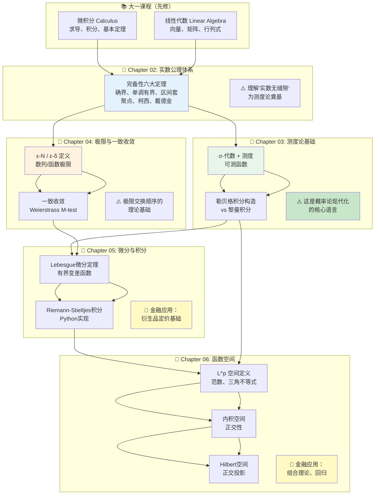

# 实分析 (Real Analysis) — 章节导航与学习方法

> **难度定位**: 大二数学核心课 | **目标读者**: 对外经贸大学数据科学大一升大二 | **定位**: CMU/MIT 申请者  
> **前置要求**: 大一微积分 + 线性代数 | **总章节数**: 6 | **预计学习周期**: 8-10 周

---

## 📖 章节结构

| 编号 | 文件名 | 核心主题 | Python 相关度 | 金融/量化关联 |
|:---:|--------|----------|:---:|------------|
| 01 | [[01_实分析基础]] | 学科定位 + 学习方法论 | ⭐ | 测度论基础 |
| 02 | [[02_实数公理体系]] | 完备性六大定理 | ⭐ | 概率空间构建 |
| 03 | [[03_测度论基础]] | σ-代数 + 勒贝格积分 | ⭐⭐⭐ | 随机变量建模 |
| 04 | [[04_极限与一致收敛]] | ε-N/ε-δ + 一致收敛 | ⭐⭐ | 随机过程收敛 |
| 05 | [[05_微分与积分]] | Lebesgue微分定理 + RS积分 | ⭐⭐ | 衍生品定价 |
| 06 | [[06_函数空间]] | L^p 空间 + Hilbert空间 | ⭐⭐ | 资产组合理论 |

---

## 🧠 实分析到底研究什么？

### 从"会算"到"懂为什么"的关键一步

大一你学的是 **微积分 (Calculus)**，核心技能是：
- 求导、积分、级数求和
- 套公式、计算题拿高分
- 知道"怎么做"，但不一定知道"为什么这样做"

**实分析 (Real Analysis)** 要回答的是更本质的问题：

```
微积分课教你：如何计算 ∫₀¹ x² dx = 1/3
实分析课追问：
  1. "积分"到底是什么意思？什么叫"面积"？
  2. 哪些函数可以积分？哪些不行？
  3. 积分和极限交换顺序，什么时候合法？
  4. 无穷级数的和到底是不是一个"数"？
```

> 💡 **一句话总结**：微积分是**计算工具**，实分析是**理解这些工具的原理和局限**。

### 实分析的核心研究对象

```
实分析 = 研究实数集 R 上的"极限" + "大小" + "结构"
```

三大核心问题：

1. **极限**：数列/函数列什么时候收敛？收敛到谁？
2. **测度**：如何度量一个集合的"大小"？（长度、面积、概率）
3. **函数空间**：把函数当作"点"，在无穷维空间里分析它们

---

## 🔗 实分析与大学其他课程的关系

### 和大一下微积分的本质区别

| 维度 | 大一微积分 | 大二实分析 |
|------|-----------|-----------|
| **核心方法** | 计算为主 | 证明为主 |
| **关注点** | 会算就行 | 为什么能算、什么时候失效 |
| **思维深度** | 算法思维 | 公理化思维 |
| **典型问题** | 求导数、积分 | 证明极限存在 |
| **考试形式** | 计算题 | 证明题 |

### 和概率论（测度论）的联系 ⚠️ 重要！

这是**对量化交易方向最关键**的连接：

```
大一概率论（基于初等排列组合）
    ↓ 大二学完测度论后 ↓
大三概率论（基于测度论的现代概率论）
    ↓ 研究生 ↓
随机微积分 → 衍生品定价 (Black-Scholes)
```

**具体来说：**

| 概率论概念 | 实分析对应 |
|-----------|-----------|
| 事件（样本点的集合） | 可测集 |
| 概率 P(A) | 测度 μ(A) |
| 随机变量 X(ω) | 可测函数 f(x) |
| E[X] = ∫XdP | 勒贝格积分 |

> 🎯 **对量化方向的意义**：实分析是概率论现代化的基础。学不好测度论，读研究生的高级计量经济学和金融工程会非常吃力。

### 和其他课程的关系

```
                    线性代数（大一）
                         │
实分析（大二上）───────────┼──────────── 数值分析（大三）
    │                     │                  │
    ├── 测度论 ────────────┤──→ 高等概率论 ───┤──→ 随机过程
    │                     │         │        │
    ├── 泛函分析 ──────────┤         ↓        ├── 金融工程
    │                     │    衍生品定价     │
    └── 函数空间(L^p) ─────┘                  │
```

---

## 📚 推荐教材

### 主线教材（必读）

| 教材 | 难度 | 适合人群 | 备注 |
|------|------|---------|------|
| **《Principles of Mathematical Analysis》** (Rudin) | ⭐⭐⭐⭐ | 目标CMU/MIT | 数学系圣经，够简洁 |
| **《Understanding Analysis》** (Abbott) | ⭐⭐⭐ | 初学者首选 | 大量直观解释 |
| **《Real Analysis: Measure, Integration & Hilbert Spaces》** ( Stein & Shakarchi ) | ⭐⭐⭐⭐ | 后续学概率论 | Princeton Lectures in Analysis 系列第三本 |

### 中文辅助教材

| 教材 | 特点 |
|------|------|
| **《数学分析》** (华东师范大学) | 适合课后复习 |
| **《实变函数与泛函分析》** (程其襄等) | 中文经典 |
| **《实变函数论》** (周民强) | 习题丰富 |

### 参考书（进阶）

- **《Real Analysis》** (Folland) — 更现代的写法
- **《Measure Theory》** (Halmos) — 测度论专项

---

## 🛠️ 学习方法论

### 大一到大二的思维跳跃：为什么很多人卡住？

很多同学大一微积分能考 90+，大二实分析突然听不懂。原因在于：

```
高中→大一：知识量增加，但思维方式类似
大一→大二：思维方式根本转变——从"算"到"证"
```

**实分析的核心思维方式**：

1. **反例思维**：不是"怎么证明它对"，而是"能不能找个反例说明它不对"
2. **构造思维**：很多定理的证明是"构造"出来的，不是推导出来的
3. **极限思维**：一切定义都是"ε-δ 语言"，要习惯用ε来描述"要多近有多近"
4. **分类讨论**：数学分析里经常需要讨论边界情况

### 每周学习流程建议

```
周一到周五：
  1. 预习：读教材对应章节（1-2小时），标注看不懂的地方
  2. 上课：重点听自己预习看不懂的地方
  3. 复习：整理笔记，重新做课堂证明（一定要动手写！）

周末（3-4小时）：
  1. 复习本周证明技巧
  2. 做习题：先自己想，再看答案，最后盖上答案重做
  3. Python 验证：用代码验证定理的数值含义（详见各章节）
```

### Python 在实分析学习中的角色

> ⚠️ Python **不能**替代严格证明，但可以帮助**建立直觉**！

**Python 的价值**：
- 验证数值例子（特别是反例）
- 可视化收敛过程（数列逼近、函数逼近）
- 蒙特卡洛模拟帮助理解测度论概念
- 计算 L^p 范数、正交投影等

**不擅长的事**：
- 严格证明（最核心的技能）
- ε-δ 语言的精确定义

---

## 🎯 各章节学习重点

### Chapter 02: 实数公理体系 — 学什么？

**核心目标**：理解实数的"完备性"——为什么实数没有"缝隙"

**必须掌握的6个等价定理**：
1. 确界存在定理
2. 单调有界收敛定理
3. 区间套定理
4. 聚点定理（Bolzano-Weierstrass）
5. 柯西收敛准则
6. 戴德金完备性

**为什么重要**：完备性保证了极限操作在实数域里不会"跑出去"。这在概率论里意味着：大量随机变量的极限还是一个随机变量。

---

### Chapter 03: 测度论基础 — 学什么？

**核心目标**：重新定义"积分"，从黎曼积分到勒贝格积分

**关键概念**：
- σ-代数（可测集的代数结构）
- 测度（长度、面积、概率的统一框架）
- 可测函数
- 勒贝格积分的构造

**为什么重要（对量化）**：
```
随机变量 X 的期望 → E[X] = ∫_Ω X dP
                  → 勒贝格积分
                  → 需要测度论框架
```

---

### Chapter 04: 极限与一致收敛 — 学什么？

**核心目标**：严格掌握 ε-N / ε-δ 语言；理解一致收敛的重要性

**关键问题**：什么时候可以交换极限和积分/导数的顺序？

**为什么重要**：随机过程里很多收敛性定理依赖一致收敛或更弱的收敛概念。

---

### Chapter 05: 微分与积分 — 学什么？

**核心目标**：Lebesgue 微分定理、有界变差函数、Riemann-Stieltjes积分

**金融应用**：RS积分是 Black-Scholes 公式推导的关键工具之一。

---

### Chapter 06: 函数空间 — 学什么？

**核心目标**：在"函数作为点"的新视角下理解分析

**关键空间**：
- L¹ 空间（可积函数空间）→ 期望值
- L² 空间（平方可积）→ 内积空间 → Hilbert空间
- 正交投影 → 最小二乘拟合

**金融应用**：资产组合理论中的均值-方差优化，本质上是 Hilbert 空间中的正交投影。

---

## 🧭 章节依赖图

以下 Mermaid 图展示了各章节之间的先修关系：



---

## 🔥 学习自评表（每章节完成后填写）

| 等级 | 描述 | 自我评估 |
|:---:|------|---------|
| ⭐ | 完全不懂，需要重新读 | [ ] |
| ⭐⭐ | 大概懂，但不会证明 | [ ] |
| ⭐⭐⭐ | 能理解证明，跟上课程 | [ ] |
| ⭐⭐⭐⭐ | 能独立完成证明题 | [ ] |
| ⭐⭐⭐⭐⭐ | 能自己找反例，创造性思考 | [ ] |

> ✅ **目标等级**：Chapter 02-03 达到 ⭐⭐⭐⭐；Chapter 04-06 达到 ⭐⭐⭐⭐（量化方向重点在03、05、06）

---

## 🚀 下一步

准备好？开始 [[02_实数公理体系]] —— 理解为什么 0.999... = 1，实数为什么没有"缝隙"，以及这一切和概率论有什么关系。

> *下一个章节：[[02_实数公理体系]] — 从有理数到实数，完备性的六大等价定理*
