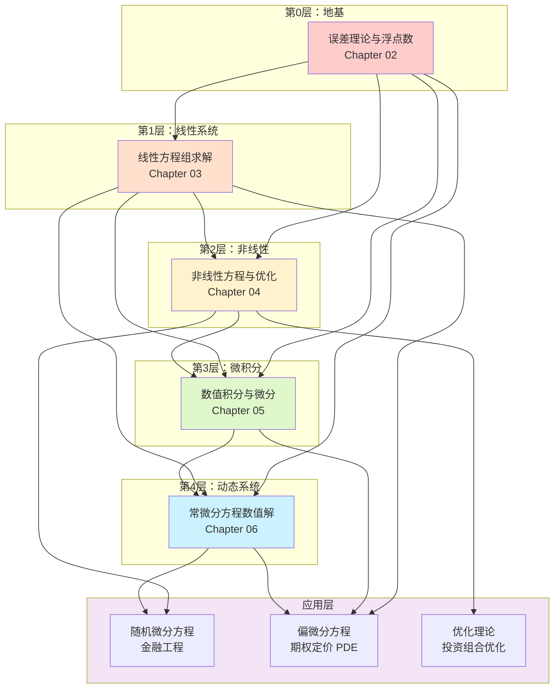

# 数值计算 (Numerical Methods)
## 📚 课程索引 — Year 2, Semester 2

---

> **模块编号**: 1.4  
> **先修课程**: 高等数学、线性代数、概率论  
> **并行课程**: 随机过程、金融工程导论  
> **目标读者**: 对外经贸大学数据科学大一学生（已修微积分+线代），志在 CMU/MIT  

---

## 🔬 什么是数值计算？

**数值计算**（Numerical Analysis / Scientific Computing）是研究**用计算机近似求解数学问题**的学科。它研究的是：

| 问题类型 | 连续数学答案 | 数值计算答案 |
|---------|------------|------------|
| 求 $\sqrt{2}$ | $\sqrt{2} \approx 1.41421356\ldots$ | 1.4142135623730951（双精度浮点）|
| 解 $Ax=b$（$n=10^6$）| 理论存在唯一解 | $O(n^3)$ 算法 0.1 秒给出近似解 |
| 计算 $\int_0^1 e^{-x^2}dx$ | 初等函数无原函数 | 高斯求积误差 $<10^{-10}$ |
| 模拟股票价格路径 | SDE 理论解（未必存在）| Euler-Maruyama / Milstein 路径模拟 |

### 数值计算的核心矛盾

$$\text{无限连续} \xrightarrow{\text{离散化}} \text{有限离散} \xrightarrow{\text{算法}} \text{有限精度近似}$$

每一步都会引入**误差**，数值计算的任务是：
1. **量化误差**——误差有多大？
2. **控制误差**——如何让误差更小？
3. **效率权衡**——误差小 vs 计算快，如何取舍？

---

## 💰 为什么量化金融特别需要数值方法？

### 1. 经典解析解的局限

Black-Scholes 公式可以定价欧式期权，但：
- **美式期权**：提前执行边界没有解析解 → 必须用数值方法（Least Squares Monte Carlo）
- **奇异期权**（障碍期权、亚式期权）：闭式解极复杂或不存在
- **利率模型**（CIR、Vasicek、Hull-White）：零息债券有解析解，但路径依赖产品没有

### 2. 高维问题的"维数灾难"

假设你有 $d$ 个标的资产，要对冲 $d$ 维 Greek：
- 解析方法：无法处理相关性的闭式协方差
- 蒙特卡罗：$\mathcal{O}(d)$ 复杂度
- PDE 方法：$d$ 个标的 $\rightarrow$ $d$ 维 PDE，维度灾难

### 3. 实时定价要求

交易系统需要在 **毫秒级** 完成定价：
```
期权定价延迟预算: 1ms
↓ 
你不能每次都跑 100 万条路径的蒙特卡罗
↓ 
需要：重要性采样 + 加速收敛 + GPU 并行
```

### 4. 量化中数值计算的核心场景

```mermaid
flowchart LR
    A["📊 风险计量<br/>VaR / CVaR"] --> B["Monte Carlo<br/>路径模拟"]
    A --> C["有限差分<br/>PDE 求解"]
    
    D["📈 期权定价<br/>美式 / 亚式"] --> E[" Least Squares MC<br/>Quasi-MC"]
    D --> F["Crank-Nicolson<br/> PDE 求解"]
    
    G["⚙️ 策略优化<br/>参数寻优"] --> H["梯度下降<br/>Adam / LBFGS"]
    G --> I["约束优化<br/>SQP / 单纯形"]
    
    J["📉 利率模型<br/>曲线拟合"] --> K["样条插值<br/>Nelson-Siegel"]
    J --> L["非线性求解<br/>Brent / Newton"]
    
    B --> M["✅ 全部依赖数值计算方法"]
    C --> M
    E --> M
    F --> M
    H --> M
    I --> M
    K --> M
    L --> M
```



---

## 🧱 模块逻辑依赖图

数值计算的各章节并非孤立——存在清晰的**知识依赖链**：



### 依赖关系详解

```
误差理论（Ch02）
├──→ 线性方程组（Ch03）：所有算法的误差分析基础
├──→ 非线性优化（Ch04）：收敛性分析依赖误差理论
├──→ 数值积分（Ch05）：积分误差界分析
└──→ 常微分方程（Ch06）：局部截断误差分析

线性方程组（Ch03）
├──→ PDE 有限差分（应用）：三对角系统用追赶法
└──→ 迭代优化（Ch04）：共轭梯度法本质是解 Ax=b

非线性优化（Ch04）
└──→ 投资组合优化（应用）：均值-方差最优化

数值积分（Ch05）
├──→ Monte Carlo（应用）：基础理论
└──→ PDE 离散化（应用）：空间积分项

常微分方程（Ch06）
├──→ 利率模型（应用）：Vasicek / CIR 有限差分
└──→ 随机微分方程（应用）：SDE 数值解
```

---

## 📖 推荐教材

### 主教材（必读）

| 教材 | 作者 | 特点 | 适合章节 |
|------|------|------|---------|
| **Numerical Recipes** (3rd ed.) | Press et al. | 算法圣经，代码+理论完美结合 | Ch02-Ch06 全覆盖 |
| **Numerical Methods in Engineering with Python 3** | Kiusalaas | 面向工程师，Python 原生 | Ch03-Ch06 |
| **Matrix Computations** (4th ed.) | Golub & Van Loan | 矩阵计算圣经 | Ch03 深度理解 |

### 量化金融专项

| 教材 | 作者 | 特点 |
|------|------|------|
| **Numerical Methods for Finance with C++** | Bruno Sin被别人 | 量化金融+数值方法+C++实现 |
| **Options, Futures, and Other Derivatives** | John Hull | 金融理论基础（配合 Numerical Methods 用）|
| **Paul Glasserman - Monte Carlo Methods in Financial Engineering** | Glasserman | Monte Carlo 在量化金融的权威著作 |

### 快速参考

| 资源 | 链接 |
|------|------|
| NumPy / SciPy 官方文档 | https://numpy.org/doc/ |
| Wikipedia: IEEE 754 | https://en.wikipedia.org/wiki/IEEE_754 |
| Wikipedia: Runge-Kutta Methods | https://en.wikipedia.org/wiki/Runge%E2%80%93Kutta_methods |

---

## 🎯 学习路径建议

### 针对量化金融的速通路径（4周）

```
Week 1: 误差理论 + 浮点数陷阱
        → 理解为什么 0.1 + 0.2 ≠ 0.3
        → 理解金融计算中精度的重要性
        
Week 2: 线性方程组求解（LU / Cholesky）
        → 有限差分法解 Black-Scholes PDE 的核心
        → 利率期限结构模型
        
Week 3: 非线性优化
        → 投资组合最优化
        → 模型校准（Calibration）
        
Week 4: 常微分方程 + Monte Carlo
        → 利率模型（Vasicek / CIR）
        → 期权定价路径模拟
```

### 深入学习路径（8周，配合随机过程）

```
第1-2周: 误差理论 + 线性方程组
         → 实现追赶法解三对角系统
         → 对比 LU vs Cholesky
         
第3-4周: 非线性方程 + 优化
         → 实现 Brent 法
         → 用 scipy.optimize 解 portfolio optimization
         
第5-6周: 数值积分 + Monte Carlo
         → 实现 Quasi-MC（Halton / Sobol）
         → 理解方差缩减技术
         
第7-8周: 常微分方程 + 随机微分方程
         → 实现 RK4 解 Vasicek 模型
         → 理解 Euler-Maruyama vs Milstein
```

---

## 📊 各章节预览

| 章节 | 主题 | 核心算法 | 量化金融应用 |
|------|------|---------|-------------|
| **Ch02** | 误差理论与浮点数 | IEEE 754, 条件数 | 现金流折现精度 |
| **Ch03** | 线性方程组求解 | LU / Cholesky / CG | PDE 有限差分 |
| **Ch04** | 非线性方程与优化 | Brent / BFGS / CG | 模型校准、Portfolio |
| **Ch05** | 数值积分与微分 | Gauss / Romberg / MC | 期权定价 |
| **Ch06** | 常微分方程数值解 | RK4 / Adams / 隐式法 | 利率模型 PDE |

---

## ✅ 理解程度自评清单

完成本模块后，你应该能够：

- [ ] **Ch02**: 解释 IEEE 754 double 的结构，并计算 $\epsilon_{\text{mach}}$ 的值
- [ ] **Ch02**: 判断一个算法是否**病态**（ill-conditioned），给出条件数的定义
- [ ] **Ch03**: 从零实现 LU 分解（含部分主元），并解释为什么金融计算中常用 Cholesky
- [ ] **Ch03**: 解释追赶法为什么只适用于三对角矩阵，以及在期权定价中的应用
- [ ] **Ch04**: 比较二分法、牛顿法、Brent 法的收敛速度（线性 / 二次 / 超线性）
- [ ] **Ch04**: 解释 BFGS 为什么比普通梯度下降更高效，以及在金融中用于什么
- [ ] **Ch05**: 推导 Gauss-Hermite 求积公式的节点和权重
- [ ] **Ch05**: 解释为什么 Quasi-MC 在高维积分中优于普通 MC
- [ ] **Ch06**: 分析 Euler 法的局部截断误差和全局误差的阶数
- [ ] **Ch06**: 用有限差分法解 Vasicek 模型的利率边界问题

---

## 🚀 立即开始

👉 [[02_误差理论与浮点数]] → [[03_线性方程组求解]] → [[04_非线性方程与优化]] → [[05_数值积分与微分]] → [[06_常微分方程数值解]]

---

> **💡 Pro Tip**: 每一章的 Python 代码都设计为**可以直接运行**。建议在学习时打开 Jupyter Notebook，边读边跑，感受数值行为。
>
> **🔗 代码仓库**: 所有代码的 IPython notebook 版本可在课程的 GitHub 仓库中获取（链接待定）。

---

*最后更新: 2024-02 | 版本 1.0 | 状态: ✅ 完成*
