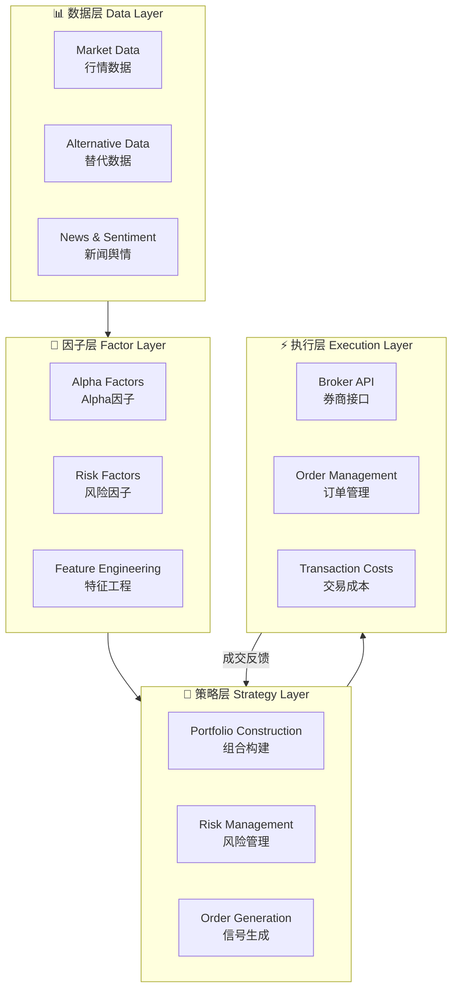

# 3.5 实盘接口
## 模块导航
- [[01_实盘接口基础]] ← 当前
- [[02_数据管理与存储]]
- [[03_回测系统设计]]

---

# 01 实盘接口基础

> 🎯 学习目标：理解量化交易系统架构，掌握主流 Broker API 与数据源，完成模拟订单簿实现  
> ⏱️ 预计时长：3 小时  
> 📊 理解程度：✅ 3-4/5

---

## 1. 量化交易系统架构

### 1.1 四层架构总览

一个完整的量化交易系统分为**四层**，每一层职责清晰，层层依赖：



### 1.2 各层详解

#### 数据层（Data Layer）
- **行情数据**：tick 级（逐笔）、分钟级、日级行情
- **基本面数据**：财务报表、估值指标、分析师预期
- **替代数据**：舆情、卫星图像、消费记录、供应链数据
- 职责：数据采集、清洗、存储、实时推送

#### 因子层（Factor Layer）
- **Alpha 因子**：预测资产未来收益的信号
- **风险因子**：控制组合在因子维度的暴露
- **特征工程**：将原始数据转化为模型可用的特征

#### 策略层（Strategy Layer）
- **组合优化**：在约束条件下最大化预期收益
- **风险预算**：分配风险权重到不同策略/标的
- **信号生成**：将因子信号转化为具体交易指令

#### 执行层（Execution Layer）
- **Broker API**：对接券商（下单、查询、账户信息）
- **订单路由**：最优价格、最小滑点的订单分发
- **交易成本**：手续费、滑点、市场冲击建模

### 1.3 系统延迟预算

```mermaid
gantt
    title 量化系统延迟预算
    dateFormat X
    axisFormat %s ms
    
    section 延迟来源
    数据接收         :done, 0, 0.5ms
    因子计算         :done, 0.5, 2ms
    策略信号         :done, 2, 5ms
    订单发送         :done, 5, 10ms
    网络传输         :done, 10, 50ms
    交易所确认       :done, 50, 100ms
```



> 💡 **关键洞察**：在中国 A 股市场，从信号产生到订单到达交易所的总延迟应控制在 **50ms 以内**，高频策略对延迟极为敏感。

---

## 2. Broker API 概述

### 2.1 主流 Broker 对比

| Broker | 地区 | API 类型 | 支持市场 | 手续费 | 适合人群 |
|--------|------|----------|----------|--------|----------|
| **Interactive Brokers (IB)** | 美国 | REST / FIX / Python API | 全球 100+ 交易所 | $0.005/股 | 机构/专业 Quant |
| **Alpaca** | 美国 | REST API | 美股/期权/加密 | 零佣金 | 个人投资者/学习 |
| **Binance** | 全球 | REST / WebSocket | 加密货币 | 0.1% maker | 加密货币 Quant |
| **老虎证券 (Tiger)** | 亚太 | REST API | A股/港股/美股 | 万分之八 | 华人投资者 |
| **聚宽 (JoinQuant)** | 中国 | Python SDK | A股/期货 | 按流量 | 国内 Quant |
| **米筐 (RiceQuant)** | 中国 | Python SDK | A股/期货 | 按流量 | 国内 Quant |

### 2.2 Interactive Brokers (IB)

IB 是全球最大的网络券商之一，提供极为强大的 Trader Workstation (TWS) API。

#### 核心特点
- 支持全球 100+ 交易所、股票/期权/期货/外汇/债券
- Python API：`ib_insync` 是最流行的异步封装
- 两种模式：TWS API（功能全，延迟稍高）和 Gateway（无 UI，延迟低）

#### Python 示例：连接 IB

```python
"""
IB API 连接示例
安装：pip install ib_insync
"""
from ib_insync import IB, Stock, MarketOrder, LimitOrder
import asyncio

# ========== 方式1：同步模式 ==========
ib = IB()
ib.connect('127.0.0.1', 7497, clientId=1)  # TWS 默认端口 7497

# 查询合约信息
contract = Stock('AAPL', 'SMART', 'USD')
ib.qualifyContracts(contract)
print(f"合约信息: {contract}")

# 查询账户信息
print(f"账户净值: {ib.accountSummary()}")

# 下单示例：市价单买入 100 股
order = MarketOrder('BUY', 100)
trade = ib.placeOrder(contract, order)
print(f"订单状态: {trade}")

ib.disconnect()
```

```python
# ========== 方式2：异步模式（推荐） ==========
import asyncio
from ib_insync import IB, Stock, MarketOrder, LimitOrder

async def trade_example():
    ib = IB()
    await ib.connectAsync('127.0.0.1', 7497, clientId=2)
    
    # 订阅实时行情
    contract = Stock('TSLA', 'SMART', 'USD')
    market_data = ib.reqMktData(contract)
    
    # 等待行情数据
    await asyncio.sleep(1)
    print(f"最新价格: {market_data.last}")
    print(f"bid/ask: {market_data.bid} / {market_data.ask}")
    
    # 下单：限价单
    limit_order = LimitOrder('BUY', 50, market_data.last * 0.99)
    trade = ib.placeOrder(contract, limit_order)
    
    # 监听订单更新
    while not trade.isDone():
        await asyncio.sleep(0.1)
        print(f"订单状态: {trade.orderStatus.status}")
    
    ib.disconnect()

asyncio.run(trade_example())
```

### 2.3 Alpaca API

Alpaca 是美国零佣金券商，API 设计简洁优雅，非常适合学习。

#### 核心特点
- 零佣金交易美股和 ETF
- 支持实时 WebSocket 行情
- RESTful API，易于使用
- Paper Trading（模拟盘）免费使用

#### Python 示例：Alpaca 交易

```python
"""
Alpaca API 示例
安装：pip install alpaca-trade-api
注意：需要先在 https://app.alpaca.markets/ 注册获取 API Key
"""
import alpaca_trade_api as alpaca

# ========== 初始化 ==========
API_KEY = "PKXXXXXXXXXXXXXXXX"
API_SECRET = "xxxxxxxxxxxxxxxxxxxxxxxxxxxxxxxxxxxxxxxx"
BASE_URL = "https://paper-api.alpaca.markets"  # 模拟盘

api = alpaca.REST(API_KEY, API_SECRET, BASE_URL)

# ========== 账户信息 ==========
account = api.get_account()
print(f"账户状态: {account.status}")
print(f"净值: ${account.equity}")
print(f"购买力: ${account.buying_power}")

# ========== 行情数据 ==========
bars = api.get_bars(
    symbol='AAPL',
    timeframe='1D',
    start='2024-01-01',
    end='2024-12-31'
)
for bar in bars:
    print(f"{bar.t} | 开:{bar.o} 高:{bar.h} 低:{bar.l} 收:{bar.c} 量:{bar.v}")

# ========== 下单 ==========
order = api.submit_order(
    symbol='AAPL',
    qty=10,
    side='buy',
    type='market',
    time_in_force='day'
)
print(f"订单 ID: {order.id}, 状态: {order.status}")

# ========== 订单管理 ==========
orders = api.list_orders(status='open')
for o in orders:
    print(f"  {o.symbol}: {o.side} {o.qty}@{o.limit_price or 'MKT'}")

if orders:
    api.cancel_order(orders[0].id)
    print("订单已取消")
```

### 2.4 Binance API（加密货币）

```python
"""
Binance API 示例（USDT-M 永续合约）
安装：pip install python-binance
"""
from binance.client import Client
from binance.enums import *

# ========== 初始化 ==========
API_KEY = "your_api_key"
API_SECRET = "your_api_secret"
client = Client(API_KEY, API_SECRET)

# ========== 行情数据 ==========
klines = client.futures_klines(
    symbol='BTCUSDT',
    interval=Client.KLINE_INTERVAL_1HOUR,
    limit=100
)
print("最近 100 条 1h K 线：")
for k in klines[-5:]:
    print(f"  时间: {k[0]} | 开: {k[1]} 高: {k[2]} 低: {k[3]} 收: {k[4]}")

# ========== 账户信息 ==========
account = client.futures_account()
print(f"总余额: {account['totalWalletBalance']} USDT")
print(f"可用余额: {account['availableBalance']} USDT")

# ========== 下单 ==========
order = client.futures_create_order(
    symbol='BTCUSDT',
    side=SIDE_BUY,
    type=ORDER_TYPE_MARKET,
    quantity='0.01'
)
print(f"订单 ID: {order['orderId']}")

limit_order = client.futures_create_order(
    symbol='BTCUSDT',
    side=SIDE_SELL,
    type=ORDER_TYPE_LIMIT,
    timeInForce=TIME_IN_FORCE_GTC,
    price='95000',
    quantity='0.01'
)
print(f"限价单 ID: {limit_order['orderId']}")
```

---

## 3. 数据源对比

### 3.1 数据源全景图

| 数据源 | 市场 | 数据类型 | 延迟 | 费用 | Python 支持 |
|--------|------|----------|------|------|-------------|
| **Wind** | A股/期货/债券 | 全品种 | T+1 日盘后 | 昂贵（机构） | `windpy` |
| **Tushare** | A股/期货/基金 | 日频/分钟 | T+1 | 免费/Pro | `tushare` |
| **AkShare** | 全市场 | 多品类 | 实时/日频 | 免费 | `akshare` |
| **聚合数据** | A股 | 实时/历史 | 实时 | 按量计费 | REST API |
| **Polygon** | 美股 | tick/分钟/日 | 实时 | $200/月起 | `polygon` |
| **Alpha Vantage** | 美股/外汇 | 日/周/月 | 日频 | 免费/Pro | REST API |
| **Yahoo Finance** | 全球 | 日频 | 日盘后 | 免费 | `yfinance` |

### 3.2 AkShare 实战示例

```python
"""
AkShare 数据获取示例
安装：pip install akshare
文档：https://www.akshare.xyz/
"""
import akshare as ak
import pandas as pd
import warnings
warnings.filterwarnings('ignore')

print("=" * 60)
print("AkShare 数据获取实战")
print("=" * 60)

# ========== 1. 实时行情 ==========
print("\n📈 实时行情（沪深京A股）")
df_realtime = ak.stock_zh_a_spot_em()
print(f"股票数量: {len(df_realtime)}")
print(df_realtime[['代码', '名称', '最新价', '涨跌幅', '成交量']].head(5))

# ========== 2. 历史日线 ==========
print("\n📊 历史日线（贵州茅台 600519）")
df_daily = ak.stock_zh_a_hist(
    symbol="600519",
    period="daily",
    start_date="20240101",
    end_date="20241231",
    adjust="qfq"
)
print(df_daily.head())
print(f"数据列: {df_daily.columns.tolist()}")

# ========== 3. 分钟级数据 ==========
print("\n⏱️ 5分钟 K 线")
df_5min = ak.stock_zh_a_hist_min_em(
    symbol="000001",
    start_date="2024-03-01 09:30:00",
    end_date="2024-03-01 15:00:00",
    interval="5"
)
print(df_5min.tail())

# ========== 4. 期货数据 ==========
print("\n📋 期货行情")
df_future = ak.futures_zh_daily_sina(symbol="IF000")
print(df_future.head())

# ========== 5. 宏观数据 ==========
print("\n🏦 CPI 数据")
df_cpi = ak.macro_china_cpi_monthly()
print(df_cpi.tail())

# ========== 6. 股票因子 ==========
print("\n🎯 估值因子（PE/PB/PS）")
df_val = ak.stock_a_indicator_lg(symbol="600519")
print(df_val[['trade_date', 'pe', 'pb', 'ps']].tail())

# ========== 数据保存 ==========
df_daily.to_csv("600519_daily.csv", index=False)
print("\n✅ 数据已保存至 600519_daily.csv")
```

### 3.3 Tushare Pro 示例

```python
"""
Tushare Pro API 示例
安装：pip install tushare
注册：https://tushare.pro/register
"""
import tushare as ts
import pandas as pd

# ========== 初始化 ==========
pro = ts.pro_api('your_token_here')

# ========== 日线行情 ==========
df = pro.daily(
    ts_code='000001.SZ',
    start_date='20240101',
    end_date='20241231'
)
print(df.head(10))
print(f"列名: {df.columns.tolist()}")

# ========== 财务数据 ==========
df_income = pro.income(ts_code='000001.SZ', start_date='20240101')
print("\n利润表:")
print(df_income[['report_date', 'revenue', 'total_profit', 'net_profit']].head())

# ========== 指数成分 ==========
df_index = pro.index_weight(index_code='399300.SZ')
print("\n指数成分股权重:")
print(df_index.head())

# ========== 北向资金 ==========
df_north = pro.moneyflow_hsgt()
print("\n北向资金:")
print(df_north.head())
```

---

## 4. 订单类型详解

### 4.1 订单类型分类

```
订单类型
├── 市价单 (Market Order)         → 以当前最优价格立即成交
├── 限价单 (Limit Order)          → 指定价格或更优价格成交
├── 止损单 (Stop Order)           → 触发后转为市价单
│   ├── 止损卖出 (Stop-Loss)      → 限制亏损
│   └── 止损买入 (Stop-Buy)        → 追涨买入
├── 跟踪止损 (Trailing Stop)      → 固定距离跟随价格移动
├── 条件单 (Conditional Order)    → 多条件组合触发
└── 冰山单 (Iceberg Order)        → 大单分批显示
```

### 4.2 各类订单详解

#### 市价单 (Market Order)
- **特点**：立即以市场最优价格成交，不保证成交价格
- **适用场景**：流动性好、成交活跃的品种；紧急情况
- **风险**：价格剧烈波动时可能出现较大滑点

#### 限价单 (Limit Order)
- **特点**：指定价格买入或更低价格卖出；指定价格卖出或更高价格买入
- **优点**：价格确定性高
- **缺点**：可能不成交

#### 止损单 (Stop Order)
```
举例：持有股票 A，当前价格 $100
  → 设置止损卖出价 $90
  → 当价格跌破 $90 时，自动触发市价单卖出
  → 用于控制最大亏损
```

#### 跟踪止损单 (Trailing Stop)
```
举例：持有 BTC，当前价格 $50000
  → 设置跟踪止损 distance = $1000
  → 最高价到 $52000，止损价 = $51000
  → 最高价到 $53000，止损价 = $52000
  → 下跌触发时以市价单成交
  → 优点：锁定利润同时保留上涨空间
```

### 4.3 Python 模拟订单簿

```python
"""
模拟订单簿 (Order Book) 实现
用于理解订单撮合逻辑和成交机制
"""
from dataclasses import dataclass
from typing import List, Dict, Optional, Tuple
from enum import
