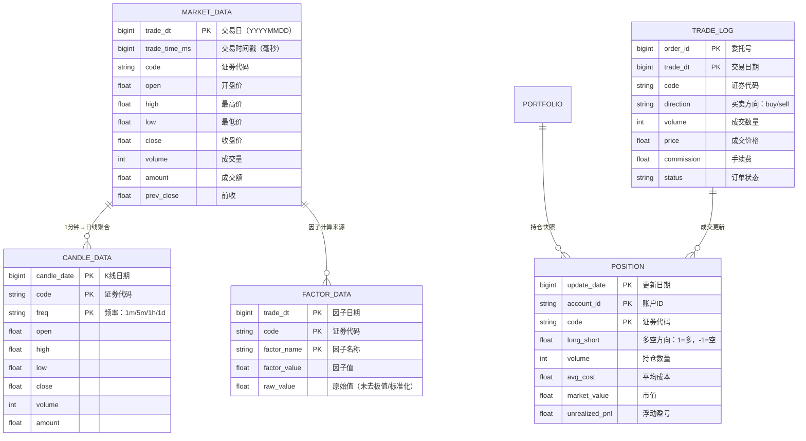

# 3.5_实盘接口 / 02_数据管理与存储

> **本章导读**：实盘系统的根基不在策略，而在数据。本章系统讲解金融时序数据的特点与处理流程，从高频Tick到日频行情的逐级聚合，SQL与NoSQL数据库的选型哲学，以及行情/因子/持仓/交易四类核心表的设计思路，并手把手实现一个生产级 SQLite 数据管理器。

---

## 1. 金融时序数据的本质特征

### 1.1 数据频率层级

金融数据的频率是理解量化系统的第一个门槛。从毫秒级Tick到年频，数据量呈数量级变化：


**各频率数据典型规模（A股全市场）**：

| 数据频率 | 单市场日增量 | 全市场年增量 | 存储方案 |
|---------|------------|------------|---------|
| Tick | 500MB–2GB | 200–800GB | 分布式时序库 |
| 1Min K线 | 50–200MB | 20–80GB | 时序库+列式存储 |
| 日K线 | 5–20MB | 2–8GB | SQLite/PostgreSQL |
| 基本面 | 1–5MB/年 | 500MB–2GB | 关系型数据库 |

### 1.2 金融时序的六大特性

```
1. 时间有序性（Time-Series Ordering）
   → 不能打乱时间顺序插入，数据有物理时间戳 + 事件时间戳双重身份

2. 不可变性（Immutability）
   → 历史K线一旦确定，永不修改（复权因子另当别论）
   → 行情修正（上市公司公告）是例外，需要版本管理

3. 高吞吐量写入（High-Velocity Write）
   → Tick数据每秒数千到数万条，写入是连续流而非批量

4. 读放大问题（Read Amplification）
   → 量化策略需要同时读取大量历史截面
   → 截面查询（某一天所有股票的开盘价）比时序查询更频繁

5. 时间对齐性（Time Alignment）
   → 不同品种交易时间不同（A股9:30-15:00，港股9:30-16:00，美股9:30-16:00 EST）
   → 因子计算需要对齐到同一时间戳

6. 精度损失（Precision Loss）
   → 浮点数比较在金融中很危险
   → 价格精度：分（整数）或厘（用整数存储×10000）
```

---

## 2. 数据库选型：SQL vs NoSQL

### 2.1 选型决策矩阵

| 维度 | SQL | NoSQL |
|------|-----|-------|
| 代表 | PostgreSQL, MySQL | InfluxDB, TimescaleDB, MongoDB |
| 数据模型 | 关系型，行列分明 | Key-Value、列式、文档 |
| 查询语言 | SQL（标准、强大） | 各有API |
| 事务支持 | ACID完整 | 最终一致性为主 |
| 扩展性 | 垂直扩展为主 | 水平扩展强 |
| 时序优化 | 一般 | 专门优化（压缩、TTL、连续查询） |
| 适用场景 | 基本面、持仓、账户 | 行情Tick、高频因子 |

### 2.2 主流数据库在量化中的使用场景

```
PostgreSQL：基本面数据、持仓数据、账户系统
  → 优势：JSON支持、复杂查询、PostGIS（用于另类数据）
  → 推荐插件：TimescaleDB（给PostgreSQL加上时序能力）

InfluxDB：Tick数据、分钟K线、高频因子
  → 优势：连续查询（Continuous Query）自动聚合，TTL自动过期
  → 劣势：聚合查询不如列式快，不适合跨截面分析

ClickHouse：全市场日频以上的截面分析
  → 优势：列式存储，压缩率高（10-20倍），亚秒级聚合
  → 劣势：不适合单条Tick写入，适合批量导入

SQLite：个人/小团队本地研究、轻量级回测数据存储
  → 优势：零配置、文件即数据库、Python内置支持
  → 劣势：高并发写入差、不适合多进程
```

### 2.3 混合架构建议

> **实践建议**：对于学习阶段的个人量化项目，**SQLite（日K/基本面）+ CSV/Tick存储（高频原始）** 是最务实的起点。随着数据量增长，再迁移到 TimescaleDB 或 ClickHouse。

---

## 3. 时序数据仓库设计

### 3.1 核心表结构总览



### 3.2 行情表设计要点

**日线行情表（daily_bar）**：

```sql
CREATE TABLE daily_bar (
    trade_date   INTEGER     NOT NULL,  -- YYYYMMDD整数，如20260410
    code         TEXT        NOT NULL,  -- 股票代码，如 '000001.SZ'
    open         REAL        NOT NULL,
    high         REAL        NOT NULL,
    low          REAL        NOT NULL,
    close        REAL        NOT NULL,
    volume       INTEGER     NOT NULL,
    amount       REAL        NOT NULL,
    prev_close   REAL,
    turnover_rate REAL,
    pct_change   REAL,
    
    -- 复合主键：确保同一交易日同一股票只有一条记录
    PRIMARY KEY (trade_date, code)
);

-- 常用索引：按代码查历史行情
CREATE INDEX idx_daily_bar_code 
    ON daily_bar(code, trade_date);

-- 按日期查全市场：用于截面计算
CREATE INDEX idx_daily_bar_date 
    ON daily_bar(trade_date);
```

**分钟K线表（minute_bar）**：

```sql
CREATE TABLE minute_bar (
    trade_date   INTEGER     NOT NULL,  -- 20260410
    code         TEXT        NOT NULL,
    freq         TEXT        NOT NULL,  -- '1m', '5m', '15m', '30m', '60m'
    open_time    INTEGER     NOT NULL,  -- 这根K线的开始时间（HHMMSS）
    open         REAL,
    high         REAL,
    low          REAL,
    close        REAL,
    volume       INTEGER,
    
    PRIMARY KEY (trade_date, code, freq, open_time)
);

CREATE INDEX idx_minute_bar_code_time 
    ON minute_bar(code, freq, trade_date, open_time);
```

### 3.3 因子表设计要点

因子数据的特殊性：**宽表 + 长表** 的选择。

```sql
-- 方案A：长表（推荐，列多时用）
CREATE TABLE factor_long (
    trade_date   INTEGER,
    code         TEXT,
    factor_name  TEXT,
    factor_value REAL,
    is_valid     INTEGER DEFAULT 1,  -- 0=停牌/涨跌停等无效
    
    PRIMARY KEY (trade_date, code, factor_name)
);

-- 因子横向展开：每天每个因子一列
-- 方案B：宽表（适合少量因子，快速截面查询）
CREATE TABLE factor_wide (
    trade_date   INTEGER,
    code         TEXT,
    pb           REAL,
    pe_ttm       REAL,
    roe          REAL,
    momentum_20d REAL,
    volume_ma5   REAL,
    
    PRIMARY KEY (trade_date, code)
);
```

> **实践建议**：因子数量 < 20 用宽表，> 50 因子用长表。长表更灵活，但跨因子查询需要 JOIN。

---

## 4. 数据清洗：逐层净化

### 4.1 缺失值处理策略

```python
import numpy as np
import pandas as pd

def handle_missing_values(series: pd.Series, method: str = 'ffill') -> pd.Series:
    """
    金融时序缺失值处理
    
    Parameters
    ----------
    series : pd.Series
        原始价格/因子序列
    method : str
        - 'ffill': 前向填充（价格用前一日收盘价填充）
        - 'bfill': 后向填充（仅用于非交易日处理，小心前视偏差！）
        - 'interp': 线性插值（适用于波动率等连续量）
        - 'ffill_interp': 先前向填充，再用插值补中间空洞
        - 'drop': 直接删除（含NaN日期，数据会断点）
    
    Returns
    -------
    pd.Series
        清洗后的序列
    """
    result = series.copy()
    
    n_missing = result.isna().sum()
    if n_missing > 0:
        print(f"  发现 {n_missing} 个缺失值 ({n_missing/len(result)*100:.2f}%)")
    
    if method == 'ffill':
        result = result.ffill()
    elif method == 'bfill':
        # 警告：后向填充在因子计算中可能造成前视偏差！
        result = result.bfill()
    elif method == 'interp':
        result = result.interpolate(method='linear')
        result = result.ffill().bfill()
    elif method == 'ffill_interp':
        result = result.ffill().interpolate(method='linear')
        result = result.ffill().bfill()
    elif method == 'drop':
        result = result.dropna()
        
    if result.isna().any():
        result = result.bfill()
        
    return result
```

### 4.2 异常值检测与处理

```python
import numpy as np

def detect_outliers(series: pd.Series, 
                    method: str = 'mad',
                    threshold: float = 5.0) -> pd.Series:
    """
    金融数据异常值检测
    
    Methods:
    --------
    - 'mad': MAD方法（中位数绝对偏差），适合肥尾数据
      outlier if |x - median| > threshold * MAD
      MAD = median(|x - median(x)|)
      通常 threshold = 3.5 对应 3σ
    
    - 'zscore': Z-score方法，适合正态分布
      outlier if |z| > threshold
    
    - 'percentile': 百分位法
      outlier if x < P{threshold}% or x > P{100-threshold}%
    """
    clean = series.copy()
    
    if method == 'mad':
        median = np.median(clean)
        mad = np.median(np.abs(clean - median))
        # 修正MAD（对于正态分布，MAD * 1.4826 ≈ σ）
        mad_adjusted = mad * 1.4826
        lower = median - threshold * mad_adjusted
        upper = median + threshold * mad_adjusted
        
    elif method == 'zscore':
        mu = np.mean(clean)
        sigma = np.std(clean)
        lower = mu - threshold * sigma
        upper = mu + threshold * sigma
        
    elif method == 'percentile':
        lower = np.percentile(clean, threshold)
        upper = np.percentile(clean, 100 - threshold)
    
    outlier_mask = (clean < lower) | (clean > upper)
    n_outliers = outlier_mask.sum()
    
    if n_outliers > 0:
        print(f"  发现 {n_outliers} 个异常值 ({n_outliers/len(clean)*100:.2f}%)")
        print(f"    范围: [{lower:.4f}, {upper:.4f}]")
    
    return outlier_mask


def winsorize(series: pd.Series, 
              lower: float = 0.01, 
              upper: float = 0.99) -> pd.Series:
    """
    缩尾处理（Winsorization）
    将超出百分位边界的值替换为边界值
    相比截断（Truncation），保留样本量不变
    """
    q_low = series.quantile(lower)
    q_high = series.quantile(upper)
    return series.clip(lower=q_low, upper=q_high)
```

### 4.3 复权处理：前复权与后复权

复权是A股特有的数据处理需求——因为A股有除权除息（分红、送股、配股），会导致价格出现断崖。

```python
def adjust_price(df: pd.DataFrame, mode: str = 'forward') -> pd.DataFrame:
    """
    复权处理
    
    Parameters
    ----------
    df : pd.DataFrame
        包含 columns: [trade_date, code, open, high, low, close, volume]
    mode : str
        'forward' (前复权): 以最新价格为基准，倒推历史
        'backward' (后复权): 以历史价格为基准，顺推未来
    
    复权公式（前复权）：
        复权因子 = 最新收盘价 / 原始收盘价
        前复权价 = 原始价格 × 累计复权因子
    
    为什么用前复权？
        - 历史价格连续，方便计算收益率、均线等技术指标
        - 技术分析的前提是价格连续
    """
    df = df.sort_values(['code', 'trade_date']).copy()
    
    if mode == 'forward':
        def forward_adjust(group):
            prices = group['close'].values
            factors = prices[-1] / prices  # 复权因子（以最后一天为基准）
            group['close_adj'] = group['close'] * factors
            group['open_adj'] = group['open'] * factors
            group['high_adj'] = group['high'] * factors
            group['low_adj'] = group['low'] * factors
            return group
        return df.groupby('code', group_keys=False).apply(forward_adjust)
        
    elif mode == 'backward':
        def backward_adjust(group):
            prices = group['close'].values
            factors = prices / prices[0]  # 以第一天为基准
            group['close_adj'] = group['close'] / factors[0] * factors[-1]
            return group
        return df.groupby('code', group_keys=False).apply(backward_adjust)
```

---

## 5. Python 实现：SQLite 数据管理器

这是本章的核心实战项目——一个完整可用的 SQLite 数据管理器：

```python
import sqlite3
import pandas as pd
import numpy as np
from pathlib import Path
from datetime import datetime
from typing import Optional, List, Tuple, Union
import warnings

class QuantDataManager:
    """
    量化数据管理器（基于SQLite）
    
    功能：
    - 自动创建行情表/因子表/持仓表/交易表
    - 批量写入/增量写入行情数据
    - 历史行情查询（支持日期范围、股票列表）
    - 因子存储与截面查询
    - 数据完整性校验
    """
    
    def __init__(self, db_path: str = "quant_data.db"):
        self.db_path = db_path
        self.conn: Optional[sqlite3.Connection] = None
        self._connect()
        self._init_tables()
        
    def _connect(self):
        self.conn = sqlite3.connect(
            self.db_path,
            check_same_thread=False,
            isolation_level='DEFERRED'
        )
        self.conn.row_factory = sqlite3.Row
        self.conn.execute("PRAGMA foreign_keys = ON")
        # 启用WAL模式，提高并发读写性能
        self.conn.execute("PRAGMA journal_mode = WAL")
        
    def _init_tables(self):
        schema_statements = [
            """
            CREATE TABLE IF NOT EXISTS daily_bar (
                trade_date   INTEGER NOT NULL,
                code         TEXT    NOT NULL,
                open         REAL,
                high         REAL,
                low          REAL,
                close        REAL,
                volume       INTEGER,
                amount       REAL,
                prev_close   REAL,
                pct_change   REAL,
                turnover_rate REAL,
                is_st        INTEGER DEFAULT 0,
                PRIMARY KEY (trade_date, code)
            )
            """,
            """
            CREATE TABLE IF NOT EXISTS minute_bar (
                trade_date   INTEGER NOT NULL,
                code         TEXT    NOT NULL,
                freq         TEXT    NOT
