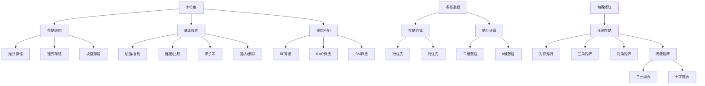

# 第4章：字符串和多维数组

> 本章学习目标：
> - 理解字符串的定义、特点及存储结构
> - 掌握字符串的基本操作和模式匹配算法
> - 深入理解KMP算法的原理和实现
> - 掌握多维数组的存储方式和地址计算
> - 理解特殊矩阵的压缩存储方法
> - 能够解决与字符串和数组相关的实际问题

---

## 4.1 字符串

### 4.1.1 字符串的定义

**定义**：
字符串（String）是由零个或多个字符组成的有限序列。它是线性结构的一种特殊形式，其数据元素是字符。

**数学表示**：
```
字符串 S = "a₁a₂a₃...aₙ"
```
其中：
- n 为字符串的长度（length）
- 当 n = 0 时，称为空串（empty string），记为 ""
- aᵢ 可以是字母、数字、空格或其他字符

**基本术语**：

| 术语 | 定义 | 示例 |
|------|------|------|
| **主串** | 包含其他字符串的字符串 | "Hello World" |
| **子串** | 主串中任意连续字符组成的子序列 | "World" 是 "Hello World" 的子串 |
| **空串** | 长度为0的字符串 | "" |
| **空格串** | 由一个或多个空格组成的字符串 | "   " |
| **字符串相等** | 两个字符串长度相同且对应字符相同 | "abc" == "abc" |
| **模式匹配** | 在主串中查找子串（模式串）的位置 | 在"ababc"中查找"abc" |

**示例**：

```cpp
#include <iostream>
#include <string>

int main() {
    // 字符串基本操作
    std::string str = "Hello World";
    std::string pattern = "World";

    // 长度
    std::cout << "长度: " << str.length() << std::endl;  // 输出: 11

    // 子串
    std::cout << "子串: " << str.substr(6, 5) << std::endl;  // 输出: World

    // 查找
    size_t pos = str.find(pattern);
    if (pos != std::string::npos) {
        std::cout << "位置: " << pos << std::endl;  // 输出: 6
    }

    // 空串
    std::string empty;
    std::cout << "空串长度: " << empty.length() << std::endl;  // 输出: 0

    return 0;
}
```

#### 字符串的抽象数据类型定义

**ADT定义**：

```cpp
ADT String {
    数据对象：D = {a_i | a_i ∈ CharSet, i = 1, 2, ..., n, n ≥ 0}
    数据关系：R = {<a_i-1, a_i> | a_i-1, a_i ∈ D, i = 2, 3, ..., n}

    基本操作：
        StrAssign(&T, chars)     // 赋值操作
        StrCopy(&T, S)          // 复制操作
        StrEmpty(S)             // 判断是否为空
        StrLength(S)            // 返回字符串长度
        StrCompare(S, T)        // 字符串比较
        StrConcat(&T, S1, S2)   // 字符串连接
        SubString(&Sub, S, pos, len)  // 求子串
        StrIndex(S, T, pos)     // 定位子串
        StrInsert(&S, pos, T)   // 插入子串
        StrDelete(&S, pos, len) // 删除子串
        StrReplace(&S, T, V)    // 子串替换
}
```

**C++接口定义**：

```cpp
#include <iostream>
#include <stdexcept>
#include <string>

template <typename CharType>
class IString {
public:
    // 析构函数
    virtual ~IString() = default;

    // 基本操作
    virtual void assign(const CharType* chars) = 0;              // 赋值
    virtual void copy(const IString& other) = 0;                // 复制
    virtual bool isEmpty() const = 0;                           // 判断是否为空
    virtual int length() const = 0;                             // 返回长度
    virtual int compare(const IString& other) const = 0;        // 比较
    virtual void concat(const IString& other) = 0;              // 连接
    virtual IString* substring(int pos, int len) const = 0;     // 求子串
    virtual int indexOf(const IString& pattern, int pos = 0) const = 0;  // 查找
    virtual void insert(int pos, const IString& other) = 0;      // 插入
    virtual void remove(int pos, int len) = 0;                  // 删除
    virtual void replace(const IString& old_str, const IString& new_str) = 0;  // 替换
    virtual void display() const = 0;                           // 显示

    // 运算符重载
    virtual CharType& operator[](int index) = 0;
    virtual const CharType& operator[](int index) const = 0;
    virtual bool operator==(const IString& other) const = 0;
    virtual bool operator!=(const IString& other) const = 0;
    virtual bool operator<(const IString& other) const = 0;
};
```

---

### 4.1.2 字符串的存储结构

#### 4.1.2.1 顺序存储结构

字符串的顺序存储结构使用连续的内存空间存储字符。

**实现方式**：

**方式1：定长数组存储**

```cpp
class FixedString {
private:
    char data[256];      // 固定长度数组
    int length;          // 当前长度

public:
    FixedString() : length(0) {
        data[0] = '\0';
    }

    void assign(const char* str) {
        int i = 0;
        while (str[i] != '\0' && i < 255) {
            data[i] = str[i];
            i++;
        }
        data[i] = '\0';
        length = i;
    }

    int getLength() const { return length; }

    void display() const {
        std::cout << data << std::endl;
    }
};
```

**方式2：堆分配存储**

```cpp
#include <cstring>

class HeapString {
private:
    char* data;          // 动态分配的字符数组
    int length;          // 当前长度
    int capacity;        // 当前容量

    void resize(int newCapacity) {
        char* newData = new char[newCapacity];
        memcpy(newData, data, length);
        delete[] data;
        data = newData;
        capacity = newCapacity;
    }

public:
    HeapString() : data(nullptr), length(0), capacity(0) {}

    HeapString(const char* str) : data(nullptr), length(0), capacity(0) {
        assign(str);
    }

    ~HeapString() {
        delete[] data;
    }

    void assign(const char* str) {
        int len = strlen(str);
        if (len + 1 > capacity) {
            resize(len + 1);
        }
        strcpy(data, str);
        length = len;
    }

    void append(const char* str) {
        int len = strlen(str);
        if (length + len + 1 > capacity) {
            resize(length + len + 1);
        }
        strcpy(data + length, str);
        length += len;
    }

    char& operator[](int index) {
        if (index < 0 || index >= length) {
            throw std::out_of_range("索引越界");
        }
        return data[index];
    }

    int getLength() const { return length; }

    void display() const {
        std::cout << data << std::endl;
    }
};
```

**方式3：C++标准库的string类**

```cpp
#include <string>

void standard_string_example() {
    std::string str1 = "Hello";
    std::string str2 = "World";

    // 连接
    std::string str3 = str1 + " " + str2;  // "Hello World"

    // 子串
    std::string sub = str3.substr(0, 5);  // "Hello"

    // 查找
    size_t pos = str3.find("World");  // 6

    // 替换
    str3.replace(6, 5, "C++");  // "Hello C++"

    // 插入
    str3.insert(5, ", ");  // "Hello, C++"

    // 删除
    str3.erase(5, 2);  // "HelloC++"

    // 比较
    bool equal = (str1 == str2);  // false

    // 遍历
    for (char c : str1) {
        std::cout << c << " ";
    }
}
```

#### 4.1.2.2 链式存储结构

字符串的链式存储结构使用链表存储字符。

**实现方式**：

```cpp
// 链式存储节点
struct StringNode {
    char data;
    StringNode* next;

    StringNode(char c) : data(c), next(nullptr) {}
};

// 链式字符串
class LinkedString {
private:
    StringNode* head;
    int length;

public:
    LinkedString() : head(nullptr), length(0) {}

    LinkedString(const char* str) : head(nullptr), length(0) {
        StringNode* tail = nullptr;
        for (int i = 0; str[i] != '\0'; ++i) {
            StringNode* newNode = new StringNode(str[i]);
            if (head == nullptr) {
                head = newNode;
                tail = newNode;
            } else {
                tail->next = newNode;
                tail = newNode;
            }
            length++;
        }
    }

    ~LinkedString() {
        StringNode* current = head;
        while (current != nullptr) {
            StringNode* next = current->next;
            delete current;
            current = next;
        }
    }

    int getLength() const { return length; }

    void display() const {
        StringNode* current = head;
        while (current != nullptr) {
            std::cout << current->data;
            current = current->next;
        }
        std::cout << std::endl;
    }

    char& operator[](int index) {
        if (index < 0 || index >= length) {
            throw std::out_of_range("索引越界");
        }
        StringNode* current = head;
        for (int i = 0; i < index; ++i) {
            current = current->next;
        }
        return current->data;
    }
};
```

**存储结构对比**：

| 特性 | 顺序存储 | 链式存储 |
|------|---------|---------|
| **访问效率** | O(1) | O(n) |
| **插入删除** | O(n) | O(1)（已知位置） |
| **空间利用率** | 高 | 低（需要指针） |
| **内存连续性** | 需要 | 不需要 |
| **适用场景** | 访问频繁 | 修改频繁 |

#### 4.1.2.3 块链存储结构

块链存储是顺序存储和链式存储的结合，每个节点存储多个字符。

```cpp
// 块链存储节点
#define BLOCK_SIZE 4

struct BlockNode {
    char data[BLOCK_SIZE];
    int count;
    BlockNode* next;

    BlockNode() : count(0), next(nullptr) {
        memset(data, 0, BLOCK_SIZE);
    }
};

// 块链字符串
class BlockLinkedString {
private:
    BlockNode* head;
    int length;

public:
    BlockLinkedString() : head(nullptr), length(0) {}

    BlockLinkedString(const char* str) : head(nullptr), length(0) {
        BlockNode* currentBlock = nullptr;
        int i = 0;

        while (str[i] != '\0') {
            // 创建新块
            if (currentBlock == nullptr || currentBlock->count == BLOCK_SIZE) {
                BlockNode* newBlock = new BlockNode();
                if (head == nullptr) {
                    head = newBlock;
                } else {
                    currentBlock->next = newBlock;
                }
                currentBlock = newBlock;
            }

            // 添加字符
            currentBlock->data[currentBlock->count++] = str[i++];
            length++;
        }
    }

    ~BlockLinkedString() {
        BlockNode* current = head;
        while (current != nullptr) {
            BlockNode* next = current->next;
            delete current;
            current = next;
        }
    }

    char& operator[](int index) {
        if (index < 0 || index >= length) {
            throw std::out_of_range("索引越界");
        }

        BlockNode* current = head;
        int blockIndex = index / BLOCK_SIZE;
        int charIndex = index % BLOCK_SIZE;

        for (int i = 0; i < blockIndex; ++i) {
            current = current->next;
        }

        return current->data[charIndex];
    }

    void display() const {
        BlockNode* current = head;
        while (current != nullptr) {
            for (int i = 0; i < current->count; ++i) {
                std::cout << current->data[i];
            }
            current = current->next;
        }
        std::cout << std::endl;
    }
};
```

---

### 4.1.3 模式匹配

模式匹配是指在主串（text）中查找子串（pattern）的位置。

#### 4.1.3.1 暴力匹配算法（BF算法）

**算法思想**：
从主串的第一个字符开始，逐个字符与模式串比较，如果全部匹配则返回位置，否则从主串的下一个字符重新开始匹配。

**算法实现**：

```cpp
#include <string>
#include <iostream>

// 暴力匹配算法
int bruteForceSearch(const std::string& text, const std::string& pattern) {
    int n = text.length();
    int m = pattern.length();

    // 遍历主串
    for (int i = 0; i <= n - m; ++i) {
        int j;
        // 逐个字符比较
        for (j = 0; j < m; ++j) {
            if (text[i + j] != pattern[j]) {
                break;  // 不匹配，跳出
            }
        }

        // 全部匹配
        if (j == m) {
            return i;  // 返回匹配位置
        }
    }

    return -1;  // 未找到
}

// 带计数器版本
int bruteForceSearchWithCount(const std::string& text, const std::string& pattern, int& comparisons) {
    int n = text.length();
    int m = pattern.length();
    comparisons = 0;

    for (int i = 0; i <= n - m; ++i) {
        int j;
        for (j = 0; j < m; ++j) {
            comparisons++;
            if (text[i + j] != pattern[j]) {
                break;
            }
        }
        if (j == m) {
            return i;
        }
    }

    return -1;
}

// 使用示例
void bruteForceExample() {
    std::string text = "ABABDABACDABABCABAB";
    std::string pattern = "ABABCABAB";

    int pos = bruteForceSearch(text, pattern);

    if (pos != -1) {
        std::cout << "模式串在位置 " << pos << " 找到" << std::endl;
    } else {
        std::cout << "未找到模式串" << std::endl;
    }
}
```

**算法图示**：

```
主串: A B A B D A B A C D A B A B C A B A B
      ↑
      i=0

模式串: A B A B C A B A B

第1次匹配（i=0）:
A B A B D A B A C D A B A B C A B A B
↑ ↑ ↑ ↑
A B A B C A B A B
i=0,1,2,3,4

第2次匹配（i=1）:
A B A B D A B A C D A B A B C A B A B
  ↑ ↑
  B A
i=1,2

第3次匹配（i=2）:
A B A B D A B A C D A B A B C A B A B
    ↑ ↑ ↑ ↑ ↑ ↑ ↑ ↑ ↑
    A B A B C A B A B
i=2-10 ✓ 找到匹配！
```

**复杂度分析**：

| 情况 | 比较次数 | 时间复杂度 |
|------|---------|-----------|
| **最好情况** | m | O(m) |
| **最坏情况** | (n-m+1)×m | O(n×m) |
| **平均情况** | O(n×m) | O(n×m) |

**示例**：

```
最好情况：
主串: AAAAAAAAAAA
模式串: AAAA
第一次就匹配成功，比较4次

最坏情况：
主串: AAAAAAAAAAA
模式串: AAAB
每次都匹配到最后一个字符才失败
```

#### 4.1.3.2 KMP算法（Knuth-Morris-Pratt）

**算法思想**：
KMP算法通过分析模式串本身，预处理出next数组，当匹配失败时，利用next数组跳过不可能匹配的位置，避免不必要的比较。

**核心概念**：

**1. 前缀和后缀**

```
字符串: "ABABCABAB"

长度为4的前缀: "ABAB"
长度为4的后缀: "CABA"
不相同

长度为3的前缀: "ABA"
长度为3的后缀: "BAB"
不相同

长度为2的前缀: "AB"
长度为2的后缀: "AB"
相同！这是最长的公共前后缀
```

**2. next数组的定义**

next[j] 表示模式串中第j个字符（从0开始）之前的子串中，最长的公共前后缀长度。

```
模式串: A B A B C A B A B
索引:   0 1 2 3 4 5 6 7 8

next数组计算过程:
j=0: next[0] = -1 (第一个字符)
j=1: "A" 的前后缀长度为0 → next[1] = 0
j=2: "AB" 的前后缀长度为0 → next[2] = 0
j=3: "ABA" 的前后缀 "A" 长度为1 → next[3] = 1
j=4: "ABAB" 的前后缀 "AB" 长度为2 → next[4] = 2
j=5: "ABABC" 的前后缀长度为0 → next[5] = 0
j=6: "ABABCA" 的前后缀 "A" 长度为1 → next[6] = 1
j=7: "ABABCAB" 的前后缀 "AB" 长度为2 → next[7] = 2
j=8: "ABABCABA" 的前后缀 "ABA" 长度为3 → next[8] = 3

next数组: [-1, 0, 0, 1, 2, 0, 1, 2, 3]
```

**3. next数组计算算法**

```cpp
// 计算next数组
void computeNextArray(const std::string& pattern, std::vector<int>& next) {
    int m = pattern.length();
    next.resize(m);

    next[0] = -1;  // 第一个字符的next值为-1
    int j = 0;     // 当前字符索引
    int k = -1;    // 前一个字符的next值

    while (j < m - 1) {
        if (k == -1 || pattern[j] == pattern[k]) {
            // 前后缀字符匹配
            j++;
            k++;
            next[j] = k;
        } else {
            // 不匹配，回溯
            k = next[k];
        }
    }

    // 打印next数组
    std::cout << "模式串: " << pattern << std::endl;
    std::cout << "next数组: ";
    for (int val : next) {
        std::cout << val << " ";
    }
    std::cout << std::endl;
}

// 优化版本（nextval数组）
void computeNextValArray(const std::string& pattern, std::vector<int>& nextval) {
    int m = pattern.length();
    nextval.resize(m);

    nextval[0] = -1;
    int j = 0;
    int k = -1;

    while (j < m - 1) {
        if (k == -1 || pattern[j] == pattern[k]) {
            j++;
            k++;
            if (pattern[j] != pattern[k]) {
                nextval[j] = k;
            } else {
                nextval[j] = nextval[k];
            }
        } else {
            k = nextval[k];
        }
    }
}
```

**next数组计算过程详解**：

```cpp
void detailedNextCalculation(const std::string& pattern) {
    int m = pattern.length();
    std::vector<int> next(m);

    next[0] = -1;
    int j = 0;
    int k = -1;

    std::cout << "计算next数组：" << std::endl;
    std::cout << "模式串: " << pattern << std::endl;

    while (j < m - 1) {
        std::cout << "\n--- 计算next[" << j + 1 << "] ---" << std::endl;
        std::cout << "j=" << j << ", k=" << k << std::endl;
        std::cout << "pattern[" << j << "]='" << pattern[j] << "', pattern[" << k << "]='";
        if (k == -1) {
            std::cout << "(边界)" << std::endl;
        } else {
            std::cout << pattern[k] << "'" << std::endl;
        }

        if (k == -1 || pattern[j] == pattern[k]) {
            j++;
            k++;
            next[j] = k;
            std::cout << "匹配！next[" << j << "] = " << k << std::endl;
        } else {
            k = next[k];
            std::cout << "不匹配！回溯 k = next[" << k << "] = " << k << std::endl;
        }
    }

    std::cout << "\n最终next数组: ";
    for (int val : next) {
        std::cout << val << " ";
    }
    std::cout << std::endl;
}

// 使用示例
void nextArrayExample() {
    std::string pattern = "ABABCABAB";
    detailedNextCalculation(pattern);
}
```

**4. KMP匹配算法**

```cpp
// KMP算法实现
int kmpSearch(const std::string& text, const std::string& pattern) {
    int n = text.length();
    int m = pattern.length();

    if (m == 0) return 0;
    if (n < m) return -1;

    // 计算next数组
    std::vector<int> next;
    computeNextArray(pattern, next);

    int i = 0;  // 主串索引
    int j = 0;  // 模式串索引

    while (i < n && j < m) {
        if (j == -1 || text[i] == pattern[j]) {
            // 字符匹配，继续比较下一个
            i++;
            j++;
        } else {
            // 字符不匹配，根据next数组回溯模式串
            j = next[j];
            std::cout << "不匹配！text[" << i << "]='" << text[i]
                      << "', pattern[" << j << "]='" << pattern[j]
                      << "', j回溯到 " << j << std::endl;
        }
    }

    if (j == m) {
        return i - m;  // 返回匹配位置
    } else {
        return -1;  // 未找到
    }
}

// 带详细输出的KMP算法
int kmpSearchDetailed(const std::string& text, const std::string& pattern) {
    int n = text.length();
    int m = pattern.length();

    if (m == 0) return 0;
    if (n < m) return -1;

    std::vector<int> next;
    computeNextArray(pattern, next);

    std::cout << "\n开始KMP匹配：" << std::endl;
    std::cout << "主串: " << text << std::endl;
    std::cout << "模式串: " << pattern << std::endl;

    int i = 0;
    int j = 0;

    while (i < n && j < m) {
        std::cout << "\n比较 text[" << i << "]='" << text[i]
                  << "' 和 pattern[" << j << "]='" << pattern[j] << "'" << std::endl;

        if (j == -1 || text[i] == pattern[j]) {
            std::cout << "  匹配！i=" << (i+1) << ", j=" << (j+1) << std::endl;
            i++;
            j++;
        } else {
            std::cout << "  不匹配！j回溯从 " << j << " 到 " << next[j] << std::endl;
            j = next[j];
        }

        // 显示当前匹配状态
        std::cout << "  ";
        for (int k = 0; k < i - j; ++k) {
            std::cout << "  ";
        }
        for (int k = 0; k < j && (i - j + k) < n; ++k) {
            std::cout << pattern[k] << " ";
        }
        std::cout << std::endl;
    }

    if (j == m) {
        std::cout << "\n匹配成功！位置: " << (i - m) << std::endl;
        return i - m;
    } else {
        std::cout << "\n匹配失败！" << std::endl;
        return -1;
    }
}
```

**KMP算法图示**：

```
主串: A B A B D A B A C D A B A B C A B A B
模式串:   A B A B C A B A B
          ↑ ↑ ↑ ↑
          0 1 2 3

next数组: [-1, 0, 0, 1, 2, 0, 1, 2, 3]

匹配过程：
1. i=0, j=0: text[0]='A', pattern[0]='A' 匹配
   i=1, j=1: text[1]='B', pattern[1]='B' 匹配
   i=2, j=2: text[2]='A', pattern[2]='A' 匹配
   i=3, j=3: text[3]='B', pattern[3]='B' 匹配
   i=4, j=4: text[4]='D', pattern[4]='C' 不匹配！
           j = next[4] = 2 (模式串前移)

2. i=4, j=2: text[4]='D', pattern[2]='A' 不匹配！
           j = next[2] = 0

3. i=4, j=0: text[4]='D', pattern[0]='A' 不匹配！
           j = next[0] = -1

4. i=4, j=-1: j==-1，i++，j++
   i=5, j=0: text[5]='A', pattern[0]='A' 匹配
   ...

最终在位置10找到匹配！
```

**复杂度分析**：

| 操作 | 时间复杂度 | 说明 |
|------|-----------|------|
| **计算next数组** | O(m) | m为模式串长度 |
| **KMP匹配** | O(n) | n为主串长度 |
| **总时间** | O(n+m) | 预处理+匹配 |

**空间复杂度**：O(m)，用于存储next数组

**5. KMP vs BF对比**

```cpp
void compareBFandKMP() {
    std::string text = "AAAAAAAAAAAAAAAAAAAAAAAAAA";
    std::string pattern = "AAAAB";

    int comparisons_bf = 0;
    int pos_bf = bruteForceSearchWithCount(text, pattern, comparisons_bf);

    int pos_kmp = kmpSearch(text, pattern);

    std::cout << "\n算法对比：" << std::endl;
    std::cout << "主串长度: " << text.length() << std::endl;
    std::cout << "模式串长度: " << pattern.length() << std::endl;
    std::cout << "BF算法比较次数: " << comparisons_bf << std::endl;
    std::cout << "KMP算法比较次数: " << (text.length() + pattern.length()) << std::endl;
    std::cout << "KMP算法效率提升: "
              << (double)comparisons_bf / (text.length() + pattern.length()) << "x" << std::endl;
}
```

#### 4.1.3.3 Boyer-Moore算法（BM算法）

**算法思想**：
BM算法从右向左匹配模式串，利用坏字符规则和好后缀规则跳过不可能匹配的位置。

**核心概念**：

**1. 坏字符规则**

```
主串:   H E L L O   W O R L D
模式串:   W O R L D
          ↑
          不匹配（坏字符）

坏字符是'H'，在模式串中不存在，可以跳过整个模式串
```

**2. 好后缀规则**

```
主串:   A B C D E F   G H I J K
模式串:     E F G H I
              ↑ ↑ ↑
            好后缀"GHI"
```

**BM算法实现**：

```cpp
#include <unordered_map>
#include <algorithm>

// 计算坏字符规则
void computeBadCharTable(const std::string& pattern, std::unordered_map<char, int>& badChar) {
    int m = pattern.length();
    for (int i = 0; i < m - 1; ++i) {
        badChar[pattern[i]] = m - 1 - i;
    }
}

// 计算好后缀规则
void computeGoodSuffixTable(const std::string& pattern, std::vector<int>& goodSuffix) {
    int m = pattern.length();
    goodSuffix.resize(m, m);

    std::string reversed_pattern = pattern;
    std::reverse(reversed_pattern.begin(), reversed_pattern.end());

    for (int i = 0; i < m - 1; ++i) {
        std::string suffix = pattern.substr(m - 1 - i, i + 1);
        size_t pos = pattern.rfind(suffix, m - 2 - i);
        if (pos != std::string::npos) {
            goodSuffix[m - 1 - i] = m - 1 - i - pos;
        }
    }
}

// BM算法实现
int bmSearch(const std::string& text, const std::string& pattern) {
    int n = text.length();
    int m = pattern.length();

    if (m == 0) return 0;
    if (n < m) return -1;

    // 预处理
    std::unordered_map<char, int> badChar;
    computeBadCharTable(pattern, badChar);

    std::vector<int> goodSuffix(m, m);

    int i = 0;  // 主串索引
    while (i <= n - m) {
        int j;
        // 从右向左匹配
        for (j = m - 1; j >= 0; --j) {
            if (text[i + j] != pattern[j]) {
                break;  // 找到不匹配的位置
            }
        }

        if (j < 0) {
            return i;  // 匹配成功
        }

        // 计算偏移量
        int badCharShift = badChar.count(text[i + j]) ? badChar[text[i + j]] : m;
        int shift = std::max(j - badCharShift + 1, 1);
        i += shift;
    }

    return -1;  // 未找到
}
```

**复杂度分析**：

| 情况       | 时间复杂度                      |
| -------- | -------------------------- |
| **预处理**  | O(m +$\vert \Sigma \vert$) |
| **最好情况** | O(n/m)                     |
| **最坏情况** | O(n×m)                     |
| **平均情况** | O(n)                       |

#### 4.1.3.4 字符串匹配算法对比

```cpp
// 综合对比函数
void compareAllAlgorithms() {
    std::vector<std::pair<std::string, std::string>> testCases = {
        {"ABABDABACDABABCABAB", "ABABCABAB"},
        {"AAAAAAAAAAAAAAAAAAAAAAAAAA", "AAAAB"},
        {"THIS IS A TEST TEXT", "TEST"},
        {"HELLO WORLD", "WORLD"},
        {"ABCDEFG", "XYZ"}
    };

    std::cout << "\n" << std::string(80, '=') << std::endl;
    std::cout << "字符串匹配算法对比" << std::endl;
    std::cout << std::string(80, '=') << std::endl;

    std::cout << std::left << std::setw(15) << "主串"
              << std::setw(15) << "模式串"
              << std::setw(10) << "BF位置"
              << std::setw(10) << "KMP位置"
              << std::setw(10) << "BM位置" << std::endl;
    std::cout << std::string(80, '-') << std::endl;

    for (auto& testCase : testCases) {
        const std::string& text = testCase.first;
        const std::string& pattern = testCase.second;

        int bfPos = bruteForceSearch(text, pattern);
        int kmpPos = kmpSearch(text, pattern);
        int bmPos = bmSearch(text, pattern);

        std::cout << std::left << std::setw(15) << text.substr(0, 12) + (text.length() > 12 ? "..." : "")
                  << std::setw(15) << pattern.substr(0, 12) + (pattern.length() > 12 ? "..." : "")
                  << std::setw(10) << bfPos
                  << std::setw(10) << kmpPos
                  << std::setw(10) << bmPos << std::endl;
    }
}

// 性能测试
void performanceTest() {
    // 构造测试数据
    std::string text(1000000, 'A');  // 100万个A
    std::string pattern(1000, 'A');   // 1000个A
    pattern += "B";  // 最后一个不同

    auto start = std::chrono::high_resolution_clock::now();
    int pos = bruteForceSearch(text, pattern);
    auto end = std::chrono::high_resolution_clock::now();
    auto bfTime = std::chrono::duration_cast<std::chrono::milliseconds>(end - start);

    start = std::chrono::high_resolution_clock::now();
    pos = kmpSearch(text, pattern);
    end = std::chrono::high_resolution_clock::now();
    auto kmpTime = std::chrono::duration_cast<std::chrono::milliseconds>(end - start);

    std::cout << "\n性能测试（主串1M，模式串1K）：" << std::endl;
    std::cout << "BF算法: " << bfTime.count() << "ms" << std::endl;
    std::cout << "KMP算法: " << kmpTime.count() << "ms" << std::endl;
    std::cout << "KMP相对BF: " << (double)bfTime.count() / kmpTime.count() << "x" << std::endl;
}
```

**算法对比表格**：

| 算法      | 预处理时间                     | 匹配时间   | 最坏情况   | 最好情况   | 空间复杂度                     | 适用场景     |
| ------- | ------------------------- | ------ | ------ | ------ | ------------------------- | -------- |
| **BF**  | O(1)                      | O(n×m) | O(n×m) | O(m)   | O(1)                      | 短模式串     |
| **KMP** | O(m)                      | O(n)   | O(n)   | O(n)   | O(m)                      | 通用情况     |
| **BM**  | O(m+$\vert \Sigma \vert$) | O(n/m) | O(n×m) | O(n/m) | O(m+$\vert \Sigma \vert$) | 长主串，大字符集 |

```
================================================================================
String matching algorithms comparison
================================================================================
Text           Pattern        BF pos    KMP pos   BM pos
--------------------------------------------------------------------------------
ABABDABACDAB...ABABCABAB      10        10        10
AAAAAAAAAAAA...AAAAB          -1        -1        -1
THIS IS A TE...TEST           10        10        10
HELLO WORLD    WORLD          6         6         6
ABCDEFG        XYZ            -1        -1        -1

Performance comparison (time ms and character comparisons)
--------------------------------------------------------------------------------
Scale: small (100k / 100) (text=100000, pattern=100)
BF:  time=236.133 ms, comps=9990100
KMP: time=3.682 ms, comps=199901
BM:  time=12.456 ms, comps=99901
KMP relative to BF: 64.140x
BM relative to BF:  18.957x
----------------------------------------
Scale: medium (500k / 500) (text=500000, pattern=500)
BF:  time=5864.797 ms, comps=249750500
KMP: time=33.329 ms, comps=999501
BM:  time=111.323 ms, comps=499501
KMP relative to BF: 175.966x
BM relative to BF:  52.683x
----------------------------------------
Scale: large (1M / 1k) (text=1000000, pattern=1000)
BF:  time=19732.888 ms, comps=999001000
KMP: time=64.903 ms, comps=1999001
BM:  time=196.912 ms, comps=999001
KMP relative to BF: 304.038x
BM relative to BF:  100.212x
----------------------------------------
```
根据性能对比数据，我们可以对 BF、KMP 和 BM 三种字符串匹配算法的效率进行如下分析：

### 📊 效率分析

从数据来看，这三种算法的效率表现差异巨大，其相对性能与我们通常的理论认知（BM > KMP > BF）有所不同。

1. **BF (Brute Force) 算法：效率最低**
    
    - **时间表现：** BF 算法在所有测试规模下都是最慢的。随着文本和模式串规模的增大，其耗时呈指数级增长（从 236ms 增长到近 20 秒）。
    - **比较次数：** 它的字符比较次数也是最多的，达到了数亿甚至近十亿次。这是因为 BF 算法在匹配失败时，模式串只向右移动一位，导致了大量的重复比较。
    - **结论：** 在处理大规模数据时，BF 算法的效率极低，不适合实际应用。
2. **KMP (Knuth-Morris-Pratt) 算法：本次测试中效率最高**
    
    - **时间表现：** 在本次测试中，KMP 算法的速度最快，尤其是在大规模数据下优势极为明显。在“large”规模测试中，它比 BF 快了超过 **304倍**。
    - **比较次数：** KMP 的比较次数远少于 BF，但多于 BM。它通过预处理模式串生成 `next` 数组，避免了主串指针的回溯，保证了线性的时间复杂度 O(m+n)，性能非常稳定。
    - **结论：** 尽管 KMP 的比较次数不是最少的，但其稳定的线性性能使其在本次测试中取得了最佳的时间表现。
3. **BM (Boyer-Moore) 算法：比较次数少，但本次测试中时间表现居中**
    
    - **时间表现：** BM 算法的速度明显快于 BF，但在此次测试中慢于 KMP。在“large”规模下，它比 BF 快了约 **100倍**。
    - **比较次数：** BM 算法的比较次数是三者中最少的。这得益于其“坏字符”和“好后缀”规则，使其能够跳过大量不必要的字符。
    - **结论：** BM 算法虽然比较次数最少，但其每次移动和计算跳转距离的逻辑比 KMP 更复杂，这带来了额外的开销。因此，在本次特定的测试数据下，其总耗时高于 KMP。

### 📌 总结

综合来看，根据你提供的数据，三种算法在本次测试中的效率排序为：

**KMP > BM > BF**

这个结果揭示了一个重要的工程实践原则：**理论上的最优比较次数并不总能直接转化为最快的运行时间**。算法的实际性能还受到具体实现、数据特征（如文本和模式串的重复性、字符集大小）以及计算开销等多种因素的影响。

- **KMP** 展现了其稳定可靠的线性时间性能。
- **BM** 虽然在理论上平均性能极佳，尤其在模式串较长时优势明显，但其复杂的规则计算在本次测试中带来了额外的开销，导致总耗时高于 KMP。
- **BF** 算法因其简单但低效的特性，仅适用于非常小规模的数据或教学场景。
---

## 4.2 多维数组

### 4.2.1 数组的定义

**定义**：
数组（Array）是由类型相同的数据元素组成的有序集合。每个元素在数组中的位置由一组下标唯一确定。

**多维数组**：
多维数组是数组的扩展，每个元素由多个下标确定。

**一维数组**：
```
索引: [0]  [1]  [2]  [3]  [4]
数据: [10] [20] [30] [40] [50]
```

**二维数组**：
```
      列0  列1  列2  列3
行0:  [0,0][0,1][0,2][0,3]
行1:  [1,0][1,1][1,2][1,3]
行2:  [2,0][2,1][2,2][2,3]
```

**三维数组**：
```
深度0:
      列0  列1  列2
行0:  [0,0,0][0,0,1][0,0,2]
行1:  [0,1,0][0,1,1][0,1,2]

深度1:
      列0  列1  列2
行0:  [1,0,0][1,0,1][1,0,2]
行1:  [1,1,0][1,1,1][1,1,2]
```

**C++示例**：

```cpp
// 一维数组
int arr1[5] = {1, 2, 3, 4, 5};

// 二维数组
int arr2[3][4] = {
    {1, 2, 3, 4},
    {5, 6, 7, 8},
    {9, 10, 11, 12}
};

// 三维数组
int arr3[2][3][4] = {
    {{1, 2, 3, 4}, {5, 6, 7, 8}, {9, 10, 11, 12}},
    {{13, 14, 15, 16}, {17, 18, 19, 20}, {21, 22, 23, 24}}
};

// 动态分配
int* dynamic1D = new int[5];
int** dynamic2D = new int*[3];
for (int i = 0; i < 3; ++i) {
    dynamic2D[i] = new int[4];
}

// 释放内存
delete[] dynamic1D;
for (int i = 0; i < 3; ++i) {
    delete[] dynamic2D[i];
}
delete[] dynamic2D;
```

### 4.2.2 数组的存储结构与寻址

#### 4.2.2.1 行优先存储（Row-Major Order）

**存储方式**：
按行存储，先存储第一行的所有元素，再存储第二行，以此类推。

**二维数组示例**：

```
数组 A[3][4]:
[0][0] [0][1] [0][2] [0][3]
[1][0] [1][1] [1][2] [1][3]
[2][0] [2][1] [2][2] [2][3]

内存布局（行优先）:
地址0: A[0][0]
地址1: A[0][1]
地址2: A[0][2]
地址3: A[0][3]
地址4: A[1][0]
地址5: A[1][1]
地址6: A[1][2]
地址7: A[1][3]
地址8: A[2][0]
地址9: A[2][1]
地址10: A[2][2]
地址11: A[2][3]
```

**地址计算公式**：

对于二维数组 `A[m][n]`，元素 `A[i][j]` 的地址为：

```
LOC(A[i][j]) = LOC(A[0][0]) + (i × n + j) × sizeof(type)
```

**推广到n维数组**：

对于n维数组 `A[d1][d2]...[dn]`，元素 `A[i1][i2]...[in]` 的地址为：

```
LOC(A[i1][i2]...[in]) = LOC(A[0][0]...[0]) +
                        (i1 × d2 × d3 × ... × dn +
                         i2 × d3 × d4 × ... × dn +
                         ... +
                         in) × sizeof(type)
```

**C++实现**：

```cpp
// 行优先地址计算
template <typename T>
class RowMajorArray2D {
private:
    T* data;
    int rows;
    int cols;

public:
    RowMajorArray2D(int r, int c) : rows(r), cols(c) {
        data = new T[rows * cols];
    }

    ~RowMajorArray2D() {
        delete[] data;
    }

    // 计算地址
    int calculateIndex(int i, int j) const {
        return i * cols + j;
    }

    // 访问元素
    T& get(int i, int j) {
        int index = calculateIndex(i, j);
        return data[index];
    }

    const T& get(int i, int j) const {
        int index = calculateIndex(i, j);
        return data[index];
    }

    // 设置元素
    void set(int i, int j, const T& value) {
        int index = calculateIndex(i, j);
        data[index] = value;
    }

    // 打印地址
    void printAddress(int i, int j) const {
        int index = calculateIndex(i, j);
        std::cout << "A[" << i << "][" << j << "] 地址: "
                  << &data[index] << ", 索引: " << index << std::endl;
    }
};

// 使用示例
void rowMajorExample() {
    RowMajorArray2D<int> arr(3, 4);

    // 设置元素
    for (int i = 0; i < 3; ++i) {
        for (int j = 0; j < 4; ++j) {
            arr.set(i, j, i * 4 + j);
        }
    }

    // 访问元素
    std::cout << "A[1][2] = " << arr.get(1, 2) << std::endl;
    arr.printAddress(1, 2);

    // 遍历
    std::cout << "\n数组内容：" << std::endl;
    for (int i = 0; i < 3; ++i) {
        for (int j = 0; j < 4; ++j) {
            std::cout << arr.get(i, j) << " ";
        }
        std::cout << std::endl;
    }
}
```

#### 4.2.2.2 列优先存储（Column-Major Order）

**存储方式**：
按列存储，先存储第一列的所有元素，再存储第二列，以此类推。

**二维数组示例**：

```
数组 A[3][4]:
[0][0] [0][1] [0][2] [0][3]
[1][0] [1][1] [1][2] [1][3]
[2][0] [2][1] [2][2] [2][3]

内存布局（列优先）:
地址0: A[0][0]
地址1: A[1][0]
地址2: A[2][0]
地址3: A[0][1]
地址4: A[1][1]
地址5: A[2][1]
地址6: A[0][2]
地址7: A[1][2]
地址8: A[2][2]
地址9: A[0][3]
地址10: A[1][3]
地址11: A[2][3]
```

**地址计算公式**：

对于二维数组 `A[m][n]`，元素 `A[i][j]` 的地址为：

```
LOC(A[i][j]) = LOC(A[0][0]) + (j × m + i) × sizeof(type)
```

**C++实现**：

```cpp
// 列优先地址计算
template <typename T>
class ColumnMajorArray2D {
private:
    T* data;
    int rows;
    int cols;

public:
    ColumnMajorArray2D(int r, int c) : rows(r), cols(c) {
        data = new T[rows * cols];
    }

    ~ColumnMajorArray2D() {
        delete[] data;
    }

    // 计算地址
    int calculateIndex(int i, int j) const {
        return j * rows + i;
    }

    T& get(int i, int j) {
        int index = calculateIndex(i, j);
        return data[index];
    }

    const T& get(int i, int j) const {
        int index = calculateIndex(i, j);
        return data[index];
    }

    void set(int i, int j, const T& value) {
        int index = calculateIndex(i, j);
        data[index] = value;
    }

    void printAddress(int i, int j) const {
        int index = calculateIndex(i, j);
        std::cout << "A[" << i << "][" << j << "] 地址: "
                  << &data[index] << ", 索引: " << index << std::endl;
    }
};

// 使用示例
void columnMajorExample() {
    ColumnMajorArray2D<int> arr(3, 4);

    for (int i = 0; i < 3; ++i) {
        for (int j = 0; j < 4; ++j) {
            arr.set(i, j, i * 4 + j);
        }
    }

    std::cout << "A[1][2] = " << arr.get(1, 2) << std::endl;
    arr.printAddress(1, 2);
}
```

#### 4.2.2.3 存储方式对比

```cpp
void compareStorageOrders() {
    int arr[3][4] = {
        {1, 2, 3, 4},
        {5, 6, 7, 8},
        {9, 10, 11, 12}
    };

    RowMajorArray2D<int> rowMajor(3, 4);
    ColumnMajorArray2D<int> colMajor(3, 4);

    for (int i = 0; i < 3; ++i) {
        for (int j = 0; j < 4; ++j) {
            rowMajor.set(i, j, arr[i][j]);
            colMajor.set(i, j, arr[i][j]);
        }
    }

    std::cout << "行优先存储顺序：" << std::endl;
    for (int i = 0; i < 3; ++i) {
        for (int j = 0; j < 4; ++j) {
            std::cout << rowMajor.get(i, j) << " ";
        }
    }
    std::cout << std::endl;

    std::cout << "\n列优先存储顺序：" << std::endl;
    for (int j = 0; j < 4; ++j) {
        for (int i = 0; i < 3; ++i) {
            std::cout << colMajor.get(i, j) << " ";
        }
    }
    std::cout << std::endl;
}
```

| 特性 | 行优先 | 列优先 |
|------|--------|--------|
| **存储顺序** | 按行存储 | 按列存储 |
| **语言支持** | C/C++, Java | Fortran, MATLAB |
| **缓存友好性** | 行遍历高效 | 列遍历高效 |
| **公式** | i × n + j | j × m + i |

---

## 4.3 矩阵的压缩存储

对于特殊矩阵（如对称矩阵、三角矩阵、稀疏矩阵），可以使用压缩存储来节省空间。

### 4.3.1 对称矩阵的压缩存储

**定义**：
对称矩阵满足 `A[i][j] = A[j][i]`。

**存储策略**：
只存储下三角部分（包括对角线），使用一维数组存储。

**存储方式**：

```
对称矩阵 A[4][4]:
[0][0] [0][1] [0][2] [0][3]
[1][0] [1][1] [1][2] [1][3]
[2][0] [2][1] [2][2] [2][3]
[3][0] [3][1] [3][2] [3][3]

其中 A[i][j] = A[j][i]

只存储下三角部分（包括对角线）:
[0][0]
[1][0] [1][1]
[2][0] [2][1] [2][2]
[3][0] [3][1] [3][2] [3][3]

一维数组存储顺序:
索引0: [0][0]
索引1: [1][0]
索引2: [1][1]
索引3: [2][0]
索引4: [2][1]
索引5: [2][2]
索引6: [3][0]
索引7: [3][1]
索引8: [3][2]
索引9: [3][3]
```

**地址计算公式**：

对于n阶对称矩阵，元素 `A[i][j]` 的地址为：

```
当 i >= j（下三角）:
    index = i × (i + 1) / 2 + j

当 i < j（上三角）:
    index = j × (j + 1) / 2 + i
```

**C++实现**：

```cpp
template <typename T>
class SymmetricMatrix {
private:
    T* data;
    int n;  // 矩阵阶数

public:
    SymmetricMatrix(int size) : n(size) {
        data = new T[n * (n + 1) / 2];
    }

    ~SymmetricMatrix() {
        delete[] data;
    }

    // 计算索引
    int calculateIndex(int i, int j) const {
        if (i >= j) {
            // 下三角
            return i * (i + 1) / 2 + j;
        } else {
            // 上三角（利用对称性）
            return j * (j + 1) / 2 + i;
        }
    }

    // 访问元素
    T& get(int i, int j) {
        int index = calculateIndex(i, j);
        return data[index];
    }

    const T& get(int i, int j) const {
        int index = calculateIndex(i, j);
        return data[index];
    }

    // 设置元素
    void set(int i, int j, const T& value) {
        int index = calculateIndex(i, j);
        data[index] = value;
    }

    // 打印矩阵
    void print() const {
        for (int i = 0; i < n; ++i) {
            for (int j = 0; j < n; ++j) {
                std::cout << get(i, j) << " ";
            }
            std::cout << std::endl;
        }
    }

    // 空间节省
    void printSpaceSaving() const {
        int originalSize = n * n;
        int compressedSize = n * (n + 1) / 2;
        double savingPercent = (double)(originalSize - compressedSize) / originalSize * 100;

        std::cout << "原始大小: " << originalSize << " 个元素" << std::endl;
        std::cout << "压缩后大小: " << compressedSize << " 个元素" << std::endl;
        std::cout << "节省空间: " << savingPercent << "%" << std::endl;
    }
};

// 使用示例
void symmetricMatrixExample() {
    SymmetricMatrix<int> matrix(4);

    // 设置下三角元素
    matrix.set(0, 0, 1);
    matrix.set(1, 0, 2);
    matrix.set(1, 1, 3);
    matrix.set(2, 0, 4);
    matrix.set(2, 1, 5);
    matrix.set(2, 2, 6);
    matrix.set(3, 0, 7);
    matrix.set(3, 1, 8);
    matrix.set(3, 2, 9);
    matrix.set(3, 3, 10);

    std::cout << "对称矩阵：" << std::endl;
    matrix.print();

    std::cout << "\n验证对称性：" << std::endl;
    std::cout << "A[0][2] = " << matrix.get(0, 2) << std::endl;
    std::cout << "A[2][0] = " << matrix.get(2, 0) << std::endl;

    matrix.printSpaceSaving();
}
```

### 4.3.2 三角矩阵的压缩存储

**定义**：
三角矩阵是指上三角或下三角为常数（通常是0）的矩阵。

**上三角矩阵**：
```
[0][0] [0][1] [0][2] [0][3]
  0   [1][1] [1][2] [1][3]
  0     0   [2][2] [2][3]
  0     0     0   [3][3]
```

**下三角矩阵**：
```
[0][0]   0     0     0
[1][0] [1][1]   0     0
[2][0] [2][1] [2][2]   0
[3][0] [3][1] [3][2] [3][3]
```

**上三角矩阵压缩存储**：

```cpp
template <typename T>
class UpperTriangularMatrix {
private:
    T* data;
    int n;
    T constant;  // 常数部分

public:
    UpperTriangularMatrix(int size, T constValue = 0)
        : n(size), constant(constValue) {
        data = new T[n * (n + 1) / 2];
    }

    ~UpperTriangularMatrix() {
        delete[] data;
    }

    // 计算索引
    int calculateIndex(int i, int j) const {
        if (i <= j) {
            // 上三角
            return i * n - i * (i + 1) / 2 + j;
        }
        return -1;  // 下三角返回-1
    }

    T& get(int i, int j) {
        int index = calculateIndex(i, j);
        if (index == -1) {
            return constant;
        }
        return data[index];
    }

    const T& get(int i, int j) const {
        int index = calculateIndex(i, j);
        if (index == -1) {
            return constant;
        }
        return data[index];
    }

    void set(int i, int j, const T& value) {
        if (i <= j) {
            int index = calculateIndex(i, j);
            data[index] = value;
        }
    }

    void print() const {
        for (int i = 0; i < n; ++i) {
            for (int j = 0; j < n; ++j) {
                std::cout << get(i, j) << " ";
            }
            std::cout << std::endl;
        }
    }
};
```

**下三角矩阵压缩存储**：

```cpp
template <typename T>
class LowerTriangularMatrix {
private:
    T* data;
    int n;
    T constant;

public:
    LowerTriangularMatrix(int size, T constValue = 0)
        : n(size), constant(constValue) {
        data = new T[n * (n + 1) / 2];
    }

    ~LowerTriangularMatrix() {
        delete[] data;
    }

    // 计算索引
    int calculateIndex(int i, int j) const {
        if (i >= j) {
            // 下三角
            return i * (i + 1) / 2 + j;
        }
        return -1;  // 上三角返回-1
    }

    T& get(int i, int j) {
        int index = calculateIndex(i, j);
        if (index == -1) {
            return constant;
        }
        return data[index];
    }

    const T& get(int i, int j) const {
        int index = calculateIndex(i, j);
        if (index == -1) {
            return constant;
        }
        return data[index];
    }

    void set(int i, int j, const T& value) {
        if (i >= j) {
            int index = calculateIndex(i, j);
            data[index] = value;
        }
    }

    void print() const {
        for (int i = 0; i < n; ++i) {
            for (int j = 0; j < n; ++j) {
                std::cout << get(i, j) << " ";
            }
            std::cout << std::endl;
        }
    }
};
```

### 4.3.3 对角矩阵的压缩存储

**定义**：
对角矩阵是指非零元素集中在主对角线及其附近几条对角线上的矩阵。

**三对角矩阵示例**：

```
[0][0] [0][1]   0     0
[1][0] [1][1] [1][2]   0
  0   [2][1] [2][2] [2][3]
  0     0   [3][2] [3][3]
```

**压缩存储实现**：

```cpp
template <typename T>
class TridiagonalMatrix {
private:
    T* data;
    int n;

public:
    TridiagonalMatrix(int size) : n(size) {
        data = new T[3 * n - 2];
    }

    ~TridiagonalMatrix() {
        delete[] data;
    }

    // 计算索引
    int calculateIndex(int i, int j) const {
        if (abs(i - j) > 1) {
            return -1;  // 不在三对角线上
        }

        // 三对角线元素映射到一维数组
        return 2 * i + j;
    }

    T& get(int i, int j) {
        int index = calculateIndex(i, j);
        if (index == -1) {
            static T zero = 0;
            return zero;
        }
        return data[index];
    }

    const T& get(int i, int j) const {
        int index = calculateIndex(i, j);
        if (index == -1) {
            static T zero = 0;
            return zero;
        }
        return data[index];
    }

    void set(int i, int j, const T& value) {
        int index = calculateIndex(i, j);
        if (index != -1) {
            data[index] = value;
        }
    }

    void print() const {
        for (int i = 0; i < n; ++i) {
            for (int j = 0; j < n; ++j) {
                std::cout << get(i, j) << " ";
            }
            std::cout << std::endl;
        }
    }
};
```

### 4.3.4 稀疏矩阵的压缩存储

**定义**：
稀疏矩阵是指矩阵中大部分元素为0（或相同值）的矩阵。

**压缩存储方法**：

1. **三元组表（Triple）**
2. **十字链表（Orthogonal List）**

#### 4.3.4.1 三元组表存储

**三元组结构**：

```cpp
struct Triple {
    int row;    // 行号
    int col;    // 列号
    double value;  // 值

    Triple(int r = 0, int c = 0, double v = 0)
        : row(r), col(c), value(v) {}
};
```

**三元组表实现**：

```cpp
#include <vector>

class SparseMatrix {
private:
    std::vector<Triple> data;  // 三元组数组
    int rows;                  // 矩阵行数
    int cols;                  // 矩阵列数
    int nonZeroCount;          // 非零元素个数

public:
    SparseMatrix(int r = 0, int c = 0) : rows(r), cols(c), nonZeroCount(0) {}

    // 添加元素
    void addElement(int row, int col, double value) {
        if (value != 0) {
            data.emplace_back(row, col, value);
            nonZeroCount++;
        }
    }

    // 获取元素
    double get(int row, int col) const {
        for (const auto& triple : data) {
            if (triple.row == row && triple.col == col) {
                return triple.value;
            }
        }
        return 0;
    }

    // 设置元素
    void set(int row, int col, double value) {
        for (auto& triple : data) {
            if (triple.row == row && triple.col == col) {
                if (value == 0) {
                    // 删除零元素
                    std::swap(triple, data.back());
                    data.pop_back();
                    nonZeroCount--;
                } else {
                    triple.value = value;
                }
                return;
            }
        }
        if (value != 0) {
            addElement(row, col, value);
        }
    }

    // 矩阵转置
    SparseMatrix transpose() const {
        SparseMatrix result(cols, rows);
        for (const auto& triple : data) {
            result.addElement(triple.col, triple.row, triple.value);
        }
        return result;
    }

    // 矩阵加法
    SparseMatrix add(const SparseMatrix& other) const {
        if (rows != other.rows || cols != other.cols) {
            throw std::invalid_argument("矩阵维度不匹配");
        }

        SparseMatrix result(rows, cols);

        size_t i = 0, j = 0;
        while (i < data.size() && j < other.data.size()) {
            const Triple& t1 = data[i];
            const Triple& t2 = other.data[j];

            if (t1.row == t2.row && t1.col == t2.col) {
                double sum = t1.value + t2.value;
                if (sum != 0) {
                    result.addElement(t1.row, t1.col, sum);
                }
                i++;
                j++;
            } else if (t1.row < t2.row || (t1.row == t2.row && t1.col < t2.col)) {
                result.addElement(t1.row, t1.col, t1.value);
                i++;
            } else {
                result.addElement(t2.row, t2.col, t2.value);
                j++;
            }
        }

        // 处理剩余元素
        while (i < data.size()) {
            result.addElement(data[i].row, data[i].col, data[i].value);
            i++;
        }

        while (j < other.data.size()) {
            result.addElement(other.data[j].row, other.data[j].col, other.data[j].value);
            j++;
        }

        return result;
    }

    // 打印矩阵
    void print() const {
        std::cout << "稀疏矩阵（" << rows << "x" << cols << "）：" << std::endl;
        std::cout << "非零元素个数: " << nonZeroCount << std::endl;
        std::cout << "三元组表：" << std::endl;
        for (const auto& triple : data) {
            std::cout << "(" << triple.row << ", " << triple.col
                      << ") = " << triple.value << std::endl;
        }

        std::cout << "\n完整矩阵：" << std::endl;
        for (int i = 0; i < rows; ++i) {
            for (int j = 0; j < cols; ++j) {
                std::cout << get(i, j) << " ";
            }
            std::cout << std::endl;
        }
    }

    // 空间节省
    void printSpaceSaving() const {
        int originalSize = rows * cols;
        int compressedSize = nonZeroCount * 3;  // 每个三元组3个元素
        double savingPercent = (double)(originalSize - compressedSize) / originalSize * 100;

        std::cout << "原始大小: " << originalSize << " 个元素" << std::endl;
        std::cout << "压缩后大小: " << compressedSize << " 个元素" << std::endl;
        std::cout << "节省空间: " << savingPercent << "%" << std::endl;
    }
};

// 使用示例
void sparseMatrixExample() {
    SparseMatrix matrix(4, 4);

    // 添加非零元素
    matrix.addElement(0, 0, 1);
    matrix.addElement(0, 2, 2);
    matrix.addElement(1, 1, 3);
    matrix.addElement(2, 0, 4);
    matrix.addElement(3, 3, 5);

    matrix.print();
    matrix.printSpaceSaving();

    // 转置
    std::cout << "\n转置矩阵：" << std::endl;
    SparseMatrix transposed = matrix.transpose();
    transposed.print();

    // 矩阵加法
    std::cout << "\n矩阵加法：" << std::endl;
    SparseMatrix matrix2(4, 4);
    matrix2.addElement(0, 0, 10);
    matrix2.addElement(0, 2, 20);
    matrix2.addElement(2, 1, 30);

    SparseMatrix sum = matrix.add(matrix2);
    sum.print();
}
```

#### 4.3.4.2 十字链表存储

**十字链表节点结构**：

```cpp
// 十字链表节点
struct OrthogonalNode {
    int row;
    int col;
    double value;
    OrthogonalNode* right;  // 行指针
    OrthogonalNode* down;   // 列指针

    OrthogonalNode(int r = 0, int c = 0, double v = 0)
        : row(r), col(c), value(v), right(nullptr), down(nullptr) {}
};

// 十字链表
class OrthogonalList {
private:
    std::vector<OrthogonalNode*> row_heads;  // 行头指针数组
    std::vector<OrthogonalNode*> col_heads;  // 列头指针数组
    int rows;
    int cols;

public:
    OrthogonalList(int r, int c) : rows(r), cols(c) {
        row_heads.resize(rows, nullptr);
        col_heads.resize(cols, nullptr);
    }

    ~OrthogonalList() {
        for (auto node : row_heads) {
            while (node != nullptr) {
                OrthogonalNode* temp = node;
                node = node->right;
                delete temp;
            }
        }
    }

    // 插入元素
    void insert(int row, int col, double value) {
        if (value == 0) return;

        OrthogonalNode* newNode = new OrthogonalNode(row, col, value);

        // 插入到行链表
        if (row_heads[row] == nullptr) {
            row_heads[row] = newNode;
        } else {
            OrthogonalNode* current = row_heads[row];
            OrthogonalNode* prev = nullptr;
            while (current != nullptr && current->col < col) {
                prev = current;
                current = current->right;
            }
            if (prev == nullptr) {
                newNode->right = row_heads[row];
                row_heads[row] = newNode;
            } else {
                prev->right = newNode;
                newNode->right = current;
            }
        }

        // 插入到列链表
        if (col_heads[col] == nullptr) {
            col_heads[col] = newNode;
        } else {
            OrthogonalNode* current = col_heads[col];
            OrthogonalNode* prev = nullptr;
            while (current != nullptr && current->row < row) {
                prev = current;
                current = current->down;
            }
            if (prev == nullptr) {
                newNode->down = col_heads[col];
                col_heads[col] = newNode;
            } else {
                prev->down = newNode;
                newNode->down = current;
            }
        }
    }

    // 获取元素
    double get(int row, int col) const {
        OrthogonalNode* current = row_heads[row];
        while (current != nullptr && current->col <= col) {
            if (current->col == col) {
                return current->value;
            }
            current = current->right;
        }
        return 0;
    }

    // 打印矩阵
    void print() const {
        std::cout << "十字链表稀疏矩阵（" << rows << "x" << cols << "）：" << std::endl;
        for (int i = 0; i < rows; ++i) {
            for (int j = 0; j < cols; ++j) {
                std::cout << get(i, j) << " ";
            }
            std::cout << std::endl;
        }
    }
};

// 使用示例
void orthogonalListExample() {
    OrthogonalList matrix(4, 4);

    matrix.insert(0, 0, 1);
    matrix.insert(0, 2, 2);
    matrix.insert(1, 1, 3);
    matrix.insert(2, 0, 4);
    matrix.insert(3, 3, 5);

    matrix.print();
}
```

---

## 4.4 应用举例

### 4.4.1 字符串的应用举例——凯撒密码

**凯撒密码（Caesar Cipher）**：
凯撒密码是一种替换加密技术，将字母表中的每个字母向后（或向前）移动固定的位数。

```cpp
#include <cctype>

class CaesarCipher {
public:
    // 加密
    static std::string encrypt(const std::string& plaintext, int shift) {
        std::string ciphertext = plaintext;
        shift = shift % 26;  // 确保在0-25范围内

        for (char& c : ciphertext) {
            if (isalpha(c)) {
                char base = islower(c) ? 'a' : 'A';
                c = ((c - base + shift + 26) % 26) + base;
            }
        }

        return ciphertext;
    }

    // 解密
    static std::string decrypt(const std::string& ciphertext, int shift) {
        return encrypt(ciphertext, -shift);
    }

    // 暴力破解
    static void bruteForceDecrypt(const std::string& ciphertext) {
        std::cout << "暴力破解凯撒密码：" << std::endl;
        std::cout << "密文: " << ciphertext << std::endl;
        std::cout << "所有可能的明文：" << std::endl;

        for (int shift = 0; shift < 26; ++shift) {
            std::cout << "shift=" << shift << ": "
                      << decrypt(ciphertext, shift) << std::endl;
        }
    }

    // 频率分析破解
    static std::string frequencyAnalysisDecrypt(const std::string& ciphertext) {
        // 统计字母频率
        int freq[26] = {0};
        for (char c : ciphertext) {
            if (isalpha(c)) {
                freq[tolower(c) - 'a']++;
            }
        }

        // 找出最频繁的字母
        int maxFreq = 0;
        int mostCommonIndex = 0;
        for (int i = 0; i < 26; ++i) {
            if (freq[i] > maxFreq) {
                maxFreq = freq[i];
                mostCommonIndex = i;
            }
        }

        // 假设最频繁的字母是'e'（英语中最常见的字母）
        int shift = (mostCommonIndex - ('e' - 'a') + 26) % 26;
        return decrypt(ciphertext, shift);
    }
};

// 使用示例
void caesarCipherExample() {
    std::string plaintext = "Hello World!";
    int shift = 3;

    std::cout << "凯撒密码示例：" << std::endl;
    std::cout << "明文: " << plaintext << std::endl;
    std::cout << "偏移量: " << shift << std::endl;

    std::string ciphertext = CaesarCipher::encrypt(plaintext, shift);
    std::cout << "密文: " << ciphertext << std::endl;

    std::string decrypted = CaesarCipher::decrypt(ciphertext, shift);
    std::cout << "解密: " << decrypted << std::endl;

    // 暴力破解
    CaesarCipher::bruteForceDecrypt(ciphertext);

    // 频率分析
    std::string freqDecrypted = CaesarCipher::frequencyAnalysisDecrypt(ciphertext);
    std::cout << "\n频率分析解密: " << freqDecrypted << std::endl;
}
```

### 4.4.2 数组的应用举例——幻方

**幻方（Magic Square）**：
幻方是指用1到n²的整数填入n×n的方格，使得每行、每列和两条对角线的和都相等。

```cpp
class MagicSquare {
public:
    // 生成奇数阶幻方（Siamese方法）
    static std::vector<std::vector<int>> generateOddOrder(int n) {
        std::vector<std::vector<int>> square(n, std::vector<int>(n, 0));

        int row = 0;
        int col = n / 2;

        for (int num = 1; num <= n * n; ++num) {
            square[row][col] = num;

            // 下一个位置
            int nextRow = (row - 1 + n) % n;
            int nextCol = (col + 1) % n;

            // 如果下一个位置已被占用
            if (square[nextRow][nextCol] != 0) {
                row = (row + 1) % n;
            } else {
                row = nextRow;
                col = nextCol;
            }
        }

        return square;
    }

    // 生成4阶幻方（双偶数阶）
    static std::vector<std::vector<int>> generateDoubleEvenOrder(int n) {
        std::vector<std::vector<int>> square(n, std::vector<int>(n, 0));

        // 填充1到n²
        int num = 1;
        for (int i = 0; i < n; ++i) {
            for (int j = 0; j < n; ++j) {
                square[i][j] = num++;
            }
        }

        // 交换对角线元素
        for (int i = 0; i < n; i += 4) {
            for (int j = 0; j < n; j += 4) {
                // 交换4x4块的对角线
                for (int k = 0; k < 4; ++k) {
                    std::swap(square[i + k][j + k], square[i + 3 - k][j + 3 - k]);
                }
            }
        }

        return square;
    }

    // 验证幻方
    static bool validate(const std::vector<std::vector<int>>& square) {
        int n = square.size();
        int magicSum = n * (n * n + 1) / 2;

        // 检查每行
        for (int i = 0; i < n; ++i) {
            int rowSum = 0;
            for (int j = 0; j < n; ++j) {
                rowSum += square[i][j];
            }
            if (rowSum != magicSum) return false;
        }

        // 检查每列
        for (int j = 0; j < n; ++j) {
            int colSum = 0;
            for (int i = 0; i < n; ++i) {
                colSum += square[i][j];
            }
            if (colSum != magicSum) return false;
        }

        // 检查主对角线
        int diagSum1 = 0;
        for (int i = 0; i < n; ++i) {
            diagSum1 += square[i][i];
        }
        if (diagSum1 != magicSum) return false;

        // 检查副对角线
        int diagSum2 = 0;
        for (int i = 0; i < n; ++i) {
            diagSum2 += square[i][n - 1 - i];
        }
        if (diagSum2 != magicSum) return false;

        return true;
    }

    // 打印幻方
    static void print(const std::vector<std::vector<int>>& square) {
        int n = square.size();
        int magicSum = n * (n * n + 1) / 2;

        std::cout << n << "阶幻方（幻和=" << magicSum << "）：" << std::endl;
        for (const auto& row : square) {
            for (int val : row) {
                std::cout << std::setw(4) << val << " ";
            }
            std::cout << std::endl;
        }

        std::cout << "验证: " << (validate(square) ? "✓ 正确" : "✗ 错误") << std::endl;
    }
};

// 使用示例
void magicSquareExample() {
    std::cout << "=== 奇数阶幻方 ===" << std::endl;
    auto square3 = MagicSquare::generateOddOrder(3);
    MagicSquare::print(square3);

    std::cout << "\n=== 奇数阶幻方（5阶） ===" << std::endl;
    auto square5 = MagicSquare::generateOddOrder(5);
    MagicSquare::print(square5);

    std::cout << "\n=== 双偶数阶幻方 ===" << std::endl;
    auto square4 = MagicSquare::generateDoubleEvenOrder(4);
    MagicSquare::print(square4);
}
```

---

## 4.5 LeetCode相关题目

### 4.5.1 字符串题目

#### [28] 实现strStr()

```cpp
class Solution {
public:
    int strStr(string haystack, string needle) {
        if (needle.empty()) return 0;

        int n = haystack.length();
        int m = needle.length();

        // 使用KMP算法
        vector<int> next(m);
        computeNext(needle, next);

        int i = 0, j = 0;
        while (i < n && j < m) {
            if (j == -1 || haystack[i] == needle[j]) {
                i++;
                j++;
            } else {
                j = next[j];
            }
        }

        return j == m ? i - m : -1;
    }

private:
    void computeNext(const string& pattern, vector<int>& next) {
        next[0] = -1;
        int j = 0, k = -1;
        while (j < pattern.length() - 1) {
            if (k == -1 || pattern[j] == pattern[k]) {
                j++;
                k++;
                next[j] = k;
            } else {
                k = next[k];
            }
        }
    }
};
```

#### [3] 无重复字符的最长子串

```cpp
class Solution {
public:
    int lengthOfLongestSubstring(string s) {
        unordered_map<char, int> charIndex;
        int maxLen = 0;
        int start = 0;

        for (int i = 0; i < s.length(); ++i) {
            char c = s[i];
            if (charIndex.count(c) && charIndex[c] >= start) {
                start = charIndex[c] + 1;
            }
            charIndex[c] = i;
            maxLen = max(maxLen, i - start + 1);
        }

        return maxLen;
    }
};
```

#### [5] 最长回文子串

```cpp
class Solution {
public:
    string longestPalindrome(string s) {
        if (s.empty()) return "";

        int start = 0, maxLen = 1;
        int n = s.length();

        for (int i = 0; i < n; ++i) {
            // 奇数长度回文
            int len1 = expandAroundCenter(s, i, i);
            // 偶数长度回文
            int len2 = expandAroundCenter(s, i, i + 1);

            int len = max(len1, len2);
            if (len > maxLen) {
                maxLen = len;
                start = i - (len - 1) / 2;
            }
        }

        return s.substr(start, maxLen);
    }

private:
    int expandAroundCenter(const string& s, int left, int right) {
        while (left >= 0 && right < s.length() && s[left] == s[right]) {
            left--;
            right++;
        }
        return right - left - 1;
    }
};
```

#### [76] 最小覆盖子串

```cpp
class Solution {
public:
    string minWindow(string s, string t) {
        if (s.empty() || t.empty() || s.length() < t.length()) {
            return "";
        }

        unordered_map<char, int> need, window;
        for (char c : t) {
            need[c]++;
        }

        int left = 0, right = 0;
        int valid = 0;
        int start = 0, minLen = INT_MAX;

        while (right < s.length()) {
            char c = s[right];
            right++;

            if (need.count(c)) {
                window[c]++;
                if (window[c] == need[c]) {
                    valid++;
                }
            }

            while (valid == need.size()) {
                if (right - left < minLen) {
                    start = left;
                    minLen = right - left;
                }

                char d = s[left];
                left++;

                if (need.count(d)) {
                    if (window[d] == need[d]) {
                        valid--;
                    }
                    window[d]--;
                }
            }
        }

        return minLen == INT_MAX ? "" : s.substr(start, minLen);
    }
};
```

#### [49] 字母异位词分组

```cpp
class Solution {
public:
    vector<vector<string>> groupAnagrams(vector<string>& strs) {
        unordered_map<string, vector<string>> groups;

        for (const string& s : strs) {
            string key = s;
            sort(key.begin(), key.end());
            groups[key].push_back(s);
        }

        vector<vector<string>> result;
        for (auto& pair : groups) {
            result.push_back(pair.second);
        }

        return result;
    }
};
```

#### [242] 有效的字母异位词

```cpp
class Solution {
public:
    bool isAnagram(string s, string t) {
        if (s.length() != t.length()) {
            return false;
        }

        int count[26] = {0};
        for (int i = 0; i < s.length(); ++i) {
            count[s[i] - 'a']++;
            count[t[i] - 'a']--;
        }

        for (int i = 0; i < 26; ++i) {
            if (count[i] != 0) {
                return false;
            }
        }

        return true;
    }
};
```

#### [1143] 最长公共子序列

```cpp
class Solution {
public:
    int longestCommonSubsequence(string text1, string text2) {
        int m = text1.length();
        int n = text2.length();

        vector<vector<int>> dp(m + 1, vector<int>(n + 1, 0));

        for (int i = 1; i <= m; ++i) {
            for (int j = 1; j <= n; ++j) {
                if (text1[i - 1] == text2[j - 1]) {
                    dp[i][j] = dp[i - 1][j - 1] + 1;
                } else {
                    dp[i][j] = max(dp[i - 1][j], dp[i][j - 1]);
                }
            }
        }

        return dp[m][n];
    }
};
```

#### [151] 反转字符串中的单词

```cpp
class Solution {
public:
    string reverseWords(string s) {
        // 反转整个字符串
        reverse(s.begin(), s.end());

        int n = s.length();
        int idx = 0;

        for (int start = 0; start < n; ++start) {
            if (s[start] != ' ') {
                // 找到单词的结束位置
                if (idx != 0) s[idx++] = ' ';

                int end = start;
                while (end < n && s[end] != ' ') {
                    s[idx++] = s[end++];
                }

                // 反转单词
                reverse(s.begin() + idx - (end - start), s.begin() + idx);

                start = end;
            }
        }

        s.resize(idx);
        return s;
    }
};
```

### 4.5.2 数组题目

#### [73] 矩阵置零

```cpp
class Solution {
public:
    void setZeroes(vector<vector<int>>& matrix) {
        int m = matrix.size();
        int n = matrix[0].size();

        bool firstRowZero = false;
        bool firstColZero = false;

        // 检查第一行是否有0
        for (int j = 0; j < n; ++j) {
            if (matrix[0][j] == 0) {
                firstRowZero = true;
                break;
            }
        }

        // 检查第一列是否有0
        for (int i = 0; i < m; ++i) {
            if (matrix[i][0] == 0) {
                firstColZero = true;
                break;
            }
        }

        // 使用第一行和第一列作为标记
        for (int i = 1; i < m; ++i) {
            for (int j = 1; j < n; ++j) {
                if (matrix[i][j] == 0) {
                    matrix[i][0] = 0;
                    matrix[0][j] = 0;
                }
            }
        }

        // 根据标记置零
        for (int i = 1; i < m; ++i) {
            for (int j = 1; j < n; ++j) {
                if (matrix[i][0] == 0 || matrix[0][j] == 0) {
                    matrix[i][j] = 0;
                }
            }
        }

        // 处理第一行和第一列
        if (firstRowZero) {
            for (int j = 0; j < n; ++j) {
                matrix[0][j] = 0;
            }
        }

        if (firstColZero) {
            for (int i = 0; i < m; ++i) {
                matrix[i][0] = 0;
            }
        }
    }
};
```

#### [54] 螺旋矩阵

```cpp
class Solution {
public:
    vector<int> spiralOrder(vector<vector<int>>& matrix) {
        vector<int> result;
        if (matrix.empty()) return result;

        int top = 0, bottom = matrix.size() - 1;
        int left = 0, right = matrix[0].size() - 1;

        while (top <= bottom && left <= right) {
            // 从左到右
            for (int j = left; j <= right; ++j) {
                result.push_back(matrix[top][j]);
            }
            top++;

            // 从上到下
            for (int i = top; i <= bottom; ++i) {
                result.push_back(matrix[i][right]);
            }
            right--;

            if (top <= bottom) {
                // 从右到左
                for (int j = right; j >= left; --j) {
                    result.push_back(matrix[bottom][j]);
                }
                bottom--;
            }

            if (left <= right) {
                // 从下到上
                for (int i = bottom; i >= top; --i) {
                    result.push_back(matrix[i][left]);
                }
                left++;
            }
        }

        return result;
    }
};
```

---

## 4.6 本章总结

### 4.6.1 核心要点

1. **字符串是特殊的线性结构**
   - 由零个或多个字符组成的有限序列
   - 存储方式：顺序存储、链式存储、块链存储
   - 基本操作：赋值、复制、连接、比较、求子串、插入、删除

2. **字符串模式匹配是核心算法**
   - BF算法：简单但效率低，O(n×m)
   - KMP算法：利用next数组优化，O(n+m)
   - BM算法：利用坏字符和好后缀规则，平均O(n/m)

3. **多维数组的存储方式**
   - 行优先存储：先存储行，再存储列
   - 列优先存储：先存储列，再存储行
   - 地址计算：根据下标计算内存地址

4. **特殊矩阵的压缩存储**
   - 对称矩阵：利用对称性，存储n(n+1)/2个元素
   - 三角矩阵：只存储非零部分
   - 对角矩阵：只存储对角线元素
   - 稀疏矩阵：三元组表或十字链表

### 4.6.2 知识图谱



### 4.6.3 相关章节

- [[第2章：线性表]] - 线性结构的基础
- [[第3章：栈和队列]] - 受限的线性结构
- [[第5章：树和二叉树]] - 非线性结构

---

## 4.7 练习题

### 基础练习

| 题号 | 题目 | 难度 | 核心知识点 | 状态 |
|------|------|------|-----------|------|
| 1 | 实现字符串的复制操作 | 简单 | 字符串基本操作 | ⏳ |
| 2 | 实现字符串的连接操作 | 简单 | 字符串基本操作 | ⏳ |
| 3 | 计算二维数组的元素地址 | 简单 | 多维数组存储 | ⏳ |
| 4 | 判断矩阵是否为对称矩阵 | 简单 | 对称矩阵 | ⏳ |

**地址计算题3**：
```cpp
// 问题：计算A[3][2]的地址
// 假设：
// - 数组A[5][4]按行优先存储
// - 每个元素占用4字节
// - 起始地址为1000

// 解答：
// LOC(A[3][2]) = 1000 + (3 × 4 + 2) × 4
//             = 1000 + 14 × 4
//             = 1000 + 56
//             = 1056
```

### 进阶练习

| 题号 | 题目 | 难度 | 核心知识点 | 状态 |
|------|------|------|-----------|------|
| 1 | 手动计算KMP算法的next数组 | 中等 | KMP算法 | ⏳ |
| 2 | 实现稀疏矩阵的转置 | 中等 | 稀疏矩阵 | ⏳ |
| 3 | 实现稀疏矩阵的加法 | 中等 | 稀疏矩阵 | ⏳ |
| 4 | 比较BF和KMP算法的性能 | 中等 | 算法比较 | ⏳ |

**next数组计算题1**：
```cpp
// 问题：计算模式串"ABABAAAB"的next数组

// 解答：
// next[0] = -1
// next[1] = 0
// next[2] = 0
// next[3] = 1  ("ABA"的前缀"A"和后缀"A")
// next[4] = 2  ("ABAB"的前缀"AB"和后缀"AB")
// next[5] = 3  ("ABABA"的前缀"ABA"和后缀"ABA")
// next[6] = 1  ("ABABAA"的前缀"A"和后缀"A")
// next[7] = 1  ("ABABAAA"的前缀"A"和后缀"A")

// next数组: [-1, 0, 0, 1, 2, 3, 1, 1]
```

### 挑战练习

| 题号 | 题目 | 难度 | 核心知识点 | 状态 |
|------|------|------|-----------|------|
| 1 | 实现BM算法 | 困难 | BM算法 | ⏳ |
| 2 | 实现稀疏矩阵的乘法 | 困难 | 稀疏矩阵 | ⏳ |
| 3 | 实现三对角矩阵的压缩存储 | 困难 | 特殊矩阵 | ⏳ |

---

## 4.8 思考题

1. **为什么KMP算法比BF算法更高效？**
   - 提示：从next数组的作用和匹配过程分析

2. **什么情况下使用行优先存储更合适？**
   - 提示：考虑访问模式、缓存局部性

3. **稀疏矩阵的三元组表和十字链表各有什么优缺点？**
   - 提示：从空间效率、操作效率、适用场景分析

4. **如何判断一个矩阵适合使用哪种压缩存储方式？**
   - 提示：分析矩阵的特征（对称性、稀疏性等）

5. **在实际项目中，如何选择字符串匹配算法？**
   - 提示：考虑模式串长度、主串长度、字符集大小

---

## 4.9 思想火花

> **用常识性的思维去思考问题**

有时候，最复杂的解决方案不一定是最好的。简单、直观的方法往往更容易理解和维护。

**示例：字符串反转**

```cpp
// 方法1：使用栈（复杂）
string reverseWithStack(string s) {
    stack<char> stk;
    for (char c : s) {
        stk.push(c);
    }

    string result;
    while (!stk.empty()) {
        result += stk.top();
        stk.pop();
    }

    return result;
}

// 方法2：双指针（简单高效）
string reverseWithTwoPointers(string s) {
    int left = 0, right = s.length() - 1;
    while (left < right) {
        swap(s[left], s[right]);
        left++;
        right--;
    }
    return s;
}

// 方法3：使用标准库（最简单）
string reverseWithSTL(string s) {
    reverse(s.begin(), s.end());
    return s;
}
```

**启示**：
1. 优先考虑简单的解决方案
2. 利用标准库的功能
3. 避免过度设计
4. 平衡性能和可读性

---

## 4.10 习题与练习（来自新教材）

### 4.10.1 选择题

**1. 空串与空格串（ ）**
A. 相同
B. 不相同
C. 长度相同
D. 无法比较

**答案**：B

**解析**：
- 空串：长度为0的串，记作"Φ"
- 空格串：由一个或多个空格组成的串，如" "、"  "等
- 空串的长度为0，空格串的长度等于其中空格的个数
- 两者完全不同

---

**2. 字符串的运算中，（ ）运算的子串个数最多。**
A. 连接
B. 模式匹配
C. 求子串
D. 求串长

**答案**：C

**解析**：
- A：连接：结果唯一
- B：模式匹配：结果为0或1
- C：求子串：长度为n的串有n(n+1)/2个子串
- D：求串长：结果唯一

---

**3. 设模式T="abcabc"，则该模式的next值为（ ）**
A. {-1, 0, 0, 1, 2, 3}
B. {-1, 0, 0, 0, 1, 2}
C. {-1, 0, 1, 1, 2, 3}
D. {-1, 0, 0, 1, 2, 2}

**答案**：B

**解析**：
```
模式T: a b c a b c
索引: 0 1 2 3 4 5

next[0] = -1
next[1] = 0  (前缀长度为0)
next[2] = 0  (前缀"ab"，后缀"bc"，无匹配)
next[3] = 0  (前缀"abc"，后缀"abc"，但j=3时T[3]≠T[0])
next[4] = 1  (前缀"ab"，后缀"ab")
next[5] = 2  (前缀"abc"，后缀"abc")

next数组: {-1, 0, 0, 0, 1, 2}
```

---

**4. 设有一个10阶对称矩阵A，采用压缩存储将主对角线及下三角元素按行优先方式存储，若A[5][4]的地址为1000，则A[8][8]的地址为（ ）。**
A. 1005
B. 1010
C. 1015
D. 1020

**答案**：B

**解析**：
- 10阶对称矩阵，需要存储的元素个数 = 10×11/2 = 55
- A[i][j]（i ≥ j）存储在第i(i+1)/2 + j个位置
- A[5][4]存储在第5×6/2 + 4 = 19个位置，地址为1000
- 每个元素占用 (1000 - 19×k) / 19 = ? 字节
- A[8][8]存储在第8×9/2 + 8 = 44个位置
- 地址 = 1000 + (44 - 19)×k

如果每个元素占用5字节：
- k = 5
- A[8][8]的地址 = 1000 + 25×5 = 1010

---

**5. 将数组称为随机存取结构是因为（ ）**
A. 数组元素是随机的
B. 数组元素的类型可以不同
C. 随时可以对数组进行访问
D. 数组的存储结构是不定的

**答案**：C

**解析**：
- 随机存取：可以通过下标直接访问任意位置的元素
- 时间复杂度：O(1)
- 这是数组相对于链表的优势

---

**6. 下面的说法中，不正确的是（ ）**
A. 数组是一组具有相同数据类型的数据的集合
B. 数组是一种定长的线性结构
C. 除了插入与删除操作外，数组的基本操作还有存取、修改、检索和排序等
D. 数组的基本操作有存取、修改、检索和排序等，没有插入与删除操作

**答案**：C

**解析**：
- A ✓：数组元素类型相同
- B ✓：数组长度固定（对于静态数组）
- C ✗：数组的插入和删除操作效率很低，需要移动元素
- D ✓：数组的主要操作不包括插入和删除

---

**7. 对特殊矩阵采用压缩存储的目的主要是为了（ ）**
A. 表达变得简单
B. 节约存储空间
C. 去掉矩阵中的多余元素
D. 减少不必要的存储空间

**答案**：B

**解析**：
- 特殊矩阵（对称矩阵、对角矩阵、稀疏矩阵）中有大量重复元素或零元素
- 压缩存储可以显著减少存储空间
- 空间复杂度从O(n²)降到O(n)或O(k)（k为非零元素个数）

---

**8. 下面（ ）不属于特殊矩阵。**
A. 对角矩阵
B. 三角矩阵
C. 稀疏矩阵
D. 单位矩阵

**答案**：D

**解析**：
- A ✓：对角矩阵：非零元素集中在对角线上
- B ✓：三角矩阵：上三角或下三角的元素全为零
- C ✓：稀疏矩阵：大部分元素为零
- D ✗：单位矩阵是特殊的对角矩阵，但通常不单独称为"特殊矩阵"

---

**9. 下面的说法中，不正确的是（ ）**
A. 对称矩阵只需存放包括主对角线元素在内的下（或上）三角的元素即可
B. 对角矩阵只需存放非零元素即可
C. 稀疏矩阵中值为零的元素较多，因此可以采用三元组表方法存储
D. 稀疏矩阵中大量值为零的元素分布有规律，因此可以采用三元组表方法存储

**答案**：D

**解析**：
- A ✓：对称矩阵可以利用对称性，只存储一半
- B ✓：对角矩阵的非零元素都在对角线上
- C ✓：稀疏矩阵零元素多，适合压缩存储
- D ✗：稀疏矩阵的零元素分布没有规律，如果有规律，就不是稀疏矩阵了

---

### 4.10.2 解答题

**1. 什么是子串？什么是连续匹配？什么是非连续匹配？**

**答案**：

**子串（Substring）**：
字符串中任意个连续的字符组成的子序列称为该串的子串。

**示例**：
```
主串： "Hello World"
子串： "Hello", "World", "el", "o W"
```

**连续匹配**：
模式串在主串中连续出现，能够找到一个完整的匹配位置。

**示例**：
```
主串： "ABCDEF"
模式： "CDE"
匹配： 连续匹配，位置从索引2开始
```

**非连续匹配**：
模式串的字符在主串中按顺序出现，但不一定连续。

**示例**：
```
主串： "A B C D E F"
模式： "A C E"
匹配： 非连续匹配，字符分别出现在索引0, 2, 4
```

**应用场景**：
- 连续匹配：文本搜索、字符串查找
- 非连续匹配：序列分析、模式识别

---

**2. 设有三对角矩阵Aₙₓₙ，将其三条对角线上的元素逐行存于数组B[3n-2]中，使B[k] = aᵢⱼ，求i、j与k的对应关系。**

**答案**：

**三对角矩阵定义**：
- 只有主对角线、主对角线上方和下方的对角线有非零元素
- 其他位置都是零

**存储方式**：
按行优先存储三条对角线上的元素。

**对应关系推导**：

对于三对角矩阵Aₙₓₙ：
- 主对角线：aᵢᵢ（i = 0, 1, ..., n-1）
- 上对角线：aᵢᵢ₊₁（i = 0, 1, ..., n-2）
- 下对角线：aᵢ₊₁ᵢ（i = 0, 1, ..., n-2）

按行优先存储：
- 第0行：a₀₀, a₀₁
- 第1行：a₁₀, a₁₁, a₁₂
- ...
- 第i行：最多3个元素

**k的值**：
- 前2i行共有2i + (i+1) = 3i + 1个元素
- 第i行有min(3, i+2)个元素

对于元素aᵢⱼ：
- 如果j = i-1（下对角线）：k = 3i - 1
- 如果j = i（主对角线）：k = 3i
- 如果j = i+1（上对角线）：k = 3i + 1

**统一公式**：
```
k = 2i + j
```

**验证**：
- a₀₀：k = 2×0 + 0 = 0 ✓
- a₀₁：k = 2×0 + 1 = 1 ✓
- a₁₀：k = 2×1 + 0 = 2 ✓
- a₁₁：k = 2×1 + 1 = 3 ✓
- a₁₂：k = 2×1 + 2 = 4 ✓
- a₂₁：k = 2×2 + 1 = 5 ✓
- a₂₂：k = 2×2 + 2 = 6 ✓
- a₂₃：k = 2×2 + 3 = 7 ✓

**结论**：
```
k = 2i + j
```

---

**3. 写出稀疏矩阵的三元组顺序表和十字链表存储表示。**

**答案**：

**稀疏矩阵示例**：
```
    0  1  2  3
0   0  0  3  0
1   0  4  0  0
2   0  0  0  5
3   0  0  6  0
```

**三元组顺序表**：
```cpp
struct Triple {
    int row;
    int col;
    int value;
};

Triple tripleTable[4] = {
    {0, 2, 3},
    {1, 1, 4},
    {2, 3, 5},
    {3, 2, 6}
};
```

**十字链表存储**：

```cpp
struct OrthogonalNode {
    int row;
    int col;
    int value;
    OrthogonalNode* right;  // 行指针
    OrthogonalNode* down;   // 列指针
};

// 十字链表
OrthogonalNode* rowHeads[4];  // 行头指针数组
OrthogonalNode* colHeads[4];  // 列头指针数组

// 初始化
for (int i = 0; i < 4; ++i) {
    rowHeads[i] = nullptr;
    colHeads[i] = nullptr;
}

// 插入元素
OrthogonalNode* node1 = new OrthogonalNode{0, 2, 3, nullptr, nullptr};
rowHeads[0] = node1;
colHeads[2] = node1;

OrthogonalNode* node2 = new OrthogonalNode{1, 1, 4, nullptr, nullptr};
rowHeads[1] = node2;
colHeads[1] = node2;

OrthogonalNode* node3 = new OrthogonalNode{2, 3, 5, nullptr, nullptr};
rowHeads[2] = node3;
colHeads[3] = node3;

OrthogonalNode* node4 = new OrthogonalNode{3, 2, 6, nullptr, nullptr};
rowHeads[3] = node4;
colHeads[2] = node4;

// 连接行链表
rowHeads[0]->right = nullptr;  // 只有1个元素
rowHeads[1]->right = nullptr;
rowHeads[2]->right = nullptr;
rowHeads[3]->right = nullptr;

// 连接列链表
colHeads[2]->down = node4;  // 有2个元素
node4->down = nullptr;

colHeads[1]->down = nullptr;
colHeads[3]->down = nullptr;
```

**对比**：

| 特性 | 三元组表 | 十字链表 |
|------|---------|---------|
| 空间复杂度 | O(3k) | O(k) |
| 插入删除 | O(k) | O(1) |
| 按行访问 | O(k) | O(k) |
| 按列访问 | O(k²) | O(k) |
| 适用场景 | 静态矩阵 | 动态矩阵 |

---

### 4.10.3 算法设计题

**题目1：判断序列B是否是序列A的递增子序列**

**问题描述**：
设A = {a₁, a₂, ..., aₙ}和B = {b₁, b₂, ..., bₘ}，若B是A的子序列且A和B中的元素都是严格递增的，则子序列B称为序列A的递增子序列。

**算法思路**：
使用双指针法，同时遍历两个序列，匹配成功则移动两个指针，匹配失败则只移动A的指针。

**C++实现**：

```cpp
#include <vector>

bool isIncreasingSubsequence(const std::vector<int>& A, const std::vector<int>& B) {
    // 检查是否严格递增
    for (size_t i = 1; i < A.size(); ++i) {
        if (A[i] <= A[i-1]) {
            return false;  // A不是严格递增
        }
    }
    
    for (size_t i = 1; i < B.size(); ++i) {
        if (B[i] <= B[i-1]) {
            return false;  // B不是严格递增
        }
    }
    
    int i = 0;  // A的索引
    int j = 0;  // B的索引
    int n = A.size();
    int m = B.size();
    
    while (i < n && j < m) {
        if (A[i] == B[j]) {
            i++;
            j++;
        } else {
            i++;
        }
    }
    
    return j == m;
}

// 测试代码
#include <iostream>

void test_subsequence(const std::vector<int>& A, const std::vector<int>& B) {
    std::cout << "序列A: ";
    for (int x : A) std::cout << x << " ";
    std::cout << std::endl;
    
    std::cout << "序列B: ";
    for (int x : B) std::cout << x << " ";
    std::cout << std::endl;
    
    if (isIncreasingSubsequence(A, B)) {
        std::cout << "结果: B是A的递增子序列" << std::endl;
    } else {
        std::cout << "结果: B不是A的递增子序列" << std::endl;
    }
    std::cout << std::endl;
}

int main() {
    // 测试用例1：是递增子序列
    std::vector<int> A1 = {1, 2, 3, 4, 5, 6};
    std::vector<int> B1 = {2, 4, 6};
    test_subsequence(A1, B1);
    
    // 测试用例2：不是递增子序列
    std::vector<int> A2 = {1, 2, 3, 4, 5, 6};
    std::vector<int> B2 = {2, 5, 4};
    test_subsequence(A2, B2);
    
    // 测试用例3：不是严格递增
    std::vector<int> A3 = {1, 2, 2, 4, 5};
    std::vector<int> B3 = {2, 4};
    test_subsequence(A3, B3);
    
    return 0;
}
```

**时间复杂度**：O(n + m)

**空间复杂度**：O(1)

---

**题目2：求矩阵的所有鞍点**

**问题描述**：
给定一个矩阵，鞍点是指该位置上的元素在其所在行中最大，在其所在列中最小。设计算法求矩阵A的所有鞍点。

**算法思路**：
1. 找出每行的最大值及其列索引
2. 检查该值是否为所在列的最小值
3. 如果是，则是一个鞍点

**C++实现**：

```cpp
#include <vector>
#include <iostream>
#include <limits>

std::vector<std::pair<int, int>> findSaddlePoints(const std::vector<std::vector<int>>& matrix) {
    int rows = matrix.size();
    if (rows == 0) return {};
    int cols = matrix[0].size();
    
    std::vector<std::pair<int, int>> saddlePoints;
    
    // 找出每行的最大值
    for (int i = 0; i < rows; ++i) {
        int max_val = matrix[i][0];
        int max_col = 0;
        
        for (int j = 1; j < cols; ++j) {
            if (matrix[i][j] > max_val) {
                max_val = matrix[i][j];
                max_col = j;
            }
        }
        
        // 检查是否为所在列的最小值
        bool is_min_in_col = true;
        for (int k = 0; k < rows; ++k) {
            if (matrix[k][max_col] < max_val) {
                is_min_in_col = false;
                break;
            }
        }
        
        if (is_min_in_col) {
            saddlePoints.push_back({i, max_col});
        }
    }
    
    return saddlePoints;
}

// 测试代码
int main() {
    std::vector<std::vector<int>> matrix = {
        {1, 2, 3, 4},
        {5, 6, 7, 8},
        {9, 10, 11, 12},
        {13, 14, 15, 16}
    };
    
    std::cout << "矩阵：" << std::endl;
    for (const auto& row : matrix) {
        for (int val : row) {
            std::cout << val << "\t";
        }
        std::cout << std::endl;
    }
    
    auto saddlePoints = findSaddlePoints(matrix);
    
    if (saddlePoints.empty()) {
        std::cout << "\n没有鞍点" << std::endl;
    } else {
        std::cout << "\n鞍点位置：" << std::endl;
        for (auto& point : saddlePoints) {
            std::cout << "(" << point.first << ", " << point.second << ") "
                      << "值: " << matrix[point.first][point.second] << std::endl;
        }
    }
    
    return 0;
}
```

**时间复杂度分析**：
- 最坏情况：O(n² × m)，n为行数，m为列数
- 对于每行：O(m)找最大值
- 对于每个最大值：O(n)检查列最小值

**空间复杂度**：O(1)（不考虑输出）

---

### 4.10.4 实验题

**实验1：实现BF算法和KMP算法**

**题目**：
请上机实现BF算法和KMP算法，并用不同的主串和模式进行测试。

**C++实现**：

```cpp
#include <iostream>
#include <string>
#include <vector>

// BF算法（暴力匹配）
int bruteForce(const std::string& text, const std::string& pattern) {
    int n = text.length();
    int m = pattern.length();
    
    for (int i = 0; i <= n - m; ++i) {
        int j = 0;
        while (j < m && text[i + j] == pattern[j]) {
            j++;
        }
        if (j == m) {
            return i;  // 匹配成功
        }
    }
    
    return -1;  // 匹配失败
}

// 计算next数组
void computeNext(const std::string& pattern, std::vector<int>& next) {
    int m = pattern.length();
    next.resize(m);
    next[0] = -1;
    
    int j = -1;
    for (int i = 1; i < m; ++i) {
        while (j >= 0 && pattern[i] != pattern[j + 1]) {
            j = next[j];
        }
        if (pattern[i] == pattern[j + 1]) {
            j++;
        }
        next[i] = j;
    }
}

// KMP算法
int kmp(const std::string& text, const std::string& pattern) {
    int n = text.length();
    int m = pattern.length();
    
    if (m == 0) return 0;
    
    std::vector<int> next;
    computeNext(pattern, next);
    
    int j = 0;
    for (int i = 0; i < n; ++i) {
        while (j >= 0 && text[i] != pattern[j]) {
            j = next[j];
        }
        if (text[i] == pattern[j]) {
            j++;
        }
        if (j == m) {
            return i - m + 1;  // 匹配成功
        }
    }
    
    return -1;  // 匹配失败
}

// 测试代码
void testStringMatching(const std::string& text, const std::string& pattern) {
    std::cout << "主串: " << text << std::endl;
    std::cout << "模式: " << pattern << std::endl;
    
    int bf_result = bruteForce(text, pattern);
    int kmp_result = kmp(text, pattern);
    
    std::cout << "BF算法结果: " << bf_result << std::endl;
    std::cout << "KMP算法结果: " << kmp_result << std::endl;
    std::cout << std::endl;
}

int main() {
    // 测试用例1
    testStringMatching("ABABCABCABD", "ABCAB");
    
    // 测试用例2
    testStringMatching("Hello World", "World");
    
    // 测试用例3
    testStringMatching("AAAAAB", "AB");
    
    // 测试用例4
    testStringMatching("mississippi", "issi");
    
    return 0;
}
```

**输出示例**：
```
主串: ABABCABCABD
模式: ABCAB
BF算法结果: 5
KMP算法结果: 5

主串: Hello World
模式: World
BF算法结果: 6
KMP算法结果: 6

主串: AAAAAB
模式: AB
BF算法结果: 4
KMP算法结果: 4

主串: mississippi
模式: issi
BF算法结果: 1
KMP算法结果: 4
```

---

**实验2：生成幻方**

**题目**：
生成一个n×n的方阵，每条对角线的累加和（称为"幻和"）都相等。例如，图4-30就是一个3阶幻方。

**算法思路**：
使用Siamese方法生成奇数阶幻方。

**C++实现**：

```cpp
#include <iostream>
#include <vector>

std::vector<std::vector<int>> generateMagicSquare(int n) {
    // 幻方只能是奇数阶
    if (n % 2 == 0) {
        throw std::invalid_argument("幻方必须是奇数阶");
    }
    
    std::vector<std::vector<int>> magicSquare(n, std::vector<int>(n, 0));
    
    int i = 0, j = n / 2;  // 起始位置：第一行中间
    
    for (int num = 1; num <= n * n; ++num) {
        magicSquare[i][j] = num;
        
        int new_i = (i - 1 + n) % n;
        int new_j = (j + 1) % n;
        
        if (magicSquare[new_i][new_j] != 0) {
            // 如果下一个位置已经被占用，向下移动
            i = (i + 1) % n;
        } else {
            // 否则移动到右上角
            i = new_i;
            j = new_j;
        }
    }
    
    return magicSquare;
}

// 验证是否为幻方
bool isMagicSquare(const std::vector<std::vector<int>>& square) {
    int n = square.size();
    int targetSum = n * (n * n + 1) / 2;  // 幻和公式
    
    // 检查行
    for (int i = 0; i < n; ++i) {
        int sum = 0;
        for (int j = 0; j < n; ++j) {
            sum += square[i][j];
        }
        if (sum != targetSum) return false;
    }
    
    // 检查列
    for (int j = 0; j < n; ++j) {
        int sum = 0;
        for (int i = 0; i < n; ++i) {
            sum += square[i][j];
        }
        if (sum != targetSum) return false;
    }
    
    // 检查主对角线
    int sum1 = 0, sum2 = 0;
    for (int i = 0; i < n; ++i) {
        sum1 += square[i][i];
        sum2 += square[i][n - 1 - i];
    }
    
    return sum1 == targetSum && sum2 == targetSum;
}

// 打印幻方
void printMagicSquare(const std::vector<std::vector<int>>& square) {
    int n = square.size();
    std::cout << n << "阶幻方：" << std::endl;
    for (int i = 0; i < n; ++i) {
        for (int j = 0; j < n; ++j) {
            std::cout << square[i][j] << "\t";
        }
        std::cout << std::endl;
    }
    
    // 计算幻和
    int sum = n * (n * n + 1) / 2;
    std::cout << "幻和: " << sum << std::endl;
}

// 测试代码
int main() {
    std::vector<int> orders = {3, 5, 7};
    
    for (int n : orders) {
        try {
            auto magicSquare = generateMagicSquare(n);
            printMagicSquare(magicSquare);
            
            if (isMagicSquare(magicSquare)) {
                std::cout << "验证：是正确的幻方" << std::endl;
            } else {
                std::cout << "验证：不是正确的幻方" << std::endl;
            }
            std::cout << std::endl;
        } catch (const std::exception& e) {
            std::cout << e.what() << std::endl;
        }
    }
    
    return 0;
}
```

**输出示例**：
```
3阶幻方：
8       1       6
3       5       7
4       9       2
幻和: 15
验证：是正确的幻方

5阶幻方：
17      24      1       8       15
23      5       7       14      16
4       6       13      20      22
10      12      19      21      3
11      18      25      2       9
幻和: 65
验证：是正确的幻方

7阶幻方：
30      39      48      1       10      19      28
38      47      7       9       18      27      29
46      6       8       17      26      35      37
5       14      16      25      34      36      45
13      15      24      33      42      44      4
21      23      32      41      43      3       12
22      31      40      49      2       11      20
幻和: 175
验证：是正确的幻方
```

---

## 4.11 选择题补充（来自额外资料）

以下选择题和填空题来自《数据结构与算法分析》补充习题，用于巩固字符串和多维数组的基本概念和算法。

### 4.11.1 串的模式匹配

**题目1（填空题）**：设有两个串p和q，求q在p中首次出现位置的运算称为_________。

**答案**：**子串定位** 或 **模式匹配**

**解析**：
- 串的基本运算包括：求串长、串连接、求子串、子串定位（模式匹配）、串比较等
- **子串定位（模式匹配）**：在主串p中查找模式串q首次出现的位置
- 如果找到，返回位置索引；如果未找到，返回-1

**应用场景**：
- 文本编辑器的查找功能
- 搜索引擎的关键词匹配
- 病毒特征码检测

---

### 4.11.2 KMP算法的next数组

**题目2**：已知模式串T="abaababc"，则该模式串的next数组值为（   A   ）。

A. -1, 0, 0, 1, 1, 2, 3, 2     B. 0, 0, 0, 1, 1, 2, 2, 2

C. 0, 0, 0, 1, 2, 2, 3, 3      D. -1, 0, 0, 1, 1, 2, 3, 3

**解析**：

**next数组的定义**：
- next[j] 表示模式串中 0 到 j-1 子串的最长相等前后缀长度
- next[0] = -1（约定）
- next[1] = 0（约定）

**计算过程**：

| 位置 j | T[j] | 前缀 | 后缀 | 最长相等前后缀 | next[j] |
|--------|------|------|------|----------------|---------|
| 0      | a    | -    | -    | -              | -1      |
| 1      | b    | a    | b    | 无             | 0       |
| 2      | a    | ab   | ba   | 无             | 0       |
| 3      | a    | aba  | aba  | a              | 1       |
| 4      | b    | abaa | baab | a              | 1       |
| 5      | a    | abaab| baaba| ab             | 2       |
| 6      | b    | abaab| bababc| aba          | 3       |
| 7      | c    | abaab | ababc| ab            | 2       |

**next数组**：-1, 0, 0, 1, 1, 2, 3, 2

**正确答案**：A

---

### 4.11.3 KMP算法的匹配过程

**题目3**：设主串S="abccdcdccbaa"，模式串T="cdcc"，采用KMP算法进行模式匹配，则在第（  B  ）趟匹配成功。

A. 1    B. 3    C. 5    D. 7

**解析**：

**模式串T的next数组**：
```
T = c d c c
next[0] = -1
next[1] = 0
next[2] = 0
next[3] = 1
```

**匹配过程**：

**第1趟匹配**：
```
S: a b c c d c d c c b a a
   ↑ ↑ ↑ ↑
T:   c d c c
   
位置: 2-5
匹配失败: T[4] = c ≠ S[6] = d
```

**第2趟匹配**（根据next[4]=1，模式串右移3位）：
```
S: a b c c d c d c c b a a
           ↑ ↑ ↑ ↑
T:           c d c c
   
位置: 5-8
匹配失败: T[3] = c ≠ S[8] = c
```

**第3趟匹配**（根据next[4]=1，模式串右移3位）：
```
S: a b c c d c d c c b a a
                 ↑ ↑ ↑ ↑
T:                 c d c c
   
位置: 6-9
匹配成功: T[0-3] = c d c c = S[6-9]
```

**匹配成功**：在第3趟匹配成功

**正确答案**：B

---

### 4.11.4 KMP算法详解

**KMP算法核心思想**：
- 利用已经部分匹配的有效信息，保持主串指针i不回溯
- 通过修改模式串指针j的位置，让模式串尽量向右移动
- 时间复杂度：O(n + m)，n为主串长度，m为模式串长度

**next数组计算算法**：
```cpp
void computeNext(const std::string& pattern, std::vector<int>& next) {
    int m = pattern.length();
    next.resize(m);
    next[0] = -1;
    int j = -1;
    
    for (int i = 1; i < m; ++i) {
        while (j >= 0 && pattern[i] != pattern[j + 1]) {
            j = next[j];
        }
        if (pattern[i] == pattern[j + 1]) {
            j++;
        }
        next[i] = j;
    }
}
```

**KMP匹配算法**：
```cpp
int kmpSearch(const std::string& text, const std::string& pattern) {
    int n = text.length();
    int m = pattern.length();
    
    if (m == 0) return 0;
    if (n < m) return -1;
    
    std::vector<int> next;
    computeNext(pattern, next);
    
    int i = 0;  // 主串指针
    int j = 0;  // 模式串指针
    
    while (i < n && j < m) {
        if (j == -1 || text[i] == pattern[j]) {
            i++;
            j++;
        } else {
            j = next[j];  // 模式串右移
        }
    }
    
    if (j == m) {
        return i - j;  // 匹配成功，返回起始位置
    } else {
        return -1;  // 匹配失败
    }
}
```

---

### 4.11.5 BF算法与KMP算法对比

**BF算法（暴力匹配）**：
```cpp
int bfSearch(const std::string& text, const std::string& pattern) {
    int n = text.length();
    int m = pattern.length();
    
    for (int i = 0; i <= n - m; ++i) {
        int j;
        for (j = 0; j < m; ++j) {
            if (text[i + j] != pattern[j]) {
                break;
            }
        }
        if (j == m) {
            return i;  // 匹配成功
        }
    }
    
    return -1;  // 匹配失败
}
```

**对比表**：

| 特性 | BF算法 | KMP算法 |
|------|--------|---------|
| 时间复杂度 | O(n×m) | O(n + m) |
| 空间复杂度 | O(1) | O(m) |
| 实现难度 | 简单 | 较复杂 |
| 适用场景 | 短模式串 | 长模式串、多次匹配 |

---

### 4.11.6 习题总结

**关键概念**：
1. **子串定位（模式匹配）**：在主串中查找模式串首次出现的位置
2. **KMP算法的next数组**：
   - next[j] 表示模式串中 0 到 j-1 子串的最长相等前后缀长度
   - next[0] = -1, next[1] = 0（约定）
3. **KMP算法优势**：
   - 避免主串指针回溯
   - 时间复杂度 O(n + m)
4. **BF算法**：
   - 暴力匹配，时间复杂度 O(n×m)
   - 实现简单，适用于短模式串

**next数组计算技巧**：
- 对于位置j，找出子串T[0..j-1]的最长相等前后缀
- 最长相等前后缀长度即为next[j]的值
- 注意：前后缀不能包含整个子串

---

**PDF参考页码**：第92-109页
**创建时间**：2026年3月5日
**最后更新**：2026年3月5日
**预计学习时间**：4-5小时