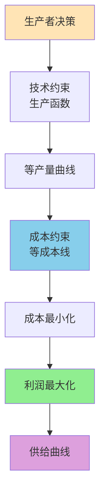

# 图表显示示例

这个页面用于预览经济学笔记的图表显示优化效果。它展示三类最常见的内容：流程图、平滑曲线和宽表格。

### 1. 流程图示例



### 2. 平滑曲线示例（Plotly）

如果需要颜色更清晰、还能悬停查看的经济学曲线，优先使用 Plotly。

```plotly
data:
    -
        type: scatter
        mode: lines
        name: 需求曲线 D
        x: [0.8, 1.2, 1.6, 2.0, 2.4, 2.8, 3.2]
        y: [8.6, 7.6, 6.8, 6.1, 5.5, 5.0, 4.6]
        line:
            color: "#1f77b4"
            width: 4
            shape: spline
    -
        type: scatter
        mode: lines
        name: 供给曲线 S
        x: [0.8, 1.2, 1.6, 2.0, 2.4, 2.8, 3.2]
        y: [2.2, 2.7, 3.2, 3.8, 4.5, 5.3, 6.2]
        line:
            color: "#d62728"
            width: 4
            shape: spline
    -
        type: scatter
        mode: markers+text
        name: 均衡点
        x: [2.35]
        y: [5.4]
        text: ["E"]
        textposition: top right
        marker:
            size: 11
            color: "#2ca02c"

layout:
    title:
        text: 供需曲线与均衡点
    xaxis:
        title:
            text: 数量 Q
        zeroline: false
    yaxis:
        title:
            text: 价格 P
        zeroline: false
    legend:
        orientation: h
        x: 0.02
        y: 1.08
    margin:
        l: 60
        r: 20
        t: 60
        b: 50
    paper_bgcolor: "white"
    plot_bgcolor: "white"
    template: "plotly_white"
    showlegend: true

config:
    displayModeBar: false
    responsive: true
```

这类图形比 xychart-beta 更适合无差异曲线、供需曲线和成本曲线，颜色更明显，也能直接悬停查看数值。

### 3. 宽表格示例

| 图表类型 | 主要用途 | 适合内容 | 显示方式 | 备注 |
|------|------|------|------|------|
| Mermaid 流程图 | 逻辑关系梳理 | 生产者、市场结构、宏观模型 | 容器留白 + 边框 | 适合主题总览页 |
| Plotly 平滑曲线 | 函数与均衡展示 | 供需曲线、成本曲线、偏好图 | 交互式、自适应宽度 | 颜色更清晰，适合曲线图 |
| Markdown 表格 | 对比与汇总 | 概念对照、参数比较 | 横向滚动 | 宽表在移动端更稳定 |
| ASCII 示意图 | 纯文本草图 | 临时草图 | 不推荐长期保留 | 等宽字体下才稳定 |

### 4. 说明

- 这页不是正文内容，只是一个显示效果样例。
- 如果你更看重曲线颜色、悬停提示和交互，优先用 Plotly。
- 如果你要的是严格几何和教材风格示意，现在也优先用 Plotly 处理，尽量保持和全站图表风格一致。
- 后续如果某个具体章节页需要更细的局部优化，可以按同样方式单独调整。