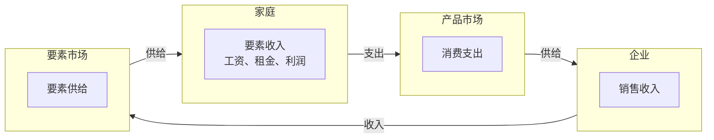

# 第2章：像经济学家一样思考

> 本章学习目标：
> - 理解经济学家作为科学家的思维方式
> - 掌握经济模型的基本构成和作用
> - 了解经济学中常用的模型类型
> - 区分规范分析和实证分析
> - 理解经济学家的分歧及其原因

---

## 2.1 经济学家作为科学家

### 2.1.1 科学方法在经济学中的应用

**科学方法（Scientific Method）**：
经济学像其他自然科学一样，遵循科学方法：

```
观察 → 提出假设 → 建立模型 → 检验 → 修正理论
```

**步骤详解**：

1. **观察（Observation）**：
   - 观察经济现象
   - 收集相关数据
   - 识别规律和模式

2. **提出假设（Hypothesis）**：
   - 对现象提出解释
   - 建立理论框架
   - 明确关键变量

3. **建立模型（Model）**：
   - 构建简化模型
   - 突出关键因素
   - 忽略次要因素

4. **检验（Test）**：
   - 用数据验证模型
   - 比较预测与实际
   - 统计显著性检验

5. **修正（Revise）**：
   - 根据结果修正模型
   - 改进理论框架
   - 重新检验

**与其他科学的对比**：

| 特点 | 物理学 | 生物学 | 经济学 |
|------|--------|--------|--------|
| 实验控制 | 完全 | 部分 | 困难 |
| 数据可重复性 | 高 | 中 | 低 |
| 理论检验 | 实验室 | 野外 | 历史数据 |
| 预测精度 | 高 | 中 | 低 |

**经济学研究的特殊性**：
- **无法进行控制实验**：不能像物理学那样在实验室中控制变量
- **依赖历史数据**：只能观察已经发生的事件
- **复杂性高**：经济系统涉及众多相互关联的变量
- **人的行为不可预测**：理性 vs 非理性行为

### 2.1.2 经济模型的作用

**模型（Model）的定义**：
模型是现实的简化，用来解释经济现象和预测经济行为。

**模型的组成要素**：

1. **变量（Variables）**：
   - **内生变量（Endogenous Variables）**：模型内部决定的变量
   - **外生变量（Exogenous Variables）**：模型外部给定的变量

2. **参数（Parameters）**：
   - 描述变量之间关系的常数
   - 通常通过估计得到

3. **方程（Equations）**：
   - 描述变量之间关系的数学表达式
   - 可以是代数方程、微分方程等

**模型的类型**：

| 模型类型 | 描述 | 例子 |
|----------|------|------|
| **图表模型** | 用图形表示经济关系 | 供给需求曲线 |
| **代数模型** | 用方程表示经济关系 | 柯布-道格拉斯生产函数 |
| **计量模型** | 用统计方法估计参数 | 回归分析 |
| **模拟模型** | 用计算机模拟经济系统 | CGE模型 |

**模型的简化原则**：
> **奥卡姆剃刀原则（Occam's Razor）**：在能够解释现象的前提下，模型越简单越好。

**模型评价标准**：
1. **拟合度（Goodness of Fit）**：模型与数据的吻合程度
2. **预测能力（Predictive Power）**：模型预测未来的准确性
3. **简洁性（Parsimony）**：模型是否简洁明了
4. **一致性（Consistency）**：模型是否与基本理论一致

### 2.1.3 第一个模型：循环流向图

**循环流向图（Circular Flow Diagram）**：
描述经济中两个基本决策者——家庭和企业——之间如何相互作用。

**基本结构**：


**详细说明**：

**家庭（Households）**：
- **要素供给**：提供劳动、资本、土地、企业家才能
- **要素收入**：获得工资、利息、租金、利润
- **消费支出**：购买商品和服务

**企业（Firms）**：
- **生产要素**：雇佣劳动、资本、土地、企业家才能
- **要素支付**：支付工资、利息、租金、利润
- **产品供给**：生产商品和服务

**市场（Markets）**：
- **要素市场（Factor Markets）**：家庭供给要素，企业需求要素
- **产品市场（Product Markets）**：企业供给产品，家庭需求产品

**数学表达**：

**要素市场均衡**：
```
工资 W = MPL（劳动边际产品）
租金 R = MPK（资本边际产品）
```

**产品市场均衡**：
```
价格 P = MC（边际成本）
```

**循环流向的恒等式**：
```
家庭收入 = 企业支出
要素收入 = 要素成本
消费支出 = 产品收入
```

**模型的含义**：
- 经济是一个循环系统
- 家庭和企业的相互作用创造价值
- 市场机制协调资源配置

### 2.1.4 第二个模型：生产可能性边界

**生产可能性边界（Production Possibilities Frontier, PPF）**：
表示一个经济在给定资源和技术条件下，能够生产的两种商品的最大组合。

**基本假设**：
1. **资源固定**：劳动、资本等资源总量不变
2. **技术固定**：生产技术不变
3. **充分就业**：所有资源都被充分利用
4. **两种商品**：模型只考虑两种商品

**图形表示**：

```
商品Y
    ^
    |    生产可能性边界（PPF）
    |   /
    |  /
    | /
    |/
    |____________________> 商品X
    0
```

**曲线上的点**：
- **A点**：生产较多的Y，较少的X
- **B点**：生产较多的X，较少的Y
- **任何点**：都是有效率的配置

**曲线内的点**：
- **C点**：资源未充分利用
- **无效率**：可以同时增加X和Y

**曲线外的点**：
- **D点**：在现有资源和技术下无法达到
- **不可实现**：需要更多资源或技术进步

**机会成本的计算**：

**线性PPF**（机会成本不变）：
```
Y = a - bX
机会成本 = ΔY/ΔX = b（常数）
```

**凹形PPF**（机会成本递增）：
```
Y = f(X), f'(X) < 0, f''(X) < 0
机会成本 = -f'(X)（随X增加而增加）

```plotly
data:
   -
      type: scatter
      mode: lines
      name: PPF1
      x: [0.4, 0.7, 1.0, 1.4, 2.0, 3.0, 4.2]
      y: [9.5, 5.429, 3.8, 2.714, 1.9, 1.267, 0.905]
      line:
         color: "#1f77b4"
         width: 4
         shape: spline
   -
      type: scatter
      mode: lines
      name: PPF2
      x: [0.5, 0.8, 1.2, 1.7, 2.4, 3.3, 4.6]
      y: [9.0, 5.625, 3.75, 2.647, 1.875, 1.364, 0.978]
      line:
         color: "#d62728"
         width: 4
         shape: spline
layout:
   xaxis:
      title:
         text: X
      range: [0, 5]
      zeroline: false
   yaxis:
      title:
         text: Y
      range: [0, 4.8]
      zeroline: false
   showlegend: true
   legend:
      orientation: h
      x: 0.02
      y: 1.08
   margin:
      l: 60
      r: 20
      t: 40
      b: 50
   template: "plotly_white"
config:
   displayModeBar: false
   responsive: true
```

---

### 2.2 市场机制
    line [25, 20, 15, 10, 5, 0]
    line [0, 5, 10, 15, 20, 25]
```
Y = β₀ + β₁X + ε
其中：Y是因变量，X是自变量，ε是误差项
```

### 2.3.2 规范分析（Normative Analysis）

**定义**：
描述"应该是什么"（What ought to be），涉及价值判断。

**特点**：
- **主观性**：涉及价值判断
- **不可检验**：无法用数据直接验证
- **政策导向**：指导政策制定

**例子**：
- ❌ 规范："政府应该提高最低工资吗？"
- ✅ 规范："政府应该提高最低工资，因为这是实现社会正义的重要手段"

**方法**：
1. **价值判断**：明确伦理和价值标准
2. **政策评估**：评估不同政策的利弊
3. **权衡分析**：考虑不同群体的利益
4. **提出建议**：基于价值判断的政策建议

**伦理框架**：
- **功利主义（Utilitarianism）**：最大化总福利
- **罗尔斯主义（Rawlsian）**：关注最不利群体
- **自由主义（Libertarianism）**：强调个人自由

### 2.3.3 实证与规范的关系

**重要原则**：
> **实证分析是规范分析的基础**

**关系**：
1. **实证提供事实**：规范分析需要了解事实
2. **规范指导实证**：价值判断决定研究什么
3. **相互依赖**：好的经济研究需要两者结合

**实际应用**：

**问题：政府应该提高最低工资吗？**

**实证分析步骤**：
1. 收集最低工资变化的数据
2. 分析对就业的影响
3. 估计弹性系数
4. 得出结论："最低工资提高10%，青年就业减少3%"

**规范分析步骤**：
1. 明确价值标准：社会公平 > 效率？
2. 评估利弊：帮助贫困家庭 vs 减少就业机会
3. 权衡取舍：权衡不同群体的利益
4. 得出结论："即使减少就业，也应该提高最低工资"

**综合决策**：
- 实证：了解政策效果
- 规范：评估政策价值
- 最终：基于事实和价值的综合判断

---

## 2.4 经济学家在政策制定中的角色

### 2.4.1 政策制定的过程

**政策制定的四个阶段**：

1. **诊断阶段（Diagnosis）**：
   - 识别经济问题
   - 分析问题原因
   - 评估问题严重性

2. **处方阶段（Prescription）**：
   - 提出政策建议
   - 评估政策效果
   - 考虑政策可行性

3. **实施阶段（Implementation）**：
   - 制定具体措施
   - 执行政策
   - 监控执行情况

4. **评估阶段（Evaluation）**：
   - 评估政策效果
   - 修正政策措施
   - 总结经验教训

**经济学家的角色**：
- **诊断**：提供数据分析
- **处方**：提供政策建议
- **评估**：提供效果评估

### 2.4.2 经济学家的分歧

经济学家为什么经常意见分歧？

**原因1：科学判断不同**

| 方面 | 经济学家A | 经济学家B |
|------|-----------|-----------|
| 参数估计 | 货币需求弹性为0.5 | 货币需求弹性为1.0 |
| 模型选择 | 偏好凯恩斯模型 | 偏好新古典模型 |
| 因果关系 | 认为A导致B | 认为B导致A |

**例子**：货币政策的时滞
- A认为：货币政策时滞为6个月
- B认为：货币政策时滞为18个月
- → 对政策效果得出不同结论

**原因2：价值观不同**

| 方面 | 经济学家A | 经济学家B |
|------|-----------|-----------|
| 公平vs效率 | 更重视公平 | 更重视效率 |
| 短期vs长期 | 更重视短期 | 更重视长期 |
| 政府vs市场 | 更相信政府 | 更相信市场 |

**例子**：最低工资政策
- A认为：即使损失效率，也要追求公平
- B认为：效率损失太大，不应干预市场

**原因3：对事实的判断不同**

| 方面 | 经济学家A | 经济学家B |
|------|-----------|-----------|
| 数据解释 | 数据支持结论A | 数据支持结论B |
| 模型适用性 | 模型A更合适 | 模型B更合适 |
| 政策效果 | 效果显著 | 效果微弱 |

**例子**：财政刺激政策
- A认为：乘数效应为2.0，刺激效果显著
- B认为：乘数效应为0.8，刺激效果有限

**经济学家共识程度**：

| 问题 | 共识程度 | 分歧原因 |
|------|-----------|----------|
| 租金管制 | 几乎一致反对 | 效率损失明确 |
| 贸易保护主义 | 大多数反对 | 少数考虑特定行业 |
| 货币政策 | 多数支持 | 时滞和效果有分歧 |
| 财政政策 | 部分支持 | 乘数效应有分歧 |
| 最低工资 | 分歧严重 | 公平vs效率权衡 |

---

## 2.5 经济学家在公共生活中的角色

### 2.5.1 经济学家的职业领域

**学术领域**：
- 大学教授：教学和研究
- 研究机构：政策研究
- 智库：政策咨询

**政府领域**：
- 中央银行：货币政策
- 财政部：财政政策
- 国际组织：世界银行、IMF

**商业领域**：
- 银行：风险管理、投资分析
- 咨询公司：战略咨询
- 企业：市场分析、定价策略

**媒体领域**：
- 经济评论员
- 专栏作家
- 电视节目嘉宾

### 2.5.2 经济学家的责任

**专业责任**：
- **客观性**：坚持科学方法，避免偏见
- **诚实性**：如实报告研究结果
- **透明性**：公开数据来源和方法

**社会责任**：
- **公共利益**：为公共利益服务
- **政策影响**：理解政策建议的影响
- **公众教育**：向公众解释经济问题

**伦理原则**：
1. **独立性**：不受特殊利益集团影响
2. **审慎性**：对不确定性保持谨慎
3. **谦逊性**：承认经济学的局限性

---

## 2.6 经济学思维的特点

### 2.6.1 经济学的思维方式

**核心思维模式**：

1. **机会成本思维**：
   - 每个选择都有成本
   - 比较收益和成本
   - 最大化净收益

2. **边际思维**：
   - 关注增量变化
   - 比较边际收益和边际成本
   - 寻找最优解

3. **激励思维**：
   - 人们会对激励做出反应
   - 设计适当的激励机制
   - 预测激励变化的效果

4. **均衡思维**：
   - 寻找稳定状态
   - 理解调整过程
   - 预测均衡变化

5. **比较优势思维**：
   - 识别相对优势
   - 通过专业化和贸易获益
   - 优化资源配置

### 2.6.2 经济学家的"看家本领"

**1. 模型构建能力**：
- 简化现实
- 突出关键因素
- 预测经济行为

**2. 数据分析能力**：
- 收集和整理数据
- 统计分析
- 回归分析

**3. 政策评估能力**：
- 评估政策效果
- 分析政策影响
- 提出政策建议

**4. 批判性思维能力**：
- 质疑假设
- 评估证据
- 识别逻辑谬误

---

## 2.7 经济学的局限性和批评

### 2.7.1 经济学的局限性

**方法论局限**：
1. **模型简化**：过度简化可能遗漏重要因素
2. **假设不现实**：理性人假设、完全信息等
3. **数据限制**：数据质量和可用性问题
4. **预测困难**：经济系统的复杂性和不确定性

**理论局限**：
1. **忽视制度**：制度对经济行为的重要影响
2. **忽视心理**：行为经济学揭示的偏离
3. **忽视文化**：文化对经济决策的影响
4. **忽视权力**：权力关系对资源配置的影响

### 2.7.2 对经济学的批评

**来自其他学科的批评**：

| 学科 | 批评观点 | 例子 |
|------|----------|------|
| 心理学 | 人不总是理性的 | 行为经济学 |
| 社会学 | 忽视社会结构和关系 | 社会资本 |
| 政治学 | 忽视权力和政治 | 制度经济学 |
| 伦理学 | 忽视道德和正义 | 经济伦理学 |
| 物理学 | 经济学不是真正的科学 | 物理学方法 |

**来自经济学内部的批评**：
- **理论过度抽象**：脱离实际
- **过度依赖数学**：数学形式主义
- **忽视历史和制度**：历史制度主义
- **预测能力有限**：金融危机的教训

### 2.7.3 经济学的发展趋势

**新兴领域**：
1. **行为经济学（Behavioral Economics）**：
   - 结合心理学
   - 研究非理性行为

2. **实验经济学（Experimental Economics）**：
   - 控制实验
   - 验证理论

3. **制度经济学（Institutional Economics）**：
   - 强调制度
   - 研究正式和非正式制度

4. **演化经济学（Evolutionary Economics）**：
   - 借鉴生物学
   - 研究经济演化

5. **复杂经济学（Complexity Economics）**：
   - 复杂系统理论
   - 代理人模型

**跨学科趋势**：
- **神经经济学（Neuroeconomics）**：神经科学 + 经济学
- **计算经济学（Computational Economics）**：计算机科学 + 经济学
- **生态经济学（Ecological Economics）**：生态学 + 经济学

---

## 2.8 学习经济学的建议

### 2.8.1 学习经济学的方法

**理论学习**：
1. **理解核心概念**：掌握基本定义和原理
2. **掌握分析工具**：图表、模型、数学方法
3. **理论联系实际**：用理论解释现实问题

**技能培养**：
1. **数学能力**：微积分、线性代数、统计学
2. **数据分析**：Excel、Stata、R、Python
3. **写作能力**：清晰地表达经济分析
4. **批判性思维**：质疑和分析

**实践应用**：
1. **阅读新闻**：分析经济新闻和政策
2. **观察现实**：理解身边的经济现象
3. **参与讨论**：与他人交流经济观点
4. **研究案例**：深入研究特定经济问题

### 2.8.2 避免常见错误

**概念错误**：
- 混淆相关性和因果性
- 忽视机会成本
- 误解均衡概念

**方法错误**：
- 过度依赖模型
- 忽视模型假设
- 滥用统计结果

**思维错误**：
- 确认偏误（Confirmation Bias）
- 幸存者偏误（Survivorship Bias）
- 沉没成本谬误（Sunk Cost Fallacy）

---

## 2.9 本章总结

### 核心要点

1. **经济学作为科学**
   - 遵循科学方法
   - 建立简化模型
   - 用数据检验理论

2. **经济模型**
   - 循环流向图：描述家庭和企业的相互作用
   - 生产可能性边界：描述生产权衡
   - 模型是现实的简化

3. **微观 vs 宏观**
   - 微观：个体行为和特定市场
   - 宏观：整体经济现象
   - 两者相互关联

4. **实证 vs 规范**
   - 实证：描述"是什么"
   - 规范：描述"应该是什么"
   - 实证是规范的基础

5. **经济学家的分歧**
   - 科学判断不同
   - 价值观不同
   - 对事实的判断不同

6. **经济学思维**
   - 机会成本思维
   - 边际分析思维
   - 激励思维
   - 均衡思维
   - 比较优势思维

### 重要概念

| 概念 | 定义 | 关键要点 |
|------|------|----------|
| 科学方法 | 观察-假设-检验-修正 | 经济学遵循科学方法 |
| 模型 | 现实的简化 | 突出关键因素 |
| 循环流向图 | 家庭与企业的相互作用 | 两种市场：要素和产品 |
| 生产可能性边界 | 最大生产组合 | 机会成本递增 |
| 微观经济学 | 个体行为和市场 | 生产什么、如何生产、为谁生产 |
| 宏观经济学 | 整体经济现象 | 增长、周期、通胀、失业 |
| 实证分析 | 描述"是什么" | 客观、可检验 |
| 规范分析 | 描述"应该是什么" | 涉及价值判断 |
| 机会成本 | 放弃的最高价值 | 决策的关键 |
| 边际分析 | 比较边际收益和成本 | 最优决策方法 |

### 与其他章节的关系

- **前驱章节**：[[第1章：经济学十大原理]] - 经济学的基本概念
- **后继章节**：
  - [[第3章：相互依存性与贸易的好处]] - 比较优势的详细展开
  - [[第4章：供给与需求的市场力量]] - 市场机制的详细分析
  - [[第5章：弹性及其应用]] - 边际分析的深入应用

### 参考资料

- 曼昆《经济学原理》第2章
- 马歇尔《经济学原理》
- 弗里德曼《实证经济学方法论》

### 思考题

1. 为什么说经济模型是现实的简化？简化的好处和代价是什么？
2. 如何用机会成本的概念解释"不要让沉没成本影响决策"？
3. 实证分析和规范分析在政策制定中分别扮演什么角色？
4. 经济学家为什么会有分歧？如何减少分歧？
5. 经济学思维如何帮助我们做出更好的个人决策？

---

**PDF参考页码**：第21-40页  
**创建时间**：2026年3月6日  
**预计学习时间**：3-4小时  
**下一章**：[[第3章：相互依存性与贸易的好处]]