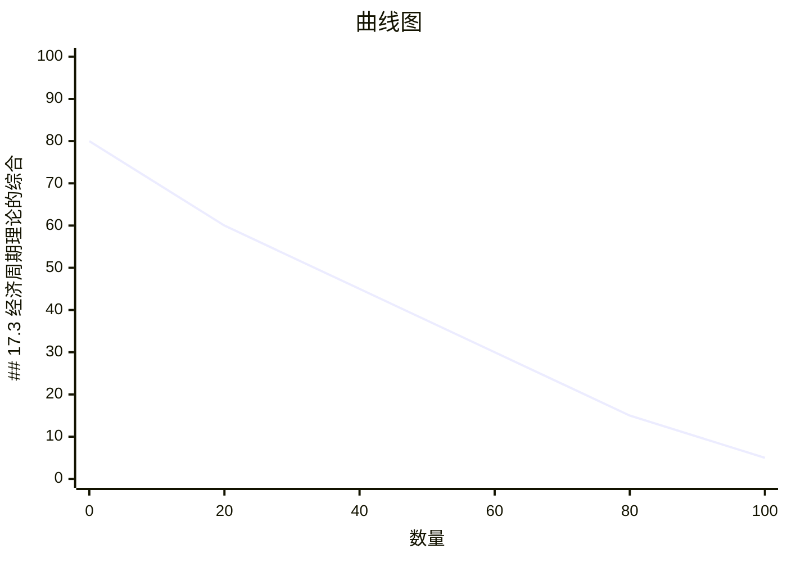

# 第17章 经济周期理论的进展

## 本章学习目标

通过本章学习，你应该能够：
1. 理解实际经济周期理论的基本观点
2. 掌握新凯恩斯主义经济学的核心思想
3. 了解动态随机一般均衡（DSGE）模型
4. 分析不同经济周期理论的分歧
5. 评估经济周期理论的实证证据

## 17.1 实际经济周期理论

### 17.1.1 理论基础

**实际经济周期理论（Real Business Cycle, RBC）**：
```
创立者：Finn Kydland 和 Edward Prescott（1982年诺贝尔奖）

核心观点：
1. 经济波动主要源于实际冲击（而非货币冲击）
2. 技术冲击是主要驱动力
3. 市场是出清的，价格和工资灵活调整
4. 经济波动是帕累托最优的
5. 货币政策无效
```

**基本假设**：

**1. 理性预期**：
```
经济主体使用所有可得信息
形成无偏预期
预期不犯系统性错误

数学表达：
E_t[X_{t+1}] = X_{t+1} + ε_{t+1}

其中E[ε] = 0
```

**2. 市场出清**：
```
所有市场（产品、劳动、资本）都出清
价格和工资灵活调整
不存在非自愿失业

含义：
- 观察到的失业是自愿的
- 劳动供给决策对冲击做出反应
```

**3. 技术冲击驱动**：
```
生产函数：
Y_t = A_t · F(K_t, L_t)

其中A_t是技术参数
A_t遵循随机过程：
A_{t+1} = ρA_t + ε_{t+1}

其中：
ρ：持续性参数
ε：随机冲击

技术冲击是经济波动的主要来源
```

### 17.1.2 RBC模型的机制

**技术冲击的传导**：

**步骤1：正向技术冲击**：
```
A_t↑ → Y_t↑

生产率提高
在相同投入下产出增加
```

**步骤2：劳动市场反应**：
```
劳动供给决策：
max U(C, 1-L)

约束：C = wL + rK

技术冲击A↑ → w↑（边际产出增加）
→ 劳动供给↑（工资效应）
→ 就业↑
→ 产出进一步↑
```

**步骤3：消费反应**：
```
跨期消费选择：
max E[ΣβᵗU(C_t)]

技术冲击A↑ → 永久收入增加
→ 消费↑
但消费平滑：
→ 消费增加小于产出增加
→ 储蓄↑
```

**步骤4：投资反应**：
```
资本积累：
K_{t+1} = (1-δ)K_t + I_t

技术冲击A↑ → 未来预期收入↑
→ 投资回报率↑
→ 投资↑
→ 资本积累加速
```

**完整传导机制**：
```
A↑
→ Y↑（直接效应）
→ w↑ → L↑ → Y↑（劳动市场）
→ 永久收入↑ → C↑
→ 未来收入↑ → I↑ → K↑ → Y↑（投资效应）

总效应：
Y大幅增加
C增加（但幅度小于Y）
I增加
L增加
w增加
```

### 17.1.3 RBC模型的实证表现

**预测特征**：

**1. 产出的持续性**：
```
RBC预测：
技术冲击有持续性（ρ ≈ 0.95）
→ 产出冲击也有持续性

实际数据：
产出自相关系数：
- 一阶：约0.9
- 四阶：约0.7
- 八阶：约0.5

RBC模型与数据基本一致 ✓
```

**2. 消费的平滑性**：
```
RBC预测：
消费平滑收入波动
消费波动 < 产出波动

实际数据：
消费波动标准差 / 产出波动标准差 ≈ 0.7

RBC模型预测：约0.5-0.6

部分一致 ✓
```

**3. 投资的波动性**：
```
RBC预测：
投资对技术冲击敏感
投资波动 > 产出波动

实际数据：
投资波动标准差 / 产出波动标准差 ≈ 3

RBC模型预测：约2-3

基本一致 ✓
```

**4. 就业的顺周期性**：
```
RBC预测：
正向技术冲击 → 工资↑ → 劳动供给↑
就业是顺周期的

实际数据：
就业与产出相关系数：约0.8

RBC模型预测：约0.7-0.9

基本一致 ✓
```

**RBC模型的不足**：

**1. 劳动市场**：
```
RBC预测：
就业波动主要由跨期替代驱动
工资波动较大

实际数据：
工资波动较小
失业率波动显著

问题：
RBC难以解释非自愿失业
```

**2. 货币中性**：
```
RBC预测：
货币政策不影响实际变量

实际数据：
货币政策对产出有短期影响

问题：
RBC忽略了货币的作用
```

**3. 技术冲击的测量**：
```
问题：
技术冲击不可直接观测
只能从索洛残差推断

索洛残差：
A = Y / F(K, L)

问题：
- 测量误差
- 资本利用率变化
- 规模经济
→ 可能高估技术冲击
```

### 17.1.4 案例研究：1970年代的石油危机

**RBC解释**：
```
石油价格上升 → 技术冲击（A↓）

机制：
A↓ → Y↓（直接效应）
→ w↓ → L↓ → Y↓（劳动市场）
→ 永久收入↓ → C↓
→ 未来收入↓ → I↓ → Y↓

结果：
产出下降
消费下降
投资下降
就业下降
```

**数据**：
```
1973-1975年：
- 石油价格：从3美元/桶升至12美元/桶
- 产出：下降3.2%
- 消费：下降0.9%
- 投资：下降14.2%
- 就业：下降1.5%

RBC解释：
石油价格冲击作为负向技术冲击
导致全面衰退
```

**争议**：
```
支持RBC：
- 石油价格冲击确实是实际冲击
- 对产出的影响符合RBC预测

质疑RBC：
- 石油价格冲击更多影响总供给
- RBC忽略了需求因素
- 政策应对也很重要
```

## 17.2 新凯恩斯主义经济学

### 17.2.1 理论基础

**新凯恩斯主义（New Keynesian）**：
```
代表人物：Greg Mankiw, David Romer, Olivier Blanchard

核心观点：
1. 价格和工资黏性
2. 市场不总是出清
3. 实际刚性存在
4. 货币政策有效
5. 需要政策干预
```

**与原凯恩斯主义的区别**：

| 特征 | 原凯恩斯主义 | 新凯恩斯主义 |
|------|--------------|--------------|
| 微观基础 | 无 | 有 |
| 价格黏性 | 假设 | 推导 |
| 理性预期 | 否 | 是 |
| 货币中性 | 短期否定 | 长期中性 |
| 政策有效性 | 强调 | 有条件 |

### 17.2.2 价格黏性的微观基础

**1. 菜单成本模型（Menu Costs）**：
```
基本思想：
改变价格有成本
小幅度涨价可能不划算

设定：
企业面临需求曲线：
Q = Q(P)

如果企业涨价ΔP：
收益增加：P·Q(P+ΔP) - P·Q(P)
成本增加：菜单成本MC

如果收益 < 成本 → 不调整价格

结果：
价格黏性
小冲击不引起价格调整
```

**例子**：
```
假设：
当前价格：P = 100
销量：Q = 1000
菜单成本：MC = 50

如果涨价1%：
新价格：101
新销量：990（需求弹性1）
收益变化：101×990 - 100×1000 = -10
成本变化：+50
总变化：-60

结论：不涨价 ✓

如果冲击更大（如需求增加20%）：
可能值得调整价格
```

**2. 垄断竞争**：
```
基本设定：
- 企业有定价权（垄断竞争）
- 需求曲线向下倾斜
- 边际收益 < 价格

定价规则：
MR = MC

P = MC / (1 - 1/|ε|)

其中|ε|是需求弹性

价格黏性来源：
- 单个企业价格调整影响有限
- 等待其他企业调整
- 协调失灵
```

**3. 交错定价（Staggered Price Setting）**：
```
基本思想：
企业不是同时调整价格
而是交错调整

机制：
- 1/3企业1月调整价格
- 1/3企业4月调整价格
- 1/3企业7月调整价格

结果：
- 整体价格水平渐进调整
- 价格水平有黏性
- 名义冲击有实际效应
```

**图形分析**：

```mermaid
xychart-beta
    title "曲线图"
    x-axis "数量" [0, 20, 40, 60, 80, 100]
    y-axis "价格水平P" 0 --> 100
    line [80, 60, 45, 30, 15, 5]
```

### 17.2.3 工资黏性的微观基础

**1. 效率工资（Efficiency Wages）**：
```
基本思想：
企业支付高于市场均衡的工资
以提高生产率

原因：
1. 健康和营养：工资影响工人健康
2. 减少流动：高工资降低员工离职率
3. 努力：高工资激励员工努力工作
4. 人才吸引：高工资吸引优秀人才

索洛条件：
工资对努力的弹性 = 1

企业选择工资w最大化：
E = e(w)·L - w·L

最优工资：w* > wᵉ（市场均衡工资）

结果：
工资黏性
非自愿失业存在
```

**2. 隐性契约（Implicit Contracts）**：
```
基本思想：
工资合同包含隐性保险条款
工资不随短期波动调整

机制：
- 繁荣期：工资低于边际产出
- 衰退期：工资高于边际产出
- 企业为工人提供保险

结果：
工资黏性
就业波动大于工资波动
```

**3. 工会谈判（Union Bargaining）**：
```
基本设定：
- 工会代表工人谈判
- 长期劳动合同
- 工资调整有滞后

结果：
工资黏性
工资不完全反映市场条件
```

### 17.2.4 新凯恩斯主义模型

**新凯恩斯主义菲利普斯曲线**：
```
π_t = βE_t[π_{t+1}] + κ·x_t + u_t

其中：
π_t：当前通胀率
E_t[π_{t+1}]：预期通胀率
x_t：产出缺口
u_t：供给冲击
β：贴现因子
κ：参数，衡量价格黏性

含义：
- 通胀取决于预期通胀和产出缺口
- 价格黏性导致动态调整
- 货币政策有效
```

**IS曲线（新凯恩斯主义）**：
```
x_t = E_t[x_{t+1}] - (1/σ)(i_t - E_t[π_{t+1}] - r_tⁿ)

其中：
x_t：产出缺口
i_t：名义利率
r_tⁿ：自然利率
σ：跨期替代弹性

含义：
- 产出缺口取决于实际利率
- 包含预期因素
```

**货币政策规则（泰勒规则）**：
```
i_t = r* + π_t + φ_π(π_t - π*) + φ_x(x_t)

其中：
r*：长期实际利率
π*：目标通胀率
φ_π：通胀反应系数（>1）
φ_x：产出缺口反应系数

含义：
- 央行对通胀和产出缺口做出反应
- 主动规则
```

### 17.2.5 新凯恩斯主义的实证证据

**支持证据**：

**1. 价格黏性**：
```
Blinder (1991) 调查：
- 价格平均每年调整0.8次
- 每次调整间隔约15个月
- 小企业调整更频繁

支持价格黏性假设 ✓
```

**2. 工资黏性**：
```
Kahn (1997) 研究：
- 工资平均每年调整1次
- 工资变动集中在固定时间
- 工资不完全反映经济状况

支持工资黏性假设 ✓
```

**3. 货币政策效果**：
```
Bernanke and Gertler (1995)：
- 紧缩性货币政策在12-18个月后影响产出
- 效果持续2-3年
- 货币非中性

支持新凯恩斯主义 ✓
```

**质疑与改进**：

**1. 大衰退的解释**：
```
新凯恩斯主义预测：
- 负向需求冲击 → 产出↓，通胀↓
- 货币政策可以刺激经济

实际（2008-2009）：
- 产出↓，通胀↓（预测正确）
- 但零利率下限限制货币政策
- 需要非常规政策

改进：
加入金融摩擦
考虑零利率下限
```

**2. 通胀的稳定性**：
``新凯恩斯主义预测：
- 通胀应该有较大波动

实际（1990-2020）：
- 通胀相对稳定
- 即使产出波动较大

改进：
通胀预期锚定
央行信誉

结合RBC和新凯恩斯主义要素

特征：
1. 微观基础（来自RBC）
2. 价格和工资黏性（来自新凯恩斯主义）
3. 理性预期
4. 一般均衡
5. 随机冲击
```

**标准DSGE模型包含**：

**家庭**：
```
跨期效用最大化：
max E[ΣβᵗU(C_t, 1-L_t)]

约束：
预算约束
劳动供给决策
```

**企业**：
```
成本最小化：
min wL + rK

约束：
生产函数
价格设定（Calvo定价）
```

**政府/央行**：
```
财政政策：
政府购买
税收

货币政策：
泰勒规则
```

**市场出清**：
```
产品市场：Y = C + I + G
劳动市场：L_s = L_d（可能有摩擦）
货币市场：M/P = L(i, Y)
```

### 17.3.3 冲击类型

**实际冲击**：
```
1. 技术冲击（TFP）
2. 偏好冲击
3. 资源冲击（石油价格）
4. 政府购买冲击
```

**名义冲击**：
```
1. 货币政策冲击
2. 需求冲击
3. 汇率冲击
```

**金融冲击**：
```
1. 信贷冲击
2. 资产价格冲击
3. 风险溢价冲击
```

### 17.3.4 案例研究：2008年金融危机

**DSGE模型解释**：

**冲击识别**：
```
1. 金融摩擦：
   - 信贷条件恶化
   - 风险溢价上升
   - 借贷约束收紧

2. 负向需求冲击：
   - 消费下降（不确定性）
   - 投资下降（信贷约束）

3. 负向供给冲击：
   - 资源重新配置成本
```

**模型预测**：
```
金融冲击 → 信贷成本↑ → 投资↓ → 产出↓
          → 消费约束↑ → 消费↓ → 产出↓
          → 风险溢价↑ → 利率↑ → 产出↓

货币政策：
利率降至零
常规政策空间耗尽
需要非常规政策（QE、前瞻性指引）

财政政策：
增加政府购买
转移支付
自动稳定器
```

**实证表现**：
```
DSGE模型较好预测：
- 产出大幅下降
- 投资大幅下降
- 消费下降但相对温和
- 通胀下降

模型改进：
- 加入金融部门
- 考虑零利率下限
- 加入非常规政策
```

## 17.4 本章总结

### 核心要点

1. **实际经济周期理论**：
   - 技术冲击驱动经济波动
   - 市场出清，价格灵活
   - 货币政策无效
   - 经济波动是最优的

2. **新凯恩斯主义**：
   - 价格和工资黏性
   - 市场可能不出清
   - 货币政策有效
   - 需要政策干预

3. **DSGE模型**：
   - 结合RBC和新凯恩斯主义
   - 微观基础
   - 多种冲击
   - 政策分析工具

4. **理论分歧**：
   - 冲击来源
   - 市场机制
   - 政策有效性

5. **实证进展**：
   - 数据更丰富
   - 方法更先进
   - 理论更现实

### 重要概念表格

| 概念 | 定义 | 关键特征 |
|------|------|----------|
| 实际经济周期 | 实际冲击驱动的波动理论 | 市场出清，技术冲击 |
| 新凯恩斯主义 | 价格黏性的波动理论 | 市场失灵，政策有效 |
| DSGE模型 | 动态随机一般均衡模型 | 微观基础，一般均衡 |
| 理性预期 | 无偏的预期形成 | 使用所有信息 |
| 菜单成本 | 调整价格的成本 | 导致价格黏性 |
| 效率工资 | 高于均衡的工资 | 提高生产率 |
| 交错定价 | 不同时间调整价格 | 价格渐进调整 |
| 技术冲击 | 生产函数参数变化 | TFP波动 |
| 金融摩擦 | 金融市场的不完美 | 信贷约束 |
| 零利率下限 | 利率不能低于零 | 货币政策限制 |

### 参考资料

1. **教材**：
   - Mankiw, N. G. (2021). Macroeconomics (10th ed.). Worth Publishers, Chapter 19.

2. **经典论文**：
   - Kydland, F. E., & Prescott, E. C. (1982). Time to build and aggregate fluctuations. Econometrica, 50(6), 1345-1370.
   - Mankiw, N. G., & Reis, R. (2002). Sticky information versus sticky prices: A proposal to replace the New Keynesian Phillips curve. The Quarterly Journal of Economics, 117(4), 1295-1328.

3. **现代研究**：
   - Smets, F., & Wouters, R. (2007). Shocks and frictions in US business cycles. American Economic Review, 97(3), 586-606.
   - Christiano, L. J., Eichenbaum, M., & Evans, C. L. (2005). Nominal rigidities and the dynamic effects of a shock to monetary policy. Journal of Political Economy, 113(1), 1-45.

4. **数据来源**：
   - National Bureau of Economic Research (NBER)
   - Federal Reserve Economic Data (FRED)
   - DSGE模型数据库

### 思考题

1. **理论比较**：
   - RBC和新凯恩斯主义的主要分歧是什么？
   - 哪种理论更符合现实？

2. **政策含义**：
   - RBC和新凯恩斯主义对货币政策的观点有何不同？
   - 财政政策在两种理论中的作用有何不同？

3. **DSGE模型**：
   - DSGE模型如何结合不同理论？
   - DSGE模型有什么优缺点？

4. **实证检验**：
   - 如何检验RBC和新凯恩斯主义的预测？
   - 哪些实证证据支持或质疑这些理论？

5. **案例分析**：
   - 用DSGE模型分析COVID-19疫情的经济影响。
   - 比较不同国家的政策应对。

6. **批判性思考**：
   - 经济周期理论的发展趋势是什么？
   - 数字化经济如何改变经济周期的性质？

---

**本章完成**：2026年3月6日
**下一章预告**：第18章 宏观经济学的争论（全书最后一章）