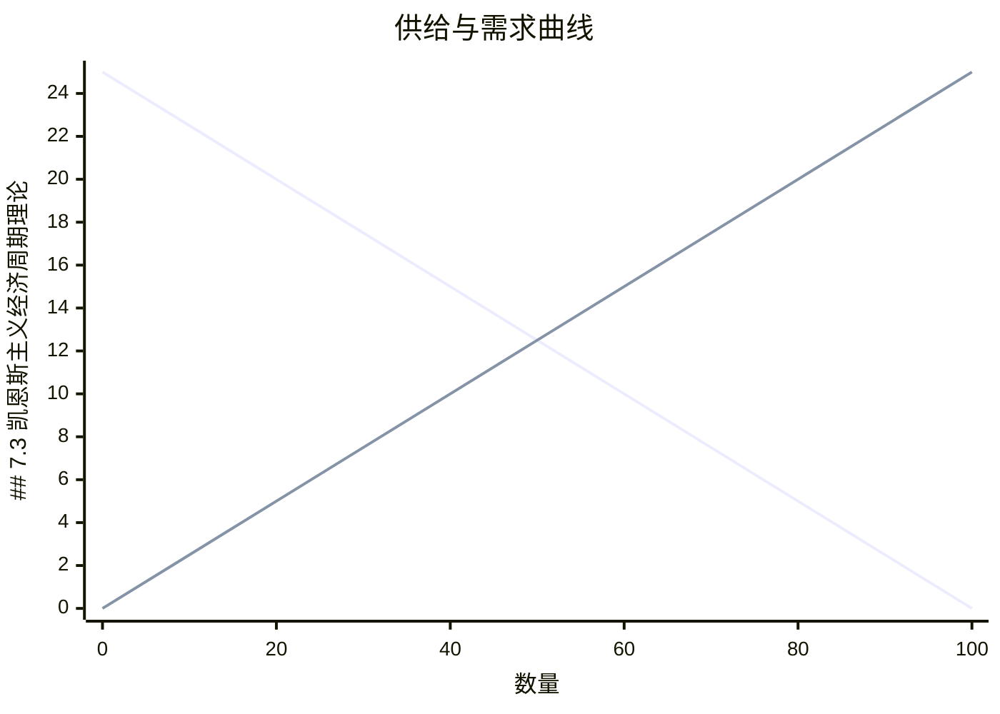
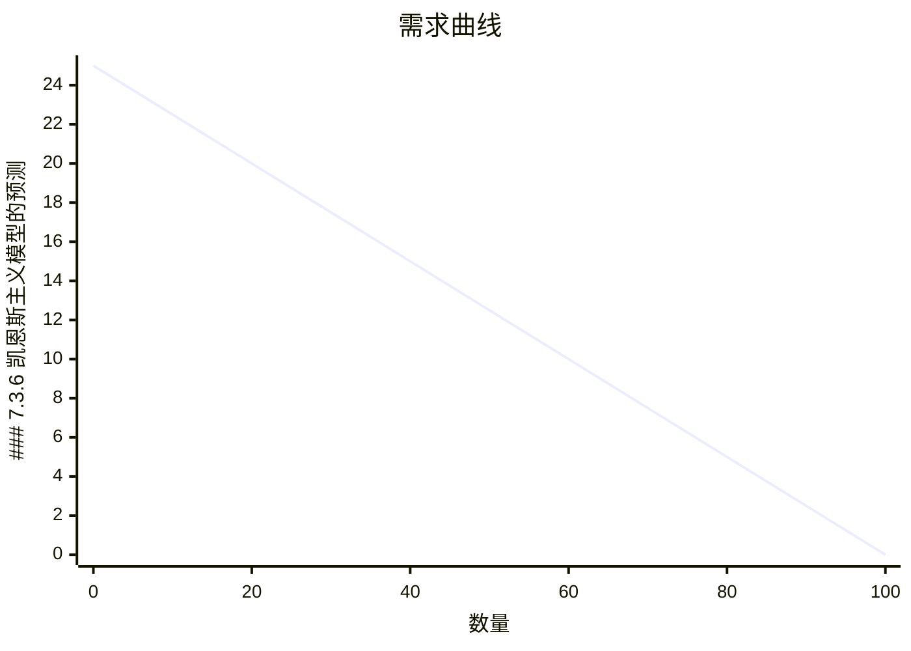

# 第7章 经济周期

## 章节学习目标

通过本章学习，学生应该能够：
1. 理解经济周期的基本特征和事实
2. 掌握实际经济周期（RBC）理论的核心思想和模型框架
3. 分析凯恩斯主义经济周期理论与实际经济周期理论的区别
4. 运用动态随机一般均衡（DSGE）模型分析经济波动
5. 理解技术冲击、偏好冲击、政策冲击对经济周期的影响机制

---

## 7.1 经济周期的基本事实

### 7.1.1 经济周期的定义

经济周期（Business Cycle）是指宏观经济变量围绕其长期趋势出现的持续性、系统性波动。这些波动具有以下特征：

**基本定义：**
- 经济周期是实际经济活动相对于其长期趋势的周期性波动
- 主要表现为产出、就业、价格等变量的协同运动
- 波动具有不规则性，但呈现出一定的统计规律

**关键要素：**
```
经济周期 = 趋势成分 + 周期成分
           ↑              ↑
      长期增长路径     短期波动
```

**重要统计事实：**

1. **波动持续性：** 经济周期具有持续性，即正冲击会导致后续时期产出持续高于趋势
2. **协同性：** 大多数宏观经济变量与产出同步波动
3. **非对称性：** 经济衰退往往比扩张期更短暂但更剧烈

### 7.1.2 经济周期的典型事实

从长期实证研究中总结出的典型事实：

**事实1：产出的波动性**
- 实际GDP的波动是所有宏观变量中最稳定的
- 实际GDP相对于其趋势的标准差约为2-3%

**事实2：消费和投资的协动性**

| 变量 | 与产出的相关性 | 标准差相对GDP | 领先/滞后 |
|------|----------------|--------------|-----------|
| 消费 | 0.7-0.9 | 0.6-0.8 | 同步 |
| 投资 | 0.8-0.95 | 2.5-3.5 | 轻微领先 |
| 政府支出 | 0.2-0.4 | 0.8-1.2 | 不确定 |
| 净出口 | -0.3-0.3 | 1.5-2.0 | 不确定 |

**事实3：劳动市场的周期性**

劳动投入的周期性特征：
- 就业的波动幅度小于产出（就业弹性约为0.5-0.7）
- 实际工资与产出呈正相关（相关系数约0.1-0.5）
- 劳动生产率（产出/就业）具有显著的顺周期性

**图形分析：经济周期的波动特征**

```
时间轴
  │
  │    ┌───┐      ┌───┐
产出│   /     \    /     \
  │  /       \  /       \
  │ /         \/         \
  └───────────────────────────
        衰退  扩张  衰退
```

**事实4：货币与价格的周期性**

货币变量的周期性行为：
- 货币供应量（M1, M2）具有弱顺周期性
- 价格水平呈逆周期性或无周期性（不同时期表现不同）
- 名义利率具有显著的顺周期性

### 7.1.3 经济周期的度量

**趋势分解方法：**

1. **HP滤波（Hodrick-Prescott Filter）**

给定时间序列{y_t}，HP滤波将其分解为趋势{g_t}和周期{c_t}：

```
min_{g_t} Σ[(y_t - g_t)² + λΣ(g_t - g_{t-1} - g_{t-1} + g_{t-2})²]
```

其中：y_t = g_t + c_t

参数λ的选择：
- 年度数据：λ = 100
- 季度数据：λ = 1600
- 月度数据：λ = 14400

2. **线性趋势法**

假设趋势为线性：g_t = α + βt

周期成分：c_t = y_t - (α + βt)

3. **带通滤波（Band-pass Filter）**

提取特定频率范围的波动成分：
- 商业周期频率：6-32个季度
- 应用Baxter-King或Christian-Fitzgerald滤波

**例子：美国GDP的周期分解（1960-2020）**

```
原始GDP数据（季度）:
2020Q4: 21,490
2020Q3: 21,170  ← 疫情冲击
2020Q2: 19,520
2020Q1: 21,560
2019Q4: 21,750

HP滤波后:
趋势成分: 平滑曲线，增长率约2%
周期成分: 2020Q2约为-10%（大幅偏离趋势）
```

**周期性指标的计算：**

标准差（波动性）：
```
σ_y = sqrt[Σ(y_t - ȳ)²/(T-1)]
```

与产出的相关性：
```
ρ_{x,y} = Σ(x_t - x̄)(y_t - ȳ) / (σ_x σ_y)
```

---

## 7.2 实际经济周期理论

### 7.2.1 RBC理论的基本思想

**核心假设：**

实际经济周期（Real Business Cycle, RBC）理论由Kydland和Prescott（1982）以及Long和Plosser（1983）发展而来，其核心思想包括：

1. **经济周期源于实际冲击**
   - 技术冲击是主要驱动因素
   - 偏好冲击、资源冲击也起作用
   - 货币冲击对实际经济影响有限

2. **市场出清**
   - 价格和工资具有完全弹性
   - 劳动市场持续出清
   - 无名义刚性

3. **理性预期**
   - 经济主体具有前瞻性
   - 预期是模型一致性的
   - 无系统预测错误

4. **跨期优化**
   - 代表性家庭最大化效用现值
   - 企业最大化利润现值
   - 考虑所有未来约束

**理论框架：**

```
技术冲击 → 生产函数变化 → 劳动需求变化
    ↓
劳动供给响应（替代效应 vs 收入效应）
    ↓
消费和投资决策变化
    ↓
总产出和就业波动
```

### 7.2.2 基本RBC模型

**模型设定：**

1. **家庭部门**

代表性家庭的效用函数：
```
E₀ Σ β^t [ln(c_t) - ψ·n_t^(1+φ)/(1+φ)]
```

其中：
- c_t：消费
- n_t：劳动供给
- β：主观折现因子
- ψ：劳动权重参数
- φ：劳动供给弹性

预算约束：
```
c_t + i_t = w_t n_t + r_t k_t + (1 - δ)k_t - k_{t+1}
```

其中：
- i_t：投资
- w_t：实际工资
- r_t：资本租金率
- k_t：资本存量
- δ：折旧率

资本积累方程：
```
k_{t+1} = (1 - δ)k_t + i_t
```

2. **企业部门**

生产函数：
```
y_t = A_t f(k_t, n_t) = A_t k_t^α n_t^(1-α)
```

其中：
- A_t：全要素生产率（技术冲击）
- α：资本产出弹性

企业最大化利润：
```
max_{k_t, n_t} A_t k_t^α n_t^(1-α) - r_t k_t - w_t n_t
```

一阶条件：
```
r_t = α A_t k_t^(α-1) n_t^(1-α) = α MPK_t
w_t = (1-α) A_t k_t^α n_t^(-α) = (1-α) MPL_t
```

3. **技术冲击过程**

假设技术冲击服从AR(1)过程：
```
ln(A_t) = ρ ln(A_{t-1}) + ε_t
```

其中：
- ρ：持续性参数（0 < ρ < 1）
- ε_t ~ N(0, σ²)：白噪声

**图形分析：技术冲击的传导机制**

```
技术冲击A_t↑
    ↓
生产函数曲线向外移动
    ↓
    y_t
    │   /
    │  /  新曲线 y' = A'_t k^α n^(1-α)
    │ /   
    │/    原曲线 y = A_t k^α n^(1-α)
    └─────────────
         k_t
    ↓
边际产量增加 → r_t↑, w_t↑
    ↓
家庭优化：增加劳动供给和消费
    ↓
投资增加 → 未来资本存量上升
    ↓
产出持续偏离趋势
```

### 7.2.3 模型求解：对数线性化

**稳态分析：**

在稳态，所有变量为常数，无冲击（A_t = 1）。

家庭一阶条件（欧拉方程）：
```
1/c_t = β E_t[1/c_{t+1}(1 + r_{t+1} - δ)]
```

在稳态：
```
1/c̄ = β (1/c̄)(1 + r̄ - δ)
```
⇒ r̄ = 1/β - 1

企业最优化条件：
```
r̄ = α k̄^(α-1) n̄^(1-α)
w̄ = (1-α) k̄^α n̄^(-α)
``**

将模型在稳态附近对数线性化。

定义：x̂_t = (x_t - x̄)/x̄

**线性化生产函数：**

```
ŷ_t = Â_t + α k̂_t + (1-α) n̂_t
```

**线性化工资方程：**

```
ŵ_t = ŵ̂_t = Â_t + α k̂_t - α n̂_t
```

**线性化资本租金率：**

```
r̂_t = Â_t + (α-1) k̂_t + (1-α) n̂_t
```

**线性化欧拉方程：**

```
-ĉ_t = -E_t[ĉ_{t+1}] + β r̄/(1 + r̄) E_t[r̂_{t+1}]
```

**线性化劳动供给：**

从效用最大化得到的条件：
```
ĉ_t = -ψ n̄^φ n̂_t + ŵ_t
```

**市场出清条件：**

```
ĉ_t + (δ/(r̄+δ)) î_t = (1-α) ŷ_t
```

**资本积累方程：**

```
k̂_{t+1} = (1-δ) k̂_t + δ î_t
```

### 7.2.4 模型的动态性质

**差分方程系统：**

将对数线性化后的方程整理成矩阵形式：

```
X_t = A X_{t-1} + B ε_t
```

其中：
```
X_t = [ĉ_t, n̂_t, k̂_{t+1}, Î_t]'
```

**脉冲响应函数（Impulse Response Function, IRF）：**

描述一个单位技术冲击对经济变量随时间的影响。

**图形分析：脉冲响应函数**

```
变量偏离稳态的百分比
  │
  │        技术冲击
  │           ↓
产出│  ────╮
  │       ╰────╮
  │            ╰───
  │
资本│     ───────╮
  │             ╰──────────
  │
消费│     ───────╮
  │             ╰──────────
  │
劳动│  ──╮
  │     ╰──
  └───────────────────────────── 时间
        t=0  t=1  t=2  t=3  ...
```mermaid
xychart-beta
    title "供给曲线"
    x-axis "数量" [0, 20, 40, 60, 80, 100]
    y-axis "价格" 0 --> 25
    line [0, 5, 10, 15, 20, 25]
```
假设技术冲击序列：
ε_0 = 0.02  (2%的正向冲击)
ε_1 = 0.01
ε_2 = 0.005
ε_3 = 0
...

动态演化：
A_0 = exp(0.02) ≈ 1.0202
A_1 = exp(0.95×0.02 + 0.01) ≈ 1.030
A_2 = exp(0.95²×0.02 + 0.95×0.01 + 0.005) ≈ 1.035
...

对应的响应：
ŷ_0 ≈ 1.5%  (产出立即上升)
ĉ_0 ≈ 0.8%  (消费上升但幅度小于产出)
î_0 ≈ 4.0%  (投资大幅上升)
n̂_0 ≈ 0.7%  (劳动供给增加)
```

### 7.2.6 扩展RBC模型

**多部门RBC模型：**

引入多个生产部门（如耐用品和非耐用品），可以更好地匹配消费的组成结构。

**劳动市场摩擦：**

加入：
- 劳动搜索和匹配（Mortensen-Pissarides模型）
- 劳动不可分性（Hansen不可分劳动）
- 效率工资模型

**可变资本利用率：**

允许资本利用率变化，可以增加投资波动性。

**公式：有效资本服务**

```
k_t^e = u_t k_t
```

其中 u_t ∈ [0,1] 为资本利用率

资本折旧率取决于利用率：
```
δ_t = δ(u_t)
```

**图形分析：可变资本利用率的影响**

```
有效生产函数：y_t = A_t (u_t k_t)^α n_t^(1-α)

提高资本利用率u_t↑
    ↓
短期内有效资本增加 → 产出上升
    ↓
但资本折旧加速 → 投资需求增加
    ↓
投资波动性增强

E₀ Σ β^t [ln(c_t - b c_{t-1}) - (n_t^(1+φ))/(1+φ)]
```

其中 b 为习惯形成参数

预算约束（含货币）：
```
P_t c_t + B_t + M_t = W_t n_t + (1 + i_{t-1}) B_{t-1} + M_{t-1} + Π_t + T_t
```

其中：
- P_t：价格水平
- B_t：名义债券持有
- M_t：名义货币持有
- W_t：名义工资
- i_t：名义利率
- Π_t：企业利润
- T_t：一次性转移支付

**2. 企业部门（价格刚性）：**

企业面临Calvo价格设定：
- 每期有比例θ的企业不能调整价格
- 比例(1-θ)的企业可以最优调整价格

企业i的生产函数：
```
y_{i,t} = A_t (k_{i,t})^α (n_{i,t})^(1-α)
```

成本最小化得到真实边际成本：
```
MC_t = (1/α^α (1-α)^(1-α)) (W_t/P_t)^(1-α) (r_t)^(α) A_t^(-1)
```

**新凯恩斯菲利普斯曲线（NKPC）：**

从Calvo定价推导出：
```
π_t = β E_t[π_{t+1}] + κ (mc_t - mc̄)
```

其中：
- π_t = P_t/P_{t-1} - 1：通货膨胀率
- mc_t = MC_t/P_t：真实边际成本
- κ = (1-θ)(1-βθ)/θ：斜率参数

**图形分析：新凯恩斯菲利普斯曲线**

```
通货膨胀率π_t
  │
  │      NKPC
  │    ／
  │   ／
  │  ／  π_t = β E_t[π_{t+1}] + κ(mc_t - mc̄)
  │ ／
  │／
  └───────────────────── 真实边际成本 mc_t
       mc̄
```

**解释：**
- 当真实边际成本高于稳态时，通胀上升
- 斜率κ取决于价格刚性程度θ
- θ越大（价格越刚性），κ越小

**3. 货币政策规则（泰勒规则）：**

中央银行遵循：
```
i_t = ρ + φ_π π_t + φ_y (y_t - ȳ_t) + ε_t^i
```

其中：
- ρ：稳态名义利率
- φ_π > 1：泰勒原则（对通胀的反应）
- φ_y：对产出缺口的反应
- ȳ_t：自然产出水平（潜在产出）

### 7.3.3 IS曲线和货币市场

**动态IS曲线（消费欧拉方程）：**

从家庭最优化得到：
```
y_t = E_t[y_{t+1}] - (1/σ)(i_t - E_t[π_{t+1}] - r_t^n) + E_t[Δy_{t+1}]
```

其中：
- σ：跨期替代弹性
- r_t^n：自然利率（无摩擦时的均衡利率）

**图形分析：动态IS曲线**

```
产出缺口y_t - ȳ_t
  │
  │     IS曲线
  │   ／
  │  ／
  │ ／
  │／
  └────────────────── 实际利率 i_t - E_t[π_{t+1}]
        r_t^n
```

**解释：**
- 实际利率高于自然利率时，产出低于潜在水平
- IS曲线向下倾斜：高利率抑制投资和消费

**货币市场均衡（LM曲线）：**

货币需求函数：
```
M_t/P_t = L(y_t, i_t) = y_t^η / (1 + i_t)^γ
```

其中 η > 0 为收入弹性，γ > 0 为利率弹性

**图形分析：LM曲线**

```
利率 i_t
  │
  │   LM曲线
  │  ／
  │ ／
  │／
  └────────────────── 产出 y_t
```

**解释：**
- 产出增加提高货币需求，推高利率
- 利率上升降低货币需求

### 7.3.4 总需求-总供给（AD-AS）模型

**总需求（AD）曲线：**

结合IS-LM方程，得到AD曲线：
```
y_t = AD(π_t) = a - b (π_t - π^*)
```

其中 π^* 为目标通胀率

**图形分析：AD曲线**

```
产出 y_t
  │
  │       AD
  │      ／
  │     ／
  │    ／
  │   ／
  └────────────────── 通胀率 π_t
```

**解释：**
- 通胀率上升 → 实际利率上升（给定名义利率） → 需求下降
- AD曲线向下倾斜

**总供给（AS）曲线：**

新凯恩斯菲利普斯曲线：
```
π_t = β E_t[π_{t+1}] + κ (y_t - ȳ_t) + ε_t^π
```

**图形分析：AS曲线**

```
通胀率 π_t
  │
  │   AS
  │  ／
  │ ／
  │／
  └────────────────── 产出 y_t
      ȳ_t
```

**解释：**
- 产出高于潜在水平时，通胀上升
- AS曲线向上倾斜

**AD-AS均衡：**

图形分析：

```
通胀率π
  │
  │   AS
  │  ／
  │ ／    E (均衡点)
  │／    ╱
  ╱─────╱─── AD
  ╱    ╱
 └────────────────── 产出 y
      ȳ
```

**均衡条件：**
```
AD: y_t = a - b (π_t - π^*)
AS: π_t = β E_t[π_{t+1}] + κ (y_t - ȳ_t)
```

### 7.3.5 需求冲击与供给冲击

**1. 需求冲击：**

冲击形式：自主消费/投资变化

AD曲线移动：
```
y_t = a + ε_t^d - b (π_t - π^*)
```

其中 ε_t^d 为需求冲击

**图形分析：正向需求冲击**

```
通胀π
  │    AS
  │   ／
  │  ／    E'  ← 新均衡
  │ ／    ╱
  │／    ╱
  ╱─────╱─── AD' (右移)
  ╱E  ╱
  ╱──╱─── AD (原位置)
 └────────────────── 产出 y
```

**影响：**
- 产出增加（y ↑）
- 通胀上升（π ↑）
- 实际利率可能下降（如果名义利率不变）

**2. 供给冲击：**

冲击形式：成本冲击、技术冲击

AS曲线移动：
```
π_t = β E_t[π_{t+1}] + κ (y_t - ȳ_t) + ε_t^s
```

其中 ε_t^s 为供给冲击

**图形分析：负向供给冲击（滞胀）**

```
通胀π
  │    AS'
  │   ／
  │  ／E'  ← 新均衡
  │ ／╱
  │／╱
  ╱─╱────── AS (原位置)
  ╱E
  ╱── AD
 └────────────────── 产出 y
```

**影响：**
- 产出下降（y ↓）
- 通胀上升（π ↑）
- 滞胀（Stagflation）现象

**例子：2008年金融危机**

```
需求冲击：
- 负向需求冲击（金融危机导致消费和投资急剧下降）
- AD曲线左移

供给冲击：
- 金融摩擦提高融资成本
- 资本价格下跌
- AS曲线左移

结果：
- 产出大幅下降（GDP衰退）
- 通胀下降（甚至通缩风险）
- 失业率急剧上升

k = 1/(1 - MPC) = 1/(1 - c₁)
```

其中 MPC 为边际消费倾向

**例子：财政政策乘数**

```
假设：
- 政府支出增加 ΔG = 100
- MPC = 0.8
- 税率 t = 0.25

简单乘数：k = 1/(1 - 0.8) = 5
产出变化：ΔY = k × ΔG = 500

考虑税收后的乘数：
k' = 1/(1 - MPC(1-t)) = 1/(1 - 0.8×0.75) = 2.5
产出变化：ΔY' = k' × ΔG = 250
```

**图形分析：财政政策乘数**

```
产出 Y
  │       45°线
  │      ／
  │     ／
  │    ／    E'  ← 新均衡
  │   ／    ╱
  │  ／    ╱
  │ ／    ╱
  │／    ╱
  ╱─────╱─── AD' (上移ΔG)
  ╱E  ╱
  ╱──╱─── AD (原位置)
 └────────────────── Y
```

---

## 7.4 经济周期模型比较与评价

### 7.4.1 理论比较

**RBC理论与凯恩斯主义理论的根本分歧：**

1. **经济周期的性质**
   - RBC：经济周期是帕累托最优的，代表对冲击的最优响应
   - 凯恩斯：经济周期可能偏离最优，存在市场失灵

2. **主要驱动因素**
   - RBC：实际冲击（技术、偏好）
   - 凯恩斯：名义冲击（货币、政策）和需求冲击

3. **市场效率**
   - RBC：市场持续出清，价格弹性
   - 凯恩斯：市场可能不出清，存在刚性

4. **政策含义**
   - RBC：稳定政策无效，甚至有害
   - 凯恩斯：主动稳定政策可以改善福利

### 7.4.2 实证检验

**检验1：技术冲击的识别**

Solow残差法：
```
Δln(A_t) = Δln(y_t) - α Δln(k_t) - (1-α) Δln(n_t)
```

问题：
- Solow残差可能包含非技术因素（需求冲击、测量误差）
- 导致技术冲击被高估

**检验2：劳动市场的周期性行为**

RBC预测：劳动供给增加是因为实际工资上升（替代效应）

凯恩斯预测：劳动供给增加是因为需求侧拉动

实证结果：
- 实际工资与产出的相关性较弱（0.1-0.5）
- 劳动供给波动幅度小于RBC预测

**检验3：货币冲击的效应**

VAR模型检验：
```
货币政策冲击 → 名义利率 → 产出、通胀
```

典型发现：
- 扩张性货币政策在短期内提高产出
- 效应持续6-12个季度
- 与凯恩斯主义预测一致

**图形分析：货币政策的脉冲响应**

```
产出偏离(%)
  │
  │      ┌───
  │    ／
  │  ／
  │ ／
  │／
  └──────────────────── 时间
    0  4  8  12 16 (季度)

通胀率(%)
  │
  │        ┌───
  │      ／
  │    ／
  │  ／
  │／
  └──────────────────── 时间
```

### 7.4.3 模型评价

**RBC理论的贡献：**

1. 提供了严格的微观基础
2. 强调了跨期优化和预期的作用
3. 成功解释了消费和投资的协同运动
4. 促进了宏观经济学与微观经济学的统一

**RBC理论的局限：**

1. 技术冲击的识别问题
2. 劳动市场刚性无法解释
3. 忽视了货币和金融因素
4. 政策含义可能过于悲观

**凯恩斯主义理论的贡献：**

1. 解释了名义刚性的重要性
2. 提供了政策分析框架
3. 成功解释了货币冲击的效应
4. 对经济衰退的解释更符合现实

**凯恩斯主义理论的局限：**

1. 名义刚性的微观基础不够完善
2. 参数识别困难
3. 可能过度强调政策干预
4. 长期均衡分析不足

### 7.4.4 新综合

**现代DSGE模型：**

结合了RBC和凯恩斯主义的优点：
- RBC的微观基础和跨期优化
- 凯恩斯主义的名义刚性和摩擦
- 金融部门的引入
- 不完全竞争的考虑

**标准DSGE模型的结构：**

```
家庭部门 → 劳动供给、消费决策、资产选择
    ↓
企业部门 → 价格设定、生产决策
    ↓
金融部门 → 银行、金融市场摩擦
    ↓
政府部门 → 财政政策
    ↓
中央银行 → 货币政策（泰勒规则）
    ↓
均衡：市场出清条件
```

**模型应用：**

1. **政策分析**
   - 货币政策传导机制
   - 财政政策乘数
   - 政策协调

2. **预测**
   - 预测产出、通胀
   - 风险情景分析

3. **反事实分析**
   - "如果没有政策干预会怎样？"
   - 政策效果评估

**例子：新冠疫情冲击的DSGE分析**

```
冲击类型：
1. 供给冲击：生产中断（负向技术冲击）
2. 需求冲击：不确定性增加、消费下降
3. 政策冲击：财政刺激、货币宽松

模型分析：
- 供给冲击：产出下降，通胀上升
- 需求冲击：产出下降，通胀下降
- 政策冲击：缓解衰退，但可能导致通胀

净效应：
- 产出大幅下降（主要来自需求冲击）
- 通胀不确定（供给和需求冲击方向相反）
- 政策支持有助于稳定经济
```

---

## 7.5 开放经济中的经济周期

### 7.5.1 小国开放经济RBC模型

**基本设定：**

经济可以以世界利率r*自由借贷

家庭预算约束：
```
c_t + i_t + b_t = y_t + (1 + r*) b_{t-1}
```

其中 b_t 为净国外资产

跨期预算约束（非蓬齐博弈条件）：
```
lim_{T→∞} b_T/(1+r*)^T = 0
```

**欧拉方程：**

```
1/c_t = β (1 + r*) E_t[1/c_{t+1}]
```

稳态时：r* = 1/β - 1

**经常账户：**

```
CA_t = y_t - c_t - i_t = b_t - b_{t-1}
```

**冲击传导：**

技术冲击 → 产出变化 → 消费、投资调整 → 经常账户变化

**图形分析：开放经济RBC模型的冲击传导**

```
正向技术冲击A_t↑
    ↓
产出 y_t↑
    ↓
消费 c_t↑（跨期平滑）
投资 i_t↑
    ↓
进口需求↑
    ↓
经常账户 CA_t可能下降（贸易逆差）
    ↓
净国外资产 b_t减少
    ↓
未来净收入减少 → 未来消费受限
```

### 7.5.2 经济周期的国际传导

**渠道：**

1. **贸易渠道**
   - 进出口需求传导
   - 贸易条件变化

2. **金融渠道**
   - 资本流动
   - 利率传导

3. **信心渠道**
   - 预期传导
   - 风险溢价变化

**两国模型：**

本国（H）和外国（F）的经济联系

本国产出：
```
y_t = A_t (k_t)^α (n_t)^(1-α)
```

外国对本国产品的需求：
```
x_t = D(y_t^f, e_t)
```

其中 e_t 为实际汇率

**图形分析：国际经济周期同步性**

```
本国产出    外国产出
    │          │
    │          │
    │    ╱╲    │
    │   ╱  ╲   │
    │  ╱    ╲  │
    │ ╱      ╲ │
    └──────────┴────────── 时间
     同步波动（正相关）
```

**实证事实：**

- G7国家的经济周期呈现显著相关性
- 新兴市场与发达国家的相关性较低
- 金融一体化增强同步性
- 贸易一体化也增强同步性

### 7.5.3 新兴市场经济的周期特征

**特征：**

1. **更高的波动性**
   - 产出波动约为发达国家的2倍
   - 消费波动更大（较少保险机会）

2. **顺周期性**
   - 经常账户顺周期
   - 政府支出顺周期
   - 资本流入顺周期

3. **外部融资约束**
   - 融资突然停止（Sudden Stops）
   - 主权债务危机

**融资约束模型：**

引入借贷约束：
```
b_t ≥ -λ (y_t + k_t)
```

其中 λ 为约束参数

**图形分析：融资约束与波动放大**

```
产出
  │
  │    无约束时的路径
  │   ╱
  │  ╱
  │ ╱
  │╱
  │   受约束时的路径
  │  ╱╲
  │ ╱  ╲
  │╱    ╲
  └────────────────── 时间
    冲击  约束紧缩
```mermaid
xychart-beta
    title "需求曲线"
    x-axis "数量" [0, 20, 40, 60, 80, 100]
    y-axis "价格" 0 --> 25
    line [25, 20, 15, 10, 5, 0]
```
   min_{g_t} Σ[(y_t - g_t)² + λΣ(g_t - g_{t-1} - g_{t-1} + g_{t-2})²]
   ```

2. **RBC模型欧拉方程：**
   ```
   1/c_t = β E_t[1/c_{t+1}(1 + r_{t+1} - δ)]
   ```

3. **技术冲击过程：**
   ```
   ln(A_t) = ρ ln(A_{t-1}) + ε_t, ε_t ~ N(0, σ²)
   ```

4. **新凯恩斯菲利普斯曲线：**
   ```
   π_t = β E_t[π_{t+1}] + κ (mc_t - mc̄)
   ```

5. **动态IS曲线：**
   ```
   y_t = E_t[y_{t+1}] - (1/σ)(i_t - E_t[π_{t+1}] - r_t^n)
   ```

6. **泰勒规则：**
   ```
   i_t = ρ + φ_π π_t + φ_y (y_t - ȳ_t) + ε_t^i
   ```

7. **财政政策乘数：**
   ```
   k = 1/(1 - MPC(1-t))
   ```

### 参考资料

1. **经典文献：**
   - Kydland, F. E., & Prescott, E. C. (1982). "Time to Build and Aggregate Fluctuations". Econometrica.
   - Long, J. B., & Plosser, C. I. (1983). "Real Business Cycles". Journal of Political Economy.
   - Blanchard, O. J., & Kiyotaki, N. (1987). "Monopolistic Competition and the Effects of Aggregate Demand". American Economic Review.
   - Calvo, G. A. (1983). "Staggered Prices in a Utility-Maximizing Framework". Journal of Monetary Economics.

2. **教材：**
   - Romer, D. (2018). Advanced Macroeconomics (5th ed.). McGraw-Hill.
   - Gali, J. (2015). Monetary Policy, Inflation, and the Business Cycle: An Introduction to the New Keynesian Framework. Princeton University Press.
   - Walsh, C. E. (2017). Monetary Theory and Policy (4th ed.). MIT Press.

3. **扩展阅读：**
   - Cooley, T. F. (Ed.). (1995). Frontiers of Business Cycle Research. Princeton University Press.
   - Acemoglu, D. (2009). Introduction to Modern Economic Growth. Princeton University Press.

### 思考题

1. **理解题：**
   - 为什么实际经济周期理论认为经济周期是最优的？
   - 新凯恩斯主义菲利普斯曲线的斜率参数κ的经济含义是什么？
   - 价格刚性如何影响货币政策的传导？

2. **分析题：**
   - 比较RBC模型和凯恩斯模型对技术冲击效应的预测差异。
   - 分析正向需求冲击和负向供给冲击对产出和通胀的不同影响。
   - 讨论开放经济中技术冲击如何影响经常账户。

3. **应用题：**
   - 给定参数：β=0.99, α=0.33, δ=0.025, 技术冲击ρ=0.95, σ=0.007，计算稳态利率和资本-产出比。
   - 假设MPC=0.8，政府支出增加100，计算简单乘数和考虑税收后的乘数（税率25%）。
   - 使用HP滤波，给定λ=1600（季度数据），分解季度GDP数据。

4. **批判性思考：**
   - 评估RBC理论对2008年金融危机的解释力。
   - 讨论凯恩斯主义政策在零利率下限（ZLB）环境下的有效性。
   - 分析新兴市场经济体经济周期波动的特殊原因。

5. **拓展思考：**
   - 数字经济如何影响经济周期的特征？
   - 气候变化冲击如何被纳入经济周期分析？
   - 金融不稳定性在经济周期中的作用是什么？