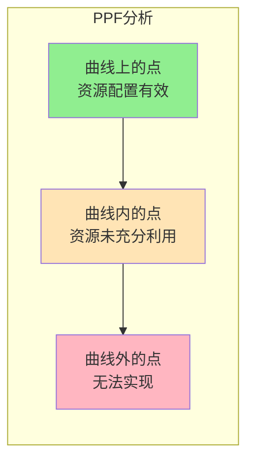
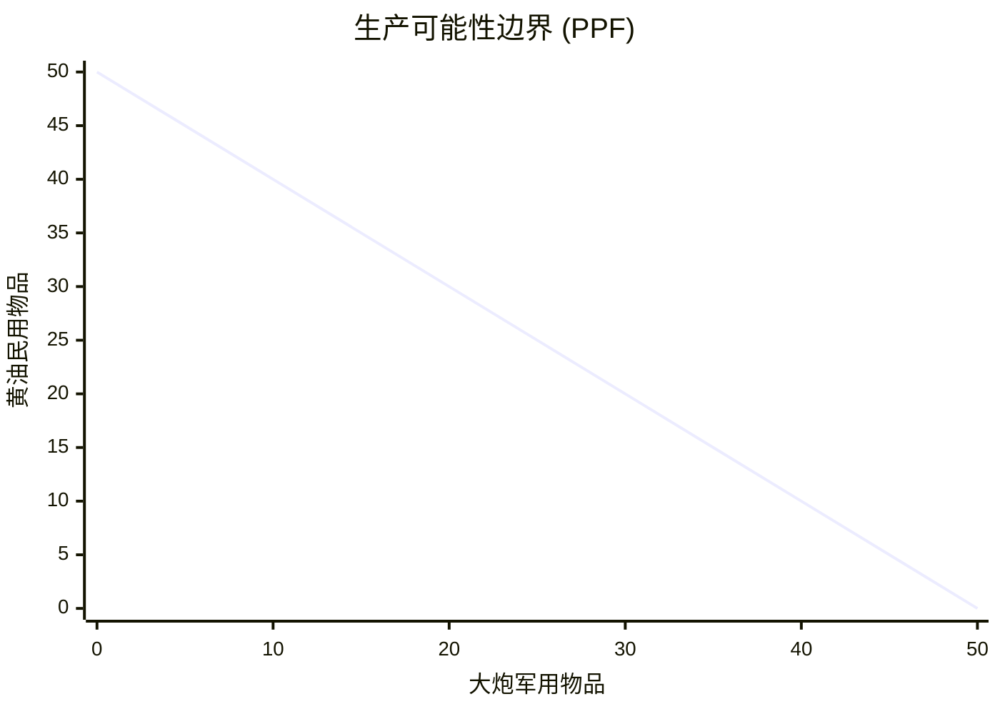
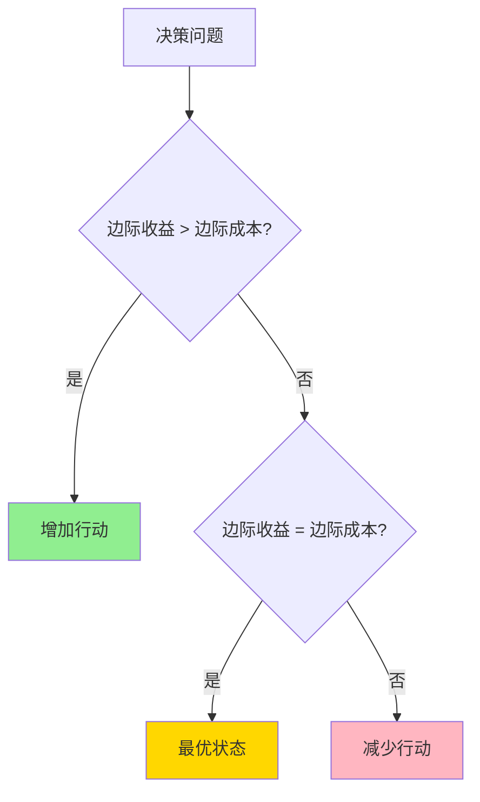
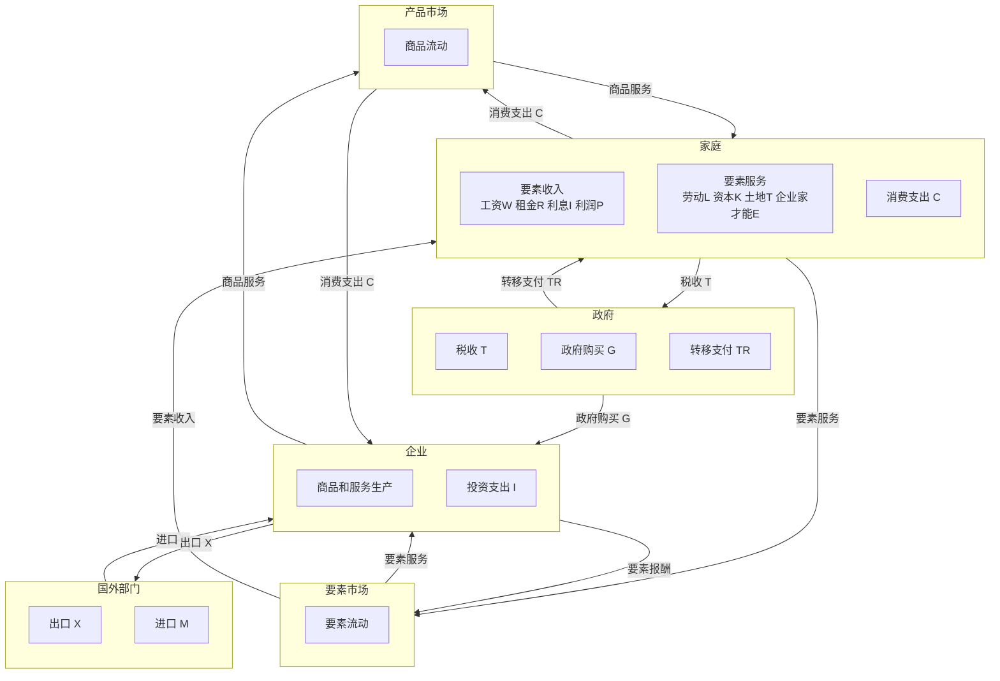
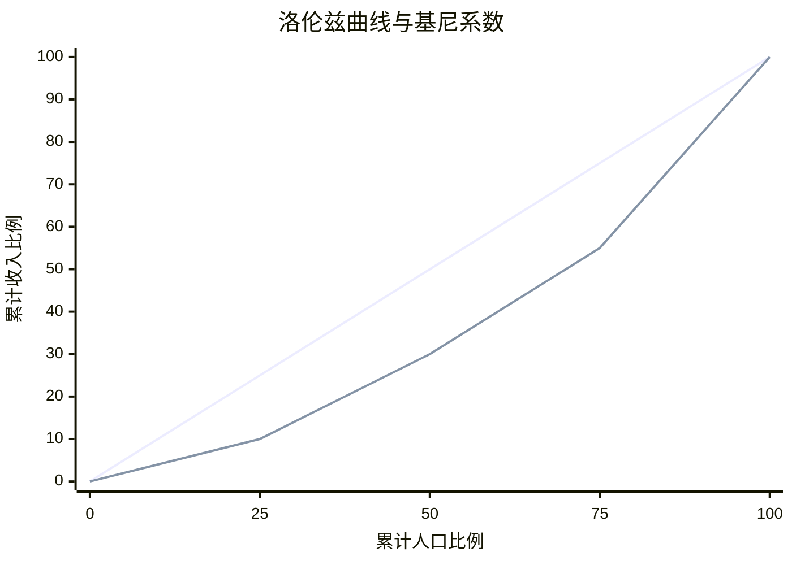
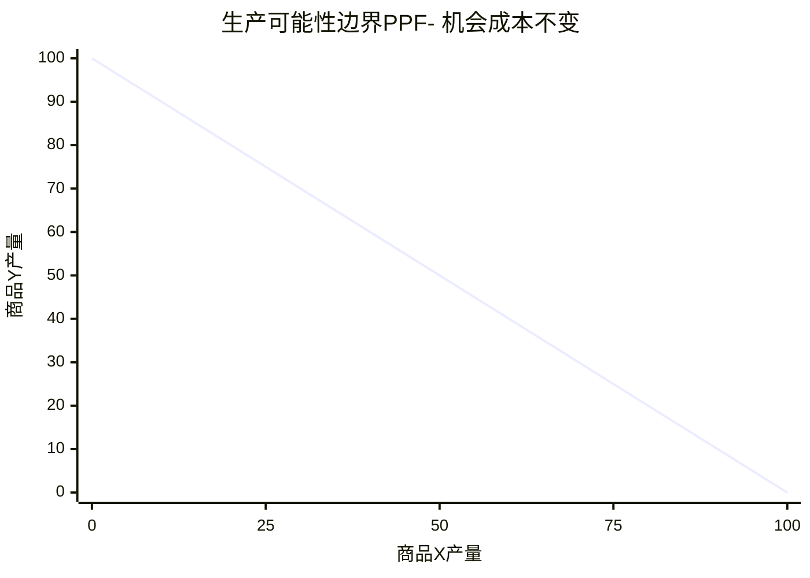
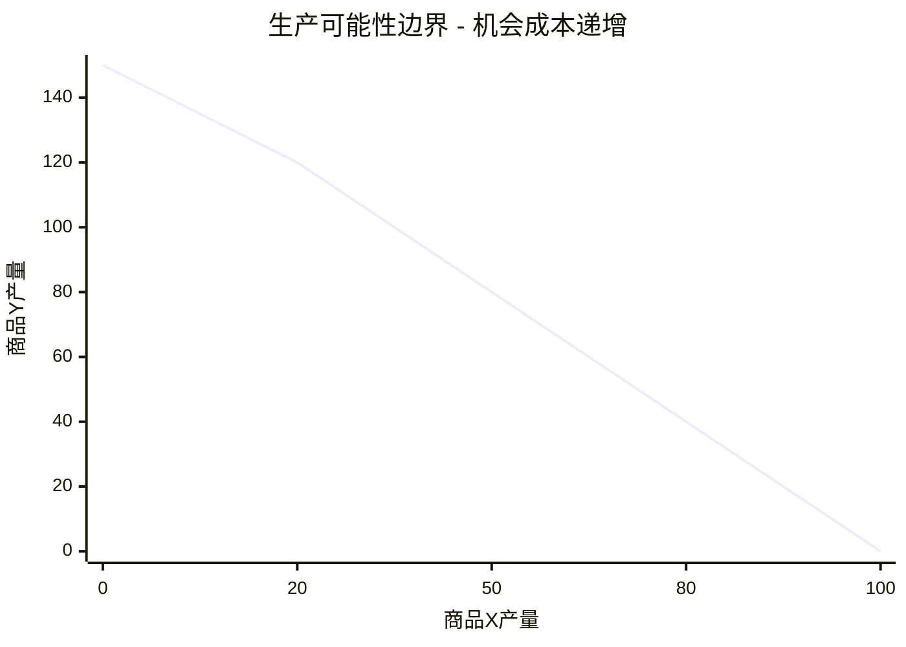
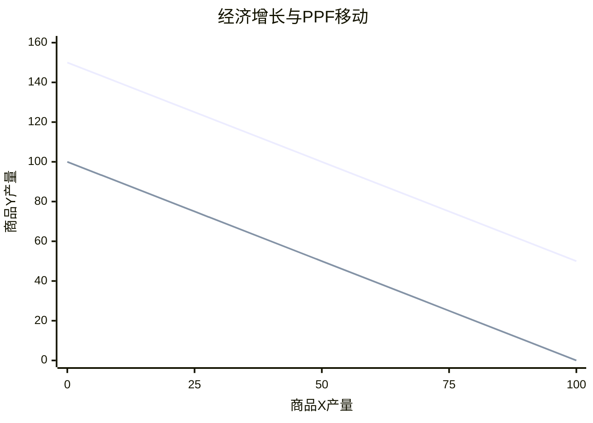

# 经济学基础

## 主题概述

经济学基础是经济学研究的起点，它为我们理解经济现象提供了理论框架和分析工具。经济学作为一门社会科学，研究人类社会如何利用稀缺资源来生产、分配和消费各种商品和服务。本主题将深入探讨经济学的定义、方法论、核心问题以及经济学思维方式。

## 核心概念

### 1. 经济学的定义

**经济学（Economics）**
是研究如何将稀缺资源分配给各种用途以满足人类无限欲望的社会科学。
这个定义包含几个关键要素：

- **稀缺性（Scarcity）**：相对于人类的无限欲望，资源总是有限的
- **资源配置（Resource Allocation）**：如何将有限的资源分配到不同的用途中
- **生产、分配和消费**：经济活动的三个主要环节
- **满足人类欲望**：经济学的最终目标是提高人类福利

#### 经济学的两大分支

**微观经济学（Microeconomics）**
- 研究个体经济单位（消费者、企业）的行为
- 关注价格形成、市场机制、资源配置效率
- 代表问题：为什么某种商品价格上涨？消费者如何选择最优商品组合？

**宏观经济学（Macroeconomics）**
- 研究整体经济现象
- 关注GDP、通货膨胀、失业、经济增长等总量指标
- 代表问题：为什么会发生经济衰退？货币政策如何影响经济？

### 3. 经济学十大原理

曼昆在《经济学原理》中总结了经济学的十大原理，构成了经济学分析的基石。

#### 原理一：人们面临权衡取舍

**核心含义**：世界上没有免费的午餐，要得到一种东西必须放弃另一种东西。

**典型例子**：
- **学生的时间权衡**：学习 vs 休闲
- **家庭的收入权衡**：消费 vs 储蓄
- **社会的权衡**：大炮 vs 黄油（国防 vs 民生）、效率 vs 公平

**生产可能性边界（PPF）图形分析**：





#### 原理二：某种东西的成本是为了得到它所放弃的东西

**机会成本（Opportunity Cost）**：为了得到某种东西而放弃的其他东西中价值最高的那一个。

**例子 - 上大学的机会成本**：
- 显性成本：学费、书本费、生活费
- 隐性成本：如果不上大学可以赚的工资
- 总机会成本 = 显性成本 + 隐性成本

#### 原理三：理性人考虑边际量

**理性人**：目标明确、系统地追求效用或利润最大化。

**边际分析**：比较边际收益(MB)与边际成本(MC)做出决策。



**决策规则**：
- MB > MC → 增加行动
- MB = MC → 最优状态（停止）
- MB < MC → 减少行动

#### 原理四：人们会对激励做出反应

**激励（Incentives）**：促使人们采取某种行动的因素。

**价格对激励的影响**：
- 苹果价格上升 → 消费者少买苹果，多买其他水果
- 汽油价格上升 → 消费者少开车，多坐公交

**重要教训**：政策制定必须考虑激励效应，避免意外后果。

#### 原理五：贸易可以使每个人状况都变得更好

**核心含义**：贸易不是零和游戏，专业化提高效率。

**比较优势**：生产某种商品的机会成本低于其他国家。

```mermaid
flowchart LR
    subgraph 贸易好处
    A[专业化生产<br/>优势产品] --> B[扩大生产规模<br/>降低成本]
    B --> C[增加商品种类<br/>消费者获益]
    C --> D[竞争加剧<br/>价格降低]
    end
    
    style A fill:#87CEEB
    style B fill:#87CEEB
    style C fill:#87CEEB
    style D fill:#87CEEB
```mermaid
xychart-beta
    title "供给与需求曲线"
    x-axis "数量" [0, 20, 40, 60, 80, 100]
    y-axis "#### 原理六：市场通常是组织经济活动的一种好方法" 0 --> 25
    line [25, 20, 15, 10, 5, 0]
    line [0, 5, 10, 15, 20, 25]
```mermaid
xychart-beta
    title "菲利普斯曲线：通胀与失业的权衡"
    x-axis "失业率" [0, 2, 4, 6, 8, 10]
    y-axis "通胀率" 0 --> 10
    line [10, 8, 6, 4, 2, 0]
```

---

### 2. 经济学的基本问题

任何社会都必须解决三个基本的经济问题：

#### 2.1 生产什么、生产多少？（What to Produce?）

这是资源配置的核心问题。社会需要决定：
- 生产哪些商品和服务
- 各种商品和服务的生产数量
- 如何在消费品和资本品之间分配资源

**影响因素**：
- 消费者偏好
- 技术水平
- 资源禀赋
- 社会目标

**资源配置方式**：
- 市场机制：价格信号引导资源配置
- 计划机制：政府统一规划
- 混合机制：市场与计划相结合

#### 2.2 如何生产？（How to Produce?）

这个问题涉及生产方式的选择：
- 使用什么技术
- 雇用多少劳动力
- 使用多少资本
- 如何组织生产过程

**效率概念**：
- **技术效率（Technical Efficiency）**：以最少的投入生产给定的产出
- **经济效率（Economic Efficiency）**：以最低的成本生产给定的产出

**技术选择原则**：
```
如果 PL/PL < PK/PK，则使用劳动密集型技术
如果 PL/PL > PK/PK，则使用资本密集型技术
```
其中PL为劳动价格，PK为资本价格。

#### 2.3 为谁生产？（For Whom to Produce?）

这个问题涉及产品和收入的分配：
- 谁获得生产出来的产品
- 收入如何在社会成员间分配
- 贫富差距是否合理

**分配原则**：
- 按要素分配：劳动、资本、土地等要素获得相应报酬
- 按需分配：根据个人需要分配
- 混合分配：结合多种分配方式

### 3. 机会成本

**机会成本（Opportunity Cost）**
是经济学中最重要的概念之一，指的是做出某种选择时放弃的最佳替代方案的价值。**

#### 机会成本的特征

1. **相对性**：机会成本相对于特定的选择而言
2. **客观性**：基于实际可获得的替代方案
3. **递增性**：随着资源专业化程度提高，机会成本可能上升

#### 机会成本的应用

**时间的机会成本**：
```
选择A方案的机会成本 = 放弃的B方案的价值
```

**生产可能性边界（PPF）与机会成本**：
```
ΔY的机会成本 = ΔX/ΔY
```

**例子**：
- 如果选择上大学的机会成本包括：
  - 学费和书本费
  - 工作期间可以获得的收入
  - 四年工作积累的经验

### 4. 边际分析

**边际分析（Marginal Analysis）**是比较增量变化的分析方法，是经济学决策的核心工具。

#### 关键概念

**边际收益（Marginal Benefit, MB）**：增加一单位某活动带来的额外收益
**边际成本（Marginal Cost, MC）**：增加一单位某活动带来的额外成本
**边际效用（Marginal Utility, MU）**：消费额外一单位商品带来的额外满足

#### 最优决策原则

```
当 MB > MC 时，增加该活动
当 MB < MC 时，减少该活动
当 MB = MC 时，达到最优
```

**数学表达**：
```
max: f(x) - g(x)
一阶条件：f'(x) = g'(x)
即：MB = MC
```

#### 边际分析的应用

**消费决策**：
```
当 MU/P > λ 时，增加消费
当 MU/P < λ 时，减少消费
当 MU/P = λ 时，达到最优
```
其中λ为收入的边际效用。

**生产决策**：
```
当 MR > MC 时，增加产量
当 MR < MC 时，减少产量
当 MR = MC 时，利润最大化
```

### 5. 经济学模型

经济学使用模型来简化现实、分析问题。

#### 模型的特征

1. **简化性**：抽象掉次要因素，抓住主要关系
2. **抽象性**：用数学或逻辑表达经济关系
3. **假设性**：基于一定的假设条件
4. **预测性**：可以用于预测经济行为

#### 常用模型类型

**理论模型**：
- 文字描述
- 图形分析
- 数学公式

**实证模型**：
- 计量经济模型
- 统计模型
- 计算机模拟

#### 模型评估标准

1. **准确性**：预测是否准确
2. **简洁性**：是否简单明了
3. **一般性**：适用范围是否广泛
4. **可检验性**：是否可以被经验验证

### 6. 经济学的发展历程

经济学作为一门独立的学科，经历了从古典经济学到现代经济学的发展过程。了解经济学的发展历程有助于我们理解不同经济学派的理论观点和政策主张。

#### 6.1 古典经济学（18世纪末-19世纪中叶）

**代表人物**：
- **亚当·斯密（Adam Smith, 1723-1790）**：现代经济学之父，《国富论》（1776）的作者
- **大卫·李嘉图（David Ricardo, 1772-1823）**：比较优势理论的提出者
- **托马斯·马尔萨斯（Thomas Malthus, 1766-1834）**：人口理论

**核心思想**：
1. **自由放任（Laissez-faire）**：政府不应干预经济，让市场自由运作
2. **看不见的手（Invisible Hand）**：个人追求自身利益会自动促进社会利益
3. **价值理论**：劳动价值论，商品价值由生产所需的劳动时间决定
4. **分工理论**：分工可以提高生产效率
5. **自由贸易**：国际贸易可以增加所有参与国的福利

**主要贡献**：
- 建立了经济学的基本分析框架
- 提出了市场机制的基本原理
- 发现了比较优势和自由贸易的好处

**局限性**：
- 过度相信市场的完美性
- 忽视了市场失灵的可能性
- 劳动价值论存在缺陷

#### 6.2 新古典经济学（19世纪70年代-20世纪30年代）

**代表人物**：
- **威廉·斯坦利·杰文斯（William Stanley Jevons, 1835-1882）**
- **卡尔·门格尔（Carl Menger, 1840-1921）**
- **里昂·瓦尔拉斯（Léon Walras, 1834-1910）**：一般均衡理论
- **阿尔弗雷德·马歇尔（Alfred Marshall, 1842-1924）**：《经济学原理》（1890）

**边际革命（Marginal Revolution）**：
1870年代，杰文斯、门格尔和瓦尔拉斯几乎同时独立地提出了边际效用理论，被称为"边际革命"。

**核心思想**：
1. **边际效用理论**：商品价值由其边际效用决定，而非劳动时间
2. **需求曲线**：由边际效用递减推导出需求曲线
3. **供给曲线**：由生产成本推导出供给曲线
4. **一般均衡理论**：所有市场同时达到均衡的状态
5. **数学方法**：广泛使用数学工具分析经济问题

**马歇尔的综合**：
马歇尔在《经济学原理》中综合了古典经济学和新古典经济学：
- 短期分析：使用边际效用理论
- 长期分析：使用生产成本理论
- 部分均衡分析：单独分析一个市场的均衡

**主要贡献**：
- 建立了现代微观经济学的基础
- 引入了边际分析
- 建立了供给需求分析框架

**局限性**：
- 假设完全竞争和完全信息
- 忽视了不确定性
- 未能解释大萧条

#### 6.3 凯恩斯主义（20世纪30年代-20世纪70年代）

**代表人物**：
- **约翰·梅纳德·凯恩斯（John Maynard Keynes, 1883-1946）**：《就业、利息和货币通论》（1936）

**历史背景**：
1929-1933年的大萧条严重动摇了人们对古典经济学的信心。当时高失业率持续多年，传统理论无法解释这一现象。

**核心思想**：
1. **总需求决定总产出**：短期内，总产出由总需求决定
2. **工资和价格的刚性**：工资和价格调整缓慢，市场可能长期偏离均衡
3. **有效需求不足**：由于消费倾向递减、资本边际效率递减和流动性偏好，可能出现有效需求不足
4. **政府干预**：政府应通过财政政策和货币政策刺激总需求
5. **乘数效应**：政府支出的增加会通过乘数效应导致更大的收入增加

**乘数公式**：
```
乘数 k = 1/(1 - MPC)
其中MPC为边际消费倾向
```

**主要贡献**：
- 创立了现代宏观经济学
- 解释了经济衰退和高失业
- 提出了政府干预经济的理论基础

**政策主张**：
- 积极的财政政策（增加政府支出、减税）
- 适当的货币政策（调节利率、货币供应量）
- 反周期政策（逆经济风向行事）

#### 6.4 新古典综合（20世纪50年代-20世纪70年代）

**代表人物**：
- **保罗·萨缪尔森（Paul Samuelson, 1915-2009）**：《经济学》（1948）
- **希克斯（John Hicks, 1904-1989）**
- **莫迪利安尼（Franco Modigliani, 1918-2003）**

**核心思想**：
新古典综合试图将凯恩斯的宏观经济学与新古典的微观经济学结合起来：
- 短期：接受凯恩斯的观点，承认市场可能失灵，需要政府干预
- 长期：接受新古典的观点，相信市场会恢复充分就业均衡
- 微观基础：用新古典的微观经济学为宏观经济学提供理论基础

**IS-LM模型**：
希克斯和汉森提出的IS-LM模型是凯恩斯理论的标准表述：
```
IS曲线：产品市场均衡，Y = C(Y-T) + I(r) + G
LM曲线：货币市场均衡，M/P = L(r, Y)
```

**菲利普斯曲线**：
描述通货膨胀与失业率之间的负相关关系：
```
π = π⁰ - β(u - u*)
```
其中π为通货膨胀率，u为失业率，u*为自然失业率

**主要贡献**：
- 建立了统一的经济学框架
- 为政府政策提供了理论指导
- 成为战后主流经济学

**局限性**：
- 1970年代的滞胀（高通货膨胀+高失业）挑战了菲利普斯曲线
- 缺乏微观基础
- 过度相信政策的有效性

#### 6.5 新古典宏观经济学（20世纪70年代至今）

**代表人物**：
- **罗伯特·卢卡斯（Robert Lucas, 1937-）**：理性预期假说
- **托马斯·萨金特（Thomas Sargent, 1943-）**
- **尼尔·华莱士（Neil Wallace, 1941-）**

**核心思想**：
1. **理性预期（Rational Expectations）**：人们利用所有可得信息形成预期，不会系统性错误
2. **市场出清**：价格和工资具有充分弹性，市场迅速出清
3. **政策无效性**：系统性货币政策无效，只有意外的政策才影响产出
4. **微观基础**：宏观经济理论应建立在个体最优化行为基础之上

**卢卡斯批判（Lucas Critique）**：
传统的计量经济模型假设参数不变，但实际上人们的预期和行为会随政策变化而变化。因此，用这些模型预测政策效果是不可靠的。

**实际经济周期理论（Real Business Cycle, RBC）**：
经济波动主要由实际冲击（技术冲击、偏好冲击等）引起，而非货币冲击。经济波动是对冲击的最优反应，不需要政策干预。

**主要贡献**：
- 引入了理性预期
- 强调了政策的局限性
- 建立了宏观经济学的微观基础

**政策主张**：
- 规则胜于相机抉择
- 限制政府干预
- 关注长期政策效果

#### 6.6 行为经济学（20世纪80年代至今）

**代表人物**：
- **丹尼尔·卡尼曼（Daniel Kahneman, 1934-）**：前景理论，2002年诺贝尔经济学奖
- **阿莫斯·特沃斯基（Amos Tversky, 1937-1996）**
- **理查德·塞勒（Richard Thaler, 1945-）**：助推理论，2017年诺贝尔经济学奖

**核心思想**：
1. **有限理性（Bounded Rationality）**：人们的理性是有限的，受认知能力、信息等因素限制
2. **行为偏差（Behavioral Biases）**：人们在决策中存在系统性偏差
3. **社会偏好（Social Preferences）**：人们关心公平、互惠、利他等社会因素
4. **助推（Nudging）**：通过设计选择环境引导人们做出更好的决策

**前景理论（Prospect Theory）**：
人们面对收益时是风险厌恶的，面对损失时是风险追求的，对损失比对收益更敏感。

**价值函数**：
```
v(x) = x^α（x > 0，收益）
v(x) = -λ(-x)^β（x < 0，损失）
```
其中α, β < 1，λ > 1（损失厌恶系数）

**主要贡献**：
- 揭示了传统经济学假设的局限性
- 更准确地描述了人类行为
- 为政策设计提供了新思路

**政策应用**：
- 退休储蓄计划（自动登记）
- 健康行为（器官捐赠选择）
- 环境保护（能源使用反馈）

#### 经济学发展历程总结

```
时间线：
1776年：亚当·斯密《国富论》→ 古典经济学
1870年代：边际革命 → 新古典经济学
1936年：凯恩斯《通论》 → 凯恩斯主义
1948年：萨缪尔森《经济学》 → 新古典综合
1970年代：理性预期革命 → 新古典宏观经济学
1980年代：行为经济学兴起 → 行为经济学
```

**演变逻辑**：
- 从完全理性到有限理性
- 从市场万能到市场失灵
- 从自由放任到政府干预
- 从理论分析到实证检验

## 经济学思维方式

经济学思维方式是一种分析问题的框架，它帮助我们理解复杂的经济现象。

### 1. 激励

**激励（Incentives）**是影响人们行为的因素，包括价格、利润、惩罚、奖励等。经济学认为，"人们会对激励做出反应"是最基本、最普遍的经济学原理。

#### 激励的类型

**正向激励**：
- 利润：企业追求利润最大化
- 工资：劳动者追求高工资
- 税收优惠：鼓励特定行为

**负向激励**：
- 成本：增加成本会减少供给
- 税收：抑制特定行为
- 监管：限制不当行为

**案例**：安全气囊对交通事故的影响
- 安全气囊减少了驾驶员的伤亡风险
- 但驾驶员可能因此更不谨慎驾驶
- 结果：驾驶员的伤亡率下降，但行人的伤亡率上升

### 2. 权衡取舍

由于资源稀缺，任何选择都涉及权衡取舍。

#### 个人的权衡取舍
- 工作与闲暇
- 消费与储蓄
- 学习与娱乐
- 现在与未来

#### 社会的权衡取舍
- 大炮与黄油（国防与民生）
- 效率与公平
- 环境保护与经济发展
- 短期利益与长期利益

**"天下没有免费的午餐"**：任何选择都有机会成本。

### 3. 机会成本

（已在前面详细阐述，此处略）

### 4. 边际思维

**边际思维（Marginal Thinking）**是指在决策时考虑"多一个单位"的收益和成本，而不是考虑"全部"或"平均"。

#### 边际思维的优势
1. **简化决策**：只需考虑边际变化
2. **动态调整**：可以根据情况变化调整
3. **精确决策**：找到最优决策点

#### 边际思维的误区
1. **平均成本陷阱**：误以为平均成本等于边际成本
2. **沉没成本谬误**：已经发生的成本不应影响当前决策
3. **忽略边际变化**：只考虑总量变化

### 5. 理性假设与有限理性

**理性假设**：传统经济学假设人们是理性的，能够做出最优决策。

**有限理性**：现实中，人们的理性是有限的：
- 信息不完全
- 认知能力有限
- 时间和精力有限
- 存在各种行为偏差

**启示**：
- 设计制度时要考虑人的局限性
- 通过助推改善决策
- 重视行为经济学的研究

## 经济学方法论

经济学方法论是经济学研究的方法和规范。

### 1. 实证分析与规范分析

#### 实证分析（Positive Analysis）
**定义**：描述"是什么"、"为什么"，不涉及价值判断。

**特征**：
- 客观性：基于事实和逻辑
- 可检验性：可以用数据验证
- 科学性：遵循科学方法

**例子**：
- "最低工资法会增加失业率"
- "减税会刺激经济增长"
- "通货膨胀会降低实际收入"

#### 规范分析（Normative Analysis）
**定义**：描述"应该是什么"、"应该怎么做"，涉及价值判断。

**特征**：
- 主观性：基于价值观和伦理观
- 不可检验性：无法用数据验证
- 政策性：为政策提供指导

**例子**：
- "政府应该提高最低工资"
- "政府应该减税"
- "政府应该控制通货膨胀"

#### 两者的关系
```
实证分析：提供事实和逻辑基础
    ↓
规范分析：基于事实和价值观做出判断
    ↓
政策制定：将判断转化为具体政策
```

### 2. 经济学研究方法

#### 2.1 理论分析

**步骤**：
1. **提出假设**：简化现实，抓住主要关系
2. **建立模型**：用数学或逻辑表达关系
3. **推导结论**：从假设和模型推导出可检验的命题
4. **逻辑检验**：检查逻辑是否一致

**特点**：
- 逻辑严密
- 便于推导
- 适用范围广

#### 2.2 实证分析

**步骤**：
1. **收集数据**：收集相关经济数据
2. **描述性分析**：用统计方法描述数据特征
3. **建立计量模型**：用数学模型描述经济关系
4. **估计参数**：用统计方法估计模型参数
5. **假设检验**：检验理论假设是否成立

**特点**：
- 基于数据
- 可检验
- 接近现实

#### 2.3 计量经济学

**定义**：应用统计方法分析经济数据。

**主要内容**：
- **回归分析**：估计经济变量之间的关系
- **时间序列分析**：分析随时间变化的数据
- **横截面分析**：分析同一时间不同个体的数据
- **面板数据分析**：分析多个个体多个时间的数据

**计量模型示例**：
```
Y = β₀ + β₁X₁ + β₂X₂ + ... + βₙXₙ + ε
```
其中Y为被解释变量，X为解释变量，ε为误差项。

### 3. 经济学检验

#### 3.1 内部一致性检验

**检验内容**：
- 假设是否一致
- 推导是否正确
- 结论是否从假设中得出

#### 3.2 外部有效性检验

**检验内容**：
- 预测是否准确
- 假设是否合理
- 模型是否符合现实

#### 3.3 经验检验

**方法**：
- **案例研究**：深入研究特定案例
- **自然实验**：利用现实中的自然变化
- **受控实验**：实验室实验
- **田野实验**：在现实环境中进行实验

### 4. 经济学的科学性

#### 支持观点
1. **理论严谨**：有严密的逻辑体系
2. **可检验性**：可以用数据验证
3. **预测能力**：可以预测经济行为
4. **持续发展**：理论不断修正和发展

#### 反对观点
1. **实验困难**：难以进行受控实验
2. **人类行为复杂**：难以准确预测
3. **价值判断**：难以完全客观
4. **历史唯一性**：历史不能重复

#### 结论
经济学是一门"不精确"的科学，但它提供了理解经济现象的有力工具。经济学方法论的精髓是：
- **理论指导**：用理论框架分析问题
- **实证检验**：用数据验证理论
- **持续修正**：根据新证据修正理论

## 经济学与其他学科的关系

经济学与其他社会科学密切相关，相互借鉴。

### 1. 经济学与心理学

#### 关系
- **心理学为经济学提供行为基础**：人的决策过程受心理因素影响
- **经济学为心理学提供分析框架**：经济激励影响人的行为

#### 行为经济学
结合经济学和心理学的交叉学科，研究非理性经济行为。

**主要发现**：
- 损失厌恶：人们对损失比对收益更敏感
- 现状偏见：人们倾向于保持现状
- 框架效应：决策受问题描述方式的影响
- 过度自信：人们过高估计自己的能力

**应用**：
- 助推政策（nudge）
- 退休储蓄设计
- 健康行为干预

### 2. 经济学与社会学

#### 关系
- **社会学为经济学提供社会背景**：社会制度、社会关系影响经济行为
- **经济学为社会学提供分析工具**：资源分配、激励机制

#### 社会经济学
研究社会因素如何影响经济行为和结果。

**研究内容**：
- 社会网络对经济决策的影响
- 社会资本与经济发展
- 社会规范与市场制度
- 不平等与社会流动性

### 3. 经济学与政治学

#### 关系
- **政治学为经济学提供制度背景**：政治制度、政策过程影响经济
- **经济学为政治学提供分析工具**：政策成本收益分析

#### 政治经济学
研究政治制度与经济制度、政治过程与经济过程的相互作用。

**研究内容**：
- 民主与经济增长
- 官僚行为与政策制定
- 利益集团与政策选择
- 政治周期与经济周期

**案例**：
- 民主选举前的扩张性财政政策
- 通胀目标制的政治可行性
- 贸易保护主义与政治压力

### 4. 经济学与数学

#### 关系
- **数学为经济学提供精确语言**：用数学表达经济关系
- **经济学为数学提供应用场景**：最优化、博弈论

#### 数理经济学
用数学方法分析和表达经济理论。

**主要工具**：
- 微积分：最优化分析
- 线性代数：多变量分析
- 概率论：不确定性分析
- 博弈论：策略互动分析

**优势**：
- 表达精确
- 推导严谨
- 便于计算
- 便于验证

**局限性**：
- 可能过度抽象
- 可能忽视重要因素
- 可能脱离现实

### 5. 经济学与统计学

#### 关系
- **统计学为经济学提供数据分析方法**：描述数据、检验假设
- **经济学为统计学提供应用领域**：经济数据分析

#### 经济统计学
应用统计方法分析经济数据。

**主要内容**：
- 国民经济核算
- 指数理论
- 抽样调查
- 时间序列分析

### 6. 经济学与计算机科学

#### 关系
- **计算机科学为经济学提供计算工具**：数据处理、模拟计算
- **经济学为计算机科学提供应用场景**：算法设计、机制设计

#### 计算经济学
用计算机方法分析和解决经济问题。

**主要内容**：
- 计算一般均衡
- 代理人基模型
- 机器学习在经济学中的应用
- 区块链与经济学

## 重要模型和公式

### 1. 生产可能性边界（PPF）

生产可能性边界表示在给定资源和技术条件下，一个经济体能够生产的两种商品的最大可能组合。

#### PPF的性质

```
Y = f(X)
其中：
- X为商品X的数量
- Y为商品Y的数量
- f为转换函数
```

#### PPF的特征

1. **负斜率**：增加一种商品的生产必须减少另一种商品
2. **凹向原点**：机会成本递增
3. **边界点**：表示效率最高的生产组合
4. **内部点**：表示资源未充分利用
5. **外部点**：在当前条件下无法实现

#### PPF的数学表达

```
X² + Y² = R²（圆形PPF）
或
Y = a - bX - cX²（二次PPF）
```

#### PPF的应用

**效率分析**：
- PPF上的点：技术有效
- PPF内的点：技术无效
- PPF外的点：不可行

**经济增长**：
- PPF向外移动：经济增长
- PPF沿某轴移动：偏向性增长

**机会成本计算**：
```
MRT = -dY/dX = MCx/MCy
```
其中MRT为边际转换率。

### 2. 比较优势理论

**比较优势（Comparative Advantage）**是指一个生产者以比其他生产者更低的机会成本生产某种商品的能力。

#### 比较优势的计算

**机会成本法**：
```
生产X的机会成本 = 放弃的Y/生产的X
生产Y的机会成本 = 放弃的X/生产的Y
```

**例子**：
```
国家A：可生产100X或50Y
国家B：可生产80X或40Y

A的机会成本：
- 1X = 0.5Y
- 1Y = 2X

B的机会成本：
- 1X = 0.5Y
- 1Y = 2X

结论：两国在X和Y上的机会成本相同，无比较优势差异
```

#### 绝对优势与比较优势

**绝对优势（Absolute Advantage）**：一个生产者能用更少的资源生产某种商品

**比较优势（Comparative Advantage）**：一个生产者能以更低的机会成本生产某种商品

**关键区别**：
- 绝对优势关注生产效率
- 比较优势关注机会成本
- 贸易的基础是比较优势而非绝对优势

### 3. 经济循环模型

经济循环模型描述经济中各个部门之间的相互关系。

#### 简单的两部门模型

```
家庭 ←商品→ 企业
 ↑  收入   ↓ 支出
 |←←←←←←←←←←|
```

**流量关系**：
- 家庭向企业提供要素服务（劳动、资本、土地）
- 企业向家庭提供要素报酬（工资、利润、地租）
- 企业向家庭提供商品和服务
- 家庭向企业支付消费支出

#### 三部门模型（加入政府）

**政府的作用**：
- 征税（T）
- 政府购买（G）
- 转移支付（TR）

**流量关系**：
```
Y = C + I + G（支出法）
Y = C + S + T（收入法）
```

#### 四部门模型（加入对外部门）

**国际经济的作用**：
- 出口（X）
- 进口（M）
- 净出口（NX = X - M）

**流量关系**：
```
Y = C + I + G + NX
```

### 4. 激励理论模型

**激励理论（Incentive Theory）**研究如何在信息不对称的条件下，设计激励机制以诱导代理人按照委托人的利益行动。

#### 4.1 委托-代理问题的基本框架

**定义**：委托-代理问题（Principal-Agent Problem）是指代理人（Agent）为委托人（Principal）工作，但代理人与委托人的利益不一致，且委托人无法完全监督代理人的行为。

**基本假设**：
1. **利益冲突**：委托人和代理人有不同的目标函数
2. **信息不对称**：代理人比委托人更了解自己的行为和能力
3. **不可观测性**：委托人不能完全观测代理人的努力程度

**数学表述**：

**委托人的问题**：
```
max: ∫[v - w(e)]f(v|e)dv
s.t.:
(1) ∫[u(w(e)) - c(e)]f(v|e)dv ≥ Ū  （参与约束）
(2) e ∈ argmax ∫[u(w(e')) - c(e')]f(v|e')dv  （激励相容约束）
```

其中：
- v为产出
- w(e)为工资（取决于努力e）
- u(w)为代理人的效用函数
- c(e)为努力的成本
- f(v|e)为产出分布
- Ū为保留效用

#### 4.2 激励相容约束

**激励相容（Incentive Compatibility）**是指激励机制使得代理人按照委托人的利益行动是最优选择。

**数学表达**：
```
e* ∈ argmax [U(w(e), e)]
即：U(w(e*), e*) ≥ U(w(e'), e'), ∀e'
```

**含义**：代理人选择努力水平e*时获得的效用，不小于选择任何其他努力水平e'时获得的效用。

#### 4.3 参与约束

**参与约束（Participation Constraint）**是指代理人接受合同获得的效用不低于其保留效用。

**数学表达**：
```
U(w(e), e) ≥ Ū
```

**含义**：代理人愿意接受合同的前提是合同带来的效用不小于不接受合同时可以获得的效用（在其他机会中获得的效用）。

#### 4.4 最优激励合同设计

**线性激励合同**：
```
w = α + βv
```
其中：
- α为固定工资
- β为激励强度（0 ≤ β ≤ 1）
- v为可观测的产出

**最优激励强度**：
```
β* = (u' × σ_e²) / (u' × σ_e² + ρ × σ_ε²)
```

其中：
- u'为代理人的风险厌恶系数
- σ_e²为努力对产出方差的影响
- ρ为代理人的风险厌恶程度
- σ_ε²为随机干扰的方差

**含义**：
- 如果代理人风险厌恶程度高（ρ大），则激励强度β应该低
- 如果努力对产出方差影响大（σ_e²大），则激励强度β应该高
- 如果随机干扰大（σ_ε²大），则激励强度β应该低

#### 4.5 信息不对称的影响

**对称信息**：
- 委托人可以观察到代理人的努力程度
- 最优合同：固定工资，β = 0
- 代理人获得保留效用，委托人获得全部剩余

**不对称信息**：
- 委托人不能观察到代理人的努力程度
- 最优合同：绩效工资，β > 0
- 代理人承担部分风险，委托人承担部分风险
- 效率损失（信息租金）

**信息租金**：
```
IR = U(w(e*), e*) - Ū
```

#### 4.6 应用案例

**企业高管薪酬**：
- 基本工资 + 股票期权
- 股票期权提供长期激励
- 避免短期行为

**计件工资**：
- 工资 = 单价 × 产量
- 直接激励生产努力
- 风险全部由工人承担

**提成制度**：
- 销售人员的工资 = 基本工资 + 提成
- 提成比例 = β
- 平衡固定收入和绩效激励

### 5. 经济效率的条件

#### 帕累托效率（Pareto Efficiency）

**定义**：资源配置达到帕累托最优状态，如果不存在任何一种重新配置，使得至少一个人的状况变好而不使其他人的状况变坏。

**帕累托改进（Pareto Improvement）**：一种资源配置变化，使得至少一个人受益而没有任何人受损。

**帕累托最优的三个条件**：

1. **交换效率**：
```
MRS_A = MRS_B
即：所有消费者的边际替代率相等
```

2. **生产效率**：
```
MRTS_X = MRTS_Y
即：所有生产者的边际技术替代率相等
```

3. **产品组合效率**：
```
MRS = MRT
即：消费者的边际替代率等于生产者的边际转换率
```

#### 卡多尔-希克斯效率（Kaldor-Hicks Efficiency）

**定义**：如果从一种资源配置变化中受益的人能够补偿受损的人，并且补偿后仍然有净收益，则这种变化是卡多尔-希克斯有效的。

**与帕累托效率的区别**：
- 帕累托效率要求没有人受损
- 卡多尔-希克斯效率允许有人受损，只要总收益大于总损失

## 图形分析

### 1. 边际效用递减图

**边际效用递减规律**：随着消费量的增加，每增加一单位消费带来的额外满足（边际效用）逐渐减少。

```
      效用
      |
  20  |  TU (总效用)
      |        *
      |       *
  15  |      *
      |     *
  10  |    *
      |   *
   5  |  *
      | *
      |*
   0  +---------- 消费量
      0  1  2  3  4  5
```

```
      边际效用
      |
  10  |  MU (边际效用)
      |*
   8  | *
      |  *
   6  |   *
      |    *
   4  |     *
      |      *
   2  |       *
      |        *
   0  +---------- 消费量
      0  1  2  3  4  5
```

**图形解释**：
- **总效用曲线（TU）**：向上倾斜，但斜率逐渐减小（边际效用递减）
- **边际效用曲线（MU）**：向下倾斜，最终可能变为负值
- **关系**：边际效用是总效用曲线的斜率

**数学表达**：
```
TU = ∫MU dq
MU = dTU/dq
```

**经济含义**：
- 消费者最优选择：当MU = P时停止消费
- 需求曲线向下倾斜：由于MU递减，价格必须降低才能吸引更多消费
- 消费者剩余：消费者愿意支付的价格与实际支付价格的差额

### 2. 经济循环流程图（四部门经济）

四部门经济包括家庭、企业、政府和国外部门。



**流量关系**：
1. **要素市场**：
   - 家庭向企业提供要素服务（劳动L、资本K、土地T、企业家才能E）
   - 企业向家庭支付要素报酬（工资W、租金R、利息I、利润P）

2. **产品市场**：
   - 企业向家庭、政府、国外部门提供商品和服务
   - 家庭、政府、国外部门向企业支付消费支出(C)、政府购买(G)、出口(X)

3. **政府部门**：
   - 向家庭和企业征税(T)
   - 向家庭支付转移支付(TR)
   - 向企业购买商品和服务(G)

4. **国外部门**：
   - 向国内部门购买商品和服务（出口X）
   - 向国内部门销售商品和服务（进口M）

**国民收入恒等式**：
```
支出法：Y = C + I + G + (X - M)
收入法：Y = C + S + T
```

**储蓄-投资恒等式**：
```
S - I = (G - T) + (X - M)
```
即：私人储蓄 - 投资 = 政府预算赤字 + 贸易盈余

### 3. 收入分配图（洛伦兹曲线和基尼系数）

**洛伦兹曲线（Lorenz Curve）**描述收入分配的不平等程度。



**图形解释**：
- **对角线（完全平等线）**：表示完全平等，每个人获得相同收入
- **洛伦兹曲线**：实际收入分配，曲线越向下弯曲，收入分配越不平等
- **阴影面积A**：对角线与洛伦兹曲线之间的面积
- **阴影面积B**：洛伦兹曲线以下的面积

**基尼系数（Gini Coefficient）**：
```
G = A / (A + B)
```

**基尼系数范围**：
- G = 0：完全平等
- G = 1：完全不平等
- 一般国家：0.2 - 0.5

**基尼系数的解读**：
- 0.2 - 0.3：高度平等（如北欧国家）
- 0.3 - 0.4：相对平等（如德国、法国）
- 0.4 - 0.5：中等不平等（如美国、中国）
- 0.5 - 0.6：高度不平等（如巴西、南非）

**影响收入分配的因素**：
- 教育：人力资本积累
- 技术：技能偏向型技术进步
- 全球化：对低技能劳动者的冲击
- 制度：税收和转移支付
- 文化：对不平等的容忍度

### 4. 生产可能性边界（PPF）



**图形解释**：
- 曲线为生产可能性边界
- 曲线上的点：有效率的资源配置
- 曲线内的点：资源未充分利用（效率损失）
- 曲线外的点：在现有条件下不可实现

### 2. 机会成本递增的PPF



**图形解释**：
- PPF凹向原点，表示机会成本递增
- 在Y轴附近，增加X的成本较低
- 在X轴附近，增加X的成本较高

**原因**：
- 资源不完全相同
- 资源在用途上存在专业性

### 3. 经济增长与PPF移动


**图形解释**：
- 实线：初始PPF
- 虚线：增长后的PPF
- PPF向外移动表示经济增长
- 移动幅度取决于经济增长速度

**经济增长类型**：
- **偏向性增长**：PPF沿某一轴移动较多
- **平衡增长**：PPF沿两轴等比例移动

### 4. 效用可能性曲线（UPC）

```mermaid
xychart-beta
    title "效用可能性曲线UPC"
    x-axis "消费者B效用" [0, 30, 60, 85, 100]
    y-axis "消费者A效用" 0 --> 100
    line [100, 85, 60, 30, 0]
```mermaid
xychart-beta
    title "供给与需求曲线"
    x-axis "数量" [0, 20, 40, 60, 80, 100]
    y-axis "价格" 0 --> 25
    line [25, 20, 15, 10, 5, 0]
    line [0, 5, 10, 15, 20, 25]
```
工资 = 固定工资
```

**优点**：
- 高管承担风险少
- 便于吸引高管

**缺点**：
- 激励不足，高管可能偷懒
- 无法将高管利益与股东利益绑定

**适用**：
- 风险厌恶程度高的高管
- 高管努力程度容易观测

**方案2：绩效奖金**

**结构**：
```
工资 = 固定工资 + 绩效奖金
绩效奖金 = β × (实际利润 - 目标利润)
```

**优点**：
- 提供正向激励
- 将高管的收入与公司业绩挂钩

**缺点**：
- 高管承担部分风险
- 高管可能操纵短期利润
- 忽视长期价值

**适用**：
- 利润容易衡量
- 高管有一定风险承受能力

**方案3：股票期权**

**结构**：
```
工资 = 固定工资 + 股票期权
股票期权价值 = max(0, 股价 - 行权价) × 股数
```

**优点**：
- 强烈激励提高股价
- 关注长期价值
- 现金压力小

**缺点**：
- 高管承担市场风险
- 高管可能采取短期行为抬高股价
- 期权定价复杂

**适用**：
- 股价反映公司价值
- 高管关注长期发展

**方案4：限制性股票**

**结构**：
```
工资 = 固定工资 + 限制性股票
限制性股票：高管获得股票，但在服务期内不能出售
```

**优点**：
- 绑定高管与公司长期利益
- 风险共享

**缺点**：
- 高管承担股票价格风险
- 流动性差

**适用**：
- 希望高管长期服务
- 关注公司长期价值

#### 最优薪酬合同设计

**数学模型**：

**股东的期望收益**：
```
max: E[π - w]
s.t.:
(1) E[U(w) - c(e)] ≥ Ū  （参与约束）
(2) e ∈ argmax E[U(w) - c(e)]  （激励相容约束）
```

其中：
- π为公司利润
- w为高管薪酬
- e为高管努力程度
- c(e)为努力成本

**最优合同**：
```
w = α + βπ
```

**参数确定**：

**1. 固定工资（α）**：
- 取决于高管的保留效用
- 保证高管愿意接受合同

**2. 激励强度（β）**：
```
β* = (u' × σ_e²) / (u' × σ_e² + ρ × σ_ε²)
```

- 如果高管风险厌恶程度高（ρ大），则β应该低
- 如果努力对利润影响大（σ_e²大），则β应该高
- 如果随机干扰大（σ_ε²大），则β应该低

**3. 具体设计**：

**短期激励（绩效奖金）**：
- β_short = 0.3 - 0.5
- 与年度利润挂钩
- 激励短期业绩

**长期激励（股票期权）**：
- β_long = 0.5 - 1.0
- 与股价挂钩
- 激励长期价值

**综合方案**：
```
总薪酬 = 固定工资(30%) + 绩效奖金(30%) + 股票期权(40%)
```

#### 潜在问题和解决方案

**问题1：高管操纵短期利润**

**解决方案**：
- 设置利润指标时考虑长期因素
- 增加非财务指标（客户满意度、市场份额）
- 延长奖金发放时间（延期支付）

**问题2：高管过度冒险**

**解决方案**：
- 设置风险调整后的收益指标
- 限制高风险投资
- 要求高管持有公司股票

**问题3：高管利用内幕信息**

**解决方案**：
- 加强信息披露
- 独立董事监督
- 内部交易限制

**问题4：高管薪酬与业绩脱钩**

**解决方案**：
- 定期评估薪酬制度效果
- 根据市场情况调整薪酬结构
- 引入同行比较

#### 实际案例

**案例：苹果公司CEO蒂姆·库克的薪酬结构**

**2019年薪酬**：
- 基本工资：300万美元
- 现金奖金：770万美元（基于业绩目标）
- 股票期权：1.2亿美元（基于公司表现）
- 其他：70万美元
- **总计：约1.25亿美元**

**业绩指标**：
- 营业收入
- 净利润
- 股东总回报（TSR）

**特点**：
- 高比例的股权激励（约96%）
- 与公司长期业绩紧密挂钩
- 提供强烈的激励

**案例：银行高管薪酬改革（2008年后）**

**改革内容**：
1. 增加延期支付比例（40%-60%的奖金延期3-5年发放）
2. 设置追回条款（如果后来发现不当行为，追回奖金）
3. 限制短期奖金比例
4. 增加风险调整指标

**效果**：
- 减少短期行为
- 增加风险意识
- 提高长期导向

#### 结论

1. **没有完美方案**：每种薪酬结构都有优缺点
2. **平衡风险与激励**：需要根据高管的特征和公司的情况平衡
3. **多指标设计**：结合财务和非财务指标，短期和长期指标
4. **动态调整**：根据环境和公司变化调整薪酬制度
5. **监督机制**：需要有效的监督和治理机制

### 案例3：大学教育的机会成本

**问题**：一个高中毕业生面临选择：继续上大学还是直接工作。上大学需要四年时间，学费每年20,000元，生活费每年15,000元。如果直接工作，起薪为每年40,000元，每年增长10%。

**分析**：

**上大学的成本**：
1. 直接成本：学费 + 生活费
   - 第一年：20,000 + 15,000 = 35,000元
   - 第二年：20,000 + 15,000 = 35,000元
   - 第三年：20,000 + 15,000 = 35,000元
   - 第四年：20,000 + 15,000 = 35,000元
   - 合计：140,000元

2. 机会成本：放弃的收入
   - 第一年：40,000元
   - 第二年：40,000 × 1.1 = 44,000元
   - 第三年：44,000 × 1.1 = 48,400元
   - 第四年：48,400 × 1.1 = 53,240元
   - 合计：185,640元

3. 总成本：直接成本 + 机会成本
   - 140,000 + 185,640 = 325,640元

**上大学后的收益**：
假设大学毕业生起薪为60,000元，每年增长12%

1. 第5-8年（大学毕业后四年）的收入：
   - 第5年：60,000元
   - 第6年：60,000 × 1.12 = 67,200元
   - 第7年：67,200 × 1.12 = 75,264元
   - 第8年：75,264 × 1.12 = 84,296元
   - 合计：286,760元

2. 如果选择工作，第5-8年的收入：
   - 第5年：53,240 × 1.1 = 58,564元
   - 第6年：58,564 × 1.1 = 64,420元
   - 第7年：64,420 × 1.1 = 70,862元
   - 第8年：70,862 × 1.1 = 77,948元
   - 合计：271,794元

**净收益**：
- 大学毕业生额外收入：286,760 - 271,794 = 14,966元（第5-8年）
- 但需要考虑整个职业生涯的收益差异

**结论**：
上大学的总成本为325,640元，需要在长期工作中通过更高的收入来补偿。决策应考虑：
- 职业发展前景
- 个人兴趣和偏好
- 风险和不确定性
- 非金钱收益（知识、人脉、个人成长）

### 案例2：边际分析在消费决策中的应用

**问题**：消费者每周有100元预算用于购买商品X和Y。商品X的价格为10元/单位，商品Y的价格为5元/单位。消费者的效用函数为U = X^0.5 × Y^0.5。如何选择最优消费组合？

**分析**：

**预算约束**：
```
10X + 5Y = 100
或
Y = 20 - 2X
```

**效用最大化问题**：
```
max: U = X^0.5 × Y^0.5
s.t.: 10X + 5Y = 100
```

**边际效用**：
```
MU_X = ∂U/∂X = 0.5X^(-0.5) × Y^0.5
MU_Y = ∂U/∂Y = 0.5X^0.5 × Y^(-0.5)
```

**最优条件**：
```
MU_X/P_X = MU_Y/P_Y
即：(0.5X^(-0.5) × Y^0.5)/10 = (0.5X^0.5 × Y^(-0.5))/5
简化得：Y/X = 2
即：Y = 2X
```

**代入预算约束**：
```
10X + 5(2X) = 100
10X + 10X = 100
20X = 100
X = 5
Y = 2 × 5 = 10
```

**验证**：
预算约束：10 × 5 + 5 × 10 = 50 + 50 = 100 ✓
效用：U = 5^0.5 × 10^0.5 = √5 × √10 = √50 ≈ 7.07

**边际分析验证**：
```
当 X = 5, Y = 10 时：
MU_X = 0.5 × 5^(-0.5) × 10^0.5 = 0.5/√5 × √10 = 0.707
MU_Y = 0.5 × 5^0.5 × 10^(-0.5) = 0.5 × √5/√10 = 0.354

MU_X/P_X = 0.707/10 = 0.0707
MU_Y/P_Y = 0.354/5 = 0.0707

MU_X/P_X = MU_Y/P_Y ✓
```

**结论**：
最优消费组合为X = 5单位，Y = 10单位。在这个组合下，消费者实现了效用最大化。

### 案例3：生产可能性边界与政策选择

**问题**：一个国家的资源可以用于生产军用品（G）和民用品（C）。生产可能性边界为G² + C² = 100。当前生产组合为G = 6，C = 8。政府希望增加军用品生产到G = 8，需要放弃多少民用品？

**分析**：

**初始生产组合**：
```
G₁ = 6, C₁ = 8
验证：6² + 8² = 36 + 64 = 100 ✓
```

**目标生产组合**：
```
G₂ = 8
求：C₂ = ?
```

**代入PPF方程**：
```
8² + C₂² = 100
64 + C₂² = 100
C₂² = 36
C₂ = 6
```

**民用品减少量**：
```
ΔC = C₁ - C₂ = 8 - 6 = 2
```

**机会成本**：
```
将G从6增加到8的机会成本 = ΔC/ΔG = 2/2 = 1
即每增加1单位G，需要放弃1单位C
```

**边际转换率（MRT）**：
```
MRT = -dC/dG = G/C

在 G = 6, C = 8 时：
MRT = 6/8 = 0.75

在 G = 8, C = 6 时：
MRT = 8/6 ≈ 1.33
```

**机会成本递增验证**：
从G = 6到G = 8，MRT从0.75增加到1.33，表明机会成本递增。

**政策含义**：
1. 资源在不同用途间转移面临递增成本
2. 在军用品生产已经较高的情况下，进一步增加的成本更高
3. 决策需要权衡成本和收益
4. 考虑国家安全与经济发展的平衡

### 案例4：比较优势与国际贸易

**问题**：美国和法国都能生产葡萄酒（W）和奶酪（C）。美国每小时可生产8瓶葡萄酒或4磅奶酪。法国每小时可生产4瓶葡萄酒或8磅奶酪。两国是否应该进行贸易？如果应该，贸易模式是什么？

**分析**：

**生产能力**：
```
美国：1小时 → 8W 或 4C
法国：1小时 → 4W 或 8C
```

**机会成本计算**：

美国的机会成本：
```
1W的机会成本 = 4C/8W = 0.5C/W
1C的机会成本 = 8W/4C = 2W/C
```

法国的机会成本：
```
1W的机会成本 = 8C/4W = 2C/W
1C的机会成本 = 4W/8C = 0.5W/C
```

**比较优势**：
```
生产W：
美国的机会成本（0.5C）< 法国的机会成本（2C）
美国在生产葡萄酒上有比较优势

生产C：
法国的机会成本（0.5W）< 美国的机会成本（2W）
法国在生产奶酪上有比较优势
```

**贸易模式**：
- 美国专门生产葡萄酒
- 法国专门生产奶酪
- 两国进行贸易

**贸易收益分析**：

假设每国都有100小时劳动时间：

无贸易时的生产（假设各用50小时生产每种商品）：
```
美国：
- W = 50 × 8 = 400瓶
- C = 50 × 4 = 200磅

法国：
- W = 50 × 4 = 200瓶
- C = 50 × 8 = 400磅

世界总产出：
- W = 400 + 200 = 600瓶
- C = 200 + 400 = 600磅
```

有贸易时的生产（各自专注于比较优势产品）：
```
美国（全部时间生产W）：
- W = 100 × 8 = 800瓶
- C = 0磅

法国（全部时间生产C）：
- W = 0瓶
- C = 100 × 8 = 800磅

世界总产出：
- W = 800瓶（比无贸易时多200瓶）
- C = 800磅（比无贸易时多200磅）
```

**贸易条件**：
贸易条件应在0.5C/W和2C/W之间。假设贸易条件为1C/W，美国用200W交换法国的200C：

贸易后消费：
```
美国：
- W = 800 - 200 = 600瓶（比无贸易时多200瓶）
- C = 0 + 200 = 200磅（与无贸易时相同）

法国：
- W = 0 + 200 = 200瓶（与无贸易时相同）
- C = 800 - 200 = 600磅（比无贸易时多200磅）
```

**结论**：
1. 两国都从贸易中受益
2. 美国增加了葡萄酒消费
3. 法国增加了奶酪消费
4. 世界总产出增加，资源配置更有效率

### 案例5：帕累托改进的应用

**问题**：一个社区有三户家庭（A、B、C），社区需要建设一个公园，费用为3000元，由三户分摊，每户1000元。公园建成后，给三户带来的收益分别为：A户1500元，B户1200元，C户600元。是否应该建设公园？这属于哪种效率类型？

**分析**：

**成本和收益**：
```
A户：成本1000元，收益1500元，净收益500元
B户：成本1000元，收益1200元，净收益200元
C户：成本1000元，收益600元，净损失400元

总成本：3000元
总收益：1500 + 1200 + 600 = 3300元
总净收益：3300 - 3000 = 300元
```

**帕累托效率分析**：
```
A户：受益（+500）
B户：受益（+200）
C户：受损（-400）

存在受损者，不是帕累托改进
```

**卡多尔-希克斯效率分析**：
```
总净收益 = 500 + 200 - 400 = 300元 > 0
受益者可以补偿受损者：
A户补偿C户400元后，还剩100元
B户保持200元净收益
C户获得补偿后净收益为0
补偿后所有家庭都没有损失
属于卡多尔-希克斯效率改进
```

**政策建议**：
1. 如果不能进行补偿，则不是帕累托改进
2. 如果可以通过税收和转移支付进行补偿，可以实现卡多尔-希克斯改进
3. 实际决策需要考虑补偿机制的可行性和公平性

**补偿方案示例**：
```
调整分摊方案：
A户：1200元（净收益300元）
B户：1000元（净收益200元）
C户：800元（净损失200元）

总成本仍为3000元
总净收益仍为300元

但C户的损失减少到200元
需要进一步考虑是否公平
```

## 与其他主题的联系

### 1. 与供给和需求的联系

经济学基础为供给和需求理论提供了基本概念：
- **稀缺性**决定了资源配置需要价格机制
- **机会成本**决定了供给曲线的形状
- **边际效用理论**是需求曲线的基础
- **帕累托效率**是市场效率的评判标准
- **激励理论**解释了价格信号如何影响供给和需求

**具体联系**：
- 边际效用递减推导出需求曲线向下倾斜
- 机会成本递增推导出供给曲线向上倾斜
- 激励理论解释了价格变化如何影响供给量和需求量
- 帕累托效率标准用于评价市场均衡的有效性

### 2. 与消费者行为理论的联系

经济学基础为消费者行为理论奠定了基础：
- **效用理论**基于边际效用概念
- **消费者选择**遵循边际分析原则
- **机会成本**影响消费者决策
- **偏好理论**需要经济学方法论支持
- **激励理论**解释了消费者的价格敏感度

**具体联系**：
- 边际效用递减是消费者均衡的基础
- 预算约束体现了资源稀缺性
- 机会成本概念用于分析消费选择
- 激励理论解释了消费者对价格变化的反应
- 行为经济学揭示了消费者行为的非理性因素

### 3. 与生产者行为理论的联系

经济学基础为生产者行为理论提供了框架：
- **生产理论**基于资源稀缺性
- **成本最小化**使用机会成本概念
- **利润最大化**遵循边际分析原则
- **生产效率**与帕累托效率相关
- **激励理论**解释了企业的生产决策

**具体联系**：
- 生产可能性边界体现了资源约束
- 机会成本概念用于分析生产决策
- 边际分析是利润最大化的工具
- 激励理论解释了企业如何响应价格和成本变化
- 委托-代理理论解释了企业内部的激励问题

### 4. 与市场结构的联系

经济学基础为市场结构分析提供了标准：
- **效率概念**用于比较不同市场结构
- **福利分析**使用帕累托标准
- **市场失灵**与资源配置效率相关
- **政府干预**基于效率改进原则
- **激励理论**解释了不同市场结构下的企业行为

**具体联系**：
- 帕累托效率用于评价完全竞争的效率
- 机会成本概念用于分析垄断的福利损失
- 激励理论解释了寡头企业的策略行为
- 边际分析用于分析企业的最优产出决策
- 经济循环模型解释了市场之间的相互联系

### 5. 与宏观经济的联系

经济学基础为宏观经济理论提供了微观基础：
- **总量分析**建立在个体行为基础之上
- **GDP概念**与经济循环模型相关
- **效率概念**用于评价宏观经济政策
- **资源配置**与宏观经济稳定相关
- **激励理论**解释了宏观政策如何影响个体行为

**具体联系**：
- 经济循环模型是GDP核算的基础
- 边际分析解释了投资和消费决策
- 机会成本概念用于分析政策选择的权衡
- 激励理论解释了财政和货币政策的效果
- 经济学发展历程理解宏观经济思想的演变

### 6. 与一般均衡与福利的联系

经济学基础为一般均衡和福利分析提供了理论基础：
- **帕累托效率**是福利经济学的基本标准
- **一般均衡**建立在所有市场同时均衡的基础上
- **效率与公平**的权衡是福利经济学的核心问题
- **信息不对称**影响市场效率
- **激励理论**用于设计最优机制

**具体联系**：
- 帕累托最优的三个条件是福利分析的基础
- 经济循环模型展示了所有市场的相互联系
- 边际分析用于推导福利最大化条件
- 激励理论解释了信息不对称如何导致市场失灵
- 行为经济学挑战了传统福利理论

### 7. 与高级专题的联系

经济学基础为高级专题提供了分析工具：
- **不确定性**下的决策需要边际分析和概率论
- **外部性**分析使用机会成本和效率概念
- **公共物品**的供给需要理解激励机制
- **信息不对称**需要委托-代理理论
- **行为经济学**扩展了传统假设

**具体联系**：
- 机会成本概念用于分析外部性的成本和收益
- 边际分析用于确定最优污染水平
- 激励理论用于设计公共物品的供给机制
- 委托-代理理论分析信息不对称问题
- 行为经济学解释了市场失灵的行为基础

## 总结和思考题

### 总结

经济学基础为我们理解经济现象提供了理论框架和分析工具：

1. **核心概念**：
   - 稀缺性是经济学的出发点
   - 机会成本是决策的关键概念
   - 边际分析是经济决策的基本方法
   - 效率标准评价资源配置效果

2. **基本问题**：
   - 生产什么、如何生产、为谁生产
   - 这些问题在不同经济制度下的解决方式不同

3. **分析工具**：
   - 经济模型简化现实
   - 图形分析直观展示关系
   - 数学表达精确描述理论

4. **实际应用**：
   - 教育投资的成本收益分析
   - 消费和生产的边际决策
   - 国际贸易的比较优势
   - 政策评估的效率标准

### 思考题

#### 基础题（2题）

1. **什么是经济学？为什么说经济学是研究稀缺资源配置的科学？**
   - 提示：从稀缺性、资源配置、人类欲望三个角度回答
   - 参考：经济学定义部分

2. **解释机会成本的概念，并举例说明其在日常生活中的应用。**
   - 提示：选择一个日常决策（如上大学、工作选择），分析其中的机会成本
   - 参考：机会成本部分

#### 中等题（2题）

3. **如果一个人在两个工作之间选择：工作A年薪10万元，工作B年薪8万元，但工作B更轻松。如果这个人选择了工作A，他的机会成本是什么？**
   - 提示：考虑金钱收入和非金钱收益（如工作压力、闲暇时间）
   - 参考：机会成本的应用

4. **为什么说"天下没有免费的午餐"？这句话体现了经济学的基本原理是什么？**
   - 提示：从稀缺性、机会成本、权衡取舍三个角度回答
   - 参考：经济学思维方式

#### 高难题（2题）

5. **在一个资源有限的社会中，如何平衡效率与公平？这两个目标是否总是冲突的？**
   - 提示：讨论效率与公平的关系，是否存在共赢的可能性
   - 参考：效率概念、帕累托效率、卡多尔-希克斯效率

6. **如何将帕累托效率标准应用于现实世界的政策评估？有哪些局限性？**
   - 提示：讨论帕累托效率在政策评估中的应用，以及其局限性（如补偿问题、测量问题）
   - 参考：帕累托效率、实际应用案例

#### 应用题（2题）

7. **一个学生决定是否继续攻读硕士学位。请分析这个决策中的机会成本，并说明应考虑哪些因素。**
   - 提示：分析直接成本（学费、生活费）和机会成本（放弃的收入、经验）
   - 参考：案例1：大学教育的机会成本

8. **一个企业需要决定是否投资一个新项目。项目投资1000万元，预期每年产生200万元利润，持续10年。请使用边际分析框架分析这个决策。**
   - 提示：计算边际收益和边际成本，考虑折现率
   - 参考：边际分析、案例2：边际分析在消费决策中的应用

#### 进一步思考（2题）

9. **经济学与伦理学**：经济学是否应该考虑伦理道德问题？效率与公平如何平衡？
   - 提示：讨论经济学是否应该考虑价值判断，效率与公平的关系
   - 参考：经济学方法论、效率与公平

10. **行为经济学**：传统经济学假设人们是理性的，但现实中人们的行为经常偏离理性。这对经济学理论有什么挑战？
    - 提示：讨论理性假设的局限性，行为经济学的发现
    - 参考：经济学发展历程（行为经济学）、有限理性

#### 附加思考题

**经济学发展历程**：
11. **比较凯恩斯主义和新古典宏观经济学对政府干预的不同观点。**
    - 提示：从理论基础、政策主张、对经济危机的看法三个角度比较
    - 参考：经济学发展历程

12. **行为经济学如何挑战了传统经济学的理性假设？**
    - 提示：列举行为经济学发现的主要偏差（损失厌恶、现状偏见等）
    - 参考：经济学发展历程（行为经济学）

**激励理论**：
13. **在信息不对称的情况下，如何设计最优的激励机制？**
    - 提示：讨论激励相容约束和参与约束
    - 参考：激励理论模型

14. **为什么固定工资制度可能无法激励高管努力工作？**
    - 提示：从激励相容、风险分担、道德风险三个角度分析
    - 参考：激励理论模型、案例2：企业高管薪酬设计

**图形分析**：
15. **绘制并解释洛伦兹曲线。基尼系数如何衡量收入不平等？**
    - 提示：绘制洛伦兹曲线，解释基尼系数的计算和含义
    - 参考：图形分析（收入分配图）

16. **经济循环流程图中，家庭、企业、政府和国外部门之间是如何相互作用的？**
    - 提示：分析要素市场和产品市场的流量关系
    - 参考：图形分析（经济循环流程图）

1. **经济学与伦理学**：经济学是否应该考虑伦理道德问题？效率与公平如何平衡？

2. **经济学的局限性**：经济学模型能否准确预测现实世界？经济学的假设是否过于简化？

3. **行为经济学**：传统经济学假设人们是理性的，但现实中人们的行为经常偏离理性。这对经济学理论有什么挑战？

4. **可持续发展**：如何在经济发展与环境保护之间找到平衡？机会成本概念如何应用于环境问题？

5. **数字经济**：数字经济如何改变传统的经济理论？数据的稀缺性和价值如何定义？

## 参考书目

1. 曼昆：《经济学原理》
2. 范里安：《微观经济学：现代观点》
3. 高鸿业：《西方经济学》
4. 平狄克：《微观经济学》
5. 斯蒂格利茨：《经济学》
6. 萨缪尔森：《经济学》

## 附录：关键公式汇总

### 1. 机会成本
```
OC(A) = 放弃的B的量/获得的A的量
```

### 2. 生产可能性边界
```
X² + Y² = R²（圆形）
Y = a - bX - cX²（二次）
MRT = -dY/dX = MCx/MCy
```

### 3. 边际分析
```
最优条件：MB = MC
效用最大化：MU/P = λ
利润最大化：MR = MC
```

### 4. 帕累托最优条件
```
交换效率：MRS_A = MRS_B
生产效率：MRTS_X = MRTS_Y
产品组合效率：MRS = MRT
```

### 5. 比较优势
```
机会成本A = 放弃的B/生产的A
比较优势：较低的机会成本
```

### 6. 经济循环
```
两部门：Y = C + I = C + S
三部门：Y = C + I + G = C + S + T
四部门：Y = C + I + G + NX

储蓄-投资恒等式：
S - I = (G - T) + (X - M)
```

### 7. 激励理论模型

#### 7.1 委托-代理问题

**委托人的问题**：
```
max: ∫[v - w(e)]f(v|e)dv
s.t.:
(1) ∫[u(w(e)) - c(e)]f(v|e)dv ≥ Ū  （参与约束）
(2) e ∈ argmax ∫[u(w(e')) - c(e')]f(v|e')dv  （激励相容约束）
```

其中：
- v为产出
- w(e)为工资
- u(w)为代理人的效用函数
- c(e)为努力的成本
- f(v|e)为产出分布
- Ū为保留效用

#### 7.2 线性激励合同

**合同形式**：
```
w = α + βv
```

**最优激励强度**：
```
β* = (u' × σ_e²) / (u' × σ_e² + ρ × σ_ε²)
```

其中：
- u'为代理人的风险厌恶系数
- σ_e²为努力对产出方差的影响
- ρ为代理人的风险厌恶程度
- σ_ε²为随机干扰的方差

#### 7.3 激励相容约束

```
e* ∈ argmax [U(w(e), e)]
即：U(w(e*), e*) ≥ U(w(e'), e'), ∀e'
```

#### 7.4 参与约束

```
U(w(e), e) ≥ Ū
```

### 8. 边际效用理论

#### 8.1 总效用和边际效用

```
TU = ∫MU dq
MU = dTU/dq
```

#### 8.2 效用最大化条件

```
MU_X/P_X = MU_Y/P_Y = λ
```

其中λ为收入的边际效用。

### 9. 基尼系数

```
G = A / (A + B)
```

其中：
- A为对角线与洛伦兹曲线之间的面积
- B为洛伦兹曲线以下的面积

### 10. 乘数效应

```
乘数 k = 1/(1 - MPC)
```

其中MPC为边际消费倾向。

### 11. 前景理论（行为经济学）

**价值函数**：
```
v(x) = x^α（x > 0，收益）
v(x) = -λ(-x)^β（x < 0，损失）
```

其中α, β < 1，λ > 1（损失厌恶系数）

### 12. 菲利普斯曲线

```
π = π⁰ - β(u - u*)
```

其中：
- π为通货膨胀率
- u为失业率
- u*为自然失业率
- π⁰为预期通货膨胀率

### 13. IS-LM模型

**IS曲线（产品市场均衡）**：
```
Y = C(Y-T) + I(r) + G
```

**LM曲线（货币市场均衡）**：
```
M/P = L(r, Y)
```

### 14. 成本收益分析

**净现值（NPV）**：
```
NPV = ∑[R_t/(1+r)^t] - C₀
```

其中：
- R_t为第t期的收益
- r为折现率
- C₀为初始成本

**内部收益率（IRR）**：
```
NPV = 0 时的折现率
```

## 附录：经济学发展历程时间表

| 时间 | 经济学派 | 代表人物 | 主要著作 | 核心贡献 |
|-----|---------|---------|---------|---------|
| 1776年 | 古典经济学 | 亚当·斯密 | 《国富论》 | 自由放任、看不见的手、分工理论 |
| 1817年 | 古典经济学 | 大卫·李嘉图 | 《政治经济学及赋税原理》 | 比较优势理论、劳动价值论 |
| 1798年 | 古典经济学 | 马尔萨斯 | 《人口原理》 | 人口理论 |
| 1870年代 | 新古典经济学 | 杰文斯、门格尔、瓦尔拉斯 | 《政治经济学理论》、《经济学原理》 | 边际革命、边际效用理论 |
| 1890年 | 新古典经济学 | 阿尔弗雷德·马歇尔 | 《经济学原理》 | 供给需求分析、部分均衡 |
| 1936年 | 凯恩斯主义 | 凯恩斯 | 《就业、利息和货币通论》 | 总需求决定论、政府干预 |
| 1937年 | 新古典综合 | 希克斯 | 《凯恩斯先生与"古典主义者"》 | IS-LM模型 |
| 1948年 | 新古典综合 | 萨缪尔森 | 《经济学》 | 宏观微观综合 |
| 1958年 | 新古典综合 | 菲利普斯 | 《1861-1957年英国失业率和货币工资率变化率之间的关系》 | 菲利普斯曲线 |
| 1960年代 | 新古典宏观 | 卢卡斯、萨金特、华莱士 | - | 理性预期、政策无效性 |
| 1976年 | 新古典宏观 | 卢卡斯 | 《预期和货币中性》 | 卢卡斯批判 |
| 1980年代 | 新古典宏观 | 基德兰德、普雷斯科特 | 《构建时间和总量波动》 | 实际经济周期理论 |
| 1979年 | 行为经济学 | 卡尼曼、特沃斯基 | 《前景理论》 | 损失厌恶、有限理性 |
| 1992年 | 行为经济学 | 塞勒 | 《助推》 | 助推理论、选择架构 |
| 1990年代 | 新新古典综合 | - | - | 宏观经济学的新微观基础 |

### 经济学发展里程碑

**18世纪**：
- 1776年：亚当·斯密《国富论》出版，标志着经济学成为独立学科

**19世纪**：
- 1870年代：边际革命，经济学从古典走向新古典
- 1890年：马歇尔《经济学原理》出版，建立现代微观经济学框架

**20世纪上半叶**：
- 1936年：凯恩斯《通论》出版，创立现代宏观经济学
- 1930-1940年代：计量经济学诞生

**20世纪下半叶**：
- 1940-1950年代：新古典综合成为主流
- 1970年代：理性预期革命，新古典宏观经济学兴起
- 1980年代：行为经济学兴起

**21世纪**：
- 2000年代：行为经济学获得诺贝尔奖
- 2010年代：实验经济学、网络经济学兴起
- 2020年代：数字经济、人工智能对经济学的影响

### 主要经济学家的贡献

**亚当·斯密（1723-1790）**：
- 现代经济学之父
- 提出自由放任和看不见的手
- 发现分工的益处

**大卫·李嘉图（1772-1823）**：
- 比较优势理论
- 劳动价值论
- 工资铁律

**卡尔·马克思（1818-1883）**：
- 剩余价值理论
- 资本主义批判
- 历史唯物主义

**阿尔弗雷德·马歇尔（1842-1924）**：
- 供给需求分析
- 部分均衡分析
- 短期长期分析

**凯恩斯（1883-1946）**：
- 总需求理论
- 乘数效应
- 政府干预理论

**弗里德曼（1912-2006）**：
- 货币主义
- 自然失业率
- 消费的永久收入假说

**卢卡斯（1937-）**：
- 理性预期
- 卢卡斯批判
- 实际经济周期理论

**卡尼曼（1934-）**：
- 前景理论
- 行为经济学
- 有限理性

### 经济学分支学科

**理论经济学**：
- 微观经济学
- 宏观经济学
- 计量经济学
- 数理经济学

**应用经济学**：
- 发展经济学
- 国际经济学
- 劳动经济学
- 公共经济学
- 金融经济学
- 环境经济学
- 健康经济学

**交叉学科**：
- 行为经济学
- 实验经济学
- 制度经济学
- 法经济学
- 经济地理学
- 复杂性经济学