# 供给与需求

## 主题概述

供给与需求是经济学中最基本、最重要的分析工具，它描述了市场价格如何形成，以及市场如何通过价格机制来配置资源。供给和需求的相互作用决定了商品的均衡价格和均衡数量，是理解市场运作的基石。本主题将深入探讨供给曲线、需求曲线、市场均衡、弹性分析、价格管制以及税收影响等核心内容。

## 核心概念

### 供给与需求基本原理概述

**本章重点内容**：
- 供给与需求
- 市场机制
- 市场均衡的变动
- 弹性
- 市场状况改变下的供求分析
- 政府干预下的供求分析

### 1. 需求

**需求（Demand）**
是指消费者在一定时期内，在各种可能的价格水平下，***愿意并且能够购买***的某种商品或服务的数量。

- ***购买意愿+购买能力***


#### 需求的特征

1. **欲望（Want）**：消费者想要购买某种商品的愿望
2. **支付能力（Ability to Pay）**：消费者有足够的购买力
3. **时间因素（Time Period）**：需求总是指特定时期内的需求
4. **价格敏感性（Price Sensitivity）**：需求量随价格变化而变化

#### 需求定理

**需求定理（Law of Demand）**：在其他条件不变的情况下，商品的价格与需求量呈反方向变动。即价格上升，需求量减少；价格下降，需求量增加。

**原因**：
1. **替代效应（Substitution Effect）**：价格上升时，消费者转向替代品
2. **收入效应（Income Effect）**：价格上升时，实际购买力下降
3. **边际效用递减（Diminishing Marginal Utility）**：每增加一单位消费带来的满足感递减

#### 需求表与需求曲线

**需求表（Demand Schedule）**：
```mermaid
xychart-beta
    title "需求曲线"
    x-axis "数量" [0, 20, 40, 60, 80, 100]
    y-axis "价格" 0 --> 25
    line [25, 20, 15, 10, 5, 0]
```

**需求曲线（Demand Curve）**：表示价格与需求量之间关系的曲线。通常向右下方倾斜。

**需求函数**：

$$Qd = f(P,I,Pr,T,Pe,...)$$
简化（除价格**P**，其余都不变）：$$Qd = Qd(P)$$
通常形式（线性需求曲线）：$$Qd = a - b\times P$$
其中：
- $Qd$为需求量
- $P$为价格
- $a$为常数项（当$P=0$时的需求量）
- $b$为需求曲线斜率的绝对值

#### 需求函数示例图

**示例1：线性需求曲线**

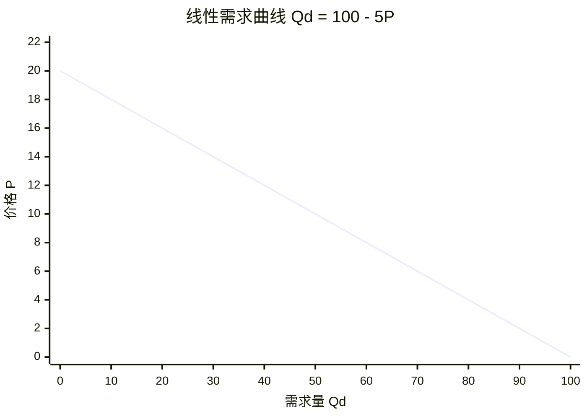
```mermaid
xychart-beta
    title "线性需求曲线 Qd = 100 - 5P"
    x-axis "需求量 Qd" [0, 10, 20, 30, 40, 50, 60, 70, 80, 90, 100]
    y-axis "价格 P" 0 --> 22
    line [20, 18, 16, 14, 12, 10, 8, 6, 4, 2, 0]
```

**说明**：该需求曲线向下倾斜，斜率为-0.2（P = 20 - 0.2Qd），表示价格每增加1单位，需求量减少5单位。

**示例2：不同弹性的需求曲线**

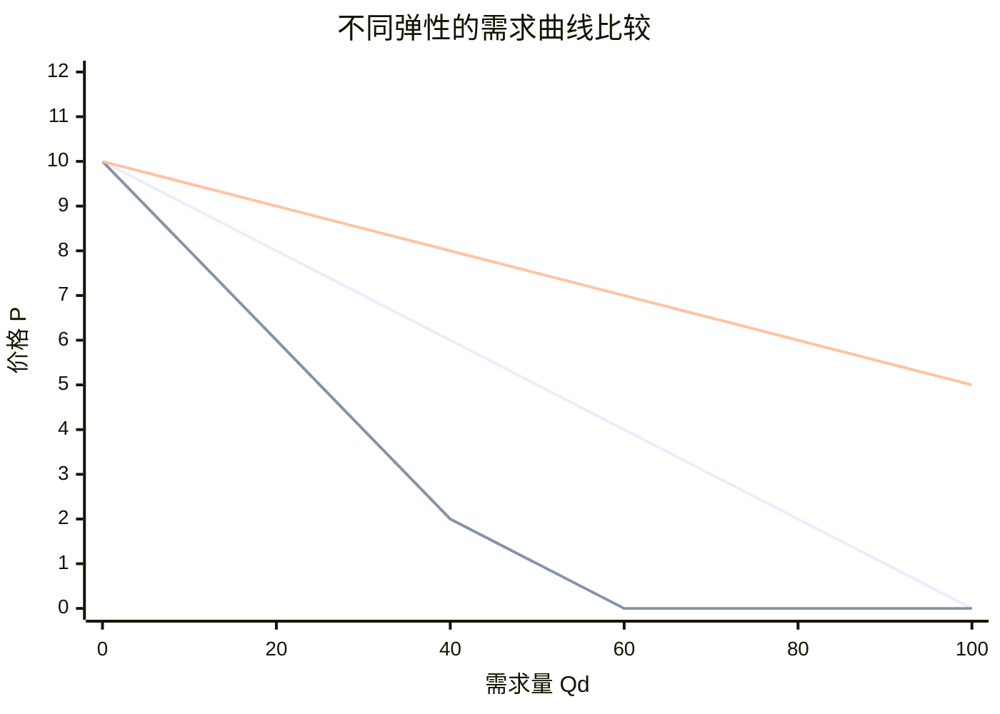
```mermaid
xychart-beta
    title "不同弹性的需求曲线比较"
    x-axis "需求量 Qd" [0, 20, 40, 60, 80, 100]
    y-axis "价格 P" 0 --> 12
    line [10, 8, 6, 4, 2, 0]
    line [10, 6, 2, 0, 0, 0]
    line [10, 9, 8, 7, 6, 5]
```

**说明**：
- 🔵 蓝色曲线（较平坦）：富有弹性（|Ed| > 1）
- 🟠 橙色曲线（较陡峭）：缺乏弹性（|Ed| < 1）
- 🟢 绿色曲线（中间）：单位弹性（|Ed| = 1）
- 绿色曲线（中间）：单位弹性的需求曲线（|Ed| = 1）

**示例3：需求曲线的移动**

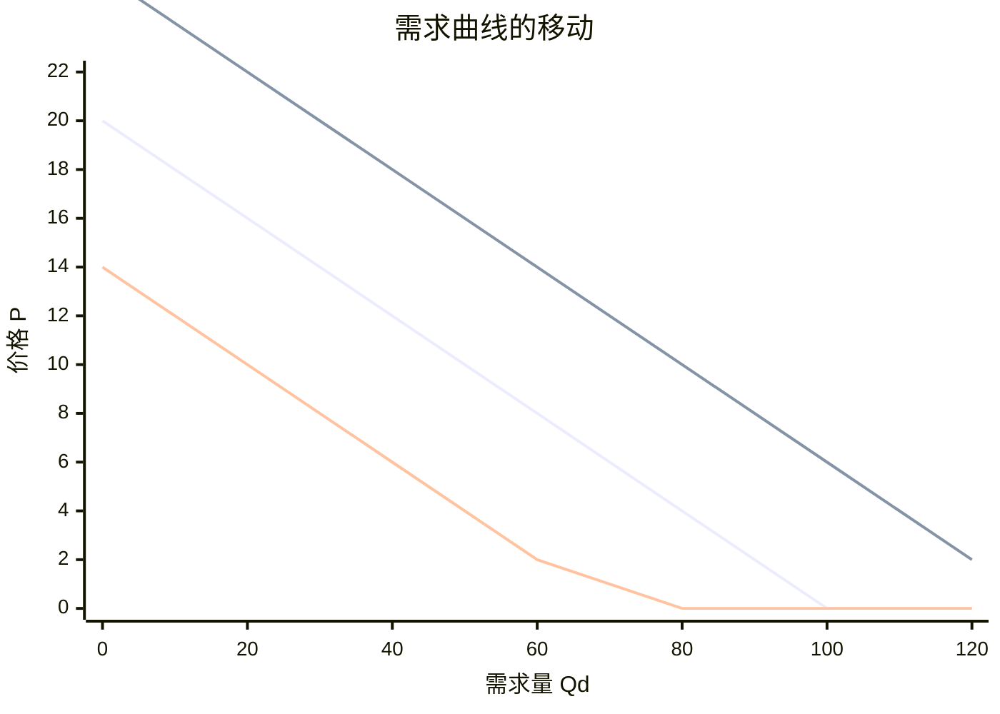
```mermaid
xychart-beta
    title "需求曲线的移动"
    x-axis "需求量 Qd" [0, 20, 40, 60, 80, 100, 120]
    y-axis "价格 P" 0 --> 22
    line [20, 16, 12, 8, 4, 0, 0]
    line [26, 22, 18, 14, 10, 6, 2]
    line [14, 10, 6, 2, 0, 0, 0]
```

**说明**：
- 🔵 蓝色曲线（D₁）：初始需求曲线
- 🟠 橙色曲线（D₂）：需求增加（向右移动）
- 🟢 绿色曲线（D₃）：需求减少（向左移动）

**需求曲线移动的原因**：
- 消费者收入变化
- 相关商品价格变化
- 消费者偏好变化
- 消费者预期变化
- 消费者数量变化

#### 影响需求的因素

1. **商品本身的价格（P）***-price*
   - 价格变化导致需求量沿着需求曲线移动
   - 这是需求量的变化，不是需求的变化
   - 一般来说，价格上升引起需求量下降（*需求规律*）
   - *吉芬物品、凡勃伦商品*价格上升需求量上升
 ```plaintxt
 吉芬物品之所以出现“越涨越买”的现象，关键在于其特殊的收入效应和替代效应的相互作用：
1. 必须是低档物品 (Inferior Good)：吉芬物品首先是一种低档物品。当消费者收入增加时，他们会减少对该商品的消费，转而购买更优质的替代品。
2. 收入效应大于替代效应：
- 替代效应 (Substitution Effect)：当商品价格上涨时，消费者会倾向于寻找更便宜的替代品，从而减少对该商品的需求。这对所有商品都适用。
- 收入效应 (Income Effect)：价格上涨导致消费者的实际购买力（即“实际收入”）下降。
- 对于一般的低档物品，价格上升带来的负向替代效应通常大于正向的收入效应，总效应仍是需求量减少。
- 但对于吉芬物品，其收入效应的作用非常大，以至于超过了替代效应。 
  
  凡勃伦商品之所以“越贵越有人买”，是因为其效用不仅仅来自商品本身的使用价值，更来自于它所象征的社会地位和财富。高价本身就是一种吸引力。

- 双重效用：凡勃伦商品的总效用由两部分构成：
    1. 使用效用：商品的实际功能（如手表用来计时）。
    2. 炫耀效用：商品价格所带来的心理满足感和身份象征。这部分效用会随着价格的升高而增强。
- 身份标识：对于富裕阶层来说，购买昂贵的奢侈品（如名画、古董、顶级跑车）主要是为了向他人展示其财力和社会地位。如果价格下跌到不足以彰显其尊贵身份时，这种“炫耀效用”就会消失，需求量反而会下降。
 ```

2. **消费者收入（I）***-income*
   - **正常商品（Normal Goods）**：收入增加，需求增加
   - **低档商品（Inferior Goods）**：收入增加，需求减少
   - 导致需求曲线移动

3. **相关商品的价格（Pr）***-price of related goods*
   - **替代品（Substitutes）**：替代品价格上升，需求增加
   - **互补品（Complements）**：互补品价格上升，需求减少
   - 导致需求曲线移动

4. **消费者偏好（T）***-taste*
   - 偏好增强，需求增加
   - 导致需求曲线移动

5. **消费者预期（Pe）***-price expect*
   - 预期价格上升，当前需求增加
   - 导致需求曲线移动

6. **消费者数量（N）***-number*
   - 消费者数量增加，需求增加
   - 导致需求曲线移动

#### 需求的变动 vs. 需求量的变动

**需求的变动（Change in Demand）**：
- 由非价格因素引起（外生变量变动）
- 表现为整个需求曲线的移动
- 需求增加：曲线向右移动
- 需求减少：曲线向左移动

**需求量的变动（Change in Quantity Demanded）**：
- 由商品本身价格变化引起（内生变量变动）
- 表现为沿着需求曲线的移动
- 价格上升：需求量减少（**沿曲线**向上移动）
- 价格下降：需求量增加（**沿曲线**向下移动）

### 2. 供给

**供给（Supply）**
是指生产者在一定时期内，在各种可能的价格水平下，***愿意并且能够***提供的某种商品或服务的数量。

#### 供给的特征

1. **生产能力（Ability to Produce）**：生产者有足够的生产能力
2. **盈利动机（Profit Motive）**：生产者追求利润最大化
3. **时间因素（Time Period）**：供给总是指特定时期内的供给
4. **成本考虑（Cost Consideration）**：供给量受成本影响

#### 供给定理

**供给定理（Law of Supply）**：在其他条件不变的情况下，商品的价格与供给量呈同方向变动。即价格上升，供给量增加；价格下降，供给量减少。

**原因**：
1. **利润动机**：价格上升，单位产品的利润增加
2. **边际成本递增**：产量增加时，边际成本上升
3. **进入激励**：高价格吸引新的生产者进入

#### 供给表与供给曲线

**供给表（Supply Schedule）**：
```
价格（元） | 供给量（单位）
---------|-------------
    2    |      100
    4    |      150
    6    |      200
    8    |      250
   10    |      300
```

**供给曲线（Supply Curve）**：表示价格与供给量之间关系的曲线。通常向右上方倾斜。

**供给函数**：
$$Qs = f(P,I,Pr,T,Pe,...)$$
简化（除价格**P**，其余都不变）：$$Qs=Qs(P)$$
通常形式（线性供给曲线）：$$Qs = c + d\times P$$
其中：
- $Qs$为供给量
- $P$为价格
- $c$为常数项（截距项）
- $d$为供给曲线斜率

#### 供给函数示例图

**示例1：线性供给曲线**

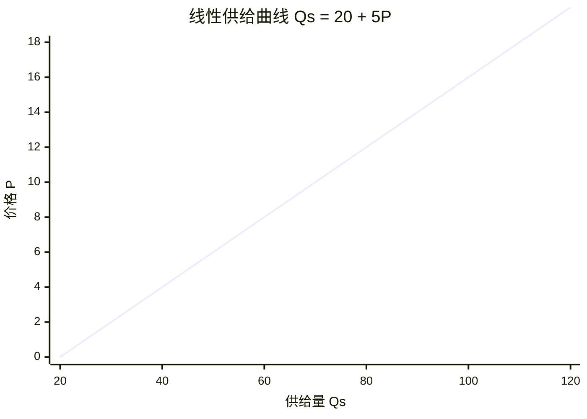
```mermaid
xychart-beta
    title "线性供给曲线 Qs = 20 + 5P"
    x-axis "供给量 Qs" [20, 40, 60, 80, 100, 120]
    y-axis "价格 P" 0 --> 18
    line [0, 4, 8, 12, 16, 20]
```

**说明**：该供给曲线向上倾斜，斜率为0.2（P = 0.2Qs - 4），表示价格每增加1单位，供给量增加5单位。

**示例2：不同弹性的供给曲线**

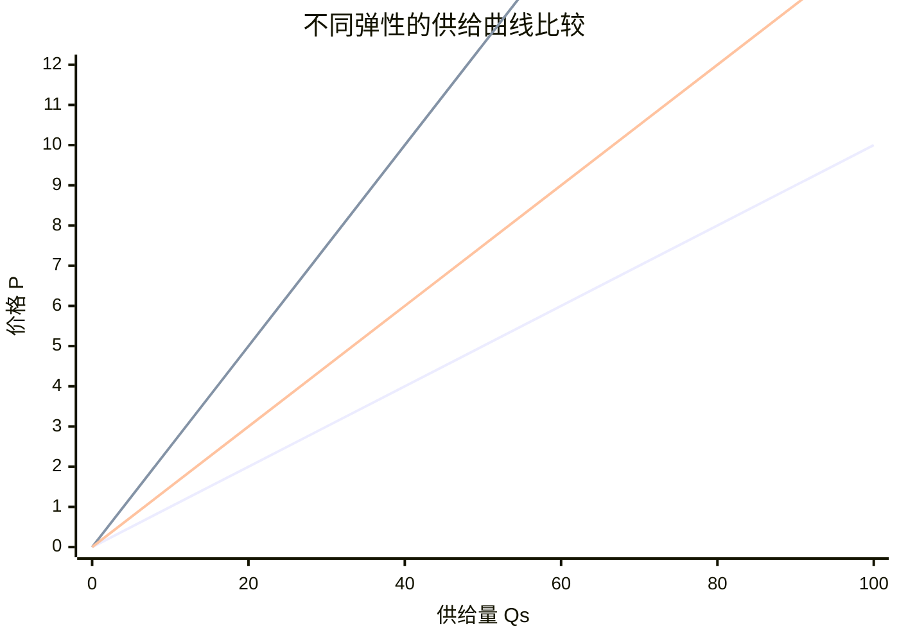
```mermaid
xychart-beta
    title "不同弹性的供给曲线比较"
    x-axis "供给量 Qs" [0, 20, 40, 60, 80, 100]
    y-axis "价格 P" 0 --> 12
    line [0, 2, 4, 6, 8, 10]
    line [0, 5, 10, 15, 20, 25]
    line [0, 3, 6, 9, 12, 15]
```

**说明**：
- 🔵 蓝色曲线（较平坦）：富有弹性（Es > 1）
- 🟠 橙色曲线（较陡峭）：缺乏弹性（Es < 1）
- 🟢 绿色曲线（中间）：单位弹性（Es = 1）

**示例3：供给曲线的移动**

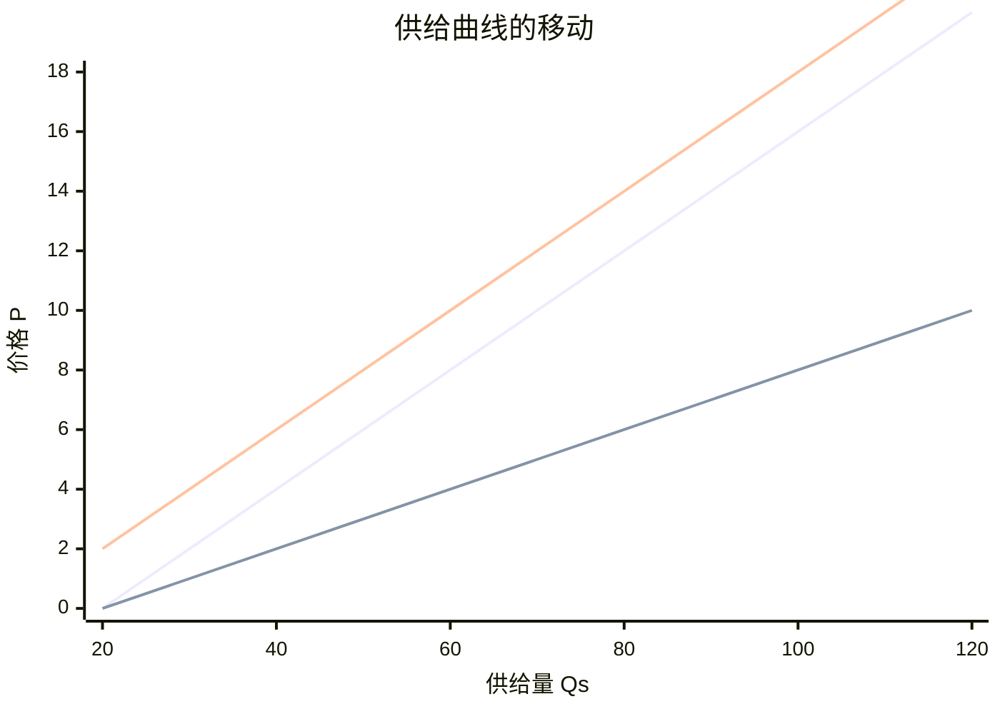
```mermaid
xychart-beta
    title "供给曲线的移动"
    x-axis "供给量 Qs" [20, 40, 60, 80, 100, 120]
    y-axis "价格 P" 0 --> 18
    line [0, 4, 8, 12, 16, 20]
    line [0, 2, 4, 6, 8, 10]
    line [2, 6, 10, 14, 18, 22]
```

**说明**：
- 蓝色曲线（S1）：初始供给曲线
- 橙色曲线（S2）：供给增加（向右移动）
- 绿色曲线（S3）：供给减少（向左移动）

**供给曲线移动的原因**：
- 生产成本变化
- 生产技术水平变化
- 相关商品价格变化
- 生产者预期变化
- 生产者数量变化
- 自然条件变化

#### 影响供给的因素

1. **商品本身的价格（P）***-price*
   - 价格变化导致供给量沿着供给曲线移动
   - 这是供给量的变化，不是供给的变化

2. **生产成本（C）***-cost*
   - 生产成本上升，供给减少
   - 包括：劳动力成本、原材料成本、资本成本等
   - 导致供给曲线移动

3. **生产技术水平（T）***-technology*
   - 技术进步，供给增加
   - 降低生产成本，提高生产效率
   - 导致供给曲线移动

4. **相关商品的价格（Pr）***-price of related*
   - **替代品价格上升，原商品供给减少**
   - **互补品价格上升，原商品供给可能增加**
   - 导致供给曲线移动

5. **生产者预期（E）***-expect*
   - 预期价格上升，当前供给减少（囤积）
   - 导致供给曲线移动

6. **生产者数量（N）***-number*
   - 生产者数量增加，供给增加
   - 导致供给曲线移动

1. **自然条件（N）***-nature*
   - 对农产品特别重要
   - 自然灾害导致供给减少
   - 导致供给曲线移动

#### 供给的变动 vs. 供给量的变动

**供给的变动（Change in Supply）**：
- 由非价格因素引起
- 表现为整个供给曲线的移动
- 供给增加：曲线向右移动
- 供给减少：曲线向左移动

**供给量的变动（Change in Quantity Supplied）**：
- 由商品本身价格变化引起
- 表现为沿着供给曲线的移动
- 价格上升：供给量增加（沿曲线向上移动）
- 价格下降：供给量减少（沿曲线向下移动）

### 3. 市场均衡（相对静止）

**市场均衡（Market Equilibrium）**
是指市场供给等于市场需求的状态，此时市场出清（Market Clear），不存在过剩或短缺。
- 市场出清（market clear equ）
- 最优化（optimized equ）
- 过剩：供给量>需求量
- 短缺：供给量<需求量

#### 均衡价格和均衡数量

**均衡价格（Equilibrium Price, P*）**：使市场需求量等于市场供给量的价格。

**均衡数量（Equilibrium Quantity, Q*）**：在均衡价格下的市场交易量。

**均衡条件**：
$$Qd = Qs$$

#### 市场机制

**市场机制（Market Mechanism）**
是指通过价格来调节供给和需求、实现资源配置的系统。

**价格调节功能**：


价格变动 → 供给量和需求量变动 → 市场自动调整
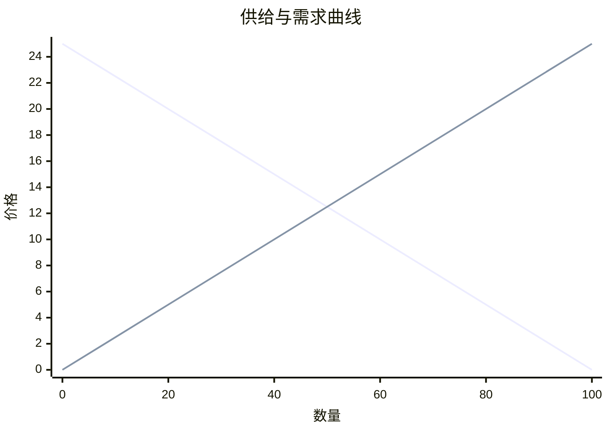
```mermaid
xychart-beta
    title "供给与需求曲线"
    x-axis "数量" [0, 20, 40, 60, 80, 100]
    y-axis "价格" 0 --> 25
    line [25, 20, 15, 10, 5, 0]
    line [0, 5, 10, 15, 20, 25]
```

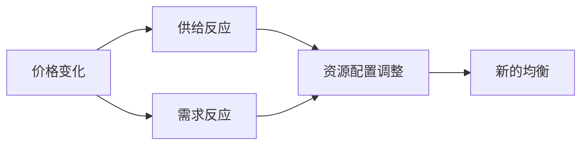
```mermaid
flowchart LR
    A[价格变化] --> B[供给反应]
    A --> C[需求反应]
    B --> D[资源配置调整]
    C --> D
    D --> E[新的均衡]
```

**市场机制的优点**：

1. **自动调节**：价格作为信号，引导资源的自动流动
2. **信息传递**：价格汇总了市场供需信息
3. **激励机制**：鼓励生产者增加供给、抑制过度需求
4. **效率优先**：资源流向最有价值的用途

**均衡价格的形成过程**：

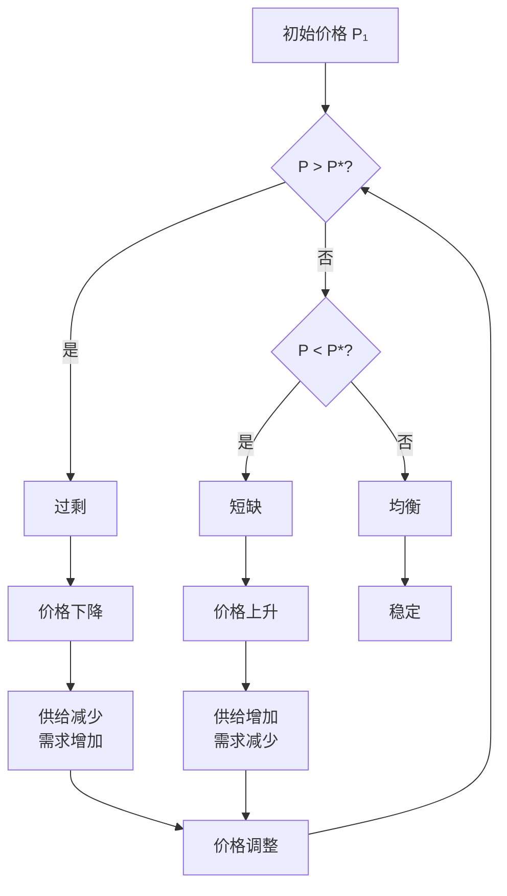
```mermaid
flowchart TD
    A[初始价格 P₁] --> B{P > P*?}
    B -- 是 --> C[过剩]
    B -- 否 --> D{P < P*?}
    D -- 是 --> E[短缺]
    D -- 否 --> F[均衡]
    
    C --> G[价格下降]
    G --> H[供给减少<br/>需求增加]
    H --> I[价格调整]
    
    E --> J[价格上升]
    J --> K[供给增加<br/>需求减少]
    K --> I
    
    I --> B
    F --> L[稳定]
```

**图形说明**：
- 市场通过价格机制自动调节
- 价格高于均衡时通过过剩信号降价
- 价格低于均衡时通过短缺信号涨价
- 最终达到市场出清

#### 市场均衡图示

**基本市场均衡图形**：

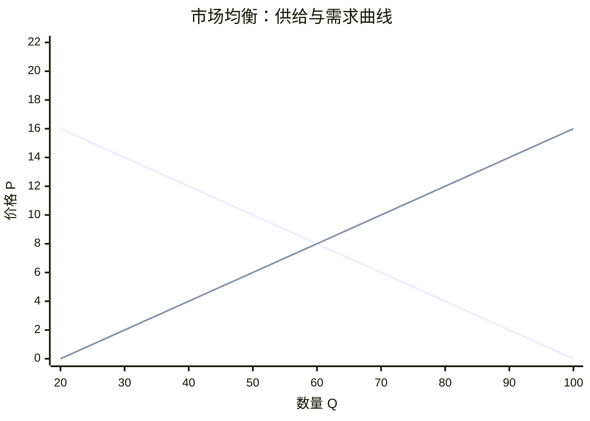
```mermaid
xychart-beta
    title "市场均衡：供给与需求曲线"
    x-axis "数量 Q" [20, 30, 40, 50, 60, 70, 80, 90, 100]
    y-axis "价格 P" 0 --> 22
    line [16, 14, 12, 10, 8, 6, 4, 2, 0]
    line [0, 2, 4, 6, 8, 10, 12, 14, 16]
```

**图形说明**：
- 🔵 蓝色线：需求曲线 D（向右下方倾斜）
- 🟠 橙色线：供给曲线 S（向右上方倾斜）
- 交点 E：均衡点 (Q* = 60, P* = 8)

#### 均衡的求解

**线性供给和需求**：

需求函数：$$Qd = a - b\times P$$
供给函数：$$Qs = c + d\times P$$
均衡条件：$$a - b\times P = c + d\times P$$
求解得：$$P* = \frac{(a - c)}{(b + d)}$$
代入得：$$Q* = a - b\times \frac{(a - c)}{(b + d)}$$
或：$$Q* = c + d\times \frac{(a - c)}{(b + d)}$$


**例子**：
```
需求函数：Qd = 100 - 5P
供给函数：Qs = 20 + 5P

均衡条件：100 - 5P = 20 + 5P
80 = 10P
P* = 8
Q* = 100 - 5×8 = 60
验证：Qs = 20 + 5×8 = 60 ✓
```

**均衡图示**：

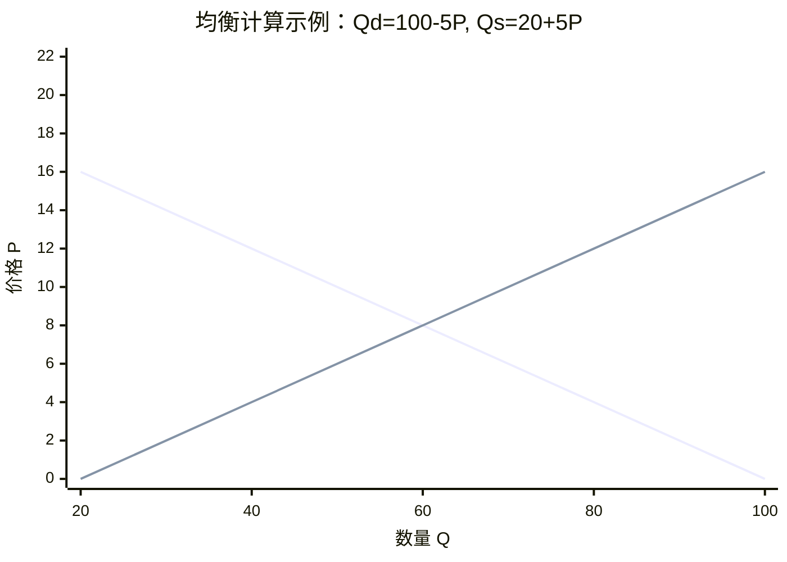
```mermaid
xychart-beta
    title "均衡计算示例：Qd=100-5P, Qs=20+5P"
    x-axis "数量 Q" [20, 40, 60, 80, 100]
    y-axis "价格 P" 0 --> 22
    line [16, 12, 8, 4, 0]
    line [0, 4, 8, 12, 16]
```

**图形说明**：
- 🔵 蓝色线：需求曲线 D (Qd = 100 - 5P)
- 🟠 橙色线：供给曲线 S (Qs = 20 + 5P)
- 交点 E：均衡点 (Q* = 60, P* = 8)

**图形解释**：
- 供给曲线：Qs = 20 + 5P，P = 0.2Q - 4
- 需求曲线：Qd = 100 - 5P，P = 20 - 0.2Q
- 均衡点 E：Q* = 60，P* = 8

#### 均衡的稳定性

**稳定性（Stability）**：市场是否能够自动回到均衡状态。

**稳定均衡**：
- 价格高于均衡时，出现过剩，价格下降
- 价格低于均衡时，出现短缺，价格上升
- 市场自动调节到均衡

**过剩与短缺图示**：

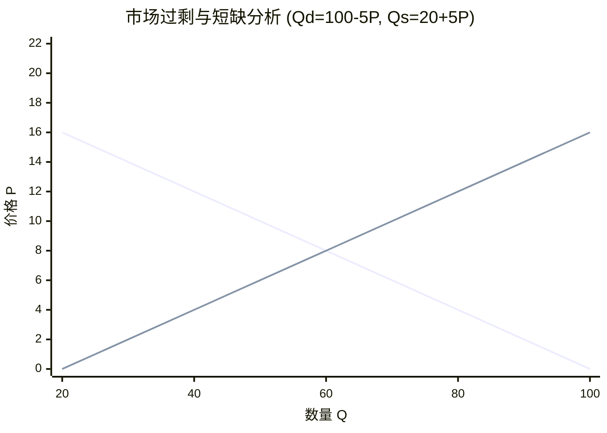
```mermaid
xychart-beta
    title "市场过剩与短缺分析 (Qd=100-5P, Qs=20+5P)"
    x-axis "数量 Q" [20, 40, 60, 80, 100]
    y-axis "价格 P" 0 --> 22
    line [16, 12, 8, 4, 0]
    line [0, 4, 8, 12, 16]
```

**图形说明**：
- 🔵 蓝色线：需求曲线 D
- 🟠 橙色线：供给曲线 S
- 均衡点 E：P* = 8, Q* = 60
- 当 P = 12 > P* 时：Qs > Qd → 过剩
- 当 P = 4 < P* 时：Qs < Qd → 短缺

**不稳定均衡**：
- 价格偏离均衡时，不会自动回到均衡
- 现实中较少见

#### 均衡的变动

**均衡的变动**是指需求曲线或供给曲线的移动导致均衡点（均衡价格和均衡数量）发生变化。

##### 需求变动对均衡的影响

**需求增加**（需求曲线右移）：
```
需求曲线：D₀ → D₁
均衡点：E₀(P₀, Q₀) → E₁(P₁, Q₁)
结果：P↑ Q↑
```

**需求减少**（需求曲线左移）：
```
需求曲线：D₀ → D₂
均衡点：E₀(P₀, Q₀) → E₂(P₂, Q₂)
结果：P↓ Q↓
```

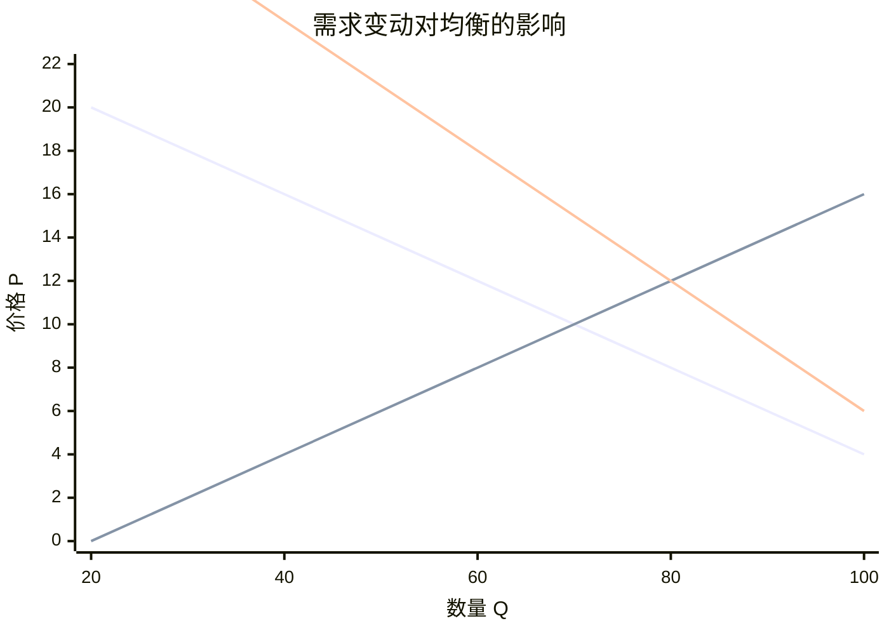
```mermaid
xychart-beta
    title "需求变动对均衡的影响"
    x-axis "数量 Q" [20, 40, 60, 80, 100]
    y-axis "价格 P" 0 --> 22
    line [20, 16, 12, 8, 4]
    line [0, 4, 8, 12, 16]
    line [30, 24, 18, 12, 6]
```

**图形说明**：
- 🔵 蓝色线：初始需求曲线 D₀
- 🟠 橙色线：供给曲线 S（固定）
- 🟢 绿色线：需求增加 D₁ → 均衡点：P↑ Q↑

##### 供给变动对均衡的影响

**供给增加**（供给曲线右移）：
```
供给曲线：S₀ → S₁
均衡点：E₀(P₀, Q₀) → E₁(P₁, Q₁)
结果：P↓ Q↑
```

**供给减少**（供给曲线左移）：
```
供给曲线：S₀ → S₂
均衡点：E₀(P₀, Q₀) → E₂(P₂, Q₂)
结果：P↑ Q↓
```

```mermaid
xychart-beta
    title "供给变动对均衡的影响"
    x-axis "数量 Q" [20, 40, 60, 80, 100]
    y-axis "价格 P" 0 --> 22
    line [20, 16, 12, 8, 4]
    line [0, 4, 8, 12, 16]
    line [2, 6, 10, 14, 18]
```mermaid
xychart-beta
    title "供给与需求曲线"
    x-axis "数量" [0, 20, 40, 60, 80, 100]
    y-axis "价格" 0 --> 25
    line [25, 20, 15, 10, 5, 0]
    line [0, 5, 10, 15, 20, 25]
```mermaid
xychart-beta
    title "供求同时变动示例需求↑ 供给↑"
    x-axis "数量 Q" [20, 40, 60, 80, 100]
    y-axis "价格 P" 0 --> 22
    line [20, 16, 12, 8, 4]
    line [0, 4, 8, 12, 16]
    line [18, 14, 10, 6, 2]
    line [6, 8, 10, 12, 14]
```

**图形说明**：
- 🔵 蓝色线：初始需求曲线 D₁₉₇₀
- 🟠 橙色线：初始供给曲线 S₁₉₇₀
- 🟢 绿色线：新需求曲线 D₂₀₁₀（需求增加，右移）
- 🟣 紫色线：新供给曲线 S₂₀₁₀（供给增加，右下移）

**均衡点变化**：
- E₀：P = 8, Q = 60（蓝色线与橙色线交点）
- E₁：P = 6, Q = 80（绿色线与紫色线交点）
- 结果：P↓ Q↑

**分析**：
- 需求增加幅度 > 供给增加幅度 → 均衡价格上涨
- 两者都增加 → 均衡数量增加

### 4. 弹性理论

**弹性（Elasticity）**
衡量一个变量对另一个变量变化的敏感程度。

#### 需求的价格弹性

**需求的价格弹性（Price Elasticity of Demand, Ed）**：衡量需求量对价格变化的敏感程度。

**定义公式**：

$$Ed =\frac{(\frac{ΔQ}{Q})}{(\frac{ΔP}{P})} = (\frac{ΔQ}{ΔP})\times(\frac{P}{Q})$$

**弧弹性（Arc Elasticity）**：计算两点之间的弹性（用中点）
$$Ed = \frac{[\frac{\frac{(Q₂ - Q₁)}{((Q₁ + Q₂)}}{2})]}{[\frac{\frac{(P₂ - P₁)}{((P₁ + P₂)}}{2})]}
   = \frac{[\frac{(Q₂ - Q₁)}{(Q₁ + Q₂)}]}{[\frac{(P₂ - P₁)}{(P₁ + P₂)}]}
   = \frac{[(Q₂ - Q₁)\times(P₁ + P₂)]}{[(P₂ - P₁)\times(Q₁ + Q₂)]}$$

**点弹性（Point Elasticity）**：计算某一点的弹性
$$Ed = (\frac{dQ}{dP})\times(\frac{P}{Q})$$
**弹性的性质**：
1. 符号：通常为负数（根据需求定理）
2. 大小：$|Ed| > 1$富有弹性，$|Ed| < 1$缺乏弹性，$|Ed| = 1$单位弹性

**需求弹性的类型**：
```
1. 完全有弹性（|Ed| = ∞）：水平需求曲线
2. 富有弹性（|Ed| > 1）：价格变化1%，需求量变化超过1%
3. 单位弹性（|Ed| = 1）：价格变化1%，需求量变化1%
4. 缺乏弹性（|Ed| < 1）：价格变化1%，需求量变化不足1%
5. 完全无弹性（|Ed| = 0）：垂直需求曲线
```

**影响需求弹性的因素**：
1. **替代品的可获得性**：替代品越多，弹性越大
2. **商品在预算中的比重**：比重越大，弹性越大
3. **时间的长短**：长期比短期弹性大
4. **商品的必需程度**：必需品弹性小，奢侈品弹性大
5. **市场范围**：范围越窄，弹性越大

**弹性与总收益的关系**：
```
总收益 TR = P × Q

|Ed| > 1：价格上升，总收益下降
|Ed| = 1：价格变化，总收益不变
|Ed| < 1：价格上升，总收益上升

推导：
d(TR)/dP = d(P×Q)/dP = Q + P×dQ/dP
= Q(1 + P/Q × dQ/dP)
= Q(1 + Ed)
= Q(1 - |Ed|)

因此：
当 |Ed| > 1 时，d(TR)/dP < 0，价格与总收益反向变化
当 |Ed| < 1 时，d(TR)/dP > 0，价格与总收益同向变化
```

#### 供给的价格弹性

**供给的价格弹性（Price Elasticity of Supply, Es）**：衡量供给量对价格变化的敏感程度。

**定义公式**：

$$Es = \frac{(\frac{ΔQ}{Q})}{(\frac{ΔP}{P})} = (\frac{ΔQ}{ΔP})\times(\frac PQ)$$


**弧弹性**：
$$Es = \frac{[(Q₂ - Q₁)\times(P₁ + P₂)]}{[(P₂ - P₁)\times(Q₁ + Q₂)]}$$


**点弹性**：

$$Es = (\frac{dQ}{dP})\times(\frac{P}{Q})$$


**供给弹性的类型**：

1. 完全有弹性（$Es = ∞$）：水平供给曲线
2. 富有弹性（$Es > 1$）
3. 单位弹性（$Es = 1$）
4. 缺乏弹性（$Es < 1$）
5. 完全无弹性（$Es = 0$）：垂直供给曲线


**影响供给弹性的因素**：
1. **时间的长短**：长期比短期弹性大
2. **生产能力的调整**：调整越容易，弹性越大
3. **生产成本的变动**：成本递增越快，弹性越小
4. **生产要素的流动性**：流动性越高，弹性越大
5. **存货能力**：存货能力越强，弹性越大

**时间对供给弹性的影响**：
1. 即时供给（Momentary Supply）：Es = 0
   - 生产者无法调整产量
   - 供给完全无弹性

2. 短期供给（Short-run Supply）：0 < Es < ∞
   - 生产者可以有限地调整产量
   - 供给缺乏弹性

3. 长期供给（Long-run Supply）：Es > 0，可能很大
   - 生产者可以充分调整产量
   - 供给富有弹性

#### 需求的收入弹性

**需求的收入弹性（Income Elasticity of Demand, Ey）**：衡量需求量对收入变化的敏感程度。

**定义公式**：

$$Ey = \frac{(\frac{ΔQ}{Q})}{(\frac{ΔI}{I})} = (\frac{ΔQ}{ΔI})\times(\frac{I}{Q})$$


**收入弹性的类型**：
```
1. Ey > 0：正常商品
   - Ey > 1：奢侈品（收入增加1%，需求增加超过1%）
   - 0 < Ey < 1：必需品（收入增加1%，需求增加不足1%）

2. Ey < 0：低档商品
   - 收入增加，需求减少
```

**恩格尔定律（Engel's Law）**：
- 随着收入增加，食品支出占总支出的比例下降
- 食品的收入弹性小于1

#### 需求的交叉弹性

**需求的交叉弹性（Cross Elasticity of Demand, Exy）**：衡量一种商品的需求量对另一种商品价格变化的敏感程度。

**定义公式**：

$$Exy = \frac{(\frac{ΔQx}{Qx})}{(\frac{ΔPy}{Py})} = (\frac{ΔQx}{ΔPy})\times(\frac{Py}{Qx})$$


**交叉弹性的类型**：
```
1. Exy > 0：替代品关系
   - Y价格上升，X需求增加
   - Exy越大，替代性越强

2. Exy < 0：互补品关系
   - Y价格上升，X需求减少
   - Exy的绝对值越大，互补性越强

3. Exy = 0：无关商品
   - Y价格变化不影响X需求
```

**蛛网模型（Cobweb Model）**：
- 描述市场动态调整过程
- 根据供给和需求弹性的相对大小，可能收敛、发散或循环

**蛛网模型图示**：

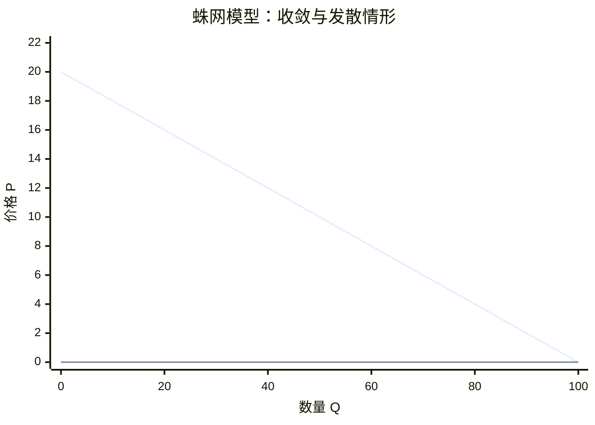
```mermaid
xychart-beta
    title "蛛网模型：收敛与发散情形"
    x-axis "数量 Q" [0, 20, 40, 60, 80, 100]
    y-axis "价格 P" 0 --> 22
    line [20, 16, 12, 8, 4, 0]
    line [0, 0, 0, 0, 0, 0]
```

**图形说明**：
- 蓝色线：供给曲线（较平坦 → 富有弹性）
- 橙色线：需求曲线
- 收敛条件：供给弹性 < 需求弹性
- 发散条件：供给弹性 > 需求弹性
- 循环条件：供给弹性 = 需求弹性

### 5. 价格管制

**价格管制（Price Controls）**是政府对市场价格设定的限制，包括最高限价和最低限价。

#### 最高限价（价格上限）

**最高限价（Price Ceiling）**：政府设定的最高合法价格，低于市场均衡价格。

**特征**：
```
P_ceil < P_equilibrium
```

**效果**：
1. **短缺（Shortage）**：需求量大于供给量
   ```
   Qd > Qs
   短缺 = Qd - Qs
   ```

2. **黑市（Black Market）**：价格高于限价
   - 供给者愿意在黑市上以更高价格出售
   - 消费者愿意支付更高价格

3. **无谓损失（Deadweight Loss）**：
   - 资源配置效率降低
   - 消费者剩余和生产者剩余之和减少

4. **配给（Rationing）**：
   - 需要其他分配机制
   - 先到先得、排队、配给券等

**图形分析**：
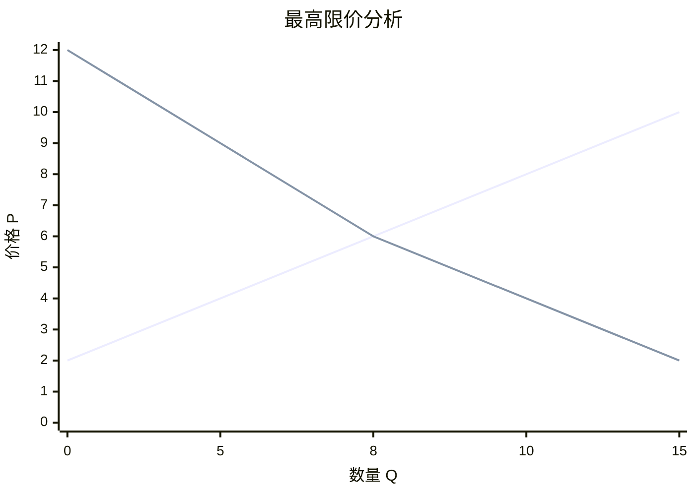
```mermaid
xychart-beta
    title "最高限价分析"
    x-axis "数量 Q" [0, 5, 8, 10, 15]
    y-axis "价格 P" 0 --> 12
    line [2, 4, 6, 8, 10]
    line [12, 9, 6, 4, 2]
```

**图形说明**：
- 供给曲线S向上倾斜
- 需求曲线D向下倾斜
- E点为市场均衡点(P*=8, Q*=8)
- Pc为最高限价(Pc=6)
- 最高限价导致短缺（Qs < Qd）

**谁受益谁受损**：
- **受益者**：能以限价购买到商品的消费者
- **受损者**：
  - 不能买到商品的消费者
  - 接受限价的生产者
  - 社会整体（无谓损失）

#### 最低限价（价格下限）

**最低限价（Price Floor）**：政府设定的最低合法价格，高于市场均衡价格。

**特征**：
```
P_floor > P_equilibrium
```

**效果**：
1. **过剩（Surplus）**：供给量大于需求量
   ```
   Qs > Qd
   过剩 = Qs - Qd
   ```

2. **政府购买（Government Purchase）**：
   - 政府购买过剩产品
   - 维持价格水平

3. **无谓损失（Deadweight Loss）**：
   - 资源配置效率降低
   - 消费者剩余和生产者剩余之和减少

4. **非价格竞争（Non-price Competition）**：
   - 质量竞争
   - 广告竞争

**图形分析**：
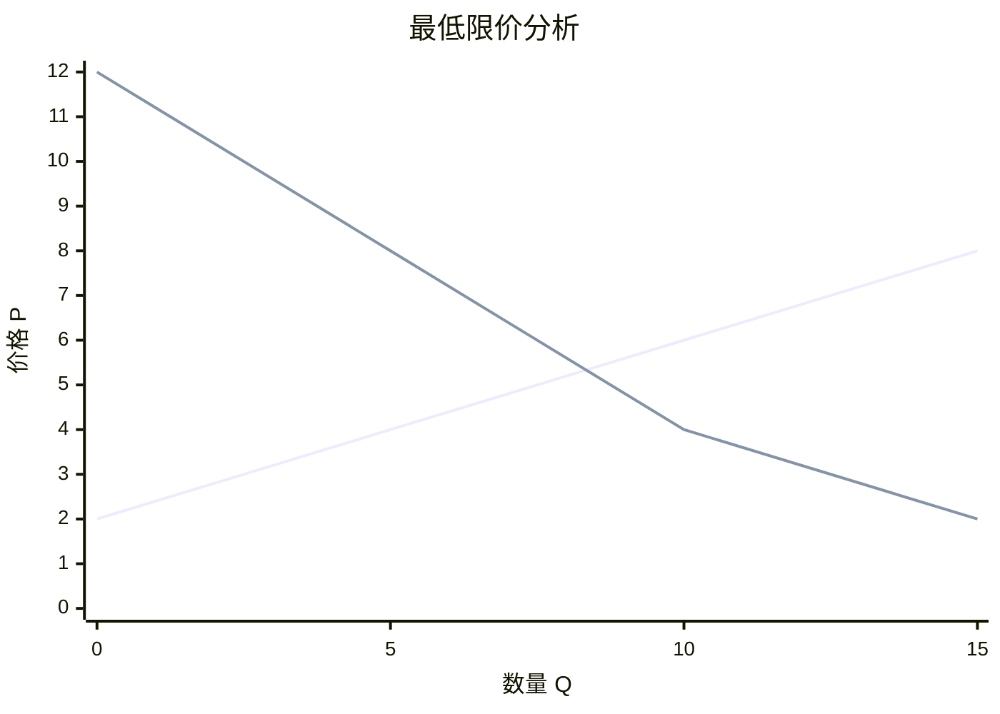
```mermaid
xychart-beta
    title "最低限价分析"
    x-axis "数量 Q" [0, 5, 10, 15]
    y-axis "价格 P" 0 --> 12
    line [2, 4, 6, 8]
    line [12, 8, 4, 2]
```

**图形说明**：
- 供给曲线S向上倾斜
- 需求曲线D向下倾斜
- E点为市场均衡点(P*=8, Q*=8)
- Pf为最低限价(Pf=10)
- 最低限价导致过剩（Qs > Qd）

**应用实例**：
- **最低工资**：保护劳动者权益
- **农产品价格支持**：保护农民利益

#### 价格管制的效率评价

**效率损失**：
```
无谓损失 DWL = 0.5 × (P_ceil - P_market) × (Q_market - Q_ceil)
或
无谓损失 DWL = 0.5 × (P_floor - P_market) × (Q_market - Q_floor)
```

**支持价格管制的理由**：
1. **公平性（Equity）**：保护弱势群体
2. **稳定性（Stability）**：防止价格剧烈波动
3. **外部性（Externalities）**：纠正市场失灵

**反对价格管制的理由**：
1. **效率损失（Inefficiency）**：无谓损失
2. **黑市（Black Market）**：产生非法交易
3. **质量下降（Quality Deterioration）**：供给者降低质量
4. **资源配置扭曲（Resource Misallocation）**：资源不能流向最高价值用途

### 6. 税收的影响

税收会影响市场均衡，产生经济负担的分摊。

#### 税收对均衡的影响

**从量税（Specific Tax）**：每单位商品征收固定金额的税

**市场分析**：
```
税前：
需求：P = a - bQ
供给：P = c + dQ
均衡：P* = (a - c)/(b + d), Q* = (ad + bc)/(b + d)

税后（对消费者征收从量税t）：
消费者支付的价格：P_c
生产者收到的价格：P_p = P_c - t

新均衡：
a - bQ = c + dQ + t
Q** = (a - c - t)/(b + d)
P_c** = a - b × (a - c - t)/(b + d)
P_p** = c + d × (a - c - t)/(b + d)
```

**效果**：
1. **均衡数量减少**：Q** < Q*
2. **消费者支付的价格上升**：P_c** > P*
3. **生产者收到的价格下降**：P_p** < P*
4. **税收楔子（Tax Wedge）**：P_c** - P_p** = t

#### 税收归宿（Tax Incidence）

**税收归宿**：税收负担如何在消费者和生产者之间分摊。

**分摊比例**：
```
消费者承担的税收：P_c** - P*
生产者承担的税收：P* - P_p**

消费者承担比例 = (P_c** - P*)/t
生产者承担比例 = (P* - P_p**)/t
```

**决定因素**：弹性的相对大小
```
|Ed| > |Es|：消费者负担较少，生产者负担较多
|Ed| < |Es|：消费者负担较多，生产者负担较少
|Ed| = |Es|：消费者和生产者平均分担

数学证明：
消费者承担 = (d/(b + d)) × t
生产者承担 = (b/(b + d)) × t

因为：
需求弹性：Ed = -b × (P/Q)
供给弹性：Es = d × (P/Q)

|Ed|/|Es| = b/d

所以：
b > d ⇒ |Ed| > |Es| ⇒ 生产者承担较多
b < d ⇒ |Ed| < |Es| ⇒ 消费者承担较多
```

**图形分析**：
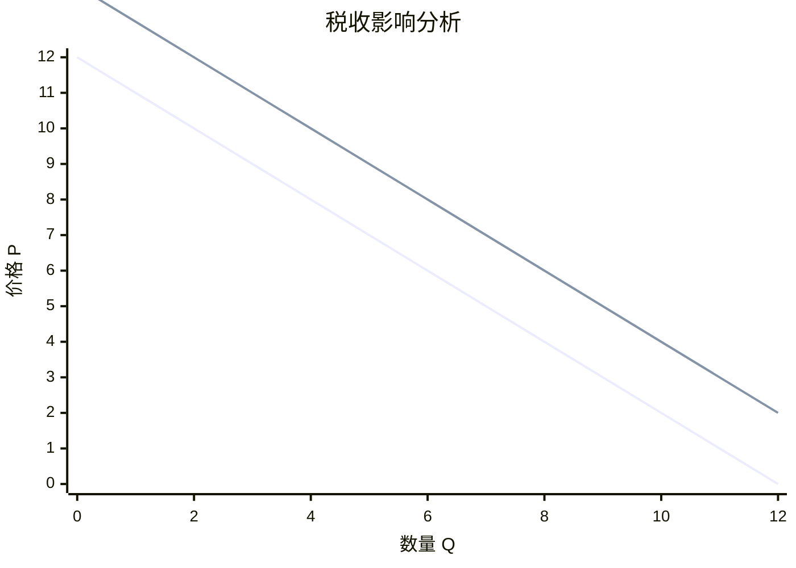
```mermaid
xychart-beta
    title "税收影响分析"
    x-axis "数量 Q" [0, 2, 4, 6, 8, 10, 12]
    y-axis "价格 P" 0 --> 12
    line [12, 10, 8, 6, 4, 2, 0]
    line [14, 12, 10, 8, 6, 4, 2]
```

**税收与弹性**：
```
需求越富有弹性（|Ed|越大），消费者负担越少
供给越富有弹性（Es越大），生产者负担越少

极端情况：
|Ed| = ∞（需求完全有弹性）：消费者不承担任何税收
|Ed| = 0（需求完全无弹性）：消费者承担全部税收
Es = ∞（供给完全有弹性）：生产者不承担任何税收
Es = 0（供给完全无弹性）：生产者承担全部税收
```

#### 税收的无谓损失

**无谓损失（Deadweight Loss, DWL）**：税收造成的效率损失。

**计算公式**：
```
DWL = 0.5 × t × (Q* - Q**)
```

**无谓损失与弹性**：
```
弹性越大，无谓损失越大
弹性越小，无谓损失越小

原因：
弹性大 ⇒ 税收导致数量变化大 ⇒ 无谓损失大
弹性小 ⇒ 税收导致数量变化小 ⇒ 无谓损失小
```

**拉弗曲线（Laffer Curve）**：
```
税收收入 = t × Q**

当t = 0时，税收收入 = 0
当t = ∞时，Q** = 0，税收收入 = 0
存在最优税率使税收收入最大化
```

#### 税收政策评价

**税收原则**：
1. **效率原则（Efficiency）**：最小化无谓损失
2. **公平原则（Equity）**：根据支付能力征税
3. **简单原则（Simplicity）**：税收制度简单易懂
4. **灵活性原则（Flexibility）**：能够根据经济情况调整

**最优税收（Optimal Taxation）**：
- 对缺乏弹性的商品征税（无谓损失小）
- 对奢侈品征税（符合公平原则）
- 对有害商品征税（纠正负外部性）

## 重要模型和公式

### 1. 市场均衡模型

#### 线性供给和需求

**模型设定**：
```
需求函数：Qd = a - bP
供给函数：Qs = c + dP
均衡条件：Qd = Qs
```

**均衡解**：
```
P* = (a - c)/(b + d)
Q* = (ad + bc)/(b + d)
```

**例子**：
```
Qd = 100 - 5P
Qs = 20 + 5P

均衡：100 - 5P = 20 + 5P
80 = 10P
P* = 8
Q* = 100 - 5×8 = 60
```

#### 非线性供给和需求

**模型设定**：
```
需求函数：Qd = aP^(-b)（常数弹性需求）
供给函数：Qs = cP^d（常数弹性供给）
```

**均衡解**：
```
aP^(-b) = cP^d
P^(d+b) = a/c
P* = (a/c)^(1/(d+b))
Q* = a × (a/c)^(-b/(d+b))
```

### 2. 弹性计算模型

#### 弧弹性公式

**需求价格弹性**：
```
Ed = [(Q₂ - Q₁)(P₁ + P₂)] / [(P₂ - P₁)(Q₁ + Q₂)]
```

**例子**：
```
点1：P₁ = 10, Q₁ = 100
点2：P₂ = 8, Q₂ = 150

Ed = [(150 - 100)(10 + 8)] / [(8 - 10)(100 + 150)]
   = [50 × 18] / [-2 × 250]
   = 900 / -500
   = -1.8

|Ed| = 1.8 > 1，富有弹性
```

#### 点弹性公式

**需求价格弹性**：
```
Ed = (dQ/dP) × (P/Q)
```

**线性需求函数**：
```
Qd = a - bP
dQ/dP = -b
Ed = -b × (P/Q)

例子：Qd = 100 - 5P
在P = 8, Q = 60时：
Ed = -5 × (8/60) = -40/60 = -0.67
|Ed| = 0.67 < 1，缺乏弹性
```

**常数弹性需求函数**：
```
Qd = aP^(-b)
ln(Qd) = ln(a) - b × ln(P)
d(lnQ)/d(lnP) = -b
Ed = -b（常数）
```

### 3. 税收归宿模型

#### 从量税分析

**市场分析**：
```
需求：P = a - bQ
供给：P = c + dQ
税收：t（对消费者征收）

税后：
a - bQ = c + dQ + t
Q** = (a - c - t)/(b + d)
P_c** = a - b × (a - c - t)/(b + d)
P_p** = c + d × (a - c - t)/(b + d)
```

**税收归宿**：
```
消费者承担：P_c** - P* = [a - b(a - c - t)/(b + d)] - (a - c)/(b + d)
           = [a(b + d) - b(a - c - t)]/(b + d) - (a - c)/(b + d)
           = [ab + ad - ab + bc + bt]/(b + d) - (a - c)/(b + d)
           = [ad + bc + bt - a + c]/(b + d)

生产者承担：P* - P_p** = (a - c)/(b + d) - [c + d(a - c - t)/(b + d)]
           = (a - c)/(b + d) - [c(b + d) + d(a - c - t)]/(b + d)
           = (a - c)/(b + d) - [bc + cd + ad - cd - dt]/(b + d)
           = (a - c)/(b + d) - [bc + ad - dt]/(b + d)
           = [a - c - bc - ad + dt]/(b + d)
           = [a - c - b(c) - d(a) + dt]/(b + d)

简化：
消费者承担 = d × t/(b + d)
生产者承担 = b × t/(b + d)

验证：消费者承担 + 生产者承担 = (d + b) × t/(b + d) = t ✓
```

**例子**：
```
需求：Qd = 100 - 5P（b = 5）
供给：Qs = 20 + 5P（d = 5）
税收：t = 2

税前均衡：
P* = (100 - 20)/(5 + 5) = 80/10 = 8
Q* = 100 - 5×8 = 60

税后均衡：
Q** = (100 - 20 - 2)/(5 + 5) = 78/10 = 7.8
P_c** = 100 - 5×7.8 = 61
P_p** = 20 + 5×7.8 = 59

税收归宿：
消费者承担 = 61 - 60 = 1
生产者承担 = 60 - 59 = 1
比例 = 1:1（因为b = d，弹性相等）
```

#### 从价税分析

**市场分析**：
```
需求：P = a - bQ
供给：P = c + dQ
税收：τ（从价税率，对消费者征收）

税后：
消费者支付：P_c = a - bQ
生产者收到：P_p = P_c × (1 - τ) = (a - bQ)(1 - τ)

均衡：c + dQ = (a - bQ)(1 - τ)
c + dQ = a(1 - τ) - bQ(1 - τ)
dQ + bQ(1 - τ) = a(1 - τ) - c
Q[d + b(1 - τ)] = a(1 - τ) - c
Q** = [a(1 - τ) - c]/[d + b(1 - τ)]
```

### 4. 价格管制模型

#### 最高限价分析

**市场分析**：
```
需求：Qd = a - bP
供给：Qs = c + dP
最高限价：P_ceil < P*

效果：
Qd_ceil = a - b × P_ceil
Qs_ceil = c + d × P_ceil
短缺 = Qd_ceil - Qs_ceil
```

**无谓损失**：
```
DWL = 0.5 × (P* - P_ceil) × (Q* - Q_ceil)
其中 Q_ceil = Qs_ceil
```

#### 最低限价分析

**市场分析**：
```
需求：Qd = a - bP
供给：Qs = c + dP
最低限价：P_floor > P*

效果：
Qd_floor = a - b × P_floor
Qs_floor = c + d × P_floor
过剩 = Qs_floor - Qd_floor
```

**无谓损失**：
```
DWL = 0.5 × (P_floor - P*) × (Q* - Q_floor)
其中 Q_floor = Qd_floor
```

### 5. 动态调整模型

#### 蛛网模型

**模型设定**：
```
需求：Qd_t = a - bP_t
供给：Qs_t = c + dP_(t-1)（供给基于上期价格）
均衡条件：Qd_t = Qs_t
```

**动态过程**：
```
Qd_t = Qs_t
a - bP_t = c + dP_(t-1)
P_t = (a - c)/b - (d/b) × P_(t-1)

这是一个一阶差分方程
```

**稳定性条件**：
```
设P_t收敛到P*，则：
P* = (a - c)/b - (d/b) × P*
P* × [1 + (d/b)] = (a - c)/b
P* = (a - c)/(b + d) ✓

稳定性要求：|d/b| < 1
即：d < b

经济含义：
供给斜率小于需求斜率 ⇒ 稳定
供给斜率大于需求斜率 ⇒ 不稳定
供给斜率等于需求斜率 ⇒ 循环
```


## 图形分析

### 1. 供给和需求曲线

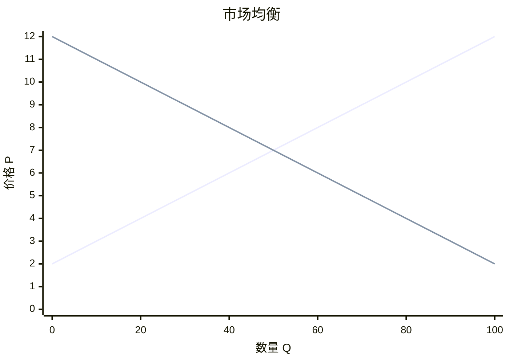
```mermaid
xychart-beta
    title "市场均衡"
    x-axis "数量 Q" [0, 20, 40, 60, 80, 100]
    y-axis "价格 P" 0 --> 12
    line [2, 4, 6, 8, 10, 12]
    line [12, 10, 8, 6, 4, 2]
```

**图形解释**：
- S：供给曲线，向右上方倾斜
- D：需求曲线，向右下方倾斜
- E：均衡点，P* = 8，Q* = 60
- P轴：价格
- Q轴：数量

### 2. 需求变动的影响

```mermaid
xychart-beta
    title "需求变动对均衡的影响"
    x-axis "数量 Q" [0, 30, 60, 90]
    y-axis "价格 P" 0 --> 12
    line [2, 5, 8, 11]
    line [10, 8, 6, 5]
    line [8, 10, 12, 14]
```

**图形解释**：
- D1：初始需求曲线
- D2：需求增加后的需求曲线（向右移动）
- E1：初始均衡点
- E2：需求增加后的均衡点
- 均衡价格从8上升到约7
- 均衡数量从60增加到约70

### 3. 供给变动的影响

```mermaid
xychart-beta
    title "供给变动对均衡的影响"
    x-axis "数量 Q" [0, 30, 60, 90]
    y-axis "价格 P" 0 --> 12
    line [12, 10, 8, 6]
    line [12, 9, 6, 4]
    line [2, 4, 6, 8]
```

**图形解释**：
- S1：初始供给曲线
- S2：供给增加后的供给曲线（向右移动）
- E1：初始均衡点
- E2：供给增加后的均衡点
- 均衡价格从8下降到约6
- 均衡数量从60增加到约80

### 4. 最高限价的影响

```mermaid
xychart-beta
    title "最高限价分析"
    x-axis "数量 Q" [0, 30, 60, 90]
    y-axis "价格 P" 0 --> 12
    line [2, 4, 6, 8]
    line [12, 9, 6, 3]
```

**图形解释**：
- P* = 8：均衡价格
- Pc = 6：最高限价
- Qs：在限价下的供给量
- Qd：在限价下的需求量
- 短缺 = Qd - Qs
- 无谓损失：阴影三角形

### 5. 最低限价的影响

```mermaid
xychart-beta
    title "最低限价分析"
    x-axis "数量 Q" [0, 30, 60, 90]
    y-axis "价格 P" 0 --> 12
    line [2, 4, 6, 8]
    line [12, 10, 8, 6]
```

**图形解释**：
- P* = 8：均衡价格
- Pf = 10：最低限价
- Qd：在限价下的需求量
- Qs：在限价下的供给量
- 过剩 = Qs - Qd
- 无谓损失：阴影三角形

### 6. 税收的影响

```mermaid
xychart-beta
    title "税收影响分析"
    x-axis "数量 Q" [0, 30, 60, 90]
    y-axis "价格 P" 0 --> 12
    line [2, 4, 6, 8]
    line [12, 9, 6, 3]
    line [14, 11, 8, 5]
```

**图形解释**：
- S：初始供给曲线
- S'：税后供给曲线（向上移动t单位）
- P*：税前均衡价格
- Pc：税后消费者支付的价格
- Pp：税后生产者收到的价格
- Q*：税前均衡数量
- Q**：税后均衡数量
- 税收楔子：Pc - Pp = t
- 无谓损失：阴影三角形

### 7. 不同弹性下的税收归宿

**情形1：需求完全无弹性（|Ed| = 0）**
```mermaid
xychart-beta
    title "税收归宿 - 需求完全无弹性"
    x-axis "数量 Q" [0, 20, 40, 60]
    y-axis "价格 P" 0 --> 12
    line [2, 4, 6, 8]
    line [6, 8, 10, 12]
```

消费者承担全部税收。

**情形2：供给完全无弹性（Es = 0）**

```mermaid
xychart-beta
    title "税收归宿 - 供给完全无弹性"
    x-axis "数量 Q" [0, 20, 40, 60]
    y-axis "价格 P" 0 --> 12
    line [4, 6, 8, 10]
    line [6, 8, 10, 12]
```

生产者承担全部税收。

**情形3：需求富有弹性（|Ed| > Es）**

```mermaid
xychart-beta
    title "税收归宿 - 需求富有弹性"
    x-axis "数量 Q" [0, 30, 60, 90]
    y-axis "价格 P" 0 --> 12
    line [2, 4, 6, 8]
    line [12, 9, 6, 3]
    line [14, 11, 8, 5]
```

生产者承担较多税收。

**情形4：供给富有弹性（Es > |Ed|）**
```mermaid
xychart-beta
    title "税收归宿 - 供给富有弹性"
    x-axis "数量 Q" [0, 30, 60, 90]
    y-axis "价格 P" 0 --> 12
    line [2, 4, 6, 8]
    line [10, 8, 6, 4]
    line [12, 10, 8, 6]
```

消费者承担较多税收。

```mermaid
xychart-beta
    title "税收归宿 - 供给富有弹性"
    x-axis "数量 Q" [0, 30, 60, 90]
    y-axis "价格 P" 0 --> 12
    line [2, 4, 6, 8]
    line [12, 10, 8, 6]
    line [14, 12, 10, 8]
```

## 实际应用案例

### 案例1：农产品市场的供给和需求分析

**问题**：某地区小麦市场的供给函数为Qs = 10 + 2P，需求函数为Qd = 100 - 3P。政府决定对小麦征收每单位5元的从量税。分析税收的影响和归宿。

**分析**：

**1. 税前均衡**：
```
Qs = Qd
10 + 2P = 100 - 3P
5P = 90
P* = 18
Q* = 10 + 2×18 = 46
```

**2. 税后均衡（对消费者征税）**：
```
税后供给函数：Qs = 10 + 2(P - 5) = 10 + 2P - 10 = 2P
需求函数：Qd = 100 - 3P

税后均衡：2P = 100 - 3P
5P = 100
P** = 20（消费者支付的价格）
Q** = 2×20 = 40

生产者收到的价格：P_p = 20 - 5 = 15
```

**3. 税收影响**：
```
均衡数量变化：ΔQ = 40 - 46 = -6（减少6单位）
消费者支付的价格变化：ΔP_c = 20 - 18 = +2（增加2元）
生产者收到的价格变化：ΔP_p = 15 - 18 = -3（减少3元）

税收收入：TR = t × Q** = 5 × 40 = 200元
无谓损失：DWL = 0.5 × t × (Q* - Q**) = 0.5 × 5 × 6 = 15元
```

**4. 税收归宿**：
```
消费者承担：P_c** - P* = 20 - 18 = 2元
生产者承担：P* - P_p** = 18 - 15 = 3元
税收总额：5元

消费者承担比例：2/5 = 40%
生产者承担比例：3/5 = 60%
```

**5. 弹性分析**：
```
在均衡点P* = 18, Q* = 46：
需求弹性：Ed = (dQ/dP) × (P/Q) = -3 × (18/46) = -54/46 ≈ -1.17
供给弹性：Es = (dQ/dP) × (P/Q) = 2 × (18/46) = 36/46 ≈ 0.78

|Ed| ≈ 1.17 > Es ≈ 0.78
需求弹性大于供给弹性
因此消费者承担较少税收（40%），生产者承担较多税收（60%）✓
```

**结论**：
1. 税收导致均衡数量减少6单位
2. 消费者价格上升2元，生产者价格下降3元
3. 消费者承担40%税收，生产者承担60%税收
4. 税收收入200元，无谓损失15元
5. 生产者承担较多税收是因为需求相对富有弹性

### 案例2：最低工资的经济学分析

**问题**：某城市的劳动市场需求函数为Ld = 100 - 2W，供给函数为Ls = 20 + 4W。政府设定最低工资为20元/小时。分析最低工资的影响。

**分析**：

**1. 市场均衡（无最低工资）**：
```
Ld = Ls
100 - 2W = 20 + 4W
80 = 6W
W* = 13.33元/小时
L* = 100 - 2×13.33 = 73.34（百万小时）
```

**2. 最低工资的影响**：
```
最低工资：W_min = 20元 > W* = 13.33元

在W = 20时：
需求量：Ld = 100 - 2×20 = 60（百万小时）
供给量：Ls = 20 + 4×20 = 100（百万小时）

失业：Ls - Ld = 100 - 60 = 40（百万小时）
```

**3. 弹性分析**：
```
在W* = 13.33, L* = 73.34时：
需求弹性：Ed = (dL/dW) × (W/L) = -2 × (13.33/73.34) ≈ -0.36
供给弹性：Es = (dL/dW) × (W/L) = 4 × (13.33/73.34) ≈ 0.73

|Ed| ≈ 0.36 < Es ≈ 0.73
劳动需求缺乏弹性，劳动供给相对富有弹性
```

**4. 收入变化分析**：
```
均衡时的总工资收入：
TR* = W* × L* = 13.33 × 73.34 ≈ 977.8（百万元）

最低工资下的总工资收入：
TR_min = W_min × Ld = 20 × 60 = 1200（百万元）

收入增加：ΔTR = 1200 - 977.8 = 222.2（百万元）
但这是有就业者的收入，失业者损失收入
```

**5. 无谓损失**：
```
DWL = 0.5 × (W_min - W*) × (L* - Ld)
   = 0.5 × (20 - 13.33) × (73.34 - 60)
   = 0.5 × 6.67 × 13.34
   ≈ 44.5（百万元）
```

**6. 谁受益谁受损**：
```
受益者：
- 就业者：工资从13.33元增加到20元
- 就业人数：60百万小时

受损者：
- 失业者：40百万小时的劳动力失业
- 企业：劳动力成本上升
- 社会整体：无谓损失44.5百万元
```

**结论**：
1. 最低工资导致失业40百万小时
2. 就业者工资提高，但失业者失去工作
3. 总工资收入增加，但存在失业损失
4. 无谓损失44.5百万元
5. 政策权衡：提高工资 vs. 增加失业

### 案例3：价格上限的经济学分析

**问题**：某城市房租市场的供给函数为Qs = 50 + 0.5P，需求函数为Qd = 200 - P。政府设定房租上限为80元/月。分析房租上限的影响。

**分析**：

**1. 市场均衡（无价格上限）**：
```
Qs = Qd
50 + 0.5P = 200 - P
1.5P = 150
P* = 100元/月
Q* = 200 - 100 = 100（千套）
```

**2. 房租上限的影响**：
```
房租上限：P_ceil = 80元 < P* = 100元

在P = 80时：
需求量：Qd = 200 - 80 = 120（千套）
供给量：Qs = 50 + 0.5×80 = 90（千套）

短缺：Qd - Qs = 120 - 90 = 30（千套）
```

**3. 弹性分析**：
```
在P* = 100, Q* = 100时：
需求弹性：Ed = (dQ/dP) × (P/Q) = -1 × (100/100) = -1
供给弹性：Es = (dQ/dP) × (P/Q) = 0.5 × (100/100) = 0.5

|Ed| = 1 = 单位弹性
Es = 0.5 < 1，供给缺乏弹性
```

**4. 无谓损失**：
```
DWL = 0.5 × (P* - P_ceil) × (Q* - Q_ceil)
   = 0.5 × (100 - 80) × (100 - 90)
   = 0.5 × 20 × 10
   = 100（千套月）
```

**5. 黑市分析**：
```
黑市价格：P_black > P_ceil
黑市供给：从Qs = 90减少
黑市需求：从Qd = 120减少

可能的黑市价格范围：
80 < P_black < 100
```

**6. 配给机制**：
```
由于短缺30千套，需要配给：
可能的配给方式：
- 先到先得
- 排队
- 优先照顾低收入家庭
- 抽签
- 贿赂和关系
```

**7. 长期影响**：
```
供给的长期弹性大于短期弹性
房东可能会：
- 减少维护和修缮
- 转为商业用途
- 停止建设新房
- 退出租赁市场

长期供给曲线可能更加陡峭或向左移动
```

**结论**：
1. 房租上限导致短缺30千套
2. 租金下降，但供给不足
3. 无谓损失100千套月
4. 可能产生黑市
5. 长期可能加剧供给短缺
6. 政策权衡：降低房租 vs. 供给短缺

### 案例4：弹性与总收益的关系

**问题**：某产品的需求函数为Qd = 100 - 5P。分析不同价格水平下的弹性变化和总收益变化。

**分析**：

**1. 弹性计算**：
```
需求函数：Qd = 100 - 5P
dQ/dP = -5
Ed = (dQ/dP) × (P/Q) = -5 × (P/Q) = -5P/(100 - 5P)

不同价格水平下的弹性：

P = 5时：Q = 100 - 5×5 = 75
Ed = -5 × 5/75 = -25/75 = -0.33（缺乏弹性）

P = 10时：Q = 100 - 5×10 = 50
Ed = -5 × 10/50 = -50/50 = -1（单位弹性）

P = 15时：Q = 100 - 5×15 = 25
Ed = -5 × 15/25 = -75/25 = -3（富有弹性）
```

**2. 总收益计算**：
```
总收益：TR = P × Q = P × (100 - 5P) = 100P - 5P²

不同价格水平下的总收益：

P = 5时：TR = 5 × 75 = 375
P = 10时：TR = 10 × 50 = 500
P = 15时：TR = 15 × 25 = 375

最优价格：d(TR)/dP = 100 - 10P = 0
P* = 10（对应Ed = -1）
TR_max = 500
```

**3. 边际收益计算**：
```
边际收益：MR = d(TR)/dQ = d(100P - 5P²)/dQ

因为Q = 100 - 5P，P = (100 - Q)/5
TR = P × Q = (100 - Q)Q/5 = 20Q - Q²/5
MR = 20 - 2Q/5

在Q = 50（P = 10）时：
MR = 20 - 2×50/5 = 20 - 20 = 0
```

**4. 弹性与总收益的关系验证**：
```
价格从5增加到10（|Ed|从0.33增加到1）：
价格增加100%，需求量减少33.3%（75→50）
总收益从375增加到500

价格从10增加到15（|Ed|从1增加到3）：
价格增加50%，需求量减少50%（50→25）
总收益从500减少到375

验证了：
当 |Ed| < 1 时，价格上升，总收益上升
当 |Ed| = 1 时，价格变化，总收益不变
当 |Ed| > 1 时，价格上升，总收益下降
```

**5. 图形分析**：
```mermaid
xychart-beta
    title "总收益曲线 TR"
    x-axis "数量 Q" [0, 25, 50, 75, 100]
    y-axis "总收益 TR" 0 --> 600
    line [0, 250, 500, 375, 0]
```

**结论**：
1. 在价格较低时（P < 10），需求缺乏弹性，价格上升增加总收益
2. 在价格等于10时，需求单位弹性，总收益达到最大
3. 在价格较高时（P > 10），需求富有弹性，价格上升减少总收益
4. 企业应在|Ed| = 1时定价，以实现总收益最大化
5. 但实际定价还需考虑成本因素（利润最大化条件：MR = MC）

### 案例5：交叉弹性与商品分类

**问题**：通过交叉弹性分析以下三组商品的关系：
1. 咖啡和茶
2. 汽车和汽油
3. 苹果和香蕉

数据：
咖啡价格从10元上升到12元，茶的需求量从100单位增加到120单位
汽车价格从10万元上升到12万元，汽油的需求量从100单位减少到80单位
苹果价格从5元上升到6元，香蕉的需求量从100单位保持100单位

**分析**：

**1. 咖啡和茶（替代品）**：
```
咖啡价格：ΔP_coffee = 12 - 10 = 2元
茶的需求量：ΔQ_tea = 120 - 100 = 20单位

交叉弹性：
Exy = (ΔQ_tea/Q_tea) / (ΔP_coffee/P_coffee)
    = (20/100) / (2/10)
    = 0.2 / 0.2
    = 1

Exy = 1 > 0，咖啡和茶是替代品
Exy = 1 表示咖啡价格上升1%，茶需求量上升1%
```

**2. 汽车和汽油（互补品）**：
```
汽车价格：ΔP_car = 12 - 10 = 2万元
汽油的需求量：ΔQ_gas = 80 - 100 = -20单位

交叉弹性：
Exy = (ΔQ_gas/Q_gas) / (ΔP_car/P_car)
    = (-20/100) / (2/10)
    = -0.2 / 0.2
    = -1

Exy = -1 < 0，汽车和汽油是互补品
Exy = -1 表示汽车价格上升1%，汽油需求量下降1%
```

**3. 苹果和香蕉（无关商品）**：
```
苹果价格：ΔP_apple = 6 - 5 = 1元
香蕉的需求量：ΔQ_banana = 100 - 100 = 0单位

交叉弹性：
Exy = (ΔQ_banana/Q_banana) / (ΔP_apple/P_apple)
    = (0/100) / (1/5)
    = 0

Exy = 0，苹果和香蕉是无关商品
苹果价格变化不影响香蕉需求
```

**经济含义**：
```
1. 咖啡和茶的Exy = 1
   - 强替代关系
   - 咖啡价格上涨会促使消费者转向茶
   - 企业定价策略：考虑竞争对手价格

2. 汽车和汽油的Exy = -1
   - 强互补关系
   - 汽车价格上涨会减少汽油需求
   - 加油站业绩与汽车销量相关

3. 苹果和香蕉的Exy = 0
   - 无关商品
   - 价格变化互不影响
   - 可独立定价
```

**商业应用**：
```
1. 咖啡店定价：
   - 考虑茶的价格
   - 差异化策略
   - 品牌建设降低替代性

2. 加油站选址：
   - 选择汽车销量高的地区
   - 汽车促销活动
   - 跨行业合作

3. 苹果和香蕉销售：
   - 可独立制定价格策略
   - 组合销售（水果篮）
   - 季节性调整
```

**结论**：
1. 交叉弹性是判断商品关系的重要工具
2. Exy > 0：替代品，数值越大替代性越强
3. Exy < 0：互补品，绝对值越大互补性越强
4. Exy = 0：无关商品
5. 交叉弹性对商业策略有重要指导意义

## 与其他主题的联系

### 1. 与经济学基础的联系

供给和需求是经济学基础概念的具体应用：
- 稀缺性通过价格机制得到体现
- 机会成本影响供给和需求决策
- 边际分析解释了供给和需求曲线的形状
- 效率标准用于评价市场均衡

### 2. 与消费者行为理论的联系

需求理论建立在消费者行为理论基础上：
- 需求曲线来自消费者的效用最大化
- 需求弹性与消费者偏好和预算约束相关
- 收入效应和替代效应解释了需求变动的机制
- 无差异曲线和预算线推导出需求曲线

### 3. 与生产者行为理论的联系

供给理论建立在生产者行为理论基础上：
- 供给曲线来自生产者的利润最大化
- 供给弹性与生产技术和成本结构相关
- 成本函数决定了供给曲线的形状
- 生产理论和成本理论推导出供给曲线

### 4. 与市场结构的联系

供给和需求分析是市场结构理论的基础：
- 完全竞争市场的供给和需求最符合理论模型
- 垄断市场的供给曲线不存在（厂商决定价格）
- 垄断竞争和寡头垄断需要更复杂的分析
- 市场效率通过供给和需求的均衡来评价

### 5. 与宏观经济学的联系

微观的供给和需求是宏观经济学的基础：
- 总需求和总供给是微观需求和供给的加总
- 价格水平的变化影响总需求和总供给
- 市场均衡分析用于理解宏观经济政策
- 弹性概念用于分析宏观政策的传导机制

## 总结和思考题

### 总结

供给和需求是经济学最核心的分析工具：

1. **核心概念**：
   - 需求定理：价格与需求量反方向变化
   - 供给定理：价格与供给量同方向变化
   - 市场均衡：供给等于需求的状态
   - 弹性理论：衡量敏感程度的重要工具

2. **市场机制**：
   - 价格机制自动调节供给和需求
   - 市场出清实现资源有效配置
   - 价格信号引导资源配置

3. **政策分析**：
   - 价格管制会产生短缺或过剩
   - 税收影响市场均衡和效率
   - 弹性决定政策效果和税收归宿

4. **实际应用**：
   - 农产品市场的波动分析
   - 最低工资政策的评估
   - 房租管制的影响
   - 企业定价策略

### 思考题

**基础题**：
1. 解释需求定理和供给定理，为什么需求曲线向右下方倾斜，供给曲线向右上方倾斜？
2. 什么是市场均衡？市场如何自动调整到均衡状态？
3. 解释需求量变动与需求变动的区别，供给量变动与供给变动的区别。
4. 什么是弹性？为什么需要计算弧弹性和点弹性？
5. 解释价格上限和价格下限的经济效果。

**中等题**：
6. 推导税收归宿的决定因素，为什么弹性越大，承担的税收越少？
7. 分析无谓损失的产生原因和影响因素。
8. 为什么蛛网模型有时稳定，有时不稳定？稳定性条件是什么？
9. 弹性与总收益有什么关系？企业如何利用弹性制定定价策略？
10. 比较短期和长期供给弹性的差异，原因是什么？

**高难题**：
11. 在什么情况下市场均衡不是帕累托最优？如何判断？
12. 税收的拉弗曲线说明了什么？如何确定最优税率？
13. 价格管制在什么情况下可能是合理的？如何权衡效率和公平？
14. 动态供给和需求模型如何解释市场的波动性？
15. 在数字经济中，传统供给和需求理论面临哪些挑战？

**应用题**：
16. 某产品的需求函数为Qd = 200 - 4P，供给函数为Qs = 50 + 6P。计算均衡价格和数量，并分析需求增加20%的影响。
17. 政府对某商品征收从量税t = 10，需求函数为Qd = 150 - 5P，供给函数为Qs = 30 + 5P。分析税收的影响和归宿。
18. 某城市设定最低工资为15元，劳动市场需求为Ld = 120 - 4W，供给为Ls = 40 + 2W。分析最低工资的影响。
19. 某产品的需求函数为Qd = 100 - 2P。计算不同价格水平下的弹性，并确定使总收益最大的价格。
20. 通过交叉弹性分析以下商品的关系：牛肉和猪肉、电影和爆米花、自行车和汽车。

### 进一步思考

1. **市场失灵**：在什么情况下市场机制不能有效配置资源？如何解决？

2. **信息不对称**：供给和需求理论假设信息完全，但现实中存在信息不对称。这对市场效率有什么影响？

3. **行为经济学**：现实中消费者的行为是否符合理性假设？这对需求理论有什么挑战？

4. **平台经济**：双边市场和网络效应如何改变传统的供给和需求分析？

5. **可持续发展**：如何在供给和需求分析中考虑环境因素和代际公平？

## 参考书目

1. 曼昆：《经济学原理》
2. 范里安：《微观经济学：现代观点》
3. 平狄克：《微观经济学》
4. 斯蒂格利茨：《经济学》
5. 萨缪尔森：《经济学》
6. 高鸿业：《西方经济学》

## 附录：关键公式汇总

### 1. 供给和需求函数
```
需求函数：Qd = a - bP
供给函数：Qs = c + dP
均衡条件：Qd = Qs
均衡价格：P* = (a - c)/(b + d)
均衡数量：Q* = (ad + bc)/(b + d)
```

### 2. 弹性公式
```
需求价格弹性（弧）：Ed = [(Q₂ - Q₁)(P₁ + P₂)] / [(P₂ - P₁)(Q₁ + Q₂)]
需求价格弹性（点）：Ed = (dQ/dP) × (P/Q)
供给价格弹性：Es = (ΔQ/Q) / (ΔP/P)
需求收入弹性：Ey = (ΔQ/Q) / (ΔI/I)
需求交叉弹性：Exy = (ΔQx/Qx) / (ΔPy/Py)
```

### 3. 税收分析
```
税后均衡：Q** = (a - c - t)/(b + d)
消费者支付：P_c** = a - bQ**
生产者收到：P_p** = c + dQ**
税收楔子：P_c** - P_p** = t
消费者承担：P_c** - P* = d × t/(b + d)
生产者承担：P* - P_p** = b × t/(b + d)
税收收入：TR = t × Q**
无谓损失：DWL = 0.5 × t × (Q* - Q**)
```

### 4. 价格管制
```
最高限价短缺：Qd - Qs = (a - bP_ceil) - (c + dP_ceil)
最低限价过剩：Qs - Qd = (c + dP_floor) - (a - bP_floor)
无谓损失：DWL = 0.5 × (P_ceil - P*) × (Q* - Q_ceil)
或：DWL = 0.5 × (P_floor - P*) × (Q* - Q_floor)
```

### 5. 弹性类型
```
|Ed| > 1：富有弹性
|Ed| = 1：单位弹性
|Ed| < 1：缺乏弹性
|Ed| = 0：完全无弹性
|Ed| = ∞：完全有弹性

Ey > 1：奢侈品
0 < Ey < 1：必需品
Ey < 0：低档商品

Exy > 0：替代品
Exy < 0：互补品
Exy = 0：无关商品
```

### 6. 总收益与弹性
```
总收益：TR = P × Q
边际收益：MR = d(TR)/dQ
Ed > -1（|Ed| < 1）：MR > 0，价格上升，TR上升
Ed = -1（|Ed| = 1）：MR = 0，TR最大
Ed < -1（|Ed| > 1）：MR < 0，价格上升，TR下降

最优价格：P* = (a - c)/(b + d)
最大总收益：P = a/(2b)（当Ed = -1时）
```