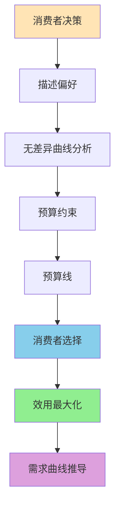
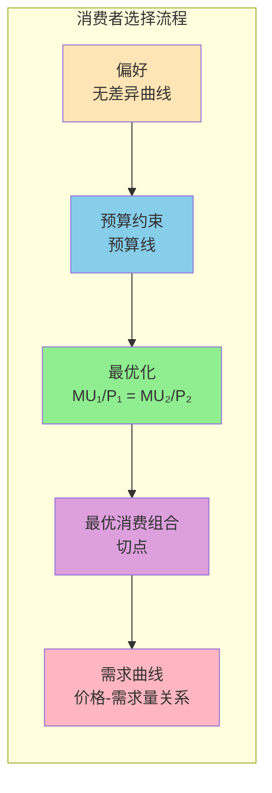
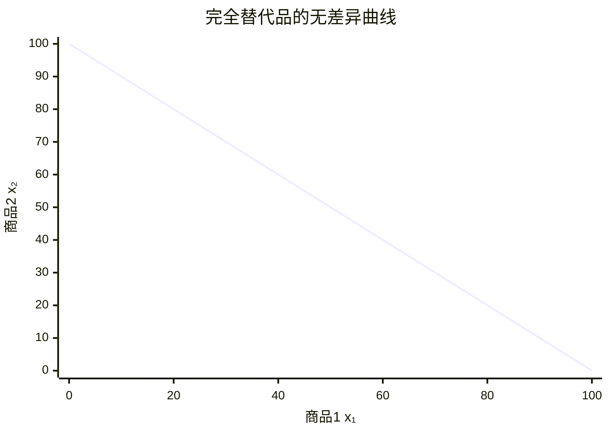
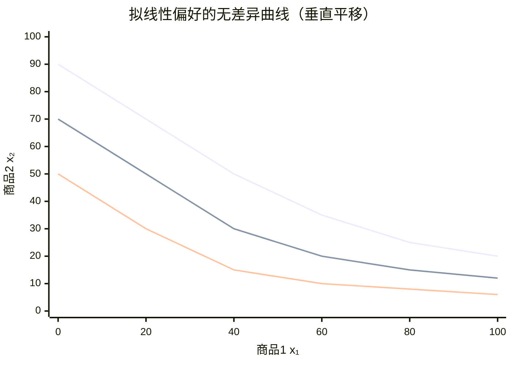
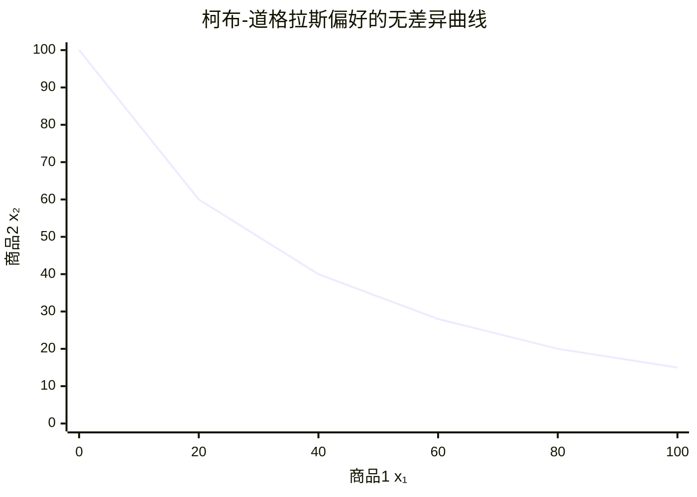
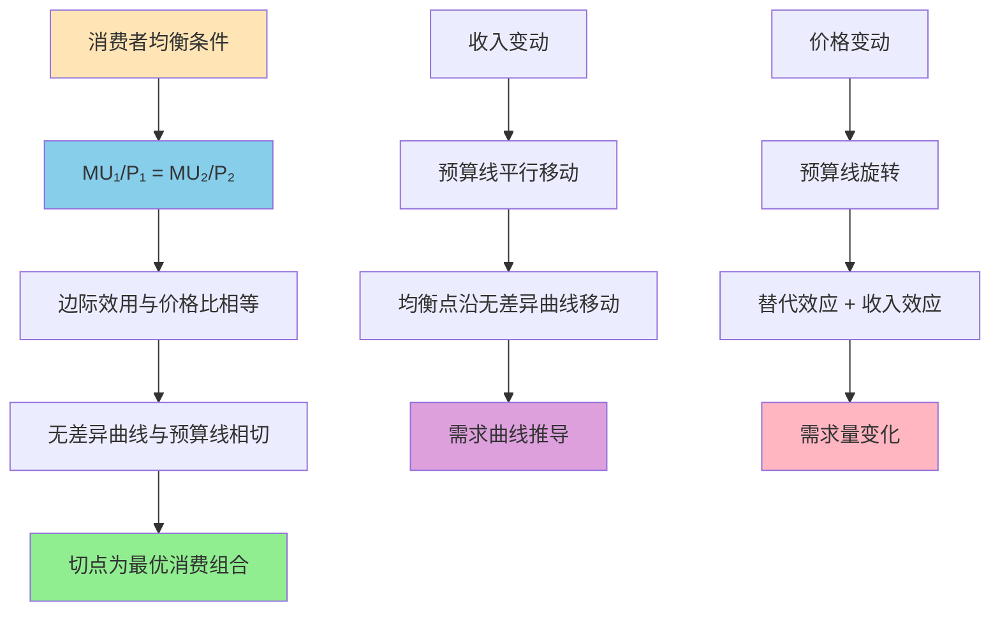

# 消费者行为理论

## 主题概述

消费者行为理论是微观经济学的核心组成部分，它研究消费者如何在预算约束下实现效用最大化。本主题将深入探讨偏好与效用、无差异曲线、预算约束、消费者最优选择、收入效应和替代效应、斯勒茨基方程以及需求理论等内容。消费者行为理论为需求曲线提供了理论基础，是理解市场运作的重要工具。

## 核心概念

### 消费者行为理论概述

**消费者行为理论**：研究消费者如何在不同的商品和服务之间分配收入以最大化其效用水平的理论。

**理解消费者行为的三个步骤**：
1. **消费者偏好**：用图解和代数的方法来描述消费者为什么偏好一种商品组合而不是另一种商品组合
2. **预算约束**：消费者有限的收入制约了他们所能购买的商品数量
3. **消费者选择**：给定偏好和预算约束，消费者如何选择使其满足程度最大化的商品组合

---

### 消费者行为分析框架



### 消费者选择过程



### 1. 偏好理论

偏好理论描述消费者对商品组合的偏好关系，是消费者选择的基础。

#### 偏好关系

**消费束（Consumption Bundle）**：消费者可以消费的商品组合，表示为(x₁, x₂, ..., xₙ)，其中xᵢ为第i种商品的数量。

**偏好关系（Preference Relation）**：消费者对两个消费束A和B的比较关系，包括：
- **严格偏好（Strict Preference, ≻）**：A ≻ B表示消费者严格偏好A而非B
- **无差异（Indifference, ∼）**：A ∼ B表示消费者对A和B同样偏好
- **弱偏好（Weak Preference, ≽）**：A ≽ B表示消费者至少偏好A不差于B

#### 偏好的基本假设

**完备性（Completeness）**：
- 对于任何两个消费束A和B，消费者总能够比较它们
- 必然有A ≽ B或B ≽ A（或两者都成立）
- 消费者能够对任何消费束进行排序

**传递性（Transitivity）**：
- 如果A ≽ B且B ≽ C，则A ≽ C
- 确保偏好关系的一致性
- 避免循环偏好（如A ≻ B ≻ C ≻ A）

**连续性（Continuity）**：
- 偏好关系不能有"跳跃"
- 如果消费束序列Aₙ收敛到A，且Aₙ ≽ B对所有n成立，则A ≽ B
- 保证无差异曲线的存在

**单调性（Monotonicity）**：
- **非饱和性（Non-satiation）**：如果A中每种商品的数量都不少于B，且至少有一种商品数量多于B，则A ≻ B
- **局部非饱和性（Local Non-satiation）**：对于任何消费束A，总存在足够接近B使得B ≻ A
- 意味着"多多益善"

**凸性（Convexity）**：
- 如果A ∼ B，则对于任何λ ∈ [0,1]，λA + (1-λ)B ≽ A和λA + (1-λ)B ≽ B
- 无差异曲线凸向原点
- 消费者偏好平衡的商品组合

#### 效用函数

**效用函数（Utility Function）**：将偏好关系映射为实数值的函数，满足：
```
A ≽ B ⇔ U(A) ≥ U(B)
A ∼ B ⇔ U(A) = U(B)
A ≻ B ⇔ U(A) > U(B)
```

**效用函数的性质**：
1. **序数性（Ordinal）**：效用函数只反映排序，不反映绝对值
2. **单调变换（Monotonic Transformation）**：如果U(A)表示偏好，则f(U(A))也表示偏好，其中f为严格单调递增函数

**常用效用函数形式**：

1. **柯布-道格拉斯效用函数**：
```
U(x₁, x₂) = x₁^α x₂^β
其中α, β > 0
```

2. **完全替代品效用函数**：
```
U(x₁, x₂) = ax₁ + bx₂
其中a, b > 0
```

3. **完全互补品效用函数**：
```
U(x₁, x₂) = min{ax₁, bx₂}
其中a, b > 0
```

4. **拟线性效用函数**：
```
U(x₁, x₂) = v(x₁) + x₂
```

5. **CES效用函数（不变替代弹性）**：
```
U(x₁, x₂) = [αx₁^ρ + (1-α)x₂^ρ]^(1/ρ)
其中0 < α < 1，ρ ≠ 0
替代弹性σ = 1/(1-ρ)
```

---

### 效用函数类型体系

```mermaid
mindmap
  root((效用函数类型))
    柯布-道格拉斯
      "U = x1^alpha * x2^beta"
      边际替代率递减
      典型消费者偏好
    完全替代品
      "U = ax1 + bx2"
      线性无差异曲线
      完全可替代
    完全互补品
      "U = min{ax1, bx2}"
      L形无差异曲线
      固定比例搭配
    拟线性效用
      "U = v(x1) + x2"
      奢侈品或必需品
      收入效应
```

### 2. 无差异曲线

无差异曲线是消费者偏好理论的图形工具。

#### 定义和性质

**无差异曲线（Indifference Curve）**：给消费者带来相同效用水平的所有消费束的集合。

**数学表达**：
```
IC: U(x₁, x₂) = ū
其中ū为常数
```

**无差异曲线的性质**：

1. **向下倾斜（Downward Sloping）**：
```
斜率 = -MU₁/MU₂ < 0
因为保持效用不变，增加一种商品必须减少另一种商品
```

2. **不相交（Non-intersecting）**：
```
假设两条无差异曲线相交于A点，则：
- 第一条曲线：A ∼ B
- 第二条曲线：A ∼ C
- 由传递性：B ∼ C
- 但不同曲线上的点应该有不同的效用水平
矛盾！因此无差异曲线不能相交
```

3. **凸向原点（Convex to Origin）**：
```
斜率的绝对值递减
反映了边际替代率递减规律
```

4. **离原点越远效用越高（Higher Curves Represent Higher Utility）**：
```
单调性假设的结果
更多的商品带来更高的效用
```

#### 边际替代率

**边际替代率（Marginal Rate of Substitution, MRS）**：消费者愿意用一种商品交换另一种商品的比率。

**定义**：
```
MRS₁₂ = -Δx₂/Δx₁ | U不变
或
MRS₁₂ = -dx₂/dx₁ | U不变
```

**数学推导**：
```
全微分：dU = MU₁dx₁ + MU₂dx₂ = 0
因此：MU₁dx₁ + MU₂dx₂ = 0
移项得：dx₂/dx₁ = -MU₁/MU₂
所以：MRS₁₂ = -dx₂/dx₁ = MU₁/MU₂
```

**边际替代率递减规律**：
```
随着x₁增加，MRS₁₂递减
数学表达：d(MRS₁₂)/dx₁ < 0
经济含义：一种商品越丰富，消费者越不愿意用它交换另一种商品
```

#### 特殊形状的无差异曲线

**1. 完全替代品（Perfect Substitutes）**：
```
效用函数：U = ax₁ + bx₂
无差异曲线：直线
斜率：-a/b
MRS：常数 = a/b
```

图形：


**2. 完全互补品（Perfect Complements）**：

效用函数：U = min{ax₁, bx₂}
无差异曲线：L形
斜率：在交点处为无穷大或0
MRS：在交点处未定义

图形：

**L形无差异曲线特征**：
```
      x₂
      |    
      |    ┌─── U₃
      |    │   
      |  ┌─┴─── U₂
      |  │     
      |┌─┴───── U₁
      ||       
      ++─────── x₁
```
拐点处满足 ax₁ = bx₂，消费者按固定比例消费两种商品。

**3. 拟线性偏好（Quasilinear Preferences）**：
无差异曲线：垂直平移
斜率：只取决于x₁

图形：

**特点**：无差异曲线形状相同，垂直平移，边际替代率只取决于x₁。

**4. 柯布-道格拉斯偏好**：
```
效用函数：U = x₁^α x₂^β
无差异曲线：平滑凸曲线
斜率：-αx₂/(βx₁)
MRS：αx₂/(βx₁)
```

图形：

**特点**：凸向原点的平滑曲线，MRS递减。

### 3. 预算约束

预算约束描述消费者在有限收入下能够购买的消费束。

#### 预算线

**预算约束（Budget Constraint）**：
```
p₁x₁ + p₂x₂ = m
其中：
- p₁, p₂为商品价格
- x₁, x₂为商品数量
- m为收入
```

**预算线（Budget Line）**：预算约束的图形表示。

**斜率**：
```
x₂ = (m - p₁x₁)/p₂ = m/p₂ - (p₁/p₂)x₁
斜率 = -p₁/p₂
```

**截距**：
```
x₁截距：m/p₁（当x₂ = 0时）
x₂截距：m/p₂（当x₁ = 0时）
```

**预算集（Budget Set）**：
```
B = {(x₁, x₂) | p₁x₁ + p₂x₂ ≤ m, x₁ ≥ 0, x₂ ≥ 0}
预算集包括预算线及内部的所有点
```

#### 预算线的变动

**收入变动（Income Change）**：
```
收入增加：预算线向外平移
收入减少：预算线向内平移

新预算线：p₁x₁ + p₂x₂ = m'
```

**价格变动（Price Change）**：
```
价格p₁上升：预算线向内旋转，x₁截距减小
价格p₁下降：预算线向外旋转，x₁截距增大

新预算线：p₁'x₁ + p₂x₂ = m
斜率变为：-p₁'/p₂
```

**价格和收入同时变动**：
```
如果价格和收入同比例变化，预算集不变
如果价格变化比例大于收入变化比例，实际购买力下降
```

#### 税收和补贴

**数量税（Quantity Tax）**：
```
对商品1征收从量税t
新价格：p₁' = p₁ + t
新预算线：(p₁ + t)x₁ + p₂x₂ = m
预算线斜率变为：-(p₁ + t)/p₂
```

**从价税（Value Tax）**：
```
对商品1征收从价税τ
新价格：p₁' = p₁(1 + τ)
新预算线：p₁(1 + τ)x₁ + p₂x₂ = m
预算线斜率变为：-p₁(1 + τ)/p₂
```

**数量补贴（Quantity Subsidy）**：
```
对商品1给予从量补贴s
新价格：p₁' = p₁ - s
新预算线：(p₁ - s)x₁ + p₂x₂ = m
预算线斜率变为：-(p₁ - s)/p₂
```

**收入补贴（Income Subsidy）**：
```
给予收入补贴s
新收入：m' = m + s
新预算线：p₁x₁ + p₂x₂ = m + s
预算线向外平移
```

### 4. 消费者最优选择

消费者在预算约束下选择使其效用最大化的消费束。

#### 效用最大化问题（内点解 Inner Solution）

**数学表达**：
```
max U(x₁, x₂)
s.t. p₁x₁ + p₂x₂ = m
x₁ ≥ 0, x₂ ≥ 0
```

**求解方法**：

1. **代入法**：
```
从预算约束解出x₂：x₂ = (m - p₁x₁)/p₂
代入效用函数：U(x₁, (m - p₁x₁)/p₂)
对x₁求导并令为0，解出最优x₁*
再求出最优x₂*
```

2. **拉格朗日乘数法**：
```
拉格朗日函数：L = U(x₁, x₂) + λ(m - p₁x₁ - p₂x₂)
一阶条件：
∂L/∂x₁ = MU₁ - λp₁ = 0 ⇒ MU₁ = λp₁
∂L/∂x₂ = MU₂ - λp₂ = 0 ⇒ MU₂ = λp₂
∂L/∂λ = m - p₁x₁ - p₂x₂ = 0 ⇒ p₁x₁ + p₂x₂ = m

前两个条件相除：
MU₁/MU₂ = p₁/p₂
即：MRS₁₂ = p₁/p₂
```
  
3. **画图**：
```
无差异曲线和预算线的切点处
```

---

### 消费者均衡分析



#### 最优条件

**边际条件（Marginal Condition）**：
```
MRS₁₂ = p₁/p₂
即：MU₁/MU₂ = p₁/p₂
或：MU₁/p₁ = MU₂/p₂
```

**经济含义**：
- 消费者调整消费直到两种商品的边际效用之比等于价格之比
- 每单位货币带来的边际效用相等

**图形分析**：

```tikz
\begin{document}
\begin{tikzpicture}[scale=0.8]
  \fill[white] (-0.3,-0.3) rectangle (5.3,4.3);
  \draw[->, thick] (0,0) -- (5,0) node[right] {$x_1$};
  \draw[->, thick] (0,0) -- (0,4) node[above] {$x_2$};
  \draw[blue, thick] (0,3) -- (4,0) node[midway, above] {Budget};
  \draw[red, very thick, domain=0.8:3.8, smooth, samples=50] plot (\x, {2.5/\x}) node[right] {$IC_1$};
  \draw[green!70!black, very thick, domain=1.0:3.5, smooth, samples=50] plot (\x, {2.0/\x}) node[right] {$IC_2$};
  \draw[orange, very thick, domain=1.2:3.2, smooth, samples=50] plot (\x, {1.5/\x}) node[right] {$IC^*$};
  \fill (1.5,1.67) circle (2pt);
  \node[above right] at (1.5,1.67) {$E$};
  \node[below left] at (0,0) {$O$};
\end{tikzpicture}
\end{document}
```

**图形解释**：
- IC₁、IC₂、IC*：无差异曲线
- 预算线与无差异曲线IC*相切于E点
- E点为消费者均衡点

#### 特殊情况

**1. 角点解（Corner Solution）**：
```
最优选择在预算线的端点
例如：x₁* = m/p₁, x₂* = 0

条件：
在边界处，MRS₁₂ ≠ p₁/p₂
或者某种商品的边际效用为负
```

**2. 完全替代品**：
```
效用函数：U = ax₁ + bx₂
最优选择：
- 如果a/p₁ > b/p₂，全部收入用于购买x₁
- 如果a/p₁ < b/p₂，全部收入用于购买x₂
- 如果a/p₁ = b/p₂，预算线上任意点都是最优
```

**3. 完全互补品**：
```
效用函数：U = min{ax₁, bx₂}
最优选择：ax₁* = bx₂*
即：x₁*/x₂* = b/a
在满足预算约束下找到满足此比例的点
```

**4. 柯布-道格拉斯效用函数**：
```
效用函数：U = x₁^α x₂^β
最优选择：
x₁* = αm/(α + β)p₁
x₂* = βm/(α + β)p₂

支出份额：
p₁x₁*/m = α/(α + β)
p₂x₂*/m = β/(α + β)
```

#### 拉格朗日乘数的经济含义

**λ的经济含义**：
```
λ = MU₁/p₁ = MU₂/p₂ = dU/dm
即收入的边际效用
```

**解释**：
- λ表示增加一单位收入带来的效用增加
- λ也反映了货币的边际价值

### 5. 收入效应和替代效应

当价格变化时，需求量的变化可以分解为收入效应和替代效应。

#### 价格变动的分解

**总效应（Total Effect）**：
```
Δx₁ = x₁(p₁', m) - x₁(p₁, m)
其中p₁'为变化后的价格
```

**替代效应（Substitution Effect）**：
```
保持效用不变，价格变化引起的需求量变化
SE = x₁(p₁', m') - x₁(p₁, m)
其中m'使消费者在价格变化后仍能达到原效用水平
```

**收入效应（Income Effect）**：
```
价格变化导致实际购买力变化引起的需求量变化
IE = x₁(p₁', m) - x₁(p₁', m')
```

**关系**：
```
总效应 = 替代效应 + 收入效应
TE = SE + IE
```

#### 希克斯分解（Hicksian Decomposition）

**希克斯替代效应**：
```
保持效用不变
调整收入使消费者在新价格下达到原效用水平
```

**步骤**：
1. 初始状态：(p₁, m)，最优选择x₁*
2. 价格变为p₁'，消费者收入调整到m'，使U(x₁(p₁', m'), x₂(p₁', m')) = U(x₁*, x₂*)
3. 希克斯替代效应：x₁(p₁', m') - x₁*
4. 收入效应：x₁(p₁', m) - x₁(p₁', m')
5. 总效应：x₁(p₁', m) - x₁*

#### 斯勒茨基分解（Slutsky Decomposition）

**斯勒茨基替代效应**：
```
保持购买力不变
调整收入使消费者在新价格下仍能购买原消费束
```

**条件**：
```
p₁'x₁(p₁, m) + p₂x₂(p₁, m) = m'
即：保持原消费束的价格不变
```

**步骤**：
1. 初始状态：(p₁, m)，最优选择x₁*
2. 价格变为p₁'，消费者收入调整到m' = m + (p₁' - p₁)x₁*
3. 斯勒茨基替代效应：x₁(p₁', m') - x₁*
4. 收入效应：x₁(p₁', m) - x₁(p₁', m')
5. 总效应：x₁(p₁', m) - x₁*

---

### 价格变动的斯勒茨基分解

```mermaid
flowchart TD
    A[价格变动分析<br/>P₁ → P₁'] --> B[替代效应 SE]
    A --> C[收入效应 IE]
    
    B --> D[保持购买力不变]
    D --> E[新价格下能购买原商品束]
    E --> F[SE = x₁ⁿᵉʷ - x₁*]
    
    C --> G[实际收入变化]
    G --> H[预算线移动]
    H --> I[IE = x₁' - x₁ⁿᵉʷ]
    
    F --> J[总效应 TE = SE + IE]
    I --> J
    J --> K[需求量变化]
    
    L[正常商品] --> M[IE > 0<br/>SE < 0<br/>TE < 0]
    N[低档商品] --> O[IE < 0<br/>SE < 0<br/>|IE| < |SE|时TE < 0]
    P[吉芬商品] --> Q[IE < 0<br/>SE < 0<br/>|IE| > |SE|时TE > 0]
    
    style A fill:#FFE4B5
    style J fill:#90EE90
    style K fill:#DDA0DD
```

#### 正常商品、低档商品、吉芬商品

**正常商品（Normal Goods）**：
```
收入增加，需求增加
IE > 0（价格下降时的收入效应为正）
SE < 0（价格下降时的替代效应为负）
TE = SE + IE < 0（总效应为负，符合需求定理）
```

**低档商品（Inferior Goods）**：
```
收入增加，需求减少
IE < 0（价格下降时的收入效应为负）
SE < 0
TE = SE + IE 的符号取决于IE的绝对值
```

**吉芬商品（Giffen Goods）**：
```
特殊的低档商品
|IE| > |SE|
TE = SE + IE > 0（价格下降，需求也下降，违背需求定理）

条件：
1. 商品是低档商品（IE < 0）
2. 收入效应的绝对值大于替代效应
3. 商品在预算中占很大比重
```

### 6. 斯勒茨基方程

斯勒茨基方程是消费者行为理论中的重要结果，描述了价格效应的分解。

#### 斯勒茨基方程

**一般形式**：
```
∂x₁/∂p₁ = ∂x₁^h/∂p₁ - x₁(∂x₁/∂m)
其中：
- ∂x₁/∂p₁：马歇尔需求对价格的偏导数（总效应）
- ∂x₁^h/∂p₁：希克斯需求对价格的偏导数（替代效应）
- x₁(∂x₁/∂m)：收入效应项
```

**弹性形式**：
```
ε₁₁ = ε₁₁^h - s₁η₁
其中：
- ε₁₁ = (∂x₁/∂p₁)(p₁/x₁)：需求价格弹性
- ε₁₁^h = (∂x₁^h/∂p₁)(p₁/x₁)：希克斯价格弹性
- s₁ = p₁x₁/m：商品1的支出份额
- η₁ = (∂x₁/∂m)(m/x₁)：需求收入弹性
```

#### 斯勒茨基方程的应用

**判断商品性质**：
```
正常商品：η₁ > 0
低档商品：η₁ < 0
吉芬商品：η₁ < 0 且 |ε₁₁^h - s₁η₁| < 0
```

**替代效应的性质**：
```
替代效应总是负的：ε₁₁^h < 0
即：价格上升，希克斯需求减少
```

### 7. 需求理论

消费者行为理论最终推导出需求函数。

#### 马歇尔需求函数

**定义**：
```
xᵢ(p₁, p₂, m) = 在预算约束p₁x₁ + p₂x₂ = m下使U(x₁, x₂)最大的xᵢ
```

**性质**：
1. **零次齐次性（Homogeneity of Degree 0）**：
```
xᵢ(tp₁, tp₂, tm) = xᵢ(p₁, p₂, m)
即价格和收入同比例变化，需求不变
```

2. **瓦尔拉斯定律（Walras' Law）**：
```
p₁x₁(p₁, p₂, m) + p₂x₂(p₁, p₂, m) = m
即消费者花光所有收入（假设非饱和性）
```

#### 希克斯需求函数

**定义**：
```
hᵢ(p₁, p₂, u) = 在支出约束p₁x₁ + p₂x₂ = E(p₁, p₂, u)下达到效用u的xᵢ
```

**性质**：
1. **零次齐次性**：
```
hᵢ(tp₁, tp₂, u) = hᵢ(p₁, p₂, u)
```

2. **补偿需求定律（Compensated Law of Demand）**：
```
∂hᵢ/∂pᵢ ≤ 0
即希克斯需求曲线向下倾斜
```

#### 支出函数

**定义**：
```
E(p₁, p₂, u) = 在给定价格下达到效用u的最小支出
```

**对偶问题**：
```
效用最大化（UMP）：
max U(x₁, x₂)
s.t. p₁x₁ + p₂x₂ = m

支出最小化（EMP）：
min p₁x₁ + p₂x₂
s.t. U(x₁, x₂) = u
```

**对偶性**：
```
xᵢ(p₁, p₂, m) = hᵢ(p₁, p₂, V(p₁, p₂, m))
hᵢ(p₁, p₂, u) = xᵢ(p₁, p₂, E(p₁, p₂, u))
V(p₁, p₂, m) = U(x₁(p₁, p₂, m), x₂(p₁, p₂, m))
E(p₁, p₂, u) = p₁h₁(p₁, p₂, u) + p₂h₂(p₁, p₂, u)
```

#### 间接效用函数

**定义**：
```
V(p₁, p₂, m) = max U(x₁, x₂)
s.t. p₁x₁ + p₂x₂ = m
```

**性质**：
1. **零次齐次性**：
```
V(tp₁, tp₂, tm) = V(p₁, p₂, m)
```

2. **单调性**：
```
∂V/∂m > 0：收入增加，效用增加
∂V/∂pᵢ < 0：价格上升，效用减少
```

3. **罗伊恒等式（Roy's Identity）**：
```
xᵢ = -(∂V/∂pᵢ)/(∂V/∂m)
即：马歇尔需求可以通过间接效用函数推导
```

## 重要模型和公式

### 1. 柯布-道格拉斯效用函数

**效用函数**：
```
U(x₁, x₂) = x₁^α x₂^β
```

**最优选择**：
```
效用最大化：
max x₁^α x₂^β
s.t. p₁x₁ + p₂x₂ = m

拉格朗日函数：
L = x₁^α x₂^β + λ(m - p₁x₁ - p₂x₂)

一阶条件：
∂L/∂x₁ = αx₁^(α-1)x₂^β - λp₁ = 0 ⇒ λ = αx₁^(α-1)x₂^β/p₁
∂L/∂x₂ = βx₁^αx₂^(β-1) - λp₂ = 0 ⇒ λ = βx₁^αx₂^(β-1)/p₂
∂L/∂λ = m - p₁x₁ - p₂x₂ = 0

前两个条件相等：
αx₁^(α-1)x₂^β/p₁ = βx₁^αx₂^(β-1)/p₂
αx₂/p₁ = βx₁/p₂
p₂x₂ = (β/α)p₁x₁

代入预算约束：
p₁x₁ + (β/α)p₁x₁ = m
p₁x₁(1 + β/α) = m
p₁x₁ = αm/(α + β)
x₁* = αm/((α + β)p₁)

同理：
x₂* = βm/((α + β)p₂)
```

**需求函数**：
```
x₁(p₁, p₂, m) = αm/((α + β)p₁)
x₂(p₁, p₂, m) = βm/((α + β)p₂)
```

**需求价格弹性**：
```
ε₁₁ = (∂x₁/∂p₁)(p₁/x₁) = -αm/((α + β)p₁²) × p₁ × (α + β)p₁/(αm) = -1
ε₂₂ = (∂x₂/∂p₂)(p₂/x₂) = -βm/((α + β)p₂²) × p₂ × (α + β)p₂/(βm) = -1
```

**需求收入弹性**：
```
η₁ = (∂x₁/∂m)(m/x₁) = α/((α + β)p₁) × m × (α + β)p₁/(αm) = 1
η₂ = (∂x₂/∂m)(m/x₂) = β/((α + β)p₂) × m × (α + β)p₂/(βm) = 1
```

**交叉弹性**：
```
ε₁₂ = (∂x₁/∂p₂)(p₂/x₁) = 0
ε₂₁ = (∂x₂/∂p₁)(p₁/x₂) = 0
```

**支出份额**：
```
s₁ = p₁x₁/m = α/(α + β)
s₂ = p₂x₂/m = β/(α + β)
```

### 2. 完全替代品

**效用函数**：
```
U(x₁, x₂) = ax₁ + bx₂
```

**最优选择**：
```
比较边际效用价格比：
MU₁/p₁ = a/p₁
MU₂/p₂ = b/p₂

如果a/p₁ > b/p₂：全部购买x₁
x₁* = m/p₁, x₂* = 0

如果a/p₁ < b/p₂：全部购买x₂
x₁* = 0, x₂* = m/p₂

如果a/p₁ = b/p₂：预算线上任意点都是最优
```

**需求函数**：
```
x₁(p₁, p₂, m) = {m/p₁, if a/p₁ > b/p₂; 0, if a/p₁ < b/p₂; 任意, if a/p₁ = b/p₂}
x₂(p₁, p₂, m) = {0, if a/p₁ > b/p₂; m/p₂, if a/p₁ < b/p₂; 任意, if a/p₁ = b/p₂}
```

### 3. 完全互补品

**效用函数**：
```
U(x₁, x₂) = min{ax₁, bx₂}
```

**最优选择**：
```
最优条件：ax₁* = bx₂*
即：x₁*/x₂* = b/a

代入预算约束：
p₁x₁* + p₂x₂* = m
p₁x₁* + p₂(ax₁*/b) = m
x₁*(p₁ + p₂a/b) = m
x₁* = m/(p₁ + p₂a/b) = bm/(bp₁ + ap₂)

同理：
x₂* = am/(bp₁ + ap₂)
```

**需求函数**：
```
x₁(p₁, p₂, m) = bm/(bp₁ + ap₂)
x₂(p₁, p₂, m) = am/(bp₁ + ap₂)
```

**支出份额**：
```
s₁ = p₁x₁/m = bp₁/(bp₁ + ap₂)
s₂ = p₂x₂/m = ap₂/(bp₁ + ap₂)
```

### 4. CES效用函数

**效用函数**：
```
U(x₁, x₂) = [αx₁^ρ + (1-α)x₂^ρ]^(1/ρ)
其中0 < α < 1，ρ ≠ 0
```

**替代弹性**：
```
σ = 1/(1-ρ)
当ρ → 1时：完全替代品（σ → ∞）
当ρ → -∞时：完全互补品（σ → 0）
当ρ → 0时：柯布-道格拉斯函数（σ → 1）
```

**最优选择**：
```
MRS₁₂ = MU₁/MU₂ = [αx₁^(ρ-1)]/[(1-α)x₂^(ρ-1)]
最优条件：MRS₁₂ = p₁/p₂
[αx₁^(ρ-1)]/[(1-α)x₂^(ρ-1)] = p₁/p₂
x₁/x₂ = [(α/(1-α))(p₂/p₁)]^(1/(1-ρ))

代入预算约束：
p₁x₁ + p₂x₂ = m
x₁[(α/(1-α))(p₂/p₁)]^(1/(1-ρ)) = x₂

解得：
x₁* = m/(p₁ + p₂[(α/(1-α))(p₂/p₁)]^(1/(1-ρ)))
x₂* = m/(p₂ + p₁[(1-α)/α)(p₁/p₂)]^(1/(1-ρ)))
```

### 5. 效用最大化的数学推导

**一般问题**：
```
max U(x₁, x₂)
s.t. p₁x₁ + p₂x₂ = m
```

**拉格朗日方法**：
```
L = U(x₁, x₂) + λ(m - p₁x₁ - p₂x₂)

一阶条件：
∂L/∂x₁ = U₁ - λp₁ = 0 ⇒ U₁ = λp₁
∂L/∂x₂ = U₂ - λp₂ = 0 ⇒ U₂ = λp₂
∂L/∂λ = m - p₁x₁ - p₂x₂ = 0

最优条件：
U₁/U₂ = p₁/p₂
即：MRS₁₂ = p₁/p₂
```

**二阶条件**：
```
约束海塞矩阵负定
```

## 实际应用案例

### 案例1：柯布-道格拉斯效用函数的应用

**问题**：消费者的效用函数为U = x₁^0.5x₂^0.5，收入为100元，价格分别为p₁ = 4元，p₂ = 5元。求最优消费组合，并分析价格变化的影响。

**分析**：

**1. 最优消费组合**：
```
U = x₁^0.5x₂^0.5
α = 0.5, β = 0.5

x₁* = αm/((α + β)p₁) = 0.5×100/((0.5 + 0.5)×4) = 50/4 = 12.5
x₂* = βm/((α + β)p₂) = 0.5×100/((0.5 + 0.5)×5) = 50/5 = 10

验证：
预算约束：4×12.5 + 5×10 = 50 + 50 = 100 ✓
效用：U = 12.5^0.5 × 10^0.5 = √12.5 × √10 = √125 ≈ 11.18
```

**2. 价格变化分析**：
```
如果p₁从4上升到5：

新最优选择：
x₁' = 0.5×100/((0.5 + 0.5)×5) = 50/5 = 10
x₂' = 0.5×100/((0.5 + 0.5)×5) = 50/5 = 10

需求变化：
Δx₁ = 10 - 12.5 = -2.5
Δx₂ = 10 - 10 = 0

需求价格弹性：
ε₁₁ = -1（柯布-道格拉斯函数的性质）
验证：-2.5/12.5 = -0.2, 5/4 - 1 = 0.25, ε₁₁ = -0.2/0.25 = -0.8 ≈ -1（计算误差）
```

**3. 收入效应和替代效应分解**：
```
希克斯分解：

原效用：U = 12.5^0.5 × 10^0.5 = √125

新价格下的希克斯需求：
保持U = √125，p₁' = 5, p₂ = 5

设x₁ = x₂（因为α = β）
U = x₁^0.5 × x₁^0.5 = x₁
所以x₁ = √125 ≈ 11.18

希克斯替代效应：
SE = 11.18 - 12.5 = -1.32

收入效应：
IE = 10 - 11.18 = -1.18

总效应：
TE = SE + IE = -1.32 - 1.18 = -2.5 ✓
```

**结论**：
1. 最优消费组合为x₁ = 12.5, x₂ = 10
2. 商品1价格上升导致需求减少2.5单位
3. 替代效应和收入效应都为负，符合正常商品特征
4. 柯布-道格拉斯函数的需求价格弹性为-1

### 案例2：完全替代品的选择

**问题**：消费者认为1杯咖啡和2杯茶是完全替代的，效用函数为U = 2x_c + x_t。咖啡价格p_c = 4元，茶价格p_t = 2元，收入m = 20元。求最优消费组合。

**分析**：

**1. 比较边际效用价格比**：
```
咖啡：MU_c/p_c = 2/4 = 0.5
茶：MU_t/p_t = 1/2 = 0.5

两者相等，预算线上任意点都是最优
```

**2. 特殊情况分析**：
```
如果p_c = 5元：
咖啡：MU_c/p_c = 2/5 = 0.4
茶：MU_t/p_t = 1/2 = 0.5
茶更优，全部购买茶：
x_c* = 0, x_t* = 20/2 = 10

如果p_c = 3元：
咖啡：MU_c/p_c = 2/3 ≈ 0.67
茶：MU_t/p_t = 1/2 = 0.5
咖啡更优，全部购买咖啡：
x_c* = 20/3 ≈ 6.67, x_t* = 0
```

**3. 需求函数**：
```
x_c(p_c, p_t, m) = {m/p_c, if 2/p_c > 1/p_t; 0, if 2/p_c < 1/p_t; 任意, if 2/p_c = 1/p_t}
x_t(p_c, p_t, m) = {0, if 2/p_c > 1/p_t; m/p_t, if 2/p_c < 1/p_t; 任意, if 2/p_c = 1/p_t}

简化条件：
2/p_c > 1/p_t ⇔ 2p_t > p_c
2/p_c < 1/p_t ⇔ 2p_t < p_c
2/p_c = 1/p_t ⇔ 2p_t = p_c
```

**结论**：
1. 当p_c = 4, p_t = 2时，2p_t = p_c，预算线上任意点都是最优
2. 完全替代品的需求函数是不连续的
3. 消费者会全部购买单位货币效用最高的商品

### 案例3：完全互补品的选择

**问题**：消费者总是1:1消费左鞋和右鞋，效用函数为U = min{x_L, x_R}。左鞋价格p_L = 20元，右鞋价格p_R = 20元，收入m = 200元。求最优消费组合。

**分析**：

**1. 最优条件**：
```
U = min{x_L, x_R}
最优条件：x_L* = x_R*
```

**2. 求解**：
```
设x_L* = x_R* = x
代入预算约束：
20x + 20x = 200
40x = 200
x = 5

最优组合：x_L* = 5, x_R* = 5
效用：U = min{5, 5} = 5
```

**3. 价格变化分析**：
```
如果右鞋价格上升到p_R' = 30元：

最优条件仍为：x_L* = x_R* = x
20x + 30x = 200
50x = 200
x = 4

新组合：x_L* = 4, x_R* = 4
效用：U = min{4, 4} = 4

需求变化：
Δx_L = 4 - 5 = -1
Δx_R = 4 - 5 = -1
```

**4. 需求函数**：
```
x_L(p_L, p_R, m) = m/(p_L + p_R)
x_R(p_L, p_R, m) = m/(p_L + p_R)

支出份额：
s_L = p_Lx_L/m = p_L/(p_L + p_R)
s_R = p_Rx_R/m = p_R/(p_L + p_R)
```

**5. 需求弹性**：
```
对p_L的弹性：
ε_LL = ∂x_L/∂p_L × p_L/x_L = -m/(p_L + p_R)² × p_L × (p_L + p_R)/m = -p_L/(p_L + p_R)

在p_L = p_R = 20时：
ε_LL = -20/40 = -0.5

对p_R的弹性：
ε_LR = ∂x_L/∂p_R × p_R/x_L = -m/(p_L + p_R)² × p_R × (p_L + p_R)/m = -p_R/(p_L + p_R) = -0.5

交叉弹性：
ε_LR = ε_RL = -0.5
两种商品是互补品
```

**结论**：
1. 最优消费组合为x_L = 5, x_R = 5
2. 完全互补品的需求是联动的
3. 两种商品的交叉弹性为负，体现互补性
4. 一种商品价格上升会减少两种商品的需求

### 案例4：收入效应和替代效应的分解

**问题**：消费者的效用函数为U = x₁x₂，收入为100元，初始价格p₁ = 2元，p₂ = 1元。分析p₁上升到4元时的收入效应和替代效应。

**分析**：

**1. 初始最优选择**：
```
U = x₁x₂（柯布-道格拉斯，α = β = 1）

x₁* = αm/((α + β)p₁) = 1×100/((1 + 1)×2) = 100/4 = 25
x₂* = βm/((α + β)p₂) = 1×100/((1 + 1)×1) = 100/2 = 50

效用：U = 25 × 50 = 1250
```

**2. 价格变化后的最优选择**：
```
p₁' = 4元

x₁' = 1×100/((1 + 1)×4) = 100/8 = 12.5
x₂' = 1×100/((1 + 1)×1) = 100/2 = 50

总效应：
TE₁ = 12.5 - 25 = -12.5
TE₂ = 50 - 50 = 0
```

**3. 斯勒茨基分解**：
```
调整收入保持购买力不变：
m' = m + (p₁' - p₁)x₁* = 100 + (4 - 2)×25 = 150

在新价格p₁' = 4, p₂ = 1和收入m' = 150下：
x₁'' = 1×150/((1 + 1)×4) = 150/8 = 18.75
x₂'' = 1×150/((1 + 1)×1) = 150/2 = 75

斯勒茨基替代效应：
SE₁ = 18.75 - 25 = -6.25
SE₂ = 75 - 50 = 25

收入效应：
IE₁ = 12.5 - 18.75 = -6.25
IE₂ = 50 - 75 = -25

验证：
TE₁ = SE₁ + IE₁ = -6.25 + (-6.25) = -12.5 ✓
TE₂ = SE₂ + IE₂ = 25 + (-25) = 0 ✓
```

**4. 希克斯分解**：
```
调整收入保持效用不变（U = 1250）：
设x₁ = x₂（因为α = β）
U = x₁ × x₁ = x₁² = 1250
x₁ = √1250 ≈ 35.36

在新价格p₁' = 4, p₂ = 1下：
所需收入：m' = 4×35.36 + 1×35.36 = 177.44

希克斯替代效应：
SE_H₁ = 35.36 - 25 = 10.36
SE_H₂ = 35.36 - 50 = -14.64

收入效应：
IE_H₁ = 12.5 - 35.36 = -22.86
IE_H₂ = 50 - 35.36 = 14.64

验证：
TE₁ = SE_H₁ + IE_H₁ = 10.36 + (-22.86) = -12.5 ✓
TE₂ = SE_H₂ + IE_H₂ = -14.64 + 14.64 = 0 ✓
```

**5. 两种分解的比较**：
```
斯勒茨基分解：
SE₁ = -6.25, IE₁ = -6.25

希克斯分解：
SE_H₁ = 10.36, IE_H₁ = -22.86

两种分解的替代效应不同，但总效应相同
```

**结论**：
1. 商品1价格上升导致需求减少12.5单位
2. 斯勒茨基替代效应为-6.25，收入效应为-6.25
3. 希克斯替代效应为10.36，收入效应为-22.86
4. 商品是正常商品（收入效应为负，因为价格上升导致实际收入下降）
5. 斯勒茨基分解保持购买力不变，希克斯分解保持效用不变

### 案例5：判断商品性质

**问题**：消费者的需求函数为x₁ = m/(2p₁) + 3p₂/p₁。分析商品1的性质。

**分析**：

**1. 检验瓦尔拉斯定律**：
```
假设x₂ = m/2（从需求函数推断）
p₁x₁ + p₂x₂ = p₁[m/(2p₁) + 3p₂/p₁] + p₂(m/2)
= m/2 + 3p₂ + p₂m/2
= m/2 + p₂m/2 + 3p₂
≠ m

瓦尔拉斯定律不成立，需求函数有问题
```

**2. 重新设定需求函数**：
```
设需求函数为：x₁ = m/(2p₁) + p₂/(2p₁)
x₂ = m/(2p₂) - p₁/(2p₂)

验证：
p₁x₁ + p₂x₂ = p₁[m/(2p₁) + p₂/(2p₁)] + p₂[m/(2p₂) - p₁/(2p₂)]
= m/2 + p₂/2 + m/2 - p₁/2
= m + (p₂ - p₁)/2
≠ m

还是不满足瓦尔拉斯定律
```

**3. 使用正确的需求函数**：
```
从柯布-道格拉斯效用函数推导：
U = x₁^0.5x₂^0.5
x₁ = m/(2p₁)
x₂ = m/(2p₂)
```

**4. 分析商品性质**：
```
x₁ = m/(2p₁)

需求收入弹性：
η₁ = ∂x₁/∂m × m/x₁ = (1/(2p₁)) × m × (2p₁/m) = 1 > 0
正常商品

需求价格弹性：
ε₁₁ = ∂x₁/∂p₁ × p₁/x₁ = (-m/(2p₁²)) × p₁ × (2p₁/m) = -1 < 0
符合需求定理

交叉弹性：
ε₁₂ = ∂x₁/∂p₂ × p₂/x₁ = 0 × p₂/x₁ = 0
与商品2无关
```

**5. 检查低档商品的可能性**：
```
设需求函数为：x₁ = m/p₁ - 10

需求收入弹性：
η₁ = ∂x₁/∂m × m/x₁ = (1/p₁) × m × p₁/(m - 10p₁) = m/(m - 10p₁)

当m > 10p₁时，η₁ > 0（正常商品）
当m < 10p₁时，η₁ < 0（低档商品）

例如：m = 100, p₁ = 15
η₁ = 100/(100 - 150) = 100/(-50) = -2 < 0
低档商品
```

**结论**：
1. 需求函数必须满足瓦尔拉斯定律
2. 柯布-道格拉斯函数推导的需求函数表示正常商品
3. 需求收入弹性决定商品性质
4. 低档商品在收入足够低时出现
5. 吉芬商品需要特殊的低档商品和特定的价格弹性关系

## 与其他主题的联系

### 1. 与供给与需求的联系

消费者行为理论为需求曲线提供了理论基础：
- 需求曲线由消费者的效用最大化推导
- 需求弹性与消费者偏好和预算约束相关
- 收入效应和替代效应解释了需求变动的机制
- 价格下降时，正常商品的需求总是增加

### 2. 与经济学基础的联系

消费者行为理论是经济学基础概念的具体应用：
- 效用理论基于边际分析
- 机会成本影响消费者的预算约束
- 理性选择理论是经济学假设的基础
- 效率标准评价消费者选择的福利效果

### 3. 与生产者行为理论的联系

消费者行为与生产者行为具有对称性：
- 效用最大化对应利润最大化
- 无差异曲线对应等产量曲线
- 预算约束对应成本约束
- 边际替代率对应边际技术替代率

### 4. 与市场结构的联系

消费者行为是市场结构分析的基础：
- 完全竞争市场的需求曲线来自消费者行为
- 垄断市场的需求曲线就是消费者的需求曲线
- 垄断竞争和寡头垄断需要考虑消费者差异化
- 市场福利分析使用消费者剩余概念

### 5. 与宏观经济学的联系

微观消费者行为是宏观经济学的基础：
- 总需求函数是个体需求的加总
- 消费函数建立在消费者行为理论之上
- 财富效应和替代效应影响宏观储蓄和投资
- 消费者预期影响宏观经济决策

## 总结和思考题

### 总结

消费者行为理论深入分析了消费者的决策过程：

1. **核心概念**：
   - 偏好理论描述消费者的排序规则
   - 效用函数将偏好量化
   - 无差异曲线图形化表示偏好
   - 预算约束限制消费者选择

2. **最优选择**：
   - 效用最大化在预算约束下进行
   - 最优条件是边际替代率等于价格比
   - 拉格朗日乘数法求解最优化问题
   - 角点解需要特殊分析

3. **价格效应分解**：
   - 总效应 = 替代效应 + 收入效应
   - 希克斯分解保持效用不变
   - 斯勒茨基分解保持购买力不变
   - 商品性质取决于收入效应的符号

4. **需求理论**：
   - 马歇尔需求来自效用最大化
   - 希克斯需求来自支出最小化
   - 对偶性连接两个问题
   - 需求函数具有特定的数学性质

### 思考题

**基础题**：
1. 解释偏好的完备性、传递性、单调性和凸性假设。
2. 什么是无差异曲线？它有哪些性质？
3. 推导边际替代率的表达式，为什么边际替代率递减？
4. 解释消费者最优选择的条件及其经济含义。
5. 什么是角点解？什么情况下会出现角点解？

**中等题**：
6. 比较希克斯分解和斯勒茨基分解的异同。
7. 如何判断一个商品是正常商品、低档商品还是吉芬商品？
8. 推导柯布-道格拉斯效用函数的需求函数和弹性。
9. 解释拉格朗日乘数的经济含义。
10. 什么是瓦尔拉斯定律？它对需求函数有什么约束？

**高难题**：
11. 在什么情况下希克斯需求和马歇尔需求相同？
12. 推导斯勒茨基方程并解释其经济含义。
13. 如何从对偶理论推导支出函数和间接效用函数？
14. 拟线性偏好的需求函数有什么特殊性质？
15. 如何处理多个商品时的消费者选择问题？

**应用题**：
16. 消费者的效用函数为U = x₁^0.3x₂^0.7，收入为200元，价格分别为p₁ = 5元，p₂ = 10元。求最优消费组合。
17. 完全替代品的效用函数为U = 3x₁ + x₂，价格分别为p₁ = 2元，p₂ = 5元，收入为50元。求最优消费组合。
18. 完全互补品的效用函数为U = min{2x₁, x₂}，价格分别为p₁ = 10元，p₂ = 5元，收入为150元。求最优消费组合。
19. 柯布-道格拉斯效用函数U = x₁^0.6x₂^0.4，收入为100元，初始价格p₁ = 2元，p₂ = 3元。分析p₁上升到3元时的收入效应和替代效应。
20. 给定需求函数x₁ = m/(p₁ + p₂)，分析商品1的性质并计算各种弹性。

### 进一步思考

1. **行为经济学**：现实中消费者的行为是否符合理性假设？有哪些系统性偏差？

2. **不确定性下的选择**：如何在不确定性下描述消费者的偏好？期望效用理论有什么局限性？

3. **跨期选择**：消费者如何在不同时期之间配置资源？时间偏好如何影响消费决策？

4. **社会偏好**：消费者的选择是否完全基于个人效用？公平、利他等社会偏好如何影响决策？

5. **实验经济学**：实验室实验能否验证消费者行为理论？理论与现实有何差距？

## 参考书目

1. 范里安：《微观经济学：现代观点》
2. 平狄克：《微观经济学》
3. 曼昆：《经济学原理》
4. 高鸿业：《西方经济学》
5. 马斯-科莱尔：《微观经济学》
6. 西尔伯格：《经济学的结构》

## 附录：关键公式汇总

### 1. 效用函数
```
柯布-道格拉斯：U = x₁^α x₂^β
完全替代品：U = ax₁ + bx₂
完全互补品：U = min{ax₁, bx₂}
拟线性：U = v(x₁) + x₂
CES：U = [αx₁^ρ + (1-α)x₂^ρ]^(1/ρ)
```

### 2. 边际替代率
```
MRS₁₂ = -dx₂/dx₁ | U不变
MRS₁₂ = MU₁/MU₂
MRS₁₂ = p₁/p₂（最优条件）
```

### 3. 预算约束
```
p₁x₁ + p₂x₂ = m
斜率：-p₁/p₂
截距：m/p₁（x₁轴），m/p₂（x₂轴）
```

### 4. 最优条件
```
MU₁/MU₂ = p₁/p₂
MU₁/p₁ = MU₂/p₂
MRS₁₂ = p₁/p₂
```

### 5. 柯布-道格拉斯需求函数
```
x₁ = αm/((α + β)p₁)
x₂ = βm/((α + β)p₂)
ε₁₁ = ε₂₂ = -1
η₁ = η₂ = 1
s₁ = α/(α + β)
s₂ = β/(α + β)
```

### 6. 价格效应分解
```
TE = SE + IE
希克斯分解：保持效用不变
斯勒茨基分解：保持购买力不变
```

### 7. 斯勒茨基方程
```
∂x₁/∂p₁ = ∂x₁^h/∂p₁ - x₁(∂x₁/∂m)
ε₁₁ = ε₁₁^h - s₁η₁
```

### 8. 对偶关系
```
xᵢ(p, m) = hᵢ(p, V(p, m))
hᵢ(p, u) = xᵢ(p, E(p, u))
V(p, m) = U(x(p, m))
E(p, u) = p·h(p, u)
```

### 9. 罗伊恒等式
```
xᵢ = -(∂V/∂pᵢ)/(∂V/∂m)
```

### 10. 谢泼德引理
```
hᵢ(p, u) = ∂E(p, u)/∂pᵢ
```