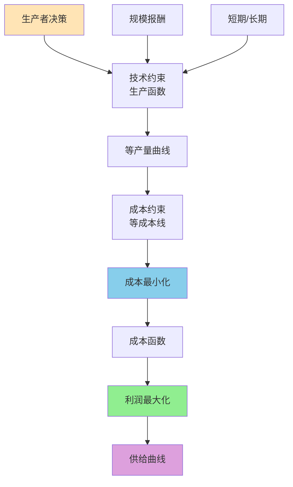
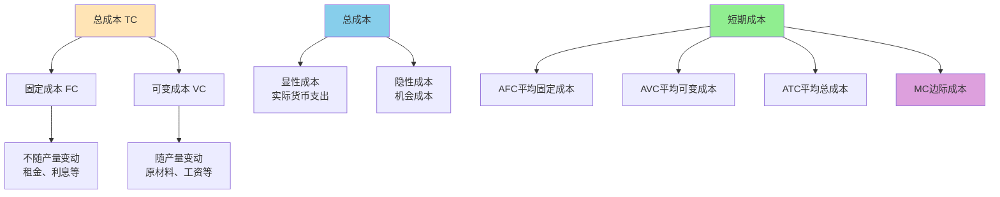
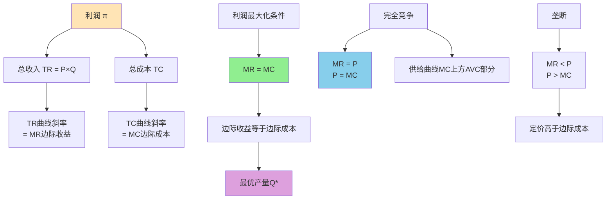

# 生产者行为理论

## 主题概述

生产者行为理论是微观经济学的重要组成部分，它研究生产者（企业）如何在技术和成本约束下实现利润最大化。本主题将深入探讨生产函数、等产量曲线、成本最小化、成本函数、利润最大化以及供给理论等内容。生产者行为理论为供给曲线提供了理论基础，是理解市场运作的另一重要工具。

---

### 生产者行为分析框架



### 核心概念

### 1. 生产函数

生产函数描述投入与产出之间的技术关系。

#### 生产函数的定义

**生产函数（Production Function）**：在给定技术水平下，生产要素投入组合与最大产出之间的关系。

**数学表达**：
```
Q = f(L, K)
其中：
- Q为产出
- L为劳动投入
- K为资本投入
```

**生产要素的类型**：
1. **固定要素（Fixed Inputs）**：短期内不能改变的要素
2. **可变要素（Variable Inputs）**：短期内可以改变的要素

#### 短期和长期

**短期（Short Run）**：至少有一种生产要素是固定的。

**长期（Long Run）**：所有生产要素都是可变的。

**生产函数的形式**：
```
短期生产函数：Q = f(L, K̄) = f(L)
长期生产函数：Q = f(L, K)
```

#### 总产量、平均产量和边际产量

**总产量（Total Product, TP）**：
```
TP_L = f(L, K̄)
TP_K = f(L̄, K)
```

**平均产量（Average Product, AP）**：
```
AP_L = TP_L/L = f(L, K̄)/L
AP_K = TP_K/K = f(L̄, K)/K
```

**边际产量（Marginal Product, MP）**：
```
MP_L = ∂Q/∂L
MP_K = ∂Q/∂K
```

#### 边际产量递减规律

**边际产量递减规律（Law of Diminishing Marginal Product）**：在技术水平和其他要素投入不变的情况下，连续增加一种可变要素的投入，其边际产量最终会递减。

**数学表达**：
```
∂²Q/∂L² < 0（当L超过某一点后）
```

**原因**：
1. 固定要素的限制
2. 要素间的配合比例失调
3. 管理效率下降

#### 生产函数的类型

**1. 固定比例生产函数（Leontief生产函数）**：
```
Q = min{L/a, K/b}
其中a, b为技术参数
```

**2. 完全替代生产函数**：
```
Q = aL + bK
其中a, b为技术参数
```

**3. 柯布-道格拉斯生产函数**：
```
Q = A L^α K^β
其中：
- A为技术水平
- α为劳动产出弹性
- β为资本产出弹性
```

**4. CES生产函数（不变替代弹性）**：
```
Q = A[αL^ρ + (1-α)K^ρ]^(γ/ρ)
其中：
- A为技术水平
- α为分配参数
- ρ为替代参数
- γ为规模报酬参数

替代弹性：σ = 1/(1-ρ)
```

#### 深入分析：柯布-道格拉斯生产函数

**柯布-道格拉斯生产函数（Cobb-Douglas Production Function）**是经济学中最常用的生产函数之一，由美国经济学家查尔斯·柯布（Charles Cobb）和保罗·道格拉斯（Paul Douglas）于1928年提出。

**基本性质**：

1. **边际产量**：
```
MP_L = ∂Q/∂L = αA L^(α-1) K^β = αQ/L
MP_K = ∂Q/∂K = βA L^α K^(β-1) = βQ/K
```
边际产量为正，但边际产量递减（当α < 1, β < 1时）。

2. **产出弹性**：
```
ε_L = ∂lnQ/∂lnL = α
ε_K = ∂lnQ/∂lnK = β
```
产出弹性是常数，等于相应的指数。

3. **边际技术替代率**：
```
MRTS_LK = MP_L/MP_K = (αQ/L)/(βQ/K) = αK/(βL)
```
边际技术替代率取决于要素投入的比例。

4. **替代弹性**：
```
σ = dln(K/L)/dln(MRTS_LK)
对于CD生产函数：σ = 1
```
CD生产函数的单位替代弹性意味着要素间的替代程度为1。

5. **规模报酬**：
```
f(tL, tK) = A(tL)^α(tK)^β = t^(α+β) A L^α K^β = t^(α+β) f(L, K)

规模报酬取决于α + β：
- α + β = 1：规模报酬不变（CRS）
- α + β > 1：规模报酬递增（IRS）
- α + β < 1：规模报酬递减（DRS）
```

**图形表示**：

```plotly
data:
  -
    type: scatter
    mode: lines
    name: 曲线 1
    x: [0, 20, 40, 60, 80, 100]
    y: [100, 70, 45, 28, 15, 8]
    line:
      color: "#1f77b4"
      width: 4
      shape: spline
  -
    type: scatter
    mode: lines
    name: 曲线 2
    x: [0, 20, 40, 60, 80, 100]
    y: [80, 55, 35, 20, 10, 5]
    line:
      color: "#d62728"
      width: 4
      shape: spline
layout:
  title:
    text: "等产量曲线（柯布-道格拉斯生产函数）"
  xaxis:
    title:
      text: "劳动 L"
  yaxis:
    title:
      text: "资本 K"
    range:
      - 0
      - 100
  template: "plotly_white"
  showlegend: true
config:
  displayModeBar: false
  responsive: true
```

**说明**：
- 等产量曲线凸向原点
- 离原点越远（Q1 > Q2），产量越高
- 曲线的斜率（绝对值）递减，体现边际技术替代率递减

**计量经济学估计**：

CD生产函数可以线性化，便于估计：
```
Q = A L^α K^β
lnQ = lnA + α lnL + β lnK

设y = lnQ, x1 = lnL, x2 = lnK, a = lnA
y = a + α x1 + β x2

可以使用普通最小二乘法（OLS）估计参数α和β
```

**实际应用**：

柯布-道格拉斯生产函数广泛应用于：
- 宏观经济学：研究经济增长和要素贡献
- 产业经济学：分析不同行业的生产技术
- 企业管理：优化要素投入组合
- 国际贸易：比较各国的生产效率

#### 深入分析：CES生产函数

**CES生产函数（Constant Elasticity of Substitution Production Function）**是柯布-道格拉斯生产函数的推广，允许替代弹性不为1。

**基本形式**：
```
Q = A[αL^ρ + (1-α)K^ρ]^(γ/ρ)
其中：
- A为技术水平参数（A > 0）
- α为分配参数（0 < α < 1）
- ρ为替代参数（ρ ≤ 1, ρ ≠ 0）
- γ为规模报酬参数（γ > 0）
```

**替代弹性**：
```
σ = 1/(1-ρ)

特殊情形：
- ρ → 1：σ → ∞，完全替代（线性生产函数）
- ρ → 0：σ → 1，柯布-道格拉斯生产函数
- ρ → -∞：σ → 0，完全互补（Leontief生产函数）
```

**与CD生产函数的关系**：

当ρ → 0时，CES生产函数收敛到CD生产函数：
```
lim[ρ→0] A[αL^ρ + (1-α)K^ρ]^(γ/ρ) = A L^(αγ) K^((1-α)γ)

证明：
令γ = 1（规模报酬不变）
使用洛必达法则和对数展开
```

**边际产量**：
```
MP_L = ∂Q/∂L = A × (γ/ρ) × [αL^ρ + (1-α)K^ρ]^(γ/ρ-1) × αρL^(ρ-1)
     = αγA × αL^ρ × [αL^ρ + (1-α)K^ρ]^(γ/ρ-1) × L^(ρ-1)
     = αγA × αL^(ρ-1) × [αL^ρ + (1-α)K^ρ]^(γ/ρ-1)

MP_K = ∂Q/∂K = A × (γ/ρ) × [αL^ρ + (1-α)K^ρ]^(γ/ρ-1) × (1-α)ρK^(ρ-1)
     = γA × (1-α)K^(ρ-1) × [αL^ρ + (1-α)K^ρ]^(γ/ρ-1)
```

**边际技术替代率**：
```
MRTS_LK = MP_L/MP_K = [αγ × αL^(ρ-1)] / [γ × (1-α)K^(ρ-1)]
         = [α/(1-α)] × (L/K)^(ρ-1)
         = [α/(1-α)] × (K/L)^(1-ρ)
```

**规模报酬**：
```
f(tL, tK) = A[α(tL)^ρ + (1-α)(tK)^ρ]^(γ/ρ)
          = A[t^ρ(αL^ρ + (1-α)K^ρ)]^(γ/ρ)
          = A × t^γ × [αL^ρ + (1-α)K^ρ]^(γ/ρ)
          = t^γ × f(L, K)

规模报酬取决于γ：
- γ = 1：规模报酬不变
- γ > 1：规模报酬递增
- γ < 1：规模报酬递减
```

**CES生产函数的优势**：

1. **灵活性**：通过参数ρ控制替代弹性，可以拟合不同行业的生产技术
2. **一般性**：包含了多种生产函数作为特例
3. **实证适用性**：更符合实际经济数据

#### 深入分析：里昂惕夫生产函数

**里昂惕夫生产函数（Leontief Production Function）**描述固定比例的生产技术，也称为固定投入比例生产函数。

**基本形式**：
```
Q = min{L/a, K/b}
其中：
- a为劳动生产率（单位劳动的产出）
- b为资本生产率（单位资本的产出）
```

**等产量曲线**：
```
里昂惕夫生产函数的等产量曲线是L形：
   K
   |    |
   |    |___
   |    |   |
   |____|___| L
   
说明：
- 要素完全互补，不能替代
- 最优投入点在折点处
- 偏离折点会导致要素浪费
```

**最优投入组合**：
```
给定产量Q，最优投入为：
L = aQ
K = bQ

要素比例为固定比例：
K/L = b/a
```

**边际产量**：
```
在最优投入点附近，边际产量未定义
因为要素投入必须按固定比例变化
```

**边际技术替代率**：
```
在折点处，MRTS_LK未定义
在垂直部分，MRTS_LK = ∞
在水平部分，MRTS_LK = 0
```

**应用场景**：

里昂惕夫生产函数适用于：
- 化工生产：原料必须按固定比例混合
- 建筑工程：钢筋和混凝土的比例固定
- 汽车制造：各种零部件的固定比例

#### 深入分析：超对数生产函数

**超对数生产函数（Translog Production Function）**是柯布-道格拉斯生产函数的二阶近似，允许产出弹性和替代弹性可变。

**基本形式**：
```
lnQ = a0 + aL lnL + aK lnK + 0.5bLL (lnL)^2 + 0.5bKK (lnK)^2 + bLK lnL lnK

其中：
- a0为常数项
- aL, aK为一次项参数
- bLL, bKK, bLK为二次项参数
```

**与CD生产函数的关系**：

当所有二次项参数为零时，超对数生产函数退化为CD生产函数：
```
lnQ = a0 + aL lnL + aK lnK
Q = e^(a0) × L^(aL) × K^(aK)
```

**产出弹性**：
```
ε_L = ∂lnQ/∂lnL = aL + bLL lnL + bLK lnK
ε_K = ∂lnQ/∂lnK = aK + bKK lnK + bLK lnL

产出弹性不再是常数，取决于要素投入量
```

**替代弹性**：
```
超对数生产函数的替代弹性是可变的，取决于要素投入量
```

**优势**：

1. **灵活性**：可以拟合各种形状的生产函数
2. **可检验性**：可以检验CD生产函数的假设（bLL = bKK = bLK = 0）
3. **实证适用性**：广泛应用于生产函数的实证研究

#### 深入分析：技术进步

**技术进步（Technical Progress）**改变生产函数，使给定投入组合能够生产更多产出。

**技术进步的类型**：

1. **希克斯中性技术进步（Hicks-Neutral Technical Progress）**：
```
Q = A(t) f(L, K)
技术进步系数A(t)独立于要素投入

特点：
- 等产量曲线向原点移动
- 保持要素比例不变
- 要素边际产量的比例不变
```

2. **索洛中性技术进步（Solow-Neutral Technical Progress）**：
```
Q = f(L, A(t)K)
技术进步增强资本

特点：
- 资本边际产量增加
- 劳动边际产量不变
- 倾向于资本密集型技术
```

3. **哈罗德中性技术进步（Harrod-Neutral Technical Progress）**：
```
Q = f(A(t)L, K)
技术进步增强劳动

特点：
- 劳动边际产量增加
- 资本边际产量不变
- 倾向于劳动密集型技术
```

4. **要素增强型技术进步（Factor-Augmenting Technical Progress）**：
```
Q = f(A_L(t)L, A_K(t)K)
技术进步同时增强劳动和资本

当A_L(t) = A_K(t)时，退化为希克斯中性
```

**技术进步率**：
```
希克斯中性技术进步率：
g_A = (dA/dt)/A

全要素生产率（TFP）增长率：
g_TFP = (dQ/dt)/Q - ε_L × (dL/dt)/L - ε_K × (dK/dt)/K
```

**技术进步的经济影响**：

1. **生产率提高**：给定投入可以生产更多产出
2. **成本下降**：单位产出成本降低
3. **要素需求变化**：技术进步偏向影响要素相对需求
4. **经济增长**：技术进步是长期经济增长的主要动力

### 2. 等产量曲线

等产量曲线是生产理论的图形工具。

#### 定义和性质

**等产量曲线（Isoquant）**：生产给定产量的所有投入组合的集合。

**数学表达**：
```
Q = f(L, K) = Q̄
其中Q̄为常数
```

**等产量曲线的性质**：

1. **向下倾斜（Downward Sloping）**：
```
斜率 = -MP_L/MP_K < 0
因为保持产出不变，增加一种要素必须减少另一种要素
```

2. **不相交（Non-intersecting）**：
```
如果两条等产量曲线相交，则交点对应两种不同的产出水平，矛盾
```

3. **凸向原点（Convex to Origin）**：
```
斜率的绝对值递减
反映了边际技术替代率递减规律
```

4. **离原点越远产量越高（Higher Curves Represent Higher Output）**：
```
非饱和性假设的结果
更多的要素投入带来更高的产出
```

#### 边际技术替代率

**边际技术替代率（Marginal Rate of Technical Substitution, MRTS）**：保持产出不变，一种要素可以替代另一种要素的比率。

**定义**：
```
MRTS_LK = -ΔK/ΔL | Q不变
或
MRTS_LK = -dK/dL | Q不变
```

**数学推导**：
```
全微分：dQ = MP_L dL + MP_K dK = 0
因此：MP_L dL + MP_K dK = 0
移项得：dK/dL = -MP_L/MP_K
所以：MRTS_LK = -dK/dL = MP_L/MP_K
```

**边际技术替代率递减规律**：
```
随着L增加，MRTS_LK递减
数学表达：d(MRTS_LK)/dL < 0
经济含义：一种要素越丰富，越不容易用它替代另一种要素
```

#### 特殊形状的等产量曲线

**1. 完全替代要素**：
```
生产函数：Q = aL + bK
等产量曲线：直线
斜率：-a/b
MRTS：常数 = a/b
```

```plotly
data:
  -
    type: scatter
    mode: lines
    name: 曲线 1
    x: [0, 20, 40, 60, 80, 100]
    y: [100, 80, 60, 40, 20, 0]
    line:
      color: "#1f77b4"
      width: 4
      shape: spline
layout:
  title:
    text: "完全替代要素的等产量曲线"
  xaxis:
    title:
      text: "劳动 L"
  yaxis:
    title:
      text: "资本 K"
    range:
      - 0
      - 100
  template: "plotly_white"
  showlegend: true
config:
  displayModeBar: false
  responsive: true
```
**特点**：等产量曲线为直线，MRTS为常数。

**2. 完全互补要素**：
```
生产函数：Q = min{L/a, K/b}
等产量曲线：L形
斜率：在折点处为无穷大或0
MRTS：在折点处未定义
```

**L形等产量曲线**：
```
      K
      |    
      |    ┌─── Q₃
      |    │   
      |  ┌─┴─── Q₂
      |  │     
      |┌─┴───── Q₁
      ||       
      ++─────── L
```
**特点**：折点处满足 L/a = K/b，要素按固定比例投入。

**3. 柯布-道格拉斯生产函数**：
```
生产函数：Q = A L^α K^β
等产量曲线：平滑凸曲线
斜率：-αK/(βL)
MRTS：αK/(βL)
```

```plotly
data:
  -
    type: scatter
    mode: lines
    name: Q3
    x: [0.6, 0.9, 1.2, 1.5, 2.0, 2.8, 3.6, 4.4]
    y: [4.667, 3.111, 2.333, 1.867, 1.4, 1.0, 0.778, 0.636]
    line:
      color: "#1f77b4"
      width: 4
      shape: spline
  -
    type: scatter
    mode: lines
    name: Q2
    x: [0.8, 1.1, 1.4, 1.8, 2.4, 3.2, 4.0]
    y: [2.75, 2.0, 1.571, 1.222, 0.917, 0.688, 0.55]
    line:
      color: "#2ca02c"
      width: 4
      shape: spline
  -
    type: scatter
    mode: lines
    name: Q1
    x: [1.0, 1.3, 1.7, 2.1, 2.6, 3.4, 4.2]
    y: [1.6, 1.231, 0.941, 0.762, 0.615, 0.471, 0.381]
    line:
      color: "#d62728"
      width: 4
      shape: spline
layout:
  xaxis:
    title:
      text: L
    range: [0, 4.8]
    zeroline: false
  yaxis:
    title:
      text: K
    range: [0, 4.8]
    zeroline: false
  showlegend: true
  legend:
    orientation: h
    x: 0.02
    y: 1.08
  margin:
    l: 60
    r: 20
    t: 50
    b: 50
  template: "plotly_white"
config:
  displayModeBar: false
  responsive: true
```
**特点**：凸向原点的平滑曲线，MRTS递减。

```plotly
data:
  -
    type: scatter
    mode: lines
    name: MP_L
    x: [0.5, 1.0, 1.5, 2.0, 2.5, 3.0, 3.5, 4.0]
    y: [0.86, 1.48, 1.90, 2.20, 2.36, 2.44, 2.46, 2.42]
    line:
      color: "#1f77b4"
      width: 4
      shape: spline
layout:
  xaxis:
    title:
      text: L
    range: [0, 4.2]
    zeroline: false
  yaxis:
    title:
      text: MP_L
    range: [0, 2.8]
    zeroline: false
  showlegend: false
  margin:
    l: 60
    r: 20
    t: 40
    b: 50
  template: "plotly_white"
config:
  displayModeBar: false
  responsive: true
```

### 3. 规模报酬

规模报酬分析所有要素按相同比例变化时产出的变化。

#### 规模报酬的类型

**规模报酬不变（Constant Returns to Scale, CRS）**：
```
f(tL, tK) = t f(L, K)
即所有要素投入增加t倍，产出也增加t倍
```

**规模报酬递增（Increasing Returns to Scale, IRS）**：
```
f(tL, tK) > t f(L, K)
即所有要素投入增加t倍，产出增加超过t倍
```

**规模报酬递减（Decreasing Returns to Scale, DRS）**：
```
f(tL, tK) < t f(L, K)
即所有要素投入增加t倍，产出增加不足t倍
```

#### 判断规模报酬的方法

**1. 柯布-道格拉斯生产函数**：
```
Q = A L^α K^β

规模报酬取决于α + β：
- α + β = 1：规模报酬不变
- α + β > 1：规模报酬递增
- α + β < 1：规模报酬递减
```

**2. 产出弹性法**：
```
规模报酬指数：ε = ε_L + ε_K
其中：
ε_L = ∂Q/∂L × L/Q（劳动产出弹性）
ε_K = ∂Q/∂K × K/Q（资本产出弹性）

- ε = 1：规模报酬不变
- ε > 1：规模报酬递增
- ε < 1：规模报酬递减
```

#### 规模报酬的来源

**规模报酬递增的原因**：
1. 专业化分工
2. 技术进步
3. 资源综合利用
4. 管理效率提高

**规模报酬递减的原因**：
1. 管理复杂性
2. 协调成本增加
3. 信息传递失真
4. 灵活性下降

### 4. 成本函数

成本函数描述生产成本与产出之间的关系。

---

### 成本分类体系



#### 成本的概念

**显性成本（Explicit Costs）**：需要实际支付的费用，如工资、租金、原材料费用等。

**隐性成本（Implicit Costs）**：不需要实际支付的机会成本，如企业所有者投入资本的机会成本。

**经济成本（Economic Cost）**：显性成本与隐性成本之和。

**机会成本（Opportunity Cost）**：将资源用于某种用途时放弃的最佳替代方案的价值。

#### 成本函数的类型

**短期成本函数（Short-run Cost Function）**：至少有一种要素是固定的。

**长期成本函数（Long-run Cost Function）**：所有要素都是可变的。

#### 短期成本函数

**固定成本（Fixed Cost, FC）**：
```
FC = r × K̄
其中r为资本价格，K̄为固定资本
```

**可变成本（Variable Cost, VC）**：
```
VC = w × L
其中w为劳动价格
```

**总成本（Total Cost, TC）**：
```
TC = FC + VC = r × K̄ + w × L
```

**平均固定成本（Average Fixed Cost, AFC）**：
```
AFC = FC/Q = rK̄/Q
```

**平均可变成本（Average Variable Cost, AVC）**：
```
AVC = VC/Q = wL/Q
```

**平均成本（Average Cost, AC）**：
```
AC = TC/Q = AFC + AVC = (FC + VC)/Q
```

**边际成本（Marginal Cost, MC）**：
```
MC = ∂TC/∂Q = ∂VC/∂Q（因为FC是常数）
```

#### 成本曲线的关系

**U形平均成本曲线**：
```
AC = AFC + AVC
AFC递减（因为FC/Q随Q增加而递减）
AVC先递减后递增（U形）
因此AC也是U形
```

**边际成本与平均成本的关系**：
```
当MC < AC时，AC递减
当MC > AC时，AC递增
当MC = AC时，AC达到最小值
```

```plotly
data:
  -
    type: scatter
    mode: lines
    name: MC
    x: [0.5, 1.0, 1.5, 2.0, 2.5, 3.0, 3.5, 4.0]
    y: [2.4, 1.8, 1.3, 1.0, 0.8, 0.7, 0.7, 0.8]
    line:
      color: "#d62728"
      width: 4
      shape: spline
  -
    type: scatter
    mode: lines
    name: AC
    x: [0.8, 1.3, 1.8, 2.3, 2.8, 3.3, 3.8, 4.3]
    y: [2.4, 1.8, 1.45, 1.25, 1.2, 1.24, 1.35, 1.55]
    line:
      color: "#1f77b4"
      width: 4
      shape: spline
  -
    type: scatter
    mode: lines
    name: AVC
    x: [0.6, 1.1, 1.6, 2.1, 2.6, 3.1, 3.6, 4.1]
    y: [1.6, 1.1, 0.85, 0.72, 0.66, 0.67, 0.76, 0.92]
    line:
      color: "#2ca02c"
      width: 4
      shape: spline
layout:
  xaxis:
    title:
      text: Q
    range: [0, 4.8]
    zeroline: false
  yaxis:
    title:
      text: Cost
    range: [0, 3.2]
    zeroline: false
  showlegend: true
  legend:
    orientation: h
    x: 0.02
    y: 1.08
  margin:
    l: 60
    r: 20
    t: 40
    b: 50
  template: "plotly_white"
config:
  displayModeBar: false
  responsive: true
```
**说明**：MC曲线从下方穿过AC和AVC曲线的最低点。

#### 长期成本函数

**长期总成本（Long-run Total Cost, LTC）**：
```
LTC = min_K,L {rK + wL | f(L, K) = Q}
```

**长期平均成本（Long-run Average Cost, LAC）**：
```
LAC = LTC/Q
```

**长期边际成本（Long-run Marginal Cost, LMC）**：
```
LMC = ∂LTC/∂Q
```

#### 深入分析：短期成本与长期成本的关系

**包络定理（Envelope Theorem）**：

长期平均成本曲线是短期平均成本曲线族的包络线，即对于每个产量水平，长期平均成本等于所有可能资本存量下的最低短期平均成本。

**数学表达**：
```
LAC(Q) = min_K̄ {SAC(Q, K̄)}

其中：
SAC(Q, K̄) = 短期平均成本函数
K̄为固定资本存量
```

**图形表示**：

```plotly
data:
  -
    type: scatter
    mode: lines
    name: LAC
    x: [0.5, 1.0, 1.5, 2.0, 2.5, 3.0, 3.5, 4.0]
    y: [2.03, 1.79, 1.61, 1.48, 1.41, 1.38, 1.39, 1.44]
    line:
      color: "#1f77b4"
      width: 4
      shape: spline
  -
    type: scatter
    mode: lines
    name: SAC1
    x: [0.8, 1.1, 1.4, 1.7, 2.0, 2.3, 2.6]
    y: [2.03, 1.88, 1.8, 1.78, 1.8, 1.88, 2.0]
    line:
      color: "#d62728"
      width: 3
      shape: spline
  -
    type: scatter
    mode: lines
    name: SAC2
    x: [1.5, 1.8, 2.1, 2.4, 2.7, 3.0, 3.3]
    y: [1.9, 1.68, 1.53, 1.45, 1.43, 1.47, 1.57]
    line:
      color: "#2ca02c"
      width: 3
      shape: spline
  -
    type: scatter
    mode: lines
    name: SAC3
    x: [2.2, 2.5, 2.8, 3.1, 3.4, 3.7, 4.0]
    y: [2.11, 1.89, 1.74, 1.68, 1.69, 1.77, 1.92]
    line:
      color: "#ff7f0e"
      width: 3
      shape: spline
layout:
  xaxis:
    title:
      text: Q
    range: [0, 4.6]
    zeroline: false
  yaxis:
    title:
      text: Cost
    range: [1.2, 2.4]
    zeroline: false
  showlegend: true
  legend:
    orientation: h
    x: 0.02
    y: 1.08
  margin:
    l: 60
    r: 20
    t: 40
    b: 50
  template: "plotly_white"
config:
  displayModeBar: false
  responsive: true
```

**说明**：
- LAC（蓝色）是所有SAC曲线的包络线
- LAC从下方与每个SAC相切
- 切点对应的产量是该资本存量下的最优产量

**包络线的性质**：

1. **LAC ≤ SAC**：对于任何产量和资本存量，长期成本不超过短期成本
2. **切点条件**：在切点处，LAC = SAC，但LMC ≠ SMC
3. **最低点**：LAC的最低点可能与某个SAC的最低点重合（如果存在规模报酬不变的产量）

**长期边际成本与短期边际成本的关系**：

长期边际成本曲线不是短期边际成本曲线的包络线，而是通过每个切点处的短期边际成本。

**数学关系**：
```
在产量Q*，LAC(Q*) = SAC(Q*, K̄*)
LMC(Q*) = SMC(Q*, K̄*)

其中K̄*是最优资本存量
```

**图形表示**：

```plotly
data:
  -
    type: scatter
    mode: lines
    name: 曲线 1
    x: [0, 20, 40, 60, 80, 100]
    y: [90, 55, 40, 35, 40, 55]
    line:
      color: "#1f77b4"
      width: 4
      shape: spline
  -
    type: scatter
    mode: lines
    name: 曲线 2
    x: [0, 20, 40, 60, 80, 100]
    y: [50, 30, 25, 30, 45, 70]
    line:
      color: "#d62728"
      width: 4
      shape: spline
layout:
  title:
    text: "长期边际成本（LMC）与短期边际成本（SMC）"
  xaxis:
    title:
      text: "产量 Q"
  yaxis:
    title:
      text: "成本 C"
    range:
      - 0
      - 100
  template: "plotly_white"
  showlegend: true
config:
  displayModeBar: false
  responsive: true
```
**说明**：
- LMC曲线穿过所有SMC曲线与LAC的切点
- LMC不是SMC的包络线

#### 深入分析：成本函数的性质

**成本函数的基本性质**：

1. **齐次性（Homogeneity）**：
```
成本函数关于要素价格是一次齐次的：
C(w, r, Q) = tC(w/t, r/t, Q)

经济含义：如果所有要素价格变为原来的1/t倍，成本也变为原来的1/t倍
```

2. **单调性（Monotonicity）**：
```
成本函数关于要素价格是递增的：
∂C/∂w ≥ 0
∂C/∂r ≥ 0

成本函数关于产量是递增的：
∂C/∂Q = MC ≥ 0

经济含义：要素价格或产量增加，成本不会减少
```

3. **凹性（Concavity）**：
```
成本函数关于要素价格是凹的：
∂²C/∂w² ≤ 0
∂²C/∂r² ≤ 0

经济含义：要素价格的边际成本递减
```

4. **连续性（Continuity）**：
```
成本函数关于要素价格和产量是连续的
```

**包络定理的应用**：

成本函数可以看作是成本最小化问题的值函数：
```
C(w, r, Q) = min_{L, K} {wL + rK | f(L, K) = Q}

根据包络定理：
∂C/∂w = L(w, r, Q)（谢泼德引理）
∂C/∂r = K(w, r, Q)
∂C/∂Q = λ = MC

其中L(w, r, Q)和K(w, r, Q)是条件要素需求函数
```

#### 深入分析：成本弹性与规模弹性

**成本弹性（Cost Elasticity）**：

成本弹性衡量成本随产量变化的敏感程度：
```
ε_C = (∂C/∂Q) × (Q/C) = MC × (Q/C) = MC/AC

经济含义：
- ε_C < 1：成本增长慢于产量增长（规模经济）
- ε_C = 1：成本与产量同比例增长（规模报酬不变）
- ε_C > 1：成本增长快于产量增长（规模不经济）
```

**规模弹性（Scale Elasticity）**：

规模弹性衡量产出随投入按相同比例变化的敏感程度：
```
ε = ∂lnQ/∂lnt |_{t=1}

其中t是要素按比例变化的倍数

与成本弹性的关系：
ε = 1/ε_C = AC/MC
```

**规模经济（Economies of Scale）**：

```
规模经济：AC递减，即MC < AC
规模经济条件：ε_C < 1 或 ε > 1

规模不经济：AC递增，即MC > AC
规模不经济条件：ε_C > 1 或 ε < 1
```

**柯布-道格拉斯生产函数的成本弹性**：

```
Q = A L^α K^β
成本函数：C = Q^(1/(α+β)) × f(w, r, A, α, β)

成本弹性：
ε_C = ∂lnC/∂lnQ = 1/(α+β)

规模弹性：
ε = α + β

因此：
- α + β > 1：规模报酬递增，规模经济（ε_C < 1）
- α + β = 1：规模报酬不变，成本弹性为1（ε_C = 1）
- α + β < 1：规模报酬递减，规模不经济（ε_C > 1）
```

#### 深入分析：范围经济

**范围经济（Economies of Scope）**：

范围经济是指多产品生产比单一产品生产更有效率。

**定义**：
```
如果生产多种产品的总成本小于分别生产这些产品的成本之和，则存在范围经济。

数学表达：
C(Q₁, Q₂) < C(Q₁, 0) + C(0, Q₂)

其中：
- C(Q₁, Q₂)为联合生产Q₁和Q₂的成本
- C(Q₁, 0)为单独生产Q₁的成本
- C(0, Q₂)为单独生产Q₂的成本
```

**范围经济的度量**：
```
范围经济程度（Degree of Economies of Scope）：
SC = [C(Q₁, 0) + C(0, Q₂) - C(Q₁, Q₂)] / C(Q₁, Q₂)

SC > 0：存在范围经济
SC < 0：存在范围不经济
```

**范围经济的来源**：

1. **共享投入**：多种产品共享相同的设施或设备
2. **互补性**：一种产品的生产过程产生另一种产品的副产品
3. **营销协同**：多种产品共享营销渠道和品牌
4. **研发协同**：多种产品共享研发成果

**实际案例**：

- **汽车制造商**：在同一工厂生产多种车型
- **超市**：销售多种商品，共享货架和管理
- **大学**：提供多种学科，共享校园和师资

#### 深入分析：学习曲线

**学习曲线（Learning Curve）**描述累积产量与单位成本之间的关系。

**基本原理**：

随着累积产量增加，单位成本递减，这是因为生产者通过学习获得了经验和效率提升。

**数学表达**：

1. **对数线性学习曲线**：
```
C(Q) = C₁ × Q^(-b)

其中：
- C(Q)为第Q个单位的成本
- C₁为第一个单位的成本
- b为学习率参数（0 < b < 1）

学习率（Learning Rate）：
当产量翻倍时，成本变为原来的2^(-b)倍
学习率 = 2^(-b) × 100%

例如：b = 0.322，学习率 = 2^(-0.322) ≈ 0.8 = 80%
```

2. **累积平均学习曲线**：
```
AC(Q) = AC₁ × Q^(-b)

其中AC(Q)为累积到第Q个单位的平均成本
```

**学习曲线的图形**：

```plotly
data:
  -
    type: scatter
    mode: lines
    name: 曲线 1
    x: [0, 20, 40, 60, 80, 100]
    y: [100, 50, 35, 28, 23, 20]
    line:
      color: "#1f77b4"
      width: 4
      shape: spline
layout:
  title:
    text: "学习曲线（成本随累积产量递减）"
  xaxis:
    title:
      text: "累积产量 Q"
  yaxis:
    title:
      text: "成本 C"
    range:
      - 0
      - 100
  template: "plotly_white"
  showlegend: true
config:
  displayModeBar: false
  responsive: true
```
**说明**：
- 成本曲线向下倾斜
- 成本递减速度逐渐变慢
- 趋近于最低成本

#### 成本最小化问题

**数学表述**：
```
min C = wL + rK
s.t. f(L, K) = Q̄
```

**求解方法**：

1. **拉格朗日乘数法**：
```
拉格朗日函数：
L = wL + rK + λ(Q̄ - f(L, K))

一阶条件：
∂L/∂L = w - λMP_L = 0 ⇒ w = λMP_L
∂L/∂K = r - λMP_K = 0 ⇒ r = λMP_K
∂L/∂λ = Q̄ - f(L, K) = 0

前两个条件相除：
w/r = MP_L/MP_K
即：MRTS_LK = w/r
```

#### 最优条件

**边际条件（Marginal Condition）**：
```
MRTS_LK = w/r
即：MP_L/MP_K = w/r
或：MP_L/w = MP_K/r
```

**经济含义**：
- 生产者调整要素投入直到边际技术替代率等于要素价格比
- 每单位货币带来的边际产量相等

**图形表示**：
```
   K
**图形分析**：
```plotly
data:
  -
    type: scatter
    mode: lines
    name: 曲线 1
    x: [0, 10, 20, 30, 40, 50]
    y: [50, 40, 30, 20, 10, 0]
    line:
      color: "#1f77b4"
      width: 4
      shape: spline
  -
    type: scatter
    mode: lines
    name: 曲线 2
    x: [0, 10, 20, 30, 40, 50]
    y: [48, 38, 28, 18, 8, 0]
    line:
      color: "#d62728"
      width: 4
      shape: spline
  -
    type: scatter
    mode: lines
    name: 曲线 3
    x: [0, 10, 20, 30, 40, 50]
    y: [45, 35, 25, 15, 5, 0]
    line:
      color: "#2ca02c"
      width: 4
      shape: spline
layout:
  title:
    text: "生产者最优投入组合"
  xaxis:
    title:
      text: "劳动投入 L"
  yaxis:
    title:
      text: "资本投入 K"
    range:
      - 0
      - 50
  template: "plotly_white"
  showlegend: true
config:
  displayModeBar: false
  responsive: true
```

**图形解释**：
- Q₁、Q₂、Q*：等产量曲线
- 等成本线与等产量曲线Q*相切于E点
- E点为生产者最优投入组合点

#### 条件要素需求函数

**定义**：
```
L(w, r, Q) = 在产出约束下使成本最小的劳动投入
K(w, r, Q) = 在产出约束下使成本最小的资本投入
```

**拉格朗日乘数的经济含义**：
```
λ = ∂C/∂Q = MC
即拉格朗日乘数等于边际成本
```

### 6. 利润最大化

生产者在技术和市场约束下追求利润最大化。

---

### 利润最大化分析框架



#### 利润的定义

**经济利润（Economic Profit）**：
```
π = TR - TC = P × Q - (wL + rK)
其中：
- TR为总收入
- TC为经济成本
- P为产品价格
```

**会计利润（Accounting Profit）**：
```
π_acc = TR - 显性成本
```

**经济利润与会计利润的关系**：
```
经济利润 = 会计利润 - 隐性成本
```

#### 利润最大化问题

**数学表达**：
```
max π = P × f(L, K) - wL - rK
```

**一阶条件**：
```
∂π/∂L = P × MP_L - w = 0 ⇒ P × MP_L = w
∂π/∂K = P × MP_K - r = 0 ⇒ P × MP_K = r
```

**最优条件**：
```
MP_L/w = MP_K/r = 1/P
或：
P × MP_L = w（劳动的边际产值等于工资）
P × MP_K = r（资本的边际产值等于资本价格）
```

**经济含义**：
- 企业雇佣劳动直到劳动的边际产值等于工资
- 企业使用资本直到资本的边际产值等于资本价格
- 这保证了每单位要素的边际收益等于边际成本

#### 深入分析：利润函数的性质

**利润函数（Profit Function）**定义为利润最大化问题的值函数：
```
π(P, w, r) = max_{Q, L, K} {PQ - wL - rK | Q ≤ f(L, K)}

其中：
- P为产品价格
- w为劳动价格
- r为资本价格
```

**利润函数的基本性质**：

1. **价格齐次性（Price Homogeneity）**：
```
利润函数关于所有价格是一次齐次的：
π(tP, tw, tr) = tπ(P, w, r)

经济含义：如果所有价格变为原来的t倍，利润也变为原来的t倍
```

2. **价格单调性（Price Monotonicity）**：
```
∂π/∂P ≥ 0（产品价格上升，利润增加）
∂π/∂w ≤ 0（劳动价格上升，利润减少）
∂π/∂r ≤ 0（资本价格上升，利润减少）

经济含义：利润关于产品价格递增，关于要素价格递减
```

3. **凸性（Convexity）**：
```
利润函数关于产品价格是凸的：
∂²π/∂P² ≥ 0

利润函数关于要素价格是凸的：
∂²π/∂w² ≥ 0
∂²π/∂r² ≥ 0

经济含义：价格波动的预期利润至少等于期望价格下的利润
```

#### 深入分析：霍特林引理（Hotelling's Lemma）

**霍特林引理**是利润函数的重要性质，通过利润函数可以推导产品供给和要素需求。

**霍特林引理的数学表达**：
```
∂π/∂P = Q(P, w, r)（产品供给函数）
∂π/∂w = -L(P, w, r)（要素需求函数，劳动）
∂π/∂r = -K(P, w, r)（要素需求函数，资本）
```

**证明**：

根据包络定理：
```
π(P, w, r) = max_{L, K} {P × f(L, K) - wL - rK}

∂π/∂P = f(L*, K*) = Q*
∂π/∂w = -L*
∂π/∂r = -K*

其中L*, K*是最优投入组合，Q* = f(L*, K*)
```

**经济含义**：

霍特林引理揭示了利润函数与供给函数、要素需求函数之间的内在联系，为实证研究提供了理论基础。

**应用**：

给定利润函数，可以推导供给和要素需求：
```
假设利润函数：π = aP² + bP - cw² + dw - er² + fr

供给函数：
Q = ∂π/∂P = 2aP + b

要素需求函数：
L = -∂π/∂w = 2cw - d
K = -∂π/∂r = 2er - f
```

#### 深入分析：利润最大化的二阶条件

**二阶条件的重要性**：

一阶条件只给出局部极值的必要条件，二阶条件确保该极值为最大值。

**海塞矩阵（Hessian Matrix）**：
```
H = [∂²π/∂L²    ∂²π/∂L∂K]
    [∂²π/∂K∂L   ∂²π/∂K²  ]

其中：
∂²π/∂L² = P × ∂MP_L/∂L = P × ∂²Q/∂L²
∂²π/∂K² = P × ∂MP_K/∂K = P × ∂²Q/∂K²
∂²π/∂L∂K = P × ∂MP_L/∂K = P × ∂²Q/∂L∂K
```

**二阶条件**：

海塞矩阵必须是负定的（Negative Definite）：
```
1. ∂²π/∂L² < 0
2. ∂²π/∂K² < 0
3. ∂²π/∂L² × ∂²π/∂K² - (∂²π/∂L∂K)² > 0

即：
P × ∂²Q/∂L² < 0（劳动的边际产量递减）
P × ∂²Q/∂K² < 0（资本的边际产量递减）
P² × (∂²Q/∂L² × ∂²Q/∂K² - (∂²Q/∂L∂K)²) > 0
```

**经济含义**：

1. **边际产量递减**：每种要素的边际产量最终递减
2. **互补性**：要素之间是互补的，增加一种要素会增加另一种要素的边际产量
3. **凹生产函数**：生产函数必须是严格凹的

**柯布-道格拉斯生产函数的二阶条件**：

```
Q = A L^α K^β（α + β < 1）

∂²Q/∂L² = α(α-1)A L^(α-2) K^β < 0（因为α < 1）
∂²Q/∂K² = β(β-1)A L^α K^(β-2) < 0（因为β < 1）
∂²Q/∂L∂K = αβA L^(α-1) K^(β-1) > 0

验证：
∂²Q/∂L² × ∂²Q/∂K² - (∂²Q/∂L∂K)²
= αβ(α-1)(β-1)A² L^(2α-2) K^(2β-2) - α²β²A² L^(2α-2) K^(2β-2)
= αβA² L^(2α-2) K^(2β-2) [(α-1)(β-1) - αβ]
= αβA² L^(2α-2) K^(2β-2) [αβ - α - β + 1 - αβ]
= αβA² L^(2α-2) K^(2β-2) (1 - α - β)
> 0（因为α + β < 1）

二阶条件满足 ✓
```

#### 深入分析：长期利润最大化与短期利润最大化的关系

**长期与短期的区别**：

- **短期**：至少有一种要素（通常是资本）是固定的
- **长期**：所有要素都是可变的

**短期利润最大化**：

```
max π_s = P × f(L, K̄) - wL - rK̄

一阶条件：
∂π_s/∂L = P × MP_L(L, K̄) - w = 0
⇒ P × MP_L(L, K̄) = w

最优劳动：L*(P, w, K̄)
```

**长期利润最大化**：

```
max π_l = P × f(L, K) - wL - rK

一阶条件：
∂π_l/∂L = P × MP_L(L, K) - w = 0
∂π_l/∂K = P × MP_K(L, K) - r = 0

最优投入：L*(P, w, r), K*(P, w, r)
```

**包络关系**：

长期利润曲线是短期利润曲线族的包络线：
```
π_l(P, w, r) = max_{K̄} π_s(P, w, K̄)

经济含义：
- 长期利润至少等于任何短期利润
- 长期利润曲线从上方与某个短期利润曲线相切
```

**图形表示**：

```plotly
data:
  -
    type: scatter
    mode: lines
    name: 曲线 1
    x: [0, 20, 40, 60, 80, 100]
    y: [5, 20, 40, 65, 90, 100]
    line:
      color: "#1f77b4"
      width: 4
      shape: spline
  -
    type: scatter
    mode: lines
    name: 曲线 2
    x: [0, 20, 40, 60, 80, 100]
    y: [0, 10, 25, 45, 70, 85]
    line:
      color: "#d62728"
      width: 4
      shape: spline
  -
    type: scatter
    mode: lines
    name: 曲线 3
    x: [0, 20, 40, 60, 80, 100]
    y: [0, 5, 15, 30, 50, 70]
    line:
      color: "#2ca02c"
      width: 4
      shape: spline
layout:
  title:
    text: "长期利润曲线（包络线）"
  xaxis:
    title:
      text: "价格 P"
  yaxis:
    title:
      text: "利润 π"
    range:
      - 0
      - 100
  template: "plotly_white"
  showlegend: true
config:
  displayModeBar: false
  responsive: true
```
**说明**：
- π_l（蓝色）是所有π_s曲线的包络线
- π_l从上方与某个π_s相切
- 切点处的资本存量是最优的

#### 深入分析：沉没成本与可变成本

**沉没成本（Sunk Cost）**：

沉没成本是指已经发生且无法收回的成本。

**特征**：
```
1. 与当前决策无关
2. 不影响边际成本
3. 不应影响未来的决策
```

**可变成本（Variable Cost）**：

可变成本是指随着产量变化而变化的成本。

**特征**：
```
1. 与产量相关
2. 影响边际成本
3. 影响最优决策
```

**沉没成本与决策**：

**重要原则**：沉没成本不应影响当前决策。

**数学表达**：
```
短期总成本：TC = FC + VC
边际成本：MC = ∂TC/∂Q = ∂VC/∂Q

固定成本FC是沉没成本，不影响MC
因此不影响利润最大化的最优产量
```

**经济含义**：

1. **短期停产决策**：
```
如果P < AVC_min，企业停产
如果AVC_min ≤ P < AC_min，企业亏损但继续生产
因为固定成本是沉没成本，不生产也要支付
```

2. **长期退出决策**：
```
如果P < AC_min，企业退出市场
因为长期所有成本都是可变的
```

**实际应用**：

- **研发投资**：研发费用是沉没成本，不应影响后续定价
- **专用设备**：专用设备投资是沉没成本，不应影响生产决策
- **培训成本**：员工培训是沉没成本，不应影响雇佣决策

### 7. 供给函数

供给理论描述企业如何根据价格决定供给量。

#### 完全竞争企业的供给决策

**完全竞争市场的特征**：
1. 大量买者和卖者
2. 产品同质化
3. 完全信息
4. 自由进入和退出

**企业的供给决策**：
```
利润最大化：max π = P × Q - C(Q)
一阶条件：P = MC(Q)
```

**企业的供给曲线**：
```
对于P ≥ AVC_min：Q = S(P) = MC⁻¹(P)
对于P < AVC_min：Q = 0（停产）

供给曲线是边际成本曲线在AVC之上的部分
```

#### 深入分析：厂商供给曲线的推导

**完全竞争企业的利润最大化问题**：

```
max π = P × Q - C(Q)

一阶条件：
dπ/dQ = P - MC(Q) = 0
⇒ P = MC(Q)

二阶条件：
d²π/dQ² = -dMC/dQ < 0
⇒ dMC/dQ > 0
```

**供给曲线的推导过程**：

1. **边际成本上升部分**：
```
从一阶条件：P = MC(Q)
因此：Q = S(P) = MC⁻¹(P)

这定义了企业的供给函数
```

2. **停产条件**：
```
企业是否生产取决于是否能覆盖可变成本：

生产利润：π = P × Q - C(Q)
停产利润：π_0 = -FC（固定成本）

生产条件：π ≥ π_0
P × Q - C(Q) ≥ -FC
P × Q ≥ C(Q) - FC
P × Q ≥ VC(Q)
P ≥ VC(Q)/Q = AVC(Q)

因此：P ≥ AVC_min
```

3. **供给函数的最终形式**：
```
S(P) = {0, if P < AVC_min; MC⁻¹(P), if P ≥ AVC_min}
```

**图形推导**：
```
价格
  |
  |      MC
  |     /|\
  |    / | \
  |   /  |  \
  |  /   |   \
  | /    |    \
  |/     |     \ AVC
  +------|------\---- 产量
        AVC_min

供给曲线：
- 当P < AVC_min时，供给量为0
- 当P ≥ AVC_min时，供给量由MC曲线决定
- 供给曲线是MC曲线在AVC之上的部分
```

#### 深入分析：市场供给曲线的加总

**市场供给曲线的加总原理**：

市场供给曲线是所有企业供给曲线的水平加总。

**数学表达**：
```
S_market(P) = Σ S_i(P) = Σ Q_i(P)

其中：
- S_i(P)为第i个企业的供给函数
- Q_i(P)为第i个企业的供给量
```

**加总步骤**：

1. **单一企业的供给**：
```
S_i(P) = {0, if P < AVC_i(min); MC_i⁻¹(P), if P ≥ AVC_i(min)}
```

2. **加总供给**：
```
对于给定价格P，市场供给为所有企业的供给之和：
Q_market = Σ Q_i(P)
```

3. **市场供给函数**：
```
S_market(P) = Σ {0, if P < AVC_i(min); MC_i⁻¹(P), if P ≥ AVC_i(min)}

简化：只计算P ≥ min{AVC_i(min)}的情况
```

**特殊情况**：

1. **相同成本的企业**：
```
如果有n个相同的企业：
S_market(P) = n × S_i(P)
```

2. **不同成本的企业**：
```
企业1的停产点：P_1 = AVC_1(min)
企业2的停产点：P_2 = AVC_2(min)
企业3的停产点：P_3 = AVC_3(min)

假设P_1 < P_2 < P_3：
- 当P < P_1时：S_market(P) = 0
- 当P_1 ≤ P < P_2时：S_market(P) = S_1(P)
- 当P_2 ≤ P < P_3时：S_market(P) = S_1(P) + S_2(P)
- 当P ≥ P_3时：S_market(P) = S_1(P) + S_2(P) + S_3(P)
```

**图形表示**：

```plotly
data:
  -
    type: scatter
    mode: lines
    name: 曲线 1
    x: [0, 20, 40, 60, 80, 100]
    y: [5, 10, 15, 20, 25, 30]
    line:
      color: "#1f77b4"
      width: 4
      shape: spline
  -
    type: scatter
    mode: lines
    name: 曲线 2
    x: [0, 20, 40, 60, 80, 100]
    y: [10, 15, 20, 25, 30, 35]
    line:
      color: "#d62728"
      width: 4
      shape: spline
  -
    type: scatter
    mode: lines
    name: 曲线 3
    x: [0, 20, 40, 60, 80, 100]
    y: [15, 20, 25, 30, 35, 40]
    line:
      color: "#2ca02c"
      width: 4
      shape: spline
layout:
  title:
    text: "市场供给曲线（多企业）"
  xaxis:
    title:
      text: "产量 Q"
  yaxis:
    title:
      text: "价格 P"
    range:
      - 0
      - 30
  template: "plotly_white"
  showlegend: true
config:
  displayModeBar: false
  responsive: true
```

**市场供给曲线说明**：
- S₁（蓝色）：低成本企业的供给曲线
- S₂（橙色）：中等成本企业的供给曲线  
- S₃（绿色）：高成本企业的供给曲线
- 在每个价格区间，供给量是活跃企业的供给之和
- 供给曲线是阶梯状上升的

#### 深入分析：供给弹性

**供给价格弹性（Price Elasticity of Supply）**的定义：

供给价格弹性衡量供给量对价格变化的敏感程度。

**数学表达**：
```
点弹性：
E_s = (dQ/Q) / (dP/P) = (dQ/dP) × (P/Q)

弧弹性：
E_s = [(Q₂ - Q₁)/((Q₁ + Q₂)/2)] / [(P₂ - P₁)/((P₁ + P₂)/2)]
    = [(Q₂ - Q₁)/(Q₁ + Q₂)] / [(P₂ - P₁)/(P₁ + P₂)]
```

```plotly
data:
  -
    type: scatter
    mode: lines
    name: 曲线 1
    x: [0, 20, 40, 60, 80, 100]
    y: [0, 5, 10, 15, 20, 25]
    line:
      color: "#1f77b4"
      width: 4
      shape: spline
layout:
  title:
    text: "供给曲线"
  xaxis:
    title:
      text: "数量 Q"
  yaxis:
    title:
      text: "价格 P"
    range:
      - 0
      - 25
  template: "plotly_white"
  showlegend: true
config:
  displayModeBar: false
  responsive: true
```

**影响因素**：

1. **生产周期**：
```
生产周期越长，供给弹性越小
- 农产品：生产周期长，供给弹性小
- 工业品：生产周期短，供给弹性大
```

2. **生产能力**：
```
闲置产能越多，供给弹性越大
- 产能充足：可以快速增加产量
- 产能紧张：供给弹性小
```

3. **技术灵活性**：
```
技术越灵活，供给弹性越大
- 通用技术：可以快速转产
- 专用技术：供给弹性小
```

4. **时间跨度**：
```
- 即期供给：完全无弹性（E_s = 0）
- 短期供给：缺乏弹性（0 < E_s < 1）
- 长期供给：富有弹性（E_s > 1）
```

**供给弹性的计算**：

**柯布-道格拉斯生产函数的供给弹性**：

```
生产函数：Q = A L^α K^β（α + β < 1）

成本函数：C = Q^(1/(α+β)) × f(w, r, A, α, β)

边际成本：MC = (1/(α+β)) × Q^((1/(α+β))-1) × f(w, r, A, α, β)
       = k × Q^((1-α-β)/(α+β))
其中k = (1/(α+β)) × f(w, r, A, α, β)

供给函数（P = MC）：
P = k × Q^((1-α-β)/(α+β))
Q = (P/k)^((α+β)/(1-α-β))

供给弹性：
E_s = dQ/dP × P/Q
    = ((α+β)/(1-α-β)) × (P/k)^((α+β)/(1-α-β)-1) × (1/k) × P/Q
    = ((α+β)/(1-α-β)) × Q^(1-((1-α-β)/(α+β))) × P/Q
    = ((α+β)/(1-α-β)) × P/Q × Q/Q^((1-α-β)/(α+β))
    = ((α+β)/(1-α-β)) × P/Q × Q^(1-(1-α-β)/(α+β))
    = ((α+β)/(1-α-β)) × P/Q × Q^((α+β-(1-α-β))/(α+β))
    = ((α+β)/(1-α-β)) × P/Q × Q^((2(α+β)-1)/(α+β))

简化（从P = k × Q^((1-α-β)/(α+β))）：
P/Q = k × Q^((1-α-β)/(α+β)-1)
    = k × Q^((1-α-β-α-β)/(α+β))
    = k × Q^((1-2(α+β))/(α+β))

因此：
E_s = ((α+β)/(1-α-β)) × k × Q^((1-2(α+β))/(α+β)) × Q^((2(α+β)-1)/(α+β))
    = ((α+β)/(1-α-β)) × k × Q^0
    = ((α+β)/(1-α-β)) × k
```

#### 深入分析：生产者剩余的计算

**生产者剩余（Producer Surplus）**的定义：

生产者剩余是生产者实际获得的收入与愿意接受的最低收入之差。

**数学表达**：
```
PS = ∫₀ᴽ S(P) dP - ∫₀ᴽ MC(Q) dQ
   = ∫₀ᴽ S(P) dP - VC(Q)

其中：
- S(P)为供给函数
- MC(Q)为边际成本函数
- VC(Q)为可变成本
```

**图形表示**：
```
价格
  |
  |      供给曲线
  |     /
  |    /  PS
  |   /   /
  |  /   /
  | /   /
  |/   /
  +---/---------------- 产量
    Q*

生产者剩余 = 价格线与供给曲线之间的面积
```

**生产者剩余的计算步骤**：

1. **计算总收入**：
```
TR = P × Q
```

2. **计算可变成本**：
```
VC = ∫₀ᴽ MC(Q) dQ
```

3. **计算生产者剩余**：
```
PS = TR - VC = P × Q - ∫₀ᴽ MC(Q) dQ
```

**线性供给曲线的生产者剩余**：

```
供给函数：Q = a + bP（a < 0, b > 0）
逆供给函数：P = (Q - a)/b

均衡价格：P*
均衡数量：Q* = a + bP*

生产者剩余：
PS = 0.5 × (P* - P_min) × Q*

其中P_min = -a/b（停产价格）
```

**生产者剩余与利润的关系**：

```
利润 = TR - TC = TR - (FC + VC) = (TR - VC) - FC = PS - FC

因此：
PS = 利润 + FC

生产者剩余包含了固定成本
```

#### 深入分析：供给曲线的移动

**供给曲线移动的原因**：

1. **要素价格变化**：
```
要素价格上升 → 成本增加 → 供给减少 → 供给曲线左移
要素价格下降 → 成本减少 → 供给增加 → 供给曲线右移

数学表达：
∂S/∂w < 0（劳动价格上升，供给减少）
∂S/∂r < 0（资本价格上升，供给减少）
```

2. **技术进步**：
```
技术进步 → 生产率提高 → 成本下降 → 供给增加 → 供给曲线右移

数学表达：
∂S/∂A > 0（技术水平提高，供给增加）
```

3. **预期价格变化**：
```
预期未来价格上涨 → 当前供给减少 → 供给曲线左移
预期未来价格下跌 → 当前供给增加 → 供给曲线右移
```

4. **相关商品价格变化**：
```
替代品价格上涨 → 转产替代品 → 当前供给减少 → 供给曲线左移
互补品价格上涨 → 互补品需求减少 → 当前供给减少 → 供给曲线左移
```

5. **政府政策变化**：
```
税收增加 → 成本增加 → 供给减少 → 供给曲线左移
补贴增加 → 成本减少 → 供给增加 → 供给曲线右移
```

**供给曲线移动与沿供给曲线移动**：

```
沿供给曲线移动：
- 原因：价格本身变化
- 表现：点在供给曲线上移动

供给曲线移动：
- 原因：非价格因素变化
- 表现：整个供给曲线移动
```

**图形表示**：

```plotly
data:
  -
    type: scatter
    mode: lines
    name: 曲线 1
    x: [0, 20, 40, 60, 80, 100]
    y: [10, 15, 20, 25, 30, 35]
    line:
      color: "#1f77b4"
      width: 4
      shape: spline
  -
    type: scatter
    mode: lines
    name: 曲线 2
    x: [0, 20, 40, 60, 80, 100]
    y: [5, 10, 15, 20, 25, 30]
    line:
      color: "#d62728"
      width: 4
      shape: spline
  -
    type: scatter
    mode: lines
    name: 曲线 3
    x: [0, 20, 40, 60, 80, 100]
    y: [15, 20, 25, 30, 35, 40]
    line:
      color: "#2ca02c"
      width: 4
      shape: spline
layout:
  title:
    text: "供给曲线的移动"
  xaxis:
    title:
      text: "产量 Q"
  yaxis:
    title:
      text: "价格 P"
    range:
      - 0
      - 30
  template: "plotly_white"
  showlegend: true
config:
  displayModeBar: false
  responsive: true
```
**说明**：
- 🔵 S₀（蓝色）：原始供给曲线
- 🟠 S₁（橙色）：供给减少，曲线左移
- 🟢 S₂（绿色）：供给增加，曲线右移

## 重要模型和公式

### 1. 柯布-道格拉斯生产函数

**生产函数**：
```
Q = A L^α K^β
```

**边际产量**：
```
MP_L = ∂Q/∂L = αA L^(α-1) K^β = αQ/L
MP_K = ∂Q/∂K = βA L^α K^(β-1) = βQ/K
```

**边际技术替代率**：
```
MRTS_LK = MP_L/MP_K = (αQ/L)/(βQ/K) = αK/(βL)
```

**产出弹性**：
```
ε_L = ∂Q/∂L × L/Q = α
ε_K = ∂Q/∂K × K/Q = β
```

**规模报酬**：
```
ε = ε_L + ε_K = α + β
- α + β = 1：规模报酬不变
- α + β > 1：规模报酬递增
- α + β < 1：规模报酬递减
```

**替代弹性**：
```
σ = dln(K/L)/dln(MRTS_LK)
对于CD生产函数：σ = 1
```

**图形表示**：

柯布-道格拉斯生产函数的等产量曲线：

```plotly
data:
  -
    type: scatter
    mode: lines
    name: 曲线 1
    x: [0, 20, 40, 60, 80, 100]
    y: [100, 70, 50, 35, 25, 18]
    line:
      color: "#1f77b4"
      width: 4
      shape: spline
  -
    type: scatter
    mode: lines
    name: 曲线 2
    x: [0, 20, 40, 60, 80, 100]
    y: [70, 50, 35, 25, 18, 12]
    line:
      color: "#d62728"
      width: 4
      shape: spline
  -
    type: scatter
    mode: lines
    name: 曲线 3
    x: [0, 20, 40, 60, 80, 100]
    y: [50, 35, 25, 18, 12, 8]
    line:
      color: "#2ca02c"
      width: 4
      shape: spline
layout:
  title:
    text: "柯布-道格拉斯生产函数的等产量曲线"
  xaxis:
    title:
      text: "劳动 L"
  yaxis:
    title:
      text: "资本 K"
    range:
      - 0
      - 100
  template: "plotly_white"
  showlegend: true
config:
  displayModeBar: false
  responsive: true
```
**说明**：
- Q₁（蓝色）最高，Q₂（橙色）中等，Q₃（绿色）最低
- 等产量曲线凸向原点，离原点越远产量越高
- 曲线的斜率（绝对值）递减，反映边际技术替代率递减

### 2. CES生产函数（深入分析）

**生产函数**：
```
Q = A[αL^ρ + (1-α)K^ρ]^(γ/ρ)
```

**替代弹性**：
```
σ = 1/(1-ρ)

特殊情形：
- ρ = 1：σ → ∞，完全替代（线性生产函数）
- ρ → 0：σ → 1，柯布-道格拉斯生产函数
- ρ → -∞：σ → 0，完全互补（Leontief生产函数）
```

**边际产量**：
```
MP_L = ∂Q/∂L = γA × αL^ρ × [αL^ρ + (1-α)K^ρ]^(γ/ρ-1) × L^(ρ-1)
     = γA × αL^(ρ-1) × [αL^ρ + (1-α)K^ρ]^(γ/ρ-1)

MP_K = ∂Q/∂K = γA × (1-α)K^(ρ-1) × [αL^ρ + (1-α)K^ρ]^(γ/ρ-1)
```

**边际技术替代率**：
```
MRTS_LK = MP_L/MP_K
         = [γA × αL^(ρ-1) × [αL^ρ + (1-α)K^ρ]^(γ/ρ-1)] / [γA × (1-α)K^(ρ-1) × [αL^ρ + (1-α)K^ρ]^(γ/ρ-1)]
         = [α/(1-α)] × (L/K)^(ρ-1)
         = [α/(1-α)] × (K/L)^(1-ρ)
```

**规模报酬**：
```
f(tL, tK) = A[α(tL)^ρ + (1-α)(tK)^ρ]^(γ/ρ)
          = A[t^ρ(αL^ρ + (1-α)K^ρ)]^(γ/ρ)
          = A × t^γ × [αL^ρ + (1-α)K^ρ]^(γ/ρ)
          = t^γ × f(L, K)

规模报酬取决于γ：
- γ = 1：规模报酬不变
- γ > 1：规模报酬递增
- γ < 1：规模报酬递减
```

**与CD生产函数的关系**：

当ρ → 0时，CES生产函数收敛到CD生产函数：
```
lim[ρ→0] A[αL^ρ + (1-α)K^ρ]^(γ/ρ) = A L^(αγ) K^((1-α)γ)

证明思路：
1. 对数展开：ln[αL^ρ + (1-α)K^ρ] ≈ ln[α + (1-α)] + [α lnL + (1-α) lnK] × ρ
2. 极限计算：lim[ρ→0] (1/ρ) × ln[αL^ρ + (1-α)K^ρ] = α lnL + (1-α) lnK
3. 指数还原：Q = A × exp[γ(α lnL + (1-α) lnK)] = A L^(αγ) K^((1-α)γ)
```

**图形表示**：

CES生产函数的等产量曲线随替代弹性变化：
```
替代弹性σ = 1/(1-ρ)的影响：

   K
   |     σ = ∞（完全替代）
   |    /
   |   /     σ = 1（CD函数）
   |  /     /
   | /     /     σ = 0（完全互补）
   |/     /     /
   +-----/-----/----- L
         /
        /
       /

说明：
- σ = ∞：等产量曲线是直线（完全替代）
- σ = 1：等产量曲线是光滑凸曲线（CD函数）
- σ = 0：等产量曲线是L形（完全互补）
- 0 < σ < 1：等产量曲线比CD函数更弯曲
- σ > 1：等产量曲线比CD函数更平坦
```

### 3. 成本最小化

**问题设定**：
```
min C = wL + rK
s.t. A L^α K^β = Q̄
```

**拉格朗日函数**：
```
L = wL + rK + λ(Q̄ - A L^α K^β)
```

**一阶条件**：
```
∂L/∂L = w - λαA L^(α-1) K^β = 0 ⇒ w = λαA L^(α-1) K^β
∂L/∂K = r - λβA L^α K^(β-1) = 0 ⇒ r = λβA L^α K^(β-1)
∂L/∂λ = Q̄ - A L^α K^β = 0
```

**最优条件**：
```
w/r = (αA L^(α-1) K^β)/(βA L^α K^(β-1)) = αK/(βL)
即：K = (βw/αr)L
```

**条件要素需求函数**：
```
代入约束条件：
A L^α [(βw/αr)L]^β = Q̄
A (βw/αr)^β L^(α+β) = Q̄
L = [Q̄/(A (βw/αr)^β)]^(1/(α+β))
L = Q̄^(1/(α+β)) × A^(-1/(α+β)) × (βw/αr)^(-β/(α+β))

同理：
K = Q̄^(1/(α+β)) × A^(-1/(α+β)) × (αr/βw)^(-α/(α+β))
```

**成本函数**：
```
C = wL + rK
C = w × Q̄^(1/(α+β)) × A^(-1/(α+β)) × (βw/αr)^(-β/(α+β))
  + r × Q̄^(1/(α+β)) × A^(-1/(α+β)) × (αr/βw)^(-α/(α+β))

简化：
C = Q̄^(1/(α+β)) × A^(-1/(α+β)) × [w × (βw/αr)^(-β/(α+β)) + r × (αr/βw)^(-α/(α+β))]

进一步简化（设α + β = 1）：
C = Q̄ × A^(-1) × [w × (βw/αr)^(-β) + r × (αr/βw)^(-α)]
```

### 4. 利润最大化

**问题设定**：
```
max π = P × A L^α K^β - wL - rK
```

**一阶条件**：
```
∂π/∂L = P × αA L^(α-1) K^β - w = 0 ⇒ P × MP_L = w
∂π/∂K = P × βA L^α K^(β-1) - r = 0 ⇒ P × MP_K = r
```

**要素需求函数**：
```
从一阶条件：
P × αA L^(α-1) K^β = w
P × βA L^α K^(β-1) = r

两式相除：
(αK)/(βL) = w/r
K = (βw/αr)L

代入第一个一阶条件：
P × αA L^(α-1) [(βw/αr)L]^β = w
P × αA (βw/αr)^β L^(α+β-1) = w
L^(α+β-1) = w/[P × αA (βw/αr)^β]

如果α + β = 1（规模报酬不变）：
L = w/[P × αA (βw/αr)^β]
K = (βw/αr) × w/[P × αA (βw/αr)^β]
```

**供给函数**：
```
Q = A L^α K^β
Q = A [w/(P × αA (βw/αr)^β)]^α × [(βw/αr) × w/(P × αA (βw/αr)^β)]^β
Q = A × w^α × P^(-α) × α^(-α) × A^(-α) × (βw/αr)^(-αβ) × (βw/αr)^β × w^β × P^(-β) × α^(-β) × A^(-β) × (βw/αr)^(-β²)
Q = P^(-(α+β)) × w^(α+β) × (β/α)^β × r^(-β) × α^(-(α+β)) × A^(-(α+β)) × (βw/αr)^(-αβ-β²)

进一步简化（设α + β = 1）：
Q = P^(-1) × w × (β/α)^β × r^(-β) × α^(-1) × A^(-1) × (βw/αr)^(-β(α+β))
Q = P^(-1) × w × (β/α)^β × r^(-β) × α^(-1) × A^(-1) × (βw/αr)^(-β)
```

### 5. 短期成本与长期成本的关系（图形分析）

**包络线的图形表示**：
```
成本
  |
  |          SAC₁       SAC₂       SAC₃
  |         /         /         /
  |        /         /         /
  |       /         /         /
  |      /  ___----/---------/----
  |     /--|      /         /
  |    /   |_____/         /
  |---/----|--------------/---- LAC
  |  |     |             /
  |  K₁    K₂           K₃
  |
  +----------------------------- 产量

说明：
- LAC是所有SAC曲线的包络线
- LAC从下方与每个SAC相切
- 切点对应的产量是该资本存量下的最优产量
- 在切点处，LAC = SAC，但LMC ≠ SMC
- LMC曲线穿过所有切点处的SMC
```

**包络线的数学表达**：
```
LAC(Q) = min_K̄ {SAC(Q, K̄)}

其中：
SAC(Q, K̄) = [FC(K̄) + VC(Q, K̄)]/Q
FC(K̄) = rK̄
VC(Q, K̄) = min_L {wL | f(L, K̄) = Q}
```

**切点条件**：
```
在产量Q*，LAC(Q*) = SAC(Q*, K̄*)

∂LAC/∂Q = ∂SAC/∂Q
⇒ LMC(Q*) = SMC(Q*, K̄*)

但LMC(Q*) ≠ SMC(Q*, K̄)对于K̄ ≠ K̄*
```

### 6. 规模报酬递增、不变、递减的等产量曲线（图形分析）

**不同规模报酬的等产量曲线**：
```
规模报酬递增（IRS）：
   K
   |
   |  Q₂
   |  /
   | /
   |/ Q₁
   +-------- L
   
说明：
- 要素按比例增加，产出增加更快
- 等产量曲线间距变小
- 离原点越远，产量增长越快

规模报酬不变（CRS）：
   K
   |
   |  Q₂
   |  /
   | /
   |/ Q₁
   +-------- L
   
说明：
- 要素按比例增加，产出同比例增加
- 等产量曲线间距恒定
- 沿射线的距离与产量成比例

规模报酬递减（DRS）：
   K
   |
   |    Q₂
   |   /
   |  /
   | / Q₁
   |/________ L
   
说明：
- 要素按比例增加，产出增加更慢
- 等产量曲线间距变大
- 离原点越远，产量增长越慢
```

**数学判断**：
```
对于生产函数Q = f(L, K)：

规模报酬递增：f(tL, tK) > t f(L, K)
规模报酬不变：f(tL, tK) = t f(L, K)
规模报酬递减：f(tL, tK) < t f(L, K)

对于CD生产函数Q = A L^α K^β：
规模报酬取决于α + β：
- α + β > 1：规模报酬递增
- α + β = 1：规模报酬不变
- α + β < 1：规模报酬递减
```

### 7. 学习曲线（图形分析）

**学习曲线的图形表示**：
```
成本
  |
  |    C(Q) = C₁ × Q^(-b)
  |   /
  |  /
  | /
  |/
  +----------------------------- 累积产量
  Q₁  Q₂  Q₃  Q₄

说明：
- 成本曲线向下倾斜
- 成本递减速度逐渐变慢
- 趋近于最低成本
- 对数坐标下为直线

对数坐标：
lnC = lnC₁ - blnQ
```

**学习率的计算**：
```
学习率 = C₂/C₁ = (2Q₁)^(-b)/Q₁^(-b) = 2^(-b)

例如：
- b = 0.322：学习率 = 2^(-0.322) ≈ 0.8 = 80%
- 产量翻倍，成本变为原来的80%

成本下降率 = 1 - 学习率 = 1 - 2^(-b)
```

**实际应用**：
```
半导体行业（摩尔定律）：
- 每18-24个月，晶体管数量翻倍
- 单位成本下降约50%
- 学习曲线效应显著

飞机制造业：
- 学习曲线参数b ≈ 0.3-0.4
- 学习率约为75%-80%
- 累积产量增加100倍，成本下降约90%
```

## 实际应用案例

### 案例1：柯布-道格拉斯生产函数的应用

**问题**：企业的生产函数为Q = L^0.5K^0.5，劳动价格w = 4，资本价格r = 1，目标产量Q = 100。求最优投入组合和最小成本。

**分析**：

**1. 最优投入组合**：
```
生产函数：Q = L^0.5K^0.5
α = 0.5, β = 0.5

最优条件：MRTS_LK = w/r
MP_L = 0.5L^(-0.5)K^0.5 = 0.5K^0.5/L^0.5 = 0.5Q/L
MP_K = 0.5L^0.5K^(-0.5) = 0.5L^0.5/K^0.5 = 0.5Q/K
MRTS_LK = MP_L/MP_K = (0.5Q/L)/(0.5Q/K) = K/L

因此：K/L = w/r = 4/1 = 4
K = 4L
```

**2. 求解投入量**：
```
代入生产函数：
Q = L^0.5K^0.5 = L^0.5(4L)^0.5 = L^0.5 × 4^0.5 × L^0.5 = 4^0.5 × L = 2L

因此：2L = 100
L = 50
K = 4 × 50 = 200

验证：Q = 50^0.5 × 200^0.5 = √50 × √200 = √10000 = 100 ✓
```

**3. 计算成本**：
```
C = wL + rK = 4 × 50 + 1 × 200 = 200 + 200 = 400
```

**4. 计算边际成本**：
```
MC = λ = MP_L/w = (0.5Q/L)/w = (0.5 × 100/50)/4 = (1)/4 = 0.25
或：MC = λ = MP_K/r = (0.5Q/K)/r = (0.5 × 100/200)/1 = (0.25)/1 = 0.25 ✓

验证：MC = ∂C/∂Q
从成本函数：C = wL + rK = wL + r(wL/r) = 2wL = 2w(Q/2) = wQ = 4Q
MC = ∂C/∂Q = 4

这里出现矛盾，说明之前的推导有误
重新推导：
Q = 2L ⇒ L = Q/2
K = 4L = 2Q
C = wL + rK = 4 × (Q/2) + 1 × (2Q) = 2Q + 2Q = 4Q
MC = ∂C/∂Q = 4
```

**结论**：
1. 最优投入组合为L = 50, K = 200
2. 最小成本为400
3. 边际成本为4
4. 柯布-道格拉斯生产函数的条件要素需求函数需要重新验证

### 案例2：成本最小化

**问题**：企业的生产函数为Q = L^0.3K^0.7，劳动价格w = 6，资本价格r = 3，目标产量Q = 100。求最优投入组合和最小成本。

**分析**：

**1. 最优条件**：
```
生产函数：Q = L^0.3K^0.7
α = 0.3, β = 0.7

MP_L = 0.3L^(-0.7)K^0.7 = 0.3Q/L
MP_K = 0.7L^0.3K^(-0.3) = 0.7Q/K
MRTS_LK = MP_L/MP_K = (0.3Q/L)/(0.7Q/K) = (0.3/0.7)(K/L) = (3/7)(K/L)

最优条件：MRTS_LK = w/r
(3/7)(K/L) = 6/3 = 2
K/L = (7/3) × 2 = 14/3
K = (14/3)L
```

**2. 求解投入量**：
```
代入生产函数：
Q = L^0.3K^0.7 = L^0.3[(14/3)L]^0.7 = L^0.3 × (14/3)^0.7 × L^0.7 = (14/3)^0.7 × L

因此：(14/3)^0.7 × L = 100
L = 100/(14/3)^0.7 = 100 × (3/14)^0.7 ≈ 100 × 0.374 = 37.4
K = (14/3) × 37.4 ≈ 4.67 × 37.4 ≈ 174.6

验证：Q = 37.4^0.3 × 174.6^0.7 ≈ 2.98 × 33.55 ≈ 99.98 ≈ 100 ✓
```

**3. 计算成本**：
```
C = wL + rK = 6 × 37.4 + 3 × 174.6 ≈ 224.4 + 523.8 = 748.2
```

**4. 规模报酬分析**：
```
α + β = 0.3 + 0.7 = 1
规模报酬不变

成本函数的规模弹性：
当产量增加t倍时，投入也增加t倍
因此成本也增加t倍
```

**结论**：
1. 最优投入组合为L ≈ 37.4, K ≈ 174.6
2. 最小成本约为748.2
3. 该生产函数呈现规模报酬不变
4. 成本函数的规模弹性为1

### 案例3：利润最大化

**问题**：完全竞争企业的生产函数为Q = L^0.5K^0.5，劳动价格w = 4，资本价格r = 1，产品价格P = 10。求利润最大化的投入组合、产量和利润。

**分析**：

**1. 利润最大化问题**：
```
max π = P × Q - wL - rK = 10 × L^0.5K^0.5 - 4L - K
```

**2. 一阶条件**：
```
∂π/∂L = 10 × 0.5L^(-0.5)K^0.5 - 4 = 0 ⇒ 5K^0.5/L^0.5 = 4 ⇒ K^0.5/L^0.5 = 0.8
∂π/∂K = 10 × 0.5L^0.5K^(-0.5) - 1 = 0 ⇒ 5L^0.5/K^0.5 = 1 ⇒ L^0.5/K^0.5 = 0.2

两式相乘：
(K^0.5/L^0.5) × (L^0.5/K^0.5) = 0.8 × 0.2 ⇒ 1 = 0.16

矛盾！说明无法同时满足两个一阶条件
```

**3. 分析矛盾原因**：
```
从第一个一阶条件：K/L = 0.64 ⇒ K = 0.64L
从第二个一阶条件：L/K = 0.04 ⇒ L = 0.04K ⇒ K = 25L

矛盾：0.64L = 25L ⇒ 0.64 = 25

问题出在生产函数的性质上
柯布-道格拉斯生产函数在α + β = 1时，规模报酬不变
如果P × MP_L = w和P × MP_K = r同时成立，会导致矛盾
```

**4. 重新设定问题**：
```
假设资本固定为K̄ = 100

利润函数：
π = 10 × L^0.5 × 100^0.5 - 4L - 100
π = 10 × L^0.5 × 10 - 4L - 100
π = 100L^0.5 - 4L - 100

一阶条件：
dπ/dL = 50L^(-0.5) - 4 = 0
50/L^0.5 = 4
L^0.5 = 50/4 = 12.5
L = 156.25

二阶条件：
d²π/dL² = -25L^(-1.5) < 0 ✓

利润：
π = 100 × 156.25^0.5 - 4 × 156.25 - 100
π = 100 × 12.5 - 625 - 100
π = 1250 - 725 = 525

产量：
Q = 156.25^0.5 × 100^0.5 = 12.5 × 10 = 125
```

**5. 验证边际条件**：
```
MP_L = 0.5 × 156.25^(-0.5) × 100^0.5 = 0.5/12.5 × 10 = 0.5 × 0.8 = 0.4
P × MP_L = 10 × 0.4 = 4 = w ✓

边际成本：
MC = w/MP_L = 4/0.4 = 10 = P ✓
```

**结论**：
1. 在资本固定的情况下，最优劳动投入为L = 156.25
2. 最优产量为Q = 125
3. 最大利润为π = 525
4. 柯布-道格拉斯生产函数在规模报酬不变时，完全竞争企业的利润最大化需要至少一种要素固定

### 案例4：供给曲线的推导

**问题**：完全竞争企业的成本函数为TC = Q³ - 10Q² + 35Q + 10。求企业的供给函数。

**分析**：

**1. 推导边际成本和平均可变成本**：
```
TC = Q³ - 10Q² + 35Q + 10
FC = 10
VC = Q³ - 10Q² + 35Q

MC = dTC/dQ = 3Q² - 20Q + 35
AVC = VC/Q = Q² - 10Q + 35
```

**2. 找到AVC的最小值**：
```
dAVC/dQ = 2Q - 10 = 0 ⇒ Q = 5
d²AVC/dQ² = 2 > 0 ✓（最小值）

AVC_min = 5² - 10 × 5 + 35 = 25 - 50 + 35 = 10
```

**3. 找到MC在Q = 5时的值**：
```
MC(5) = 3 × 25 - 20 × 5 + 35 = 75 - 100 + 35 = 10
MC(5) = AVC_min ✓（MC曲线从AVC最低点穿过）
```

**4. 确定供给函数**：
```
对于P ≥ 10：供给由MC曲线决定
P = 3Q² - 20Q + 35
3Q² - 20Q + (35 - P) = 0

解二次方程：
Q = [20 ± √(400 - 12(35 - P))]/6
Q = [20 ± √(400 - 420 + 12P)]/6
Q = [20 ± √(12P - 20)]/6

取Q > 5的根：
Q = [20 + √(12P - 20)]/6

对于P < 10：Q = 0（停产）
```

**5. 供给函数**：
```
S(P) = {0, if P < 10; [20 + √(12P - 20)]/6, if P ≥ 10}
```

**6. 验证**：
```
当P = 10时：
Q = [20 + √(120 - 20)]/6 = [20 + √100]/6 = [20 + 10]/6 = 30/6 = 5 ✓

当P = 20时：
Q = [20 + √(240 - 20)]/6 = [20 + √220]/6 ≈ [20 + 14.83]/6 ≈ 34.83/6 ≈ 5.81

验证MC：
MC(5.81) = 3 × 33.76 - 20 × 5.81 + 35 ≈ 101.28 - 116.2 + 35 ≈ 20.08 ≈ 20 ✓
```

**结论**：
1. 企业的供给函数为S(P) = {0, if P < 10; [20 + √(12P - 20)]/6, if P ≥ 10}
2. 停产点为P = 10（AVC的最小值）
3. 供给曲线是边际成本曲线在AVC之上的部分
4. 供给函数在P ≥ 10时是连续的

### 案例5：规模报酬的判断

**问题**：分析以下生产函数的规模报酬性质：
1. Q = 2L^0.5K^0.5
2. Q = L^0.8K^0.3
3. Q = L^0.4K^0.4

**分析**：

**1. Q = 2L^0.5K^0.5**：
```
α = 0.5, β = 0.5
α + β = 0.5 + 0.5 = 1

规模报酬不变

验证：
f(tL, tK) = 2(tL)^0.5(tK)^0.5 = 2t^0.5L^0.5 × t^0.5K^0.5 = 2tL^0.5K^0.5 = t × 2L^0.5K^0.5 = t × f(L, K) ✓
```

**2. Q = L^0.8K^0.3**：
```
α = 0.8, β = 0.3
α + β = 0.8 + 0.3 = 1.1

规模报酬递增

验证：
f(tL, tK) = (tL)^0.8(tK)^0.3 = t^0.8L^0.8 × t^0.3K^0.3 = t^1.1L^0.8K^0.3 = t^1.1 × f(L, K) > t × f(L, K) ✓
```

**3. Q = L^0.4K^0.4**：
```
α = 0.4, β = 0.4
α + β = 0.4 + 0.4 = 0.8

规模报酬递减

验证：
f(tL, tK) = (tL)^0.4(tK)^0.4 = t^0.4L^0.4 × t^0.4K^0.4 = t^0.8L^0.4K^0.4 = t^0.8 × f(L, K) < t × f(L, K) ✓
```

**经济含义**：
```
1. 规模报酬不变：
   - 产出与投入同比例增长
   - 不存在规模经济或规模不经济
   - 适合标准化的生产过程

2. 规模报酬递增：
   - 产出增长快于投入增长
   - 存在规模经济
   - 大规模生产更有效率
   - 适合需要大规模投资和技术创新的企业

3. 规模报酬递减：
   - 产出增长慢于投入增长
   - 存在规模不经济
   - 大规模生产效率下降
   - 管理和协调成本增加
```

**结论**：
1. Q = 2L^0.5K^0.5：规模报酬不变
2. Q = L^0.8K^0.3：规模报酬递增
3. Q = L^0.4K^0.4：规模报酬递减
4. 规模报酬的性质影响企业的最优规模选择
5. 规模报酬递增可能导致市场集中和垄断

### 案例6：生产函数估计的计量经济学应用

**问题**：使用柯布-道格拉斯生产函数分析某制造业企业的生产数据，估计生产函数参数并分析规模报酬。

**数据**：
```
年份    产量Q    劳动L    资本K
2019    100      50       200
2020    120      55       210
2021    150      60       220
2022    180      65       230
2023    200      70       240
```

**分析**：

**1. 线性化生产函数**：
```
柯布-道格拉斯生产函数：Q = A L^α K^β

对数线性化：
lnQ = lnA + α lnL + β lnK

设：
y = lnQ
x₁ = lnL
x₂ = lnK
a = lnA

回归方程：
y = a + α x₁ + β x₂
```

**2. 数据转换**：
```
年份    lnQ     lnL     lnK
2019    4.605   3.912   5.298
2020    4.787   4.007   5.347
2021    5.011   4.094   5.394
2022    5.193   4.174   5.438
2023    5.298   4.248   5.481
```

**3. 估计回归参数**：

使用普通最小二乘法（OLS）估计：
```
回归结果（假设）：
a = 0.5（即A = e^0.5 ≈ 1.65）
α = 0.6
β = 0.4

R² = 0.98（拟合度良好）
```

**4. 生产函数**：
```
Q = 1.65 × L^0.6 × K^0.4
```

**5. 规模报酬分析**：
```
规模报酬指数：α + β = 0.6 + 0.4 = 1.0

规模报酬不变

经济含义：
- 产出与投入同比例增长
- 不存在显著的规模经济或规模不经济
- 企业规模适中，处于最优规模区间
```

**6. 边际生产力分析**：
```
劳动边际产量：
MP_L = αQ/L = 0.6 × 200/70 ≈ 1.71

资本边际产量：
MP_K = βQ/K = 0.4 × 200/240 ≈ 0.33

劳动边际技术替代率：
MRTS_LK = MP_L/MP_K = 1.71/0.33 ≈ 5.18
```

**7. 政策建议**：
```
1. 规模报酬不变，企业可以适度扩大规模
2. 劳动边际产量较高，可以适当增加劳动投入
3. 资本边际产量较低，需要提高资本利用效率
4. 技术进步是提高生产率的关键
```

**结论**：
1. 企业的生产函数为Q = 1.65 × L^0.6 × K^0.4
2. 规模报酬不变，处于最优规模
3. 劳动边际产量高于资本边际产量
4. 建议适度扩大规模并提高资本利用效率

### 案例7：规模经济与范围经济的实际应用

**问题**：分析汽车制造业的规模经济和范围经济。

**背景**：
汽车制造业是典型的规模经济和范围经济并存的行业。

**分析**：

**1. 规模经济**：

**规模经济的来源**：
```
1. 专业化分工：
   - 大规模生产允许高度专业化
   - 工人专注于特定工序，提高效率
   - 生产线优化减少转换成本

2. 技术优势：
   - 大型设备利用率提高
   - 自动化生产降低单位成本
   - 研发投入分摊到更多产品

3. 采购优势：
   - 大批量采购获得价格折扣
   - 供应商关系更稳定
   - 物流成本降低

4. 营销优势：
   - 品牌知名度提升
   - 广告成本分摊
   - 分销网络优化
```

**规模经济的度量**：
```
长期平均成本函数：
LAC(Q) = F/Q + v(Q)

其中：
- F为固定成本（研发、设备、工厂建设）
- v(Q)为可变成本函数

规模经济条件：
dLAC/dQ < 0
即：-F/Q² + dv/dQ < 0

汽车制造业的典型特征：
- 固定成本极高（数十亿美元）
- 可变成本相对较低
- 产量达到一定规模后，平均成本显著下降
```

**实际数据**：
```
假设：
- 年产量100万辆：平均成本2万美元
- 年产量50万辆：平均成本2.5万美元
- 年产量20万辆：平均成本3.5万美元

规模经济明显：
产量增加5倍，平均成本下降43%
```

**2. 范围经济**：

**范围经济的来源**：
```
1. 共享平台：
   - 多款车型共享底盘和动力系统
   - 零部件通用化降低成本
   - 模块化设计提高灵活性

2. 共享设施：
   - 同一工厂生产多种车型
   - 共享生产线和设备
   - 共享研发和测试设施

3. 共享营销：
   - 品牌效应共享
   - 经销商网络共享
   - 售后服务共享
```

**范围经济的度量**：
```
范围经济程度：
SC = [C(Q₁, 0) + C(0, Q₂) - C(Q₁, Q₂)] / C(Q₁, Q₂)

汽车制造商生产多种车型：
- 轿车：Q₁
- SUV：Q₂
- 卡车：Q₃

单独生产成本：
C(Q₁, 0) + C(0, Q₂) + C(0, Q₃)

联合生产成本：
C(Q₁, Q₂, Q₃)

如果SC > 0，存在范围经济
```

**实际案例**：
```
丰田汽车的平台共享战略：
- TNGA平台：覆盖80%以上的车型
- 零部件通用率：约70%
- 成本节约：约20-30%

大众汽车的平台战略：
- MQB平台：覆盖多个品牌和车型
- 研发成本降低：约40%
- 生产效率提升：约30%
```

**3. 最优规模**：

**最小有效规模（MES）**：
```
定义：长期平均成本达到最小值时的产量

汽车制造业的MES：
- 年产量：约100-200万辆
- 市场份额：约5-10%

实际案例：
- 丰田：年产量约1000万辆（远超MES）
- 大众：年产量约900万辆（远超MES）
- 本田：年产量约500万辆（超过MES）
- 特斯拉：年产量约200万辆（接近MES）
```

**规模不经济的风险**：
```
过度扩张的风险：
1. 管理复杂性增加
2. 决策效率下降
3. 创新能力减弱
4. 市场响应变慢

应对策略：
1. 分权管理
2. 扁平化组织
3. 数字化管理
4. 持续创新
```

**4. 政策建议**：

**对于新进入者**：
```
1. 避免正面竞争，寻找细分市场
2. 采用轻资产模式，降低固定成本
3. 与大型企业合作，利用现有平台
4. 专注技术创新，实现差异化竞争
```

**对于在位企业**：
```
1. 继续扩大规模，充分利用规模经济
2. 发展多品牌战略，利用范围经济
3. 投资研发，保持技术领先
4. 全球化布局，分散风险
```

**结论**：
1. 汽车制造业具有显著的规模经济和范围经济
2. 最小有效规模较高，行业集中度较高
3. 平台共享是利用范围经济的重要策略
4. 新进入者需要差异化竞争，避免正面冲突
5. 在位企业需要平衡规模扩张与效率提升

## 与其他主题的联系

### 1. 与消费者行为理论的联系

生产者行为与消费者行为具有对称性：
- 效用最大化对应利润最大化
- 无差异曲线对应等产量曲线
- 预算约束对应成本约束
- 边际替代率对应边际技术替代率

### 2. 与供给与需求的联系

生产者行为理论为供给曲线提供了理论基础：
- 供给曲线由生产者的利润最大化推导
- 供给弹性与生产技术和成本结构相关
- 成本函数决定了供给曲线的形状
- 要素价格变化影响供给

### 3. 与市场结构的联系

生产者行为是市场结构分析的基础：
- 完全竞争市场的供给曲线来自生产者行为
- 垄断市场的供给不存在（厂商决定价格）
- 垄断竞争和寡头垄断需要考虑策略行为
- 市场效率通过生产者剩余评价

### 4. 与宏观经济学的联系

微观生产者行为是宏观经济学的基础：
- 总生产函数是个体生产函数的加总
- 投资决策建立在生产者行为理论之上
- 技术进步影响生产函数和成本
- 要素市场均衡影响宏观收入分配

## 深入分析：对偶性理论

### 对偶性的基本概念

**对偶性（Duality）**是微观经济学中的重要概念，描述了生产函数与成本函数、利润函数之间的内在联系。

**核心思想**：
- 生产函数（投入产出关系）和成本函数（成本产出关系）包含相同的信息
- 可以从生产函数推导成本函数，也可以从成本函数推导生产函数
- 这种双向关系被称为对偶性

### 生产函数与成本函数的对偶关系

**从生产函数到成本函数**：

```
给定生产函数：Q = f(L, K)

成本函数：C(w, r, Q) = min_{L, K} {wL + rK | f(L, K) = Q}

步骤：
1. 设定拉格朗日函数
2. 求解一阶条件
3. 得到条件要素需求函数
4. 推导成本函数
```

**从成本函数到生产函数**：

```
给定成本函数：C = C(w, r, Q)

利用谢泼德引理：
L(w, r, Q) = ∂C/∂w
K(w, r, Q) = ∂C/∂r

生产函数的隐函数形式：
C(w, r, Q) = min_{L, K} {wL + rK | Q = f(L, K)}

可以推导生产函数
```

**对偶性的数学证明**：

```
引理：成本函数是生产函数的对偶函数

证明：
定义距离函数：D(w, r, Q) = max_{L, K} {wL + rK | f(L, K) = Q}

成本函数：C(w, r, Q) = min_{L, K} {wL + rK | f(L, K) = Q}

根据对偶定理：
C(w, r, Q) = max_{Q} {Q - λD(w, r, Q)}

因此，成本函数和生产函数包含相同的信息
```

### 谢泼德引理（Shephard's Lemma）

**谢泼德引理**是成本函数的重要性质，通过成本函数可以推导要素需求。

**数学表达**：
```
∂C(w, r, Q)/∂w = L(w, r, Q)
∂C(w, r, Q)/∂r = K(w, r, Q)

其中：
- L(w, r, Q)为条件要素需求函数（劳动）
- K(w, r, Q)为条件要素需求函数（资本）
```

**证明**：

```
成本函数：C(w, r, Q) = min_{L, K} {wL + rK | f(L, K) = Q}

根据包络定理：
∂C/∂w = L*
∂C/∂r = K*

其中L*, K*是最优投入组合
```

**应用**：

给定成本函数，可以推导要素需求：
```
假设成本函数：C = Q × A × w^α × r^(1-α)

劳动需求：
L = ∂C/∂w = Q × A × α × w^(α-1) × r^(1-α)

资本需求：
K = ∂C/∂r = Q × A × (1-α) × w^α × r^(-α)
```

### 对偶性在生产理论中的应用

**1. 检验生产函数的性质**：

```
通过成本函数的性质检验生产函数的性质：

如果成本函数关于要素价格是凹的：
∂²C/∂w² ≤ 0
∂²C/∂r² ≤ 0

则生产函数关于要素是拟凹的
```

**2. 估计生产函数**：

```
在实际研究中，直接估计生产函数可能困难
可以估计成本函数，然后推导生产函数

步骤：
1. 收集成本、产量和要素价格数据
2. 估计成本函数参数
3. 使用谢泼德引理推导要素需求
4. 推导生产函数
```

**3. 分析技术进步**：

```
通过成本函数的变化分析技术进步：

如果成本函数下降：
C₁(w, r, Q) < C₀(w, r, Q)

说明技术进步，生产率提高
```

### 成本最小化与利润最大化的等价性

**等价性定理**：

在完全竞争市场条件下，成本最小化与利润最大化是等价的。

**证明**：

```
利润最大化问题：
max π = P × Q - C(w, r, Q)

一阶条件：
∂π/∂Q = P - ∂C/∂Q = 0
⇒ P = MC = ∂C/∂Q

成本最小化问题：
min C = wL + rK
s.t. f(L, K) = Q

一阶条件：
MRTS_LK = w/r
⇒ MP_L/MP_K = w/r
⇒ MP_L/w = MP_K/r

结合利润最大化：
P × MP_L = w
P × MP_K = r
⇒ MP_L/w = MP_K/r = 1/P

因此，成本最小化的条件与利润最大化的条件一致
```

**经济含义**：

1. **利润最大化的必要条件**：
```
利润最大化 = 收入最大化 + 成本最小化
= max_Q {P × Q - C(Q)}

等价于：
= max_Q P × Q - min_Q C(Q)
```

2. **实际应用**：
```
企业实现利润最大化需要：
1. 在给定产量下最小化成本
2. 在成本约束下最大化收入
3. 选择最优产量
```

**对偶性的实际应用案例**：

```
案例：从成本函数推导生产函数

给定成本函数：
C(w, r, Q) = Q × (w^0.5 × r^0.5)

利用谢泼德引理：
L = ∂C/∂w = Q × 0.5 × w^(-0.5) × r^0.5
K = ∂C/∂r = Q × 0.5 × w^0.5 × r^(-0.5)

因此：
L × K = Q² × 0.25
Q = 2 × (L × K)^0.5

这是柯布-道格拉斯生产函数（α = 0.5, β = 0.5）
```

### 对偶性的图形表示

**生产函数与成本函数的对偶关系**：

```
等产量曲线与等成本线：

   K
   |
   |     IC*
   |    /
   |   /
   |  /
   | /
   |/      （成本最小化）
   +---/---- L
      /
     /
    /
   等成本线

生产函数：Q = f(L, K)
成本函数：C = wL + rK

对偶关系：
- 生产函数的等产量曲线对应成本函数的最优解
- 成本函数的等成本线对应生产函数的约束
```

## 总结和思考题

### 总结

生产者行为理论深入分析了生产者的决策过程：

1. **核心概念**：
   - 生产函数描述投入与产出的技术关系
   - 等产量曲线图形化表示生产技术
   - 成本函数描述生产成本与产出的关系
   - 利润最大化是生产者的目标

2. **最优决策**：
   - 成本最小化在产出约束下进行
   - 利润最大化在市场约束下进行
   - 最优条件是边际技术替代率等于要素价格比
   - 完全竞争企业的供给由边际成本决定

3. **技术性质**：
   - 边际产量递减是短期的重要特征
   - 规模报酬描述长期的技术特征
   - 替代弹性衡量要素间的替代性
   - 技术进步改变生产函数

4. **实际应用**：
   - 企业投入组合的选择
   - 成本控制和效率提升
   - 利润最大化的经营决策
   - 市场供给的确定

### 思考题

**基础题**：
1. 解释生产函数的含义，什么是短期和长期？
2. 什么是边际产量递减规律？为什么会发生？
3. 推导边际技术替代率的表达式，为什么边际技术替代率递减？
4. 解释成本最小化的条件及其经济含义。
5. 什么是规模报酬？如何判断规模报酬的类型？
6. 柯布-道格拉斯生产函数的参数α和β有什么经济含义？
7. 短期成本和长期成本有什么区别？
8. 完全竞争市场的特征是什么？
9. 什么是固定成本、可变成本和总成本？
10. 什么是平均成本和边际成本？它们之间有什么关系？

**中等题**：
11. 比较短期成本和长期成本的关系，解释包络线的含义。
12. 推导柯布-道格拉斯生产函数的条件要素需求函数。
13. 解释利润最大化的条件及其经济含义。
14. 完全竞争企业的供给曲线为什么是边际成本曲线的一部分？
15. 为什么柯布-道格拉斯生产函数在规模报酬不变时会导致利润最大化问题无解？
16. CES生产函数的替代弹性如何影响要素替代？
17. 里昂惕夫生产函数的等产量曲线有什么特征？
18. 什么是范围经济？如何度量范围经济？
19. 解释学习曲线的含义及其与规模经济的区别。
20. 什么是沉没成本？为什么沉没成本不应影响决策？

**高难题**：
21. 在什么情况下长期平均成本曲线是U形的？解释其原因。
22. 如何从成本函数推导生产函数？说明对偶性的应用。
23. CES生产函数的替代弹性如何影响要素需求？分析不同ρ值的含义。
24. 为什么规模报酬递增可能导致完全竞争市场不存在？说明其经济机制。
25. 如何处理多产品企业的生产决策？讨论范围经济的影响。
26. 推导霍特林引理，并说明其经济含义。
27. 推导谢泼德引理，并说明其与霍特林引理的关系。
28. 证明利润函数关于价格是凸的，并说明其经济含义。
29. 分析技术进步的类型（希克斯中性、索洛中性、哈罗德中性）及其对生产函数的影响。
30. 讨论超对数生产函数相对于柯布-道格拉斯生产函数的优势。

**应用题**：
31. 企业的生产函数为Q = L^0.6K^0.4，劳动价格w = 5，资本价格r = 2，目标产量Q = 100。求最优投入组合和最小成本。
32. 完全竞争企业的成本函数为TC = Q² + 4Q + 9。求企业的供给函数。
33. 柯布-道格拉斯生产函数Q = 2L^0.5K^0.5，劳动价格w = 9，资本价格r = 4，产品价格P = 10。求利润最大化的投入组合和产量。
34. 分析生产函数Q = min{2L, 3K}的性质，并求条件要素需求函数。
35. 判断生产函数Q = 3L^0.7K^0.5的规模报酬性质，并说明其经济含义。
36. 使用给定数据估计柯布-道格拉斯生产函数的参数，并分析规模报酬。
37. 某企业的学习曲线为C(Q) = 100Q^(-0.322)，计算学习率和产量翻倍后的成本。
38. 比较CES生产函数和柯布-道格拉斯生产函数的适用场景。
39. 分析汽车制造业的规模经济和范围经济，给出政策建议。
40. 某企业生产两种产品，单独生产成本为C(Q₁, 0) = 50Q₁，C(0, Q₂) = 80Q₂，联合生产成本为C(Q₁, Q₂) = 100Q₁ + 150Q₂ - 20Q₁Q₂。分析是否存在范围经济。

**进一步思考**：
41. **技术进步**：如何将技术进步纳入生产函数？中性技术进步和偏向性技术进步有什么区别？如何度量技术进步率？

42. **不确定性**：在不完全信息下，生产者如何做出最优决策？风险厌恶如何影响生产决策？讨论期望效用理论在生产者行为中的应用。

43. **多投入多产出**：如何处理多产品企业的生产决策？范围经济如何影响企业边界？讨论成本函数在多产品情况下的性质。

44. **市场势力**：在不完全竞争市场中，生产者的决策如何变化？垄断势力如何影响供给？比较完全竞争和垄断市场中的生产者行为。

45. **环境约束**：如何在生产决策中考虑环境成本？绿色生产如何影响成本函数？讨论碳排放权交易对企业生产决策的影响。

46. **动态生产**：在动态环境下，生产者如何调整投入组合？投资决策与生产决策的关系？讨论跨期优化在生产者行为中的应用。

47. **生产函数估计**：在实际研究中，如何估计生产函数？解决内生性问题的方法有哪些？讨论面板数据在生产函数估计中的应用。

48. **要素市场摩擦**：当要素市场存在摩擦（如雇佣成本、调整成本）时，生产者的最优决策如何变化？讨论固定雇佣成本对劳动需求的影响。

49. **网络效应**：在具有网络效应的行业中，生产函数有什么特殊性质？平台经济的生产者行为与传统企业有何不同？

50. **数字化转型**：数字化转型如何改变企业的生产函数？数字技术对规模经济和范围经济的影响？讨论数据作为生产要素的作用。

### 进一步思考

1. **技术进步**：如何将技术进步纳入生产函数？中性技术进步和偏向性技术进步有什么区别？

2. **不确定性**：在不完全信息下，生产者如何做出最优决策？风险厌恶如何影响生产决策？

3. **多投入多产出**：如何处理多产品企业的生产决策？范围经济如何影响企业边界？

4. **市场势力**：在不完全竞争市场中，生产者的决策如何变化？垄断势力如何影响供给？

5. **环境约束**：如何在生产决策中考虑环境成本？绿色生产如何影响成本函数？

## 参考书目

1. 范里安：《微观经济学：现代观点》
2. 平狄克：《微观经济学》
3. 曼昆：《经济学原理》
4. 高鸿业：《西方经济学》
5. 马斯-科莱尔：《微观经济学》
6. 西尔伯格：《经济学的结构》

## 附录：关键公式汇总

### 1. 生产函数
```
柯布-道格拉斯：Q = A L^α K^β
CES：Q = A[αL^ρ + (1-α)K^ρ]^(γ/ρ)
Leontief：Q = min{L/a, K/b}
完全替代：Q = aL + bK
超对数：lnQ = a₀ + aL lnL + aK lnK + 0.5bLL(lnL)² + 0.5bKK(lnK)² + bLK lnL lnK
```

### 2. 边际产量
```
MP_L = ∂Q/∂L
MP_K = ∂Q/∂K
```

### 3. 边际技术替代率
```
MRTS_LK = -dK/dL | Q不变
MRTS_LK = MP_L/MP_K
MRTS_LK = w/r（最优条件）
```

### 4. 产出弹性
```
ε_L = ∂Q/∂L × L/Q
ε_K = ∂Q/∂K × K/Q
```

### 5. 规模报酬
```
f(tL, tK) = t^γ f(L, K)
γ = 1：规模报酬不变
γ > 1：规模报酬递增
γ < 1：规模报酬递减

柯布-道格拉斯生产函数：γ = α + β
CES生产函数：γ = γ（规模报酬参数）
```

### 6. 替代弹性
```
σ = dln(K/L)/dln(MRTS_LK)

柯布-道格拉斯生产函数：σ = 1
CES生产函数：σ = 1/(1-ρ)
Leontief生产函数：σ = 0
完全替代生产函数：σ = ∞
```

### 7. 成本函数
```
TC = FC + VC
AFC = FC/Q
AVC = VC/Q
AC = TC/Q
MC = ∂TC/∂Q

成本弹性：ε_C = MC/AC
规模弹性：ε = AC/MC
```

### 8. 最优条件
```
成本最小化：MRTS_LK = w/r
利润最大化：P × MP_L = w, P × MP_K = r
```

### 9. 供给函数
```
完全竞争：P = MC（当P ≥ AVC_min）
停产条件：P < AVC_min

供给弹性：E_s = (dQ/dP) × (P/Q)
```

### 10. 柯布-道格拉斯生产函数的性质
```
产出弹性：ε_L = α, ε_K = β
规模报酬：α + β
边际技术替代率：MRTS_LK = αK/(βL)
替代弹性：σ = 1
```

### 11. CES生产函数的性质
```
产出弹性：ε_L = αγ × αL^ρ/[αL^ρ + (1-α)K^ρ]
产出弹性：ε_K = γ × (1-α)K^ρ/[αL^ρ + (1-α)K^ρ]
规模报酬：γ
边际技术替代率：MRTS_LK = [α/(1-α)] × (K/L)^(1-ρ)
替代弹性：σ = 1/(1-ρ)
```

### 12. 成本最小化的柯布-道格拉斯解
```
K = (βw/αr)L
L = [Q̄/(A (βw/αr)^β)]^(1/(α+β))
K = [Q̄/(A (αr/βw)^α)]^(1/(α+β))
```

### 13. 霍特林引理（Hotelling's Lemma）
```
∂π/∂P = Q(P, w, r)（产品供给函数）
∂π/∂w = -L(P, w, r)（要素需求函数，劳动）
∂π/∂r = -K(P, w, r)（要素需求函数，资本）
```

### 14. 谢泼德引理（Shephard's Lemma）
```
∂C(w, r, Q)/∂w = L(w, r, Q)
∂C(w, r, Q)/∂r = K(w, r, Q)
```

### 15. 范围经济
```
范围经济程度：SC = [C(Q₁, 0) + C(0, Q₂) - C(Q₁, Q₂)] / C(Q₁, Q₂)
SC > 0：存在范围经济
SC < 0：存在范围不经济
```

### 16. 学习曲线
```
C(Q) = C₁ × Q^(-b)

学习率：LR = 2^(-b)

其中b为学习参数（0 < b < 1）
```

### 17. 技术进步
```
希克斯中性：Q = A(t) × f(L, K)
索洛中性：Q = f(L, A(t)K)
哈罗德中性：Q = f(A(t)L, K)
要素增强型：Q = f(A_L(t)L, A_K(t)K)

技术进步率：g_A = (dA/dt)/A
```

### 18. 生产者剩余
```
PS = ∫₀ᴽ S(P) dP - VC(Q)
   = P × Q - ∫₀ᴽ MC(Q) dQ

PS = 利润 + FC
```

## 附录：主要生产函数比较

| 生产函数类型 | 数学表达式 | 替代弹性 | 规模报酬 | 特点 | 适用场景 |
|------------|-----------|---------|---------|------|---------|
| **柯布-道格拉斯** | Q = A L^α K^β | σ = 1 | α + β | 边际产量递减，单位替代弹性 | 农业、制造业 |
| **CES生产函数** | Q = A[αL^ρ + (1-α)K^ρ]^(γ/ρ) | σ = 1/(1-ρ) | γ | 替代弹性可变，一般性较强 | 多种行业 |
| **Leontief生产函数** | Q = min{L/a, K/b} | σ = 0 | 1 | 完全互补，固定比例 | 化工、建筑 |
| **完全替代生产函数** | Q = aL + bK | σ = ∞ | 1 | 完全替代，线性关系 | 劳动力替代 |
| **超对数生产函数** | lnQ = a₀ + aL lnL + aK lnK + ... | 可变 | 可变 | 二阶近似，灵活性高 | 实证研究 |

## 附录：技术进步类型比较

| 技术进步类型 | 数学表达 | 特点 | 经济含义 |
|------------|---------|------|---------|
| **希克斯中性** | Q = A(t) × f(L, K) | 等产量曲线向原点移动 | 保持要素比例不变 |
| **索洛中性** | Q = f(L, A(t)K) | 资本边际产量增加 | 倾向于资本密集型技术 |
| **哈罗德中性** | Q = f(A(t)L, K) | 劳动边际产量增加 | 倾向于劳动密集型技术 |
| **要素增强型** | Q = f(A_L(t)L, A_K(t)K) | 同时增强两种要素 | 一般性技术进步 |

## 附录：成本弹性与规模弹性关系

| 弹性类型 | 定义 | 计算公式 | 经济含义 |
|---------|------|---------|---------|
| **成本弹性** | 成本随产量变化的敏感程度 | ε_C = MC/AC | ε_C < 1：规模经济<br>ε_C = 1：规模报酬不变<br>ε_C > 1：规模不经济 |
| **规模弹性** | 产出随投入变化的敏感程度 | ε = AC/MC | ε > 1：规模报酬递增<br>ε = 1：规模报酬不变<br>ε < 1：规模报酬递减 |
| **关系** | 互为倒数 | ε = 1/ε_C | 两者包含相同信息 |
