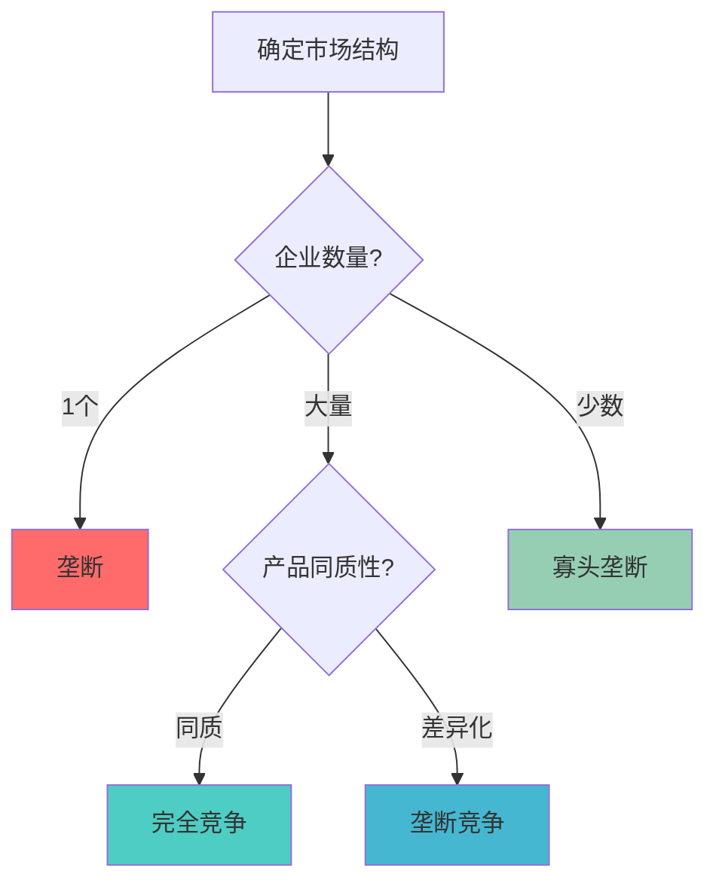
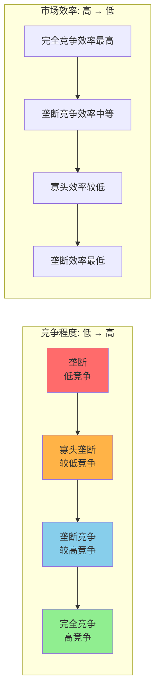
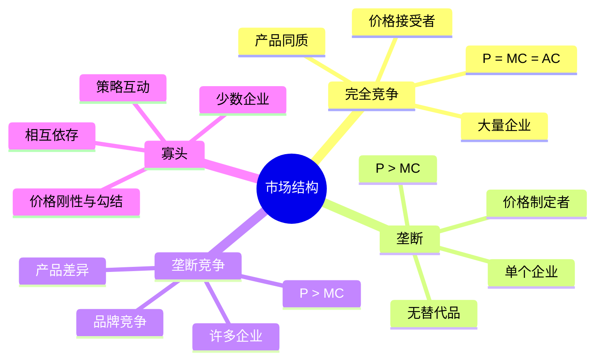

# 市场结构

## 主题概述

市场结构理论分析不同市场环境下企业的行为和市场绩效。本主题将深入探讨完全竞争、垄断、垄断竞争、寡头垄断等市场结构，以及博弈论基础、古诺模型、伯川德模型、斯塔克尔伯格模型等内容。市场结构理论有助于理解不同市场环境下价格和产量的决定机制，以及市场效率和社会福利。

## 核心概念

### 1. 完全竞争

完全竞争是最理想化的市场结构，为市场效率提供了基准。

#### 完全竞争的特征

**1. 大量买者和卖者**
- 每个买者和卖者的市场份额很小
- 没有单个主体能够影响市场价格
- 价格接受者（Price Taker）

**2. 产品同质化**
- 所有企业提供完全相同的产品
- 消费者无法区分不同企业的产品
- 不存在品牌差异

**3. 完全信息**
- 买者和卖者都拥有完全信息
- 价格、质量、技术等信息透明
- 不存在信息不对称

**4. 自由进入和退出**
- 没有进入和退出壁垒
- 资源可以自由流动
- 长期利润为零

#### 完全竞争企业的决策

**短期决策**：
```
利润最大化：max π = P × Q - C(Q)
一阶条件：P = MC(Q)

供给决策：
- 如果 P ≥ AVC_min：生产，Q = MC⁻¹(P)
- 如果 P < AVC_min：停产，Q = 0
```

**长期决策**：
```
自由进入和退出导致：
- 如果 π > 0：新企业进入，供给增加，价格下降
- 如果 π < 0：企业退出，供给减少，价格上升
- 长期均衡：π = 0 ⇒ P = AC_min
```

#### 完全竞争的效率

**配置效率（Allocative Efficiency）**：
```
P = MC
价格等于边际成本，资源配置达到最优

经济含义：
- 消费者对最后一单位的评价等于生产最后一单位的成本
- 资源配置达到帕累托最优状态
- 无法通过重新配置资源使任何人情况变好而不损害他人
```

**生产效率（Productive Efficiency）**：
```
P = AC_min
价格等于最小平均成本，生产达到最优规模

经济含义：
- 企业在长期平均成本最低点生产
- 生产规模最优，不存在规模不经济
- 资源利用效率最高
```

**帕累托效率（Pareto Efficiency）**：
```
帕累托最优状态：无法通过重新配置资源使任何人情况变好而不损害他人

完全竞争满足帕累托最优的三个条件：
1. 交换效率：MRS₁²_A = MRS₁²_B（所有消费者的边际替代率相等）
2. 生产效率：MRTS_LK_X = MRTS_LK_Y（所有生产者的边际技术替代率相等）
3. 产品组合效率：MRS = MRT（边际替代率等于边际转换率）

福利经济学第一定理：
完全竞争均衡是帕累托最优的

福利经济学第二定理：
任何帕累托最优配置都可以通过适当的初始禀赋再分配和完全竞争市场实现
```

**社会福利分析**：
```
消费者剩余（Consumer Surplus）：
CS = ∫₀^Q* P(Q)dQ - P* × Q*
表示消费者愿意支付与实际支付的差额

生产者剩余（Producer Surplus）：
PS = P* × Q* - ∫₀^Q* MC(Q)dQ
表示生产者实际收入与可变成本的差额

总剩余（Total Surplus）：
TS = CS + PS
衡量社会总福利

无谓损失：
DWL = 0
完全竞争市场无效率损失
```

#### 完全竞争的长期调整

**进入和退出机制**：
```
如果经济利润 > 0：
- 新企业进入市场
- 市场供给增加（供给曲线右移）
- 市场价格下降
- 单个企业的需求曲线下移
- 直到利润为零

如果经济利润 < 0：
- 企业退出市场
- 市场供给减少（供给曲线左移）
- 市场价格上升
- 单个企业的需求曲线上移
- 直到利润为零

长期均衡条件：
π = 0 ⇒ P = AC_min
同时满足P = MC ⇒ P = MC = AC_min
```

**长期调整的过程**：
```
初始状态：市场需求增加，价格上升
短期：现有企业增加产量，获得正利润
长期：新企业进入，供给增加，价格下降
最终：价格回到最低平均成本，利润为零

市场供给曲线：
长期供给曲线是水平的（如果成本不变）
或者向上倾斜（如果成本递增）
或者向下倾斜（如果成本递减）
```

**零利润条件**：
```
正常利润 = 机会成本
经济利润 = 0

经济含义：
- 企业获得正常回报率
- 资源配置最优
- 没有进入或退出激励
```

#### 完全竞争的比较静态分析

**需求变化**：
```
需求增加（需求曲线右移）：
- 短期：价格上升，产量增加，利润为正
- 长期：新企业进入，供给增加，价格回到AC_min，产量增加

需求减少（需求曲线左移）：
- 短期：价格下降，产量减少，利润为负
- 长期：企业退出，供给减少，价格回到AC_min，产量减少

结论：长期价格不变，产量与需求同方向变化
```

**成本变化**：
```
固定成本增加：
- 不影响边际成本
- 短期：利润减少
- 长期：企业退出，供给减少，价格上升，产量减少

可变成本增加：
- 边际成本上升
- 短期：价格上升，产量减少
- 长期：部分企业退出，供给减少，价格进一步上升，产量减少

结论：成本上升导致长期价格上升，产量减少
```

**技术进步**：
```
技术进步降低边际成本：
- 短期：边际成本曲线下移，企业增加产量，获得正利润
- 长期：新企业进入，供给增加，价格下降，产量增加

结论：技术进步提高社会福利
```

### 2. 垄断

垄断是只有一个卖者的市场结构。

#### 垄断的特征

**1. 唯一卖者**
- 市场上只有一个企业
- 企业是价格制定者（Price Maker）

**2. 产品无替代品**
- 消费者无法找到替代品
- 需求缺乏弹性

**3. 进入壁垒**
- 法律壁垒（专利、许可证）
- 自然壁垒（规模经济、网络效应）
- 战略壁垒（控制关键资源）

**4. 信息不完全**
- 垄断者可能拥有信息优势
- 可能进行价格歧视

#### 垄断的决策

**需求与收益**：
```
市场需求：P = P(Q)
总收入：TR = P(Q) × Q
边际收益：MR = dTR/dQ = P + Q × dP/dQ
```

**利润最大化**：
```
max π = P(Q) × Q - C(Q)
一阶条件：MR = MC

与完全竞争的比较：
- 完全竞争：P = MC
- 垄断：P > MC（因为MR < P）
```

**垄断价格**：
```
线性需求：P = a - bQ
TR = aQ - bQ²
MR = a - 2bQ

垄断条件：MR = MC
a - 2bQ = MC
Q_m = (a - MC)/(2b)
P_m = a - bQ_m = a - b(a - MC)/(2b) = (a + MC)/2
```

#### 垄断的价格歧视

**一级价格歧视（Perfect Price Discrimination）**：
```
定义：垄断者知道每个消费者的支付意愿，并收取不同的价格
特点：对每个消费者收取其保留价格

结果：
- 垄断者获得全部消费者剩余
- 产量达到完全竞争水平（P = MC）
- 无谓损失为零
- 消费者剩余为零
- 生产者剩余最大

分析：
消费者剩余：CS = 0
生产者剩余：PS = ∫₀^Q* P(Q)dQ - ∫₀^Q* MC(Q)dQ
总剩余：TS = PS = 最大可能值

现实性：很难实现，需要完全信息
```

**二级价格歧视（Second-Degree Price Discrimination）**：
```
定义：垄断者根据消费者的购买数量或消费模式制定不同的价格
特点：消费者自我选择

常见形式：
1. 数量折扣（购买越多，单价越低）
2. 捆绑销售（产品组合定价）
3. 分段定价（前X单位一个价格，超过X单位另一个价格）

经济分析：
- 垄断者通过价格设计区分不同消费者
- 消费者根据自己的需求选择最优消费量
- 部分消费者剩余被垄断者获得
- 产量高于单一价格垄断

例子：
P₁ = 10（Q ≤ 100）
P₂ = 8（100 < Q ≤ 200）
P₃ = 6（Q > 200）
```

**三级价格歧视（Third-Degree Price Discrimination）**：
```
定义：垄断者根据消费者的可观察特征（如年龄、地点、收入）将市场分为不同组别，对每组制定不同价格
特点：市场分割

均衡条件：
每个市场的边际收益相等且等于边际成本：
MR₁ = MR₂ = ... = MRₙ = MC

需求弹性较小的市场：价格较高
需求弹性较大的市场：价格较低

推导：
MR₁ = MC ⇒ P₁(1 - 1/|Ed₁|) = MC
MR₂ = MC ⇒ P₂(1 - 1/|Ed₂|) = MC

因此：P₁/P₂ = (1 - 1/|Ed₂|)/(1 - 1/|Ed₁|)

如果 |Ed₁| < |Ed₂|（市场1缺乏弹性）：
则 P₁ > P₂

例子：
- 学生折扣（学生需求弹性大）
- 航空公司定价（商务旅客弹性小，休闲旅客弹性大）
- 国际价格歧视（不同国家的价格差异）
```

#### 垄断的无谓损失

**效率损失**：
```
垄断价格高于竞争价格
垄断产量低于竞争产量
产生无谓损失：
DWL = 0.5 × (P_m - P_c) × (Q_c - Q_m)
```

**福利分析**：
```
消费者剩余减少：
CS_monopoly < CS_competition

生产者剩余增加（可能）：
PS_monopoly > PS_competition

总剩余减少：
TS_monopoly < TS_competition

无谓损失：
DWL = 0.5 × (P_m - P_c) × (Q_c - Q_m)

分配问题：
垄断导致财富从消费者向生产者转移
```

#### 垄断管制

**价格管制的目标**：
```
1. 减少垄断的低效率
2. 增加消费者福利
3. 保持企业的生存能力
4. 提供激励创新
```

**边际成本定价（Marginal Cost Pricing）**：
```
管制：P = MC

优点：
- 实现配置效率（P = MC）
- 无谓损失为零
- 最大化消费者福利

问题：
- 如果AC > MC，企业亏损（π < 0）
- 需要政府补贴
- 可能缺乏效率激励

适用条件：
平均成本递减的行业需要补贴
```

**平均成本定价（Average Cost Pricing）**：
```
管制：P = AC

优点：
- 企业获得正常利润（π = 0）
- 企业可以生存
- 消费者剩余高于垄断情况

问题：
- P > MC（如果AC > MC）
- 存在无谓损失
- 配置效率不完全

分析：
P = AC ⇒ P = (TC/Q) ⇒ P × Q = TC ⇒ TR = TC ⇒ π = 0
```

**最高限价（Price Ceiling）**：
```
设定最高价格P_max

如果P_max > P_m：无效果
如果P_max = P_c：完全竞争结果
如果P_m > P_max > MC：产量增加，价格下降
如果P_max < MC：企业停产

最优限价：P_max = MC（实现配置效率）
```

**回报率管制（Rate of Return Regulation）**：
```
允许企业获得一定的投资回报率
P = AC + r × K
其中r是允许的回报率，K是资本存量

问题：
- Averch-Johnson效应：企业过度投资
- 缺乏降低成本激励
- 监管俘获（Regulatory Capture）
```

#### 自然垄断

**定义**：
```
自然垄断：一个企业能够以最低成本满足整个市场需求
特征：在所有相关产量范围内，平均成本递减

条件：
对于所有Q ≤ Q_demand：
AC(Q) 递减
或者：MC(Q) < AC(Q)

原因：
- 大规模固定成本
- 网络效应
- 范围经济
```

**自然垄断的效率**：
```
单个企业：成本 = AC(Q_demand)
两个企业：成本 = 2 × AC(Q_demand/2)

如果AC(Q_demand) < 2 × AC(Q_demand/2)
则自然垄断存在

例子：
- 电力、天然气供应
- 铁路运输
- 自来水供应
- 电信网络
```

**自然垄断的管制困境**：
```
边际成本定价（P = MC）：
- 配置效率
- 但企业亏损（π < 0）

平均成本定价（P = AC）：
- 企业盈亏平衡（π = 0）
- 但配置效率损失（P > MC）
- 存在无谓损失

解决方案：
1. 政府补贴（维持P = MC）
2. 两部收费（固定费用 + 边际成本定价）
3. 可竞争市场理论（潜在竞争约束）
4. 拆分（如果可行）
```

**可竞争市场理论（Contestable Market Theory）**：
```
核心思想：即使市场上只有一个企业，如果进入和退出完全自由，潜在竞争也能约束垄断行为

条件：
1. 进入和退出无成本
2. 无沉没成本
3. 新企业可以立即进入并模仿现有企业

结果：
- 即使垄断也制定竞争价格（P = AC）
- 无谓损失为零
- 不需要政府管制

现实限制：
- 沉没成本通常存在
- 进入壁垒
- 信息不对称
```

### 3. 垄断竞争

垄断竞争是介于完全竞争和垄断之间的市场结构。

#### 垄断竞争的特征

**1. 许多卖者**
- 类似完全竞争
- 每个企业的市场份额较小

**2. 产品差异化**
- 每个企业提供略有不同的产品
- 存在品牌差异
- 需求向下倾斜

**3. 自由进入和退出**
- 没有进入壁垒
- 类似完全竞争

**4. 非价格竞争**
- 广告
- 产品质量
- 品牌建设

#### 垄断竞争的决策

**短期决策**：
```
类似垄断：
max π = P(Q) × Q - C(Q)
一阶条件：MR = MC

短期利润可能为正、零或负

条件：
如果 P ≥ AVC：继续生产
如果 P < AVC：停产

短期均衡：
MR = MC
确定产量 Q*
根据需求曲线确定价格 P*
```

**长期决策**：
```
自由进入和退出导致：
- 如果 π > 0：新企业进入，需求减少，需求曲线左移
- 如果 π < 0：企业退出，需求增加，需求曲线右移
- 长期均衡：π = 0 ⇒ P = AC

长期均衡条件：
1. MR = MC（利润最大化）
2. P = AC（零利润）
3. 需求曲线与AC曲线相切

由于MR < P，长期均衡时：
P = AC > MC
```

#### 垄断竞争的效率

**过度生产能力**：
```
P > AC_min
企业没有在最优规模生产
存在过剩产能
```

**多样化收益**：
```
产品差异化增加消费者选择
多样性价值可能补偿效率损失

分析：
消费者对多样性有偏好
完全竞争的同质产品无法满足
垄断竞争的产品差异化提高消费者效用

Hotelling模型（线性城市模型）：
- 两个企业在[0,1]区间选址
- 消费者均匀分布
- 运输成本为t
- 产品差异化的空间分析

结论：
- 适度差异化可能是最优的
- 过度差异化或完全同质都不一定最优
```

#### 垄断竞争的广告策略

**广告的作用**：
```
1. 信息性广告（Informative Advertising）
   - 提供产品信息
   - 减少信息不对称
   - 增加消费者选择

2. 说服性广告（Persuasive Advertising）
   - 影响消费者偏好
   - 建立品牌忠诚
   - 制造人为差异
```

**广告决策**：
```
最优广告条件：
MR_advertising = MC_advertising

Dorfman-Steiner条件：
广告支出比率 = (P - MC)/P × 广告弹性
A/S = (P - MC)/P × η_A

其中：
A = 广告支出
S = 销售收入
η_A = 需求的广告弹性

经济含义：
- 勒纳指数越大（垄断势力越大），广告支出越多
- 广告弹性越大，广告支出越多
```

**广告的福利效应**：
```
正面效应：
- 减少信息不对称
- 促进竞争
- 帮助消费者找到合适产品

负面效应：
- 增加成本（可能转嫁给消费者）
- 制造人为差异
- 误导消费者

净效应：取决于广告类型和市场条件
```

#### 垄断竞争的创新激励

**产品创新**：
```
激励机制：
- 创新带来产品差异化
- 短期内获得垄断利润
- 长期竞争降低利润

熊彼特创新理论：
- 创造性破坏
- 垄断利润激励创新
- 创新推动经济增长

权衡：
- 完全竞争：无垄断利润，创新激励不足
- 完全垄断：无竞争压力，创新动力不足
- 垄断竞争：适度竞争和垄断，创新激励适中
```

**过程创新**：
```
降低成本的激励：
- 创新者获得短期优势
- 长期竞争对手模仿

创新扩散：
- 创新最初由领先者采用
- 通过示范效应扩散到其他企业
- 最终整个行业技术水平提高

专利制度：
- 保护创新者权益
- 提供创新激励
- 但可能导致暂时垄断
```

### 4. 寡头垄断

寡头垄断是少数几个卖者相互依存的市场结构。

#### 寡头垄断的特征

**1. 少数卖者**
- 通常2-10个企业
- 每个企业有显著的市场份额

**2. 相互依存**
- 企业的决策相互影响
- 策略互动

**3. 进入壁垒**
- 规模经济
- 品牌忠诚度
- 战略行为

**4. 不确定性**
- 不确定竞争对手的反应
- 需要博弈论分析

#### 古诺模型（Cournot Model）

**基本假设**：
- 两个企业（双寡头）
- 同时选择产量
- 产品同质
- 理性预期
- 成本相同（一般情况）

**古诺均衡**：
```
市场需求：P = a - b(Q₁ + Q₂)
企业1的利润：π₁ = [a - b(Q₁ + Q₂)]Q₁ - C₁(Q₁)
一阶条件：∂π₁/∂Q₁ = a - bQ₂ - 2bQ₁ - MC₁ = 0
反应函数：Q₁ = (a - MC₁ - bQ₂)/(2b)

同理，企业2：
Q₂ = (a - MC₂ - bQ₁)/(2b)

古诺均衡：同时求解两个反应函数
```

**对称情况（MC₁ = MC₂ = c）**：
```
Q₁ = (a - c - bQ₂)/(2b)
Q₂ = (a - c - bQ₁)/(2b)

联立求解：
Q₁ = Q₂ = (a - c)/(3b)
总产量：Q = 2(a - c)/(3b)
价格：P = a - bQ = (a + 2c)/3

利润：
π₁ = π₂ = (P - c) × Q₁ = [(a + 2c)/3 - c] × (a - c)/(3b)
π₁ = π₂ = (a - c)²/(9b)
总利润：π = 2(a - c)²/(9b)
```

**与完全竞争和垄断的比较**：
```
完全竞争：P = c, Q = (a - c)/b
垄断：P = (a + c)/2, Q = (a - c)/(2b)
古诺：P = (a + 2c)/3, Q = 2(a - c)/(3b)

比较：
P_垄断 > P_古诺 > P_竞争
Q_竞争 > Q_古诺 > Q_垄断

数值示例（a = 120, c = 20, b = 1）：
完全竞争：P = 20, Q = 100
垄断：P = 70, Q = 50
古诺：P = 53.33, Q = 66.67

验证：20 < 53.33 < 70, 100 > 66.67 > 50 ✓
```

**古诺均衡的图形分析**：
```
反应函数曲线：
Q₁ = (a - c - bQ₂)/(2b)  （企业1的反应函数）
Q₂ = (a - c - bQ₁)/(2b)  （企业2的反应函数）

反应函数的性质：
- 向下倾斜（负斜率）
- 反应曲线的交点为古诺均衡
- 均衡的稳定性：通过动态调整实现

动态调整过程：
- 初始选择 Q₁⁰
- 企业2根据反应函数选择 Q₂¹
- 企业1根据新的Q₂调整到Q₁¹
- 重复直至收敛到均衡
```

**古诺模型的比较静态分析**：
```
需求参数a变化（市场容量扩大）：
∂Q₁/∂a = 1/(3b) > 0
∂P/∂a = 1/3 > 0
∂π₁/∂a = 2(a - c)/(9b) > 0

结论：市场容量扩大增加产量、价格和利润

成本c变化（边际成本增加）：
∂Q₁/∂c = -1/(3b) < 0
∂P/∂c = 2/3 > 0
∂π₁/∂c = -2(a - c)/(9b) < 0

结论：成本增加减少产量和利润，提高价格

企业数量n变化（n个企业）：
Q_i = (a - c)/[b(n + 1)]
Q_total = n(a - c)/[b(n + 1)]
P = (a + nc)/(n + 1)

当n → ∞：
Q_i → 0, Q_total → (a - c)/b, P → c
结论：企业数量越多，越接近完全竞争
```

#### 伯川德模型（Bertrand Model）

#### 伯川德模型（Bertrand Model）

**基本假设**：
- 两个企业
- 同时选择价格
- 产品同质
- 成本相同
- 无产能限制

**伯川德均衡**：
```
需求分配：
如果P₁ > P₂：企业1销售量为0，企业2获得全部市场
如果P₁ = P₂：两家平分市场
如果P₁ < P₂：企业1获得全部市场，企业2销售量为0

价格竞争：
假设P₂ > MC = c：
企业1可以设定P₁ = P₂ - ε（ε为无穷小量）
企业1获得全部市场，利润增加
企业2会降价以抢回市场
降价竞争持续到P₁ = P₂ = MC

如果P₂ = MC = c：
企业1设定P₁ > MC将失去所有市场
企业1设定P₁ < MC将亏损
因此P₁ = MC = c

伯川德均衡：P₁ = P₂ = MC
结果：与完全竞争相同
```

**伯川德均衡的图形分析**：
```
最佳反应函数：
B₁(P₂)：给定P₂，企业1的最优价格
B₂(P₁)：给定P₁，企业2的最优价格

最佳反应函数的性质：
- 对于P₂ > MC：B₁(P₂) = P₂ - ε
- 对于P₂ ≤ MC：B₁(P₂) = MC
- 最佳反应函数的交点在P₁ = P₂ = MC
```

**伯川德悖论（Bertrand Paradox）**：
```
现象：即使只有两个企业，价格也等于边际成本
与现实不符：现实中寡头通常有正利润

原因：
1. 产品同质（现实中存在产品差异化）
2. 成本相同（现实中存在成本差异）
3. 无产能限制（现实中存在产能约束）
4. 一次性博弈（现实中存在重复博弈）
5. 信息完全（现实中存在信息不对称）
```

**解决伯川德悖论的方法**：

**1. 产品差异化**：
```
Edgeworth模型：
- 产品不完全替代
- 需求取决于相对价格
- 存在产品忠诚度

结果：
- 价格高于边际成本
- 存在正利润
- 价格差异反映产品差异
```

**2. 产能限制**：
```
Kaplan-模型：
- 企业有最大产能限制
- 如果一家企业产能不足，另一家企业可以销售剩余需求

结果：
- 价格可能高于边际成本
- 企业获得正利润
- 产能约束影响竞争强度
```

**3. 成本差异**：
```
假设MC₁ < MC₂：
企业1可以设定P ∈ (MC₁, MC₂)
企业1获得全部市场，获得正利润
企业2无法竞争（定价低于MC₁会亏损）

结果：
- 低成本企业获得全部市场
- 价格在MC₁和MC₂之间
- 成本优势带来市场优势
```

**4. 重复博弈**：
```
企业长期竞争，考虑未来收益
合谋可能成为均衡（触发策略）
价格维持在高水平

结果：
- 合谋均衡：P > MC
- 合谋破裂：价格战
- 合谋稳定性取决于折现因子
```

#### 斯塔克尔伯格模型（Stackelberg Model）

**基本假设**：
- 两个企业
- 序贯选择产量
- 领导者先行动
- 追随者后行动
- 完全信息
- 单次博弈

**斯塔克尔伯格均衡**：
```
领导者（企业1）先选择Q₁
追随者（企业2）观察到Q₁后选择Q₂

追随者的反应函数：
Q₂ = (a - MC₂ - bQ₁)/(2b)

领导者的优化：
π₁ = [a - b(Q₁ + Q₂)]Q₁ - C₁(Q₁)
代入Q₂：
π₁ = [a - b(Q₁ + (a - MC₂ - bQ₁)/(2b))]Q₁ - C₁(Q₁)
π₁ = [a - bQ₁ - (a - MC₂)/2 + bQ₁/2]Q₁ - C₁(Q₁)
π₁ = [(a + MC₂)/2 - bQ₁/2]Q₁ - C₁(Q₁)

一阶条件：∂π₁/∂Q₁ = (a + MC₂)/2 - bQ₁ - MC₁ = 0
Q₁ = (a + MC₂ - 2MC₁)/(2b)

对称情况（MC₁ = MC₂ = c）：
Q₁ = (a - c)/(2b)
Q₂ = (a - c)/(4b)
总产量：Q = 3(a - c)/(4b)
价格：P = a - bQ = (a + 3c)/4
```

**斯塔克尔伯格模型的图形分析**：
```
反应函数曲线：
Q₂ = (a - c - bQ₁)/(2b)  （追随者的反应函数）

领导者的最优选择：
在反应函数曲线上找到使领导者利润最大的点

等利润曲线：
π₁ = [a - b(Q₁ + Q₂)]Q₁ - cQ₁ = 常数
在(Q₁, Q₂)空间中的曲线

均衡：
等利润曲线与反应函数曲线相切的点
该点为斯塔克尔伯格均衡
```

**斯塔克尔伯格模型的时间线图**：
```
时间：
t = 0: 自然选择领导者（领导者身份外生或内生）
t = 1: 领导者选择产量Q₁
t = 2: 追随者观察到Q₁，选择产量Q₂
t = 3: 市场出清，确定价格P

信息：
- 追随者观察到领导者的产量
- 领导者知道追随者会根据反应函数反应
- 完全信息，共同知识
```

**先发优势（First-Mover Advantage）**：
```
斯塔克尔伯格 vs 古诺：
斯塔克尔伯格：
Q₁ = (a - c)/(2b) = 2(a - c)/(4b)
Q₂ = (a - c)/(4b)
π₁ = (a - c)²/(8b)

古诺：
Q₁ = Q₂ = (a - c)/(3b) ≈ (a - c)/(3.33b)
π₁ = (a - c)²/(9b)

比较：
Q₁_斯塔克尔伯格 > Q₁_古诺（先动产量更大）
π₁_斯塔克尔伯格 > π₁_古诺（先动利润更高）
Q₂_斯塔克尔伯格 < Q₂_古诺（后动产量更小）
π₂_斯塔克尔伯格 < π₂_古诺（后动利润更低）

结论：先发优势显著
```

**斯塔克尔伯格模型的比较静态分析**：
```
需求参数a变化：
∂Q₁/∂a = 1/(2b) > 0
∂Q₂/∂a = 1/(4b) > 0
∂π₁/∂a = (a - c)/(4b) > 0

成本c变化：
∂Q₁/∂c = -1/(2b) < 0
∂Q₂/∂c = -1/(4b) < 0
∂π₁/∂c = -(a - c)/(4b) < 0

结论：市场容量扩大增加所有企业利润
成本增加减少所有企业利润
```

**斯塔克尔伯格模型的应用**：
```
先发优势的来源：
1. 承诺能力（Commitment Ability）
2. 规模经济（Economies of Scale）
3. 学习曲线（Learning Curve）
4. 品牌建立（Brand Building）
5. 渠道控制（Channel Control）

实际案例：
- 科技行业（苹果 vs 三星）
- 互联网平台（Facebook vs 其他社交媒体）
- 电子商务（亚马逊 vs 其他电商平台）
```

#### 卡特尔（Cartel）

**卡特尔的定义**：
```
卡特尔：企业之间达成协议，限制竞争，提高价格和利润

形式：
1. 明示卡特尔（公开协议）
2. 隐性卡特尔（默契合作）
3. 价格领导（跟随领导者）
```

**卡特尔的形成条件**：
```
1. 企业数量少（易于协调）
2. 产品同质（需求弹性一致）
3. 需求缺乏弹性（提价效果明显）
4. 成本相似（利益分配容易）
5. 市场透明度高（易于监督）
6. 进入壁垒高（防止新进入者）
```

**卡特尔的最优决策**：
```
n个企业组成卡特尔
卡特尔作为整体最大化总利润：

max π_total = P(Q_total) × Q_total - ΣC_i(Q_i)

一阶条件：
MR(Q_total) = MC₁(Q₁) = MC₂(Q₂) = ... = MC_n(Q_n)

分配原则：
每个企业的边际成本相等
成本高的企业生产较少
成本低的企业生产较多
```

**卡特尔的不稳定性**：
```
背叛激励（Cheating Incentive）：

假设n个企业对称分配产量：
Q_i = Q_total/n
P = P(Q_total)

如果企业i增加产量ΔQ（其他企业不变）：
- 价格略微下降（P → P - ΔP）
- 产量增加（Q_i → Q_i + ΔQ）
- 利润变化：Δπ_i ≈ (P - MC) × ΔQ - Q_i × ΔP

由于ΔP很小，Δπ_i ≈ (P - MC) × ΔQ > 0

结论：每个企业都有激励背叛卡特尔，增加产量
```

**维持卡特尔的条件**：
```
1. 监测机制（Monitoring）：
   - 能够及时发现背叛行为
   - 市场透明度高
   - 容易识别背叛者

2. 惩罚机制（Punishment）：
   - 触发策略（Trigger Strategy）
   - 价格战（Price War）
   - 市场份额损失

3. 重复博弈（Repeated Game）：
   - 长期关系
   - 折现因子足够大
   - 未来收益约束当前行为

4. 法律保护（Legal Protection）：
   - 某些国家允许卡特尔
   - 政府支持
```

**卡特尔的实际案例**：
```
1. OPEC（石油输出国组织）：
   - 协调石油产量
   - 维持石油价格
   - 成员国存在背叛行为

2. 航空业：
   - 价格协调
   - 航线分配
   - 被反垄断法禁止

3. 电信业：
   - 市场分割
   - 价格协调
   - 监管挑战
```

#### 价格领导模型（Price Leadership）

**价格领导的类型**：
```
1. 支配型价格领导（Dominant Firm Leadership）：
   - 一个企业占主导地位
   - 其他企业是价格接受者
   - 领导者考虑追随者的反应

2. 晴雨表型价格领导（Barometric Leadership）：
   - 某个企业率先调整价格
   - 其他企业跟随
   - 领导者不一定占主导地位

3. 低成本型价格领导（Low-Cost Leadership）：
   - 低成本企业设定价格
   - 高成本企业跟随
   - 否则高成本企业失去市场
```

**支配型价格领导模型**：
```
市场需求：P = P(Q)
追随者供给：Q_f = S_f(P)
领导者剩余需求：Q_l = Q - Q_f = D(P) - S_f(P)

领导者决策：
max π_l = P(Q_l) × Q_l - C_l(Q_l)
MR_l(Q_l) = MC_l(Q_l)

均衡：
1. 追随者根据价格决定产量
2. 领导者根据剩余需求决定价格
3. 市场出清
```

**价格领导的稳定性**：
```
优势：
- 减少价格战
- 提高利润
- 降低不确定性

劣势：
- 可能被认定为合谋
- 追随者可能背叛
- 领导者地位可能受到挑战
```

#### 重复博弈与合谋

**重复博弈的概念**：
```
重复博弈：同一博弈重复进行多次

类型：
1. 有限重复博弈（Finite Repeated Game）
   - 已知T期
   - 逆向归纳法求解
   - 最后一期不合作

2. 无限重复博弈（Infinite Repeated Game）
   - 无限期
   - 折现因子δ ∈ (0, 1)
   - 合谋可能成为均衡
```

**无名氏定理（Folk Theorem）**：
```
在无限重复博弈中，如果折现因子足够大，
任何可行的、个体理性的收益都可以作为子博弈完美纳什均衡

含义：
- 合谋可以维持
- 只要δ足够大（未来重要）
- 任何合作结果都可能实现
```

**触发策略（Trigger Strategy）**：
```
冷酷触发策略（Grim Trigger Strategy）：
- 阶段1：合作
- 阶段t：如果之前所有阶段都合作，继续合作；否则永远背叛

有限惩罚策略（Finite Punishment Strategy）：
- 阶段1：合作
- 阶段t：如果对手背叛，惩罚K期，然后恢复合作

胡萝卜加大棒策略（Carrot and Stick Strategy）：
- 合作给予奖励
- 背叛给予惩罚
- 奖惩交替
```

**合谋的稳定性条件**：
```
假设古诺重复博弈：
合作（合谋）收益：π_collusion = (a - c)²/(8b)
背叛（古诺）收益：π_deviation = (a - c)²/(9b) × 9/4 = 9(a - c)²/(36b) = (a - c)²/(4b)
惩罚（古诺）收益：π_punishment = (a - c)²/(9b)

合谋条件：
π_collusion/(1 - δ) ≥ π_deviation + δ × π_punishment/(1 - δ)
(a - c)²/(8b) × (1 - δ) ≥ (a - c)²/(4b) × (1 - δ) + δ × (a - c)²/(9b)

简化：1/8 ≥ (1 - δ)/4 + δ/9
解得：δ ≥ 9/17 ≈ 0.53

结论：如果折现因子δ ≥ 0.53，合谋可以维持
```

**影响合谋稳定性的因素**：
```
1. 企业数量：
   - 企业越少，越容易合谋
   - 监测更容易
   - 惩罚更有效

2. 市场需求波动：
   - 需求稳定，合谋容易
   - 需求波动，合谋困难

3. 成本差异：
   - 成本相似，合谋容易
   - 成本差异大，合谋困难

4. 产品差异化：
   - 产品同质，合谋容易
   - 产品差异大，合谋困难

5. 进入威胁：
   - 进入壁垒高，合谋容易
   - 进入壁垒低，合谋困难

6. 信息透明度：
   - 信息透明，合谋容易
   - 信息不对称，合谋困难
```

### 5. 博弈论基础

### 5. 博弈论基础

博弈论分析策略互动下的决策问题。

#### 博弈的基本要素

**1. 参与者（Players）**
- 参与博弈的决策主体
- 通常用N = {1, 2, ..., n}表示

**2. 策略（Strategies）**
- 参与者可选择的行动
- 用Sᵢ表示参与者i的策略集

**3. 收益（Payoffs）**
- 参与者获得的效用
- 用uᵢ(s₁, s₂, ..., sₙ)表示

#### 纳什均衡

**定义**：
```
策略组合(s₁*, s₂*, ..., sₙ*)是纳什均衡，如果对于每个参与者i：
uᵢ(s₁*, ..., sᵢ*, ..., sₙ*) ≥ uᵢ(s₁*, ..., sᵢ, ..., sₙ*)
对所有sᵢ ∈ Sᵢ成立
```

**经济含义**：
- 给定其他参与者的策略，每个参与者都没有动力改变自己的策略
- 策略组合是自我维持的
- 无人有单边偏离的激励

**纳什均衡的存在性（Nash Existence Theorem）**：
```
条件：
1. 参与者数量有限
2. 每个参与者的策略集是有限非空集
3. 收益函数是连续的
4. 策略集是紧致的（Compact）

结论：
- 每个有限博弈至少存在一个纳什均衡
- 均衡可能是纯策略纳什均衡
- 均衡可能是混合策略纳什均衡
- 可能存在多个纳什均衡

证明思路：
- 使用不动点定理（Kakutani Fixed Point Theorem）
- 最优反应映射的不动点就是纳什均衡
```

**纳什均衡的唯一性**：
```
条件：
1. 策略是连续的
2. 收益函数是严格凹的
3. 最优反应函数单调

结论：
- 如果满足上述条件，纳什均衡唯一
- 如果不满足，可能存在多个均衡

例子：
- 古诺模型：最优反应函数线性向下，均衡唯一
- 伯川德模型：均衡唯一
- 协调博弈：可能存在多个均衡（如性别战博弈）
```

**纳什均衡的求解方法**：
```
1. 画线法（Underlining Method）：
   - 对于每个参与者的每个策略，给定对手的策略，找到最优反应
   - 用下划线标记最优反应对应的收益
   - 所有收益都有下划线的策略组合是纳什均衡

2. 严格劣策略剔除（Iterated Elimination of Dominated Strategies）：
   - 剔除严格劣策略
   - 重复剔除直至无法继续
   - 剩余的策略组合是纳什均衡

3. 反应函数法（Best Response Function Method）：
   - 推导每个参与者的反应函数
   - 求解反应函数的交点
   - 交点对应的策略组合是纳什均衡

4. 微积分法（Calculus Method）：
   - 对于连续策略博弈
   - 求导找最优反应
   - 联立求解
```

#### 混合策略纳什均衡

**混合策略的定义**：
```
纯策略：参与者确定性地选择某个策略
混合策略：参与者以一定概率随机选择策略

定义：
参与者i的混合策略σᵢ是在纯策略Sᵢ上的概率分布
σᵢ = (σᵢ(sᵢ₁), σᵢ(sᵢ₂), ..., σᵢ(sᵢₖ))
其中σᵢ(sᵢⱼ) ≥ 0，且Σⱼσᵢ(sᵢⱼ) = 1
```

**混合策略纳什均衡的定义**：
```
策略组合(σ₁*, σ₂*, ..., σₙ*)是混合策略纳什均衡，如果：
对于每个参与者i和每个纯策略sᵢ：
uᵢ(σ₁*, ..., σᵢ*, ..., σₙ*) ≥ uᵢ(σ₁*, ..., sᵢ, ..., σₙ*)

即：给定其他参与者的混合策略，
每个参与者在混合策略中使用的每个纯策略都是最优反应
```

**混合策略纳什均衡的求解**：
```
条件：
对于每个参与者，对手在均衡中使用的每个纯策略必须使得参与者无差异

例子：猜拳游戏（Rock-Paper-Scissors）
- 参与者1和参与者2的策略集：{石头, 剪刀, 布}
- 收益：石头胜剪刀，剪刀胜布，布胜石头，相同为平

混合策略纳什均衡：
σ₁* = (1/3, 1/3, 1/3)
σ₂* = (1/3, 1/3, 1/3)

验证：
- 给定σ₂*，参与者1选择石头、剪刀、布的期望收益相同
- 因此，(1/3, 1/3, 1/3)是最优混合策略
```

**混合策略的经济含义**：
```
1. 不可预测性（Unpredictability）：
   - 混合策略使对手难以预测
   - 保持策略神秘性

2. 随机化（Randomization）：
   - 现实中可能通过"掷骰子"实现
   - 或者通过随机决策规则

3. 内生不确定性（Endogenous Uncertainty）：
   - 即使信息完全，结果也随机
   - 策略互动产生不确定性

例子：
- 足球点球：守门员选择扑向左或右，射手选择踢向左或右
- 价格竞争：企业随机调整价格
- 军事战略：随机选择攻击方向
```

#### 重复博弈

**重复博弈的定义**：
```
重复博弈：同一阶段博弈重复进行多次

要素：
1. 阶段博弈（Stage Game）：每次重复的基本博弈
2. 重复次数：有限或无限
3. 折现因子δ：未来收益的折现
4. 历史信息：所有参与者知道过去的策略选择
```

**有限重复博弈（Finite Repeated Game）**：
```
定义：阶段博弈重复T次，T已知且有限

求解方法：逆向归纳法（Backward Induction）
- 第T期：一次性博弈，采用纳什均衡
- 第T-1期：预期第T期结果，决策最优策略
- ...
- 第1期：根据未来所有期的结果，决策最优策略

结论：
- 如果阶段博弈有唯一纳什均衡，有限重复博弈的均衡是重复该均衡
- 如果阶段博弈有多个纳什均衡，有限重复博弈可能有更多均衡

例子：有限重复囚徒困境
- 每期都选择坦白是子博弈完美纳什均衡
- 无法实现合作
```

**无限重复博弈（Infinite Repeated Game）**：
```
定义：阶段博弈重复无限次

折现因子：
δ ∈ (0, 1)
δ = 1/(1 + r)，其中r是利率
δ越大，未来越重要

总收益：
U = Σₜ₌₀^∞ δᵗuₜ
```

**子博弈完美纳什均衡（Subgame Perfect Nash Equilibrium, SPNE）**：
```
定义：
策略组合是子博弈完美纳什均衡，如果：
1. 它是整个博弈的纳什均衡
2. 它在每个子博弈上也是纳什均衡

子博弈：
从某个节点开始，包括该节点之后的所有节点和行动

求解方法：
1. 逆向归纳法（适用于有限博弈）
2. 触发策略（适用于无限重复博弈）

与纳什均衡的区别：
- 纳什均衡：整体最优
- 子博弈完美纳什均衡：每个子博弈都最优
- 子博弈完美纳什均衡一定也是纳什均衡
- 但纳什均衡不一定是子博弈完美纳什均衡
```

**重复博弈中的合作**：
```
条件：
1. 无限重复博弈
2. 折现因子δ足够大
3. 触发策略可信

合谋可能性：
如果合谋的长期收益 ≥ 背叛的短期收益 + 惩罚的长期收益
则合谋可以维持

无名氏定理（Folk Theorem）：
在无限重复博弈中，如果折现因子足够大，
任何可行的、个体理性的收益都可以作为子博弈完美纳什均衡
```

#### 不完全信息博弈

**不完全信息的定义**：
```
完全信息（Complete Information）：
- 所有参与者知道所有参与者的收益函数
- 收益函数是共同知识

不完全信息（Incomplete Information）：
- 参与者不知道某些参与者的收益函数
- 存在私人信息

类型（Type）：
参与者的私人信息决定了其收益函数
用θᵢ表示参与者i的类型
类型θᵢ ∈ Θᵢ，其中Θᵢ是类型空间

先验信念（Prior Belief）：
参与者对其他参与者类型的概率分布
pᵢ(θ₋ᵢ)表示参与者i对其他人类型的信念
```

**贝叶斯博弈（Bayesian Game）**：
```
定义：
不完全信息的博弈称为贝叶斯博弈

要素：
1. 参与者集合N = {1, 2, ..., n}
2. 类型空间Θᵢ
3. 策略空间Sᵢ
4. 收益函数uᵢ(s₁, s₂, ..., sₙ; θᵢ)
5. 先验信念pᵢ(θ₋ᵢ)

类型依赖策略：
sᵢ(θᵢ)：参与者i在类型θᵢ时的策略
```

**贝叶斯纳什均衡（Bayesian Nash Equilibrium）**：
```
定义：
策略组合(s₁*(θ₁), s₂*(θ₂), ..., sₙ*(θₙ))是贝叶斯纳什均衡，如果：
对于每个参与者i和每个类型θᵢ：
E[uᵢ(s₁*(θ₁), ..., sᵢ*(θᵢ), ..., sₙ*(θₙ); θᵢ) ≥ E[uᵢ(s₁*(θ₁), ..., sᵢ, ..., sₙ*(θₙ); θᵢ)]
对所有sᵢ ∈ Sᵢ成立

其中期望E是基于先验信念pᵢ(θ₋ᵢ)

含义：
给定其他参与者的类型依赖策略和先验信念，
每个参与者在每个类型下都选择最优策略
```

**贝叶斯纳什均衡的求解**：
```
步骤：
1. 确定每个参与者的类型空间
2. 确定先验信念
3. 写出每个参与者的期望收益
4. 对每个类型，求解最优反应
5. 联立求解

例子：密封拍卖（First-Price Sealed-Bid Auction）
- 两个参与者同时出价
- 出价高者获得物品，支付自己的出价
- 每个参与者对物品的估值v是私人信息
- v均匀分布在[0, 1]

贝叶斯纳什均衡：
b(v) = v/2（线性均衡）
参与者出价是估值的一半
```

**信号博弈（Signaling Game）**：
```
定义：
一种特殊的不完全信息博弈
参与者1发送信号，参与者2根据信号采取行动

结构：
1. 自然选择参与者1的类型θ₁
2. 参与者1观察到θ₁，选择信号m
3. 参与者2观察到m（但不知道θ₁），更新信念
4. 参与者2根据后验信念选择行动a
5. 收益u₁(a, m; θ₁)和u₂(a, m; θ₁)

应用：
- 就业市场（学历信号）
- 产品市场（质量信号）
- 金融市场（股利信号）
```

#### 囚徒困境

**博弈矩阵**：
```
               乙
           坦白    抵赖
     坦白  (-5,-5)  (0,-10)
甲
     抵赖  (-10,0)  (-1,-1)
```

**纳什均衡**：
```
无论乙选择什么，甲选择坦白都是最优
无论甲选择什么，乙选择坦白都是最优
纳什均衡：(坦白, 坦白)
帕累托最优：(抵赖, 抵赖)
```

**经济含义**：
- 个人理性导致集体非理性
- 合作难以实现

## 重要模型和公式

### 1. 垄断定价

**线性需求下的垄断定价**：
```
需求：P = a - bQ
MR = a - 2bQ

垄断条件：MR = MC
a - 2bQ = MC
Q_m = (a - MC)/(2b)
P_m = a - bQ_m = (a + MC)/2
```

**垄断利润**：
```
π_m = P_m × Q_m - C(Q_m)
```

**勒纳指数（Lerner Index）**：
```
L = (P - MC)/P = 1/|Ed|
勒纳指数衡量垄断势力
|Ed|越小，垄断势力越大
```

### 2. 古诺模型

**反应函数**：
```
企业1：Q₁ = (a - MC₁ - bQ₂)/(2b)
企业2：Q₂ = (a - MC₂ - bQ₁)/(2b)
```

**古诺均衡（对称）**：
```
Q₁ = Q₂ = (a - c)/(3b)
Q = 2(a - c)/(3b)
P = (a + 2c)/3
π₁ = π₂ = (a - c)²/(9b)
```

### 3. 伯川德模型

**伯川德均衡**：
```
P₁ = P₂ = MC
Q₁ = Q₂ = (a - MC)/(2b)
π₁ = π₂ = 0
```

### 4. 斯塔克尔伯格模型

**斯塔克尔伯格均衡（对称）**：
```
Q₁ = (a - c)/(2b)
Q₂ = (a - c)/(4b)
Q = 3(a - c)/(4b)
P = (a + 3c)/4
π₁ = (a - c)²/(8b)
π₂ = (a - c)²/(16b)
```

## 实际应用案例

### 案例1：垄断定价分析

**问题**：垄断企业面临需求P = 100 - 2Q，成本函数TC = 20Q + 10。求垄断价格、产量和利润。

**分析**：

**1. 推导边际收益和边际成本**：
```
需求：P = 100 - 2Q
TR = P × Q = 100Q - 2Q²
MR = dTR/dQ = 100 - 4Q

MC = dTC/dQ = 20
```

**2. 利润最大化**：
```
MR = MC
100 - 4Q = 20
4Q = 80
Q_m = 20

P_m = 100 - 2×20 = 60
```

**3. 计算利润**：
```
π = TR - TC
TR = 60 × 20 = 1200
TC = 20 × 20 + 10 = 410
π = 1200 - 410 = 790
```

**4. 勒纳指数**：
```
L = (P - MC)/P = (60 - 20)/60 = 40/60 = 0.67

需求弹性：
Ed = (dQ/dP) × (P/Q) = (-0.5) × (60/20) = -1.5
|Ed| = 1.5
验证：L = 1/|Ed| = 1/1.5 ≈ 0.67 ✓
```

**结论**：
1. 垄断价格为60，产量为20
2. 垄断利润为790
3. 勒纳指数为0.67，表明垄断势力较强
4. 需求弹性为-1.5，需求相对缺乏弹性

### 案例2：古诺均衡

**问题**：双寡头市场，需求P = 120 - Q，成本函数TC₁ = 20Q₁，TC₂ = 20Q₂。求古诺均衡。

**分析**：

**1. 推导反应函数**：
```
市场需求：P = 120 - Q₁ - Q₂

企业1的利润：
π₁ = (120 - Q₁ - Q₂)Q₁ - 20Q₁
π₁ = 120Q₁ - Q₁² - Q₁Q₂ - 20Q₁
π₁ = 100Q₁ - Q₁² - Q₁Q₂

一阶条件：∂π₁/∂Q₁ = 100 - 2Q₁ - Q₂ = 0
反应函数1：Q₁ = (100 - Q₂)/2 = 50 - 0.5Q₂

同理，企业2：
反应函数2：Q₂ = 50 - 0.5Q₁
```

**2. 求解古诺均衡**：
```
联立反应函数：
Q₁ = 50 - 0.5Q₂
Q₂ = 50 - 0.5Q₁

代入：Q₁ = 50 - 0.5(50 - 0.5Q₁)
Q₁ = 50 - 25 + 0.25Q₁
0.75Q₁ = 25
Q₁ = 25/0.75 = 100/3 ≈ 33.33

Q₂ = 50 - 0.5 × (100/3) = 50 - 50/3 = 100/3 ≈ 33.33

总产量：Q = Q₁ + Q₂ = 200/3 ≈ 66.67
价格：P = 120 - 200/3 = 160/3 ≈ 53.33
```

**3. 计算利润**：
```
π₁ = (160/3 - 20) × (100/3) = (100/3) × (100/3) = 10000/9 ≈ 1111.11
π₂ = 同理 = 10000/9 ≈ 1111.11

总利润：π = 20000/9 ≈ 2222.22
```

**4. 与垄断和完全竞争的比较**：
```
垄断：
MR = 120 - 2Q = MC = 20
Q_m = 50, P_m = 70, π_m = 50 × 50 = 2500

完全竞争：
P = MC = 20, Q_c = 100, π_c = 0

比较：
垄断：Q = 50, P = 70, π = 2500
古诺：Q ≈ 66.67, P ≈ 53.33, π ≈ 2222.22
竞争：Q = 100, P = 20, π = 0

验证：
Q_c > Q_古诺 > Q_m ✓
P_m > P_古诺 > P_c ✓
π_m > π_古诺 > π_c ✓
```

**结论**：
1. 古诺均衡产量各为33.33，总产量66.67
2. 价格为53.33，高于竞争价格20
3. 每家企业利润约为1111.11
4. 古诺均衡介于垄断和完全竞争之间

### 案例3：斯塔克尔伯格模型

**问题**：在案例2的基础上，假设企业1是领导者，企业2是追随者。求斯塔克尔伯格均衡。

**分析**：

**1. 追随者的反应函数**：
```
企业2的反应函数（与古诺模型相同）：
Q₂ = 50 - 0.5Q₁
```

**2. 领导者的优化**：
```
企业1的利润：
π₁ = (120 - Q₁ - Q₂)Q₁ - 20Q₁
代入Q₂：
π₁ = (120 - Q₁ - (50 - 0.5Q₁))Q₁ - 20Q₁
π₁ = (70 - 0.5Q₁)Q₁ - 20Q₁
π₁ = 70Q₁ - 0.5Q₁² - 20Q₁
π₁ = 50Q₁ - 0.5Q₁²

一阶条件：dπ₁/dQ₁ = 50 - Q₁ = 0
Q₁ = 50
```

**3. 追随者的选择**：
```
Q₂ = 50 - 0.5 × 50 = 25
```

**4. 均衡结果**：
```
总产量：Q = 50 + 25 = 75
价格：P = 120 - 75 = 45

利润：
π₁ = (45 - 20) × 50 = 25 × 50 = 1250
π₂ = (45 - 20) × 25 = 25 × 25 = 625
```

**5. 与古诺均衡的比较**：
```
古诺均衡：
Q₁ = Q₂ ≈ 33.33, Q ≈ 66.67, P ≈ 53.33
π₁ = π₂ ≈ 1111.11

斯塔克尔伯格均衡：
Q₁ = 50, Q₂ = 25, Q = 75, P = 45
π₁ = 1250, π₂ = 625

比较：
- 领导者产量增加（50 > 33.33），利润增加（1250 > 1111.11）
- 追随者产量减少（25 < 33.33），利润减少（625 < 1111.11）
- 总产量增加（75 > 66.67），价格下降（45 < 53.33）
- 领导者获得先发优势
```

**结论**：
1. 领导者生产50单位，追随者生产25单位
2. 价格为45，低于古诺价格53.33
3. 领导者利润1250，高于古诺情况
4. 追随者利润625，低于古诺情况
5. 先发优势使领导者获得更高利润

### 案例4：伯川德模型

**问题**：双寡头市场，需求P = 120 - Q，成本函数TC₁ = 20Q₁，TC₂ = 20Q₂。企业同时选择价格。求伯川德均衡。

**分析**：

**1. 价格竞争**：
```
产品同质，消费者选择价格较低的企业

如果P₁ > P₂：企业1销售量为0
如果P₁ = P₂：两家平分市场
如果P₁ < P₂：企业1获得全部市场
```

**2. 伯川德均衡**：
```
假设P₂ > MC = 20：
企业1可以设定P₁ = P₂ - ε，获得全部市场
企业2会降价以抢回市场
直到P₁ = P₂ = MC = 20

如果P₂ = MC = 20：
企业1设定P₁ > MC将失去所有市场
企业1设定P₁ < MC将亏损
因此P₁ = MC = 20

伯川德均衡：P₁ = P₂ = 20
```

**3. 均衡结果**：
```
价格：P = 20
总需求：Q = 120 - 20 = 100
每家产量：Q₁ = Q₂ = 50
利润：π₁ = π₂ = (20 - 20) × 50 = 0
```

**4. 与古诺均衡的比较**：
```
古诺均衡：P ≈ 53.33, Q ≈ 66.67, π ≈ 1111.11
伯川德均衡：P = 20, Q = 100, π = 0

比较：
- 伯川德价格更低（20 < 53.33）
- 伯川德产量更高（100 > 66.67）
- 伯川德利润为零（0 < 1111.11）
- 价格竞争比产量竞争更激烈
```

**5. 伯川德悖论**：
```
即使只有两个企业，结果也等于完全竞争
与现实不符（现实中寡头通常有正利润）

原因：
1. 产品差异化
2. 成本差异
3. 产能限制
4. 动态竞争
```

**结论**：
1. 伯川德均衡价格为20，等于边际成本
2. 总产量为100，每家50
3. 利润为零，与完全竞争相同
4. 价格竞争非常激烈
5. 现实中需要考虑产品差异化等因素

### 案例6：寡头垄断的实际案例——航空业

**案例背景**：
航空业是典型的寡头垄断市场，少数几家航空公司主导市场。以国内主要航线为例，分析航空公司之间的策略互动。

**市场特征**：
```
市场结构：寡头垄断
主要企业：国航、东航、南航、海航等
产品差异化：服务、时刻、航点
进入壁垒：高昂的固定成本、政府管制
价格竞争：激烈但存在合谋倾向
```

**古诺模型的应用**：
```
假设某航线上只有两家航空公司（A和B）
需求函数：P = 1000 - Q（单位：元）
成本函数：TC_A = 200Q_A, TC_B = 200Q_B

古诺均衡求解：
市场需求：Q = Q_A + Q_B
需求函数：P = 1000 - Q_A - Q_B

航空公司A的利润：
π_A = (1000 - Q_A - Q_B)Q_A - 200Q_A
π_A = 800Q_A - Q_A² - Q_AQ_B

一阶条件：∂π_A/∂Q_A = 800 - 2Q_A - Q_B = 0
反应函数A：Q_A = 400 - 0.5Q_B

同理，航空公司B：
反应函数B：Q_B = 400 - 0.5Q_A

联立求解：
Q_A = 400 - 0.5(400 - 0.5Q_A)
Q_A = 400 - 200 + 0.25Q_A
0.75Q_A = 200
Q_A = 266.67

Q_B = 266.67

总产量：Q = 533.33
价格：P = 1000 - 533.33 = 466.67（元）

利润：
π_A = π_B = (466.67 - 200) × 266.67 = 71,111（元）
总利润：142,222（元）
```

**与垄断和完全竞争的比较**：
```
垄断：
MR = 1000 - 2Q = MC = 200
Q_m = 400, P_m = 600
π_m = (600 - 200) × 400 = 160,000

完全竞争：
P = MC = 200, Q_c = 800
π_c = 0

比较：
垄断：Q = 400, P = 600, π = 160,000
古诺：Q = 533.33, P = 466.67, π = 142,222
竞争：Q = 800, P = 200, π = 0

航空业现实：
- 价格高于边际成本
- 存在正利润
- 价格竞争受限制（价格下限）
- 非价格竞争（服务、时刻）
```

**航空业的合谋倾向**：
```
价格协调：
- 航空公司通过"价格领导"协调价格
- 避免价格战
- 保持高利润率

价格战案例：
- 2000年代初，多家航空公司参与价格战
- 价格大幅下降，利润急剧减少
- 最终达成默契，停止价格战

监管挑战：
- 反垄断法禁止明示合谋
- 但难以禁止隐性合谋
- 监管机构需要区分正常竞争和合谋
```

**航空业的差异化竞争**：
```
服务差异化：
- 商务舱 vs 经济舱
- 航班时刻
- 机场位置
- 忠诚度计划

品牌差异化：
- 国航：国际航线
- 东航：华东地区
- 南航：华南地区
- 海航：创新服务

网络效应：
- 航点网络越大，越有优势
- 枢纽辐射系统
- 联盟合作（星空联盟、天合联盟、寰宇一家）
```

**结论**：
1. 航空业符合寡头垄断特征
2. 古诺模型可以部分解释航空公司行为
3. 价格竞争受限制，非价格竞争激烈
4. 存在合谋倾向，但监管约束明示合谋
5. 产品差异化是重要竞争手段

### 案例7：价格歧视的实际案例——航空公司定价

**案例背景**：
航空公司是价格歧视的典型实践者，根据乘客的特征和需求制定不同的价格。

**三级价格歧视的实施**：
```
市场分割：
1. 商务旅客（Business Travelers）
   - 需求弹性小（必须出行）
   - 时间敏感
   - 对价格不敏感

2. 休闲旅客（Leisure Travelers）
   - 需求弹性大（可以推迟）
   - 价格敏感
   - 提前预订

定价策略：
- 商务舱：高价，提前预订限制少
   - 价格：3000-5000元
   - 弹性：|Ed| ≈ 1.2

- 经济舱（商务）：高价，提前预订限制多
   - 价格：1000-2000元
   - 弹性：|Ed| ≈ 2.0

- 经济舱（休闲）：低价，提前预订限制多
   - 价格：500-800元
   - 弹性：|Ed| ≈ 4.0

勒纳指数分析：
L商务 = (P - MC)/P = 1/|Ed| = 1/1.2 ≈ 0.83
L经济商务 = 1/2.0 = 0.50
L经济休闲 = 1/4.0 = 0.25

验证：
P商务 >> P经济商务 >> P经济休闲 ✓
```

**二级价格歧视的实施**：
```
数量折扣：
- 里程积分（飞行里程越多，奖励越多）
- 家庭票优惠
- 团体票优惠

提前预订折扣：
- 提前3个月预订：最大折扣（60%）
- 提前1个月预订：中等折扣（40%）
- 提前1周预订：小折扣（20%）
- 当日购票：无折扣

灵活性折扣：
- 不可退改票：最低价
- 退改票收费：中等价
- 自由退改票：最高价

经济分析：
- 休闲旅客：提前预订，灵活需求低 → 低票价
- 商务旅客：临时预订，灵活需求高 → 高票价
- 通过价格设计实现市场分割
```

**价格歧视的福利分析**：
```
假设：
需求：P = 1000 - Q
边际成本：MC = 200

单一价格垄断：
MR = 1000 - 2Q = MC = 200
Q_m = 400, P_m = 600
π_m = (600 - 200) × 400 = 160,000
CS = 0.5 × (1000 - 600) × 400 = 80,000
TS = 240,000

完美价格歧视：
Q = 800（P = MC）
CS = 0
PS = 0.5 × (1000 - 200) × 800 = 320,000
TS = 320,000

三级价格歧视（假设两个市场）：
市场1（商务，弹性小）：P₁ = 800, Q₁ = 200
市场2（休闲，弹性大）：P₂ = 400, Q₂ = 600
总产量：Q = 800
π = (800 - 200) × 200 + (400 - 200) × 600 = 120,000 + 120,000 = 240,000
CS = 0.5 × (1000 - 800) × 200 + 0.5 × (1000 - 400) × 600 = 20,000 + 180,000 = 200,000
TS = 440,000

比较：
单一价格：TS = 240,000
完美价格歧视：TS = 320,000
三级价格歧视：TS = 440,000

结论：
价格歧视增加总福利
部分消费者受益（低票价市场）
部分消费者受损（高票价市场）
总福利增加
```

**价格歧视的实际效果**：
```
正面效果：
1. 增加航空公司利润（激励投资）
2. 增加总社会福利
3. 使更多消费者能够负担航空旅行
4. 提高航班上座率

负面效果：
1. 高票价市场消费者受损
2. 可能导致不公平
3. 复杂的定价结构增加消费者困惑
4. 可能被滥用

监管考虑：
- 允许合理的价格歧视
- 禁止歧视性定价（如年龄、性别歧视）
- 要求价格透明
- 保护消费者权益
```

**结论**：
1. 航空公司广泛使用价格歧视
2. 三级价格歧视是最常见的类型
3. 价格歧视增加总福利
4. 需要监管防止滥用
5. 消费者理解定价机制很重要

### 案例5：市场结构的效率比较

**问题**：比较完全竞争、垄断、古诺、斯塔克尔伯格和伯川德五种市场结构的效率。

**分析**：

**设定**：
```
需求：P = 120 - Q
边际成本：MC = 20
```

**1. 完全竞争**：
```
P = MC = 20
Q = 120 - 20 = 100
π = 0
消费者剩余：CS = 0.5 × (120 - 20) × 100 = 5000
生产者剩余：PS = 0
总剩余：TS = 5000
```

**2. 垄断**：
```
MR = 120 - 2Q = MC = 20
Q_m = 50
P_m = 70
π_m = (70 - 20) × 50 = 2500
CS = 0.5 × (120 - 70) × 50 = 1250
PS = 2500
TS = 3750
DWL = 5000 - 3750 = 1250
```

**3. 古诺（双寡头）**：
```
Q₁ = Q₂ = 33.33, Q = 66.67
P = 53.33
π₁ = π₂ = 1111.11
CS = 0.5 × (120 - 53.33) × 66.67 ≈ 2222.22
PS = 2222.22
TS = 4444.44
DWL = 5000 - 4444.44 = 555.56
```

**4. 斯塔克尔伯格**：
```
Q₁ = 50, Q₂ = 25, Q = 75
P = 45
π₁ = 1250, π₂ = 625
CS = 0.5 × (120 - 45) × 75 = 2812.5
PS = 1875
TS = 4687.5
DWL = 5000 - 4687.5 = 312.5
```

**5. 伯川德（双寡头）**：
```
P = 20, Q = 100
π₁ = π₂ = 0
CS = 5000
PS = 0
TS = 5000
DWL = 0
```

**6. 效率比较**：
```
效率排序（从高到低）：
伯川德 = 完全竞争 > 斯塔克尔伯格 > 古诺 > 垄断

产量排序：
伯川德 = 完全竞争 (100) > 斯塔克尔伯格 (75) > 古诺 (66.67) > 垄断 (50)

价格排序：
垄断 (70) > 古诺 (53.33) > 斯塔克尔伯格 (45) > 伯川德 = 完全竞争 (20)

总剩余排序：
伯川德 = 完全竞争 (5000) > 斯塔克尔伯格 (4687.5) > 古诺 (4444.44) > 垄断 (3750)

无谓损失排序：
伯川德 = 完全竞争 (0) < 斯塔克尔伯格 (312.5) < 古诺 (555.56) < 垄断 (1250)
```

**结论**：
1. 完全竞争和伯川德模型效率最高
2. 垄断效率最低，无谓损失最大
3. 寡头市场的效率介于垄断和完全竞争之间
4. 价格竞争（伯川德）比产量竞争（古诺）更有效率
5. 先发优势（斯塔克尔伯格）提高总效率

## 与其他主题的联系

### 1. 与消费者行为理论的联系

市场结构理论建立在消费者行为理论基础上：

**需求函数**：
```
消费者效用最大化推导出市场需求
U(x, y) → MRS = Pₓ/Pᵧ → x(Pₓ, Pᵧ, I)
市场结构影响需求的价格弹性
- 完全竞争：需求弹性大（产品同质）
- 垄断：需求弹性小（无替代品）
- 垄断竞争：需求弹性中等（产品差异化）
- 寡头：需求弹性不确定（策略互动）
```

**消费者剩余**：
```
消费者剩余衡量消费者福利
CS = ∫₀^Q* P(Q)dQ - P* × Q*

市场结构影响消费者剩余：
- 完全竞争：CS最大
- 垄断：CS最小
- 垄断竞争：CS中等
- 寡头：CS介于垄断和竞争之间

价格歧视对消费者剩余的影响：
- 一级价格歧视：CS = 0
- 二级价格歧视：CS减少
- 三级价格歧视：部分市场CS减少，部分CS增加
```

**消费者选择**：
```
市场结构影响消费者选择范围：
- 完全竞争：产品同质，选择范围小
- 垄断：唯一选择，选择范围最小
- 垄断竞争：产品差异化，选择范围大
- 寡头：有限选择，选择范围中等

消费者福利与选择权的权衡：
- 更多选择 → 更多样性的效用
- 但可能伴随更高的价格
```

### 2. 与生产者行为理论的联系

市场结构理论使用生产者行为理论：

**成本函数**：
```
生产函数推导成本函数
Q = f(L, K) → TC = wL + rK → C(Q)

市场结构如何利用成本函数：
- 完全竞争：P = MC = AC_min（生产效率）
- 垄断：MR = MC（利润最大化）
- 垄断竞争：MR = MC = AC（零利润）
- 寡头：MR = MC（考虑竞争对手反应）

规模经济与市场结构：
- 规模经济显著 → 垄断或寡头
- 规模经济不显著 → 完全竞争或垄断竞争
- 自然垄断：所有产量范围都有规模经济
```

**利润最大化**：
```
生产者决策：max π = TR - TC

不同市场结构的利润最大化条件：
- 完全竞争：P = MC
- 垄断：MR = MC
- 垄断竞争：MR = MC
- 寡头：MR = MC（但考虑策略互动）

利润最大化与市场效率：
- 完全竞争：P = MC → 配置效率
- 垄断：P > MC → 无谓损失
- 垄断竞争：P > MC → 部分无谓损失
- 寡头：P > MC → 部分无谓损失
```

**技术进步**：
```
技术创新影响市场结构：
- 技术进步降低边际成本 → 竞争加剧
- 技术进步创造规模经济 → 垄断趋势
- 技术进步改变进入壁垒 → 市场结构演变

市场结构对技术创新的激励：
- 完全竞争：创新激励不足（无法获得垄断利润）
- 垄断：创新激励不足（竞争压力小）
- 垄断竞争：创新激励适中（适度竞争和垄断利润）
- 寡头：创新激励不确定（取决于竞争强度）

熊彼特创新理论：
- 垄断利润激励创新
- 创新打破垄断
- 动态效率 vs 静态效率
```

### 3. 与供给与需求的联系

市场结构是供给和需求的具体应用：

**供给曲线**：
```
不同市场结构的供给行为：
- 完全竞争：供给曲线 = MC曲线（AVC_min以上）
- 垄断：供给曲线不存在（价格制定者）
- 垄断竞争：供给曲线不存在（价格制定者）
- 寡头：供给曲线不存在（策略互动）

供给弹性：
- 完全竞争：供给弹性大（自由进入退出）
- 垄断：供给弹性小（固定供给）
- 垄断竞争：供给弹性中等
- 寡头：供给弹性不确定
```

**市场均衡**：
```
完全竞争均衡：
- 供给和需求相交
- 价格决定，产量决定
- 稳定均衡

垄断均衡：
- 需求和MR、MC决定
- 价格决定，产量决定
- 垄断者控制供给

寡头均衡：
- 策略互动决定
- 多重均衡可能
- 不稳定性
```

**市场调整**：
```
供给冲击的影响：
- 完全竞争：价格调整，市场出清
- 垄断：垄断者调整产量和价格
- 寡头：策略互动，复杂调整

需求冲击的影响：
- 完全竞争：价格调整，短期利润变化，长期进入退出
- 垄断：垄断者调整产量和价格
- 寡头：策略互动，复杂调整
```

### 4. 与要素市场的联系

市场结构影响要素市场：

**产品市场垄断与要素市场**：
```
产品市场垄断对要素需求的影响：
- 垄断者选择要素使用量
- 边际收益产品 = 边际要素成本
MRP_L = MR × MP_L = MC_L

与完全竞争的比较：
- 完全竞争：VMP_L = P × MP_L = w
- 垄断：MRP_L = MR × MP_L = w
- 由于MR < P，垄断使用的要素较少

垄断的买方垄断效应：
- 产品市场垄断可能伴随要素市场垄断
- 买方垄断压低要素价格
- 双重垄断加剧效率损失
```

**要素市场的市场结构**：
```
劳动市场结构：
- 竞争性劳动市场：w = MPL（边际劳动价值）
- 买方垄断劳动市场：MFC > w，使用较少劳动
- 工会垄断劳动市场：w > MPL，工资高于竞争水平

要素市场与产品市场的交互：
- 产品市场垄断 + 要素市场竞争 → 要素使用较少
- 产品市场竞争 + 要素市场垄断 → 要素使用较少
- 双重垄断 → 要素使用最少
```

**市场结构与收入分配**：
```
市场结构对收入分配的影响：
- 完全竞争：收入反映边际生产力
- 垄断：垄断利润增加资本所有者收入
- 寡头：利润分享，收入不均增加
- 买方垄断：压低要素收入，收入不均增加

市场权力与工资：
- 产品市场垄断 → 就业减少
- 劳动市场垄断 → 工资上升
- 双重垄断 → 复杂影响
```

### 5. 与宏观经济学的联系

市场结构影响宏观经济：

**市场结构与总供给**：
```
不同市场结构的总供给曲线：
- 完全竞争：总供给曲线反映边际成本
- 垄断：总供给曲线向左上方移动（产量减少，价格上升）
- 寡头：总供给曲线不确定（策略互动）

市场结构与价格粘性：
- 完全竞争：价格灵活，迅速调整
- 垄断：价格刚性，菜单成本
- 寡头：价格粘性，避免价格战

价格粘性与宏观稳定：
- 价格粘性 → 短期总供给斜率 → 宏观波动
- 完全竞争 → 价格灵活 → 宏观稳定
- 垄断 → 价格刚性 → 宏观不稳定
```

**市场结构与宏观经济政策**：
```
财政政策的效果：
- 完全竞争：财政政策效果取决于乘数
- 垄断：财政政策效果被削弱（利润吸收）
- 寡头：财政政策效果不确定

货币政策的效果：
- 完全竞争：货币政策传导顺畅
- 垄断：货币政策传导受阻
- 寡头：货币政策传导不确定

市场结构与政策选择：
- 完全竞争市场：需求管理政策有效
- 垄断市场：供给侧政策重要
- 寡头市场：政策效果复杂
```

**市场结构与经济周期**：
```
市场结构对经济周期的影响：
- 完全竞争：经济周期波动幅度小
- 垄断：经济周期波动幅度大（价格刚性）
- 寡头：经济周期波动幅度不确定

市场结构与失业：
- 完全竞争：工资灵活，自然失业率低
- 垄断：工资刚性，结构性失业高
- 寡头：工资谈判，周期性失业高

市场结构与通胀：
- 完全竞争：通胀压力小（竞争抑制价格）
- 垄断：通胀压力大（垄断势力）
- 寡头：通胀压力大（价格领导）
```

### 6. 与福利经济学的联系

市场结构与福利分配：

**市场结构与帕累托效率**：
```
帕累托最优的三个条件：
1. 交换效率：MRS相等
2. 生产效率：MRTS相等
3. 产品组合效率：MRS = MRT

市场结构与帕累托效率：
- 完全竞争：满足帕累托最优的三个条件
- 垄断：违反产品组合效率（P ≠ MC）
- 垄断竞争：违反产品组合效率（P ≠ MC）
- 寡头：可能违反所有三个条件
```

**市场结构与福利分配**：
```
不同市场结构的福利分配：
- 完全竞争：消费者剩余最大，生产者剩余适中
- 垄断：消费者剩余最小，生产者剩余最大
- 垄断竞争：消费者剩余中等，生产者剩余适中
- 寡头：消费者剩余介于垄断和竞争之间

社会福利函数：
- 功利主义：W = CS + PS（最大化总剩余）
- 罗尔斯主义：W = min(CS, PS)（关注弱势群体）
- 市场结构的选择取决于社会福利函数
```

**市场结构与社会最优**：
```
社会最优市场结构：
- 静态效率：完全竞争最优
- 动态效率：垄断竞争或寡头最优（创新激励）
- 权衡：需要平衡静态和动态效率

政策考虑：
- 反垄断政策：促进竞争，提高静态效率
- 专利制度：保护创新，提高动态效率
- 产业政策：在竞争和创新之间平衡
```

## 总结和思考题

### 总结

市场结构理论分析了不同市场环境下的企业行为：

1. **完全竞争**：
   - 价格接受者
   - P = MC = AC_min
   - 配置效率和生产效率
   - 长期利润为零

2. **垄断**：
   - 价格制定者
   - P > MC
   - 产生无谓损失
   - 需要政府监管

3. **垄断竞争**：
   - 产品差异化
   - P > MC = AC
   - 过剩生产能力
   - 产品多样化收益

4. **寡头垄断**：
   - 策略互动
   - 相互依存
   - 需要博弈论分析
   - 多种均衡可能

5. **博弈论**：
   - 分析策略互动
   - 纳什均衡概念
   - 囚徒困境
   - 合作困难

### 思考题

**基础题**：
1. 完全竞争市场的四个特征是什么？为什么这些特征对市场效率很重要？
2. 为什么垄断价格高于边际成本？垄断的低效率体现在哪些方面？
3. 解释垄断竞争与完全竞争的主要区别。产品差异化如何影响市场效率？
4. 古诺模型和伯川德模型有什么根本区别？为什么伯川德模型会产生竞争结果？
5. 什么是纳什均衡？纳什均衡有什么经济含义？

**中等题**：
6. 推导古诺双寡头模型的反应函数和均衡。比较古诺均衡与完全竞争和垄断的结果。
7. 为什么会产生伯川德悖论？产品差异化、成本差异和产能限制如何解决伯川德悖论？
8. 比较斯塔克尔伯格模型与古诺模型。为什么领导者获得先发优势？
9. 计算勒纳指数并解释其经济含义。勒纳指数与需求弹性有什么关系？
10. 囚徒困境说明了什么经济原理？为什么个人理性导致集体非理性？

**高难题**：
11. 在什么情况下寡头市场可能共谋？什么因素影响合谋的稳定性？用触发策略模型分析。
12. 产品差异化如何影响寡头竞争？用Hotelling模型分析产品差异化的空间选择。
13. 动态博弈与静态博弈有什么区别？子博弈完美纳什均衡如何求解？用逆向归纳法分析。
14. 如何判断市场结构的类型？有哪些指标？（如HHI指数、勒纳指数、价格弹性等）
15. 反垄断政策应该如何设计？如何平衡促进竞争和鼓励创新？

**应用题**：
16. 垄断企业面临需求P = 150 - 3Q，成本TC = 30Q + 100。求最优价格、产量和利润。计算无谓损失和消费者剩余。
17. 双寡头市场，需求P = 200 - 2Q，成本TC₁ = 40Q₁，TC₂ = 40Q₂。求古诺均衡。比较与垄断和完全竞争的效率差异。
18. 在问题17中，如果企业1是领导者，求斯塔克尔伯格均衡。比较斯塔克尔伯格均衡与古诺均衡的利润差异。
19. 比较完全竞争、垄断和双寡头古诺市场的效率。计算每种市场结构的价格、产量、消费者剩余、生产者剩余和总剩余。
20. 分析囚徒困境的纳什均衡，讨论合作的可能性和条件。用重复博弈模型分析合作如何实现。

**进一步思考**：

1. **网络效应**：网络效应如何影响市场结构？为什么数字经济中出现平台垄断？分析网络效应下的市场均衡和福利。

2. **可竞争市场理论**：在什么情况下潜在竞争可以约束垄断行为？可竞争市场理论的政策含义是什么？

3. **拍卖理论**：拍卖机制如何影响资源配置？有哪些常见的拍卖形式？分析第一价格密封拍卖和第二价格密封拍卖的均衡。

4. **实验经济学**：实验室实验能否验证市场结构理论？理论与现实有何差距？讨论实验经济学对市场结构理论的贡献。

5. **数字经济**：数字平台的市场结构有什么特点？传统理论如何适用？分析零边际成本、数据网络效应和平台经济的市场结构。

6. **环境与市场结构**：市场结构如何影响环境污染？垄断和竞争对环境外部性的影响是什么？讨论绿色政策和市场结构的互动。

7. **全球化与市场结构**：全球化如何影响市场结构？国际贸易如何改变国内市场的竞争格局？分析全球寡头市场的策略互动。

8. **技术创新与市场结构**：技术创新如何塑造市场结构？颠覆性创新如何打破垄断？分析技术周期与市场结构演变的关系。

9. **行为经济学与市场结构**：行为经济学如何修正传统市场结构理论？有限理性和非标准偏好如何影响企业策略？

10. **市场结构与不平等**：市场结构如何影响收入分配？垄断权力如何加剧社会不平等？讨论市场结构的分配效应。

1. **网络效应**：网络效应如何影响市场结构？为什么数字经济中出现平台垄断？

2. **可竞争市场理论**：在什么情况下潜在竞争可以约束垄断行为？

3. **拍卖理论**：拍卖机制如何影响资源配置？有哪些常见的拍卖形式？

4. **实验经济学**：实验室实验能否验证市场结构理论？理论与现实有何差距？

5. **数字经济**：数字平台的市场结构有什么特点？传统理论如何适用？

## 参考书目

1. 泰勒尔：《产业组织理论》
2. 平狄克：《微观经济学》
3. 范里安：《微观经济学：现代观点》
4. 曼昆：《经济学原理》
5. 吉本斯：《博弈论基础》
6. 高鸿业：《西方经济学》

---

## 附录：市场结构体系图

### 市场结构类型选择流程



### 市场结构特征对比图



### 四种市场结构核心特征



## 附录：关键公式汇总

### 1. 垄断定价
```
线性需求：P = a - bQ
MR = a - 2bQ
垄断条件：MR = MC
Q_m = (a - MC)/(2b)
P_m = (a + MC)/2
勒纳指数：L = (P - MC)/P = 1/|Ed|
垄断利润：π_m = (P_m - MC) × Q_m
无谓损失：DWL = 0.5 × (P_m - P_c) × (Q_c - Q_m)
```

### 2. 古诺模型
```
反应函数：Qᵢ = (a - MCᵢ - bΣQⱼ)/2b
古诺均衡（对称）：Q₁ = Q₂ = (a - c)/(3b)
P = (a + 2c)/3
π₁ = π₂ = (a - c)²/(9b)
n企业古诺均衡：Qᵢ = (a - c)/[b(n + 1)]
Q_total = n(a - c)/[b(n + 1)]
P = (a + nc)/(n + 1)
```

### 3. 伯川德模型
```
伯川德均衡：P₁ = P₂ = MC
Q = (a - MC)/b
π₁ = π₂ = 0
成本差异（MC₁ < MC₂）：P ∈ (MC₁, MC₂)
```

### 4. 斯塔克尔伯格模型
```
领导者：Q₁ = (a - c)/(2b)
追随者：Q₂ = (a - c)/(4b)
P = (a + 3c)/4
π₁ = (a - c)²/(8b)
π₂ = (a - c)²/(16b)
```

### 5. 卡特尔模型
```
卡特尔总利润最大化：
MR(Q_total) = MC₁(Q₁) = MC₂(Q₂) = ... = MCₙ(Qₙ)

背叛激励：
π_deviation ≈ (P - MC) × ΔQ > 0

合谋稳定性条件：
π_collusion/(1 - δ) ≥ π_deviation + δ × π_punishment/(1 - δ)
```

### 6. 价格歧视
```
一级价格歧视（完美价格歧视）：
P(Q) = 消费者保留价格
CS = 0
PS = ∫₀^Q* P(Q)dQ - ∫₀^Q* MC(Q)dQ

二级价格歧视：
分段定价：P₁(Q₁ ≤ Q ≤ Q₂), P₂(Q₂ < Q ≤ Q₃), ...

三级价格歧视：
MR₁ = MR₂ = ... = MRₙ = MC
Pᵢ/Pⱼ = (1 - 1/|Edⱼ|)/(1 - 1/|Edᵢ|)
如果 |Edᵢ| < |Edⱼ|，则 Pᵢ > Pⱼ

Dorfman-Steiner条件：
A/S = (P - MC)/P × η_A
```

### 7. 纳什均衡
```
纯策略纳什均衡：
策略组合(s₁*, ..., sₙ*)是纳什均衡，如果：
uᵢ(s₁*, ..., sᵢ*, ..., sₙ*) ≥ uᵢ(s₁*, ..., sᵢ, ..., sₙ*)
对所有sᵢ ∈ Sᵢ

混合策略纳什均衡：
策略组合(σ₁*, ..., σₙ*)是混合策略纳什均衡，如果：
E[uᵢ(σ₁*, ..., σᵢ*, ..., σₙ*)] ≥ E[uᵢ(σ₁*, ..., sᵢ, ..., σₙ*)]
对所有sᵢ ∈ Sᵢ

存在性：每个有限博弈至少存在一个纳什均衡
```

### 8. 重复博弈
```
无限重复博弈的总收益：
U = Σₜ₌₀^∞ δᵗuₜ

合谋条件（古诺模型）：
δ ≥ 9/17 ≈ 0.53

触发策略：
- 合作 → 合作（如果对手合作）
- 背叛 → 永久惩罚（如果对手背叛）
```

### 9. 贝叶斯纳什均衡
```
贝叶斯纳什均衡：
策略组合(s₁*(θ₁), ..., sₙ*(θₙ))是贝叶斯纳什均衡，如果：
E[uᵢ(s₁*(θ₁), ..., sᵢ*(θᵢ), ..., sₙ*(θₙ); θᵢ)] ≥ E[uᵢ(s₁*(θ₁), ..., sᵢ, ..., sₙ*(θₙ); θᵢ)]
对所有sᵢ ∈ Sᵢ和所有θᵢ ∈ Θᵢ
```

### 10. 市场结构比较
```
效率排序：伯川德 = 竞争 > 斯塔克尔伯格 > 古诺 > 垄断
产量排序：伯川德 = 竞争 > 斯塔克尔伯格 > 古诺 > 垄断
价格排序：垄断 > 古诺 > 斯塔克尔伯格 > 伯川德 = 竞争
利润排序：垄断 > 斯塔克尔伯格 > 古诺 > 伯川德 = 竞争
总剩余排序：伯川德 = 竞争 > 斯塔克尔伯格 > 古诺 > 垄断
无谓损失排序：垄断 > 古诺 > 斯塔克尔伯格 > 伯川德 = 竞争
```plotly
data:
  -
    type: scatter
    mode: lines
    name: 曲线 1
    x: [0, 20, 40, 60, 80, 100]
    y: [25, 20, 15, 10, 5, 0]
    line:
      color: "#1f77b4"
      width: 4
      shape: spline
  -
    type: scatter
    mode: lines
    name: 曲线 2
    x: [0, 20, 40, 60, 80, 100]
    y: [0, 5, 10, 15, 20, 25]
    line:
      color: "#d62728"
      width: 4
      shape: spline
layout:
  title:
    text: "供给与需求曲线"
  xaxis:
    title:
      text: "数量"
  yaxis:
    title:
      text: "## 附录：不同市场结构的比较表格"
    range:
      - 0
      - 25
  template: "plotly_white"
  showlegend: true
config:
  displayModeBar: false
  responsive: true
```
图形说明：
- 横轴：Q₁（企业1的产量）
- 纵轴：Q₂（企业2的产量）
- 反应函数1：Q₂ = (a - c - bQ₁)/(2b)（向下倾斜）
- 反应函数2：Q₁ = (a - c - bQ₂)/(2b)（向下倾斜）
- 均衡点：两条反应函数的交点

经济含义：
- 两条反应函数的交点为古诺均衡
- 反应函数向下倾斜（负斜率）：竞争对手产量增加，本企业减少产量
- 动态调整过程：从任意初始点出发，通过反应函数调整，最终收敛到均衡
```

### 2. 斯塔克尔伯格模型的时间线图
```
时间线：
t = 0: 自然选择领导者（领导者身份外生或通过内生博弈确定）
t = 1: 领导者选择产量Q₁
t = 2: 追随者观察到Q₁，选择产量Q₂
t = 3: 市场出清，确定价格P = a - b(Q₁ + Q₂)

信息结构：
- 追随者完全观察到领导者的产量
- 领导者知道追随者会根据反应函数反应
- 完全信息，共同知识

均衡特点：
- 领导者利用先发优势
- 追随者反应是理性的
- 子博弈完美纳什均衡
```

### 3. 重复博弈的收益矩阵图
```
收益矩阵（囚徒困境重复博弈）：

如果选择"合作"（合谋）：
- 每期收益：π_collusion = (a - c)²/(8b)
- 总收益（无限期）：π_collusion/(1 - δ)

如果选择"背叛"：
- 当期收益：π_deviation = (a - c)²/(4b)
- 未来收益（触发策略）：π_punishment = (a - c)²/(9b)
- 总收益：π_deviation + δ × π_punishment/(1 - δ)

合谋条件：
π_collusion/(1 - δ) ≥ π_deviation + δ × π_punishment/(1 - δ)
解得：δ ≥ 9/17 ≈ 0.53

经济含义：
- 折现因子δ越大，越重视未来，合谋越稳定
- δ = 1/(1 + r)，利率r越低，δ越大
- 如果δ ≥ 0.53，合谋是子博弈完美纳什均衡
```

### 4. 价格歧视的图形分析
```
一级价格歧视（完美价格歧视）：
- 图形：需求曲线与MC曲线
- 垄断者对每个单位收取不同的价格
- 产量：Q_pd（P = MC）
- 消费者剩余：0
- 生产者剩余：整个需求曲线与MC曲线之间的区域
- 总剩余：最大可能值

三级价格歧视：
- 图形：两个市场的需求曲线
- 市场分割：根据消费者特征
- 定价：P₁（高弹性市场），P₂（低弹性市场）
- P₁ > P₂（因为|Ed₁| < |Ed₂|）
- 消费者剩余：两个市场的CS之和
- 生产者剩余：两个市场的PS之和
- 总剩余：可能大于或小于单一价格垄断

经济含义：
- 一级价格歧视最大化总剩余，但消费者剩余为零
- 三级价格歧视可能增加总剩余（如果产量增加）
- 价格歧视的福利效应取决于具体情况
```
