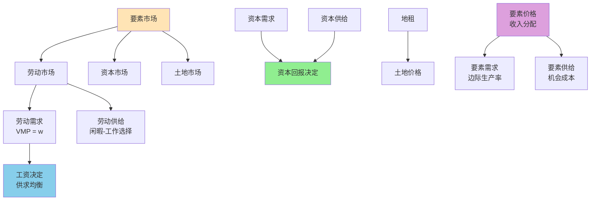

# 要素市场

## 主题概述

要素市场理论研究生产要素（劳动、资本、土地等）的价格决定机制和收入分配问题。本主题将深入探讨劳动市场、资本市场、土地市场、要素价格的决定以及收入分配等内容。要素市场理论是理解收入不平等、工资差异、资本回报等问题的重要工具。

---

### 要素市场分析框架



### 核心概念

### 1. 劳动市场

劳动市场是劳动力要素供求相互作用的市场。

#### 1.1 劳动需求

#### 劳动需求

**完全竞争企业的劳动需求**：
```
利润最大化：max π = P × f(L, K) - wL - rK
一阶条件：P × MP_L = w

劳动需求条件：VMP_L = w
其中VMP_L = P × MP_L为劳动的边际产值
```

**边际收益产品（Marginal Revenue Product, MRP）**：
```
MRP_L = MR × MP_L

完全竞争：MR = P，所以MRP_L = VMP_L
垄断：MR < P，所以MRP_L < VMP_L
```

**劳动需求曲线**：
```
劳动需求曲线就是MRP_L曲线
向下倾斜（因为MP_L递减）
```

#### 劳动供给

**个人的劳动供给决策**：
```
效用函数：U = u(C, L_e)
其中C为消费，L_e为闲暇
预算约束：C = w × (T - L_e)
其中T为总时间，T - L_e为工作时间

优化问题：
max u(C, L_e)
s.t. C = w × (T - L_e)

效用最大化条件：
MU_C/MU_Le = w
或：MRS_Le,C = w
```

**收入效应和替代效应**：
```
工资变化的效应：
1. 替代效应：工资上升，闲暇价格上升，减少闲暇
2. 收入效应：工资上升，实际收入增加，增加闲暇

如果替代效应 > 收入效应：劳动供给向上倾斜
如果收入效应 > 替代效应：劳动供给向后弯曲
```

**向后弯曲的劳动供给曲线**：
```
   w
   |
   |      S
**图形分析**：
```plotly
data:
  -
    type: scatter
    mode: lines
    name: 曲线 1
    x: [0, 20, 40, 60, 80, 100]
    y: [10, 30, 50, 70, 60, 40]
    line:
      color: "#1f77b4"
      width: 4
      shape: spline
layout:
  title:
    text: "劳动供给曲线 - 向后弯曲"
  xaxis:
    title:
      text: "劳动数量 L"
  yaxis:
    title:
      text: "工资率 w"
    range:
      - 0
      - 100
  template: "plotly_white"
  showlegend: true
config:
  displayModeBar: false
  responsive: true
```

**劳动供给曲线的特征**：
- 在低工资时：替代效应主导，劳动供给向上倾斜
- 在高工资时：收入效应主导，劳动供给向后弯曲
```

#### 劳动市场均衡

**完全竞争劳动市场**：
```
劳动需求：D_L = D_L(w)
劳动供给：S_L = S_L(w)

均衡条件：D_L(w) = S_L(w)
```

**劳动市场的特殊性**：
1. **异质性**：劳动者能力、技能、偏好不同
2. **制度因素**：最低工资、工会、劳动合同
3. **信息不对称**：雇主不完全了解劳动者能力
4. **流动性限制**：地区流动成本高

#### 1.4 工资差异的决定因素

工资差异是劳动市场的重要特征，主要决定因素包括：

**1. 教育水平差异**：
```
教育回报率：
r_e = (w_e - w_0)/w_0

其中：
- w_e为大学毕业生的平均工资
- w_0为高中毕业生的平均工资
- r_e为教育回报率

经验证据：发达国家的教育回报率约为8-12%
```

**2. 工作经验差异**：
```
明瑟收入方程：
ln(w) = β₀ + β₁S + β₂E + β₃E² + ε

其中：
- w为工资
- S为受教育年限
- E为工作经验
- β₁为教育回报率
- β₂为工作经验的一次项系数
- β₃为工作经验的二次项系数

工资-经验曲线呈倒U型
经验前期工资增长快，后期增长放缓
```

**3. 技能水平差异**：
```
技能溢价 = (w_high_skill - w_low_skill)/w_low_skill

技能溢价的决定因素：
- 技术偏向型技术进步
- 全球化导致的技能需求变化
- 教育供给不足

技能溢价趋势：
1980年代以来，技能溢价显著上升
```

**4. 行业差异**：
```
行业工资差异的来源：
- 垄断租金分享
- 工会化程度
- 工作条件差异
- 市场结构差异

高工资行业：金融、能源、信息技术
低工资行业：零售、餐饮、制造业
```

**5. 地区差异**：
```
地区工资差异的来源：
- 生活成本差异
- 劳动市场分割
- 产业集聚效应
- 地区发展不平衡

补偿性工资差异：
w_high = w_low + Δ
其中Δ为补偿性工资差异
```

**6. 性别和种族差异**：
```
性别工资差异：
w_male/w_female = 1.0 - gender_gap

种族工资差异：
w_white/w_minority = 1.0 - racial_gap

工资差异的分解：
总差异 = 可解释差异 + 不可解释差异（歧视）
```

#### 1.5 劳动市场流动性

**1. 地区流动性**：
```
迁移决策模型：
NPV_migration = Σ[(w_dest - w_origin - C_migration)/(1+r)^t]

迁移条件：NPV_migration > 0

迁移成本：
- 直接成本：交通、搬迁费用
- 间接成本：社会网络损失、心理成本
- 信息成本：信息不对称导致的风险
```

**2. 职业流动性**：
```
职业流动的类型：
- 垂直流动：向上或向下流动
- 水平流动：同等级流动
- 代际流动：代际职业变化

职业流动障碍：
- 人力资本专有性
- 劳动市场分割
- 制度性障碍
- 信息不对称
```

**3. 信息摩擦**：
```
搜寻理论：
max V = E[w] - C(s)

其中：
- V为期望净收益
- E[w]为期望工资
- C(s)为搜寻成本
- s为搜寻强度

最优搜寻规则：
接受工资 ≥ 保留工资
保留工资 = E[w] - C(s')
```

#### 1.6 劳动市场制度

**1. 最低工资制度**：
```
最低工资的影响：

效率损失：
DWL = 0.5 × (L_s - L_d) × (w_min - w*)

收入再分配效应：
取决于最低工资的覆盖范围和执法力度

可能的积极效应：
- 效率工资效应
- 减少贫困
- 促进公平
```

**2. 工会制度**：
```
工会的影响：

工资效应：
w_union = (1 + θ) × w_non_union
其中θ为工会工资溢价（通常为10-20%）

就业效应：
工会工资上升导致就业减少
就业弹性：ε_L = (ΔL/L)/(Δw/w)

配置效率：
工会可能导致资源错配
但可能改善工作条件和谈判地位
```

**3. 劳动合同制度**：
```
劳动合同的类型：
- 固定期限合同
- 无固定期限合同
- 兼职合同
- 灵活就业合同

劳动合同的经济学意义：
- 减少不确定性
- 保护劳动者权益
- 影响劳动市场灵活性
- 影响人力资本投资激励
```

**4. 社会保障制度**：
```
社会保障的类型：
- 养老保险
- 医疗保险
- 失业保险
- 工伤保险

社会保障的经济效应：
收入效应：减少劳动供给
替代效应：影响劳动-闲暇选择
风险分担：提供收入保障
人力资本投资：促进技能积累
```

### 2. 资本市场

资本市场是资本要素供求相互作用的市场。

#### 资本需求

**企业的投资决策**：
```
净现值（NPV）：
NPV = Σ[R_t/(1+r)^t] - I
其中：
- R_t为第t期的收益
- r为利率
- I为投资成本

投资决策：NPV > 0时投资
```

**资本需求曲线**：
```
资本需求与利率反向变化
利率上升，资本需求减少
资本需求曲线向下倾斜
```

#### 资本供给

**储蓄决策**：
```
跨期选择：
max U(C₁, C₂)
s.t. C₁ + C₂/(1+r) = Y₁ + Y₂/(1+r)

优化条件：MU₁/MU₂ = 1+r
或：MRS_1,2 = 1+r
```

**储蓄与利率的关系**：
```
收入效应：利率上升，未来消费更便宜，减少储蓄
替代效应：利率上升，现期消费更贵，增加储蓄

如果替代效应 > 收入效应：储蓄向上倾斜
如果收入效应 > 替代效应：储蓄向后弯曲
```

#### 2.4 利率的决定理论

**1. 可贷资金理论（Loanable Funds Theory）**：
```
可贷资金市场模型：

可贷资金需求：D_LF = I(r) + (G - T)
其中I为投资，(G - T)为政府赤字

可贷资金供给：S_LF = S(r) + (M_s - M_d)
其中S为私人储蓄，(M_s - M_d)为货币净供给

均衡条件：D_LF(r) = S_LF(r)

可贷资金需求曲线向下倾斜（利率上升，投资减少）
可贷资金供给曲线向上倾斜（利率上升，储蓄增加）
```

**可贷资金市场的图形分析**：
```plotly
data:
  -
    type: scatter
    mode: lines
    name: 曲线 1
    x: [0, 20, 40, 60, 80, 100]
    y: [2, 4, 6, 8, 10, 12]
    line:
      color: "#1f77b4"
      width: 4
      shape: spline
  -
    type: scatter
    mode: lines
    name: 曲线 2
    x: [0, 20, 40, 60, 80, 100]
    y: [12, 10, 8, 6, 4, 2]
    line:
      color: "#d62728"
      width: 4
      shape: spline
layout:
  title:
    text: "可贷资金市场均衡"
  xaxis:
    title:
      text: "可贷资金数量 L"
  yaxis:
    title:
      text: "利率 r"
    range:
      - 0
      - 12
  template: "plotly_white"
  showlegend: true
config:
  displayModeBar: false
  responsive: true
```

**均衡分析**：
- 供给曲线S_LF向上倾斜（利率上升，储蓄增加）
- 需求曲线D_LF向下倾斜（利率上升，投资减少）
- 均衡利率r*由供求决定
- 政府赤字增加导致需求曲线右移，利率上升
- 储蓄增加导致供给曲线右移，利率下降

**2. 流动性偏好理论（Liquidity Preference Theory）**：
```
凯恩斯的利率理论：

货币需求：M_d = L(Y, r)
∂M_d/∂Y > 0（收入增加，货币需求增加）
∂M_d/∂r < 0（利率上升，货币需求减少）

货币供给：M_s = M_bar（由中央银行决定）

均衡条件：M_d(Y, r) = M_s

利率决定于货币市场的供求均衡
```

**流动性偏好陷阱（Liquidity Trap）**：

在利率极低时，货币需求曲线变为水平，货币供给增加不再降低利率，货币政策失效。

```plotly
data:
  -
    type: scatter
    mode: lines
    name: 曲线 1
    x: [0, 20, 40, 60, 80, 100]
    y: [10, 8, 5, 2, 1, 1]
    line:
      color: "#1f77b4"
      width: 4
      shape: spline
layout:
  title:
    text: "流动性偏好陷阱"
  xaxis:
    title:
      text: "货币 M"
  yaxis:
    title:
      text: "利率 r"
    range:
      - 0
      - 10
  template: "plotly_white"
  showlegend: true
config:
  displayModeBar: false
  responsive: true
```
**说明**：当利率降至极低水平（如1%）时，货币需求曲线趋于水平，形成"流动性陷阱"。

**3. 实际利率理论（Real Interest Rate Theory）**：
```
费雪方程式：
(1 + i) = (1 + r) × (1 + π)

近似关系：
i ≈ r + π

其中：
- i为名义利率
- r为实际利率
- π为预期通货膨胀率

实际利率的决定：
r = f(储蓄偏好, 投资机会, 技术进步, 人口结构)
```

#### 2.5 投资决策模型

**1. 净现值法（Net Present Value Method）**：
```
NPV = Σ[R_t/(1+r)^t] - I₀

其中：
- R_t为第t期的净现金流
- r为折现率（资本成本）
- I₀为初始投资
- t从1到n

投资决策规则：
- NPV > 0：接受项目
- NPV = 0：无差异
- NPV < 0：拒绝项目

NPV法的优点：
- 考虑货币时间价值
- 考虑全部现金流
- 符合股东财富最大化
```

**2. 内部收益率法（Internal Rate of Return Method）**：
```
内部收益率IRR的定义：
Σ[R_t/(1+IRR)^t] - I₀ = 0

投资决策规则：
- IRR > r：接受项目
- IRR = r：无差异
- IRR < r：拒绝项目

IRR与NPV的关系：
- 独立项目：IRR和NPV给出相同决策
- 互斥项目：可能给出不同决策（NPV更优）

IRR的问题：
- 可能存在多个IRR
- 假设再投资率等于IRR
- 规模问题
```

**3. 调整现值法（Adjusted Present Value Method）**：
```
APV = NPV_unlevered + PV(financing effects)

其中：
- NPV_unlevered为无杠杆项目的净现值
- PV(financing effects)为融资效应的现值

融资效应包括：
- 税盾效应
- 发行成本
- 财务困境成本
- 补贴效应

APV适用于：
- 融资结构复杂的项目
- 分阶段投资决策
- 国际投资项目
```

#### 2.6 资本市场的均衡

**可贷资金市场的均衡机制**：
```
动态调整过程：

利率过高（r₁ > r*）：
- 可贷资金需求减少
- 可贷资金供给增加
- 可贷资金过剩
- 利率下降
- 向均衡调整

利率过低（r₂ < r*）：
- 可贷资金需求增加
- 可贷资金供给减少
- 可贷资金短缺
- 利率上升
- 向均衡调整

均衡条件：
D_LF(r*) = S_LF(r*)
```

**利率调节机制**：
```
1. 价格机制：
利率上升 → 资本需求减少、资本供给增加

2. 数量机制：
可贷资金数量调整以实现供求平衡

3. 预期机制：
预期变化影响资本需求和供给

4. 制度机制：
央行政策影响货币供给
```

#### 2.7 风险与收益

**1. 风险溢价（Risk Premium）**：
```
风险溢价 = 期望收益 - 无风险利率

r_i = r_f + RP_i

其中：
- r_i为资产i的期望收益
- r_f为无风险利率
- RP_i为资产i的风险溢价

风险溢价的决定因素：
- 系统性风险
- 流动性风险
- 违约风险
- 期限风险
```

**2. 风险与收益的权衡**：
```
资本资产定价模型（CAPM）：
E[r_i] = r_f + β_i × (E[r_m] - r_f)

其中：
- E[r_i]为资产i的期望收益
- r_f为无风险利率
- β_i为资产i的贝塔系数
- E[r_m]为市场组合的期望收益
- (E[r_m] - r_f)为市场风险溢价

贝塔系数：
β_i = Cov(r_i, r_m)/Var(r_m)

β的经济含义：
- β = 1：资产风险等于市场风险
- β > 1：资产风险高于市场风险
- β < 1：资产风险低于市场风险
- β = 0：资产无系统性风险
```

**CAPM的图形分析（证券市场线）**：
```plotly
data:
  -
    type: scatter
    mode: lines
    name: 曲线 1
    x: [0, 0.5, 1, 1.5, 2]
    y: [4, 8, 12, 16, 20]
    line:
      color: "#1f77b4"
      width: 4
      shape: spline
layout:
  title:
    text: "证券市场线 (SML)"
  xaxis:
    title:
      text: "贝塔系数 β"
  yaxis:
    title:
      text: "期望收益 Er"
    range:
      - 0
      - 20
  template: "plotly_white"
  showlegend: true
config:
  displayModeBar: false
  responsive: true
```

**证券市场线（SML）的性质**：
- 纵截距：无风险利率r_f
- 斜率：市场风险溢价(E[r_m] - r_f)
- 反映风险与收益的线性关系
- β=0：纵轴交点为无风险利率
- β=1：市场组合的预期收益

**3. 有效市场假说**：
```
有效市场的类型：

弱式有效：
- 历史价格信息已反映在价格中
- 技术分析无效

半强式有效：
- 公开信息已反映在价格中
- 基本分析无效

强式有效：
- 所有信息（包括内幕信息）已反映在价格中
- 内幕交易无效
```

### 3. 土地市场

土地市场是土地要素供求相互作用的市场。

#### 土地的特点

**1. 固定供给**：
```
土地供给是固定的
供给曲线垂直
完全缺乏弹性
```

**2. 异质性**：
```
位置、肥力、用途不同
土地质量差异大
```

#### 地租的决定

**地租（Rent）**：
```
地租由土地的边际产值决定
R = P × MP_Land
```

**地租的分类**：
1. **经济地租**：土地所有者获得的超过机会成本的收益
2. **准地租**：短期内固定要素的收益
3. **级差地租**：土地质量差异导致的地租差异

**亨利·乔治定理**：
```
地租税不产生无谓损失
因为土地供给完全无弹性
```

### 4. 要素价格的决定

#### 边际生产力理论

**边际生产力理论（Marginal Productivity Theory）**：
```
在完全竞争市场，要素价格等于要素的边际产值：
w = P × MP_L
r = P × MP_K
R = P × MP_Land
```

**欧拉定理（Euler's Theorem）**：
```
如果生产函数具有规模报酬不变性质：
Q = MP_L × L + MP_K × K

完全竞争下：
P × Q = P × MP_L × L + P × MP_K × K
TR = wL + rK

总产出等于要素报酬之和
```

#### 要素价格均等化

**要素价格均等化定理**：
```
在自由贸易条件下，各国要素价格趋于均等化

原因：
贸易导致商品价格均等化
商品价格均等化导致要素价格均等化
```

### 5. 收入分配

#### 功能性收入分配

**功能性收入分配（Functional Distribution of Income）**：
```
劳动收入份额：θ_L = wL/(wL + rK + R)
资本收入份额：θ_K = rK/(wL + rK + R)
土地收入份额：θ_T = R/(wL + rK + R)

约束条件：θ_L + θ_K + θ_T = 1
```

**功能性收入分配与个人收入分配的区别**：

**1. 分析层面不同**：
```
功能性收入分配：
- 分析生产要素的份额
- 宏观层面的分配问题
- 关注工资、利润、地租的比例

个人收入分配：
- 分析个人或家庭的收入分布
- 微观层面的分配问题
- 关注收入不平等程度
```

**2. 决定因素不同**：
```
功能性收入分配的决定因素：
- 技术进步（偏向性）
- 要素替代弹性
- 市场结构
- 制度因素

个人收入分配的决定因素：
- 人力资本差异
- 财富分配
- 劳动市场特征
- 社会政策
```

**3. 政策含义不同**：
```
功能性收入分配政策：
- 财政政策（税收、补贴）
- 产业政策
- 技术政策

个人收入分配政策：
- 税收和转移支付
- 社会保障
- 教育、培训
- 反歧视政策
```

**功能性收入分配的长期趋势**：
```
卡尔多典型事实（Kaldor's Stylized Facts）：
1. 劳动收入份额相对稳定
2. 资本-产出比率相对稳定
3. 资本实际回报率相对稳定

近期变化：
- 劳动收入份额下降（发达国家）
- 资本收入份额上升
- 技能偏向型技术进步的影响
- 全球化的影响
```

#### 5.2 洛伦兹曲线和基尼系数

**洛伦兹曲线（Lorenz Curve）**：
```
衡量收入不平等程度
横轴：人口累计百分比
纵轴：收入累计百分比

完全平等：45度线
实际收入分配：向右下方弯曲的曲线
```

**基尼系数（Gini Coefficient）**：
```
基尼系数 = A/(A + B)
其中：
- A为洛伦兹曲线与45度线之间的面积
- B为洛伦兹曲线右下方的面积

基尼系数 ∈ [0, 1]
0表示完全平等
1表示完全不平等
```

**收入不平等的国际比较**：
```
国家/地区        基尼系数    不平等程度
---------------------------------
北欧国家         0.25-0.30   低
西欧大陆国家     0.30-0.35   中低
加拿大、澳大利亚 0.32-0.36   中等
美国             0.40-0.45   中高
拉丁美洲         0.45-0.55   高
南非             0.60-0.65   极高

基尼系数的国际趋势：
1. 1980年代以来，发达国家基尼系数上升
2. 全球化加剧了收入不平等
3. 技术进步加剧了技能溢价
4. 税收和转移支付政策减缓了不平等
```

**收入分配的国际比较图**：
**基尼系数国际比较**：
```plotly
data:
  -
    type: scatter
    mode: lines
    name: 曲线 1
    x: ["南非", "巴西", "美国", "中国", "德国", "瑞典", "挪威"]
    y: [0.63, 0.51, 0.41, 0.38, 0.35, 0.31, 0.27]
    line:
      color: "#1f77b4"
      width: 4
      shape: spline
layout:
  title:
    text: "各国基尼系数比较"
  xaxis:
    title:
      text: "国家"
  yaxis:
    title:
      text: "基尼系数"
    range:
      - 0
      - 0.7
  template: "plotly_white"
  showlegend: true
config:
  displayModeBar: false
  responsive: true
```

**说明**：
- 南非、巴西：不平等程度最高（0.5以上）
- 美国、中国：不平等程度中等（0.4左右）
- 德国、瑞典、挪威：不平等程度最低（0.3左右）
- 北欧国家通常采用高税收和高福利政策，缩小收入差距

#### 5.3 收入流动性与贫困陷阱

**1. 收入流动性（Income Mobility）**：
```
收入流动性的类型：

代际收入弹性：
ρ = ln(y_child)/ln(y_parent)

其中：
- y_child为子女收入
- y_parent为父母收入

ρ的经济含义：
- ρ = 0：完全流动性（子女收入与父母收入无关）
- ρ = 1：完全不流动（子女收入与父母收入完全相关）
- 发达国家ρ ≈ 0.2-0.5
- 发展中国家ρ ≈ 0.5-0.8

收入转移矩阵：
P_ij = Pr(y_{t+1}=j | y_t=i)

其中：
- i为t时期的收入组别
- j为t+1时期的收入组别
- P_ij为从i组转移到j组的概率
```

**2. 贫困陷阱（Poverty Trap）**：
```
贫困陷阱的定义：
长期处于贫困状态，难以脱贫

贫困陷阱的模型：
y_t = f(k_t)
k_{t+1} = s·y_t - δ·k_t

其中：
- y_t为t期收入
- k_t为t期资本
- s为储蓄率
- δ为折旧率

贫困陷阱的条件：
f(k)在低水平时有较低的边际产出
需要积累一定的初始资本才能跳出陷阱

图形表示：
```plotly
data:
  -
    type: scatter
    mode: lines
    name: 曲线 1
    x: [0, 20, 40, 60, 80, 100]
    y: [10, 30, 80, 110, 130, 150]
    line:
      color: "#1f77b4"
      width: 4
      shape: spline
layout:
  title:
    text: "贫困陷阱"
  xaxis:
    title:
      text: "人均资本 k"
  yaxis:
    title:
      text: "人均收入"
    range:
      - 0
      - 150
  template: "plotly_white"
  showlegend: true
config:
  displayModeBar: false
  responsive: true
```

**贫困陷阱的图形分析**：

**图形解释**：
- k*为最低临界资本
- 低于k*时，收入增长缓慢（贫困陷阱）
- 高于k*时，收入快速增长
```

**贫困陷阱的成因**：
```
1. 人力资本贫困：
   - 教育投资不足
   - 健康状况差
   - 技能缺乏

2. 财务贫困：
   - 缺乏初始资本
   - 借贷约束
   - 高利贷陷阱

3. 制度贫困：
   - 制度不完善
   - 产权保护不足
   - 社会保障缺失

4. 地理贫困：
   - 地理位置偏远
   - 自然条件恶劣
   - 基础设施落后
```

#### 5.4 收入再分配政策

**1. 税收政策**：
```
税收的类型：

1. 个人所得税：
   - 累进税率
   - 高收入者税率高
   - 低收入者税率低

   税收公式：
   T = Σ[(Y_i - Y_i-1) × t_i]

   其中：
   - Y_i为第i级应纳税所得额
   - t_i为第i级税率

2. 资本利得税：
   - 对资本增值征税
   - 影响资本积累
   - 税率通常低于所得税

3. 遗产税/赠与税：
   - 减少财富代际传递
   - 促进机会平等
   - 征管难度大
```

**2. 转移支付**：
```
转移支付的类型：

1. 现金转移：
   - 养老金
   - 失业救济
   - 低保
   - 儿童津贴

2. 实物转移：
   - 医疗保险
   - 教育补贴
   - 住房补贴
   - 食品券

转移支付的经济效应：
- 减少贫困
- 改善收入分配
- 产生工作激励问题
- 增加财政负担
```

**3. 社会救助**：
```
社会救助的特点：

1. 目标性：
   - 针对贫困人口
   - 需要进行家计调查

2. 救助水平：
   - 通常低于贫困线
   - 避免福利依赖

3. 退出机制：
   - 收入增加后逐渐减少救助
   - 避免悬崖效应

社会救助的效率损失：
边际税率高 → 工作激励弱 → 福利陷阱
```

**收入再分配的权衡**：
```
效率-公平权衡：
- 再分配改善公平
- 但产生效率损失

最优再分配：
max U(效率, 公平)
s.t. 预算约束

实际政策考虑：
- 再分配的边际收益递减
- 再分配的成本递增
- 需要平衡效率和公平
```

#### 收入不平等的原因

**1. 人力资本差异**：
- 教育水平
- 工作经验
- 技能培训

**2. 资本积累差异**：
- 继承财富
- 储蓄率差异
- 投资回报差异

**3. 歧视和偏见**：
- 性别歧视
- 种族歧视
- 年龄歧视

**4. 运气和机会**：
- 出生家庭
- 地理位置
- 时代机遇

### 6. 人力资本理论

人力资本理论是理解劳动市场和个人收入分配的重要理论框架。

#### 6.1 人力资本的概念

**人力资本（Human Capital）**：
```
定义：体现在劳动者身上的知识、技能、健康等素质的总和

人力资本的特点：
1. 依附于劳动者个体
2. 通过投资获得
3. 产生收益流
4. 具有折旧特性
5. 存在投资回报率
```

**人力资本与物质资本的对比**：
```
共同点：
1. 都需要投资
2. 都能产生收益
3. 都会折旧
4. 都存在最优投资水平

差异：
1. 不可分离性（人力资本与劳动者不可分离）
2. 风险差异（人力资本风险更高）
3. 流动性差异（人力资本流动性较低）
4. 测量难度（人力资本难以直接测量）
```

#### 6.2 教育投资

**1. 教育投资决策模型**：
```
贝克尔教育投资模型：

净现值法：
NPV_education = Σ[(w_e - w_0)/(1+r)^t] - C_education

其中：
- w_e为受教育后的工资
- w_0为未受教育的工资
- r为折现率
- C_education为教育成本（直接成本+机会成本）

投资决策规则：
- NPV > 0：投资教育
- NPV = 0：无差异
- NPV < 0：不投资教育
```

**人力资本投资决策分析**：
```plotly
data:
  -
    type: scatter
    mode: lines
    name: 曲线 1
    x: [0, 20, 40, 60, 80, 100]
    y: [0, 40, 70, 90, 100, 105]
    line:
      color: "#1f77b4"
      width: 4
      shape: spline
  -
    type: scatter
    mode: lines
    name: 曲线 2
    x: [0, 20, 40, 60, 80, 100]
    y: [0, 20, 40, 60, 80, 100]
    line:
      color: "#d62728"
      width: 4
      shape: spline
layout:
  title:
    text: "人力资本投资决策"
  xaxis:
    title:
      text: "教育投资成本"
  yaxis:
    title:
      text: "折现收益"
    range:
      - 0
      - 150
  template: "plotly_white"
  showlegend: true
config:
  displayModeBar: false
  responsive: true
```

**决策规则**：
- 当折现收益 > 教育成本时，投资教育
- 最优投资点在边际收益 = 边际成本处（两条线交点）

**2. 教育回报率**：
```
明瑟教育回报率：
ln(w) = β₀ + β₁S + β₂E + β₃E² + ε

其中：
- β₁为教育回报率（每年多受教育的收益）
- S为受教育年限
- E为工作经验

教育回报率的国际差异：
- 发达国家：8-12%
- 发展中国家：10-15%
- 中国：8-10%

影响教育回报率的因素：
- 经济发展阶段
- 技术进步速度
- 教育质量
- 劳动市场制度
```

**3. 信号理论（Signaling Theory）**：
```
斯彭斯的信号理论：

教育作为信号：
- 高能力者教育成本低
- 低能力者教育成本高
- 教育水平反映能力

信号均衡：
分离均衡：不同能力者选择不同教育水平
混同均衡：不同能力者选择相同教育水平

信号理论的政策含义：
- 教育可能增加社会成本
- 过度教育可能存在
- 信号价值可能超过生产价值
```

#### 6.3 技能培训

**1. 一般培训（General Training）**：
```
定义：在多个企业都有用的培训

特点：
- 培训收益归劳动者
- 劳动者承担培训成本
- 工资反映培训收益

成本-收益分析：
C_training = Σ[w_post/(1+r)^t] - w_pre

培训决策：
劳动者承担成本，获得全部收益
企业不愿意投资一般培训
```

**2. 专门培训（Specific Training）**：
```
定义：仅在特定企业有用的培训

特点：
- 培训收益在企业和劳动者间分享
- 企业和劳动者分担培训成本

成本-收益分配：
企业承担部分成本，获得部分收益
劳动者承担部分成本，获得部分收益
形成长期劳动关系

工资结构：
w_pre < MP_pre（企业补贴培训）
w_post < MP_post（企业收回投资）
```

#### 6.4 经验积累

**1. 干中学（Learning by Doing）**：
```
干中学模型：
MP = A·L^α
A = A₀·L^β

其中：
- A为技术水平
- β为干中学效应

学习曲线：
单位成本随着累计产量下降
经验越丰富，效率越高
```

**2. 工作经验的收益**：
```
工资-经验关系：
w = β₀ + β₁S + β₂E + β₃E²

经验收益的倒U型：
- 早期：经验快速积累，工资增长快
- 中期：经验积累放缓，工资增长放缓
- 后期：技能折旧，工资可能下降

经验收益的影响因素：
- 职业类型
- 技术进步速度
- 个人学习能力
- 工作机会
```

#### 6.5 人力资本回报

**1. 人力资本回报的长期趋势**：
```
技能偏向型技术进步（SBTC）：
- 高技能劳动力需求增加
- 低技能劳动力需求减少
- 技能溢价上升

全球化的影响：
- 发达国家：技能需求上升，低技能工资下降
- 发展中国家：低技能需求上升，工资上升

人力资本回报的国际差异：
- 教育、技能、经验的回报率不同
- 劳动市场制度影响
- 经济发展阶段影响
```

**2. 人力资本投资不足的原因**：
```
1. 借贷约束：
   - 教育成本高
   - 无法获得贷款
   - 资金不足导致投资不足

2. 信息不完全：
   - 不了解教育回报
   - 不了解未来需求
   - 风险厌恶导致投资不足

3. 时间不一致性：
   - 现在偏好高，未来偏好低
   - 短期主义
   - 延迟投资

4. 外部性：
   - 教育正外部性
   - 私人收益 < 社会收益
   - 私人投资不足
```

### 7. 劳动市场歧视

劳动市场歧视是导致收入不平等的重要因素之一。

#### 7.1 歧视的定义和类型

**歧视（Discrimination）**：
```
定义：在同等条件下，基于个人特征（如性别、种族、年龄等）
给予不同待遇

歧视的表现形式：
1. 工资歧视：同工不同酬
2. 雇佣歧视：就业机会不平等
3. 晋升歧视：晋升机会不平等
4. 职业歧视：职业隔离
```

**歧视的类型**：

**1. 统计性歧视（Statistical Discrimination）**：
```
基于群体平均特征进行判断

模型：
E[MP_i | Group] = E[MP | Group]

雇主使用群体信息替代个体信息
因为获取个体信息成本高

统计性歧视的合理性：
- 节省信息成本
- 降低雇佣风险
- 但产生不公平结果

示例：
- 某群体平均教育水平低，雇主降低该群体工资
- 某群体离职率高，雇主不雇佣该群体
```

**2. 偏好性歧视（Taste-Based Discrimination）**：
```
贝克尔歧视理论：

雇主歧视：
雇主有歧视偏好，愿意支付"歧视税"
雇主效用：U = π - d·w_minority
其中d为歧视系数

员工歧视：
员工不愿意与被歧视群体共事
要求更高的工资补偿

顾客歧视：
顾客不愿意接受被歧视群体的服务
影响该群体的就业和工资
```

**3. 人力资本歧视**：
```
基于人力资本差异的歧视

表现形式：
- 教育机会不平等
- 培训机会不平等
- 经验积累机会不平等

结果：
- 人力资本积累不足
- 生产率差异
- 收入差异

人力资本歧视与统计性歧视的区别：
- 人力资本歧视是历史和制度原因
- 统计性歧视是信息问题
- 但两者相互强化
```

**4. 市场分割理论（Market Segmentation Theory）**：
```
双重劳动市场理论：

一级市场（Primary Market）：
- 高工资、好福利
- 工作稳定、晋升机会多
- 主要由优势群体占据

二级市场（Secondary Market）：
- 低工资、差福利
- 工作不稳定、晋升机会少
- 主要由弱势群体占据

市场分割的原因：
- 制度因素
- 社会规范
- 歧视和偏见

市场分割的后果：
- 劳动流动性低
- 收入差距固化
- 歧视长期存在
```

#### 7.2 歧视的测量

**1. 工资差距的分解（Oaxaca-Blinder分解）**：
```
总工资差距 = 可解释差距 + 不可解释差距

分解公式：
ln(w_m) - ln(w_f) = X_m'β_m - X_f'β_f
                = (X_m' - X_f')β_m + X_f'(β_m - β_f)
                = 特征差异 + 系数差异

其中：
- X为特征向量（教育、经验等）
- β为系数
- 特征差异：可解释部分
- 系数差异：不可解释部分（歧视）

示例：性别工资差距
总差距 = 20%
特征差异 = 8%
不可解释差距（歧视） = 12%
```

**2. 歧视系数**：
```
歧视系数 = (w_majority - w_minority)/w_minority

其中：
- w_majority为优势群体工资
- w_minority为弱势群体工资

示例：
男性工资 = 100
女性工资 = 80
歧视系数 = (100 - 80)/80 = 0.25（25%）
```

#### 7.3 歧视的经济影响

**1. 效率损失**：
```
歧视导致资源配置低效：

1. 劳动市场分割：
   - 人才浪费
   - 效率损失
   - 产出降低

2. 工资扭曲：
   - 同工不同酬
   - 劳动激励降低
   - 努力程度下降

3. 人力资本投资不足：
   - 投资回报降低
   - 人力资本积累不足
   - 长期效率损失

歧视的效率损失可以用以下方法估计：
- 机会成本法
- 生产函数法
- 实验方法
```

**2. 福利损失**：
```
歧视导致福利分配不均：

优势群体：
- 可能获得超额收益
- 但存在道德成本

弱势群体：
- 收入减少
- 福利下降
- 机会不平等

社会福利：
- 总福利可能下降（效率损失）
- 福利分配恶化
- 社会不平等加剧
```

#### 7.4 反歧视政策

**1. 平等就业机会法**：
```
法律框架：
- 禁止基于性别、种族、年龄等的歧视
- 强制企业实行平等就业政策
- 建立投诉和救济机制

执行机制：
- 举报制度
- 调查制度
- 处罚制度
- 补偿制度

效果评估：
- 降低工资差距
- 改善就业机会
- 改变社会规范
```

**2. 平权行动（Affirmative Action）**：
```
政策工具：
1. 目标配额制
   - 设定少数群体就业比例
   - 强制执行配额

2. 偏向性政策
   - 少数群体优先考虑
   - 适当降低标准

3. 激励措施
   - 企业税收优惠
   - 政府采购倾斜

争议：
- 公平性争议
- 效率性争议
- 逆向歧视问题
```

**3. 其他政策**：
```
1. 教育政策：
   - 促进教育机会平等
   - 消除教育歧视

2. 培训政策：
   - 提供技能培训
   - 提高就业能力

3. 反贫困政策：
   - 最低工资
   - 社会救助
   - 税收优惠

4. 社会规范：
   - 宣传教育
   - 法律保护
   - 社会监督
```

## 重要模型和公式

### 1. 劳动需求

**完全竞争企业**：
```
VMP_L = P × MP_L = w
劳动需求：L = D_L(w)
```

**垄断企业**：
```
MRP_L = MR × MP_L = w
MR < P，所以劳动需求较少
```

### 2. 劳动供给

**个人劳动供给**：
```
max u(C, L_e)
s.t. C = w(T - L_e)

最优条件：MU_C/MU_Le = w
```

### 3. 资本需求和供给

**投资决策**：
```
NPV = Σ[R_t/(1+r)^t] - I
投资规则：NPV > 0
```

**储蓄决策**：
```
max U(C₁, C₂)
s.t. C₁ + C₂/(1+r) = Y₁ + Y₂/(1+r)

最优条件：MU₁/MU₂ = 1+r
```

### 4. 基尼系数

```
基尼系数 = A/(A + B)
```

### 5. 人力资本投资模型

**教育投资决策（净现值法）**：
```
NPV_education = Σ[(w_e - w_0)/(1+r)^t] - C_education

其中：
- w_e为受教育后的工资
- w_0为未受教育的工资
- r为折现率
- C_education为教育成本
- t为工作年限

投资决策规则：
- NPV > 0：投资教育
- NPV = 0：无差异
- NPV < 0：不投资教育
```

**明瑟收入方程**：
```
ln(w) = β₀ + β₁S + β₂E + β₃E² + ε

其中：
- w为工资
- S为受教育年限
- E为工作经验
- β₁为教育回报率
- β₂为工作经验的一次项系数
- β₃为工作经验的二次项系数
- ε为误差项

教育回报率：
r_e = w(e^β₁ - 1)

工资-经验曲线：
∂w/∂E = β₂ + 2β₃E
```

**最优教育年限**：
```
边际收益 = 边际成本：
∂(w_e - w_0)/∂S = ∂C_education/∂S

最优教育年限S*满足：
β₁ × w_e = MC_education

其中MC_education为教育的边际成本
```

### 6. 可贷资金市场模型

**可贷资金市场均衡**：
```
可贷资金需求：
D_LF = I(r) + (G - T)

可贷资金供给：
S_LF = S(r) + (M_s - M_d)

均衡条件：
I(r*) + (G - T) = S(r*) + (M_s - M_d)

均衡利率r*由供求决定
```

**投资函数**：
```
I(r) = I₀ - αr

其中：
- I₀为自发投资
- α为投资对利率的敏感度
- r为利率

投资弹性：
ε_I = (ΔI/I)/(Δr/r) = -αr/I
```

**储蓄函数**：
```
S(r) = S₀ + βr

其中：
- S₀为自发储蓄
- β为储蓄对利率的敏感度
- r为利率

储蓄弹性：
ε_S = (ΔS/S)/(Δr/r) = βr/S
```

**政府赤字的影响**：
```
政府赤字增加 → 可贷资金需求增加
需求曲线右移 → 均衡利率上升 → 投资减少（挤出效应）

挤出系数：
k = ΔI/Δ(G - T)
```

### 7. 资本资产定价模型（CAPM）

**CAPM基本公式**：
```
E[r_i] = r_f + β_i × (E[r_m] - r_f)

其中：
- E[r_i]为资产i的期望收益
- r_f为无风险利率
- β_i为资产i的贝塔系数
- E[r_m]为市场组合的期望收益
- (E[r_m] - r_f)为市场风险溢价
```

**贝塔系数的计算**：
```
β_i = Cov(r_i, r_m)/Var(r_m)

其中：
- Cov(r_i, r_m)为资产i收益与市场收益的协方差
- Var(r_m)为市场收益的方差

计算方法：
β_i = ρ_im × (σ_i/σ_m)

其中：
- ρ_im为相关系数
- σ_i为资产i收益的标准差
- σ_m为市场收益的标准差
```

**证券市场线（SML）**：
```
E[r] = r_f + β × (E[r_m] - r_f)

斜率 = (E[r_m] - r_f)
纵截距 = r_f

证券位于SML上方：被低估
证券位于SML下方：被高估
证券位于SML上：正确估值
```

**投资组合的贝塔系数**：
```
β_p = Σ[w_i × β_i]

其中：
- w_i为资产i在组合中的权重
- β_i为资产i的贝塔系数

投资组合的期望收益：
E[r_p] = r_f + β_p × (E[r_m] - r_f)
```

**CAPM的应用**：
```
1. 资产估值：
   - 计算必要收益率
   - 比较实际收益率
   - 判断资产定价

2. 投资决策：
   - 计算项目资本成本
   - 评估项目NPV
   - 投资决策

3. 绩效评估：
   - 计算超额收益
   - 评估投资绩效
   - 调整风险收益
```

### 8. Oaxaca-Blinder分解

**工资差距分解公式**：
```
总工资差距：
ln(w_m) - ln(w_f) = (X_m - X_f)'β_m + X_f'(β_m - β_f)

其中：
- 特征差异（可解释部分）：
  E = (X_m - X_f)'β_m

- 系数差异（不可解释部分）：
  C = X_f'(β_m - β_f)

可解释比例：
ratio_E = E / (E + C)

不可解释比例（歧视）：
ratio_C = C / (E + C)
```

## 重要图形分析

### 1. 人力资本投资决策图

**教育投资的净现值分析**：

```plotly
data:
  -
    type: scatter
    mode: lines
    name: 曲线 1
    x: [0, 4, 8, 12, 16, 20]
    y: [0, 30, 55, 75, 90, 100]
    line:
      color: "#1f77b4"
      width: 4
      shape: spline
  -
    type: scatter
    mode: lines
    name: 曲线 2
    x: [0, 4, 8, 12, 16, 20]
    y: [0, 20, 40, 60, 80, 100]
    line:
      color: "#d62728"
      width: 4
      shape: spline
layout:
  title:
    text: "教育投资的净现值分析"
  xaxis:
    title:
      text: "教育年限"
  yaxis:
    title:
      text: "折现收益（万元）"
    range:
      - 0
      - 100
  template: "plotly_white"
  showlegend: true
config:
  displayModeBar: false
  responsive: true
```
**解释**：
- 蓝色线：折现收益 Σ[(w_e - w_0)/(1+r)^t]
- 橙色线：教育成本（直接成本+机会成本）
- 当折现收益 > 教育成本时，投资教育是值得的
- 最优投资点在边际收益 = 边际成本处

**工资-经验曲线**：
```plotly
data:
  -
    type: scatter
    mode: lines
    name: 曲线 1
    x: [0, 5, 10, 15, 20, 25, 30, 35, 40]
    y: [30, 50, 75, 95, 110, 120, 125, 128, 130]
    line:
      color: "#1f77b4"
      width: 4
      shape: spline
layout:
  title:
    text: "工资-经验曲线"
  xaxis:
    title:
      text: "工作经验年限 E"
  yaxis:
    title:
      text: "工资 w"
    range:
      - 0
      - 150
  template: "plotly_white"
  showlegend: true
config:
  displayModeBar: false
  responsive: true
```
**说明**：工资随经验增长先快后慢，呈现凹函数特征。

### 2. 可贷资金市场均衡图

**可贷资金市场**：

```plotly
data:
  -
    type: scatter
    mode: lines
    name: 曲线 1
    x: [0, 20, 40, 60, 80, 100]
    y: [12, 10, 8, 6, 4, 2]
    line:
      color: "#1f77b4"
      width: 4
      shape: spline
  -
    type: scatter
    mode: lines
    name: 曲线 2
    x: [0, 20, 40, 60, 80, 100]
    y: [2, 4, 6, 8, 10, 12]
    line:
      color: "#d62728"
      width: 4
      shape: spline
layout:
  title:
    text: "可贷资金市场均衡"
  xaxis:
    title:
      text: "可贷资金数量"
  yaxis:
    title:
      text: "利率 r"
    range:
      - 0
      - 12
  template: "plotly_white"
  showlegend: true
config:
  displayModeBar: false
  responsive: true
```
    x-axis "可贷资金数量 L" [0, 20, 40, 60, 80, 100]
    y-axis "利率 r" 0 --> 12
    line [2, 4, 6, 8, 10, 12]
    line [12, 10, 8, 6, 4, 2]
```

**解释**：
```plotly
data:
  -
    type: scatter
    mode: lines
    name: 曲线 1
    x: [0, 20, 40, 60, 80, 100]
    y: [2, 4, 6, 8, 10, 12]
    line:
      color: "#1f77b4"
      width: 4
      shape: spline
  -
    type: scatter
    mode: lines
    name: 曲线 2
    x: [0, 20, 40, 60, 80, 100]
    y: [12, 10, 8, 6, 4, 2]
    line:
      color: "#d62728"
      width: 4
      shape: spline
  -
    type: scatter
    mode: lines
    name: 曲线 3
    x: [0, 20, 40, 60, 80, 100]
    y: [14, 12, 10, 8, 6, 4]
    line:
      color: "#2ca02c"
      width: 4
      shape: spline
layout:
  title:
    text: "挤出效应分析"
  xaxis:
    title:
      text: "可贷资金数量 L"
  yaxis:
    title:
      text: "利率 r"
    range:
      - 0
      - 12
  template: "plotly_white"
  showlegend: true
config:
  displayModeBar: false
  responsive: true
```

**解释**：
- 政府赤字增加 → 可贷资金需求增加
- 需求曲线从D_LF₁右移到D_LF₂
- 均衡利率从r₁上升到r₂
- 产生挤出效应（私人投资减少）

### 3. 风险与收益关系图

**证券市场线（SML）**：
```plotly
data:
  -
    type: scatter
    mode: lines
    name: 曲线 1
    x: [0, 0.5, 1, 1.5, 2]
    y: [4, 8, 12, 16, 20]
    line:
      color: "#1f77b4"
      width: 4
      shape: spline
layout:
  title:
    text: "证券市场线 (SML)"
  xaxis:
    title:
      text: "贝塔系数 β"
  yaxis:
    title:
      text: "期望收益 Er"
    range:
      - 0
      - 20
  template: "plotly_white"
  showlegend: true
config:
  displayModeBar: false
  responsive: true
```

**解释**：
- 纵轴：期望收益
- 横轴：贝塔系数
- SML：证券市场线
- r_f：无风险利率（纵截距）
- r_m：市场组合收益
- 斜率：市场风险溢价(E[r_m] - r_f)
- 证券位于SML上方：被低估
- 证券位于SML下方：被高估

**资本市场线（CML）**：
```plotly
data:
  -
    type: scatter
    mode: lines
    name: 曲线 1
    x: [0, 5, 10, 15, 20, 25, 30]
    y: [4, 7, 10, 13, 16, 19, 22]
    line:
      color: "#1f77b4"
      width: 4
      shape: spline
layout:
  title:
    text: "资本市场线 (CML)"
  xaxis:
    title:
      text: "组合标准差 σ"
  yaxis:
    title:
      text: "期望收益 Er"
    range:
      - 0
      - 22
  template: "plotly_white"
  showlegend: true
config:
  displayModeBar: false
  responsive: true
```
  +---------- 标准差 σ
  |    r_f

解释：
- 纵轴：期望收益
- 横轴：标准差（总风险）
- CML：资本市场线
- r_f：无风险利率
- r_m：市场组合收益
- σ_m：市场组合标准差
- CML反映有效前沿
```

### 4. 工资差异的决定因素图

**教育对工资的影响**：
```
工资 w
  |
  |      大学毕业生
  |     /
  |    /
  |   /   w_e
  |  /
  | /
  |/___________ 教育年限 S
  |    w_0
  |    高中毕业生
  |_______________

解释：
- 教育水平提高，工资水平上升
- 教育回报率 = (w_e - w_0)/w_0
- 教育回报率通常在8-15%之间
```

**技能溢价趋势**：
```plotly
data:
  -
    type: scatter
    mode: lines
    name: 曲线 1
    x: [1980, 1990, 2000, 2010, 2020]
    y: [1.2, 1.4, 1.6, 1.8, 2.0]
    line:
      color: "#1f77b4"
      width: 4
      shape: spline
layout:
  title:
    text: "技能溢价趋势"
  xaxis:
    title:
      text: "年份"
  yaxis:
    title:
      text: "技能溢价倍数"
    range:
      - 0
      - 3
  template: "plotly_white"
  showlegend: true
config:
  displayModeBar: false
  responsive: true
```

**解释**：

### 5. 收入分配的国际比较图

**洛伦兹曲线比较**：
```plotly
data:
  -
    type: scatter
    mode: lines
    name: 曲线 1
    x: [0, 25, 50, 75, 100]
    y: [0, 25, 50, 75, 100]
    line:
      color: "#1f77b4"
      width: 4
      shape: spline
  -
    type: scatter
    mode: lines
    name: 曲线 2
    x: [0, 25, 50, 75, 100]
    y: [0, 30, 55, 80, 100]
    line:
      color: "#d62728"
      width: 4
      shape: spline
  -
    type: scatter
    mode: lines
    name: 曲线 3
    x: [0, 25, 50, 75, 100]
    y: [0, 20, 40, 65, 100]
    line:
      color: "#2ca02c"
      width: 4
      shape: spline
  -
    type: scatter
    mode: lines
    name: 曲线 4
    x: [0, 25, 50, 75, 100]
    y: [0, 15, 35, 60, 100]
    line:
      color: "#9467bd"
      width: 4
      shape: spline
layout:
  title:
    text: "洛伦兹曲线国际比较"
  xaxis:
    title:
      text: "累计人口比例"
  yaxis:
    title:
      text: "累计收入比例"
    range:
      - 0
      - 100
  template: "plotly_white"
  showlegend: true
config:
  displayModeBar: false
  responsive: true
```

**基尼系数的国际比较**：
```plotly
data:
  -
    type: scatter
    mode: lines
    name: 曲线 1
    x: ["南非", "巴西", "墨西哥", "美国", "德国", "丹麦", "瑞典"]
    y: [0.62, 0.50, 0.47, 0.42, 0.32, 0.27, 0.26]
    line:
      color: "#1f77b4"
      width: 4
      shape: spline
layout:
  title:
    text: "基尼系数国际比较"
  xaxis:
    title:
      text: "国家"
  yaxis:
    title:
      text: "基尼系数"
    range:
      - 0
      - 0.7
  template: "plotly_white"
  showlegend: true
config:
  displayModeBar: false
  responsive: true
```

**解释**：
- 从右到左：不平等程度从高到低
- 北欧国家不平等程度最低（基尼系数0.25-0.30）
- 西欧国家不平等程度中低（基尼系数0.30-0.35）
- 美国不平等程度中高（基尼系数0.40-0.45）
- 拉丁美洲国家不平等程度高（基尼系数0.45-0.55）
- 南非不平等程度极高（基尼系数0.60-0.65）
```

## 实际应用案例

### 案例1：劳动市场的均衡分析

**问题**：某劳动市场的需求函数为Ld = 100 - 2w，供给函数为Ls = 20 + 3w。求均衡工资和就业量。

**分析**：

**1. 市场均衡**：
```
Ld = Ls
100 - 2w = 20 + 3w
80 = 5w
w* = 16
L* = 100 - 2×16 = 68
```

**2. 最低工资政策**：
```
如果政府设定最低工资w_min = 20：

需求量：Ld = 100 - 2×20 = 60
供给量：Ls = 20 + 3×20 = 80
失业：Ls - Ld = 80 - 60 = 20
```

**3. 弹性分析**：
```
在均衡点w = 16, L = 68时：

需求弹性：
Ed = (dL/dw) × (w/L) = -2 × (16/68) ≈ -0.47

供给弹性：
Es = (dL/dw) × (w/L) = 3 × (16/68) ≈ 0.71

需求缺乏弹性，供给富有弹性
```

**结论**：
1. 均衡工资为16，就业量为68
2. 最低工资20导致失业20
3. 劳动需求缺乏弹性，供给富有弹性

### 案例2：收入不平等测量

**问题**：某经济体收入分配如下：
- 最低20%人口占总收入的5%
- 第二20%人口占总收入的10%
- 第三20%人口占总收入的15%
- 第四20%人口占总收入的25%
- 最高20%人口占总收入的45%

计算基尼系数。

**分析**：

**1. 洛伦兹曲线数据**：
```plotly
data:
  -
    type: scatter
    mode: lines
    name: 曲线 1
    x: [0, 20, 40, 60, 80, 100]
    y: [80, 60, 45, 30, 15, 5]
    line:
      color: "#1f77b4"
      width: 4
      shape: spline
layout:
  title:
    text: "曲线图"
  xaxis:
    title:
      text: "数量"
  yaxis:
    title:
      text: "价格"
    range:
      - 0
      - 100
  template: "plotly_white"
  showlegend: true
config:
  displayModeBar: false
  responsive: true
```

**2. 计算基尼系数**：
```
使用梯形法则计算A的面积：

A = 总面积 - B
总面积 = 0.5

B = 0.5 × [0 + 0.05] × 0.2 + 0.5 × [0.05 + 0.15] × 0.2
  + 0.5 × [0.15 + 0.30] × 0.2 + 0.5 × [0.30 + 0.55] × 0.2
  + 0.5 × [0.55 + 1.00] × 0.2

B = 0.5 × 0.05 × 0.2 + 0.5 × 0.20 × 0.2 + 0.5 × 0.45 × 0.2
  + 0.5 × 0.85 × 0.2 + 0.5 × 1.55 × 0.2

B = 0.005 + 0.020 + 0.045 + 0.085 + 0.155 = 0.31

A = 0.5 - 0.31 = 0.19

基尼系数 = A/(A + B) = 0.19/(0.19 + 0.31) = 0.19/0.50 = 0.38
```

**结论**：
1. 基尼系数为0.38
2. 收入不平等程度中等
3. 需要关注收入分配问题

### 案例3：教育投资决策分析

**问题**：某人正在考虑是否上大学。已知：
- 高中毕业生起薪：3万元/年，每年增长5%
- 大学毕业生起薪：5万元/年，每年增长7%
- 大学学制：4年，学费2万元/年，生活费1万元/年
- 高中毕业生工作40年，大学毕业生工作36年
- 折现率：8%

分析上大学是否值得。

**分析**：

**1. 计算教育成本**：
```
直接成本（学费）：
C_tuition = 2 × 4 = 8万元

机会成本（放弃的收入）：
高中毕业生4年收入的现值：
C_opportunity = Σ[3×(1.05)^t/(1.08)^t] (t=0,1,2,3)

C_opportunity = 3/(1.08)^0 + 3×1.05/(1.08)^1
              + 3×1.05²/(1.08)² + 3×1.05³/(1.08)³

C_opportunity = 3 + 2.92 + 2.84 + 2.77 = 11.53万元

生活费成本：
C_living = 1 × 4 = 4万元

总成本：
C_total = 8 + 11.53 + 4 = 23.53万元
```

**2. 计算教育收益**：
```
大学毕业生36年收入的现值：
PV_college = Σ[5×(1.07)^t/(1.08)^t] (t=4,5,...,39)

使用几何级数公式：
PV_college = 5×(1.07)^4 × [1 - (1.07/1.08)^36] / (1.08 - 1.07)
PV_college = 5×1.311 × [1 - 0.701] / 0.01
PV_college = 6.555 × 29.9 = 196万元

高中毕业生40年收入的现值：
PV_high = Σ[3×(1.05)^t/(1.08)^t] (t=4,5,...,43)
PV_high = 3×(1.05)^4 × [1 - (1.05/1.08)^40] / (1.08 - 1.05)
PV_high = 3×1.216 × [1 - 0.312] / 0.03
PV_high = 3.648 × 22.93 = 83.66万元
```

**3. 计算净现值**：
```
NPV_education = PV_college - PV_high - C_total
NPV_education = 196 - 83.66 - 23.53 = 88.81万元
```

**4. 计算教育回报率**：
```
使用内部收益率法：
Σ[(w_college - w_high)/(1+IRR)^t] = C_total

通过试错法：
IRR ≈ 15%

教育回报率约15%，高于折现率8%
```

**结论**：
1. 上大学的净现值为88.81万元，投资是值得的
2. 教育回报率约15%，高于市场利率
3. 大学教育具有显著的经济价值

**教育投资决策图**：
```plotly
data:
  -
    type: scatter
    mode: lines
    name: 曲线 1
    x: [0, 4, 8, 12, 16]
    y: [0, 20, 50, 88.81, 100]
    line:
      color: "#1f77b4"
      width: 4
      shape: spline
  -
    type: scatter
    mode: lines
    name: 曲线 2
    x: [0, 4, 8, 12, 16]
    y: [0, 10, 23.53, 40, 60]
    line:
      color: "#d62728"
      width: 4
      shape: spline
layout:
  title:
    text: "教育投资决策"
  xaxis:
    title:
      text: "教育年限"
  yaxis:
    title:
      text: "折现收益万元"
    range:
      - 0
      - 120
  template: "plotly_white"
  showlegend: true
config:
  displayModeBar: false
  responsive: true
```plotly
data:
  -
    type: scatter
    mode: lines
    name: 曲线 1
    x: [0, 20, 40, 60, 80, 100]
    y: [80, 60, 45, 30, 15, 5]
    line:
      color: "#1f77b4"
      width: 4
      shape: spline
layout:
  title:
    text: "曲线图"
  xaxis:
    title:
      text: "数量"
  yaxis:
    title:
      text: "净现值远大于零，教育投资是值得的"
    range:
      - 0
      - 100
  template: "plotly_white"
  showlegend: true
config:
  displayModeBar: false
  responsive: true
```
男性平均工资：w_m = 8万元
女性平均工资：w_f = 6万元

性别工资差距：
gap = (w_m - w_f)/w_f = (8 - 6)/6 = 0.333（33.3%）
```

**2. Oaxaca-Blinder分解**：
```
ln(w_m) = 9.5 + 0.08×12 + 0.05×10 - 0.0005×100
       = 9.5 + 0.96 + 0.5 - 0.05 = 10.91
w_m = e^10.91 = 5.48（模型预测值）

ln(w_f) = 9.3 + 0.07×12 + 0.04×8 - 0.0004×64
       = 9.3 + 0.84 + 0.32 - 0.0256 = 10.43
w_f = e^10.43 = 3.37（模型预测值）

总差距：ln(8) - ln(6) = 2.08 - 1.79 = 0.29

特征差异（可解释部分）：
如果女性使用男性系数：
ln(w_f') = 9.5 + 0.08×12 + 0.05×8 - 0.0005×64
        = 9.5 + 0.96 + 0.4 - 0.032 = 10.83
特征差异 = 10.91 - 10.83 = 0.08

系数差异（不可解释部分）：
系数差异 = 0.29 - 0.08 = 0.21

比例：
可解释部分：0.08/0.29 = 27.6%
不可解释部分（歧视）：0.21/0.29 = 72.4%
```

**3. 歧视系数**：
```
歧视系数 = (w_m - w_f)/w_f = 33.3%

其中：
特征因素导致：27.6%
歧视导致：72.4%
```

**4. 政策建议**：
```
1. 加强反歧视法律执行
2. 促进教育机会平等
3. 消除职业隔离
4. 提供职业培训
5. 建立公平的晋升机制
```

**结论**：
1. 性别工资差距为33.3%
2. 其中72.4%由歧视导致
3. 需要采取反歧视政策

### 案例5：资本市场案例分析

**问题**：某企业正在考虑一个投资项目，具体信息如下：
- 初始投资：1000万元
- 项目寿命：5年
- 预期现金流：第1年300万元，第2年350万元，第3年400万元，第4年350万元，第5年300万元
- 资本成本：10%

分析该项目的可行性。

**分析**：

**1. 净现值法（NPV）**：
```
NPV = Σ[CF_t/(1+r)^t] - I₀

NPV = 300/(1.10)^1 + 350/(1.10)^2 + 400/(1.10)^3
    + 350/(1.10)^4 + 300/(1.10)^5 - 1000

NPV = 272.73 + 289.26 + 300.53 + 239.05 + 186.28 - 1000
NPV = 1287.85 - 1000 = 287.85万元

NPV > 0，项目可行
```

**2. 内部收益率法（IRR）**：
```
寻找IRR，使得：
300/(1+IRR) + 350/(1+IRR)² + 400/(1+IRR)³
+ 350/(1+IRR)⁴ + 300/(1+IRR)⁵ = 1000

通过试错法：
IRR ≈ 19.5%

IRR > r（19.5% > 10%），项目可行
```

**3. 投资回收期**：
```
累计现金流：
第1年：300万元
第2年：300 + 350 = 650万元
第3年：650 + 400 = 1050万元

投资回收期 = 2 + (1000 - 650)/400 = 2 + 0.875 = 2.875年

回收期较短，风险较小
```

**4. 敏感性分析**：
```
如果资本成本上升到12%：
NPV' = 300/1.12 + 350/1.12² + 400/1.12³
     + 350/1.12⁴ + 300/1.12⁵ - 1000
NPV' = 267.86 + 279.02 + 284.71 + 222.43 + 170.23 - 1000
NPV' = 1224.25 - 1000 = 224.25万元

NPV仍然为正，但减少了63.6万元

敏感度：
(224.25 - 287.85)/(12% - 10%) = -31.8万元/1%
```

**5. 风险分析（CAPM）**：
```
假设该项目的贝塔系数为1.5
无风险利率：4%
市场风险溢价：8%

必要收益率：
E[r] = r_f + β × (E[r_m] - r_f)
E[r] = 4% + 1.5 × 8% = 16%

项目预期收益率：
IRR = 19.5%

19.5% > 16%，项目值得投资
```

**结论**：
1. NPV为287.85万元，项目可行
2. IRR为19.5%，高于资本成本
3. 投资回收期为2.875年，风险较小
4. 对利率变化有一定敏感性
5. 经风险调整后仍然值得投资

### 案例6：收入不平等的国际比较

**问题**：比较中国、美国、瑞典的收入不平等程度，分析其趋势和原因。

**数据**：
```
国家    1990年基尼系数  2020年基尼系数  趋势
---------------------------------------------
中国        0.32          0.47        上升
美国        0.43          0.48        上升
瑞典        0.23          0.27        上升
```

**分析**：

**1. 收入不平等的国际比较**：
```
收入不平等程度排名（从高到低）：
1. 美国（0.48）
2. 中国（0.47）
3. 瑞典（0.27）

相对位置：
- 美国和中国属于中高不平等
- 瑞典属于低不平等
- 中国的不平等程度接近美国
```

**2. 基尼系数的国际比较图**：
```plotly
data:
  -
    type: scatter
    mode: lines
    name: 曲线 1
    x: ["巴西", "墨西哥", "中国", "德国", "丹麦", "瑞典"]
    y: [0.48, 0.47, 0.28, 0.27, 0.26, 0.25]
    line:
      color: "#1f77b4"
      width: 4
      shape: spline
layout:
  title:
    text: "基尼系数国际比较"
  xaxis:
    title:
      text: "国家"
  yaxis:
    title:
      text: "基尼系数"
    range:
      - 0
      - 0.6
  template: "plotly_white"
  showlegend: true
config:
  displayModeBar: false
  responsive: true
```

从右到左：不平等程度从高到低
北欧国家不平等程度最低
美国、中国等国家不平等程度较高

**3. 不平等上升的原因分析**：

**中国**：
```
1. 经济转型：
   - 计划经济向市场经济转型
   - 国有企业改革导致下岗
   - 农民工进城，城乡差距扩大

2. 全球化：
   - 沿海地区受益，内陆地区滞后
   - 出口导向型经济，制造业工资低

3. 技术进步：
   - 技能偏向型技术进步
   - 高技能劳动力需求增加
   - 技能溢价上升

4. 制度因素：
   - 税收和转移支付不完善
   - 社会保障覆盖不足
   - 教育机会不平等
```

**美国**：
```
1. 技术进步：
   - 信息技术革命
   - 自动化替代低技能工作
   - 技能溢价上升

2. 全球化：
   - 制造业外迁
   - 低技能工作减少
   - 中产阶级空心化

3. 政策因素：
   - 税收政策变化（减税）
   - 转移支付减少
   - 工会力量减弱

4. 社会因素：
   - 教育机会不平等
   - 种族和性别歧视
   - 家庭背景影响
```

**瑞典**：
```
1. 制度因素：
   - 高累进税率
   - 完善的社会保障
   - 强大的工会

2. 政策因素：
   - 积极的劳动市场政策
   - 教育机会平等
   - 性别平等政策

3. 社会因素：
   - 社会凝聚力强
   - 信任度高
   - 公平意识强

但近年来：
- 移民增加
- 全球化影响
- 政策调整
导致基尼系数略有上升
```

**4. 政策建议**：

**中国**：
```
1. 完善税收和转移支付：
   - 提高累进税率
   - 增加转移支付
   - 改善社会保障

2. 促进教育机会平等：
   - 增加教育投入
   - 改善农村教育
   - 扩大教育公平

3. 推进新型城镇化：
   - 消除城乡二元结构
   - 促进劳动力流动
   - 改善农民工待遇
```

**美国**：
```
1. 改革税收制度：
   - 提高高收入者税率
   - 改革资本利得税
   - 加强税收执法

2. 加强社会保障：
   - 提高最低工资
   - 改善医疗保健
   - 加强失业救济

3. 促进教育机会：
   - 提高教育质量
   - 降低教育成本
   - 促进教育公平
```

**5. 国际经验借鉴**：
```
北欧模式的优势：
1. 高税收、高福利
2. 教育机会平等
3. 强大的工会
4. 积极的劳动市场政策

可能的挑战：
1. 经济成本高
2. 可能影响竞争力
3. 福利依赖问题
4. 移民挑战

适用性：
- 需要考虑各国国情
- 制度和文化差异
- 经济发展阶段
```

**结论**：
1. 中国的不平等程度接近美国，远高于瑞典
2. 三国的不平等程度都在上升
3. 原因包括技术进步、全球化、政策因素等
4. 需要根据国情制定适当的政策
5. 可以借鉴国际经验，但需要本土化

## 与其他主题的联系

### 1. 与消费者行为理论的联系

要素市场理论使用消费者行为理论：
- 劳动供给是个人在消费和闲暇之间的选择
- 储蓄决策是个人跨期选择
- 闲暇需求遵循效用最大化原则

**劳动供给与消费-闲暇选择**：
```
消费者的效用函数：
U = u(C, L_e)

预算约束：
C = w × (T - L_e)

最优化问题：
max u(C, L_e)
s.t. C = w × (T - L_e)

一阶条件：
MU_C/MU_Le = w

工资变化效应：
- 替代效应：工资上升，闲暇价格上升，减少闲暇
- 收入效应：工资上升，实际收入增加，增加闲暇

劳动供给曲线形状取决于替代效应和收入效应的相对大小
```

**人力资本投资与消费者选择**：
```
跨期消费选择：
max U(C₁, C₂, ..., C_T)
s.t. Σ[C_t/(1+r)^t] = Σ[Y_t/(1+r)^t] - H

其中H为人力资本投资

人力资本投资影响：
- 期初消费减少（教育成本）
- 期后收入增加（教育回报）
- 跨期消费平滑
```

### 2. 与生产者行为理论的联系

要素市场理论建立生产者行为理论：
- 要素需求来自利润最大化
- 边际生产力理论决定要素价格
- 技术进步影响要素需求

**要素需求与利润最大化**：
```
生产函数：Q = f(L, K)

利润函数：
π = P × f(L, K) - wL - rK

最优化条件：
∂π/∂L = P × MP_L - w = 0
∂π/∂K = P × MP_K - r = 0

要素需求：
w = P × MP_L
r = P × MP_K

要素需求曲线是边际产值曲线
```

**技术进步与要素需求**：
```
技术进步的类型：

1. 中性技术进步：
   Y = A(t) × f(L, K)
   对劳动和资本的需求同比例增加

2. 劳动偏向型技术进步：
   Y = f(A_L(t)×L, K)
   增加劳动需求

3. 资本偏向型技术进步：
   Y = f(L, A_K(t)×K)
   增加资本需求

4. 技能偏向型技术进步：
   增加高技能劳动需求
   减少低技能劳动需求
```

**市场结构与要素需求**：
```
完全竞争市场：
- 要素价格 = 边际产值
- VMP_L = P × MP_L

垄断市场：
- 要素价格 = 边际收益产品
- MRP_L = MR × MP_L
- 要素需求较少

垄断竞争市场：
- 产品差异化
- 要素需求介于完全竞争和垄断之间

寡头市场：
- 策略性相互作用
- 要素需求受竞争对手行为影响
```

### 3. 与宏观经济学的联系

要素市场是宏观经济学的基础：
- 劳动市场决定就业和工资
- 资本市场决定投资和利率
- 收入分配影响总需求

**劳动市场与宏观经济**：
```
劳动市场均衡：
L_d = L_s

决定：
- 就业水平（就业量L）
- 工资水平（名义工资w、实际工资w/P）

宏观经济影响：
1. 总供给：
   - 就业决定产出
   - Y = f(L, K)

2. 总需求：
   - 工资影响消费
   - C = C(Y - T, w)

3. 通货膨胀：
   - 工资推动型通胀
   - 工资-价格螺旋

4. 经济周期：
   - 劳动市场摩擦
   - 自然失业率
```

**资本市场与宏观经济**：
```
资本市场均衡：
I(r) = S(r)

决定：
- 利率水平（名义利率i、实际利率r）
- 投资水平（投资量I）
- 储蓄水平（储蓄量S）

宏观经济影响：
1. 总需求：
   - 投资是总需求的组成部分
   - Y = C + I + G + NX

2. 货币政策：
   - 利率是货币政策工具
   - 影响投资和总需求

3. 经济增长：
   - 投资形成资本积累
   - 资本积累促进经济增长

4. 国际经济：
   - 利率影响汇率
   - 汇率影响净出口
```

**收入分配与宏观经济**：
```
收入分配影响：

1. 消费函数：
   - 不同收入群体的边际消费倾向不同
   - C = C(Y_d, income_distribution)

2. 储蓄率：
   - 收入分配影响总储蓄
   - S = f(income_distribution)

3. 经济增长：
   - 库兹涅茨曲线
   - 不平等与增长的关系

4. 社会稳定：
   - 收入不平等影响社会稳定
   - 影响投资环境
```

### 4. 与市场结构的联系

不同市场结构下的要素定价：

**完全竞争市场**：
```
产品市场完全竞争：
- 企业是价格接受者
- P = MC
- 要素价格 = 边际产值

要素市场完全竞争：
- 企业是要素价格接受者
- w = VMP_L
- r = VMP_K

要素市场效率：
- 要素配置有效
- 无效率损失
- 收入分配取决于要素边际生产力
```

**垄断市场**：
```
产品市场垄断：
- 企业是价格制定者
- P > MC
- 要素价格 = 边际收益产品

要素需求较少：
MRP_L = MR × MP_L < P × MP_L = VMP_L

要素市场效率：
- 要素配置低效
- 存在效率损失
- 收入分配扭曲
```

**买方垄断**：
```
要素市场买方垄断：
- 企业是唯一买方
- 面临向上倾斜的要素供给曲线
- MFC > w

要素决策：
MFC_L = MRP_L

要素使用较少，工资较低
效率损失严重
```

**双边垄断**：
```
产品市场垄断 + 要素市场买方垄断：
- 既是垄断买方又是垄断卖方
- 要素价格由谈判决定

要素价格范围：
w_buyer < w < w_seller

最终价格取决于：
- 相对议价能力
- 威胁点
- 制度环境
```

### 5. 与一般均衡的联系

要素市场的一般均衡：

**瓦尔拉斯一般均衡**：
```
市场体系：
1. 产品市场（n个）
2. 要素市场（m个）

均衡条件：
产品市场：
D_i(P) = S_i(P)  (i = 1, ..., n)

要素市场：
D_j(P) = S_j(P)  (j = 1, ..., m)

瓦尔拉斯定律：
Σ(P_i × Z_i) = 0

其中Z_i为第i市场的超额需求
```

**要素价格均等化**：
```
假设：
1. 两个国家
2. 两种产品
3. 两种要素（劳动、资本）
4. 自由贸易
5. 完全竞争

结论：
- 产品价格均等化
- 要素价格均等化
- 工资和利率趋于相等

现实中的限制：
1. 要素不完全流动
2. 技术差异
3. 贸易壁垒
4. 运输成本
```

**一般均衡中的收入分配**：
```
要素收入分配：
π_L = wL/Y
π_K = rK/Y
π_T = RT/Y

约束：
π_L + π_K + π_T = 1

一般均衡中：
- 要素价格由市场决定
- 要素数量由市场决定
- 收入分配由要素价格和数量决定

制度影响：
- 税收制度
- 转移支付
- 社会保障
影响实际收入分配
```

## 总结和思考题

### 总结

要素市场理论分析了生产要素的价格决定：

1. **劳动市场**：
   - 劳动需求由边际产值决定
   - 劳动供给考虑收入效应和替代效应
   - 工资决定于供求均衡

2. **资本市场**：
   - 资本需求来自投资决策
   - 资本供给来自储蓄决策
   - 利率调节资本供求

3. **土地市场**：
   - 土地供给固定
   - 地租由边际产值决定
   - 地租税无效率损失

4. **收入分配**：
   - 功能性收入分配
   - 洛伦兹曲线和基尼系数
   - 收入不平等的原因

### 思考题

#### 基础题

1. 解释劳动需求的决定因素。
2. 为什么劳动供给曲线可能向后弯曲？
3. 什么是边际生产力理论？
4. 解释基尼系数的经济含义。
5. 为什么土地供给是完全无弹性的？
6. 什么是人力资本？人力资本与物质资本有什么区别？
7. 解释教育回报率的概念。
8. 什么是统计性歧视？
9. 什么是可贷资金市场？
10. 解释资本资产定价模型（CAPM）的基本思想。

#### 中等题

11. 比较完全竞争和垄断企业的劳动需求。
12. 最低工资政策对劳动市场有什么影响？
13. 收入效应和替代效应如何影响储蓄决策？
14. 为什么会产生收入不平等？
15. 欧拉定理说明了什么？
16. 什么是技能偏向型技术进步？它如何影响工资结构？
17. 解释工资差异的决定因素。
18. 比较一般培训和专门培训的经济特征。
19. 什么是劳动市场分割理论？
20. 解释收入流动性与贫困陷阱的关系。

#### 高难题

21. 推导劳动供给曲线向后弯曲的条件。
22. 分析技能偏向型技术进步对收入不平等的影响。
23. 比较统计性歧视和偏好性歧视的经济影响。
24. 分析人力资本投资不足的原因及政策含义。
25. 推导资本资产定价模型（CAPM）并讨论其假设和局限性。
26. 分析可贷资金市场的均衡机制和调节过程。
27. 解释收入不平等的国际比较及其趋势。
28. 分析收入再分配政策的效率-公平权衡。
29. 推导教育投资决策的最优条件。
30. 分析全球化对要素价格的影响。

#### 应用题

31. 劳动市场需求Ld = 80 - w，供给Ls = 10 + 2w。求均衡工资和就业量。如果政府设定最低工资w_min = 25，会产生什么影响？
32. 某人正在考虑上大学，已知高中毕业生起薪3万元/年，大学毕业生起薪5万元/年，大学学制4年，学费2万元/年，生活费1万元/年，折现率8%。分析上大学是否值得。
33. 计算给定收入分配的基尼系数：最低20%人口占总收入的5%，第二20%人口占总收入的10%，第三20%人口占总收入的15%，第四20%人口占总收入的25%，最高20%人口占总收入的45%。
34. 某企业投资项目的初始投资为1000万元，预期现金流为第1年300万元，第2年350万元，第3年400万元，第4年350万元，第5年300万元，资本成本10%。分析该项目的可行性。
35. 男性平均工资8万元/年，女性平均工资6万元/年，通过Oaxaca-Blinder分解分析性别工资差异的原因。
36. 某国劳动市场的教育回报率为10%，假设高中毕业生工作40年，大学毕业生工作36年，大学学制4年，学费和机会成本共计20万元，计算大学教育的净现值（折现率8%）。
37. 已知无风险利率为4%，市场风险溢价为8%，某资产的贝塔系数为1.5，计算该资产的必要收益率。如果该资产的实际预期收益率为15%，判断该资产是否被低估。
38. 某国的可贷资金需求函数为I(r) = 100 - 5r，供给函数为S(r) = 20 + 3r，求均衡利率和可贷资金量。如果政府赤字增加导致需求曲线右移10单位，对均衡有什么影响？
39. 使用明瑟收入方程分析教育和工作经验对工资的影响。假设回归结果为ln(w) = 9.5 + 0.08S + 0.05E - 0.0005E²，计算受教育12年、工作经验10年的个体的工资水平。
40. 分析最低工资政策对劳动市场的影响，考虑需求弹性和供给弹性的不同情况。

#### 进一步思考

41. **人力资本与经济增长**：人力资本积累如何影响长期经济增长？教育与经济增长的关系是什么？政策如何促进人力资本积累？
42. **技术进步与收入不平等**：技能偏向型技术进步如何加剧收入不平等？自动化和人工智能对劳动市场有什么影响？如何应对技术进步带来的收入不平等？
43. **全球化与要素价格**：全球化如何影响各国的要素价格？发达国家和发展中国家的要素价格变化趋势是什么？贸易保护主义对要素市场有什么影响？
44. **收入不平等与经济发展**：库兹涅茨曲线是否成立？收入不平等与经济增长的关系是什么？不同发展阶段的收入不平等特征是什么？
45. **劳动市场制度与效率**：最低工资、工会、劳动合同等劳动市场制度如何影响效率？如何平衡公平和效率？国际经验对中国的启示是什么？
46. **教育与信号**：教育是人力资本投资还是信号？信号理论如何解释过度教育现象？教育政策应该如何设计？
47. **歧视与社会福利**：歧视如何影响社会福利？反歧视政策的经济效果是什么？如何平衡效率和公平？
48. **资本市场与风险管理**：风险与收益的关系是什么？投资者如何管理风险？系统性风险和非系统性风险的区别是什么？
49. **收入再分配的最优水平**：最优收入再分配的经济学原则是什么？如何平衡效率和公平？税收和转移支付政策的设计原则是什么？
50. **劳动市场的未来趋势**：数字经济、平台经济、零工经济如何改变劳动市场？未来的就业形态和工资结构会如何变化？政策应该如何应对？

## 参考书目

1. 平狄克：《微观经济学》
2. 范里安：《微观经济学：现代观点》
3. 曼昆：《经济学原理》
4. 高鸿业：《西方经济学》

## 附录：关键公式汇总

### 1. 劳动需求
```
VMP_L = P × MP_L = w
MRP_L = MR × MP_L = w
```

### 2. 劳动供给
```
MU_C/MU_Le = w
```

### 3. 资本需求
```
NPV = Σ[R_t/(1+r)^t] - I
投资规则：NPV > 0
```

### 4. 基尼系数
```
基尼系数 = A/(A + B)
```

### 5. 欧拉定理
```
Q = MP_L × L + MP_K × K（规模报酬不变）
```

### 6. 教育投资模型
```
NPV_education = Σ[(w_e - w_0)/(1+r)^t] - C_education
投资规则：NPV > 0
```

### 7. 明瑟收入方程
```
ln(w) = β₀ + β₁S + β₂E + β₃E² + ε
教育回报率：r_e = e^β₁ - 1
```

### 8. 可贷资金市场模型
```
可贷资金需求：D_LF = I(r) + (G - T)
可贷资金供给：S_LF = S(r) + (M_s - M_d)
均衡条件：I(r*) + (G - T) = S(r*) + (M_s - M_d)
```

### 9. CAPM模型
```
E[r_i] = r_f + β_i × (E[r_m] - r_f)
β_i = Cov(r_i, r_m)/Var(r_m)
```

### 10. 工资差距分解
```
总差距 = 特征差异 + 系数差异
特征差异 = (X_m - X_f)'β_m
系数差异 = X_f'(β_m - β_f)
```

### 11. 费雪方程式
```
(1 + i) = (1 + r) × (1 + π)
i ≈ r + π
```

### 12. 投资函数
```
I(r) = I₀ - αr
投资弹性：ε_I = -αr/I
```

### 13. 储蓄函数
```
S(r) = S₀ + βr
储蓄弹性：ε_S = βr/S
```

### 14. 代际收入弹性
```
ρ = ln(y_child)/ln(y_parent)
```

### 15. 歧视系数
```
歧视系数 = (w_majority - w_minority)/w_minority
```
