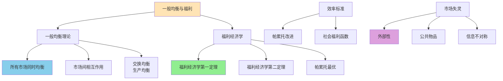

# 一般均衡与福利

## 主题概述

一般均衡理论研究所有市场同时达到均衡的条件和性质，福利经济学评价资源配置的效率和社会福利。本主题将深入探讨一般均衡理论、福利经济学基本定理、帕累托最优、社会选择理论、外部性、公共物品等内容。一般均衡与福利理论是理解市场经济效率、政府干预必要性、公共政策评价的重要工具。

---

### 一般均衡与福利分析框架



### 核心概念

### 1. 一般均衡理论

一般均衡分析所有市场同时达到均衡的状态。

#### 局部均衡 vs 一般均衡

**局部均衡（Partial Equilibrium）**：
- 分析单个市场的均衡
- 假设其他市场保持不变
- 适用于市场间联系较弱的情况
- 简单直观，易于分析

**一般均衡（General Equilibrium）**：
- 分析所有市场同时均衡
- 考虑市场间的相互影响
- 适用于市场间联系紧密的情况
- 更全面，但复杂度高

**局部均衡的局限性**：
- 忽略市场间的反馈效应
- 价格变化影响收入进而影响需求
- 要素价格变化影响生产成本
- 可能导致错误的政策建议

**一般均衡的必要性**：
- 多个市场同时调整
- 收入效应和替代效应的相互作用
- 要素市场和产品市场的相互依赖
- 税收、补贴等政策的一般均衡效应

#### 纯交换经济

**纯交换经济（Pure Exchange Economy）**：
- 没有生产
- 只有交换
- 资源初始分配给定
- 消费者通过交易改善福利

**埃奇沃斯盒（Edgeworth Box）**：
```
表示两个消费者、两种商品的交换经济
横轴：商品1的总量X₁
纵轴：商品2的总量X₂
左下角：消费者1的原点O₁
右上角：消费者2的原点O₂
盒内任意点(x₁, y₁)表示：
消费者1拥有(x₁, y₁)
消费者2拥有(X₁-x₁, X₂-y₁)
```

**契约曲线（Contract Curve）**：
```
埃奇沃斯盒中所有帕累托最优点的集合
契约曲线上的配置都是帕累托最优的
契约曲线连接O₁和O₂
```

**核（Core）**：
```
核是不能被任何联盟改进的配置集合
核包含契约曲线的某些部分
随着消费者数量增加，核收敛到竞争均衡
```

#### 生产经济

**生产经济（Production Economy）**：
- 包括生产
- 生产可能性边界（PPF）
- 要素市场和产品市场
- 企业实现利润最大化

**生产可能性边界（Production Possibility Frontier）**：
```
表示给定技术和要素下，两种商品的最大可能组合
PPF的斜率 = 边际转换率（MRT）
MRT = MC₁/MC₂ = -dX₂/dX₁
```

**生产盒（Production Box）**：
```
表示两个生产者、两种要素的生产经济
横轴：要素L的总量
纵轴：要素K的总量
生产契约曲线：所有帕累托有效的要素配置
```

#### 竞争性均衡

**竞争性均衡（Competitive Equilibrium）**：
```
价格体系使得：
1. 所有市场出清
2. 消费者在预算约束下实现效用最大化
3. 生产者在技术约束下实现利润最大化
4. 零利润条件（长期）
```

#### 瓦尔拉斯一般均衡模型

**模型设定**：

考虑有m个消费者，n个商品，k个生产者的经济：

**消费者问题**：
```
消费者i的效用函数：Uᵢ(Xᵢ)
约束条件：P·Xᵢ ≤ P·ωᵢ + Σθᵢⱼπⱼ
其中：ωᵢ为初始禀赋，θᵢⱼ为拥有的企业j的股份，πⱼ为企业j的利润
```

**生产者问题**：
```
生产者j的利润最大化：max P·Yⱼ
约束条件：Yⱼ ∈ Tⱼ（生产可能性集）
```

**超额需求函数**：
```
第i种商品的超额需求：
Zᵢ(P) = Σᵢxᵢᵢ(P) - Σωᵢ - Σⱼyⱼᵢ(P)

其中：
xᵢᵢ(P)为消费者i对商品i的需求
ωᵢ为商品i的总禀赋
yⱼᵢ(P)为生产者j对商品i的净供给
```

**瓦尔拉斯定律（Walras' Law）**：
```
对于任意价格P > 0，满足：
ΣPᵢZᵢ(P) = 0

证明：
消费者预算约束：P·Xᵢ = P·ωᵢ + Σθᵢⱼπⱼ
对所有消费者求和：ΣP·Xᵢ = ΣP·ωᵢ + Σπⱼ（因为Σθᵢⱼ = 1）
而πⱼ = P·Yⱼ（企业利润）
所以：ΣP·Xᵢ = ΣP·ωᵢ + ΣP·Yⱼ
即：P·ΣXᵢ = P·Σωᵢ + P·ΣYⱼ
整理得：P·(ΣXᵢ - Σωᵢ - ΣYⱼ) = 0
即：ΣPᵢZᵢ(P) = 0
```

**经济含义**：
- 所有市场的超额需求的价值之和为零
- 如果n-1个市场出清，第n个市场也自动出清
- 只需要求解n-1个市场均衡条件
- 市场间的相互依赖

**一般均衡条件**：
```
Zᵢ(P) = 0 对所有i = 1, 2, ..., n
或等价地：
Zᵢ(P) = 0 对所有i = 1, 2, ..., n-1
（由瓦尔拉斯定律，第n个市场自动出清）
```

#### 一般均衡的存在性

**存在性条件**：

一般均衡的存在性需要以下条件：

1. **连续性**：效用函数、生产函数连续
2. **凸性**：偏好和生产技术凸
3. **非饱和性**：偏好满足局部非饱和性
4. **瓦尔拉斯定律**：自动满足
5. **市场闭合**：价格向量有界

**布劳威尔不动点定理（Brouwer Fixed Point Theorem）**：
```
如果f: S → S是从紧凸集S到自身的连续映射，
则存在x* ∈ S使得f(x*) = x*
```

**角谷不动点定理（Kakutani Fixed Point Theorem）**：
```
如果F: S → 2^S是从紧凸集S到自身的上半连续的集值映射，
且对每个x ∈ S，F(x)是凸的，
则存在x* ∈ S使得x* ∈ F(x*)
```

**存在性证明（概要）**：

使用角谷不动点定理证明：

1. 定义价格单纯形S = {P ≥ 0 | ΣPᵢ = 1}
2. 定义价格调整映射：P'ᵢ = max{0, Pᵢ + αZᵢ(P)} / Σmax{0, Pⱼ + αZⱼ(P)}
3. 该映射满足角谷定理的条件
4. 因此存在不动点P*，使得P* = P'(P*)
5. 在不动点处，Zᵢ(P*) = 0（对所有i）
6. 即存在一般均衡价格

#### 一般均衡的唯一性

**唯一性条件**：

一般均衡不一定唯一，唯一性需要更强的条件：

1. **总超额需求函数满足显示偏好弱公理（WARP）**
2. **所有消费者的消费集严格凸**
3. **效用函数严格拟凹**

**唯一性定理**：
```
如果总超额需求函数满足显示偏好弱公理，
则一般均衡价格唯一（仅相差一个比例因子）。
```

**多重均衡的可能性**：
- 偏好非凸导致多个均衡
- 生产技术非凸导致多个均衡
- 均衡稳定性差，容易跳跃

#### 一般均衡的稳定性

**动态调整（瓦尔拉斯试探过程）**：
```
价格根据超额需求调整：
dPᵢ/dt = kᵢ·Zᵢ(P) 其中kᵢ > 0

如果Zᵢ(P) > 0（超额需求），则Pᵢ上升
如果Zᵢ(P) < 0（超额供给），则Pᵢ下降
```

**稳定性条件**：
```
总超额需求函数的雅可比矩阵负定
即：对任意非零向量dP，有dPᵀJ(P)dP < 0
其中Jᵢⱼ(P) = ∂Zᵢ(P)/∂Pⱼ
```

**稳定性分析**：
- 稳定性保证动态调整收敛到均衡
- 稳定性要求替代效应占主导
- 收入效应过大可能导致不稳定

#### 核理论

**核（Core）**：
```
核是不能被任何联盟（coalition）改进的配置集合
即：不存在任何联盟S ⊂ {1, 2, ..., m}，
使得联盟成员可以通过内部交易重新配置资源，
使所有成员的效用增加。
```

**核与竞争均衡的关系**：
```
竞争均衡 ⊂ 核 ⊂ 帕累托最优配置集合
```

**德布鲁-斯卡夫定理（Debreu-Scarf Theorem）**：
```
当经济规模无限扩大（复制经济）时，
核收敛到竞争均衡集合。
即：lim(n→∞) Coreₙ = Competitive Equilibrium
```

**经济含义**：
- 大规模经济中，竞争均衡是对谈判结果的合理预测
- 小规模经济中，谈判结果可能偏离竞争均衡
- 核理论提供了竞争均衡的微观基础

### 2. 福利经济学基本定理

#### 第一福利定理

**福利经济学第一基本定理**：
```
任何竞争性均衡都是帕累托最优的
```

**假设条件**：
1. **完全竞争**：价格接受者，无市场势力
2. **无外部性**：所有成本和收益内部化
3. **完全信息**：消费者和生产者拥有完全信息
4. **交易成本为零**：无谈判成本、搜寻成本
5. **偏好理性**：偏好满足完全性、传递性、连续性
6. **凸性**：偏好和生产技术凸

**证明（概要）**：

用反证法证明：

1. 假设竞争均衡配置x*不是帕累托最优
2. 则存在另一个配置x'，使得：
   - 至少一个人严格偏好x'
   - 没有人偏好x*超过x'
3. 对于偏好x'的人，由于x*是效用最大化选择，必有：
   - P·x'ᵢ > P·x*ᵢ
4. 对于其他人，P·x'ⱼ ≥ P·x*ⱼ
5. 对所有不等式求和：P·x' > P·x*
6. 但由于x*是市场出清配置，P·x* = P·ω（总禀赋价值）
7. 由于x'可行，P·x' = P·ω
8. 矛盾！因此假设不成立，竞争均衡必为帕累托最优

**经济含义**：
- 市场机制是有效的
- 不需要政府干预提高效率
- 自由放任可以实现资源有效配置
- 竞争市场能够实现资源配置的帕累托最优

**局限性**：
1. **仅关注效率**：不关心公平问题
2. **假设过强**：现实市场难以满足所有条件
3. **帕累托最优的局限性**：可能存在多个帕累托最优配置
4. **动态问题**：不考虑时间维度和不确定性

**政策含义**：
- 在理想条件下，政府不应干预市场
- 政府干预可能导致效率损失
- 但可以关注公平问题（通过再分配）

#### 第二福利定理

**福利经济学第二基本定理**：
```
任何帕累托最优配置都可以通过适当的初始禀赋分配和竞争性均衡实现
```

**假设条件**：
1. **偏好凸性**：效用函数严格拟凹
2. **生产技术凸性**：生产可能性集凸
3. **没有规模报酬递增**：平均成本不递减
4. **局部非饱和性**：偏好满足局部非饱和性
5. **连续性**：效用函数和生产函数连续

**证明（概要）**：

使用分离超平面定理：

1. 设x*为帕累托最优配置
2. 定义可行配置集合C（凸集）
3. 定义优于x*的配置集合U（严格凸集）
4. 由于x*为帕累托最优，U和C不相交
5. 由分离超平面定理，存在超平面分离U和C
6. 该超平面的法向量即为均衡价格P*
7. 在价格P*下，x*是效用最大化选择
8. 因此x*可以通过竞争均衡实现

**经济含义**：
- 效率与公平可以分离
- 通过再分配实现公平，通过市场机制实现效率
- 政府可以只关注公平问题
- 任何帕累托最优都可以通过市场实现

**政策含义**：
1. **再分配**：政府可以通过税收和转移支付实现公平
2. **市场机制**：再分配后让市场自由运行实现效率
3. **分离原则**：效率和公平问题可以分别解决
4. **有限政府**：政府只需关注公平，无需干预生产决策

**局限性**：
1. **凸性要求**：规模报酬递增时定理不成立
2. **再分配成本**：实际再分配有成本，可能扭曲激励
3. **信息要求**：需要知道最优配置以确定再分配方案
4. **政治可行性**：大规模再分配可能面临政治阻力

#### 帕累托最优的充分必要条件

**帕累托最优的三个必要条件**：

**1. 交换效率（Exchange Efficiency）**：
```
所有消费者的边际替代率相等
MRS₁ᵢ = MRS₁ⱼ 对所有消费者i, j

数学表达：
MU₁ᵢ/MU₂ᵢ = MU₁ⱼ/MU₂ⱼ 对所有i, j
```

**经济含义**：
- 消费者之间无法通过交换进一步改善福利
- 任何重新配置都使至少一人受损

**2. 生产效率（Production Efficiency）**：
```
所有生产者的边际技术替代率相等
MRTS_LKᵢ = MRTS_LKⱼ 对所有生产者i, j

数学表达：
MP_Lᵢ/MP_Kᵢ = MP_Lⱼ/MP_Kⱼ 对所有i, j
```

**经济含义**：
- 生产者之间无法通过重新配置要素提高产出
- 任何要素重新配置都使至少一个生产者产出减少

**3. 产品组合效率（Product Mix Efficiency）**：
```
消费者的边际替代率等于生产者的边际转换率
MRS = MRT

数学表达：
MU₁/MU₂ = MC₁/MC₂
```

**经济含义**：
- 产出结构反映消费者偏好
- 消费者和生产者的激励一致

**帕累托最优的充分条件**：

如果以上三个条件同时满足，则配置为帕累托最优。

**与福利经济学第一定理的联系**：
```
竞争均衡满足三个帕累托最优条件：
1. 消费者效用最大化 → MRS相等
2. 生产者利润最大化 → MRTS相等
3. 市场出清 → P₁/P₂ = MRS = MRT

因此竞争均衡是帕累托最优
```

#### 帕累托改进与卡多尔-希克斯改进

**帕累托改进（Pareto Improvement）**：
```
定义：资源配置变化，使得至少一个人受益而没有任何人受损

特点：
- 严格改进，无人受损
- 价值中性，不比较人际效用
- 标准严格，帕累托改进机会有限
```

**卡多尔-希克斯改进（Kaldor-Hicks Improvement）**：
```
定义：资源配置变化，使得受益者的收益能够补偿受损者的损失

特点：
- 允许有人受损
- 要求总收益 ≥ 总损失
- 补偿可以是假设的，不需要实际支付
- 也称为"潜在帕累托改进"
```plotly
data:
  -
    type: scatter
    mode: lines
    name: 曲线 1
    x: [0, 20, 40, 60, 80, 100]
    y: [10, 25, 40, 55, 75, 100]
    line:
      color: "#1f77b4"
      width: 4
      shape: spline
layout:
  title:
    text: "成本曲线"
  xaxis:
    title:
      text: "数量"
  yaxis:
    title:
      text: "价格"
    range:
      - 0
      - 100
  template: "plotly_white"
  showlegend: true
config:
  displayModeBar: false
  responsive: true
```
资源配置达到帕累托最优状态，如果不存在任何一种重新配置，
使得至少一个人的状况变好而不使其他人的状况变坏
```

**帕累托改进（Pareto Improvement）**：
```
一种资源配置变化，使得至少一个人受益而没有任何人受损
```

#### 帕累托最优的三个条件

**1. 交换效率（Exchange Efficiency）**：
```
所有消费者的边际替代率相等
MRS₁ᵢ = MRS₁ⱼ 对所有消费者i, j
```

**2. 生产效率（Production Efficiency）**：
```
所有生产者的边际技术替代率相等
MRTS_LKᵢ = MRTS_LKⱼ 对所有生产者i, j
```

**3. 产品组合效率（Product Mix Efficiency）**：
```
消费者的边际替代率等于生产者的边际转换率
MRS = MRT
```

### 4. 社会选择理论

#### 社会福利函数

**社会福利函数（Social Welfare Function）**：
```
W = W(U₁, U₂, ..., Uₙ)
其中Uᵢ为个体i的效用
```

**社会福利函数的定义和性质**：

社会福利函数是个人效用到社会总福利的映射，反映了社会对不同个体效用的评价权重。一个合理的社会福利函数应该满足以下性质：

1. **个人理性**：如果所有人的效用增加，社会福利增加
2. **帕累托最优**：帕累托最优配置的社会福利应该最大化
3. **对称性**：对个体一视同仁，无特殊偏好
4. **连续性**：社会福利函数应该连续

**主要类型的社会福利函数**：

**1. 功利主义（Utilitarianism）**：
```
W = ΣUᵢ = U₁ + U₂ + ... + Uₙ
最大化总效用
```

**特点**：
- 每个人效用权重相等
- 关注总体福利最大化
- 不关心分配公平
- 可能接受一个人牺牲很大，只要其他人收益足够大

**应用场景**：
- 成本-收益分析
- 公共项目评价
- 税收政策设计

**2. 罗尔斯主义（Rawlsian）**：
```
W = min{U₁, U₂, ..., Uₙ}
最大化最小效用
关注最差的人
```

**特点**：
- 关注最差境况的人
- 体现"无知之幕"原则
- 强调社会公平
- 可能牺牲总体效率

**应用场景**：
- 社会保障政策
- 贫困救助
- 公共医疗

**3. 平均主义（Egalitarianism）**：
```
U₁ = U₂ = ... = Uₙ
效用均等
W = f(Σ(Uᵢ - Ū)²) 最小化
其中Ū为平均效用
```

**特点**：
- 追求完全平等
- 强调分配正义
- 可能抑制激励
- 忽略效率损失

**应用场景**：
- 收入分配政策
- 教育资源分配
- 基本生活保障

**4. 柏格森-萨缪尔森社会福利函数（Bergson-Samuelson Social Welfare Function）**：
```
W = W(U₁, U₂, ..., Uₙ)
其中W为连续、递增、拟凹函数
```

**特点**：
- 最一般化的形式
- 可以通过参数调整对不同个体的权重
- 包含了功利主义、罗尔斯主义等作为特例
- 灵活性强但需要参数设定

**社会无差异曲线**：
```
对于两人经济：W(U₁, U₂) = w̄
代表给定社会福利水平下两人效用的可能组合
```

**社会最优的确定**：

社会最优配置是：
```
max W(U₁(X₁), U₂(X₂), ..., Uₙ(Xₙ))
s.t. ΣXᵢ ≤ 社会总资源
```

一阶条件：
```
∂W/∂Uᵢ · MUᵢ = λ (对所有人i)
即：社会边际替代率 = 边际转换率
```plotly
data:
  -
    type: scatter
    mode: lines
    name: 曲线 1
    x: [0, 20, 40, 60, 80, 100]
    y: [80, 60, 45, 30, 15, 5]
    line:
      color: "#1f77b4"
      width: 4
      shape: spline
layout:
  title:
    text: "曲线图"
  xaxis:
    title:
      text: "数量"
  yaxis:
    title:
      text: "价格"
    range:
      - 0
      - 100
  template: "plotly_white"
  showlegend: true
config:
  displayModeBar: false
  responsive: true
```
不存在满足以下所有条件的社会选择规则：
1. 无限制域（Unrestricted Domain, U）
2. 帕累托原则（Pareto Principle, P）
3. 非独裁性（Non-dictatorship, D）
4. 无关选择独立性（Independence of Irrelevant Alternatives, IIA）
```

**假设条件详细说明**：

**1. 无限制域（Unrestricted Domain, U）**：
```
社会选择规则对所有可能的个人偏好排序都有效
不能排除任何偏好组合
```

**2. 帕累托原则（Pareto Principle, P）**：
```
如果所有人都偏好x胜过y，则社会也应偏好x胜过y
即：∀i, xPᵢy ⇒ xPy
```

**3. 非独裁性（Non-dictatorship, D）**：
```
不存在一个人，使得他的偏好决定社会偏好
即：不存在i，使得xPᵢy ⇔ xPy
```

**4. 无关选择独立性（Independence of Irrelevant Alternatives, IIA）**：
```
x和y的社会排序仅取决于个人对x和y的排序
与其他无关选项无关
即：如果每个人对x和y的排序不变，则社会对x和y的排序也不变
```

**证明过程（概要）**：

1. **决定性集**：定义一个对特定{x, y}有决定权的群体
2. **最小决定性集**：寻找最小的决定性集
3. **单元素决定性集**：证明最小决定性集只能包含一个人
4. **独裁者**：证明这个人对所有配对都有决定权
5. **矛盾**：与假设的非独裁性矛盾

**步骤详解**：

**步骤1**：假设存在一个决定性集S，对{x, y}有决定权

**步骤2**：如果S是决定性集，则存在非空最小决定性集D

**步骤3**：假设D包含多个人，可以找到一个人i ∈ D和另一人j ∈ D\{i}

**步骤4**：构造特殊偏好，证明{i}也是决定性集

**步骤5**：因此最小决定性集D只能包含一个人

**步骤6**：证明这个独裁者对所有配对都有决定权

**步骤7**：与假设的非独裁性矛盾

**定理含义**：
1. **民主决策的内在矛盾**：没有完美的投票机制
2. **阿罗困境**：必须在某个条件上妥协
3. **社会选择困难**：个人偏好难以汇总为社会偏好
4. **政治设计挑战**：制度设计面临根本性约束

**可能的妥协**：

1. **放宽无限制域**：限制偏好类型（如单峰偏好）
2. **放宽无关选择独立性**：允许考虑排序强度
3. **放宽帕累托原则**：允许违背多数人的意愿
4. **接受独裁**：放弃民主原则（显然不可接受）

**应用和影响**：
- 投票制度设计
- 委员会决策机制
- 公共选择理论
- 政治经济学

#### 社会选择函数的性质

**其他社会选择性质**：

**1. 传递性（Transitivity）**：
```
如果xPy且yPz，则xPz
社会偏好应该是理性的、无循环的
```

**2. 中性（Neutrality）**：
```
对选项一视同仁，不偏向任何特定选项
```

**3. 匿名性（Anonymity）**：
```
对个人一视同仁，不偏向任何特定个人
对称性
```

**4. 正响应（Positive Responsiveness）**：
```
如果某些个人改变偏好支持x，社会偏好也应偏向x
```

**5. 单调性（Monotonicity）**：
```
如果x在原有偏好下是社会最优，当更多人支持x时，x仍应最优
```

#### 单峰偏好与中位选民定理

**单峰偏好（Single-Peaked Preferences）**：
```
个人偏好排序可以按照某个单一维度排列，
在排序上存在唯一的最高偏好（峰值）
```

**图示**：
```
效用
  |
  |      /\
  |     /  \      /\
  |    /    \    /  \    /
  |___/______\__/____\__/___ 维度
     L       M     R

L: 左派偏好
M: 中间派偏好
R: 右派偏好
```

**单峰偏好的重要性**：
- 保证多数投票的传递性
- 避免投票循环
- 简化社会选择问题

**中位选民定理（Median Voter Theorem）**：
```
在单峰偏好下，多数投票的结果将反映中位选民的偏好
中位选民的位置将决定社会选择
```

**定理条件**：
1. 偏好单峰
2. 选择是一维的（如左-右政治光谱）
3. 多数投票规则

**经济含义**：
- 政党会向中间选民靠拢
- 政策趋于中间立场
- 激进政策难以通过多数投票

**应用**：
- 政治经济学
- 公共物品供给
- 税收政策设计

#### 多数投票的循环问题

**孔多塞悖论（Condorcet Paradox）**：
```
多数投票可能导致循环，无法确定社会偏好
```

**例子**：

三个人（A, B, C）对三个选项（x, y, z）的偏好：

- A: x ≻ y ≻ z
- B: y ≻ z ≻ x
- C: z ≻ x ≻ y

**多数投票结果**：
- x vs y: A和C偏好x → x获胜（2:1）
- y vs z: A和B偏好y → y获胜（2:1）
- z vs x: B和C偏好z → z获胜（2:1）

**循环**：x ≻ y ≻ z ≻ x

**问题**：
- 社会偏好不传递
- 无法确定社会最优
- 投票结果取决于议程设置

**解决方案**：
1. **限制偏好**：要求单峰偏好
2. **改变投票规则**：使用Borda计数、认可投票等
3. **设置议程**：控制投票顺序
4. **独裁**：放弃民主（不可接受）

### 5. 外部性

#### 外部性的定义

**外部性（Externality）**：
```
一个经济主体的行为对其他主体的影响，这种影响没有通过价格机制反映
```

**外部性的关键特征**：
1. 非市场影响：不通过价格传递
2. 非意愿性：影响非自愿接受
3. 传递性：影响可以传递给第三方

**外部性的分类**：

**按影响的性质分类**：

**1. 正外部性（Positive Externality）**：
```
行为给他人带来收益
例如：教育、研发、疫苗接种、邻居的花园美化
```

**2. 负外部性（Negative Externality）**：
```
行为给他人带来成本
例如：污染、噪音、交通拥堵、吸烟
```

**按影响的来源分类**：

**1. 生产外部性（Production Externality）**：
```
生产活动的外部影响
正外部性：养蜂人的蜜蜂为果园授粉
负外部性：工厂排放污染
```

**2. 消费外部性（Consumption Externality）**：
```
消费活动的外部影响
正外部性：接种疫苗、教育
负外部性：吸烟、噪音、酒后驾驶
```

**按影响的范围分类**：

**1. 私人外部性**：
```
影响少数人，范围小
例如：邻居的噪音
```

**2. 公共外部性**：
```
影响大量人，范围广
例如：全球变暖、酸雨
```

#### 外部性与市场失灵

**负外部性的市场失灵**：

**私人成本 vs 社会成本**：
```
私人成本（MC_private）：生产者承担的成本
社会成本（MC_social）：MC_private + 外部边际成本（MEC）

MEC（Marginal External Cost）：边际外部成本
```

**市场均衡**：
```
私人决策：P = MC_private
社会最优：P = MC_social = MC_private + MEC

由于MC_private < MC_social
所以Q_private > Q_social
P_private < P_social
```

**图示**：
```
价格
  |
  |     MC_social
  |    /
  |   /   MC_private
  |  /   /
  | /   /
  |/___/________ 需求
  |   |
  |   | Q_social | Q_private
```

**无谓损失**：
```
DWL = 0.5 × (Q_private - Q_social) × (MC_social - MC_private)
   = 0.5 × (Q_private - Q_social) × MEC
```

**正外部性的市场失灵**：

**私人收益 vs 社会收益**：
```
私人收益（MR_private）：行为者获得的收益
社会收益（MR_social）：MR_private + 外部边际收益（MEB）

MEB（Marginal External Benefit）：边际外部收益
```

**市场均衡**：
```
私人决策：MR_private = MC
社会最优：MR_social = MC = MR_private + MEB

由于MR_private < MR_social
所以Q_private < Q_social
P_private < P_social
```

**无谓损失**：
```
DWL = 0.5 × (Q_social - Q_private) × (MR_social - MR_private)
   = 0.5 × (Q_social - Q_private) × MEB
```

**外部性导致市场失灵的原因**：
1. **价格机制失灵**：外部性不反映在价格中
2. **私人激励扭曲**：私人成本/收益与社会成本/收益分离
3. **资源配置低效**：过度生产（负外部性）或生产不足（正外部性）
4. **社会福利损失**：产生无谓损失

#### 外部性的解决方法

**1. 庇古税（Pigouvian Tax）**：

**定义**：
```
对负外部性征税，税额 = 外部边际成本
使私人成本 = 社会成本
```

**原理**：
```
征税后的私人成本：
MC' = MC_private + T

最优税额：
T = MEC（在Q*处）

征税后均衡：
P = MC' = MC_private + MEC = MC_social
Q = Q_social
```

**优点**：
- 内部化外部成本
- 机制简单，易于实施
- 提供减排激励
- 增加政府收入

**缺点**：
- 需要准确测量MEC
- 信息要求高
- 可能产生分配问题
- 不适用于所有外部性

**2. 补贴（Subsidy）**：

**定义**：
```
对正外部性补贴，补贴额 = 外部边际收益
使私人收益 = 社会收益
```

**原理**：
```
补贴后的私人收益：
MR' = MR_private + S

最优补贴额：
S = MEB（在Q*处）

补贴后均衡：
MR' = MC
MR_private + MEB = MC
Q = Q_social
```

**优点**：
- 内部化外部收益
- 鼓励正外部性行为
- 促进社会最优活动

**缺点**：
- 需要政府预算
- 财政负担重
- 可能产生过度补贴
- 需要准确测量MEB

**3. 明确产权（Property Rights）**：

**科斯定理（Coase Theorem）**：
```
如果产权明确且交易成本为零，
无论产权如何分配，谈判都能达到有效结果
```

**科斯定理的条件**：
1. **产权明确**：产权清晰，无争议
2. **交易成本为零**：无谈判成本、信息成本
3. **理性主体**：各方都追求自身利益最大化
4. **完全信息**：各方都了解外部性的影响

**科斯定理的启示**：
- 产权安排影响分配但不影响效率
- 市场机制可以解决外部性问题
- 政府应关注产权界定而非直接干预

**科斯定理的局限性**：
1. **交易成本不为零**：现实世界交易成本很高
2. **产权界定困难**：某些资源难以明确产权
3. **策略性行为**：各方可能采取策略性行为
4. **多人博弈**：涉及多方时谈判更困难

**4. 可交易许可证（Tradable Permits）**：

**定义**：
```
设定外部性总量，分配许可证，允许许可证交易
```

**机制**：
1. 政府设定总排放量（或总污染许可）
2. 分配排放许可证（免费或拍卖）
3. 企业可以买卖许可证
4. 许可证价格由市场决定

**优点**：
- 确保总量控制
- 灵活性强，企业自主选择减排方式
- 成本有效，减排成本低的企业多减排
- 提供创新激励

**缺点**：
- 初始分配可能不公
- 需要监管和执行
- 可能产生价格波动
- 市场势力可能导致效率损失

**5. 行政管制（Command and Control）**：

**定义**：
```
政府直接规定排放标准、技术标准等
```

**优点**：
- 直接有效，确保达标
- 执行简单，易于监督
- 适用于紧急情况

**缺点**：
- 缺乏灵活性
- 成本高，不经济
- 抑制创新
- 可能产生合规成本

**6. 私人解决（Private Solutions）**：

**方式**：
- 合同协商
- 合并（内部化外部性）
- 社会规范
- 道德约束

**适用条件**：
- 交易成本低
- 人数少
- 关系紧密

#### 共有资源与公共地悲剧

**公共地悲剧（Tragedy of the Commons）**：
```
共有资源（非排他性但竞争性）被过度使用
产权不明导致资源耗尽
```

**共有资源的特征**：
1. **非排他性**：难以排除他人使用
2. **竞争性**：一个人的使用减少他人的使用
3. **产权不明**：没有明确的所有者

**经典例子**：
- 公共牧场：过度放牧导致牧场退化
- 公海渔场：过度捕捞导致鱼类资源枯竭
- 地下水：过度开采导致水位下降
- 公共空间：过度使用导致拥挤

**解决方法**：
1. **明确产权**：私有化或集体产权
2. **配额管理**：设定使用上限
3. **使用者付费**：收费反映资源稀缺性
4. **集体管理**：社区共同管理
5. **政府管制**：立法保护资源

### 6. 公共物品

#### 公共物品的定义

**公共物品（Public Goods）**：
```
具有以下两个特征的物品：
1. 非排他性（Non-excludability）
2. 非竞争性（Non-rivalry）
```

**非排他性（Non-excludability）**：
```
无法或很难排除他人消费
一旦提供，所有人都可以使用
技术或经济上难以排他

例如：国防、路灯、清洁空气、法律制度
```

**非竞争性（Non-rivalry）**：
```
一个人的消费不影响他人的消费
增加一个消费者的边际成本为零
消费不具有拥挤性

例如：天气预报、广播电视、网络信息
```plotly
data:
  -
    type: scatter
    mode: lines
    name: 曲线 1
    x: [0, 20, 40, 60, 80, 100]
    y: [80, 60, 45, 30, 15, 5]
    line:
      color: "#1f77b4"
      width: 4
      shape: spline
layout:
  title:
    text: "曲线图"
  xaxis:
    title:
      text: "数量"
  yaxis:
    title:
      text: "价格"
    range:
      - 0
      - 100
  template: "plotly_white"
  showlegend: true
config:
  displayModeBar: false
  responsive: true
```
完全非排他性和非竞争性
一旦提供，所有人都无法被排除且不影响他人消费
```

**特点**：
- 边际成本为零
- 难以排除不付费者
- 需要政府提供

**例子**：
- 国防
- 基础研究
- 知识（版权保护前）
- 法律制度
- 基础设施（如路灯）

**2. 准公共物品（Quasi-Public Goods）**：
```
部分排他性或部分竞争性
介于私人物品和纯公共物品之间
```

**俱乐部物品（Club Goods）**：
```
可排他但非竞争
可以设定准入门槛，但内部消费不拥挤
```

**例子**：
- 有线电视
- 收费公路（不拥堵时）
- 会员俱乐部
- 电影院

**拥挤的公共物品**：
```
不可排他但在一定范围内非竞争
超过临界点后出现拥挤
```

**例子**：
- 公园（人多时拥挤）
- 海滩（拥挤时）
- 免费WiFi（人多时速度下降）

**3. 公共资源（Common Resources）**：
```
非排他性但竞争性
所有人都可以使用，但使用会减少他人可用量
```

**特点**：
- 产权不明
- 容易过度使用
- 导致"公地悲剧"

**例子**：
- 公海渔场
- 地下水
- 公共牧场
- 野生动物

#### 公共物品的市场失灵

**搭便车问题（Free Rider Problem）**：

**定义**：
```
由于非排他性，个人有激励不支付而享受公共物品
等待他人支付，自己免费使用
```

**原因**：
1. **非排他性**：无法排除不付费者
2. **个人理性**：不付费不影响使用
3. **集体行动困境**：每个人都希望他人支付

**图示**：
```
公共物品供给
|
|   社会最优
|   |\
|   | \
|   |  \ 市场供给
|   |   \
|   |____\_____
|        |    |
|    Q*   Q_m  数量
```

**结果**：
- 市场供给不足（Q_m < Q*）
- 公共物品供给不足
- 社会福利损失

**公地悲剧（Tragedy of the Commons）**：

**定义**：
```
公共资源被过度使用
产权不明导致资源耗尽
```

**原因**：
1. **非排他性**：无法限制使用
2. **竞争性**：使用减少他人可用量
3. **私人激励**：过度使用最大化个人收益
4. **集体行动困境**：每个人都希望多使用

**结果**：
- 资源过度使用
- 资源耗尽
- 社会福利损失

#### 公共物品的最优供给

**萨缪尔森条件（Samuelson Condition）**：
```
所有消费者的边际替代率之和等于边际转换率
ΣMRS = MRT

等价地：
ΣPᵢ = MC

即所有人的支付意愿之和等于边际成本
```

**推导**：

考虑公共物品G和私人物品X：

**消费者问题**：
```
max Uᵢ(Xᵢ, G)
s.t. Xᵢ + P_G·G = Iᵢ

一阶条件：
MU_Gᵢ/MU_Xᵢ = P_G
即：MRSᵢ = P_G
```

**社会最优**：
```
max ΣUᵢ(Xᵢ, G)
s.t. ΣXᵢ + C(G) = ΣIᵢ

一阶条件：
ΣMU_Gᵢ/MU_Xᵢ = C'(G)
即：ΣMRS = MC
```

**图示（公共物品需求）**：
```
价格
  |      /
  |     / MC
  |    /|
  |   / |
  |  /  |
  | /   |
  |/____|_______
  |    |       数量
  |    Q*

需求垂直加总：
P(G) = P₁(G) + P₂(G) + ... + Pₙ(G)
```

**私人供给不足的原因**：
```
私人供给条件：P_i = MC
社会最优条件：ΣP_i = MC

由于 ΣP_i > P_i（至少对某些人）
所以私人供给不足
```

#### 免费乘车问题及其解决机制

**免费乘车问题（Free Rider Problem）**：

**定义**：
```
在公共物品供给中，个人有激励不贡献成本而享受公共物品
```plotly
data:
  -
    type: scatter
    mode: lines
    name: 曲线 1
    x: [0, 20, 40, 60, 80, 100]
    y: [10, 25, 40, 55, 75, 100]
    line:
      color: "#1f77b4"
      width: 4
      shape: spline
layout:
  title:
    text: "成本曲线"
  xaxis:
    title:
      text: "数量"
  yaxis:
    title:
      text: "价格"
    range:
      - 0
      - 100
  template: "plotly_white"
  showlegend: true
config:
  displayModeBar: false
  responsive: true
```
通过税收强制支付公共物品成本
优点：确保供给
缺点：缺乏自愿性
```

**2. 激励机制（选择性激励）**：
```
对贡献者提供额外奖励
例如：荣誉、特权、物质奖励
```

**3. 集体行动（社会规范）**：
```
通过社会压力和道德约束促进贡献
例如：社区合作、志愿活动
```

**4. 小团体**：
```
在小团体中，个人贡献的影响更明显
免费乘车激励减弱
```

**5. 重复博弈**：
```
在重复互动中，合作是可持续的
惩罚机制防止免费乘车
```

**6. 私人提供（排他性机制）**：
```
通过技术或制度设计实现排他
例如：收费、会员制、专利保护
```

#### 公共物品的提供方式

**1. 政府提供**：
```
通过税收融资，政府直接提供
优点：确保供给，解决免费乘车问题
缺点：效率可能不高，缺乏激励
```

**2. 自愿捐赠**：
```
依赖慈善和自愿贡献
优点：自愿性，反映真实偏好
缺点：供给不足，不稳定
```

**3. 私人提供（通过排他性）**：
```
通过技术或制度实现排他性
例如：专利、版权、会员制
优点：利用市场机制，效率高
缺点：可能排除低收入群体
```

**4. 公私合营（PPP）**：
```
政府和企业合作提供
优点：结合政府保证和市场效率
缺点：合同复杂，监管困难
```

**5. 社区提供**：
```
社区集体提供和管理
优点：适应性强，参与度高
缺点：规模有限，依赖社区凝聚力
```

## 重要模型和公式

### 1. 埃奇沃斯盒

**帕累托最优条件**：
```
MRS₁₁,₂ = MRS₂₁,₂
```

**消费者A的效用最大化**：
```
max U_A(X_A, Y_A)
s.t. X_A + X_B = X̄
     Y_A + Y_B = Ȳ
```

**消费者B的效用最大化**：
```
max U_B(X_B, Y_B)
s.t. X_A + X_B = X̄
     Y_A + Y_B = Ȳ
```

### 2. 帕累托最优条件

**交换效率**：
```
MRSᵢ₁,₂ = MRSⱼ₁,₂ 对所有i, j
即：MU₁ᵢ/MU₂ᵢ = MU₁ⱼ/MU₂ⱼ
```

**生产效率**：
```
MRTSᵢL,K = MRTSⱼL,K 对所有i, j
即：MP_Lᵢ/MP_Kᵢ = MP_Lⱼ/MP_Kⱼ
```

**产品组合效率**：
```
MRS₁,₂ = MRT₁,₂
即：MU₁/MU₂ = MC₁/MC₂
```

### 3. 瓦尔拉斯一般均衡模型

**超额需求函数**：
```
第i种商品的超额需求：
Zᵢ(P) = Σⱼxⱼᵢ(P) - Σωᵢ - Σₖyₖᵢ(P)

其中：
xⱼᵢ(P)为消费者j对商品i的需求
ωᵢ为商品i的总禀赋
yₖᵢ(P)为生产者k对商品i的净供给
```

**瓦尔拉斯定律**：
```
ΣPᵢZᵢ(P) = 0

证明：
对所有消费者：P·Xⱼ = P·ωⱼ + Σθⱼₖπₖ
对所有消费者求和：P·ΣXⱼ = P·Σωⱼ + Σπₖ
而πₖ = P·Yₖ
所以：P·ΣXⱼ = P·Σωⱼ + P·ΣYₖ
整理得：P·(ΣXⱼ - Σωⱼ - ΣYₖ) = 0
即：ΣPᵢZᵢ(P) = 0
```

**一般均衡条件**：
```
Zᵢ(P) = 0 对所有i = 1, 2, ..., n
或等价地：
Zᵢ(P) = 0 对所有i = 1, 2, ..., n-1
（由瓦尔拉斯定律，第n个市场自动出清）
```

**价格标准化**：
```
由于价格具有齐次性（P和λP代表相同相对价格），
可以标准化价格：
ΣPᵢ = 1 或 P₁ = 1
```

**存在性条件**：
```
总超额需求函数连续，满足瓦尔拉斯定律
满足边界条件：当Pᵢ → 0时，Zᵢ(P) > 0
```

### 4. 社会福利函数模型

**柏格森-萨缪尔森社会福利函数**：
```
W = W(U₁, U₂, ..., Uₙ)
其中Uᵢ为个体i的效用
```

**具体形式**：

**功利主义**：
```
W = ΣUᵢ = U₁ + U₂ + ... + Uₙ
最大化总效用
```

**罗尔斯主义**：
```
W = min{U₁, U₂, ..., Uₙ}
最大化最小效用
```

**平均主义**：
```
W = -Σ(Uᵢ - Ū)²
最小化效用方差
其中Ū为平均效用
```

**加权功利主义**：
```
W = ΣaᵢUᵢ
其中aᵢ为个体i的权重，Σaᵢ = 1
```

**社会无差异曲线**：
```
对于两人经济：W(U₁, U₂) = w̄
代表给定社会福利水平下两人效用的可能组合

斜率 = -∂W/∂U₁ / ∂W/∂U₂ = -MRS¹²ₛₒᶜᵢₐₗ
```

**社会最优条件**：
```
max W(U₁(X₁), U₂(X₂), ..., Uₙ(Xₙ))
s.t. ΣXᵢ ≤ 社会总资源

一阶条件：
∂W/∂Uᵢ · MUᵢ = λ（对所有i）
即：社会边际替代率 = 边际转换率
```

### 5. 外部性

**庇古税**：
```
T = MEC（边际外部成本）

最优税额：T = MEC在Q*处的值
```

**社会成本**：
```
MC_social = MC_private + MEC
```

**社会收益**：
```
MR_social = MR_private + MEB
```

### 6. 公共物品

**萨缪尔森条件**：
```
ΣMRS = MRT

等价地：ΣPᵢ = MC
```

**公共物品需求加总**：
```
P(G) = P₁(G) + P₂(G) + ... + Pₙ(G)
公共物品的需求是个人需求的垂直加总
```

## 实际应用案例

### 案例1：负外部性分析

**问题**：某化工厂生产Q单位产品，私人成本MC = 2Q，造成污染的外部成本MEC = Q。需求P = 100 - Q。求社会最优产量和庇古税。

**分析**：

**1. 私人均衡**：
```
私人决策：P = MC
100 - Q = 2Q
100 = 3Q
Q_private = 33.33
P = 100 - 33.33 = 66.67
```

**2. 社会最优**：
```
社会成本：MC_social = MC + MEC = 2Q + Q = 3Q

社会最优：P = MC_social
100 - Q = 3Q
100 = 4Q
Q_social = 25
P = 100 - 25 = 75
```

**3. 庇古税**：
```
庇古税 = 外部边际成本
T = MEC = Q_social = 25

征税后的私人成本：
MC' = MC + T = 2Q + 25

征税后的均衡：
100 - Q = 2Q + 25
75 = 3Q
Q = 25 = Q_social ✓
```

**4. 无谓损失**：
```
DWL = 0.5 × (Q_private - Q_social) × (MC_social - MC)
   = 0.5 × (33.33 - 25) × (3×25 - 2×25)
   = 0.5 × 8.33 × 25
   ≈ 104.17
```

**结论**：
1. 私人生产33.33单位，社会最优25单位
2. 庇古税为25
3. 征税后达到社会最优产量
4. 无谓损失约为104.17

### 案例2：公共物品供给

**问题**：两个人对公共物品的需求分别为P₁ = 10 - Q，P₂ = 20 - Q。公共物品的边际成本MC = 15。求公共物品的最优供给量。

**分析**：

**1. 公共物品的需求加总**：
```
公共物品的需求是个人需求的垂直加总：
P(Q) = P₁(Q) + P₂(Q) = (10 - Q) + (20 - Q) = 30 - 2Q
```

**2. 社会最优供给**：
```
萨缪尔森条件：ΣMRS = MRT
即：P(Q) = MC
30 - 2Q = 15
2Q = 15
Q* = 7.5

价格：
P₁(7.5) = 10 - 7.5 = 2.5
P₂(7.5) = 20 - 7.5 = 12.5
P(7.5) = 2.5 + 12.5 = 15 = MC ✓
```

**3. 支付意愿**：
```
个人1愿意支付：2.5
个人2愿意支付：12.5
总支付意愿：15
```

**结论**：
1. 公共物品的最优供给量为7.5
2. 个人1支付2.5，个人2支付12.5
3. 总支付等于边际成本15
4. 公共物品的供给需要政府或集体行动

### 案例3：国际贸易的一般均衡分析

**问题**：考虑两个国家（A国和B国），两种商品（X和Y）。A国的生产可能性为X_A + 2Y_A = 100，B国的生产可能性为2X_B + Y_B = 100。两国的效用函数均为U = X·Y。求自由贸易下的均衡价格和贸易模式。

**分析**：

**1. 自给自足均衡**：

**A国**：
```
生产可能性：X_A + 2Y_A = 100
边际转换率：MRT_A = -dY_A/dX_A = 1/2

效用最大化：MRS_A = P_X/P_Y = Y_A/X_A = MRT_A = 1/2
所以：Y_A = X_A/2

代入生产可能性：X_A + 2(X_A/2) = 100
2X_A = 100
X_A = 50, Y_A = 25
U_A = 50 × 25 = 1250
```

**B国**：
```
生产可能性：2X_B + Y_B = 100
边际转换率：MRT_B = -dY_B/dX_B = 2

效用最大化：MRS_B = P_X/P_Y = Y_B/X_B = MRT_B = 2
所以：Y_B = 2X_B

代入生产可能性：2X_B + 2X_B = 100
4X_B = 100
X_B = 25, Y_B = 50
U_B = 25 × 50 = 1250
```

**自给自足下的相对价格**：
```
A国：(P_X/P_Y)_A = 1/2
B国：(P_X/P_Y)_B = 2
```

**2. 自贸易均衡**：

由于A国的X相对便宜（P_X/P_Y = 1/2），B国的Y相对便宜（P_X/P_Y = 2），
因此A国将出口X进口Y，B国将出口Y进口X。

**世界总生产可能性**：
```
X_A + 2Y_A = 100
2X_B + Y_B = 100

总X = X_A + X_B
总Y = Y_A + Y_B
```

**贸易均衡价格**：
```
均衡价格介于1/2和2之间
设P_X/P_Y = p

由市场出清条件：
A国出口X = B国进口X
B国出口Y = A国进口Y
```

**3. 贸易收益**：

贸易后两国的效用都将增加（证明略）。

**结论**：
1. 比较优势：A国在X上有比较优势，B国在Y上有比较优势
2. 贸易模式：A国出口X进口Y，B国出口Y进口X
3. 贸易收益：两国都能通过贸易提高效用
4. 一般均衡：贸易影响所有市场和两国福利

### 案例4：环境外部性——碳排放交易

**问题**：两家企业（企业1和企业2）的减排成本分别为：
企业1：MC₁ = 10 + 2Q₁
企业2：MC₂ = 20 + Q₂
政府要求总减排量为30单位。求成本有效的减排分配和碳交易价格。

**分析**：

**1. 成本有效的减排分配**：

成本有效要求两家企业的边际减排成本相等：
```
MC₁ = MC₂
10 + 2Q₁ = 20 + Q₂
2Q₁ - Q₂ = 10

约束条件：Q₁ + Q₂ = 30

解方程组：
2Q₁ - Q₂ = 10
Q₁ + Q₂ = 30

相加：3Q₁ = 40
Q₁ = 40/3 ≈ 13.33

Q₂ = 30 - Q₁ = 30 - 13.33 = 16.67

碳价格：P = MC₁ = 10 + 2(13.33) ≈ 36.67
```

**2. 可交易许可证机制**：

假设政府免费分配15个许可证给每个企业（初始分配）：

**企业1**：
```
初始分配：15个许可证
减排要求：15个单位
实际最优减排：13.33个单位
盈余许可证：15 - 13.33 = 1.67个单位
出售许可证收入：1.67 × 36.67 ≈ 61.11
```

**企业2**：
```
初始分配：15个许可证
减排要求：15个单位
实际最优减排：16.67个单位
短缺许可证：16.67 - 15 = 1.67个单位
购买许可证成本：1.67 × 36.67 ≈ 61.11
```

**3. 成本比较**：

**无交易时**：
```
企业1成本：∫₀¹⁵(10+2Q)dQ = [10Q+Q²]₀¹⁵ = 150+225 = 375
企业2成本：∫₀¹⁵(20+Q)dQ = [20Q+Q²/2]₀¹⁵ = 300+112.5 = 412.5
总成本：375+412.5 = 787.5
```

**有交易时**：
```
企业1成本：∫₀¹³·³³(10+2Q)dQ = 10×13.33 + (13.33)² ≈ 133.3 + 177.8 = 311.1
企业1净成本：311.1 - 61.11 = 250

企业2成本：∫₀¹⁶·⁶⁷(20+Q)dQ = 20×16.67 + (16.67)²/2 ≈ 333.4 + 139.0 = 472.4
企业2净成本：472.4 + 61.11 = 533.5

总成本：250 + 533.5 = 783.5

成本节约：787.5 - 783.5 = 4
```

**结论**：
1. 成本有效的减排分配：企业1减排13.33，企业2减排16.67
2. 碳价格：约36.67
3. 交易降低总成本
4. 可交易许可证实现成本有效的环境管制

### 案例5：公共物品供给——国防支出

**问题**：三个国家对国防（公共物品）的需求分别为：
国家1：P₁ = 50 - 2Q
国家2：P₂ = 40 - Q
国家3：P₃ = 30 - Q
国防的边际成本MC = 30。求国防的最优供给量。

**分析**：

**1. 国防需求加总**：

国防的需求是垂直加总：
```
P(Q) = P₁(Q) + P₂(Q) + P₃(Q)
     = (50-2Q) + (40-Q) + (30-Q)
     = 120 - 4Q
```

**2. 最优供给量**：

萨缪尔森条件：ΣMRS = MRT
```
P(Q) = MC
120 - 4Q = 30
4Q = 90
Q* = 22.5
```

**3. 支付意愿**：
```
国家1：P₁(22.5) = 50 - 2×22.5 = 5
国家2：P₂(22.5) = 40 - 22.5 = 17.5
国家3：P₃(22.5) = 30 - 22.5 = 7.5

总支付意愿：5 + 17.5 + 7.5 = 30 = MC ✓
```

**4. 免费乘车问题分析**：

如果国防由自愿捐赠提供：

**私人供给**：
```
每个国家单独决策：P_i = MC

国家1：50 - 2Q = 30 → Q₁ = 10
国家2：40 - Q = 30 → Q₂ = 10
国家3：30 - Q = 30 → Q₃ = 0

私人总供给：10 + 10 + 0 = 20 < 22.5（最优）
```

**免费乘车行为**：
```
国家3不愿意贡献（P₃(20) = 30 - 20 = 10 < MC）
等待其他国家提供
```

**结论**：
1. 国防的最优供给量为22.5
2. 国家1支付5，国家2支付17.5，国家3支付7.5
3. 私人自愿供给不足（20 < 22.5）
4. 存在免费乘车问题
5. 需要政府强制提供（如税收）

## 与其他主题的联系

### 1. 与供给和需求的联系

一般均衡是局部均衡的扩展：

**局部均衡**：
- 分析单个市场的均衡
- 假设其他市场不变
- 适用于市场间联系较弱的情况
- 简单直观，易于分析

**一般均衡**：
- 分析所有市场同时均衡
- 考虑市场间的相互影响
- 适用于市场间联系紧密的情况
- 更全面，但复杂度高

**市场间的联系**：
- 收入效应：价格变化影响实际收入
- 要素市场：产品价格影响要素需求
- 互补品和替代品：市场间相互影响
- 一般均衡反馈：一个市场的变化影响所有市场

### 2. 与消费者行为理论的联系

一般均衡理论使用消费者行为理论：

**效用最大化**：
```
消费者问题：
max Uᵢ(Xᵢ)
s.t. P·Xᵢ ≤ Iᵢ

一阶条件：
MU₁ᵢ/P₁ = MU₂ᵢ/P₂ = ... = MUₙᵢ/Pₙ
```

**边际替代率（MRS）**：
```
MRSᵢⱼ = MUᵢ/MUⱼ
衡量消费者对商品的相对评价
帕累托最优条件要求所有消费者的MRS相等
```

**需求函数**：
```
Xᵢ = Dᵢ(P, Iᵢ)
需求是价格和收入的函数
一般均衡中，收入也由要素价格决定
```

**消费者剩余**：
```
CS = ∫₀^Q P(Q)dQ - P×Q
衡量消费者福利
福利分析的重要工具
```

### 3. 与生产者行为理论的联系

一般均衡理论使用生产者行为理论：

**利润最大化**：
```
生产者问题：
max P·Y - w·L - r·K
s.t. Y = f(L, K)

一阶条件：
P·MP_L = w
P·MP_K = r
```

**边际技术替代率（MRTS）**：
```
MRTS_LK = MP_L/MP_K
衡量要素间的替代关系
帕累托最优条件要求所有生产者的MRTS相等
```

**供给函数**：
```
Y = S(P, w, r)
供给是产品价格和要素价格的函数
一般均衡中，要素价格由要素市场决定
```

**生产者剩余**：
```
PS = P×Y - ∫₀^Y MC(Y)dY
衡量生产者福利
福利分析的重要工具
```

### 4. 与市场结构的联系

不同市场结构的一般均衡：

**完全竞争**：
- 价格接受者
- 零利润（长期）
- 满足福利经济学定理
- 实现帕累托最优

**垄断**：
- 价格制定者
- 正利润
- 产生无谓损失
- 不满足福利经济学定理

**寡头垄断**：
- 策略性互动
- 可能合谋
- 复杂的均衡分析
- 一般均衡难以确定

**垄断竞争**：
- 产品差异
- 短期有利润，长期零利润
- 产能过剩
- 效率和多样性的权衡

### 5. 与宏观经济学的联系

一般均衡是宏观经济学的微观基础：

**微观基础**：
- 一般均衡为宏观模型提供理论基础
- 宏观变量是微观选择的加总
- 微观参数决定宏观行为

**要素市场**：
- 劳动市场：工资决定就业和收入
- 资本市场：利率决定投资和储蓄
- 要素价格影响收入分配

**IS-LM模型**：
- 商品市场（IS）和货币市场（LM）的同时均衡
- 可以看作两部门的一般均衡
- 扩展到开放经济：IS-LM-BP模型

**AD-AS模型**：
- 总需求和总供给的均衡
- 产品市场、劳动市场、货币市场的相互作用
- 价格和产出的同时决定

**新古典增长理论**：
- 索洛模型：资本、劳动、技术的相互作用
- 稳态均衡：人均资本和产出不变
- 一般均衡分析增长路径

**实际商业周期理论**：
- 技术冲击的一般均衡效应
- 跨期优化和一般均衡
- 微观基础驱动的宏观波动

### 6. 与国际贸易理论的联系

一般均衡分析国际贸易：

**比较优势理论**：
- 李嘉图模型：基于技术差异
- 赫克歇尔-奥林模型：基于要素禀赋
- 一般均衡确定贸易模式和贸易收益

**贸易条件**：
- 相对价格：P_X/P_Y
- 贸易条件影响贸易收益分配
- 一般均衡确定均衡价格

**贸易政策**：
- 关税的一般均衡效应
- 贸易战和报复
- 自由贸易 vs 保护主义

### 7. 与公共经济学的联系

一般均衡分析公共经济问题：

**税收**：
- 税收的一般均衡效应
- 税收归宿（谁承担税收负担）
- 税收的无谓损失

**公共支出**：
- 公共物品的最优供给
- 外部性的内部化
- 政府干预的效率分析

**社会福利**：
- 社会福利函数的设定
- 公平与效率的权衡
- 收入再分配政策

## 总结和思考题

### 总结

一般均衡与福利理论深入分析了资源配置的效率：

1. **一般均衡**：
   - 所有市场同时均衡
   - 埃奇沃斯盒分析纯交换经济
   - 生产可能性边界分析生产经济

2. **福利经济学**：
   - 第一福利定理：竞争均衡是帕累托最优
   - 第二福利定理：帕累托最优可通过竞争实现
   - 效率与公平可以分离

3. **帕累托最优**：
   - 交换效率：MRS相等
   - 生产效率：MRTS相等
   - 产品组合效率：MRS = MRT

4. **市场失灵**：
   - 外部性：私人成本/收益与社会成本/收益分离
   - 公共物品：非排他性和非竞争性
   - 搭便车问题和公地悲剧

### 思考题

**基础题**：
1. 解释局部均衡和一般均衡的区别。什么时候使用局部均衡，什么时候使用一般均衡？
2. 什么是帕累托最优？什么是帕累托改进？给出一个具体的例子。
3. 解释福利经济学第一基本定理和第二基本定理，并说明其经济含义。
4. 什么是外部性？正外部性和负外部性有什么区别？各举一个例子。
5. 什么是公共物品？有什么特征？纯公共物品和准公共物品有什么区别？

**中等题**：
6. 推导帕累托最优的三个条件（交换效率、生产效率、产品组合效率）。
7. 为什么会产生外部性？外部性如何导致市场失灵？有哪些解决方法？
8. 解释科斯定理及其经济含义。科斯定理的条件和局限性是什么？
9. 什么是搭便车问题？为什么公共物品供给不足？如何解决搭便车问题？
10. 什么是公地悲剧？如何避免公共资源的过度使用？

**高难题**：
11. 阿罗不可能性定理说明了什么？为什么说民主决策存在内在矛盾？
12. 比较不同社会福利函数（功利主义、罗尔斯主义、平均主义）的性质和经济含义。
13. 一般均衡的存在性和唯一性条件是什么？瓦尔拉斯定律有什么作用？
14. 外部性的解决方法（庇古税、补贴、产权界定、可交易许可证）各有什么优缺点？
15. 公共物品的最优供给条件是什么？萨缪尔森条件的含义是什么？

**应用题**：
16. **负外部性计算**：某工厂的私人成本MC = 5Q，造成的外部成本MEC = 3Q，需求P = 100 - 2Q。求：
    （1）私人均衡产量和价格
    （2）社会最优产量和价格
    （3）庇古税的大小
    （4）无谓损失的大小

17. **公共物品供给**：三个人对公共物品的需求分别为P₁ = 30 - Q，P₂ = 20 - Q，P₃ = 10 - Q。公共物品的边际成本MC = 20。求：
    （1）公共物品的最优供给量
    （2）每个人的支付意愿
    （3）如果由私人自愿提供，供给量是多少？

18. **埃奇沃斯盒分析**：考虑两个人A和B，两种商品X和Y。A的效用函数U_A = X_A·Y_A，B的效用函数U_B = X_B·Y_B。初始禀赋：A有(10, 0)，B有(0, 10)。求：
    （1）契约曲线方程
    （2）竞争均衡价格和配置
    （3）验证配置是否为帕累托最优

19. **一般均衡**：考虑两部门经济（生产X和Y），使用劳动L和资本K。生产函数：X = L_X^(1/2)·K_X^(1/2)，Y = L_Y^(1/2)·K_Y^(1/2)。要素禀赋：L̄ = 100，K̄ = 100。效用函数：U = X·Y。求：
    （1）要素市场均衡（L_X, L_Y, K_X, K_Y）
    （2）产品市场均衡（X, Y, P_X/P_Y）
    （3）要素价格（w, r）

20. **社会福利函数**：考虑社会福利函数W = U₁^0.5 · U₂^0.5。两个人的效用函数：U₁ = X₁·Y₁，U₂ = X₂·Y₂。总资源：X̄ = 100，Ȳ = 100。求：
    （1）社会最优配置
    （2）社会无差异曲线
    （3）如果初始禀赋为(80, 20)和(20, 80)，如何实现社会最优？

### 进一步思考

1. **公平与效率**：如何平衡效率与公平？是否存在冲突？社会福利函数如何处理公平问题？

2. **政府干预**：在什么情况下政府干预是必要的？政府干预的成本和收益是什么？如何避免政府失灵？

3. **环境经济学**：如何解决环境外部性问题？碳税、碳交易、行政管制各有什么优缺点？气候变化的一般均衡效应是什么？

4. **公共选择**：政府决策是否总是有效？政府失灵的原因是什么？如何设计制度限制政府失灵？

5. **一般均衡的现实性**：现实经济中一般均衡存在吗？为什么还需要一般均衡理论？一般均衡理论有什么局限性？

6. **技术进步与一般均衡**：技术进步如何影响一般均衡？技术进步的分配效应是什么？技术进步是帕累托改进吗？

7. **全球化与一般均衡**：全球化如何影响各国的一般均衡？贸易自由化的赢家和输家是谁？如何补偿受损者？

8. **信息不对称与一般均衡**：信息不对称如何影响一般均衡？如何设计机制解决信息不对称问题？

9. **行为经济学与一般均衡**：行为经济学（如有限理性、社会偏好）如何挑战一般均衡理论？如何扩展一般均衡理论以纳入行为因素？

10. **可持续发展与一般均衡**：如何在一般均衡框架中考虑环境约束？可持续发展的条件是什么？代际公平如何纳入社会福利函数？

## 参考书目

1. 范里安：《微观经济学：现代观点》
2. 平狄克：《微观经济学》
3. 曼昆：《经济学原理》
4. 高鸿业：《西方经济学》
5. 马斯-科莱尔：《微观经济学》
6. 阿罗：《社会选择与个人价值》

## 附录：关键公式汇总

### 1. 帕累托最优条件
```
交换效率：MRSᵢ₁,₂ = MRSⱼ₁,₂ 对所有i, j
生产效率：MRTSᵢL,K = MRTSⱼL,K 对所有i, j
产品组合效率：MRS = MRT
```

### 2. 瓦尔拉斯一般均衡
```
超额需求函数：Zᵢ(P) = Σⱼxⱼᵢ(P) - Σωᵢ - Σₖyₖᵢ(P)
瓦尔拉斯定律：ΣPᵢZᵢ(P) = 0
一般均衡条件：Zᵢ(P) = 0 对所有i
```

### 3. 外部性
```
庇古税：T = MEC
社会成本：MC_social = MC_private + MEC
社会收益：MR_social = MR_private + MEB
```

### 4. 公共物品
```
萨缪尔森条件：ΣMRS = MRT
公共物品需求：P(G) = P₁(G) + P₂(G) + ... + Pₙ(G)
```

### 5. 社会福利函数
```
功利主义：W = ΣUᵢ
罗尔斯主义：W = min{U₁, U₂, ..., Uₙ}
平均主义：W = -Σ(Uᵢ - Ū)²
柏格森-萨缪尔森：W = W(U₁, U₂, ..., Uₙ)
```

## 附录：福利经济学定理证明概要

### 福利经济学第一定理的证明

**定理**：任何竞争性均衡都是帕累托最优的。

**证明（概要）**：

用反证法证明：

**假设**：竞争均衡配置x*不是帕累托最优。

**步骤1**：由于x*不是帕累托最优，存在另一个配置x'，使得：
- 至少一个人严格偏好x'胜过x*
- 没有人偏好x*胜过x'

**步骤2**：对于偏好x'的人i，由于x*是预算约束下的效用最大化选择，必有：
```
P·x'ᵢ > P·x*ᵢ
```

**步骤3**：对于其他人j，由于x*是效用最大化选择，必有：
```
P·x'ⱼ ≥ P·x*ⱼ
```

**步骤4**：对所有不等式求和：
```
ΣP·x'ᵢ > ΣP·x*ᵢ
即：P·x' > P·x*
```

**步骤5**：由于x*是市场出清配置，满足：
```
P·x* = P·ω（总禀赋价值）
```

**步骤6**：由于x'可行（总资源不变），满足：
```
P·x' = P·ω
```

**步骤7**：步骤4和步骤6矛盾：
```
P·x' > P·x*
但 P·x' = P·ω = P·x*
```

**结论**：假设不成立，竞争均衡必为帕累托最优。

**证明要点**：
1. 使用反证法
2. 依赖效用最大化和市场出清条件
3. 关键步骤：x'可行且x*均衡，导致矛盾
4. 不需要具体效用函数形式，仅依赖凸性假设

### 福利经济学第二定理的证明

**定理**：任何帕累托最优配置都可以通过适当的初始禀赋分配和竞争性均衡实现。

**证明（概要）**：

使用分离超平面定理：

**步骤1**：设x*为帕累托最优配置。

**步骤2**：定义可行配置集合C：
```
C = {x | Σxᵢ ≤ Σω, xᵢ ≥ 0}
C是凸集（由凸性假设）
```

**步骤3**：定义优于x*的配置集合U：
```
U = {x | 至少一个人严格偏好x，其他人偏好x不低于x*}
U是严格凸集（由严格拟凹假设）
```

**步骤4**：由于x*为帕累托最优，U和C不相交。

**步骤5**：由分离超平面定理，存在超平面分离U和C。

**步骤6**：该超平面的法向量即为均衡价格P*：
```
对于任何x ∈ U：P*·x > P*·x*
对于任何x ∈ C：P*·x ≤ P*·x*
```

**步骤7**：在价格P*下，x*是效用最大化选择：
```
如果存在x'ᵢ使得Uᵢ(x'ᵢ) > Uᵢ(x*ᵢ)
则P*·x'ᵢ > P*·x*ᵢ
即x'ᵢ不在预算约束下可行
因此x*是效用最大化
```

**步骤8**：通过重新分配初始禀赋ω'使得：
```
P*·ω'ᵢ = P*·x*ᵢ
```

**结论**：在重新分配的禀赋ω'下，x*可以通过竞争均衡实现。

**证明要点**：
1. 使用分离超平面定理（核心数学工具）
2. 依赖偏好和技术的凸性
3. 构造价格P*作为超平面的法向量
4. 通过再分配使x*在预算约束下可行

**关键假设**：
- 偏好严格拟凹（确保U严格凸）
- 生产技术凸（确保C凸）
- 局部非饱和性（确保分离超平面的存在）

**经济含义**：
- 任何帕累托最优都可以通过竞争实现
- 效率与公平可以分离
- 政府可以通过再分配实现公平，让市场实现效率

**局限性**：
- 规模报酬递增时定理不成立
- 再分配可能有成本
- 需要知道最优配置以确定再分配方案
