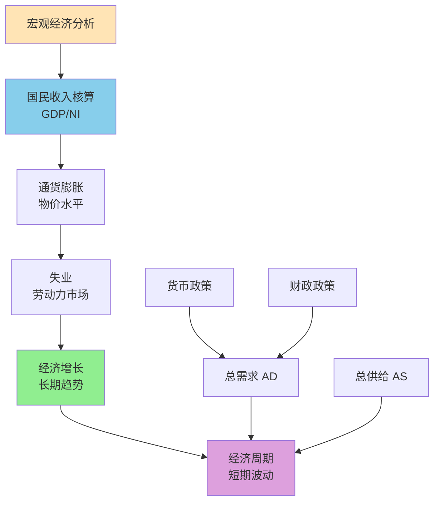
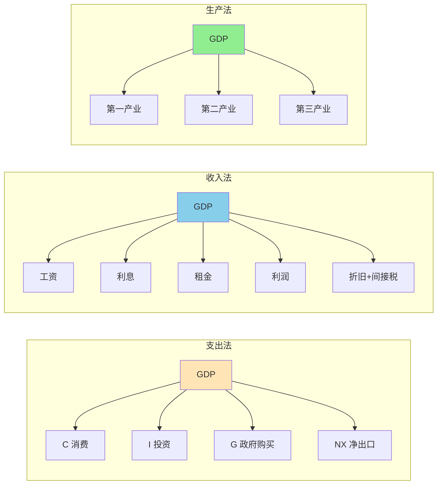

# 宏观经济基础

## 主题概述

宏观经济基础是宏观经济学研究的起点，它为我们理解整体经济现象提供了概念框架和测量工具。本主题将深入探讨GDP的衡量、通货膨胀的衡量、失业的衡量、经济增长以及经济周期等内容。宏观经济基础是理解宏观经济政策、经济波动、经济发展等问题的重要基础。

---

### 宏观经济分析框架



### 核心概念

### 1. GDP的衡量

#### GDP的定义

**国内生产总值（Gross Domestic Product, GDP）**：
```
一个国家或地区在一定时期内生产的所有最终产品和服务的市场价值
```

**GDP的特点**：
1. **市场价值**：按市场价格计算
2. **最终产品**：不包括中间产品
3. **当期生产**：不包括过去生产的
4. **地域范围**：一国境内生产

#### GDP的核算方法

**1. 支出法（Expenditure Approach）**：
```
GDP = C + I + G + NX

其中：
C = 消费（Consumption）
I = 投资（Investment）
G = 政府购买（Government Purchases）
NX = 净出口（Net Exports）= X - M
```

---

### GDP核算方法体系



**消费（C）**：
- 耐用消费品（汽车、家电）
- 非耐用消费品（食品、衣物）
- 服务（医疗、教育）

**投资（I）**：
- 企业固定投资（厂房、设备）
- 住宅投资（新建住房）
- 存货投资

**政府购买（G）**：
- 中央政府购买
- 地方政府购买
- 不包括转移支付

**净出口（NX）**：
- 出口（X）
- 进口（M）
- NX = X - M

**2. 收入法（Income Approach）**：
```
GDP = 工资 + 利息 + 租金 + 利润 + 间接税 + 折旧
```

**3. 生产法（Production Approach）**：
```
GDP = 各部门增加值之和
增加值 = 总产出 - 中间投入
```

#### GDP的分解

**名义GDP vs 实际GDP**：
```
名义GDP：按当年价格计算
实际GDP：按基期价格计算

GDP平减指数 = 名义GDP/实际GDP × 100%
```

**GDP的组成部分（支出法）**：
```
消费占比通常最大（约60-70%）
投资占比（约20-30%）
政府购买占比（约15-25%）
净出口占比可能为正或负
```

#### GDP的局限

**GDP不包括**：
1. **非市场活动**：家务劳动、地下经济
2. **闲暇**：生活质量的重要方面
3. **环境质量**：污染、资源耗竭
4. **收入分配**：贫富差距
5. **健康和教育**：人力资本投资

**替代指标**：
- 人类发展指数（HDI）
- 真实发展指标（GPI）
- 幸福指数

### 2. 通货膨胀的衡量

#### 通货膨胀的定义

**通货膨胀（Inflation）**：
```
总体价格水平的持续上涨
通常用年率表示
```

**通货紧缩（Deflation）**：
```
总体价格水平的持续下降
```

#### 价格指数

**1. 消费者价格指数（CPI）**：
```
衡量消费者购买的一篮子商品和服务价格的变化

CPI = (一篮子商品当期成本/一篮子商品基期成本) × 100%
```

**CPI的篮子**：
- 食品和饮料
- 住房
- 服装
- 交通
- 医疗
- 娱乐
- 教育和通讯
- 其他商品和服务

**2. 生产者价格指数（PPI）**：
```
衡量生产者面临的价格变化
领先指标
```

**3. GDP平减指数**：
```
衡量GDP中所有商品和服务的价格变化

GDP平减指数 = 名义GDP/实际GDP × 100%
```

#### 通货膨胀的计算

**通货膨胀率**：
```
π_t = (P_t - P_(t-1))/P_(t-1) × 100%

其中：
π_t为第t期的通货膨胀率
P_t为第t期的价格指数
```

#### 通货膨胀的类型

**1. 需求拉动型通货膨胀**：
```
总需求过度增长
需求大于供给
```

**2. 成本推动型通货膨胀**：
```
生产成本上升
供给冲击
```

**3. 结构性通货膨胀**：
```
经济结构变化
部门间不平衡
```

#### 通货膨胀的影响

**1. 对收入分配的影响**：
```
固定收入者受损
债权人受损
债务人受益
```

**2. 对经济效率的影响**：
```
价格信号失真
菜单成本
皮鞋成本
```

**3. 对经济增长的影响**：
```
温和通胀可能促进增长
高通胀损害增长
恶性通胀破坏经济
```

### 3. 失业的衡量

#### 失业的定义

**失业（Unemployment）**：
```
有工作能力且愿意工作，但找不到工作的人
```

**就业（Employment）**：
```
有工作的人
```

**劳动力（Labor Force）**：
```
就业者 + 失业者
```

#### 失业率

**失业率（Unemployment Rate）**：
```
失业率 = 失业人数/劳动力 × 100%
```

**劳动参与率（Labor Force Participation Rate）**：
```
劳动参与率 = 劳动力/工作年龄人口 × 100%
```

#### 失业的类型

**1. 摩擦性失业（Frictional Unemployment）**：
```
正常的工作转换
寻找合适工作需要时间
```

**2. 结构性失业（Structural Unemployment）**：
```
技能不匹配
地区不匹配
技术变革
```

**3. 周期性失业（Cyclical Unemployment）**：
```
经济周期引起的失业
衰退时失业增加
繁荣时失业减少
```

**4. 自然失业率（Natural Rate of Unemployment）**：
```
充分就业时的失业率
= 摩擦性失业 + 结构性失业
```

#### 失业的影响

**1. 经济影响**：
```
产出损失（奥肯定律）
资源浪费
```

**2. 社会影响**：
```
收入不平等
社会不稳定
健康问题
```

**3. 个人影响**：
```
收入损失
技能下降
心理压力
```

### 4. 经济增长

#### 经济增长的定义

**经济增长（Economic Growth）**：
```
一个国家或地区生产能力的长期增长
通常用实际GDP的增长率衡量
```

**经济增长率**：
```
g = (GDP_t - GDP_(t-1))/GDP_(t-1) × 100%
```

#### 经济增长的源泉

**1. 资本积累（Capital Accumulation）**：
```
实物资本：厂房、设备、基础设施
人力资本：教育、培训、健康
```

**2. 劳动力增长（Labor Force Growth）**：
```
人口增长
劳动参与率提高
```

**3. 技术进步（Technological Progress）**：
```
创新
技术扩散
管理改进
```

**4. 制度因素（Institutional Factors）**：
```
产权保护
法治
市场机制
```

#### 经济增长的类型

**1. 粗放型增长（Extensive Growth）**：
```
依靠要素投入增加
资本、劳动力增长
```

**2. 集约型增长（Intensive Growth）**：
```
依靠技术进步和效率提高
全要素生产率增长
```

#### 经济增长的影响

**1. 收入提高**：
```
生活水平提高
消费增加
```

**2. 贫困减少**：
```
绝对贫困减少
相对贫困可能增加
```

**3. 环境影响**：
```
资源消耗
环境污染
需要可持续发展
```

### 5. 经济周期

#### 经济周期的定义

**经济周期（Business Cycle）**：
```
经济活动的周期性波动
包括扩张和收缩
```

#### 经济周期的阶段

**1. 扩张（Expansion）**：
```
经济活动增加
产出增长
就业增加
价格上升
```

**2. 波峰（Peak）**：
```
经济活动达到最高点
转折点
```

**3. 收缩（Contraction/Recession）**：
```
经济活动减少
产出下降
失业增加
价格下降或通胀放缓
```

**4. 波谷（Trough）**：
```
经济活动达到最低点
转折点
```

#### 经济周期的特征

**1. 持续性（Persistence）**：
```
扩张和收缩持续一段时间
通常持续几年
```

**2. 波动性（Volatility）**：
```
不同经济指标波动程度不同
投资波动最大
消费波动较小
```

**3. 协动性（Comovement）**：
```
经济指标共同变动
产出、就业、收入同步变化
```

#### 经济周期的原因

**1. 总需求冲击**：
```
消费冲击
投资冲击
政府支出冲击
净出口冲击
```

**2. 总供给冲击**：
```
技术冲击
能源价格冲击
自然灾害
```

**3. 政策冲击**：
```
货币政策冲击
财政政策冲击
```

## 重要模型和公式

### 1. GDP核算

**支出法**：
```
GDP = C + I + G + NX
```

**收入法**：
```
GDP = 工资 + 利息 + 租金 + 利润 + 间接税 + 折旧
```

### 2. 通货膨胀

**通货膨胀率**：
```
π_t = (P_t - P_(t-1))/P_(t-1) × 100%
```

### 3. 失业

**失业率**：
```
失业率 = 失业人数/劳动力 × 100%
```

**奥肯定律（Okun's Law）**：
```
失业率变动 = -0.5 × 实际GDP增长率
```

### 4. 经济增长

**索洛模型（简化）**：
```
ΔY/Y = αΔK/K + (1-α)ΔL/L + ΔA/A

其中：
α为资本产出弹性
ΔA/A为技术进步率
```

## 实际应用案例

### 案例1：GDP计算

**问题**：某经济体有以下数据：
消费 = 5000亿
投资 = 1500亿
政府购买 = 1200亿
出口 = 800亿
进口 = 600亿

计算GDP和净出口。

**分析**：

**1. 计算净出口**：
```
NX = X - M = 800 - 600 = 200（亿）
```

**2. 计算GDP（支出法）**：
```
GDP = C + I + G + NX
GDP = 5000 + 1500 + 1200 + 200 = 7900（亿）
```

**3. GDP结构分析**：
```
消费占比：5000/7900 ≈ 63.3%
投资占比：1500/7900 ≈ 19.0%
政府购买占比：1200/7900 ≈ 15.2%
净出口占比：200/7900 ≈ 2.5%
```

**结论**：
1. GDP为7900亿
2. 净出口为200亿
3. 消费是GDP的主要组成部分

### 案例2：通货膨胀计算

**问题**：某国CPI数据如下：
2024年：100
2025年：105
2026年：110

计算2025年和2026年的通货膨胀率。

**分析**：

**1. 2025年通货膨胀率**：
```
π_2025 = (105 - 100)/100 × 100% = 5%
```

**2. 2026年通货膨胀率**：
```
π_2026 = (110 - 105)/105 × 100% ≈ 4.76%
```

**3. 平均通货膨胀率**：
```
平均通胀率 = (5% + 4.76%)/2 ≈ 4.88%
```

**结论**：
1. 2025年通胀率为5%
2. 2026年通胀率为4.76%
3. 通胀率有所下降

### 案例3：失业率计算

**问题**：某国人口为1亿，工作年龄人口为8000万，就业者为6000万，失业者为400万。计算失业率和劳动参与率。

**分析**：

**1. 计算劳动力**：
```
劳动力 = 就业者 + 失业者 = 6000 + 400 = 6400（万）
```

**2. 计算失业率**：
```
失业率 = 失业人数/劳动力 × 100%
      = 400/6400 × 100% = 6.25%
```

**3. 计算劳动参与率**：
```
劳动参与率 = 劳动力/工作年龄人口 × 100%
          = 6400/8000 × 100% = 80%
```

**结论**：
1. 失业率为6.25%
2. 劳动参与率为80%
3. 劳动力规模为6400万

## 与其他主题的联系

### 1. 与宏观经济模型的联系

宏观经济基础为宏观经济模型提供数据：
- GDP数据用于IS-LM模型
- 价格指数用于AD-AS模型
- 失业数据用于劳动力市场分析

### 2. 与宏观经济政策的联系

宏观经济基础是政策制定的基础：
- GDP增长目标指导财政政策
- 通胀目标指导货币政策
- 失业率是政策的重要指标

### 3. 与微观经济学的联系

宏观经济基础建立在微观基础上：
- GDP是个人消费和投资的加总
- 通胀来自微观价格变化
- 失业来自微观劳动市场

## 总结和思考题

### 总结

宏观经济基础提供了宏观经济分析的框架：

1. **GDP衡量**：
   - 支出法、收入法、生产法
   - 名义GDP vs 实际GDP
   - GDP的局限性

2. **通货膨胀衡量**：
   - CPI、PPI、GDP平减指数
   - 通货膨胀率计算
   - 通货膨胀的类型和影响

3. **失业衡量**：
   - 失业率和劳动参与率
   - 失业的类型
   - 自然失业率

4. **经济增长**：
   - 经济增长的源泉
   - 粗放型 vs 集约型增长
   - 经济增长的影响

5. **经济周期**：
   - 经济周期的阶段
   - 经济周期的特征
   - 经济周期的原因

### 思考题

**基础题**：
1. 什么是GDP？如何衡量？
2. 支出法GDP包括哪些组成部分？
3. 什么是通货膨胀？如何衡量？
4. 什么是失业率？如何计算？
5. 失业有哪些类型？

**中等题**：
6. 名义GDP和实际GDP有什么区别？
7. CPI和GDP平减指数有什么区别？
8. 什么是自然失业率？
9. 经济增长的源泉是什么？
10. 经济周期包括哪些阶段？

**高难题**：
11. GDP的局限性是什么？有哪些替代指标？
12. 通货膨胀对经济有什么影响？
13. 失业对经济和社会有什么影响？
14. 为什么会产生经济周期？
15. 如何区分粗放型和集约型增长？

**应用题**：
16. 给定支出数据，计算GDP和各组成部分占比。
17. 给定CPI数据，计算通货膨胀率。
18. 给定就业和失业数据，计算失业率和劳动参与率。
19. 分析经济增长的源泉。
20. 描述经济周期的阶段和特征。

### 进一步思考

1. **可持续发展**：如何在经济增长与环境保护之间平衡？

2. **数字经济**：数字技术如何影响GDP的衡量？

3. **不平等**：GDP增长是否意味着所有人收入都增加？

4. **全球化**：全球化如何影响各国的宏观经济指标？

5. **技术进步**：技术进步如何影响经济增长和就业？

## 参考书目

1. 曼昆：《宏观经济学》
2. 萨缪尔森：《经济学》
3. 高鸿业：《西方经济学》
4. 布兰查德：《宏观经济学》
5. 多恩布什：《宏观经济学》

## 附录：关键公式汇总

### 1. GDP核算
```
支出法：GDP = C + I + G + NX
收入法：GDP = 工资 + 利息 + 租金 + 利润 + 间接税 + 折旧
GDP平减指数 = 名义GDP/实际GDP × 100%
```

### 2. 通货膨胀
```
π_t = (P_t - P_(t-1))/P_(t-1) × 100%
```

### 3. 失业
```
失业率 = 失业人数/劳动力 × 100%
劳动参与率 = 劳动力/工作年龄人口 × 100%
```

### 4. 经济增长
```
g = (GDP_t - GDP_(t-1))/GDP_(t-1) × 100%
```

### 5. 奥肯定律
```
失业率变动 = -0.5 × 实际GDP增长率
```