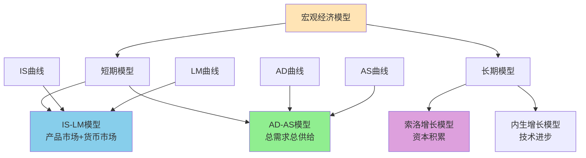

# 宏观经济模型

## 主题概述

宏观经济模型是分析宏观经济现象的理论工具，它帮助我们理解经济变量之间的关系和经济的运行机制。本主题将深入探讨IS-LM模型、AD-AS模型、索洛增长模型、内生增长模型以及实际经济周期模型等内容。宏观经济模型为理解宏观经济政策、预测经济走势、分析经济问题提供了框架。

---

### 宏观经济模型体系



### 核心概念

### 1. IS-LM模型

IS-LM模型分析产品市场和货币市场同时均衡的条件。

#### IS曲线

**IS曲线**：
```
产品市场均衡时，利率与收入的组合
投资等于储蓄（Investment = Saving）
```

**产品市场均衡条件**：
```
Y = C + I + G
C = C₀ + c(Y - T)
I = I₀ - bi
G = G₀
T = T₀ + tY

均衡：Y = C₀ + c(Y - T) - bi + G₀
```

**IS曲线的斜率**：
```
dY/di = -b/(1 - c(1 - t))

斜率为负：
利率上升，投资减少，收入减少
```

**IS曲线的移动**：
```
扩张性财政政策（G增加、T减少）：IS曲线右移
紧缩性财政政策（G减少、T增加）：IS曲线左移
```

#### LM曲线

**LM曲线**：
```
货币市场均衡时，利率与收入的组合
货币需求等于货币供给（Liquidity preference = Money supply）
```

**货币市场均衡条件**：
```
M/P = L = kY - hi

其中：
M为货币供给
P为价格水平
L为货币需求
kY为交易性需求
hi为投机性需求
```

**LM曲线的斜率**：
```
di/dY = k/h

斜率为正：
收入增加，货币需求增加，利率上升
```

**LM曲线的移动**：
```
扩张性货币政策（M增加）：LM曲线右移
紧缩性货币政策（M减少）：LM曲线左移
```

#### IS-LM均衡

**IS-LM均衡**：
```
产品市场和货币市场同时均衡
IS曲线与LM曲线的交点
```

**均衡条件**：
```
IS曲线：Y = C + I + G
LM曲线：M/P = kY - hi

联立求解得到均衡收入Y*和均衡利率i*
```

#### IS-LM模型的应用

**财政政策分析**：
```
IS曲线右移：
- 如果LM曲线较平坦（货币需求对利率敏感）：财政政策效果大
- 如果LM曲线较陡峭（货币需求对利率不敏感）：财政政策效果小

挤出效应（Crowding Out）：
政府支出增加导致利率上升，挤出私人投资
```

**货币政策分析**：
```
LM曲线右移：
- 如果IS曲线较平坦（投资对利率敏感）：货币政策效果大
- 如果IS曲线较陡峭（投资对利率不敏感）：货币政策效果小
```

### 2. AD-AS模型

AD-AS模型分析总需求、总供给和价格水平的关系。

#### 总需求（AD）

**总需求（Aggregate Demand）**：
```
在给定价格水平下，经济对产品和服务的总需求
```

**AD曲线**：
```
向右下方倾斜
价格水平上升，总需求减少
```

**AD曲线的形状原因**：
1. **财富效应（Wealth Effect）**：
```
价格水平上升，实际财富减少，消费减少
```

2. **利率效应（Interest Rate Effect）**：
```
价格水平上升，实际货币供给减少，利率上升，投资减少
```

3. **汇率效应（Exchange Rate Effect）**：
```
价格水平上升，利率上升，汇率升值，净出口减少
```

**AD曲线的移动**：
```
扩张性财政政策：AD曲线右移
扩张性货币政策：AD曲线右移
```

#### 总供给（AS）

**总供给（Aggregate Supply）**：
```
在给定价格水平下，经济对产品和服务的总供给
```

**AS曲线的形状**：

**1. 凯恩斯区域（Keynesian Range）**：
```
水平AS曲线
存在闲置资源
价格水平不变，供给可以增加
```

**2. 中间区域（Intermediate Range）**：
```
向上倾斜的AS曲线
部分资源充分利用
价格上升，供给增加
```

**3. 古典区域（Classical Range）**：
```
垂直AS曲线
资源充分利用
价格上升，供给不变
```

**AS曲线的移动**：
```
正向供给冲击：AS曲线右移
负向供给冲击：AS曲线左移
```

#### AD-AS均衡

**AD-AS均衡**：
```
总需求等于总供给
AD曲线与AS曲线的交点
```

**均衡条件**：
```
AD = AS
```

#### AD-AS模型的应用

**需求冲击分析**：
```
AD曲线右移：
- 凯恩斯区域：产出增加，价格不变
- 中间区域：产出增加，价格上升
- 古典区域：产出不变，价格上升
```

**供给冲击分析**：
```
AS曲线左移（滞胀）：
产出减少，价格上升
```

### 3. 索洛增长模型

索洛增长模型分析长期经济增长的决定因素。

#### 基本假设

**1. 生产函数**：
```
Y = F(K, L) = K^α L^(1-α)
规模报酬不变
```

**2. 人口增长**：
```
L(t) = L₀e^nt
n为人口增长率
```

**3. 资本积累**：
```
dK/dt = sY - δK
s为储蓄率
δ为折旧率
```

#### 索洛模型的核心方程

**人均生产函数**：
```
y = f(k) = k^α
其中：
y = Y/L为人均产出
k = K/L为人均资本
```

**资本积累方程**：
```
dk/dt = sf(k) - (n + δ)k

其中：
sf(k)为人均投资
(n + δ)k为持平投资
```

#### 稳态均衡

**稳态（Steady State）**：
```
人均资本不变：dk/dt = 0
sf(k*) = (n + δ)k*
```

**稳态人均资本**：
```
k* = [s/(n + δ)]^(1/(1-α))
```

**稳态人均产出**：
```
y* = k*^α = [s/(n + δ)]^(α/(1-α))
```

#### 索洛模型的结论

**1. 储蓄率的影响**：
```
储蓄率上升，稳态人均资本和人均产出增加
但增长是暂时的，最终回到新的稳态
储蓄率不影响长期增长率
```

**2. 人口增长率的影响**：
```
人口增长率上升，稳态人均资本和人均产出减少
但总产出增长率等于人口增长率
```

**3. 技术进步的影响**：
```
引入技术进步A：
Y = F(K, AL) = K^α (AL)^(1-α)

稳态人均有效资本不变
人均产出增长率等于技术进步率
```

#### 趋同假说

**绝对趋同（Absolute Convergence）**：
```
所有国家的人均收入趋同
```

**条件趋同（Conditional Convergence）**：
```
具有相同参数（储蓄率、人口增长率、技术）的国家趋同
```

### 4. 内生增长模型

内生增长模型将技术进步内生化，解释长期增长的来源。

#### AK模型

**生产函数**：
```
Y = AK
资本边际报酬不变
```

**资本积累**：
```
dK/dt = sY - δK = sAK - δK
```

**增长率**：
```
g = (dY/dt)/Y = sA - δ

增长率取决于储蓄率和技术水平
```

**内生增长的含义**：
```
储蓄率影响长期增长率
政策可以影响长期增长
```

#### 人力资本模型

**生产函数**：
```
Y = K^α (uHL)^(1-α)

其中：
H为人均人力资本
u为工作时间
```

**人力资本积累**：
```
dH/dt = B(1 - u)H - δ_H H

其中：
B为人力资本生产率
1 - u为学习时间
```

**结论**：
```
人力资本投资促进长期增长
教育政策影响经济增长
```

#### 研发模型

**创新驱动增长**：
```
技术进步来自研发投入
研发投入决定创新率
创新率决定增长率
```

**政策含义**：
```
研发补贴促进增长
知识产权保护促进创新
```

### 5. 实际经济周期模型

实际经济周期模型认为经济波动主要来自实际冲击。

#### 基本假设

**1. 理性预期**：
```
经济主体利用所有可用信息形成预期
```

**2. 市场出清**：
```
所有市场持续出清
价格灵活调整
```

**3. 实际冲击**：
```
技术冲击是主要波动来源
```

#### 技术冲击的影响

**正向技术冲击**：
```
生产率提高
劳动需求增加
工资上升
就业增加
产出增加
消费增加
```

**动态调整**：
```
冲击后经济逐渐调整
跨期替代导致劳动和消费的波动
```

#### RBC模型的结论

**1. 经济波动是有效的**：
```
技术冲击导致最优资源配置变化
政府干预可能降低效率
```

**2. 货币中性**：
```
货币政策不影响实际变量
只影响价格水平
```

**3. 反周期政策无效**：
```
稳定政策可能扭曲资源配置
```

## 重要模型和公式

### 1. IS-LM模型

**IS曲线**：
```
Y = C + I + G
斜率：dY/di = -b/(1 - c(1 - t))
```

**LM曲线**：
```
M/P = kY - hi
斜率：di/dY = k/h
```

### 2. AD-AS模型

**AD曲线**：
```
Y = Y(M/P, G, T)
向右下方倾斜
```

**AS曲线**：
```
凯恩斯区域：水平
中间区域：向上倾斜
古典区域：垂直
```

### 3. 索洛模型

**人均生产函数**：
```
y = k^α
```

**资本积累**：
```
dk/dt = sf(k) - (n + δ)k
```

**稳态**：
```
k* = [s/(n + δ)]^(1/(1-α))
y* = [s/(n + δ)]^(α/(1-α))
```

### 4. 内生增长模型

**AK模型**：
```
Y = AK
g = sA - δ
```

## 实际应用案例

### 案例1：IS-LM模型分析

**问题**：某经济体的IS曲线为Y = 1000 - 50i，LM曲线为M/P = 0.5Y - 25i。货币供给M = 1000，价格水平P = 1。政府支出从200增加到250。分析财政政策的效果。

**分析**：

**1. 初始均衡**：
```
IS: Y = 1000 - 50i
LM: 1000/1 = 0.5Y - 25i ⇒ 1000 = 0.5Y - 25i

从IS: i = (1000 - Y)/50 = 20 - 0.02Y
代入LM: 1000 = 0.5Y - 25(20 - 0.02Y)
1000 = 0.5Y - 500 + 0.5Y
1500 = Y
i = 20 - 0.02 × 1500 = 20 - 30 = -10（利率为负不合理，数据有问题）

调整数据：假设IS曲线为Y = 1000 - 30i
IS: i = (1000 - Y)/30
LM: 1000 = 0.5Y - 25(1000 - Y)/30
1000 = 0.5Y - (25000 - 25Y)/30
30000 = 15Y - 25000 + 25Y
55000 = 40Y
Y = 1375
i = (1000 - 1375)/30 ≈ -12.5（仍为负，继续调整）

假设IS曲线为Y = 2000 - 30i
IS: i = (2000 - Y)/30
LM: 1000 = 0.5Y - 25(2000 - Y)/30
1000 = 0.5Y - (50000 - 25Y)/30
30000 = 15Y - 50000 + 25Y
80000 = 40Y
Y = 2000
i = (2000 - 2000)/30 = 0

初始均衡：Y = 2000, i = 0
```

**2. 财政政策（G增加50）**：
```
IS曲线右移，假设新IS曲线为Y = 2050 - 30i
IS: i = (2050 - Y)/30
LM: 1000 = 0.5Y - 25(2050 - Y)/30
1000 = 0.5Y - (51250 - 25Y)/30
30000 = 15Y - 51250 + 25Y
81250 = 40Y
Y = 2031.25
i = (2050 - 2031.25)/30 ≈ 0.625

新均衡：Y = 2031.25, i = 0.625
```

**3. 政策效果**：
```
收入增加：ΔY = 2031.25 - 2000 = 31.25
利率上升：Δi = 0.625 - 0 = 0.625

乘数：ΔY/ΔG = 31.25/50 = 0.625
挤出效应：投资减少
```

**结论**：
1. 财政政策增加收入31.25
2. 利率上升0.625
3. 存在挤出效应
4. 财政政策乘数为0.625

### 案例2：索洛模型分析

**问题**：某经济的生产函数为Y = K^0.3L^0.7，储蓄率s = 0.2，人口增长率n = 0.02，折旧率δ = 0.05。求稳态人均资本和人均产出。

**分析**：

**1. 人均生产函数**：
```
y = Y/L = K^0.3L^0.7/L = K^0.3L^(-0.3) = (K/L)^0.3 = k^0.3
```

**2. 稳态条件**：
```
sf(k*) = (n + δ)k*
0.2 × k*^0.3 = (0.02 + 0.05)k*
0.2 × k*^0.3 = 0.07k*
0.2/0.07 = k*/k*^0.3
2.857 = k*^0.7
k* = 2.857^(1/0.7) ≈ 2.857^1.429 ≈ 4.53
```

**3. 稳态人均产出**：
```
y* = k*^0.3 = 4.53^0.3 ≈ 1.57
```

**4. 稳态人均收入增长率**：
```
没有技术进步时，稳态人均收入增长率为0
```

**结论**：
1. 稳态人均资本为4.53
2. 稳态人均产出为1.57
3. 稳态人均收入增长率为0

## 与其他主题的联系

### 1. 与宏观经济基础的联系

宏观经济模型建立在宏观经济基础上：
- GDP数据用于校准模型
- 通胀数据用于AD-AS模型
- 失业数据用于劳动力市场分析

### 2. 与宏观经济政策的联系

宏观经济模型指导政策制定：
- IS-LM模型指导财政和货币政策
- AD-AS模型指导稳定政策
- 增长模型指导长期政策

### 3. 与微观经济学的联系

宏观经济模型有微观基础：
- 消费函数基于消费者行为
- 投资函数基于生产者行为
- IS-LM模型有微观基础

## 总结和思考题

### 总结

宏观经济模型提供了分析宏观经济的工具：

1. **IS-LM模型**：
   - 产品市场和货币市场均衡
   - 财政政策和货币政策分析
   - 挤出效应

2. **AD-AS模型**：
   - 总需求和总供给均衡
   - 需求冲击和供给冲击分析
   - 通货膨胀和失业

3. **索洛增长模型**：
   - 长期经济增长的决定
   - 资本积累和人口增长
   - 趋同假说

4. **内生增长模型**：
   - 技术进步内生化
   - 人力资本和研发
   - 政策影响长期增长

5. **实际经济周期模型**：
   - 实际冲击驱动波动
   - 市场出清和理性预期
   - 货币中性

### 思考题

**基础题**：
1. IS曲线和LM曲线分别代表什么？
2. IS曲线和LM曲线的斜率由什么决定？
3. AD曲线为什么向右下方倾斜？
4. AS曲线的形状有什么特点？
5. 什么是索洛模型的稳态？

**中等题**：
6. IS-LM模型如何分析财政政策效果？
7. 什么是挤出效应？什么情况下挤出效应大？
8. AD-AS模型如何分析需求冲击？
9. 索洛模型中储蓄率对经济增长有什么影响？
10. 什么是绝对趋同和条件趋同？

**高难题**：
11. 内生增长模型与索洛模型有什么区别？
12. 实际经济周期模型的基本假设是什么？
13. 如何将技术进步纳入索洛模型？
14. 为什么内生增长模型中储蓄率影响长期增长率？
15. 实际经济周期模型认为政府政策有效吗？

**应用题**：
16. 给定IS和LM曲线，计算均衡收入和利率。
17. 分析财政政策对均衡的影响。
18. 给定生产函数和参数，计算索洛模型的稳态。
19. 比较不同储蓄率下的稳态产出。
20. 分析技术冲击对经济的影响。

### 进一步思考

1. **模型选择**：不同模型适用于什么情况？

2. **政策设计**：如何设计最优的财政和货币政策？

3. **模型局限**：宏观经济模型的局限性是什么？

4. **实证检验**：如何检验宏观经济模型？

5. **新兴问题**：数字经济、气候变化如何影响宏观经济模型？

## 参考书目

1. 曼昆：《宏观经济学》
2. 萨缪尔森：《经济学》
3. 高鸿业：《西方经济学》
4. 布兰查德：《宏观经济学》
5. 多恩布什：《宏观经济学》

## 附录：关键公式汇总

### 1. IS-LM模型
```
IS: Y = C + I + G
LM: M/P = kY - hi
```

### 2. AD-AS模型
```
AD: Y = Y(M/P, G, T)
AS: P = P(Y)（取决于区域）
```

### 3. 索洛模型
```
y = k^α
dk/dt = sf(k) - (n + δ)k
k* = [s/(n + δ)]^(1/(1-α))
```

### 4. 内生增长模型
```
Y = AK
g = sA - δ
```