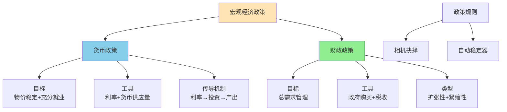

# 宏观经济政策

## 主题概述

宏观经济政策是政府利用政策工具实现宏观经济目标的手段。本主题将深入探讨货币政策、财政政策、政策规则与相机抉择、政策协调以及政策效果评估等内容。宏观经济政策理论为理解政府如何应对经济波动、促进经济增长、稳定物价和就业提供了框架。

---

### 宏观经济政策体系



### 核心概念

### 1. 货币政策

货币政策是中央银行通过控制货币供应量和利率来影响经济的政策。

#### 货币政策的目标

**1. 物价稳定（Price Stability）**：
```
保持低而稳定的通货膨胀
通常目标通胀率为2%左右
```

**2. 充分就业（Full Employment）**：
```
将失业率维持在自然失业率附近
避免高失业
```

**3. 经济增长（Economic Growth）**：
```
促进长期经济增长
提高生活水平
```

**4. 金融稳定（Financial Stability）**：
```
维护金融体系稳定
防范金融危机
```

#### 货币政策工具

**1. 公开市场操作（Open Market Operations）**：
```
中央银行买卖政府债券
买入债券：增加货币供给
卖出债券：减少货币供给
最常用的货币政策工具
```

**2. 贴现率（Discount Rate）**：
```
中央银行向商业银行贷款的利率
降低贴现率：扩张性货币政策
提高贴现率：紧缩性货币政策
```

**3. 法定准备金率（Reserve Requirements）**：
```
商业银行必须持有的准备金比例
降低准备金率：扩张性货币政策
提高准备金率：紧缩性货币政策
```

**4. 其他工具**：
```
量化宽松（QE）
前瞻性指引
负利率政策
```

#### 货币政策的传导机制

**1. 利率渠道（Interest Rate Channel）**：
```
货币政策 → 利率 → 投资 → 总需求 → 产出
```

**2. 信贷渠道（Credit Channel）**：
```
货币政策 → 银行信贷 → 投资 → 总需求 → 产出
```

**3. 汇率渠道（Exchange Rate Channel）**：
```
货币政策 → 利率 → 汇率 → 净出口 → 总需求 → 产出
```

**4. 资产价格渠道（Asset Price Channel）**：
```
货币政策 → 资产价格 → 财富 → 消费 → 总需求 → 产出
```

#### 货币政策的类型

**1. 扩张性货币政策（Expansionary Monetary Policy）**：
```
增加货币供给
降低利率
刺激经济
适用于经济衰退
```

**2. 紧缩性货币政策（Contractionary Monetary Policy）**：
```
减少货币供给
提高利率
抑制经济
适用于经济过热
```

#### 货币政策的效果

**影响货币政策效果的因素**：
1. **投资对利率的敏感性**：
```
敏感性高：货币政策效果大
敏感性低：货币政策效果小
```

2. **流动性陷阱（Liquidity Trap）**：
```
利率极低时，货币政策无效
货币需求对利率完全弹性
```

3. **预期**：
```
理性预期可能抵消政策效果
信誉很重要
```

### 2. 财政政策

财政政策是政府通过调整政府支出和税收来影响经济的政策。

#### 财政政策的目标

**1. 稳定经济（Stabilization）**：
```
平抑经济波动
促进充分就业
```

**2. 资源配置（Resource Allocation）**：
```
提供公共物品
纠正市场失灵
```

**3. 收入分配（Income Distribution）**：
```
减少收入不平等
促进社会公平
```

**4. 经济增长（Economic Growth）**：
```
投资基础设施
促进人力资本积累
```

#### 财政政策工具

**1. 政府购买（Government Purchases）**：
```
政府购买商品和服务
直接影响总需求
```

**2. 转移支付（Transfer Payments）**：
```
政府给个人和企业的支付
间接影响总需求
```

**3. 税收（Taxes）**：
```
个人所得税
企业所得税
消费税
```

**4. 公债（Public Debt）**：
```
政府发行的债券
为赤字融资
```

#### 财政政策的类型

**1. 扩张性财政政策（Expansionary Fiscal Policy）**：
```
增加政府支出
减少税收
刺激经济
适用于经济衰退
```

**2. 紧缩性财政政策（Contractionary Fiscal Policy）**：
```
减少政府支出
增加税收
抑制经济
适用于经济过热
```

#### 财政政策的乘数效应

**财政乘数（Fiscal Multiplier）**：
```
政府支出变化对总产出的影响

乘数 = 1/(1 - MPC(1 - t))

其中：
MPC为边际消费倾向
t为税率
```

**税收乘数（Tax Multiplier）**：
```
税收变化对总产出的影响

税收乘数 = -MPC/(1 - MPC(1 - t))
```

**平衡预算乘数（Balanced Budget Multiplier）**：
```
政府支出和税收同量变化的影响

平衡预算乘数 = 1（简单模型中）
```

#### 财政政策的效果

**影响财政政策效果的因素**：
1. **挤出效应（Crowding Out）**：
```
政府支出增加导致利率上升
挤出私人投资
减少财政政策效果
```

2. **边际消费倾向**：
```
MPC高：乘数大，政策效果大
MPC低：乘数小，政策效果小
```

3. **税收结构**：
```
税率高：乘数小，政策效果小
税率低：乘数大，政策效果大
```

4. **开放程度**：
```
开放度高：部分需求漏出国外
政策效果较小
```

### 3. 政策规则与相机抉择

#### 政策规则（Policy Rules）

**政策规则的定义**：
```
政府遵循预先制定的政策规则
规则明确、透明、可预测
```

**常见的政策规则**：

**1. 货币数量规则（Money Growth Rule）**：
```
弗里德曼规则
货币供应量按固定增长率增长
```

**2. 泰勒规则（Taylor Rule）**：
```
利率规则

i = r* + π + 0.5(π - π*) + 0.5(y - y*)

其中：
i为名义利率
r*为均衡实际利率
π为通胀率
π*为目标通胀率
y为实际产出
y*为潜在产出
```

**3. 通胀目标制（Inflation Targeting）**：
```
明确通胀目标
公开承诺实现目标
提高政策透明度
```

#### 相机抉择（Discretion）

**相机抉择的定义**：
```
政府根据经济情况灵活调整政策
政策随情况变化
```

**相机抉择的优势**：
1. **灵活性**：
```
可以根据经济变化调整政策
```

2. **信息利用**：
```
利用最新信息
```

**相机抉择的劣势**：
1. **时间不一致性（Time Inconsistency）**：
```
政府可能偏离承诺
降低政策可信度
```

2. **政治干扰**：
```
短期政治考虑影响政策
```

3. **不确定性**：
```
政策难以预测
```

#### 规则 vs 相机抉择

**支持规则的理由**：
1. **承诺机制**：
```
规则提供承诺
增强政策可信度
```

2. **时间一致性**：
```
避免时间不一致性
```

3. **政治约束**：
```
限制政治干扰
```

**支持相机抉择的理由**：
1. **灵活性**：
```
应对不确定事件
```

2. **模型不确定性**：
```
经济模型可能错误
需要灵活调整
```

**混合方法**：
```
约束性相机抉择（Constrained Discretion）
提供指导框架但保留灵活性
```

### 4. 政策协调

#### 货币政策与财政政策的协调

**政策组合（Policy Mix）**：
```
货币政策与财政政策的配合使用
```

**常见组合**：

**1. 双扩张（Double Expansion）**：
```
扩张性财政 + 扩张性货币
强刺激
适用于严重衰退
```

**2. 双紧缩（Double Contraction）**：
```
紧缩性财政 + 紧缩性货币
强抑制
适用于严重通胀
```

**3. 扩张性财政 + 紧缩性货币**：
```
刺激增长但抑制通胀
增加政府投资
提高利率抑制通胀
```

**4. 紧缩性财政 + 扩张性货币**：
```
抑制通胀但支持增长
减少政府支出
降低利率支持投资
```

#### 国际政策协调

**国际政策协调的必要性**：
1. **溢出效应（Spillover Effects）**：
```
一国政策影响他国
```

2. **以邻为壑政策（Beggar-Thy-Neighbor Policies）**：
```
货币竞争性贬值
贸易保护主义
```

3. **全球公共物品**：
```
金融稳定
气候变化
```

**国际协调机制**：
1. **G20**：
```
主要经济体协调
全球宏观经济政策
```

2. **IMF**：
```
国际货币基金组织
监督成员国政策
```

3. **BIS**：
```
国际清算银行
协调货币政策
```

### 5. 政策效果评估

#### 政策效果评估的方法

**1. 计量经济分析**：
```
时间序列分析
面板数据分析
结构向量自回归（SVAR）
```

**2. 自然实验**：
```
利用政策变化作为实验
比较政策实施前后的效果
```

**3. DSGE模型**：
```
动态随机一般均衡模型
模拟政策效果
```

#### 政策效果的指标

**1. 产出效果**：
```
GDP增长率
产出缺口
```

**2. 就业效果**：
```
失业率变化
就业创造
```

**3. 通胀效果**：
```
通胀率变化
通胀预期
```

**4. 稳定效果**：
```
产出波动性
通胀波动性
```

#### 政策的副作用

**1. 挤出效应**：
```
财政政策挤出私人投资
```

**2. 通胀风险**：
```
过度刺激导致通胀
```

**3. 资产泡沫**：
```
低利率导致资产价格泡沫
```

**4. 债务积累**：
```
财政赤字导致债务增加
```

## 重要模型和公式

### 1. 财政乘数

**政府支出乘数**：
```
k_G = 1/(1 - MPC(1 - t))
```

**税收乘数**：
```
k_T = -MPC/(1 - MPC(1 - t))
```

### 2. 泰勒规则

```
i = r* + π + 0.5(π - π*) + 0.5(y - y*)
```

### 3. 政策效果

**挤出效应**：
```
ΔI = -b × Δi
其中b为投资对利率的敏感性
```

## 实际应用案例

### 案例1：财政政策分析

**问题**：某经济体的边际消费倾向MPC = 0.8，税率t = 0.2。政府支出增加100亿。计算政府支出乘数和对产出的影响。

**分析**：

**1. 计算政府支出乘数**：
```
k_G = 1/(1 - MPC(1 - t))
k_G = 1/(1 - 0.8 × (1 - 0.2))
k_G = 1/(1 - 0.8 × 0.8)
k_G = 1/(1 - 0.64)
k_G = 1/0.36 ≈ 2.78
```

**2. 计算对产出的影响**：
```
ΔY = k_G × ΔG = 2.78 × 100 = 278（亿）
```

**3. 考虑挤出效应**：
```
假设投资对利率的敏感性b = 50
利率上升Δi = 0.5

挤出效应：ΔI = -50 × 0.5 = -25（亿）

实际产出增加：278 - 25 = 253（亿）
```

**结论**：
1. 政府支出乘数约为2.78
2. 政府支出增加100亿，产出增加278亿
3. 考虑挤出效应后，产出增加253亿

### 案例2：货币政策分析

**问题**：中央银行通过公开市场操作买入100亿债券。货币乘数为5。计算货币供给的变化。

**分析**：

**1. 基础货币变化**：
```
买入100亿债券，基础货币增加100亿
```

**2. 货币供给变化**：
```
ΔM = 货币乘数 × Δ基础货币
ΔM = 5 × 100 = 500（亿）
```

**3. 对利率的影响**：
```
货币供给增加，利率下降
假设货币需求对利率的敏感性为25
Δi = -ΔM/25 = -500/25 = -20

利率下降20个基点
```

**结论**：
1. 基础货币增加100亿
2. 货币供给增加500亿
3. 利率下降20个基点

## 与其他主题的联系

### 1. 与宏观经济模型的联系

宏观经济政策建立在宏观经济模型基础上：
- IS-LM模型分析财政和货币政策
- AD-AS模型分析稳定政策
- 增长模型指导长期政策

### 2. 与宏观经济基础的联系

宏观经济政策目标是宏观经济指标：
- GDP增长目标
- 通胀目标
- 失业率目标

### 3. 与市场结构的联系

政策效果取决于市场结构：
- 完全竞争市场：政策效果较好
- 不完全竞争市场：政策效果可能减弱

## 总结和思考题

### 总结

宏观经济政策是政府调节经济的工具：

1. **货币政策**：
   - 公开市场操作、贴现率、准备金率
   - 利率、信贷、汇率、资产价格渠道
   - 扩张性和紧缩性政策

2. **财政政策**：
   - 政府购买、转移支付、税收
   - 乘数效应和挤出效应
   - 扩张性和紧缩性政策

3. **政策规则与相机抉择**：
   - 规则提供承诺和可信度
   - 相机抉择提供灵活性
   - 混合方法

4. **政策协调**：
   - 货币政策和财政政策协调
   - 国际政策协调

5. **政策效果评估**：
   - 计量经济分析
   - 自然实验
   - DSGE模型

### 思考题

**基础题**：
1. 货币政策的目标是什么？
2. 货币政策有哪些工具？
3. 财政政策有哪些工具？
4. 什么是财政乘数？
5. 什么是挤出效应？

**中等题**：
6. 什么是泰勒规则？
7. 政策规则和相机抉择有什么区别？
8. 货币政策的传导机制有哪些？
9. 如何计算政府支出乘数？
10. 货币政策和财政政策如何协调？

**高难题**：
11. 什么是时间不一致性？如何解决？
12. 什么是流动性陷阱？如何应对？
13. 国际政策协调的必要性和挑战是什么？
14. 如何评估宏观经济政策的效果？
15. 数字经济对宏观经济政策有什么影响？

**应用题**：
16. 给定MPC和税率，计算财政乘数。
17. 分析财政政策的挤出效应。
18. 计算货币供给变化对利率的影响。
19. 比较不同政策组合的效果。
20. 设计一个应对经济衰退的政策组合。

### 进一步思考

1. **政策可信度**：如何建立和维持政策可信度？

2. **政策独立性**：中央银行应该独立吗？

3. **政策时滞**：政策时滞如何影响政策效果？

4. **零利率下限**：如何应对零利率下限？

5. **非常规政策**：非常规货币政策的长期影响是什么？

## 参考书目

1. 曼昆：《宏观经济学》
2. 萨缪尔森：《经济学》
3. 高鸿业：《西方经济学》
4. 布兰查德：《宏观经济学》
5. 泰勒：《货币政策规则》

## 附录：关键公式汇总

### 1. 财政乘数
```
政府支出乘数：k_G = 1/(1 - MPC(1 - t))
税收乘数：k_T = -MPC/(1 - MPC(1 - t))
平衡预算乘数：k_B = 1
```

### 2. 泰勒规则
```
i = r* + π + 0.5(π - π*) + 0.5(y - y*)
```

### 3. 货币供给
```
M = 货币乘数 × 基础货币
```

### 4. 挤出效应
```
ΔI = -b × Δi
```