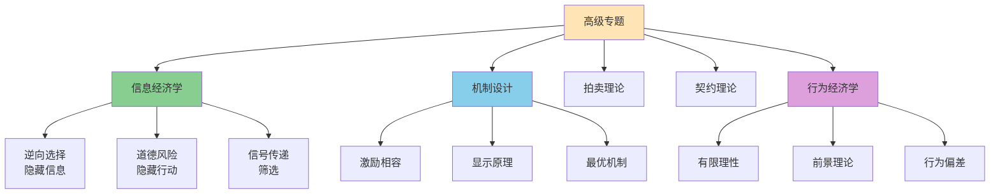

# 高级专题

## 主题概述

高级专题涵盖了经济学的许多前沿和重要领域，包括信息经济学、机制设计、拍卖理论、契约理论和行为经济学等。这些领域拓展了传统经济学的分析框架，为理解复杂的经济现象提供了新的视角和工具。本主题将深入探讨这些高级专题的核心概念、重要模型和实际应用。

---

### 高级专题体系



### 核心概念

### 1. 信息经济学

信息经济学研究信息不对称对经济行为和市场结果的影响。

#### 信息不对称

**信息不对称（Asymmetric Information）**：
```
交易双方拥有的信息不同
一方拥有另一方不知道的信息
```

**类型**：

**1. 隐藏信息（Hidden Information）**：
```
事前信息不对称
例如：买者不知道产品质量
```

**2. 隐藏行动（Hidden Action）**：
```
事后信息不对称
例如：雇主不知道雇员的努力程度
```

#### 逆向选择

**逆向选择（Adverse Selection）**：
```
事前信息不对称导致劣质品驱逐优质品
```

**柠檬市场（Lemons Market）**：
```
阿克洛夫（Akerlof）模型

卖者知道质量，买者不知道
买者愿意支付平均价格
高质量产品退出市场
最终只有低质量产品留在市场
市场失灵
```

**解决逆向选择的方法**：
1. **信号发送（Signaling）**：
```
高质量卖者发送信号
例如：教育、保修、品牌
```

2. **信号甄别（Screening）**：
```
买者设计机制甄别质量
例如：保险公司的免赔额
```

3. **中介和认证**：
```
第三方提供信息
例如：评级机构、认证机构
```

#### 道德风险

**道德风险（Moral Hazard）**：
```
事后信息不对称导致行为扭曲
```

**例子**：
1. **保险市场**：
```
购买保险后，投保人可能减少预防措施
```

2. **劳动力市场**：
```
雇主难以监督雇员努力程度
```

3. **金融市场**：
```
借款人可能从事高风险活动
```

**解决道德风险的方法**：
1. **监督**：
```
直接监督行为
成本较高
```

2. **激励合同**：
```
将报酬与结果挂钩
例如：绩效工资、股票期权
```

3. **抵押品**：
```
要求提供抵押品
增加违约成本
```

#### 委托代理问题

**委托代理问题（Principal-Agent Problem）**：
```
委托人（Principal）委托代理人（Agent）行动
代理人追求自身利益，可能损害委托人利益
信息不对称导致监督困难
```

**委托代理模型**：
```
委托人：最大化期望效用
代理人：选择努力水平

代理人的效用函数：
U = w - c(e)
其中：
w为工资
c(e)为努力成本

委托人的利润：
π = R(e) - w
其中R(e)为努力带来的收益
```

**最优激励合同**：
```
委托人设计合同激励代理人付出努力

线性合同：
w = α + βπ

其中：
α为固定工资
β为激励强度
```

### 2. 机制设计

机制设计理论研究如何设计规则以实现社会目标。

#### 机制设计的基本要素

**1. 参与者（Players）**：
```
参与机制设计的经济主体
```

**2. 类型（Types）**：
```
参与者的私人信息
例如：成本、估值
```

**3. 行动（Actions）**：
```
参与者可以采取的行动
```

**4. 结果（Outcomes）**：
```
机制产生的结果
例如：资源配置、支付
```

**5. 社会目标（Social Objective）**：
```
机制设计要实现的目标
例如：效率、公平
```

#### 机制设计的性质

**1. 个人理性（Individual Rationality, IR）**：
```
参与者有动力参与机制
期望收益 ≥ 保留收益
```

**2. 激励相容（Incentive Compatibility, IC）**：
```
参与者有动力报告真实类型
说真话是最优策略
```

**3. 可实施性（Implementability）**：
```
机制能够实现社会目标
```

#### 维克瑞-克拉克-格罗夫斯机制（VCG机制）

**VCG机制**：
```
使得说真话是占优策略的机制
```

**步骤**：
1. 参与者报告自己的估值
2. 选择使报告估值之和最大的结果
3. 计算每个参与者对其他参与者的外部性
4. 参与者支付等于外部性

**性质**：
- 说真话是占优策略
- 机制有效（社会总剩余最大化）
- 机制是弱预算平衡的

#### 显示原理

**显示原理（Revelation Principle）**：
```
任何社会选择函数都可以通过一个直接显示机制实现
```

**含义**：
```
只需要考虑直接显示机制
参与者直接报告类型
机制设计简化
```

### 3. 拍卖理论

拍卖理论研究资源配置的最优机制。

#### 拍卖的基本类型

**1. 英式拍卖（English Auction）**：
```
价格上升拍卖
出价最高者获胜
支付最高出价
```

**2. 荷式拍卖（Dutch Auction）**：
```
价格下降拍卖
第一个接受当前价格者获胜
```

**3. 第一价格密封拍卖（First-Price Sealed-Bid Auction）**：
```
密封出价
出价最高者获胜
支付自己的出价
```

**4. 第二价格密封拍卖（Second-Price Sealed-Bid Auction）**：
```
密封出价（维克瑞拍卖）
出价最高者获胜
支付第二高出价
```

#### 收益等价定理

**收益等价定理（Revenue Equivalence Theorem）**：
```
在独立私人价值假设下
四种标准拍卖产生相同的期望收益
```

**假设**：
1. 独立私人价值（IPV）
2. 风险中性
3. 对称
4. 无预算约束

**最优拍卖**：
```
在收益等价定理下
任何标准拍卖都是最优的
```

#### 共同价值拍卖

**共同价值（Common Value）**：
```
拍卖品对所有竞拍者价值相同
但每个竞拍者对价值的估计不同
```

**赢家诅咒（Winner's Curse）**：
```
竞拍者可能高估价值
赢家往往是过度乐观的
```

**应对策略**：
```
降低出价
考虑信息聚合
```

### 4. 契约理论

契约理论研究如何在不确定性和信息不对称下设计最优契约。

#### 契约的基本要素

**1. 双方**：
```
委托人和代理人
```

**2. 可观察变量**：
```
结果
可能包含噪音
```

**3. 支付结构**：
```
如何根据结果支付
```

#### 完全契约 vs 不完全契约

**完全契约（Complete Contract）**：
```
契约规定所有可能情况下的行动和支付
```

**不完全契约（Incomplete Contract）**：
```
契约无法规定所有可能情况
因为：
1. 有限理性
2. 交易成本
3. 不可描述性
```

#### 最优激励契约

**委托代理模型**：
```
代理人选择努力e
努力成本c(e)
产出y = e + ε，其中ε为噪音

委托人设计契约w(y)

代理人最大化：E[w(y)] - c(e)
委托人最大化：E[y - w(y)]
```

**最优契约的性质**：
1. **信息租金**：
```
代理人获得高于保留收益的收益
```

2. **激励强度**：
```
激励强度取决于：
- 风险规避程度
- 噪音大小
```

3. **保险与激励的权衡**：
```
提供保险降低激励
提供激励减少保险
```

#### 不完全契约理论

**不完全契约的后果**：
1. **敲竹杠问题（Holdup Problem）**：
```
专用性投资被敲竹杠
投资不足
```

2. **再谈判**：
```
契约无法执行时需要再谈判
```

**解决方案**：
1. **产权分配**：
```
将产权分配给投资重要的一方
```

2. **关系契约**：
```
依赖声誉和关系
```

### 5. 行为经济学

行为经济学将心理学引入经济学，研究实际人类行为。

#### 理性假设的偏离

**1. 有限理性（Bounded Rationality）**：
```
人类计算能力有限
无法完全理性
```

**2. 有限意志力（Limited Willpower）：
```
自我控制问题
拖延和成瘾
```

**3. 有限利己（Limited Self-interest）**：
```
关心他人
公平、利他、互惠
```

#### 行为偏差

**1. 前景理论（Prospect Theory）**：
```
Kahneman和Tversky

核心概念：
- 参考点依赖
- 损失厌恶
- 敏感性递减
- 概率权重非线性
```

**2. 禀赋效应（Endowment Effect）**：
```
拥有物品提高估值
```

**3. 现状偏见（Status Quo Bias）**：
```
倾向于保持现状
```

**4. 锚定效应（Anchoring）**：
```
受初始信息影响
```

**5. 框架效应（Framing Effect）**：
```
选择受表述方式影响
```

**6. 过度自信（Overconfidence）**：
```
高估自己的能力
```

**7. 现时偏向（Present Bias）**：
```
过度偏好当前
```

#### 行为经济学的应用

**1. 行为金融**：
```
资产价格波动
投资者非理性行为
```

**2. 行为劳动经济学**：
```
激励设计考虑行为因素
```

**3. 行为公共政策**：
```
助推（Nudge）
设计选择架构
```

**4. 行为营销**：
```
利用行为偏差设计营销策略
```

#### 助推理论

**助推（Nudge）**：
```
通过改变选择架构影响行为
不限制选择自由
```

**例子**：
1. **默认选项**：
```
器官捐献默认为同意
```

2. **信息呈现**：
```
健康信息用图形呈现
```

3. **社会规范**：
```
显示他人行为
```

## 重要模型和公式

### 1. 委托代理模型

**代理人效用**：
```
U = E[w(y)] - c(e)
```

**委托人利润**：
```
π = E[R(e) - w(y)]
```

### 2. 拍卖理论

**收益等价定理**：
```
E[收益] = E[第二高出价]
```

### 3. 前景理论

**价值函数**：
```
v(x) = {x^α, if x ≥ 0; -λ(-x)^α, if x < 0}

其中：
α < 1（敏感性递减）
λ > 1（损失厌恶）
```

### 4. 行为偏差

**现时偏向**：
```
U_t = u(c_t) + βδE_t[U_{t+1}]

其中：
β < 1（现时偏向）
δ为贴现因子
```

## 实际应用案例

### 案例1：逆向选择分析

**问题**：二手车市场，50%是好车（价值10万），50%是柠檬（价值5万）。买者不知道质量，愿意支付平均价格。分析市场结果。

**分析**：

**1. 买者的支付意愿**：
```
如果50%好车，50%柠檬：
平均价值 = 0.5 × 10 + 0.5 × 5 = 7.5（万）
买者愿意支付7.5万
```

**2. 卖者的决策**：
```
好车卖者：卖价7.5万 < 价值10万，退出市场
柠檬卖者：卖价7.5万 > 价值5万，留在市场
```

**3. 市场结果**：
```
只有柠檬留在市场
买者知道只有柠檬，只愿意支付5万
柠檬市场形成
好车市场失灵
```

**4. 解决方案**：
```
信号发送：
- 提供保修（好车成本低，柠檬成本高）
- 第三方认证

信号甄别：
- 试驾
- 检测服务
```

**结论**：
1. 逆向选择导致好车退出市场
2. 市场失灵，只有柠檬交易
3. 需要信号发送或甄别机制

### 案例2：拍卖设计

**问题**：政府拍卖一个许可证，有两个竞拍者，估值服从[0, 100]均匀分布。比较第一价格和第二价格拍卖的期望收益。

**分析**：

**1. 对称均衡策略**：
```
第一价格密封拍卖：
出价策略：b(v) = v/2

第二价格密封拍卖：
出价策略：b(v) = v（说真话）
```

**2. 期望收益计算**：
```
收益等价定理：
两种拍卖期望收益相同

期望收益 = E[第二高出价]

对于两个竞拍者：
E[第二高出价] = 100/3 ≈ 33.33
```

**3. 验证**：
```
第一价格拍卖：
期望收益 = E[b(v_winner)]
= E[v_winner/2]
= 100/3

第二价格拍卖：
期望收益 = E[第二高出价]
= 100/3

验证收益等价定理 ✓
```

**结论**：
1. 两种拍卖期望收益相同（33.33）
2. 符合收益等价定理
3. 选择取决于其他因素（如实施成本）

## 与其他主题的联系

### 1. 与消费者行为理论的联系

行为经济学修正消费者行为理论：
- 有限理性偏离效用最大化
- 行为偏差影响决策
- 助推理论指导政策

### 2. 与生产者行为理论的联系

信息经济学和契约理论扩展生产者理论：
- 委托代理问题
- 激励设计
- 契约设计

### 3. 与市场结构的联系

信息经济学影响市场结构分析：
- 信息不对称导致市场失灵
- 机制设计改善市场效率

## 总结和思考题

### 总结

高级专题拓展了经济学的分析框架：

1. **信息经济学**：
   - 信息不对称
   - 逆向选择和道德风险
   - 委托代理问题

2. **机制设计**：
   - 个人理性和激励相容
   - VCG机制
   - 显示原理

3. **拍卖理论**：
   - 拍卖类型
   - 收益等价定理
   - 赢家诅咒

4. **契约理论**：
   - 完全和不完全契约
   - 最优激励契约
   - 敲竹杠问题

5. **行为经济学**：
   - 理性假设的偏离
   - 行为偏差
   - 助推理论

### 思考题

**基础题**：
1. 什么是信息不对称？有哪些类型？
2. 什么是逆向选择？如何解决？
3. 什么是道德风险？如何解决？
4. 什么是委托代理问题？
5. 四种标准拍卖是什么？

**中等题**：
6. 什么是收益等价定理？
7. 什么是VCG机制？
8. 什么是显示原理？
9. 前景理论的核心概念是什么？
10. 什么是助推理论？

**高难题**：
11. 如何设计最优激励契约？
12. 不完全契约理论如何解释投资不足？
13. 为什么会出现赢家诅咒？
14. 行为经济学如何挑战传统经济学？
15. 机制设计在现实中有哪些应用？

**应用题**：
16. 分析保险市场的逆向选择问题。
17. 设计一个解决道德风险的激励合同。
18. 比较不同拍卖机制的效果。
19. 分析行为偏差对投资决策的影响。
20. 设计一个助推政策。

### 进一步思考

1. **人工智能**：AI如何影响信息经济学和机制设计？

2. **平台经济**：平台如何设计机制？

3. **数据隐私**：数据隐私如何影响信息经济学？

4. **实验经济学**：实验如何验证行为经济学理论？

5. **政策设计**：如何将行为经济学应用于公共政策？

## 参考书目

1. 拉丰：《激励理论》
2. 克雷普斯：《博弈论与经济模型》
3. 卡尼曼：《思考，快与慢》
4. 塞勒：《助推》
5. 马斯金：《机制设计理论》

## 附录：关键公式汇总

### 1. 委托代理模型
```
代理人效用：U = E[w(y)] - c(e)
委托人利润：π = E[R(e) - w(y)]
```

### 2. 收益等价定理
```
E[收益] = E[第二高出价]
```

### 3. 前景理论
```
v(x) = {x^α, if x ≥ 0; -λ(-x)^α, if x < 0}
```

### 4. 现时偏向
```
U_t = u(c_t) + βδE_t[U_{t+1}]
```